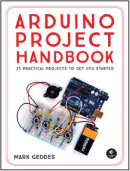
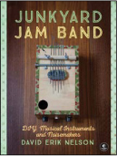
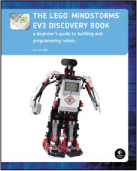
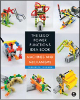
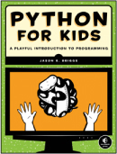

# 第十五章

**资源**

访问 *[`www.nostarch.com/electronicsforkids/`](https://www.nostarch.com/electronicsforkids/)* 获取更新、勘误和更多信息。

**更多适合好奇孩子的智能书籍！** 

**Arduino 项目手册**

**25 个实践项目带你入门**

*作者* MARK GEDDES

2016 年 6 月，272 页，$24.95

ISBN 978-1-59327-690-4

*全彩色*

**废品乐队**

**DIY 音乐乐器与噪音制造器**

*作者* DAVID ERIK NELSON

2015 年 10 月，408 页，$24.95

ISBN 978-1-59327-611-9

**制造者的丧尸末日指南**

**使用简单电路、Arduino 和树莓派防守你的基地**

*作者* SIMON MONK

2015 年 10 月，296 页，$24.95

ISBN 978-1-59327-667-6

**乐高^® MINDSTORMS^® EV3 发现书**

**构建和编程机器人入门指南**

*作者* LAURENS VALK

2014 年 6 月，396 页，$34.95

ISBN 978-1-59327-532-7

*全彩色*

**乐高动力功能创意书，第 1 卷**

**机器与机制**

*作者* YOSHIHITO ISOGAWA

2015 年 10 月，324 页，$24.95

ISBN 978-1-59327-688-1

*全彩色*

**儿童 Python 编程**

**编程的有趣入门**

*作者* JASON R. BRIGGS

2012 年 12 月，344 页，$34.95

ISBN 978-1-59327-407-8

*全彩色*

**800.420.7240 或 415.863.9900 | sales@nostarch.com | [www.nostarch.com](http://www.nostarch.com)**
