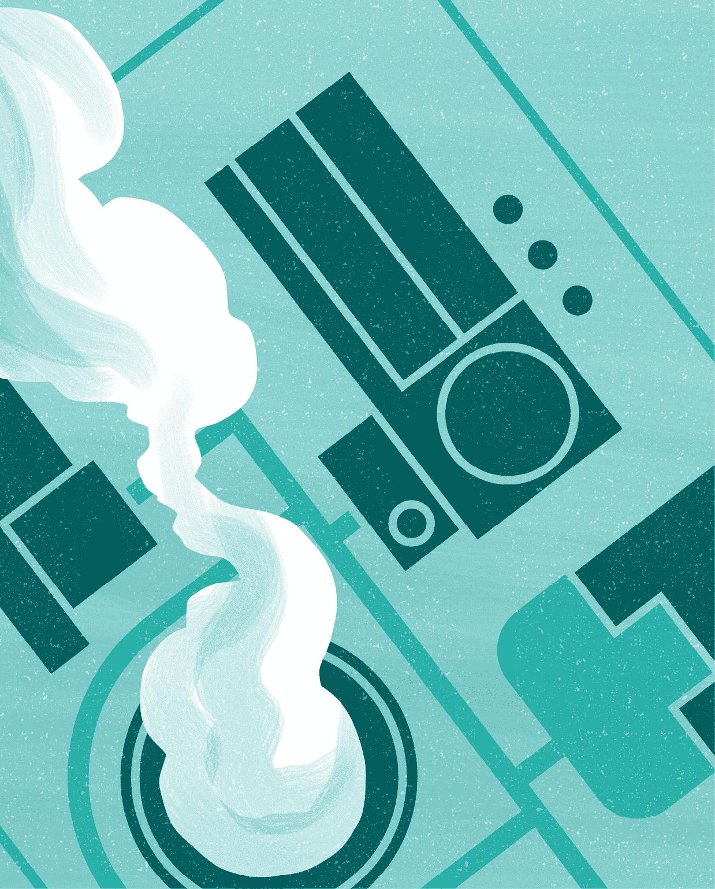
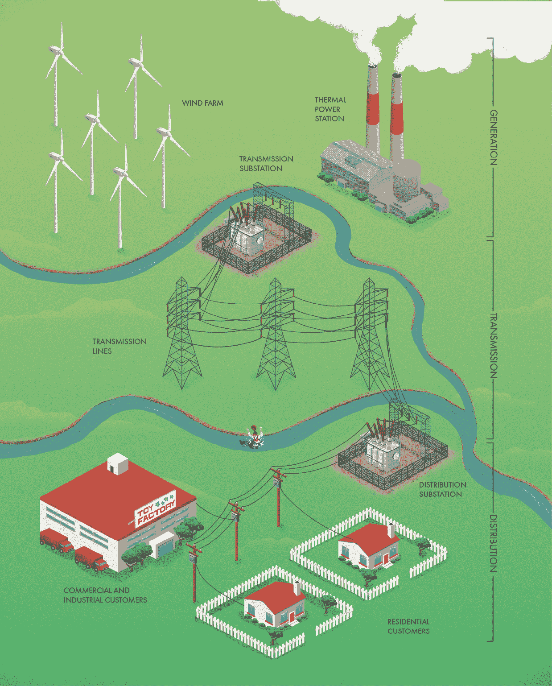
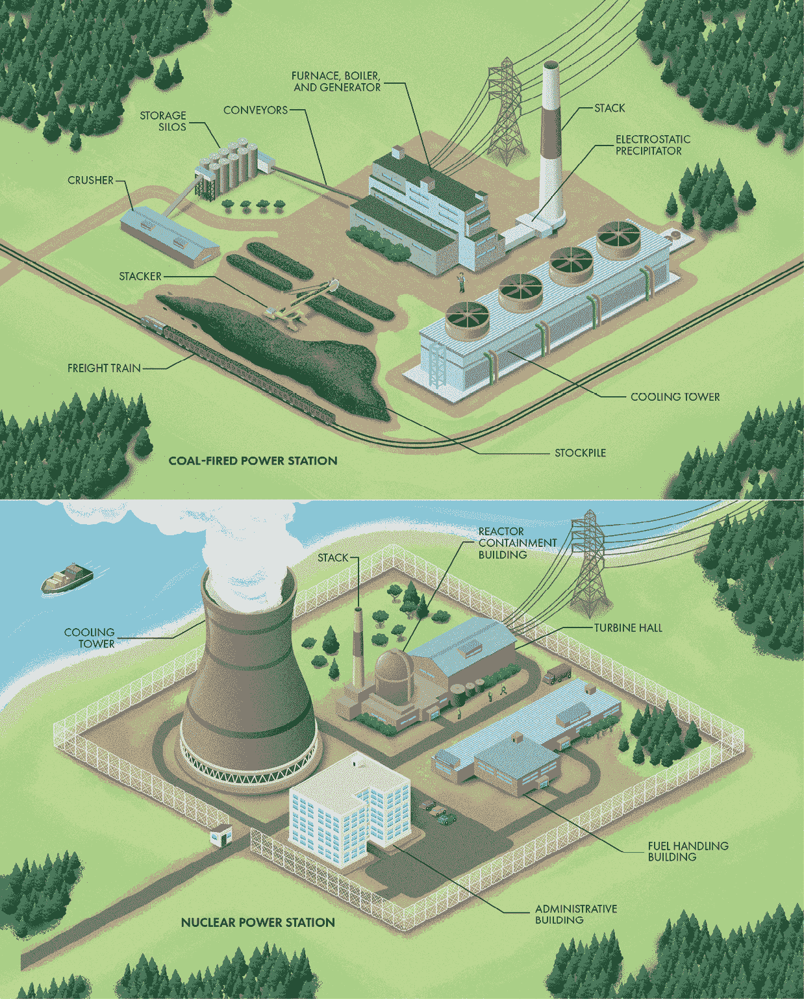
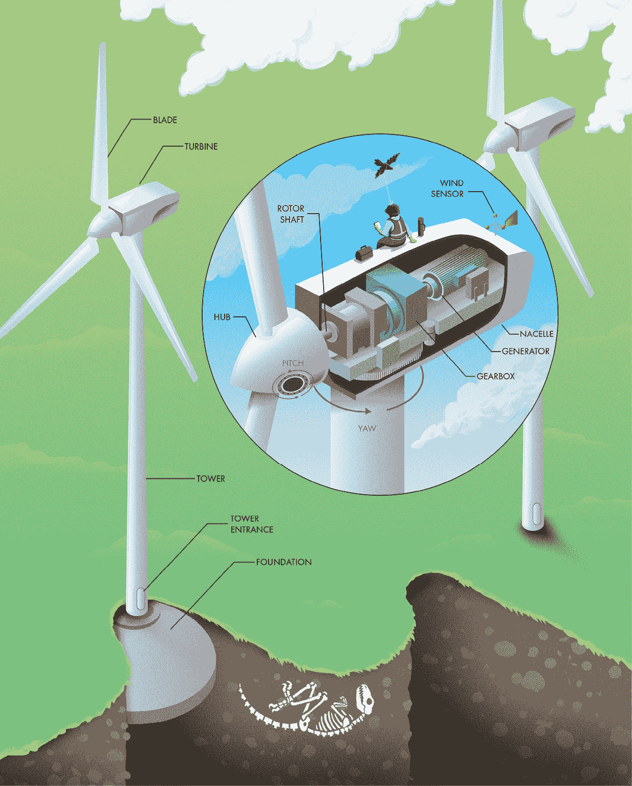
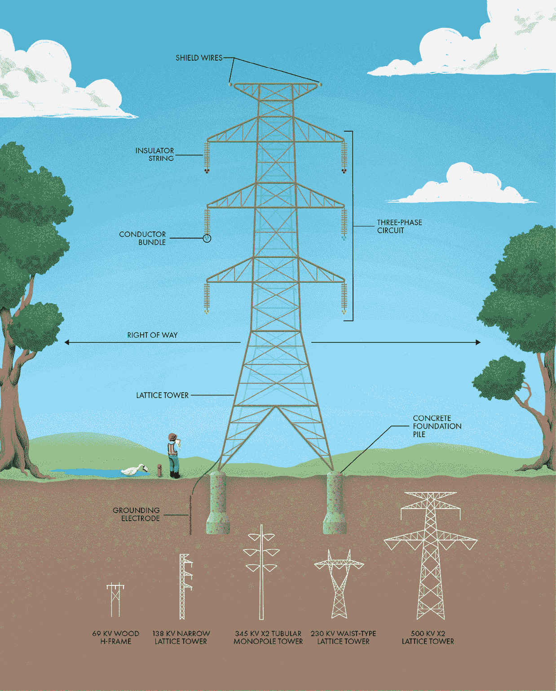
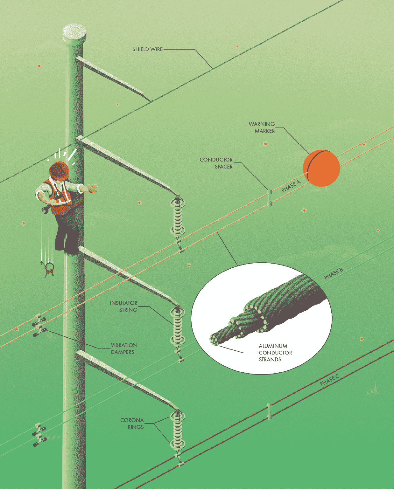
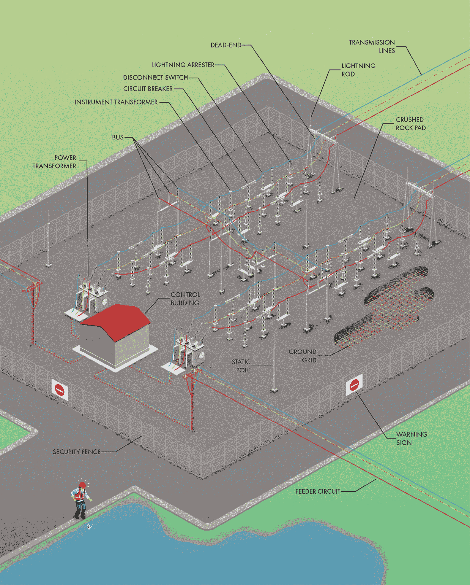
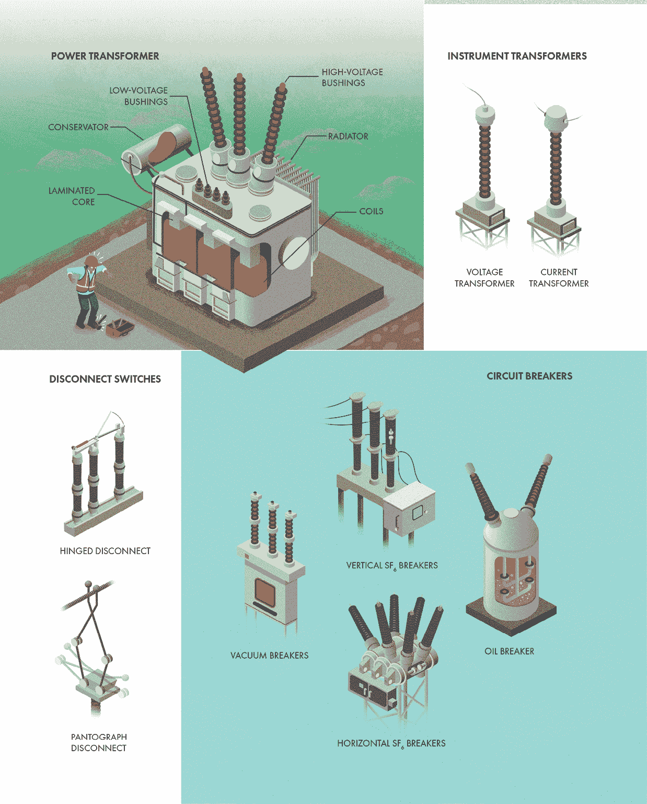
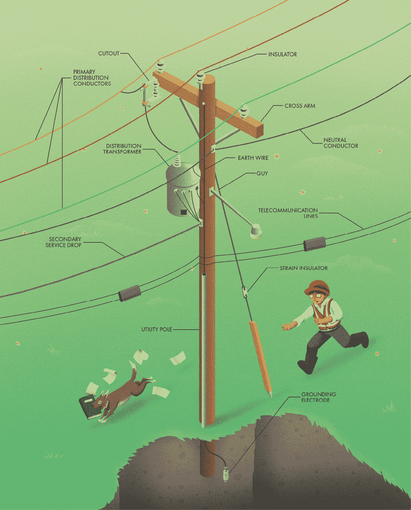
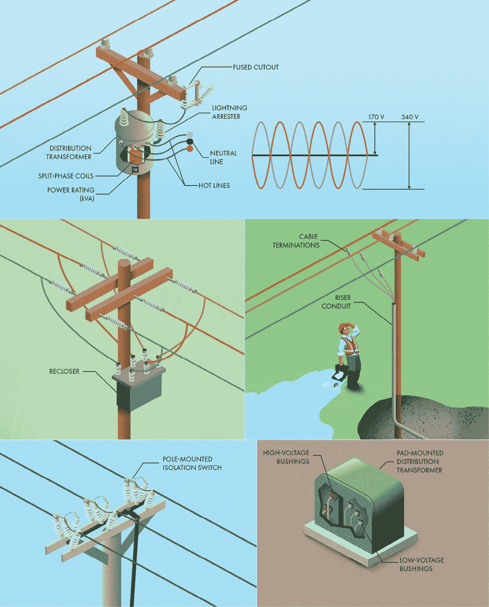

# 第一章：电力网

## 前言

驯服电力的力量是人类最伟大的成就之一。100 年前的奢侈品，现在已经成为几乎每个人的安全、繁荣和福祉的关键资源。在不久前，人力和马力几乎是唯一的动力来源。辛勤的工作是通过生物的力量完成的。难怪我们人类一直在努力掌控超越我们身体的能量。如今，“能源”赋予了当代世界几乎每个方面的生命，从我们最基本的生理需求到最尖端的技术。

根据能量的利用、储存、分配和使用方式，能源可以呈现多种形式。在地球上，我们几乎可以追溯到所有的能源都源于太阳。风和海浪是由地球大气的加热产生的。太阳光可以直接利用。甚至像汽油这样的化石燃料也来自太阳。史前植物通过光合作用捕获了太阳能，并在数百万年后被埋藏，最终通过井口开采，提炼并在发动机中爆炸，将太阳的热量（以及许多其他有害副产品）再次释放回地球。人类为方便和实际需要，将能量从一种形式转化为另一种形式，但没有任何形式的能源能与电力相提并论，它使几乎每个人都能拥有个人的电力来源。

## 电力网概述

电力与所有其他类型的能源截然不同。我们无法将其握在手中，也无法直接看到它。然而，它可以几乎瞬间完成惊人的工作——从物理壮举到计算——而且效率极高。电力不像燃料那样是能源的有形体现，它以一种更为短暂的形式存在，仅需通过金属导线连接即可进行传输。从一个地方到另一个地方的简单移动，催生了*电力网*，一个庞大的、互联的电力生产者和用户网络。为了更好地理解其规模，整个北美仅有五大主要电网，而世界上许多最大的电网跨越了多个国家。

一般来说，电力通过电网分为三个部分的离散步骤：发电（电力生产）、输电（将电力从集中式发电厂输送到人口密集区）和配电（将电力送到每个用户）。变电站作为主要部分之间的连接点。建立这些大型互联网络可以一次性解决许多挑战。让更多的用户和生产者共享昂贵的基础设施创造了效率。因为电力可以通过多种不同的路径到达每个地点，并且如果某个电厂出现故障，其他电厂可以替代，因此可靠性提高。最后，互联互通有助于平滑电力流动。

与其他公用事业不同，电力在大规模存储方面相当具有挑战性，这意味着电力必须在同一时刻进行发电、运输、供应和使用。流经你家或办公室电线的电力，几毫秒前可能还只是太阳能电池板上的阳光、一个铀原子，或者蒸汽锅炉中的一块煤或天然气。单个家庭使用的电力可能非常零散。能将更多用户连接在一起，就能使每个人的用电高峰和波动平均化。

让一个巨大的、适用于所有类型电力用户和生产者的统一电网正常运作并非易事。你可以将电力网想象成一列上坡的货运列车，机车代表发电，货物代表电力需求。所有机车必须完美同步才能共同承担负荷。如果某一台机车比其他机车慢或快，就有可能导致整个列车出故障。更具挑战性的是，电网的需求随着时间不断变化，像地形中的山谷和丘陵一样。电力消费者随意开启和关闭电器，电力公司没有任何通知。需求在白天达到高峰，尤其是在炎热或寒冷的日子里，许多人使用空调或取暖器。为了避免*电压下降*和*停电*，发电必须不断调整，以匹配电网的电力需求。这个过程称为*负荷跟随*，就像机车调整油门来应对沿途的坡度变化。

电力用户的用电方式各不相同。商业和工业用户根据电价的波动调整用电量，通常会在夜间运行机器以利用更便宜的电能。住宅用户（通常支付固定价格）则可能不太关注电网需求的波动，而是在最方便的时候使用电力。

类似地，不同类型的发电厂能够以不同的方式发电。太阳能电厂白天阳光充足时产生大量电力，但夜晚则不产生。风电场根据天气条件发电，风力强且稳定时产量最高。核电厂稳定产生电力，几乎不能调整产量，而煤炭或天然气等其他热电站可以根据需求变化调整产出。水电站反应最灵敏，通常能在几秒或几分钟内启动和停止发电。

网格管理人员进行详细的发电和需求预测，以确保能够在两者之间保持平衡。他们必须考虑何时安排电厂和输电线路的停机进行维护，并在设施由于损坏或其他问题而无预警离线时迅速调整。他们希望一切顺利，但为最坏的情况做准备，考虑整个电力生产者和用户组合的能力和限制。如果最坏的情况发生，电网管理人员将需要暂时断开部分客户（称为*负荷 shedding*）以减少需求，避免全面崩溃。通常这些断开会以每 15 到 30 分钟滚动的方式进行，以分散服务中断的不便，因此通常被称为*滚动停电*。

生成、传输和输送电力需要许多类型的设备覆盖广阔地区。令人惊讶的是，大多数基础设施都在公开区域，任何人都可以查看。许多时候，我被指责把头埋在云端，其实我只是在观察电杆顶部的某些东西。无论你身处何地，你都可以检查和识别电网的几乎每个重要部分。本章的其余部分将更详细地介绍电网的每个部分及其所需的设备和过程，以确保电力流动。

## 热电站

*发电*是电力在电网中旅程的第一步，这个过程可能需要几百或几千英里，但几乎是瞬间完成的。虽然大多数人家后院里没有电厂，但我们与每个接入电网的电厂都有直接的联系。电厂种类繁多，各有其独特的优缺点，但它们都有一个共同点：它们从自然环境中收集某种能量，并将其转化为电能供电网使用。我们用来发电的许多方法其实只是不同的蒸汽加热方式。采用这一方法的电厂被称为*火力发电厂*，因为它们依靠热量产生蒸汽。蒸汽通过涡轮机，涡轮机与连接电网的交流发电机相连。涡轮的转速必须与电网的频率精确同步。

大多数电厂都是复杂的工业设施，禁止游客进入。事实上，要小心不要在附近可疑地徘徊，因为许多电厂都受到严格的保卫！不过，你仍然可以在高速公路或飞机窗外定期看到它们，只需留意那些大规模的高压输电线路和标志性的高烟囱。还要特别注意大城市外的湖泊，因为它们有时作为电厂的冷却水源。本书并未深入讨论火力发电厂的工作原理，但从外部观察到的部分和组件是非常有趣且令人满足的。

我们的大量电力源自化石燃料（主要是煤或天然气）。随着其他燃料的成本降低，且更为环保，燃煤电厂正在变得不那么常见。然而，煤炭依然占据了整体电力生产的很大比例。如果你发现了一个燃煤电厂，你立刻就能知道，因为大多数可见的基础设施都与处理煤炭本身有关。这些电厂每天处理并燃烧成千上万吨的煤，因此它们需要大量的设备来卸货、储存、粉碎和运输煤炭到炉子和锅炉。

除非电厂位于煤矿旁边，否则高效运输如此大量的煤炭的主要方式是通过货运列车。复杂的铁路系统通常围绕这些电厂，确保煤炭的频繁和高效运输。当铁路不可行时，卡车和驳船有时也用于煤炭运输。煤堆取料机是巨大的可移动输送带，用于大宗煤炭的处理。它们在轨道上行驶，通过吊臂整理并堆积煤炭。电厂通常保持数周的燃料储备，以确保在供应暂时中断的情况下仍能继续运作。

不像你后院的木炭烧烤炉，大多数发电厂炉子燃烧的是一条不断的细煤粉流。煤以大块交付，因此从储存堆到破碎机的煤必须经过破碎以提高燃烧效率。在燃料处理的每一步之间，大型覆盖的输送带运输煤。储存筒仓保护破碎煤免受自然影响。从那里，它最终到达炉子和锅炉。

*天然气发电站*（此处未显示）可以通过缺少这些煤炭处理设备来识别。供应这些电厂的天然气管道通常位于地下，隐藏在视线之外，这意味着天然气电厂通常在外部看起来更简单和更小。对于燃烧化石燃料的煤和天然气发电厂，从燃料燃烧产生的空气称为*烟气*，它可以携带像灰和氮氧化物这样的危险污染物。环境法规要求在释放到大气中之前，烟气必须摆脱其中最严重的污染物，因为它们对人类和动物有害。用于从烟气中去除污染物的许多不同设施包括使用织物过滤器的*袋式过滤器*、通过静电吸引捕捉颗粒物的静电除尘器，以及通过喷洒细雾来清洁空气、捕捉灰尘和灰渣的*洗涤器*。通过这些设施后，烟气可以通过烟囱释放。尽管这些高大的烟囱不直接清洁烟气，但它们通过将其释放到足够高的地方来分散在空气中有助于管理污染（因为稀释有时是污染的解决方案）。

一种类型的热电厂不依赖燃料的燃烧。相反，核电站依赖于放射性材料的精确控制**裂变**。这个过程发生在核反应堆中，通常在外部表现为一个带有圆顶屋顶的加压容器建筑。反应堆建筑通常有一层厚重混凝土的外部装甲，作为对自然灾害或破坏的预防措施。一个独立的燃料处理建筑通常用于接收、检查和存储核燃料。办公室和控制室通常位于行政建筑内，远离燃料和设备。核电厂有时也有一个烟囱，但不是用于释放烟气。在一些反应堆中，用于驱动汽轮机的水直接接触放射性燃料，这可能产生像氢和氧这样的气体，这些气体本身变得轻微放射性。在一些核电站中看到的高大孤立的烟囱允许安全排放这些气体。

## 风电场

*风电场*由多个涡轮机组成，它们捕捉风能并将其转化为电能。从某种程度上说，它们也是在收集太阳能，因为风流是由太阳加热和冷却大气层引起的。由于我们无法选择风的吹动时间，风电场的可靠性不如热能电厂。在有大量风力涡轮机的地区，电网运营商不仅需要依赖天气预报来预测电力需求，还需要预测电力生产。然而，与煤、天然气和铀不同，风是免费的，无论我们是否有涡轮机来收集它的能量，它都会吹动。利用这种资源是非常合理的，现代风电场已经成为我们能源组合中相对低成本、低污染的一部分。

风力涡轮机有各种各样的形状和尺寸，但世界各地的现代变种已经趋向于一种一致的、即刻可识别的风格。这个设计特点是：一个水平轴涡轮机安置在一座高大的钢铁塔上，配有三片纤细的复合材料叶片，通常为纯白色以提高能见度。如果你不太了解的话，可能会认为它们是点缀在景观中的现代艺术作品，既流线型又笨拙。塔通常被固定在一个庞大的混凝土基础上，埋在地下，几乎总是空心的，底部有一个入口供维修工人进出，并且有一条梯子通向涡轮机。这个基础的设计旨在防止塔在极端风力条件下倒塌。

公用事业规模的涡轮机通常额定功率为 1 到 2 兆瓦，但也安装了功率高达 10 兆瓦的机组。这足以为大约 5,000 个家庭提供电力！从外观上看，你可以看到涡轮机的轮毂与附着的叶片以及外壳（即涡轮机其他设备的外罩）。在外壳内部，有转子轴、齿轮箱、发电机和其他设备。

风力发电机的每个部分都旨在尽可能多地捕获风中的能量。发电机效率的一个重要因素是叶片旋转的速度。如果叶片旋转得太慢，风会从叶片之间的空隙中穿过，无法提供任何动力。如果叶片旋转得太快，它们会挡住风，减少能够收获的能量。我记得小时候参观风电场时，曾试图与叶片的影子比赛。我会一点一点地朝着叶轮的影子走，直到我能跟得上它的旋转速度。事实证明，当叶片的尖端速度大约是风速的四到七倍时，风力发电机最为高效。由于大型风力发电机的叶片较长，它们的旋转速度较慢，以保持叶片尖端的速度接近这一理想范围。尽管这些叶片在我小时候看来非常快，但为了高效运行并与电网的交流频率保持同步，发电机需要更快地旋转。大多数风力发电机使用齿轮箱将叶片较慢的旋转速度转化为更适合发电机的速度。

风力发电机在正对风向时效果最佳。旧式风车使用一个大尾翼来保持这种正确的朝向，称为偏航（yaw）。现代风力发电机使用安装在机舱顶部的风速传感器来测量风速和风向。如果风向发生变化，风标会指示电机调整风力发电机的偏航，使其重新对准风向。大多数风力发电机还包括调节每个叶片角度或俯仰（pitch）的方法。当风速过快，导致风力发电机无法高效运转时，叶片会被收起（即将叶片倾斜，使其边缘面向风），以减少对风力发电机的压力。你可能会想知道，为什么在风很大的日子里，或在风暴中，风电场中的所有风力发电机都停止了转动。在强风或紧急情况下，操作人员会施加机械刹车来停止旋转，防止设备受损。

风力发电机效率的另一个方面是叶片的狭窄形状。你可能认为更宽的叶片会捕获更多的风能，但考虑一下：如果能够从风中提取 100%的能量，空气就不会再有速度从叶片后方排出。这会导致空气“堆积”，并阻止新风继续驱动风力发电机。需要一些风的流动来持续为风力发电机提供新鲜的空气，这意味着永远不可能从风中提取所有能量。理论上，能够提取的最大效率（称为*贝茨极限*）大约是 60%。风力发电机的纤细叶片经过精心设计，以尽可能多地捕获能量，同时不至于过多地减缓气流。

## 传输塔

发电厂几乎总是位于远离人口密集区的地方。乡村地区的土地便宜，大多数人也不喜欢住在大型工业设施附近。将发电厂与城市保持一定的距离是合乎常理的。然而，在离需求地点很远的地方生产所有电力带来了一个运输挑战。你无法将电力装载到卡车上然后送到客户手中。相反，电力通过我们称之为传输线的电缆瞬间从生产者传输到用户。如果你曾经使用过延长线将电力输送到无法直接连接插座的灯具或设备，你可能已经对这个概念有一定了解。然而，要将这一操作规模化，用于从发电厂大宗电力的传输，就会遇到一些有趣的挑战。

用于电力传输的电线被称为导体，而没有任何导体是完美的。你可以在一端输入电流，但永远无法在另一端得到 100%的电流输出。这是因为所有导体都有一定的*电阻*，阻碍电流的流动。这种电阻将部分电能转化为热量，从而在传输过程中浪费了电能。发电是一个成本高昂且复杂的过程，因此如果我们要花费这么大的精力，我们希望尽可能多的电能能够真正送达到预定的客户。幸运的是，减少因传输线路电阻造成的能量浪费有一个技巧，但这需要了解一些电路的基本知识。

流经电路的电流有两个重要的属性：*电压*是电能的潜力（有点类似于管道中液体的压力），而*电流*是电荷的流动速率（就像管道中液体的流速）。这两个属性与通过线路的总功率相关。由于电阻造成的功率损失与线路中的电流有关，因此电流越大，浪费的能量就越多。如果你增加电压，所需的电流就会减少，以传输相同的功率，因此我们就是通过这种方式来解决问题的。电厂的变压器会在送电前提高电压，这样可以减少线路中的电流，最小化因导体电阻而浪费的能量，并确保尽可能多的电力能够到达另一端的用户。

这些高电压使电力传输更加高效，但也带来了新的挑战。高电压极其危险，因此导体需要远离地面上的人类活动。将高压传输线路埋在地下成本相当高，因此除非在最密集的城市地区，否则它们通常会被架设在塔架（也叫做*pylon*）上方。

在设计电力输电线路时有许多因素需要考虑，导致塔架的形状、尺寸和材料种类繁多。其中最基本的因素之一是线路的电压。电压越高，每相之间及地面以上所需的距离就越大。许多输电线路携带多个三相电路以节省成本，因此你可能会看到六相甚至九相电路。这幅插图展示了可以建造的独特形状和尺寸的塔架的一些示例。

通道宽度也很重要。在城市地区，土地更昂贵，因此用于输电线路的可用宽度可能比在农村地区小得多。较窄的通道意味着竖立安排导线而不是水平安排，增加了塔架的高度（和成本）。最后，还有审美考虑。我觉得输电塔很有趣也很美丽。然而，许多人认为这些塔架对景观构成了一种侵扰，并且有时被视为一种视觉污染。人们通常更喜欢单杆结构的外观，而不是它们的格构或 H 形等效结构。尽管单杆通常更昂贵，在人口稠密地区更常见，因为更多的人将不得不看到它们。

输电塔必须抵抗来自风力和电缆张力的重大荷载。它们的基础通常由深入地球的打桩混凝土组成。大多数塔架设计为悬挂结构，导线简单地垂直悬挂在绝缘子上。*悬挂塔* 无法承受来自导线的不平衡力。更强的塔架称为*张力塔*，放置在线路改变方向、跨越像河流这样的大距离或需要阻止导线断裂可能引发的级联崩溃的地方。区分悬挂塔和张力塔很简单：只需看绝缘子的方向。在悬挂塔上，它们大多是垂直的。任何其他方向都意味着导线中存在不平衡的张力，需要更强的塔架。

闪电是架空电力线的一大脆弱点。雷击可能会将巨大的高压电流通过电线传导，导致*电弧*（也叫*闪络*）和设备损坏。架空传输线通常包括至少一根非带电线路，沿着电塔顶部铺设。这些线路叫做接闪线，旨在捕捉雷电，以免主导线受到影响。杂散电压会无害地通过每个电塔的接地装置导入大地。如果你仔细观察，你常常会看到电塔底部有铜导线，这些导线连接到单独的接地电极或混凝土基础桩中的钢铁加固件。传输服务提供商偶尔会在接闪线的核心中包括一根光纤电缆，用于他们的通信网络。

## 传输线组件

与普通家庭延长线不同，传输线路不仅仅是一组电线。它们的巨大规模和高电压带来了许多工程挑战需要克服。为了使传输线既高效又具有成本效益，并且安全（既为维护人员的安全，也为公众的安全），衍生出了各种设备和组件。

当然，最重要的组件是导线本身。导体几乎总是由许多独立的铝丝制成。铝是一个很好的选择，因为它重量轻、不容易腐蚀，并且对电流的阻力较低。但是，如果你曾经捏过一个汽水罐，你就知道铝与其他材料相比并不特别强韧。传输导线不仅需要传输电力，而且它们还必须跨越每个电塔之间的巨大距离，并承受风力和天气的压力。当传输大量电流时，导线也可能变热。这个热量会导致导线下垂，因为金属导体会膨胀。如果下垂过多，导线可能与树枝或其他障碍物接触，造成危险的短路，甚至引发火灾。因此，铝电缆通常会用钢或碳纤维加固，以增强强度。

与家用延长线相比，另一个区别是高压输电线路的导体是裸露的。它们没有外部的绝缘外壳。为了防止电弧产生，所需的橡胶或塑料数量将使电缆重量和成本过高。因此，大多数高压线路的绝缘来自空气间隙，简单地保持导线和任何可能成为接地路径的物体之间的大量空间。你可以想象其中的挑战。导体不能没有支撑悬浮在空中，但它们接触到的任何物体都会变得危险带电。如果它们直接连接到塔架上，就会对地面上的任何人或物体构成严重危险（更不用说在每个相位之间发生短路）。因此，导体通常通过长的绝缘子串与塔架连接。

这些绝缘子的设计和施工至关重要，因为它们是导体和塔架之间的唯一连接。传统上，绝缘子由一串陶瓷盘（通常是玻璃或瓷器）制成。当绝缘子受潮或脏污时，这些盘片可以延长电流泄漏的路径，减少电力的外泄。由于这些盘片的尺寸在一定程度上是标准化的，所以通过计算盘片数量可以大致估算线路的电压：将盘片数量乘以 15 千伏（kV）。非陶瓷绝缘子越来越受欢迎，包括那些使用硅橡胶和增强聚合物制成的绝缘子。不幸的是，对于新的非陶瓷绝缘子，15 kV 每盘片的经验法则不再适用，因此你需要通过其他线索来估算线路的电压。

输电线路中使用的高电压可能会导致一些有趣的现象。例如，交流电会产生*表皮效应*，即大部分电流沿导体的表面流动，而不是均匀地通过整个面积。这意味着增加导体的直径并不总能相应地提高其输电能力。此外，线路上的电力可能会因*电晕放电*而损失，这是由于导体周围空气的电离作用。仔细听，你有时能听到电晕放电发出的噼啪声，特别是在露水清晨、暴风雨天气中，或在大气压力较低的高海拔地区。

由于这两种现象，高压传输线路的每个相位有时会采用由间隔物隔开的*束*状小导线，而不是使用一根大导线。较小直径的导线在传输交流电时更为高效，因为它们的表面有更多的区域供电流偏好流动，而束状导线的大直径则减少了电晕放电。估算传输线电压的一种方法是计算每个相位的束状导线数量。220 kV 以下的线路通常只使用一根或两根导线，而 500 kV 以上的线路则常常使用三根或更多。电晕放电通常发生在金属表面的锐角或边缘处，例如与绝缘子串的连接部位。在高电压传输线路上，或者在降水较多的地区，你可能会看到绝缘子上装有电晕环。这些电晕环将电场分布到更大的区域，消除了锐角和边缘，从而进一步减少了电晕放电。

风力会影响导线，导致振荡，进而造成损坏或故障。随着时间的推移，这种振动可能会使导线材料产生疲劳，或者在连接处造成磨损，缩短其使用寿命。更换导线是一项成本高昂的大工程，因此公用事业公司希望它们能够尽可能长时间地使用。通常会安装阻尼器来吸收风能，减少导线的长期损坏。小型导线使用螺旋阻尼器，而大规模线路则使用悬挂式阻尼器，也叫*斯托克布里奇阻尼器*。不过，并非所有风力都是不受欢迎的，它还可以通过为导线降温来带来有益的效果。导线通常在与绝缘子连接的部位加固，以增强这一关键部分的强度。

最后，并不是所有的人类活动都发生在这些危险电线下方的地面上。有时，电线上会附加称为警示标记的球体，以便让可能在操作高空设备或身处空中的人更加容易看到这些电线。你通常会在机场附近和水域上方看到这些标记。

## 变电站

如果你把电网看作一台巨大的机器，那么变电站就是连接各个组件的纽带。变电站原本是指小型电厂，*变电站*如今已经成为一个广泛的术语，指的是在电网中担任多种重要角色的设施。这些角色包括监控电网的运行，确保没有出现问题，转换不同的电压等级，以及提供故障保护。城市中最常见的变电站是*降压*设施，它将高压传输电压转换为较低且更安全的电压，以便在城市区域进行配电。

初看之下（有时即使仔细看很久），变电站看起来是一堆复杂的电线和设备。当我还是个孩子时，我曾以为它们是游乐场（这让我的父母又喜又怕）。对于电网的新手来说，解开现代电气工程中这些迷宫般的复杂结构可能会很具挑战性，特别是因为支架和支撑结构与导体和母线装置看起来非常相似。识别带电线路和设备的最简单方法是寻找由绝缘子支撑的部分。最终，你将能够跟踪电流的路径，了解它如何流动。每个相的导体在插图中都有标出，帮助你追踪电流的流向。（下一节将进一步详细描述变电站中的具体设备及其功能。）

变电站通常是许多输电线路的终点。高压线路通过一个称为“死端”的支撑结构进入变电站，该结构提供支撑和间距。这些是唯一能够使超高压线路从安全高度降到地面的位置，因此需要额外的防护措施以确保线路的安全。

变电站的核心以及变电站中所有设备和装置之间的主要连接是母线，它由三根平行导体组成（每根对应一个相）。母线通常由刚性架空管道组成，沿整个变电站布置。变电站的整体可靠性依赖于母线的布局，因为不同的布置方案提供不同程度的冗余。发生设备故障或定期维护时，公用事业公司不希望停机整个设施，因此母线设计为在必要时绕过停运的设备重新导电。

变电站有高压侧和低压侧，它们通过电力变压器分隔开（将在下一节中讨论）。在降压设施中，电力以独立电路的形式离开变电站，这些电路被称为馈线。每个馈线都有自己的断路器，使得在发生故障时，可以将较小的客户群体与电网隔离。许多馈线从变电站地下铺设，之后在附近的电力杆上重新升起，供电给客户。

大多数变电站设备位于室外的开阔区域。然而，某些部件更容易受到天气和温度变化的影响，包括继电器、操作设备和一些断路器。这些更敏感的设备通常位于变电站的控制建筑内。与输电线路一样，雷电对变电站构成严重威胁。静电杆和避雷针突出在空中，以捕捉雷电并直接引导它们入地，从而保护昂贵的设备免受电涌的影响。避雷器也有助于应对雷电带来的破坏性影响。这些设备与带电线路连接，但通常不导电。避雷器仅在感知到电压剧烈波动时才会立即成为导体，安全地将多余的电流导入地下。

许多从外部可观察到的变电站特征与操作和维护设备的工作人员的安全有关。保护变电站设备和工作人员的最关键因素之一是确保流浪电流有地方可去。所有变电站都建有接地网，这是一系列相互连接的铜线，埋在地下。在发生故障或短路时，变电站需要能够通过这个接地网将大量电流引入地下，以便尽快跳闸。这个接地网还确保变电站及其所有设备保持在相同的电压水平，这个电压水平被称为*等势*。电流只会在不同电压势差的点之间流动，因此保持所有设备在同一电压水平可以确保触摸任何设备时不会让电流通过人体。每一件设备的外壳和支撑结构都通过接地网相互连接。

你可能会注意到，大多数变电站的地面上铺有一层碎石。这不仅仅是因为线务人员不喜欢割草！碎石具有自由排水的特性，不会积水，因此它提供了一层土壤上方的绝缘层，防止雨水形成积水。

对于大多数人来说，远离高压设施是常识，但尽管听起来疯狂，变电站却是窃贼盗窃铜线的常见目标。变电站被围栏和警告标志包围，以确保任何迷失的市民知道要远离。如果你仔细观察，会发现即使是围栏也有导线将它们连接到地下接地网，确保等势不仅延伸到围栏内的工作人员，也延伸到围栏外的任何人。

**

## 变电站设备

了解变电站内电力的布局和流动只是故事的一半。变电站由许多不同的单独设备组成，每个设备都起着重要作用。变电站观赏的乐趣就在于能够识别这些设备，并理解它们是如何工作的。

一个变电站最重要的工作之一是升压或降压；也就是说，转换来自输电线的更高电压（虽然更高效，但也更危险）和城市区域内较小线路的较低电压（较易绝缘，尽管仍然相当危险）。这一转换是通过电力变压器完成的，这是一种依靠电网交流电工作的设备，没有运动部件，而是利用*电磁学*的原理。变压器主要由两个相邻的线圈组成。输入电流的交流电产生的磁场通过由许多薄铁片组成的层压铁芯集中并引导。这些磁场耦合到相邻的线圈，感应出电压到输出电线中。变压器的输出电压与每个线圈中的线圈圈数成正比。变压器通常是整个变电站中最大和最昂贵的设备，因此很容易识别。

引导导体进出变压器的绝缘子称为套管。它们支撑着带电线路，通过金属外壳进入变压器，防止短路。你可以通过套管大小的差异，轻松判断哪条线路是高电压线路，哪条是低电压线路。电压越高，套管需要越大，以保持足够的距离，防止电弧发生。

尽管电网级变压器非常高效，但它们仍然会损失一些功率，转化为噪音和热量。如果你靠得足够近，肯定会注意到低沉的嗡嗡声，这是因为不断变化的磁场引起了变压器内部组件的振动。热量也源自铜线圈中的电阻，最终可能损坏变压器。变压器通常会填充油以帮助冷却。你可以在外部金属外壳上看到由风扇和散热片组成的散热器，帮助散热并保持油和组件的冷却。你甚至可能会看到变压器外壳顶部有一个较小的油箱（称为储油器），用于储存额外的油，并允许油液膨胀和收缩。

在变电站中，几乎每一条线路和设备在维护或修理期间都需要与其余带电系统完全隔离。通常会在设备的每一侧安装断开开关，原因就是为了这个目的。它们无法中断系统中的大电流，主要用于隔离设备以保障工人的安全。最常见的断开开关是电动操作型，由一个铰接刀片和一个静止接触点组成，两者都安装在绝缘子上。平移式断开开关通过剪刀状的动作上下升降，连接到母线。

有时，需要中断电力网某部分的电流流动。最常见的中断原因是由于故障，这可能会对昂贵且重要的设备造成重大损害。断路器提供了切断电流的手段，使得故障能够与系统的其他部分隔离开来。它们不仅保护电网上的其他设备，还使得问题容易被发现并迅速修复。然而，切断带电线路上的电流并不像听起来那么简单。只要电压足够高，几乎任何物质都可以导电，其中包括空气。即使你在电线上制造了断点来切断它，电流仍然可以通过空气继续流动，这种现象被称为*电弧*。电弧需要尽快熄灭，以防止断路器受损或工人处于不安全的环境中，这意味着所有高压设备的断路器都需要包含某种形式的电弧抑制装置。

对于低电压，断路器位于真空密封容器内，以避免电流在接触点之间通过空气导电。对于高电压，断路器通常被浸入充满非导电油或称为六氟化硫（SF[6]）的密集气体的罐内。另一种选择是使用强大的气流将电弧吹灭。所有断路器都连接到称为*继电器*的设备，能够在故障状态下自动触发。断路器也可以手动操作，以便在需要进行维护或在极端电力需求期间脱负荷时切断电路。由于许多故障是暂时的（例如雷击），一些断路器被称为*重合闸*，如果故障已经清除，它们会自动重新给电路供电。

继电器监控电网中的电压、电流、频率和其他参数，以识别问题并触发断路器，但我们不能直接将高电压输入到敏感的操作设备中。相反，特殊的变压器，称为仪表变压器，将导线上的高电压和电流转换为较小、更安全的水平，从而将其发送到继电器。仪表变压器是电力网的“眼睛”，监控着电网的状态，确保一切正常运行。虽然它们看起来相似，但有一个简单的方法可以区分它们：电压变压器的主绕组通常连接在一个相和地之间，因此你只会看到一个高电压端子。电流变压器的主绕组则与导线串联（即串联）连接，所以会有两个高电压端子。

## 典型的电力杆

在建成的世界中，几乎没有什么比电力杆更普遍的了，它在电网电力分配中扮演着至关重要的角色。*分配*描述的是电力网中将电力输送到各个消费者的部分。如果说输电线是电力的高速公路，那么配电线就是居民区的街道。它们通常从一个变电站开始，电力线（称为馈线）从变电站分散出去，连接到居民、商业和工业用户。在某些方面，配电几乎与高压输电相同，毕竟，电线就是电线。但在其他方面，它却有着惊人的不同。最明显的区别是，电压降低到更容易绝缘的水平，因此电杆和导线的高度也会相应降低。

在北美的大多数地区，木材是一种相对丰富的资源，因此它是构成大多数电力杆的材料。*防腐剂*用于处理木材，以减缓天气和昆虫对其的腐蚀。标准因地区而异，但正常高度的电杆通常埋入地下 2 到 3 米（6 到 9 英尺）。大多数电力杆都有自己的接地线，沿电杆下行，并连接到插入地面的电极。这根接地线为任何游离电流提供了一条安全路径，而不是让它们通过电杆本身流动，这可能导致触电或火灾。

直线排列的电杆只需要支撑电线上方的垂直重量，但如果电杆作为转角或死角的支撑点，它就会受到一侧的拉力。即使这种拉力不大，长电杆也像杠杆一样放大力量，将力传递到地面，从而可能导致电杆倒塌。每当电杆上的水平力不平衡时，就会使用拉线进行额外支撑。每根拉线都配备有应变绝缘子，以确保在发生事故时，危险电压不会传导到电缆的下段。

你在电力电杆顶部看到的主要配电导体（或*线路*）被认为是中压线路，通常电压范围从 4 kV 到 25 kV。带电线路很容易辨认，因为它们由绝缘子支撑。尽管它们的电压远低于输电线路，但主配电线路的电压仍然对家庭和企业使用具有危险性。配电变压器（在下一节中详细介绍）将电压降至最终水平——通常称为*主电压*或*次级电压*——供普通客户使用。连接每个客户到电网的次级服务接入线位于主导体下方。为了工人的安全，带电线路总是位于电杆的顶部，并且它们与其他通信线路（如电缆、电话和光纤）之间留有工作空间。有关通信基础设施的更多信息，请参见第二章，这些设施通常与配电线路平行布设在电力电杆上。

与输电线路的一个主要区别是，配电网中的导体数量从三根增加到四根。这是因为电力需求在配电网的三个相位之间的分配方式。所有电气电路都是回路，因此它们需要两条线路：一条供电，另一条将电流返回到源头。在高压输电线路上，三相之间的电力使用是完全平衡的，从而消除了电力的单独回流路径的需求。每对相位同时充当电源和回流路径。然而，在配电侧，这并不总是那么简单。许多电力消费者（包括大多数住宅）只使用单一相位。事实上，在配电网中，三个相位通常会被分开以服务完全不同的区域。看看一些住宅区，你可能会看到许多只有一根主导体且没有横臂的电杆。电网运营商会尽力安排配电线路，以确保每个相位的负荷大致相等，但它们从未完美同步。这些相位之间的不平衡要求使用一个中性导体作为电流回流路径。

电网的复杂性很大一部分源于我们在发生故障时如何保护它。电网之所以被称为“电网”是有原因的。它是一个互联的系统，这意味着如果我们不小心，小问题有时会扩展并影响到更大的区域。工程师们使用保险丝和断路器在每个主要电网部件周围建立保护区域，以便隔离故障并使其易于发现和修复。这些设备创造了“受控故障”，在保护整个系统的同时，你会失去一些服务（就像家里的断路器一样）。其目标是，当出现故障时，隔离设备能够加速修复过程，并降低修复成本，从而让客户尽快恢复正常用电。当电力中断时，很容易因不便而感到沮丧，但也可以考虑感谢它，因为这可能意味着电网正在按照设计运行，保护整体电网并确保快速、经济地修复故障。

## 电力分配设备

与电网的其他部分一样，电力的分配需要各种设备来确保可靠性和安全性。就像在变电站中一样，电力分配网中最重要的设备之一是用来改变电压的。尽管低于传输电压，但主要分配电路仍然在数千伏的高电压下运行，远高于大多数家庭和企业的安全使用电压。在大多数情况下，需要另一个变压器（称为配电变压器）来将电压降到建筑物中灯光、电器和其他设备通常使用的水平。这些变压器通常呈灰色圆筒状，位于公用电线杆下方。它们内部充满油，就像变电站中的变压器一样，工作原理几乎相同。

世界上许多地方有一个有趣的差异，就是配电变压器线圈的输出采用了分相设计。在这种配置中，两个带电（或热）线路供电给客户，同时有一根接地的中性导体。一个带电线路与另一个带电线路相反。这样，较小的电器可以使用线对中性电压，在北美大多数地区约为 120 伏标称电压（170 伏峰值）。需要更多功率的设备（如加热器、空调和烘干机）可以连接在两个带电线路之间，获得双倍的电压。在住宅区，单个配电变压器通常可以为多个家庭供电。看看你家外面，你可能会注意到你与几个邻居共用一个变压器。需要更大设备的客户（例如大型空调单元）可以利用电网中的所有三相电力。在这种情况下，你可能会看到三个单相变压器聚集在同一根电杆上。查看变压器侧面的功率额定值，以*kilo-Volt-Amperes*（*kVA*，大致相当于*千瓦*）为单位。

就像输电线和变电站设备一样，配电网也需要防护以应对故障和雷击。你在电杆顶部看到的大部分硬件都是在出现问题时使用的。一种常见的保护装置是熔断切断器，它既充当断路器，又充当隔离开关。熔断器自动保护服务变压器免受短路和电压浪涌的影响。如果熔断器中的电流过大，内部元件会熔化，断开电路并释放一个锁扣，允许熔断器门垂下。这些熔断器通常包括一个爆炸内衬，帮助熄灭内部形成的电弧，因此如果附近的熔断器跳闸，你可能会听到一声巨响。声音通常非常响亮，以至于许多人认为变压器爆炸了，而实际上它是通过熔断器得到保护免受损坏的。

即使切断装置中的熔断器没有熔断，线路工人也可以将其断开，以便隔离线路进行维护或修理。然而，熔断器是最简单的保护装置。更复杂的断路器偶尔也能看到，其中包括自动重合闸，它们通常装在小型圆柱形或矩形的容器中。自动重合闸在检测到故障时会打开，然后再闭合，测试故障是否已排除。电网中的大多数故障是暂时性的，例如雷击或小树枝与带电线路接触。自动重合闸能够保护变压器，无需工人更换熔断器来处理小故障。它们通常会多次跳闸和重合，再判断故障是否永久性存在，并最终锁定。如果你在短时间内断电并恢复供电，可能正是自动重合闸的作用。其他类型的隔离开关通常安装在电力杆顶，用于帮助线路工人进行维护或修理。许多隔离开关采用机制，一次性断开三相电。最后，和电网的其他部分一样，配电线路也使用浪涌保护器，将雷击等电压浪涌安全地引导入地面。

并不是所有的电网配电都是通过架空线路进行的。在许多城市的市区核心地带，你几乎看不见任何架空电线。相反，电力是通过地下管道传输的。此外，新的住宅区和商业开发通常选择将配电线路埋地下，以避免架空电线带来的杂乱无章的外观。使用地下配电线路并不是一个简单的选择，因为它们的安装成本要高得多，而且在损坏时修复时间通常更长。然而，这些线路能够更好地抵御天气的影响，并且不会影响城市景观的美观。即使不是完全地下铺设，配电线路也常常会在地下和地面之间切换，以避开架空的障碍物，甚至是为了避免遮挡标志。

尽管你看不到地下配电线路，但你通常能看到它们的起点和终点。你可以找到安装有大号上升管道的电力杆。地下电力线路必须有绝缘外套，以防止它们受到潮气和短路的影响。导体周围的绝缘层不能随便在某处开始或结束，因为湿气可能会从端部渗入。电缆终端（俗称*电缆头*）用于封闭绝缘电缆与裸电缆之间的过渡。

另一个地下电缆出地面的地方是变压器。虽然它比架空变压器不那么显眼，但地面安装的配电变压器仍然提醒我们，即使在没有架空电缆的地区，电网仍然存在。你可能好奇那些绿色的柜子里有什么。它和架空安装的设备完全相同。柜门提供了通往高低压套管的通道，就像你在杆上安装的变压器一样。
