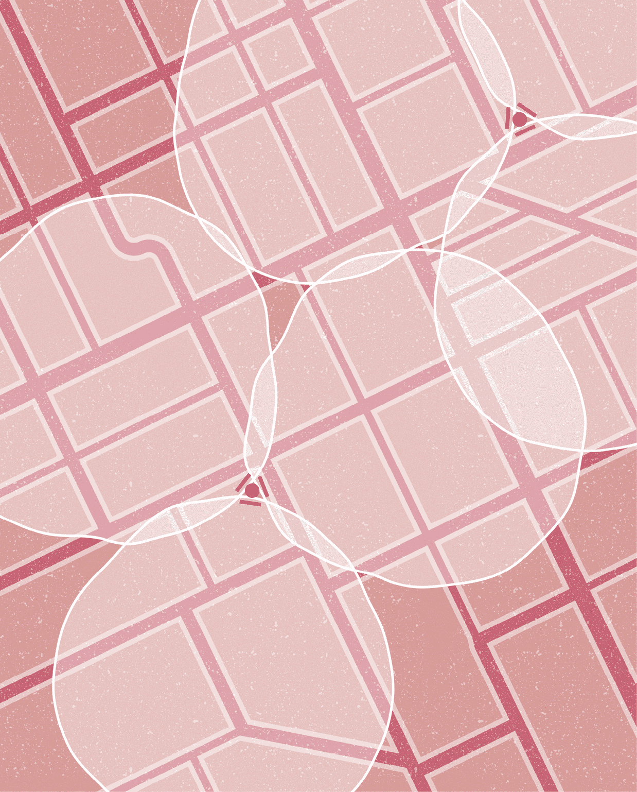
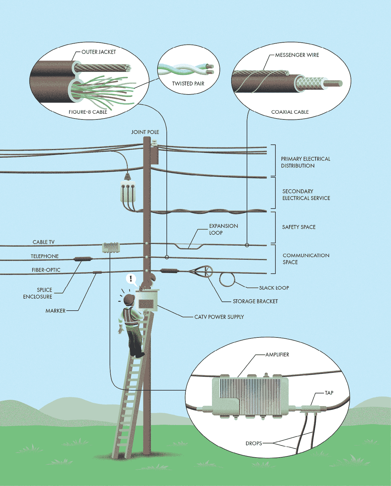
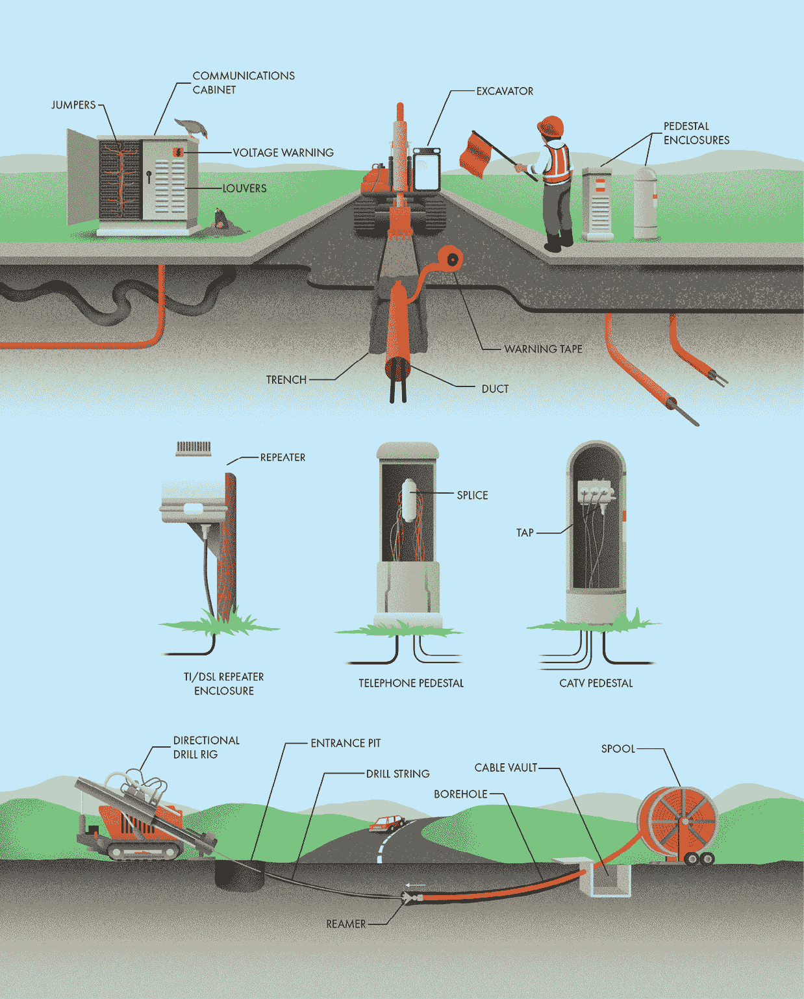
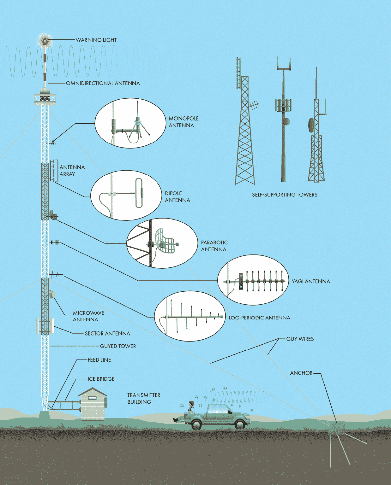
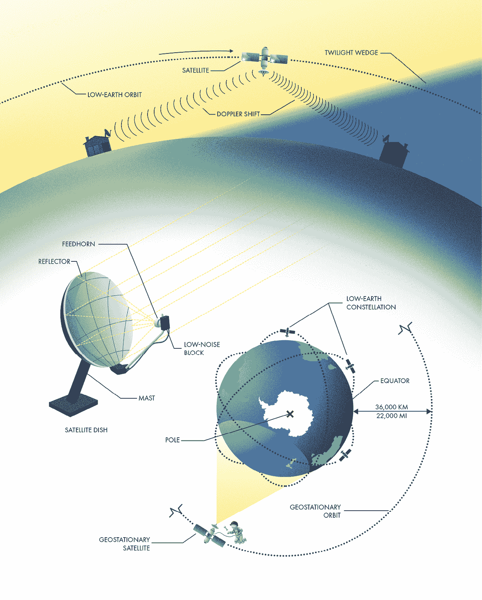
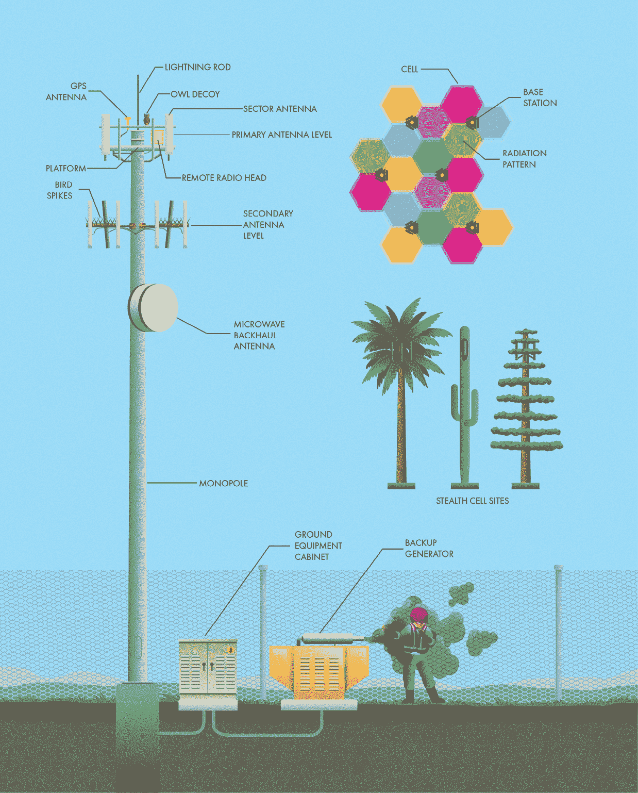

‌

# 第二章：通信

## 前言

通信并非人类物种独有，但电信则是。超出呼喊范围的信息共享需要大量的创新。人类历史上许多重要的发展都与跨越广阔空间传递和接收信息的方式有关。从烟雾信号、信鸽到 GPS 和互联网，电信深刻地塑造了我们的生活、工作和娱乐方式。

本章探讨了我们如何通过长距离发送和接收信息，最重要的是，探讨了使这一切成为可能的基础设施——至少在写作时如此。没有哪个社会领域变化得比我们的通信技术更快。在 10 年后，本章的内容可能显得过时；在 20 年后，这里描述的技术可能会让人认不出来。在信息时代，我们已经很容易把这样的系统视为理所当然，但在我们如何传递和共享知识、娱乐等方面，背后的工程依然有着迷人的细节。

## 空中电信

我们大多数的*电信*都是通过物理线路进行的，这些线路可以是金属电缆或光纤，这些线路基本上可以有两种安装方式，以避免与其他人类活动发生冲突：通过空中或地下（在某些情况下，水下也是一个选项）。本节将讨论前者，下一节将讨论地下安装。

空中通信线路几乎总是与其他公共设施一同架设在电线杆上。《第一章》介绍了电力分配的电线杆，但这并不是它们唯一的用途。联合电线杆是指多个公共设施共同使用的电线杆，并非每个联合电线杆都支持所有种类的设施，但无论电线杆上架设了什么线路，所有线路的位置都严格规定。主电力分配线路架设在电线杆的顶部，距离地面最远，因为它们具有最大的危险性。为客户提供服务的次级电力线路则直接位于其下方。电力线路和通信线路之间有一个安全间隔区域，专供公共设施工人进行连接和维护工作，避免暴露于高压线路的危险中。通信线路位于电线杆的最低位置，因为这些线路不构成触电危险，且需要更频繁的维护。

尽管许多不同类型的通信线路可以通过电线杆架设在空中，但只有三种类型的线路在标准电线杆上占据主要位置：电话线、同轴电缆电视线和光纤线路。在同一根电线杆上并排看到这三种线路并不罕见，如果你知道该怎么辨别，分清它们是很容易的。

跨越长距离架设电缆会产生显著的拉力，而大多数通信线路并不设计为支持其自身的重量，尤其是在它们从一个电线杆延伸到另一个电线杆时。相反，钢制的支撑线提供了所需的支撑。通信电缆通过绑缚固定在支撑线上，或者在 8 字型电缆的情况下，支撑线被并入到保护性外包皮中。

尽管构成*传统电话服务*（*POTS*）的铜线网络正在迅速被淘汰，但它们仍然可以在全球的电线杆上看到。自 1876 年以来，我们一直通过专用的铜线电路传输语音信号，这仍然是许多地方家庭或企业连接电话网络的最简单方式。每一条固定电话线路由一对扭绞的细铜线组成。由于每个家庭和企业都可以直接连接到*本地电话交换局*，因此电缆可能会变得相当庞大，有时包含数百或数千对电线。电缆在接头处汇集成更大更大的电缆，这些接头常常被电线杆附近黑色的接头盒所标示。

所有这些并排运行的电线自然会在电路之间产生电磁干扰和“串音”。然而，通过巧妙地将每一对电话线电缆扭绞在一起，解决了这个问题，因为不需要的干扰会均等地影响每一根扭绞对中的电线。所需的通信信号通过扭绞对两根电线之间的电压差传输，因此任何对两根电线共同作用的不希望出现的电压都会被消除。

另一种广泛使用的电信介质是有线电视网络（通常缩写为*CATV*）。尽管名字如此，大多数 CATV 网络除了电视节目外，还支持电话和高速互联网服务。像普通电话服务（POTS）一样，CATV 网络从一个中央位置开始，这个位置称为*头端*。从那里，信号主要通过同轴电缆分发，同轴电缆得名于其内部导体和周围的金属屏蔽层是围绕一个共同的轴心同心排列的。这些电缆能够携带高频无线电信号，且由于外部导体的屏蔽效应，信号损失非常低，干扰问题也很少。它们起初是大型的干线，向多个分配线路供电。放大器（也叫*线路扩展器*，其特点是有散热鳍片）沿着干线间隔放置，以增强信号。一个有线电视电源为大范围内所有放大器提供所需的电力。分配线路上的分接头允许连接掉线线，进而为每个单独的客户提供服务。CATV 的干线和分配线路因其扩展环而易于识别。这些环的存在是因为同轴电缆比较刚性，随着温度变化，其膨胀和收缩的速度与电线的传导线不同。如果没有足够的空间来应对热膨胀，它们可能会遭受过度的压力和损坏，甚至可能将自己从连接处拉出来。

现在，电缆和电话提供商通常将光纤电缆与铜线或同轴电缆结合使用，以分发更高质量和更可靠的信号。这些电缆利用一束束玻璃或塑料纤维以光脉冲的形式传输信号。由于光纤信号不受电磁干扰，它们可以在很远的距离上传输而几乎没有信号损失。电缆的外部有时会有橙色或黄色的标记或包覆，便于与电话或有线电视电缆区分。

光纤网络通常设计时会留出未来扩展的空间，通过预设更多的光纤。然而，这些电缆的一个主要挑战是它们很难进行拼接。与电气拼接所需的简单物理连接不同，光纤电缆需要更加小心，以避免光信号的散射或反射。每根光纤必须剥离、清洁、切割、对齐并精确连接，通常需要使用热量将它们熔接在一起。为了避免在梯子上或吊车中进行这种精细操作，许多公用事业公司更愿意在专门的*拼接车*中增加新的连接或修复光纤电缆。这意味着电缆需要足够的松弛量，以便将其降到地面，这些松弛的环通常存储在主电缆旁边。光纤电缆不能有急剧的弯曲或扭曲，这可能会折断光纤，因此存储支架（通常因其独特的外观被称为*雪鞋*）可以在不损坏电缆的情况下改变方向并储存松弛量。

## 地下电信

将通信线路埋设在地下，而不是沿着电力杆架设在空中，具有一些显著的优势。线路不需要支撑绳来承受杆上的重量。它们也不那么显眼，避免了在景观中增加视觉杂乱。最后，它们能避免受到鸟类、松鼠、风、冰雪、阳光以及偶尔车辆撞击电杆等一系列威胁。因此，地下通信线路通常更加可靠，尽管它们在安装时需要更高的初期成本。

地下公用设施通常放置在保护性管道中，这些管道的安装有两种方式：*开挖*或*定向钻探*。开挖是通过使用挖掘机在地面上挖掘一个线性孔（即沟槽）来完成的。管道被放置在这个孔中，然后用土壤回填。回填时会安装警示带，以标明电缆的存在，警示将来可能在周围挖掘的人。有些警示带甚至包括电线或钢带，以便从地面上探测到，使得以后更容易找到电缆。这种开挖方式的主要缺点是对表面设施的破坏。施工期间，该区域必须封闭，并且在回填沟槽后，人行道、道路和草坪需要修复。这些修复往往不如原始的耐用或美观。

定向钻孔通过在不挖沟的情况下将管道安装在钻孔内来减少地面上的干扰。这种方法对于穿越河流、拥挤的城市区域和关键道路特别有利，因为在这些地方使用挖沟方法不可行。地面上的定向钻机首先在入口坑和出口之间钻一个导向孔。工人使用钻杆上的感应设备和地面上的设备监控钻孔的路径。为了引导钻头，钻杆的前端是不对称的。它可以被调整到任何位置，并且在钻孔过程中，钻杆会自然偏向优选方向。一旦导向孔完成，钻杆会被收回并使用扩孔器扩大钻孔，同时将管道从卷轴中拉出，形成一个连续的电缆通道。

由于它们隐藏在地下，你无法像空中安装那样看到地下通信线路。然而，这些电缆最终必须露出地面，因此有很多机会可以发现它们。与地下设施相关的最简单结构是电缆井，它是一个地下的封闭空间，用于接入管道。井盖通常很显眼，通常是大矩形的，并且上面会标明有关内部设施的细节。

与地下通信相关的另一种结构是通信机柜。这些机柜位于地面上，可能包含多种不同类型服务提供商的设备，因此如果你想确切了解其中的内容，你必须像侦探一样进行调查。第一个线索是标签。有时，你可以在机柜上找到公司名称或联系信息，这些信息能提示里面的设备类型。通常，机柜作为简单的连接点，便于将高容量的主干或馈线电缆与朝向客户的较小分配电缆进行拼接。在这种情况下，机柜内安装有跳线设备，供技术人员连接有线电视、电话或光纤线路。

一些通信机柜内安装有*有源*（换句话说，就是有电的）设备。在这些情况下，外部通常会有电压警告标志，并且机柜上会有通风孔，因为这些设备通常需要通风散热。有源设备可能包括有线电视网络的电源设备或*光学节点*，它们将光纤信号转换为可以通过同轴电缆分发的无线电频率。

最后，这些机柜偶尔包含更为复杂的设备，使得电话线路能够以比直接连接到最近的中央交换机更高的速度和更高的保真度传输信息。这些设备被称为*远程集中器*，它们将单个电话用户的信号数字化，并将其合并为直接传输到中央交换机的光纤信号，从而使电话公司能够为更多的用户提供服务，并提供更高质量的语音和高速数据服务。

另一个地下通信线路的标志是基座。这些无处不在的外壳通常是终端点，提供了更大分配线路与向用户分布的小型电缆之间的连接，用于有线电视、电话或其他电信服务。它们通常包括一个接入面板或允许拆卸外壳，以便技术人员进行连接或排除故障。对于有线电视，它们可能包括一个分接器，以提供多个服务分支。对于电话，它们通常仅隐蔽电缆接头，其他没有太多内容。

另一个与地下设施相关的设备是中继器。*T1*和*DSL*是两种常见的高速数字信号，能够通过标准的铜质电话线路传输。然而，由于这些高速数字信号的频率相对于语音信号较高，它们不能在没有变得过度衰减或失真的情况下传输很远。在电话局之间距离较长的农村地区，这些线路需要中继器以保持信号的保真度。中继器通常被安置在像油漆桶或慢炖锅一样的防水外壳中。它们通常以规律的间隔出现在线路上，通常是每隔一两英里出现一次。

## 无线电天线塔

无线通信利用不可见的电磁辐射波携带信息跨越空间。这项简单却非凡的技术使得各种无线设备成为可能，从车库门开关到手机。如果人类能够感知电磁辐射的全频谱，我们将会被空中波段中流动的信息量和种类彻底压倒。

许多用于通信的频率，包括广播电台和电视台传输的信号，要求视距；发射器和接收器之间的路径必须相对不被遮挡。无线电信号通常无法超越地平线，这也是为什么许多*天线*安装在巨型塔的顶部（有时也称为*桅杆*）。它们越高，信号覆盖的范围就越广。天线塔是世界上最高的人造结构之一，许多塔的高度超过 600 米（约 2,000 英尺）。它们如此高，以至于常常对飞行器构成威胁，通常需要涂上橙白相间的条纹，并在顶部安装警示灯。这些塔在现代社会中发挥着至关重要的作用，支持着无线电和电视信号的广泛传输、紧急响应人员的通信等。

无线电天线塔可以有多种形式，但主要有两种结构类型（不包括高楼顶端的尖塔）：自立式和钢索式。自立式塔设计为完全独立承受风力，稳定性完全依靠自身。它们通常由钢或混凝土制成，底部宽大，以便提供足够的刚性以抵抗自然界的力量。自立式塔占地面积较小，因此在土地资源紧张的城市地区非常理想。然而，由于需要更多的材料来提供横向风载荷的稳定性，它们的建造成本比钢索塔更高。

钢索塔通常由一个纤细的格架结构组成，支撑着多根钢缆（钢索）。钢索塔之所以能够纤细，是因为它们不需要抵抗风力提供刚性。钢索提供了横向支撑，使得塔只需要支撑自身的重量。实际上，一些钢索塔的底部会逐渐变窄，这样任何微小的摇摆都只会导致转动，而不是塔身的弯曲或变形。钢索通常以等边三角形排列，以便无论风向如何，都能提供支撑。

钢索的固定方式有多种，取决于现场的土壤或岩石类型以及预期的负载。锚点通常由一个或多个深孔组成，孔内埋有钢杆，以形成与地球的刚性连接。由于钢索从塔基延伸得很远，钢索塔比自立式结构需要更多的空间。它们大多位于土地较便宜的乡村地区。

娱乐节目或其他信号通过广播发射机传送到塔站。发射机通常位于远离塔的环境控制发射机建筑内。对于 AM 广播电台，塔本身就是天线，塔基可能有一个调谐小屋，里面放置着从发射机到塔的电力传输所需的设备。对于 FM 和电视台，馈线（也称为传输线）将信号从发射机传输到天线，而天线则固定在塔结构上。在寒冷地区，馈线从发射机建筑到塔的水平部分会通过冰桥保护，防止掉落的冰雪损坏。*天线*是将信号辐射为电磁波的设备。由于塔的造价相对较高且非常显眼，它们通常由多个电台或其他用户（称为*共址*）共享。塔主会将发射机建筑内的空间和塔结构上的空间租赁给广播电台、电视台、警察和消防部门、政府机构以及各种私人公司，用于它们自己的无线通信系统。

与它们所附着的塔一样，这些天线可以根据信号的频率、方向和功率呈现各种有趣的形状。全向天线在所有方向上均匀地传输无线电波，通常具有圆柱形状。它们包括单极天线，这是一种需要接地平面（有时是地面本身，有时由放射状的水平导体组成）的直导电元件。双极天线是另一种全向天线，由上下排列的两个相同辐射元件组成。

*定向天线*将无线电波集中在特定方向上。抛物面天线使用实心或网格状的金属盘来反射并聚焦无线电波。八木天线利用一个带电的双极天线和几个非带电元件，将波集中到所需的方向。外观相似的对数周期天线则使用一系列长度略有不同的双极天线，用于发送或接收各种无线电频率。简单的天线元件，如双极天线，可以组合成阵列，共同工作，将波导向一个束状或特定模式。（其他一些天线类型，包括用于蜂窝电话服务的天线，会在另一部分讨论。）

像所有基础设施一样，天线塔需要定期维护。经过专门高空和电气危险培训的技术人员会对这些结构进行检查和维护。非常高的塔可能配备电梯，以便进行涂漆、修理和设备更换。较矮的塔需要技术人员爬到塔顶。

尽管用于无线通信的频率是*非电离*的（意味着这些波不能分裂原子），但这并不意味着它们不危险。电磁辐射可以在含水物体中产生热量，包括人体。（微波炉利用这一效应加热我们的食物。）这就是为什么在高功率传输的天线附近，公众的接触是受到限制的。维护这些塔的工作人员必须确保在靠近工作时，保持与带电天线的安全距离，或在工作前关闭天线电源，以避免不安全的暴露。

## 卫星通信

天线杆的高度有实际限制。最终，财务、工程和安全挑战使得建造更高的天线变得不可行。幸运的是，还有一种方法可以将天线送到高空。卫星是通过火箭将其送入环绕地球轨道的设备。它们是无线通信的顶峰，至少在传输范围上是如此。许多卫星能够同时从地球三分之一的区域发送和接收无线电信号，传输距离远远超过最高的塔。这些天，我们用卫星进行各种各样的通信，包括无线电、电视、互联网、电话、导航、天气、环境监测等等。用于通信的卫星本质上是中继器，接收来自地面某一位置的信号，并将其放大并重定向回地球上的其他地方。这种中继创建了一个不需要通过电缆连接的通信通道，并且不像地面天线那样受到地球曲率的限制，能够更远距离传输。

通信卫星可以放置在环绕地球的多种轨道中。卫星的轨道速度与其*高度*直接相关。轨道越高，绕地球一圈的时间越长。低地轨道的卫星每天绕地球多次，因此它们只会在特定位置的上空停留短时间。为了保持持续服务，需要一组在重叠轨道上的卫星，称为星座。每颗卫星都被战略性地放置，以确保地面上的任何位置在任何时候都有至少一颗卫星在视距范围内。低地轨道卫星传输和接收所需的功率较少，而且通信延迟较小，因为它们离地面更近。它们也不需要大型天线来接收信号。事实上，你可能随身携带着一根天线，它经常与低地卫星进行通信：就是你手机里的*GPS*天线。然而，低地卫星必须考虑到多普勒效应。由于卫星相对于地面观察者的移动速度非常快，射向天线时，电波会被压缩，而当卫星从上空经过时，电波则会拉伸，这使得接收和解码信号的任务变得更加复杂。

在大约 36,000 公里（22,000 英里）的高度，卫星的*轨道周期*是 24 小时，正好等于一天的长度。处于这个高度、围绕地球赤道运行的卫星处于静止轨道，因为它随着地球的自转，始终保持在天际的固定位置。尽管将卫星发射到如此高的轨道需要相当大的努力，但静止卫星具有一些显著的优势。由于它们相对于地面不移动，因此天线可以固定安装，简化了设计。静止卫星的覆盖范围也大得多，因为它们的视距覆盖了地球约 40%的范围。只有地球的极地地区难以从这种轨道上到达。

静止卫星的一个限制是，它们被限制在一个环形区域内（称为*克拉克带*），这个区域位于地球赤道上方。为了避免卫星之间相互干扰，国际电信界达成一致，规定在这一环形区域内分配各个位置（称为“槽位”），就像房地产 parcel 一样。静止轨道已经如此拥挤，以至于有了等待名单。一旦卫星的使用寿命结束，它必须离开自己的槽位，以便替换卫星或等待名单上的新卫星可以取而代之。

静止卫星的另一个缺点是它们离地球的距离较远。跨越如此巨大的距离发送和接收无线电信号是一个主要挑战。用于克服这种距离的天线非常容易辨识。卫星天线盘使用一个弯曲的反射器来收集微弱的无线电信号，并将它们聚焦到馈电喇叭中。这个金属圆锥将信号波传输到低噪声块中，这个低噪声块是卫星天线的核心，包括执行两个主要功能的电子电路。首先，它将微弱的无线电信号放大到更可用的水平。其次，它将用于长距离无线传输的高频信号*下变频*，转换为可以通过电缆高效传输的较低频率信号。

向静止卫星发送信号的天线通常要大得多，但基本原理相同，配有用于放大和转换频率的设备以及反射器，将信号引导到天际正确的位置。支撑天线盘的杆可以固定在一个永久安装的支架上，或者根据是否与一个或多个静止卫星通信，安装在一个带有电动追踪功能的支架上。

有些卫星足够大且具有足够的反射性，在夜间可以从地面看到。事实上，随着如今有如此多卫星绕地球运行，观察卫星已经成为一种流行的爱好。许多网站会追踪卫星轨道，并提供关于卫星何时、何地可见以及它们在天空中的亮度的预测。这种亮度来自于太阳光反射到卫星的太阳能电池板或光滑表面后，再反射到地球上，这就是为什么卫星在日落后或黎明前的几个小时内最为可见的原因。在这些时刻，天空由于地球的阴影变暗（有时被称为“暮光楔形”），但太阳仍然足够接近地平线，可以照亮高空中的物体。绕地球运行的最著名卫星——国际空间站，也是最大且最显眼的。在世界大多数地方，你至少每月可以看到这项现代工程的壮丽景观在夜空中飞驰几次。这是一个壮观的景象。

## 蜂窝通信

大多数无线通信涉及的是单向广播信号（例如，AM 和 FM 广播）或有限小组之间的双向传输（如警察调度网络）。用于不同“频道”通信的电磁频谱的可用频率是有限的。除此之外，不同的无线电信号用户之间对这些有限频段的竞争也很激烈，包括公共安全组织（如警察和消防部门）、军事、航空交通管制、电视和广播电台等。为大众提供无线电话和互联网连接是一个重大的工程挑战。在仅限的频率范围内，无线通信运营商已经创新出将任何移动设备连接到电话网络和互联网的方法。使这一切成为可能的基本创新是将大范围的服务区划分成较小的单元——因此得名“蜂窝通信”。

尽管将通信天线安装在高塔顶部，以覆盖尽可能大的区域似乎更经济，但这只能同时提供少量连接（每个频道一个连接，位于可用的无线频段内）。相反，运营商在地形上安装了许多较小的天线，分布在各个位置，为可管理的客户群体提供服务。这种策略使得即便只有几百个频道，也能支持每天数十亿次的无线传输，因为非相邻的蜂窝可以重复使用相同的频道（图示中的不同颜色表示）。每个蜂窝服务运营商都会建立自己的蜂窝网格，提供几乎所有区域的覆盖，除了人迹罕至的地区。尽管理想化为规则的六边形网格，但每个蜂窝的大小和形状是由地形、天线安装位置的可用性以及特别是服务需求来决定的。人口密集地区的蜂窝较小，而农村地区的蜂窝则可以更大。

所有这些蜂窝的创建在地形上留下了基地站的印记。基地站（也称为*基站*）具备为一个或多个无线蜂窝提供服务所需的所有基础设施，通常包括塔、天线、放大器、信号处理设备、与网络的回程连接，有时还包括电池或备用发电机以应对停电情况。

用于安装天线的无处不在的塔是常见的景象。在城市环境中，它们通常是单极塔或格架结构。信号处理通常在靠近天线的远程无线头设备中进行，有时无线设备则位于地面的设备柜中。避雷针可以保护敏感设备免受雷击。天线还需要一些防范措施来防止野生动物造成损害。如果你仔细观察，会发现有各种富有创意的方法应对这一挑战。最常见的是捕食性诱饵（通常是猫头鹰），它们可以把鸟类赶走，或者是塑料鸟刺，使得鸟类难以在天线上爬行或栖息。你还可能注意到塔上有一个 gps 天线。这种天线通常呈蛋形，能够从天上的卫星收集精确的时钟信号，这对于同步信号处理设备是必需的。

然而，基站并不总是独立的塔。留心在城市地区，你会发现几乎任何高大的建筑物上都有天线，包括楼房、水塔、公共设施杆甚至广告牌。事实上，围绕着出租通信基站空间形成了一个高度发展的经济体，其中包括中介、投资公司以及其他传统房地产市场的参与者。通常，为了节省成本并减少这种显眼基础设施对景观的影响，运营商会共享塔或建筑物。你会经常看到同一座塔上有两层或更多的天线。另一种减少通信塔显眼度的方法是将其伪装成更自然的形态，比如树或仙人掌。这些所谓的隐形基站，有些比其他的更具隐蔽性。

如今，几乎随时都能看到一组用于发送和接收移动设备信号的矩形扇区天线。这些天线具有高度的定向性，以保持小区之间的清晰边界，通常针对 120 度的地面区域。某些塔顶上的三角平台使天线可以同时为三个小区提供服务，每个天线都会精确调整角度，以避免与邻近小区的信号干扰。你可能会注意到一些天线被向下倾斜，以减少信号超出小区边界的传播。每个天线扇区的辐射模式大致是圆形的。当考虑到为了在设备从一个小区移动到另一个小区时需要的数字切换重叠时，最终形成的大致是六边形网格。

每个基站与核心网络的连接称为*回程*。在大多数情况下，移动通信基站的回程是通过光纤电缆连接到最近的交换中心。在无法安装光纤的情况下，运营商可以使用无线回程。你偶尔会在手机塔上看到的圆形突出物，其实是高容量微波天线。保护外罩下是类似于卫星发送和接收信号用的抛物面天线。这些天线具有定向性。如果你能够直视其中一个天线的中心，你会看到它的另一端安装在远处的塔上，直接朝向你。

移动通信基础设施可能是本书中发展最快的主题之一。最初作为提供移动电话服务的手段，现在已成为许多人访问互联网的主要途径。语音通话已成为手机的次要功能，甚至很多人更喜欢称其为“设备”而非“电话”。随着越来越多的设备获得互联网连接（通常称为*物联网*），对高速无线服务的需求预计只会增加。无线运营商将不得不继续创新，这意味着今天的移动通信基础设施可能与明天的面貌大不相同。
