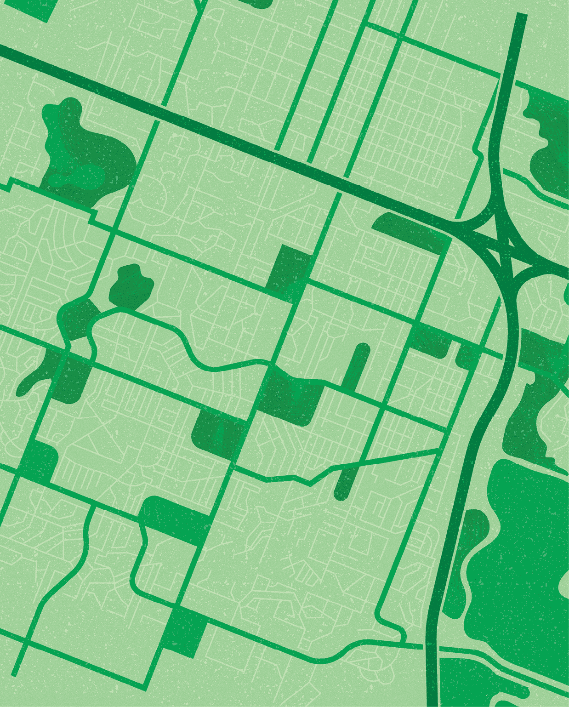
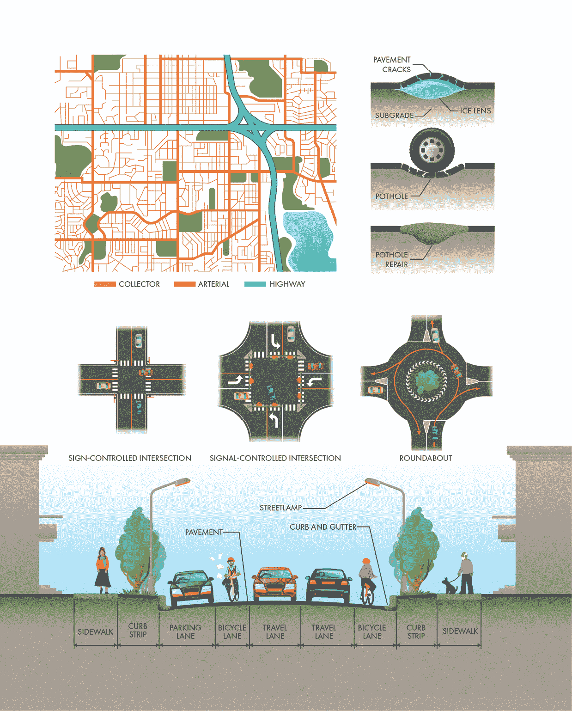
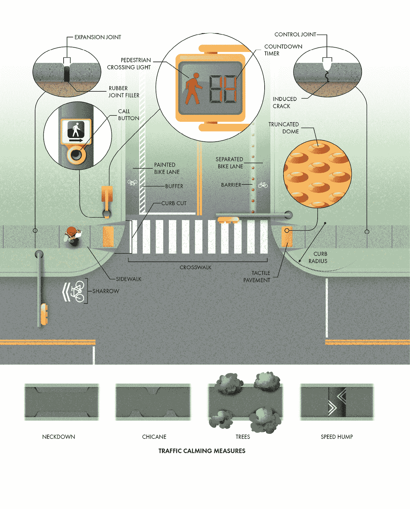
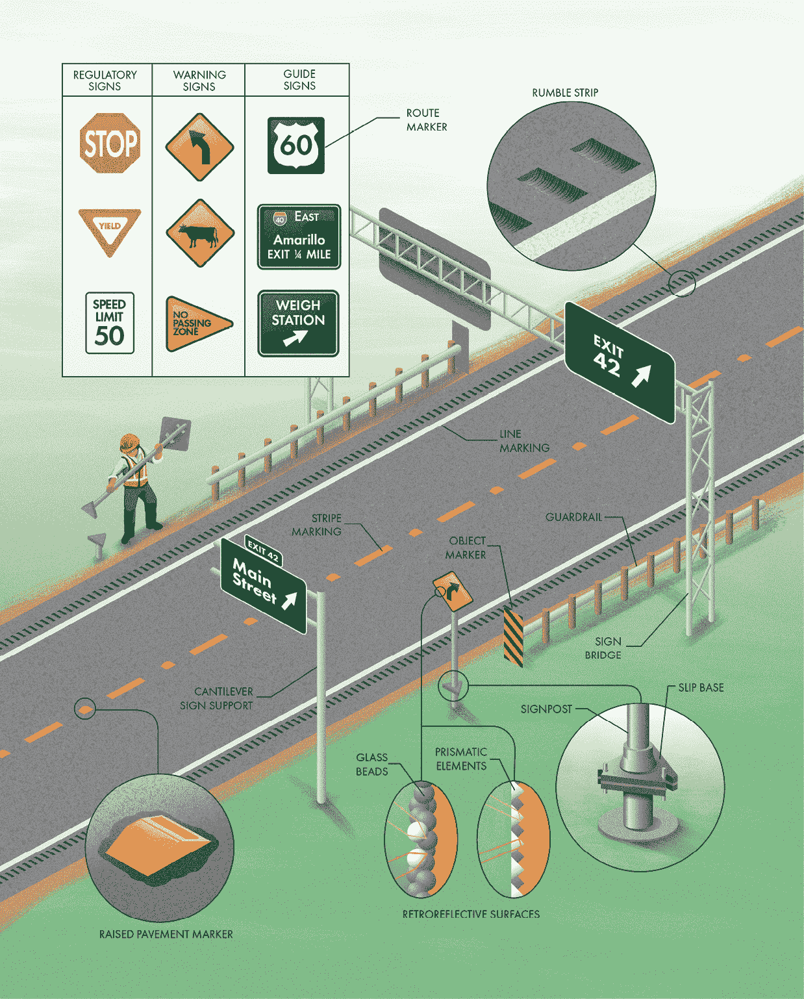
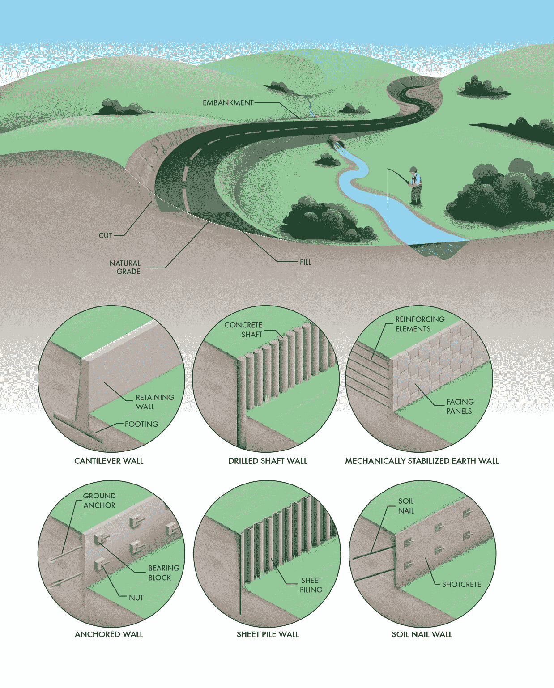
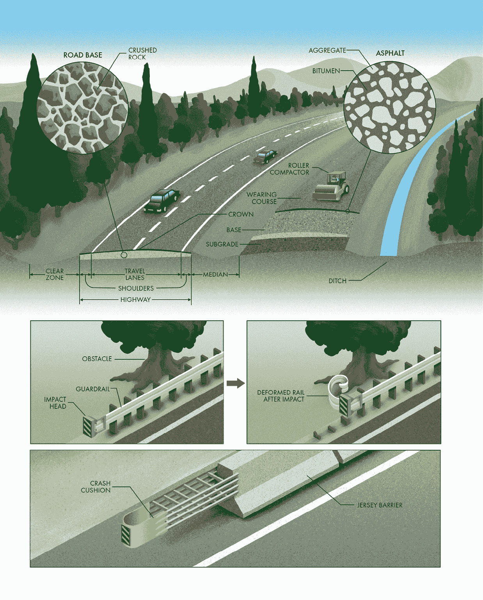
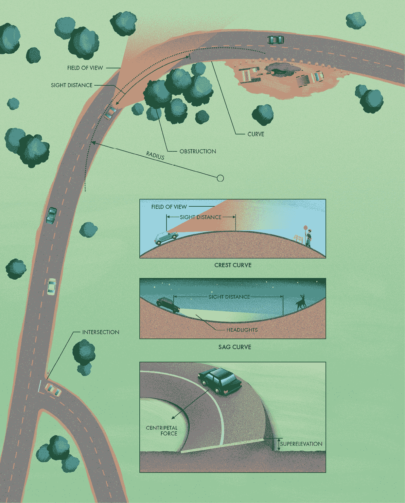
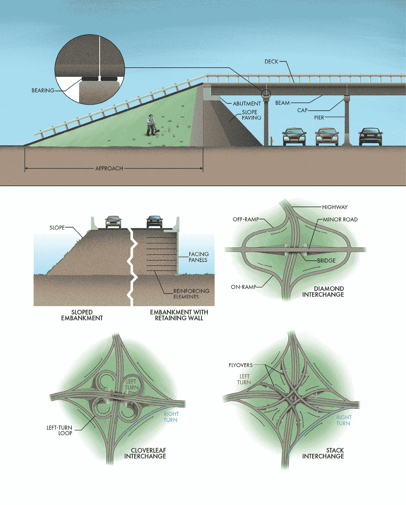

‌

# 第三章：道路

## 前言

在我们所建造的环境中，道路可能是最不显眼的元素，但它们几乎与我们呼吸的空气一样基础。你几乎肯定是通过一条道路到达你现在所在的地方，而且下一次你前往任何地方时，也很可能会再次使用道路。历史上最早的道路是由人或动物跟随相同的路线，经过足够长时间的踩踏，形成了两个地点之间的通道。道路一直以某种形式存在，但它们并不总是安全、舒适，或者能够承载如今道路系统中使用的庞大数量和重量的车辆。随着时间的推移，街道和高速公路的需求只会增加，因为越来越多的人和货物在流动。道路的设计也随着这种需求而演变。尽管它可能看起来并非总是如此，但如今的道路承载着比历史上任何时候都更多和更重的车辆。由于道路的普遍存在，人们很容易忘记它们对社会的价值。但那些研究、设计、建造和维护道路的工程师、承包商和公共工程人员深知道路在货物运输和人员流动中的重要性。无论你是否喜欢道路在景观中的主导地位，你都不得不惊叹于这一事实：在现代世界的大多数地方，任何人都可以相对轻松和舒适地乘坐公交车、汽车、自行车、卡车、摩托车或电动车前往几乎任何地方。

## 城市主干道和集散道路

在过去 100 年里，没有什么比汽车对城市规划和设计的影响更大。随着 20 世纪初汽车的普及，机动车成为了城市交通的主要方式。随之而来的是，城市需要建设道路来应对日益增长的交通量。城市与人体解剖学之间有很多相似之处，道路也不例外。事实上，道路常常被比作心血管系统的各个部分。高速公路就像主动脉，具有较高的通行能力和单一的主要目的地。小型集散道路就像毛细血管，容量小，但与每一座房屋和商铺都有联系。介于两者之间的是被恰当地称为主干道的道路，它们是城市中心之间的中等容量连接。所有这些道路共同构成了一个城市交通网络，使车辆可以（相对）高效地在地图上的任何两个地方之间移动。

尽管看起来可能并非总是如此，城市中的街道不仅仅为汽车提供路线。集散道路和主干道真正构成了城市的循环系统，为汽车、卡车、公交车、自行车、行人、公共设施线路甚至雨水排放提供了通道。虽然每条街道都不同，但大多数城市道路都有许多共同的特点。本节将概述你在城市中可能看到的最常见的元素。

描述道路的一种方式是它们的交叉点，也称为*交叉口*。收集道路和主干道通常在*同一级别*重叠，换句话说，就在地面上。这意味着只有少数交通流可以同时通过，导致交通流动中断。这些交叉口也是绝大多数事故发生的地方。因此，交通工程师对交叉口的设计以及如何使其尽可能安全和高效进行了深思熟虑和分析。这一挑战几乎总是需要在包括空间、成本、交通类型和量以及人类因素（如习惯、期望和反应时间）等众多相互冲突的考虑因素之间进行妥协。最简单的交叉口是由标志控制的，使用停止或让行标志来管理交通流。它们具有成本效益，并且不需要额外的空间，但是无法处理高流量，因为它们会为通过的每辆车辆造成中断。信号控制的交叉口使用电灯指示哪些交通可以通行。（交通信号灯将在本书的后续部分详细介绍。）环形交叉口是围绕中心岛屿使交通流畅的圆形交叉口。虽然它们有时占用比其他类型的交叉点更多的空间，但它们具有一些明显的优势。环形交叉口通过避免中断流的起停来高效处理交通，并且由于较慢的速度和单向交通，它们造成的危险碰撞较少。当然，在这三种基本类别内存在着无数种交叉口配置。如果你开车时间足够长，你会看到工程师们用来确保道路交通安全高效流动的各种交叉口类型和布局。

道路由车辆行驶车道和偶尔的自行车和停车车道组成。道路表面通常在中心呈圆顶形，向外缘倾斜，以便将雨水从行驶表面排走。在外缘，路缘石将路面与开发区分开，而排水沟提供了雨水流动的通道。许多城市和城镇在道路和人行道之间包括一个狭窄的条带，以提供快速行驶车辆和脆弱行人之间的安全缓冲区。这个区域有许多地方名称，包括路缘带、*路肩*和*路堤*。它还为公用事业电杆、标志和路灯提供了位置。

不幸的是，路面并不是坚不可摧的。城市驾驶中最常见的烦恼之一就是坑洞。它们确实让人烦恼，但不仅仅是这样。坑洞每年给车辆的轮胎、减震器和车轮带来数十亿美元的损失。更糟糕的是，它们非常危险。汽车为了避开坑洞可能会急转弯，有时以高速行驶，而如果自行车、摩托车或滑板车碰到坑洞，骑行者可能会遭遇严重的伤害。坑洞的形成是一个逐步过程，其中第一步是路面表面的恶化。它们可能看起来无害，但裂缝是路面系统中的关键缺陷，因为它们允许水渗入。路面下的土壤可能会因降水而饱和，软化并削弱基层。路面下的水也可能会结冰，形成一种叫做冰透镜的结构。水在结冰时会膨胀，并且膨胀时产生巨大的力量，分开基层和路面。当这些冰透镜融化时，支撑路面的冰会消退，形成空隙。每次轮胎经过这个软化区域时，它都会把一些水和下面的土壤挤出路面。刚开始时这是一个缓慢的过程，但每一点从路面下被侵蚀的基层意味着支撑变少，而支撑减少意味着路面下水分的体积增加，这些水会随着交通来回流动。最终，路面失去足够的支撑而失败，破裂并形成坑洞。

因为坑洞具有如此大的破坏性和不便，路面所有者在防止坑洞形成和出现后修复它们上花费了大量的时间和金钱。防止的主要方法是封闭裂缝以防水渗入。修复的方式可能因材料、成本和气候条件而异。但它们大多数都做相同的事情：更换丧失的土壤和路面，并（希望）将该区域与进一步的水渗入隔离。如果坑洞修复与其余路面连接不好，坑洞可能会在同一位置重新出现。

## 行人和自行车基础设施

我们当前的道路系统大部分是根据一个单一的性能标准设计的：即安全和高效地移动机动车交通。曾几何时，汽车并不是我们城市生活的核心。然而，在过去大约 100 年里，它们似乎已成为城市规划和设计中每一个环节的主要考虑因素。不幸的是，这种以汽车为中心的方式剥夺了城市道路上其他使用者的权益，包括行人和骑行者。在许多地方，如果你试图以除私人汽车以外的任何方式在城市中出行，你将会遇到一连串的不便和危险。幸运的是，城市开始意识到步行性和自行车可达性的重要性，并认识到这些因素如何转化为宜居性。如今，我们希望拥有*完整街道*——那些为所有使用道路的人平衡安全和便利的街道。

最明显的行人设施之一是人行道，这是一条通常与街道分隔开来的狭窄道路。这些人行道可以由多种材料制成，但在大多数城市，它们是由混凝土铺成的。人行道看似简单，但其设计和建造中包含了相当多的工程学原理。混凝土的裂缝是不可避免的。树根侵入地下，冻融循环使土壤膨胀，车辆施加了意料之外的负荷。人行道的设计中通常会使用控制接缝，以通过人为削弱混凝土来限制裂缝的位置，使裂缝形成规律的图案。这些人为产生的裂缝比起原本可能出现的杂乱无章的裂缝要更可接受。此外，混凝土会根据温度变化发生收缩和膨胀。在小结构中，这种变化可能难以察觉，但对于较长的结构（如人行道），热胀冷缩的效应会累积起来。为了防止人行道发生翘曲或出现明显缝隙，混凝土中通常会留有间隙，这些间隙被称为膨胀缝。膨胀缝通常用木材、软木或橡胶填充，以便在时间的推移中允许结构的移动。

*无障碍性*是用来描述如何使人行道和其他行人设施对所有用户，包括残障人士，变得安全高效的术语。人行道有特定的最小宽度和坡度，以确保它们不会太难走过。当人行道与路缘接触时，通常会设有一个坡道，通向街道表面。这个坡道被称为路缘切割，它确保轮椅、助步器和拐杖的用户能够轻松过渡到人行道上。它还帮助推着推车或婴儿车的行人，甚至是骑自行车的孩子。此外，人行道上常常设置触觉路面。这些有凸起的区域帮助视障人士辨别人行道与道路之间的边界。它们是潜在危险的可探测警告，包括地铁线路、陡坡、楼梯和道路交叉口。它们通常具有对比色，以便容易识别，许多地方使用一种熟悉的纹理，叫做截顶圆顶。

行人基础设施的另一个关键方面是确保行人能够安全地过街。人行横道是供行人过马路的专用区域，使行人在交通中更加显眼和可预测。它们通常位于交叉口，并用大白条标记。当交叉口有交通信号灯时，每个横道两端的灯光会显示行人何时可以过马路。一些行人信号灯甚至包括倒计时计时器，显示剩余多少秒可以过马路。根据交通流量，过街信号灯可能与车辆的绿灯同时亮起，或者会有一个阶段只允许行人过马路。有些灯光阶段是交错的，确保行人能比车辆先行。有些信号灯完全通过预设定时器操作，而另一些则通过路旁的呼叫按钮启动。即使有这个按钮，也不一定意味着它与信号控制器连接。有时这些按钮仅仅是*安慰剂*，或者仅在某些时间段有效。

骑行是最有效、健康且有趣的出行方式之一，但在没有专用自行车基础设施的城市骑行常常让人觉得充满生命危险。大多数地方的法律允许自行车与机动车共用行驶车道，但除了最不繁忙的街道，少有骑行者在其他地方感到舒适。城市中有许多不同的方式来适应自行车交通。最直接的一种措施是“共享车道标志”（sharrow），该符号用于标示自行车优先通行的共用车道。*统一性*是交通工程中的一个关键概念。如果所有道路使用者都知道预期情况，他们就不太可能做出导致碰撞的判断错误。共享车道标志并没有明确为骑行者提供保护或隔离，但它们有助于在机动车与自行车骑行者之间建立预期，以避免道路上的混乱（并且希望能减少紧张气氛）。

下一步的自行车基础设施是涂漆自行车道。这些专用车道并没有提供与车辆的物理隔离，但它们通过视觉上的分隔，将主要行驶车道与自行车道区分开，形成两股交通流（这些交通流通常有着截然不同的行驶速度）之间的感知分隔。在美国，自行车道有时会使用绿色油漆进一步将其与其他车道区分开，并且偶尔会设置涂漆的缓冲带，为车辆和骑行者之间提供更多空间。

分隔自行车道为所有能力水平的骑行者提供了最高的安全性和舒适度。这些是与主干道有物理隔离的专用自行车道。当然，分隔和专用的车道需要大量投资，因此它们通常仅在最繁忙的路线中设立。

提高行人和骑行者安全的一种方法是减少机动车的速度和流量。仅仅改变限速标志通常不足以减缓汽车速度，因此工程师和城市规划师采用了更具创意的交通平缓方法。在交叉口，减小路缘半径可以减慢转弯车辆的速度，并缩短行人的过马路距离。然而，这种方法仅在没有大量卡车通行的地区可行（因为卡车需要更多转弯空间）。交叉口之外的平缓选项包括：收缩车道宽度的窄道、增加柔和弯道的蛇形路、通过种植树木来减少视距，以及通过设置减速带来为快速行驶的车辆提供物理障碍。

## 交通信号

密集城市区域的交通管理是一个复杂的问题，涉及许多相互冲突的目标和挑战。最基本的挑战之一发生在交叉口，在那里多条交通流线——包括机动车、自行车和行人——需要安全且高效地交叉彼此的路径。我们控制交叉口*优先通行权*的最常见方式之一就是交通信号灯。使用信号灯并不是解决所有交通问题的万灵药，但它们提供了许多关键考虑因素的平衡，特别是它们对空间的最低要求以及能在只有轻微干扰的情况下处理大量交通流量的能力。

交叉口需要严格标准化，以便当你来到一个不熟悉的交叉口时，你已经知道自己在车辆和行人的谨慎而混乱的舞蹈中的角色。这就是为什么一个特定区域或国家的几乎所有交通信号灯看起来都差不多的原因。在最简单的形式中，交通信号灯是一组三盏面向每个车道的灯。这些灯悬挂在吊缆或刚性支撑结构上。一般来说，当灯为绿时，车道上的车辆被允许通过。当灯为红时，它们不被允许通过。黄灯则提醒信号灯即将从绿灯转为红灯。除了这一基本功能外，交通信号灯还可以承担无数复杂的任务，以适应各种情况。

在交叉口的每个入口处，车辆可以朝着三个方向行驶，这些方向被称为*行驶方向*：右转、直行或左转。右转和直行通常被组合为一个单一的行驶方向，因此一个典型的四路交叉口对于每个方向来说有两个车辆和一个行人行驶方向。这些行驶方向可以被组合为交通信号的各个阶段。例如，来自对面方向的左转行驶方向可以被组合成一个阶段，因为它们可以同时进行而不会发生冲突。交通工程师通过信号周期来确定行驶方向的组合和每个阶段的顺序，以适应不同的交通流量和类型。

另一个关键决策是每个阶段的信号持续时间应设定多久。理想情况下，绿灯应该持续足够长的时间，以清理在红灯期间积累的车队，但在繁忙的交叉口高峰时段，这并不总是可能的。在交叉口饱和的情况下，绿灯可能会延长，以减少周期的数量，因为每个周期都包括启动和清理时间——即交叉口没有被最大化利用的时间段。

琥珀灯需要持续足够长的时间，以便驾驶员能够感知警告并使他们的车辆以舒适的速度减速停车。设计准则考虑了许多因素，但琥珀灯的持续时间通常设置为每小时 10 英里或 16 公里的速限大约 1 秒。在北美的大多数地方，你被允许在整个黄灯持续时间内进入十字路口，这意味着所有阶段都需要红灯的时间来允许路口清理。这个清理间隔通常大约为 1 秒，但根据速限和路口大小可以调整增加或减少。

一些交通信号使用预设的定时顺序，编程进控制器，但许多信号比这更复杂。*被激活信号控制* 是我们用来描述可以接收外部输入以动态调整时间和阶段顺序的交通信号灯的术语。被激活信号依赖于来自交通检测系统的数据，这些系统可以是视频摄像头、雷达检测器或嵌入在道路表面的感应线圈传感器。这些后者传感器本质上是大型金属探测器，可以检测车辆或卡车是否存在（对于有时太小以至于无法触发线圈的自行车、滑板车和摩托车而言，这可能是个烦恼）。无论传感器的类型如何，它们都将数据输入到附近的设备柜中。你可能看到过数百个这样的柜子，却不知道它们的用途。

这个柜子里面是一个交通信号控制器，这是一个简单的计算机，通过逻辑编程来确定每个阶段的持续时间和如何进行切换，基于来自检测器的信息。被激活的控制使得交通信号灯能够更灵活地处理交通负荷的变化。例如，如果附近的道路关闭，交通被重新路由通过一个通常不会遇到如此高需求的路口，可能需要在关闭之前重新编程。一个装有被激活控制的交通信号灯将简单地检测到额外的交通量并相应地调整其信号周期。同样的情况也适用于像音乐会和体育比赛这样在不规律时间创建大量交通需求的特殊事件。被激活系统还可以避免你在没有人横穿的情况下等待长时间的红灯。最后，被激活控制可以帮助优先处理装有专用发射器的紧急和公共交通车辆。红外线或声学优先权设备与每辆优先车辆上的发射器通信，向信号控制器发送请求以通行。

**启用控制**并不是信号复杂性的巅峰。毕竟，它仍然将每个交叉口视为一个孤立的实体，而实际上它是更大交通网络的一个组成部分。交通网络的每个元素都可能对系统的其他部分产生影响。经典的例子是*交通瘫痪*，车辆排队阻塞相邻的交叉口，导致交通流动停滞不前。解决这一问题的一种方法是*信号协调*，通过协调信号灯的同步工作来实现。信号协调常用于长条形道路段，并且这些道路上有频繁但较小的交叉街道。主要道路上的信号灯时序被设计成可以让一大群车辆——交通工程师称之为*车队*——能够不受干扰地通过道路的某一部分或全部路段。这种协调可以显著增加通过交叉口的交通流量，但仅适用于没有其他交通干扰源，如车道和商铺的路段。如果车队无法保持完整，协调信号的好处将大打折扣。

提高效率的显而易见的下一步是协调交通网络中大部分或所有信号。这正是*自适应信号控制技术*的工作。自适应系统不同于单独的信号组，它将所有来自探测器的信息输入到一个集中系统（通常通过每个信号灯处的天线无线传输），该系统可以使用先进的算法来优化整个城市的交通流量。这些系统可以显著减少拥堵，许多城市已经为交通信号实施了自适应技术。

## 交通标志与标线

使道路安全高效的最重要方面之一是标志和标线的一致性。车辆以高速行驶时，驾驶员必须迅速做出决定。当标志能够即时识别并理解时，驾驶员和其他道路使用者的困惑和惊讶就会减少。这意味着他们不太可能错误判断危险或做出不当决定。用于规范、警告或引导交通的标志和标线统称为*交通控制设备*。这些设备的设计几乎每个方面都在一个国家内（有时甚至在国际间）严格标准化。尺寸、形状、位置、颜色、符号和文字等都被精心规定，以确保驾驶员无论到哪里，都能自如且顺利地行驶。这也使我们的基础设施更加具有成本效益，因为材料、产品和设备在全国范围内都得到了标准化。在美国，管理交通控制设备一致性的手册超过 800 页，涵盖了几乎所有可能在道路设计中遇到的情况。

*交通标志*需要尽可能清晰、直接地传递信息，因为道路使用者只有片刻时间来识别、理解并做出反应。标志的传达顺序是先通过形状，然后是颜色，最后通过意义或符号。最重要的标志可以仅凭形状就能识别（例如，八角形的停车标志）。

在道路上使用的标志主要分为三大类（以及许多次要类型）：管制标志、警告标志和指引标志。管制标志告知道路使用者交通法规，包括限速、停车和让行标志。它们主要使用黑色、白色和红色的组合。警告标志提醒道路使用者注意危险或突发情况。它们几乎总是黄色菱形，黑色字母。物体标记是另一种警告标志，用于标记路面或路旁的障碍物，通常采用斜条纹的黄色和黑色组合。指引标志为道路使用者提供导航帮助信息，并指引他们前行，它们几乎总是绿色的，带有白色边框和文字。路线标记是另一种指引标志，采用独特的形状（通常是盾形）和颜色来区分道路分类。

大多数标志安装在靠近路面的金属立柱上。这些立柱将标志安装得足够高，以便所有道路使用者都能轻松看到。另一种安装标志的方式是使用悬挂结构，这在高速公路上最为常见，因为交通可能会遮挡从中央车道看到的立柱标志。悬挂式标志安装结构能更好地确保各个车道的可视性，且有两种类型。当只有一个垂直支撑时，它们被称为悬臂标志支撑。由于负载不平衡，它们只能延伸到一定程度。对于更宽的路面，支撑结构由两侧的支撑结构组成，称为标志桥。

尽管交通标志对于保持道路安全和高效至关重要，但它们也可能带来危险。标志的窄杆可以像黄油一样穿透汽车或卡车的许多部件。如果一辆失控的车辆撞上标志杆或垂直支撑，它可能会大幅增加事故的损害和危险，因此标志杆需要具有*抗撞能力*。在大多数情况下，标志杆设有*断裂特性*，以减轻撞击车辆时的影响，最小化对车内人员的伤害风险。木制标志杆通常会被打孔，因此在撞击时容易折断。金属标志杆通常使用一种叫做滑动底座的断裂硬件。这些连接件通过带有螺栓的开槽板连接。当遭遇撞击时，螺栓很容易脱落，使得标志杆可以屈服。滑动底座的额外好处是简化了被撞倒标志的更换。混凝土和底座保持完好无损，因此在原有底座上安装新标志就像简单地用螺栓固定一样。悬挂式标志不能设计成可断裂的，因为掉落的标志可能会危及其他道路使用者的安全。相反，支撑结构会通过防撞护栏、屏障或缓冲垫进行保护，以防止碰撞。（关于这些结构的更多信息将在后续部分提供。）

另一种交通控制装置是将标线直接涂刷在路面上。车道线和条纹被涂在路面上，为道路使用者提供信息和指引。根据交通流量和预算的不同，这些标线可以采用不同的材料，从简单的乳胶漆到*热塑性材料*，后者通过熔化涂抹在路面上。在经常下雪的地区，标线通常会凹进路面，以防止被铲雪车破坏。

高立路标是另一种用于引导驾驶员的路面特征。它们既能提供视觉反馈，也能提供触觉反馈，因为驶过它们会产生明显的颠簸感。高立路标反光片的颜色代表不同的意义。白色和黄色用于标示车道，蓝色标志显示消防栓的位置。如果你看到红色反光片，赶紧掉头！它们通常安装在路面标记的背面，用以警告逆行的驾驶员。隆隆条是一种表面安全装置，不是用来看见的，而是用来听见的。它们通过在路面上均匀打磨出凹槽来形成。当汽车偏离车道时，隆隆条发出的声音和振动将提醒驾驶员偏离了车道。

如果交通控制设备在黑暗中不可见，它们就没有多大用处。过去，通常会有专门的灯光在夜间或恶劣天气中照亮道路标志。现在，几乎所有的标志和道路标线都是*反射型*的，这意味着它们将光线反射回其来源方向，与光线来的方向一致。反射型表面利用车头灯，将光线直接反射回车辆和车内驾驶员。这使得标志和道路标线比周围的非反射性环境看起来要亮得多。标志表面覆盖着嵌有玻璃珠或棱镜元件的塑料薄膜。反射型玻璃珠也被嵌入到道路表面的标线中，使它们在车灯开启时更容易被车辆看到。这些玻璃珠有时被称为*猫眼*，因为它们的功能类似于猫眼在夜间受到光照时看起来发光的方式。

## 高速公路土方工程与挡土墙

自然景观永远无法完美地适应道路建设。地球的表面太不平坦，无法轻松快速地通行。安全高效的旅行需要平缓的曲线，包括水平和垂直方向。它需要不太陡峭的坡度，并且需要在各个兴趣点之间有相对直接的路径。这意味着，要建造一条道路，我们需要一种方法来平整地面。我们用来改变地形和结构的所有方式统称为*土方工程*，它们可能是道路建设项目中最关键的部分。

工程师和承包商使用*横截面*来传达道路的形状。这些图纸展示了沿道路长度切割的横截面，它们是道路建设的直接语言。在横截面上，你可以看到施工前的地面高度（称为自然地形）和完工后的拟建表面。两条线之间的任何差异意味着需要进行一些土方作业。拟建道路上方的区域需要被挖除，通常称为挖方区。挖方在最终地面低于周围地形时是必要的，例如通过陡峭的山坡。拟建道路下方的区域需要通过填土抬高，例如通过河流或桥梁的接近路段。较大的填土区域通常被称为路堤。挖方和填方是任何土方工程项目中最基本的元素。当然，你不能在视觉上直接对比土方工程前后的地形变化，但一旦开始留心，你通常能察觉到自然景观已经被改变。

你可能会注意到，土方开挖和填土通常会与坡面的自然坡度相对应。因为土壤的强度几乎完全取决于土壤颗粒之间的内部摩擦力。将一些沙子倒在桌子上，你会发现沙堆并不会直立。相反，它会形成一个坡度。这个坡度的角度叫做*自然休止角*，它是土壤能够自然稳定的最陡角度。往沙堆顶部加些重量，它会进一步塌陷。

坡度的稳定性可能会因为土壤类型和所需承受的负荷不同而有很大的差异，但工程师通常不信任大于约 25 度的坡度。这意味着建造的坡面宽度必须至少是高度的两倍，这会带来两个问题。首先，建造这样的坡面所需的材料大约是能够垂直站立坡面的两倍，这需要更多的挖掘或填土。其次，它占据的空间更多，这在空间紧张的环境中尤其成问题，特别是在拥挤的城市中。在许多情况下，使用挡土墙来支撑陡峭（甚至垂直）的坡面能避免这些缺点。

土壤不像水那样容易流动，但它的重量大约是水的两倍。因此，施加在挡土墙上的力，称为*侧向土压力*，可能会非常巨大。因此，挡土墙必须非常坚固，以承受这种压力。许多不同类型的挡土墙以不同的方式解决了这个问题。如果你知道在哪里查看，你会注意到这些墙体在建成的环境中随处可见。它们不仅仅用于道路工程，尽管这是常见的应用。最基本的挡土墙依赖重力来提供稳定性，通常会使用基础来创建悬臂墙。在这种结构下，墙体可以利用约束土壤的重量来发挥优势。土壤位于基础之上，基础充当杠杆，有助于保持墙体在侧向力的作用下保持直立。

一些挡土墙使用地锚（也叫做*拉锚*）来提供水平稳定性。这些地锚由钢绳或钢条组成，钻入墙体后面的土壤中。安装后，液压千斤顶会对每个地锚施加张力，锥形楔子或螺母将地锚牢牢固定在墙面上。承载块或承载板通常用于将地锚的负荷分布到更大的面积上，从外面可以通过它们重复的图案识别出来。

另一种挡土墙使用*桩*，即垂直的构件，这些桩被打入或钻入土壤中。它们包括使用钻孔设备安装的钢筋混凝土桩，类似于巨大的围栏柱。它们还包括称为沉积桩的互锁钢构件。桩墙通常用于建筑项目中的临时开挖，因为墙体可以在挖掘开始之前就先行安装，确保开挖面在整个施工过程中都能得到支撑。

一种常见的挡土墙类型是通过将一块土壤块体连接起来，使其自身充当墙体。这可以通过在填土操作过程中，在每一层之间铺设加固元件来实现，这种技术称为机械加固土壤。加固元件可以是钢条或由塑料纤维制成的布料，称为*土工织物*或*土工格栅*。当自然地面被开挖以形成陡峭的坡面时，添加加固层是不可行的。相反，可以将土钉插入坡面作为加固。像地锚一样，土钉由钢筋构成，并被灌浆到钻孔中。但与地锚不同的是，它们并不承受拉力。它们的作用不是对墙体的表面施加力量，而是将土壤块体紧固在一起，支撑其自身及背后的土壤。

机械加固土壤和土钉挡土墙都在墙体的外表面使用混凝土。这些外饰面通常不会承受太多的负荷。它们的作用是保护裸露的土壤免受侵蚀，在永久性应用中，还能改善墙体的外观。在临时情况下，外饰面有时使用喷射混凝土，这是一种可以通过压缩空气喷射的混凝土。对于永久性安装，通常使用具有装饰图案的互锁混凝土板。这些板不仅看起来漂亮，而且还能随着时间的推移允许一定的移动，并使水分能够通过接缝排出。

## 典型的高速公路截面

我常常被问到为什么道路建设项目似乎需要这么长时间，而成品只是一条简单的铺在地面上的路面。这并不是因为建筑工人闲置或承包商不诚实，而是因为高速公路很复杂。确保道路能够承载现代汽车和卡车的重量，并且让它们以如此惊人的速度安全行驶，绝非易事。之所以看起来很普通，是因为道路设计和建造得非常精细。从基础做起，高速公路具有许多特点，使得快速高效的车辆通行成为可能。

驾驶时你只看到外部表面，但道路结构下方还有更多内容。道路是分层建设的，这些层有时被称为*路面层*，以使道路更加耐用和持久。在安装任何新的道路之前，需要进行一些土方工作，以平整地表（如前节所述）。道路建设所依赖的现有土层被称为基层，它并不总是适合承受来自车辆交通的巨大且频繁的负荷。因此，通常会在基层上方铺设并压实一层或多层路基，这些路基通常由碎石构成。路基有多种功能。它为施工提供稳定的平台，均匀分配车辆重量到基层，为渗入路面下的水提供排水功能，并保护路面免受霜冻影响。

路面的最上层是面层，因为它暴露在不断变化的车流中。混凝土有时被用作主要高速公路的面层，因为它极其坚硬和耐用。混凝土由水泥、岩石（在行业中称为集料）和水组成，可以承受比其他路面更大的重型卡车交通。但混凝土也有一些缺点。它安装成本高。修复困难，因为它需要很长时间固化，这延长了道路和车道关闭的时间。而且当潮湿时，它可能会太滑，因此需要通过凿槽来增加轮胎的牵引力。这就是为什么大多数道路采用沥青铺设，而非混凝土的原因。

沥青路面只有两种主要成分：集料和沥青，后者是从原油提炼出的厚重、粘稠的粘合材料。沥青满足现代道路所需的许多条件。这些材料非常容易获得。它为轮胎提供了极好的牵引力，而无需沟槽。它具有柔韧性，可以在不发生破坏的情况下适应基层的某些位移。最后，它很容易修复。沥青被加热成可操作的混合物，铺设在基层之上，然后用重型压路机将其压实。它几乎在冷却后就可以投入使用。

“高速公路”一词通常用来描述铺设道路的整个宽度。它包括车辆行驶的车道和作为紧急停车道的应急车道。应急车道通常比车道窄，有时为了节省成本，它们的铺设厚度较薄，因此不能作为常规行驶的车道。尽管高速公路看起来很平坦，但它们通常向路边倾斜，中间部分形成一个弯曲的拱形。平坦的表面不容易迅速排水。积水对车辆非常危险，因为它会使道路滑溜，并在冬季形成更多的冰层。将道路设计成弯曲形状可以加速降水排水，保持路面干燥。一旦水流到达路面的边缘，它就需要排出，否则会软化和削弱路面下方的土壤。高速公路通常沿路边设置排水沟，以将雨水排走。（有关排水结构的更多细节，请参见第七章。）

一些最危险的碰撞发生在由于障碍物或失控而导致车辆偏离道路时。高速公路上的许多安全设施旨在防止车辆偏离道路后发生严重碰撞。主要路线通常通过中央隔离带将双向车流分开，形成分隔式高速公路。路面之间的中央隔离带是一个草地区域，用于防止偏离的车辆驶入对向车道，从而减少正面碰撞的发生。大多数高速公路还包括每条车道外侧的清晰区域，这是一个没有障碍物的区域，能够为驾驶员提供停车或重新控制车辆的空间，特别是在车辆驶离路面时。清晰区域内必须保持无障碍，如树木、标志和电线杆等，这些障碍物可能会使碰撞更加严重。当标志必须设置在此区域时，它们通常配有断裂支撑，以减少潜在碰撞的冲击力。当清晰区域内的障碍物无法移除或无法做到防撞时，必须用护栏将其保护起来。

纵向护栏在存在危险障碍物或急剧下坡的情况下，可以防止车辆驶离道路。它们也可以替代或与分隔高速公路的中央隔离带一起使用。针对不同情况有许多类型的护栏，所有护栏在投入使用前都需要经过全规模的碰撞测试。钢制护栏在受到撞击时能够发生偏移，这在一定程度上缓解了碰撞的冲击力，但这也意味着每次碰撞后都必须更换护栏。另一种常见的纵向护栏叫做“泽西护栏”，由混凝土制成。它的形状使得车轮可以沿护栏一侧滑行，通常可以将车辆重新引导，而不会造成重大损害。

纵向隔离带的一个挑战是它们的钝端可能在清晰区域内形成危险的障碍物。大多数隔离带都采用端部处理，以减轻碰撞发生时的严重性。钢制护栏通常配有冲击头，在撞击时沿护栏滑动，变形吸收碰撞的能量，同时将能量转向侧面，保护车辆乘员。刚性隔离带通常在末端配有缓冲垫。有各种各样的设计，但最常见的设计是使用填充沙子或可压缩钢部件的桶，这些部件可以吸收碰撞的能量，从而显著减少碰撞的严重性。

## 典型的高速公路布局

一类道路与城市主干道和集散道有很大不同。在本书中，我使用了*高速公路*这个术语，但也有其他人可能称其为高速路、快速公路、快速车道或通道。不论你如何称呼它们，它们都通过*控制接入*实现了交通容量的巅峰。对于较小的高速公路，这意味着减少车道数目和减少平面交叉口。对于最高容量的道路，这意味着进入或离开它们的唯一方式是通过坡道或立交桥（稍后章节会详细介绍）。控制道路接入减少了中断，使得高速交通流量相对不受阻碍。这种增加的速度通常意味着增加的道路容量。然而，它也减少了驾驶员决策的时间，从而增加了发生危险碰撞的可能性。令人惊讶的是，我们能够把自己放入金属箱子里，以惊人的速度在不同地方之间穿行，而高速公路则包含了许多安全特性，使得这种旅行成为可能。这种安全性从最基本的道路设计开始（通常简单地称为*布局*）。

在理想的世界里，每条路都会是直的平坦路径，我们可以以任何想要的速度奔驰。但所有高速公路都包含着如曲线、坡度、交通、障碍物和天气等危险。现实情况要求我们平衡车辆的速度与驾驶员应对这些危险的能力。高速公路上的三种关键速度并不总是相等：*设计速度*、规定的*限速*以及任何单个驾驶员选择的行驶速度。驾驶员根据个人技能水平、舒适度以及对危险的感知来选择自己的行驶速度。道路管理者根据广泛接受的安全标准设置限速。高速公路设计师选择设计速度，以确保道路上所有几何特征的一致性，并且适应大多数驾驶员最终会以此速度行驶。

高速公路的*路线*是其水平布局——从上方看时的形态。所有道路都包括需要改变行驶方向的曲线，如果设计不当，这些曲线可能对驾驶员构成严重挑战。任何改变方向的物体都需要指向转弯中心的向心力，否则它会继续沿直线行驶。当你在转弯时感觉到被推向车的一侧，这就是你身体的惯性试图让你保持直线行驶，而汽车却在转弯。对于一辆车来说，向心力来自于轮胎与路面之间的摩擦力。随着转弯半径的减小，这种力会增加。在某一速度和转弯半径下，所需的向心力可能会超过轮胎摩擦力，从而导致车辆滑出道路。为了避免这种危险情况，工程师会根据道路设计速度选择曲线的最小转弯半径——速度越快，曲线越平缓。

橡胶轮胎提供了与路面之间的牵引力，但我们也可以利用几何原理使曲线对驾驶员更安全。高速公路设计师经常将曲线外缘抬高，或者使其超高，来减少轮胎在曲线中的摩擦需求。将道路绕弯道进行倾斜，利用来自路面的*法向*（即垂直）*力*来提供所需的部分或全部向心力。一般来说，设计速度越快，弯道的超高角度越大。超高还使得驾驶过程中在曲线处更加舒适，因为离心力使乘客被推向座位，而不是从座位上被推出来。如果超高角度刚好合适，并且你以道路设计速度行驶，那么在弯道上，你杯中的咖啡水平面将完全保持不变。

设计水平曲线时，另一个重要的方面源于一个简单但至关重要的事实，那就是驾驶员需要看到前方的情况，以便做出相应的反应。视距是指在任何给定时刻，驾驶员能够看到的道路长度。在笔直且平坦的高速公路上，视距仅受驾驶员视觉敏锐度的限制。然而，每当道路改变方向时，驾驶员的视野可能会被障碍物阻挡。如果视距不足以识别和应对危险，就可能发生碰撞。行驶速度越快，观察转弯或障碍物的距离就越长，驾驶员需要更多的时间来判断如何应对。即使一个曲线足够平缓，车辆可以在没有打滑的情况下通过，但由于障碍物（如山丘或树林遮挡了驾驶员的视线），它可能没有足够的视距来确保安全。在这种情况下，高速公路设计师需要增加曲线的半径，以延长驾驶员的视距，达到更安全的程度（或者干脆移除障碍物）。

道路几何的最后一个方面是垂直配置，也叫做*纵断面*。道路很少会穿越完全平坦的区域。相反，它们会穿越丘陵，越过山坡，进入山谷。道路的坡度或*等级*是一个重要的设计决策。坡度过陡的道路会使旅行变得困难，尤其是对于重型卡车而言。上坡路段行驶缓慢，而长时间下坡的路段可能会导致车辆刹车过热。坡度变化也必须平滑过渡，以避免对驾驶员造成颠簸和突兀的感觉，确保舒适驾驶。除此之外，垂直曲线可能会减少驾驶员的视距。

峰值曲线——即向上凸起的曲线——会导致道路的顶部被遮挡。如果你正快速上坡，另一侧的停驶车辆或动物可能会让你措手不及。过于紧凑的峰值曲线将无法提供足够的视距让你提前识别并反应。因此，设计师必须确保这些曲线足够平缓，使你在上下坡时还能看到足够的路面。下凹曲线——即向上凹陷的曲线——不会遇到这个问题。白天时，你可以看到曲线两侧的所有路面。然而，到了夜晚情况就会变化。车辆依靠车灯照亮前方的道路，而有时车灯的照射距离会成为视距的限制因素。如果下凹曲线过于紧凑，车灯的照射范围就不够远。结果就是视距缩短，难以在夜间对障碍物作出反应。

## 立交桥

如前节所述，当道路交叉时，几乎总会带来一些挑战。多条交通流需要在交汇的空间内安全通过。当交叉口处于同一高度（也就是说，地面水平）时，交通流量必须受到干扰。通过标志、信号或环形交叉口，*优先通行权*会分别分配给每个交通流，而其他流量则需要等待。这种频繁的停停走走在使用受控通行的高速公路上是不理想的，因为受控通行的目的就是减少干扰，保持高速交通流畅。相反，高速公路的入口、出口和交叉口通常通过等级分离的交叉口，也称为立交桥来实现。等级分离可以让交通流在不受干扰的情况下安全高效地交叉。

最常见的分级交叉口类型之一是钻石型立交桥，通常用于受控入口公路与次要道路交叉的地方。匝道从公路上分岔，与次要道路成直角交汇。匝道过了次要道路后变成上匝道，重新进入公路。这两个传统交叉口通过标志或交通信号灯进行控制。为了实现等级分离，其中一条道路将包括一座桥梁，也称为立交桥。高速公路桥梁有许多外部设计特点需要关注。

桥梁的*上部结构*包括支撑车辆行驶的桥面板的梁和结构部件。桥梁的重量以及所有车辆的重压必须传递到桥梁的基础。这由*下部结构*来完成。桥头提供支撑给桥梁两端的梁，承受上部结构的水平和垂直荷载。桥梁跨越之间的中间支撑称为墩柱，如果由单一柱体组成则叫做墩，若使用多个柱子组成框架则叫做*弯头*。它们通常设计成仅承受垂直荷载，因此比两个桥头更简单、更小。在某些情况下，墩柱上会有顶板，用来均匀地分配作用在每根梁和柱上的力。

桥梁看起来可能是静态结构，但它们必须具有一定的灵活性。车辆的振动、基础的沉降、由于温度变化引起的膨胀和收缩，甚至风力的作用都可能在上部结构中引入微小的运动。与其让桥梁足够坚固以承受任何微小的运动，大多数桥梁使用轴承来适应这种运动，这些轴承通常由橡胶和钢铁的层叠组成。这些垫片可以在仍允许上部结构一定运动的情况下，转移桥梁的负荷。

等高道路和桥梁之间的过渡称为接近段，通常由土路堤组成。土壤按层压实，形成一条平滑的路面直达桥梁。由于土壤不稳定，无法形成垂直的面，所以路堤常常在每一侧都有斜坡。斜坡一般覆盖草皮，以防止土壤侵蚀。然而，草在桥下阴影处生长不好。通常会在桥下斜坡的土面上安装混凝土板，这些板叫做斜坡铺装，用以防护侵蚀。（第四章包括有关桥梁的更多细节。）

一个斜坡路堤的问题是它占据的空间。城市地区，接近桥梁的路堤通常依赖挡土墙提供支撑，从而腾出宝贵的空间。这些挡土墙通常由加固元素与互锁的混凝土面板层叠而成，这种技术被称为*机械加固土壤*。（有关挡土墙的更多信息，请参见前一节。）

当两条或更多的高速公路交汇时，交叉口变得更加复杂。理想的交汇点可以让每一股交通流畅地转到任何方向的交叉路上，不受干扰。有很多方法可以实现这种连接，每种方法都有其优点和缺点。最基本的一种是叶形立交，它因其在地图上独特的形状而得名。在叶形立交中，右转的车辆会沿着一个平缓的曲线转到交叉路段。左转的车辆则会经过交叉口，然后沿着一个急转弯的右环道驶入对向车道。叶形立交只需要一座桥梁，因此建造成本相对较低。然而，它也有一些缺点。最显著的是，左转入口匝道位于出口匝道之前，导致进出高速公路的车辆需要交错行驶。这种交错行驶会显著限制交汇口的通行能力。

另一种类型的高架交汇点是堆叠式立交。在这种类型的交汇点中，右转车辆通常保持在地面上，就像叶形立交一样。然而，左转车辆则通过高架匝道来处理，这些匝道通常被称为高架桥。这两对左转匝道必须堆叠在高速公路的上方或下方，这也赋予了这种立交其名字。堆叠式立交通常具有所有四向交汇点中最高的通行能力。然而，由于需要多层高架道路，它们通常是复杂且昂贵的结构。

还有许多其他类型的高速公路交汇点，大多数现实世界中的交叉口都借用了各种设计元素。城市地区对这种庞大的结构有许多限制，包括连接道路的数量、大小、方向以及所有匝道所需的空间（更不用说所有基础设施项目中那两个始终存在的限制：工期和预算）。最大的、最复杂的立交常被称为*意大利面立交*，是交织的匝道组成的巨型迷宫，交通在各个方向间流动。在长途旅行中，我也常常设计路线，确保我能经过每个立交的最上层，以便能获得最好的（即便是短暂的）城市景观。
