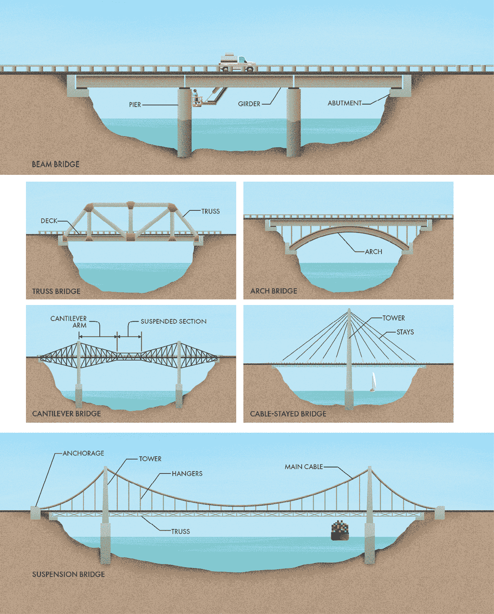
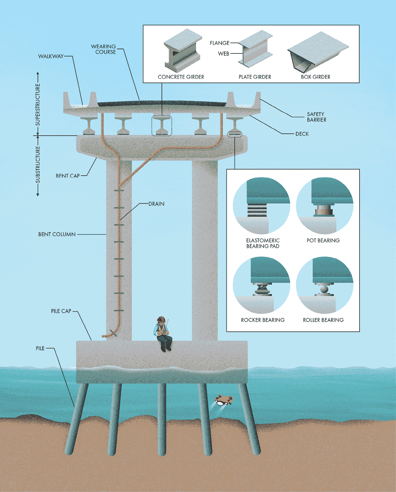
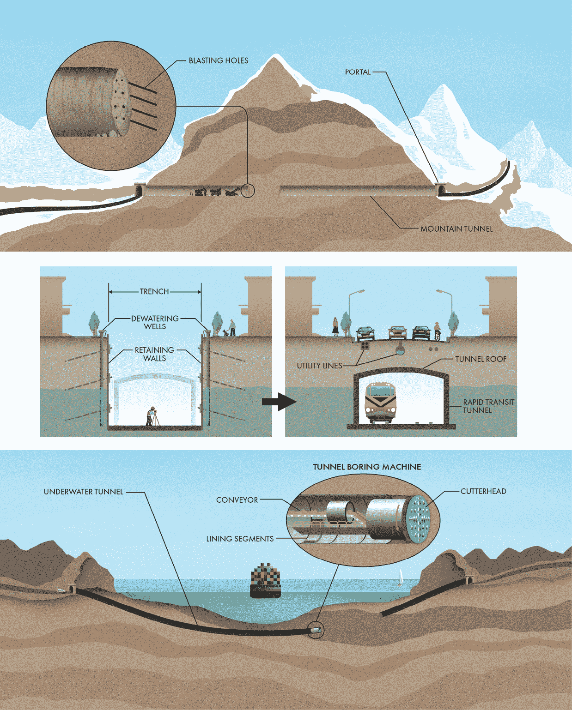
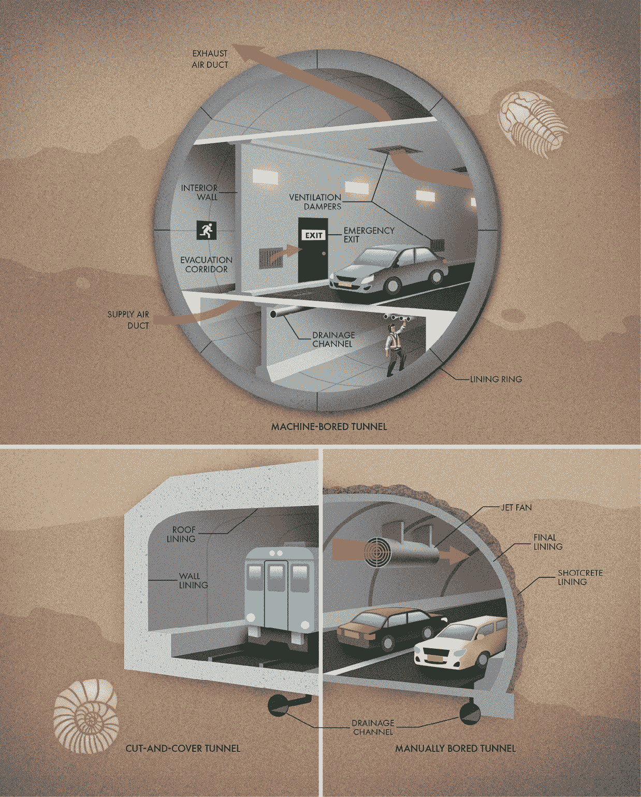

‌

# 第四章：桥梁与隧道

## 前言

尽管地球有着天然的美丽，但它常常给出行带来困难。事实上，地球上一些最壮丽的景观也是最难以穿越的。河流和山脉不利于道路、铁路或其他地面通道的建设。当地形过于湿滑、陡峭、危险或易发生灾难时，唯一的前进方式就是向上或向下。在峡谷、山谷和河流中，我们的道路通过桥梁跨越障碍。而在丘陵、山脉和浅水道中，我们则通过隧道贯穿到另一边。也许正因为这些结构解决了一个宏大却独特的问题——创造一条通往另一边的路径——桥梁和隧道成为了最受赞誉的人类成就之一，并充满了引人入胜的工程细节。它们几乎总是根据特定地点量身定制，符合当地的地形、地质和水文特征（更不用说地区性的建筑偏好和风格）。因此，每座桥梁和隧道都有其独特的个性。由于它们的规模和重要性，这些结构往往将这种个性反映到外部，成为它们所连接的地方的象征。

## 桥梁类型

我们日常依赖的基础设施不一定是美丽的。我们当然可以建造精致的电力传输线或惊艳的排水管道，但我们很少愿意承担这样的成本。然而，桥梁却是不同的。人类似乎决定，如果我们必须在风景最美的地方建造结构物，至少也应该赋予它们一些魅力。这并不是说世界上没有丑陋的桥梁，但桥梁的外观通常在设计时是一个重要的考虑因素。对于建筑作品的爱好者来说，许多桥梁简直让人屏息。跨越一个空隙的方式有很多，每一种功能相同，但形式却各不相同。无论如何实现，能够支撑巨大负荷且下面没有任何支撑物的结构总是充满了魔力。

最简单的结构跨越方式之一是梁式桥。它由一根或多根梁（通常称为主梁）支撑在下方的桥墩或支座上。梁式桥通常不能跨越很大的距离，因为所需的主梁会太大。在一定的距离下，梁会变得非常沉重，几乎无法支撑自己的重量，更不用说承载上面的道路和交通了。梁主要用于短桥或需要许多中间桥墩支撑的应用。大多数用于高速公路互通立交的桥梁都是梁式桥。虽然各具美感，但高架桥通常更具实用性。（有关互通立交的详细信息，请参见第三章。）

一个绕过结构构件自重挑战的方法是使用桁架而不是梁。桁架是由较小元素组成的装配体，创造了刚性且轻量的结构。这种重量减轻使得桁架能够跨越比实心梁更大的距离。桁架桥可以有多种形式。示意图显示了一个*通过桁架*，路面在底层，桥上方是结构构件（与*甲板桁架*相对，后者将结构构件隐藏在道路下方）。

另一种桥梁类型利用了存在数千年的结构特征：拱。大多数材料在其轴向受力比施加在垂直方向（称为*弯曲力*）时更强。拱桥利用弯曲元素将桥梁的重量几乎完全通过压缩力传递到桥墩上。许多最古老的桥梁使用拱，因为那是当时能够跨越间隙的唯一方式（石材和灰浆）。即使现在，随着现代钢铁和混凝土的便利，拱仍然是桥梁的流行选择。它们有效利用材料，但施工可能具有挑战性，因为拱在完成之前无法提供支撑。在拱从两侧连接到其顶点之前，施工期间需要临时支撑。

当拱位于道路下方时，我们称之为*甲板拱桥*（如所示示例）。垂直支撑将甲板的荷载传递到拱上。如果拱的一部分延伸到道路上方，而甲板悬挂在下方，则称为*通过拱桥*。拱可以采用多种形式形成，包括单独的钢梁、钢桁架、钢筋混凝土，甚至是石材或砖砌。压缩拱的一个结果是产生水平力，称为*推力*。拱桥通常需要强大的桥墩在两侧推动，以抵抗额外的水平载荷。作为替代，*系拱桥*使用弦连接拱的两侧，类似弓弦，以抵抗推力。如果拱的每端坐落在细长的桥墩上，可以确保它们被系在一起。

增加梁桥跨度的另一种方式是移动支撑，使得甲板的各个部分在其中心平衡而不是在每端支撑。悬臂桥使用从其支撑物水平伸出的梁或桁架，将大部分重量移至支撑物上方，而不是在跨度的中心。典型的悬臂桥有四个支撑物，其中两个中央桥墩承受桥梁的压力载荷。最外侧的支撑物抵抗张力，为每个悬臂臂提供平衡力。悬臂桥通常使用大型钢桁架，但也可以用混凝土建造。有些甚至在两个悬臂臂之间包含一个悬吊段落。

世界上最长的桥梁利用钢材抵抗极大拉力的能力。斜拉桥通过附加到高塔的缆索从上方支撑桥面。这些缆索（也叫做“拉索”）形成扇形图案，使这种桥型拥有独特的外观。根据跨度的不同，斜拉桥可以有一个中央塔柱或一对塔柱。其简洁性允许多种配置形式的出现，带来了某些戏剧性（且往往是不对称）的形状。

在斜拉桥中，桥面直接通过缆索与每个塔柱连接，而悬索桥则使用两根巨大的主缆索，将桥面通过垂直吊杆悬挂在下面。悬索桥因其巨大的跨度和纤细、优雅的外观而成为标志性结构。每侧的塔柱支撑着主缆索，就像一根扫帚棒支撑在一个毯子堡垒中。大部分桥梁的重量通过这些塔柱传递到基础中，剩余部分则通过巨大的锚固装置传递到桥的桥头墩，以防止缆索被拉出地面。由于悬索桥非常纤细且轻盈，因此大多数悬索桥需要通过桥面上的梁或桁架进行加固，以减少风力和交通荷载的影响。这些桥梁建造和维护成本高昂，因此只有在没有其他结构可以替代的情况下才会建造。许多人认为悬索桥是土木工程技术的巅峰之作。

最后一类桥梁是可动桥，通常用于让船只和舰船通过。虽然不常见，但世界各地有许多类型的可动桥，它们都独一无二，并根据特定地点定制。我在新城市里最喜欢做的一件事就是看一个可动桥，试图弄清楚它是如何运作的。

## 典型桥梁截面

虽然每座桥梁都不同，但大多数桥梁都共享一些可以从外部观察到的共同元素。通过桥梁的横截面可以看到各个部分，它们共同作用使桥梁得以正常运作。桥梁通常分为上部结构（承载交通荷载并跨越每个跨度）和下部结构（将上部结构的重量传递到基础中）。这两部分各自包含着引人入胜的细节。

桥梁上供车辆通行的表面称为桥面。通常，它由一块混凝土板构成，置于梁的上方。在某些情况下，桥面是*预制*的，这意味着混凝土在被提升到位之前已经成型并养护过。否则，桥面是在现场浇筑的，使用模板保持其形状，直到混凝土硬化。如果使用这种方法进行施工，必须小心操作。毕竟，混凝土非常重，当越来越多的混凝土被加到梁上时，结构会开始弯曲。为了避免裂缝，承包商会仔细安排施工顺序，使得大部分这种变形在混凝土完全硬化之前就发生。

桥面有一定的坡度，要么从中心（称为*拱顶*）向两边坡降，要么从一侧开始坡降，以确保雨水不会在路面上积水。桥面混凝土板上会加一层防水层和路面，以保护它免受恶劣天气和交通损害。这个耐磨层还可以平整任何不平整的地方，为驾驶员提供更平稳的行驶体验。耐磨层是定期更换的，而下方的混凝土板则是桥梁的永久部分。桥面通常还会在边缘设有安全护栏，防止失控的车辆跌落，设置排水系统将水引离结构构件，并提供人行道以供行人通行。

大多数桥梁都会有某种类型的梁或梁架来支撑桥面，这取决于设计。对于梁桥来说，梁是主要的承载元素，负责将所有的力传递到桥墩下部结构。对于其他类型的桥梁，梁可能只是为桥面增加刚度，或者支撑其重量，桥面通过吊杆、拉索或桁架的节点来承受主要的承载力。梁架在其上部和下部会受到最显著的力。一般来说，梁的上部承受压缩，下部则承受拉伸，因此大多数梁的形状像大写字母“I”，使得翼缘部分有更多的材料，而中间的腹板则较窄，因为此处受力较小。这些梁架通常由钢板或钢筋混凝土制成。另一种常见的形状是箱梁，它本质上是一个封闭的结构管。箱梁常用于弯曲的桥梁，因为它们比普通的梁更能抵抗扭曲。

支座将上部结构的荷载传递给下部结构；它们“承受”着桥梁的重量。梁不能直接坐在桥墩或桥台上，原因很简单：桥梁会发生位移。上部结构在移动的交通荷载下会发生变形和振动，在灼热的阳光下膨胀，在冷却时收缩（尤其是在寒冷的冬夜）。如果没有与下部结构的隔离，这些位移会积累应力，可能导致结构部件失效。支座提供了这种隔离，同时通过确保力量均匀分配，减少了支撑的磨损。解决这些问题有许多令人兴奋的方案，如果你仔细观察，你会注意到各种各样的桥梁支座样式。

现代大多数桥梁使用*弹性体*（换句话说，柔性）材料来支撑桥面和梁的重量，同时允许在桥墩之间进行微小的振动、旋转和位移。有时这种弹性支撑垫是一个独立的部件，由纯橡胶或由橡胶和钢板层压制成的层构成，以控制膨胀。另一种选择是罐式支座，它将弹性材料封装在一个钢制圆筒内。这个罐式支座防止橡胶从两侧挤出，允许使用更柔软和更可塑的材料。罐式支座有时包括钢板，以适应滑动运动，并且可以根据每座桥梁的需求，设计成约束或释放不同的运动。许多旧桥使用滚轮支座或摇摆支座，以允许上部结构的旋转和水平移动。这些类型的支座大多已被淘汰，因为它们的维护成本高昂。

下部结构由垂直元素组成，这些元素承载着从梁、桥面、桁架、钢索和吊杆传递来的荷载，并将其传递到下方的地面。下部结构可以有许多不同的形式，具体取决于桥梁下方土壤和岩石的性质，是否会受到河流强大冲刷力的影响，以及所支撑的桥梁类型。坚固的中间支撑通常被称为*桥墩*。另外，当一个支撑由多个柱子和一个盖梁组成时，它被称为*桥台*。桥梁跨度的两端是*桥台*。这些支撑通常比桥墩或桥台更大，因为它们需要承受来自上部结构的垂直和水平荷载。桥台还起到桥梁与地面道路之间的过渡作用，因此有时也充当来临道路下方土壤的挡土墙。

桥梁的基础是下部结构的一部分，它将桥墩、桥台或支座的重量传递到地下。一些基础由简单的混凝土垫层构成，称为基础垫块。然而，大多数桥梁基础使用桩基、细长的钢或混凝土构件，这些构件被钻入或打入地下。有时桩基会被倾斜（换句话说，给桩打一个垂直角度），以帮助抵抗水平力，除了垂直力之外。在每个支撑点上都会使用多个桩基，这些桩通过桩帽连接在一起，支撑着柱子。

## 隧道概述

隧道的概念相对简单：在地下开凿一个空心管道，供汽车、火车甚至行人通行。然而，隧道是世界上最具技术挑战性和最昂贵的工程项目之一。一些基础设施利用地下管道（本书讨论了许多此类设施），但本章专注于用于交通的隧道。尽管隧道的建设既昂贵又具有挑战性，但它们使得跨越地理障碍成为可能，这些障碍本来很难或根本无法跨越。隧道还开辟了全新的旅行维度，最大限度地利用了密集城市地区的宝贵土地。对设计隧道的工程师和穿越隧道的旅行者来说，地球表面以下是一个完全不同的世界。但通过地下而非地面来穿行，总有某种天生的吸引力。

隧道的主要作用之一是让人们跨越障碍物。隧道在山区尤为常见，尤其是那些地形陡峭或表面危险的地方。与其绕行陡峭的地形，直接穿越山体往往更为实用。一些山地隧道的长度仅有短短几百米，连接两个隧道口（隧道的进出口），而最长的隧道长度则可达 30 英里（50 公里）以上。

水也是可以通过隧道克服的障碍。桥梁并非始终是跨越河流或海湾的最简单方式，尤其是在水上交通繁忙的地区。当桥梁的支撑结构可能会侵入水道时，水下隧道则能允许船只和船舶不受阻碍地通行。

隧道的另一个重要作用是在空间珍贵的密集城市地区。快速轨道交通系统通常使用地下空间，这样可以避免与地面道路和其他基础设施发生冲突。由于这些隧道通常离地面较近，许多快速轨道交通隧道通常采用*切槽法*进行建设，从挖掘沟槽开始。在城市地区进行地下挖掘是一项具有破坏性且充满挑战的工作。现有的道路必须重新规划。公用设施管线必须得到保护或重新引导。附近的建筑物可能需要额外支撑以防止沉降。在隧道建设过程中，需要设置挡土墙以保持沟槽的开放（更多内容请参见第三章）。最后，地下水必须持续管理。如果挡土墙不具备防水能力，可能需要安装临时排水井将水从地下抽出。另一种选择是*冻土法*，该方法使用制冷系统和冷却管道将一层水和土壤冻结成不透水的屏障。这层临时冰墙能够加固土壤，并防止地下水迁移进入施工区域。

一旦沟槽被挖掘完成，隧道本身的结构就可以开始建造，无论是轨道还是道路。屋顶是最后一个要安装的部分。安装完成后，沟槽会被回填，地面上的基础设施也可以恢复。

切槽法也常用于建造水下隧道。在*沉管法*中，预制的隧道段可以小心地沉入已挖掘的水下沟槽中。每个单元由潜水员连接，然后回填土壤以防浮起，再进行排水。在城市地区，切槽法隧道通常分段建设，因为在城市中开挖一长段地面几个月或几年是不现实的。这种干扰可以通过另一种隧道建造方法来避免：*钻孔*。

就像盖挖法一样，钻孔隧道也遵循几个主要步骤：挖掘并移除土壤或岩石，安装支撑物以抵御周围的土壤和水，然后完成隧道的其他特征。钻孔的好处在于它可以在不扰动地表的情况下进行，从而加快施工速度，并使得在那些原本无法到达的区域（如繁忙街道或现有建筑物下方）进行施工成为可能。尽管历史上的隧道建设采用了多种技术，现代隧道主要通过两种方式进行钻掘。首先，它们可以通过人工挖掘完成。在岩石中，隧道的开口通过钻孔、填充炸药并进行爆破来推进。在软土中，施工队可能使用一种临时支撑叫做*盾构*来为隧道面提供通道。人工挖掘隧道的一个显著优势是，可以根据不断变化的地质条件调整设计。只有在需要时（例如岩石较弱或破裂时）才安装额外支撑，从而节省不必要的加固成本。

另一种选择是使用隧道掘进机（TBM）。这些庞大的设备像巨型钻机一样，通过旋转的刀头咬碎岩石和土壤。TBM 还包括输送带，用于在挖掘过程中移除废土，并安装支撑隧道墙壁和顶部的混凝土衬砌段的设备。（下一节将详细介绍隧道衬砌。）尽管它们非常昂贵且运输困难，但这些机器可以使隧道建设成为一个快速高效的过程。它们通常用于长距离、大直径的项目或在非常复杂的地质条件下的隧道建设。

隧道开挖通常是一个缓慢的过程，因此较长的隧道有时会从两端同时开挖。这能减少施工时间，但也带来了挑战。如何让两支队伍盲目地朝着对方挖掘并准确地在中间会合呢？指导隧道施工队伍或 TBM 朝正确方向前进的测量员无法使用导航卫星或地面参考标记。相反，他们通常依赖地球的磁场来确定方向。由于建筑中使用的铁钢材料的干扰，磁罗盘的精度不足以达到这个目的。即便是微小的方向误差，经过长距离后也会累积成显著的偏差。因此，测量员使用能够指向北方并具有高精度的陀螺仪。这些仪器使得隧道能够准确地在出口竖井中心突破，甚至使两支隧道施工队伍能够在中间会合。

## 隧道横截面

每个隧道都是为特定情况设计的独特结构。看似在地下挖掘通道时，似乎变化空间不大。然而，许多因素可能影响隧道的设计，包括位置、长度、深度、地质、交通量等等。许多细节使得通过地下通道的旅行既安全又舒适，如果你知道该注意什么，这些细节也是非常有趣的。

类似于空气的重量产生的气压，地下也存在来自上方土壤和岩石质量的压力。随着深度的增加，这种压力会越来越大。这种压力会压缩地下材料。当在地下开挖隧道时，就会中断这些压力的流动。类似于从建筑物中移除支柱，开挖隧道会移除支撑。隧道通常建在地下水位以下，因此也会受到水压的影响。然而，在建筑物中，荷载通常仅来自上方，而隧道中的土壤和水压则可能来自四面八方。大多数隧道都安装有*衬砌*，以抵抗来自地面的压力，保持通道在崩塌的情况下畅通，并最大限度地减少地下水的渗透。

手工钻探的隧道通常会用喷射混凝土（叫做喷射混凝土）覆盖墙面，以提供初步支撑。这层喷射混凝土帮助将土壤和岩石粘合在一起，同时在开挖后，压力会重新分布。最终，钢筋或混凝土衬砌会在后续加上。在城市的开挖和覆盖隧道中，衬砌通常是现场浇筑的钢筋混凝土。假支架和钢筋首先搭建好，然后将混凝土泵送或浇筑到模具中硬化。一旦混凝土固化，模板就会被移除，隧道墙壁和屋顶周围的土壤可以回填。对于机械钻探的隧道，衬砌通常由混凝土环组成。每个环由预制的混凝土段构成，运送到隧道前端，准备好被提升到位。这些段包括一个密封圈，用来防止地下水渗透，并采用锥形几何设计，当安装时能够紧密锁合在一起。

大多数隧道的横截面是拱形或圆形的，因为这种形状最能承受地面压力。拱形结构像拱桥一样，将力量重新分布到通道周围。然而，对于驾驶者来说，隧道可能看起来并非圆形，因为许多隧道会使用内壁将交通与各种支撑系统和设施分隔开。尽管这些系统通常是隐藏的，但细心的观察者在穿越隧道时能看到这些系统的蛛丝马迹。

隧道支撑系统的一个关键功能是排水。必须有一种方法来管理通过入口进入的降水、渗透通过衬里进入的地下水，以及用于清洗隧道墙壁或灭火的水。排水通常通过路面路缘的槽口进入管道或沟渠。如果可能，隧道可以设计成从中间向入口方向倾斜，以便水流排出。然而，许多隧道位于地下深处，无法自由排水。在这种情况下，它们在低洼处配备了小型蓄水池，称为集水坑。当集水坑充满水时，开关会启动泵将隧道的排水水送到下水道或排放口。隧道中的水在流动过程中通常会携带污染物，因此它可能变得相当脏。现代隧道通常包括在排放之前处理排水的方式。

隧道最重要的安全因素之一是通风。发动机、轮胎和刹车会排放一系列污染物，这些污染物可能在隧道内被困住并浓缩。而且，车辆偶尔会发生火灾。当火灾发生在隧道内时，产生的烟雾尤其危险，因为隧道的出口有限。管理隧道内外的气流相当复杂。通风不足会导致污染物堆积。然而，过度的气流会加速火灾的蔓延，并造成湍流，阻止烟雾上升。隧道采用多种不同的通风方案来保持新鲜空气流动。

许多隧道的工作方式像简单的管道，新鲜空气从一个入口进入，废气从另一侧排出。这种方案被称为*纵向通风*。它通过安装在天花板上的喷射风扇实现，喷射风扇强制隧道内的空气持续流动。另一种选择是通过一个称为*Saccardo 喷嘴*的开口，以浅角度将一股空气喷入隧道入口。纵向通风在交通流向单一方向的隧道中效果最佳，因为空气随着车辆一起流动。在火灾发生时，事故之后的车辆可以随气流一起驶出隧道，带走烟雾。被困在火灾上游的车辆也处于风上游，因此不会暴露于有害烟雾中。

超过一定长度后，纵向通风的效果会降低。要在特别长的距离上创造足够的压力以保持空气有效流动是一个挑战。而且，即使气流足够，空气在流动过程中会带入污染物，导致隧道末端的空气质量远不如入口处。在这种情况下，使用*横向通风*更为合理，即在隧道的不同位置提供或排放空气。横向通风需要通过风道将新鲜空气送入或将废气排出每个风门。一个完整的横向通风系统需要两个风道：一个用于供气，另一个用于排气。最新的通风系统采用区域划分，可以在不沿整个隧道传输烟雾的情况下，从火灾现场抽取烟雾。先进的控制系统能够识别事故并调整风门和风扇，以便隔离每个区域。

许多隧道设有紧急出口，以确保在发生事故或火灾时，驾驶员可以到达安全地点。这些标志清晰的门通向相邻的平行隧道或受保护的疏散通道。通风系统保持疏散通道的压力，使得即使门打开时，烟雾也无法进入。
