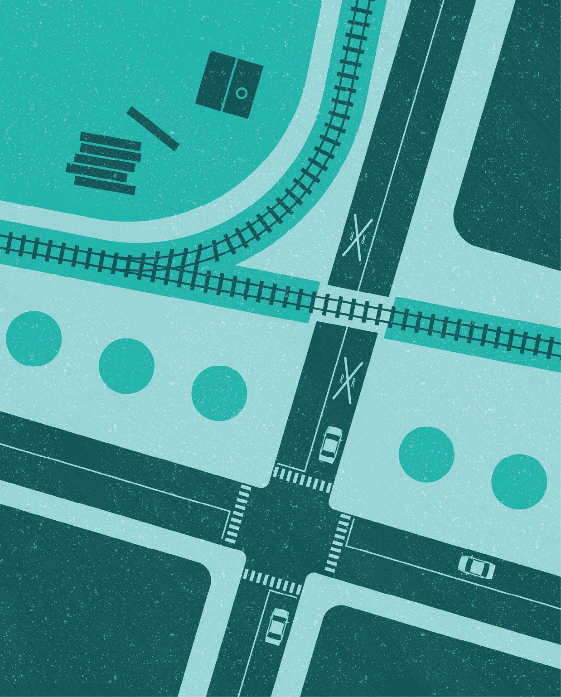
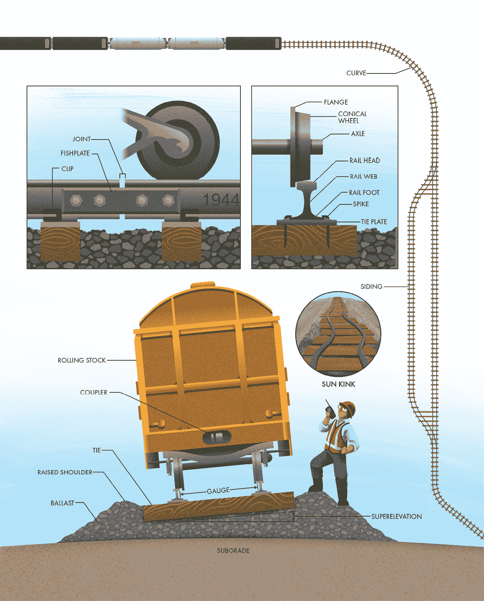
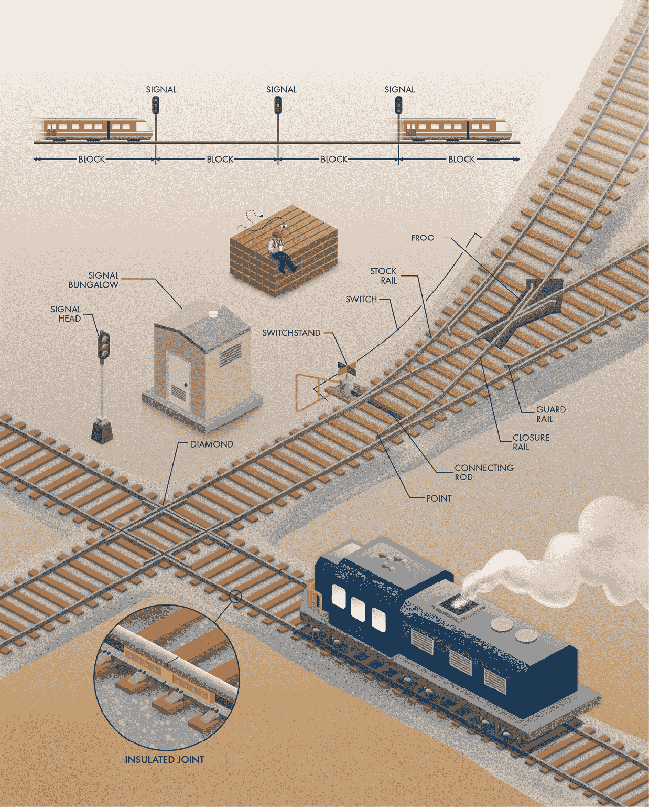
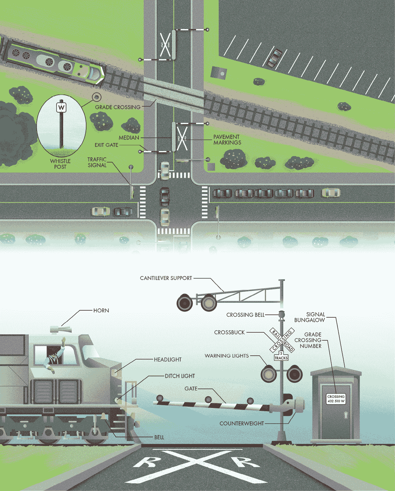
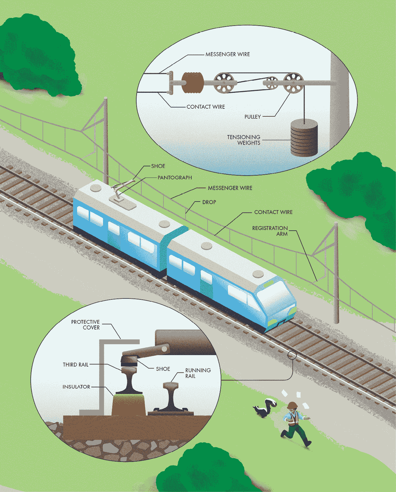

‌

# 第五章：铁路

## 前言

铁路是最早的陆上交通方式之一，它们与几乎每个国家的历史息息相关。在美国，铁路推动了巨大的扩展和经济增长，可能比 19 世纪的任何其他技术都要重要。今天，铁路依然是运输货物和人员的一个重要方式，连接着不同的地方。

铁路利用两个特点来提供快速高效的人员和货物运输。首先，钢铁轨道上的钢铁车轮几乎没有能量浪费在摩擦力上（尤其是与沥青上的橡胶轮胎相比）。尽管机车看起来庞大，但它们的引擎与它们所推动的巨大重量相比，几乎是微不足道的。如果你的汽车像铁路一样高效，它就能用一台小型的草坪修剪机引擎驱动。其次，更重要的是，铁路沿着专用的行驶通道行驶，这些路径相对直接且不受机动车辆交通影响。这些专用轨道带来了其他交通方式难以匹敌的可靠性。

与其他任何基础设施相比，铁路在全球范围内拥有一批忠实的爱好者（通常自称为*铁路迷*）。无论是由于对往昔时代的怀旧，还是单纯地喜欢近距离观看大型机械，铁路的细节总是令许多人着迷，且其中有许多值得欣赏的内容。或许比列车本身更有趣的是，它们所行驶的轨道上充满了值得观察和欣赏的独特细节。

## 铁路轨道

铁路轨道由所有必要的元素组成，以确保列车交通能快速而平稳地到达目的地。铁路最显著的特点就是轨道本身，它支撑着列车和货物的巨大重量。轨道是由高质量钢铁制成的，以承受这些巨大的压力。仔细观察时，你经常可以看到轨道背面上有标记，列出生产年份及其他关于轨道制造的细节。轨道的尺寸和形状可以有所不同，但它们大多遵循相似的形式：呈 I 形，顶部有一个膨大的部分，车轮在上面行驶，底部有一个平坦的部分与枕木相连接。

驱动火车前进所需的力量通过机车的驱动轮与轨道的摩擦转移到轨道上。令人难以置信的是，每个车轮与轨道接触的区域只有一个小硬币那么大。这意味着一列普通的货运列车就仅仅坐落在一块钢铁面积上，大小大致相当于这本书。

历史上，轨道的接头是通过鱼尾板连接在一起的。每个轨道段之间的接头会发出标志性的咔哒声，当列车车轮经过这些小缝隙时。这些小而频繁的不连续性会对铁路车辆（称为滚动库存）造成磨损，并让乘客感到不适。大多数现代铁路使用焊接轨道，以创造连续平滑的轨道，没有接头。

消除这些间隙的一个挑战是热胀冷缩。钢铁在低温下收缩，在高温下膨胀。许多结构通过使用伸缩缝来提供运动自由，而焊接轨道的轨道则限制了这种热胀冷缩的自由。在寒冷的日子里，轨道在试图收缩时会经历拉伸应力；在温暖的日子里，它们会经历压缩应力，因为它们试图从约束中膨胀。在某个中间点，称为*中性温度*，轨道不再受到热应力。如果周围温度偏离中性温度过多，轨道的应力可能会超过轨道的承载能力。在炎热的天气里，铁路可能会发生弯曲（也叫做日晒弯），从而导致脱轨的危险。为减轻弯曲的可能性，轨道通常在安装之前被加热或拉伸。这种技术提高了轨道的中性温度，以便炎热的日子不会使轨道承受过大的热应力。

有许多方法可以将轨道固定在水平枕木上（也叫做道床）。历史上，使用一个带有偏头的大钢钉将轨道两侧固定住。这些钉子在美国的一些铁路上仍在使用。更现代的铁路使用多种类型的重型夹具。在北美，由于木材丰富，枕木通常使用木材制造，但也可以使用混凝土制造。枕木有两个基本任务：承载来自列车上方的载重，并保持两条轨道之间的正确间距（称为轨距）。木枕通常配有枕木板，用于分散轨道的集中压力。

维护精确的轨距非常关键，因为列车是通过轨道保持在轨道上的。你可能认为，列车如果使用实心轴，会在转弯时遇到困难，因为外侧车轮需要转动得比内侧车轮更多。汽车通过驱动轮之间的*差速器*来使车轮在弯道上独立转动。滚动库存通过使用圆锥形车轮解决了这个问题。当列车转弯时，每个轴会发生偏移，因此外侧车轮在更大的半径上行驶，而内侧车轮则在更小的半径上行驶。这补偿了弯道内外侧的行驶距离差异。车轮的缘缘只是为了防止轨道受损或错位时，车轮脱轨的安全设计。在正常运行时，车轮缘缘不应该与铁轨接触。

铁路枕木并不直接放置在轨道下方的土壤上，也就是称为基床的地方。土壤通常不足以承受火车运输的巨大重量。因此，使用一种叫做道砟的松散岩石堆积物，将负荷均匀地分布到下层土壤中。道砟通常由碎石制成，因为其角状特征有助于它们相互嵌套，形成稳固的基础。道砟不仅能分散来自轨道的垂直压力，还能为每根枕木提供水平支撑，帮助抵抗由热胀冷缩产生的弯曲和由火车通过曲线时的水平力量造成的位移。许多路堤还在两侧设有加高的肩部，以提供额外的抵抗力，防止枕木在横向力量作用下移动。石砟之间的空隙允许水自由流动，而不是沿路堤两侧积水。

铁路的几何形状是其设计中的一个关键组成部分。与公路相比，铁路可以使用更窄的路权，因为铁路不需要在行车道两侧留出大面积的空旷区域。然而，火车需要比机动车能够通过的更平缓的曲线和坡度。车厢之间的联接装置无法应对急转弯。此外，曲线周围的向心力可能会给乘客和货物带来过大的压力。解决这个问题的一种方法类似于公路上使用的特性：抬高外侧轨道，使火车在过弯时向内倾斜。这种倾斜，也叫做超高或*外倾*，能减少火车所感受到的水平力。

至于垂直对接，火车在钢轨上没有足够的牵引力，无法在陡坡上有效刹车。较大的上坡坡度也会使火车减速，从而减少铁路的容量。下次你开车经过铁路时，观察一下轨道。虽然公路通常会跟随自然地形，但轨道的高度会保持更为一致，坡度变化也较为平缓。

轨道数量是铁路设计中的另一个关键考虑因素。单轨道的建设和维护成本低于双轨道，但也有一些缺点。最重要的一点是，行驶方向相反的火车必须有办法彼此通过。会车线（或*超车道*）是一段平行轨道的短部分，允许火车通过。单轨铁路的容量取决于这些会车线的数量。合理的调度安排可以最大化单轨道的使用，但如果使用两条或更多轨道，将显著提高铁路的容量和可靠性。

## 切换器和信号

将火车限制在轨道上可能看起来能消除交通流量管理的挑战。毕竟，当你只能朝两个方向中的一个前进时，做出决策的机会并不多。然而，要有效使用铁路，许多火车必须共享同一轨道。允许火车相互交互并绕开对方，需要一些巧妙的设计，正因为铁路如此受限于单一维度。

管理铁路交通的一个重大挑战是完全载重的火车停车所需的相当长的距离。与可以实时看到并响应危险的机动车不同，一列火车可能需要超过一英里的距离才能完全停下。如果列车员在全速行驶时看到轨道上的障碍物，那时已经太晚了。共享铁路的火车需要保持足够的距离，以便在必要时停车且不会发生碰撞，并且需要在不依赖列车员视力的情况下保持这个距离。

多年来，已经使用了许多管理多列火车交通的解决方案。最早的方法是简单地建立一个时间表，规定每列火车在一天中的何时何地应该到达。这个系统显而易见的局限性是火车可能会发生故障，或者遇到一些问题，导致无法按时执行计划。在最好的情况下，火车故障会导致所有其他火车的延误，而在最坏的情况下，它可能导致碰撞。大多数现代铁路交通控制方案改为基于区段系统。轨道被细分为多个区段（称为区块），火车只有在特定区块没有障碍物时才可以进入。对于没有信号的铁路，交通可以通过*许可证*进行管理。调度员为列车员提供标准化的授权，以进行主轨道上的特定列车调度。然而，大多数繁忙的铁路线路仍然使用信号作为控制区块之间交通的主要手段。

就像道路上的交通信号灯一样（在第三章中有讨论），铁路信号也告诉列车员何时可以安全前进。事实上，许多铁路信号使用不同的灯光组合，提供关于前方路线和速度限制的更多信息。即使在北美，许多铁路也使用不同的标准，因此解读信号的含义可能需要一些努力。最简单的信号是区间信号，它们通常只有一个信号头，带有三盏灯——绿色、黄色和红色——类似于道路交叉口使用的信号灯。绿色灯表示后续区间清空，火车可以继续全速前进。黄色灯表示下一个区间清空，但后续区间有障碍，下一个信号会表示停车。红色灯表示下一个区间被占用，火车无法继续行驶。

一些信号由调度员控制，但许多信号是通过*轨道电路*自动运行的。在最基本的配置中，低电压电流会从区块的一端引入到轨道中。在另一端，一个继电器通过测量电流来控制附近的信号。当火车进入区块时，车轮和轴承在轨道之间形成导电路径，从而短路电路并切断继电器的电源。轨道区块之间安装了绝缘接头，以确保相邻的信号不会被无意中触发。使用非导电材料将两段轨道连接起来，同时保持它们的电气隔离。现代轨道电路甚至能够提供每列火车的位置信息和速度。用于控制信号的继电器、电子设备和电池通常被隐藏在称为信号小屋的外壳内。

除了区块信号外，多个信号头和不同的灯光组合传递着各种含义，增加了更多复杂性。最繁忙的公司使用集中交通控制办公室，类似空中交通管制员的角色，来协调列车的时刻表和行驶路线，以避免冲突。现代交通系统为每列火车的驾驶室提供警告和信息，减少了人为错误的可能性。此外，最先进的信号系统还允许火车相互通信位置，使得区块能够随着火车一起移动，而不是像地图上的静态轨道段。

铁路交通管理的另一个关键要素是轨道之间的移动。火车经常需要互相超越，转向主线以外的目的地，或者在铁路调车场交换车厢和车体。如果没有办法在铁路之间过渡，火车将永远困在单一轨道上，无法完成这些任务。道岔（也叫*转辙器*）提供了火车换轨的手段。最基本的道岔类型使用两根叫做“尖轨”的灵活锥形轨道。火车的车轮被引导到两个方向之一，取决于两个尖轨中的哪个与固定轨道接触。轨道下方的连杆将尖轨连接到一个机构，决定火车的行驶方向。有时，轨道员工需要手动操作道岔的操作杆来控制道岔。或者，调度员可以通过电机*道岔机*远程控制道岔。

一旦越过这些接点，火车轮子会驶入两条轨道中的一条。然而，在到达主轨道之前，左轮必须越过对面轨道的右轨，或者反之亦然。这些交叉需要轨道上有一个间隙，轮缘才能通过，这个任务是通过道岔来完成的。当轮缘通过间隙时，交叉的轮子会从闭合轨道交接到道岔上。道岔旁边有防护轨，这些轨道与主轨道平行，用来保持轮子对准，防止脱轨。你还可以看到防护轨被用在急转弯处和桥梁上。

当两条轨道交叉但没有连接时，会安装一个钻石道岔。这些交叉由四个道岔组成，使每个车轮都能够穿越交叉轨道的两条轨道。道岔和钻石道岔都会受到来自列车日常运行的磨损。当车轮穿越间隙和接头时，会产生巨大的冲击力，这可能会损坏车厢和铁路本身。因此，道岔和交叉点会受到检查员的特别关注，以减少因故障而导致脱轨的风险。

## 路面交叉

铁路跨越了广阔的无人的区域，但在这些空旷的地方之间是它们连接的城市中心。铁路越靠近人口密集的地方，就越容易与其他基础设施发生冲突。最重要的是，铁路成为了行人和车辆交通流动的障碍。一些道路和铁路使用桥梁交叉，以避免中断，但许多交叉点是在同一高度。这些路面交叉是普通人最容易接触到铁路的地方。以全速行驶的列车无法在操作员的视距范围内停下，它们也无法急转弯避开障碍物。因此，在这些交叉口，列车总是优先通行。行人和机动车必须停下来等待列车通过，因此，路面交叉点包括了许多安全功能，以减少发生危险碰撞的可能性。

在许多国家，铁路平交道口会被分配一个标识符，称为平交道口编号，以简化事故和故障报告。现代铁路公司（及其监管机构）致力于公共安全，并对问题报告作出迅速响应。平交道口的安全设施通常分为两类：被动安全设施和主动安全设施。*被动警示装置*是指在列车接近时不会发生变化的警示设施，包括停车标志、让行标志和铁路平交道口的国际标志“十字架标志”（由两条交叉木条组成）。当有多个轨道时，补充板会标明交叉口处轨道的数量。十字架标志通常还会作为路面标记，以确保驾驶员知道即将到来的轨道。许多低交通量的平交道口仅使用被动安全设施。司机有责任遵守这些警示，留意列车，只有在确保安全时才可通行。

*主动警示装置*提供视觉或听觉警告，告知列车正在接近。它们通常由轨道电路触发，类似于自动区间信号系统（上一节中已描述）。像铁路信号一样，控制平交道口自动警示装置的继电器、电子设备和电池通常隐藏在外壳内，这些外壳通常被称为信号小屋。当列车接近交叉口时，一对红色警示灯开始闪烁，提醒机动车驾驶员停车。如果道路有多个车道，交叉口可能会在上方的悬臂支架上再安装一对警示灯。机械或电子铃声也为行人或骑自行车的人提供声音警告，以防他们看不到闪烁的警示灯。

除了灯光和铃声外，许多平交道口还配备了当列车穿越道路时会下降的栅栏。栅栏上装有反光带和灯光，以增加它们的显眼度，即使在夜间也能看见。许多交叉口设置了中央隔离带，以防止司机绕过栅栏。对于高风险交叉口，通常还会安装出口栅栏，原因相同。它们的工作方式是延时操作，以避免将车辆困在轨道上。大多数平交道口的栅栏设计用于提供视觉警示，但它们的强度不足以阻挡闯入的车辆。在高速列车经过的平交道口，可能会安装更坚固的*屏障栅栏*。

道口面临的一个挑战出现在城市地区，那里有信号控制的交叉口，靠近铁路。红灯会形成一条*排队*的车流，可能会倒退跨过铁轨。你绝不能在不确定另一侧清晰的情况下穿越铁路。不过，排队等红灯的司机常常会错误估计可用的空间，结果不小心停在了铁轨上。繁忙交叉口附近的交通信号通常会与自动警告装置协调配合。当火车接近时，信号灯会变绿，以清除堵塞铁轨的车流。

设计铁路道口时一个关键考虑因素是设备启动与火车到达交叉口之间的*警告时间*。工程师需要提供足够的时间让车辆清理道口或停车，但又不能太长，以免让不耐烦的司机认为设备出现故障，并尝试绕过栅栏门。人们天生对自动设备持怀疑态度，尤其是在信号操作缓慢或没有明显理由中断行程时，这种戒备心理会更加强烈。工程师会考虑交通流量和类型、信号交叉口的距离、铁轨数量以及其他诸多因素，以确保在安全和效率之间取得平衡。最先进的轨道电路能估算火车的速度，确保警告时间不会过长，甚至在火车停在道口前就可以取消警告。

自动警告装置设计时遵循“故障安全”原则。当发生故障或断电时，装置会恢复到最安全的状态（即假设有火车接近）。如果电源丧失，大多数装置都有电池来为闪烁的灯光和铃声提供电力。平衡重经过精心调整，以便在没有电力支撑的情况下，栅栏门能够自动落下。故障安全操作确保了如果警告装置出现问题，机动车辆不会无意间穿越铁路。

除了道口警示装置外，机车还会提供自身的警告，包括铃声、明亮的车头灯和较小的闪烁排水灯。最显著的是，它们会在每个铁路道口前鸣响刺耳的喇叭。标准的鸣笛模式是两次长鸣、一声短鸣，然后再一次长鸣。这个序列会被延长或重复，直到火车到达道口。如果你仔细观察，有时会看到铁轨旁边有一个哨声标志：这是一个短小的标志，放置在道口前，用来通知列车操作员何时开始鸣笛。在美国，这种标志通常是一个带大写字母 W 的小白标牌。

尽管有这么多种警告标志，人们在过铁路道口前可能会认为能注意到火车是否即将驶来，但全球每年仍然发生数百起列车与机动车辆之间的致命碰撞。如果你在开车时看到铁路道口标志，请务必停车，仔细听并左右观察后再通过铁轨。

## 电气化铁路

几乎所有现代火车都使用电力驱动。即使是货运机车上的大型柴油发动机，也会连接到一个电力发电机，通过电动机为火车提供牵引力。电动机消除了直接从发动机驱动车轮所需的庞大而复杂的传动系统。由于电力可以跨越长距离相对简单地传输，许多人不禁想知道是否真的需要车载发动机。事实上，许多铁路已经实现电气化，即直接为火车提供电力驱动。

电气化铁路有许多优势。首先，火车不需要承载大型发动机及其所需的庞大燃料。与柴油机车相比，电力驱动的火车通常速度更快、效率更高。去除发动机也去除了其排放，改善了空气质量。这个特点对于穿越隧道或地铁系统的火车尤为重要，因为在这些地方，发动机排放物可能会集中到危险水平。几乎所有的快速轨道交通系统都使用电气化铁路。最后，电动火车在刹车时能够回收电能。与其将动能转化为刹车时浪费的热量，电动机可以作为发电机，将其转化为其他火车可以使用的电能。在快速轨道交通中，由于火车迅速减速，*再生能源*通常以短时间的脉冲形式出现，导致它对其他火车的实用性降低。然而，在多丘陵的地区，这种方式可能大有裨益。在理想情况下，火车在攀爬大山时消耗的大部分能量可以在下坡时回馈给系统，供其他火车使用。

全球有许多电气化铁路标准，其中很多标准已有 100 多年未作更改。许多系统使用直流电，因为直流电机的转速可以通过驾驶室中的简单设备轻松调节。然而，低压直流电在导体中传输时会有较大的能量损失，因此大多数直流电铁路需要定期设置变电站，将电网电力转化为直流电，沿轨道供电。交流电可以在较高的电压下传输，然后在火车内部降压。然而，交流电更危险，并且需要额外的设备将交流电转换为牵引电动机所需的电流。

为了为行驶中的列车提供电力，所需的基础设施可能相当复杂，其成本是较长且低运量铁路很少进行电气化的主要原因。为列车提供电力有两种主要方式：第三轨和架空线。第三轨系统使用沿轨道平行于主轨道的带电导体。带电轨道位于绝缘体上方，以保持其与地面的隔离。列车配备有滑动鞋，沿第三轨滑行以收集牵引电力。这是一个简单且有效的系统，但它确实会为铁路附近的人或动物带来触电风险。为了安全，需要严格控制铁路的使用权，包括围栏和警示标志。许多第三轨配有保护罩，以减少铁路工作人员受伤的可能性，并防止雨水、雪和冰积聚在轨道表面。

另一种为列车提供电力的方式是通过架空线路。架空线路更为安全，因此大多数高压系统都安装在轨道上方。在这种设置中，电流收集器位于列车顶部。有几种不同的设备可以执行这一任务，但大多数现代列车采用弓形接触器。它们使用弹簧加载的臂来保持可更换的石墨鞋与架空导体之间的接触。这个概念很简单，但在实践中却非常复杂。看看标准的架空电力或公共事业线路，你会立刻注意到挑战所在。它们在跨度的中部下垂。由于在高速度下，每个支撑点之间的高度差异如此之大，因此维持接触几乎是不可能的，因此架空铁路供电系统使用一对导线，以确保电力可靠地传输到列车。顶部的导线称为信号线，仅用于支撑。它在电杆之间形成的弯曲形状称为*悬链线*，因此这个名字通常用于描述整个系统。从信号线出发，垂直支撑被称为下垂线，它们连接到下面的接触线，这就是弓形接触器所依靠的线路。

双导线系统使得接触线在轨道上保持一致的高度，这使得弓形接触器可以在其上以快速速度滑动。两根导线都带电以传输牵引电流，且它们通常通过悬挂在两侧滑轮上的重物保持张力。这种张力可以消除松弛，减少由于温度变化引起的导线下垂。张力还增加了沿导线传播的波速。它使得振动变得更小且频率更高（就像吉他弦一样），以减少弹跳，这样每当接触线和弓形接触器分离时，就能减少电弧的产生。接触线以水平之字形模式通过登记臂支撑，使得弓形接触器的鞋面能够均匀地磨损。

电路需要一个回路，因此电气化铁路需要第二根导体来完成连接。在大多数电气化铁路中，回流电流通过钢制轨道流动，轨道上是轮子滚动的地方。只要与地面连接良好，轨道上的电压就会保持在足够低的水平，避免对人类和动物构成危险。然而，回流电流会带来一些工程挑战。例如，轨道通常是信号电路的传输路径。如果轨道承载回流电流，微弱的轨道电路信号会被淹没。电气化铁路通常使用交流轨道电路来控制信号。用于检测列车的继电器可以设计成带有滤波器，以捕捉特定频率并忽略轨道中的牵引电流。

使用与地面接触的轨道作为回流路径的另一个主要问题是走漏电流。电流的流动可能会偏离预期，进入附近的管道、隧道衬里、公用设施管道以及其他金属结构。这些走漏电流如果没有得到有效抑制，可能导致快速腐蚀。一些铁路系统使用第四轨或额外的架空导体，提供一个较不容易偏移至附近金属物体的回流路径。
