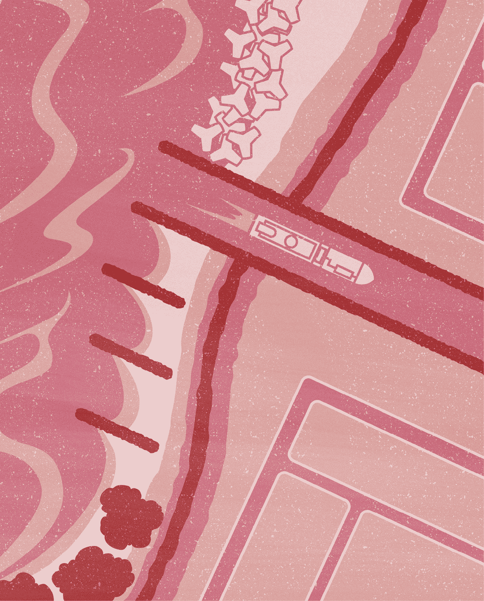
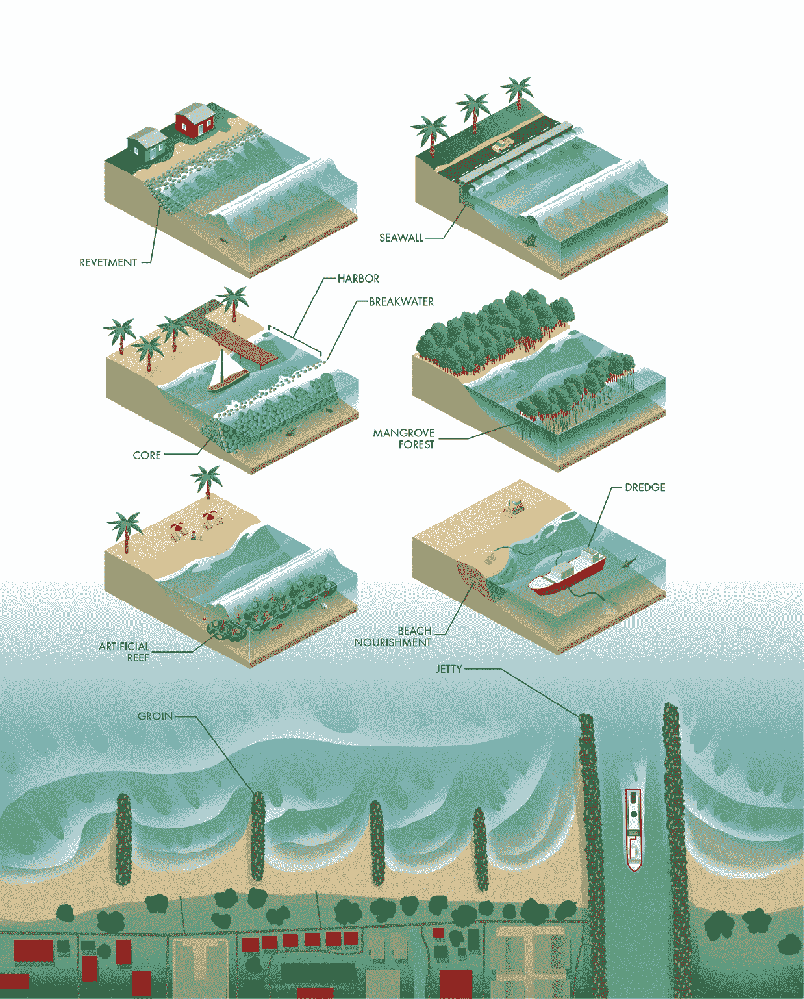
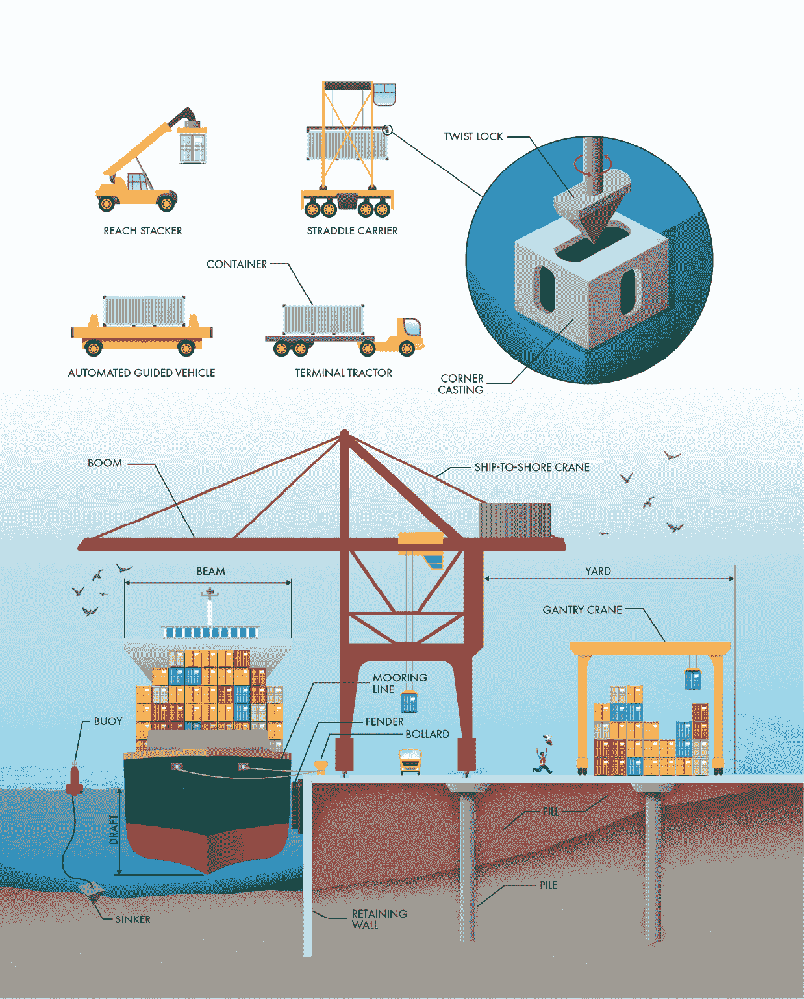
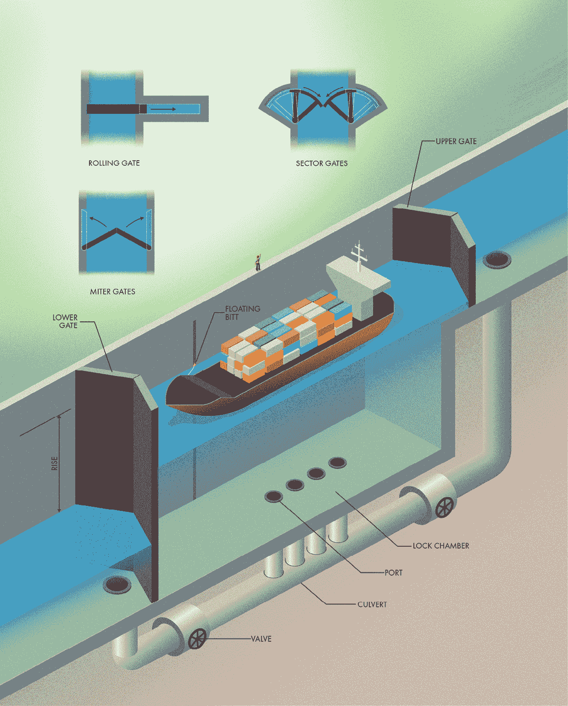
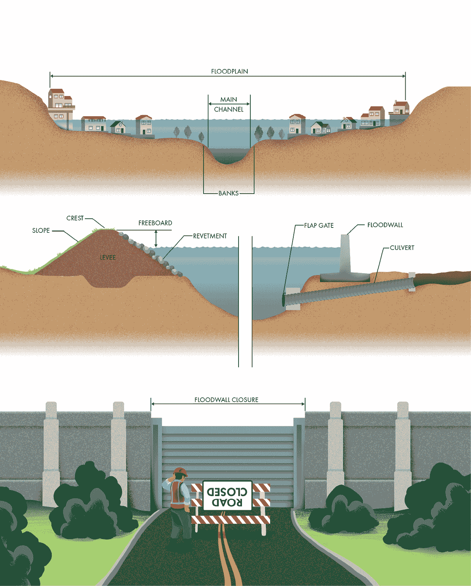
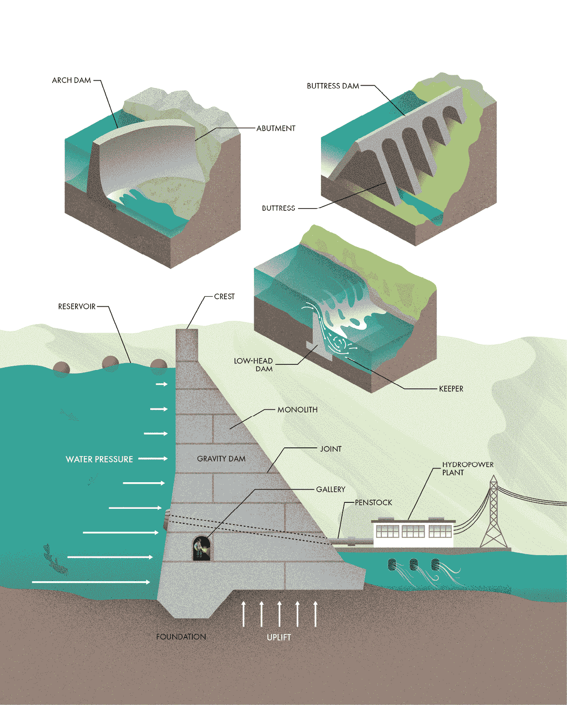
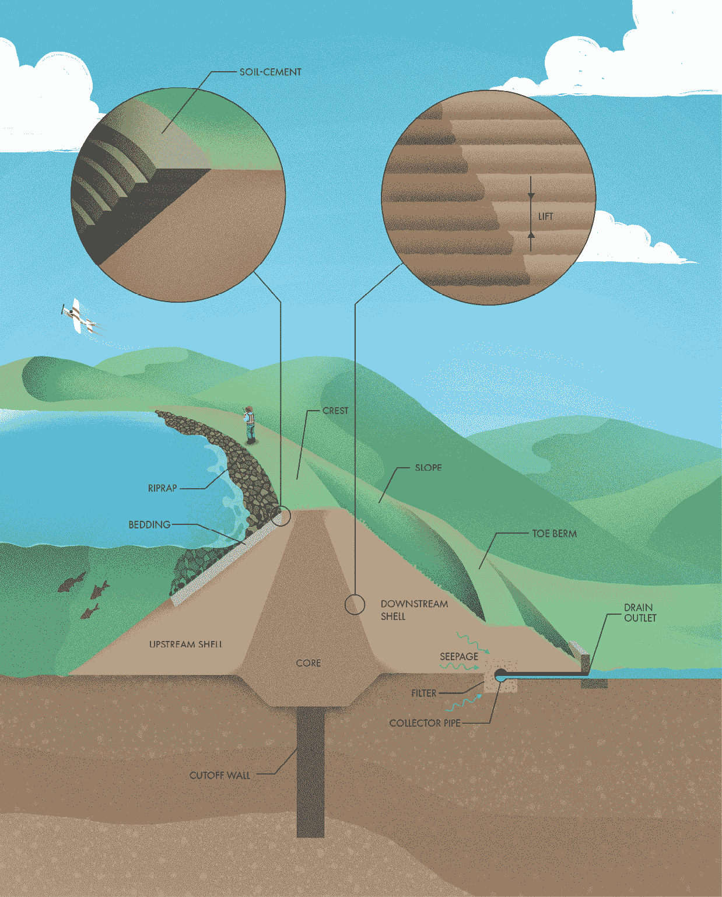
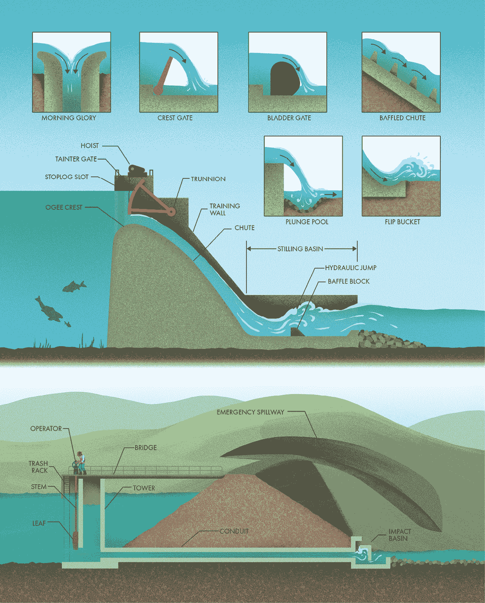

# 第六章：大坝、堤防和海岸结构

## 前言

就像我们呼吸的空气一样，我们的生活几乎围绕着水转动，这一点常常被我们视为理所当然。水不仅是生理上的必需品，而且还充当着动力源泉，是货物和乘客运输的手段，也是进行娱乐活动的绝佳场所。水还为大量水生植物和动物提供栖息地。另一方面，水也具有破坏性，会造成洪水，破坏财产并危害公共安全，侵蚀河岸和海岸线。由于水的绝对必要性和无处不在的威胁，我们的基础设施中很多都致力于控制和管理水资源。

世界上许多最大、最复杂的项目都是为了保护免受或利用地球丰富的水资源而设计和建造的。我们建造了巨大的大坝来创建储存淡水的水库，修建了广泛的水道网络用于航运，还在世界各地建造了巨大的防洪和海岸保护设施。这些设施中的许多甚至吸引了足够的关注和公众兴趣，设有自己的旅游中心，为游客提供安全的观察视角，并有机会了解它们的历史和技术细节。下次经过一个大型大坝、港口、船闸或堤防时，不妨停下来参观游客中心，参加一次导览，顺便买一件纪念 T 恤！

## 海岸保护结构

海岸线在地图上可能看起来静止不动，但它们是世界上最具动态性的地方之一。海岸受到大量自然破坏性力量的影响，包括风、波浪、潮汐、洋流和风暴。人类也通过疏浚航道、修建水道、在海岸上建造结构以及在上游水库中截留沉积物，防止它们到达海岸，影响着海岸线。难怪我们的海岸线随着时间的推移不断变化和转变。构成海岸线的土壤和岩石处于持续的变化中，不断从一个地方被偷走，沉积到另一个地方。

海岸线对人类至关重要，不仅仅是因为美丽的日落。许多我们最大的城市都坐落在海岸线上，因为海运和渔业带来了机会。此外，海滩支持当地经济，通过旅游业为世界各地提供数百万个就业机会和数十亿美元的经济活动。海岸侵蚀是对我们基础设施、开发区和航运水道的持续威胁，威胁着海岸沿线的建筑物以及大量沿海人口的生计。许多海岸工程集中在我们如何保护海岸线，以及如何应对那些导致海岸线随着时间推移发生变化和消失的破坏性力量。

最基本的海岸结构之一是护坡，它是在自然坡度上覆盖的一层硬质护甲。护坡通常由大块石头或混凝土块构成，能够承受不断撞击的波浪和潮流的力量。使用石块或混凝土块还能吸收每一波浪的能量，减少波浪向坡顶的传播距离。与护坡类似，海堤是一种与海岸平行的垂直结构，用于保护上方的陆地免受侵蚀。海堤通常由加固混凝土建造。许多海堤具有一种叫做*弯曲*的形状，能够将波浪能量引导回海中，减少水流越过海堤的可能性。海堤通常建造在高于正常高潮的高度，以防止洪水和风暴潮。它们通常将它们保护的开发区与下面的沙滩隔开。

防波堤是另一种用于保护海岸区域免受海浪侵害的平行结构。与护坡和海堤不同，它们不与海岸相连。相反，防波堤建造在海上，以消散波浪能量，并为沿海的船只和建筑物创造平静水域区域，这些区域被称为港口。防波堤可以由多种材料制成，但最常见的是由岩石碎石堆砌而成。防波堤的核心通常使用较小的岩石，以减少波浪能量通过结构的流动，而外层则由较大的石块组成，这些石块能更好地抵御波浪。

另一种保护性结构叫做堤坝，它伸入海中，以对抗*长岸漂移*，即沉积物沿海岸平行移动的过程。与防波堤类似，堤坝通常由岩石或碎石堆砌而成。随着时间的推移，堤坝会捕捉到海洋流动中的悬浮沙子，从而形成沙滩（这个过程叫做*沉积*）。如果尺寸合适，堤坝还可以通过减缓海流沿海岸的速度和力量来保护下游区域。然而，过大的堤坝会使海流失去所有沉积物，无法补充海滩上的沙子，从而加剧了未保护海岸的侵蚀。建造一个堤坝后，通常需要修建更多的堤坝来保护下游区域，最终形成延伸很长的锯齿形沙滩。

与堤坝类似，码头是垂直于海岸线建造的结构。它们通常成对修建，以保护航道入口，通过将其口延伸至海洋来防止沉积物进入航道。它们不仅阻止了沉积物进入航道，还限制了海水在潮汐变化中的流动，加速了水流，从而冲刷底部沉积物并减少其积聚。

这些硬质防护结构通常能为侵蚀提供长期解决方案，但也可能带来意想不到的后果。举个例子，光滑的混凝土海堤会反射波浪，而不是吸收波浪，这可能导致更远的海岸侵蚀加剧。这些结构也可能影响海洋中的栖息地质量，带来环境挑战。尽可能地，沿海工程师倾向于寻找“更软”的侵蚀解决方案。其中一种方法是种植或维持可以在潮汐带沿岸生长的树木和灌木。这些被称为红树林森林，它们密集的根系吸收波浪能量，保护沿海的土壤。

另一个应对海岸侵蚀的软性解决方案是创建人工礁，为鱼类、珊瑚和其他海洋生物提供栖息地。许多材料已被用于构建人工礁，包括岩石、混凝土、沉船甚至是沉没的地铁车厢。这些礁石为海洋生物提供附着或躲藏的表面，同时还具有消散海浪能量的副作用，充当水下防波堤。

另一种软性解决方案是通过补充失去的物质来逆转侵蚀过程，这种技术通常被称为沙滩营养。沙滩不仅是重要的休闲区域和经济驱动力，还是开发与大海之间的缓冲区。它们在风暴和波浪能量到达开发区域之前将其消散，但在过程中，沙子可能会被带走或冲入更深的水域。补充失去的沙子能够保护海岸结构并创造休闲空间。沙滩营养通常通过使用挖泥机从海底借取沉积物，并将其作为含水泥沙浆通过管道泵回海岸来实现。沙浆会排放到岸上一个大水池中，允许水分排出并使沙子沉淀下来，然后使用土方设备将其均匀铺开。这种沙滩营养方法具有环境影响，且并非永久解决方案，但它是应对海岸侵蚀的常用工具。

最后，有时候保护海岸线开发不受损害的最便宜方案就是让它根本不存在。这种策略通常被称为*撤退*，包括购买和征用财产，或将建筑物和基础设施迁移到离海岸更远的地方。在某些情况下，最好的工程方法是让大自然发挥其最佳作用：让海岸线保持生机勃勃和动态变化，这正是人类最初被它吸引的原因。

## 港口

海运是现代生活中不可或缺的一部分。如今人们不再像以前那样通过船只长途旅行，原因在于速度较慢，但*航运*这个词的由来是有原因的。我们依然每天使用船只在全球范围内运输大量货物，保持着从原材料到成品的复杂供应链。水路运输之所以仍然存在，是因为船只效率高。即使是最庞大的货物，一旦漂浮在水面上，搬运几乎毫不费力。在船上运输一吨货物相同的距离，所需的能量大约是火车的二分之一，卡车的能量消耗大约为五分之一。此外，航运是物品跨越那些没有陆路连接的地区的主要运输方式。

*港口*是连接海上和陆路运输方式的枢纽。简单来说，港口是船只可以停靠的地方，但这一简单功能掩盖了现代海运设施的巨大复杂性。港口不仅位于沿海城市，还位于河流和内陆水道的城市。港口通常由多个*码头*组成，货物或人员（在邮轮的情况下）的装卸工作在这些码头进行。每个码头都专门设计，用于快速高效地装卸特定类型的货物。*散货船*用来运输未包装的货物，如谷物和矿石，通常通过大型输送机或斗式起重机进行服务。*油轮*用来运输液体货物，如石油，通常通过巨大的软管进行装卸。大多数运输包装货物的货船使用集装箱，这些标准化的钢铁箱可以通过起重机轻松地在火车、卡车和其他船只之间转移。

集装箱码头是商业港口最具辨识度的部分之一，那里有巨大的起重机和五颜六色的钢铁箱堆。巨大的船对岸起重机通常安置在轨道上，能够穿越货船的长度，每两分钟就能装卸一个集装箱。

有时集装箱会在不同的运输方式之间直接转运（主要是卡车、火车或其他船只），但通常它们必须先存放在堆场，直到下一班交通工具到达。货物的集装箱化带来了一个难题，因为每堆集装箱中只有最上面的一个可以访问。要到达堆底的集装箱，就需要将上面的所有集装箱搬开。计算机管理系统优化了每个集装箱的摆放，以减少将它们送达目的地所需的搬运次数。

各种各样的车辆被用来处理和搬运集装箱，且在现代港口中，集装箱的控制越来越多地实现了自动化。码头拖车（有许多别名，包括*搬运车*）是小型半挂卡车，用于在场地内运输集装箱。自动导引车辆执行相同的任务，但不需要人工驾驶。伸臂堆高机和跨轨运输车能够将集装箱运输并升降至堆垛顶部。门式起重机跨越长排的堆叠集装箱。这些车辆不是使用钩子，而是采用一种叫做*伸缩器*的装置来提升每个集装箱。每个集装箱都配有加固的角铸件，四个旋转锁定装置锁入每个铸件上的椭圆形孔中。旋转锁定装置旋转 90 度，将伸缩器与集装箱牢固连接。旋转锁定机制简洁而巧妙，广泛安装在船只甲板、卡车和火车上，及每个集装箱的堆叠之间。它们负责每天将数百万个庞大的钢铁集装箱固定到位。

尽管海事术语在地区和全球范围内有所不同，但作为码头边缘的结构通常被称为*码头*或*岸壁*。码头可能包括一个或多个*泊位*，即船只的停靠点。每个泊位上有几个大型系缆柱，船只的系缆线会固定在这些系缆柱上。船上的*绞车*保持这些系缆线紧绷，以减少装卸过程中船只的晃动。此外，泊位两侧的防撞条起到缓冲作用，保护码头和船体免受损坏。传统上，旧轮胎被用作防撞条，但现代港口使用专门为不同类型和大小船只设计的防撞装置。

设计港口设施时最关键的决策之一是能容纳的最大船只，称为*设计船舶*。容纳更大的船只会使港口设施的建设和维护成本增加，但它可以带来更多的交通量和收入，因此需要仔细平衡。设计船舶的长度决定了每个泊位的长度和港口的整体规模。船宽会影响用于装卸货物的岸桥的吊臂大小，而吃水深度则决定了港口底部的最小深度。通过使用挖掘机或吸管从水道底部清理沉积物来维持这一深度。船舶设计师（称为*船舶设计师*）试图使船只尽可能大，同时确保它们能够通过将遇到的运河、船闸和港口。事实上，许多船舶类型是根据它们几乎无法进入的设施命名的；例如，Suezmax 船是能够通过苏伊士运河的最大船只。

码头必须是坚固的结构，能够承受风、波浪、潮汐、洋流以及船只系缆线所产生的极端力量，日复一日地稳定运作。此外，码头需要相当高，以便让巨型船只能够直接停靠。许多码头是建在填土上，填土是通过运送到现场并压实在原地形成坚固基础的土壤。挡土墙加固了填土，同时允许船只驶至边缘。当现场地质条件不适合支撑港口设备和货物的重量时，码头可能会依靠桩基支撑。这些垂直的钢或混凝土构件被钻入或打入地下土壤，深埋在下方，以防止码头随着时间推移而沉降或移动。

水路使用许多航行辅助设备，帮助船员安全地引导船只。浮动装置，被称为浮标，划定了可航行的水道和危险区域。就像道路标志一样，它们使用标准化的颜色和符号来传达规则和信息。它们通常通过链条和锚固定在指定位置。链条有足够的松弛度，可以吸收来自波浪、风和水流的冲击负荷，并适应潮汐带来的水位变化。锚可以是一个重物，称为沉锚，或者是一种被打入或钻入地下土壤的装置。

## 闸门

水路运输有其局限性，即并非所有地方都能通过船只到达。我们通过建造水道或运河在一定程度上克服了这一障碍。历史上最早的文字记录就描述了运河和航运。即使在几千年前，人类也试图让无法通航的地区能够通过船只通行。然而，另一个限制更难克服。水是自我平衡的。与道路或铁路不同，你不能在斜坡上铺设水以便上下山。理想的运河应保持整个长度都在同一水平面，但在陡峭地形的地区，这需要大量的挖掘，几乎是不可能完成的。与其开挖巨大的峡谷以保持运河在一致的高度，我们通过使用航行*闸门*将船只上下移动，就像楼梯上的台阶一样。

闸门由一个密闭的水室组成，两端都有大型门。闸门的工作原理非常简单。一艘上行船只进入大部分为空的水室，关闭下方的门。然后，允许上方的水进入，填充空间，抬升船只。当闸室内的水位与上游水道的水位相同时，便可完全打开上方的门，船只可以继续前进。下行的过程与此类似，只不过是反过来的步骤。船只进入已经充满水的水室，关闭上方的门，允许闸室内的水排出。当水室内的水位与下游水道的水位相同后，便可完全打开下方的门，船只继续行驶。这是一个完全可逆的提升系统，在最简单的形式下，除了水本身外，不需要任何外部动力源来工作。

河流上的船闸可以与水坝结合使用，水坝用来蓄水并在需要时排放洪水。大多数适应大型船只的现代船闸是由钢筋混凝土建造的。它们有墙壁和地板，就像一个巨大的浴缸。船闸的进水口设计为直线形，避免横流，这样船只可以轻松地排队进入船闸。小型船闸常用于休闲船只，通常可以自助操作，但繁忙水道上的大型船闸则需要工作人员全天候操作，以升降船只。

每个船闸室两侧的门本身就是工程奇迹。大多数船闸使用斜门，它们由两扇门叶组成，像巨大的铰链门一样，向中央关闭。门叶不是直线关闭，而是以指向上游的角度相遇。来自上方水流的压力迫使门紧紧关闭，确保它们在船闸操作过程中保持密封且无泄漏。在某些地方，特别是在受潮汐影响的区域，下游水位可能会高于上游水道的水位。在这种情况下，斜门无法正常工作。扇形门则可以作为斜门的替代品，能够承受来自两个方向的水压。扇形门的形状像切开的派块，在连接点上铰链相连，并在中间汇合。一些现代船闸使用滚动门代替铰链门，这些门通过滑动进出一个可以抽干水以进行维护和修理的凹槽（而不是需要完全移除每个门）。

在所有船闸中，下门是主要的工作门。上门只需要足够高，以便船只在船闸充水时能进入。下门则必须抵挡住从船闸顶部到底部的水压。水压随着深度的增加而增大，因此，具有较大升降高度的船闸要求下门能够承受极大的压力。当一条运河需要跨越较大的高度差时，会使用多个小型船闸串联（称为*飞跃*）而不是单个大型船闸。

填充和排空船闸的水位系统是其工程设计中另一个至关重要的部分。许多船闸是水道交通的瓶颈，因此操作员尽力缩短船只通过的时间。试想，每天要填充和排空一个巨大的游泳池三十次或更多次，同时池中还有人。在船闸中也类似，你不能只是打开上闸门让水流进来。首先，水位差造成的压力让打开闸门几乎不可能。更重要的是，水的进出会危及通过船闸的船只。相反，大多数船闸使用一个单独的系统来填充和排空船闸。最简单的方式是在每个闸门中设置一个较小的闸板，有时被称为*桨*，它可以被打开或关闭。大型船闸则通过涵洞将水从船闸两侧或底部的出口处排出。两个阀门控制水流。上闸门的阀门打开时，船闸被填充，而下闸门的阀门打开时，船闸就会排空。设计这些出水口时特别注重避免产生危险的湍流、喷流或水浪，这些可能会使船只翻覆。

即使有一个精心设计的蓄水系统，船闸仍然可能是一个动荡的空间。船只需要固定在原位，以避免与闸门或墙壁发生碰撞。然而，系船索不能附着在闸墙的顶部。对于向上移动的船只，它们会立即变得松弛。对于向下移动的船只，它们甚至可能把船只拉出水面！较小的船闸需要船员根据水位的升降来收紧或放松系缆索。较大的船闸则使用浮动的缆桩，它们沿着垂直导轨滑动，确保船只在上升或下降过程中保持固定。

## 堤坝和防洪墙

每年，洪水都会影响到有人居住的地区，造成生命损失和数百万美元的财产损失，摧毁社区，甚至使当地经济陷入停滞。如果你曾亲身经历过一次，你就知道面对大自然时那种无助的感觉。我们无法改变降水量，但我们已经开发出一些方法来管理水流，一旦它流入陆地，以限制它对生命和财产构成的危险。

河流泛滥特别难以管理，因为其影响不是线性的。在主要河道中，正常的河流流动发生时，水位的上升只会稍微增加淹没面积。陡峭的河岸限制了水流。然而，河道上方的地形往往宽广平坦，适合农业和城市开发。当河流的水位超过河岸时，即使是水位的微小上升也能造成广泛的淹没区域。这些河岸上方的区域通常被称为洪泛平原，因为它们非常容易受到溢出水流的影响。解决河流泛滥的一个结构性方案是提高河岸的高度，以防止水流进入已开发区域。

提高河岸最常见的方法是简单地收集附近的土壤并堆积成堤防。这些结构被称为堤防或*dikes*，几个世纪以来一直用于引导和拦截水流。它们也被用于沿海地区防止风暴潮的侵害。尽管概念简单，但现代堤防依赖先进的工程技术来保护低洼地区免受洪水的侵害。毕竟，土壤并不是最强大的建筑材料，尤其是在面对快速流动的水时。工程师会根据可用于建设的土壤性质指定堤防的坡度和压实要求。

洪水期间的急流可能会造成侵蚀，损坏堤防的河侧。堤防的坡面通常会种植草坪，因为密集的根系可以防止侵蚀。长时间的洪水或高波浪可能会让堤防包括石材或混凝土护坡，这种护坡称为回填层，以提供额外的保护。由于土堤随着时间的推移可能会恶化，因此维护至关重要。堤防必须保持无树木和木本植物的生长，这些植物在洪水期间可能会被连根拔起或摧毁。还应阻止钻洞动物在堤防中筑巢，因为它们的洞穴可能会为水流渗透土壤结构提供通道。

尽管堤防相对便宜且简单，但由于其梯形结构，它们占用了大量土地。一种更昂贵但节省空间的替代方案是建造防洪墙。这些墙通常由加固混凝土制成，具有与堤防相同的功能，即提高河岸的高度以限制水流。由于防洪墙由比压实土壤更具韧性的材料制成，因此它们也不容易受到长期的侵蚀。

堤坝或洪水墙的高度是一个至关重要的决定。洪水的潜在规模几乎是无穷无尽的。如果你能想象一场大风暴，你大概也能想象出更大的风暴，这意味着防洪基础设施必须在建造成本和提供的保护量之间找到平衡。在美国，许多堤坝和洪水墙的设计是为了防止*百年一遇的洪水*，这是一个有些令人困惑的术语，用来表示一个简单的概念。由于我们有全球广泛的降水历史记录，我们可以估算任何风暴的严重程度与发生概率之间的关系。百年一遇的洪水是该线上的一个参考点：指的是一种理论上的风暴，它在某个特定地点的某一年发生的概率为 1%。虽然这个名称意味着它每百年才会发生一次，但 1%的年发生概率等同于 30 年内有 26%的概率发生这样的风暴。在 50 年内，这个概率接近 40%，几乎像掷硬币一样。

设计百年一遇的洪水防护是我们承认防范所有洪水并不具成本效益的方式，但我们可以设计基础设施，以确保 99%的时间内能够抵御洪水。为了设定堤坝或洪水墙的最高点，工程师们利用历史洪水记录和水力模型来估算百年一遇的洪水会在河流沿岸达到多高。然后，他们会加上一些额外的高度，称为自由板，以应对不确定性，并防止波浪超越结构的顶部。

完全用堤坝或墙壁围住一个有洪水风险的区域并不总是可能的。首先，道路和铁路需要一种方式穿越受保护的区域。由于没有足够的空间或资金建造坡道或桥梁跨越每一道墙，因此我们偶尔会留下一个空隙，称为**闭合口**，通过这个空隙，公路或铁路可以通行。每个闭合口处的钢门必须在洪水来临前关闭，以完成周围的防护。当然，闭合口只适用于沿着主要流域的区域，因为这些地方的洪水通常是逐渐到来的，并且有一定的预警。开放的门会彻底破坏洪水墙或堤坝的效果，因此在易发生暴雨的地区不能使用闭合口。

此外，围绕低洼地区修建堤坝，会在暴风雨期间形成一个蓄水盆地，可能导致水流涌入堤坝的另一侧。堤坝需要一种方法，允许排水通过而不让河水在洪水期间倒流回受保护的区域。一些大型系统使用泵将当地排水从低洼地区抽出，但泵可能非常昂贵。叫做涵洞的管道可以穿过堤坝和防洪墙，或其基础，允许通过重力排出封闭区域的水。这些涵洞配有闸门（洪水期间必须手动关闭）或自动防止回流的设备，称为*止回阀*。翻板闸门是一种常见的止回阀，能抵抗来自相反方向的水压而密封关闭。

尽管堤坝能保护低洼地区免受洪水侵袭，但它们也可能带来新的问题。由于堤坝将河水的力量限制在一个较小的空间内，水流的高度和速度比没有这些结构时要高，这可能加剧下游洪水的影响。即便有了卓越的工程技术，我们“控制”大自然的能力通常也是脆弱的。洪水控制基础设施在发达地区至关重要，但它必须与河流自然洪泛区的管理和尊重相结合。

## 混凝土大坝

水是地球上最重要的资源之一，但水文循环具有极大的变化性。从干旱到洪水及其间的各种情况，实现持续的水供应可能是一个重大挑战。我们无法控制降水的多少和频率，但我们可以通过发展储存设施，平衡每年水流的高峰和低谷。修建跨河谷的大坝会形成一个*水库*，这是一个储水的地方，可以随着时间的推移，用于灌溉农田、为城市供水或发电。

水库也可以保持空置，以应对恶劣天气，允许大坝拦截洪水并逐步释放，从而减少对下游的破坏。（排水口用于排放水的内容将在后续部分讨论。）许多大型大坝同时具有多重功能，利用水库内不同的区域，称为*水池*。一个水池可以保持满水，用于水力发电或供水，另一个水池则保持空置，以便在发生洪水时用作储存。如果大坝用于发电，通常能在下游看到容纳涡轮机和其他设备的水力发电厂。如果该厂与大坝没有连接，你也可能看到输送水至涡轮机的大直径管道，称为压力管道。

水坝可以使用多种不同的材料建造，但许多最大且最具代表性的结构都是由混凝土制成的。（接下来的部分描述了由土壤和岩石建造的水坝。）混凝土坚固且耐用，能够承受水库中水的巨大压力。与许多大型结构通过重力作用垂直承受荷载不同，水坝上最重要的力是水平的。随着水库深度的增加，对水坝上游面施加的压力也会增大。水也可以通过水坝基础中的孔隙和裂缝泄漏，产生压力，称为“提升力”。承受这种压力的关键任务是每座水坝设计和外观的重要因素。

重力坝仅通过其自重来抵抗水的压力。混凝土相当重，具有足够的质量，结构就能稳定到足以避免因水平力量而翻覆或滑动。重力坝通常在基础处较宽，那里水压最大。它们逐渐收窄至顶部，有时宽度仅足够让车辆通过，从而在下游侧形成典型的斜坡。同样，支墩坝使用三角形支墩将水库的力量转移到基础上。水压仍然会推动水坝向水平方向移动，但上游斜面同样利用水的重量来提高稳定性。支墩坝需要的混凝土较少，但它们也需要更多的劳动力来构建所需的复杂形状以确保稳定，因此在现代通常不具经济性。

与重力坝和支墩坝不同，拱坝将水库水的主要力量转移到水坝两侧的桥墩，而不是基础上。像拱形桥（在第四章中描述的那样），拱坝利用几何学来跨越一个空隙。由于它们不太依赖于自重，拱坝需要的混凝土较少，因此在建造时可能更加经济。然而，拱坝只能建造在具有有利地质条件的地方，因为支墩需要抵御大部分试图将结构推向下游的水库压力。因此，拱坝最常见于狭窄的岩石山谷中。一些支墩坝被设计为*多拱坝*，其中每个较小的拱由支墩支撑，而不是一个单一的拱跨越整个山谷。

混凝土大坝并不是作为一个整体的固体块体建造的——混凝土在从液体固化成固体的过程中会收缩，这可能导致裂缝。此外，温度变化会导致混凝土在一年中的膨胀和收缩，这也可能引起裂缝。人行道或车道上的裂缝可能没什么问题，但在大坝中，裂缝可能成为泄漏点，从而削弱和损坏结构。混凝土大坝是由较小的块体构成，称为独立块体（monoliths），并且有水平和垂直的接缝，以提供运动的自由，减少裂缝发生的可能性。与可能在固体混凝土结构中形成的随机裂缝不同，接缝通过嵌入的止水带和密封剂容易密封防止泄漏。尽管你从外面看不见它们，但许多混凝土大坝内部都有隧道，称为*画廊*，用来收集任何泄漏的水并让工程师从内部监测结构的完整性。画廊还为大坝基础内部的排水提供了位置，减轻压力。

另一种混凝土结构，通常称为低头坝，并非用于储水，而是单纯为了提高河流或溪流的水位。自然水道的深度会随着时间的变化而变化，长时间可能相当浅。低头坝蓄水量较小，人工提高水位，使得水道更加适合船只通行，增加水源和灌溉进水口的深度，或为驱动涡轮机或水车提供落差。低头坝通常被称为*堰*，因为水流从坝顶流过（而不是通过闸门或出口）。这种溢流可能对游泳者和划船者构成重大危险。

当水流（称为*水幕*）从低头坝上流下并冲入下游的河流时，它可以在大坝下游立即形成一个回流区。这个区域有时被称为"守卫区"，因为它可以困住物体、碎片，甚至是人。由于强大的水力作用、大坝的硬表面、令人迷失方向的湍流和被淹没的碎片，低头坝被称为完美的溺水机器。许多这样的坝是很久以前建造的，当时磨坊和工厂依赖水力驱动设备，安全性并不是首要考虑的问题。许多城市已经拆除这些坝或将其转变为娱乐设施，恢复了水生生态系统，并吸引了外部游客。如果你在有低头坝的河流中游泳或划船，不要低估这些看似无害结构的危险性。

## 堤坝

虽然典型的坝体是混凝土结构，但全球大多数堤坝都是使用土壤或岩石建造的。与通常需要特定地质条件和附近原材料来源（主要是水泥和骨料）的混凝土堤坝不同，*堤坝堤*几乎可以在任何地方建造。如果地球上有两种材料丰富供应，那就是土壤和岩石。然而，堤坝不仅仅是将一堆泥土放在河谷中。利用这些原始材料安全地蓄水是一个复杂的工程挑战，细心的观察者可以注意到堤坝设计中的许多细节。

堤坝可以由土壤建造，称为*土填料*，或由石块或砾石建造，称为*石填料*。这两种材料的行为与混凝土大不相同。由于它们是由单独颗粒组成的颗粒状物质，土填料和石填料自然不稳定。重力总是试图把它们分开，唯一把堤坝固定在一起的力量是颗粒或岩石之间的摩擦力。能够长期保持高大并承受水库压力的大型堤坝，必须在上游和下游两侧具有缓坡。所需的坡度取决于所使用材料的性质，但大多数土填料堤坝的坡度宽度大约是其高度的三倍。石填料结构的坡度可以更陡，但宽度与高度的比例通常不小于二比一。这意味着，土填料和石填料堤坝的底部宽阔，在两端逐渐变窄。许多堤坝还设有脚趾带，这是在一个或两个坡面底部额外填充的区域，以进一步稳定结构。

土壤和岩石不能简单地堆放起来建造堤坝。颗粒状材料会随着时间的推移沉降和压实，堆积物的高度会放大这种效应。我们不希望堤坝在建造后发生缩小现象，因此必须在填料放置过程中进行压实和加密，以创建一个坚固稳定的结构。压实加速了沉降过程，因此大部分是在施工过程中完成的，而不是施工后。如果土壤被压实到其最大密度，这意味着它以后不会再沉降。现代施工设备可以一次将土壤压实约 30 厘米（1 英尺）厚。压实更厚的层次只会使表面密实，而下面的土层仍然松散。因此，堤坝是从底部开始，逐层（称为提升层）缓慢构建的。

岩石填土和大多数类型的土石坝是透水性材料，可以让水直接渗透（这一现象称为*渗漏*）。与混凝土大坝不同，混凝土大坝通过单一材料实现稳定性和防水性，而堤坝通常需要额外的结构来保持水库的水位。大多数土石坝有不同的材料层。核心部分使用高度不透水的粘土土壤，以防止渗漏。根据现场的地质条件，找到符合水密性严格要求的足够量的粘土可能会成为一项挑战。核心部分通常是堤坝项目中成本最高的部分，因此其尺寸设计得尽可能小，只需满足必要的要求。外层的规格要求较低，因为它们仅提供稳定性，不需要如此严密的防水性。

与土石结构相比，岩石填土大坝的孔隙度更高，通常会在核心部分或上游坡面设置混凝土、沥青或粘土屏障，以使堤坝不透水。此外，尽管从外部看不见，但许多堤坝都在基础部分设有某种类型的截水墙。这种墙通常由混凝土或粘土浆液构成，用以封闭任何可能从水库通过大坝基础渗漏的路径。

波浪不断撞击脆弱的土质结构，可能会导致侵蚀和破坏。因此，几乎所有大型土石坝都会在上游面设置某种类型的防护层，以防止波浪造成长期损害。这种防护层通常由一层厚厚的岩石组成，称为护坡石。较小的砾石层被称为垫层，置于大块岩石和堤坝之间，以防止土壤从护坡石下被冲走。或者，许多大坝使用现场土壤和水泥的混合物，形成一种既经济又耐用的防护层，称为土水泥。这种土水泥通常沿着堤坝的上游面分层设置，形成典型的阶梯状外观。

在任何防护层的边界之外，堤坝通常会覆盖草皮，以防止雨水径流引起的侵蚀。由于其平缓的草坡，许多堤坝乍一看似乎是自然景观的一部分。如果你看不见另一侧的水库，你可能根本没有意识到这里有一座大坝，唯一可能揭示其存在的，是那条通常水平的坝顶。

所有大坝至少都有一些渗漏。为了实现这些庞大结构的完全密封，通常是不值得付出成本的。因此，工程师们通过使用排水系统来确保渗漏不会造成问题。大多数排水系统由两部分组成：过滤器通过使用碎石或沙层阻止渗水带走土壤颗粒，过滤器内的穿孔集水管将渗入排水系统的水收集并排出，以防止压力积聚。如果你看到从大坝下游侧排出的管道，它们通常是大坝内部排水系统的出口。

一些大坝并不是建造在溪流或河流上，而是建造在附近的高地上。*离渠道水库*是通过建造一个环形大坝完全容纳蓄水而形成的水库。它们必须通过泵从附近的水源（通常是河流）中灌水。由于大坝必须围绕整个周围，因此它们通常更昂贵。然而，离渠道水库对自然环境的干扰较小，因为它们不会在河流上形成障碍，而且可以建造在较不敏感的地点。

## 溢洪道和排水设施

尽管大坝的主要目的是蓄水，但它们也需要一种释放水的方式，无论是因为需要水，还是为了防止大坝被水淹没。有多种不同的结构可以安全地将水从大坝中排出，具体取决于目的和容量。释放水是一个动态过程，因此溢洪道和排水设施通常是大坝中最复杂的部分。

尽管术语可能有所不同，*排水设施*通常是将水从水库释放出去以满足下游需求的设施。一些水库的排水口将水送入泵站，再通过管道供灌溉使用，或送到处理厂供人口密集地区的饮用水使用。其他排水口将水提供给水力发电厂的压力管道。还有一些将水释放回河流，以便下游取水或用于维持大坝下游的水生生态系统。

排水设施有时很难找到，因为它们可能完全或部分浸没在水库下方。它们通常位于大坝的中央区域，水深处。对于具有垂直上游面的混凝土大坝，排水设施可能位于大坝内部。由于堤坝大坝的斜坡远离中心，排水设施通常作为单独的塔楼安装，位于水库更深的地方。塔楼通常通过一座桥与大坝的顶部相连，供人员和车辆通行。

排水口的主要特点是控制水流的闸门和阀门。在到达这些设备之前，水通常需要首先通过一个垃圾栅栏，以防止杂物进入任何可能造成损害的设施。泵站和水电进水口的垃圾栅栏通常使用精细的筛网，以防鱼类被吸入。

多种类型的闸门和阀门可以控制排水口的水流。一个卡住的开闭闸门可能会导致严重后果，因此大多数排水口使用一系列流量控制设备，以提供冗余并便于定期维护。大多数排水口通过水坝内部的一个大型管道输水，该管道由钢筋混凝土或钢材制成。排水口常用的一种闸门类型是*滑动闸门*，它由一块金属叶片组成，可以上下移动以覆盖开口。叶片通过一个杆连接到操作装置，通常使用电动机来升降组件。水库中水的质量和温度可能会根据水面下的深度而变化，因此排水塔通常设有多个不同高度的闸门，允许操作员选择从哪个高度提取水。

水坝面临的最大风险之一是洪水。建造一座足够高的水坝以存储可能的极端洪水量并不实际。另一方面，水库绝不能让水漫过水坝，因为水会侵蚀并损坏结构及其基础。因此，所有水坝至少都设计有一个溢洪道，这是一种可以在水库已满时安全排放水流下游的结构。

由于流入水量的不稳定性，许多大型水坝有两个或更多的溢洪道。较小的一个称为*主溢洪道*或*正常溢洪道*，在水库满时排放正常的流入水量。另一个称为*辅助溢洪道*或紧急溢洪道，只有在极端事件发生时才会启用。根据设计，辅助溢洪道可能仅在水坝的整个使用寿命中流动几分钟，因此它可以简单到仅仅是一个通过坝肩开挖的通道。有时，整个坝段会加固，以便将其作为溢洪道使用，这称为*溢洪保护*。

非控制溢洪道通过*堰*来调节水库水位，堰是一种允许水流过其固定顶面的结构。排放的水量与水库水位以及溢洪道的大小和形状密切相关。许多非控制溢洪道的堰顶有一个曲线形状，称为 ogee（欧几），它增加了在特定长度和流量深度下可以排放的水量。一些水坝使用一种叫做晨光堰的圆形堰，将水排放到一个管道中。这种类型的溢洪道通常用于狭窄的峡谷中，因为没有足够的空间安装传统的溢洪道。

控制性溢洪道使用闸门来调节排水量。闸门增加了溢洪道的复杂性，但它们也可以通过提供排水容量的灵活性来降低成本，从而使整体结构更加紧凑。Tainter 闸门有长臂和弯曲的面，围绕一种称为“支座”的铰链转动。闸门上方的起重机通过链条或钢索将结构抬起，使水流能够从下面通过。顶升闸门从底部转动，通常采用液压缸进行操作。有些闸门甚至依赖于大型橡胶囊袋，通过压缩空气或水来充气，从而升降。所有闸门都需要定期检查和维护，因此大多数溢洪道都会在上游安装挡水板槽。挡水板是钢梁，可以通过起重机将其安装在槽内，阻挡水流，以便将闸门隔离进行维护（称为*排水*）。

当水流经溢洪道或出口时，它会在水库和下游自然水道之间发生降落，随着水流的下落，速度会加快。在开放式溢洪道中，水流沿着滑槽向下流动，导流墙将水流控制在一定范围内。快速流动的水具有破坏性，如果不加以控制，可能会侵蚀并破坏大坝，这意味着溢洪道和出口工程需要一种方式来消散水流的水力能量并减缓水流速度，然后再将水释放到自然水道中。

许多类型的能量消散结构被应用于溢洪道和出口工程。流经管道的水流可能会使用冲击池，将水流撞击到坚固的混凝土墙上。带有挡水板的滑槽利用方块来减缓水流的速度，阻碍其向下流动。跌水池让水流跌入一个大型的、加固的池塘，再沿着下游水道流出。更大的溢洪道有时会在滑槽的末端设置一个翻桶，利用水流的动能将其抛入空中，形成细小的水雾。最后，许多溢洪道使用一种叫做消力池的结构来保护大坝基础免受侵蚀。消力池依赖于一种称为水力跃升的现象，这种现象发生在快速流动的水流转化为较慢流动的水流时。大多数消力池通过不同组合的挡水板来迫使水力跃升的形成。湍流跃升会被限制在消力池内，允许水流平稳、宁静地流向下游，从而最大限度地减少可能对结构完整性造成威胁的侵蚀。
