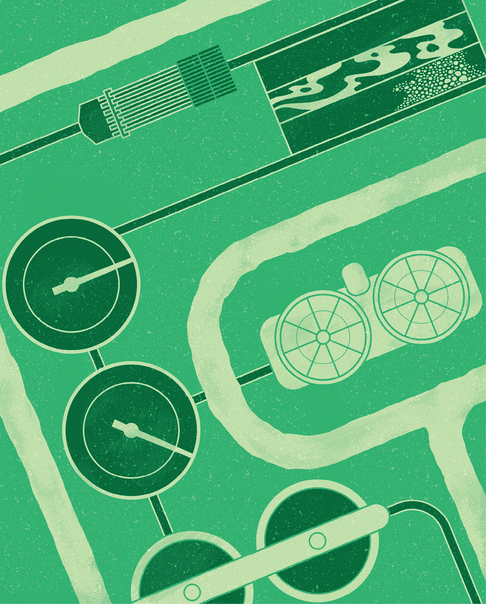
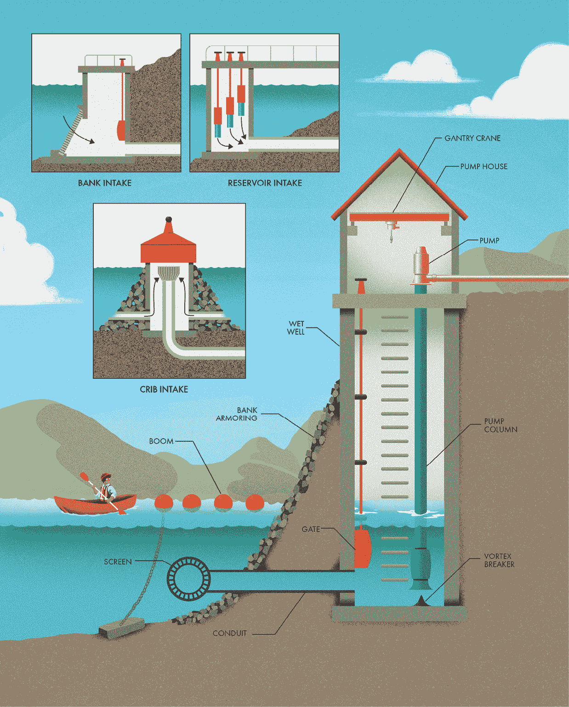
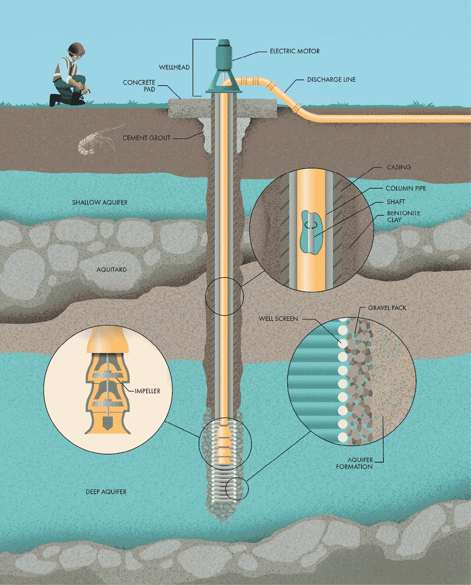
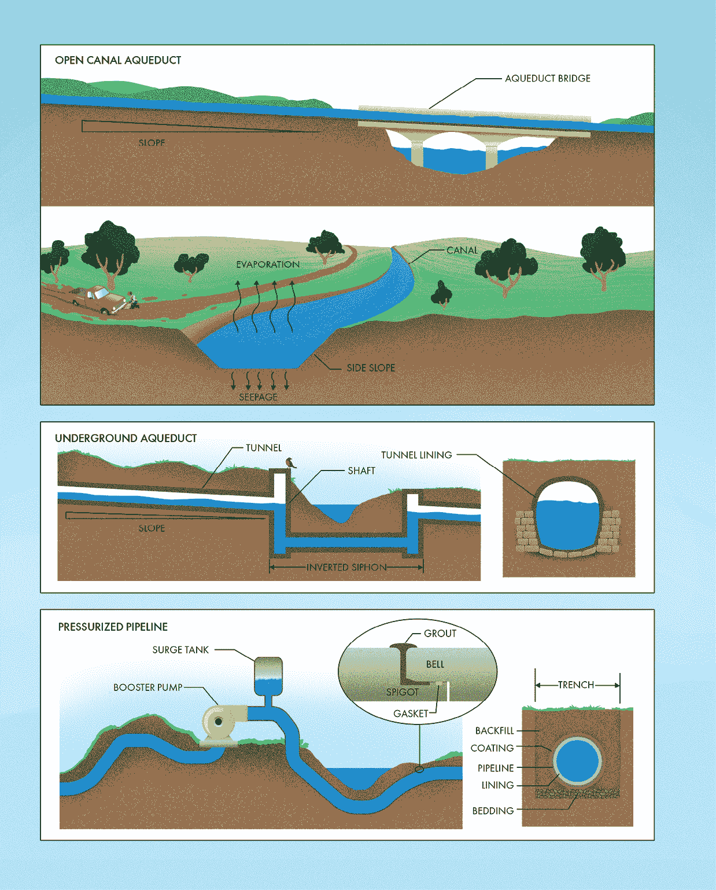
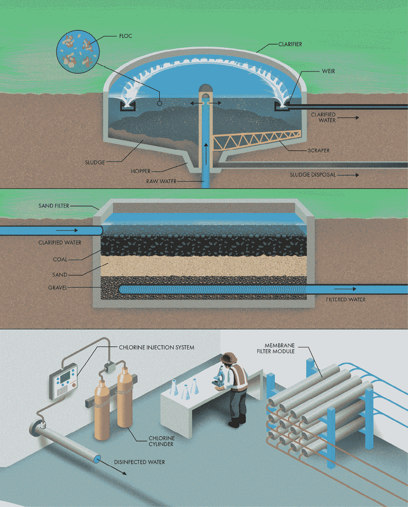
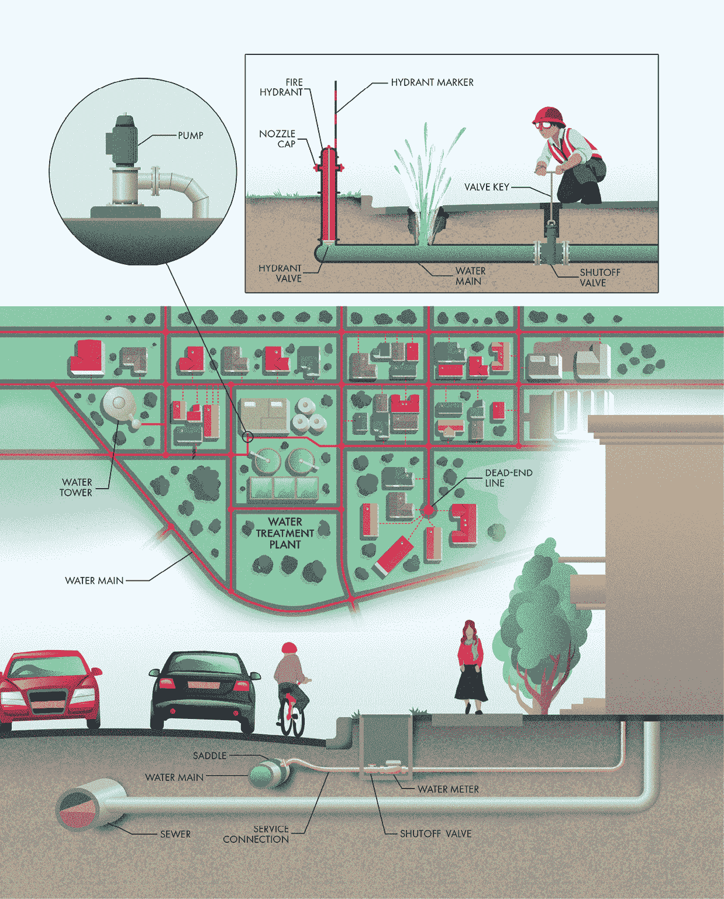
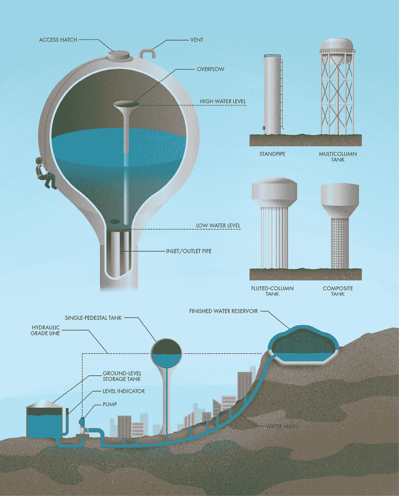
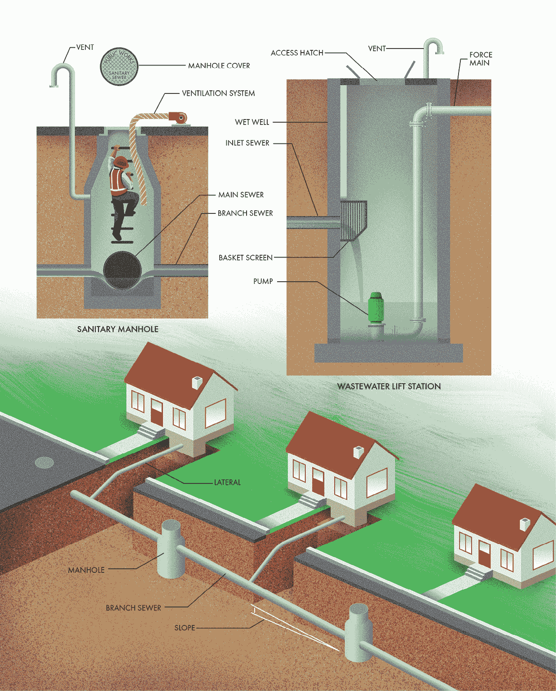
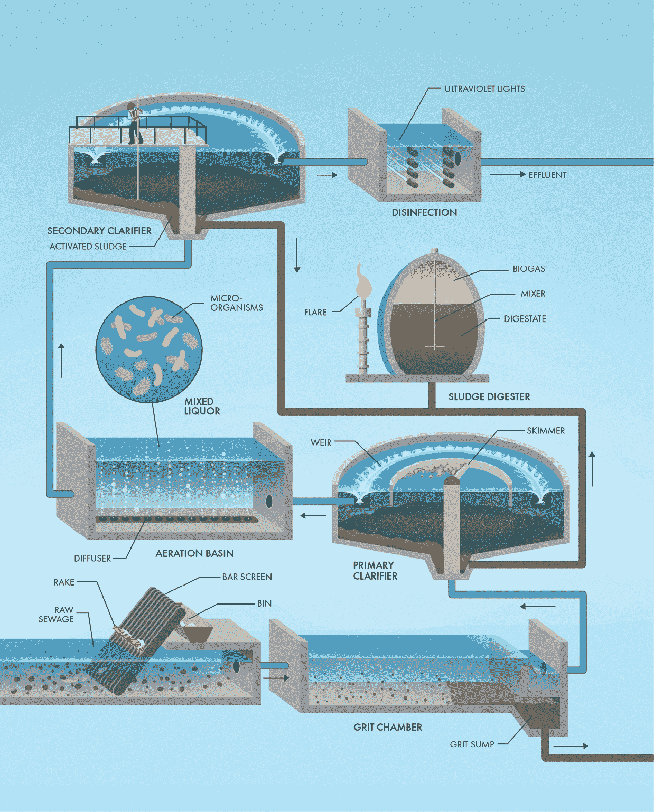
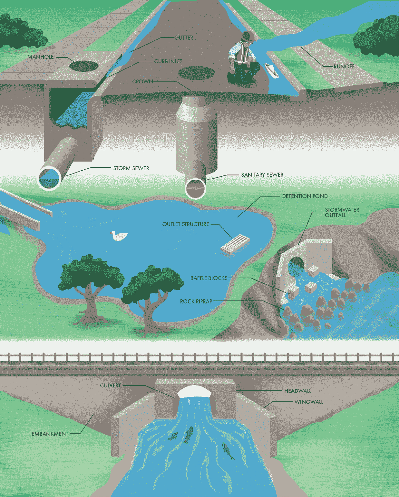

# 第七章：市政水务与污水处理

## 前言

水是人类的基本需求，但其清洁度同样重要。即使在现代市政工程出现之前，许多文明已经开发出将淡水输送到城市区域并去除废水的策略，以防止其污染水源。19 世纪，随着全球城市人口和密度的增长，水传播疾病对公共健康的威胁变得更加严重和隐蔽。卫生学作为一项科学应运而生，成为保护城市居民免受瘟疫和传染病侵害的必要手段。现在几乎所有城市和城镇都有复杂的系统来为市民提供充足和清洁的水源，并处理污水。虽然这一切容易被视为理所当然，但市政水务和污水系统的开发与维护是庞大的工程，涉及大量基础设施。城市中的许多管道和阀门都埋在地下，但如果你知道在哪里寻找，还是可以看到许多设施和设备的。

## 取水口与泵站

我们用于饮用、清洁和灌溉农作物的大部分水源，开始时都来自河流、小溪、湖泊或水库。这些水源统称为*地表水*（与接下来章节讨论的地下水资源相对）。从河流或湖泊收集水似乎很直接；然而，将地表水源的水流引入管道或*渡槽*，并将其输送到目的地，涉及许多工程挑战。*取水结构*执行这一关键任务。它们可能与水库或引水设施（例如大坝）相关联，但取水口通常是独立的结构，如果你留心观察，会在河岸、湖泊或水库附近看到它们。

湖泊或水库的取水口通常由大型混凝土或砖石塔构成（如第六章所述）。更复杂的是，在大坝处被认为是*排放口*的结构，可能也会作为泵站或渡槽的*取水口*。以前被称为“格架取水口”的旧结构是建造在岸上，浮到指定位置后，再用碎石填充。一个中央轴承通过重力将水从取水口引入到湖泊下方的隧道，水随后被抽送到岸上的处理和分配设施。

尽管污染物和沉积物的完全去除通常在后期进行，但进水口的工程设计包括确保进入管道的源水尽可能清洁，以减轻下游水处理厂的负担。这种未经处理的水通常被称为*原水*。在水库和湖泊中，悬浮沉积物的体积、浮游生物和藻类等微生物的数量，甚至水温，都可能随深度显著变化。因此，大多数湖泊和水库的进水结构都有多个不同高度的开口（或*端口*），以便操作人员可以从湖泊或水库的不同深度中选择理想的水源混合物。各种开口上的门可以根据源水的状况和下游的需求进行开启或关闭。

河流的进水口面临一套不同的挑战。首先，河流水位可能变化很大。此外，河流进水口还必须应对河流是动态系统这一事实。洪水能够搬运大量沉积物，改变河岸的位置和形状，甚至可能完全改变河流的流向。河流进水口几乎总是位于河道的直段或弯道的外侧。沉积物往往沉积在弯道的内侧，因为那里水流较慢，因此工程师会避免选择容易被堵塞的地方。岸边进水口通常安装在河岸上，以允许水横向流入结构。然而，天然河道的最深部分（称为*河床*）通常位于中央，因此岸边进水口往往需要进行河床疏浚，以便在水位较低时仍能保证水流。这种疏浚不仅会对河流敏感的环境造成干扰，而且必须定期进行，因为河流中的沉积物会随时间沉积。

解决水位变化和沉积物堆积问题的一种方法是下游建造一个小型*堰*。这种结构提高了河流中的水位，同时减缓了水流速度，使沉积物可以沉降。然而，堰对航运和迁徙野生动物造成了障碍，并且可能非常危险（如第六章所讨论），因此它们的使用已不再受到青睐。现代河流进水结构通过精心选址来避免沉积物堆积和低水位问题，同时最小化环境影响。岸边进水口的一种替代方案是通过隧道将管道从河道较深的部分延伸到岸边，以避免在天然河岸上开挖。这种管道末端的筛网可以防止鱼类或杂物进入管道，且门控系统可控制水流。

除非原水的最终目的地远低于水源，否则大多数进水口都将配有一个*pumping station*，将水从水源提升到管道或渡槽中。泵通常安装在进水口结构的正上方或旁边，有时安装在一个叫做泵房的建筑物内。这些结构通常可以通过内置的龙门吊识别，以便在需要时进行设备的维护或更换。

在泵站中，水流进入各个港口，通过导管或隧道，然后进入一个叫做*sump*（或湿井）的结构，湿井为泵提供足够的体积和深度，以便正常运行。湿井必须设计成能够创造理想的流动条件，以避免低效和对泵的损害。湿井中的湍流和旋转流动可能会导致*漩涡*，就像浴缸排水时发生的那样。如果漩涡被允许进入泵柱的入口，空气会降低泵的效率，甚至可能导致泵的故障。漩涡破坏器有时会被安装在湿井中，以防止水流在被抽入泵时旋转。

进水口可能对河流和湖泊中的游泳者和船只造成严重危险，因为那里有水下结构和快速流动的水流。当公共安全可能受到威胁时，进水口的所有者通常会安装浮动围栏，以警告人们潜在的危险。这些围栏由颜色鲜艳的浮动元素通过链条连接而成。它们被锚定在河床或湖床上，形成一个危险结构周围的禁区。有些围栏甚至设计得足够强大，可以挡住漂浮的树木、冰块以及可能损坏进水口结构的杂物。此外，当进水口或泵站必须靠近河岸时，通常会安装护岸结构（如*岩石护坡*），以防止侵蚀威胁到结构的稳定性。

## 井

并非所有降水都会流入湖泊和河流。一些水分会通过土壤和岩石颗粒之间的空隙渗入地下。有时，这些地下水会到达一个渗透性较差的地质层（称为隔水层），并无法继续向下渗透。随着时间的推移，渗透水可以积聚成巨大的地下资源，称为含水层。一个常见的误解是，地下水存储在类似地下河流或湖泊的开放空间中。尽管在一些地方确实存在，但大型地下洞窟相对稀少。几乎所有地下水含水层都是由沙子、砾石或岩石构成的地质层，这些地层像海绵一样被水饱和。提取这些地下水供人类使用的工作由*水井*来完成。最简单的水井就是一个可以让地下水从周围土壤渗入的孔。然而，现代水井利用复杂的工程技术提供可靠且持久的淡水来源。农场用它们进行灌溉。农村的家庭和企业通常依赖水井，当无法连接到市政供水系统时，水井是他们的主要水源。许多大城市也利用地下水作为其居民的主要淡水来源。

地下水的可获取性在全球范围内差异显著。几乎所有地方的地下都存在饱和土壤或岩石层。然而，水量、水质以及提取到地表的难易程度主要取决于当地的地质。地下水还与其他水文学系统相连，因此地下水的抽取可能会影响地表水资源的数量和质量。不幸的是，我们无法直接观察地下情况，而探索地下地质的方法主要是通过钻探*钻孔*，这通常是非常昂贵的。因此，特定地区地下水的可获取性通常是通过结合多种信息来源来确定的，包括当地知识和附近水井的表现。选择水井的位置和深度，有时既是一门艺术，也是一门科学，尤其对于地下水水文学家来说。

水井通常是通过钻机钻入地下安装的。钻井工人会详细记录所挖掘的土壤和岩石（称为*岩屑*），这些记录可以与在设计井时对地质的假设进行比较。一旦钻孔达到适当的深度，就可以安装井。将钢或塑料管（称为井套管）放入孔中，以提供支撑，防止松散的土壤和岩石掉入井中。水泵将在水源抽取的深度安装筛网，筛网允许地下水流入井套管，同时阻止较大的土壤和岩石颗粒进入井内，以免污染水源或导致水泵额外磨损。

一旦井筒和筛管安装完成，必须填充*环空*（即开挖的钻孔与井管之间的区域）。在有筛管的井中，这个空间通常填充有称为砾石包的砾石或粗沙。该材料作为过滤器，防止水层中的细小颗粒通过筛管进入井中。未加筛管的井筒通常用膨润土粘土填充，膨润土粘土膨胀后形成不透水的密封层，防止浅层地下水（可能质量较差）沿着环空流入筛管中。最后，环空的最上层会永久封闭，通常使用膨润土粘土，或者有时使用水泥浆。这层密封确保表面污染物无法进入井中。在最糟糕的情况下，污染物可能进入井中并流入含水层，污染水源，影响其他使用者，因此大多数管辖区对井口的封闭有严格规定。井筒通常延伸至地面，形成井口，并在四周设置混凝土垫层，以防止对井的损坏或水源渗透。

钻井过程可能会在钻孔表面涂抹一层粘土或细小颗粒，造成流动阻碍。在井完成安装后，通常会通过一种称为*井开发*的过程来建立与含水层的水力连接。开发过程包括向井中注入水或空气，往返冲击，以去除砾石包与含水层接触部位的细小沉积物。

一个正确完成和开发的井能让地下水顺畅且无沉积物地流入井管。然而，井水仍然需要一种方式输送到地面。浅井可以使用*喷射泵*，通过吸力将水像吸管一样抽上来。但这种方法不适用于更深的井。当你用吸管喝水时，你会创造一个真空，允许周围大气的压力将饮料推上去。然而，只有有限的气压可以平衡吸管中液体的重量。如果你能在吸管中创造一个完全的真空，最高能将水抽取的高度大约是 10 米或 33 英尺。因此，深井不能使用吸力将水抽到地面。相反，泵必须安装在井底，才能将水推送到顶部。

高容量的水井通常配备*垂直涡轮泵*。电动机安装在井口，并通过垂直轴连接到贯穿管道中心的轴上。底部的轴驱动一系列叶轮，将水从井中抽出，经过管道送入排水管线。垂直涡轮泵易于维护，因为电动机位于地面上，易于接触。然而，它们比较嘈杂，并且需要精确对准井口的整个长度。流行的替代方案是在井底放置电动机，叶轮置于一个密封的装置中，这种装置叫做*潜水泵*。潜水泵较安静，因为运动部件位于地下深处，但通常容量较低，因为它们使用较小的电动机，以适应井口的外壳。

## 输水管道和引水道

理想情况下，水资源应位于需求地附近。不幸的是，许多人口密集的地区全年降水量不足。因此，世界上一些最令人印象深刻的基础设施项目，其简单任务就是将*原水*从水源地输送到人口稠密的地区，再将其分配给用户。古罗马人以其引水道闻名，这些引水道跨越了数英里，将淡水引入城市，甚至通过精巧的石桥跨越了河流。然而，这些桥梁仅仅是每个引水道系统中的一小部分，整个系统通常包括数英里的管道、运河和隧道。现代工程师使用与古罗马人相同的许多工具，将水输送到需要的地方。

术语可能有所不同，但*引水道*一词通常指任何旨在跨越长距离输送水的人工结构。最直接的输水方式可能就是通过开放式运河。如果水源的海拔足够高于目的地，开挖渠道是一种确保水流动的方式，因为重力完成了所有工作。许多引水道的坡度非常缓慢，以至于肉眼几乎察觉不到倾斜度。然而，重力可以流动的液体量与渠道的大小和坡度有关，因此，较陡峭的运河可以较小（因此建造成本较低），而以相同的水量流动，比较大且坡度较缓的运河。

然而，流量并不是开放式渠道设计的唯一考虑因素。流速必须足够快，以最小化泥沙在渠底的沉积，但又不能太快，以免发生冲刷和侵蚀。渠道还必须足够宽，以便承载足够的流量，同时又不能太浅，以至于加速水分蒸发到空气中或渗透到地下土壤中。在选择渠道路线和形状时，工程师需要平衡这些因素。例如，许多水渠与河流平行铺设，因为地形在长距离内自然下降，而大多数渠道采用梯形横截面，倾斜的侧面不易倒塌。此外，许多渠道还包括混凝土衬里，以减少渗漏损失和冲刷。

开放式渠道通常比其他选项便宜，但也存在若干缺点，包括通过蒸发和渗漏造成的水损失，可能会阻塞水流的结冰现象，以及它们容易受到污染的影响。渠道也对环境产生影响，因为它们像道路或高速公路一样切割了景观。最后，渠道只能向下流动，这限制了它们在丘陵地带的实用性。在许多情况下，将水渠移入地下隧道或管道是明智的选择。

当没有加压时，地下水渠的工作原理与地表的渠道完全相同，通过重力流动，水面在顶部自由流动。水被保护免受污染、蒸发和隧道衬里或管道的渗漏影响。地下水渠必须具有一致的坡度以实现重力流动，但当水流不受地球表面限制时，完成这一点要容易得多。地下隧道还通过最小化对地表的影响，减少了环境问题。它们甚至可以通过垂直井筒穿越河流，从而形成倒虹吸，免去桥梁的需要。

当源水位低于其目的地，或者沿途地形起伏过大，无法通过重力流动时，加压管道可能是水渠运作的唯一可行方式。进水口处的泵站（如前一节所述）将水压入管道，使其能够逆重力流动。这些管道通常埋设在沟渠中，深度足以避免损坏和结冰。管道上方铺设一层床层，像床垫一样分散沿线的负荷。

管道材料的选择是管道设计中的关键部分。管道必须足够坚固，能够承受内外水压以及来自回填土和地表荷载的外力。管道还必须抵抗来自水的腐蚀以及外部土壤的腐蚀。管道可以由多种材料制成，包括钢、塑料、玻璃纤维和混凝土，而不同的材料在不同的情况中各有优缺点。较大的管道通常会使用保护性外涂层和内衬，以延长管道的使用寿命。

与使用胶水或螺纹连接的管道不同，大多数大直径管道在每个接头处都进行焊接，或者使用喇叭口和插管设计。当一节管道的插管滑入另一节管道的喇叭口时，它会压缩一个橡胶垫圈，从而形成一个密封的水密连接。有时会在每个接头周围安装一圈灌浆，以保护垫圈和任何暴露的钢材免受损坏和腐蚀。

选择管道尺寸是管道设计中的另一个关键决策。较小的管道成本较低，但它们需要水流得更快才能达到与较大管道相同的流量。水流在管道内摩擦时会损失能量，而这种损失随着流速的增加而增加，因此安装较小管道所节省的钱可能会因为增加的泵送成本而在时间中丧失。对于长管道来说，这些摩擦损失可能会非常显著，以至于需要沿途安装增压泵来维持系统中的压力。随着管道的老化，内部表面会变得更粗糙，因此工程师必须考虑整个管道生命周期中的摩擦和泵送成本。

在长管道中，流体的质量可能非常庞大，有时甚至超过一列满载的货运列车。当这些水流通过管道时，它具有相当大的动量。然而，尽管水是液体，但它并不容易压缩，因此关闭阀门或停止泵送时，动量没有地方去。相反，它会在管道中形成一个压力峰值，作为冲击波传播，这种现象被称为*水锤*。这些冲击波可能会在住宅中成为问题，当水龙头关闭得太快时，导致管道在墙壁中撞击。然而，在能够容纳大量流体的大型管道中，快速关闭阀门的效果可能就像把一列货运列车撞向混凝土墙一样。为了避免可能损坏设备或导致管道破裂的压力峰值，工程师们通常会指定缓慢关闭的阀门和泵，这些阀门和泵会逐渐启动和停止。在需要快速控制流量的情况下，可以安装缓冲罐来吸收极端的压力峰值，最大程度地减少水锤的破坏性影响。

## 水处理厂

大多数原水源容易受到细菌、沉积物和其他对人体健康有害的物质的污染。此外，有机颗粒还会影响水的味道和气味。在水被分配到家庭和企业供饮用或烹饪之前，通常必须先经过水处理厂的净化过程，使其变得*适饮*。有多种技术用于净化水并确保其安全供人类消费。大多数水处理厂都是根据特定的水源和可能存在的污染物量身定制的。例如，地下水通常需要比地表水源更少的处理，因为它更不容易受到污染。并非每个水处理厂都使用相同的处理过程，也不是所有水处理厂的部分都能被外部观察者看到。然而，理解在市政规模上净化水的基本步骤，为了解城市水分配系统的其他各个组成部分提供了洞察和背景。

地下水和地表水都含有各种物质的悬浮颗粒。这些固体颗粒使水呈现浑浊的外观（称为*turbidity*），并可能滋生危险的微生物。大多数水处理厂的第一步是通过一种叫做*沉淀*的过程，将这些悬浮颗粒从水中去除，这通常分为三个阶段进行。首先，强力搅拌化学*凝聚剂*加入水中。凝聚剂能够中和使悬浮颗粒互相排斥的电荷，从而使它们聚集在一起。接着，将化学*絮凝剂*加入水中，絮凝剂将悬浮颗粒结合成叫做絮体的团块。为了避免破坏絮体，絮凝剂通常会缓慢地加入原水中。

随着悬浮颗粒的絮体不断增大，它们最终会变得足够重，沉降到底部（沉淀的第三个也是最后一个步骤）。原水被抽送到一个池塘，在那里水几乎静止，絮体逐渐沉降到底部。这个池塘可以是一个简单的矩形混凝土箱，定期排水和清洁，但许多水处理厂使用被称为澄清池的水槽，里面有机械装置可以自动收集沉淀到底部的固体。这些圆形池塘是许多水处理厂的标志性组件。原水从澄清池中央流入，缓慢地向外周边流动，掉落的颗粒在底部形成一层污泥。澄清水通过溢流堤流出，这样只有最远离污泥的薄层水可以离开池塘。刮刀将污泥推向澄清池倾斜的底部，进入一个料斗，污泥可以在那里收集并处理。

沉淀作用去除大部分悬浮固体，但无法完全清除水中的微小颗粒、病毒和细菌。大多数水处理厂在沉淀后会进行*过滤*过程，涉及强迫水通过多孔介质。市政水处理厂的过滤器通常由沙子、煤或其他颗粒材料组成。水通过重力或泵的压力流经过滤介质，而水中的不需要的颗粒则被留在了过滤器中。一层砾石可以防止任何过滤介质随水流出。随着时间的推移，固体在过滤介质中积累，从而降低其效率。通过反向冲洗*（backwashing）*的方式，可以通过将水流反向送入过滤介质来清洁过滤器。反向冲洗的水被送回水处理厂的入口处进行再处理。

一些现代化的水处理厂已经放弃了传统的砂滤器，而采用了*膜过滤*，它由薄的半透膜材料组成。加压水被迫通过膜中的微小孔隙，将任何不需要的颗粒留下。使用膜过滤的水处理厂通常配备有一排管状过滤模块，若某个模块堵塞或发生故障，可以快速更换单个单元。膜过滤器甚至可以去除最微小的污染物（包括病毒），因此它有时比采用多个单独的处理过程来制造饮用水更为优选。

典型水处理厂的最后一步是消毒，在此过程中，任何残留的寄生虫、细菌和病毒都会被杀死。有几种方法可以去活微生物以使水变得适宜饮用，但大多数城市使用的主要工具是将消毒化学物质加入水中（通常是氯或氯胺）。这些化学物质在低浓度下对人类安全，同时仍能杀死可能导致疾病的微生物。许多水处理厂使用储存在金属罐中的氯气，这些金属罐被称为气瓶。注射系统以预定的速率将氯气注入水中，氯气溶解于水中并杀死致病的病原体。

化学消毒的一个重要优点是它能够在水从水处理厂通过数英里的管道输送到分配系统中的各个客户时继续发挥作用。但在饮用水离开水处理厂之前，必须先进行检测，以确保其符合政府的质量标准。许多不同类型的潜在污染物对人类健康可能构成危害，且水源的化学成分可能随时间变化（特别是在季节变化之间），因此水处理厂必须不断核实水流出时是否干净、安全。

## 水分配系统

一旦水从水源收集、运输到人口密集区并经过污染物净化后，它必须在公用事业的服务区内送达用户。可饮用水从水井或处理厂输送，有时需要跨越许多英里，最终送达每个家庭和企业。市政*供水系统*由所有互联的管道、阀门和其他组件组成，这些组件共同作用，输送用于饮用、清洁、烹饪、浇灌植物以及各种商业和工业过程的清洁水。供水系统还提供了一个次要的好处，即作为一个加压水源来扑灭火灾，减少火灾蔓延到邻近建筑物的可能性。与由大型单一设施组成的原水基础设施不同，供水系统必须分布在一个城市区域内。建设和维护这样一个广泛分布且对人类健康至关重要的系统，面临着许多挑战。

水分配系统的第一步通常是泵。像之前描述的原水进水泵一样，泵的作用是对系统中的管道加压，通常是正常大气压力的两到六倍，这就是它们通常被称为*高压泵*的原因。（部分压力会储存在水箱或水塔中，如下一节所述。）泵站通常位于水处理厂内，用于将净水送出。泵提供的压力不仅使可饮用水流向目的地，还确保污染物不能通过管道的开口接头或小孔进入供水系统。如果发生泄漏，水将从加压系统中流出，而不是让杂质或污染物进入。用于供水系统的高压泵消耗大量电力，因此它们通常需要稳固的电网连接和备用发电机以应对可能的停电。能源往往是水务公司持续的最高运营成本之一。节约用水不仅减少水的浪费，还减少了收集、净化和输送水所需的大量能源。

从泵站开始，清洁水进入一系列管道，称为水管网，这是城市中可饮用水的循环系统。水管网通常埋设在地下，以防止受到损害，更重要的是防止结冰。大多数水管网以网格或环形模式连接，通常沿着城市街道的路径布置。许多司法管辖区要求水管网与地下排水管道水平分开，因此当这些管道平行布置时，通常位于街道的两侧。

以*网格*方式安装主水管需要额外的管道和接头。然而，在网格系统中，水可以通过多条路径到达任何特定位置，增加了服务的可靠性，并允许在不影响其他部分网络的情况下修复主水管。网格化的水管系统还有助于避免水体滞留。当管道有死端时，水流只有在每条特定管道的用户打开水龙头时才会流动。如果清洁水在管道中静置过长时间，消毒剂可能会分解，导致水质下降。在网格化系统中，管道中的水会不断循环，满足各个地方的需求。

个别用户通过服务连接从主水管获取水源。使用鞍座创建主水管的接入点。管道通常从鞍座延伸到水表，水表用来衡量水的使用量，从而让水务公司根据用水量对每个用户收费。对每个服务连接进行计量有助于节约用水，并帮助水务公司发现配水系统中的泄漏。

水管确实会偶尔破裂，通常是由于地面变化、冰冻或因年龄导致的简单老化。当发生破裂时，必须挖掘管道并进行修复。虽然在管道喷涌出喷泉般的水流时修复是可能的，但通常是一个困难的过程。在开始修理之前，隔离主水管与系统的其他部分要容易得多。水管交汇处通常设有关闭阀门，以便断开部分网络，使维修人员可以修复破损的管道。阀门安装在地下封闭箱中，封闭箱上有小钢盖。大多数管道交汇处会有一条没有阀门的管道，以节省安装和维护成本。如果没有阀门的管道必须隔离，则需要关闭交汇处的所有其他阀门。维修人员使用阀门钥匙根据需要打开或关闭每个阀门。同样，每个服务连接处也会设置一个或多个关闭阀门，以便在进行管道维修或紧急情况时，可以将单个家庭或企业隔离开。

尽管清洁水对基本人类需求至关重要，但城市还需要随时可用的水源来灭火。历史上一些最严重的灾难发生在火灾蔓延到人口密集区时，由于没有足够的防火措施来阻止蔓延，造成了巨大的破坏。城市中布满了消防栓，它们为与加压水管连接提供了接口点，有助于扑灭火灾。在美国，大多数地方使用干式消防栓，其阀门位于地下，避免了因车辆碰撞而受损，同时减少了消防栓中水结冰的几率。在一些地方，消防栓喷嘴盖的颜色表示可用于灭火的最大流量。在寒冷地区，消防栓可能会加装标识，延伸到积雪上方，以便冬季时更容易找到。

## 水塔和水箱

清洁水的需求不仅随着一年中的季节性变化显著波动，而且甚至在一天之内也会有很大的差异。城市中的用水量通常在早晨和傍晚最高，因为人们会洗澡、做饭和浇花。此外，城市中一些最严重的用水需求是由火灾引起的，火灾是随机发生的，无论白天还是夜晚。火灾在密集的城市区域可能失控蔓延，因此大多数市政当局确保其水分配系统即使在需求最高的日子里也有足够的储备容量。设计水分配系统的工程师必须在选择泵、管道、阀门和其他设备的大小时，考虑到所有可能的流量变化。水分配系统中最重要的部分之一（也是最明显的部分）是解决饮用水需求变化的方案：储存。

收集、输送、净化和分配水的许多步骤在流量保持稳定时效率最高。在处理厂，化学药剂的添加和净化过程无法容忍突然的变化。此外，用于水分配系统的泵通常以单一的速度运行。如果没有储水的地方，操作员就需要不断地调整生产速度，以适应不断变化的需求。此外，所有的处理设施和泵必须按照最高水需求来设计，即使它们每年只有一次或两次达到最大容量，这也增加了其成本和复杂性。水箱和水库平滑了水需求的峰谷变化，使得泵和其他基础设施可以在平均条件下运行。当用水量低时（例如在夜间），处理厂会过量生产，以填充水箱。当用水量高时，储存的水可以补充处理厂的水源，以满足水需求。

在水分配系统中，使用了多种类型的储存结构。地面水箱通常由大型圆形钢或混凝土围栏组成。如果你仔细观察，许多水箱的外部都有水位指示器，可以一眼看出水位。有些城市利用地面挖掘形成池塘，这些池塘被称为成品水水库，能够以相对较低的成本容纳大量水。这些池塘通常用塑料或混凝土衬里，以防止漏水，并且覆盖以最小化污染的机会（尽管今天仍然存在一些未覆盖的水库）。地面水箱和水库通常可以在水处理厂看到，在那里它们被称为*清水池*。

将水存储在地面上的一个缺点是它没有压力，因此必须将其抽送到配水系统中，且水的需求会波动。水箱或水库通常安装在丘陵或山坡的顶部，位于供水区域的上方，不仅可以储存水，还能储存由泵浦传递给水的能量。*高位储水*平滑了泵浦的负荷波动，使其能够保持稳定运行，而不是为了应对全天不断变化的水需求而频繁开关。在一些电价波动的地区，泵浦可以在夜间低电价时运行，填充水箱，而在电价较高的高峰时段则停机。高位储水在停电或紧急情况下也很有利，它能够保持管道压力和水流，即使泵浦或处理厂停止服务。

不幸的是，并非所有城市都有可以建设水箱的丘陵或山脉。较小的配水系统通常使用称为立管的高而狭窄的水箱来储存饮用水。水箱顶部的水就像坐落在山顶上的水一样，充当高位储水。水箱底部的水则作为应急储备，如果需要，可以被抽入配水系统。大城市通常使用高位储水箱，也称为*水塔*，其整个储水量远高于最低系统压力。

选择储水箱的高度是一个重要的决策。配水系统必须保持在可接受水压的范围内。如果水压太低，就有可能导致污染。如果水压太高，则可能会对管道和设备造成损坏。

水体中的压力与水面下的深度相关。你可以将配水系统想象成我们生活在其中的虚拟海洋。高位储水箱中的水面代表了虚拟海洋的表面（工程师称之为水力等级线）。低海拔的用户位于虚拟海洋的底部，压力最大，而高海拔的用户则接近虚拟海洋的表面，压力最小。理想的深度通常在 30 到 60 米（约 100 到 200 英尺）之间，这意味着大多数水塔的低水位和高水位都设定在这个范围内。系统内低于 15 米（约 50 英尺）的水存储可能无法提供足够的压力，无法防止潜在的污染。有大高差的城市有时会保持独立的水分配网络，并在不同的压力下运行，以保持客户在理想的范围内。

水塔就像是一个简单的水箱，连接到主水管。当水的需求低于泵的容量时，系统中的压力会增加，迫使水通过进水/出水管进入水箱。当需求高于泵送速率时，系统压力会下降，水会通过同一管道流出水箱，以补充来自水处理厂的水。除了水之外，里面没什么。大多数水箱都设有溢流口，以防止水箱过满。通风口确保水箱内的气压不会随水位变化，从而产生可能损坏结构的正负压力。检修口则提供了水箱内部的维护和检查通道。

水塔有各种各样的设计。它们通常根据水箱的形状或支撑水箱的塔架结构来描述。单立柱水箱和多柱水箱通常完全由焊接钢制成。波纹柱水箱由波纹钢支撑，塔内有足够的空间存放设备，有时甚至包括办公室。复合材料水箱则坐落在混凝土塔上，节省了为钢柱定期涂漆以防腐蚀的费用。对于使用高架储水的城市，这些水塔通常是运营整个系统的核心部分。水箱中的水位是分配系统是否保持正确压力的主要指示器，确保水能够按照设计送到每个用户家中。

## 卫生污水管道与提升站

人类有点恶心。我们集体制造着源源不断的垃圾，除非它被安全地带走，否则它会威胁到城市居民的生命，带来致命的疾病。将大量的排泄物从 A 点运送到 B 点涉及许多技术挑战，而我们主要在视线和意识之外完成这一任务，我认为这是值得庆祝的。*卫生污水管道*将这种象征性的流动转化为实际的地下流动，远离公众视野（希望也能远离公众的气味）。最初的污水管道仅仅是将废物抛入河流和小溪中，通过水流将其带走。这种管理污水的方法存在一些明显的局限性，包括它污染了常常用来饮用的水源。现代的污水管道几乎总是作为地下管道安装，将废水流与饮用水源分开，但它们的功能与地面上的水道非常相似。

下水道依赖重力来收集和运输废水，水流向下流动，汇聚并集中成越来越大的水流。卫生下水道网络是*树状*的，单独建筑物的小管道汇聚成越来越大的管道，直到所有的废水在一个单一的处理厂汇聚。服务于单个建筑物的管道通常称为支管，而服务于特定街道的管道则称为分支管道。收集来自多个分支管道的废水的大管道称为主下水道或*干线下水道*。系统中最重要且位于最下游的管道通常被称为*拦截管*。

让下水道自然向下坡流动非常方便，因为我们不需要支付重力费用，而且它在雷暴期间不会被破坏。然而，仅仅依赖重力也会限制下水道的设计和施工。如果污水流得太快，可能会损坏接头并侵蚀管道的墙壁。但是，如果污水流得太慢，固体物质可能会沉淀并形成堵塞和狭窄。我们无法调整重力的大小来保持流速的平衡，也无法对废水量进行太多控制（因为人们冲水时，水就来了）。工程师唯一能控制的因素是下水道管道的大小和坡度。每条下水道管道都根据预计的废水量精确地设计大小和坡度，以保持其稳定地流向处理厂。

每当下水道的大小或方向发生变化，或者管道交叉时，会安装卫生井盖，以便进行维护和检查。井盖通常由垂直的混凝土围护结构组成，延伸至地面表面。步骤允许人员进出。一个重型铸铁板，称为盖板，用来阻止人和杂物进入下水道，同时允许车辆驶过。井盖有时还充当通风口，用以平衡管道内的气压，防止有毒气体积聚。当维护井盖的顶部易受洪水影响时，城市通常要求将盖板密封并用螺栓固定，以防止雨水进入管道。在这种情况下，通风口有时会延伸到要求的洪水水位以上，即使在暴风雨期间也能防止气压积聚。每当有人进入井盖进行修理或维护时，会使用临时通风系统提供新鲜空气。

由于污水管道必须始终保持倾斜，它们通常位于地下较深的地方，尤其是朝向下游的部分，这使得施工成本高昂且费时。在某些情况下，继续追寻污水管道的倾斜，使其越挖越深，已经不再可行。一个替代方案是安装一个泵站，将深处的原污水提升回地面，并更接近地表。提升站可以是小型设施，设计用来处理几个公寓楼的污水，或者是大型项目，负责抽取城市大量的污水流量。典型的污水提升站由一个混凝土室组成，称为湿井。污水通过入口管道借助重力流入湿井，并随着时间的推移逐渐填满。达到设定的水位后，泵开始启动，将污水推送到一个称为强制管道的管道中。这种间歇性的操作确保污水始终在管道中快速流动，以便固体物质不会在低峰时段沉淀下来。污水在强制管道中承压流动，最终到达一个上坡的检查井，之后可以再次借助重力向下流动。提升站通常配备多个泵，以便在一个泵故障时仍能继续运行。它们通常还配备备用发电机，以确保即使断电，污水也能继续流动。

我们常常将污水视为其最脏的成分：人类排泄物。但污水其实是来自各种来源的液体和固体的混合物。许多物质最终进入我们的污水系统，包括土壤、肥皂、头发、食物、湿巾、油脂和垃圾。这些东西可能顺利通过厕所或水槽的排水口以及你家里的管道。然而，在污水系统中，它们可能会聚集成大块的杂物（有时污水专业人员称之为*猪尾巴*或*脂肪块*）。此外，由于许多城市致力于水资源节约，污水中固体物质的浓度呈上升趋势。传统的泵浦能够很好地处理液体，但在流经污水的同时添加固体物质，增加了提升原污水的挑战。用于污水提升站的泵设计时考虑到了额外的磨损，但没有泵浦是完全不易堵塞的。

解决堵塞问题的一种方法是在提升泵站的湿井中使用筛网，以防止垃圾进入泵系统。每隔一段时间，必须清理网格中卡住的垃圾，并将其运送到垃圾填埋场。较小的提升泵站通常使用带轨道的篮式筛网，可以通过地面上的检修口手动提升。较大的泵站可能配备自动化系统，将筛网中的固体物质移入垃圾箱。另一种处理废水中杂物的方法是将其研磨成更小的碎片。一些提升泵站配备*研磨机*，能够将杂物碾碎，使其无法堵塞泵系统，从而减少工作人员前往泵站进行维修或清理垃圾的需求。固体物质仍然会留在废水流中，随后在更下游的处理厂被去除（将在下一节中讨论）。

## 废水处理厂

水与地球上几乎所有物质兼容，这也是它能如此高效地将我们的废物从家庭和商业建筑带走的一个重要原因。在现代环境法规出台之前，城市将未经处理的污水直接排放到河流中，任其随水流向下游带走，这并不罕见。现在，几乎所有的废水收集系统都依赖某种形式的处理厂来逆转这一污染过程，去除水中的污染物，使其可以被重新利用或释放回环境中。技术在不断发展，全球范围内的废水处理采用了多种不同的处理方法。本节讨论了现代废水处理厂使用的一些最常见的处理方法。如果你能忍受气味，许多市政处理厂乐意为公众提供参观，游客可以亲眼看到每个处理过程的实际操作。

废水处理厂在清洁污水的过程中使用了许多独立的步骤。许多步骤与饮用水处理厂使用的过程相似（前面已讨论）。然而，标准通常较低，因为处理后的水（称为出水）不会用于人类消费，只需足够安全，以便释放到环境中。水处理厂的初步步骤，称为*初级处理*，涉及通过快速而湍急的水流物理分离悬浮物。首先，污水通过条形筛网，过滤掉大块的垃圾，如树枝、布条以及任何其他进入下水道的大型废弃物。现有许多技术，包括配备自动清扫器的条形筛网，能够将过滤出的垃圾刮入一个箱子，作为固体废物丢弃。

接下来，悬浮颗粒被从水流中分离出来。废水中发现的沙子和土壤统称为*砾石*。这些物质可能会损坏工厂设备，因此通常在初级处理过程中通过一个单独的步骤去除。处理厂使用砾石池，通常设计为狭长的水池，以减缓废水流速。在这种平静的条件下，悬浮沉积物会沉淀到底部，而去除砾石后的废水则继续流向排放口。一些砾石池引入气泡，帮助将较重的颗粒甩到池边。其他砾石池则使用电动搅拌器在水流中形成涡流，以实现类似的效果。池底的集水坑收集沉积下来的砾石，然后将其抽出进行处理。

初级处理的最后一步通常也是一个重力过程。离开砾石池的废水仍然充满悬浮固体，但这些固体主要由小的有机颗粒或漂浮的油脂和油污（统称为*浮渣*）组成。大多数处理厂使用初级澄清池来分离这些剩余的固体。大型圆形池进一步减缓废水流速，允许细小颗粒缓慢沉降，同时浮渣收集器将浮在水面上的固体收集起来。固体被送去进一步处理，澄清后的废水则通过溢流堰流入二级处理过程。

初级处理通过物理方法将污染物从废水中分离，而*二级处理*则利用生物过程进行分离，模拟大自然母亲的自然过程，但时间要短得多。大多数废水处理厂利用能够消化污水中有机物的微生物。当它们消耗污染物时，这些细菌和原生动物会聚集在一起，留下相对干净的水。适应富氧（*有氧*）环境的微生物群落与生活在缺氧（*厌氧*）环境中的微生物群落不同。这些不同的微生物群体消耗水中的不同营养物质，因此处理厂通常同时利用有氧和厌氧条件来彻底去除废水中的污染物。有氧条件是在曝气池中创造的，鼓风机持续提供空气，通过扩散器形成细小气泡，将氧气混入水中。

一旦生物处理消耗了大部分营养物质，清洁后的水和悬浮的微生物团块（称为混合液）就会从曝气池流入二次沉淀池。在这里，细菌群落沉淀到池底，仅允许清洁的废水被排放。根据监管要求，许多处理厂还会有三级处理流程来针对特定的污染物。此外，大多数处理厂会进行最终消毒，以杀死水中的任何残留病原体。消毒通常使用溶解氯、臭氧气体或强紫外线灯进行，这些方法能使病毒和有害细菌失效。处理厂的最终出水通常会排放到天然溪流、河流或海洋中。

一些在二次沉淀池中沉淀下来的微生物（称为活性污泥）会被送回曝气池，以为下一代细菌群落提供种子。其余的污泥必须被丢弃。一些处理厂将污泥直接送往垃圾填埋场处理。然而，污泥是有机物质，会随着时间的推移分解，释放出甲烷等有害气体。为了避免在垃圾填埋场中发生这种分解，许多处理厂使用消化池处理有机固体。消化池将污泥转化为沼气，沼气可以作为加热或发电的燃料使用，并且会生成一种叫做消化残渣（或*生物固体*）的固体物质，这种残渣可以被烘干后填埋，或用作肥料。消化池通常配有搅拌器，以保持污泥混合，配有大圆顶用于收集生成的沼气，还有一个火炬作为安全措施。如果生成的沼气超过了存储能力，操作人员会允许沼气在火炬中燃烧，将有害成分转化为较为安全的气体排放到环境中。

## 暴雨水收集

城市对环境的最显著影响之一是它们如何影响暴风雨期间水流在地面上方和地下的流动。所有这些街道、人行道、建筑物和停车场覆盖了不透水的地面，因此雨水不再渗透，而是朝着溪流和河流流去，使它们迅速上涨，水位更高，污染物也更多。自然的流域像海绵一样吸收和减缓降雨，而城市流域更像漏斗，收集并集中径流。自从人类开始在城市中居住，暴雨和洪水就一直是一个问题，最初的解决方法就是尽可能快速地把水排出去。这个解决方法就是我们至今使用的城市暴雨管理方式——*排水*。无论是下雨还是倾盆大雨，我们都试图让这些径流找到去处。

大多数城市的布局使得街道成为降水的首个流向通道。每个地块都会有一定的坡度，向街道倾斜，这样水流就可以远离建筑物，避免产生问题。标准的城市街道中间有一个高点，两侧有排水沟供水流通。这样可以保持道路相对干燥，确保车辆安全行驶，同时也提供了一个排水的通道。最终，道路会达到自然的低点并开始向上坡走，或者会积聚过多的径流，无法完全容纳在排水沟内。在某些情况下，可能允许将街道的径流直接排放到自然水道中。然而，在空间有限的密集城市地区，暴雨水通常会被引导到地下排水管道中。

过去，通常将街道上的所有雨水径流直接排入卫生污水系统。不幸的是，污水处理厂通常没有设计来处理大规模的合并污水和暴雨径流的涌入，尤其是当大自然的变化无常时。在最糟糕的情况下，当污水流量过大，无法存储或处理时，这些污水处理厂不得不将未经处理的污水直接排放到水道中。这就是为什么现在大多数城市将雨水管道与用于排放污水的卫生污水管道分开的原因。雨水通常通过路缘进水口或地面格栅进入暴雨管道系统。进水口位于道路的所有低洼处（称为*凹陷*）以及坡道段的定期间隔处。许多进水口包括一个检修井口，以便进行清洁和维护。每个进水口都通过暴雨管道与其他进水口连接，将雨水排走。每条管道的尺寸和坡度都是根据预期的暴雨水量来设计的，类似于卫生污水管道的设计，后者也是为了运输特定量的污水。

暴雨管道系统的汇聚和集中就像自然的溪流和河流系统一样。最终，这些污水管道会被引导到自然水道或海洋的排放口。通常，在排放口处会安装能量耗散挡块或岩石护坡，以保护自然土壤免受迅速排出的径流侵蚀。与卫生污水系统不同，后者的终点是处理厂，大部分暴雨径流都会直接排放到环境中，因此城市通常会向公众发出警告，提醒他们不要将垃圾倾倒到路缘进水口。

暴雨排水系统通过迅速将水从街道排除并将其引导到溪流和河流，帮助减少局部洪水。然而，城市地区的暴雨水流入这些自然水体会加剧洪水的情况。许多城市通过扩大、直线化和用混凝土衬砌天然水道来增加水道的容量。这种设计策略通常被称为*渠道化*。通过渠道化加速暴雨水流有助于减少洪水的深度和范围，但它也有一些缺点。肮脏的混凝土渠道会破坏城市的视觉形象。渠道化还可能加剧下游的洪水，并破坏原始水道的栖息地。大多数城市认识到，拓宽和衬砌自然水道并不能完全解决城市发展带来的径流问题。

因此，城市现在要求开发商对其暴雨水量和水质的影响负责，这通常涉及在将排水排放到水道之前进行现场储存。*蓄水池*保持一个永久的水池，而滞洪池通常是干燥的。两者像迷你海绵一样，吸收从建筑物、街道和停车场冲刷而来的雨水。它们的排放结构被设计成缓慢将径流释放回水道，削减峰值流量至所有建筑和停车场建设之前的水平。蓄水池和滞洪池还通过减缓水流速度，帮助减少污染，让悬浮颗粒物沉降。

在高速公路沿线，通常不经济将暴雨水管理埋设在地下。相反，我们常常将高速公路建设在自然地面之上，修筑堤坝，并设置平行沟渠来排水。当一条道路跨越重要的溪流或河流时，我们通常会修建桥梁。然而，架设桥梁跨越每一个小水道和地形洼地并不经济。当一条道路与一个小水道交汇时，管道涵洞可以让水流从一侧下方通过到另一侧。工程师选择涵洞管道的尺寸，以减少雨水溢出道路的可能性。挡土墙和翼墙支撑堤坝，同时引导暴雨水流进入涵洞。设计不良的涵洞可能会让水流通过，但却阻碍动物的迁移，因此工程师会与生物学家和环境科学家合作，确保涵洞在设计时既能满足水流的需求，也能照顾到其中生活的生物。
