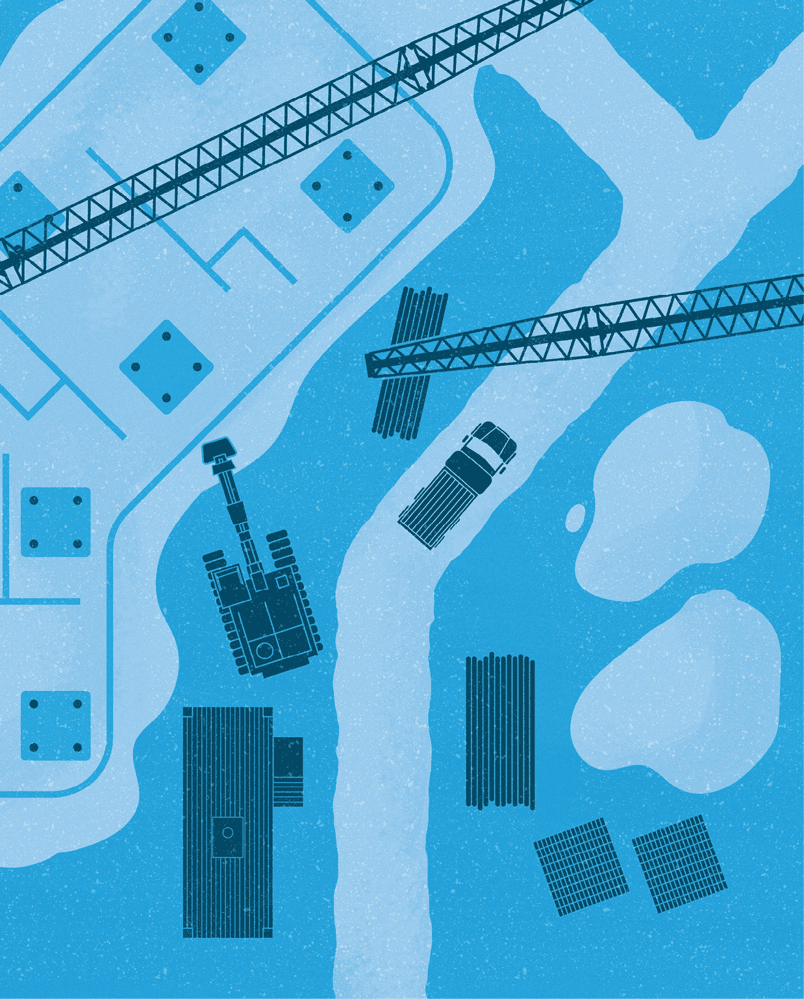
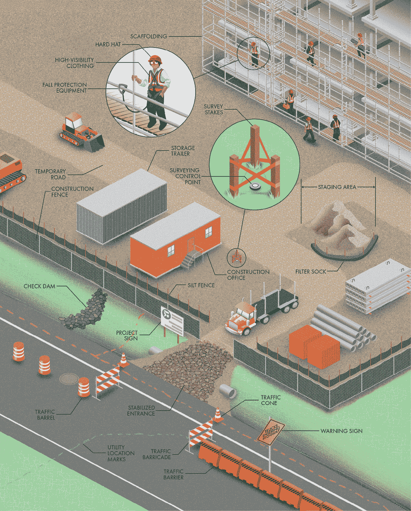
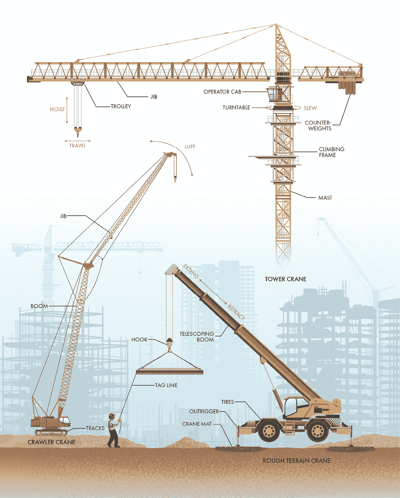
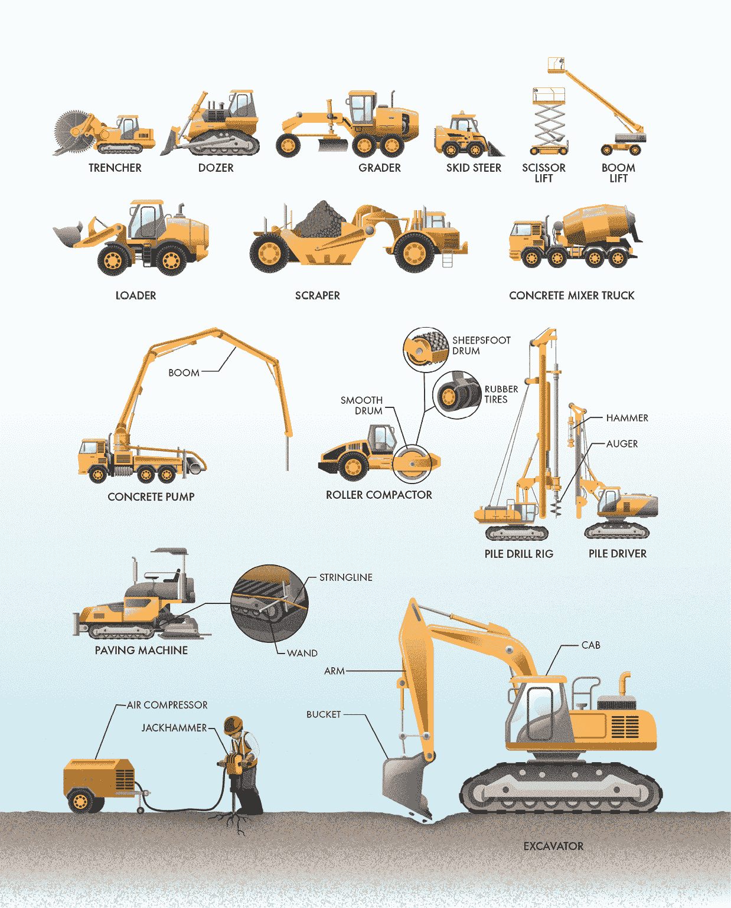

‌

# 第八章：建设

## 前言

所有基础设施有一个共同点：它必须被建造。你不能直接在商店里购买排水系统或电力网。相反，这些复杂的设施是由人类和机器在现场建造的。建设既可以是一个麻烦，也可以是一个乐趣，这取决于你的视角（或者你的通勤）。它通常显得嘈杂、干扰性强且进展缓慢。然而，庞大的设备和工作的紧迫感能激发出观察者的敬畏与惊奇。没有什么比亲眼目睹一座建筑从原材料和艰苦的工作中成型更让人震撼的了，常常很难在经过任何一个建筑工地时不被不断的喧嚣吸引。

尽管建设看起来可能很混乱，但混乱中总有其方法。每个工人和每个设备都有一个特定的任务。单个的成就可能显得微不足道甚至平凡，但它们会慢慢积累成可能是壮观的成果（如前几章所示）。观察建筑工地可以是一项偶尔的活动，专门寻找机器和设备，也可以是一项定期的例行公事，去欣赏稳步的进展。无论你选择如何观看，你总是能在建筑工地上看到一些有趣的东西。

## 典型的建筑工地

无论是道路、桥梁、大坝、管道还是其他任何正在建设的基础设施，建筑工地乍一看可能像是一片杂乱无章的机器和活动的狂乱景象。然而，仔细观察，你会开始理解其中的节奏。虽然每个建筑项目都是独特的，但施工地点在不同项目之间通常非常相似。

在建设开始之前，测量员必须在地面上标出项目的位置。测量员会在施工区域外安装控制点，这些控制点可以在施工开始后作为参考。控制点通常是大钉子，钉入下面的混凝土或沥青中，或者是铁杆，插入土壤中。测量员常用木桩和塑料旗带来标记控制点和其他建设关键要素。像道路和管道这样的线性建设项目通常使用一种叫做*站点定位*的坐标系统。在美国，每个站点等于 100 英尺。通常可以看到工地上的位置被标注为沿结构中心线的距离，单位是站点加上英尺数（例如，“STA 12+50”表示在轴线上 1,250 英尺的位置）。

除了勘测外，所有地下设施必须被识别并标记，以确保挖掘人员不会无意中损坏地下管线。定位员使用彩色喷漆在地面上标出设施位置。在世界许多地方，这些颜色是标准化的。例如，红色用于电力线路，橙色用于电信线路，黄色用于天然气管道，绿色用于下水道，蓝色用于饮用水管线。白色喷漆用于显示在施工过程中将进行的任何挖掘位置，粉红色则用于测量标记。

你在工地上首先可能会注意到的是项目标牌，它用于标识参与的公司，通知公众项目的名称和目的，并张贴重要信息，如建筑许可证。

除了建筑本身外，工地上的大部分区域通常用于移动和存储材料。重型设备和大型卡车需要空间来移动、装载和卸载物资。这些大型车辆直接在地面上行驶通常会导致泥泞的局面，尤其是雨后。因此，承包商通常会在工地上建设临时道路，以保持施工交通畅通。此外，大多数工地还会设有一个待卸货区域，用于卸载和存储后续施工中需要使用的设备和物资。

尽管乍一看，建筑工地可能看起来像是大部分时间都在站着，但任何曾在建筑行业工作过的人都可以告诉你，这是一项具有挑战性的工作。工地上的大多数人都是从事熟练劳动的技工，如泥瓦匠、木匠、焊工、油漆工和铁工。此外，你可能还会看到一个*项目经理*，他负责监督项目，一个*检查员*，确保施工符合项目计划和规范，以及安全人员，他们负责观察潜在的事故，并在发生伤害之前解决任何安全隐患。

建筑工地特别危险，因为有大型车辆、危险工具，以及需要在不稳定的位置和高度作业。你在工地上看到的许多元素都与工人安全相关，包括每个工人所佩戴的*个人防护装备*。工地上的工人和其他工作人员通常需要佩戴安全帽，以防止被掉落或突出物品伤害。工人还穿着高能见度的服装，配有亮色和反光条纹，以防止因不被看到而发生的事故。在高处作业时，会使用脚手架为工作人员提供临时平台，以便进入那些难以到达的区域。工人在高处作业或靠近深度挖掘时，可能会穿戴防坠落设备，包括安全带和连接绳，以减少坠落的危险。

除了保障工人安全，施工项目还必须考虑公众安全。大多数工地会围起围栏，防止无意的行人进入危险区域，有时围栏上还会安装屏幕，防止风将尘土吹起，并通过遮掩贵重工具和设备来防盗。

公共安全对于道路建设项目至关重要，这些项目通常需要封闭交通车道或设置绕行路段。承包商会安装交通锥、桶、屏障和路障，以引导车辆远离施工区域。警示标志和路障通常是橙色的，以便驾驶员能够轻松区分并在施工区小心行驶。

施工不仅仅涉及体力劳动和电动工具。像任何其他行业一样，很多工作发生在办公室中，比如订购材料、审核计划、召开会议和回复邮件。在大型项目中，承包商通常会有一整支办公室工作人员驻场，以支持施工并保持工作的顺利进行。你可能会看到一个或多个拖车，作为承包商、现场工程师或业主的临时办公场所，供其需要时使用。其他拖车则可能用于存放工具和材料。

施工过程中一个常见的麻烦是由土壤扰动造成的。雨水可以轻易冲走没有保护的土壤。这些悬浮的沉积物被视为污染物，因为它们会降低自然水体的质量，并影响野生动物栖息地。因此，大多数建设项目要求安装设施来控制雨水径流，防止其将土壤带离工地。泥浆围栏和过滤袋可以减缓径流速度，让沉积物从水中沉降。稳定入口使用岩石去除车辆轮胎上的泥土，以确保离开工地时不会带走土壤。最后，检查坝会设置在沟渠中，防止水流集中，从而减少侵蚀的潜力。

## 起重机

所有建设工作都可以归结为物料搬运：接收交货、存储、搬运和安装项目的所有部件。当然，汗水和肌肉可以完成大部分工作，但任何在行业中工作的人都会告诉你，有些任务只有起重机能完成。在许多工地上，问题不是是否使用起重机，而是使用多少台、哪些类型。这些建筑行业的核心设备使得吊装和安装远大于仅凭人工劳动所能完成的材料和部件成为可能，从而使得施工比以往更加快速和高效。

许多类型的起重机被广泛应用于建筑工地，每种起重机都有其独特的优点。它们通常被分为两种类型：*移动起重机*和*固定起重机*。移动起重机有轮子或履带，使其能够在工地的不同区域间移动。履带起重机安装在带有履带的底盘上，是建筑工地上最大且最具能力的移动起重机。它们通常配备可以伸长并达到远距离和高空的钢制臂架。最大的臂架采用钢条的格构结构，既轻便又非常刚性。此外，许多制造商提供可附加到臂架末端的臂架，以进一步延长作业范围。履带起重机不允许在公路上行驶，因此通常需要通过卡车运输到工地，并在现场组装。

像履带起重机一样，粗地面起重机也搭载在一个移动底盘上，但它们使用橡胶轮胎而非履带。粗地面起重机最擅长进入偏远且具有挑战性的地形。它们通常比履带起重机小，这使得它们能够更快速地组装，并能进入其他起重机无法到达的狭小空间。许多粗地面起重机配备有伸缩臂，臂段可以伸展，从而增加起重机的作业范围。它们能够在搬运重物时（以较慢的速度）行驶，能够在建筑工地上长距离移动重物。然而，当在支腿支撑下固定位置操作时，它们的载重能力会大大增加。这些支腿通过将底盘从可变形的轮胎上抬起，从而使起重机保持稳定。*全地形起重机*的工作原理和外观与粗地面起重机相似，但它们设计用于在街道和高速公路上行驶，不需要通过卡车运送到工地。它们通常是所有移动起重机中最小的，但也是最具多功能性的。

固定式起重机安装在一个固定位置，通常在项目的整个或部分期间保持不变。在建筑工地上，最常见的固定式起重机是塔式起重机。它由一根垂直的塔架和一根水平的臂架组成，臂架从塔架上伸出。臂架可以在塔架上通过回转平台旋转，旋转方向不限。安装在臂架上的滑车可以让操作员在上方驾驶室内将吊钩放置在需要的位置。

塔式起重机的安装本身就是一项壮举，因此它们通常只用于持续时间较长的项目，比如高楼建筑。它们通常有一个加固混凝土的基座，并且需要另一台起重机来进行组装和拆卸。一些塔式起重机可以自我升高，随着建筑从地面开始搭建，塔杆也可以随之增加高度。一个爬升框架在拆卸过程中固定两部分塔杆，将起重机的上部抬起。接下来，起重机抬升并将新的塔杆段插入爬升框架创造的空隙中，然后将其固定到位。这个过程可以重复进行，直到达到所需的高度。

任何起重机的主要目标是将负载从一个地方移到另一个地方，因此起重机有多种移动方式。几乎所有起重机都有一个鼓轮，缆绳绕在鼓轮上。当起重机旋转鼓轮，通过缆绳提升负载时，这称为起升。除了起升外，一些起重机的臂架可以转动，使起重机通过电缆或液压缸改变臂架角度。当起重机的臂架带着负载向上转动时，这称为升臂。一些起重机可以分别升起臂架和起重臂，从而提供更大的活动范围。水平摆动臂架或起重臂通常称为回转。最后，带有伸缩臂的起重机可以伸长或收缩，而塔式起重机的滑车则可以向内或向外移动。

地面上的指挥员与起重机操作员沟通，告诉操作员需要进行哪些动作以便附加、固定、提升和放置负载。如果没有无线电设备，标准化的手势信号可以让操作员知道需要进行哪种类型的动作。地面工作人员在必要时还会使用标记绳来控制负载，防止其旋转。

起重机对于建筑工地至关重要，但它们也可能很危险。为了防止起重机倾覆，采用了大量工程技术。常用木垫板（称为起重机垫）来分散起重机的巨大压力，防止它们陷入地面。由钢或混凝土制成的配重被用来平衡吊钩上的负载，减少起重机倾覆的倾向（称为*力矩*）。最后，在有风的日子里，移动式起重机通常会被拆卸，而塔式起重机的制动器会被释放，使起重臂可以*顺风转动*，允许它们随着风的方向自由旋转，而不是与之抗衡。

## 建筑机械

没有什么比重型设备更能放大人类的努力了。除了前一节提到的起重机，施工现场还使用了大量机器来提高工作的速度和效率。虽然建筑机械看似只是一阵阵敲打声和倒车警报，但没有它们搬运、压实、倾倒、钻孔、运输、拆解和建造的能力，现代建筑和基础设施将无法存在。当然，描述施工现场可能看到的每一台设备是不可能的，但如果你留意，你一定能看到这些设备。

许多建筑机械专为进行土方工程而设计：移动和放置土壤和岩石。挖掘机因其多功能性而广泛出现在许多施工现场。它们通常配有铲斗、臂和旋转驾驶室，尽管还有许多其他附件和配置。挖掘机通过液压缸执行各种功能，包括挖坑和挖沟、清除杂物，甚至像起重机一样吊运和放置物体。它们有多种不同的尺寸，从可以装进皮卡车后厢的小型挖掘机到太大，无法一次性通过公路运输的巨大机器。开沟机是另一种专门用于挖掘的机器。开沟机使用带齿的轮子或链条在地面上切割长条形的沟槽，用于安装管道、排水系统、电力线路和其他线性设施。

推土机配有大型推刀，用于推动物料。它们可以清除现场的灌木、树木和大石块，推送土壤到短距离内，并将填料铺设在大范围区域。与推土机类似，平地机也配有一把长刀片。然而，平地机提供了更高的精度，允许操作员以高精度将土地*平整*（或*平整*）。与推土机不同，装载机配备了大型铲斗，用于挖掘和运输大量土壤。这些机器有多种尺寸，从小型的滑移装载机（用于小型工地）到大型的轮式装载机（用于矿场）。当需要将大量土壤移至工地时，刮土机是最适合的设备。刮土机像木工刨子一样切入地面，将土壤装载到车载料斗中。然后，土壤可以直接从刮土机运输并放置，省去了将其转移到另一辆车（如自卸卡车）的需要。

许多建筑机械专门用于进行道路施工。摊铺机用于在道路、桥梁和停车场上铺设沥青，并制作混凝土路缘、排水沟、障碍物和高速公路。自卸卡车或装载机将沥青或混凝土送入机器，机器通过一系列机械装置，在行驶过程中创建平滑均匀的层面。用于制作混凝土结构的摊铺机采用一种叫做*滑模成型*的工艺，制造出连续的形状，如路缘和高速公路隔离带。由于基础层面不总是完全平整，许多摊铺机和滑模成型机都使用一个跟随由测量员根据道路设计对齐设置的线绳的探杆。探杆控制摊铺机的转向和位置，确保道路及其其他特征平滑一致。

混凝土结构会自行固化和硬化，但土质材料和沥青路面必须压实到位。在大型项目中，这项任务通常通过压路机完成，压路机是一种重型车辆，配备一或两个平滑滚筒，随着压路机的前进压实土壤或沥青。一些压路机配有橡胶轮胎，帮助揉捏基础层或沥青，加速压实过程。类似地，用于粘土土壤的压实机有时会使用一种叫做“羊足滚筒”的有纹理的滚筒。最后，许多压路机能够振动，增强其平整和压实表面的能力。

桩基是许多建筑项目中常见的一部分，由垂直的结构元素组成，这些元素被钻入或打入地下，用于构建挡土墙和基础。桩机使用大型锤子或振动装置将钢桩或混凝土桩打入地下。当桩被安装在孔中时，钻机会使用螺旋钻头或其他旋转工具来开挖井孔。

许多建筑项目涉及将湿混凝土浇筑到现场的模板中。你可能见过混凝土搅拌车将混凝土从工厂运送到施工现场。大型搅拌筒内有一个螺旋形刀片。当搅拌筒朝一个方向旋转时，它会混合混凝土原料，防止它们在运输过程中分离。当搅拌筒朝另一个方向旋转时，混凝土会被推向筒体的后部进行排出。有些项目可以直接使用搅拌车的混凝土，但通常需要将混凝土运送到难以进入的地方。因此，搅拌车常常将混凝土排放到混凝土泵中，混凝土泵可以通过管道将湿混凝土输送到需要的地方。有些混凝土泵还配备了可调节的悬臂吊臂，使混凝土能够高精度地放置在需要的位置。

另一类建筑机械被称为*高空升降机*，其简单的目标是安全地将工人安置在危险位置。剪式升降机由一个操作员驾驶的移动底座和一个垂直升起的由交叉支架支撑的平台组成。它们只能上下移动，因此剪式升降机无法用来在障碍物之间移动工人。而臂式升降机则使用液压臂支撑平台，提供更多的自由度来进入建筑工地上难以到达的区域。

当然，除了在建筑工地上使用的各种车辆外，工人们还使用许多动力手持工具。一些最重要的建筑工具是*气动*工具（换句话说，靠空气驱动），因此工地上需要有空气压缩机。在建筑项目中，常见的是拖车式空气压缩机，它们用来为凿岩机、电钻、磨光机、钉枪以及工人使用的许多其他工具提供动力。
