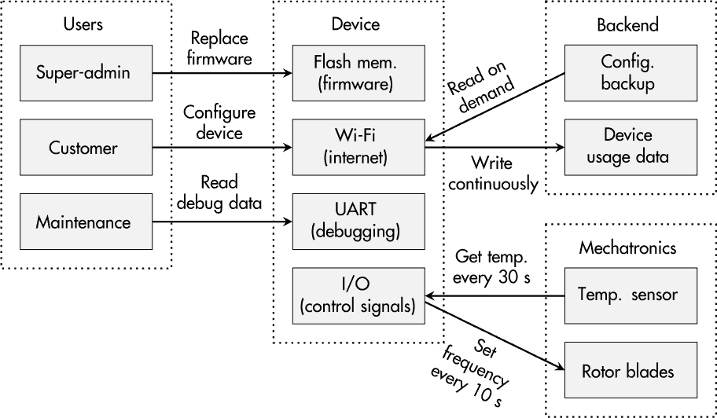

## 第二章：安全开发过程**

当我还是学生时，我认为组织过程是工程学中最枯燥的课题之一。然而，在从事安全工程工作十多年并帮助组织优化安全工作后，我不得不承认，过程比我想象的更有趣，且在开发安全产品时完全不无关紧要。

尽管一个产品的技术保护特性可以完成并标记为*完成*，但安全开发过程*永远不会完成*；它必须不断维护和改进，这也是为什么安全工程过程的定性衡量标准被称为*成熟度*。它可以上升或下降，取决于支持在组织内开发安全产品的活动的规律性、质量和组织结构。

本章的目标是说服学生、工程师和开发者，过程不仅仅是创建没人阅读的文档。*安全开发生命周期（SDL）*关乎文化和日常行为；它关乎在变化的条件下维持质量和安全，并且阐明了如何让每个参与产品工程过程的人都能持续贡献于安全的最终产品。

### **关于各种指南**

安全开发过程的建议已经存在了一段时间。然而，根据你的行业情况，可能到目前为止你所在的组织还没有考虑过采用这样的系统化方法，或者至少没有明确提出过。

开发操作系统和网页应用程序的公司较早就面临了安全问题，因此微软和开放网页应用安全项目（OWASP）是最早着手研究并讨论 SDL（安全开发生命周期）的公司之一也就不足为奇了。自国际电工委员会（IEC）发布 IEC 62443 第 4-1 部分以来，越来越多用于生产设施、关键基础设施和各种自动化应用的工业部件制造商开始意识到实施安全开发过程的必要性。

微软的 SDL 遵循 12 项实践（*[`www.microsoft.com/en-us/securityengineering/sdl/practices`](https://www.microsoft.com/en-us/securityengineering/sdl/practices)*），这些实践描述了公司为开发安全（软件）产品所采用的过程。这些过程包括从培训到需求工程、威胁建模、安全测试等。此外，OWASP 也面向软件社区，使用五个类别总结其软件保障成熟度模型（SAMM，*[`owaspsamm.org/model/`](https://owaspsamm.org/model/)*）：治理、设计、实施、验证和运营。IEC 62443 的第 4-1 部分（*[`webstore.iec.ch/publication/33615`](https://webstore.iec.ch/publication/33615)）旨在为工业组件制造商建立一个安全开发过程。它分为 8 项实践，每项实践包含 2 到 13 个子实践，详细列出了从安全管理到设计与实施，再到现场更新管理等推荐活动。

这三条指南使用不同的结构来解释安全开发过程的理念；然而，你可能会注意到它们之间有显著的重叠。例如，微软 SDL 告诉你执行*威胁建模*，而 OWASP 在其*设计*类别中使用了*威胁评估*一词，IEC 62443-4-1 的要求 SR-2（它是*安全需求规范*实践的一部分）解释了为产品建立并维护*威胁模型*过程的必要性。

此外，安全知识和能力的重要性在这三者中都有体现：微软将*提供培训*列为其首要实践，而 OWASP 将*教育*视为*治理*的一部分，IEC 62443-4-1 在其*安全管理*实践的要求 SM-4 中使用了*安全专业知识*一词，来总结技能识别与发展的过程。作为最终示例，*渗透测试*在微软中是明确列出的实践；它在 IEC 62443-4-1 的*安全验证与验证测试*实践中的要求 SVV-4 中以相同名称出现，而 SAMM 在*验证*项目下的*安全测试*任务中提到了它。

我们可以继续讨论其他主题，如使用最先进的加密技术、澄清第三方依赖关系和漏洞管理等。重点是，在内容方面，这些指南有许多相似之处，因此对于“在众多可用资源中，哪个是最好的？”这个问题的回答是：“其实并没有太大区别。”

微软在安全软件工程方面拥有超过 30 年的经验。OWASP 不仅提供了有价值的建议，还提供了开源工具来支持这些过程。另一方面，IEC 62443-4-1 针对的是工业领域和组件制造商，这与传统的 IT 公司有所不同。此外，独立机构可以认证是否符合 IEC 62443 标准，但微软和 OWASP 的 SDL（安全开发生命周期）无法进行认证，这可能是一个决定性的因素。

这三份文件只是常见的示例。NIST 的*《特别出版物 800-160》*（*[`csrc.nist.gov/pubs/sp/800/160/v1/r1/final?`](https://csrc.nist.gov/pubs/sp/800/160/v1/r1/final?)*）、Building Security In 成熟度模型（BSIMM，* [`www.bsimm.com`](https://www.bsimm.com) *）倡议，以及欧盟网络安全局（ENISA）*《物联网安全的最佳实践——安全软件开发生命周期》*（*[`www.enisa.europa.eu/publications/good-practices-for-security-of-iot-1`](https://www.enisa.europa.eu/publications/good-practices-for-security-of-iot-1) *）也非常有帮助。

### **产品安全责任**

每个产品的安全成功始于职责的明确划分。无论是初创公司的创始人、全球公司的产品安全官（PSO），还是开发团队中的成员承担责任，都不重要，重要的是*某个人*要负责，并且这个人拥有足够的时间和资源来完成这项工作。

安全开发过程由一组异构的活动组成，这也意味着负责安全的人必须参与许多产品开发阶段。这个人必须确保*从设计开始就考虑安全*成为开发文化的一部分。当然，这并不是最有吸引力的角色，尤其是当安全在你的组织中之前并未受到关注时。尽管（产品）管理层通常喜欢谈论新技术和设备功能的潜力，但经常强调其中涉及的风险并不会让你成为每个人的宠儿。

然而，从长远来看，这个人将消除错误、漏洞和内部误解的源头。他们不仅会提高设备安全性，还会促进产品开发团队与管理层之间的透明度。

**实践中：安全工程专家**

我曾作为顾问为一家中型公司引入安全性到其产品工程流程中。当时，这家公司在 IT 部门有一位安全专家，但嵌入式系统工程团队中没有具备安全知识的人。

幸运的是，公司聘请了一位充满激情的年轻专业人士，他具备扎实的安全专业知识，甚至有设备工程经验，来填补这个空白，并负责产品安全。怀着一些关于如何建立安全开发流程的想法，他开始熟悉公司的具体流程、人员和产品。

他时常被要求在软件和硬件工程项目中支持开发团队，因为项目的紧迫性。可悲的是，这类任务的数量逐渐增加，而管理层对产品安全的关注却显著下降。大约两年后，他辞职了。而这家公司因此损失了两次：它失去了忠诚的安全人才，同时也失去了在竞争对手之前建立安全开发流程的机会。

### **意识与培训**

几年前，我参加了一场德国安全顾问的讲座，内容讲述了欧洲公司如何为即将到来的网络威胁做好准备（或没有准备）以及安全领域的从业人员每天所经历的压力和挫折。演讲面向管理层代表，最后他总结道：“不是工具也不是技术——*人*才创造安全！”

从需求工程到软件和硬件开发，再到漏洞处理，正是人们创造性地发现了如何滥用产品功能，严格遵循团队内达成的安全编码规则，并分辨出第三方报告的相关和不相关的安全问题。

换句话说，如果你的开发团队无法想象潜在的攻击场景；将安全实践视为障碍；并以愤怒、恐惧或完全不理解的态度回应漏洞报告，那么即使你购买了最昂贵的顶级工具许可来“支持”它们，你的产品在安全性方面也不会有所提升。显而易见的问题是，“谁需要具备什么样的安全知识，才能在每天的工作中遵循安全设计原则？”

对于大多数员工来说，通用的安全意识是基本要求。这一要求对于工程师、开发人员和设备架构师同样适用。然而，安全意识并不是你在学校学到的东西（至少目前是这样）。它也不是大学教育或典型的在职培训计划中的强制性部分。此外，意识常常随着时间的推移而消失，这意味着它必须定期刷新。在你的团队中，必须解决并讨论攻击者的视角、他们的意图，以及应对这些策略的可能性。

根据我的经验，基于网络的培训通常是员工进行的“点击即忘”式活动，而社交聚会、研讨会和团队建设活动则能够促使互动、讨论，最理想的是能够进行反思，这使得人们能够将安全知识与日常工作相结合。

除了安全基础知识外，产品工程团队的成员可能还需要特定的能力。例如，开发人员可以从安全编码培训中受益，而测试人员可以通过参加渗透测试课程来提升技能。尤其在中型公司中，参与安全工程社区常常被忽视，但这可能是一个值得尝试的途径，可以与其他组织的管理层和技术人员交流想法、挑战和经验教训。

再次强调，培训并非一次性活动。持续地推动员工反思他们工作和日常流程的安全性，是建立生动的安全文化的一个重要组成部分。

### **资产和保护目标**

想象一个阳光明媚的星期一早晨。接下来的这一周似乎像往常一样繁忙，但突然管理层有人问你是否能抽出一分钟：

经理：“请把我们的产品做成一个安全的产品！”

你：“你到底是什么意思？”

经理：“黑掉它应该是不可能的！”

你：“这个需求是从哪里来的？”

经理：“你没看新闻吗？现在什么都在被黑！”

你：“好吧，哪部分产品值得被黑？”

经理：“我不知道；你告诉我！”

这个对话是虚构的，但你可能有过类似的讨论。它明确了一个简单的观点：如果你不知道要保护什么，就无法保护设备。本质上，你公司里的每个人都应该知道什么是值得保护的，或者什么是对保持业务运行至关重要的。我们通常称之为*资产*。

#### ***有价值的产品部分***

资产可以是各种类型的——例如，一个在按需支付场景中必需的加密密钥，一个从设备传输到云应用的测量数据，以启用预测性维护服务，一个激活或禁用产品功能的配置文件，一个在紧急情况下发出警报的固件代码，或者一个基本设备操作所需的 Web 服务。简而言之，资产就是任何在某种程度上重要和有价值的东西。

确定这些资产是启动安全开发过程的初步分析，也是你所有保护工作基础。逻辑上，你应该在实施对策或进行渗透测试之前确定你的资产是什么，因为如果你不知道要保护什么，又怎么能实施有效的对策并指定最坏的攻击场景呢？然而，由于大多数现代设备不是独立存在的，这一过程还涉及在组织内部建立*共同的系统理解*，这包括相关的对象、数据流、人员、第三方组件、生命周期过程以及背后的商业模型。

阅读这个列表时，你可能会觉得它涵盖了大量信息，你是对的。话题涉及从商业洞察到深度技术知识，再到流程和组织结构。无论你的公司大小，单个人通常不会负责所有这些任务，尤其是在开发团队内，因此以多维度的方式来进行分析是至关重要的。

**注意**

*我在设立一个由主持人、安全专家和一群参与特定设备业务运营的员工组成的工作坊时，曾有过很好的经验。除了开发人员、测试人员和产品经理外，邀请来自维护、客户支持、数字服务、设备安全、销售以及任何可能与产品相关的部门的人员也是有意义的。*

与团队成员讨论网络安全的起点是一个收集架构信息的基本概述。图 1-1 显示了一个虚构的 Wi-Fi 控制工业通风机的此类表示示例。

*图 1-1：基本设备上下文概述的示例*

这个初步概述应该简单，但足够详细。之后，在工作坊或讨论中的一个有时可能很混乱的过程中，这个概述将通过信息的补充和完善得到丰富，可能包括原始文档中没有明显的数据流、以前未知道的与第三方的关系，或者仅由那些每天执行它们的人知道的隐性过程步骤。

在每个人都对整体系统表示的细节和正确性感到满意后，实际的资产识别从这个问题开始：“系统中的哪些部分对我们的商业模式和/或我们的组织至关重要？”

#### ***相关保护需求***

确定不仅是*什么*需要保护，而且是*为什么*它重要，这直接引导我们定义*保护目标*。

每个资产应该至少有一个保护目标；否则，从安全角度来看，资产可能不相关。以下列表，从著名的 C-I-A 三元组（机密性、完整性、可用性）开始，列出了定义哪些资产属性值得保护的典型保护目标。然而，如果你识别到一个不符合此列表标准目标的特定保护需求，将其用自己的话写下来也是没有问题的。

**保密性 (C)**  这一保护目标可能是最广为人知的。我们可以说，相应的资产必须保持“机密”才能“安全”。更正式地说，这意味着对特定资产的读取访问应该只有授权实体可以进行。尽管这个目标在谈到安全时可能是每个外行人首先想到的，但它并不总是正确的，并且并非所有资产都需要此保护。典型的需要保密性的资产包括存储的加密密钥或包含知识产权的可执行文件。

**完整性 (I)**  只有授权主体应该能够更改特定对象或数据，如果其他人进行修改，应该能够检测到这种篡改。常见的应用场景包括用于计费的单调计数器，或通过通信通道发送的控制命令。此外，您可以将此目标应用于整个设备或机器，以强调*系统完整性*的重要性，例如，如果能够替换系统的部分组件。请注意，*完整性*一词在安全领域的含义与安全领域不同，在安全领域，循环冗余检查（CRC）通常被认为是“完整性保护”。但在安全领域，这一概念并不成立，因为一个主动攻击者可以轻松伪造 CRC。

**可用性 (A)**  虽然设备的大部分部分应可用以确保其正常运行，但此保护目标用于数据或服务（无论是在设备上还是在后端），如果攻击者可能中断或延迟访问它们。相应资产的例子包括为设备提供实时数据的 Web 服务、设备主处理单元内的随机数流，甚至服务器系统上的备份。特别是在汽车和工业应用场景中，在*硬实时通信*的上下文中也存在类似的要求。在这种情况下，当前信息（例如来自安全传感器或刹车控制器的信息）必须在*给定的截止时间之前*可用。

**真实性 (Au)**  我们可以将这个保护目标视为完整性的扩展。除了确保数据没有被篡改外，这一目标还要求我们能够明确验证数据来自特定身份。真实性特别相关，如果您的设备的一部分必须是“原厂的”，例如备件、存储在闪存中的固件或许可证文件。

**不可否认性 (Nr)**  与真实性密切相关，不可否认性意味着实体不能合理地否认执行过某个操作。通常，这一要求对于导致合同产生的设备和/或用户活动非常有用——例如，直接在设备上订购打印机的墨水补充，或者如果您的产品包括按次付费的功能。

**隐私（Pr）、假名化（Ps）和匿名性（An）** 自 2018 年欧洲通用数据保护条例（GDPR）出台以来，隐私和数据保护问题受到越来越多关注。如果你的设备处理个人数据（例如，医疗设备），你可能还需要为这些数据指定保护目标。典型的目标可能是*假名化*，即数据可以追踪到一个化名，而不是一个真实的人，或者是*匿名性*，即处理或收集的数据既无法与真实的人关联，也无法与化名关联。

最后，你可能会得到一个资产及其对应保护目标的表格，如表格 1-1 所示。请注意，“备注”列可能会对你想要提供更多背景信息的保护目标非常有用。

**表格 1-1：** 示例资产及其对应的保护目标

| **ID** | **资产** | **保护目标** | **备注** |
| --- | --- | --- | --- |
| AS01 | 固件 | I, Au | 仅限原版固件 |
| AS02 | 证书私钥 | C | 如果泄露，设备可能被克隆 |
| AS03 | 温度传感器数据 | I, Au, A | 对检测设备滥用至关重要 |
| AS04 | 调试接口 | C | 仅限内部技术人员访问 |
| AS05 | . . . | . . . | . . . |

在处理了如此大量的信息后，人们通常会对设备安全与产品开发及运营各个领域的交织感到震惊。然而，他们通常会感到满意，因为他们已经迈出了朝着安全设备发展的第一步，并且了解到一些他们曾认为自己从 A 到 Z 都了解的产品的新知识。

**实践中的威胁建模工作坊**

几年前，我受邀在一家工业控制系统制造商那里进行为期两天的风险分析工作坊。根据我的建议，公司邀请了来自不同领域的几位人员参与。

在工作坊的前几个小时，一位开发人员正在解释设备中如何实现关键工业网络与 IT 网络的分离，这时一位来自技术维护的人员插话说：“我们在外面不是这么做的。”他接着解释说，在维护过程中，将这两个网络桥接起来要方便得多，而且这种桥接连接有时会在设备运行期间保持存在。

这一刻引发了许多讨论，促成了一个主要识别风险，最终导致了设备附加网络监控功能的开发。随后，维护说明手册也考虑到安全性进行了更新。这个问题之所以出现，完全是因为一个异质的跨学科小组在讨论产品安全时提出了不同的观点。

### **攻击者、威胁与风险**

在建立了一个共同的系统来理解和识别你设备的资产和环境之后，便可以开始分析针对你特定使用案例的威胁和风险。第二阶段的目标是开发一套能够代表你当前威胁环境的场景，并根据它们发生的概率和对你的业务和组织的潜在影响进行评估。

*威胁场景* 通常由*威胁行为者*（进行攻击的人）、可能的*漏洞*（你设备的可利用弱点）、*攻击路径*（攻击使用的路径或方法）以及对你早先识别的至少一个资产的影响组成。这个阶段试图预测你的设备将来可能面临的威胁，即使它还没有开发或生产出来。

当然，你无法以百分之百的准确性全面实现这种预测。这是一个创意过程，需要参与者扮演攻击者的角色，并设想如何实现他们的恶意目标。是的，开发威胁场景对于技术人员来说可能有些不太结构化，可能会出现惊喜，结果也不是一成不变的。如果发现新的威胁，你还需要在未来更新你的场景。

#### ***潜在对手***

一个好的起点通常是想象潜在的攻击者，他们在动机、机会和资源方面各不相同。以下可以作为基本的示例：

**脚本小子** 这些攻击者不一定是青少年，但他们是出于好奇心和娱乐目的分析设备和服务的人。他们通常资源有限（除了闲暇时间），使用互联网上的标准工具，并通过观看视频来获取基本技能。

**安全研究人员** 这些人拥有专业的知识和强大的设备，通常在大学里。他们虽然通常没有财务利益，但他们的目标是发布他们发现的漏洞并准备相应的修复方案。与其他攻击者类型不同，他们通常愿意与公司合作，以提高产品安全性。

**网络犯罪分子** 这些有组织的犯罪分子每天都在攻击 IT 产品，驱动他们的动力是财务利益。无论是勒索软件、拒绝服务（DoS）攻击，还是个人数据的销售，这些攻击者至少有一定的资源，积极监控行业，并能将他们的工具适应新场景。

**产品盗版者** 克隆设备是嵌入式系统面临的一个主要问题。这些攻击者装备齐全，可以复制硬件设计和软件组件以供自己使用。他们利用原始设备制造商的开发投资，提供价格较低的假冒产品。

**国家级攻击者**  —— 这些攻击者拥有复杂的设备、几乎无尽的资源和独特的情报数据访问权限，仅仅是其中的一些特征。他们通常出于政治或军事动机行动，因此他们通常超出了标准商业解决方案的范围。然而，尤其是对于在联邦或关键基础设施中运行的设备，考虑到此类对手是很重要的。

这些广泛且通用的攻击者类型有助于识别常见风险，但通常设备及其应用程序会有更具体的对手，这有助于让威胁场景更加具体，并帮助你识别组织面临的个别风险。例如，在汽车和摩托车领域，发动机调校可能是某个特定攻击者群体的目标，他们旨在绕过保护措施以应用自己的定制性能设置。

或许连客户本身也可能对操控他们的设备感兴趣。以农业物联网系统为例，环境保护和动物保护活动家可能是具有自己目标、资源和手段的现实攻击者。

最后，不要忘记*内部人员作为攻击者*，因为他们对内部文件、数据和流程有独特的知识和访问权限。当然，大多数员工可能是值得信任的，但思考一下如果同事有不良意图，他们可能做出什么行为，对于这一阶段是很有价值的。表 1-2 显示了表 1-1 中列出的资产的攻击者示例及其对应的属性。

**表 1-2：** 可能攻击者及其属性示例

| **ID** | **攻击者** | **动机** | **资源** |
| --- | --- | --- | --- |
| AT01 | 网络犯罪分子 | 财务 | 中等，恶意软件访问 |
| AT02 | 脚本小子 | 娱乐 | 低，互联网工具，闲暇时间 |
| AT03 | 环保活动家 | 宣传 | 中等，公关联系人 |
| AT04 | 维护人员内部人员 | 财务/愤怒 | 技术文件、设备账户、源代码读取权限 |
| AT05 | 客户 | 财务 | 日常设备使用，实验时间 |
| AT06 | . . . | . . . | . . . |

在编制这份清单时，人们有时会回想起过去发生的盗窃、破坏或海盗行为。相关信息对优化未来的保护工作非常有帮助。

#### ***潜在的负面影响***

在一方面，我们拥有对业务至关重要的资产，而另一方面，我们有待机会进行攻击的嫌疑人。接下来合乎逻辑的问题是：“这些潜在的恶意行为者如何影响我们的资产？”

构建攻击向量并想象系统中可能存在的漏洞，可能会导致大量重叠的威胁场景，增加处理工作量，而且仍然无法涵盖所有内容。解决这一问题的一种方法是采用实用的方式，列出资产并应用由微软开发的*STRIDE 方法论*所建议的相关威胁。

表格 1-3 通过展示 STRIDE 缩写的含义来解释这一方法论——即五种标准威胁——并参考它们旨在打破的目标，以及主持人可以向所有参与者提出的样本问题。对于表格 1-1 中的 AS01——一个承载完整性和真实性保护目标的固件镜像——任务是创造性地思考篡改或伪造镜像原始制造商身份的方式。

**表格 1-3:** STRIDE 威胁清单

| **Threat** | **Target** | **Question to pose** |
| --- | --- | --- |
| **S**poofing | 真实性 | 有没有办法冒充任何实体？ |
| **T**ampering | 完整性 | 有没有办法篡改任何数据？ |
| **R**epudiation | 不可否认性 | 有没有办法合理地否认一个行为？ |
| **I**nformation disclosure | 保密性 | 有没有办法读取/提取信息？ |
| **D**enial of service | 可用性 | 有没有办法中断/延迟服务？ |
| **E**levation of privilege | 授权 | 有没有办法在未经许可的情况下行动？ |

如果其他任何 STRIDE 威胁似乎适用，将其添加到讨论中。例如，在固件案例中，您可能有之前未考虑过的机密知识产权。最后，将任何额外的威胁与您的攻击者列表匹配，并讨论谁将是该威胁的合适行动者。

除了设备和软件共同面临的威胁外，物理产品还面临另一个问题，这应当是大家在头脑风暴威胁时的备忘事项：*它们可以被物理攻击*。在某些情况下，这可能不是关键问题，因为如果人们能接触到设备，就可以破坏设备控制的机器或系统的其他部分。然而，物理可访问性在至少两种情况下是一个关键因素：

**攻击前设备分析** 在许多情况下，设备可以被购买并分析其漏洞、加密秘密以及在攻击者控制的环境中的相关行为。物理访问使得攻击者可以提取设备的固件并进行详细的逆向工程，或通过印刷电路板 (PCB) 上的通信痕迹进行窃听，这可能揭示机密数据。

**隐形操控** 使用锤子“操控”机器通常会伴随噪音和可见损伤，人类可以察觉到。然而，任何能够改变设备或系统参数的物理接触或接近，如果没有对攻击系统进行深入分析，是无法察觉的，这可能代表一个非常强大的攻击向量，能够造成持久的影响。

对所有资产重复这个过程需要时间。然而，由于这种格式通常涉及来自多个领域的专家，因此在实践中通常会限制为一到几天。通过这一流程后，你会得到一组威胁场景，以供产品使用。表 1-4 展示了一个示例研讨会的部分结果。

**表 1-4：** 示例威胁场景

| **ID** | **资产** | **攻击者** | **威胁** | **影响** |
| --- | --- | --- | --- | --- |
| TS01 | AS01 | AT04 | 当前没有完整的完整性和真实性保护；维护人员可以物理接触许多设备；知道如何打开设备并篡改固件 | 产品功能失常和客户投诉 |
| TS02 | AS02 | AT01, AT03 | 如果被购买，攻击者可以从设备固件中提取私钥；攻击者可以伪装成设备 | 向后台注入伪造数据 |
| TS03 | AS02 | AT01, AT03, AT04 | 攻击者可能在线发布私钥，损害公司声誉；世界上任何人都可以冒充我们的设备 | 媒体关注；甚至可能导致产品召回 |
| TS04 | AS03 | AT05 | 物理操控温度传感器；安全通信通道不能防范此类情况；温度始终显示为冷，而实际上持续超过限值 | 损坏案例中无法证明误用 |
| TS05 | . . . | . . . | . . . | . . . |

这些已知的场景将帮助你阐明所识别的问题，并与公司或管理层进行沟通。

#### ***无风险，无优先级***

到目前为止，每个潜在的攻击向量和每个潜在的漏洞都已经收集完成，没有将任何内容作为“无关紧要”而丢弃。然而，清单可能会很长，而处理这些已识别问题的资源通常是有限的。现在是时候通过评估每个威胁场景的（至少）两个属性来筛选出重要内容：其发生的概率，以及如果发生，它的潜在影响。

在安全领域，几乎每一种可能发生的概率都可以用一个数字来描述。如果功能安全专家参与了你的跨学科研讨会，他们可能会提供这种方法论，并主张概率必须以数字形式表达。然而，没有人能够将想象中的人类对手提炼成一个有意义的百分比，因此，通过低、中、高等定性尺度对概率进行排名，可能是最合适的方式。

对于影响，我也倾向于使用简单的低、中、高三个等级。然而，在每个分析中定义这些术语的具体含义是非常重要的，这取决于产品、公司的规模以及你的商业案例。例如，你的团队可以商定将影响评级与损害数值关联，如表 1-5 所示。

**表 1-5：** 示例影响评级

| **影响** | **损害** |
| --- | --- |
| 低 | $10,000 |
| 中等 | $100,000 |
| 高 | $1,000,000 |

为了得到每个威胁场景的最终*风险评分*，我最后要解释一件事：低、中、高的概率和影响评分分别取值为 1、2 和 3。如果你将它们相乘，就能得到相应的风险评分。

在对所有威胁场景进行评级后，你将得到一个类似于表 1-6 所示的清单。为评分添加解释可以让大家更好地理解和推理，尤其是在几周后大家忘记了研讨会讨论的细节时。

**表 1-6：** 示例威胁场景评级

| **威胁场景** | **发生概率** | **影响** | **风险评分** |
| --- | --- | --- | --- |
| TS01 | 低（机会少） | 低（单一设备） | 1 |
| TS02 | 中等（离线攻击） | 中等（少数案例） | 4 |
| TS03 | 中等（需要专业知识） | 高（产品召回） | 6 |
| TS04 | 中等（财务利益） | 中等（如果出现多个案例） | 4 |
| TS05 | . . . | . . . | . . . |

在你和你的同事列出评分后的威胁场景清单后，你可以根据风险评分对其进行排序，或者以一个二维风险矩阵展示，其中概率和影响作为坐标轴。这种方法可以帮助设备架构师和产品经理更好地优先处理风险，因为总是没有足够的资源来实施每一项缓解措施并防范所有可能的威胁。

**注意**

*电子表格和专门的威胁建模软件可以帮助你创建和可视化这里描述的威胁场景。但无论你使用什么方法，识别资产及其保护目标、创意思考攻击者及其目标，并判断收集的威胁场景的相关性，最终还是由你来决定。*

### **安全需求与安全架构**

威胁建模和风险分析对于你自己公司来说至关重要，它帮助区分设备所需的必要保护需求和仅仅是附加的保护需求。然而，重要的是要理解，你的组织并不是唯一的利益相关方。客户、认证机构和政府等可能会对你的产品施加额外的安全要求。

其中一些要求可能与你自身的兴趣重叠，而另一些则可能与你的兴趣相对立。确保处理你识别出的最高优先级风险，但也要在安全需求过程中考虑外部要求，如法律义务、客户需求和行业标准。

如果您的目标是产品认证，那么这是您应查看所选证书详细要求的时刻。例如，工业组件制造商可以将其设备的安全要求与 IEC 62443 Part 4-2 所要求的保护特性对齐。但即使没有明确的认证视角，像 ARM 的平台安全架构（PSA）1 级问卷这样的文档也可以作为指导和灵感，帮助为您的特定产品制定稳固的安全要求。

此外，安全要求总是与其他要求竞争，例如设备性能、向后兼容性以及没有安全特性的组件的更低价格。因此，您需要在早期阶段考虑与其他要求的任何冲突。

在识别安全要求的过程中，通常忽视了产品整个生命周期的考虑——从开发到生产，再到现场使用和退役。每个阶段都有其自身的要求和依赖关系。然而，如果设备的所有权可能会发生变化，或者设备上的机密数据在销毁之前从未讨论过如何处理，这时可能就没有为此类目的制定相应要求，这可能会导致后续的麻烦。

#### ***风险处理***

在定义安全架构时，所有关于威胁、风险和要求的前期工作都必须汇集成一系列技术、保护措施和组织安排，最终确保产品的安全性。您可以通过多种方式来应对风险：

**降低**    处理风险的常见方法是减少它们。集成适当的保护措施可以减少成功攻击的概率，或限制可能造成的损害。这两种策略都可以降低某一威胁场景的风险。

**消除**    有时，移除软件组件、接口或产品特性可以完全消除某种风险。从安全角度来看，这一策略是完美的，但从商业和市场营销的角度来看，通常是一个艰难的决定。

**转移**    您可以将安全风险从公司转移到供应商，或从制造商转移到产品用户。通常，这种转移需要适当的文档和/或法律协议，但它可能进一步促进透明度，并增强合作伙伴和客户的意识。

**接受**    公司中的责任方可以接受风险，如果减轻风险的成本高于处理实际发生的安全事件的费用，那么这可能是一个选择。

#### ***安全开发原则***

尽管本书的第二部分和第三部分旨在支持架构师在决定某些技术安全特性时的取舍，但在开发安全架构时，您还应该牢记概念性原则。

##### **执行深度防御**

每一项保护措施总有一天可能会失败，要么是因为遭遇了一个复杂的攻击者，要么是因为遇到了特殊情况。安全架构应实施多层保护。如果某一层破损，剩余的层次可以确保安全，或至少限制潜在的损害。

##### **使用经过验证的安全技术或组件**

一些公司拒绝使用来自外部方的现有技术和组件，即使它们质量很高。当然，在某些情况下，从零开始开发一个安全组件是合理的。然而，这样做可能涉及陡峭的学习曲线，并且可能会有许多失败。如果没有合理的理由，不妨使用已经证明稳健且安全的软件和硬件。

##### **实施最小权限**

对于稳固的安全架构，所有涉及的角色和权限都必须有文档记录。关于授予或拒绝人员和服务访问权限时，应只允许特定角色访问完成任务所必需的资源。这种做法也有助于限制内部攻击的威胁潜力。

##### **保持简单**

复杂性和不透明性是安全的天然敌人，因为它们使得分析风险、识别攻击路径和实施有效的对策变得更加困难。保持设备和安全架构的简洁性，可以更好地确保安全措施达到你定义的保护目标。

##### **减少攻击面**

通过减法来增加！这一谚语在谈到产品的攻击面时尤为准确。一个不存在的无线接口无法被攻击，一个从 PCB 中移除的调试端口就无法成为物理攻击者的入口点。移除你设备架构中所有不必要的功能、接口、硬件和软件组件，或者至少移除进入市场的最终产品设计中的这些内容。

**实践中的案例：舍弃功能**

我曾经是一个安全咨询团队的一员，受邀参加一个新工业产品早期阶段的架构讨论。讨论的主题涉及从安全通信到设备机密的安全存储，再到设备在从一个客户站点移动到另一个站点时的定位追踪。当时，后者的议题非常关键，我们花了相当多的时间来讨论它。

最终，关于安全和国际法律的考量导致将该追踪机制从产品功能列表中移除。伪造追踪数据及类似攻击的风险被彻底消除，产品管理团队也重新获得了安心。

### **安全实现与安全测试**

前面的部分主要关注*做对的事情*，而这一部分则关心*把事情做对*。自然，硬件和软件开发人员希望实现一个功能完整、可工作的产品。然而，如果安全性没有引起足够重视（甚至根本没人关心），那么你最终得到的可能是一个功能完全但却存在多个弱点和漏洞的产品，这些漏洞可能会被犯罪分子、研究人员或客户在市场发布后不久发现。

#### ***左移***

避免这种情况的一个策略是*左移*，即将实现错误的检测提前到开发过程中的尽可能早的阶段，而不是等到产品发布后进行检测。除了能加速反馈循环外，这还降低了错误检测和修正的成本。

这些考虑在实施阶段的最初就已经非常重要，因为你的团队正在做出可能具有重大安全影响的重要决策，比如中央硬件组件、操作系统（OS）、安全编码规则等等。让我们来看两个例子。

##### **硬件组件选择**

物理产品的硬件开发通常比软件开发开始得更早。在某个时刻，项目的截止日期会到来，这个时候称为*硬件冻结*，之后你就不能再更改设备的硬件组件了。如果在这个截止日期之后发现硬件安全问题，往往会导致匆忙的修复、昂贵的重新设计或者不安全的设备。

在选择设备的基础硬件组件时，一定要考虑安全性要求。如果组件成本不是关键因素，选择具有更多安全功能的组件，而不是那些功能较少的组件，这样可以在后期开发过程中为你节省大量的麻烦和费用。

##### **编程语言选择**

如果你问 10 个人某个特定任务最好的编程语言是什么，可能会得到 11 个答案。然而，特别是在嵌入式系统和物联网设备领域，我们已经看到，C 语言为无数内存安全问题奠定了基础，从而导致了安全漏洞。根据来自 Android、Chromium 和 Microsoft 的统计数据，它们的 70%到 90%的常见漏洞和暴露（CVE）都可以追溯到内存管理问题。试想一下，如果不再需要进行代码分析工具、代码审查以及内存管理问题的事件处理，你能节省多少金钱和精力。

不足为奇的是，Rust 在嵌入式、系统级别以及高性能软件开发社区中越来越受到关注，因为它是克服使用 C 或 C++带来的安全问题以及所有相关成本的一种解决方案。

**实践中：安全规划**

我曾与一家工业自动化行业公司的隐形冠军进行了对话。我和我的团队分析了该公司的一款产品，惊讶地发现其 PCB 上有一个安全元件（SE）。当我就此话题向首席技术官（CTO）询问时，他解释说，芯片的成本并不关键，但安全性最终会成为关键因素，因此他们将 SE 集成到设备中，尽管在产品发布时并未启用。它们能够在稍后的时间为秘密存储和安全通信激活该功能；为未来的安全挑战做好准备是关键。

#### ***持续测试与分析***

当然，初始设计决策无法预见所有可能的安全问题。安全实现的第二个要素是构建、测试和审查过程的强大自动化，尤其是在软件开发过程中，开发人员必须在发现代码中的弱点和潜在问题后立即获得反馈。虽然安全性并非自动化和持续集成（CI）的主要目标，但它们有助于提高质量并减少人为错误，而人为错误通常是安全漏洞的根源。

从安全角度来看，自动化 SDL 时必须涵盖以下领域（其中一些是软件特定的，但大多数也可以应用于硬件开发过程）。

##### **第三方组件透明度**

在硬件设计中，生成物料清单（BOM）是日常工作，但对某些产品的软件物料清单（SBOM）的需求正在增长。两者都主要不是为了安全目的而设计，但对于追踪第三方依赖项中的安全漏洞，包括软件库、微控制器和操作系统，它们非常重要。

##### **静态安全测试**

在软件开发中使用静态应用安全测试（SAST）是问题检测的重要组成部分。这些工具可以帮助你识别 C 语言中的不安全函数：它们可能会检测到在发布前必须移除的硬编码秘密，并突出显示可能易受常见安全风险（如 OWASP 十大）影响的代码段。这些静态代码分析工具可以无缝集成到 CI 管道中，并为开发人员提供及时的反馈。

##### **动态安全测试**

静态分析无法检测某些漏洞，因为相关问题源于软件或设备的*不安全行为*，这意味着动态安全测试是必要的。你可以在一定程度上自动化此测试，例如通过将构建好的软件部署到 CI 管道中的测试设备上，该设备可以接受测试用例的挑战。然而，由于测试空间巨大，且动态应用安全测试（DAST）需要特定的运行时环境，这项工作通常比静态分析需要付出更多的努力。

##### **实现审查**

虽然我们通常将*代码审查*用于软件过程，但同样可以将审查应用于设备硬件设计，以发现实施中的弱点、禁用组件的使用或容易遭受物理攻击的设计模式。尽管这是一个人为的任务，但自动化可以帮助你安排审查，或者在关键硬件或软件部分发生变化时触发审查。

#### ***攻击者即服务***

所有描述的技术都旨在验证和确认明确的安全要求和保护特性，或者避免可能破坏设备安全的实施缺陷。然而，尽管安全实现和安全测试的趋势是融合成一个安全、渐进且敏捷的开发过程，但通常有一种安全测试方法是手动执行的，并且不在 CI 环境中：渗透测试。

在*渗透测试*中，内部或外部的安全专家扮演攻击者的角色。通过模拟对当前设备的攻击，他们尝试触发最坏情况的场景，以展示攻击的可行性、所需的努力和可能的攻击路径。反过来，这种测试使得制造商可以重新设计相关的产品部分并发现进一步的相关问题。

由于渗透测试通常是一个时间有限的服务，因此高效利用可用的测试天数非常重要。如果你为你的设备订购渗透测试，确保明确指定三个重要方面：范围；最坏情况；以及你期望进行黑盒、灰盒还是白盒测试。

##### **范围**

如果你没有为渗透测试设置明确的范围，测试人员将只是寻找进入设备的最简单方法。然而，这可能包括打开设备，而这可能远离你所设想的攻击模型。

明确你的期望。是否包括物理攻击？应该攻击哪些接口，哪些接口不在范围内？是否可以操作设备的固件？

重点不是将范围缩小到最小以获得一个积极的测试结果。明确范围的目标是得出最能支持你保护工作结果的测试结论。

##### **最坏情况**

通常，设备上有一些关键资产，这些资产如果被攻破，将导致严重损害。理想情况下，你应该在过程中的风险分析阶段已经识别了这些资产，而你可能最关心的是对这些资产造成影响的攻击。如果你没有明确指定它们，渗透测试人员可能会花费数天时间尝试寻找一种巧妙的方法来操作一个仅对内部用途相关的图形用户界面（GUI）。

##### **黑盒/灰盒/白盒测试**

*黑盒攻击*假设攻击者对设备一无所知，这在你想了解攻击者在短时间内能收集到关于某个产品的信息时是有意义的。然而，如果将这种方法延续数周，并实际上支付渗透测试员为你逆向工程一些你已经知道的信息，那就没有意义了。

改进制造商效率的一种方式可能是分阶段的方法。经过几天的黑盒测试后，测试人员可以提出初步结果，并建议可能的下一步（逆向工程）操作。然而，在此之后，制造商可以向测试人员提供关于协议、硬件和/或软件的信息，帮助他们继续进行宝贵的渗透测试工作。你可以多次重复这一过程，最终实现一个节省时间、更加可能发现有价值安全见解的流程。

**实践中：渗透测试目标**

“你能为我们的产品做一次渗透测试吗？”这是几年前我与一位工业合作伙伴开始的有趣旅程的起点。我本可以说：“当然！给我你们的一两台设备，我会看看能为你们做些什么！”但我选择发起了一次关于安全测试、安全开发生命周期（SDL）以及后者应该从何时开始的讨论——应该从一开始就开始。

幸运的是，我遇到了心态开放、充满动力的人，他们愿意建立一个 SDL，并真正改善设备的安全性。我们最终进行了全面的威胁与风险分析，并根据结果设定了缓解开发的优先级。关键是，仅仅依赖渗透测试结果来推动产品的安全性并不是一种合理的策略。这一点需要强调。

最后，别忘了，对于像物联网设备这样的实体产品来说，最后的实现步骤并不是在开发团队的办公室里完成的，而是在生产工厂的生产线上。在选择安全的生产环境、保护设备在转移到生产现场时的资产，以及执行生产后测试以验证保护功能是否正常激活方面，都是确保设备安全实现的关键步骤。

### **漏洞监控与响应**

无论你的公司有多大、你为组织安全开发过程投入了多少努力，或者你的工程团队有多聪明，始终有一种可能性，那就是漏洞可能隐藏在你的设备中。有些漏洞可能是开发过程中由人为错误引起的，有些可能源自第三方组件，还有一些可能因为攻击者工具和方法的进步而出现，这是你无法预见的。如果你意识到这一点，最好的做法就是做好准备，并计划将接下来的各个阶段以结构化的方式推进。

#### ***报告漏洞***

一些客户、渗透测试人员和安全研究人员确实关心你的产品安全，并会通过负责任的、协调的披露过程向制造商报告发现的漏洞。然而，如果你的网站没有列出安全联系方式，比如一个简单的 *security@company.com*，这些人可能会遇到麻烦，因为他们找不到可以负责的人来报告他们的发现。然后，他们可能会使用 *info@company.com* 联系方式，但消息可能会被淹没在收件箱中，你将永远不会得知已发现的问题。

在其他情况下，发现漏洞的人可能会转向国家或国际安全组织，甚至媒体以引起关注，这可能不是你想要的结果。请在你的网站上建立一个简单、显眼的安全联系方式。其次，一些人会将安全问题报告到邮件列表或漏洞数据库，而不是直接联系制造商。监控与你行业相关的来源对于尽早发现和了解漏洞至关重要。

#### ***审查和评估漏洞报告***

漏洞报告可以从简短的电子邮件到详尽的分析文档不等。收到报告后，首先要审查它，检查它是否真的是一个安全问题或是设备的预期行为，或者研究人员是否犯了什么错误。如果你的产品容易受到描述的攻击方式的影响，接下来的任务是明确原因。这个阶段的结果应该是对当前漏洞的内部理解和评级。

#### ***修复或解决问题***

如果问题的根源在于设备软件，可以通过更新来修复，你可以开发一个补丁，带有两个目标。一方面，它应尽可能全面地消除漏洞。另一方面，它不应影响设备的其他功能或属性。

此外，可以考虑通过设备重配置来缓解漏洞，这种配置甚至可以由客户自己完成。在某些情况下，硬件或不可更新的软件可能是安全问题的根源。这些情况难以处理，因为它们可能需要对每个设备进行物理访问，甚至可能需要产品召回。

#### ***测试***

无论解决方案是软件补丁、硬件返工，还是配置性变通措施，都必须在正式推向所有设备之前进行测试。在某些情况下，更新可能会影响设备性能；而在其他情况下，软件的变更可能会将问题转移到设备的另一个部分，进而产生新的漏洞。确保你的解决方案确实能够做到它应有的效果。

#### ***披露解决方案***

总有一天，您的修复方案将发布给客户。根据行业标准、发现问题的严重性以及您处理漏洞响应的效率，从最初报告到发布修复可能已经过去了一周或一年以上。然而，即便在那个时候，世界上也没有了解详细情况。确保您提出的解决方案附带对问题的有益解释，并清楚地指示客户、管理员或操作员应该采取的行动。如果您的产品对公众有影响，请做好回答媒体询问的准备。

#### ***避免未来的问题***

安全开发过程是一个持续改进的循环。每发现一个漏洞，都应该引发对开发流程可能改进的讨论，以避免未来出现类似的问题。

#### ***建立信任***

对于每个厂商来说，与发现并报告漏洞的人建立信任关系是非常重要的。这些人实际上支持您的安全开发过程，而不需要在您的薪资名单上。关于漏洞处理过程状态的清晰和定期沟通至关重要。

根据发现问题的严重性和范围，您可以考虑通过奖励或安全悬赏来表达您的感激之情。但即使您认为报告的问题只是小事，提供一点感谢可能也是值得的，以承认报告者的努力并鼓励他们未来发现更多关键性漏洞。

**实践中：漏洞报告**

我曾经是一个团队的一员，负责识别一家跨国公司产品中的多个漏洞。通过快速的在线搜索，我们找到了该公司亚洲总部提供的漏洞报告表格，并确信该公司已建立了稳固的漏洞响应流程。我们填写了所有细节，附上了我们全面的 25 页分析报告，并希望一切顺利。

我们很快收到了这样一封邮件：“感谢您的报告，但我们认为我们没有什么可做的。”我们有些震惊，试图再次强调我们发现了关键性问题，但没有成功。接着，我们将这些问题报告给了一个德国的安全组织，该组织将报告转交给了厂商的欧洲联系人，并强调了这些问题的重要性。几个月后，一组专家得出结论，认为亚洲的漏洞处理工程师错误判断了我们的报告，并为此分配了多个 CVE 编号。

然而，如果我们当时没有那么宽容，这个问题可能会被公开，网络犯罪分子可能会在几周内开发出漏洞利用，而该公司的声誉可能会受到严重损害，仅仅因为漏洞处理过程中的某个人说了句：“我认为这个问题不太相关。”

如果你仍然认为，“不，没人会查找或发现我们设备中的漏洞，”那么考虑一下如果有人发现了漏洞，后果会怎样。如果你没有为漏洞处理流程做好准备，可能会出现两种情况。设备漏洞可能因为没有人关心或觉得自己没有责任而得不到足够的关注，这可能导致现场攻击、客户方面的实际损害、恶劣的媒体报道以及你产品或公司声誉的丧失。或者，如果漏洞报告让你团队中的每个人甚至更多人都像吓坏了的鸡一样乱跑，漏洞响应就会变成一个混乱的过程，耗尽情感和资源，最终无法为问题提供可靠的解决方案。

### **总结**

本章总结了组织在追求安全产品时应该遵循的重要活动和过程。一开始，我解释了你可以选择多个内容相似的指南。虽然微软和 OWASP 的建议主要针对软件产品，但 IEC 62443 第四部分显然是针对可以认证的工业组件。

所有安全开发过程的基本要求是，人们要意识到风险，并接受他们在日常任务中所需的安全培训。创建安全产品的关键是对资产、相应的保护目标、可能的攻击者、威胁和涉及的风险进行扎实的分析。你可以通过一个结构化的方法来解决这一任务，从而实现透明度、明确的信任和风险决策，并形成清晰的文档。

基于这些初步工作，你可以进一步实现产品特定的安全需求和个性化的安全架构。培养开发人员和工程师的安全实施习惯，比如安全编码，并定期通过安全测试检查实施结果。漏洞监控以及高效有效的漏洞响应流程，完整了高质量产品的安全生命周期。

如果你想深入了解安全开发过程及相关方法论，可以看看 Loren Kohnfelder 的*《设计安全软件》*（No Starch Press, 2021）以及 Adam Shostack 的*《威胁建模：设计安全》*（Wiley, 2014）。
