## **2**

**密码学**

密码算法的保障和能力常常听起来像是魔法。普通人无法验证这些特性，大多数工程师也做不到。在某些情况下，即使是密码学家也无法证明一个方案的安全性，但他们假设或相信其背后的数学问题很难解决。尽管如此，密码学算法仍是每个开发者和架构师应当了解并掌握的必要工具。

*密码学*一词来源于希腊语单词*kryptós*和*gráphein*的组合，意思是*秘密写作*。然而，今天的密码学远不止是保护机密消息，它还用于保护文件的完整性，推导出可靠的指纹信息，用于对数 GB 的数据进行验证，以及对文件和代码进行数字签名。

本章提供了现代密码学算法及其实际特性的务实概述，同时尽量减少数学公式的使用。我们将从一些基本原理开始，然后简要了解典型的对称算法和哈希函数。最后，本章以探索对称密码学领域的引人入胜内容作为结尾。

### **凯克霍夫斯原理**

奥古斯特·凯克霍夫斯（Auguste Kerckhoffs）是 19 世纪的一位荷兰密码学家。在安全领域，他因提出改善法国军队实际密码学的建议而闻名。1883 年，他发表的六项建议中，有一项被称为*凯克霍夫斯原理*：“系统不应依赖于保密性，且可以被敌人窃取而不会造成麻烦。”

对于密码算法而言，这一原理意味着加密、解密或签名等过程不应保密，任何人都不应依赖这些保密性来保证安全。系统中唯一的秘密应是一个保密的密码密钥。

如今，这一点似乎不值得特别提及，因为所有相关的密码算法都已在国家或国际层面上标准化，并且所有算法都已公开，供每个人阅读和分析。然而，当涉及到工程软件和设备时，一些开发者仍然违反这一原理。他们发明了自己的“加密”程序，并认为安全性是“因为没人知道它是怎么运作的”而实现的。他们有时这样做是出于性能考虑，但更多的时候则是因为缺乏扎实的密码学知识。然而，“可以被敌人窃取”这一说法，也可以理解为“可以被攻击者逆向工程”，这会破坏这种“解决方案”的安全性。

如果你发现自己在考虑实现一个自定义函数，可能包括一些神秘的值和异或操作来实现安全性，请立刻停止思考！这叫做*安全通过模糊性*，它只会让你陷入麻烦。

### **安全级别**

加密算法有多个参数和属性来描述和区分它们，但其中一个是最为核心的：*安全级别*，它通过特定的位长来表示——例如，64 位、80 位或 256 位。这个实际的衡量标准使你可以比较算法及其加密强度。但如果一个特定算法有 128 位安全级别，这到底意味着什么呢？

该级别描述了攻击者为了突破算法保护目标所需付出的努力。通常，这种努力涉及测试大量数据集以找到正确的解决方案，比如一个秘密解密密钥。如果一个算法具有 128 位安全级别，那么攻击者的*搜索空间*就是 128 位大，这意味着攻击者必须进行最多 2¹²⁸次尝试才能在数据海洋中找到目标。

对于设计良好的对称加密算法，密钥长度可以直接转换为算法的安全级别。然而，如果密码学家发现算法存在缺陷，安全级别可能会发生变化。在这种情况下，算法的安全级别可能远低于密钥长度。

此外，请记住，攻击者不断提升其性能。现代的*暴力破解*攻击利用数千个云实例来高效地搜索密钥。近年来，对 64 位密钥的攻击已成功，进一步增加了对安全级别稳固选择的需求。

如果你想设计安全且持久的设备，请跟上当前密码学安全级别的推荐（见* [`www.keylength.com`](https://www.keylength.com) *）。根据写作时的经验法则，128 位安全级别被认为适合实际的安全工程，而 256 位通常用于高安全性应用。

**警告**

*虽然对称加密的安全级别通常等于其密钥长度，但并非总是如此。此外，非对称加密的安全级别完全不同；例如，具有 2048 位的密钥可能只提供 112 位的安全性，正如你将在本章后面看到的。*

### **对称加密算法**

对称加密的起源可以追溯到著名的罗马人凯撒，据说他曾使用简单的字母替换加密法使信息变得无法理解。从那时起，对称加密的基本原理就没有改变。它遵循这样的理念：*明文*消息可以通过使用加密算法`Encrypt()`和*加密密钥*将其加密成*密文*，正如图 2-1 所示。

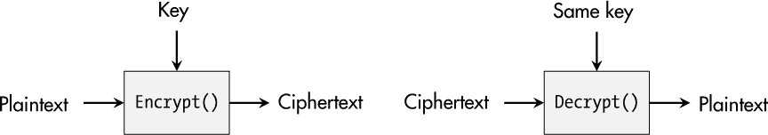

*图 2-1：对称加密的基本原理*

解密操作`Decrypt`（）使用*相同的秘密密钥*来反转加密过程并恢复原始消息，因此这种加密方式被称为*对称加密*。

#### ***数据加密标准***

快进到 2000 年。在许多情况下，对称加密现在由*分组密码*处理，这些密码将一块明文加密为一块密文。第一个公开标准化的分组密码是*数据加密标准（DES）*，也称为*数据加密算法（DEA）*。它基于所谓的*Feistel 网络*，并且只有 56 位的密钥。今天，通过专用硬件，这个密钥空间可以在几小时内完全搜索，这使得它对于现代应用来说绝对不安全。

*三重 DES（3DES）*是 DES 的扩展，使用三个 56 位的密钥，并对明文或密文应用三次 DES。考虑到总密钥长度为 168 位，块大小为 64 位，并且已知的加密弱点，3DES 被认为只能提供 112 位的安全级别，并且不应再用于新的设计中。

**警告**

*一些现代的加密库仍然提供 DES 和 3DES。然而，如果你没有非常充分的理由——例如，必须的向后兼容性——不要使用任何基于 DES 的算法。*

#### ***高级加密标准***

当前对称加密的首选是*高级加密标准（AES）*，最初名为*Rijndael*。这一 DES 的继任者经过 1997 年到 2000 年由 NIST 组织的密码学竞赛过程后，作为《联邦信息处理标准》（FIPS）197 号和 ISO/IEC 18033-3 标准化。AES 基于置换-替代网络（SPN），具有 128 位的块长度，并可以使用三种密钥长度：128 位、192 位和 256 位。

如图 2-2 所示，AES 在一个 4×4 字节矩阵上操作，这个矩阵被称为*AES 状态*。

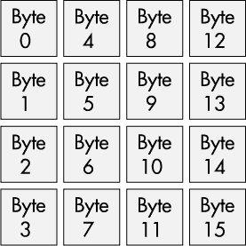

*图 2-2：AES 状态的矩阵可视化*

根据所选的密钥大小，这个状态会经过一定轮数的处理：对于 128 位密钥为 10 轮，192 位密钥为 12 轮，256 位密钥为 14 轮。以下是基于主要 AES 功能的基本加密过程：

**密钥扩展** 原始密钥被扩展为多个 128 位的子密钥，每轮一个，外加一个初始密钥。

**初始轮** 作为准备步骤，函数`AddRoundKey`()被应用于输入明文，以获得新的状态。

**主轮** 根据密钥长度，执行 9、11 或 13 轮主操作，以下操作依次发生：`SubBytes`()、`ShiftRows`()、`MixColumns`()和`AddRoundKey`()。

**最后一轮** 在最后一轮中，仅调用`SubBytes`()、`ShiftRows`()和`AddRoundKey`()。`MixColumns`()被省略。

实现这种强加密的四个操作非常简单。`SubBytes()`函数将 AES 状态中的每个字节替换为由查找表（称为*S-box*）生成的相应字节，如图 2-3 所示。

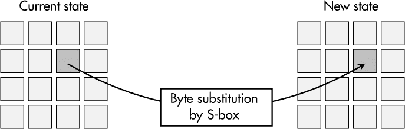

*图 2-3：* SubBytes() *转换*

图 2-4 显示了 `ShiftRows()` 变换将 AES 状态矩阵的第二行向左移 1 字节，第三行向左移 2 字节，第四行向左移 3 字节。第一行保持不变。

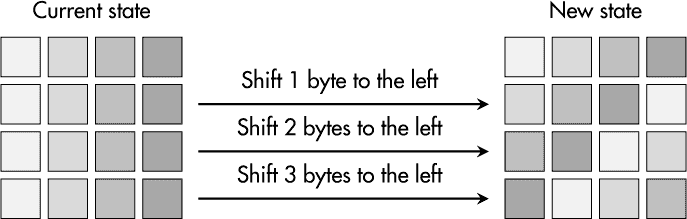

*图 2-4：* ShiftRows() *变换*

`MixColumns()` 操作对 AES 状态矩阵的每一列应用线性变换，如图 2-5 所示。这样得到 4 个字节，分别表示每一列的新状态。

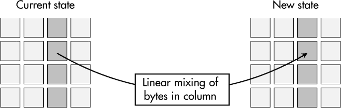

*图 2-5：* MixColumns() *变换*

每一轮中，`AddRoundKey()` 操作将 AES 状态的每个字节与给定轮密钥的相应字节进行异或操作，如图 2-6 所示。

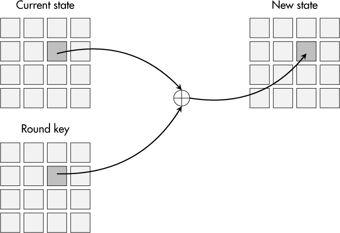

*图 2-6：* AddRoundKey() *变换*

对于解密，子密钥的顺序被反转，并且调用 `SubBytes()`、`ShiftRows()`、`MixColumns()` 和 `AddRoundKey()` 的逆函数。

经过 20 多年的广泛研究，至今没有人发现 AES 架构存在具有实际意义的攻击。它已被所有主要的加密软件库所支持，甚至像 8 位微控制器这样的小型系统也可以在合理的性能下使用它。AES 被用于笔记本电脑的磁盘加密，也用于安全互联网通信中的有效载荷加密。每当涉及对称加密时，除非有充分的理由，否则你应该选择 AES。

### **工作模式**

由于 AES 是一个分组密码，它自然只加密或解密单个数据块，但许多应用程序的输入数据要比一个 128 位的块多得多。因此，AES 必须在某种*工作模式*下使用，该模式定义了加密和解密多个数据块的过程。这里介绍的模式在 NIST 的*特殊出版物 800-38A*中有所定义。

#### ***电子密码本模式（ECB）***

有些人可能会想：“为什么不按块加密数据呢？”这种简单的做法正是*电子密码本（ECB）模式*所做的。它将消息的前 128 位作为第一个明文块，将其加密为第一个 128 位的密文，然后继续对所有可用的 128 位数据块按此方式处理，如图 2-7 所示。

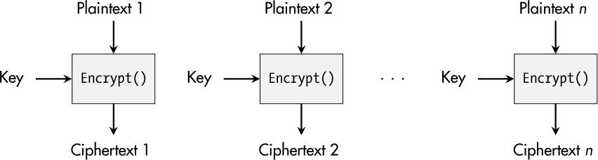

*图 2-7：ECB 模式下的加密*

然而，这种方法的问题在于相同的输入数据块会加密为相同的密文块。因此，块与块之间的关系（也可能包含敏感信息）得以保持。图 2-8 展示了这一现象。

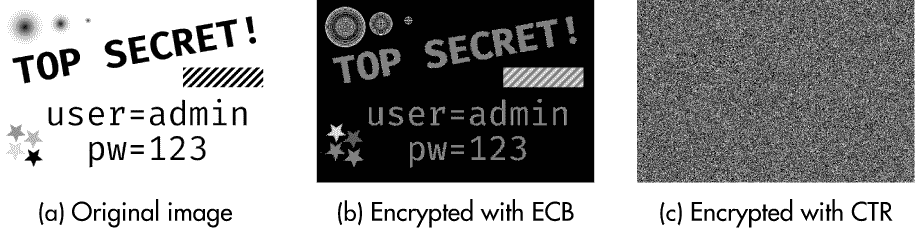

*图 2-8：比较 ECB 模式与计数器（CTR）模式*

当图像使用 ECB 模式加密时，具有相同值的明文像素仍然会映射到具有相同值的密文像素。图像信息仍然是可以理解的。而对于其他操作模式，如计数器模式，情况则不同，如第 34 页的“计数器模式”一节所述。

#### ***密码分组链接模式***

*密码分组链接（CBC）模式*通过将第一个块的密文与第二个块的明文进行异或，依此类推，从而打破了明文与密文之间的关系。图 2-9 展示了这一基本原理。

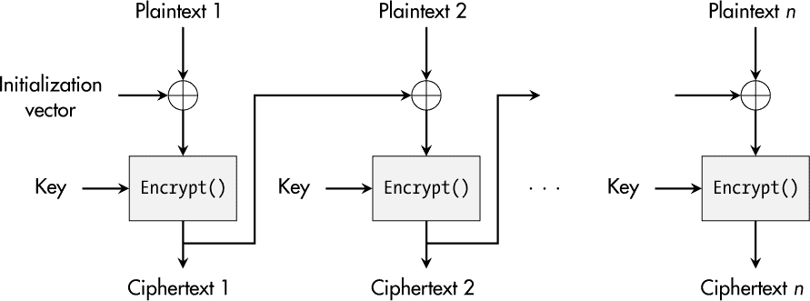

*图 2-9：CBC 模式中的加密*

从安全角度来看，CBC 模式显著优于 ECB 模式，但它有一个新的缺点：后续加密之间的依赖性使得并行实现的效率降低，从而限制了性能。

#### ***计数器模式***

一种有趣的模式，既不允许密文之间的关系，但又便于高性能的多核实现，叫做*计数器（CTR）模式*。如图 2-10 所示，明文块本身并没有加密，而是将一个*nonce（一次性数字）*与从 0 开始的计数器值连接起来。

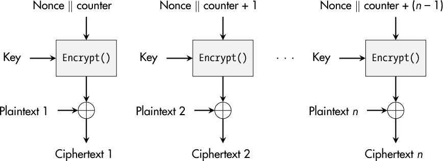

*图 2-10：CTR 模式中的加密*

这种加密的结果会与明文进行异或操作，从而得到密文。对于每一个后续的明文块，计数器值会增加 1，以支持密文的变化，如图 2-8c 所示。这种方法甚至提供了另一个优势：加密和解密都使用所用分组密码的`Encrypt()`函数，无需实现`Decrypt()`。

与 ECB 模式不同，CBC 和 CTR 模式需要额外的输入参数：*初始化向量（IV）*或 nonce。两者的目的都是使每次加密都具有唯一性，因此它们不应当重复使用。此外，只有接收方也能访问对应的 IV 或 nonce，解密才是可能的。但由于它不携带机密数据，因此可以与密文一起以明文形式传输。

**警告**

*实际上，仅将 IV 或 nonce 设置为 0 或一个固定的随机数是很有诱惑的。然而，这么做会显著削弱这个加密原语的强度。花费额外的精力来实现一个适合的生成器，以确保生成唯一的值。*

与操作模式 CBC 和 CTR 一起，AES 非常流行。然而，如果你有特殊需求，其他更有趣的对称加密算法可能会有所帮助。例如，由密码学家 Daniel J. Bernstein 开发的现代流密码 Salsa20 和 ChaCha20，具有简单的设计，并在纯软件实现中提供高性能。如果你的硬件不支持 AES，但你需要获得尽可能高的性能，这些算法可能值得一试。

### **哈希函数**

哈希函数在密码学算法中有些另类。单独使用时，它们并不追求经典的保护目标。它们的目标是将更多或更少任意大的输入数据映射为一个固定长度的二进制序列，称为*哈希值*或*摘要*。

然而，设计这样函数并不简单。它们必须满足一系列强要求：

**原像抗性** 术语*原像*指的是映射到给定哈希值的哈希函数的正确输入数据。这个要求表示攻击者不应该能够找到适合现有哈希值的输入数据。这也是为什么哈希函数也被称为*单向函数*的原因。没有人应该能够反转它们。

**第二原像抗性** 此外，具有消息及其哈希值的恶意行为者不应该能够找到*第二原像*——即另一个映射到相同哈希值的消息。

**碰撞抗性** 自然，哈希值碰撞是不可避免的，因为哈希函数的输入空间大于其输出空间。哈希函数的最强假设是找到任何两个映射到相同哈希值的消息应该是*实际不可能*的。

从设计上讲，哈希函数不使用秘密密钥，这意味着每个人都可以使用它们并将其应用于手头的所有数据。因此，我们必须以不同的方式来确定哈希函数的安全级别。安全级别描述为找到碰撞的难度，这本质上是一个搜索空间问题，类似于为加密算法找到正确密钥的问题。

基于所谓的*生日悖论*和*rho 方法*，密码学家们已经证明，对于设计良好的哈希函数，我们可以估算其安全级别为输出大小的一半。例如，对于一个输出为 160 位的哈希函数，安全级别的估算值约为 80 位。

在这个时候，你可能会想，为什么我们需要哈希函数及其加密映射过程来确保设备安全？原因很简单：它们是许多安全应用的一部分，如数字签名生成和验证、密钥派生算法、安全密码存储等。

哈希函数的第一个实际实现出现在 1990 年代。MD4、MD5 和 SHA-1 是三个突出的代表。然而，与此同时，研究人员已经发现了找到这三种（以及其他哈希函数）碰撞的方法，因此你不应该再在现代设计中使用这些遗留算法。

目前，最广泛使用的哈希函数家族是 SHA-2，它是 SHA-1 的继任者。它在*FIPS 180-4*标准中进行了描述，并有四个成员：SHA-224、SHA-256、SHA-384 和 SHA-512。数字表示这些函数的输出长度，因此 SHA-224 与 SHA-256 非常相似，除了初始值不同以及最终哈希值被截断为 224 位。SHA-384 与 SHA-512 之间也有类似的区别。

SHA-256 处理 512 位（16 个 32 位字）的数据，进行 64 轮操作。它在抵抗碰撞方面具有 128 位的安全性，因此是一种安全且高效的选择。SHA-512 则用于高安全性领域，如联邦和军事用途。它处理 1024 位（16 个 64 位字）的数据，进行 80 轮操作，且相较于 SHA-256，性能较低。

由于 SHA-2 系列基于类似于 MD5 和 SHA-1 的架构，密码学家对它的长期安全性持怀疑态度。2007 年，NIST 宣布了一项密码学竞赛，旨在找到一个候选算法，以标准化为 SHA-3。一个重要的要求是算法的设计应基于与 SHA-2 不同的原语。五年后，*Keccak*算法被选为获胜的哈希函数。随后，它被发布为新的 SHA-3 标准，收录于*FIPS 202*中。

SHA-3 也有四个版本：SHA3-224、SHA3-256、SHA3-384 和 SHA3-512。同样，它们的输出值长度（以位为单位）由名称中的连字符后面的数字表示。它们的性能和安全性与 SHA-2 系列相当，但它们基于完全不同的算法基础，正如 NIST 所期望的那样。

**注意**

*即使 SHA-3 是更新的标准，你也不需要立即从 SHA-2 迁移到 SHA-3。它们是可比的，因此你可以根据所需的库和应用需求自由决定使用哪一个。*

### **消息认证码**

关于加密的一个常见误解是它能防止篡改。事实并非如此。即使你使用 AES 和最先进的操作模式，并且攻击者无法从结果密文中读取任何内容，攻击者仍然能够篡改单个位或整个消息，而不会被块加密算法检测到。加密只保护机密性，而不保护完整性。

*消息认证码（MAC）*，也称为*消息完整性码（MIC）*，是对称密码学工具中的另一个原语，它旨在保护消息的完整性和真实性。它通过消息和一个秘密密钥创建*认证标签*。随后，任何拥有秘密密钥的人都可以验证消息及其对应的认证标签的正确性。

一种常见的生成 MAC 的方式是*基于哈希的消息认证码（HMAC）*。HMAC 结构，也称为*带密钥的哈希函数*，在 RFC 2104 中定义。以下公式展示了它的组成：

*HMAC* = *哈希*((*密钥* ⊕ *内填充*) ∥ *哈希*((*密钥* ⊕ *外填充*) ∥ *消息*))

*内填充（ipad）*是一个字节串，`0x3636...36`，包含与所使用哈希函数的输入块大小相同数量的字节。它与至少具有与底层哈希函数安全级别相同的密钥进行异或。结果与要保护的消息连接在一起，然后进行哈希运算。此操作的摘要随后附加到与*外填充（opad）*（一个字节串`0x5c5c...5c`，其长度与 ipad 相同）进行异或的结果上。对结果字节进行哈希运算得到最终的 HMAC 值。

举个例子，如果选择 SHA-256 作为 HMAC 的哈希函数，那么该加密算法就叫做 HMAC-SHA-256。内外填充的长度是 512 位，即 64 字节。密钥应至少为 128 位长，HMAC 的长度为 256 位，即 32 字节。

**注意**

*实际上，你可能会遇到基于 MD5 或 SHA-1 的 HMAC 结构。即使这些哈希函数已经证明存在碰撞攻击，它们仍然适用于实际的 HMAC 实现，因为攻击者需要获得大量来自同一个密钥的认证标签才能破解特定实例。*

*基于密码的消息认证码（CMAC）*使用 CBC 模式下的分组密码来计算 MAC。一个基于 AES 的变体，称为*AES-CMAC*，在 RFC 4493 中进行了规定。在那里，保护的消息使用 AES 在 CBC 模式下进行处理，除了最后一个消息块，出于安全原因，该块被专门处理。最终的密文作为认证标签，而所有其他密文则被丢弃。

这种解决方案不像 HMAC 结构那样流行，但从性能角度来看可能会很有趣，特别是在那些内置 AES 加速器的设备上。

### **认证加密**

对于安全通信，保密性、完整性和真实性是常见的保护目标。在前面的部分中，我们考虑了如何使用分组密码和 MAC 来实现这些目标，但仍然有两个实际问题需要解决：“我们如何将它们结合起来？”以及“将密码和 MAC 组合使用是否比单独使用它们更高效？”

#### ***策略和要求***

在结合加密和 MAC 生成时，我们可以使用三种策略。所有这三种策略都假设使用安全的密码和 MAC 算法，并且每种算法都使用自己的密钥，但在执行操作的顺序上有所不同：

**加密并 MAC**    这种方法从相同的明文并行生成密文和认证标签，这可能带来性能优势。然而，将 MAC 算法应用于明文可能会通过认证标签泄露明文的信息，因为 MAC 算法并不设计用于保护输入数据的机密性。然而，对于现代的 MAC，如 HMAC-SHA-256，这个问题不存在。另一个问题是密文的完整性没有得到保护。篡改过的密文必须先被解密才能检测到篡改，这可能允许攻击者利用解密过程中的实现漏洞。

**先 MAC 再加密**    在这种变体中，认证标签是从明文生成的，并附加到明文上。结果随后被加密以获得最终的密文。在这种情况下，MAC 算法不会泄露任何信息，但密文仍然可以被篡改，在解密之前无法检测到。

**先加密再 MAC**    这是一种强有力的消息完整性和保密性保护策略。首先，对明文进行加密，然后从加密后的密文中生成 MAC。采用这种方法，认证标签不能泄露任何关于明文的信息，同时，我们可以在解密给定数据之前验证密文的正确性。

加密实践者总是在寻找性能提升的机会，因为安全措施应该尽可能减少性能开销。因此，*认证加密（AE）*领域从结合密码算法和 MAC 算法以提高处理速度中应运而生，这并不令人惊讶。

与“普通”密码算法相比，AE 算法在加密过程中不仅计算密文，还计算一个认证标签。在解密时，必须先验证密文和认证标签的完整性，然后才能继续。

AE 的一个有趣扩展叫做*带关联数据的认证加密（AEAD）*，它允许将额外的明文数据集成到生成认证标签的过程中。例如，序列号或不需要保密性的元数据。通过将这些关联数据与产生的密文绑定，确保了它们的完整性。

#### ***伽罗瓦计数模式***

今天，最流行的 AEAD 算法是采用特殊*伽罗瓦计数模式（GCM）*操作的 AES 密码算法，它遵循加密-再 MAC 原则，并且在 NIST 的*特殊出版物 800-38D*中进行了规范。图 2-11 展示了它的基本功能。

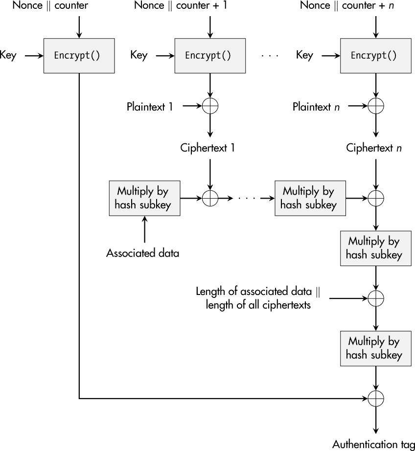

*图 2-11：GCM 中的认证加密*

机密性保护与 CTR 模式非常相似，不同之处在于 GCM 不会使用第一次加密的结果来处理明文，而是在认证标签生成的最后一步进行处理。MAC 生成基于哈希函数`GHASH`，它基本上由一系列在固定参数*哈希子密钥*下进行的二进制 Galois 域乘法组成。该子密钥通过使用加密所用的 AES 密钥对全零明文块进行加密得出。

GCM 的随机数或初始化向量应为唯一的 96 位二进制字符串。GCM 对随机数重用非常敏感，这意味着如果攻击者能访问两个使用相同密钥和随机数生成的认证标签，他们就能伪造认证标签。因此，为 GCM 实现一个健壮的随机数生成机制至关重要。

除了 AES-GCM 外，你还可能会在该领域遇到许多其他的 AE 算法。例如，NIST 的*特别出版物 800-38C*中详细描述了基于 CBC-MAC 的计数器模式（CCM），以及 Phil Rogaway 设计的偏移码本（OCB）模式。由 Bernstein 设计的流密码 ChaCha20 与 MAC 算法 Poly1305 的结合也作为一种常见的 AEAD 解决方案，特别适用于仅软件实现，并且已经在 RFC 8439 中指定。

此外，从 2013 年到 2019 年举办的 CAESAR 竞赛（* [`competitions.cr.yp.to/caesar-submissions.xhtml`](https://competitions.cr.yp.to/caesar-submissions.xhtml) *）产生了一套创新的 AEAD 设计——例如，面向资源受限设备或高性能应用的轻量级实现。

### **非对称加密**

与使用单一的秘密密钥不同，*非对称加密*的基本思想是拥有一对密钥，并且每个密钥仅用于与另一个密钥互补的特定操作。例如，每个人使用一个密钥，称为*公钥*，来加密数据（图 2-12）。第二个密钥，称为*私钥*，属于单一实体，只有该实体才能通过使用其私钥解密之前生成的密文。非对称加密系统也被称为*公钥加密*。

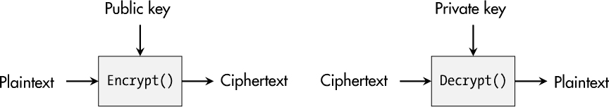

*图 2-12：使用非对称加密进行加密*

然而，非对称加密不仅仅用于保护机密性。私钥操作还可以生成*数字签名*，它是一种用于给定数据的校验和，只有特定实体的唯一私钥才能计算。拥有相应公钥的每个人都可以验证这个签名，这不仅保护了受保护数据的真实性，还保护了其完整性，因为数据或签名的篡改会导致验证失败。图 2-13 说明了基本原理。

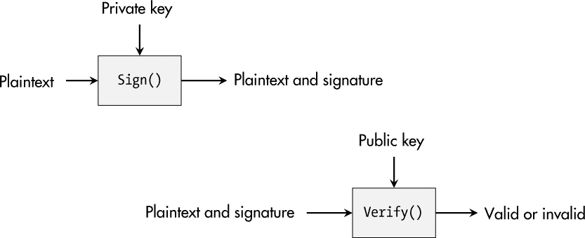

*图 2-13：数字签名的生成与验证*

这些根本不同的机会为我们已经习以为常的许多安全功能铺平了道路，比如安全的互联网通信。为了理解非对称加密中两种最流行代表的基本原理，避免不了一些数学知识，正如我将在下一部分中展示的那样。

### **RSA 加密系统**

第一个且仍然最常见的非对称加密方案在 1977 年发布，并以其发明者命名：*Rivest-Shamir-Adleman (RSA)*。为了实现公钥和私钥操作之间的典型非对称性，RSA 实现了一种 *陷门函数*。通过这种方法，你可以轻松地将数据 A 转换为数据 B，但除非知道陷门，否则几乎不可能从数据 B 中推导出数据 A。

#### ***基本 RSA 数学***

RSA 基于模运算，这意味着如果整数运算达到一个叫做 *模数* 的限制时，就会环绕回去。以下公式描述了 RSA 加密背后的所有“魔法”：

*y* = *x^e* mod *n*

*x* 明文和 *e* 公钥指数的 *模幂运算* 计算出 *y* 密文。*n* 表示模数。

解密过程与加密非常相似：

*x* = *y^d* mod *n*

模幂运算使用 *d*（私钥指数）对 *y* 密文进行处理，得到 *x* 明文。然而，朴素的指数运算方法，即对 *y* 执行 *d* – 1 次乘法运算，对于拥有数千位的 *d* 来说是完全不可能的。你可以通过一种叫做 *平方乘法* 的算法克服这个障碍。该算法基本上是逐位操作指数的二进制表示。在每一步，算法都会执行平方操作，但如果某个位为 1，它还会执行额外的乘法，使得 RSA 成为一种实际可用的加密机制。

数字 *n* 和 *e* 通常被认为是公钥的一部分，而 *d* 对应于 RSA 中的私钥。它们所描述的行为只有在 *d* 和 *e* 之间存在特殊关系时才可能，这种关系是在 RSA 密钥生成过程中建立的。在第一步中，需要随机选择两个大素数 *p* 和 *q*，它们的乘积得出模数 *n* = *pq*。利用 *n*，可以推导出欧拉函数 Φ(*n*) 的结果：

Φ(*n*) = (*p* – 1)(*q* – 1) = *pq* – *p* – *q* + 1 = (*n* + 1) – (*p* + *q*)

这个值对于 RSA 加密系统及其安全性至关重要，因为 *e* 和 *d* 之间的逆关系是在模 Φ(*n*) 的群中实现的：

*ed* mod Φ(*n*) = 1

在实际应用中，*e* = 65537 = (10000000000000001)[2] 是一个常见的选择，因为它简短且具有较少的 1 位数，这两者都能提高使用平方乘法算法时的性能。在选择 *e* 后，密钥生成的最后一步是计算 *d*，即 *e* 在模 Φ(*n*) 下的逆元。

了解这些细节后，可能会更清楚为什么 RSA 常常与*整数因式分解问题*一起提及。这个数学问题表明，寻找大数的因子是非常困难的。模数*n*就是这样一个巨大乘积。RSA 是安全的，因为从给定的*n*中找出*p*和*q*是困难的。然而，如果有人发现了解决这个问题的方法，攻击者就可以从分解后的 *p* 和 *q* 中计算出Φ(*n*)，并计算出 *e* 关于 Φ(*n*) 的逆元，这样 RSA 就会被破解。

与对称方案相比，RSA 密码系统的数学基础使得估算其安全级别更为困难。在 2020 年的 *《特别出版物 800-57》* 中，NIST 的加密专家评估了 RSA 的安全级别，如 表 2-1 所示。

**表 2-1：** RSA 安全性估算

| **安全级别** | **密钥长度** |
| --- | --- |
| ≤ 80 位 | 1,024 位 |
| 112 位 | 2,048 位 |
| 128 位 | 3,072 位 |
| 192 位 | 7,680 位 |
| 256 位 | 15,360 位 |

显而易见，有两个重要的特性。所需的密钥长度远大于所达到的安全级别。它们之间的关系不是线性的，但与投入的密钥位数相比，安全级别的提升显著更慢。在撰写本文时，2,048 位是常见设置，但对于长期使用，建议使用 4,096 位 RSA 密钥。

#### ***实际应用中的 RSA***

然而，RSA 的基本结构并不完全适合实际加密，因为如果攻击者持有两个密文，他们可以创建一个新的密文，该密文是两个原始明文相乘后的正确加密。*最优非对称加密填充 (OAEP)* 方案就是为避免这个弱点而开发的。在与 RSA 结合时，它被称为 *RSA-OAEP* 或 *RSAES-OAEP*，并在 NIST 的 *《特别出版物 800-56B》* 中有所规定。

简而言之，OAEP 使用一个随机字符串和两个哈希函数来处理明文，通常是对称密钥，并生成一个填充后的明文版本，该版本随后用于 RSA 加密。对于解密，密文按照标准 RSA 进行解密，但随后必须通过使用前面提到的两个哈希函数恢复初始消息和随机值。最后，必须验证计算结果的正确结构，才能使用明文。

使用基本 RSA 方程的数字签名也存在类似的问题。基于特定消息的有效签名，攻击者可以为他们选择的消息创建有效签名。*概率签名方案 (PSS)*，即 RFC 3447 中定义的 RSASSA-PSS（附录式 RSA 签名方案），可以防止这种攻击。

PSS 在签名方案的输入数据中注入额外的随机填充，即要签名的消息的哈希值。再次强调，生成消息哈希的填充版本需要两个哈希函数和预定义的编码。在验证过程中，必须恢复中间值并检查填充是否正确，以验证签名的有效性。

### **Diffie-Hellman 密钥交换**

当只有对称密码学可用时，人们必须通过*安全通道*交换密钥——面对面、密封信件或已保护的通信线路。这一过程非常不便，且存在多个实际缺陷。

幸运的是，1976 年，Whitfield Diffie 和 Martin Hellman 发表了他们的想法，介绍了如何在*不安全通道*上建立两个只能通过*不安全通道*进行通信的当事方之间的*共享秘密*，现在通常被称为*Diffie-Hellman (DH)密钥交换*。DH 不是在特定位置生成密钥，然后应用*密钥传输*机制（例如 RSA 加密），而是通过两个实体之间的*密钥协商*协议创建共享密钥。

#### ***数学之美***

DH 背后的数学基础是基于一个群 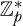，在此群中所有操作都是模素数*p*进行的，原始元素被标记为*g*。图 2-14 说明了建立共享秘密的过程。

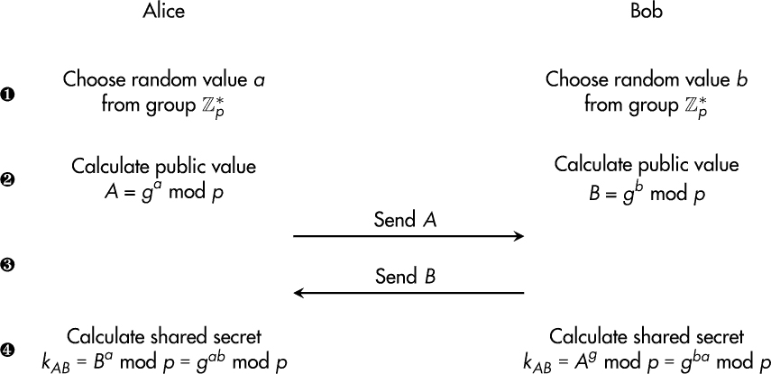

*图 2-14: Diffie-Hellman 密钥交换的步骤*

首先，双方通常称为 Alice 和 Bob，分别选择秘密数*a*和*b* ➊。然后，他们派生相应的公共值*A*和*B* ➋并交换它们 ➌。随后，他们将对方的公共值提升到他们自己的私密值的幂次 ➍ 以获得共享秘密*k[AB]*。

DH 的安全性依赖于*离散对数问题 (DLP)*：从*A* = *g^a* mod *p*中获得*a*是困难的。从公开传输的值*A*中推导出私密数*a*显然会破坏该协议的安全性。然而，由于这几乎是不可能的，窃听 DH 协议的攻击者不会获得任何有用的信息。与 RSA 相比，关于 DH 密钥大小的实现安全级别实际上是相同的。

#### ***中间人攻击***

这个基本版本的 DH 也被称为 *匿名 Diffie-Hellman*，因为 Alice 和 Bob 无法验证彼此的身份。这个事实可以被对手利用，通过 *中间人（MITM）* 攻击：一个恶意行为者拦截了原始通信双方的交流，丢弃了它们交换的公钥值 *A* 和 *B*，并分别与 Alice 和 Bob 进行一次 DH 协议运行。最终，Alice 和 Bob 认为他们的密钥协商成功，并且可以安全地通信。然而，他们现在与攻击者共享一个密钥，攻击者能够读取和篡改它们之间流动的所有信息。

解决这个问题的方法是引入 *认证 Diffie-Hellman*，它基于这样的假设：Alice 和 Bob 都拥有一对长期的公钥对，可以通过交换 *A* 和 *B* 的数字签名值来互相证明身份。在这种情况下，中间人（MITM）攻击者将无法悄悄地介入而不被发现。在这种方法的变体中，其他协议数据也会被签名和验证，但在计算并使用共享密钥之前，始终需要验证对方的身份。

DH 的第二个特性是你不应将值 *a* 和 *b* 视为长期密钥。将它们用于多个密钥协商会违反 *完美前向保密性（PFS）* 的常见要求。这意味着，即使长期密钥在未来被破解，通过密钥交换建立的会话密钥仍应保持安全。你应该将私有数值 *a* 和 *b* 视为 *临时密钥*，并且只使用一次。DH 的相应版本通常被称为 *Diffie-Hellman 临时密钥（DHE）*。

你可以在 NIST 的*特别出版物 800-56A*中找到关于 Diffie-Hellman 变种和其他密钥协商方案的详细信息。

### **椭圆曲线密码学**

RSA 和 DH 提供了许多有意义的非对称加密机制，但它们有两个显著的缺点：密钥较长和性能要求较高。1985 年创立的 *椭圆曲线密码学（ECC）* 领域承诺能够显著减少非对称加密的缺点。

然而，约 20 年后，ECC 才广泛应用于实践中。与 RSA 和 DH 相比，ECC 背后的数学相当复杂，且 ECC 的采用受到了 Certicom 公司的阻碍，因为该公司拥有一系列专利，如果使用 ECC，则需要许可。幸运的是，现在大多数这些专利已经过期。

#### ***曲线背后的数学***

简而言之，*椭圆曲线*被认为是一组具有 x 和 y 坐标的点——例如，表示为 *P*(*x*, *y*)。*x* 和 *y* 的值是一个模素数 *p* 的群中的整数，通常表示为 *GF*(*p*)，即 *伽罗瓦域*。椭圆曲线的方程描述了所有属于它的点。

在密码学中，只有少数曲线方程具有实际意义。以下是用于*NIST 标准的 Weierstrass 曲线*（如 P-256），其参数为*a*和*b*：

*x*² = *x*³ + *ax* + *b*

*Montgomery 曲线*使用参数*A*和*B*，它们特别著名，因为有一个重要的成员 Curve25519。以下方程描述了它们：

*By*² = *x*³ + *Ax*² + *x*

*Edwards 曲线*，其参数为*d*，是另一种有趣的曲线类型，Ed448-Goldilocks 就基于它。以下是这些曲线的一般方程：

*x*² + *y*² = 1 + *dx*²*y*²

你可以通过三种方式处理椭圆曲线上的点：

**点加法**    将两个点*P*和*Q*相加，得到一个新的点*R*，该点位于同一曲线上：*R* = *P* + *Q*。

**点加倍**    将给定的点*P*乘以 2，得到一个新的点*R*：*R* = 2*P*。

**标量乘法**    取一个点*P*，并将其与一个整数（标量）*k*相乘，得到一个新的曲线点*R*：*R* = *kP*。

ECC 中的标量乘法类似于 RSA 的模幂运算。此外，标量乘法的朴素方法，即将一个点*P*加上* k* - 1 次，对于* k*是一个有几百位的大数时是不可行的。因此，必须使用类似“平方并乘”算法的“加倍并加”算法来高效计算。简而言之，*k*是按位处理的，对于每一位，都会执行一次点加倍操作。如果某一位为 1，则执行额外的点加法操作。总之，这使得 ECC 密码原语可以实际应用。

椭圆曲线的设计方式使得*椭圆曲线离散对数问题（ECDLP）*非常困难。这个名字表明，它与作为 DH 基础的离散对数问题（DLP）类似，确实如此。然而，在 ECC 的世界中，你可以将问题描述为给定点*P*和*R* = *kP*时，求解标量*k*。来自 NIST 的*特殊出版物 800-57*（2022 年）的表 2-2 显示了 ECDLP 与 RSA 和 DH 的基础问题之间的显著差异。

**表 2-2：** ECC 的安全性估算

| **安全级别** | **密钥大小** | **RSA/DH 的密钥大小（供比较）** |
| --- | --- | --- |
| ≤ 80-bit | 160-bit | 1,024-bit |
| 112-bit | 224-bit | 2,048-bit |
| 128-bit | 256-bit | 3,072-bit |
| 192-bit | 384-bit | 7,680-bit |
| 256-bit | 512-bit | 15,360-bit |

ECC 通过使用更小的密钥尺寸实现相同的安全级别。此外，随着密钥长度的增加，相应的安全级别*线性*上升，因此将曲线大小从 256 位增加到 512 位也意味着安全级别翻倍。

#### ***选择的痛苦***

与许多其他加密算法不同，ECC 要求实现者不仅要选择密钥大小，还要选择要使用的特定椭圆曲线。“安全”曲线必须满足某些数学要求，因此从经过严格分析的常见标准化选项中选择一条曲线是合理的。

另一方面，你在选择过程中可以考虑的一个标准是曲线参数的来源。虽然美国国家安全局（NSA）创建了素数曲线 P-256，并且 NIST 在 2000 年将其标准化，它在实践中仍然是最受欢迎的曲线之一。其参数*b*是一个 256 位数字，只有 NSA 知道它是如何以及为什么被选择的。其他 NIST 曲线也存在同样的问题：P-192、P-224、P-384 和 P-521。这可能不是一个关键问题，但对于在关键基础设施中运行的设备来说，可能是一个相关问题。

Curve25519 目前是最受欢迎和最可信赖的椭圆曲线。它由伯恩斯坦（Bernstein）在 2006 年提出，因其具有两个显著特点而广受关注。首先，它在软件实现中对高性能有着强烈的关注。其次，它不依赖于随机选择或晦涩的曲线参数。未来，像 Ed448-Goldilocks 和 Curve41417 这样的 Edwards 曲线也可能受到关注，因为它们提供了超过 200 位的安全级别。

#### ***ECC 的实际应用***

ECC 的最常见应用之一是基于*椭圆曲线数字签名算法（ECDSA）*的数字签名，该算法在*FIPS 186-5*中定义。此用例的基本设置是两方已就特定曲线及其参数达成一致。签名方持有私钥*d*，这是一个秘密整数，验证方则可以访问相应的公钥*P* = *dG*，其中*G*是所选曲线的基点。

对于签名生成，签名者将消息进行哈希处理，选择一个随机的临时密钥，并将二者结合处理，以获得一个包含两个值的唯一签名，总大小为曲线阶的两倍——例如，对于一个 256 位曲线，签名大小为 512 位或 64 字节。（验证过程的细节相当复杂，超出了本书的讨论范围。）

一般而言，ECDSA 签名在性能和安全性方面比 RSA 签名更为优选，只有一个例外情况：如果签名验证具有最高优先级，而签名生成的频率非常低——例如，仅在开发过程中对固件镜像进行一次签名——并且验证是时间敏感的，因为它发生在设备的启动过程中。

除了数字签名，ECC 是现代密钥交换和密钥协商方案的核心部分，正如 NIST 的 *Special Publication 800-56A* 所描述的那样。它们也被称为 *椭圆曲线迪菲-赫尔曼（ECDH）* 和 *椭圆曲线迪菲-赫尔曼瞬态（ECDHE）*。在这些方案中，DH 的模幂运算被基于椭圆曲线的标量乘法所替代，其余部分与 DH 非常相似。这种替代方法相比传统的 DH 提供了显著的性能提升，特别是当你需要定期进行大量密钥协商握手时，例如服务器处理大量连接时。

最后但同样重要的是，你可以使用 ECC 进行公钥加密，但在实际中很少使用。*椭圆曲线集成加密方案（ECIES）* 就是为此目的设计的。简而言之，它使用接收者的公钥生成一个共享的 ECDH 密钥，并从中派生出一个对称密钥。然后，使用该密钥通过 AE 加密算法加密消息，产生密文和认证标签。

### **总结**

本章开始时介绍了加密学基础，如 Kerckhoffs 原则，认为加密系统中唯一的秘密应是加密密钥，接着讨论了安全性水平仅仅是描述攻击者所面临的潜在搜索空间。

我详细介绍了基于流行的 AES 算法和常见操作模式的对称加密领域，因为它在安全性中无处不在。像 SHA-256 这样的哈希函数、用于完整性保护的 MAC 算法，以及像 AES-GCM 这样的高效 AE 方案，完善了现代对称加密工具箱。

基于 RSA 和 DH 的非对称加密的引入，极大地拓展了保护通信和设备的可能性：公钥加密、数字签名以及通过不安全通道的安全密钥协商。此外，ECC 领域显著提升了这些机制的性能。

*后量子加密* 超出了本书的范围，但它可能是未来挑战现有非对称加密方案的一个话题，且如果建成通用量子计算机，这一挑战将是不可避免的。NIST 对后量子加密的标准化进程（*[`csrc.nist.gov/projects/post-quantum-cryptography`](https://csrc.nist.gov/projects/post-quantum-cryptography)）仍在进行中，但值得关注。

如果你有兴趣深入了解加密学的内部工作，Jean-Philippe Aumasson 的 *Serious Cryptography*（No Starch Press，2017；第二版即将发布）和 Christof Paar 与 Jan Pelzl 的 *Understanding Cryptography*（Springer，2009）是很好的参考书籍。
