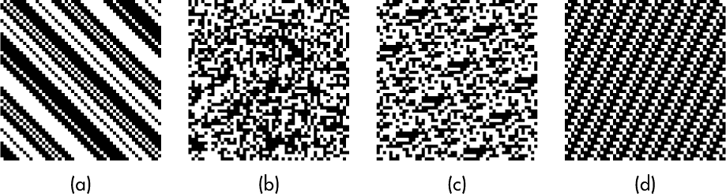
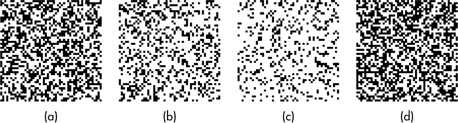
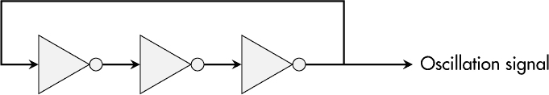
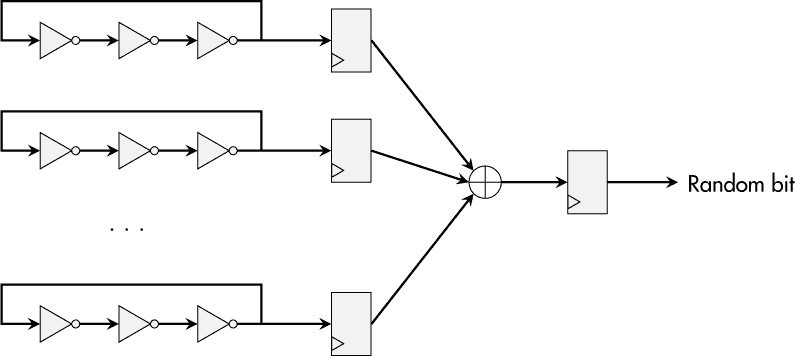
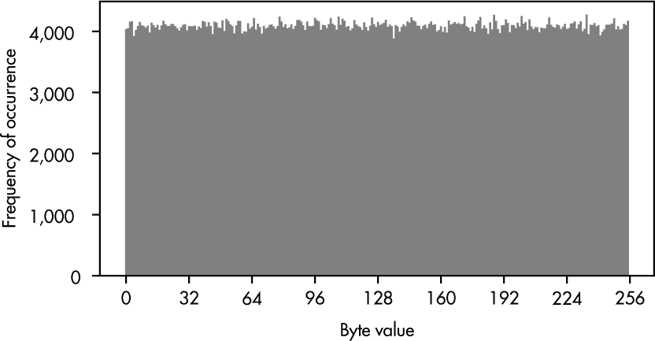
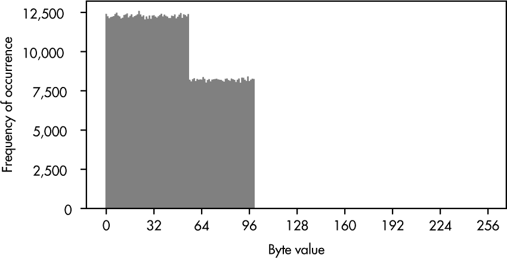
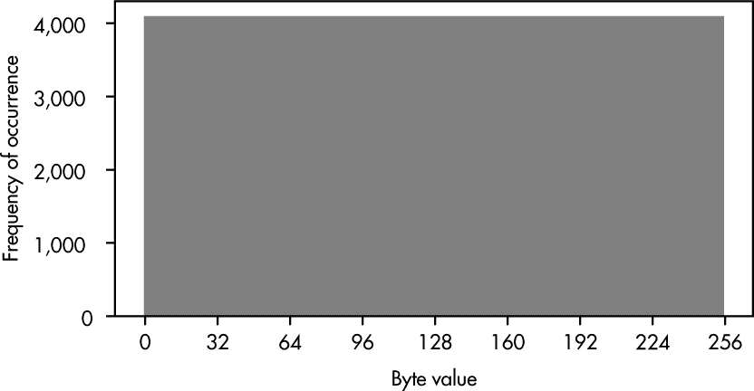

## 第五章：随机数生成器（RNG）**


随机性是决定论的自然对立面。虽然我们希望大多数设备功能遵循后者，但*随机数生成器（RNGs）*的目的是提取前者。但在集成电路（IC）中产生随机数是否可能？如果可以，我们是否能够用实际需求来描述“良好”的随机性？

有些人认为，真正的随机性只存在于量子力学过程之中（他们可能是对的），但量子实验通常难以在标准互补金属氧化物半导体（CMOS）芯片中进行。另一方面，许多安全应用程序绝对需要一个随机数源才能达到预期的保护级别。

本章首先讨论了要求随机性才能被认为安全的应用程序。它介绍了在微芯片中提取随机性的常见方法以及*真正的随机性*背后的思想。此外，我还解释了*伪随机性*的概念，以及为什么它对于实际场景是必要的。最后，我提供了三种简单的工具，可以帮助你评估随机数集，进而发现可能的实现缺陷。

### **随机性的重要性**

许多安全概念依赖于随机性。例如，当生成密码、加密密钥或唯一令牌等机密信息时，这些数据只能为特定实体所拥有。自然，这个生成过程的结果必须是完全不可预测的。否则，机密信息的搜索空间将变小，从而降低安全级别，使得攻击变得更加高效，正如第二章中所讨论的那样。

*挑战-响应认证*是许多流行安全协议的一部分，它是另一个随机性至关重要的应用场景。在这种认证方式中，验证者向声明给定身份的实体发送一个随机且不可预测的挑战，以启动认证过程。然后，这个随机值必须与一个独特的秘密一起处理，以证明声明的身份。然而，如果挑战是可以提前知道的或可能是重复的，攻击者将能够为这种情况做好准备，并通过其他方式获得预期的响应。

由于秘密密钥和安全通信对于许多物联网设备至关重要，因此这些设备中对随机数生成器（RNG）的需求非常明显。然而，在大多数情况下，软件解决方案无法解决这个需求，因此它必须集成到硬件中，通常是设备的主处理器或专用安全芯片中。因此，在考虑设备安全时，RNG 的需求应成为每次处理器采购过程的一部分。

**注意**

*在实际操作中，一些软件库（如 Mbed TLS）明确要求你定义一个用于安全操作的随机性来源。如果没有这个来源，它们将无法工作。*

### **随机性的本质**

尽管随机性是自然存在的事物，但却很难描述。一个简单的解释是，随机性来自于一个实验，该实验的结果在执行之前无法预测，就像掷硬币一样。即使这个实验已经执行了百万次，我们也无法在结果中找到任何模式或特征的重复，除了纯粹猜测外，无法推导出关于输出的任何确定性。

这种不确定性和不可预测性的衡量标准被称为*熵*。它也被用于其他学科，如物理学或信息理论，用于描述系统或数据中包含的无序或信息量。在 RNG 上下文中，熵描述了可以被认为是*真正*随机的比特数。一个不好的 RNG 可能每个字节只产生 2.4 位熵，这意味着关于单个 RNG 输出字节的 5 位以上的信息可能会以较高的确定性被猜测出来。

到这一点，可能已经很清楚，我们期望每个字节有 8 位熵用于高质量的随机数生成器（RNG）。然而，熵本身或其缺乏很难衡量，因此，RNG 专家依赖于对大量收集的随机比特的统计评估，以识别缺陷并评估其设计优化。这些统计要求中的两个是独立性和均匀分布。

*独立性*意味着每个随机性生成实验应该与之前运行的实验相互独立。因此，输出比特的值没有*条件*发生概率，因此与之前提取的输出比特没有任何关系。图 3-1 展示了四个二进制数据集。



*图 3-1：可能包含模式的随机比特的二维可视化*

在图 3-1a 和图 3-1d 中，我们的大脑会立即检测到模式，这意味着二进制数据存在重复。这些显然比其他的更不随机。仔细观察，图 3-1c 展示了一个微妙的模式，而图 3-1b 则没有显示出任何可视的比特之间的关系。

我们还可以说，随机比特的*均匀分布*要求每个 RNG 能生成的符号的概率必须相等。图 3-2 展示了四种符号分布生成的随机比特。



*图 3-2：可能包含偏差的随机比特的二维可视化*

用肉眼可以看到，图 3-2b 和图 3-2c 包含的白色方块比黑色方块更多。具体来说，图 3-2b 中 70%的区域是白色的，而图 3-2c 中 80%是白色的。区分图 3-2a 和图 3-2d 更难，但通过观察数字，情况变得清晰。图 3-2a 的黑白比例为 45:55，而图 3-2d 则是完全的 50:50。

### **真随机数生成器**

*真随机数生成器 (TRNG)*，有时也叫做*非确定性随机比特生成器 (NRBG)*，其主要任务就是提取“真正”的随机性。我们可以实现一个*熵源*，如 NIST 的*特别出版物 800-90B*中所描述，进行微观尺度的实验，并将其结果作为随机比特输出，从而实现真正的随机性。形象地说，可以想象一个纳米级的人定期掷硬币，并根据正反面结果控制晶体管。

熵的物理来源可以是半透明镜面上的光子传输、放射性原子衰变过程的观察，甚至是熔岩灯的墙面（*[`blog.cloudflare.com/randomness-101-lavarand-in-production`](https://blog.cloudflare.com/randomness-101-lavarand-in-production)*）。然而，这些想法在 CMOS 设计中实现起来都比较困难，这意味着芯片制造商通常依赖于集成电路中与热噪声和电子噪声相关的物理效应。

#### ***环形振荡器***

提取和积累这种噪声的常见电路是*环形振荡器 (RO)*。它由奇数个反向器组成，按环形结构连接。开机时，门电路将它们的输出驱动到输入信号的反向电平。图 3-3 展示了一个三反向器的 RO 电路。



*图 3-3：一个基本的 RO 电路*

假设最左边的反向器输入为*高*，其输出将为*低*，第二个反向器的输出将为*高*，最后的输出信号再次为*低*。将最终输出反馈到第一个输入端会导致不匹配，从而导致所有反向器相应地改变输出。如你所见，这个稳定的电路将永远无法静止，而是会在某个频率上振荡。

在一个完美的世界中，RO 输出信号将是完全确定性的，其振荡频率也是如此。然而，在现实中，信号的行为取决于实现的物理特性以及其所处的物理状态。这两个因素都会导致 RO 信号的*抖动*，进而导致频率变化，有时略高，有时略低。简而言之，信号及其频率容易受到噪声的影响。尽管我们仍然能够部分预测 RO 的行为，但一些特性确实源自随机性。在许多情况下，这是微芯片中“真正”随机性的第一步。

由于单一振荡器提供的熵量仅为“少量”，因此通常会将多个振荡器组合在一起形成 TRNG。图 3-4 展示了这些振荡器信号如何通过触发器进行采样，经过 XOR 操作组合后，再次进行采样，以获得一个具有高熵的单一随机位。



*图 3-4：使用多个 RO 的基本 TRNG 架构*

然而，在商业设备中，我们几乎无法表征这些内部设计决策及其电路的实际熵。我们必须信任芯片制造商。前面的段落只是想让你了解“真正”随机性可能来自哪里。

#### ***熵源的健康状态***

熵源的健康状态*应该是可用的*，以便 TRNG 用户能够在熵源失效时通知系统。否则，设备可能会依赖于实际上全是零的随机数。因此，对于高质量的 TRNG，至少需要有三种测试程序来监控其熵源的正确功能：

**启动测试** 一些熵源必须成功地完成初始化阶段，才能生成高质量的随机位。例如，对于基于振荡器的电路，预期的振荡必须启动，而不能卡在一个非振荡状态。因此，TRNG 必须实施启动测试，仔细监控其熵源的启动阶段，并在失败时引发错误。

**完全失败测试** 环境因素，如温度变化、电源电压变化或有意攻击，可能导致熵源功能的突然丧失。完全失败测试监控熵源的输出位，检测这些事件并在发生时发出警报。

**在线测试** 虽然前两个测试监控熵源的完全停机，在线测试则持续观察生成的随机位的分布，以识别漂移和偏差。如果它们超过一定限度，这也可能是通知操作系统或应用程序的原因。

尽管 TRNGs 是唯一提取“真实”随机性的方式，并且对安全设备至关重要，但它们也有缺点。它们依赖于物理过程，这些过程自然受环境情况的影响，这可能导致行为变化甚至错误。此外，提取和收集原始熵位需要时间，通常无法满足高性能的要求。下一节将介绍缺乏“真实”随机性但表现更好的原语。

### **伪随机数生成器**

*伪随机数生成器（PRNGs）* 与 TRNGs 正好相反，也被称为*确定性随机位生成器（DRBGs）*，因为与 TRNGs 不同，它们的行为是完全确定的，并且不包含熵源。这两种特性是 PRNGs 的优点，因为它们使得 PRNGs 可靠且能抵御环境影响，同时也允许实现高速操作。

PRNG 算法的关键要求是*回溯抗性*和*预测抗性*。这两个要求都假设攻击者已经访问了 PRNG 的当前状态（输出）。前一个要求要求对手无法从这些信息中推导出任何以前的状态值，而后一个要求则要求攻击者无法预测 PRNG 算法的未来输出值。这些要求可能让你想起哈希函数是单向函数，或者块密码加密在没有相应密钥的情况下无法被反转——你是对的。这些算法非常适合当前任务。

在*《特别出版物 800-90A》*中，NIST 的专家推荐了三种 PRNG 构造。*Hash_DRBG*使用一个经过批准的哈希函数，这个哈希函数适用于所需的安全级别，用于处理初始和中间状态数据，以推导出伪随机输出位并获取后续状态。*HMAC_DRBG*和*CTR_DRBG*分别使用带密钥的哈希函数和计数器模式下的块密码，其中相应的密钥不是固定的，而是作为 PRNG 操作的一部分定期更新。

也许你听说过线性反馈移位寄存器（LFSRs）和梅森旋转算法（Mersenne Twister）PRNGs，并想知道为什么它们虽然效率高，但并不推荐使用。它们确实产生看似随机的序列，但它们在加密安全性上存在问题，因为它们的架构仅依赖于线性组合，而这种组合无法提供预测抗性。简单来说，任何能够观察到一定数量输出值的攻击者，都能够推导出未来的值。

**注意**

*你可能会偶然发现* Dual_EC_DRBG*，一个原本设计为加密安全的伪随机数生成器（PRNG）。然而，它包含了一个潜在的后门，可能是故意插入的。请谨慎选择你的加密原语！*

除了为 PRNG 算法做出稳妥选择之外，*种子*是 PRNG 使用中最重要的部分之一。通过种子，PRNG 使用具有足够熵的数据来初始化，以实现所需的安全目标。例如，如果需要 128 位安全级别，则 PRNG 必须用至少 128 位熵的比特串进行初始化。此外，这些信息必须视为机密，绝不能向攻击者透露。

可选地，我们可以实现定期的 *重新种子*，即更新 PRNG 实例的熵池，添加“新鲜”的熵。此外，我们可以通过添加唯一值，如设备序列号、随机数或时间戳，来个性化 PRNG 的初始化。然而，需要小心，因为这些附加数据始终被认为是 *没有熵的*，因为它可以在不泄露安全性的情况下公开获得。

### **实用的 RNG 构造与使用**

在阅读了前一章后，你可能已经猜到，结合 TRNG 和 PRNG，你可以为安全设备实现最佳的 RNG 解决方案。前者持续（并缓慢）提取熵，这些熵用于为 PRNG 提供种子，并随后重新种子 PRNG，后者可靠地为操作系统和应用程序提供几乎任意数量的随机位。

如果你的设备运行操作系统，那么操作系统开发人员很可能已经处理了其中的难点。但即便如此，架构师和开发人员仍需要牢记以下话题。

#### ***RNG 选择***

即使操作系统提供了强大的 RNG，并非所有框架和编程语言默认使用它。通常，必须明确选择它，或者在代码中使用相应的 API。否则，你将依赖于非加密的 PRNG，这可能会破坏设备的安全性。

#### ***错误处理***

如前所述，TRNG 可能会失败。此外，操作系统提供的 RNG 也可能会返回错误，因此请确保认真对待这些返回值并进行相应的处理。你最不希望发生的情况是，设备使用的看似随机数据实际上只有零，而没有人注意到。

#### ***启动时熵***

一些过程在启动过程中或紧接着启动后进行，例如设备初次启动时的安全 Shell（SSH）密钥生成。然而，在启动时，设备可能还没有收集到很多熵，甚至可能没有任何熵。反过来，这可能会导致多个设备上的密钥相同或至少相似，这是绝对不希望发生的。请记住，关键的密钥生成过程需要等到收集到足够的熵后再进行。

### **案例研究：从硬件到 Python 的随机数生成**

在本案例研究中，我分析了 STM32MP157F 设备的硬件 RNG 特性，解释了 Linux RNG 的工作原理，并指出为什么在 Python 中仍然需要小心使用正确的 RNG。

#### ***硬件 RNG 和熵源***

查看 ST 的*参考手册 RM0436*，你可以获得关于 STM32MP157F 设备集成 RNG 的大量信息。在对应章节的开始部分，ST 写道，实施的 RNG 可以作为构建符合 NIST 标准的 DRBG 的基础，并且它已通过德国联邦信息安全办公室（BSI）的 AIS-32 测试套件成功测试。

**警告**

*请小心，因为实现的 RNG 本身并不等同于 NIST DRBG。参考手册的后面部分指出，如果需要具有 128 位安全级别的符合 NIST 标准的 DRBG，则必须在此 TRNG 之上添加一个经过批准的 PRNG。*

仔细阅读手册，你会发现实现的 TRNG 使用了两个模拟噪声源，每个噪声源包含三个自由运行的 RO，这些 RO 通过 XOR 运算来混合它们的输出。然后，XOR 结果通过一个专用时钟信号进行采样，并经过后处理以去除原始位可能存在的偏差。此外，一个条件阶段“提高了熵率”，但该过程没有详细描述。最终输出包含 128 位的随机数据，通过一个先进的 32 位高性能总线（AHB）由一个先进先出（FIFO）缓冲区提供。

关于噪声源的持续监控，ST 实现了重复计数测试。例如，如果某个噪声源输出超过 64 位相同值或 32 次重复相同的 2 位模式，则会触发错误。可以通过 AHB 访问的状态寄存器显示发生的错误。

到目前为止的好消息是，所选的微芯片提供了硬件 RNG。像往常一样，评估这个模块的质量对于用户来说是困难的，但如果我们相信制造商及其安全能力，这个硬件 RNG 可以是一个有价值的资产。

#### ***Linux 中硬件 RNG 的集成***

在 Linux 中，硬件 RNG 可以通过`hw_random`框架进行集成，该框架由硬件特定的驱动程序和一个通用的内核接口组成，从而创建对应的*/dev/hwrng*设备。如果在 Linux 内核配置中启用了`CONFIG_HW_RANDOM`并且供应商提供的驱动程序正常工作，你可以检查硬件 RNG 的可用性和选择，正如我在列表 3-1 中为我的 STM32MP157F 设备所示。

```
# cat /sys/class/misc/hw_random/rng_available
optee-rng
# cat /sys/class/misc/hw_random/rng_current
optee-rng
```

*列表 3-1：检查硬件 RNG 的可用性*

此外，如果在 Linux 系统上安装了`rng-tools`，你可以像列表 3-2 中所示一样，对集成的硬件 RNG 进行统计测试。

```
# rngtest -c 1000 < /dev/hwrng
rngtest 6.15
...
rngtest: starting FIPS tests...
rngtest: bits received from input: 20000032
rngtest: FIPS 140-2 successes: 999
rngtest: FIPS 140-2 failures: 1
rngtest: FIPS 140-2(2001-10-10) Monobit: 0
rngtest: FIPS 140-2(2001-10-10) Poker: 0
rngtest: FIPS 140-2(2001-10-10) Runs: 0
rngtest: FIPS 140-2(2001-10-10) Long run: 1
rngtest: FIPS 140-2(2001-10-10) Continuous run: 0
rngtest: input channel speed: (min=117.995; avg=137.966; max=149.035)Kibits/s
rngtest: FIPS tests speed: (min=14.638; avg=28.942; max=29.434)Mibits/s
rngtest: Program run time: 142228806 microseconds
```

*列表 3-2：对来自 RNG 硬件设备的数据进行统计测试*

这些测试源自 NIST 的*FIPS 140-2*加密要求文档。这里的数学细节并不重要，而且少量的失败并不值得担心。请注意，这个硬件 RNG 源以大约 138Kb 每秒的速率提供随机数。

#### ***Linux RNG 架构***

像其他大型操作系统一样，Linux 也有自己的随机数生成器（RNG）概念和伪随机数生成器（PRNG）实现。它最早在 1994 年引入，当时其架构基于 SHA-1 操作，因为强加密算法是美国出口限制的一部分。

然而，从 Linux 内核 5.17 版本开始，SHA-1 已完全从代码中移除。PRNG 实例现在依赖于 ChaCha20 密码算法，而*熵池*的压缩功能则通过*BLAKE2s*的哈希更新操作实现，BLAKE2s 也是基于 ChaCha 的哈希函数。5.18 版本引入了 Linux RNG 的各种附加改进（例如，关于启动时熵的改进）。

熵池是一个内部的 256 位内存缓冲区，它从一组噪声源收集数据，并用于为 ChaCha20 PRNG 的基础实例提供数据。如果在给定平台上有硬件 RNG 可用，正如我们在 STM32MP157F 设备上所看到的，它提供的熵可以通过`add_hwgenerator_randomness`接口集成到熵池中。其熵内容估算取决于驱动程序代码中提供的熵质量值。对于我的设备，该值为 900，这意味着每个 RNG 位的熵大约为 900/1,024 = 0.879 位。

进一步的噪声源可能有助于熵的收集。如果系统中有旋转硬盘或类似的块设备，`add_disk_randomness`可能会对你的熵池产生正面贡献。然而，由于我的 STM32MP157F-DK2 开发板运行在 microSD 卡上，这个机制没有任何贡献。此外，按键和鼠标移动可以用来提取一定量的噪声，并通过`add_input_randomness`增强内部池，但在嵌入式系统使用中，用户交互通常很少。另外，设备驱动程序可以提供在设备初始化期间可能可用的随机数据，通过`add_device_randomness`将其集成到熵池中。然而，默认情况下它被认为是零熵。

`proc`文件系统提供有关已实例化熵池的信息，例如其大小和当前的熵估计水平（以位为单位），如列表 3-3 所示。

```
# cat /proc/sys/kernel/random/poolsize
256
# cat /proc/sys/kernel/random/entropy_avail
256
```

*列表 3-3：打印熵池信息*

请记住，较旧的 Linux 系统基于另一种 RNG 架构，在这个时候它会显示 4,096 位的池大小，而不是 256 位。

在相同的路径下，文件*bootid*提供了一个唯一的、随机的标识符，用于当前的运行时，如列表 3-4 所示。它会在下次启动时发生变化。

```
# cat /proc/sys/kernel/random/boot_id
e67a7d3e-3825-4019-ad86-940a7c8748df
```

*列表 3-4：显示启动识别号*

相比之下，列表 3-5 显示了读取*uuid*会为每次访问生成一个新的*全局唯一标识符（UUID）*。

```
# cat /proc/sys/kernel/random/uuid
703a31fe-fd53-44d4-8a85-075416a107ea
# cat /proc/sys/kernel/random/uuid
10f38bb8-66a8-4951-b9b4-db89db438ba8
# cat /proc/sys/kernel/random/uuid
6abf0dd4-2d0b-421b-b04e-8f02f994149b
```

*列表 3-5：从 Linux RNG 读取 UUID*

从用户空间，可以通过多种方式获取随机数：

**从** ***/dev/random*** 读取    设备文件 */dev/random* 的行为是*阻塞的*。这意味着，如果 ChaCha20 PRNG 尚未接收到 256 位的熵，它将不会返回任何数据。

**从** ***/dev/urandom*** 读取    */dev/urandom* 的*非阻塞*特性允许无论初始熵收集状态如何，都能从该设备读取随机数，这使得它成为开发人员的热门选择。

**使用** getrandom **系统调用**    该系统调用可以通过参数化来定义其行为。将标志设置为零时，它的行为与 */dev/random* 一样，但如果将标志设置为 `GRND_INSECURE`，它将像 */dev/urandom* 一样返回随机数。

在内核空间中，可以使用 `get_random_bytes` 函数访问 PRNG 实例并从中获取随机数。此函数不依赖于 ChaCha20 PRNG 初始化和熵池的状态。

在 列表 3-6 中展示了一个简单的单行代码，将 1MB 随机数据写入文件。

```
# dd if=/dev/urandom of=rand_file.bin bs=1M count=1 iflag=fullblock
1+0 records in
1+0 records out
1048576 bytes (1.0 MB, 1.0 MiB) copied, 0.0638873 s, 16.4 MB/s
# ls -l rand_file.bin
-rw-r--r-- 1 root root 1048576 ... rand_file.bin
```

*列表 3-6：生成一个包含 1,048,576 个随机字节的文件*

如 列表 3-7 所示，使用 */dev/urandom* 调用 `rngtest` 可以实际演示将硬件随机源与可靠的软件 PRNG 结合的优势。

```
# rngtest -c 1000 < /dev/urandom
rngtest 6.15
...
rngtest: starting FIPS tests...
rngtest: bits received from input: 20000032
rngtest: FIPS 140-2 successes: 999
rngtest: FIPS 140-2 failures: 1
rngtest: FIPS 140-2(2001-10-10) Monobit: 0
rngtest: FIPS 140-2(2001-10-10) Poker: 0
rngtest: FIPS 140-2(2001-10-10) Runs: 0
rngtest: FIPS 140-2(2001-10-10) Long run: 1
rngtest: FIPS 140-2(2001-10-10) Continuous run: 0
rngtest: input channel speed: (min=85.917; avg=185.867; max=190.735)Mibits/s
rngtest: FIPS tests speed: (min=12.203; avg=28.918; max=29.756)Mibits/s
rngtest: Program run time: 763735 microseconds
```

*列表 3-7：在* /dev/urandom 上运行 RNG 测试

统计数据仍然正常，但速度已提高到大约 186Mbps。与原始硬件 RNG 相比，这提高了超过 1,000 倍。

#### ***Python 中的密码学安全随机数***

即使我们有一个集成了硬件 RNG 的设备，且 Linux 的 RNG 行为正常，我们仍然可能在应用程序级别无法实现密码学安全的随机数生成。在这个案例研究中，我们将查看 Python，但许多其他编程语言和环境也面临同样的问题。

Python 教程通常使用 `random` 模块进行随机数生成。然而，它的文档明确指出，这是基于梅森旋转算法的 PRNG，旨在进行建模和仿真等用途，但不适合用于密码学应用。

要使用操作系统提供的 RNG，`os` 模块提供了 `os.urandom()` 函数。然而，在 Python 3.6 或更高版本中，推荐的方式是使用 `secrets` 模块，它专门用于提取密码学安全的随机数，并选择系统中最安全的随机源。

列表 3-8 显示了一个脚本，它从命令行参数中获取字节数和文件名，使用 `secrets` 模块的 `token_bytes()` 函数生成相应数量的随机字节，并将其写入指定的输出文件。

```
import sys
import secrets

n_bytes = int(sys.argv[1])
output_file = sys.argv[2]

print('Generating', str(n_bytes), 'random bytes ...')
random_bytes = secrets.token_bytes(n_bytes)

print('Writing random bytes to', output_file, '...')
with open(output_file, "wb") as f:
  f.write(random_bytes)
```

*列表 3-8：使用 Python 的* secrets *模块创建一个包含随机字节的文件*

最后，这个案例研究展示了在为加密目的生成随机数时，需要考虑硬件和软件中的不同层次。

### **案例研究：随机性快速检查的实用工具**

如果你负责开发和测试新的 RNG 设计，你将希望使用各种统计分析算法，如 NIST 的 *Special Publication 800-22* 中描述的，或由 Dieharder 套件提供的，但实际上，地球上只有极少数人会设计新的 RNG。

然而，许多人*使用和处理*随机数，这可能会导致实际实现错误，尤其是在应用层面。一些错误可以通过使用相对简单的工具来发现。本案例研究解释了两种这样的方式，并展示了如何使用它们发现常见问题。

#### ***分布分析和模式识别的简单工具***

本章开始时，我们看到偏差（或任何形式的不均匀分布）和重复模式是低质量随机数的两个指标。本节介绍了一种简单的方法来分析基本数据特征，但这些远远没有达到专业统计分析的水平。它们仅有一个目的：为随机数生成过程中的问题提供线索，最可能出现在最后阶段（即在应用程序中）。

列表 3-9 显示了一个简短的脚本，它将文件作为命令行参数，读取文件并绘制直方图，显示所有可能字节值的出现频率。在完美的情况下，直方图应该显示为一条平坦的线，意味着文件中所有字节的出现概率是相等的。

```
import sys
import matplotlib.pyplot as plt

file_to_analyze = sys.argv[1]

print('Reading', file_to_analyze, '...')
with open(file_to_analyze, "rb") as f:
  data = f.read()

hist_data = bytearray(data)

print('Plotting distribution of bytes ...')
fig1, ax1 = plt.subplots(figsize=(15, 5))
ax1.hist(hist_data, bins=range(256+1), align='left', color = "gray")
ax1.set_title('Distribution of Bytes')
ax1.set_xlabel('byte value')
ax1.set_xticks([0, 32, 64, 96, 128, 160, 192, 224, 256])
ax1.set_ylabel('frequency of occurrence')
plt.show()
```

*列表 3-9：一个 Python 脚本，用于绘制给定文件的字节分布*

为了说明，我使用 Linux RNG 生成了一个包含 1MB 随机数据的文件，并对其运行了该脚本。图 3-5 显示了相应的分布情况。它不是一条平坦的线，但各个频率彼此非常接近。



*图 3-5：来自 Linux RNG 的字节值分布*

模式检测比偏差分析更复杂，因为模式可能有多种类型。然而，一些应用程序正是为这个任务优化的：压缩工具。这些算法会遍历数据，尝试找到重复的序列，建立字典并去除冗余。应用于随机数据时，每一次压缩成功意味着数据集存在熵缺失。虽然压缩工具并不会告诉我们具体问题是什么，但它们可以明确指出文件的信息内容低于从随机数据中预期的水平。

列表 3-10 显示了一个简单的脚本，使用常见的 Linux 压缩工具 `bzip2`、`gzip` 和 `xz` 对一个假设包含随机数据的文件进行操作。

```
import sys
import subprocess
import os

file_to_analyze = sys.argv[1]

print('Compressing', file_to_analyze, '...')
run = subprocess.run('bzip2 -k ' + file_to_analyze, shell=True)
run = subprocess.run('gzip -k ' + file_to_analyze, shell=True)
run = subprocess.run('xz -k ' + file_to_analyze, shell=True)

print('Compression test results:')
print('{:<28}'.format(file_to_analyze),          '-->',
      '{:>9}'.format(os.path.getsize(file_to_analyze)), 'bytes')
print('{:<28}'.format(file_to_analyze + '.bz2'), '-->',
      '{:>9}'.format(os.path.getsize(file_to_analyze + '.bz2')), 'bytes')
 print('{:<28}'.format(file_to_analyze + '.gz'),  '-->',
      '{:>9}'.format(os.path.getsize(file_to_analyze + '.gz')), 'bytes')
print('{:<28}'.format(file_to_analyze + '.xz'),  '-->',
      '{:>9}'.format(os.path.getsize(file_to_analyze + '.xz')), 'bytes')
print('')
```

*列表 3-10：一个 Python 脚本，用于使用典型压缩工具测试随机数据*

再次，来自 Linux RNG 的 1MB 数据作为一个正面示例。在 列表 3-11 中显示，所有的压缩工具都生成了比原文件更大的文件。这是预期的，因为内容无法压缩，并且压缩格式的头信息也被添加到文件中。

```
data_urandom.rnd             -->   1048576 bytes
data_urandom.rnd.bz2         -->   1053538 bytes
data_urandom.rnd.gz          -->   1048771 bytes
data_urandom.rnd.xz          -->   1048688 bytes
```

*列表 3-11：对 Linux RNG 数据进行压缩测试的结果*

#### ***问题 1：通过模运算限制输出空间***

在某些情况下，可能需要限制随机变量的输出空间，例如限制在 0 到 99 的范围内，因为某些应用程序要求这个范围。限制整数运算结果的一个简单方法是使用模运算符。为了获得一个 0 到 99 之间的整数，我们可以将所有的随机数取模 100。

为了测试这个情况，我在 列表 3-8 中的 Python 示例中添加了这个操作。图 3-6 显示了字节分布的结果。



*图 3-6：限制模运算时字节的分布*

虽然我们期望字节值达到 100 或更高时概率会下降至 0，但在值为 56 时却出现了一个奇怪的概率下降。然而，这意味着该应用程序将生成从 0 到 55 的值，其*概率明显更高*。从安全角度来看，这是不可接受的。

对于 Python，一个稳健的解决方案是使用 `secrets` 模块中的 `randbelow()` 函数，以获得在一定整数范围内均匀分布且加密安全的随机数。

#### ***问题 2：自定义 PRNG 设计***

有时我们不得不依赖一些“黑箱”应用程序。我们无法评估软件的内部实现，更不用说随机数处理的质量了。然而，很有可能一个应用程序会实例化它自己的 PRNG，可能是出于性能考虑或使用便利性。也许它甚至由操作系统提供的强随机数生成器（RNG）来做种子。然而，如果自定义的 PRNG 设计不合理，可能会带来安全问题。

对于这个测试用例，我故意实现了一个弱的 PRNG。它或多或少是一个经过修改的 16 位计数器，由 Linux RNG 提供种子。它并不是非常合理，但也并非完全不现实；开发人员可以富有创造力。像第一次的情况一样，我从这个 PRNG 实例中提取了 1MB 的测试数据，并绘制了其字节分布，如 图 3-7 所示。结果显示出完美的分布。虽然这可能已经引起怀疑，但它并不直接表明有弱点。



*图 3-7：自定义 PRNG 的字节分布*

然而，在应用前面解释的压缩测试后，很明显存在问题。列表 3-12 显示了输出结果。

```
data_custom_prng.rnd         -->   1048576 bytes
data_custom_prng.rnd.bz2     -->     86756 bytes
data_custom_prng.rnd.gz      -->    997143 bytes
data_custom_prng.rnd.xz      -->     84648 bytes
```

*列表 3-12：对来自自定义 PRNG 的数据进行压缩测试的结果*

三种压缩工具中有两种将文件大小缩小了超过 12 倍。这个变化是显著的。它虽然不能告诉我们当前应用程序的具体问题，但它引发了与开发人员的讨论。

### **总结**

随机性是一个复杂的概念。然而，阅读完这一章后，应该能清楚地认识到随机性对安全性至关重要，且在硬件和软件组件的处理上需要格外谨慎。

我解释了 CMOS 微芯片中熵源的一些基础知识，以及它们如何从噪声中生成“真正”的随机性——例如，振荡电路中的噪声。此外，我讨论了伪随机数生成器（PRNGs）的必要性及其可靠的行为和高速数据传输等优点。真实随机数生成器（TRNGs）和伪随机数生成器（PRNGs）都是相关的，应该结合使用，以构建适用于嵌入式系统的安全可靠的随机数生成器（RNG）。

在第一个案例研究中，我深入分析了一个真实系统中的随机性层次——从 STM32MP157F 设备中的集成物理噪声源开始，到它们在 Linux 内核中的集成，再到 Linux RNG 本身的复杂架构。最后，我补充道，即使在应用层，若处理不当 RNG 及其数据，也可能导致安全漏洞。如果你对 Linux RNG 及其随时间演变的详细信息感兴趣，请参考德国 BSI 定期发布的 Linux RNG 分析文档。

本章通过第二个案例研究，介绍了一些简单且务实的工具，用于识别 RNG 及其输出数据中的问题，尤其是在第三方软件中的问题。
