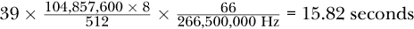

## **加密实现**


在第二章中，我概述了加密算法、它们的参数以及典型的应用场景。然而，数学算法离安全高效的*加密实现*还有很长的路要走。

在大多数应用中，加密并不起主导作用。它更像是保护设备和业务资产的必要“恶事”。因此，开发人员和产品经理都希望有能够快速运行、不占内存、不消耗能量的加密实现。当然，这是不可能的，但在很多情况下这是一个重要的讨论点。低效的实现可能会导致安全功能被排除、产品质量下降，或者至少让那些不专注于安全的同事产生抱怨。

在本章中，我将讨论加密实现的需求以及开发人员的选择选项。接下来的部分介绍了对称加密和非对称加密算法优化的示例。最后的案例研究分析并讨论了在 STM32MP157F 设备上硬件和软件中加密实现的性能特征。

### **实现上下文和需求**

开发人员在产品设计和架构开发的早期阶段选择中央微芯片，因为许多后续决策都依赖于此。该微芯片可能是单核微控制器、同质或异质多核系统、现场可编程门阵列（FPGA），甚至是将处理器、外设以及可能的 FPGA 整合到一个单一封装中的系统单芯片（SoC）。

如果选择了典型的处理器，几个参数会影响其整体性能，包括加密性能。这些参数从*指令集架构*（ISA， 例如 ARM、RISC-V 或 MIPS）和数据宽度（8 位、16 位、32 位、64 位甚至更高）开始。核心数及其最大频率也非常重要。特别是在加密操作中，值得关注的是是否有专门的加密指令，比如英特尔的 AES 新指令（AES-NI）扩展，或者给定的芯片是否配备加密协处理器。

对于工业、汽车或数据中心应用，考虑包括 FPGA 部件的微芯片可能是有趣的选择，因为它可以利用数字硬件设计所能提供的高性能属性或实时保证。除了最大支持频率，FPGA 还有一些特性，比如查找表的数量、触发器、随机存取内存（RAM）块、乘法器等，这些特性可能会设置加密实现的限制。

无论选择哪种类型的处理单元，都需要内部和/或外部内存。通常，需要易失性内存（如 RAM）和非易失性内存（如闪存、存储卡或固态硬盘（SSD））。除了它们的大小（这只会在非常资源受限的设备上影响加密实现）之外，它们的读写速度可能会影响加密应用程序的整体性能。

最后但同样重要的是，设备的有线和无线接口的传输速度（例如 Wi-Fi、蓝牙、以太网和专有总线）限制了通信的带宽，包括加密保护通道。

**注意**

*在实际操作中，当讨论加密性能时，设备和硬件架构往往已经或多或少固定，你必须尽力做到最好。然而，不要害怕在早期阶段提出加密性能要求。例如，如果你的预期应用程序要求每秒处理数千个签名，那么这一要求必须在硬件选择时予以考虑。*

从应用侧来看，你可能会对加密实现提出几种类型的需求。*延迟*描述从输入到输出处理单个数据块的时间，而*吞吐量*定义了在给定时间内可以处理的数据量。

对于资源受限设备上的软件实现，可能需要限制编译后的二进制文件的静态代码大小，这些文件必须存储在易失性和/或非易失性内存中。此外，运行时的动态内存使用也是一个相关因素。另一方面，FPGA 实现需要静态实例化数字组件，这也是为什么除了性能之外，数字硬件设计在加密领域的效率通常通过占用的 FPGA 资源数量进行比较的原因。

由于一些物联网设备由电池供电，甚至有些依赖于能量收集，因此加密实现的能耗也可能成为一个有效的需求。

设备实现上下文的所有信息对于做出稳健而高效的加密决策都是至关重要的。在某些情况下，在资源消耗和安全性之间找到合理的折衷可能是必要的。

### **选择加密实现**

在过去几十年里，我们看到许多实现问题导致了漏洞。如果你不想自己经历这些宝贵但令人疲惫的经验，可以看看现有的优化和成熟的加密库，比如 OpenSSL、LibreTLS、Mbed TLS 和 wolfSSL，仅举几例来自嵌入式系统领域的库。

然而，这个问题引出了许多开发人员在开发过程中会面临的一个问题：如何为设备或应用选择特定的加密库？这个决定在很大程度上取决于您的具体需求（如果已经明确提出）以及您所使用的框架和编程语言。以下列表描述了四种典型情况：

**自由选择**    有时仅规定了预期的保护目标——例如，通信应通过认证加密进行保护，而没有进一步的细节。这可能是公司内部功能的情况，且没有外部依赖。在这种情况下，可以考虑几种加密算法。例如，AES-GCM 和 ChaCha20-Poly1305 可能都是合适的选择。在这种情况下，对目标设备进行性能评估是有意义的。使用一组参数和多个加密库测试两种算法，以获得一个尽可能高效的解决方案。

**强大的性能要求**    在某些情况下，加密是必不可少的，并且必须满足高性能要求——例如，如果某个应用需要每秒生成数千个数字签名。由于 ECDSA 在签名生成上比 RSA 更快，因此该算法可能应该基于 ECC。然而，您仍然需要选择曲线类型。在给定硬件上测试来自可用加密库的一组曲线是选择最佳性能配置的有效方式。如果您的要求无法实现，可能需要更换硬件或实现定制优化的解决方案。

**强大的资源限制**    基于小型微控制器的设备在物联网中占据了很大一部分。然而，这些组件通常表现出明显低于基于 Linux 的设备的性能特征。尽管许多先进的加密算法可以在这些处理器上运行，但关于延迟、吞吐量、服务连接数等要求必须仔细选择。对目标硬件的实际评估至关重要。

**固定算法和安全等级**    如果算法和密钥大小预先固定（例如，由于兼容性问题），则范围会大大缩小。然而，如果特定实现没有固定，那么对不同加密库进行快速性能比较仍然具有价值，并可能解锁性能潜力。

尽管本章重点讨论性能，但延迟和吞吐量远不是加密实现中唯一需要考虑的质量特性。特别是对于安全应用，以下两种特性可能会产生显著的区别，即使它们导致较低的性能：

**透明性和清晰性**  可读、易懂且有文档记录的代码是非常棒的。它减少了错误、假设和误解。此外，这些特性使得开发人员及其产品更加值得信任。对于加密实现来说，这一点尤为重要。即使性能出色，意大利面条式的代码、极端优化导致代码完全无法理解的情况，以及结构破碎，可能仍然会使人忽视实现的优点。

**支持与维护**  开源软件促进了不可思议的项目开发。然而，一些项目没有良好的文档记录和支持。如果发现并报告了漏洞，可能没有人能立即修复它们。当然，商业软件和闭源软件也可能存在同样的情况。关键是，你需要关注特定库过去是如何维护的，以及是否有任何警告信号表明该库在不久的将来可能会失去维护，特别是对于加密库。

**警告**

*除非你有非常充分的理由，否则不要自行开发加密实现！*

无论你选择哪种加密算法，将来某一天由于量子计算或新的密码分析突破，可能会出现问题。因此，遵循*加密灵活性*的做法是有意义的，*加密灵活性*意味着算法（例如，分组密码）可以轻松地被另一种同类型算法替代。

### **AES 实现选项**

在本节中，我想阐明在配置或分析 AES 实现时需要考虑的选项。这里以 AES 为例，但由于许多其他对称加密算法和哈希函数也具有基于轮次的结构和类似的操作，你也许能够将这些见解转化为其他算法。

#### ***基本架构***

一个基本的考虑因素是处理数据的操作宽度。在最优的软件实现中，宽度通常会选择与底层硬件的数据宽度相匹配。然而，宽度不匹配可能会导致问题。例如，在 32 位中央处理单元（CPU）上进行 8 位实现可能会缺乏性能，而在 8 位 CPU 上进行 32 位实现可能无法编译，或导致低效的转换。

在 FPGA 实现中，实施的操作宽度可以随意选择。如果可以接受较慢的性能，并且重点是使用较少的资源，那么 8 位实现是合适的。另一方面，如果需要高性能，我们可能会希望使用 128 位的数据宽度进行操作。如果希望获得*平衡的*实现（即在所需资源和性能之间取得合理的权衡），32 位架构可能是一个可靠的选择。

AES 需要将给定的密钥扩展为一组轮密钥。可以在开始时进行一次密钥扩展，以提高批量数据加密和解密过程中的性能。另一种选择是在需要相应轮密钥进行操作时动态扩展。这样可以提高动态内存使用效率，因为只需要在内存中存储单个轮密钥，而不是所有轮密钥。

对于基于轮次的算法，如 AES，使用循环结构运行必要的轮次似乎很自然。然而，不断处理和检查循环变量会降低最大性能。即使比较和条件分支不会花费几秒钟，它们也会损害整体吞吐量。术语*循环展开*描述了一种你可能在高速实现中看到的方法：用一系列代码替代循环，表示所有 AES 轮次，以提高性能，但代价是增加了二进制文件的大小。

#### ***优化操作***

AES S-盒通常表示为一个表，用于执行非线性替代操作。因此，它通常作为常量查找表在软件实现中进行实现。然而，这并不是唯一的选择。如果静态表不适合你的需求，你可以在 RAM 中动态生成替代表。另外，对于数字硬件设计，可以使用一种称为*Canright S-盒*的布尔电路实现。

实现 AES 的一种流行优化方法是将轮次操作 `SubBytes()`、`ShiftRows()` 和 `MixColumns()` 结合起来，以获得每轮每列四次表查找和四次 XOR 操作的高效序列，这也被称为*T-表*实现。它需要四个表，每个表包含 256 个 4 字节的单词，加起来加密和解密分别需要 4KB 的内存。进一步的优化可以将所需的表内存减少到 1KB，但代价是每列每轮增加三次旋转操作。

**注意**

*牢记这些基本选项有助于你估算给定实现的性能特点，同时也可能在查看设备的性能数据时帮助你推导出其实现细节。*

显然，提供专用 AES 加速指令或特定加密协处理器的平台可以进一步优化性能。一些加密库已经准备好支持这些优化——例如，流行的 AES-NI 指令。然而，在嵌入式系统中，通常需要付出一些努力才能在应用程序中利用硬件加速。

虽然性能提升无疑是使用硬件加密的最常见动机，但在某些情况下，它也可能改善设备的功耗，或者至少减轻主 CPU 的负担。

### **RSA 和 ECDSA 的实现特点**

RSA 和 ECDSA 等非对称加密实现与对称加密实现不同。非对称加密算法不像对称加密那样具有一个填充变换集的循环结构，而是基于需要在大数上进行算术运算的数学问题。因此，这些算法在现实世界中的性能在一定程度上取决于 *多精度算术*（也称为 *大数算术*）的效率。

这些库需要克服的第一个障碍是一个简单的事实，即典型的处理器支持 32 位和 64 位数据操作，而 RSA 例如是基于 2,048 位、4,096 位甚至更多位长度的整数。这个问题可以通过将这些长整数拆分成一个 *limb* 数组来解决，通常每个 *limb* 的大小与 CPU 的最大数据宽度相同。

#### ***RSA 优化***

尽管通用的大数库支持对大数字的全面算术操作，但加密算法通常只需要其中的一小部分。如 第二章 所示，RSA 的主要操作是模幂运算——例如，用于加密和签名验证：*y* = *x^e*mod *n*。采用简单的方法，处理几千位的整数进行此计算几乎是不可能的。使用平方乘法算法使得这种计算成为可能。

RSA 有两个需要考虑的情况，它们具有非常不同的特性。首先，验证和加密操作使用公钥指数 *e* = 65537 = (10000000000000001)[2]，这使得性能相当高。原因在于它的 17 位长度，二进制表示中有一个前导 1 和一个尾随 1，这导致根据平方乘法算法，只需要进行 16 次平方运算和一次乘法运算。正如你在本章稍后会看到的那样，这不仅比解密和签名功能（必须处理与 RSA 完整密钥长度相同的整数）要快得多，而且还超过了 ECDSA 验证速度。

RSA 的私钥操作无法以相同的方式进行优化，但一种叫做 *中国剩余定理 (CRT)* 的方法将运行时间大约缩短了 4 倍。之所以能够实现，是因为 CRT 利用了 *n* = *pq*，这使得它可以通过两个指数运算（分别对 *p* 和 *q* 取模）来获得 *n* 的指数运算结果。这种方法能够节省计算量，因为 *p* 和 *q* 的大小大约是 *n* 的一半。

RSA 性能的平方乘法算法中一个重要的方面是，其复杂度与处理的指数位长的立方成正比。当你从 2,048 位的 RSA 升级到更具未来性的 4,096 位 RSA 时，你会明显感受到这一关系的痛苦效果，因为密钥长度翻倍会导致运行时间大约增加 2³ = 8 倍，这可能会吞噬你所有的运行时间需求。

#### ***ECDSA 细节***

由于 ECDSA 基于椭圆曲线运算，这些曲线处理的数字显著较小，因此私钥操作比 RSA 对应的操作要快得多。然而，不同类型的曲线支持不同的实现和优化。虽然选择合适的曲线涉及到数学和信任的考量，但在这个过程中性能不应被完全忽视，因为不同选项之间存在相当大的差异。

相较于对称加密，支持非对称加密的 FPGA 实现和内部硬件要少得多。你可以在一些专用的安全集成电路（IC）中找到它们，这些 IC 例如可以提供通过数字签名进行身份验证，也可以在支持数字签名验证的 SoC 设备中找到，以保护其启动过程。然而，通常你无法了解这些实现的太多细节，也无法任意访问它们的接口。

### **案例研究：STM32MP157F 设备上的加密性能**

在这个案例研究中，我探讨了在 STM32MP157F 设备上运行的多种对称和非对称加密算法的性能，并讨论了你能从这些结果中学到的东西。由于嵌入式系统通常配备功能丰富的操作系统，因此在这些系统上进行高精度的性能测量非常困难。因此，所有结果应视为大致数据。

手头的 SoC 基于一颗 ARM Cortex-A7 双核处理器，运行频率最高可达 800 MHz，配备了两种类型的加密协处理器。*CRYP1* 核心支持 DES、Triple DES 和 AES 的不同操作模式。哈希模块 *HASH1* 提供 SHA-1、MD5、SHA-224、SHA-256 以及相应的 HMAC 操作加速。这两者的运行频率大约是 266 MHz。

在以下的测试案例中，使用 OpenSSL 命令行工具评估性能，因为它通常可以在 Linux 系统上使用，并且其软件实现已经高度优化，非常适合我们的任务。

调用 `openssl speed -elapsed -evp` 算法进行测试。`-elapsed` 选项定义了吞吐量是根据实际经过的墙钟时间计算的，而不是根据用户空间中的 CPU 时间。后者会扭曲结果，特别是在使用硬件支持时。`-evp` 标志表示 *封装*，启用一个通用的高级加密接口，视硬件可用性，既可以使用软件实现，也可以使用硬件实现。

结果控制台输出始终包括如 清单 4-1 所示的编译参数，以及以下一组输入数据大小的每秒字节数的测试结果：16 字节、64 字节、256 字节、1,024 字节、8,192 字节和 16,384 字节。

```
version: 3.0.5
...
options: bn(64,32)
compiler: arm-ostl-linux-gnueabi-gcc  -mthumb -mfpu=neon-vfpv4
-mfloat-abi=hard -mcpu=cortex-a7 --sysroot=recipe-sysroot -O2 -pipe -g
-feliminate-unused-debug-types ...
-DOPENSSL_USE_NODELETE -DOPENSSL_PIC -DOPENSSL_BUILDING_OPENSSL -DNDEBUG
CPUINFO: OPENSSL_armcap=0x3
```

*清单 4-1：给定 OpenSSL 工具的编译参数和元数据*

为了清晰和易懂，所有测试的终端输出都简化为主要的相关数字。

#### ***对称加密的参数选择***

让我们考虑一个用例，该用例要求对传感器值进行机密性保护，并且这些值应以 50KB 的块进行加密。假设你的团队成员已经选择了 AES 作为分组密码，但密钥大小和操作模式尚未确定。

第一次分析比较了 128、192 和 256 位密钥的 AES-CTR 模式的性能，以便对这些数字有一个直观的了解。列表 4-2 显示了在 STM32MP157F 设备上获得的结果：第一行显示了输入数据块的大小，第二行显示了与该特定输入数据大小相关的每秒千字节吞吐量。

```
# openssl speed -elapsed -evp aes-128-ctr
...
type             16 bytes     64 bytes    ...   8192 bytes  16384 bytes
AES-128-CTR      15102.09k    19198.53k   ...     22915.75k    22943.06k
# openssl speed -elapsed -evp aes-192-ctr
...
type             16 bytes     64 bytes    ...   8192 bytes  16384 bytes
AES-192-CTR      13517.07k    16734.31k   ...     19327.66k    19360.43k
# openssl speed -elapsed -evp aes-256-ctr
...
type             16 bytes     64 bytes    ...   8192 bytes  16384 bytes
AES-256-CTR      12158.66k    14689.77k   ...     16711.68k    16728.06k
```

*列表 4-2：根据 AES 密钥大小的性能差异*

你可能注意到的第一个一般性点是，当输入数据大小增加时，吞吐量也会增加。这是因为必要的开销对于较大的输入数据的相关性减小。

对于我们的示例，最后一列是我们关注的，因为我们需要处理大约 50KB 的输入数据。在那里，我们可以看到 AES-128-CTR 达到了大约 22.9MBps，而 AES-256-CTR 仅达到了 16.7MBps。这是大约 27％ 的性能下降，或者大约 37％ 的处理时间增加。这是完全合理的，因为 AES-128 只需要计算 10 轮，而 AES-256 需要 14 轮，因此需要多 40％。然而，从安全性角度来看，我们可以获得 128 位的安全性，同时仅投资大约 37％ 的性能。这次升级可能是值得的。

第二个有趣的点是操作模式对性能的影响。虽然 CTR、CBC 和 GCM 模式在安全性上有所不同，但它们的性能特点也不同。在列表 4-3 中，你可以看到 CTR 模式在较大输入数据时比 CBC 模式的性能高大约 8％，这可能是许多情况下选择 CTR 而非 CBC 的原因。

```
# openssl speed -elapsed -evp aes-256-ctr
...
type             16 bytes     64 bytes    ...   8192 bytes  16384 bytes
AES-256-CTR      12157.72k    14690.37k   ...     16708.95k    16722.60k
# openssl speed -elapsed -evp aes-256-cbc
...
type             16 bytes     64 bytes    ...   8192 bytes  16384 bytes
AES-256-CBC      11962.59k    14429.91k   ...     15515.65k    15515.65k
# openssl speed -elapsed -evp aes-256-gcm
...
type             16 bytes     64 bytes    ...   8192 bytes  16384 bytes
AES-256-GCM       9052.80k    10844.44k   ...     12126.89k    12113.24k
```

*列表 4-3：AES 操作模式对加密吞吐量的影响*

GCM 提供认证加密，这意味着它不仅会生成密文，还会生成用于完整性保护的认证标签。后者的处理工作会导致大约 28％ 的性能下降。然而，如果你必须为 AES-CTR 添加一个 MAC 生成算法（例如 HMAC-SHA-256），这可能会比 28％ 更加耗费性能。

如果安全性比吞吐量更重要，使用 AES-256-GCM 仍然能获得 12.1MBps 的合理性能。然而，如果性能是你的关键需求，你可以通过 AES-128-CTR 达到最低的机密性保护要求，速度几乎是它的两倍——即 22.9MBps。

此时，您可能会记得 ChaCha 流密码的软实现通常优于 AES 的实现。而且由于您可能是那种追求产品完美的人，您应该检查手头的软件是否支持该算法，如清单 4-4 所示。

```
# openssl list -cipher-algorithms | grep -i chacha
  ChaCha20
  ChaCha20-Poly1305
  ChaCha20 @ default
  ChaCha20-Poly1305 @ default
```

*清单 4-4：给定 OpenSSL 工具中 ChaCha 密码算法的可用性*

对 ChaCha20 和 ChaCha20-Poly1305 进行速度测试，得到了如清单 4-5 所示的结果。

```
# openssl speed -elapsed -evp ChaCha20
...
type             16 bytes     64 bytes    ...   8192 bytes  16384 bytes
ChaCha20         21168.64k    36814.83k   ...     57442.30k    57507.84k
# openssl speed -elapsed -evp ChaCha20-Poly1305
...
type                 16 bytes     64 bytes    ...   8192 bytes  16384 bytes
ChaCha20-Poly1305    16054.38k    28477.87k   ...     47390.72k    47300.61k
```

*清单 4-5：ChaCha20 和 ChaCha20-Poly1305 密码算法的性能测试*

如果您的团队愿意从 AES 切换到 ChaCha20，它可以在数据速率达到 47.3MBps 或更高的情况下，获得 256 位安全性和认证加密。因此，ChaCha20 可能值得重新考虑。

#### ***SHA-256 哈希的软硬件实现对比***

假设您的设备生成的日志文件按 100MB 分割，且您希望在文件离开设备之前对其进行签名，以确保完整性和真实性保护。由于输入数据量相对较大，签名操作的性能主要取决于哈希步骤，而不是最后的非对称签名。因此，比较 STM32MP157F 设备上*HASH1*硬件模块的 SHA-256 软件实现与加速器的性能，可能是值得的。

清单 4-6 展示了硬件支持的所有哈希函数，并通过其相应的驱动程序提供。

```
# cat /proc/crypto | grep stm32-sha*
driver       : stm32-sha256
driver       : stm32-sha224
driver       : stm32-sha1
```

*清单 4-6：STM32MP157F 硬件支持的 SHA 算法*

可以通过加载`cryptodev`内核模块并将`-engine devcrypto`添加到速度测试参数中，使硬件加速可供 OpenSSL 命令行工具使用。清单 4-7 展示了 OpenSSL 对 SHA-256 的软硬件实现基本对比。

```
# openssl speed -elapsed -evp sha-256
...
type             16 bytes     ...   1024 bytes   8192 bytes  16384 bytes
sha-256           2868.42k    ...     24365.74k    27598.85k    27841.88k
# modprobe cryptodev
# openssl speed -elapsed -evp sha-256 -engine devcrypto
Engine "devcrypto" set.
...
type             16 bytes     ...  1024 bytes   8192 bytes  16384 bytes
sha-256            127.87k    ...     5835.78k    29996.37k    42592.94k
```

*清单 4-7：SHA-256 性能在软件和硬件中的对比*

对于像 16 字节这样的较小输入数据，软件解决方案的性能是硬件的 22 倍。这是因为测试数据必须从用户空间移动到内核空间，再到硬件并返回，这会带来显著的开销。然而，随着数据量的增加，这种效应变得越来越不相关。似乎对于 8KB 及更大的输入数据，STM32MP157F 硬件在性能上有优势。

**注意**

*即使大多数硬件供应商将其加密模块称为“加速器”，也不能保证它们能加速任何操作。在您的特定情况下，使用硬件可能甚至会拖慢加密操作。在做出选择之前，请确保进行性能测试。*

OpenSSL 命令行工具的标准数据大小上限为 16KB，但对于我们的特定用例，如果在哈希 100MB 文件时能够实现更高的吞吐量，将会是非常有趣的。清单 4-8 中的命令为调用添加了`-bytes 104857600`和`-seconds 60`选项，告诉 OpenSSL 使用 100MB 的输入块并大约进行一分钟的哈希操作。

```
# openssl speed -elapsed -evp sha-256 -bytes 104857600 -seconds 60
...
type        104857600 bytes
sha-256          27566.90k
# openssl speed -elapsed -evp sha-256 -engine devcrypto -bytes 104857600
    -seconds 60
Engine "devcrypto" set.
...
type        104857600 bytes
sha-256          68021.40k
```

*清单 4-8：使用 SHA-256 哈希 100MB 数据的性能分析*

结果数据显示，软件实现并未从大输入数据中获益，但硬件实现能够将吞吐量提高到约 68.0MB 每秒。

健康检查是减少错误、误解甚至漏洞的小步骤。在使用硬件加密时，我强烈推荐进行这些检查。

首先，我想知道硬件是否真正被使用，还是软件回退操作让我误入歧途。其次，如果芯片制造商提供的性能数据与我的实验数据相匹配，我对所选解决方案的信心将会增加。清单 4-9 展示了回答这些问题的实用方法。

```
# time openssl speed -elapsed -evp sha-256 -bytes 104857600 -seconds 60
You have chosen to measure elapsed time instead of user CPU time.
Doing sha-256 for 60s on 104857600 size blocks: 16 sha-256's in 60.87s
...
type        104857600 bytes
sha-256          27562.37k
real  1m 1.79s
user  1m 0.94s
sys   0m 0.75s
# time openssl speed -elapsed -evp sha-256 -engine devcrypto -bytes 104857600
    -seconds 60
Engine "devcrypto" set.
You have chosen to measure elapsed time instead of user CPU time.
Doing sha-256 for 60s on 104857600 size blocks: 39 sha-256's in 61.19s
...
type        104857600 bytes
sha-256          66831.94k
real  1m 2.26s
user  0m 0.18s
sys   0m 2.08s
```

*清单 4-9：SHA-256 硬件哈希的健康检查*

前缀`time`命令分析随后调用的进程的执行时间，并按三类划分：经过的挂钟时间（`real`），在用户空间花费的处理时间（`user`），以及用于特定进程的内核空间操作的时间（`sys`）。

软件-only 分析耗时 1 分钟 1.79 秒，其中 1 分钟 0.94 秒花费在用户空间，仅 0.75 秒用于内核操作。剩余的 61.79 – 60.94 – 0.75 = 0.10 秒可能是由于操作系统调度其他进程或执行独立的操作系统任务所导致的。

查看硬件加速的运行情况，情况完全不同。速度测试持续了 1 分钟 2.26 秒，但仅有 0.18 秒分配给用户空间计算，2.08 秒花费在内核空间。尽管这些数字较低，但 SHA-256 处理了 39 个 100MB 的输入数据块。

第一个结论是 62.26 – 0.18 – 2.08 = 60.00 秒没有出现在结果中。除了前面提到的调度和操作系统相关任务外，这部分时间还包括等待硬件组件处理并返回数据时的延迟。在 STM32MP157F 设备的*参考手册 RM0436*中，ST 解释了 SHA-256 的一个 512 位中间块的处理时间需要 66 个周期。因此，针对这一特定案例的纯硬件操作所需的时间估算如下：



这个数字至少在数量级上是正确的，但它仍然表明 60.00 – 15.82 = 44.18 秒在操作系统任务、驱动程序和其他硬件过程（如总线传输）中“丢失”。如果性能是你的首要目标，分析和优化驱动程序实现可能是下一步。

#### ***非对称加密软件性能比较***

非对称加密操作在计算上是非常昂贵的。然而，了解它们的成本有多高以及可用选项在性能上的差异非常重要。

列表 4-10 中的第一次分析结果显示了 RSA 实现中密钥长度的显著影响。

```
# openssl speed -elapsed rsa1024 rsa2048 rsa4096
...
                  sign    verify    sign/s verify/s
rsa 1024 bits 0.004880s 0.000204s    204.9   4897.8
rsa 2048 bits 0.028736s 0.000672s     34.8   1487.6
rsa 4096 bits 0.178246s 0.002454s      5.6    407.5
```

*列表 4-10：带有 1,024、2,048 和 4,096 位密钥的 RSA 性能分析*

虽然过时的 RSA-1024 在我的 STM32MP157F 设备上每秒完成大约 205 个签名，但采用 2,048 位密钥的最新版本仅能完成每秒 35 个签名。通过加倍密钥长度，我们必须接受性能下降大约 6 倍的结果。转向 4,096 位变种后，每秒只剩下五到六个签名，这意味着签名操作需要超过 178 毫秒，尽管该设备的运行频率已经达到 800 MHz。

另一方面，显然签名验证（等同于加密操作）在所有密钥长度下表现出明显更高的性能，因为它利用了短 RSA 公钥指数。

在 ECDSA 方面，OpenSSL 工具提供了一套大规模的曲线。列表 4-11 给出了使用中一些最流行的 NIST 曲线的性能概述。

```
# openssl speed -elapsed ecdsap224 ecdsap256 ecdsap384 ecdsap521
...
                              sign    verify    sign/s verify/s
 224 bits ecdsa (nistp224)   0.0090s   0.0074s    110.8    134.6
 256 bits ecdsa (nistp256)   0.0010s   0.0028s    982.3    355.5
 384 bits ecdsa (nistp384)   0.0322s   0.0243s     31.1     41.1
 521 bits ecdsa (nistp521)   0.0773s   0.0567s     12.9     17.6
```

*列表 4-11：选定 NIST 曲线的签名和验证性能*

我们可以立即看到，NIST 曲线 P-256 比其他曲线快得多，因为它的结构和实现经过高度优化。此外，性能成本因素（例如，对于 RSA）的粗略估计是很难提供的。通常，测量特定平台上的特定实现是最可行的方式。

关于 ECDSA 和 RSA 的比较，NIST 的 P-224 和 RSA-2048 具有相似的安全级别，但在签名性能上有大约 3 倍的差异，ECDSA 更有优势。然而，在验证速度方面，RSA-2048 比 P-224 曲线快了超过 11 倍。

最后，替代椭圆曲线通常由于对 NIST 选择的信任问题而被考虑，但性能也可以是一个积极的方面，如 列表 4-12 中所示。

```
# openssl speed -elapsed ed25519 ed448 ecdsabrp256t1 ecdsabrp512t1
...
                                     sign    verify    sign/s verify/s
 256 bits ecdsa (brainpoolP256t1)   0.0099s   0.0084s    101.5    119.1
 512 bits ecdsa (brainpoolP512t1)   0.0420s   0.0317s     23.8     31.6
                                     sign    verify    sign/s verify/s
 253 bits EdDSA (Ed25519)           0.0008s   0.0021s   1301.0    478.7
 456 bits EdDSA (Ed448)             0.0059s   0.0120s    169.4     83.1
```

*列表 4-12：具有有趣性能的替代椭圆曲线*

Brainpool 曲线 P512t1 在与 NIST P-521 提供相似安全级别的情况下表现更好。此外，Bernstein 的 Ed25519（Curve25519）展现出卓越的性能，甚至超过了 NIST P-256。

假设你可以自由选择适合你应用的非对称签名算法，从性能角度来看，Ed25519 是一个非常有趣的候选算法。如果需要与 RSA 兼容，RSA-2048 目前可能是一个稳妥的选择，但请确保你的设备也能支持 RSA-4096，以便为未来的更新做好准备。

### **总结**

性能不是一切。然而，在加密算法的实现过程中，它是一个你绝对不应该忽视的属性。除了安全性本身，性能是加密技术的基本质量特性之一。

一些嵌入式系统在处理能力、内存大小或功耗方面有很大的限制，这使得优化的实现变得不可或缺。否则，加密可能在权衡讨论中处于劣势。其他设备则专门用于网络或数据处理，要求高速的加密实现。有时候，性能要求可以通过使用高效的软件库来满足，但在其他场景下，则需要专门的数字硬件设计，如 FPGA（这本身是一个工程领域）或专为此任务设计的硬件协处理器。

请注意，即使你选择的加密算法从数学角度来看是安全的，并且展现出良好的性能特征，它们也不一定能抵御像侧信道分析和故障注入等实现攻击。Jasper van Woudenberg 和 Colin O'Flynn 的《*硬件破解手册*》（No Starch Press，2021 年）充满了关于如何破解和保护加密实现的实用示例和见解。Stefan Mangard、Elisabeth Oswald 和 Thomas Popp 的《*电力分析攻击：揭示智能卡的秘密*》（Springer，2007 年）也是深入研究这一领域的经典之作。

同时，请记住，这些先进的保护措施往往伴随着加密性能的下降。在开发生命周期的早期，务必尽早确定你的产品是否需要特别加固的加密实现。
