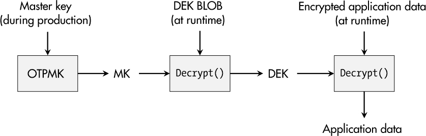

## **5**

**机密数据存储和安全内存**


嵌入式系统存储和处理各种数据。其中一些数据是无关紧要的，因为它们在许多平台上相同，或者可以很容易地猜测或推导出来。然而，某些数据通常被称为*敏感*、*机密*或*保密*数据，需要谨慎处理。

这些数据所携带的信息具有价值，其披露可能会导致负面后果。一个例子是*知识产权*，如嵌入到软件算法、专有协议和应用内容中的内容。此外，*加密材料*，如密钥和密码，天生就包含了关键信息。设备的*生命周期数据*，如传感器数据、日志条目和发送或接收的消息，也可能属于这一类。

本章首先讨论应以保密方式存储的数据以及在嵌入式系统中如何保持机密的困境。接下来，我将描述从操作系统级别到硬件再到混淆软件的存储机密数据的选项及其相应的优缺点。本章中的案例研究将通过使用加密文件容器在运行 Linux 的嵌入式系统上进行演示。

### **机密数据**

识别机密数据并意识到相关威胁始终是保护数据的第一步。以下示例旨在帮助建立必要的思维方式。

想象一下，您的研究部门发明了一种超高效的发动机控制算法，能够使汽车的燃油消耗远低于竞争产品。虽然您可能已经申请了专利，但这可能不足以保护您的设备免受盗版和模仿者的侵害。发明的价值只有在您将其实施到控制设备中时才会实现。在此，它很可能作为一个已编译的软件可执行文件，或者作为内核模块的一部分存储。两者都存储在设备的文件系统中，如果攻击者能够读取文件系统，他们就能逆向工程您的算法，并直接从您的研究投资中获益。这种情况显然是您想避免的，这意味着您必须保护控制算法实现的机密性。

一些家庭和消费设备包含大量的媒体内容，如图片和视频，它们的制作成本非常高。将它们存储在设备文件系统中显而易见的位置通常不是一个好主意。攻击者可能会复制这些内容，将它们上传到他们喜欢的在线平台，并为了自己的目的重用它们，这不仅可能造成经济损失，还可能损害您的产品和公司的声誉。

乍一看，保护加密材料似乎是显而易见的。然而，许多设备将与其证书基础身份验证对应的私钥存储在标准文件系统中。读取和复制这些密钥为冒充攻击打开了大门。此外，特别是在应用层，控制用户身份验证的密码有时会以明文形式存储在配置文件或软件二进制文件中。当然，提取密码会让攻击者成功地进行身份验证，因为凭证并没有以保护机密性的方式存储。

在某些情况下，真正有趣的数据是在设备的生命周期中生成的。例如，考虑产品通过指纹识别器收集的生物特征数据或通过位置数据创建用户移动档案的隐私影响。这些信息通常有很高的保密要求，甚至可能受到如欧洲通用数据保护条例（GDPR）等法律的约束。如果保护措施失败，可能会导致高达 2000 万欧元或公司全球总营业额的 4%的罚款。

设备中存储的数据历史甚至可能揭示更多内容。例如，在工业生产环境中，数据历史可能允许攻击者重建机器使用率和产出数据，这些可能是竞争对手所看重的有价值信息。同样，保密保护将是设备的重要特性。

几乎每个现代设备都包含值得保护的机密数据。在进行威胁和风险分析时，请务必牢记这一点。

### **嵌入式系统中的保密困境**

嵌入式系统通常包含一种有毒的属性组合。首先，它们必须能够在没有用户交互的情况下启动并运行，这意味着所有与正确操作相关的信息必须存储在设备内部，包括所有的机密数据。其次，攻击者通常可以获得设备并对其进行彻底分析。这种分析不仅包括基于网络的调查，还包括对产品内部通信线路的物理窃听，以及提取如固件镜像和文件系统分区等非易失性存储内容进行逆向工程。 从理论上讲，对于可以在所有层面进行分析的设备，其机密性保护是无法得到保证的。

然而，从更实际的角度来看，问题始终是：“攻击者需要花费多少努力才能全面了解设备及其机密数据？”

让我们考虑一下我之前提到的知识产权示例。假设你负责保守一个高度复杂算法的软件实现的秘密，尽管它必须存储并在你的设备上使用。有些人可能会立即认为，从闪存读取固件、识别可执行文件并进行算法的逆向工程非常复杂，因此他们认为不需要任何保护措施。

这个假设对于像脚本小子这样的攻击者可能是成立的。然而，考虑到那些寻求经济利益的罪犯，对他们来说，转储闪存和挂载文件系统似乎并不算太多工作。此外，像 Radare2 和 Ghidra 这样的免费开源工具使得任何有兴趣的人都可以进行至少基本的软件逆向工程。如果机密性在你的产品中具有更高的优先级，那么这些攻击者绝对应该列入考虑范围。

当然，有些情况攻击起来要简单得多。对于那些将固件存储在可移动介质（如许多现成笔记本电脑可以读取的 microSD 卡）上的设备，甚至不需要进行闪存转储。如果机密信息（如 RSA 私钥）以像隐私增强邮件（PEM）这样的可直接重用格式存储，那么“攻击”可以在短时间内完成，甚至由一个脚本小子来做。而且，并不是每个可执行文件都需要逆向工程。例如，*代码提取攻击*只需将二进制文件原封不动地复制到另一台设备上并运行。如果它实现了预期功能，就不需要访问其专有的细节。

### **安全文件系统方法**

到这个时候，你可能会想：“是否存在加密文件系统？那将解决我们所有的问题。”确实存在，但它并不能完全解决问题。有三种常见的选项可用，它们为文件提供机密性保护：加密堆叠文件系统、原生文件系统加密和加密块设备。

#### ***加密堆叠文件系统***

*堆叠文件系统*是在现有文件系统之上增加的一个额外文件系统结构，这意味着像 ext3 这样的标准文件系统不会被修改，加密发生在其上层。在这种情况下，文件的内容和名称会被加密——例如，对于特定目录中的所有文件。然而，文件的数量及其元数据是可以读取的。

堆叠文件系统也会带来一定的性能开销，并且文件名可能会受到额外的限制。多年来，使用用户空间文件系统（FUSE）框架的 EncFS 一直是这一方法的流行且易于使用的示例，但似乎开发已经停滞。一个有潜力的继任者可能是 gocryptfs。

一个在内核空间运行的竞争者是 eCryptfs。虽然 eCryptfs 可能配置起来稍微复杂一些，但在某些情况下它表现出更好的性能。然而，它的开发也停滞不前。基于文件的加密（FBE）与堆叠文件系统似乎已经不再流行。

#### ***原生文件系统加密***

目前，像 ext4、F2FS 和 UBIFS 这样的文件系统直接支持文件的加密存储。与文件系统堆叠相比，这允许更高效的集成和操作。

这种原生 FBE 方法的流行用户包括 Android 和 Chrome OS。其底层功能已在 Linux 内核中实现，并使用内核的加密 API 进行加密。用于配置和管理加密目录的用户空间工具叫做 `fscrypt`。

#### ***加密块设备***

基于文件的方法总是将文件夹结构和元数据保留为未加密状态。一种常见的避免信息泄露的方式是*全盘加密（FDE）*。在 Linux 中，这意味着加密层位于文件系统下方，位于块设备级别。无论该块设备是整个磁盘、分区还是文件容器，它都会作为一个整体进行加密，其内容与随机信息无法区分。

对于 Linux 来说，这类加密技术最常见的代表是 `dm-crypt`，它基于设备映射器基础设施，并使用内核的加密 API。`cryptsetup` 用户空间工具可以创建加密卷，并且支持流行的 Linux 统一密钥设置（LUKS）容器格式，该格式为加密卷提供了多种密钥管理功能。

TrueCrypt 的继任者 VeraCrypt 是另一个流行的工具，例如，它还支持将两种密码算法串联起来，以增强解密的抗性。

#### ***建议***

加密数据存储显然不缺少选择。FDE 或 FBE 是否适合你的需求，主要取决于你的设备及其相应的安全要求。

如果从你的角度来看，文件的位置、数量和大小已经向攻击者透露了敏感信息，那么 FDE 可能是带来最高安全性的解决方案。然而，FBE 提供了更多的灵活性——例如，在同一文件系统内托管异构文件集，以便某些数据始终可以被所有进程访问和读取，但机密数据则按目录选择性解密。它还可以具有应用特定的密钥，从而实现更细粒度的机密性保护。

#### ***密码短语***

无论你选择哪种实现方式，一个大问题始终存在：所有工具都需要一个密码短语，以直接解锁受保护的目录和卷，或解锁用于解密数据的密钥文件。即使是“密码短语”一词也表明这一概念是让用户像我们在 PC 启动时输入凭证一样使用的。

然而，大多数嵌入式系统并没有活跃的用户在其面前，能够在启动时输入密码短语来解锁硬盘加密。接下来通常会问：“在哪里隐藏解锁加密的密钥？”

### **硬件中的安全内存**

我时常听到一些人（和公司）说，硬件实现的*安全内存*是解决嵌入式系统凭证问题的方案。然而，这只是部分正确。

硬件实现的安全内存的一个优势在于，它在经典的非易失性内存（存储固件的位置）和专用的安全模块之间实现了强有力的物理分隔，而该安全模块只能通过特定的接口访问。此外，它还支持篡改检测或抗篡改功能，并且存储的位数据可能深埋在芯片内部，这使得硬件攻击变得困难，并且需要复杂的设备。

然而，这种方法也有其缺点。最明显的是，这种受保护的内存通常只能存储少量数据，通常是加密密钥。此外，这些密钥通常*必须离开*安全模块才能发挥作用，比如解锁 LUKS 容器。在这种情况下，攻击者可能会在通信线路上传输过程中捕获这些密钥。

在过去，当外部安全模块将密钥传递给主 CPU 时，攻击者通过窃听物理 PCB 路径来利用这一问题。其他攻击则主动与安全内存进行通信，例如要求它为攻击者加密、解密或签名任意数据。因此，仅仅*拥有*一个安全内存并不会显著提升设备的安全性；它还必须*安全集成*。

和往常一样，是否使用安全内存是否合理取决于具体的应用场景和实现细节。通常，它至少为攻击者添加了另一层需要了解的知识——即观察设备运行时的安全内存通信，而不仅仅是从固件或文件系统中提取机密信息。让我们来考虑一下与安全内存相关的选项。

#### ***外部安全内存***

将“传统”方式添加安全内存设备到设计中的方法是将一个专用微芯片集成到设备的 PCB 上，并将其连接到主微处理器。这个领域中最突出的代表是受信平台模块（TPM）。

你可以从多个制造商那里购买离散的 TPM 设备，比如英飞凌、NXP 和 ST。它们在 PC 世界中已经得到了广泛应用，因为微软的 Windows 系统要求它们作为硬件必备组件。一个基本的用例是，用户可以解锁一个 TPM 密钥，然后该密钥用来解锁由 BitLocker 保护的卷。当然，这只是该过程的简化视图，问题也正是出在这里。

TPM 远不止是安全内存。它包括授权层、密钥层级，并且当前 TPM 版本的规范超过 1000 页。尽管 Linux 下有可用工具来使用 TPM，如`tpm2-tools`和`ibm-tss`，但使用 TPM 对普通产品和开发团队来说似乎太复杂。

幸运的是，安全微控制器制造商提供了针对汽车、工业和物联网应用的有趣替代方案。类似 TPM 的产品，如英飞凌的 OPTIGA Trust X、NXP 的 Edge-Lock SE050 系列和微芯的 ATECC608B，配备了广泛的加密算法，从对称密码（如 AES）、哈希函数和 HMAC，到非对称加密（如 RSA 和 ECDSA）。当然，它们也提供用于加密密钥的安全内存。它们的承诺是，这些设备需要的集成工作量远低于物联网产品。

总结来说，单纯将 TPM 用作安全内存就像是用大锤打蝴蝶。对于嵌入式系统而言，更精简的替代方案可能更为合适。然而，在决定是否使用专用硬件安全模块时，你还应考虑到安全设备身份和安全通信等主题，正如在第六章和第七章中所讨论的那样。无论如何，确保你理解可能通过接口与物理攻击者可接触的渠道传输秘密密钥的含义。

**注意**

*TPM 2.0 规范提供了一种加密主机 CPU 与 TPM 之间通信的方式，这为攻击者和工程师都增加了复杂性。*

#### ***内部安全内存***

与需要设计并焊接到 PCB 上的离散硬件组件相比，安全模块和安全存储设施已经深度集成到设备的主 CPU 中。

被称为*集成 TPM*或*固件 TPM*的这些 TPM 替代方案，由 AMD 和 Intel 等芯片厂商提供。除了降低 PCB 集成成本外，这一概念的显著优势是片上通信比 PCB 上运行的信号更难以捕获。当然，TPM 的复杂性问题依然存在。

另一方面，现代 SoC 通常提供一次性可编程（OTP）内存，可用于存储至少一个主密钥。一个常见的例子是 NXP i.MX 系列的级联加密概念。在这里，主密钥（OTPMK）在生产过程中被编程到设备中。随后，使用此密钥来加密数据加密密钥（DEK），以获取所谓的 DEK *二进制大对象（BLOB）*。然后，开发人员可以使用 DEK 来加密应用程序数据。

图 5-1 展示了从主密钥 OTP 读取到应用数据解密的过程。



*图 5-1：NXP i.MX 系列的解密级联*

这个过程为设备增加了安全性，因为密钥和机密数据不会以明文形式存储，同时，必要的密钥直接加载到设备的加密加速和保障模块（CAAM），在这里进行解密，这意味着只有解密后的用户数据在运行时离开这个内部模块。

### **应用程序代码中的秘密**

由于成本或旧硬件无法再升级，额外的硬件或安全增强型主 CPU 并非总是可行的。将密钥明文存储是不可避免的吗？不一定。

我们仍然可以将密钥从文件系统的结构化字段移到更为拥挤的可执行文件形式中。同样，这种方法要求潜在攻击者具备更高的能力——即二进制逆向工程。即使对手得知某个特定的可执行文件负责解锁加密的卷，他们也无法立即提取解锁密钥。

**注意**

*是的，安全通过模糊化实际上出现在一本安全工程书中。在现实世界的设备工程中，你确实有时需要抓住一根稻草。*

描述这种对策的术语是*混淆*。其唯一目的是使软件逆向工程更加困难，可以通过多种方式实现：

+   用复杂但等效的操作替代常见操作

+   通过重新排列命令顺序来使控制流更加复杂，但不破坏功能

+   插入冗余、不必要的代码和数据

+   将部分代码或数据以加密或编码形式存储，并仅在运行时解密或解码

+   向数据结构和控制流中添加随机性

+   集成防调试措施，以阻碍分析

+   将密钥拆分成多个部分，存储在不同的位置，并仅在运行时组合它们

这个列表并不全面，每个要点都可以通过多种方式实施，并具有多种创造性。如果你自己做不到，也可以使用提供自动代码混淆功能的工具。不过，使用这些工具时必须小心，因为每种混淆工具可能也有对应的对立工具，即*反混淆*工具，它可以还原添加的复杂性，使攻击者能够更高效地分析代码。

2002 年，名为*白盒加密*的概念出现在学术讨论中，作为解决在软件中隐藏秘密问题的一种方法。这种方法旨在在软件中执行加密操作，而不揭示底层的秘密。这意味着使用的加密密钥会扩散到加密算法的操作中。

白盒加密的最初概念将硬编码密钥的加密算法转变为基于密钥的表查找，并将随机值注入内部计算中，这些值在某些时候会掩盖数据，并在之后揭示出来。然而，毫不奇怪，这导致了二进制文件大小和性能上的显著开销，并且这些实现也被密码分析攻破了。虽然学术界尚未找到完美的解决方案，但许多软件公司在其产品中使用了某种形式的白盒加密——例如，在允许用户下载二进制文件并进行分析的移动应用中。

无论你使用自定义的混淆技术、商业工具，还是学术领域的白盒加密方法，在将秘密信息隐藏在软件二进制文件中的时候，你始终应该牢记一种攻击者的方式：代码提升。在这种情况下，二进制文件“按原样”使用——例如，解锁一个 LUKS 容器。如果攻击者只是需要将可执行文件作为加密保险库的密钥，那么密钥本身对攻击者来说并不重要。这可能发生在原地，或者感兴趣的文件可能会被提取并在攻击者控制的环境中执行。

### **安全的密码存储**

基于密码的身份验证是验证合法用户登录的常见方法，但它也用于解锁加密的卷和容器。自然，密码是机密数据。将它们以明文存储在文件或可执行文件中以便在验证过程中进行比对，会让攻击者变得很容易。一旦密码被提取，它们就可以被成功地用于访问机密数据。然而，如同我们讨论的其他数据保护措施一样，传统的加密通常并不适用于这里。密码的特定验证过程允许实现一种不同的安全存储方式：*密码哈希*。

哈希函数的单向特性对于防止攻击者从哈希值中恢复出密码非常有用，即使哈希值已从设备中提取。验证过程仍然有效，因为给定的密码可以高效地进行哈希计算，并与存储的值进行比较。然而，在这种简单的情况下，攻击者可能会预计算*彩虹表*，这是一个包含数百万个密码哈希值的大型集合，甚至可能包括所有可能的 10 个字符的密码。为了防止此类攻击，会在密码哈希过程中添加一个随机的*盐*，使每个哈希值都独一无二，并使所有彩虹表失效。

Linux 目前仍默认使用基于 SHA-512 哈希的函数来生成加盐的用户密码哈希。此外，基于密码的密钥派生函数 2（PBKDF2）在 20 多年前已经在 RFC 2898 中标准化。它基于 HMAC，使用像 SHA-1、SHA-256 或 SHA-512 这样的哈希函数。两种方法无疑比明文密码存储要好，但现代攻击者使用图形处理单元（GPU）、现场可编程门阵列（FPGA）和专用的应用特定集成电路（ASIC）通过暴力破解密码哈希。

因此，为了使产品具备未来保障，建议使用该领域的现代代表。典型的例子有 scrypt，它在 2016 年被标准化为 RFC 7914；它的继任者 yescrypt；以及在 2015 年赢得密码哈希竞赛的 Argon2。这些算法的共同目标是通过可参数化的密码哈希算法增强破解抗性，这些算法考虑了计算时间、所需内存和并行 CPU 线程数量等维度，旨在阻止那些即使拥有多种硬件资源和计算能力的攻击者。

**注意**

*即使保密性是密码的主要保护目标，但如果有人能够更改密码，后果将非常严重。用已知密码的哈希替换 root 用户的密码哈希是一个相当常见的攻击，它为对手打开了所有大门。你应该认真考虑对密码存储的完整性保护，如第八章中讨论的那样。*

### **案例研究：Linux 上的加密文件容器**

在这个案例研究中，假设你的一个遗留设备没有实现任何安全存储来保护机密数据。在参加一个国际展会时，你的工程团队成员注意到一个目前未知的竞争对手使用了你们的一款专有 GUI 应用程序和你们精心制作的相关媒体内容，满足了目标受众的需求。

回到家后，你与团队和管理层讨论了这个问题。经过初步调查，显然，窃取数据所需的只是打开设备并从闪存中读取内容，而你的竞争对手显然已经成功做到了这一点。为了限制未来的损失，你决定通过使用 LUKS 容器至少建立一个基本的保护措施。你当前的闪存设备容量为 256MB。基本的 Linux 系统及所有相关工具大约占用 136MB。你的专有可执行文件及其数据和配置文件大约占 19MB，而高质量的视频内容占用 73MB。

你想保护后两类数据。由于平台上的内存需求相当紧张，而且你希望将代码与媒体分开，你计划创建一个 25MB 的容器用于可执行文件和包含知识产权的文件，以及一个 90MB 的容器用于视频文件。

#### ***加密基准测试***

作为第一步，你将 `cryptsetup` 添加到设备的根文件系统中，以便能够使用 LUKS 容器。你还在 Linux 内核配置中启用了 `CONFIG_CRYPTO_SERPENT` 和 `CONFIG_CRYPTO_TWOFISH`，因为你听说 `cryptsetup` 支持它们，并且想知道它们是否能在你的 STM32MP157F SoC 上超越 AES。清单 5-1 显示了 `cryptsetup` 自带性能基准测试工具的结果。

```
# cryptsetup benchmark
# Tests are approximate using memory only (no storage IO).
PBKDF2-sha1        59148 iterations per second for 256-bit key
PBKDF2-sha256      92695 iterations per second for 256-bit key
PBKDF2-sha512      58618 iterations per second for 256-bit key
PBKDF2-ripemd160   49201 iterations per second for 256-bit key
PBKDF2-whirlpool   14021 iterations per second for 256-bit key
argon2i       4 iterations, 65536 memory, 4 parallel threads (CPUs)
              for 256-bit key (requested 2000 ms time)
argon2id      4 iterations, 65536 memory, 4 parallel threads (CPUs)
              for 256-bit key (requested 2000 ms time)
#     Algorithm |       Key |      Encryption |      Decryption
        aes-cbc        128b        36.9 MiB/s        36.8 MiB/s
    serpent-cbc        128b         9.0 MiB/s        10.4 MiB/s
    twofish-cbc        128b        11.1 MiB/s        12.0 MiB/s
        aes-cbc        256b        36.9 MiB/s        37.0 MiB/s
    serpent-cbc        256b         9.1 MiB/s        10.5 MiB/s
    twofish-cbc        256b        11.3 MiB/s        12.0 MiB/s aes-xts        256b        18.4 MiB/s        17.0 MiB/s
    serpent-xts        256b         9.0 MiB/s        10.4 MiB/s
    twofish-xts        256b        11.5 MiB/s        12.0 MiB/s
        aes-xts        512b        15.3 MiB/s        13.1 MiB/s
    serpent-xts        512b         9.6 MiB/s        10.5 MiB/s
    twofish-xts        512b        12.0 MiB/s        12.0 MiB/s
```

*清单 5-1：由* cryptsetup 提供的基准测试结果

最初，这个输出显示了多个密码存储功能的分析，帮助你了解哪些特定功能的参数可能是你设备的合理选择。你希望将像迭代次数这样的参数设置为可以在你的设备上提供可接受性能的值（例如，解锁时间在两秒内），同时让攻击者的破解工作量最大化。在这种情况下，由于没有特定的需求，你选择保持 LUKS2 卷的默认设置：Argon2。

加密/解密基准测试显示，无论是使用 AES 的 CBC 模式还是 XTS（基于 XEX 的调整密码本模式带有密文盗取），AES 都是最快的算法。AES-CBC 性能似乎还得到了 STM32MP157F 加密硬件的加速。另一方面，XTS 是 `cryptsetup` 和硬盘加密的一般推荐默认操作模式。由于你非常重视性能，并且不希望容器加密影响任何设备功能，你选择了 AES-CBC，并且由于 128 位和 256 位密钥几乎没有差异，你选择了 256 位密钥。

**注意**

*你可能会好奇 XTS 如何使用 512 位密钥与 AES 配合使用。简而言之，它并没有！它需要两个密钥（在这种情况下是两个 256 位密钥，总共加起来是 512 位），但安全级别仍然是 256 位。*

#### ***容器创建***

在确定加密参数后，你可以开始为你的两个容器创建随机文件和相应的密钥文件。用于可执行文件的容器占用 25MB，媒体容器则基于一个 90MB 的文件，如 清单 5-2 所示。两个密钥都初始化为 32 字节，即 256 位。

```
# dd if=/dev/urandom of=executables.enc bs=1M count=25
# dd if=/dev/urandom of=media.enc bs=1M count=90
# dd if=/dev/urandom of=executables.key bs=32 count=1
# dd if=/dev/urandom of=media.key bs=32 count=1
```

*清单 5-2：容器和密钥文件的随机初始化*

在下一步，如 清单 5-3 所示，你使用 `cryptsetup` 通过 `luksFormat` 命令提供 LUKS 容器的基本结构。

```
# cryptsetup -q -v --type luks2 --cipher=aes-cbc-essiv:sha256
    luksFormat executables.enc executables.key
# cryptsetup -q -v --type luks2 --cipher=aes-cbc-essiv:sha256
    luksFormat media.enc media.key
```

*清单 5-3：LUKS2 容器的创建*

由于你希望使用 Argon2 进行密码验证，并且想要享受 LUKS2 中第二个头部副本带来的鲁棒性，你选择使用 `--type luks2` 来选择第二版本的头部格式。之前选择的基于 AES 的 CBC 模式并带有加密盐扇区初始化向量（ESSIV）的配置，通过 `--cipher=aes-cbc-essiv:sha256` 进行配置。

此时，容器及其结构已经准备好，但你还不能在这些虚拟金库中存储任何东西。需要通过 `luksOpen` 解锁文件容器，以在其中创建 ext3 文件系统。注意，解锁 LUKS 容器后，如清单 5-4 所示，它会映射到设备 */dev/mapper/dm_exec_enc*，然后挂载到新创建的目录 */mnt/exec_enc*。同样的操作也可以用于加密的媒体容器，其设备为 */dev/mapper/dm_media_enc*，挂载点为 */mnt/media_enc*。

```
# cryptsetup -v --key-file=executables.key luksOpen executables.enc dm_exec_enc
# mke2fs -t ext3 /dev/mapper/dm_exec_enc
# mkdir /mnt/exec_enc
# mount /dev/mapper/dm_exec_enc /mnt/exec_enc
```

*清单 5-4：解锁容器以创建文件系统并挂载*

看起来你已经快完成了。让我们使用 `luksDump`，如清单 5-5 所示，来检查是否设置了正确的属性。

```
# cryptsetup luksDump executables.enc
...
Keyslots:
  0: luks2
    Key:        256 bits
    Priority:   normal
    Cipher:     aes-cbc-essiv:sha256
    Cipher key: 256 bits
    PBKDF:      argon2id
    Time cost:  4
    Memory:     65536
    Threads:    2
...
```

*清单 5-5：再次检查容器属性*

输出完全符合我们的要求。

#### ***效率分析***

在你开始填充文件系统之前，让我们最后检查一下这个构建的效率。`fdisk` 和 `df` 工具将帮助你了解 LUKS 头部损失了多少内存，以及 ext3 文件系统引入了多少开销。清单 5-6 中有详细信息。

```
# fdisk -l /dev/mapper/dm_exec_enc
Disk /dev/mapper/dm_exec_enc: 9 MiB, 9437184 bytes, 2304 sectors
...
# df -hT /dev/mapper/dm_exec_enc
Filesystem              Type  Size  Used Avail Use% Mounted on
/dev/mapper/dm_exec_enc ext3  4.5M   28K  4.0M   1% /mnt/exec_enc
# fdisk -l /dev/mapper/dm_media_enc
Disk /dev/mapper/dm_media_enc: 74 MiB, 77594624 bytes, 18944 sectors
...
# df -hT /dev/mapper/dm_media_enc
Filesystem               Type  Size  Used Avail Use% Mounted on
/dev/mapper/dm_media_enc ext3   66M   28K   62M   1% /mnt/media_enc
```

*清单 5-6：关于内存使用效率的检查*

不幸的是，这并没有按计划进行。25MB 的容器只剩下 4MB 的空间来存储数据，而另一个大小为 90MB 的容器则剩余 62MB。明显可以看到，容器大小与其在设备映射器基础设施中的相应设备之间的差异大约为 16MB。实际上，如果你仔细研究过 LUKS 文档，你会知道 LUKS1 和 LUKS2 的头部分别消耗了 2MB 和 16MB。虽然这对几百 GB 的硬盘来说不是问题，但对于内存受限的嵌入式系统来说，这可能会成为一个痛点。

你可以通过使用 LUKS1 头部而不启用 LUKS2 的改进来解决这个问题，这在实际操作中是可以接受的，或者甚至使用不在内存中存储任何元数据的 `cryptsetup` 的“纯模式”。后者可能是最有效的选择，但也带来了显著的管理限制。LUKS1 可能是一个合理的选择。

清单 5-6 还显示，ext3 文件系统由于需要分配表和日志数据，会减少可用内存。然而，对于静态存储可执行文件、配置文件和媒体内容，日志记录可能不是必需的，你也可以部署 ext2 文件系统以释放更多可用内存。

在将 `luks2` 更改为 `luks1` 和 `ext3` 更改为 `ext2` 后重复整个过程，情况有所不同，如清单 5-7 所示。

```
# fdisk -l /dev/mapper/dm_exec_enc
Disk /dev/mapper/dm_exec_enc: 23 MiB, 24117248 bytes, 47104 sectors
...
 # df -hT /dev/mapper/dm_exec_enc
Filesystem              Type  Size  Used Avail Use% Mounted on
/dev/mapper/dm_exec_enc ext2   22M   14K   21M   1% /mnt/exec_enc
# fdisk -l /dev/mapper/dm_media_enc
Disk /dev/mapper/dm_media_enc: 88 MiB, 92274688 bytes, 180224 sectors
...
# df -hT /dev/mapper/dm_media_enc
Filesystem               Type  Size  Used Avail Use% Mounted on
/dev/mapper/dm_media_enc ext2   81M   14K   77M   1% /mnt/media_enc
```

*清单 5-7：LUKS1 和 ext2 的内存使用效率*

分别损失 4MB 和 13MB 的情况仍然发生，但剩余的空间足以满足本案例的需求。

**注意事项**

*如果你在现实生活中遇到类似情况，但无法满足你的需求，你仍然可以考虑切换到本地文件系统加密（例如使用 ext4），或者使用压缩的只读文件系统，如 CramFS 和 SquashFS。*

解决这些与安全无关的意外问题后，最后一个问题是如何安全地解锁已创建的容器。由于你的设备中没有安全元素，且主 CPU 也没有为此提供 OTP 内存，你可能决定将解锁过程隐藏在*initramfs*中的可执行文件里，该文件在启动时执行。需要明确的是，采用这种方法并不会为你赢得“安全设计”奖项，但它可能会提高成功攻击的门槛。

你可以考虑包括硬件基础的系统标识符，如第六章中所述，以衍生出设备唯一的解锁密钥，而不是仅依赖于容易在设备外部仿真的全球性软件解决方案。此外，你还可以实现秘密共享方法，例如将密钥文件内容拆分成多个部分，并在运行时动态组合它们以获得最终的密钥，这至少能够阻碍简单的静态分析攻击。无论如何，你必须意识到，获得 root 权限的攻击者能够绕过所有这些措施，并在运行时访问解密后的文件系统。对于下一代产品，你将从第一天起就将安全存储作为优先事项。

### **读取保护作为低成本解决方案**

一些小型嵌入式系统成本低廉，缺乏安全内存，无法运行 Linux，且完全无法承担外部安全元素。这些设备可能基于运行实时操作系统（RTOS）的微控制器，甚至仅运行裸机软件。

然而，即使是这些情况，也可能有数据需要一定级别的机密性保护。由于这些设备通常将所有代码和数据存储在内部闪存中，限制对闪存的读取访问可能是一种简单但有效的保护敏感信息的措施。启用*读取保护*——例如，通过烧录相应的熔丝——将使设备能够执行内部存储的代码，但拒绝提取其非易失性存储器内容的请求。

即便如此，仍需注意，配备合适设备的物理攻击者能够绕过低成本微控制器的基本保护功能，从而访问你的机密数据。

### **总结**

本章介绍了可能需要保密保护的几类数据，从知识产权到媒体内容，再到加密密钥。遗憾的是，对于在嵌入式系统中存储此类敏感数据，目前没有完美的解决方案。导致这一困境的一个原因是，与 PC 相比，嵌入式系统没有主动的用户，他们会将主密钥记在脑中并在需要时输入。

由于所有的秘密必须始终在同一设备上可用，我们能做的唯一事情就是将这些秘密隐藏在经过良好保护的地方，比如安全元件、内部 OTP 内存或加密软件中。所有这些解决方案的目标是增加攻击者需要突破的障碍，以实现成功的攻击，但每个方案都有其自身的优点和缺点。

许多方法将秘密的披露和使用推向设备的运行时阶段，这要求攻击者控制设备某些部分，甚至执行自定义代码。因此，保密保护的质量和成功与设备的运行时完整性有着密切关系，我们将在第八章中讨论这一点。
