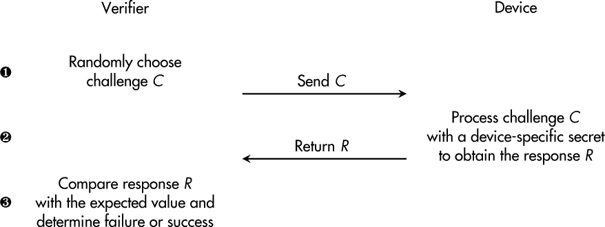
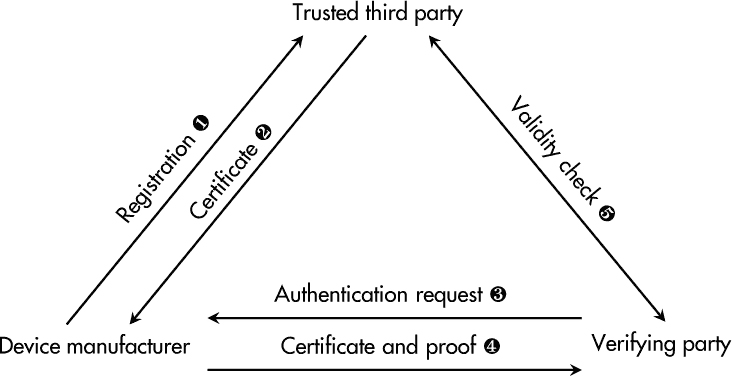
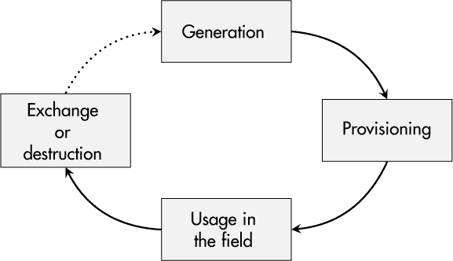

## 第八章：**安全设备身份**


长时间以来，嵌入式系统在幕后匿名运行，不关心远程访问、数字商业模式或与其他设备及云服务共享数据。然而，今天这些场景已经发生了根本性的变化。

突然间，维护人员现在通过远程登录设备，无法通过查看物理指示器来验证他们是否正在操作正确的设备。此外，按需付费的商业模式在工业场景中变得越来越流行，设备会自行生成账单。在这种情况下，能够证明使用数据的来源并将其映射到特定客户是至关重要的。此外，不同制造商生产的设备开始互相通信并交换数据。所有这些趋势有一个共同的强烈需求：每个设备需要一个唯一的身份标识，且每个设备必须能够证明这一点。

本章的第一部分调查哪些属性有助于设备的独特性，并能作为身份的基础，以及紧密相关的身份识别和认证过程。接下来，我们将从两个角度来探讨设备身份管理的实施：设备内存储的加密身份和制造商端的生命周期管理。本章最后通过两个案例研究探讨身份生成和供应。

### **每个设备都是独一无二的**

消费品和工业组件的大规模生产可能给人一种印象，即所有从生产线下来的产品在固件的每个比特上都是相同的。然而，如果真是如此，你如何区分一个设备与另一个设备呢？当然，产品上长期以来都有带有序列号的贴纸，但如果贴纸掉了、故意被去除，甚至被更换成伪造的版本呢？

对于现代设备来说，唯一的身份应该是设备本身的一个重要组成部分，并且该组件应该能够主动向第三方设备、维修站以及原始制造商的云服务等证明其身份，仅举几个例子。

从理论上讲，即使每个设备拥有相同的 PCB、微处理器和 RAM，它们依然是独一无二的，因为所有这些单元都受到（即便是微小的）物料、时间行为、功耗等方面的个体差异的影响。学术界已经在利用这些微小物理特征的独特性来建立设备身份。相关的研究领域聚焦于*物理不可克隆函数（PUFs）*，这些技术最近甚至已经出现在首批商业产品中。

以下章节将探讨当前设备中哪些因素使其在实际应用中具有独特性，并如何将这些唯一身份证明给其他方。

### **身份识别与标识符**

显然，*标识*这个术语与*身份*这个词紧密相关。然而，花点时间思考一下它的确切含义。

如果我们要定义标识的过程，可以说它是“宣称某一身份”。例如，如果你在会议上遇到某人，你可能会说：“你好，我是乔！”你宣称你是乔。如果你的设备收集了一些使用数据——假设是在一个月内——然后连接到后台提供数据以供客户结算，它也可能会开始说：“你好，后台，我是 XY1337-0815！”它宣称自己是一个具有某种“名称”的设备。

#### ***唯一标识符***

关于唯一性，告诉别人你是乔（Joe）显然是不够的。可能存在多个乔，甚至可能在同一个会议上。加上你的姓氏可能会缩小范围，但你的名字仍然不会是唯一的，至少在全球范围内是这样。如果你考虑到出生地点和出生日期，你会更接近于拥有一组唯一标识*你*的数据。这些属性被称为*标识符*。人类有更多的标识符：发色、眼睛颜色、身高、体重等等。

由于设备通常没有类似人类的名字，制造商必须采取另一种方法进行标识。长期以来，典型的标识符一直是厂商选择的值，如型号、序列号和生产日期。

随着互联网的出现，全球范围内的标识符需求变得明显。那时，UUID（即*全球唯一标识符（GUID）*）的概念被提出。它在 RFC 4122 等标准中被规范化，旨在提供 128 位的唯一标识符，且无需中央注册过程。尽管标识符碰撞的概率不为零，但在实践中被认为非常接近零。UUID 的生成可以通过 Linux RNG 等方式完成，具体可见第三章。

从密码学的角度来看，由非对称加密算法（如 RSA 和 ECDSA）生成的公钥也可以完美地作为标识符。它们甚至可以与主体名称和其他属性结合，获得一个独特的设备证书进行标识，正如在网络认证标准 IEEE 802.1AR 中所规范的那样。

#### ***系统身份***

一些设备由一个单一的核心组件组成，这个组件构成了整个设备及其身份，而其他产品架构则更加模块化，并允许在发生故障或硬件升级时进行部分更换。在后者的情况下，讨论哪些组件对设备的身份有贡献，哪些没有，是值得的。嵌入式系统的物理部分提供了多种标识符，如网络卡的媒体访问控制（MAC）地址、蓝牙芯片组和 Wi-Fi 控制器的 MAC 地址，还包括 CPU、闪存和可移动媒体的序列号和唯一标识符。

要求系统身份包含一组标识符，也意味着如果其中一个部分发生变化，系统身份必须重新生成或重新批准。这个要求对于制造商来说可能是一个优势——例如，强制用户购买相同品牌的备用零件——因为每次更换都需要制造商的确认。然而，系统身份和强制制造商批准也可能增加制造商方面的额外工作量。此外，如果每一个小的变化都需要与原始制造商进行反馈回路，它可能会显著限制运营商在日常业务中的自由度。

**注意**

*有时候，设备的可靠性是最重要的目标，如果硬件出现故障，操作员必须立即替换它。在这种情况下，允许设备身份可转移是合理的——例如，使用可拆卸的存储卡。*

### **身份验证和验证器**

在日常语言中，*身份识别*和*身份验证*有时可以互换使用，但身份验证意味着的不仅仅是声称一个身份。

如果你的身份的有效性和正确性真的很重要——例如，如果你需要申请护照或注册投票——你告诉他们：“嗨，我是乔，”他们可能会回答：“嗨，乔，请出示你的身份证。”他们会让你*证明*你的身份——这与数字身份验证过程的模拟等价。

*身份验证*一词意味着你必须*确认*你在几秒钟前所声称的身份。为此，你需要拥有一个有效的*验证器*，它对应于给定的身份。对于人类来说，验证器可以是身份证、驾驶证等。对于所有这些身份证明，某个权威机构在某个时间点验证了人类的身份，并随后颁发了一个通常有效一定时间的相应验证器。在这个有效期内，权威机构和其他人可以使用提供的验证器来验证特定的身份。

对于设备，典型的验证器包括对称密钥或非对称私钥、（临时的）认证令牌或密码（在传统情况下）。这些验证器是在特定设备（例如，在生产过程中）为其创建并发行的，并且可以在以后通过密码学手段证明该设备的身份。

#### ***身份验证协议***

根据验证器的类型，身份验证过程以不同的方式执行。一种常见的方法是*挑战-响应身份验证协议*。图 6-1 展示了挑战-响应握手的一种形式。



*图 6-1：挑战-响应身份验证过程的典型步骤*

挑战-响应认证过程从生成一个随机挑战 *C* ➊ 开始，挑战随后被传输到设备。设备利用其秘密认证信息处理这一不可预测的值，并产生一个响应 *R*，返回给验证方 ➋。在最后一步 ➌，*R* 将与预期值进行比较，以决定认证是否成功。

对于对称秘密信息，设备上的算法处理给定的挑战与设备特定的秘密信息时，可能是一个哈希函数或 HMAC 构造。然而，缺点是，秘密信息还必须在验证方的数据库中可用，以便计算正确的预期值，而不仅仅存储在设备内。

相比之下，非对称加密允许仅设备本身使用的认证器，这些认证器永远不会离开设备，这是最安全的解决方案。具体来说，基于 RSA 或 ECDSA 的数字签名，如第二章所述，可以用来从随机挑战生成认证响应。在这种情况下，验证方仅需要相应的公钥来检查返回的签名的有效性。

**注意**

*在大多数情况下，认证仅可能通过秘密信息来实现。因此，保密性是所有类型认证器的自然保护目标。如果被破坏，设备冒充便成为可能的威胁。*

#### ***专用认证芯片***

如第五章所述，半导体制造商提供多种认证芯片，这些芯片不仅能够安全地存储认证信息，还提供一种算法手段，进行挑战-响应握手以实现认证。

这种方法有两个优点。首先，从芯片中提取秘密认证信息对于攻击者来说是一项非常困难的任务。其次，由于这些芯片通常集成了支持非对称加密的功能，主要是基于椭圆曲线的数字签名，秘密信息永远不需要离开芯片的物理边界。

另一方面，采用这种方法后，你的物料清单（BOM）上会增加另一个组件，你需要在 PCB 上预留空间，且这些设备的必要软件集成工作在不同厂商之间有所不同。此外，一个常被忽视的攻击向量是——即将此类身份芯片物理转移到另一个设备的过程。简单的 8 脚封装可以被拆焊下来，集成到另一个原始设备中，甚至是定制的攻击者设备中。就像代码提取攻击一样，攻击者可能并不关心芯片内的秘密信息，只要他们能够将整个芯片移到他们想要的位置。

#### ***多因素认证***

对于人类用户的身份验证，*多因素认证 (MFA)* 在过去几年里受到了广泛关注。根据深度防御原则，MFA 要求攻击者不仅要获取一个身份验证器，例如密码，还需要至少一个第二因素，比如由移动应用或硬件令牌生成的临时令牌。由于密码存储在人类的大脑中（或密码管理器中），并且额外的身份验证器通常来源于附加的硬件设备或至少是不同的通信渠道，因此成功攻击所需的努力显著增加。

对于设备认证，情况有些不同，因为设备不会像人类大脑或移动应用那样存储和生成身份验证器。然而，你仍然可以考虑多因素方法——例如，使用存储在固件中的一个身份验证器，以及一个来自专用认证芯片的第二身份验证器。认证过程将包含两个握手，一个是与硬件组件的握手，另一个是基于设备软件的握手，迫使攻击者如果想要窃取设备身份，必须破坏设备的两个不同部分。

除了额外的显式身份验证器，你还可以使用隐式的环境参数来加强设备认证。一个常见的例子是地理限制，也叫*地理围栏*。在这种情况下，设备认证（或一般操作）只有在设备的位置与预定义区域匹配时才会成功。确定此参数的一种方法是设备用于互联网通信的公共 IP 地址。当然，利用这些隐式身份验证属性的安全性得到了最大化，如果攻击者已经侵入设备，无法伪造这些参数。它们应该是从外部可观察的，而不仅仅是设备本身声明的。

#### ***受信第三方***

过去，设备身份的主要验证者是同一设备的制造商。专有的（最终不安全的）身份验证过程完成了它们的工作。然而，在物联网和工业物联网（IoT 和 IIoT）场景下的多方数字生态系统中，跨制造商设备认证的需求变得非常明显。

这一要求意味着制造商必须信任其他设备的身份验证器，包括竞争对手。由于制造商之间的一对一信任关系会导致巨大的管理开销，因此必须引入*受信第三方（TTP）*的概念，如图 6-2 所示。



*图 6-2：受信第三方在设备认证中的角色*

在这种方法中，制造商将其设备身份注册到 TTP ➊。在验证之后，TTP 认证给定的身份并返回一个设备特定的证书 ➋。在现场的身份验证请求中 ➌，设备可以提供颁发的证书并通过加密证明其拥有相应的验证信息 ➍。然而，此时，验证方无法确定给定的加密数据是否对应实际设备身份。验证者最终必须检查认证的有效性 ➎，可以通过直接与 TTP 通信或使用 TTP 提供的公钥等数据来完成。之后，可以建立与先前未知设备的可靠信任关系。

#### ***证书和证书授权机构***

我一直在使用*证书*这个术语来描述由 TTP 颁发的数字文档，用以确认设备的身份。从技术角度讲，最常见的实现方式是基于非对称加密的 X.509 v3 证书，如 RFC 5280 中所规定的那样。

这些证书的目的是将给定的公钥绑定到其对应的主体上，例如一个设备，并将其与一组属性（包括有效期和证书序列号）关联起来。*证书授权机构（CA）*用其自己的私钥对这些值进行数字签名。这个 CA 也包含在证书中，位于`Issuer`字段中。结果是最小的*证书链*版本，这意味着设备证书及其公钥可以通过加密方式进行验证，如果验证成功，则需要验证下一个证书（即 CA 证书）。只有当两个验证都成功时，认证才是可信的。

实际上，制造商可能拥有自己的产品 CA，这个 CA 由 TTP 的一个中间 CA 认证，而该中间 CA 又由一个国际公认的根 CA 认证。通过这个过程，建立了相当复杂的层次化证书链，每当设备需要进行身份验证时，都必须验证到根证书。

*根证书*没有经过任何机构的认证；它们是自签名的，必须能够在验证方的一种根存储中找到。这意味着验证方也必须无条件地信任所有的根证书。因此，根存储需要强大的完整性保护；否则，攻击者可以通过篡改存储的证书来注入新的信任关系。

在某些情况下，证书可能直到其有效期结束之前都无法被信任——例如，由于私钥泄露、设备被盗或类似问题。针对这种情况，证书授权机构（CA）维护一个*证书吊销列表（CRL）*，列出所有即使在其有效期尚未结束的情况下，也不再被信任的证书。*在线证书状态协议（OCSP）*是一个常用的协议，用于在认证过程中检查证书的吊销状态，已在 RFC 6960 中标准化。

整个验证、认证和吊销的架构，以及相应的流程和服务，通常被称为*公钥基础设施（PKI）*。由于这种系统需要大量的维护和文档工作，小型和中型企业通常会犹豫是否自己实施，而是依赖于 PKI 服务提供商，这就意味着信任第三方（TTP）。

### **身份生命周期与管理**

现在我们已经介绍了设备认证的基本概念，本节将建立管理设备身份的*生命周期*的可靠策略需求。生命周期管理有四个主要步骤，如图 6-3 所示：身份生成、在制造商系统及设备中的配置、在现场的日常使用，以及经常被忽视的身份交换或销毁。



*图 6-3：设备身份的生命周期*

**警告**

*不要将生命周期管理视为可选项。即使你已经解决了标识符、加密技术和安全内存等所有技术难题，也要确保你的组织已经准备好应对未来的组织性挑战。*

#### ***生成***

设备的身份可以在不同的地方和不同的时间生成。你选择的地点和时间会影响生产过程中安全要求和流程。如果你使用电子制造服务（EMS）来制造产品，与服务提供商的信任和密切合作至关重要。

在生产过程中直接在设备上生成身份可能是最安全的选项，但前提是相关的认证密钥*永远*不离开设备。非对称加密技术支持这种用例，因为生成的私钥可以保留在设备上，而其公钥可以提供给潜在的验证者。当然，你也可以在生产过程中生成对称密钥，但在这种情况下，密钥必须在后期导出以启用身份验证。

虽然设备端生成具有安全优势，但也带来了操作和实际的挑战。想象一下，如果一个设备“丢失”了其身份，因为存储身份的内存损坏。如果这是唯一的存储位置，修复后必须重新生成身份，这可能会导致冲突，因为在您的产品数据库中生成了一个新的条目，但硬件实际上是旧的。此外，您的客户必须在他们的资产管理系统中用新的身份替换旧的设备身份。如果您作为制造商有身份备份，这种情况可以轻松处理，但代价是安全性。

设备端生成的另一个缺点是产品身份的延迟可用性，因为它们只有在某个生产步骤完成后才能获得。有时这可能正是您所需要的，但如果您的设备身份必须在您自己的 IT 系统中填充，以便从第一天起顺利运营，那么您可能希望在实际生产之前就准备好这些设备身份相关的过程。

**警告**

*基于 RSA 密钥的设备端身份生成是一个非确定性过程，所需时间不固定。在规划生产过程中必须考虑这一限制，尤其是对于低性能设备。*

在设备外生成身份提供了更多的灵活性，可以在生产之前和修复过程中管理设备身份。认证密钥提前在身份管理系统中准备，并在第二步提供给生产。然而，这意味着这些身份在真实设备组装之前就已经存在，并且当然它们已经承担了保密性和完整性的保护目标。在生产前的信息泄露或数据篡改可能对您的产品安全产生严重后果。

另一个可能影响您选择设备端或云端生成的因素是第三方信任方（TTP）的介入。如果您在生产过程中生成身份，则必须在严格的时间安排内与第三方进行注册、验证和认证。当然，这是可能的，也是理想的，且这一做法已被该领域的领先者实施，但它需要大量的基础设施和流程管理工作。

#### ***配置***

根据身份生成的阶段，以下的配置步骤有两种形式，各自有优缺点。在这两种情况下，最终结果应该是身份被配置到设备本身，并且在制造商和最终涉及的 EMS 提供商的产品跟踪和身份管理系统中。

在设备上生成身份后，所有制造商系统都必须通过生产过程中的读取步骤来进行身份配置。对于非对称加密，只需将公钥或来自 TTP 的相应证书存储在制造商的身份数据库中。然而，如果需要备份认证密钥，你可以通过此时提取私钥来创建备份。

离线生成身份需要信息流向另一个方向——即从身份管理系统到待生产的设备。显然，需要一个编程步骤，将预生成身份的密钥和属性写入产品内部的特定存储位置或硬件资源。这一步骤可能会被集成到现有的固件编程流程或类似的过程当中。

在所有这些情况下，当敏感数据在设备配置过程中传输时，至少应该保证该通信的完整性，通常还应保证其保密性。否则，认证密钥可能会被泄露，设备可能会拥有被篡改的身份，或者制造商的身份数据可能会被损坏。

**注意**

*如果你的设备身份在生产之前生成，然后通过电子邮件或邮寄的 USB 闪存驱动器发送给你的 EMS 提供商，仔细考虑一下这是否达到了你的保护目标。如果你诚实地思考，可能并没有。*

#### ***现场使用***

之前生成和提供的身份用于现场认证。到目前为止，一切正常。那么我们在日常使用中能采取其他预防措施吗？当然可以。身份管理系统使我们能够在设备与我们的系统进行认证时，执行合理性和可信度检查。

想象一下，你的认证日志显示同一个设备在短时间内从两个不同的地点连接。这可能是某人偷走了设备的身份并出于自己的目的使用它的迹象。如果能及早识别出这样的情况，并及时进行具体调查，损失可以得到显著的控制。

#### ***交换或销毁***

即使某些设备（尤其是在工业、军事或太空应用中）在物理上设计为可以永久使用，它们的认证密钥通常不会。互联网上，Web 服务器证书的常见有效期是 90 天（例如，Let’s Encrypt 在 *[`letsencrypt.org`](https://letsencrypt.org)* 实现了这一点），这意味着这些身份至少每三个月就需要重新生成一次。

显然，在 IoT 和 IIoT 场景中的身份更新仍远未达到如此高的频率。然而，至少如果使用 X.509 证书进行身份验证，那么有效期就是一个必须指定的参数，无论是由贵公司还是由您选择的 TTP 指定。一些制造商发放的设备证书有效期长达 20 年或更长，但即使所选加密算法是面向未来的，仍难以估计 15 年或更长时间后该身份是否仍然值得信赖。

一些网络产品（例如思科的产品）支持像 *简单证书注册协议（SCEP）* 或其较新的替代方案 *通过安全传输注册（EST）* 这样的证书管理协议。由于这是 IoT 和 IIoT 设备的全新领域，直到撰写本文时尚未建立通用标准，但很明显，自动化是持续可靠的身份和证书管理的关键。

**注意**

*2022 年，德国健康远程医疗基础设施的安全网关制造商声称，由于其五年期加密身份的有效性已到期，这些设备必须进行物理更换。随后，混乱计算机俱乐部（CCC）证明了相反的观点，并根据其说法节省了德国医疗保健系统* €*4 亿。这只是一个例子，强调了强大的身份更新过程的重要性。*

身份生命周期的最终步骤实际上是它的销毁。虽然物理移除并不总是可行，但制造商至少应该准备好撤销特定设备的信任关系，如果该设备在定义的有效期结束之前已经达到其使用寿命。为此目的，典型的措施是由 CA 维护的 CRL 或在制造商数据库中设置的信任状态标志。

### **案例研究：身份生成与配置**

在本案例研究中，我将研究 STM32-MP157F-DK2 的标识符可用性及如何提取它们以推导出系统身份。此外，我们还将了解如何在该设备上准备证书签名请求（CSR），该请求随后可以提供给 TTP，TTP 进而能够颁发有效的设备证书。

#### ***标识符和系统身份***

STM32MP157F-DK2 评估套件是一个嵌入式系统，包含多个组件。这些组件中的许多自带标识符，工程师可以捕获并使用它们来创建全面的设备身份。

一个常见的标识符是设备主 CPU 的序列号。在这方面，ST 的 *参考手册 RM0436* 中提到： “96 位唯一设备标识符提供一个参考编号，在任何上下文中对给定设备都是唯一的。用户不能更改这些位。” 这个唯一 ID (UID) 被不可更改地存储在 STM32-MP157F 芯片的 OTP 内存中。列表 6-1 显示该 UID 被分为三个 32 位字，可以从特定的内存地址读取。

```
Base address: 0x5C00 5000 (BSEC base address on APB5)
Address offset: 0x234 = UID[31:0]
Address offset: 0x238 = UID[63:32]
Address offset: 0x23C = UID[95:64]
```

*列表 6-1：STM32MP157F 设备中 UID 的物理地址*

我们可以使用 `devmem2` 命令行工具来读取物理内存地址。如列表 6-2 所示，应用程序输出三个 32 位字，表示芯片的身份，通过基地址和 UID 偏移的组合来获取。

```
# devmem2 0x5c005234
...
Read at address  0x5C005234 (0xb6fb0234): 0x0038003D
# devmem2 0x5c005238
...
Read at address  0x5C005238 (0xb6fb9238): 0x34385114
 # devmem2 0x5c00523c
...
Read at address  0x5C00523C (0xb6f1423c): 0x36383238
```

*列表 6-2：从物理地址读取我的 STM32MP157F 设备的 CPU UID*

在 Linux 系统中，序列号也可以从 */proc/cpuinfo* 获取。列表 6-3 中的输出确认序列号与之前从原始内存位置提取的序列号相同。

```
# cat /proc/cpuinfo | grep Serial
Serial : 0038003D3438511436383238
```

*列表 6-3：捕获在 Linux 中可用的 CPU 序列号*

然而，STM32MP157F 芯片并不是 PCB 上唯一的芯片。ST 的 *用户手册 UM2637* 描述了多种实现的通信接口。除了经典的以太网网络，设备还包括一个提供 Wi-Fi 和蓝牙功能的 IC。所有这些接口都有唯一的 MAC 地址，可能会用来推导系统身份。列表 6-4 显示了在 Linux 上运行时如何提取这些值。

```
# cat /sys/class/net/eth0/address
10:e7:7a:e1:81:65
# cat /sys/class/net/wlan0/address
48:eb:62:c4:0a:08
# cat /sys/kernel/debug/bluetooth/hci0/identity
43:43:a1:12:1f:ac (type 0) 00000000000000000000000000000000 00:00:00:00:00:00
```

*列表 6-4：在 Linux 中提取以太网、Wi-Fi 和蓝牙 MAC 地址*

最后，系统的一个部分可以轻松地移除和替换：可移动介质卡。在我的例子中，它是一个包含 *卡片识别 (CID)* 的 microSD 卡。这个 128 位的值唯一标识一张 SD 卡。它包含制造商 ID、产品序列号以及生产日期等信息。再次强调，Linux 提供了一个对应的条目，在 `sysfs` 中可以读取，正如列表 6-5 所示。

```
# cat /sys/block/mmcblk0/device/cid
275048534431364760dad3df9a013780
# cat /sys/block/mmcblk0/device/serial
0xdad3df9a
```

*列表 6-5：读取 SD 卡的唯一 CID*

除了 `cid` 值，Linux 还提供了 SD 卡的 `serial` 值，该值仅包含存储卡的序列号。

对于本案例研究，假设您的团队选择使用中央 CPU ID 和 Wi-Fi MAC 地址作为两个相关的系统标识符。它们可以通过哈希函数组合在一起，如下一节所示。

#### ***证书签名请求***

*证书签名请求（CSR）* 是一种数据结构，要求 CA 认证某个公钥与特定身份绑定，在本例中即设备身份。Linux 提供了多种方法来生成 CSR 并提供必要的信息。清单 6-6 展示了通过 `cryptography` Python 模块实现 RSA 密钥生成和 CSR 创建所需的导入。同时，`subprocess` 模块也被引入，用于通过系统命令行工具获取系统标识符。

```
import subprocess
from cryptography.hazmat.primitives import serialization
from cryptography.hazmat.primitives.asymmetric import rsa
from cryptography import x509
from cryptography.x509.oid import NameOID
from cryptography.hazmat.primitives import hashes
```

*清单 6-6：来自* cryptography *和* subprocess *模块的必要导入*

设备上身份生成的第一部分通常基于非对称加密（在本例中是 RSA）。如清单 6-7 所示，可以通过一行代码生成一对随机密钥。

```
# Generate RSA key
key = rsa.generate_private_key(public_exponent=65537, key_size=4096 ➊)

# Write key to disk
with open('dev.key', 'wb') as f:
    f.write(key.private_bytes(
        encoding=serialization.Encoding.PEM,
        format=serialization.PrivateFormat.TraditionalOpenSSL,
        encryption_algorithm=
        serialization.BestAvailableEncryption(➋ b'PrivateKeyPassphrase'),
    ))
```

*清单 6-7：设备上生成 RSA 密钥对*

对于本案例研究，我决定使用 4,096 位的 RSA 密钥长度 ➊，以考虑到 (I)IoT 设备的使用寿命为几年。为了简化这个示例，生成的私钥保存在*dev.key*文件中，并由一个标准的密码短语保护 ➋。在实际的生产环境中，密钥应该以安全的方式存储，如第五章中所讨论的那样。

清单 6-8 展示了标识符收集和处理的示例过程。

```
   # Collect system data
➊ output = subprocess.Popen('cat /proc/cpuinfo | grep Serial',
            shell=True, stdout=subprocess.PIPE)
   cpu_serial = output.stdout.read().split()2
➋ output = subprocess.Popen('cat /sys/class/net/wlan0/address',
            shell=True, stdout=subprocess.PIPE)
   wifi_mac = output.stdout.read().split()[0]

   # Hash collected system data
➌ digest = hashes.Hash(hashes.SHA256())
   digest.update(cpu_serial)
   digest.update(wifi_mac)
   system_id = digest.finalize()
➍ system_id = system_id[:4].hex()
```

*清单 6-8：设备上标识符的收集和处理*

在第一步中，通过 Linux 提供的方式读取生产系统的 CPU 序列号 ➊ 和 Wi-Fi MAC 地址 ➋。随后，使用 SHA-256 哈希函数 ➌ 处理这些值，并派生出一个 4 字节的系统标识符 ➍，如果将来更换 CPU 或 Wi-Fi 芯片，该标识符将会发生变化。故意忽略了 SD 卡 ID，因为 SD 卡时常会损坏，这会导致不必要的身份重新生成需求。

对于设备证书和 CSR，分别需要为设备指定一个*通用名称*，如清单 6-9 所示。

```
   # Manufacturer data
   manufacturer = 'IoT Devices Corp'
   manufacturer_device_serial_no = 'IOTDEV-1337-08151234'

   # System name for CSR and certificate
➊ cert_common_name = manufacturer_device_serial_no + '-' + system_id

   # Generate CSR and sign with private key
   csr = x509.CertificateSigningRequestBuilder().subject_name(x509.Name([
       x509.NameAttribute(NameOID.ORGANIZATION_NAME, manufacturer),
    ➋  x509.NameAttribute(NameOID.COMMON_NAME, cert_common_name),
➋ ])).sign(key, hashes.SHA256())

   # Write CSR to disk
   with open('dev.csr', 'wb') as f:
       f.write(csr.public_bytes(serialization.Encoding.PEM))
```

*清单 6-9：设备上 CSR 准备过程*

在本案例研究中，唯一的设备名称是由制造商提供的序列号和硬件相关的系统标识符 ➊ 组合而成的。这串字符串被用作 CSR 生成的输入 ➋，并与制造商名称一起出现在 CSR 的*组织*字段中。最后，设备用其唯一的私有密钥 ➌ 签署 CSR。之后，CSR 被保存在*dev.csr*文件中。

保存的 CSR 文件必须传输到负责认证生产设备身份的 CA。此外，制造商或 EMS 提供商可能会从数据库中提取已收集和生成的设备数据。例如，清单 6-10 展示了来自 STM32MP157F 设备的数据。

```
Collected CPU serial number:  0038003D3438511436383238
Collected Wi-Fi MAC address:  48:eb:62:c4:0a:08
Derived system identifier:    f30cf858
Given device serial number:   IOTDEV-1337-08151234
Common name in certificate:   IOTDEV-1337-08151234-f30cf858
```

*清单 6-10：来自我的 STM32MP157F 设备的标识符数据示例输出*

如您所见，一个 4 字节的系统标识符是从列出的各个标识符生成的，并附加到设备序列号后面。这个字符串随后作为生成的 CSR 的常见名称。

#### ***证书授权机构***

在我们颁发最终证书之前，先看看 CSR 包含了什么。清单 6-11 展示了如何使用 `openssl req` 命令行工具显示 CSR 内容。

```
$ openssl req -in dev.csr -noout -text
Certificate Request:
    Data:
        Version: 1 (0x0)
      ➊ Subject: O = IoT Devices Corp, CN = IOTDEV-1337-08151234-f30cf858
      ➋ Subject Public Key Info:
            Public Key Algorithm: rsaEncryption
                Public-Key: (4096 bit)
                Modulus:
                    00:d3:a0:14:fb:e1:0e:d0:74:3d:26:d4:ef:a1:ed:
                    ...
                    c9:2a:f5:46:e4:b2:ad:a9:5e:ee:cb:79:85:d9:1e:
                    9f:3e:57
                Exponent: 65537 (0x10001)
        Attributes:
            (none)
            Requested Extensions:
    Signature Algorithm: sha256WithRSAEncryption
  ➌ Signature Value:
         81:98:b1:e8:c2:fe:3a:55:32:39:2e:27:ce:2c:a8:54:bd:04:
         ...
         17:77:6c:a1:5b:4a:a7:ed:22:55:33:23:26:55:05:90:26:d2:
         90:7a:5e:34:65:80:32:4e
```

*清单 6-11：我的 STM32MP157F 设备的示例 CSR*

主题 ➊ 由组织字符串（`O`）和常见名称（`CN`）表示，如我们在清单 6-9 中的 CSR 准备脚本所指定，接着是相应的 RSA 公钥 ➋。设备的数字签名 ➌ 可以在给定请求的末尾清楚地识别出来。CA 可以使用它来验证请求主体是否确实拥有与 CSR 中给定公钥对应的私钥。

CA 和 PKI 基础设施通常由复杂的流程组成，采用各种组织和技术措施以确保其正常可靠地运行。如清单 6-12 所示，我们创建了一个测试 CA，它远未准备好用于生产环境，但对于教育目的来说是可以的。这里或许可以使用 *快速且简陋* 这一术语。

```
$ openssl genrsa -out ca.key 4096
$ openssl req -new -x509 -key ca.key \
              -subj "/C=DE/L=Augsburg/O=Super Trusted Party/CN=CA 123" \
              -out ca.crt
```

*清单 6-12：使用* openssl *工具快速生成测试 CA*

我们可以借助 `openssl genrsa` 工具生成测试 CA。清单 6-12 中的第一条命令为 CA 生成一个 4096 位的 RSA 密钥对，并将其存储为 *ca.key*。因为在这个案例研究中，它是 CA 的根证书，所以相应的证书必须是自签名的。可以使用 `openssl req` 工具，并告诉它 CA 的属性——例如，国家（德国为 `DE`）和所在城市（`Augsburg`），它的组织名称（`Super Trusted Party`），以及它的常见名称（`CA 123`）来获取 *ca.crt* 证书。

在 CA 注册并成功验证当前证书请求后，它会获取 CSR 数据，并添加有效期等属性。在清单 6-13 中，您可以看到 `-days` 参数被设置为 `3650`，这意味着颁发的证书有效期为 10 年。

```
$ openssl x509 -req -in dev.csr -CA ca.crt -CAkey ca.key -CAcreateserial \
               -days 3650 -out dev.crt
```

*清单 6-13：使用* openssl *工具从 CSR 生成证书*

在设备证书生成过程中，CA 决定有效期的长度，但当然，这会影响您的设备身份生命周期。确保仔细选择此值。

让我们看看这一复杂过程的最终结果。`openssl x509` 工具可以输出设备证书内容，如清单 6-14 所示。

```
$ openssl x509 -in dev.crt -noout -text
Certificate:
    Data:
        Version: 1 (0x0)
        Serial Number:
         ➊ 45:3c:c3:30:c1:e3:c2:a9:49:5c:14:d6:16:5d:79:69:24:6c:31:66
        Signature Algorithm: sha256WithRSAEncryption
      ➋ Issuer: C = DE, L = Augsburg, O = Super Trusted Party, CN = CA 123
        Validity
            Not Before: Apr  5 11:18:13 2024 GMT
 ➌ Not After : Apr  2 11:18:13 2034 GMT
        Subject: O = IoT Devices Corp, CN = IOTDEV-1337-08151234-f30cf858
        Subject Public Key Info:
            Public Key Algorithm: rsaEncryption
                RSA Public-Key: (4096 bit)
                Modulus:
                    00:d3:a0:14:fb:e1:0e:d0:74:3d:26:d4:ef:a1:ed:
                    ...
                    c9:2a:f5:46:e4:b2:ad:a9:5e:ee:cb:79:85:d9:1e:
                    9f:3e:57
                Exponent: 65537 (0x10001)
    Signature Algorithm: sha256WithRSAEncryption
  ➍ Signature Value:
         75:d5:07:71:ec:fe:c6:27:fd:e2:a7:1c:fa:b9:89:b3:9c:0f:
         ...
         8d:fa:f6:f1:53:79:32:1e:a8:ec:6f:f7:03:57:2f:7b:f4:fb:
         45:77:6a:f8:c6:70:72:41
```

*清单 6-14：示例设备的证书内容*

与原始的 CSR 相比，你可以看到 CA 在`Issuer`字段中添加了证书序列号➊和自己的数据➋。有效期➌被设置为从颁发时起的 10 年。最后，所有这些属性由 CA ➍与设备信息及其公钥一起签名。现在，每个信任所用 CA 的实体都能够验证生成的设备。

在颁发证书后，证书必须提供给设备本身，也需要提供给制造商的身份管理系统。在生产过程中，整个生成、证书颁发和配置的过程应具备高程度的自动化，并采取预防措施以最小化对机密性和完整性的威胁。

### **案例研究：生产中的 RSA 密钥生成**

尽管 ECDSA 相较于 RSA 具有一些优势，如第二章所讨论，但它仍然广泛应用于证书中。然而，如果你使用 RSA，必须注意 RSA 密钥生成是一个非确定性过程，可能需要不同的时间。

这个简短的案例研究探讨了在生产过程中生成给定长度的 RSA 密钥所需的时间。清单 6-15 展示了一种分析 RSA 密钥生成时间的简单方法。

```
import time
from cryptography.hazmat.primitives.asymmetric import rsa

time_data = []
for n in range(16):
    start_time   = time.time()
    key = rsa.generate_private_key(public_exponent=65537, key_size=4096)
 elapsed_time = time.time() - start_time
    print('Try', n, ': RSA 4096-bit key generation took',
          '{:.3f}'.format(elapsed_time), 'seconds!')
    time_data.append(elapsed_time)
print('MIN:', '{:.3f}'.format(min(time_data)), 'seconds')
print('MAX:', '{:.3f}'.format(max(time_data)), 'seconds')
print('AVG:', '{:.3f}'.format(sum(time_data)/len(time_data)), 'seconds')
```

*清单 6-15：RSA 密钥生成时间分析*

本例使用了`cryptography` Python 模块，并使用了前一个案例研究中的参数。为了简单起见，它进行了 16 次尝试，但一个合理的统计分析需要更多的测试运行。清单 6-16 展示了通过在我的 STM32MP157F 设备上运行清单 6-15 中的代码，获得的 RSA 4,096 位密钥生成时间的示范结果。

```
# python3 rsa_key_gen_time.py
Try 0 : RSA 4096-bit key generation took 59.920 seconds!
Try 1 : RSA 4096-bit key generation took 28.696 seconds!
Try 2 : RSA 4096-bit key generation took 72.872 seconds!
Try 3 : RSA 4096-bit key generation took 109.765 seconds!
...
Try 12 : RSA 4096-bit key generation took 48.925 seconds!
Try 13 : RSA 4096-bit key generation took 50.885 seconds!
Try 14 : RSA 4096-bit key generation took 90.907 seconds!
Try 15 : RSA 4096-bit key generation took 40.634 seconds!
MIN: 28.696 seconds
MAX: 109.765 seconds
AVG: 62.768 seconds
```

*清单 6-16：在我的 STM32MP157F 设备上进行的 RSA 密钥生成时间结果*

生成时间的变化不可忽视。RSA 密钥生成可能在 30 秒内完成，但也可能需要 110 秒甚至更长时间。这个变化必须考虑到生产调度中，并且由于生成时间没有上限，你必须预期到可能会出现需要显著更长时间的异常情况。

### **总结**

毋庸置疑，每个设备都是一个物理上独特的对象。借助 CPU 序列号、MAC 地址以及制造商选择的值等标识符，我们能够在数字空间中表示这种独特性，并为设备身份提供基础。

然而，单纯声明身份对于大多数应用来说并不足够。设备必须能够借助独特且保密的认证器，如加密密钥，来加密地证明其身份。这个过程被称为*身份验证*。安全存储这些认证秘密对于防止冒充攻击至关重要。第五章提供了一些在硬件或软件中存储机密数据的思路。

建立设备身份信任的一个常见概念是将设备注册到第三方，第三方验证其身份并颁发数字设备证书。这些证书可以被任何信任颁发者的人用来验证设备的身份。

除了将数字身份绑定到设备的技术挑战外，还需要规范更广泛的组织流程，以提供安全可靠的身份生命周期管理。这些流程通常涉及 EMS 提供商、可信第三方（TTP）以及您的定制流程细节，这导致了一个不容忽视的复杂性。

你越深入研究这个话题，就会发现越多“有趣”的问题。研究人员多年来一直在致力于 PUF（物理不可克隆函数）实现，利用制造过程中的差异来推导隐式芯片身份，市场上的首批产品已经包含了这种电路。此外，设备身份管理的自动化，在在线和离线场景中的相应协议（如 SCEP 和 EST）无疑将在未来获得更多关注，为管理安全设备身份提供了重大进展。
