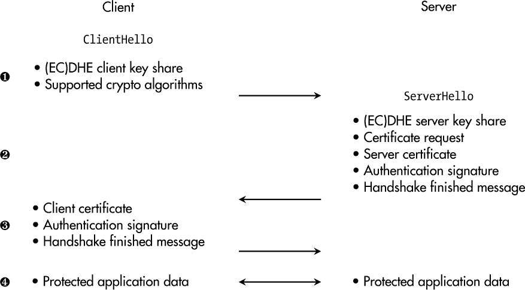
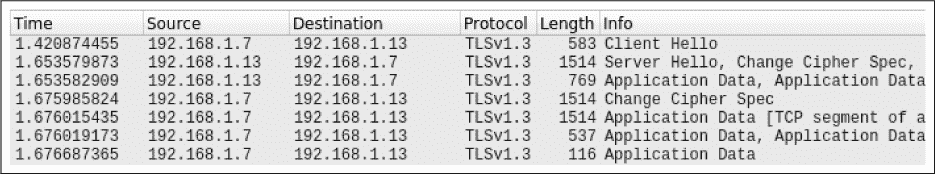
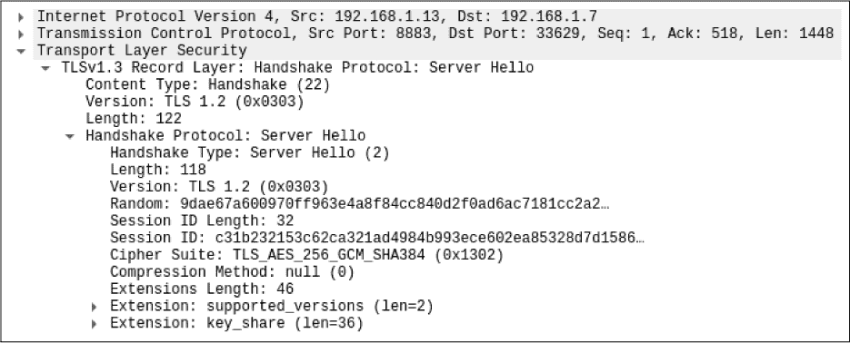

## 第七章：**安全通信**


过去，许多嵌入式系统工作在*隔离网络*环境中，既不连接有线网络，也不连接无线网络。尽管这种做法在某些行业中仍然存在，但它正在慢慢消失，原因很简单，现代的一些理念，如预测性维护、数据驱动优化和远程访问，若没有适当的通信渠道，是无法实现的。

甚至在凯撒时代，最早的加密方法也旨在保护通信，2000 年后的今天，互联网在没有安全通信的情况下是不可想象的。然而，仍然有相当数量的*设备*在与管理员及其周围其他实体的数据交换中，未使用安全协议。

本章中，我们首先将探讨对稳健通信渠道的要求，接着介绍应对这些挑战的最常见协议，并提供一个相应的实践案例研究。随后，我们将讨论标准解决方案无法解决的两个领域：非 IP 通信和冗余需求。

### **所有保护目标**

交流是人类天性的一部分。我们交换思想，提供帮助，并在团队中合作。每个低声在别人耳边说话的孩子，都隐含地意识到保密的重要性。

对于书面信息，保密性已经是一个讨论了几千年的话题，如凯撒的例子所示，并且它仍然存在于邮政隐私法中。几个世纪以来，君主们使用皇家印章来保证文件的完整性和真实性，而通过活字印刷复制信息显然是为了确保可用性——即使某个“信息源”失败，仍然可以通过其他方式获取相同的“通信数据”。

数字通信在互联网规模上已经实践了大约 30 年，毫不奇怪，它集成了以往通信方法的*所有保护目标*的需求。考虑到(I)IoT 设备通信的特定领域，保密性显然是有用的，因为传输的可能是与知识产权相关的专有数据，或是需要隐私保护的个人数据。

同时，完整性和真实性在许多情况下也是非常重要的——例如，在工业系统中的控制命令。在这些场景中，确保通信的来源是合法方，并且信息在传输过程中没有被篡改，非常重要。如前所述，典型的(I)IoT 设备依赖于正常工作的通信渠道。干扰——例如，DoS 攻击引入的干扰——威胁到系统的正常运行，甚至可能危及相关的商业模式。

### **传输层安全性**

当我们谈论数据通信时，我们通常从*开放系统互联（OSI）模型*中的位置开始。这个模型帮助我们构建通信协议栈，如表 7-1 所示。

**表 7-1：** 根据 OSI 模型的通信层

| **编号** | **层级** | **描述** |
| --- | --- | --- |
| 7 | 应用层 | 特定应用的通信数据处理 |
| 6 | 表示层 | 网络数据与应用之间的转换 |
| 5 | 会话层 | 节点之间通信的会话管理 |
| 4 | 传输层 | 网络节点之间数据传输的管理 |
| 3 | 网络层 | 多参与者网络的管理 |
| 2 | 数据链路层 | 两个实体之间的数据帧传输 |
| 1 | 物理层 | 通过物理介质进行有线/无线传输 |

以太网标准 IEEE 802.3 是一个典型的例子，规定了第 1 层和第 2 层的属性。通常，互联网协议（IP）处理网络层，而传输控制协议（TCP）和用户数据报协议（UDP）覆盖第 4 层和第 5 层的功能。像常见的超文本传输协议（HTTP）这样的应用协议由第 7 层表示。

本节重点介绍一种最常见的安全通信协议：传输层安全协议（TLS）。看似显而易见，它位于 OSI 模型的第 4 层；然而，加密和解密通常归属于第 6 层。由于 TLS 还执行某种会话管理，因此我们可以说它跨越第 4 到第 6 层，从而在网络上分发的原始数据包与最终使用传输数据的应用之间引入了一个保护层。

**注意**

*TLS 与应用无关。它的有效载荷可以携带任何应用协议，如 HTTP 或甚至工业协议，如 Modbus。*

#### ***历史***

在 1990 年代，当 Netscape 开发同名浏览器应用程序时，安全互联网通信的需求变得显而易见。1995 年，Netscape 发布了 TLS 的前身——安全套接层（SSL）协议 2.0 版本。SSL 2.0 和随后发布的 SSL 3.0 版本存在严重的安全问题，绝不应该在实际中使用。

不幸的是，许多软件应用程序和产品营销手册将*SSL*和*TLS*同义使用。通常，您可以假设它是“现代 TLS 版本”，但作为客户，如果制造商不再提及 SSL，我会更有信心，认为其展示了更高的安全技术水平。

新的协议名称在 1999 年随 TLS 1.0（这是 SSL 3.0 的升级版本）推出，可能是为了减少与之前 SSL 版本漏洞的关联。TLS 1.1 在 2006 年修复了基于块加密的 CBC 操作模式中的安全问题。然而，TLS 1.0 和 TLS 1.1 在 2021 年 3 月正式弃用，不应在现代产品中使用。

TLS 1.2 版本于 2008 年 8 月发布，至今仍被广泛使用。它用现代对等算法 SHA-256 替代了 MD5 和 SHA-1 等弱哈希函数，并扩展了对 AES-GCM 等认证加密密码的支持。然而，TLS 1.2 的复杂性反过来成了它的敌人，正确的配置并非易事。为了最小化配置错误，同时最大化安全性和性能，TLS 1.3 于 2018 年发布。每个新设备应默认使用该版本。

#### ***TLS 基础知识***

TLS 是一组客户端-服务器协议，它统一了第二章中引入的许多现代加密原语。这些是实践中最重要的两个子协议：

**握手协议**    在此子协议中，用于保护通信通道的加密算法在客户端和服务器之间进行协商。通常，其中至少一个会经过认证与对方通信，但也可以进行相互认证。此外，握手过程还建立了用于随后的通信中的加密算法的共享密钥材料。此阶段的任何错误或篡改攻击都会导致连接的终止。

**记录协议**    此子协议负责基于在握手协议中协商的算法和参数，组织和保护两个端点之间的大部分流量。

TLS 的另一个通用特性是它使用 X.509 证书进行身份验证。然而，与第六章中提到的设备证书不同，这些证书中的通用名称通常对应于设备的 IP 地址、主机名或完全限定域名（FQDN）。这是因为这些信息用于首先在网络层建立与设备的基本连接，然后设备必须证明它是该网络节点上的合法实体。

永远不要低估 TLS 的复杂性，当没有具体要求更改时，请坚持使用安全的默认设置。以下章节阐明了当前使用的两种 TLS 版本的主要特性。

#### ***TLS 1.3***

TLS 1.3 在 RFC 8446 中进行了规范，它是*产品工程师应当实现和使用的*版本。图 7-1 展示了相互认证的握手过程，例如，这可能是机器对机器通信场景的一部分。



*图 7-1：典型的 TLS 1.3 握手过程，带有相互认证*

在第一步中，客户端通过向服务器发送`ClientHello` ➊消息来发起连接建立。此消息包含客户端的密钥共享，用于 DHE 或 ECDHE 密钥交换方案、其支持的 TLS 版本以及可用的加密算法和参数列表。作为回应，服务器提供其用于预期密钥交换的数据、其证书，以及证明其拥有相应私钥的签名。此外，它还要求客户端进行身份验证，并以`Finished`消息结束握手中的`ServerHello` ➋。

在握手的第三部分，客户端通过发送其证书及证明其身份的签名来满足服务器的证书请求 ➌。在客户端的`Finished`消息之后，双方可以确认对方的身份，并准备安全地交换应用数据 ➍。

##### **进一步的握手选项**

除了如 DHE 和 ECDHE 等保证完美前向保密性但也消耗显著性能的密钥交换方案，TLS 1.3 还提供了*预共享密钥（PSK）*选项，它在早期过程将密钥分发给设备。然而，这不是默认选项，应该仅在特殊情况下并有充分理由时使用。

为了减少执行完整握手的必要性，TLS 1.3 允许在客户端和服务器达成一致的情况下重用来自先前（EC）DHE 握手的预共享密钥（PSK），这意味着可以避免耗费成本的非对称加密操作，从而提高效率。

如果客户端和服务器共享 PSK，TLS 1.3 提供了零往返时间（0-RTT）模式，允许客户端在其第一条消息中发送 PSK 加密的数据，立即启用应用数据通信。然而，这种速度提升是有代价的：无法再保证完美前向保密性，且 0-RTT 消息没有受到早期获取的消息重放保护。

##### **加密算法选择**

与 TLS 1.2 相比，TLS 1.3 显著减少了可使用的加密算法集。这是一个强有力的安全增强，因为它防止了*降级攻击*，这种攻击试图影响加密参数协商，以迫使使用弱算法。在这一清理过程中，*密码套件*，即支持的加密算法集合，被简化为仅包含对称加密算法。

对于对称加密，TLS 1.3 要求实现 `TLS_AES_128_GCM_SHA256` 密码套件，这意味着 AES 必须使用 128 位密钥并在 GCM 模式下运行，同时必须提供 SHA-256 哈希函数，用于作为基于 HMAC 的提取与扩展密钥推导函数（HKDF），这是推导 TLS 密钥所必需的。额外的 `TLS_AES_256_GCM_SHA384` 和 `TLS_CHACHA20_POLY1305_SHA256` 密码套件也应该实现，但不是强制的。基于 CCM 模式的两个密码套件完成了 TLS 1.3 中对称加密的五种可能选择，它们都属于现代 AEAD 算法类。

关于数字签名算法和证书，TLS 1.3 实现必须支持与 SHA-256 结合使用的 RSA PSS 和 PKCS1，也支持基于 NIST 曲线 `secp256r1` 和 SHA-256 的 ECDSA。ECDHE 的强制曲线也是 `secp256r1`，但 RFC 推荐额外实现 X25519。基于有限域群的 DHE 也是可能的。

#### ***TLS 1.2***

尽管 TLS 1.3 是最新版本，但许多设备仍依赖于 RFC 5246 中规定的 TLS 1.2，或者至少支持其使用，以保持与旧版设备的兼容性。然而，这需要采取预防措施以确保安全通信。

##### **TLS 1.2 与 TLS 1.3**

TLS 1.2 和 TLS 1.3 之间的一个正式区别是，1.2 版本的密码套件包括非对称和对称算法及其参数。例如，`TLS_DH_RSA_WITH_AES_256_CBC_SHA384` 密码套件指定使用 DH（没有 *E* 表示 *临时*）进行密钥交换；认证基于 RSA 证书；使用 256 位密钥的 AES 在 CBC 模式下进行负载加密，SHA-384 是用于密钥推导方案的哈希函数。

除了密码套件格式的不同，TLS 1.2 还支持并允许使用更多的加密算法，这在某些情况下可能带来负面影响。除了可以选择基于 RSA 和 DH 的静态密钥交换机制外，甚至可以选择显式允许匿名 DH 密钥交换的密码套件，这意味着不对通信伙伴进行任何验证。

TLS 1.2 还允许选择旧版加密算法，如 3DES 和 Rivest Cipher 4 (RC4)，甚至选择 `NULL` 密码套件，该密码套件不进行负载加密。此外，还可以选择如 CBC 这样的操作模式，这些模式无法提供 AEAD 合规的安全性。

在 TLS 中传输数据前进行压缩的选项出于设计者的良好意图，并在 TLS 1.2 中仍然可用，但它也带来了漏洞，如压缩比信息泄露攻击（CRIME）所示。

除了这些与安全相关的差异外，TLS 1.2 还缺少 TLS 1.3 引入的一些性能优化和 0-RTT 模式。

##### **安全使用**

保证 TLS 1.2 安全配置的关键在于严格限制其选项。您的实施必须禁止使用像 3DES、RC4、弱化的出口密码、CBC 操作模式和（当然）`NULL`密码这样的弃用密码。基于 RSA 密钥传输的密钥交换也必须被拒绝，以及匿名 DH。此外，像数据压缩这样的选项必须被禁用以减少攻击面。

从另一个角度来看，您的配置应仅启用实施 DHE 和 ECDHE 密钥交换以及与 SHA-2 系列哈希函数结合的对称 AEAD 密码套件，这意味着 TLS 1.2 可以被修剪以类似于 TLS 1.3 并提供安全通信通道的方式行事。

#### ***设备和基础设施的要求***

假设您已经决定 TLS 是您设备的选择，并且希望使事情发生，那么在实施半安全通信混乱之前，您仍然需要考虑一些要求。从设备的角度来看，您至少应该分析五个方面：

**私钥存储**    如果您的设备需要通过使用私钥对数据进行签名来进行身份验证，则需要一个安全的地方以保密方式存储该秘密。

**证书存储**    仅当您的设备拥有相应的公钥和根证书时，才能验证通信伙伴的身份。这些文件不包含机密信息，但需要以完整性保护的方式存储，因为它们代表了您设备的信任基础。

**可信的随机数源**    TLS 中的密钥生成和密钥交换方案需要可信的随机数。如果您的设备基于静态值生成“随机数”，这可能会对 TLS 安全造成严重后果。

**可靠的时间基准**    尤其是在工业场景中，但也适用于其他应用领域，设备通常不需要实时时钟。但是，如果您想要使用 TLS，则您的设备必须能够验证证书的有效期，这显然在时间上停留在上世纪 80 年代是不可能的。

**加密性能**    TLS 握手根据非对称加密执行多个操作。低性能设备可能会达到其极限，例如，如果它们必须使用 RSA 密钥进行签名。选择使用 RSA 还是 ECDSA 可能会对此点产生重大影响。如果您的设备被设计为每天进行一次客户端认证，或者作为服务器处理数百个连接和认证请求，那么这也会产生很大的差异。

您的设备本身不仅需要为 TLS 做好准备，您的基础设施和流程也需要支持它。一个常见的例子是操作 PKI 来管理证书的生成、更新和吊销。

此外，您设备中的实时时钟可能依赖于外部时间同步机制，如网络时间协议（NTP）和精密时间协议（PTP），这些机制需要适当的网络服务、主时钟等支持。

#### ***应用示例和软件库***

TLS 的最常见应用场景是超文本传输协议安全（HTTPS），这是互联网上普遍使用的协议。它也被称为*基于 TLS 的 HTTP*，因为本质上就是这样：TLS 在客户端和 Web 服务器之间建立了一个安全通道。在这个通道内，交换的是普通的 HTTP 请求和响应。同样的，许多其他应用协议也可以通过这种方式实现安全通信。

TLS 基于 TCP，但是否有办法保护依赖于 UDP 或其他无状态协议的应用，如 VoIP（语音通信）或在线游戏？是的，您可以使用一种变体，称为*数据报传输层安全性（DTLS）*。DTLS 1.2 和 DTLS 1.3 分别基于 TLS 1.2 和 TLS 1.3，它们保证与其基于 TCP 的对应版本相同的安全性，但能够处理丢包和数据包重排问题。

在 TLS 实现方面，OpenSSL 可能是 Linux 系统以及嵌入式系统领域中最流行的选择。然而，如果源代码透明度或小巧的占用空间对您的产品很重要，Mbed TLS 可能值得一试。此外，还有许多编程语言中的实现可供选择，例如为 Rust 社区提供的 Rustls。

### **案例研究：安全的 MQTT 通信**

在过去的几年里，作为一名教授，我看到许多学生项目使用 MQTT 协议，因为它相当易于理解，且非常适合物联网场景中资源受限设备的需求。它用于传输传感器值，如温度或压力，以及控制消息，如启动和停止命令，用于系统中的执行器。

然而，如果我要求为显然敏感的消息内容提供一个安全的通信通道，通常会收到类似“但这只是一个概念验证！”或“没有时间处理这个复杂的课题。”以及“为什么你总是问这么痛苦的问题？”这样的回答。

在本案例研究中，我将在 STM32MP157F-DK2 开发板上设置 Eclipse Mosquitto MQTT 代理服务，并根据 TLS 配置它以实现安全通信。此外，我将动态测试实现中的配置错误。

#### ***Mosquitto 安装与配置***

因为我的 STM32MP157F-DK2 设备的工具链是基于 Yocto 项目的，所以我可以简单地将`meta-networking`层中的`recipes-connectivity`里的`mosquitto`配方添加到我的镜像中，以便在设备上安装代理软件。我得到的版本是`2.0.14`。当然，这只带有位于*/etc/mosquitto/mosquitto.conf*的默认配置。

在 MQTT 中，代理是一个核心组件，它接收客户端发布的消息和数据，并将这些信息分发给订阅它的客户端。对于客户端来说，至关重要的是仅将数据与合法的代理共享，并且只依赖它们信任的代理发布的消息。因此，MQTT 代理必须通过加密认证来验证连接的客户端。

如前所述，TLS 使用证书进行身份验证，因此代理认证的第一步是生成相应的证书。我使用 Python 和 OpenSSL 以类似于第六章中描述的设备身份的方式，创建了一个 CA 和一个 MQTT 代理证书。一个重要的区别是证书中选择的公共名称：它对应于在我的网络中可以通过*http://mqtt.iot-device-corp.com/*访问的主机名。这对于客户端的主机名验证至关重要，以便它们能够确保连接到正确的主机。

凭借 CA 证书`ca.crt`、代理证书`mqtt_broker.crt`及其对应的私钥`mqtt_broker.key`，我们可以按照列表 7-1 中所示，配置`mosquitto`的基本 TLS 设置。

```
listener 8883
cafile /etc/mosquitto/certs/ca.crt
certfile /etc/mosquitto/certs/mqtt_broker.crt
keyfile /etc/mosquitto/certs/mqtt_broker.key
```

*列表 7-1：mosquitto 的基本 TLS 配置*

虽然普通的 MQTT 通常通过 1883 端口提供，但基于 TLS 的安全通信版本通常通过 8883 端口提供。所需的证书和密钥可以存储在*/etc/mosquitto/certs/*中。例如，至此一切正常。

然而，直到现在，系统仅配置了服务器端认证。客户端认证需要通过在托管代理应用程序的设备上维护一个密码文件来管理（例如，在*/etc/mosquitto/password_file*），这可能会比较繁琐，且相关的安全级别最多只能算中等。但由于 TLS 支持基于证书的双向认证，而 Mosquitto 能够利用这一过程进行应用层的使用，因此值得一探。

列表 7-2 展示了必须添加到*mosquitto.conf*的两个选项。

```
require_certificate true
use_identity_as_username true
```

*列表 7-2：基于证书的 MQTT 客户端认证的重要选项*

第一行使代理请求每个连接的客户端提供用于身份验证的证书，而第二行则启用了将提供的证书中包含的公共名称用作 MQTT 应用程序中的用户名。

需要注意的是，在这种情况下，客户端证书必须由`cafile`参数之前提供的 CA 颁发。如果你想为 Mosquitto 提供多个受信任的 CA，`capath`选项是你的好帮手。在我的案例中，我使用了与 MQTT 代理相同的 CA 来创建一个额外的证书，这次使用了公共名称`mqtt-client123`。

#### ***第一次测试运行***

在使用新配置文件启动`mosquitto`之后，简短的`nmap`扫描表明，MQTT 代理现在可以通过端口 8883 访问，如清单 7-3 所示。

```
$ nmap mqtt.iot-device-corp.com -p 8883
Starting Nmap 7.80 ( https://nmap.org ) at ...
Nmap scan report for mqtt.iot-device-corp.com (192.168.1.13)
Host is up (0.00067s latency).

PORT     STATE SERVICE
8883/tcp open  secure-mqtt

Nmap done: 1 IP address (1 host up) scanned in 0.03 seconds
```

*清单 7-3：显示开放端口 8883 的*nmap*扫描*

为了测试安全通信，我写了一个小的 Python 脚本，使用了 Eclipse Paho MQTT 客户端库。清单 7-4 显示了基本的设置。

```
broker = "mqtt.iot-device-corp.com"
port   = 8883
client = mqtt.Client("mqtt-client123")
client.tls_set('ca.crt', 'mqtt_client.crt', 'mqtt_client.key')
client.connect(broker, port)
```

*清单 7-4：Python 中的基本 Paho MQTT 客户端配置*

除了 MQTT 代理的主机名和端口等明显的必要信息外，客户端还能够处理 TLS 设置，如*ca.crt*中的受信任 CA，以及位于*mqtt_client.crt*和*mqtt_client.key*文件中的客户端认证数据。

在测试应用程序中，客户端订阅主题`foo/bar`，向同一主题发布一些数据，并再次从代理接收信息，如清单 7-5 所示。

```
➊ New connection from 192.168.1.7:46317 on port 8883.
➋ New client connected from 192.168.1.7:46317 as mqtt-client123
       (p2, c1, k60, u'mqtt-client123').
   ...
➌ Received SUBSCRIBE from mqtt-client123
       foo/bar (QoS 0)
   Sending SUBACK to mqtt-client123
➍ Received PUBLISH from mqtt-client123 (d0, q0, r0, m0, 'foo/bar', ... (2 bytes))
   Sending PUBLISH to mqtt-client123 (d0, q0, r0, m0, 'foo/bar', ... (2 bytes))
   ...
   Received DISCONNECT from mqtt-client123
   Client mqtt-client123 disconnected.
```

*清单 7-5：测试期间* mosquitto *控制台输出*

很明显，连接已成功建立在端口 8883 上 ➊。此外，`mosquitto`直接使用客户端证书的通用名称（`mqtt-client123`）作为此连接的相关用户名 ➋。两个客户端命令，`SUBSCRIBE` ➌和`PUBLISH` ➍，也都正确地在代理端接收到并处理。

#### ***使用 Wireshark 和 SSLyze 进行通信安全分析***

尽管我们已经启用了多个 TLS 安全特性，但应用程序似乎仍然运行正常。这让人有希望，但作为安全工程师，我们更倾向于通过深入分析而非直觉来建立信任。

进行此类分析的工具之一是 Wireshark。它允许我们捕获网络通信流量并分析其安全性。我首先将其配置为收集测试站和 STM32MP157F 设备之间交换的所有数据。然后，我过滤了 TLS 数据包。图 7-2 显示了结果的片段。



*图 7-2：MQTT 通信中交换的 TLS 消息*

你可以看到，TLS 握手过程，包括其特征性的`ClientHello`和`ServerHello`消息，已经发生。之后，加密的`Application Data`数据包在客户端和代理之间传输。

如图 7-3 所示，Wireshark 还提供了 TLS 协商的详细信息——即选择了`TLS_AES_256_GCM_SHA384`密码套件用于大数据传输。这也告诉我们使用的是 TLS 1.3，因为该密码套件属于最新的 TLS 版本。



*图 7-3：TLS 握手的详细信息*

**警告**

*在分析网络流量中的 TLS 版本时要小心。遗留的* Version *字段显示它是* TLS 1.2*，但实际上并非如此。*

到目前为止，功能和安全措施似乎按预期工作。让我们再使用一个工具来最终确认我们对这项工作的信心。SSLyze Python 应用程序能够测试各种 TLS 服务器，检查一系列的陷阱和配置错误，如果这些问题被忽视，将会降低产品的安全性。

要启动 TLS 扫描，只需输入主机名和相应的端口：sslyze mqtt.iot-device-corp.com:8883。

综合结果揭示了一些有趣的细节。列表 7-6 中展示的摘录涉及证书验证。

```
...
 Certificate #0 - Trust
➊ Hostname Validation:         OK - Certificate matches server hostname
➋ Android CA Store (...):      FAILED - Certificate is NOT Trusted ...
   Apple CA Store (...):       FAILED - Certificate is NOT Trusted ...
   Java CA Store (...):        FAILED - Certificate is NOT Trusted ...
   Mozilla CA Store (...):     FAILED - Certificate is NOT Trusted ...
   Windows CA Store (...):     FAILED - Certificate is NOT Trusted ...
...
```

*列表 7-6：* sslyze *关于证书验证的控制台输出*

好消息是，我正确创建了证书，这意味着我将设备的正确服务器名称作为证书中的通用名称 ➊。然而，也有许多 `FAILED` 条目 ➋。之所以出现这种情况，是因为我的证书并不属于 Android、Windows、Mozilla 等常见证书存储库的一部分，这本来不是计划中的事情，但如果你希望证书具有广泛的信任兼容性，那么这个测试对你来说可能很重要。

结果的主要部分是关于服务器接受的加密套件和 TLS 版本的。列表 7-7 中的结果表明，已弃用的 TLS 版本及其相应的加密套件都被实现的 MQTT 代理如预期地拒绝。`mosquitto`的默认设置似乎已经禁止了这些旧协议和加密算法的使用。

```
...
 * SSL 2.0 Cipher Suites:
     Attempted to connect using 7 cipher suites; the server rejected all ...
 * SSL 3.0 Cipher Suites:
     Attempted to connect using 80 cipher suites; the server rejected all ...
 * TLS 1.0 Cipher Suites:
     Attempted to connect using 80 cipher suites; the server rejected all ...
 * TLS 1.1 Cipher Suites:
     Attempted to connect using 80 cipher suites; the server rejected all ...
...
```

*列表 7-7：所需拒绝的所有已弃用加密套件*

如列表 7-8 所示，`mosquitto`的默认设置仍然支持 TLS 1.2，这对于向后兼容性是一个好事，因为许多现场的老旧设备不支持 TLS 1.3，但由 `sslyze` 给出的受支持加密套件列表则展示了一些弱点。

```
...
 * TLS 1.2 Cipher Suites:
     Attempted to connect using 156 cipher suites.

     The server accepted the following 20 cipher suites:
        TLS_RSA_WITH_AES_256_GCM_SHA384                256
        TLS_RSA_WITH_AES_256_CBC_SHA256                256
        TLS_RSA_WITH_AES_256_CBC_SHA                   256
        ...
        TLS_ECDHE_RSA_WITH_CHACHA20_POLY1305_SHA256    256  ECDH: X25519
        TLS_ECDHE_RSA_WITH_AES_256_GCM_SHA384          256  ECDH: prime256v1
        TLS_ECDHE_RSA_WITH_AES_256_CBC_SHA384          256  ECDH: prime256v1
        TLS_ECDHE_RSA_WITH_AES_256_CBC_SHA             256  ECDH: prime256v1
        ...
        TLS_DHE_RSA_WITH_CHACHA20_POLY1305_SHA256      256  DH (4096 bits) 
        TLS_DHE_RSA_WITH_AES_256_GCM_SHA384            256  DH (4096 bits) 
        TLS_DHE_RSA_WITH_AES_256_CBC_SHA256            256  DH (4096 bits) 
        TLS_DHE_RSA_WITH_AES_256_CBC_SHA               256  DH (4096 bits) 
        ...
```

*列表 7-8：提供的 TLS 1.2 加密算法*

输出结果显示，目前的实现仍提供一些选项，允许基于 RSA 的密钥交换（`TLS_RSA_WITH_...`）和其他仍使用 CBC 操作模式进行 AES 应用数据加密的选项。这两者都不被 TLS 1.3 支持，也不再推荐使用。

这一见解使我们能够再次调整 *mosquitto.conf* 文件，通过指定 `ciphers` 参数，如列表 7-9 所示。

```
ciphers ECDHE-ECDSA-AES256-GCM-SHA384:ECDHE-RSA-AES256-GCM-SHA384:
        DHE-RSA-AES256-GCM-SHA384:ECDHE-ECDSA-CHACHA20-POLY1305:
        ECDHE-RSA-CHACHA20-POLY1305:DHE-RSA-CHACHA20-POLY1305:
        ECDHE-ECDSA-AES128-GCM-SHA256:ECDHE-RSA-AES128-GCM-SHA256:
        DHE-RSA-AES128-GCM-SHA256
```

*列表 7-9：mosquitto.conf 中 TLS 1.2 加密算法的限制*

这将`mosquitto`的 TLS 1.2 加密算法限制为仅六个现代的 RSA 认证选项和三个 ECDSA 证书选项，这意味着目前的 MQTT 通信安全性进一步提升。

**注意**

*Mosquitto 依赖 OpenSSL 来实现安全的 TLS 通信。输入* openssl ciphers *以列出 OpenSSL 在特定系统上提供的所有加密套件。*

关于 TLS 1.3，推荐的加密套件得到了正确的支持，如列表 7-10 所示。

```
...
 * TLS 1.3 Cipher Suites:
     Attempted to connect using 5 cipher suites.

     The server accepted the following 3 cipher suites:
        TLS_CHACHA20_POLY1305_SHA256                   256  ECDH: X25519
        TLS_AES_256_GCM_SHA384                         256  ECDH: X25519
        TLS_AES_128_GCM_SHA256                         128  ECDH: X25519
```

*清单 7-10：TLS 1.3 支持按预期可用*

这是未来设备通信的基础。

### **没有 TLS 的安全通信**

如本章多次提到的那样，如果你的设备需要进行安全通信，TLS 应该是默认的解决方案。然而，并非所有应用场景和通信技术都允许使用 TLS。

例如，像传感器或网状网络这样的专用无线通信可能依赖于不包含 TCP/IP 栈的专有协议。此外，一些有线总线架构，如控制器局域网络（CAN）总线，定义了自己的消息格式和数据结构，而不依赖于 TCP/IP 技术，并且可能需要某些实时行为，而 TLS 无法保证这些实时需求。而且，一些电池供电的设备，如用于报警系统、车库门和工业起重机的遥控器，通常使用 433 和 868 MHz 的频率，这些频率位于免许可证的工业、科学和医疗（ISM）无线电频段内，它们优化消息内容和长度以减少能耗，从而使 TLS 握手变得不可能。

然而，得出这些应用程序必须在没有安全措施的情况下运行，因为 TLS 不适用，这种结论是天真的。这个问题仅需要一种不同的开发方法。对于这些情况，通常没有现成的解决方案，但必须开发定制的、特定应用的安全协议。当然，拥有丰富的密码学、协议设计和此类系统验证经验将非常有帮助，但实际上，情况往往并非如此。

一种务实的方法是将 TLS 1.3 及其使用的密码学原语视为自助服务商店。如果你需要特定的保护措施（例如，保护遥控器发送的命令的真实性和完整性），基于 RSA 或 ECDSA 的数字签名将是可靠的解决方案。你是否决定像 TLS 那样使用证书，还是自己管理原始公钥，取决于你的需求和可能性。

此外，如果你的 CAN 总线流量包含机密消息，并且完整性也是你的需求之一，AES-GCM 或 ChaCha20-Poly1305 可能是合适的候选算法。如果你的场景允许管理和分发预共享密钥，你可以避免昂贵的密钥交换算法。如果不行，那么像 TLS 1.3 使用的 DHE 或 ECDHE 可能是你选择的算法。

听起来这似乎有些肤浅，某种程度上确实如此，因为在实现特定方案的过程中，你需要澄清数百个细节。然而，这些信息为你指明了前进的方向。

### **安全通信中的冗余**

如果你已经读到这里，你已经了解了许多关于如何通过使用 TLS 及其神奇的加密特性来保护消息的机密性和完整性，以及通信伙伴的真实性。然而，在本章开头，我提到过通信要求所有保护目标，包括可用性。但明确来说：TLS 和一般的加密技术*无法保护可用性*。

当然，在某些应用场景中，传输数据的可用性至关重要——例如，在技术安全措施保护人类免受事故和伤害的领域，也包括那些系统中，停机时间会导致显著的财务损失，如生产或运输领域。在这些应用中，如果消息丢失，设备或整个系统的正常功能就会受到威胁。这些威胁必须通过*逻辑或物理冗余*来处理。

从逻辑层面处理这个问题意味着多次发送消息或添加由错误检测代码（如 CRC 校验和）生成的冗余数据，或像汉明码这样的纠错算法。这对于在嘈杂或不可靠的信道上传输数据，以及处理由电磁干扰或宇宙辐射等引起的干扰事件非常有用。然而，这些措施并不能提供足够的保护，以防止故意破坏和持续中断物理通信线路。

在这种情况下，唯一能保持韧性的方法就是实施多个物理通信通道。一个常见的例子是*环形拓扑*，它在许多工业基础设施中用于将设备连接成一个环状结构。然而，这种配置要求设备必须具有两个网络接口，左侧和右侧，并且消息必须始终双向发送，并能在两个不同的接口上接收。

这需要在每个设备上进行工程和组件工作，整个系统的安装成本也变得更高。此外，通信延迟取决于环中的设备数量，并且带宽需要在所有网络参与者之间共享。然而，这种物理冗余对于损坏的消息、断裂或被切断的电缆，甚至在系统运行期间更换设备，都是非常坚固的。国际标准 IEC 62439 描述了实现工业网络高可用性的几种方法，例如，基于环形或网状拓扑结构。

### **总结**

物联网及其工业对应物如果没有安全的通信，是无法实现的。现代通信通道需要满足从保密性、完整性、真实性，甚至可用性等各种保护目标。除了必要的密码学能力，设备还需要支持如 TLS 1.3 等先进的协议，以实现高安全级别。在一些应用场景中，当消息丢失至关重要且需要冗余物理通信介质时，设备甚至需要提供多个通信接口。

本章的案例研究展示了一个基于 TLS 通信的 MQTT 代理实现示例，并给出了必要的配置参数。它表明，对最终结果进行彻底的安全分析有助于发现服务中的配置错误和弱加密套件。

虽然 TLS 是最常见和最流行的安全协议，但还有许多其他协议是为特定应用设计的。例如，Internet 协议安全（IPsec）可用于在 OSI 第 3 层建立虚拟专用网络（VPN），而 SSH 协议则使管理员能够远程访问设备。在 OSI 第 2 层，时间敏感网络（TSN）的概念负责在共享物理介质上进行通信通道的分隔，而 IEEE 802.1AE（也称为*MACsec*）则致力于保护通信安全。

即使你没有找到完全符合需求的协议，现代安全协议的融合也绝对可以为解决你的具体挑战提供灵感。
