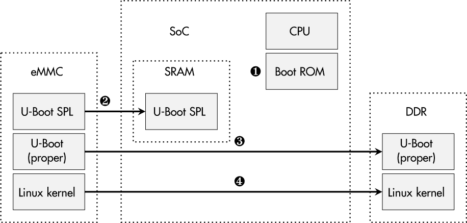
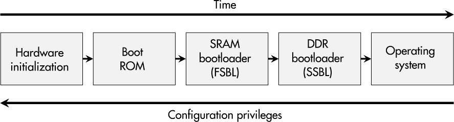
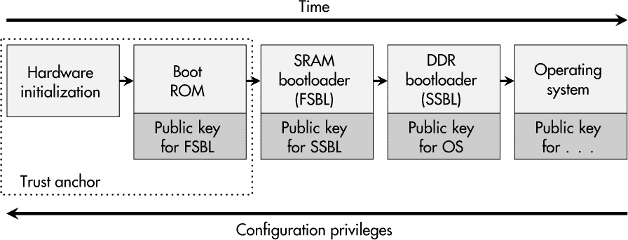
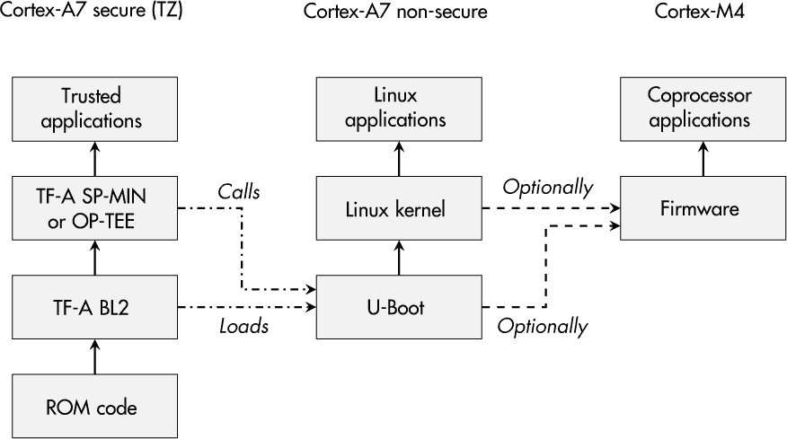
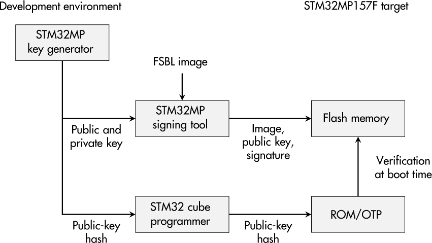

## 第八章：**安全启动与系统完整性**


在嵌入式系统的启动过程中，基本硬件的初始化以及操作系统的启动都在进行。这些步骤中的许多涉及存储在闪存中的固件，因为这样可以让设备工程师进行更新。然而，这种可替换性是有代价的：攻击者可以篡改这些数据以谋取自己的利益。

在本章中，我将解释启动过程的复杂性和各种保护概念。在介绍经典的安全启动链概念后，我将讨论实际问题，如安全启动过程对开发和生产过程的影响。像往常一样，理论和实践并不完全相同，因此我将包括一个关于在 STM32MP157F 平台上实现安全启动的案例研究。

基于启动过程的完整性，您可能会想知道设备的完整性是否可以进一步加强，因此本章还描述了如何为文件系统等实现完整性保护。最后，我将介绍一种低成本的固件完整性解决方案，适用于不依赖外部闪存和复杂启动过程的微控制器系统。

### **系统启动复杂性**

许多现代嵌入式系统的微芯片包含多种子模块，因此被称为*系统芯片（SoC）*。除了多个 CPU 核心的可用性外，GPU、实时核心以及类似的支持协处理器也增加了系统的复杂性。此外，包含 FPGA 的 SoC 也越来越受欢迎，并在方程中加入了比特流处理。

此外，一些 SoC 提供*受信执行环境（TEE）*，用于将关键软件的执行从普通固件中逻辑或物理地分离—在一个专用处理单元上。在基于 ARM 的 SoC 中，您会遇到*ARM TrustZone*和*ARM Trusted Firmware*这两个术语，它们代表 ARM 的 TEE。这样的环境初始化通常发生在启动过程中。而且，尽管这些特性旨在提高安全性，但不可否认的是，这些技术也导致了更大的复杂性——可理解性和安全性的天然敌人。

SoC 设备通常还需要在 PCB 上添加其他组件，例如，易失性的双倍数据速率（DDR）内存和非易失性存储器，如嵌入式多媒体卡（eMMC）或类似的闪存。必要的片上控制器及其参数的初始化是现代启动过程中的关键部分。图 8-1 概述了 SoC 启动过程中涉及的典型软件和硬件组件。



*图 8-1：典型 SoC 启动过程的组件*

开机后，启动程序由硬件启动，通过一个启动只读存储器（ROM）➊ 初始化内部结构并加载一个极简的第一阶段引导加载程序（FSBL），例如 U-Boot SPL，该程序被复制到内部 SRAM 内存中➋。这段软件初始化外部 DDR 内存，并将一个完整的第二阶段引导加载程序（SSBL）放置在其中➌。SSBL 能够提供多种便捷功能，如引导介质选择、调试、控制台访问等。随后，操作系统内核（在嵌入式系统中通常是 Linux）被启动 ➍。此时，启动过程“正式”结束，设备进入其运行状态。

图 8-2 显示了按时间顺序启动所需的步骤。



*图 8-2：典型启动过程的步骤*

这里有一个基本属性需要强调：启动过程中后续的各个阶段始终“信任”其前置阶段。这意味着，例如，在没有外部监控措施的情况下，操作系统无法辨别恶意引导加载程序和原始引导加载程序的区别；它只依赖于每个配置设置及传递给它的参数。因此，最佳的启动过程保护必须从一开始就着手：在硬件层面。

### **启动保护概念**

从客户或设备用户的角度来看，完整性通常是设备固件和软件的期望保护目标。一种相关的风险情景是，网络犯罪分子试图将恶意软件永久植入固件中，以便在系统重启后依然能够存活——例如，启用持久的后门访问。此外，如果在启动时运行验证程序，低级配置参数和操作系统设置的篡改也将变得不可能。即使是情报部门所报道的在交付过程中修改设备软件的攻击，如果实施了可靠的完整性保护，也会导致产品无法正常工作。

IEC 62443（第 4-2 部分）的作者似乎也考虑到了这些情景。安全级别（SL）1 或更高的嵌入式设备要求（EDR）3.14 旨在确保启动过程的完整性。它要求设备必须能够在执行固件、软件和配置数据之前，对其启动和运行过程中的固件、软件和配置数据进行完整性验证。从 SL 2 开始，标准甚至要求对所有可更换的引导过程部分进行真实性验证。

设备制造商通常一致认同固件和软件的完整性和真实性的重要性，因为这还可以防止攻击者安装自定义软件进行逆向工程。然而，他们还需要考虑另一个风险：知识产权的丧失。即使在早期启动阶段，这些技术诀窍也可能以软件的形式存在，比如优化算法、专有协议和机密信息。因此，在某些情况下，供应商希望加密启动过程中的所有固件、软件和配置数据，以保护其机密性。

这个过程中第三方利益相关者是芯片制造行业，它提供了许多由相关营销术语宣传的保护措施。以下列表提供了典型关键词的概述，但当然，它可能无法涵盖所有未来的营销创意：

**安全启动**    这个通用术语是“经典”且最流行的术语。它通常指的是在整个启动过程中逐步验证软件组件的完整性和真实性。从加密的角度来看，验证是基于数字签名和 RSA 或 ECDSA 等非对称算法。当签名验证失败时，启动过程会停止。其详细信息在第 145 页的《经典安全启动链》中解释。

**验证启动**    与安全启动类似，这个术语强调启动链中软件部分的加密验证。英特尔将这个术语作为其 Boot Guard 技术的一部分，谷歌则在 Android 和 Chrome OS 中使用该术语。

**高保障启动**    NXP 使用这个标签来突出 i.MX 设备的启动过程保护。除了其他保护措施外，这种方法还使用数字签名来验证完整性和真实性，正如安全启动所描述的那样。

**认证启动**    这个术语可能看起来像是指固件和其他软件组件的认证。然而，受信计算组（TCG）使用这个术语来描述一种启动过程，允许报告“平台启动方式的准确记录。”这意味着在启动过程中，软件的各个部分被哈希并写入 TPM。如果要执行经过篡改的软件，启动过程不会被中断，但之后的状态，无论是原始的还是已更改的，可以报告给外部方，或由 TPM 用于授予或拒绝访问存储的机密信息。

**测量启动**    微软在基于 TPM 的启动保护中使用这个术语，其中软件在启动过程中被*测量*或哈希。它类似于 TCG 的认证启动。

**受信启动**    这个术语有时与 TPM 保护的启动过程密切相关。然而，微软也用它来描述 Windows 内核和操作系统组件的验证。

**加密启动**与所有其他列出的启动保护形式不同，这一概念旨在实现保密性。在这种情况下，固件和相关软件是以加密的方式存储的，通常基于对称加密算法。解密在启动过程中实时发生，通常由硬件支持。

**警告**

*当涉及到启动过程保护的营销术语时，要小心。它们可能会误导人，并且有时只实现了你所期望的部分内容！*

### **经典安全启动链**

对于嵌入式设备，最重要的启动过程保护变种是经典的安全启动链，其中每个参与启动过程的组件在交给下一步执行之前都会验证下一个组件。因此，启动过程中的所有软件部分的完整性和真实性可以得到保障，这是许多利益相关者所期望的要求。

图 8-3 显示了从硬件上电到操作系统运行时的线性安全启动过程。



*图 8-3：经典安全启动过程的步骤*

与图 8-2 相比，请注意每个阶段都有一组额外的密钥。这些是基于非对称加密（如 RSA 或 ECDSA）的公钥，这意味着它们不包含任何秘密，但对于验证随后的启动阶段的签名是必要的。例如，DDR 启动加载程序必须携带与下一启动步骤中执行的操作系统内核签名相关的公钥。

虽然这些密钥不要求保持机密，但它们有一个非常重要的保护目标需要实现：完整性。原因很简单。如果攻击者能够替换公钥，那么可以存储一个自生成的公钥。通过更改验证密钥，就可以正确验证伪造的、自生成的、被篡改的软件签名，这会破坏安全启动链。

图 8-4 显示了涉及的公钥是如何存储在 SoC 内部的各个位置的。最显而易见的是，其中一些通常存储在闪存中，这很容易被攻击者篡改。


*图 8-4：参与安全启动过程的 SoC 组件*

处理这个问题的“窍门”是，安全启动链的完整性可以简化为第一个验证密钥的完整性。如果这个初始密钥存储在闪存中，那么只有当攻击者无法篡改此内存内容时，安全启动过程的保障才能成立。

支持安全启动的微芯片通常提供 OTP 存储器，将第一个公钥或其哈希值物理地烧录到设备中。然后，在启动 ROM 执行过程中 ➊ 使用该密钥来验证 FSBL。用于 SSBL 验证的密钥包含在 FSBL 中 ➋，而 SSBL 则携带公钥来验证操作系统内核 ➌，从而实现整个启动链的完整性目标。通过将进一步的公钥集成到操作系统内核中，验证链甚至可能扩展到内核模块或应用软件 ➍。

**注意**

*请记住，只有从 SoC 中的 ROM 开始的安全启动链，才能提供对启动软件篡改的强大保护，因为所有保护保证都可以追溯到启动链的开始。*

### **实施安全启动的注意事项**

不幸的是，安全启动的实现并不像在配置菜单中激活单个选项那样简单，这也可能是为什么嵌入式系统上的安全启动在市场上仍然不常见的原因。然而，以下细节并非为了让开发者退缩，而是作为一份任务清单，帮助你在决定实施安全启动时牢记。

#### ***硬件和软件要求***

首先，重要的是要理解，完整的安全启动链要求链中的每个部分都支持基于非对称加密的签名验证。当然，这也包括运行所有软件的微控制器。如果在购买芯片时没有要求安全启动，事后集成可能就不再可行。

确保在设备架构讨论中将安全启动作为一项要求。如果核心微芯片不支持安全启动，你将被迫将安全启动功能推迟到下一代设备。

此外，如果软件组件不支持签名验证（例如某些引导程序可能不支持），且你无法自己集成该功能，你将需要开始可能繁琐的寻找和实现适当替代方案的过程。

在启动过程的最后一步，验证操作系统内核作为最终步骤可能已经足够。然而，举例来说，在 Linux 中，你可能还希望验证内核模块的完整性和真实性，或者甚至将验证过程扩展到文件系统和应用程序，正如在第 154 页的《启动过程之外的完整性保护》中所讨论的那样。

即使所有软件已经支持数字签名验证，实现安全启动仍然需要进行若干更改，从硬件初始化到引导程序设置，甚至可能涉及操作系统内核配置。

#### ***开发过程***

在开发方面，必须建立签名生成过程（例如，在 CI 管道中）。根据设备中使用的硬件和软件，可能需要集成特定厂商的工具，例如用于签名和最终镜像生成的工具。如果运气好，使用 `openssl` 命令行工具就足够了。

**警告**

*镜像签名过程对于安全启动实现至关重要。然而，它涉及到私钥，这些私钥需要强有力的保密保护。如果这些密钥被泄露，设备软件的真实性和完整性将无法得到保证。*

在开发由安全启动保护的设备时，一个常见的障碍是如何处理测试镜像和设备。存在多种方法，每种方法在特定情况下都有效。一方面，您可能希望在完全开放的设备上进行早期测试，而不受安全启动限制。然而，这样您将无法发现与安全启动相关的问题。另一方面，您可能希望在测试设备上使用一个或多个测试签名密钥，只认证用于测试的镜像。然而，这样做可能会有风险，可能会不小心将测试设备锁定，导致错误的配置或密钥，将设备变成“电子砖”。

无论如何，在使用不同的密钥对进行测试和生产使用时要小心。如果它们混淆，测试镜像（可能带有额外工具或更少的限制）可能会正确验证，并能在现场设备上运行。

#### ***生产和生命周期***

另一个与安全启动实现相关的领域是设备的生产。由于配置数据和密钥必须烧录到 OTP 存储器中，因此生产过程必须进行调整，以支持安全启动。对安全启动的生产测试也是一个合理的扩展。想象一下，如果之前所有的步骤都经过仔细和努力地执行，但设备在生产过程中以不正确激活的安全启动流程离开，且这个流程在现场很容易被绕过。那么，最好的情况可能是对所有安全工程师来说，这是一次激励上的灾难，可能更糟。

就像任务本身已经足够复杂一样，安全启动实现也是攻击者和研究人员的一个诱人目标。因此，签名密钥可能会在您的开发基础设施中被泄露，或者硬件或固件中影响启动过程安全性的漏洞可能会被外部方发现。这两种情况都要求必须用更新的固件版本替换固件的一部分，可能还包括重新生成的公钥验证密钥。正如第九章中所描述的，安全更新功能以及一个稳健的密钥和固件管理过程，对于专业地处理这些情况至关重要。

**注意**

*实现安全启动需要开发人员、IT 环境管理员和生产工程师的共同努力。确保设备安全被视为所有相关人员的共同目标。*

### **开源许可证与安全启动**

钉住特定软件版本与硬件绑定对设备制造商来说非常有价值，但这场博弈还有另一方参与：自由和开源软件社区。

在 2000 年左右，一家名为 TiVo 的公司开发了一种数字视频录像机（DVR），该设备阻止用户执行修改版软件。TiVo 不仅是安全启动的先驱，还吸引了理查德·斯托尔曼和自由软件基金会（FSF）的关注。该 DVR 设备运行的软件下载自 GNU 通用公共许可证版本 2（GPLv2），就像 Linux 一样，旨在使用户能够运行自己定制的软件。从那时起，*TiVo 化*这一术语被用来描述限制或禁止设备上执行自定义开源软件的机制。

在这场冲突之后，FSF 开发了 GPLv3，这是一种将 GPLv2 中隐含的声明变为明确的许可证：

本节所传达的相应源代码必须附带安装信息。[... ] 安装信息 [... ] 指的是任何安装和执行修改版所需的方法，[... ] 授权密钥，[... ] 等。

尽管 Linux 内核和流行的嵌入式系统引导程序 U-Boot 是基于 GPLv2 许可证的，但像 GNU 大统一引导程序（GRUB）这样的其他软件是基于 GPLv3 许可证的，这在安全启动场景中可能引发法律冲突。

在将产品推向市场之前，明确开源软件许可证与安全启动保护的对立目标是非常必要的，这能帮助你避免不少麻烦。

这似乎不值得深思，但在某些情况下，开发者会寻求一种既能保护启动过程又能安装修改版软件的解决方案。实现这种妥协的一种方式是在启动过程中实现一个解锁功能。该功能允许停用安全启动验证，从而启用自定义（启动）软件的执行，但同时，设备必须确保所有敏感数据，如解密密钥、身份验证器和专有知识，都会从内存中清除。这种方法已经被多家 Android 手机厂商采用。

### **案例研究：STM32MP157F 设备的安全启动过程**

本节中，我将探讨 STM32MP157F 设备及其相应软件包的具体启动过程保护措施。然而，请记住，这只是一个广泛的概述，并非逐步教程。全面的安全启动实现需要大量的工作和细致的调试。

#### ***启动过程***

手头的微控制器展示了一个常见的启动过程复杂性，如图 8-5 所示。



*图 8-5：STM32MP157F 设备的启动链*

在上电后，ROM 代码执行平台的基本初始化，将 FSBL 加载到内部 RAM，并将执行权交给 FSBL。在这种情况下，FSBL 是 ARM 提供的受信固件 A（TF-A）中的引导加载程序阶段 2（BL2）部分。在简单的设置中，这个 BL2 初始化设备的 DDR 内存，将 SSBL 加载到其中，并执行 SSBL。然而，如果需要使用 ARM TrustZone，FSBL 不仅会加载 SSBL，还会加载安全世界的运行时软件，然后跳转到 SSBL。

默认情况下，STM32MP157F 平台使用流行的嵌入式系统引导加载程序 U-Boot 作为 SSBL。U-Boot 具有多种功能，常用于引导嵌入式 Linux 内核。接下来，Linux 接管控制，启动其内核模块、服务和用户空间应用程序，并完成启动过程。

STM32MP157F 设备的另一个特点，也是其他微控制器产品和厂商日益常见的特性，是提供协处理器。在这里，集成了一个额外的 ARM Cortex-M4 微控制器，配有专用 RAM，以支持实时任务的强健执行，如第十章中所讨论的那样。将固件加载到这个附加控制器可能也是启动过程的一部分。这可以通过像 U-Boot 这样的 SSBL 直接发起，也可以在运行中的 Linux 操作系统后加载。 

许多开发者会停在这里，按描述使用该平台，并且如果启动过程“正常工作”就会感到满意。然而，直到现在，还没有考虑到任何固件部分被修改的保护。

#### ***安全启动从硬件开始***

强大的安全启动概念必须从硬件开始。因此，ROM 代码需要提供一个验证程序，用于认证 FSBL 镜像。幸运的是，STM32MP157F 设备具备为此目的而集成的功能。图 8-6 展示了相关的密钥生成、签名和认证过程概述。



*图 8-6：STM32MP157F 设备的固件签名和供应过程*

手头的芯片利用 ECDSA 算法来实现固件镜像的完整性和真实性。与 RSA 相比，这可以实现更快的签名和更短的密钥，但在启动时的验证可能会稍微花费更多时间。在开发者一方，ECC 密钥对必须通过 STM32MP 密钥生成工具生成，结果会得到一个私钥、一个对应的公钥和公钥的 SHA-256 哈希值。后者非常有用，因为它比存储完整的公钥占用的 OTP 内存少。

为了准备设备进行安全启动，必须将公钥哈希烧录到其熔丝存储器中。这可以通过多种方式实现。你可以使用 ST 提供的 STM32 Cube Programmer 或 U-Boot 的`stm32key`命令。此外，安全密钥配置（SSP）功能可能对你有帮助，因为它在编程器和 STM32MP157F 设备之间建立了一个受保护的通道，尤其在安全生产环境中非常有用。

**注意**

*在将公钥哈希写入 STM32MP157F 的 OTP 存储器后，该设备可以被锁定。生产过程中这是强制要求的，但在开发阶段应谨慎考虑。*

在设备中完成密钥配置后，镜像需要准备好进行认证执行。同样，提供了特定的软件 STM32MP 签名工具，该工具处理预生成的 ECDSA 私钥和 FSBL 镜像的 SHA-256 哈希，以获得该固件部分的相应数字签名。生成的镜像还包含 ECDSA 公钥，并可以放置在设备的非易失性存储器中。

启动时，ROM 代码会验证所提供的 FSBL 镜像的完整性和真实性。首先，通过将提供的公钥的哈希与 OTP 存储器中存储的哈希进行比较，验证公钥的有效性。如果正确，公钥将用于验证存储的签名和所提供镜像的哈希。如果验证成功，则执行 FSBL 负载，并在控制台输出`NOTICE: Bootrom authentication succeeded`。在其他任何情况下，启动过程将停止。

#### ***基于 BL2 TF-A 的安全启动***

对于 FSBL，STM32MP157F 设备依赖于 ARM 的 BL2 TF-A，它也提供了安全启动支持。然而，默认情况下该功能是禁用的，必须通过设置`TRUSTED_BOARD_BOOT=1`构建标志来激活。之后，通过 BL2 加载的二进制文件会根据非对称加密技术验证其完整性和真实性。

BL2 TF-A 需要一个固件镜像包（FIP），该包可以通过`fiptool`应用程序生成。它包含所有需要加载和执行的二进制文件以及验证这些二进制文件所需的加密数据。这些二进制文件包括例如在 ARM TrustZone 中运行的 SSBL 和 TEE 实现，如 OP-TEE。TEE 被标记为 BL32，而 SSBL 在 TF-A 的分类中被称为 BL33。

再次，第一步是生成密钥对（在本例中是 X.509 证书），这些密钥可用于签署和验证固件部分。为此，ST 提供了`cert_create`工具。

TF-A 要求所有证书都必须是信任链（CoT）的一部分。默认情况下，存储在 STM32MP157F 的 OTP 存储器中的公钥作为根密钥，因此对应的私钥是`cert_create`工具的强制输入。

在所有二进制文件和相应的证书最终确定后，可以生成 FIP，并将结果部署到设备上。在启动过程中，BL2 TF-A 将使用 Mbed TLS 进行证书解析，并使用 STM32MP Crypto 库进行签名验证，以便使用硬件哈希模块。

二进制加载和执行的顺序如下。首先，BL2 将 BL32（OP-TEE）加载到内存并验证其签名。随后，BL33（U-Boot）也会进行相同的操作。仅在验证成功后，才开始执行 BL32，BL32 完成后将调用 BL33。

#### ***U-Boot 的安全启动功能***

在 ROM 代码和 BL2 TF-A 之后，设备安全启动中的第三个实现涉及 U-Boot 的镜像认证过程。2013 年，通过引入基于 RSA 的签名验证，用于扁平化镜像树（FIT）镜像，为 U-Boot 的安全启动支持奠定了基础。

为了激活这些功能，还必须启用几个配置选项——例如，RSA 加密功能（`CONFIG_RSA`）、FIT 支持（`CONFIG_FIT`）以及 FIT 镜像中的签名处理（`CONFIG_FIT_SIGNATURE`）。

再次强调，密钥生成是一个基本步骤。然而，由于 U-Boot 是一个开源项目，密钥生成也可以使用开源工具，如`openssl`命令行工具。在撰写本文时，U-Boot 支持基于 RSA-2048、RSA-3072、RSA-4096 和 ECDSA（使用 256 位曲线）的数字签名。

列表 8-1 展示了生成典型 2048 位 RSA 密钥和相应 X.509 证书的两个命令。两者都需要在后续的签名和镜像生成过程中使用。

```
$ openssl genrsa -out keys/dev.key 2048
$ openssl req -batch -new -x509 -key keys/dev.key -out keys/dev.crt
```

*列表 8-1：U-Boot 镜像验证的密钥生成*

要生成一个正确签名的 FIT 镜像，必须创建一个图像树源（ITS）文件。列表 8-2 展示了一个示例。

```
/dts-v1/;
/ {
    description = "U-Boot fitImage for stm32mp157f";
    #address-cells = <1>;
 images {
        kernel {
            description = "Linux kernel";
         ➊  data = /incbin/("zImage");
            type = "kernel";
            arch = "arm";
            os = "linux";
            compression = "none";
            load = <0xC0008000>;
            entry = <0xC0008000>;
            hash-1 {
                algo = "sha256";
            };
        };
        fdt-dk2 {
            description = "FDT dk2";
         ➋  data = /incbin/("stm32mp157f-dk2.dtb");
            type = "flat_dt";
            arch = "arm";
            compression = "none";
            hash-1 {
             ➌ algo = "sha256";
            };
        };
    };

  ➍ configurations {
        default = "dk2";
        dk2 {
            description = "dk2";
            kernel = "kernel";
            fdt = "fdt-dk2";
            signature-1 {
              ➎ algo = "sha256,rsa2048";
              ➏ key-name-hint = "dev";
                 sign-images = "fdt", "kernel";
            };
        };
    };
};
```

*列表 8-2：FIT 镜像源示例*

这个 FIT 镜像源示例假设 Linux 内核作为`zImage` ➊ 可用，并且其设备树二进制文件（DTB）对于 STM32MP157F-DK2 开发板存储为*stm32mp157f-dk2.dtb* ➋。两者都通过 SHA-256 ➌ 哈希处理，但 U-Boot 还支持 SHA-384 和 SHA-512。

请注意，内核和 DTB 仅在 ITS 文件的`configurations`部分 ➍ 中合并。这有效地防止了混合攻击，这种攻击试图启动并滥用不合适的内核和 DTB 组合。使用由密钥*dev.key* ➏ 生成的 RSA-2048 签名 ➎ 来验证包含特定内核和特定 DTB 的配置，只允许执行这种明确的组合。

使用`mkimage`工具处理 ITS 文件后，最后一个固件部分将被签名，并准备好存储到 STM32MP157F 设备的内存卡中。在 U-Boot 的启动过程中，验证成功时，你将在串口控制台输出中看到类似列表 8-3 所示的消息。

```
## Loading kernel from FIT Image at c2000000 ...
   Using 'dk2' configuration
   Verifying Hash Integrity ... sha256,rsa2048:dev+ OK
```

*列表 8-3：U-Boot 成功的内核和 DTB 验证*

随后，执行经过验证的 Linux 内核就是你辛勤工作后的值得回报。

即使整个验证链到目前为止“有效”，你仍然有两个重要的任务要完成：

**进行全面测试**    确保每次固件部分的修改都能被检测到，并且启动过程会相应地停止。很可能，由于疏忽，创建的映像的某个小部分未被相应的签名保护，这可能会为篡改提供机会。

**检查硬件已知漏洞**    启动过程相关的硬件组件的漏洞可能会破坏整个验证链的安全性。例如，CVE-2017-7932 和 CVE-2017-7936 描述了这种硬件问题，在生产后无法修复。

### **启动过程之外的完整性保护**

经典的安全启动链通常在操作系统接管控制的地方终止。然而，设备架构师可能会有充分理由希望将完整性和真实性保护延伸到此阶段之后。

#### ***内核模块验证***

可加载的 Linux 内核模块提供了一种模块化和动态的方式来扩展内核功能。然而，修改这样的可加载模块为攻击者通过内核权限执行恶意代码打开了大门。因此，在加载过程中验证这些模块的完整性和真实性是很有必要的。

Linux 内核已经支持这个安全功能。在此，基于 RSA 的内核模块签名可以在加载某个内核模块时进行验证，但该功能默认是禁用的。它必须在内核配置的“启用可加载模块支持”部分启用（`CONFIG_MODULE_SIG`）。

默认情况下，内核模块签名验证以*宽容*模式运行：没有签名或相应公钥的模块被标记为污染，但仍然会加载。要强制验证有效的模块签名，必须启用`CONFIG_MODULE_SIG_FORCE`选项。

在模块签名的标准设置下，内核构建过程会自动在编译时使用 OpenSSL 生成签名密钥和相关的 X.509 证书。创建的私钥用于签署已编译的内核模块，之后可能会被丢弃。当然，包含公钥验证的证书必须集成到 Linux 内核中，以便在运行时进行成功的验证。

#### ***文件系统完整性***

作为 Linux 启动过程的一部分，内核通常会挂载一个或多个文件系统。这些文件系统可能包含应用程序二进制文件、配置数据、受信任的证书和公钥，所有这些都可能被对手篡改。像 ext3 和 ext4 这样的标准文件系统包含处理意外数据损坏的机制，但从安全角度来看并不提供完整性保护。

在考虑文件系统数据的完整性保护时，重要的是要区分保护静态数据（例如，在关机状态下）与保护运行时数据不被篡改。

##### **基于 MAC 的文件系统保护**

像 EncFS 和 gocryptfs 这样的堆叠文件系统，在第五章中提到过用于机密性保护的，可以额外提供完整性保护，形式为 HMAC 或认证加密。这些机制主要针对静态数据保护，因为在运行时更改数据是被允许的，当然也是可能的。它们在文件写入时生成加密校验和，并在读取时验证这些校验和。

此外，完整性保护也可以在块设备级别实现。流行的`dm-crypt`加密目标用于 Linux 设备映射器基础设施，可以使用`dm-integrity`（`CONFIG_DM_INTEGRITY`），在写入时生成认证标签，并在读取数据时验证这些标签。同时，`dm-crypt`支持如 AES-GCM 和 ChaCha20-Poly1305 等认证加密算法。然而，如果仅需要完整性保护，`dm-integrity`也可以单独使用。这些措施的目标是保护数据免受攻击者修改非易失性内存中的数据。

##### **只读文件系统**

如果你担心运行时文件系统的修改，还有一个更简单的解决方案。只读文件系统如 CramFS 和 SquashFS 不实现文件的写入访问，这意味着即使系统被攻破，也没有办法在运行时修改磁盘数据。这些文件系统的另一个非安全优势是它们的压缩存储，减少了对非易失性内存的需求。然而，具有离线访问存储介质的攻击者可以随意替换文件系统。

##### **全面的完整性保护**

最后，一个解决方案提供了对离线和运行时攻击的完整性保护：`dm-verity`模块（`CONFIG_DM_VERITY`）。该模块源于 Chrome OS 社区，旨在作为安全启动与文件系统完整性之间的直接扩展。此外，Android 4.4 于 2013 年引入了对它的支持，并且在 2016 年开始严格执行，从 Android 7.0 开始。

从技术角度来看，`dm-verity`使用哈希树，其中每个数据块在给定的块设备中都被哈希化。然后，将一组哈希值继续哈希，直到得到下一级哈希，以此类推，直到剩下一个根哈希值。如果将此根哈希值纳入安全启动验证过程，就可以保证块设备中所有数据的完整性。在运行时，每次访问文件时，哈希树都会被验证，直到根哈希。当然，这导致了一个只读文件系统。这样的卷的初始化过程由`veritysetup`用户空间工具在文件系统镜像创建后提供支持。

### **写保护作为一种低成本解决方案**

对于一些微控制器，尤其是低成本和低性能的变种，安全启动可能无法实现。然而，这并不能成为缺乏固件保护的有效理由。

这些平台的启动过程通常要简单得多，因为它们使用实时操作系统（RTOS）或甚至仅运行裸机软件。此外，它们的软件和数据通常更小，并且往往至少部分存储在*内部*闪存中。但即便如此，完整性和真实性的目标对于保护设备免受恶意修改仍然很重要。

在这种情况下，一个简单但强大的功能是激活内部闪存的写保护。固件被写入设备后，内存会随之“锁定”。同时，调试接口（如联合测试行动组（JTAG））应当被禁用。遵循深度防御原则，在此类固件中实现验证功能是有意义的，这些功能检查锁定位和其他反调试措施是否设置正确。这样，即使写保护机制被绕过——例如通过物理攻击——攻击者仍然需要投入大量的逆向工程工作才能完全破坏固件的完整性保护。

当然，这个内部的、完整性保护的软件可能会实现加密签名验证，并成为验证链的起点，进而将内部保护目标转移到存储在外部内存中的数据上。

### **总结**

处理器硬件及其制造商在嵌入式系统安全启动过程的实现中扮演着重要角色。专有架构、异构多核复杂性以及各种市场营销术语共同构成了设备架构师和开发人员在追求受保护启动过程时必须克服的高障碍。

基本原理很简单：一个不可变的硬件组件验证第一个加载的软件组件的完整性和真实性。如果验证成功，执行控制将交给该软件，之后该软件可能会验证下一个软件组件，以此类推。然而，实际上，如本章的案例研究所示，启动过程的每个阶段都不同，需要特定产品的知识，并且通常需要厂商特定的工具。此外，还必须管理一系列加密密钥，设备生产过程也必须为支持安全启动做好准备。此保护措施对整体设备安全性的显著提升是有代价的。

一个健壮的安全启动实现是进一步安全措施的坚实基础，如内核模块验证、文件系统完整性保护和多种运行时完整性措施。它甚至对逆向工程保护和第五章中描述的安全数据存储方法产生积极影响，因为它可以防止攻击者在你的产品上执行自定义代码，从而探索其内部结构。
