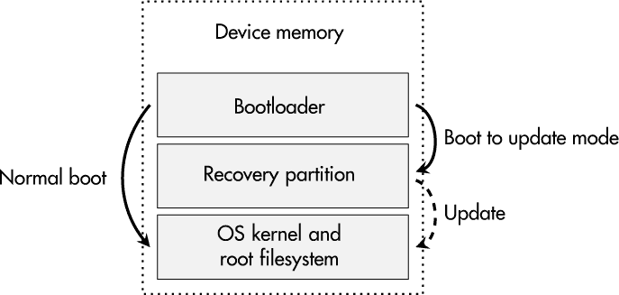
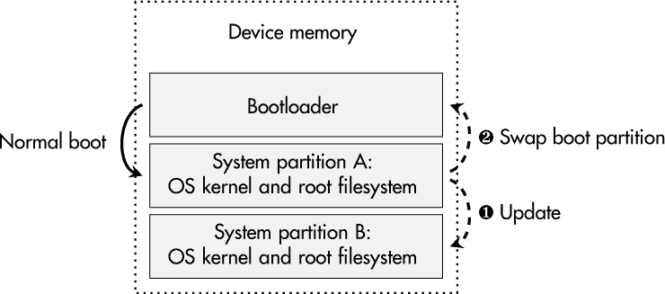
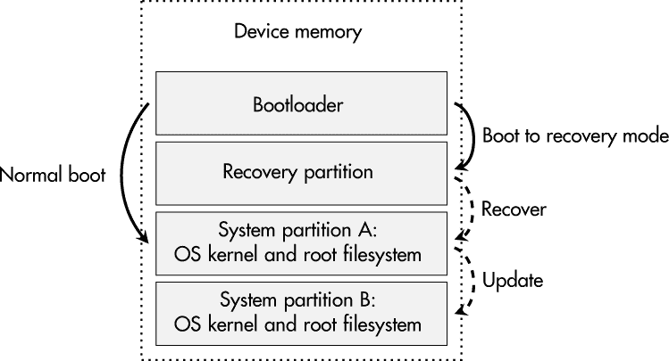

## 第十二章：**安全固件更新**


安全更新对消费者、管理员，尤其是制造商来说，都是令人烦恼的。制造商需要不断监控其产品中可能存在的漏洞，并对相关通知作出反应，而用户和管理员则必须及时应用发布的补丁。由于我们可以将设备的安全性视为一个易变的状态，可能明天就会发生变化，因此拥有一个稳固的更新策略是必不可少的。

然而，软件更新处理并非一件简单的事情。只有授权的实体应该能够向设备提供更新，而且这些更新不应破坏设备的功能或将其变成一块昂贵的砖头。此外，安全专家往往不愿意向其认证设备引入补丁，而相应的认证机构也越来越认识到安全更新在安全关键领域中的重要性。

本章介绍了安全更新方法的选择及其背后的原因。一个核心考虑因素是安全地实施更新验证，并确保其在设备上的可靠应用。最后，本章通过一个基于流行的 SWUpdate 框架和 Yocto 工具链的固件更新实践案例进行总结。

### **更新的不可避免性**

在一些软件和产品开发社区中，*永恒的 beta*阶段是常见的：产品永远不会脱离 beta 状态，新的功能不断添加，即使软件或设备已经投入使用，并由客户在实际环境中使用。这一概念有时也被称为*香蕉原则*，因为这些水果在还未成熟时就被采摘，并在运送到客户的途中甚至购买后继续成熟。在这种情况下，显而易见，交付的产品并没有完全完成，且需要多个软件更新才能开发出其全部潜力。因此，一个安全的更新方法至关重要。

如果我们看一下工业系统和关键基础设施，情况就截然不同。虽然这些系统通常具有较长的使用寿命，但其制造商和运营商在过去可能没有看到补丁管理的必要性。然而，随着这一领域的连接性和数字化的增加，以及工业产品中漏洞的不断发现，迫使供应商和用户采取行动并为安全更新过程做好准备。这种情况尤其具有挑战性，因为工业组件的制造商对安全更新的支持和操作补丁管理过程通常需要持续数十年。

即使你在一个具有强烈安全重点的行业工作，并且你的开发过程产生了高度安全且稳健的产品，你也无法保证你的软件、固件和硬件组件没有漏洞。而且，你无法预知是否会有新的攻击方法——这些方法在产品开发时甚至未曾被发明——会对你的设备造成安全问题，并可能要求更换加密算法或进一步增强安全功能。简而言之：没有任何产品是完美的。你需要让它具备可更新性。

一些显著的案例强调了嵌入式和物联网设备需要支持安全更新。2019 年的*Urgent/11*和 2020 年的*Ripple20*漏洞集合显示，像 TCP/IP 协议栈和操作系统这样的基础软件组件可能存在严重的弱点。数百万，甚至数十亿设备受到影响，许多设备被认为无法修补，因为它们不提供必要的修补手段。最终，这种无法修复的状况迫使客户更换这些设备，或者让他们继续使用不安全的系统。在这种规模下，它甚至可能对整个社会构成风险，因为恶意行为者知道如何将这些物联网产品引入他们的僵尸网络。归根结底，2020 年代销售的每一台数字设备都应该具备一个安全的更新机制。

**注意**

*我并不是唯一一个强调安全更新策略必要性的人。工业网络安全标准 IEC 62443、联合国（UN）针对汽车行业的法规 156 以及美国 FD&C 法案中针对医疗设备的网络安全部分也有类似的共识，仅举几例。*

### **安全要求**

与任何带有*安全*字眼的概念一样，显而易见的问题是，在这个特定上下文中，它关联了哪些（保护）目标。以下部分描述了你在安全固件更新中必须考虑的要求。

#### ***真实性***

固件更新必须能够通过加密方式证明其真实性，这确保了更新来自给定设备的原始制造商。这可以防止恶意制作的更新安装，并且应该成为所有安全更新程序的强制要求。这个目标通常是通过数字签名更新包来实现的。

#### ***保密性***

固件镜像通常被人们用来逆向工程设备，以枚举软件库、识别弱点或分析专有应用程序中的知识产权和机密信息。可以通过加密整个更新内容或其部分内容来实现保密性保护。

然而，请确保你理解存在风险，因为相应的解密密钥需要存储在设备上，攻击者可能能够从设备中提取该密钥，或者在设备解密后的固件更新中提取明文。

#### ***安全分发渠道***

前两个要求，即真实性和保密性，对更新文件本身提出了要求。然而，分发渠道本身也值得保护（例如，使用 TLS）。

设备与更新服务器之间的相互认证和加密通信，甚至可以替代更新文件的保密保护。

#### ***回滚选项***

这点比较棘手。将设备的软件版本回滚到较早状态有时非常有用——例如，如果更新引入了之前不存在的严重问题。另一方面，攻击者可能利用此功能将设备的软件回滚到包含已知漏洞的版本，而这些漏洞已经被后续的补丁修复。在这种情况下，尽管制造商提供了安全更新，设备仍可能处于易受攻击的状态，攻击者可以利用这些漏洞进行攻击。

如果你决定实施回滚保护，那么你需要相应的硬件支持，例如在主 CPU 中实现一个单调、不易丢失的版本计数器。

#### ***版本分发监控***

监控现场安全更新的采用情况可能非常有价值，因为这可以帮助你了解设备和客户的整体安全态势和威胁情况。你可以通过在每次成功安装新固件版本后，向每个设备发送确认通知来实施这一监控。

### **更新的分发与部署**

关于固件更新的一个核心问题是：“更新文件如何找到它所在的设备？”对此问题的回答对设备的可用性、流程和补丁管理的反应速度有着重要影响。

#### ***本地更新 vs. 远程更新***

自 1990 年代以来，实施更新机制的设备通常提供某种接口来上传或存储以前从制造商网站下载的固件文件。更新文件甚至可能被限制只能通过本地接口加载，如通过 USB 设备。虽然本地更新可能是一项安全特性，但这种方法对于物联网场景的扩展性较差。数百万设备需要数百万具有安全意识的客户以及数百万次手动更新安装，这几乎是不可行的，并且导致实际应用的更新很少。

汽车行业是一个关于固件更新的有趣例子。多年来，如果汽车存在严重的软件漏洞或缺陷，通常会发布召回通知。车主需要将车辆送到修理厂，由机械师安装汽车制造商提供的软件更新，这些更新通常是由特定控制单元的供应商提供的。如今，现代汽车可以通过连接到移动网络来接收软件更新。这种方法被称为*空中下载（OTA）更新*。

OTA 更新不仅限于汽车。它可以应用于各种物联网设备，尽管这个术语暗示更新是通过无线通道进行的，但通过有线网络传输更新显然并不被禁止。这个概念的主要优势在于设备能够连接到更新管理后台，通常由设备制造商运营，提供关于新更新的信息。这种方法提供了不错的可扩展性，因为更新发布过程可以由制造商自动化并进行计划。然而，这样的系统将后端服务器和监听更新的设备暴露给远程攻击者和基于网络的攻击。

**注意**

*在一些工业场景中，手动本地更新程序仍然是默认的。我听说有个人亲自访问数百台工业机器人，插入 USB 闪存驱动器，然后等待更新完成后才继续他的旅程，可能一次更新就需要几周时间。疯狂！*

#### ***拉式与推式策略***

毋庸置疑，在后端设备与更新服务器之间建立直接连接是专业更新管理的合理解决方案，但仍有一个问题：谁来控制更新过程？

通常，设备采用*拉式策略*进行更新管理：设备上的客户端应用程序定期检查是否有新更新，并下载新发布的镜像文件。随后，根据所有者的配置，设备可能会自动安装更新（例如，在预定的维护窗口内），或提示用户或管理员批准安装。更新成功后，新的软件状态可能会报告给制造商的服务器。在这种情况下，操作员控制何时以及安装哪些更新，这通常是商业场景下首选的解决方案，但他们也需要负责定期的更新安排。

另外，制造商可能会选择*推式策略*，这将使他们在更新过程中拥有更多的控制权。他们甚至可能强制设备进入更新模式。如果制造商负责及时更新设备，甚至可能有法律义务，这种方法是合理的。此外，如果更新被自动强制执行，特定客户群体（如个人用户）的安全性可以显著提升，因为他们无需自己组织更新过程。另一方面，一些客户故意选择使用旧的固件版本，如果他们拒绝让设备访问更新服务器，制造商也无能为力。然而，如果这类情况是你所面临的挑战，专注于软件状态监控就显得有意义，当设备连接到在线服务时，若固件过旧，则拒绝其访问，确保大量设备保持在安全状态。

在实际操作中，混合拉取和推送策略是可能的。你甚至可以通过为设备提供相应的配置选项，将决定权交给客户。这使得操作人员能够将你的设备完美地集成到他们特定的资产和补丁管理流程中。

### **更新粒度和格式**

*软件更新*和*固件更新*这两个术语通常可以互换使用，并适用于各种更新场景，从重写设备内存的所有内容到更改单个文件中的一些配置参数。因此，对于你的特定设备，明确哪些固件部分是可替换的，以及你希望以何种格式分发这些数据，是绝对必要的。

#### ***固件部分***

在 PC 环境中，*固件*是指编程到主板、安装的子板以及其他外围设备上的板载非易失性存储器中的软件。操作系统、软件应用程序和用户数据，通常存储在硬盘上，不被视为固件。然而，在嵌入式系统环境中，几乎一切都可以被视为固件：

**引导加载程序** 现代嵌入式设备通常至少包含一个引导加载程序，通常不止一个。

**协处理器固件** 最近的 SoC（系统级芯片）包括在一个封装内的异构处理器集合。这些协处理器中的一些可能需要自己的固件。

**控制器固件** 在 PCB（印刷电路板）层面，一个嵌入式系统可能有多个微控制器，每个微控制器执行专用的固件。

**FPGA 比特流** 作为 SoC 的一部分或作为独立组件，FPGA 被集成到多种嵌入式设备中。它们的配置，称为*比特流*，可能直接从闪存读取，或由引导加载程序或操作系统应用程序加载。

**裸机软件** 在没有操作系统的设备上，裸机软件是主要的应用程序。

**操作系统内核** 如果你的设备带有操作系统或实时操作系统（RTOS），则相应的操作系统内核是中央软件组件。

**设备树** 特定嵌入式系统的硬件组件及其参数通常在设备树文件中描述，该文件由操作系统内核加载。

**根文件系统** 所有其他文件系统和覆盖层都挂载在其上的基本文件系统包含对操作系统正确运行至关重要的数据。

**应用软件** 应用软件可能是根文件系统的一部分，但也可能位于一个或多个制造商特定的分区中。

列表中的一些固件部分可能共享一个公共的非易失性存储器；其他部分可能配有自己的独立存储器组件。在开发安全更新方案时，确保你了解所有相关的固件组件。然而，不要忘记，你的设备可能包含一些独特的数据，这些数据不能被软件更新所影响：

**唯一的加密密钥**    与设备唯一身份相关的数据，可能在生产过程中提供，对于可信的设备认证至关重要。此外，像在首次启动时生成的 SSH 密钥这样的密钥也应该在软件更新后保持不变。

**用户依赖的系统数据**    客户依赖于额外的用户账户及其相应的凭证，以及自定义设备配置文件。

**运行时数据分区**    您的设备可能会收集并存储特定用户的运行时数据，比如用于数据分析应用的传感器值历史记录，也可能会记录与维护和修理相关的数据。

#### ***更新格式***

如前所述，需要更新的软件组件的粒度差异很大，这并不会直接指示更新分发的具体格式。在决定之前，应该考虑几个要求：

**全面覆盖**    所选择的格式应能够更新尽可能多的设备软件组件。

**效率**    由于固件的大小不断增加，应该能够将固件更新限制为实际更新的部分。

**原子性**    更新的安装应为*不可分割*的操作，只允许两种最终状态：成功更新的固件，或在失败时回到更新开始前的原始固件。

以下列表提供了基于先前提出的要求的可能更新格式解决方案：

**文件**    一种简单的更新格式是为设备提供一组更新的文件，这些文件可以写入文件系统中对应的路径。虽然这种方式可以为设备文件系统中所有可用的组件提供更新，并且可以创建小巧高效的更新包，但原子性比较复杂。每个创建、写入或删除的文件都需要进行各自的操作，这些操作可能成功，也可能失败。如果出现错误，固件可能会处于一个未知的状态。

**容器**    容器化应用在更大型的嵌入式系统中变得越来越流行。替换整个容器镜像可能对其更新管理有效，但仅依赖容器更新会忽略一些重要的软件组件，如运行容器管理的主机操作系统。

**图像**    更新整个分区镜像可以使嵌入式系统中的许多软件组件进行更新，并且在原子性方面具有优势。虽然这种方法可能导致比其他格式更大的固件更新，但一些实现也支持压缩更新文件或差分更新，以解决这个问题。

**注意**

*无法通过文件系统访问的固件部分，例如必须基于专有协议进行更新的 IC，需要定制的处理。请考虑利弊，并在针对设备的更新能力方面做出有意识的决策。*

#### ***包管理器的问题***

你可能会想，为什么基于 Linux 的嵌入式设备大多数情况下不依赖于像 `apt-get` 或 `opkg` 这样的成熟包管理器，这些包管理器在桌面和服务器系统中广泛使用。原因在于基于包更新的系统的测试复杂性。此类方法需要管理系统中所有可能包之间的*依赖关系*，并且会增加需要测试的可能软件配置数量。

此外，由于嵌入式设备通常在关键应用或行业中运行，因此必须进行全面的测试。因此，许多制造商避免使用包管理器，转而选择基于镜像的原子更新方法，限制软件组件之间的交互，只测试特定版本的软件发布中的组件。

如果你打算走这条路，你可能需要一个提供自动化和可靠测试服务的合作伙伴，来处理所有提到的问题，例如 Canonical 为其 Ubuntu Core OS 提供的服务。

### **设备分区策略**

只有当你的设备的内存分区支持时，才能实现可靠的更新过程。根据可用内存和风险承受能力，可以使用不同的方法来设计系统的分区布局，以支持更新过程。

#### ***更新/恢复分区***

你可以通过引入一个额外的*恢复分区*来增强对固件更新失败的容错性。该分区包含下载和更新主系统分区的工具，包括操作系统内核和相应的根文件系统，如图 9-1 所示。



*图 9-1：用于执行系统更新的恢复分区*

这种方法的优点是额外分区的内存占用较低，这对于许多设备来说应该是可行的。然而，缺点是设备必须重启才能进入更新或恢复模式。如果更新过程失败，主分区会被损坏并无法再启动，此时会再次启动恢复分区，并可以启动一个全新的更新过程。

#### ***A/B 系统方法***

对于提供大量非易失性存储器的设备，*A/B 系统*方法可能是一个有趣的候选方案。图 9-2 展示了基本的分区布局和更新过程。



*图 9-2：两个相同的系统镜像副本——A 和 B*

在这种布局中，系统分区有两个副本，A 和 B，都至少包含操作系统内核和根文件系统。在启动时，标记为“可启动”的分区（在图 9-2 中为 A 分区）用于加载操作系统和基础文件系统。此过程包括一个更新客户端，能够接收固件更新，验证它们，并将其写入当前未使用的分区 ➊（在图 9-2 中为 B 分区）。随后，引导加载程序会被配置为将启动分区从 A 切换到 B（或反之）➋，然后重新启动到新的固件版本。

如果更新失败或分区损坏，旧版本仍然保持原样并可以重新启动。与使用恢复分区相比，一个显著的优点是，设备的标准操作在更新下载和安装过程中不会中断。此外，新下载的固件可以直接存储在非活动分区中，而不需要额外的存储位置来缓存更新。在 Android 设备上，这个概念被称为*无缝系统更新*，并且越来越多的手机厂商开始实现这一功能。

对于更高关键性的设备，可以将这两种方法结合使用，如图 9-3 所示。



*图 9-3：带有额外恢复分区的 A/B 架构*

该设计旨在防范系统分区 A 和 B 因各种原因而都遭到损坏的情况。对于这种架构，最好将恢复分区存储在与系统分区不同的物理内存中。即使恢复分区无法成功重新安装系统分区，它仍然可以报告系统故障并执行诊断。

#### ***关于更新引导加载程序的说明***

引导加载程序广泛应用于许多嵌入式系统。它们处理基本的系统初始化，选择启动介质，并随后加载操作系统内核。在许多情况下，这些二进制文件被视为“不可更改”的固件部分。

然而，如今像 U-Boot 和 GRUB 这样的引导加载程序已经成为功能复杂的软件组件，具有多种特性和能力。因此，引导加载程序可能会出现错误，甚至出现需要更新的安全漏洞。

从安全角度来看，你可能还需要更换用于安全启动过程的公钥或过时的加密算法，正如第八章中所描述的那样。在功能方面，你可能会遇到需要更新硬件初始化设置、内核启动参数或引导配置的情况。所有这些原因都使得更新引导加载程序及其配置数据成为一个有效的考虑事项。

然而，在大多数系统中，每个引导加载程序只有一个副本可用，这意味着更新它存在使设备发生故障的风险——例如，在引导加载程序更新期间发生断电或其他故障时。只有少数几个 SoC 和微控制器提供对额外引导加载程序实例的支持，这些实例可以在主引导加载程序失败时运行。因此，更新引导加载程序始终是一个关键且风险较高的过程，可能导致需要对设备进行物理访问以进行修复的情况。

一种折衷的解决方案可能是多阶段引导加载程序方法，将功能分成两部分。第一阶段被认为是不可变的，具有最小的功能，但提供对下一阶段中多个引导加载程序副本的支持，后者包含完整的引导加载程序。在这种系统中，早期阶段的安全问题仍然是一个问题，需要物理访问或冒险更新过程，但第二阶段可以冗余存储，从而允许低风险的更新。然而，这种方法不是标准的，并且需要进一步的开发工作和定制。

### **开发、后端和设备之间的相互作用**

在澄清了所有影响更新策略的细节后，是时候讨论可靠且安全的固件更新所需的操作流程了。如第一章所述，制造商有责任监控在现场被利用的设备漏洞，并认真对待漏洞报告。

假设你已经解决了这个问题，并且你的开发团队能够在短时间内提供修复。仍然有一个操作性问题：是否应将安全更新和功能增强与固件更新合并，还是应该将它们分开提供？

一些客户需要在其指定的基础设施中对你的设备进行全面测试，因此避免升级设备以加入可能需要重新测试的新功能。然而，他们可能对有助于提高系统稳健性和安全性的安全修复感兴趣。在这种情况下，建议将功能性更新和保护性更新分开。

此外，假设一个新的固件版本导致了问题，客户必须降级到之前的版本。如果安全更新包含在此更新文件中，客户将不得不忍受设备中已知的漏洞，至少在功能性问题得到修复之前。然而，认真对待这种分离会导致更多的软件配置和制造商方面更多的测试。

无论固件更新的内容如何，都必须由开发团队和相应的构建流水线提供和打包。如果需要，固件必须加密，通常使用像 AES 这样的对称加密方案。为了确保真实性和完整性保护，最终的固件镜像必须使用适当的算法（如 RSA 或 ECDSA）进行数字签名。

这两个任务包含两个必须匹配的组件。在制造商一方，通过构建系统生成的固件工件必须加密并签名，以生成实际的固件更新文件进行分发。在设备本身，需要执行签名验证和解密操作。

有多个基于镜像的更新系统可以为你执行这些任务：Mender、SWUpdate 和 RAUC。Mender 提供完整的基础设施，包括设备客户端软件和后端服务器。SWUpdate 和 RAUC 生成并应用固件更新文件，但更新分发和监控通常由 Eclipse hawkBit 后端框架执行。其他候选方案包括 OSTree 和 swupd，它们采用类似 Git 的基于修订的固件更新方法。

### **案例研究：使用 SWUpdate 进行安全固件更新**

本案例研究提供了将安全固件更新架构付诸实践所需的步骤示例。它基于 ST 为 STM32MP157F-DK2 开发板提供的 Yocto 工具链。

我选择了 SWUpdate 作为本实现的核心软件组件。期望的结果是一个基于数字签名验证更新真实性，并确保通过 A/B 系统方法保证可靠更新过程的更新流程。

#### ***SD 卡布局定制***

Yocto 构建系统编译并打包我设备固件镜像的所有相关软件，并以 *.ext4* 和 *.tar.gz* 等格式提供。这对于进一步处理很有用，例如生成 SD 卡镜像和创建更新文件，但我们先一步一步来。

来自 ST 的 STM32 Cube Programmer 工具以及便捷的 shell 脚本 *create_sdcard_from_flashlayout.sh* 使用制表符分隔值（TSV）格式的闪存内存布局文件。该 TSV 文件包含多个内容，其中包括分区列表、偏移量以及填充这些分区所需的文件。STM32MP157FDK2 开发板的默认闪存布局的选定列如 列表 9-1 所示。

```
Name       Offset     Binary
fsbl-boot  0x0        arm-trusted-firmware/tf-a-stm32mp157f-dk2-usb.stm32
fip-boot   0x0        fip/fip-stm32mp157f-dk2-optee.bin
fsbl1      0x00004400 arm-trusted-firmware/tf-a-stm32mp157f-dk2-sdcard.stm32
fsbl2      0x00044400 arm-trusted-firmware/tf-a-stm32mp157f-dk2-sdcard.stm32
metadata1  0x00084400 arm-trusted-firmware/metadata.bin
metadata2  0x000C4400 arm-trusted-firmware/metadata.bin
fip-a      0x00104400 fip/fip-stm32mp157f-dk2-optee.bin
fip-b      0x00504400 none
u-boot-env 0x00904400 none
bootfs     0x00984400 st-image-bootfs-openstlinux-eglfs-stm32mp1.ext4
vendorfs   0x04984400 st-image-vendorfs-openstlinux-eglfs-stm32mp1.ext4
rootfs     0x05984400 st-image-core-openstlinux-eglfs-stm32mp1.ext4
```

*列表 9-1：STM32MP157F-DK2 开发板的默认闪存布局*

TSV 文件包含了许多与引导加载程序和受信固件工件相关的行，这些内容在此时并不重要。然而，最后三行揭示了两个重要事实。首先，一个专用的 `bootfs` 分区包含 U-Boot 配置文件、设备树二进制文件和作为 `uImage` 的 Linux 内核。其次，`rootfs` 分区是一个非常适合复制以支持 A/B 系统方法的候选者。列表 9-2 展示了我对 TSV 文件所做的更改。

```
Name       Offset     Binary
...
bootfs     0x00984400 st-image-bootfs-openstlinux-eglfs-stm32mp1.ext4
vendorfs   0x04984400 st-image-vendorfs-openstlinux-eglfs-stm32mp1.ext4
rootfs-a   0x05984400 st-image-core-openstlinux-eglfs-stm32mp1.ext4
rootfs-b   0x35984400 st-image-core-openstlinux-eglfs-stm32mp1.ext4
userfs     0x65984400 st-image-userfs-openstlinux-eglfs-stm32mp1.ext4
```

*列表 9-2：A/B 更新方法的调整分区布局*

原始的 `rootfs` 分区被克隆， resulting in two new partitions: `rootfs-a` 和 `rootfs-b`。此外，还添加了一个 `userfs` 分区，这个分区在 ST 提供的工具链中已经存在，用于存储在根文件系统更新过程中应该“保留”的数据。

对于使用新参数生成 SD 卡镜像，还必须调整 *create_sdcard_from_flashlayout.sh* 脚本，以正确处理新引入的分区 `rootfs-a` 和 `rootfs-b`。SD 卡镜像的大小被设置为 2,048MB，同时两个根分区被配置为各占 768MB，这在闪存布局文件中的偏移量`0x30000000`已经体现出来。

在镜像创建脚本中的一个重要设置是为分区 `rootfs-a` 和 `rootfs-b` 分配单独的 UUID，如列表 9-3 所示。

```
DEFAULT_ROOTFSA_PARTUUID=e91c4e10-16e6-4c0e-bd0e-77becf4a3582
DEFAULT_ROOTFSB_PARTUUID=997046a6-c6f4-4f41-adb4-9fe614b2a92a
```

*列表 9-3：两个根文件系统副本的独立 UUID*

我重用了原始 `rootfs` 分区的 UUID 用于 `rootfs-a`，并为 `rootfs-b` 随机生成了一个新的 UUID。这些 UUID 非常重要，因为它们用于 U-Boot 的 *extlinux.conf* 配置文件中，位于 `bootfs` 分区，用于确定 Linux 内核挂载为根文件系统的分区。

之后，案例研究的基本分区架构已经准备好支持 A/B 系统更新。

#### ***SWUpdate 的安装和配置***

SWUpdate 是一款功能丰富的嵌入式系统固件更新工具，它为 Yocto 提供了相应的 `meta-swupdate` 层。可以从其 Git 仓库克隆该层，并将其添加到 STM32MP1 Yocto 项目中。

##### **安全特性的添加**

第一个任务之一是创建一个补丁，修改 SWUpdate 的配置以启用签名和加密的镜像。列表 9-4 展示了必须显式激活的三行配置。

```
CONFIG_HASH_VERIFY=y
CONFIG_SIGNED_IMAGES=y
CONFIG_ENCRYPTED_IMAGES=y
```

*列表 9-4：激活 SWUpdate 的重要安全特性*

两个选项 `CONFIG_HASH_VERIFY` 和 `CONFIG_SIGNED_IMAGES` 为 SWUpdate 增加了验证哈希和数字签名的能力，用于验证软件更新中包含的镜像。`CONFIG_ENCRYPTED_IMAGES` 选项启用了对 AES 加密镜像的支持，尽管我们目前未实现这一功能，但它可能是未来一个有价值的选项。

##### **密钥生成**

正如在第二章中所解释的，数字签名是一种非对称加密原语，允许验证签名数据的完整性和真实性。SWUpdate 可以基于普通的 RSA 密钥或证书生成签名。在这个案例研究中，我选择使用 4,096 位的 RSA 密钥。它们的生成可以分为三个步骤，如清单 9-5 所示。

```
$ echo "SuperS3cr3t" > passphrase
$ openssl genrsa -aes256 -passout file:passphrase -out swu_signing_key.pem 4096
$ openssl rsa -in swu_signing_key.pem -pubout -passin file:passphrase
              -out swu_verification_key.pem
```

*清单 9-5：用于更新签名和验证的 RSA 密钥生成*

首先，创建一个*密码短语*文件，里面应该包含一个强密码。之后，可以生成 RSA 密钥（例如，4,096 位长度）。生成的私钥基于给定的密码短语文件进行加密，并存储为*swu_signing_key.pem*。请注意，这是在构建过程后，用于签署固件更新的 RSA 私钥。对应的公钥被提取并保存在清单中的第三行，命名为*swu_verification_key.pem*。这样做是为了将该公钥包含在最终设备固件中，因为它在更新签名验证时是必需的。

##### **软件集合**

接下来，SWUpdate 需要知道哪些 Yocto 构建产物应包含在固件更新中。这些信息存储在*sw-description*文件中，该文件用于更新生成，同时也包含在固件更新包中。

清单 9-6 展示了我为此用例定义的软件集合。

```
software = {
  version = "0.1.0";
➊ hardware-compatibility: ["C02"];
   stable = {
  ➋ rootfs-a: {
      images: (
 {
      ➌ filename = "st-image-core-openstlinux-eglfs-stm32mp1.ext4.gz";
      ➍ compressed = "zlib";
      ➎ device = "/dev/mmcblk0p10";
      ➏ sha256 = "$swupdate_get_sha256(st-image-core-...-stm32mp1.ext4.gz)";
      });
    }
  ➐ rootfs-b: {
      images: (
      {
        filename = "st-image-core-openstlinux-eglfs-stm32mp1.ext4.gz";
        compressed = "zlib";
        device = "/dev/mmcblk0p11";
        sha256 = "$swupdate_get_sha256(st-image-core-...-stm32mp1.ext4.gz)";
      });
    }
  }
}
```

*清单 9-6：在* sw-description *文件中定义的软件集合*

你可能遇到的第一个问题是`hardware-compatibility`参数 ➊。我将其设置为`C02`，因为这是我的 STM32MP157F-DK2 开发板的硬件和组装版本。在运行时，这个参数必须与*/etc/hwrevision*中提供的数据匹配（例如，在我的情况下为`stm32mp157f-dk2 C02`）。

其次，这个软件集合中表示了`rootfs-a` ➋和`rootfs-b` ➐两个分区，尽管在运行时只有一个分区会被用于更新。两者都包含了相同的更新目标文件名 ➌——在这个例子中，是由 Yocto 生成的根文件系统。`compressed`参数 ➍指示数据是否以压缩形式提供，而`sha256` ➏将提供的目标文件的 SHA-256 哈希值集成到*sw-description*文件中。

这两个映像仅在一个属性上有所不同：由`device`参数 ➎指示的分区。这决定了 SWUpdate 客户端将更新写入哪里。在本例中，*/dev/mmcblk0p10*和*/dev/mmcblk0p11*是之前创建的`rootfs-a`和`rootfs-b`分区在 Linux 中的设备名称。如果*/dev/mmcblk0p10*是活动分区，则更新必须写入*/dev/mmcblk0p11*，反之亦然。

##### **更新文件生成配方**

SWUpdate 的固件更新文件扩展名为*.swu*。`meta-swupdate`层提供了一个类，支持基于先前构建并存储在 Yocto 的*deploy*目录中的工件，通过 Yocto 生成 SWU 文件。清单 9-7 显示了一个 Yocto 配方的相应代码，该配方自动生成有效且经过数字签名的 SWU 文件。

```
# Local files to be added to the SWU file
SRC_URI = "file://sw-description"
 # Images to build before creating the SWU file
IMAGE_DEPENDS = "st-image-core"

# Images to include within the SWU file
SWUPDATE_IMAGES = "st-image-core-openstlinux-eglfs"

# Format of image to include
SWUPDATE_IMAGES_FSTYPES[st-image-core-openstlinux-eglfs] = ".ext4.gz"

# SWU signing parameters
SWUPDATE_SIGNING = "RSA"
SWUPDATE_PRIVATE_KEY = "path-to-signing-key/swu_signing_key.pem"
SWUPDATE_PASSWORD_FILE = "path-to-unlocking-passphrase/passphrase"
```

*清单 9-7：生成 SWU 更新文件的配方代码*

配方添加了先前创建的*sw-description*文件，并声明了对`st-image-core`镜像的依赖。在 Yocto 的*deploy*目录中，所需的更新内容（设备的根文件系统）可以在以*st-image-core-openstlinux-eglfs*开头的文件中找到，同时目标机器会由 SWUpdate 自动添加。

与 SD 卡镜像创建不同，在 SD 卡镜像创建中使用带有*.ext4*扩展名的文件（如清单 9-2 所示），固件更新应尽可能小，以优化传输时间。因此，用于 SWU 文件的压缩工件采用*.ext4.gz*格式。最后，为了启用固件更新签名，我将`SWUPDATE_SIGNING`设置为`"RSA"`并提供了私有 RSA 签名密钥及其相应密码文件的路径。

运行这个配方确保构建了`st-image-core`镜像，然后在*deploy*目录中生成*swupdate-swu-gen-openstlinux-eglfs-stm32mp1.swu*文件。这个文件实际上是一个进出拷贝（CPIO）归档文件，包含*sw-description*文件及其签名*sw-description.sig*文件。此外，压缩的*st-image-core-openstlinux-eglfs-stm32mp1.ext4.gz*文件也包含在此归档中，里面是根文件系统。

**注意**

*如果你想知道为什么根文件系统没有签名文件，记住* sw-description *文件包含该镜像的哈希值，如果有人篡改过该镜像，这个哈希值会发生变化。描述文件的签名也保护了根文件系统的真实性和完整性。*

#### ***设备特定定制***

现在让我们来看看设备、更新客户端以及为了使 SWUpdate 正常工作所需的定制。

##### **更新守护进程**

要安装 SWUpdate 的设备客户端及其 Web 服务器组件，必须将`swupdate`和`swupdate-www`添加到 ST 的核心镜像中。对于配置，设备端的第一个考虑是它应该支持哪些更新方法。通常，SWUpdate 提供三种典型的更新方式：

**Mongoose 模式**    这个守护进程提供了一个简单的 Web 界面，允许通过网络手动进行更新。

**Suricatta 模式**    结合 Eclipse 的 hawkBit，SWUpdate 支持全面的 OTA 更新设置，可以由中央服务器实例进行管理和控制。

**本地安装**    如果 SWU 文件本地可用（例如在 USB 闪存驱动器上），可以直接安装更新，无需网络连接。

在这个案例研究中，我选择了 mongoose 守护进程。由于该系统使用 `systemd` 进行 Linux 服务配置和管理，因此可以创建如 列表 9-8 所示的服务文件 (*swupdate.service*)，并将其安装到 */etc/systemd/system/* 目录中。

```
[Unit]
Description=SWUpdate daemon

[Service]
Type=simple
ExecStart=/usr/bin/swupdate -w '-r /www -p 8080' -e 'stable,rootfs-b'

[Install]
WantedBy=multi-user.target
```

*列表 9-8：一个基本的服务文件，用于在启动后以 mongoose 模式启动* swupdate

SWUpdate 的二进制文件位于 */usr/bin/swupdate*。它可以在系统启动时通过 `-w` 命令行参数以 mongoose 守护进程模式启动。紧随其后的 `-r /www` 和 `-p 8080` 参数告诉它使用位于 */www* 的默认 Web 应用，并将其 Web 服务器绑定到 8080 端口。

`-e` 选项后提供的字符串定义了在更新情况下应该安装的预期软件集合的部分。在默认情况下，如果 `rootfs-a` 是活动分区，则守护进程应使用 `-e 'stable,rootfs-b'` 启动，以确保潜在的更新写入 `rootfs-b`，即非活动分区。

除了通过命令行参数设置配置选项外，您还可以提供与客户端编译时配置匹配的 *swupdate.cfg* 配置文件路径——例如，*/etc/swupdate/*。如 列表 9-9 所示，日志参数、密钥路径和更新后 shell 脚本是您可能希望放置在此处的典型设置。

```
globals :
{
    verbose = true;
    loglevel = 5;
    syslog = true;
    postupdatecmd = "/etc/swupdate/postupdate.sh";
    public-key-file = "/etc/swupdate/swu_verification_key.pem";
};
```

*列表 9-9：一个 swupdate 的示例配置文件*

然而，使用命令行参数还是配置文件，主要取决于个人喜好。

##### **更新后任务**

每个设备、其架构和更新策略都不同。因此，像 SWUpdate 这样的通用工具无法自动推断在固件更新写入相应的存储设备或分区之前和之后该做什么。在命令行中，`-p` 和 `-P` 参数分别用于定义 *更新后* 和 *更新前* 命令的路径。

在我的案例中，只需要一个更新后的例程来准备设备引导新的固件版本。列表 9-10 显示了 *postupdate.sh* shell 脚本的内容，该脚本在更新安装后执行，正如 *swupdate.cfg* 中所定义的那样。

```
   #!/bin/sh

➊ if grep -q PARTUUID=e91c4e10-16e6-4c0e-bd0e-77becf4a3582
           /boot/mmc0_extlinux/stm32mp157f-dk2_extlinux.conf; then

      # Update swupdate service parameters
      mount PARTUUID=997046a6-c6f4-4f41-adb4-9fe614b2a92a /mnt
    ➋ sed -i 's/rootfs-b/rootfs-a/g' /mnt/etc/systemd/system/swupdate.service
      umount /mnt

      # Update rootfs boot parameter in extlinux.conf
    ➌ sed -i 's/PARTUUID=e91c4e10-16e6-4c0e-bd0e-77becf4a3582/
                 PARTUUID=997046a6-c6f4-4f41-adb4-9fe614b2a92a/g'
          /boot/mmc0_extlinux/stm32mp157f-dk2_extlinux.conf

else

      # Update swupdate service parameters
      mount PARTUUID=e91c4e10-16e6-4c0e-bd0e-77becf4a3582 /mnt
      sed -i 's/rootfs-a/rootfs-b/g' /mnt/etc/systemd/system/swupdate.service
      umount /mnt
      # Update rootfs boot parameter in extlinux.conf
      sed -i 's/PARTUUID=997046a6-c6f4-4f41-adb4-9fe614b2a92a/
                PARTUUID=e91c4e10-16e6-4c0e-bd0e-77becf4a3582/g'
          /boot/mmc0_extlinux/stm32mp157f-dk2_extlinux.conf
   fi

➍ reboot
```

*列表 9-10：一个脚本，用于准备设备引导更新后的固件*

第一个 `if` 语句 ➊ 检查板卡的 U-Boot 配置文件 *stm32mp157f-dk2_extlinux.conf* 是否位于 */boot/mmc0_extlinux/*，并且是否包含默认的分区 UUID `e91c4e10-16e6-4c0e-bd0e-77becf4a3582`。如果是，那么 `rootfs-a` 是活动分区，更新刚刚写入 `rootfs-b`。因此，新分区上的 *swupdate.service* 配置文件必须设置为更新即将变为非活动的分区 `rootfs-a` ➋。

此后，U-Boot 配置文件中的分区 UUID 被替换为代表 `rootfs-b` 的 UUID ➌。这样可以确保 U-Boot 启动具有新根文件系统的 Linux 内核。如果在此操作之前发生任何故障或发生断电，设备将仅启动现有的固件。但如果一切顺利，根文件系统的分区会被交换，设备会被故意重启 ➍。当然，如果脚本检测到 `rootfs-b` 是活动分区，反向过程也同样适用。

显然，这只是针对本案例研究中特定架构的后更新脚本的一个可能实现。您的设备在安装固件更新之前或之后，可能需要完全不同的重新配置。

#### ***更新过程评估***

总结这个案例研究时，我将之前创建的 2GB 镜像写入到 16GB 的 microSD 卡中，并从中启动了我的 STM32MP157F-DK2 板卡。首先，我检查了当前活动的根文件系统分区。Listing 9-11 显示了 A 复制 (`mmcblk0p10`) 和 B 复制 (`mmcblk0p11`) 都可用且大小正确。行末的斜杠表示 `rootfs-a` 当前被挂载为根文件系统。

```
# lsblk
NAME         MAJ:MIN RM   SIZE RO TYPE MOUNTPOINTS
mmcblk0      179:0    0  14.4G  0 disk 
...
|-mmcblk0p10 179:10   0   768M  0 part /
|-mmcblk0p11 179:11   0   768M  0 part
...
```

*Listing 9-11: 挂载为根文件系统的* mmcblk0p10 *分区*

第二步，我打印了已安装的 `swupdate` 守护进程的日志。Listing 9-12 显示了输出的部分选定行。

```
   # journalctl -u swupdate.service
➊ Apr 28 21:34:54 stm32mp1 systemd[1]: Started SWUpdate daemon.
   ...
   Apr 28 21:34:54 stm32mp1 swupdate[520]: [INFO ] : SWUPDATE running :
       ➋ [main] : Running on stm32mp157f-dk2 Revision C02 
   ...
   Apr 28 21:34:54 stm32mp1 swupdate[520]: [INFO ] : SWUPDATE running :
       ➌ [main] : software set: stable mode: rootfs-b
   ...
   Apr 28 21:34:54 stm32mp1 swupdate[520]: [INFO ] : SWUPDATE running :
          [start_mongoose] : Mongoose web server version 7.8 with pid 533
       ➍ started on [0.0.0.0:8080] with web root [/www]
   ...
```

*Listing 9-12: swupdate 服务日志*

结果表明，守护进程启动了➊，并且板卡也启动了，因为硬件版本被正确读取了➋。进一步，显示出期望的配置，即潜在更新应该写入 `rootfs-b` ➌。此外，包含的 Web 服务器已启动，且配置了端口和指定的目录，得到了确认 ➍。

我使用了一款常见的浏览器，通过 8080 端口连接到设备的 IP 地址，并且立即显示了 SWUpdate 的默认 Web 界面。在这里，可以将 Yocto 创建的 SWU 文件上传到设备，进度条显示了更新完成的百分比。在达到 100% 后，设备如预期重新启动，再次查看 `lsblk`，如 Listing 9-13 所示，表明从 A 复制到 B 的交换成功。第二次更新尝试也成功，并将根文件系统交换回 `mmcblk0p10`。

```
# lsblk
NAME         MAJ:MIN RM   SIZE RO TYPE MOUNTPOINTS
mmcblk0      179:0    0  14.4G  0 disk 
...
|-mmcblk0p10 179:10   0   768M  0 part 
|-mmcblk0p11 179:11   0   768M  0 part /
...
```

*Listing 9-13: 更新后挂载为根文件系统的* mmcblk0p11 *分区*

最后，为了测试数字签名验证，我还尝试恶意修改固件更新文件，方法是提取原始文件，将`rootfs-a`的目标分区更改为`/dev/mmcblk0p9`，然后将修改后的文件重新合并成一个有效的 CPIO 归档。然而，当通过 Web 界面上传时，它很快就响应了“`更新失败`”的信息。查看设备上的日志数据，显示签名验证失败，正如预期的那样（列表 9-14）。

```
# journalctl -u swupdate.service
...
Apr 29 04:03:57 stm32mp1 swupdate[520]: [TRACE] : SWUPDATE running :
       [swupdate_verify_file] : Verify signed image: Read 581 bytes
Apr 29 04:03:57 stm32mp1 swupdate[520]: [ERROR] : SWUPDATE failed [0] ERROR :
       EVP_DigestVerifyFinal failed, error 0x2000068 0
Apr 29 04:03:57 stm32mp1 swupdate[520]: [TRACE] : SWUPDATE running :
       [swupdate_verify_file] : Error Verifying Data
...
```

*列表 9-14：修改后的固件更新的签名验证失败。*

测试软件更新验证例程的正确*拒绝行为*不仅在开发过程中有价值，在发布或生产测试中集成类似的测试用例也非常有意义，因为验证被意外关闭的情况并非第一次发生。

### **总结**

为设备提供软件和固件更新乍看之下似乎不是一项很难的任务。然而，如果考虑到所有关于安全性、可扩展性和可靠性的要求，它就变成了一个复杂的话题，影响着开发流程、非易失性存储布局、后端服务以及客户流程。

本章强调了为各种物联网设备提供安全更新机制的迫切需要，因为没有一款设备是完美的，在某些时候，制造商和客户都会要求进行固件更新，并且这些更新必须以安全的方式分发并应用，且不能导致设备故障。为了满足这些要求，制造商必须确保真实性和完整性保护，必须讨论更新格式和粒度，且内存分区必须支持原子和故障安全的更新过程。此外，还必须运营调度、分发并监控现场更新部署的后端服务器。

如果你仍然觉得这对于你来说太复杂，可能你的设备永远不需要更新，因为在过去的几十年里确实是这样的情况，那么请拿出你的网络设备的风险分析，并重新考虑如果无法修复漏洞时的影响评级。此外，如果你使用的更新机制像是邀请对手安装自定义软件，请确保将“更新误用”添加到你的威胁列表中。
