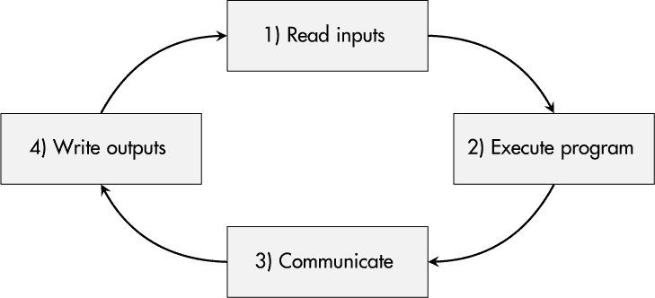

## 第十三章：**强健的设备架构**


鲁棒性是像汽车、航空航天和工业自动化等行业中组件的*关键特性*。设备不应受到尘土、寒冷或高温的影响。此类产品被设计成能在较长的生命周期内生存。它们在设计时将*物理鲁棒性*作为高优先级要求。

然而，随着即便在那些相对保守的领域，连接性和通信的增加，一个新的问题出现了：*数字鲁棒性*。像基于网络的 DoS 攻击这样的威胁，旨在造成暂时的服务中断，而这对依赖及时系统反应的实时系统来说可能是至关重要的。因此，*可用性*的保护目标对于这些嵌入式系统变得更加重要。

本章重点讨论了在面对日益增加的网络压力时，连接设备需要具备强大的设备架构。我将讨论实时系统以及嵌入式设备的基本功能受影响的情况。之后，我们将探讨应对嵌入式系统上硬件、操作系统和应用层的 DoS 攻击的策略。本章的案例研究将分析在不同条件下基于 Linux 的嵌入式系统的实时性和鲁棒性表现。

### **网络压力下的设备**

几乎每个设备都有某种网络接口，无论是 Wi-Fi、以太网，还是像 CAN 总线这样的领域特定网络标准。像切断电缆和干扰器阻塞无线通信频道这样的威胁是广为人知的。因为这些威胁导致通信介质的物理可用性丧失，发送过受影响频道的消息将丢失，无法到达最初连接的设备。虽然这个问题会影响整体系统的通信，但设备本身的资源不会受到影响，并且（即使设计得再完美）设备也无法在这种情况下提供帮助。

本章讨论的威胁性质略有不同。它们通过网络连接发起，但与针对通信频道的攻击不同，它们对设备的操作和资源产生影响。这可能是简单的错误数据包发送到错误端口，导致设计不良的工业设备丢失所有功能并进入未记录的更新模式，从而使其控制功能停止。然而，设备被大量信息轰炸的情况，通常才是主要的威胁。

这种设备弱点可能在许多情况下被触发，这些情况随着网络复杂性的增加、运营商引入安全管理流程以及攻击面扩大而变得更加频繁。让我们考虑一些典型的案例。

#### ***故障邻近设备***

系统越复杂、越异构，设备某天失控并向同一网络中的所有参与者广播大量消息的可能性就越高。持续不断且最终变得高频的流量有可能无意间暴露出连接设备在该领域中的不可靠性。

#### ***协议模糊测试***

*模糊测试*是一种安全测试技术，它通过反复生成随机变异的、不规则的输入并将其输入到设备中，目的是暴露出一些未曾考虑到的边缘情况。开发人员通常使用模糊测试来测试他们自己的设备。系统集成商、运营商和研究人员也使用模糊测试来分析设备的鲁棒性与安全性，发现不希望出现的行为。

#### ***网络与漏洞扫描***

IT 环境通常会定期扫描开放的网络端口、存在漏洞的客户端机器以及配置错误的服务器实例。像工业生产现场这样的环境不太可能受到此类 IT 安全方法的影响，但未来它们也将面临这种情况。各个组件应该能够应对此类扫描，并且不会出现意外行为，例如处理速度的临时波动或设备完全故障。

#### ***洪水攻击***

一旦攻击者能够访问网络，他们就可以向连接的设备发送数据包。一些工具可以通过一行命令发起基于网络的 DoS 攻击，连脚本小白也能轻松执行。真正强大的设备应该不会受到这些攻击的影响，应该能够继续正常运行。

#### ***强大的架构***

许多对异常网络通信缺乏鲁棒性的案例都是由于在功能和安全测试中未能发现的错误，这些测试是第一章中描述的安全开发过程的强制性部分。然而，某些设备的 DoS 漏洞来自于你在设计设备时所做的架构决策。

如果你是一个自豪于其坚固产品的工程团队的一员，迈出一步， 同时将数字鲁棒性作为一个高优先级特性来考虑。接下来的部分将提供关于如何构建数字鲁棒性的建议。

### **设备基本功能**

说洪水攻击不应影响设备功能很容易，但实际实现保护措施需要比预期更为详细的考虑。显然，通信能力可能会因高负载的消息流而受到影响，可能会减弱甚至完全丧失，这将影响所有依赖于从其他实体接收数据的设备功能，甚至可能会影响需要将数据从设备传输到其他网络参与者的操作。从设备的角度来看，这些影响是不可避免的，并需要相应的缓解措施。

工业标准 IEC 62443 的第 4-2 部分涵盖了工业组件的技术安全要求，其中包括处理嵌入式系统上的 DoS 保护的特定要求 CR 7.1。它的核心要求是设备即使在 DoS 攻击下并处于*降级模式*下，也应该保持其**基本功能**。如果你想满足这一要求，首先要提出的显而易见问题是：“我的设备的基本功能到底是什么？”

让我们考虑三种通用设备类型及其可能的基本功能。

#### ***传感器***

*传感器*测量环境参数。不管是追踪温度、距离、pH 值还是填充水平，传感器的任务是捕捉当前情况并将其传递给控制或监控系统。然而，如果通信通道和/或相应的设备资源可能会超载并失去通信能力，传感器仍然应该能够收集其数据。

在这种情况下，基本功能可能是正确地感知并存储所获取的值。从产品工程的角度来看，这可能会导致一个新的需求——即，当通信恢复时，需要一个足够大的数据缓冲区和恢复过程。

#### ***执行器***

*执行器*如驱动器、阀门、发动机或甚至激光器会影响物理世界。它们通常由一个中央控制器实例进行参数化，并通过以太网等通信方式与执行器进行通讯。

假设一个驱动器以每分钟 1,000 转的速度运转时，突然发生了对其网络接口的 DoS 攻击。是否应该让其基本功能（以某个速度旋转驱动器）继续运行？从安全性和可用性的角度来看，这可能是合理的。然而，安全专家可能会认为，系统已经不再处于安全状态，应通过停机来避免不安全的行为。

#### ***控制器***

*控制设备*用于汽车、工业自动化或关键基础设施，通常遵循图 10-1 所示的简单原理：接收输入，按照给定程序进行处理，可能进行一些通信，然后设置新的输出信号。



*图 10-1：控制设备的典型执行周期*

随后，周期重新开始。然而，在网络压力的情况下，通信时隙可能会消耗过多的时间和资源。同样，你需要定义自己的策略：可能合理的做法是认为周期执行（除通信外）是应该持续运行的基本功能，即使设备在网络接口上处于压力状态。如果网络通信本身是必需的，问题将是每个周期都绝对需要通信，还是至少每 10 个周期中一次可以接受，例如。

如果定义的要求在运行时无法满足，系统应该可能停机。此类设备的一个好例子可能是读取踏板传感器值并相应控制发动机的汽车组件。这些控制单元的架构师和开发人员必须明确设备的基本功能，以便为传感器通信或相应任务失败的情况做准备——无论是什么原因导致的。

**注意**

*定义设备的基本功能是一个基础性的设计决策，这个决策可能对设备的软件和硬件架构产生重大影响。务必在早期认真考虑这一主题。*

### **实时系统**

数字鲁棒性对于几乎所有产品都很重要，因为设备故障往往会导致运营商的财务损失。然而，对于*实时嵌入式系统*来说，这一点尤其重要。这些设备不仅要求保持服务的可用性，还必须确保在初始事件发生后，设备操作的结果能够*在给定的截止时间之前*提供。

尽管高性能处理器和超快反应时间可能是此类需求的结果，但这些特点并非强制要求。唯一重要的约束条件是，系统的响应必须在*时间限制结束之前*提供，无论是微秒还是半分钟。

实时系统有三类，它们在错过截止时间后的影响程度上有所不同：软实时系统、严实时系统和硬实时系统。

#### ***软实时系统***

*软实时系统*即便经常错过截止时间也能容忍。然而，延迟结果的有用性和价值会持续下降。如果错过的截止时间较为严重，结果可能会变得毫无价值。应用实例包括气象站、实时音频传输和视频游戏。

#### ***严实时系统***

在*严实时系统*中，错过的截止时间会导致缺陷或服务质量下降。然而，偶尔错过截止时间可能是可以容忍的。这类系统的一个例子可能是取放机器人。如果它的控制器错过了截止时间，当前处理的部件可能会损坏或放置错误，但在处理完这一单一故障后，设备能够继续正常操作。

#### ***硬实时系统***

*硬实时系统*必须满足最高的要求。对于这些系统，任何错过的截止时间都是至关重要的。根据应用场景的不同，错过截止时间甚至可能导致灾难性的后果。典型的例子包括飞机或火车上的发动机控制单元、高质量制造过程，以及像起搏器这样的医疗设备。

#### ***DoS 攻击的影响***

如果您的设备属于这些实时类别中的某一类，您必须在威胁和风险评估过程中考虑 DoS 攻击或偶发的网络压力带来的潜在影响，并相应地缓解由此产生的弱点。

### **资源耗尽与预防策略**

基于网络的 DoS 攻击，如洪水攻击，旨在对目标设备造成*临时资源耗尽*。在一个简单的场景中，攻击者可以通过利用大部分可用的网络带宽向目标设备发送数据包来实现这一点。受害设备接收所有数据包并必须处理它们。所需的处理能力取决于网络数据包的类型和内容。

然而，如果网络数据包的积累达到填满所有内部缓冲区的程度，并且设备无法比数据包到达更快地处理它们，就会发生 CPU 资源耗尽。此时设备无法再执行队列任务，包括其基本功能。

**警告**

*资源耗尽的原因不一定是恶意攻击。一次粗心的网络扫描，使用* nmap *可能就足以暂时引发设备的资源耗尽，正如本章案例研究所示。*

完全预防资源耗尽在实践中并不总是可能的，它取决于特定设备的参数和攻击者的能力。然而，基本功能和次要操作之间的强大分离是一个稳固的架构，可以在遭受显著网络压力的情况下保持降级模式下运行。通过使用两种基本策略，可以将设备资源分配到关键操作和相对不太关键的操作中：

**固定资源分配** 资源静态分配给任务的优点在于提供了透明且清晰的职责划分。然而，固定的资源限制会在运行时导致低效，当资源没有被其分配的任务使用时，另一个任务本可以使用该资源，但由于限制无法使用。

**动态资源分配** 为了促进资源的高效使用，可以根据任务属性在运行时将资源分配给特定任务，这些任务属性用于推导优先级指标。

在设计设备硬件架构和选择主要处理单元时，应考虑这些方法。此外，操作系统的选择和配置对设备的鲁棒性也有重要影响。

### **硬件级实现选项**

设备的硬件架构定义了其基本的计算资源条件。在开发过程中，选择了各种目的的集成电路（IC），包括微控制器、多核系统级芯片（SoC）和 FPGA，以及专用芯片，如处理物理层网络通信的以太网物理层（Ethernet PHY）。

如果网络洪水的鲁棒性是你的主要关注点之一，并且你在开发过程的早期就考虑到了这一点，你可以设计设备的硬件架构，从而显著减少基于网络的拒绝服务（DoS）攻击的风险。

#### ***专用预处理单元***

图 10-2 展示了在引入专用预处理单元处理网络流量时的基本概念。该架构的主要思想是物理上将主应用处理器和网络处理分开，或至少将其中一部分分离开来。


*图 10-2：带有网络流量预处理的架构*

这种架构的一个具体例子是*通信预处理器*，它实现了 TCP/IP 协议栈并负责处理网络包及其负载。主处理器与预处理单元之间的相关数据通信通过一个尽可能简单的接口进行。遇到洪水攻击或由于未知原因造成的非常高的网络负载时，通信单元可能会出现资源耗尽，但其背后的应用处理器不会受到影响，仍然能够执行设备的基本功能。

使用*硬件包过滤单元*是这种方法的第二个例子。在这种情况下，网络栈保留在主处理单元上，预处理器仅用于过滤到达设备网络接口的网络包流。过滤规则可能包括速率限制，确保应用处理器只接收它能够处理的包数量。

这种架构可以通过提供此功能的特定网络集成电路（IC）来实现，但在写作时，这些 IC 在嵌入式系统中还相对较少见。对于托管 FPGA 的设备，MAC 控制器可以通过数字逻辑实现，然后在将网络数据传递给主 CPU 之前，经过定制的包过滤核心。

**警告**

*在设计主处理器与预处理单元之间的通信时要小心。如果前者对后者的依赖过大，即使架构坚固，设备也可能会出现故障。*

#### ***多核架构***

如果数字鲁棒性要求在需求列表上出现得太晚，而硬件设计已经确定，那么如果你选择了多核 SoC 作为设备的主要处理单元，你可能会比较幸运。诚然，多核芯片中的单个核心并不是完全分离和独立的，它们共享总线、缓存等资源。然而，正如图 10-3 所示，合理的任务分配可以降低 DoS 事件的概率。


*图 10-3：使用多核架构提升系统鲁棒性*

越来越多的嵌入式系统 SoC 实现了*异构多处理（AMP）*。它们包括一个或多个高性能核心，用于运行功能丰富的操作系统，如 Linux，还有一个或多个较小的核心，通常擅长实时应用。增强鲁棒性的一种方法可能是将控制任务等关键功能分配给专用的实时核心，如图 10-3a 所示。类似的结构在将硬处理器与位于 FPGA 架构中的软核心结合的 SoC 上也可以实现。

如果你的设备运行在*对称多处理（SMP）* SoC 上——这意味着它有两个、四个、八个甚至更多相同类型的核心——你仍然可以采取措施提高鲁棒性。图 10-3b 中的架构旨在通过将网络任务的进程绑定到专用核心来将其与关键功能分离。这种概念称为*核心绑定*或*处理器亲和性*，并且必须得到操作系统的支持。

**警告**

*再次强调，（通信）在不同核心上的进程之间的依赖关系可能会破坏预期的分离，应该谨慎地进行概念化。*

### **操作系统功能**

操作系统的一个核心任务是管理 CPU 核心、内存区域以及多种硬件接口。负责在运行时分配处理时间的组件被称为*调度器*。在讨论防止资源耗尽时，考虑操作系统和调度器的功能和职责是完全合理的。

#### ***操作系统选项***

在选择操作系统时，设备工程师基本上有四种选择：裸机软件（无操作系统）、实时操作系统、完整的操作系统或基于虚拟机的操作系统组合。

##### **裸机软件（无操作系统）**

在简单的设备和应用中，操作系统甚至可能不是必需的。事件及其相应的资源分配可以通过轮询循环或中断服务程序来处理。

##### **实时操作系统**

实时操作系统（RTOS）是一种低复杂度的操作系统，专门用于对可靠性有高度需求的实时应用。它的调度器根据任务优先级来管理资源：优先级较高的任务可以中断当前运行的优先级较低的任务。

在这样的系统中，重要的是不要将与网络相关的任务配置为最高优先级，因为这样可能会导致网络引发的 DoS 情况。实际上，在该领域可以找到各种 RTOS，包括商业的 QNX 或 VxWorks，也有开源的变种，如 FreeRTOS、RIOT 或 Zephyr。

##### **完整操作系统**

许多现代功能丰富的设备依赖于开源库和工具，处理例如网络通信、用户界面展示或数据处理任务。这些设备通常基于像 Linux 这样的完全功能的操作系统。然而，这类复杂且不完全确定性的操作系统有一个缺点：缺乏适当的实时能力。在下一节中，我将讨论一种使 Linux 更具实时能力的可能性。

##### **基于虚拟机监控器的操作系统组合**

一些制造商希望将实时操作系统（RTOS）的实时优势与 Linux 的众多库和功能结合起来。在这些情况下，在这些操作系统下引入了一个额外的抽象层：一个*虚拟机监控器*负责硬件资源分配的任务，从而在将核心功能（可能运行在 RTOS 上）与在 Linux 中实现的支持功能分离方面发挥着重要作用。这些配置进一步增加了产品软件架构的复杂性。

#### ***带实时补丁的 Linux***

在桌面和服务器系统的典型配置中，Linux 并不提供可靠的实时能力。然而，多年来，实时社区一直维护着一个名为`PREEMPT_RT`的内核补丁。它对 Linux 内核进行了多项修改，目的是实现对内核线程和内核原语的*抢占*，这意味着任务调度中的非确定性减少，计算资源分配更接近纯粹基于优先级的系统。在当前的 Linux 内核版本中，您可以通过 `CONFIG_PREEMPT_RT` 配置选项来启用实时支持。

Linux 中的线程调度是基于调度策略和静态调度优先级进行的。“正常”线程按照像 `SCHED_OTHER`、`SCHED_IDLE` 或 `SCHED_BATCH` 这样的策略调度，优先级为 0。必须满足实时要求的线程会根据以下策略之一进行调度：

SCHED_FIFO    该调度程序遵循*先进先出（FIFO）原则*，意味着正在运行的线程会一直执行，直到被一个具有更高静态优先级的线程抢占。

SCHED_RR    经典的*轮转调度（RR）*方法类似于 `SCHED_FIFO`，不同之处在于线程只能运行一定的最大时间。之后，线程被中断并添加到具有相同优先级的线程队列的末尾。具有更高优先级的线程可能会抢占较低优先级的线程。

SCHED_DEADLINE    与其他调度程序不同，这个调度程序基于*全局最早截止时间优先（GEDF）*。它不依赖于静态优先级，而是动态分配优先级。其决策基于线程的绝对截止时间和总计算时间。

**注意**

*尽管* PREEMPT_RT *使 Linux 更像实时操作系统，但它仍然是一个复杂的软件，不适合许多硬实时需求。*

### **应用与协议考虑事项**

本章主要关注硬件和操作系统层面上稳健的设备架构，但我并不想忽视应用层和通信层。现实世界中，许多 DoS 情形源于软件和协议设计的不严谨。

这些问题可能在开发过程的不同阶段引入。协议规范可能已经缺乏对极端情况正确行为的明确定义——例如，消息参数的最小值或最大值。此外，软件中的简单错误，比如缺少边界检查，也可能在特定情况下导致不希望的副作用，如无限循环或死锁。如果仅进行表面上的安全测试，设备就可能带着固件进入生产，而这些固件给攻击者留下了通过单个网络数据包触发 DoS 事件的机会。

以下章节提供了解决这一复杂问题的实用建议。你应该关注的一个重要可能性是攻击者能够*强制设备状态转变*，从而导致拒绝服务（DoS）攻击。

#### ***识别逻辑缺陷***

协议设计是一项复杂的任务，但许多公司选择这条路，开发自己的专有消息和通信格式。如果你发现自己处于这种情况，一定要尽力消除协议中的逻辑缺陷。

首先，你可以从概念层面开始，提出以下问题：我们消息中每个值的有效范围是什么？网络参与者能否强制我们的设备进入未定义的状态？在使用消息之前，是否验证了消息值的有效性和合理性？其次，使用仅部分满足规范或甚至故意尝试操控设备状态的消息来测试你的协议实现，可以帮助发现漏洞。

#### ***实施输入和发送者验证***

在许多嵌入式系统场景中，攻击者能够直接与设备通信——例如，通过网络。即使应该使用官方客户端软件与设备进行交互，攻击者也可能会自行构造被篡改的消息，因此设备不应信任任何到达其网络接口的数据包。

关键命令，如切换到更新模式和停止所有操作，只有在成功验证发送者的身份后才能执行。因此，开发者的默认态度应该是*预期*恶意输入，并相应地实现合适的输入验证和过滤机制，无论是在防火墙层面还是在处理消息有效载荷的应用程序内部。

#### ***分析主动保护措施***

有时候，攻击者可能会滥用主动保护措施，将设备强制置于拒绝服务（DoS）状态。例如，你的登录过程可能会被加固，以通过仅允许 10 次登录尝试来防止暴力破解攻击。达到该限制后，设备会进入锁定模式，只有通过恢复程序才能重新激活。虽然这可能是一个完全合理的安全措施，但它也允许攻击者通过输入错误的用户凭证 10 次来强制产生 DoS 状态，即便是合法用户也会受到影响。

基于流量数量阻止 IP 的防火墙配置也有类似的机制。在这种情况下，攻击者可能会伪造有效设备的发送者 IP 地址，通过发送大量数据包来触发保护功能。结果，合法设备的通信尝试随后会被阻塞。

#### ***引入混沌工程与模糊测试***

人类的想象力是有限的。假设开发人员能预见到所有可能导致设备 DoS 事件的问题是不现实的。然而，有两种测试方法可以在这方面突破极限。

*混沌工程*是一种针对 IT 系统的可靠性和韧性测试，通过在 IT 基础设施中引入“混沌”——即随机失败的服务或应用程序，来进行测试。在嵌入式系统测试领域，这种“混沌”可以表现为崩溃的进程或失去的通信通道，从而分析设备在不利环境下的行为。

*模糊测试*的学科可以应用于通信协议，也可以应用于设备处理的输入数据，如配置文件或证书。它可以通过巧妙地多次变异输入数据，创建大量的测试消息或测试文件。通过这种方式，你可以发现那些通过人工分析非常难以发现的、会导致 DoS 状态的情况。

**注意**

*话虽如此，请记住，产品开发团队的思维方式和意识，可能是早期发现 DoS 漏洞的决定性因素。*

### **案例研究：STM32MP157F 设备的鲁棒性选项**

在本案例研究中，我将分析 STM32MP157F 设备的实时性和鲁棒性能力。我将阐明用于模拟设备 CPU 和网络压力的相应测量方法和工具。

#### ***基本系统属性***

在硬件级别选项方面，当前使用的 STM32MP157F 设备提供了两个运行在 800 MHz 的 Cortex-A7 核心和一个运行在 209 MHz 的专用 Cortex-M4 核心，用于实时应用。这个基本信息使我们可以得出结论：既可以将任务绑定到 A7 核心之一，也可以将关键软件应用程序移到分离的 M4 核心。原则上，使用 M4 核心作为以太网流量的预处理单元甚至可能是一种选择，但这可能不是我首先会考虑的方案，且需要基于 SoC 架构进一步进行可行性分析。

STM32MP157F 的以太网外设中包含的 MAC 单元支持 10、100 和 1,000Mbps 的数据传输速率。在查阅了 ST 针对 STM32MP157F 设备的*参考手册 RM0436*之后，我们可以清楚地看到该模块还支持硬件加速的数据包过滤。接收到的数据包可以根据其源和目标 MAC 地址、以太网帧中的虚拟局域网（VLAN）标签、源和目标 IP 地址以及 TCP 和 UDP 消息的源和目标端口进行过滤。不幸的是，该模块没有任何形式的速率限制功能，这在 DoS 保护中会非常有用。

本次初步分析的第三部分涉及我 STM32MP157F 设备上运行的 Linux 操作系统。如前所述，Linux 可以通过补丁或配置使其行为类似于实时系统。通过列表 10-1 中的命令和输出，我检查了我的 Linux 系统，它是基于 ST 的`st-image-core`镜像通过 Yocto 创建的，是否具备实时调度功能。

```
# uname -a
Linux stm32mp1 5.15.67 #1 SMP PREEMPT ...
```

*列表 10-1：我系统的 Linux 内核属性*

字符串`SMP`指出，当前的 Linux 系统在编译时已配置为支持对称多核架构，如 STM32MP157F 的 A7 双核，而`PREEMPT`则表示 Linux 内核是通过`CONFIG_PREEMPT`选项编译的。该系统运行一个*低延迟内核*，这意味着内核代码在非关键区段执行时，可以被更高优先级的任务中断。然而，这种配置不应与`PREEMPT_RT`指示符混淆，后者代表的是通过`CONFIG_PREEMPT_RT`启用的完全可抢占 Linux 内核。

#### ***低延迟内核的测量***

你可以通过两种方式来测量设备的延迟行为。如果你可以访问设备的 Linux 系统，你可以运行分析该 Linux 系统调度行为的软件。另一方面，例如，如果你分析一个第三方组件，你可能不得不将待测设备视为一个黑箱。在这种情况下，你只能通过输入和输出信号来观察设备的延迟行为——例如，通过示波器或逻辑分析仪。前一种方法更适合展示设备的基本能力，而后一种方法可以得出更接近特定应用场景的结果。

在这个案例研究中，我使用 `cyclictest` 工具来分析系统的实时能力，因为我可以访问设备的 Linux 控制台，并且我目前没有特定的应用程序。该工具测量使用 `SCHED_FIFO` 调度的实时任务的编程执行和实际执行之间的延迟。清单 10-2 显示了一个测试样本及其结果。

```
# cyclictest --mlockall --smp --interval=200 --distance=0 --priority=80
    --loops=40000
...

T: 0 (  874) P:80 I:200 C:  38735 Min:   15 Act:   47 Avg:   36 Max:  158
T: 1 (  875) P:80 I:200 C:  38596 Min:   15 Act:   42 Avg:   35 Max:  165
```

*清单 10-2：空闲模式下的任务延迟*

`--mlockall` 参数用于减少工具本身的开销和影响，而 `--smp` 则是多核系统测试所必需的。测量线程按照 `--interval` 选项设定的每 200 *µ*s 执行，并且不同线程的测量周期没有区别，正如 `--distance=0` 所表示的那样。测量任务执行了 40,000 次（`--loops=40000`），任务优先级为 80（`--priority=80`）。

结果输出显示了两行，每行对应一个 CPU 核心。字母 `P`、`I` 和 `C` 分别表示优先级设置、测量间隔和执行测量的次数。右侧的值显示了最小、实际、平均和最大观察到的延迟。最右边的数字是最重要的，因为它表示对计划任务的最差延迟，这可能对你来说是可以接受的，也可能是不可接受的。

在当前状态下，给定的 Linux 系统使用 `PREEMPT` 低延迟内核显示出最大延迟为 158 和 165 *µ*s。然而，如果我使用同一网络上的第二个设备进行 SYN 洪水攻击——例如，运行 `hping3 --syn --flood` device-ip，最大延迟会显著受到影响，如清单 10-3 所示。

```
# cyclictest --mlockall --smp --interval=200 --distance=0 --priority=80
    --loops=40000
...      

T: 0 (  902) P:80 I:200 C:  14253 Min:   15 Act: 2406 Avg:  409 Max: 5475
T: 1 (  903) P:80 I:200 C:  40000 Min:   15 Act:   15 Avg:   23 Max:  185
```

*清单 10-3：SYN 洪水对任务延迟的影响*

在这种情况下，即使使用低延迟内核，任务延迟也可能上升到超过 5 毫秒，这是实际任务间隔的多倍。显然，如果你的应用程序必须满足实时要求，这可能是至关重要的。清单 10-4 显示了在执行简单端口扫描时使用 `nmap` device-ip 得到的测量结果。

```
# cyclictest --mlockall --smp --interval=200 --distance=0 --priority=80
    --loops=40000
...            

T: 0 (  932) P:80 I:200 C:  37581 Min:   14 Act:   41 Avg:   46 Max: 6573
T: 1 (  933) P:80 I:200 C:  39086 Min:   15 Act:   46 Avg:   34 Max:  199
```

*清单 10-4：SYN 扫描对任务延迟的影响* nmap

总结来说，我们可以看到，针对 STM32MP157F 设备的标准 Linux 发行版的低延迟内核无法提供强大的实时特性。即使是短时间的强烈网络流量也会影响系统的反应时间。

#### ***实时内核的测量***

如果稳健性是你的主要需求之一，你可能需要寻找实现了完全可抢占内核的 Linux 发行版，以满足实时约束。幸运的是，ST 为 STM32MP157F 设备提供了 Yocto 层 `meta-st-x-linux-rt`。将其添加到我的构建系统后，我只需设置 `MACHINE=stm32mp15-rt` 并重新创建构建环境，然后就可以使用 `bitbake` 生成启用了 `CONFIG_PREEMPT_RT` 的 `st-image-core` 镜像和 Linux 内核。

启动新镜像后，我再次确认内核实际上提供了实时功能。列表 10-5 中的输出显示了典型的 `PREEMPT_RT` 特性，如所期望的那样。

```
# uname -a
Linux stm32mp15-rt 5.15.67-rt49 #1 SMP PREEMPT_RT ...
```

*列表 10-5：包括实时功能的 Linux 内核特性*

再次，你可以像上一节那样使用`cyclictest`测试系统的实时表现。列表 10-6 显示了实时内核的正面效果。

```
# cyclictest --mlockall --smp --interval=200 --distance=0 --priority=80
    --loops=40000
...

T: 0 ( 1195) P:80 I:200 C:  40000 Min:   15 Act:   17 Avg:   19 Max:   64
T: 1 ( 1196) P:80 I:200 C:  39838 Min:   16 Act:   25 Avg:   18 Max:   72
```

*列表 10-6：空闲模式下实时内核的任务延迟*

与列表 10-2 中低延迟内核的值（158 和 165 *µ*秒）相比，最大延迟显著降低至 64 和 72 *µ*秒，分别是。 列表 10-7 中的结果显示了更好的表现。

```
# cyclictest --mlockall --smp --interval=200 --distance=0 --priority=80
    --loops=40000
...     

T: 0 ( 1186) P:80 I:200 C:  40000 Min:   15 Act:   29 Avg:   24 Max:   91
T: 1 ( 1187) P:80 I:200 C:  39800 Min:   16 Act:   34 Avg:   19 Max:   77
```

*列表 10-7：SYN 洪泛对实时内核延迟的影响*

即使在进行 `hping3` 执行的 SYN 洪泛攻击时，Linux 系统的最大延迟也不会超过 100 *µ*秒。

你可以在列表 10-8 中观察到类似的效果，该结果是在测试设备上运行网络扫描时捕获的。

```
# cyclictest --mlockall --smp --interval=200 --distance=0 --priority=80
    --loops=40000
...       

T: 0 ( 1189) P:80 I:200 C:  40000 Min:   15 Act:   17 Avg:   20 Max:   78
T: 1 ( 1190) P:80 I:200 C:  39837 Min:   16 Act:   23 Avg:   19 Max:   73
```

*列表 10-8：使用* nmap *进行 SYN 扫描对实时内核延迟的影响*

虽然常见的 `nmap` 命令会使标准镜像的低延迟内核引发超过 6 毫秒的最坏情况延迟，但本节分析的实时内核只会使最大延迟比空闲状态增加不到 15 *µ*秒。

这意味着，低延迟 Linux 内核并不保证任何稳健性，即使是完全可抢占的 Linux 内核也只能接近实时表现。如果这是一个可行的选项，务必理解切换到实时 Linux 内核时，你是以牺牲性能换取确定性。此外，为了实现实时行为，诸如 SoC 的动态功率管理和频率缩放等特性可能会被禁用。

**注意**

*所有展示的最大延迟测量值都应视为粗略估算。你的设备可能会遇到更糟糕的情况，导致更高的最大反应时间。*

#### ***实时协处理器***

如果你想满足硬实时需求，Linux 可能不是最佳选择。然而，STM32MP157F 提供了一个额外的 Cortex-M4 核心，正是为了这个目的。专用 M4 固件的开发和构建过程超出了本案例研究的范围，但你可以使用 ST 的 STM32CubeIDE 或你最喜欢的定制 Makefile 来实现这一目标。

假设你已经创建了一个包含实时应用程序的固件文件 *m4_fw.elf*。通常，你会将该文件放在 */lib/firmware/* 目录中，因为它是协处理器的固件。清单 10-9 显示了 Linux `remoteproc` 框架的基本初始化，以准备 M4 固件的执行。

```
# echo -n "/lib/firmware/" > /sys/module/firmware_class/parameters/path
# echo -n "m4_fw.elf" > /sys/class/remoteproc/remoteproc0/firmware
```

*清单 10-9：使用* remoteproc *框架初始化 M4 固件*

在第一步中，固件路径 */lib/firmware/* 被写入相应的 `sysfs` 节点。随后，特定固件文件的名称（在此案例中为 *m4_fw.elf*）会传递给远程处理器实例 `remoteproc0`，代表 M4 实时核心。

此时，什么都没有运行。清单 10-10 中的输出确认 M4 仍然处于离线状态。要启动提供的固件，必须将 `start` 关键字写入 `remoteproc0/state`。

```
# cat /sys/class/remoteproc/remoteproc0/state
offline
# echo start > /sys/class/remoteproc/remoteproc0/state
... remoteproc remoteproc0: powering up m4
... remoteproc remoteproc0: Booting fw image m4_fw.elf, size 456520
...  remoteproc0#vdev0buffer: assigned reserved memory node ...
... virtio_rpmsg_bus virtio0: rpmsg host is online
...  remoteproc0#vdev0buffer: registered virtio0 (type 7)
... remoteproc remoteproc0: remote processor m4 is now up
# cat /sys/class/remoteproc/remoteproc0/state
running
```

*清单 10-10：使用* remoteproc *框架启动 M4 固件*

随后，核心被启动，实时应用程序的执行开始。即使 Linux 系统遭遇高网络负载并且资源耗尽，实时固件也会继续以其 CPU 时钟频率 209 MHz 不受干扰地运行。同时，`remoteproc0` 的状态已相应更改为 `running`。

如 清单 10-11 所示，Linux 系统可以通过写入 `stop` 到 `remoteproc0/state` 来停止固件的执行。

```
# echo stop > /sys/class/remoteproc/remoteproc0/state
... remoteproc remoteproc0: warning: remote FW shutdown without ack
... remoteproc remoteproc0: stopped remote processor m4
```

*清单 10-11：使用* remoteproc *框架停止 M4 固件*

如果你的应用需要，Linux 的远程处理器消息（RPMsg）框架可以在主 CPU 和协处理器之间交换信息。然而，确保避免实时应用对 Linux 系统的强依赖，因为这可能会导致整个设备再次发生故障。

### **总结**

许多行业将鲁棒性视为所有设备的基本特性。然而，当涉及到高度互联和自动化的系统时，客户和制造商通常很难明确规定他们对数字鲁棒性的理解。

本章弥合了嵌入式系统的实时世界与可用性安全保护目标之间的差距。设备工程师和架构师应当从中得到的最重要的启示是，他们必须考虑网络和其他接口上可能的数字压力、即使在遭受攻击时也应正常工作的设备核心功能，以及支持真正实时行为的架构决策。

实现稳健设备架构的选项从集成专用硬件资源到在多核 SoC 中分离职责，再到精心选择和配置设备操作系统不等。但正如本章案例研究所示，**没有什么能够替代在空闲状态和潜在压力情况下对设备行为的实际评估**。
