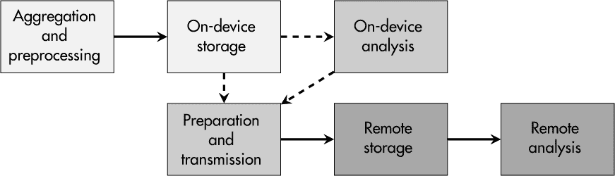

## 第十二章：系统监控**


监控常常带有负面含义，因为它暗示数据是被某人或某物用于监视。然而，许多数字商业模式，如预测性维护，如果没有监控和随后的数据分析，将无法正常运作。同样，设备的持续保护也需要数据日志记录和分析，以便检测和追踪恶意活动。

在 IT 系统中创建大量日志文件已经是几十年来的常见做法。然而，当谈到嵌入式系统时，日志可能没有得到应有的重视。在过去，存储容量低和缺乏互联网连接是将系统监控放在次要位置的合理理由，但幸运的是，如今这些限制已经逐渐减少。

在本章中，我将解释出于安全原因监控设备的好处。此外，我还将讨论嵌入式系统的资源限制，以及日志处理过程的多个方面及其管理。最后，本书的案例研究将探讨如何分析 STM32MP157F 设备上的可用日志数据。

### **出于正确的理由进行监控**

许多公司被指控为“数据克拉肯”，因为它们收集所有能够获取的数据，无论是来自网络服务、IT 基础设施，还是终端用户设备。对于这些公司而言，数据收集带来了盈利的商业模式，但这一发展显然与隐私保护的努力相冲突，隐私保护旨在防止人们被跟踪、监视和间谍行为。

在法律方面，欧洲的 GDPR 就是一种反对过度数据收集的例子，但其他法律要求——例如汽车行业的联合国 155 号规定、工业自动化行业的 IEC 62443-4-2 标准，以及北美电力可靠性公司（NERC）发布的《关键基础设施保护标准》（CIP-007-6）——明确要求对连接产品进行安全监控，且这些监控要由制造商或运营商负责。简而言之，务必意识到数据收集和监控的两面性必须始终保持谨慎平衡。

在某些领域，监控已经是常见的做法；例如，监控摄像头和安保人员时刻关注着建筑物和公司场所的物理安全威胁。银行业在监控交易并对异常活动作出反应方面有着悠久的传统。最后但同样重要的是，防火墙和入侵检测系统对网络流量的监控是每个理智的 IT 基础设施的一部分。出于安全目的收集数据和监控系统显然是可以接受的，但必须始终保持在合理范围内。

系统监控对设备安全有多方面的好处。日志数据在两个方面尤其有用。首先，对设备的每一次攻击都经历多个阶段，包括侦察、投递、利用、安装、指挥与控制、以及目标操作。每个阶段可能会在设备的日志文件中留下痕迹，从而使你能够早期检测到攻击，并作出相应反应，避免进一步损害。其次，日志数据在事件发生后的取证过程中可以是极为宝贵的资源。试想一下，你的设备在现场遭遇攻击，但没有任何数据来重建和理解发生了什么。处于这种情况中的盲目状态，不仅让你毫无头绪，还可能给你的业务带来重大风险。

总的来说，设备监控提高了你在现场设备群体中的透明度，并使你能够概览何时、何地以及如何使用你的产品。在关键基础设施中，这种监控甚至可能是履行法律或认证要求所必需的。此外，正如第九章中提到的，了解你在现场设备上部署的固件版本的状态，有助于理解客户的威胁态势。

除了纯粹的安全使用案例外，监控甚至可以作为处理和分析客户投诉的辅助工具。例如，日志数据可能证明最终用户进行了手动配置更改，导致设备进入未经授权的操作模式，超负荷运行的机械部件最终导致机器故障。

### **监控正确的内容**

运行 Linux 的嵌入式系统，与各种服务进行通信，并与传感器和执行器进行互动，已达到一种复杂性，使得在任何给定时间点记录整个设备状态变得不现实。唯一的选择是对系统属性和事件进行*选择性监控*。

**警告**

*日志系统数据是把双刃剑。它在故障排除过程中可能对服务工程师大有帮助，但如果日志中包含用户名、密码及其他敏感数据，攻击者可能会免费利用这些信息。*

#### ***用户互动与访问控制***

一个好的起点是监控与用户互动和访问控制相关的事件。

##### **用户会话**

如果人类登录到一个设备，他们的行为是有目的的，无论是授权的还是恶意的。了解用户的登录历史，并能将其与某个用户的实际活动相匹配，可能会揭示账户被滥用的情况。例如，与一个虚拟用户对应的人可能正在度假，因此显然不可能在进行操作。

此外，大量失败的登录尝试可能表明已经进行了暴力破解攻击。最后，用户会话的时间和日期信息可能有助于重建攻击的时间线。

##### **访问控制违规**

如第十一章所述，用户和进程应当被限制为完成任务所需的最低权限。除了运行时访问限制的积极效果之外，这些措施还可以提供关于哪个用户或进程*试图*访问禁止的资源的信息，这可能有助于在早期阶段发现攻击。

##### **文件系统活动**

突然出现的临时文件以及对配置或系统文件的永久性更改，可能表明存在恶意活动。它们可能由设备上运行的进程启动，可能是因为这些进程被利用了未知漏洞。但也有可能是人为用户发起了操控，这可能暗示着内部攻击。在这种情况下，至少监控一些关键文件及其事件可能非常有价值。

##### **可移动媒体**

有时，只需将 USB 闪存盘或内存卡插入设备，就可能触发攻击。如果你的产品提供此类功能，记录何时插入或移除这些存储介质的信息，甚至是它们的标识符，完全是有意义的。

#### ***通信***

尽管由于传输数据量庞大，通常无法监控设备所有通信通道上的所有数据，但某些元数据或特定发送或接收的信息可以提供有价值的洞察。

##### **网络通信**

从外部来源接收到的通信数据以及设备发送的数据，可能揭示恶意活动的线索。例如，来自某些 IP 地址的大量流量可能表示定向的 DoS 攻击。非标准的通信协议数据包可能代表攻击者在测试设备对被篡改请求的反应。

从设备到未知位置和 IP 地址的新连接，或异常增加的外向网络流量，也可能表明设备已被攻破。

##### **低级通信**

与传统 IT 系统不同，嵌入式系统通常具有多种低级接口，如 I²C 总线、串行连接或通用输入输出（GPIO）引脚。它们的通信通常携带传感器或控制数据，这可能再次成为检测异常行为的来源，例如强迫执行器进入危险操作模式。

记录这些接口的状态和通信数据可能不是标准功能，但根据它们的关键性，实施这一功能可能值得考虑。

#### ***应用行为***

与从用户或通信接口角度查看安全监控不同，考虑采用以应用程序为中心的方法可能更有意义。

##### **服务活动**

一些服务提供有关设备状态的有趣信息，特别是那些具有远程连接的服务。例如，允许远程会话的 SSH 守护进程可能提供带有相应 IP 地址和用户名的登录尝试历史记录。

Web 服务器还能够记录它接收到的 HTTP 请求，这可能揭示应用层通信中的敌对活动。

##### **自定义应用程序**

专有软件组件，例如与你的商业模式相关的，可能提供设备使用的深刻洞察。因此，将监控设施集成到你自己开发的重要应用程序中应该是很自然的。

##### **第三方应用程序**

每当你允许用户在设备上安装第三方开发的应用程序时，就面临着来自不可信软件组件的常见威胁。除了对这些程序进行严格的访问管理外，持续监控它们的行为也是一种合理的措施。

#### ***系统行为***

最后但同样重要的是，设备的整体“健康状态”可能揭示攻击或至少是你可以进一步分析的异常行为。

##### **系统利用率**

开发人员和维护人员通常了解典型的系统利用率值，如 CPU 负载和内存消耗。如果设备显示异常高的值，可能表明设备上运行了额外的软件，例如加密矿工或攻击者安装的后门服务。但它也可能只是针对低级或网络接口的攻击的副作用。

##### **进程和系统崩溃**

你的设备进程是否偶尔崩溃？我希望不是，但也许它们只是偶尔在你测试时没有覆盖到的极少数情况下崩溃。如果单个进程甚至整个系统多次崩溃，可能是攻击者正在探测设备的潜在漏洞。如果能够尽早检测并分析出来，你可能能够采取措施，防止进一步的损害。

##### **错误和警告**

尽管错误信息和警告可能是完全正常的设备行为的一部分，但它们也可能是敌对者在侦察阶段篡改设备服务或配置选项的证据。

#### ***基于风险的监控***

哪些监控措施对于你的产品是合理的，应该基于设备的威胁和风险分析来决定，如第一章中所述。例如，如果你发现高网络负载是设备实时操作的风险，监控网络通信和系统利用率是个好主意。如果设备允许运行第三方 Docker 容器，那么监控这些潜在危险软件包的活动应该在你的监控清单上。如果设备有用于配置的 Web 接口，那么记录 Web 服务器事件就成为一种必要措施。

**注意**

*可能存在更多针对您设备的安全监控有价值的信息来源。找到它们并利用它们来保护您的设备。*

### **设计监控方案**

虽然系统监控对于 IT 系统来说并不新鲜，但高效地实现它始终是一个挑战——尤其是在嵌入式系统上记录事件和过程时。根据特定产品的功能和使用要求，必须在设备端和基于服务器的处理之间找到一个折衷方案。

图 12-1 显示了日志数据的通用数据流架构，从数据的收集、本地存储到最终的设备端分析。尽管受限的设备会将这一部分保持得较为简洁，但较强的设备可能会聚合更多数据并已在设备端进行分析，以最大化潜在的洞察。



*图 12-1：通用日志架构*

通常，网络设备至少会将收集到的信息的一部分传输到远程服务器，无论是在本地网络上还是在互联网上。这不仅可以存储更多的日志数据，还可以进行对单个设备以及整个设备群体的性能密集型数据分析。尤其是后者，显著提高了安全监控的质量。

#### ***嵌入式系统的挑战***

当涉及到（I）IoT 场景中设备相对受限且可能存在相当大规模的人群时，监控过程的具体设计面临着几个挑战。

##### **有限资源**

嵌入式系统在多个维度上可能受到限制，这使得开发者在确定用于监控的资源量时面临困难。有些设备是电池供电的，收集（更不用说传输）日志数据会进一步增加电池的负担。对于基于小型微控制器的产品，出于性能考虑，日志数据的收集是不可能的，因为根本没有时间执行这些任务。有些系统的存储空间有限，只能存储少量的日志数据，而其他系统则没有将监控数据传输到中央服务器所需的高带宽网络连接。有些设备同时具备这些限制。

对于已经针对单一专用任务优化的现有产品而言，通常很难或几乎不可能将安全监控作为附加功能进行集成。但这不应成为放弃所有监控功能的借口。如果您能在开发生命周期的早期识别出安全监控的需求，您有机会为这一绝对相关的目的保留资源。

##### **同步时间源**

正确的时间戳对于设备内部及与其他设备和系统组件之间的事件关联至关重要。为此，时间源必须进行同步，而在嵌入式系统中这一点不能理所当然。

需要故意启用像 NTP 这样的同步协议支持，使用你产品的集成商以及这些系统的操作员必须提供适当的基础设施，如主时钟和网络中的时间服务器。

##### **安全通信**

从设备到中央收集服务器的监控数据的安全传输需要满足多个前提条件。设备必须能够验证中央服务器的身份，否则可能会被欺骗，向未经授权的方发送重要数据。

服务器也必须能够验证提供数据的设备的身份，因为虚假设备可能会通过发送篡改数据严重干扰监控过程。此外，数据传输本身应该在所有安全通信方面得到保护，具体如第七章所述。

##### **完整性保护的本地存储**

如果你决定部分或完全依赖设备端日志而不进行外部传输，你必须准备好回答这样一个问题：“你如何保证日志数据在某个时候没有被篡改？”这个问题甚至可能会由法律实体或法庭提问，例如，如果你的设备是某个国家关键基础设施的一部分。

如第八章所描述的系统完整性保护是解决这一挑战的根本要求。

##### **保密保护的本地存储**

如前所述，日志数据不仅对调试设备有用，也可能对攻击者在其侦察阶段有用。因此，你可以把日志文件视为需要保密保护的资产。

如第五章所解释的那样，像加密文件系统这样的措施可以作为一种解决方案。另一种选择是实施混合加密方案，使用中央日志服务器的公钥加密一个随机的本地对称密钥，该密钥用于加密本地生成的日志数据。在这种情况下，只有持有相应私钥的远程服务器才能解密和分析日志信息。

#### ***设备日志过程的监控***

持续的安全监控在检测攻击、及时响应事件以及在妥协后进行全面的取证分析中起着关键作用，这意味着涉及的设备日志过程必须正常运行。然而，假设监控过程天生稳健并能免疫所有影响是天真的。重要的是要安装措施，检查相关的日志过程是否正常工作。

无论本地日志存储只有几兆字节还是几个千兆字节，它始终是有限的。在某些情况下，可能会诱使人说某个内存可以存储“比某个特定设备可能生成的更多的日志事件”，但请记住，日志行为可能会随着未来固件版本的更新而变化，工业场景中的设备可能会运行数十年，并且新特性和内容可能会显著减少存储容量。因此，监控日志存储容量是一个必须执行的任务。此外，您还必须决定如果存储空间耗尽，或者甚至在发生之前如何应对。例如，如果可能的话，可以将日志压缩并归档到远程位置，或者通过新产生的日志事件覆盖最旧的事件。

除了本地存储容量问题外，用于传输日志数据的远程连接也可能会受到影响。您可以轻松想象，这种通信的带宽可能会突然下降，甚至完全断开连接。在这种情况下，设备需要决定是否将收集的数据临时存储在本地，直到重新建立连接并且远程位置能够跟上，或者是否至少部分或完全丢弃监控数据。

此外，您的日志应用程序可能会碰到未知的错误，或者对手可能故意攻击您的监控系统。这两种情况都可能导致关键系统部分崩溃，并让您在监控数据方面失去视线。即使您的设备不能从所有可能的情况中恢复，崩溃后自动重启监控服务并本地记录有关最终丧失监控能力的事件仍然是值得的。

#### ***集中日志分析与管理***

在许多使用案例中，拥有一个集中存储位置来监控数据，并对来自整个设备群体的信息进行分析和关联是非常有价值的。除其他优点外，这种方法使您能够在短时间内对现场的安全相关事件做出反应。如果攻击者正在篡改关键配置或系统文件，您可能希望尽快得知此事。这种方法还使您能够将设备日志数据的长期历史纳入当前分析中，并且一旦数据被传输，设备上对日志信息的篡改或破坏将变得显而易见。

然而，实施图 12-1 中显示的日志架构第二行并非易事。在（I）IoT 场景中，一个挑战可能是中央监控系统的可扩展性和相应分析能力的可用性。当然，这取决于你的设备群体的大小。虽然几千个产品可能是可管理的，但当监控六位数甚至更多设备时，可扩展性变得至关重要。这不仅需要大量的中央存储能力，还需要人员和算法来筛选所有数据，以识别意外的设备行为、出现的恶意活动或妥协指示符（IoC）。

用于此目的的系统通常被称为*安全信息和事件管理（SIEM）*系统，因为它们收集与安全监控相关的事件数据，并提供一种手段来找到“干草堆中的针”。这类分析平台的示例包括 Elastic Stack、Graylog 和 Splunk，仅举几例。虽然大数据分析和人工智能可以为此任务提供强有力的支持，但在许多情况下，判断和最终由人工专家进行手动调查是必需的。

如第一章所述，每个安全产品生命周期必须建立某种类型的事件和漏洞响应流程。确保操作 SIEM 系统的团队与产品开发和管理团队保持紧密联系，这将使你在事件和漏洞处理方面提高效率。

尽管中央监控系统和流程具有诸多优点，但不要忘记批判性地评估你*真正*需要哪些数据来支持你选择的监控方法。堆积大量不必要的数据不仅会使你的解决方案低效，还可能与欧洲 GDPR 或类似的法律发生冲突，特别是当你的数据库包含个人身份信息（PII）时。

**注意**

*如果你不熟悉 PII 收集的法律限制，请深入了解这个话题。即便是类似 IP 和 MAC 地址这样的“技术”数据也可能追溯到自然人，因此需要特殊处理，或者根本不应收集。*

### **案例研究：在 STM32MP157F 设备上记录事件**

本案例研究展示了从像 STM32MP157F-DK2 板这样的基于 Linux 的嵌入式系统中提取监控数据的典型工具和配置。

#### ***使用 journald 进行用户会话监控***

运行`systemd`的 Linux 系统，比如我的 STM32MP157F-DK2 固件，带有`journald`工具，该工具收集有关基本系统进程的有价值信息。

例如，列表 12-1 展示了一系列通过`grep logind`从`journalctl`中提取的日志条目。

```
# journalctl | grep logind
...
Apr 28 21:07:31 stm32mp1 systemd-logind[650]: New session c1 of user root.
Apr 28 21:13:51 stm32mp1 systemd-logind[650]: Session c1 logged out. ...
Apr 28 21:13:51 stm32mp1 systemd-logind[650]: Removed session c1.
Apr 28 22:54:57 stm32mp1 systemd-logind[650]: New session c2 of user root.
Apr 28 22:55:10 stm32mp1 systemd-logind[650]: Session c2 logged out. ...
Apr 28 22:55:10 stm32mp1 systemd-logind[650]: Removed session c2.
May 14 13:26:18 stm32mp1 systemd-logind[650]: New session c3 of user lservice.
May 14 13:39:24 stm32mp1 systemd-logind[650]: Removed session c3.
May 27 11:58:58 stm32mp1 systemd-logind[650]: New session c4 of user root.
```

*列表 12-1：用户会话的典型* journald *条目*

日志清晰地显示了 root 用户在 4 月 28 日有两次会话，以及本地服务用户`lservice`在 5 月 14 日登录了大约 13 分钟。如果这与公司技术人员的官方检查不符，可能意味着存在未授权访问。

`journald`守护进程可以运行在多种模式下，其中两种模式是*易失性*和*持久性*。第一种模式仅在系统重启之前存储日志数据，而第二种模式则使`journald`将日志数据持久化存储在*/var/log/journal*中，这对于取证可能非常有帮助。你可以在其配置文件*/etc/systemd/journald.conf*中设置相应的`Storage=persistent`选项。

进一步的配置参数，如`SystemMaxUse=`和`RuntimeMaxUse=`，以及`SystemKeepFree=`和`RuntimeKeepFree=`，分别决定了磁盘和内存存储的日志文件大小限制，以避免因日志文件占用过多内存而引发的关键问题。

#### ***使用 auditd 进行内核事件监控***

Linux 内核提供了一个审计框架，用于收集内核中可能涉及安全的事件信息。这个框架与 MAC 系统（如 SELinux 或 AppArmor）使用的框架相同，后者用于监视和限制对系统资源的访问，如第十一章中所述。

`auditd`用户空间工具基于该框架构建，并使设备的非易失性内存中能够持久存储安全事件。

##### **安装**

如果你已经成功安装了 AppArmor 或其他流行的 MAC 系统，那么审计框架可能已经启用并在运行中。否则，你可以在 Linux 内核的配置文件中设置`CONFIG_AUDIT=y`来启用它。

Yocto 的`meta-oe`层包含了安装`auditd`工具的配方，来自*meta-oe/recipes-security/audit*。你可以通过设置`IMAGE_INSTALL += "auditd"`将其简单地添加到你的镜像中。在使用新安装的软件启动系统后，你应该能看到系统中包含了*/var/log/audit/audit.log*文件，这是默认的持久化存储内核审计数据的位置。

##### **定制化**

审计框架是一个强大的工具，能够深入访问系统进程，因此，明确指定你要监控的事件类型非常重要。你可以使用`auditctl`向正在运行的`auditd`服务添加监视规则，如清单 12-2 中所示。

```
# auditctl -D
No rules
# auditctl -w /etc/passwd -p rwa -k users_credentials
# auditctl -l
-w /etc/passwd -p rwa -k users_credentials
```

*清单 12-2：使用* auditctl *添加审计规则*

`-D`参数会删除所有当前活动的规则。清单 12-2 中的第二个命令安装了一个规则，用于监视*/etc/passwd*文件（`-w /etc/passwd`）的读取（`r`）和写入（`w`）访问以及文件属性更改（`a`）。`-k`选项允许添加一个任意的键字符串，为规则赋予特定意义，并加速后续日志的搜索。

然而，`auditctl`设置的规则仅在系统重启之前有效。为了持久性地安装监视规则，你必须将它们添加到*/etc/audit/audit.rules*文件中。如清单 12-3 所示，该文件中的规则实际上等同于命令行中调用`auditctl`的内容，只是开头没有工具名称。

```
## SSH daemon configuration
-w /etc/default/dropbear -p wa -k ssh_config
-w /etc/dropbear -p rwa -k ssh_config

## Users and credentials
-w /etc/passwd -p rwa -k users_credentials
-w /etc/shadow -p rwa -k users_credentials

## auditd configuration
-w /etc/audit/ -p wa -k auditd_config

## Audit management tools
-w /sbin/auditctl -p x -k audit_tools
-w /sbin/auditd -p x -k audit_tools
```

*清单 12-3：持久性审计规则示例*

文件访问监视在多种场景下都非常有用。例如，如果你基于流行的`dropbear`守护进程启用了 SSH 访问设备，那么监视相应配置文件的变化是合理的，因为如果该文件被篡改，可能会为你的设备打开一个后门。此外，访问*/etc/passwd*和*/etc/shadow*通常是恶意活动的指示。高级攻击者也可能会攻击审计系统本身，这使得包含审计规则和审计工具的文件成为有效的监控目标。

启用规则后，你可以使用`ausearch`工具来过滤审计数据，正如清单 12-4 中展示的，针对已安装的 SSH 配置监视规则。

```
# ausearch -k ssh_config
time->Thu Apr 28 23:12:57 ...
type=PROCTITLE msg=audit(1651187577.140:366): proctitle=...
type=SYSCALL msg=audit(1651187577.140:366): arch=40000028 syscall=290 ...
... uid=0 gid=0 ... comm="auditctl" exe="/sbin/auditctl" ...
type=CONFIG_CHANGE ... op=add_rule key="ssh_config" ...
# touch /etc/default/dropbear
# ausearch -k ssh_config
...
time->Thu Apr 28 23:24:47 ...
type=PROCTITLE msg=audit(1651188287.600:379): proctitle=...
type=PATH msg=audit(1651188287.600:379): ... name="/etc/default/dropbear" ...
type=PATH msg=audit(1651188287.600:379): ... name="/etc/default/" ...
type=CWD msg=audit(1651188287.600:379): cwd="/home/root"
type=SYSCALL msg=audit(1651188287.600:379): arch=40000028 syscall=322 ...
... uid=0 gid=0 ... comm="touch" exe="/bin/touch.coreutils" ...
```

*清单 12-4：使用* ausearch *查找可疑活动*

第一次调用`ausearch`并使用`ssh_config`关键字时，报告指出一个新的规则已通过`auditctl`工具添加。之后，我只是触碰（甚至没有操作）位于*/etc/default/dropbear*的配置文件。第二次调用`ausearch`清楚地表明，root 用户（`uid=0 gid=0`）使用`touch`工具访问了文件*/etc/default/dropbear*，而且只是在新规则加载后 12 分钟内，就在*/home/root*目录下。这一示例展示了对于关键系统文件拥有监控数据的好处。

除了监视文件访问外，`auditd`还能够拦截系统调用。然而，由于此类规则直接影响性能，因此只有在认为绝对必要时，才应使用它们。

#### ***服务和应用程序事件日志记录***

虽然`auditd`提供了强大的服务来监视内核行为并记录对系统资源的访问，但它没有捕获你设备的重要部分：由服务和应用程序生成的特定事件。

##### **使用 syslog 记录应用程序事件**

在我的 STM32MP157F 固件中，BusyBox 实现了`syslogd`的一个最小版本，某些应用程序使用它将日志信息存储在*/var/log/messages*文件中。一个这样的应用程序示例是轻量级的`dropbear` SSH 守护进程。

清单 12-5 展示了多次 SSH 登录尝试后的对应日志信息。

```
# grep /var/log/messages -e dropbear
Apr 29 09:06:38 stm32mp1 authpriv.info dropbear[819]:
  Child connection from ::ffff:192.168.13.17:37214
Apr 29 09:06:40 stm32mp1 authpriv.notice dropbear[819]:
  pam_unix(dropbear:auth): ... rhost=::ffff:192.168.13.17  user=rservice
Apr 29 09:06:42 stm32mp1 authpriv.warn dropbear[819]:
  pam_authenticate() failed, rc=7, Authentication failure
Apr 29 09:06:42 stm32mp1 authpriv.warn dropbear[819]:
➊ Bad PAM password attempt for 'rservice' from ::ffff:192.168.13.17:37214
Apr 29 09:06:51 stm32mp1 authpriv.notice dropbear[819]:
➋ PAM password auth succeeded for 'rservice' from ::ffff:192.168.13.17:37214
Apr 29 09:07:01 stm32mp1 authpriv.info dropbear[819]:
➌ Exit (rservice) from <::ffff:192.168.13.17:37214>: Disconnect received
Apr 29 09:07:11 stm32mp1 authpriv.info dropbear[825]:
  Child connection from ::ffff:192.168.13.17:48656
...
Apr 29 09:07:16 stm32mp1 authpriv.warn dropbear[825]:
  Bad PAM password attempt for 'root' from ::ffff:192.168.13.17:48656
...
Apr 29 09:07:20 stm32mp1 authpriv.warn dropbear[825]:
  Bad PAM password attempt for 'root' from ::ffff:192.168.13.17:48656
...
Apr 29 09:07:23 stm32mp1 authpriv.warn dropbear[825]:
  Bad PAM password attempt for 'root' from ::ffff:192.168.13.17:48656
Apr 29 09:07:23 stm32mp1 authpriv.info dropbear[825]:
➍ Exit before auth from ...: (user 'root', 3 fails): Exited normally
```

*清单 12-5：通过* syslogd *记录的 SSH 登录尝试*

日志数据首先显示了一个 `Bad PAM password attempt` ➊，是针对用户 `rservice` 的，紧接着是同一用户的成功 `PAM password auth` ➋。建立的会话仅在 10 秒后 ➌ 被关闭。此外，还可以看到对 root 用户的三次失败登录尝试，最终导致 SSH 守护进程退出登录过程 ➍。这样的日志数据对于检测 SSH 账户的暴力破解攻击或来自不寻常用户和意外 IP 地址的登录尝试非常有用。

##### **使用特定应用程序的日志文件**

有些应用程序默认不依赖于 `syslogd` 的服务，而是创建和管理自己的日志文件。一个例子是运行在我的 STM32MP157F-DK2 板上的 `apache2` web 服务器。它的日志文件 *access_log* 和 *error_log* 可以在 */var/log/apache2/* 下找到。Listing 12-6 显示了来自 IP 地址 192.168.13.17 的示例 HTTP 请求。

```
# cat /var/log/apache2/access_log
...
192.168.13.17 - - [29/Apr/...09:35:46 +0000] "GET / HTTP/1.1" 200 45
192.168.13.17 - - [29/Apr/...09:35:58 +0000] "GET /admin/ HTTP/1.1" 404 196
192.168.13.17 - - [29/Apr/...09:36:27 +0000] "GET /config/ HTTP/1.1" 404 196
192.168.13.17 - - [29/Apr/...09:37:29 +0000] "GET /cgi-bin/ HTTP/1.1" 404 196
192.168.13.17 - - [29/Apr/...09:38:33 +0000] "GET / HTTP/1.1" 200 45
...
```

*Listing 12-6: 来自 apache2 的示例访问日志条目*

这些信息不仅提供了 web 服务器成功交付的网页的历史记录，还揭示了可能暴露典型侦察阶段的敌对活动的请求。在这里，攻击者检查了 */admin/*、*/config/* 和 */cgi-bin/* 子目录的可用性。再次强调，早期检测可以防止后续攻击和损害。

#### ***日志记录到远程服务器***

所有前面提到的工具都在设备上本地运行，当你拥有设备的物理或远程访问权限时，这可能足以满足设备特定的取证需求。然而，正如本章前面所提到的，集中收集日志数据在许多方面是有益的。虽然建立中央监控基础设施超出了本书的设备中心化重点，但我想指出的是，所有这些工具收集的数据都可以传输到远程位置。

例如，`journald` 守护进程可以通过一个名为 `systemd-journal-remote` 的服务扩展，用于将数据记录到远程服务器。`audisp` 工具及其 `audisp-remote` 插件可以实现通过 Linux 审计框架和 `auditd` 收集的数据的中央日志聚合。或者，可以使用像 `auditbeat` 这样的特定工具将审计数据发送到 Elastic Stack。进一步地，`rsyslog` 和 `syslog-ng` 是现代的 `syslog` 实现，它们允许将日志记录到远程位置。最后，其中一些工具甚至是互操作的，这意味着例如 `journald` 可以配置为将日志数据转发给一个 `syslog` 守护进程，后者可以负责远程传输。

### **总结**

请求一个设备聚合并传输系统数据和事件信息到中央服务器是很简单的。然而，当你开始实施这些措施时，你会遇到多个障碍需要克服，从法律问题到设备限制，再到持续运营安全监控服务所需的人力资源。

本章讨论了对嵌入式系统进行安全监控时可能有用的典型信息，从用户会话及其交互到网络流量元数据，再到系统崩溃和错误消息。显然，你想监控的内容越多，就需要更多的设备端和服务器资源。基于风险的方法完全合理，可以在全面的设备透明度和最小资源使用之间找到折衷，适用于你的具体产品。

系统监控是防御深度策略中的一个重要层级，因为即使你实施的所有保护措施都失败，监控仍然可能帮助你检测到正在进行的攻击和异常。监控可以决定是只是受损而有些代价，还是完全毁掉你的产品和公司的声誉。
