## 第二章：**1

设置**

*千里之行，始于足下。*

–老子


欢迎进入您黑客之旅的第一步。在本章中，我们将设置您的实验室环境，它将包含五台虚拟机：

**pfSense 虚拟机** 一款开源路由器/防火墙，用于保护易受攻击的虚拟机免受外部黑客的攻击。

**Kali Linux 虚拟机** 这台机器包含了本书中讨论的黑客工具。

**两台 Ubuntu Linux 桌面虚拟机** 我们将使用这两台机器演示如何对桌面/笔记本环境进行攻击。

**Metasploitable 虚拟机** 我们将使用这台机器演示如何对 Linux 服务器进行攻击。

### 虚拟实验室

由于入侵不属于自己的机器既不道德也非法，我们将在本章中建立一个虚拟实验室环境，您可以在其中进行道德黑客实验。图 1-1 展示了实验室环境的概览。

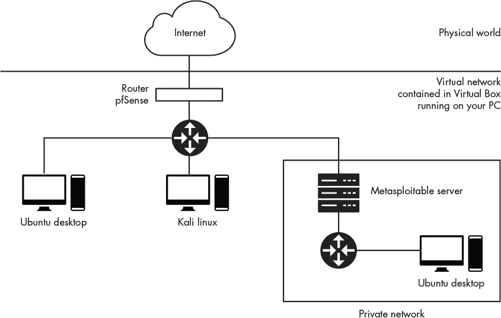

*图 1-1：虚拟机连接*

我们还将设置两个网络：一个主内部网络，它通过 pfSense 防火墙与互联网隔离；另一个是一个私有网络，它通过 Metasploitable 服务器与主网络隔离。我们将使用第二种设置来探索黑客必须先越过一台机器才能攻击另一台机器的攻击方式，就像防火墙的情况一样。本章将重点设置主网络，而私有网络的配置将留到第十四章再讲。

暂时不需要担心这些配置的技术细节；我会在本书的后续章节中逐步介绍基础设施。我建议您开始设置过程时，使用一台至少有 30GB 可用硬盘空间和 4GB 内存的 Windows、Linux 或 macOS 机器。由于您将同时运行多个虚拟机，因此需要一台相对强劲的计算机。

### 设置 VirtualBox

为了设置我们的网络环境，我们需要安装*VirtualBox*。可以将 VirtualBox 看作一个让您创建虚拟计算机的程序。您将选择虚拟机的规格（例如，硬盘、内存大小和处理器数量），然后 VirtualBox 会组装出一台能够运行程序的虚拟计算机，跟您在笔记本或台式机上运行程序一样。VirtualBox 在 Linux、Mac 和 Windows 机器上都可以免费使用。

从*[`www.virtualbox.org/wiki/Downloads/`](https://www.virtualbox.org/wiki/Downloads/)*下载 VirtualBox，确保下载适合您计算机操作系统和架构的正确安装文件。接下来，按照安装过程进行操作，具体步骤会根据您使用的计算机类型有所不同；不过，通常情况下您可以选择默认选项。安装完成后，启动 VirtualBox，您应该会看到类似于图 1-2 的界面。

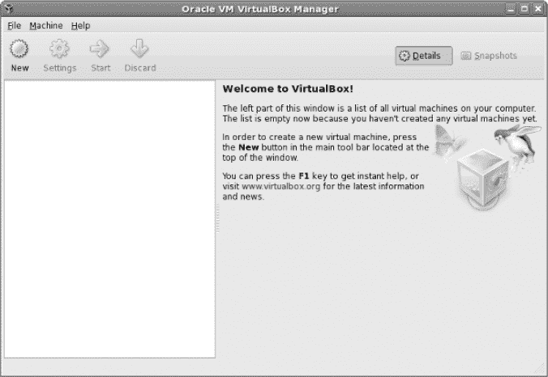

*图 1-2：VirtualBox 首页屏幕*

### 设置 pfSense

现在我们将设置 *pfSense*，一个开源路由器/防火墙，它将保护我们的虚拟机免受外部攻击。以下步骤将指导你完成设置过程。请务必仔细遵循。首先，从 *[`www.pfsense.org/download/`](https://www.pfsense.org/download/)* 下载 pfSense 源文件。选择 AMD64 (64-bit) 架构、DVD 镜像 (ISO) 安装程序，并选择离你最近的服务器位置，然后点击下载按钮。图 1-3 显示了这些参数。

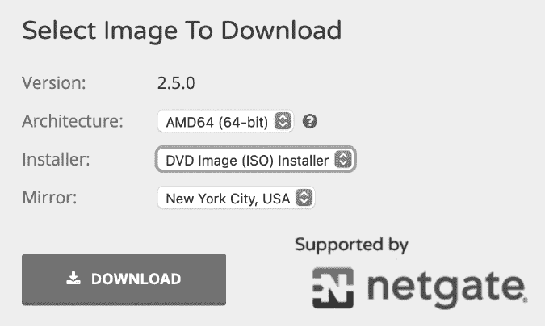

*图 1-3：选择这些设置以下载 pfSense。*

解压下载的 pfSense *iso.gz* 文件。如果你使用的是基于 Unix 的系统，可以通过在终端输入 `**gunzip**` 后跟下载文件的名称（例如，`gunzip pfSense iso.gz` `*filename*`）来解压。启动 VirtualBox，点击顶部选项栏中的**新建**按钮，如图 1-4 所示。


*图 1-4：新建按钮由爆炸符号表示。*

系统会提示你输入一些关于新机器的信息。以下示例适用于 macOS 上的 VirtualBox，但 Linux 和 Windows 版本也类似。输入**pfSense**作为名称，**BSD**作为类型，**FreeBSD (64-bit)**作为版本。一旦更改了这三个选项，如图 1-5 所示，点击**继续**。

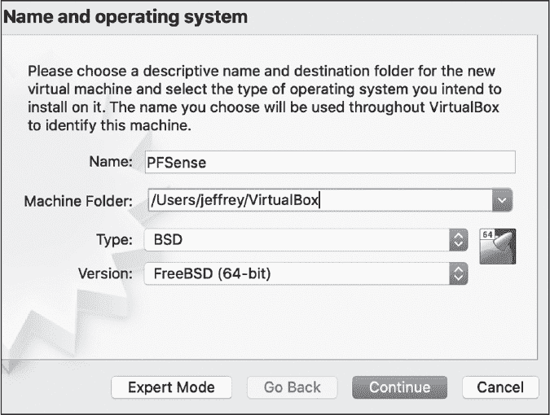

*图 1-5：创建 pfSense 虚拟机时输入这些设置。*

pfSense 虚拟机不需要太多内存，所以将内存大小设置为**1024MB**。在提示虚拟硬盘选项时，选择**现在创建虚拟硬盘**。选择**VDI (VirtualBox 磁盘镜像)** 作为硬盘文件类型。将新的虚拟硬盘设置为动态分配，并将其大小设置为 5GB，这对 pfSense 安装来说足够了。

**注意**

*安装新版本 pfSense 时，用户需要选择 Auto (UFS) BIOS 选项。*

#### *设置内部网络*

你可以将 pfSense 防火墙视为一个守门员，位于互联网和你的内部网络之间。它会检查进出网络的流量，确保你的内部网络免受外部攻击者的侵害。这为你提供了一个安全的空间，可以添加仅供你攻击的易受攻击的机器。

右键点击虚拟机列表中的**pfSense**，然后点击**设置**（图 1-6）。

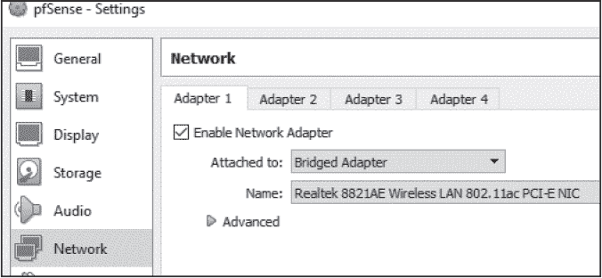

*图 1-6：设置网络适配器*

点击**网络**选项卡，确保在**适配器 1**选项卡中启用了网络适配器，并且该适配器连接到了与您的无线/Ethernet 网卡同名的**桥接适配器**。启用桥接适配器后，pfSense 虚拟机将与互联网建立直接连接。接下来，点击**适配器 2**选项卡，确保启用了**启用网络适配器**，并且它连接到了一个我们将命名为**内部局域网**的**内部网络**。这个内部网络将使 pfSense 与其他虚拟机连接。点击**确定**后，其他虚拟机应该可以访问该内部网络。

#### *配置 pfSense*

现在我们准备启动 pfSense 并配置我们的虚拟路由器设置。配置错误可能会导致您的虚拟机无法访问互联网。

双击虚拟机列表中的**pfSense**。您应该会看到类似于图 1-7 的屏幕。点击文件夹图标，然后点击左上角的**添加**图标。导航到并选择您的 pfSense ISO 镜像，然后点击**启动**。

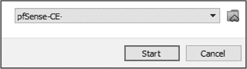

*图 1-7：选择 pfSense ISO 镜像*

pfSense 虚拟机需要一些时间才能启动。一旦启动，您应该会看到版权和分发通知屏幕。按 ENTER 键接受并再次按 ENTER 键以安装 pfSense。作为经验法则，保持默认选项即可。

安装完成后，您应该会看到一个提示，询问是否要重新启动。选择**重新启动**并按 ENTER 键。当 pfSense 重新启动时，您将再次看到版权和分发通知。这是因为 pfSense 虚拟机又一次从我们之前使用的 ISO 镜像启动。要解决此问题，首先点击 pfSense 机器左上角的**文件**选项卡，然后点击**关闭**。您会看到一个对话框，询问如何关闭虚拟机。选择**关闭计算机**并点击**确定**，如图 1-8 所示。

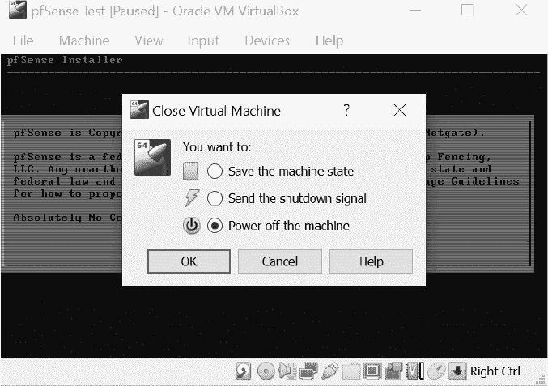

*图 1-8：关闭 pfSense 以移除 ISO 镜像*

一旦 pfSense 虚拟机关闭，右键点击虚拟机列表中的它，并选择**设置**。导航到**存储**选项卡，右键点击您之前选择的 ISO 镜像。然后选择**移除附件**，如图 1-9 所示。系统会提示您确认是否删除光驱。选择**移除**，然后点击设置屏幕右下角的**确定**。

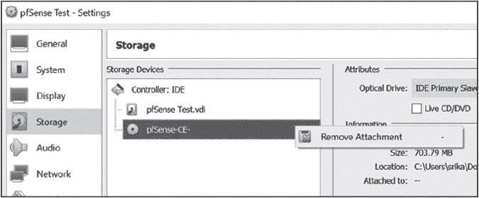

*图 1-9：移除 pfSense ISO 镜像*

现在您已经移除了 ISO 镜像，双击虚拟机列表中的**pfSense**。启动过程可能需要一些时间。一旦 pfSense 启动，您应该会看到如下画面：

```
Welcome to pfSense                (amd64) on pfSense

WAN (wan)       -> em0        -> v4/DHCP4: 192.1689.1.100/24
LAN (lan)       -> em1        -> v4: 192.168.100.1/24

0) Logout (SSH only)                  9) pfTop

1) Assign Interfaces                 10) Filter Logs

2) Set interface(s) IP address       11) Restart webConfigurator

3) Reset webConfigurator password    12) PHP shell + pfSense tools

4) Reset to factory defaults         13) Update from console

5) Reboot system                     14) Disable Secure Shell (sshd)

6) Halt system                       15) Restore recent configuration

7) Ping host                         16) Restart PHP-FPM

8) Shell
```

### 设置 Metasploitable

Metasploitable 虚拟机是一个被故意设计为脆弱的 Linux 服务器。它是我们将在本书中进行攻击的目标机器。但在开始之前，我们需要防止其他人访问这台机器。为此，我们将它连接到我们的内部网络，该网络由 pfSense 防火墙保护。以下步骤将说明如何获取虚拟机。

从 Sourceforge 下载 Metasploitable 虚拟机，网址为 *[`sourceforge.net/projects/metasploitable/`](https://sourceforge.net/projects/metasploitable/)*。虽然有更新版本的 Metasploitable，但我们将使用版本 2，因为它更容易设置。

解压下载的 Metasploitable ZIP 文件，启动 VirtualBox，然后点击 **新建** 按钮。将虚拟机名称设置为 **Metasploitable**，类型设置为 **Linux**，版本设置为 **Ubuntu (64-bit)**，然后点击 **继续**。在内存大小页面，使用建议的内存大小。当提示选择硬盘时，选择 **使用现有虚拟硬盘文件**，点击文件夹图标，浏览到解压后的 Metasploitable 下载文件。选择扩展名为 *.vmdk* 的文件，然后点击 **创建**。要配置 Metasploitable 虚拟机的网络设置，从左侧机器列表中右击 Metasploitable 虚拟机并选择 **设置**。进入 **网络** 标签页。在 **适配器 1** 下，勾选 **启用网络适配器** 复选框，并在 **附加到** 下拉菜单中选择我们之前创建的内部网络 (**Internal LAN**)，如 图 1-10 所示。

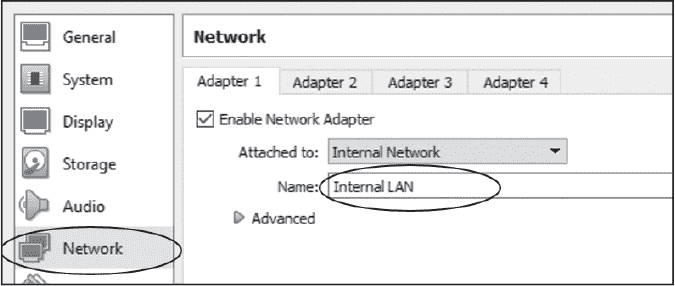

*图 1-10：配置 Metasploitable 内部网络*

在 VirtualBox 中打开 Metasploitable 虚拟机，等待终端加载完成。它应显示如 图 1-11 所示的 Metasploitable 标志。

**注意**

*你的鼠标指针可能会消失。这是因为虚拟机已捕获了鼠标指针。按下主机键组合（Windows 和 Linux 为右 CTRL，macOS 为 CTRL-ALT）来恢复鼠标指针。*

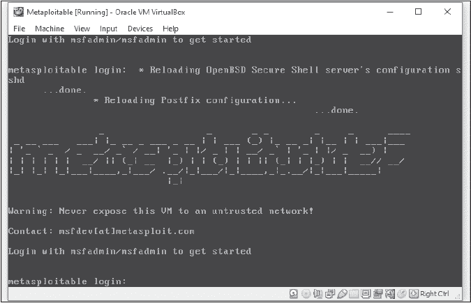

*图 1-11：Metasploitable 虚拟机启动后的界面*

使用用户名 **msfadmin** 和密码 **msfadmin** 登录。

### 设置 Kali Linux

*Kali Linux* 是一个包含渗透测试工具集的 Linux 发行版。我们将使用 Kali 虚拟机来攻击虚拟网络中的其他机器。从 *[`www.offensive-security.com/kali-linux-vm-vmware-virtualbox-image-download/`](https://www.offensive-security.com/kali-linux-vm-vmware-virtualbox-image-download/)* 下载 Kali Linux VirtualBox 镜像。确保所列文件是 Kali Linux VirtualBox 镜像，而不是 VMWare 镜像，并选择适合你系统的 VirtualBox 镜像版本（64 位或 32 位）。通过右键点击下载的 **OVA** 文件并使用 VirtualBox 打开它，将 Kali 虚拟机添加到 VirtualBox。你应该会看到一个包含预配置设置的屏幕。在页面的左侧，你应该会看到一个文件夹图标。点击它并选择你下载的 OVA 文件。

**注意**

*在调整网络设置之前，请确保你的虚拟机已关闭。*

要配置网络设置，从左侧的虚拟机列表中右键点击 Kali 虚拟机，然后选择 **设置**。点击 **网络** 标签，然后点击 **适配器 1**。勾选 **启用网络适配器** 复选框，并在下拉菜单中将 **附加到** 设置为 **内部网络**。保持名称为 “Internal LAN” 并点击 **确定**。

在 VirtualBox 中打开 Kali Linux 虚拟机。如果你的 Kali Linux 只显示黑屏，确保在 **设置** ▶ **常规** ▶ **处理器** 中选中了 **PAE/NX** 复选框。

一旦你的机器启动，你应该会看到 图 1-12 所示的 Kali Linux 登录屏幕。


*图 1-12：Kali Linux 登录屏幕*

使用用户名 **kali** 和密码 **kali** 登录。

**注意**

*在 Windows 上安装 VirtualBox 时，用户需要安装 VirtualBox 扩展包。*

### 设置 Ubuntu Linux 桌面

现在我们将设置 Ubuntu Linux 桌面虚拟机。我们将使用这台机器演示黑客如何攻击受害者的桌面或笔记本电脑。以下步骤概述了如何下载和配置 Ubuntu。在这里，我们只配置连接到我们内部 LAN 的 Ubuntu 机器。我们将在 第十四章 中配置另一台与私人网络相关的 Ubuntu 机器。

从*[`ubuntu.com/download/desktop/`](https://ubuntu.com/download/desktop/)*下载最新的 Ubuntu ISO 镜像。启动 VirtualBox，点击顶部选项栏中的**新建**按钮，如图 1-4 所示。系统会提示你输入新机器的一些信息。输入**Ubuntu**作为名称，类型选择**Linux**，版本选择**Ubuntu（64 位）**，然后点击**继续**。接着，分配**2048MB**的内存和**10GB**的硬盘。 （记得附加 ISO 镜像。）Ubuntu 比 pfSense 运行时需要稍微多一点的硬盘空间和内存。最后，将 Ubuntu Linux 机器连接到内部网络，就像你之前为 Metasploitable 虚拟机所做的一样。

启动 Ubuntu 机器，选择所需语言，然后点击**安装 Ubuntu**。图 1-13 展示了安装界面第一页的示例。

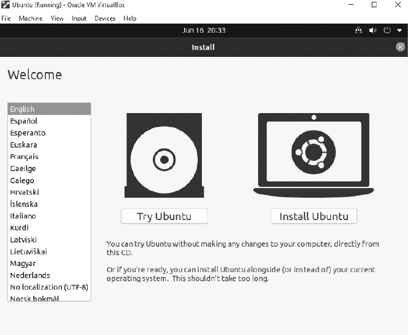

*图 1-13：Ubuntu Linux 安装界面*

关闭 Ubuntu 虚拟机。我们直到第十章之前都不需要它了。

### 你的第一次黑客攻击：利用 Metasploitable 中的后门

现在你已经设置好了所有内容，让我们通过执行一次攻击来测试虚拟实验室基础设施。我们的目标是通过利用一个叫做*后门*的漏洞，获取对 Metasploitable 机器的访问权限。后门是一个故意设置的漏洞，允许攻击者获得未经授权的访问。

2011 年 7 月，安全社区发现攻击者在开源 UNIX FTP 服务器 vsftpd 2.3.4 版本的代码中插入了一个后门。这是开源软件的一个缺点：恶意开发者有可能破坏开源项目。

这个特定的后门允许攻击者获得对易受攻击机器终端的访问。攻击者只需使用以`:)`结尾的用户名和无效密码登录 FTP 服务器。一旦攻击被激活，它会在 6200 端口打开一个*shell*。Shell 是一个连接到攻击者机器的程序，允许攻击者在被攻陷的机器上执行终端命令。

让我们利用 Metasploitable 服务器上的这个漏洞进行攻击。我们将首先获取 Metasploitable 机器的 IP 地址。

在继续之前，请确保你的 pfSense 虚拟机正在运行。你将需要它来访问互联网。

#### *获取 Metasploitable 服务器的 IP 地址*

大多数黑客攻击的第一步是识别我们要连接的机器。正如我们在第二章中将详细讨论的，每台机器都有一个唯一的 IP 地址。在本节中，我们将展示如何使用`netdiscover`工具获取 Metasploitable 服务器的 IP 地址。

通过点击菜单左上角的图标，打开 Kali Linux 机器上的终端。输入命令`**netdiscover**`。如果终端显示找不到该命令，或者提示你必须以 root 身份运行，请使用`sudo`运行：

```
kali@kali:~$ sudo netdiscover
```

`netdiscover`工具会在你的网络上搜索多个 IP 地址，发现当前正在使用的 IP 地址，帮助你查看当前连接到同一局域网的所有机器。几分钟后，`netdiscover`应该能够发现 Metasploitable 服务器及其 IP 地址，并以类似于此图的形式显示：

```
IP               At MAC Address     Count     Len  MAC Vendor / Hostname

---------------------------------------------------------------------------

192.168.100.1    08:00:27:3b:8f:ed      1      60  PCS Systemtechnik GmbH

192.168.100.101  08:00:27:fe:31:e6      1      60  PCS Systemtechnik GmbH
```

为了简化操作，请确保只运行 pfSense、Metasploitable 和 Kali 虚拟机。这将减少网络上虚拟机的数量，并使读取`netdiscover`工具输出结果更容易。

第一个 IP 地址属于 pfSense 路由器，第二个 IP 地址属于 Metasploitable 机器。（你的地址可能不同。）通常情况下，地址最小的机器是路由器，或者在这个案例中是所有进出网络流量都会通过的防火墙。你的 Metasploitable 服务器很可能就是第二个 IP 地址。

现在你已经获得了服务器的 IP 地址，你应该能够访问该服务器所托管的网页。点击 Kali 机器左上角的蓝色 Kali 标志。接着，打开 Kali Linux 的网页浏览器，输入你发现的 IP 地址，如图 1-14 所示。

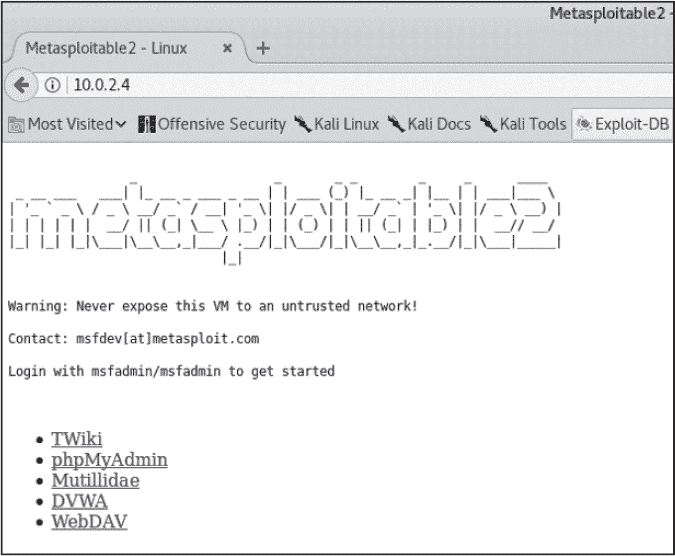

*图 1-14：Kali Linux 浏览器中的 Metasploitable 机器*

如果你能够看到网页，说明你的 Metasploitable 机器和 Kali Linux 机器已经正确连接到内网。

#### *利用后门获取访问权限*

现在，我们将利用后门访问 Metasploitable 机器。使用 Netcat（`nc`），一个支持多种网络功能的命令行工具，连接到 FTP 服务器。在这里，我们将使用它来打开一个 TCP 套接字连接到服务器。（我们将在第三章中讨论 TCP 套接字。）

打开 Kali 机器上的终端并输入以下命令：

```
kali@kali:~$ nc <IPaddressofyourMetasploitablevirtual machine> 21
user Hacker:)
pass invalid
```

第一个命令末尾的值是端口号。FTP 服务器通常运行在 21 端口。我们将在第三章中讨论端口号的概念，但现在你可以将其理解为操作系统分配给程序的通信通道。程序 A 可能在 21 号通道上进行通信，而程序 B 则可能在 6200 号通道上进行通信。

现在你已经激活了与后门相关的 shell，打开一个新的终端窗口，输入以下命令连接到 Metasploitable 机器上应该运行的 6200 端口上的 shell：

```
kali@kali:~$ nc -v <IPaddressofyourMetasploitable virtualmachine> 6200
```

连接成功后，终端看起来似乎没有响应。但实际上并非如此，它只是等待你输入命令。输入`**ls**`命令列出当前目录中的所有文件。

现在你应该能够在 Kali Linux 终端中输入命令，并使其像在 Metasploitable 机器的终端中输入一样执行。例如，使用 shell 通过在 Kali 机器的终端中输入以下命令来重启机器，然后观察 Metasploitable 机器发生了什么：

```
whoami
reboot
```

如果攻击执行正确，Metasploitable 机器将重启。虽然重启机器看起来不那么危险，但拥有 root 权限的攻击者可以做更多事情；例如，通过运行命令`**rm -rf/**`删除服务器上的所有数据。不要在 Metasploitable 上运行这个命令！它将删除机器上的所有数据，你将不得不重新进行设置过程。

我们如何修复这个漏洞呢？新版的 vsftpd 已经识别并修复了这个问题，因此保护此服务器的最佳方法是更新 vsftpd。然而，Metasploitable 机器设计为易受攻击，因此未配置为支持更新。
