## 第四章：分析捕获的流量**

*互联网就像是一个在教室里传递纸条的世界。*

– 乔恩·斯图尔特


在第二章中，你学习了黑客如何在咖啡店利用 ARP 欺骗攻击截取受害者的互联网流量。现在让我们实际查看这些流量。在本章中，我们将使用两个工具，*Wireshark*和*TCPDump*，从我们截获的未加密数据包中窃取私人数据。我还将介绍协议的概念，并讨论互联网的通用软件架构。最后，我们将通过分析防火墙收集的包来帮助你检测网络上的攻击。

### 数据包和互联网协议栈

*协议*是规定系统之间通信规则的一组规范。例如，当人类沟通时，我们首先交换“你好”的问候语，然后交换信息，最后以“再见”结束对话。同样，当浏览器想要了解如*[`cs.virginia.edu/`](https://cs.virginia.edu/)*网站的 IP 地址时，它使用*域名系统（DNS）*协议与 DNS 服务器进行通信。它首先发送一个 DNS 查询，请求*[`cs.virginia.edu/`](https://cs.virginia.edu/)*的 IP 地址。然后，DNS 服务器会响应 IP 地址。图 3-1 展示了人类通信和 DNS 协议的协议顺序图。

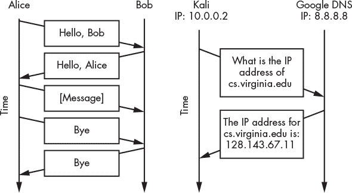

*图 3-1：展示人类通信协议和 DNS 通信协议示例的协议顺序图*

除了规定通信规则外，协议还决定了信息在数据包中的排列方式。在英语中，我们通常说“你好，爱丽丝”，而很少说“爱丽丝你好”，因为英语语言规则规定问候语应该在名字前面。互联网协议也类似。它们通常要求数据包头部包含特定的信息。回到第二章的信件示例，图 3-2 展示了信封上的地址字段如何类比于数据包头部。

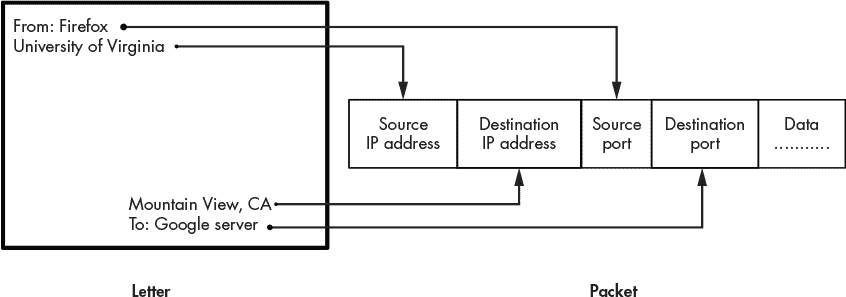

*图 3-2：数据包中的头部字段如何像信封上的地址一样*

除了 IP 地址之外，图中还包含了源端口号和目标端口号的头字段，这些端口号由操作系统分配，当它允许一个进程通过网络通信时。端口号是唯一的，这意味着计算机上的两个进程不能使用相同的端口号。*进程*是一个抽象，表示一个正在运行的程序。例如，当你打开你的网页浏览器时，计算机的操作系统会启动一个与该浏览器关联的进程。当一个进程想要通过网络发送和接收信息时，操作系统会为该进程分配一个端口号。你可以把这个号码想象成一个港口。例如，目标是你的 Web 服务器的数据包通常会到达你 IP 地址 192.168.1.100 的端口 443。因此，端口将内部进程暴露给网络。

端口是必要的，因为它们允许你计算机上的多个进程同时与互联网通信，如图 3-3 所示。

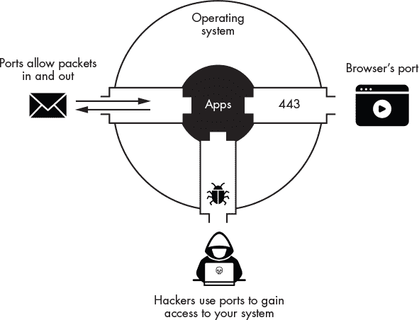

*图 3-3：端口如何允许数据包进出系统*

当你的操作系统接收到来自网络的数据包时，它会检查端口号，以决定该数据包是用于浏览器还是即时通讯软件。然而，端口也带来了安全风险，因为它们会将你的计算机暴露给外部攻击者。攻击者通常会做的第一件事就是扫描机器以发现开放的端口。如果一个端口接受来自外部进程的连接，它就是开放的。如果攻击者发现了开放的端口，他们将试图通过发送恶意数据包来感染你的计算机。我们将在第四章讨论如何扫描开放端口并利用相关的漏洞进程。

#### *五层互联网协议栈*

为了解决为互联网设计软件的复杂性，工程师们决定将架构抽象成五个独立的层次。每一层负责管理网络中特定组件之间的通信。例如，网络层管理互联网路由器之间的通信，而应用层则管理应用程序之间的通信，如 BitTorrent 客户端。

每一层都是独立的，这意味着它的操作不会受到其他层所执行操作的影响。协议栈通过一个叫做*封装*的过程实现这一点，在这个过程中，每一层将来自上层的信息视为通用数据，并不会尝试去解释它。图 3-4 展示了信息如何在每一层进行封装，最终在物理层传输。

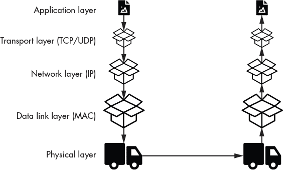

*图 3-4：五层互联网协议栈*

假设用户正在编写电子邮件。这发生在应用层。如你所见，邮件相关的消息随后被放置在传输层的数据包中。传输层不会以任何方式读取或修改电子邮件内容。它只是将处理所需的信息标记在数据包上。这些传输层数据包随后被放入网络层数据包中，再经过数据链路层数据包，最终才会被传输。通过将每个数据包封装并用其自己的头部进行标记，每一层可以在不依赖于其他层的信息的情况下做出决策。图 3-5 展示了五层互联网协议栈的概览，以及其头部和组成部分。这种分层的方法允许同一层的两个组件像网络中唯一的组件一样进行通信。例如，当你的网页浏览器向 *[`google.com`](https://google.com)* 发送请求时，它完全不知道处理该请求的路由器。因此，看起来就像是网页浏览器直接与 Google 服务器进行通信。现在让我们更仔细地看看每一层。

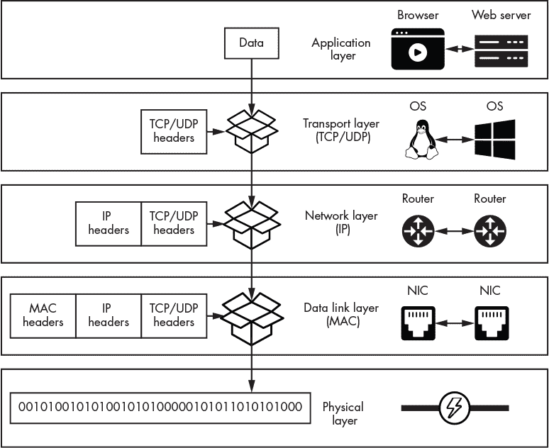

*图 3-5：五层互联网协议栈中每一层的网络组件通信情况*

##### 应用层

*应用层*负责应用程序之间的通信；例如，在你的 Firefox 浏览器和弗吉尼亚大学的网页服务器之间。应用层协议有多种。*超文本传输协议（HTTP）*将网页发送到浏览器，而*文件传输协议（FTP）*将文件上传到服务器。这是软件开发人员可以定义自己协议的最简单层之一。DNS、FTP 和 BitTorrent 是一些应用层协议的例子。在本书中，你将修改各种应用层协议。例如，在第七章中，你将编写一个使用修改版简单邮件传输协议（SMTP）发送假电子邮件的 Python 程序。一些恶意程序定义了自定义协议来避免被检测，而其他程序则以意想不到的方式使用现有协议，例如使用 DNS 进行*命令与控制*。不用担心，我将在下一章讨论这个问题，届时你将实现自己的简单自定义应用层协议。

##### 传输层

*传输层*负责管理通过互联网进行通信的进程之间的通信。由于其设计上的局限性，互联网并不总是可靠地传输数据包。你可能已经注意到，在视频聊天或玩游戏时，数据包丢失的情况。这一层有两个主要协议：*传输控制协议（TCP）*，它保证数据包已到达目的地，和*用户数据报协议（UDP）*，它较为简单，且不提供任何保证。

##### 网络层

*网络层*负责控制数据包在网络中路由器之间的流动。IP 地址在此层中实现。你可以使用 `traceroute` 工具查看数据包经过的每个路由器。`traceroute` 工具使用一种名为 *互联网控制消息协议（ICMP）* 的网络层协议来构建探测网络的包，以了解数据包的传输路径。你可以通过以下命令运行 `traceroute`：

```
kali@kali:~$ traceroute www.virginia.edu

traceroute to uvahome.prod.acquia-sites.com (54.227.255.92)

 1 pfSense.localdomain (192.168.1.1)  0.55 ms  .66 ms  0.61 ms

 2 1.0.0.1 (10.0.0.1)  3.077 ms  1.011 ms  2.894 ms

 .......
```

该命令通过三包数据探测每个路由器，然后记录每个数据包到达路由器的时间。如你所见，我们遇到的第一个路由器是实验室环境中的 pfSense 路由器。第二个路由器位于咖啡店。

##### 数据链路层

*数据链路层*负责网卡之间的通信。它还检测在传输过程中可能发生的错误。例如，Wi-Fi 信号在传输过程中可能因其他无线电信号的干扰而损坏。数据链路层还实现了 MAC 协议，负责共享 *传输介质*（例如，无线电频谱或电线）。想象一下咖啡店里的笔记本电脑。这些机器是如何在不互相干扰的情况下发送 Wi-Fi 无线电波的呢？其实，Wi-Fi 实现了一种名为 *载波侦听多路访问（CSMA）* 的 MAC 协议，Wi-Fi 会监听无线信号，然后在没有其他设备正在传输时才发送数据。基本上，咖啡店里的笔记本电脑是通过监听空闲时隙来等待轮流发送信号。

##### 物理层

*物理层*负责将表示计算机中数据的零和一转换为可传输的形式。这可能意味着将它们转换为光脉冲、无线电或电信号，甚至是声音。例如，物理层的通信可能使用激光通过光纤发射光脉冲。

### 在 Wireshark 中查看数据包

现在让我们查看一些数据包。Wireshark 是一个可以捕获和查看流经网卡的数据包的工具。它在大多数 Kali Linux 安装中默认安装。要启动 Wireshark，请点击 **应用程序** ▶**嗅探和监控** ▶**Wireshark**，或者打开终端窗口并运行以下命令：

```
kali@kali:~$ sudo wireshark
```

如果没有安装 Wireshark，可以通过运行以下命令进行安装：

```
kali@kali:~$ sudo apt install wireshark
```

运行 Wireshark 时需要具有 root 权限，以便它可以不受限制地访问计算机的接口。启动 Wireshark 后，你应该会看到一个类似于 图 3-6 的欢迎屏幕。

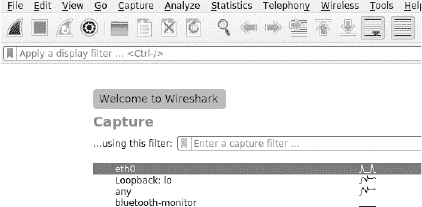

*图 3-6：Wireshark 欢迎屏幕*

欢迎屏幕列出了您的计算机用来与网络通信的接口。由于我们虚拟实验室的所有设备都连接到以太网接口，我们将监控 `eth0` 接口上的流量。通过点击**eth0**来选择此接口。另一方面，如果您想监控 Wi-Fi 流量，应选择**wlan**接口。第三个接口，标记为**lo**，表示一个名为 *回环接口* 的虚拟网络接口，它将流量重定向回计算机本身。

让我们使用 Wireshark 查看我们在 第二章 中进行 ARP 欺骗攻击时拦截到的数据包。回想一下，ARP 欺骗攻击会欺骗网络，将受害者的进出流量通过黑客的网络接口卡（NIC）进行路由。图 3-7 显示了我们如何使用 Wireshark 查看在 ARP 欺骗攻击中拦截的数据包的概览。数据包在进入网络接口卡时会被复制，并通过操作系统驱动程序在 NPCAP 库中直接发送到 Wireshark。同时，网卡将原始数据包转发到受害者的 NIC，受害者的浏览器将显示网页（例如：*http://facebook.com/*），而受害者完全没有意识到他们的数据包已被拦截。

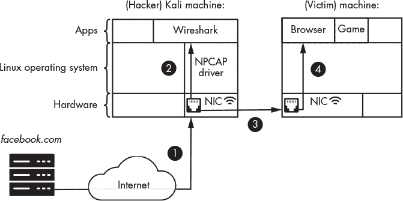

*图 3-7: Wireshark 与 NIC 之间的交互*

为了避免重新执行 ARP 欺骗攻击，我们将检查在 Kali Linux 虚拟机上生成的数据包。但是，如果您想执行另一次 ARP 欺骗攻击，您仍然可以使用这里描述的步骤。

首先，我们将假装是受害者，并通过访问 Metasploitable 机器上的 web 服务器来生成一些网络流量。由于我们在设置中没有配置 DNS 服务器，受害者无法通过输入像 *[`www.evil.corp/`](http://www.evil.corp/)* 这样的 URL 来访问 Metasploitable 服务器。相反，我们将手动获取服务器的 IP 地址。使用用户名 **msfadmin** 和密码 **msfadmin** 登录 Metasploitable 机器。登录后，运行以下命令来获取其 IP 地址：

```
msfadmin@metasploitable:~$ ifconfig eth0

   eth0    Link encap:Ethernet  HWaddr 00:17:9A:0A:F6:44

   inet addr: 192.168.1.101   Bcast:192.168.1.255  Mask:255.255.255.0
```

`inet addr:` 后面的值是 IP 地址。

回到 Kali Linux，点击 Wireshark 屏幕左上角的鲨鱼鳍图标 () 开始数据包捕获过程。接下来，我们将假装是受害者，并通过打开 Firefox 浏览器并在地址栏中输入服务器的 IP 地址来生成数据包，例如：*http://192.168.1.101/*（您的机器可能有不同的地址）。图 3-8 显示了 Wireshark 捕获屏幕的三个主要部分。

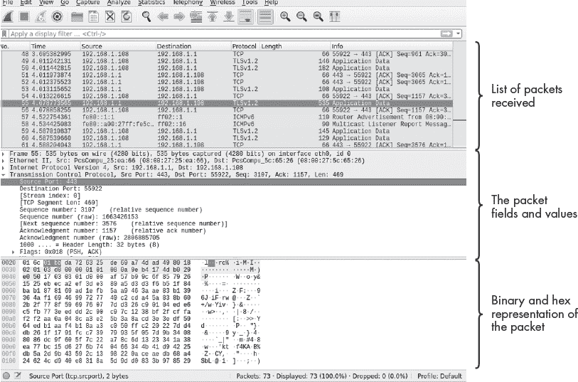

*图 3-8: Wireshark 窗口*

如果你选择在 ARP 欺骗攻击的上下文中进行此操作，你需要从受害者机器而非 Kali Linux 机器生成流量。页面加载完成后，点击红色停止图标 () 以结束抓包。注意，打开浏览器并访问单个网页的过程中生成了超过 4000 个数据包！

攻击者如何可能从所有这些信息中筛选出与受害者相关的内容呢？不用担心：Wireshark 提供了一个过滤功能，可以帮助你找到感兴趣的数据包。假设你只想查看发送到 IP 地址为 192.168.1.101（记住，你的 IP 地址可能不同）的 Metasploitable 服务器的数据包。将以下命令输入过滤框中，Wireshark 就会只显示与 Metasploitable 服务器交换的数据包。

```
ip.dst == 192.168.1.101
```

让我们仔细查看这个命令。在这里，我们将数据包限制为目标 IP 地址（`ip.dst`）为 192.168.1.101 的数据包。图 3-9 显示了运行此过滤器查询的结果。

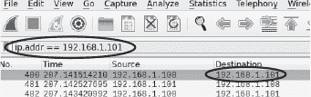

*图 3-9：在 Wireshark 中筛选数据包*

仅筛选发送到服务器的数据包可以减少你需要检查的数据包数量。一旦你了解了 Wireshark 显示过滤器的一般语法，你就可以构造自己的过滤器。以下是 Wireshark 过滤器的结构：

```
[Protocol].[header/field] [operator: +,==,!=] [value]
```

首先，指定协议（`[Protocol]`）；例如，TCP 或 IP。接下来，指定你希望过滤的数据包字段；例如，源 IP 地址（`src`）或目标 IP 地址（`dst`）。最后，指定操作符和值；例如，不等于（`!=`）192.168.1.10。使用这个结构，我们将构造一个过滤器，只显示源 IP 地址为服务器的数据包，如下所示：

```
ip.src == 192.168.1.101
```

Wireshark 还允许你根据数据包的内容进行筛选。例如，攻击者可能会查找包含 *password*、*email* 或 *@virginia* 等词语的数据包。你可以使用以下过滤器搜索所有 TCP 数据包中包含 *login* 的数据包：

```
tcp contains login
```

通过这些过滤技巧，我们来识别服务器与 Kali Linux 机器之间传输的 TCP 数据包。右键点击一个目标地址为 Metasploitable 服务器的数据包，并选择 **会话过滤** ▶ **TCP**，如 图 3-10 所示。这将只显示 Kali Linux 虚拟机与 Metasploitable 服务器之间交换的数据包。

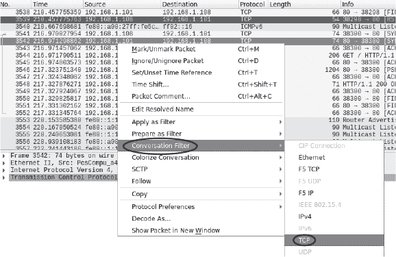

*图 3-10：TCP 会话过滤*

这相当于以下过滤器：

```
ip.src == 192.168.1.101 | ip.dst == 192.168.1.101
```

现在，为什么会有这么多数据包呢？我们只加载了一个网页。发生这种情况是因为服务器将网页分成更小的部分，如果文件太大而无法在一个数据包中传输，它会将这些部分作为独立的数据包发送。接收方将重新组装这些数据包以恢复原始文件。

Wireshark 允许你通过点击数据包并选择 **Follow** ▶**TCP Stream** 来重建数据流，如 图 3-11 所示。如果你这样做，你应该能看到对应页面的 HTML 内容。

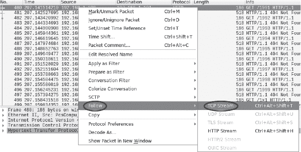

*图 3-11：在 Wireshark 中跟踪 TCP 流*

重组后的数据流应该如下所示 图 3-12。

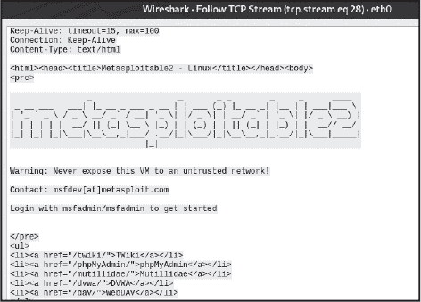

*图 3-12：重建的 TCP 流*

现在你知道了攻击者是如何利用 Wireshark 从在 ARP 欺骗攻击中拦截到的未加密数据包中窃取私密数据的。这就是为什么确保你的 Web 流量通过 HTTPS 加密如此重要的原因。

### 分析防火墙收集的数据包

现在你已经了解了黑客如何使用 Wireshark，让我们换个角度来看。此部分将讨论如何使用 Wireshark 判断你的网络是否遭到攻击。我将向你展示如何使用 Wireshark 和 `tcpdump` 命令行工具捕获并分析由 pfSense 防火墙收集的流量，`tcpdump` 可以将捕获的数据包保存到文件中。

一种简单的方法是保存所有通过防火墙的与端口 80 相关的数据包。端口 80 几乎总是用于 HTTP 通信，而端口 443 通常用于加密的 HTTPS 流量。如果你对查看 Web 流量感兴趣，可以从这两个端口开始。为了简便起见，我这里将重点讨论未加密的 HTTP 流量。在 第六章中，你将学习如何通过从受害者机器获取加密密钥来解密加密流量。

#### *捕获端口 80 的流量*

启动 Kali Linux 机器并访问 *[`cs.virginia.edu/`](http://cs.virginia.edu/)*。由于网络中的所有流量都经过 pfSense 防火墙，你可以在 pfSense 机器上使用 `tcpdump` 命令来捕获来自 Kali Linux 机器的 TCP 数据包。现在启动 pfSense，你应该看到如下屏幕：

```
 Welcome to pfSense                  (amd64) on pfSense

 WAN (wan)       -> em0        -> v4/DHCP4: 10.0.1.11/24

 LAN (lan)       -> em1        -> v4: 192.168.1.1/24

 0) Logout (SSH only)                  9) pfTop

 1) Assign Interfaces                 10) Filter Logs

 2) Set interface(s) IP address       11) Restart webConfigurator

 3) Reset webConfigurator password    12) PHP shell + pfSense tools

 4) Reset to factory defaults         13) Update from console

 5) Reboot system                     14) Disable Secure Shell (sshd)

 6) Halt system                       15) Restore recent configuration

 7) Ping host                         16) Restart PHP-FPM

 8) Shell
Enter an option:
```

通过输入 **8** 启动 shell 选项：

```
Enter an option: 8

[RELEASE][root@pfSense.localdomain]/root:
```

接下来，在 shell 中输入 `**tcpdump**`。该程序将不带任何选项运行，并捕获经过系统所有接口的所有数据包，直到你按下 CTRL-C 停止它。以下是一个 `tcpdump` 输出的示例：

```
   [RELEASE][root@pfSense.localdomain]/root: tcpdump

   tcpdump: verbose output suppressed, use -v or -vv for full protocol decode

   listening on em0, link-type EN10MB (Ethernet), capture size 262144 byte

   ...

   ...
➊ 15:18:44.372924 IP 192.168.1.100.41193 > z.arin.net.domain

   57745% [1au] DS? 41.198.in-addr.arpa (40)

   ...
```

请注意，流量按行组织。让我们分析其中一行，以了解打印的内容。`15:18:44.372924` 是一个时间戳，表示流量被捕获的时间 ➊。`IP` 标识数据包的协议，`192.168.1.100.41193` 表示源的 IP 地址和端口号的组合（仅端口号是 `41193`）。接下来，`z.arin.net.domain.57745` 表示目标的 IP 地址和端口号。为了使追踪更具可读性，`tcpdump` 将该 IP 地址转换为其关联的域名。你可以通过添加 `-n` 标志来禁用此操作。其他信息则是与数据包相关的特定信息。

与 Wireshark 类似，你可以通过将特定协议作为参数传递给 `tcpdump` 来捕获来自该协议的包。你还可以通过指定端口号来监听来自某个端口的包。例如，要仅捕获端口 443 上的 TCP 包，请在 pfSense 中运行以下命令：

```
[RELEASE][root@pfSense.localdomain]/root: tcpdump tcp port 443 -n
tcpdump: verbose output suppressed, use -v or -vv for full protocol decode
listening on ➊em0, link-type EN10MB (Ethernet), capture size 262144 bytes

01:49:15.194721 IP 10.0.1.11.4092 > 172.253.63.113.443: Flags ....

01:49:15.208283 IP 172.253.63.113.443 > 10.0.1.11.4092: Flags ....
```

如果你没有看到任何数据包，尝试刷新 Kali Linux 中的网页浏览器。除了在终端中显示数据包外，你还可以将其写入文件，然后在 Wireshark 中进行分析：

```
tcpdump -i <interface> -s <number of packets to capture> -w <file.pcap>
```

`-i` 选项表示你希望捕获数据包的接口。（在前面的例子中，你在 `em0` 接口上捕获了数据包 ➊。）你可以通过选择启动屏幕上的 Shell 选项并运行 `ifconfig` 命令来获取设备上所有接口的列表。`-s` 标志表示捕获的数据包数量，`-w` 标志指定存储数据的文件名。收集数据后，你可以在 Wireshark 中查看该文件。分析这些数据包通常非常繁琐。像 *[`packettotal.com`](https://packettotal.com)* 这样的在线工具可以帮助你分析 *.pcap* 文件，并标记可疑活动。

### 练习

尝试这些练习，以加深你对 Wireshark 和 pfSense 的理解。在第一个练习中，你将通过 Web 界面登录 pfSense 并探索其功能。在第二个练习中，你将使用 Wireshark 分析来自 ARP 欺骗攻击的数据包。

#### *pfSense*

在 Kali Linux 浏览器中，通过在 URL 地址栏输入路由器的 IP 地址来登录 pfSense。你将看到一个安全警告，提示安全证书无效。选择添加例外的选项。pfSense 防火墙使用的是自签名证书。关于这些证书，我将在第六章中讨论。接下来，使用默认用户名 **admin** 和密码 **pfsense** 登录。一旦登录后，按照图 3-13 所示，更改默认密码。


*图 3-13：在 pfSense 防火墙/路由器中更改默认密码*

现在，你将查看通过防火墙流动的数据包的实时统计信息。点击 **状态** 并从下拉菜单中选择 **仪表板**。你可以从仪表板查看系统的全局快照。你还可以添加和移除仪表板上的面板。例如，点击加号图标并选择 **流量图** 来添加实时流量图。图 3-14 显示了仪表板的截图。

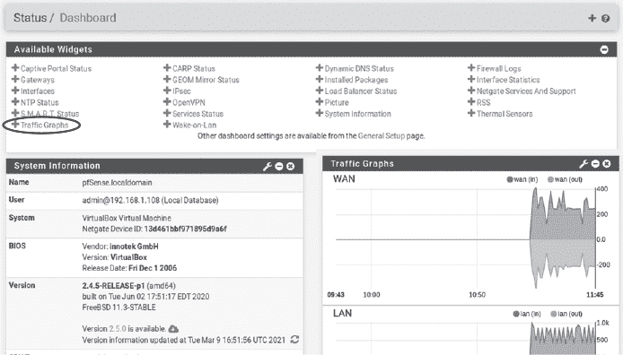

*图 3-14：pfSense 仪表板*

通过向仪表板添加面板进行实验。利用这个机会熟悉防火墙。

#### *在 Wireshark 中探索数据包*

从本书的 GitHub 页面下载我们 ARP 欺骗攻击的 Wireshark 捕获文件（*arpspoof.pcap*），链接为 *[`github.com/The-Ethical-Hacking-Book/ARP-pcap-files`](https://github.com/The-Ethical-Hacking-Book/ARP-pcap-files)*。在 Wireshark 中打开该文件并尝试回答以下问题：受害者和攻击者机器的 MAC 和 IP 地址分别是什么？本地网络路由器的 MAC 地址是什么？提示：本地路由器的 IP 地址是 192.168.1.1。

你可以通过访问 *[`www.netresec.com/index.ashx?page=PcapFiles/`](https://www.netresec.com/index.ashx?page=PcapFiles/)* 找到其他需要分析的数据包捕获。
