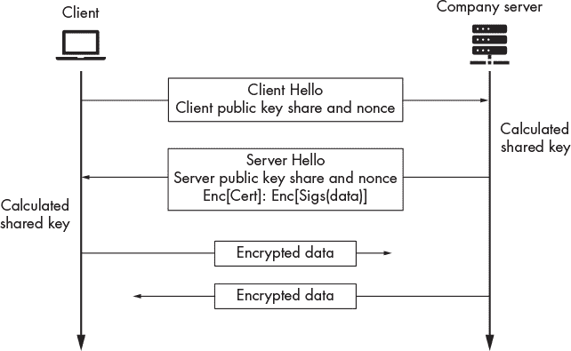
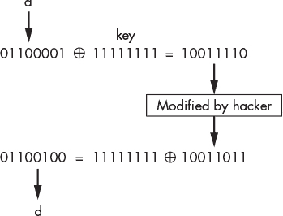
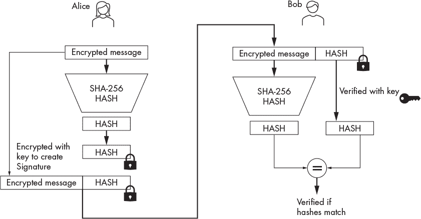
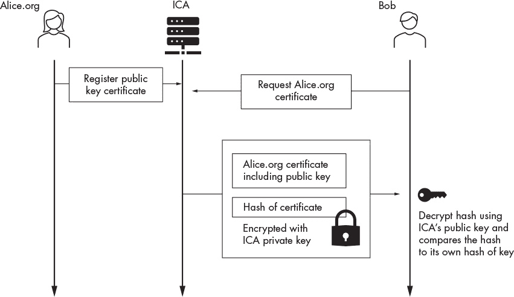
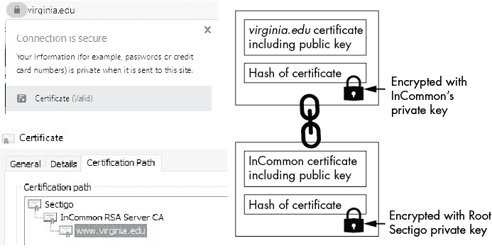
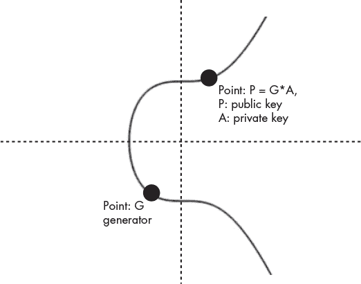
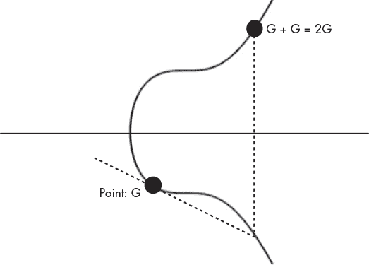

## 第七章：**6

TLS 与迪菲-赫尔曼密钥交换**

*世界是一个危险的地方，不是因为那些邪恶的人，而是因为那些不采取任何行动的人。*

–阿尔伯特·爱因斯坦


在第四章中，你使用了 TCP 和 UDP 套接字在互联网上的计算机之间发送数据。但是，正如你所观察到的，通过这些套接字发送的数据并没有加密，因此任何捕获到这些数据的人都可以读取它。

为了安全地进行通信，你必须在发送数据之前进行加密。最初，安全领域的专家发现如何有效地做到这一点具有挑战性，因为非对称加密技术太慢，无法在不引起延迟的情况下加密数据流。高效的加密需要双方首先建立一个共享的对称密钥，用于以较低的开销加密流量。*传输层安全（TLS）*协议使用非对称加密技术来建立这个共享的对称密钥。TLS 被广泛应用于需要安全通信的各种场景，例如控制军用无人机或传输大型银行交易的应用程序。如今，大多数网站使用 HTTPS 来确保它们的通信安全，而 HTTPS 依赖于 TLS。

在这一章中，你将学习 TLS 通信是如何工作的，以及迪菲-赫尔曼密钥交换算法是如何生成所需的密钥的。然后，你将编写一个使用 TLS 建立安全通信通道的 Python 程序。最后，我们将讨论攻击者可能如何解密一个加密的通道。

### 传输层安全性

回想一下第五章中提到的，对称密钥加密使用一个单一的密钥来加密和解密文件。这个技术非常快速，但它也有一个缺点：双方必须以某种方式共享这个密钥。另一方面，非对称密钥加密依赖于一对公钥和私钥来发送消息，这意味着它没有这种限制。

使用这两种技术，TLS 在双方之间建立了一个加密的通信通道。为了建立这个加密通道，双方只需交换两条消息。图 6-1 展示了 TLS 1.3（目前最安全的版本）过程的简化概述。



*图 6-1：TLS 消息交换*

客户端通过发送一个*客户端你好*消息来开始连接，该消息包含客户端的公钥共享和随机数。然后，服务器将其私钥与客户端的公钥共享结合起来，计算出一个新的对称密钥。服务器现在可以使用这个对称密钥来加密和解密未来的消息。然而，服务器仍然需要与客户端共享一些信息，以便客户端也能够计算出相同的对称密钥。为此，服务器发送一个*服务器你好*消息，其中包含服务器的公钥共享和随机数的未加密副本。然后，客户端将其私钥与服务器的公钥共享结合起来，计算出相同的对称密钥，客户端将使用该密钥来加密和解密所有未来的消息。瞧！现在，客户端和服务器都已计算出相同的对称密钥，而无需直接发送密钥。这怎么可能？他们都结合了不同的信息片段，但仍然计算出了相同的密钥。在本章中，我将讨论使这一切成为可能的算法。

因为服务器知道客户端在收到服务器的公钥共享和随机数后能够解密信息，所以服务器还会包括一些加密的信息，关于服务器的身份（其证书）以及消息真实性的证明。让我们通过探索客户端如何证明消息的真实性，进一步深入了解 TLS。

#### *消息认证*

加密可以防止黑客解密消息，但它并不能防止篡改。在公共网络中，黑客可以通过更改加密消息中的位来篡改解密后的消息。图 6-2 展示了修改加密消息如何改变解密后的结果。



*图 6-2：黑客如何修改加密消息并影响解密结果*

对于 TLS 用户来说，这不是一个问题，因为他们可以检测消息是否发生变化，并拒绝它。想象一下，每次你通过邮件发送一个包裹时，都会在标签上写下包裹的重量。收件人可以通过将包裹的重量与标签上列出的重量进行比较来验证包裹。如果重量匹配，收件人可以确信没有任何东西被添加或移除。

TLS 使用*基于哈希的消息认证码（HMACs）*来验证消息。HMAC 函数使用加密哈希函数生成每个消息的唯一哈希值。*哈希函数*在给定相同输入时，会生成相同的固定长度字符串。消息的接收者会重新应用 HMAC，并比较两个哈希值。如果消息被更改，其哈希值将不同，但如果哈希值匹配，则消息是可信的。

哈希函数本身并不能提供真实性。由于它们是公开可交换的，黑客可以修改消息并重新计算其哈希值。为了确保哈希是由可信方生成的，它必须与在密钥交换过程中计算的共享对称密钥结合使用。这个*签名*哈希叫做*消息认证码*。以下是 HMAC 函数的公式：

HMAC(*K*, *m*) = H((*K^′* ⊕ *opad*) ∥ ((*K^′* ⊕ *ipad*) ∥ *m*))

这里，*K* 代表共享的对称密钥，*m* 代表加密的消息。*H* 代表哈希函数，最常用的是 SHA3256。*K^′* 是密钥的块大小版本。∥ 运算符表示将两部分信息按位连接。最后，*opad* 和 *ipad* 是为了兼容性而使用的常量。

一旦消息被加密，它就会被哈希处理，并通过 HMAC 函数进行签名。然后，MAC 被附加到消息上并发送出去。只有拥有秘密对称密钥的人才能更改哈希值。

#### *证书颁发机构和签名*

黑客可以假装成网络上的任何机器，那么 Bob 如何确认他在与 Alice 通信？在 TLS 握手的开始阶段，Alice 向 Bob 提供了她的*证书*，这是一份数字文档，证明 Alice 拥有她提供的公钥。Bob 通过使用签名验证算法来验证 Alice 的证书的签名（图 6-3）。



*图 6-3：签名创建和验证过程*

##### 签名

你可以使用在第五章中讨论的 RSA 算法来创建签名算法。要签署一个证书消息 *m*，首先使用 SHA-256 计算哈希 *H*(*m*)，然后使用私钥 *sk*（表示秘密密钥）对结果进行加密。生成的密文表示你的签名 *s*：

Sign(*m*, *sk*) = *E*(*H*(*m*), *sk*) = *s*

使用公钥 (*pk*) 解密 (*D*) 签名 (*s*) 来验证证书或消息 (*m*)。如果 *H*(*m*) 与 *s* 匹配，则签名有效：

Ver(*m*, *s*, *pk*) = *D*(*s*, *pk*) == *H*(*m*)

图 6-3 展示了 Alice 向 Bob 发送消息时签名过程的概览。

#### *证书颁发机构*

要使证书有效，互联网的信任的*公钥基础设施（PKI）*必须对其进行签名。PKI 是一组安全的服务器，它们签署并存储经过认证的证书副本。Alice 为注册她的证书支付费用，并将其注册到*中介证书颁发机构（ICA）*，这样 Bob 就可以在 TLS 握手过程中验证 Alice 的证书。

Bob 如何知道他可以信任 ICA？Bob 的浏览器已经预先编程了 ICA 的公钥，因此它信任由 ICA 的私钥签名的消息。图 6-4 展示了证书验证过程的概览。



*图 6-4：证书验证过程概述*

爱丽丝的证书包含她的公钥和由 ICA 签名的证书哈希。当鲍勃的浏览器收到证书时，它会解密哈希，并通过将计算出的哈希与解密后的哈希进行比较来验证证书。

浏览器有时会收到来自 ICA 的证书，而它们的公钥尚未存储。在这种情况下，浏览器必须使用其他公钥来验证 ICA 的证书。全球有 14 个根证书颁发机构（CAs），所有浏览器都必须包含它们的公钥。当根 CA 信任某个 ICA 时，它会签署该 ICA 的证书。当爱丽丝提供她的证书时，她还会提供一份签名副本，包括鲍勃验证她的证书所需的所有 CA 证书。图 6-5 展示了用于信任 *virginia.edu* 证书的证书列表。你可以通过点击 URL 栏左侧的锁形图标，然后从下拉菜单中选择证书，查看 Google Chrome 中的认证路径。



*图 6-5：官方证书路径*

让我们来看看这个证书路径。根 CA（Sectigo）通过签署 InCommon 证书的哈希来验证 ICA（InCommon）。当鲍勃的浏览器收到 *virginia.edu* 的证书时，它首先验证 InCommon 的证书，方法是验证 Sectigo 提供的哈希。如果哈希匹配，鲍勃的浏览器可以信任 InCommon 的证书，并使用 InCommon 的公钥来解密 *virginia.edu* 证书的哈希。

在这个例子中，认证路径只有三层深。对于更长的路径，浏览器从根证书开始，沿路径验证每个证书，直到最后一个证书。

### 使用 Diffie-Hellman 计算共享密钥

在两方能够加密数据包之前，它们必须计算一个共享密钥。它们可以通过 *Diffie-Hellman* 密钥交换算法来实现这一点。在本节中，我们将介绍 Diffie-Hellman 密钥交换的六个步骤。表 6-1 提供了所有步骤的总结。如果看起来有些复杂，不要担心；我会在接下来的小节中逐一解释这些步骤。

经常有黑客通过发现加密算法设计或实现中的漏洞来破解加密。在本节的最后，我们将讨论像 NSA 这样的国家级行为者如何突破 Diffie-Hellman 加密。

**表 6-1：** 在 Diffie-Hellman 密钥交换中建立共享密钥的步骤

| 步骤 | 爱丽丝 | 鲍勃 |
| --- | --- | --- |
| 1 | 共享参数：*g* |
| 2 | *A* = *random* | *B* = *random* |
|  | *a* = *g^A* | *b* = *g^B* |
| 3 | {*a*, *nonce[a]*} *→* |
|  | *←* {*b*, *nonce[b]*} |
| 4 | *S* = *b^A* = (*g^B*)^(*A*) | *S* = *a^B* = (*g^A*)^(*B*) |
| 5 | *K* = *HKDF*(*S*, *nonce[a]*, *nonce[b]*) | *K* = *HKDF*(*S*, *nonce[a]*, *nonce[b]*) |
| 6 | *←* *E*(*K*, *data*) *→* |

#### *步骤 1：生成共享参数*

Diffie-Hellman 密钥交换算法的第一步是生成共享参数 *p* 和 *g*，这些参数将用于计算公钥和共享的秘密密钥。生成器 *g* 通常设置为 2。这个参数被称为生成器，因为我们使用它通过计算 *g^A* 来生成公钥。所有的公钥都是从基数 *g* 生成的，因此我们说它们属于同一个组。你可以将一个组想象成一系列数字，如 *g*¹、*g*²、*g*³……，我们也可以将其写为 *g*、*g* *** *g*、*g* *** *g* *** *g*…… 请注意，我们可以通过将 *g* 自己相乘来生成组中的所有内容。

参数 *p* 是一个大素数，它通过计算模 *p* 的结果将公钥和计算得到的密钥约束在 1 和 (*p* – 1) 之间。我们在表中省略了（mod *p*）运算，因为这样做不会影响数学的简洁性且不会改变其有效性。Diffie-Hellman 的安全实现使用一个大素数，其中 (*p* – 1)/2 也是素数。

你可以通过运行以下命令来生成这些参数：

```
kali@kali:~$ openssl genpkey -genparam -algorithm DH -out parametersPG.pem
```

`openssl` 程序中的 `genpkey` 命令生成密钥，`-genparam` 和（`-algorithm DH`）标志告诉 `openssl` 生成 Diffie-Hellman 密钥交换算法的参数，`-out` 标志指定输出文件的名称，在这种情况下是 *parametersPG.pem*。

一旦生成了参数，你可以通过运行以下命令来查看它们：

```
kali@kali:~$ openssl pkeyparam -in parametersPG.pem -text
```

`openssl` 程序中的 `pkeyparam` 命令从 *.pem* 文件中提取参数，`text` 标志输出密钥的可读版本。运行命令后，你应该会看到类似以下内容的输出：

```
----BEGIN DH PARAMETERS-----
MIIBCAKCAQEA9vcePAZIOjEdJzd0c9cK29wGvoIA/iPnGVf/36HnxeeSt5HBZsrb
iDomXlmc31ykKQuHuobNA5d/qCBhJeOINr0OLr70fBcK2HuLWGInbVDi7niTatd4
l7PRZlbwau/cY17eCA9bi9H2QgPku9+FbcIRaTSwMpeQliJ7B7FqWvrTEvIpz/Kb

0d6nucUjwj4EbZrLeLAwKAw2+6g2POnYfVg5Mqoz5K9e1YOn/tLFUpiGdBbujMtJ
jI0glvoCykr96wsZ/I9GHMArIjm8LQA46UyLXhjdCYs2T+Jf+8t2pXNrpigtf3n1
mFkguOBaQWP2oKn+FC/EfWwKwuBqqvmd2wIBAg==

-----END DH PARAMETERS-----
DH Parameters: (2048 bit)

    prime:

        00:f6:f7:1e:3c:06:48:3a:31:1d:27:37:74:73:d7:

       ....

        f6:a0:a9:fe:14:2f:c4:7d:6c:0a:c2:e0:6a:aa:f9:

        9d:db

    generator: 2 (0x2)
```

顶部部分显示了 Base64 编码的参数，底部部分显示了它们的可读版本。素数 (*p*) 和生成器 (*g*) 参数以十六进制表示。你将使用这些参数来生成公钥。

#### *步骤 2：生成公私钥对*

在 Alice 和 Bob 生成他们的公钥之前，他们必须分别随机选择一个数字作为他们的私钥。然后，Alice 和 Bob 分别通过计算 *g^A* 和 *g^B* 来计算他们的公钥，其中 *A* 和 *B* 代表他们各自的私钥。美国国家安全局建议使用 3,072 位或更大的密钥；然而，选择超过 3,072 位的密钥可能不太方便，因为更长的密钥生成所需的时间更长。例如，标准的桌面计算机生成一个 6,144 位的 RSA 密钥需要超过七个小时。因此，`openssl` 默认为 2,048 位的密钥大小。表 6-2 演示了这个密钥生成过程。

**表 6-2：生成公私钥对**

| 密钥 | Alice | Bob |
| --- | --- | --- |
| 私钥 (A 和 B) | A = 随机值 | B = 随机值 |
| 公钥 (a 和 b) | *a* = *g^A* | *b* = *g^B* |

我们可以通过运行以下命令生成 Alice 的公私钥对：

```
kali@kali:~$ openssl genpkey -paramfile parametersPG.pem -out AlicePublicPrivateKeyPair.pem
```

`-paramfile` 标志指示 `openssl` 使用文件 *parametersPG.pem* 中的参数，并使用 `genpkey` 生成新的公私钥对。当你生成完密钥对后，可以通过运行此命令查看它：

```
kali@kali:~$ openssl pkey -in AlicePublicPrivateKeyPair.pem -text -noout
```

`openssl` 工具的 `pkey` 用于解析私钥。此命令的输出表示两个密钥，都是 2,048 位的十六进制数字，如下所示：

```
DH Private-Key: (2048 bit)

    private-key:

        53:2f:45:2d:4a:15:c3:62:4f:4c:b8:4f:43:92:8b:

        98:7c:f6:fd:1f:54:16:15:c6:28:a1:ae:8a:80:73:

       ....

    public-key:

        7f:c6:af:1e:ff:aa:ba:59:98:02:19:fb:93:6d:cc:

        57:28:00:48:20:a7:38:6a:41:43:1b:d6:00:32:8f:

       ....

    prime:

        00:f6:f7:1e:3c:06:48:3a:31:1d:27:37:74:73:d7:

        0a:db:dc:06:be:82:00:fe:23:e7:19:57:ff:df:a1:

       ....

    generator: 2 (0x2)
```

记住，你绝不应该分享你的私钥。如果攻击者能够窃取或计算出你的私钥，他们将能够解密你的通信内容。

接下来，使用相同的公共参数生成 Bob 的公私钥对：

```
kali@kali:~$ openssl genpkey -paramfile parametersPG.pem -out BobPublicPrivateKeyPair.pem
```

Alice 和 Bob 使用相同的参数至关重要，因为如果使用不同的参数，他们将计算出不同的秘密密钥。

#### *为什么黑客无法计算私钥？*

你可能会想，为什么黑客不能利用公共参数 *g* 和公钥 *a* 来计算 Alice 的私钥。例如，攻击者似乎可以通过计算公钥 *a* 的离散对数，以 *g* 为底，来计算 *A*，像这样：

*a* = *g^A* *⇒* *A* = *log[g]*(*a*)

如果 *a* 是一个小数字，这将是可能的；然而，*a* 是一个非常大的数字，在我们的案例中是 2,048 位。如果你将最大的 2,048 位数字写成十进制，它将有 617 位长，相当于将一万亿自乘 50 次。因为计算离散对数的过程比计算原始指数要慢得多，攻击者需要太阳余下的寿命才能使用已知的经典算法从公钥 *a* 计算出私有随机值 *A*。

然而，研究人员预计量子计算机有朝一日将能够快速计算离散对数，到那时这些加密算法将不再安全。如果你对此感到担忧，你可以采取两种方法来为你的加密文件做未来保障。

• **选择更长的密钥。** 3,072 位的密钥应该能为你争取一些时间；然而，随着量子计算机的进步，即便是这些密钥也将不足够长。

• **使用量子安全的加密算法。** 来自 *[`openquantumsafe.org/`](https://openquantumsafe.org/)* 的团队正在研究量子安全算法的开源实现。最有前景的方法之一是基于格的密码学。然而，讨论这些内容超出了本书的范围。如果你感兴趣，我推荐阅读 Dan Boneh 和 Victor Shoup 合著的 *A Graduate Course in Applied Cryptography* 中的 第十六章。你可以通过访问 *[`toc.cryptobook.us/`](https://toc.cryptobook.us/)* 来查看。

#### *步骤 3：交换密钥份额和随机数*

接下来，Alice 和 Bob 交换他们的公钥和随机数（nonce）。回顾 第五章，随机数确保每个密文是唯一的。表 6-3 描述了这一步骤。

**表 6-3：** 交换公钥份额和随机数

| 步骤 | Alice | Bob |
| --- | --- | --- |
| 3 | {*a*, *nonce[a]*} *→* |
|  | *←* {*b*, *nonce[b]*} |

使用 `openssl pkey` 工具提取 Alice 的公钥：

```
kali@kali:~$ openssl pkey -in AlicePublicPrivateKeyPair.pem -pubout -out AlicePublicKey.pem
```

`pubout` 标志指示 `openssl` 仅输出 Alice 的公钥。使用相同的方法提取 Bob 的公钥：

```
kali@kali:~$ openssl pkey -in BobPublicPrivateKeyPair.pem -pubout -out BobPublicKey.pem
```

你可以通过运行以下命令来查看 Bob 公钥的可读版本：

```
kali@kali:~$ openssl pkey -pubin -in BobPublicKey.pem -text
```

请注意，生成的文件仅包含 Bob 的公钥以及公有参数 *p* 和 *g*。

#### *步骤 4：计算共享密钥*

现在，Alice 和 Bob 拥有对方的公钥和公有参数，他们可以独立计算相同的对称密钥。Alice 通过将 Bob 的公钥 *b* 提升到她的私钥 *A* 的值来计算共享密钥，从而得到新的共享密钥 *S*。Bob 也使用 Alice 的公钥 *a* 和他的私钥 *B* 进行相同的操作，得到 *相同的共享密钥*。

要了解为什么这两个公钥会生成相同的共享密钥，请记住，我们通过将 *g* 提升到她的私钥值来计算 Alice 的公钥 *a*（*a* = *g^A*）。如果我们将此代入 Bob 计算私钥的公式，我们得到：*S* = *a^B* = (*g^A*)*^B* = *g^(AB)*。如果你为 Alice 重复这个过程，你会发现她也计算出了相同的共享密钥：*S* = *b^A* = (*g^B*)*^A* = *g^(BA)*。表 6-4 概述了这些计算过程。

**表 6-4：** 计算共享密钥

| 步骤 | Alice | Bob |
| --- | --- | --- |
| 4 | *S* = *b^A* = (*g^B*)*A* | *S* = *a^B* = (*g^A*)*B* |

现在，让我们使用 `openssl` 公钥工具 `pkeyutil`，通过使用 Bob 的公钥（`-peerkey`）来派生（`-derive`）Alice 的共享密钥：

```
kali@kali:~$ openssl pkeyutl -derive -inkey AlicePublicPrivateKeyPair.pem -

			 peerkey BobPublicKey.pem -out AliceSharedSecret.bin
```

我们也可以使用相同的命令派生 Bob 的共享密钥：

```
kali@kali:~$ openssl pkeyutl -derive -inkey BobPublicPrivateKeyPair.pem -

			 peerkey AlicePublicKey.pem -out BobSharedSecret.bin
```

你可以通过使用 `xxd` 命令来查看 Alice 私钥的可读版本：

```
kali@kali:~$ xxd AliceSharedSecret.bin
```

现在，让我们使用 `cmp` 命令来比较 Alice 和 Bob 的共享密钥。如果密钥相同，命令不会打印任何内容；然而，如果它们不匹配，命令将打印出差异：

```
kali@kali:~$ cmp AliceSharedSecret.bin BobSharedSecret.bin
```

如果一切正常，你应该没有输出。

#### *步骤 5：密钥派生*

虽然我们现在有了共享密钥，但我们不能直接使用它，因为它的形式不正确。共享密钥是一个数字，但对称加密算法需要一个均匀的随机字符串。因此，我们必须使用 *HKDF* 密钥派生函数，从计算出的数字中派生出一个均匀的随机字符串。HKDF 函数使用共享密钥和两个 nonce 来生成最终的对称密钥：*K* = *HKDF*(*S*, *nonce[a]*, *nonce[b]*)。表 6-5 展示了双方如何使用 HKDF 密钥派生函数将共享数字转换为密钥。

**表 6-5：** 使用 HKDF 密钥派生函数将 *S* 转换为密钥

| Alice | Bob |
| --- | --- |
| *K* = *HKDF*(*S*, *nonce[a]*, *nonce[b]*) | *K* = *HKDF*(*S*, *nonce[a]*, *nonce[b]*) |

让我们使用密钥派生函数来派生一个密钥并加密一个文件。我们将使用支持`openssl`的 PBKDF2 函数，而不是使用 HKDF。

```
kali@kali:~$ openssl enc -aes-256-ctr -pbkdf2 -e -a -in plain.txt -out encrypted

			 .txt -pass file:AliceSharedSecret.bin
```

一旦你运行了这个命令，它将从存储在*AliceSharedsecret.bin*中的二进制值派生一个密钥。接下来，`openssl`将使用派生出的密钥加密*plain.txt*文件，并将加密后的结果写入*encrypted.txt*文件。

#### *攻击 Diffie-Hellman*

现在你已经理解了 Diffie-Hellman 算法，让我们看看国家级攻击者是如何从 1,024 位公钥中恢复私钥的。

理想情况下，在选择共享参数时，浏览器会从一大批素数中随机选择*p*。（记住：所有操作都是模*p*运算）。然而，大多数浏览器仅使用少数几个素数子集。一个具有大规模计算资源的国家级攻击者可以预先计算出给定素数的所有 1,024 位公私钥对。它们可以通过使用已知最快的逆对数计算算法：*通用数域筛法（GNFS）*，来实现这一点。GNFS 由四个步骤组成。国家级攻击者预计算前三个步骤，然后在需要时可以轻松计算最后一步。

在 TLS 的早期版本（TLS 1.2）中，客户端和服务器使用未加密的数据包协商加密类型和密钥长度。这使得黑客能够拦截数据包并将密钥降级到 1,024 位。幸运的是，最新版本的 TLS（TLS 1.3）不容易受到这种攻击。

### 椭圆曲线 Diffie-Hellman

*椭圆曲线 Diffie-Hellman*是 Diffie-Hellman 密钥交换算法的一个更快速的实现，能够在使用更短的密钥时实现类似的安全性。例如，一个 256 位的椭圆曲线加密（ECC）密钥相当于一个 3,072 位的 RSA 密钥。（如果破解这些密钥所需的计算资源相同，则认为它们是等效的。）

椭圆曲线 Diffie-Hellman 不是计算指数，而是对*椭圆曲线*（一种类似于图 6-6 中所示的曲线）进行数学运算。



*图 6-6：secp256k1 曲线的图像，示例值包括生成器、私钥和相关的公钥*

在椭圆曲线 Diffie-Hellman 中，爱丽丝的公钥*a[xy]*是椭圆曲线上的一个点，它是通过将随机选择的私有整数*A*与共享点*G[x]*[,]*[y]*（称为*生成器*）相乘计算得出的。生成器是预先选择的，确保它是曲线上的一个点，从该点可以计算出尽可能多的公钥。

让我们深入了解一下这是如何实现的。

#### *椭圆曲线的数学原理*

椭圆曲线由以下方程定义：

*y*² = *x*³ + *ax* + *b*

其中*a*和*b*是曲线的参数。

图 6-6 展示了一个流行的椭圆曲线——secp256k1 曲线，该曲线在多个加密应用中使用，包括比特币。secp256k1 曲线由以下方程定义：

*y*² = *x*³ + 7

美国国家标准与技术研究院（NIST）推荐使用 P-256 或 Curve25519 椭圆曲线，它们是当前互联网上最广泛使用的曲线。我们将在讨论中使用 图 6-6 中展示的 secp256k1 曲线；然而，相同的概念也适用于 P-256 和 Curve25519。

与原始的 Diffie-Hellman 算法类似，椭圆曲线 Diffie-Hellman 使用一个共享参数 *G* 和一对公私钥。公钥是曲线上的一个点，私钥是一个随机选择的整数。

表 6-6 总结了椭圆曲线 Diffie-Hellman 密钥交换算法的步骤。与原始的 Diffie-Hellman 算法一样，所有操作都以 *p* 取模；然而，为了清晰起见，我在表中省略了这一点。

**表 6-6：** 在椭圆曲线 Diffie-Hellman 密钥交换中建立共享密钥的步骤

| 步骤 | Alice | Bob |
| --- | --- | --- |
| 1 | 共享点：*G[xy]* |
| 2 | *A* = *随机* | *B* = *随机* |
|  | *a[xy]* = *A* *×* *G[xy]* | *b[xy]* = *B* *×* *G[xy]* |
| 3 | {*a[xy]*, *nonce[a]*} ** |
|  | *←* {*b[xy]*, *nonce[b]*} |
| 4 | *K[xy]* = *A* *×* *b[xy]* = *A* *×* *B* *×* *G[xy]* | *K[xy]* = *B* *×* *a[xy]* = *B* *×* *A* *×* *G[xy]* |
| 5 | *K* = *HKDF*(*K[x]*, *nonce[a]*, *nonce[b]*) | *K* = *HKDF*(*K[x]*, *nonce[a]*, *nonce[b]*) |
| 6 | *←* *E*(*K*, *data*) ** |

请注意，这些步骤与原始的 Diffie-Hellman 算法类似。因此，我不会详细解释这些步骤。然而，值得注意的是，椭圆曲线 Diffie-Hellman 使用椭圆曲线上的点的乘法，而不是指数运算来生成密钥对。

#### *加倍与相加算法*

如果你以前没有接触过椭圆曲线，你可能不清楚在曲线的点上进行数学运算是什么意思。例如，将点 *G[xy]* 乘以整数 *A* 是什么意思？

将点 *G[xy]* 乘以整数 4 相当于将该点加到自身三次：

4 *×* *G[xy]* = *G[xy]* + *G[xy]* + *G[xy]* + *G[xy]*

将点 *G[xy]* 加到自身的几何意义是，取该点的切线并将其与椭圆曲线的交点关于 x 轴进行反射。图 6-7 图形展示了将点加到自身的过程。



*图 6-7：* 将点*G[xy]* *加到自身的示例*

计算 4 *×* *G[xy]* 的一种更高效的方法是，先计算 2*G[xy]* = *G[xy]* + *G[xy]*，然后计算 4*G[xy]* = 2*G[xy]* + 2*G[xy]*，这样可以减少所需的加法次数。因此，实际中用于计算椭圆曲线 Diffie-Hellman 密钥的算法被称为 *加倍与相加算法*。

当爱丽丝计算她的公钥 *a[xy]* = *A* *×* *G[xy]* 时，她将其发送给鲍勃并附带一个随机数。鲍勃也做了同样的事情。一旦爱丽丝接收到鲍勃的公钥，她通过将鲍勃的公钥 *b[xy]* 乘以她的秘密整数 *A* 来计算共享密钥的点，结果是一个新的点：*K[xy]* = *A* *×* *b[xy]* = *A* *×* *B* *×* *G[xy]*。鲍勃也做了同样的事情，得到 *K[xy]* = *B* *×* *a[xy]* = *B* *×* *A* *×* *G[xy]*。按照惯例，x 值会被提取出来作为密钥点 *K[xy]*，并传递给 HKDF 密钥推导函数来计算最终的共享密钥。

#### *为什么黑客不能使用 G[xy] 和 a[xy] 来计算私钥 A？*

再次问你可能会想：为什么一个知道 *G[xy]* 和 *a[xy]* 的黑客不能计算出 *A* 呢？回想一下，我们选择了生成器 *G[x]y*，使得我们可以达到椭圆曲线上的最大点数。结合所有操作都是模一个大素数 *p*，这意味着从 *a[xy]* 和 *G[xy]* 恢复 *A* 是非常困难的。如果 (*A* *×* *G[xy]*) 小于 *p*，你可能会尝试通过以下方式计算 *A*：

*A* = *a[xy]*/*G[xy]*

记住，你不是在除以两个数字，而是在除以椭圆曲线上的两个点，这就是为什么我们只能进行加法和减法的原因。为了求解前面的方程，我们需要一个能仅使用加法和减法高效计算除法的算法。然而，目前已知的经典算法都无法做到这一点。话虽如此，值得注意的是，在生成 *A* 时，你需要使用一个良好的随机源。如果 *A* 是从一个可预测的或伪随机序列生成的，攻击者可以很容易地确定 *A*。

### 编写 TLS 套接字

现在让我们使用 *安全套接层（SSL）* 库在 Python 中实现一个安全套接字。我们将像在第五章中一样使用 Python 的 `with` 语法来帮助管理我们的套接字资源。

为了加密我们的套接字，我们将使用 *AES-GCM（伽罗瓦/计数器模式）* 块加密算法。AES-GCM 结合了第五章中引入的计数器模式块加密算法和消息认证的思想，以提供保密性和消息完整性。假设我们加密一个 TCP 数据包。我们想加密数据包的内容，但路由器需要数据包的 IP 地址，因此我们希望确保这些信息保持不变。因此，我们需要对加密和未加密部分都进行完整性检查。我们称这种方法为 *附带数据的认证加密*，而 AES-GCM 对此提供支持。

让我们开始编写一个安全的客户端套接字。

#### *安全客户端套接字*

让我们实现客户端套接字，它将建立到我们将在下一小节中实现的服务器的安全连接。创建一个名为 *secureSocket.py* 的新文件，并将以下代码复制到该文件中：

```
➊ import socket

   import ssl

   client_key = 'client.key'

   client_cert = 'client.crt'

   server_cert = 'server.crt'

   port = 8080

   hostname = '127.0.0.1'
➋ context = ssl.SSLContext(ssl.PROTOCOL_TLS, cafile=server_cert)
➌ context.load_cert_chain(certfile=client_cert, keyfile=client_key)

   context.load_verify_locations(cafile=server_cert)

   context.verify_mode = ssl.CERT_REQUIRED
➍ context.options |= ssl.OP_SINGLE_ECDH_USE

   context.options |= ssl.OP_NO_TLSv1 | ssl.OP_NO_TLSv1_1 | ssl.OP_NO_TLSv1_2

➎ with socket.create_connection((hostname, port)) as sock:

    ➏ with context.wrap_socket(sock, server_side=False,

           server_hostname=hostname) as ssock:

           print(ssock.version())

           message = input("Please enter your message: ")

           ssock.send(message.encode())

           receives = ssock.recv(1024)

           print(receives)
```

首先，我们导入 Python 的 socket 和 SSL 库 ➊。接下来，我们创建一个新的 SSL 上下文 ➋。SSL 上下文是管理证书和其他 socket 设置的类。客户端和服务器各自持有两份证书，而不是依赖公钥基础设施来验证证书。让我们通过运行以下命令来生成服务器的私钥和公证书：

```
kali@kali:~$ openssl req -new -newkey rsa:3072 -days 365 -nodes -x509
-keyout server.key -out server.crt
```

`req` 和 `-new` 标志表示我们正在请求一个新的密钥。`-newkey rsa:3072` 标志生成一个长度为 3,072 位的新 RSA 密钥。`-days` 标志指定证书的有效天数，这里是 365 天。`-nodes` 标志指示 `openssl` 生成一个未加密的私钥，而 `-x509` 标志指定证书的输出格式。`-keyout` 标志指定输出文件的名称（*server.key*），该文件将包含公私钥对，`-out` 标志指定输出文件的名称（*server.crt*），该文件将包含证书。

当你运行此命令时，它应该会要求你输入想要包含在证书中的信息。你可以将所有字段留空或随便填写；毕竟这是你的证书。记住，任何你在证书中包含的信息都会被任何试图连接到你的服务器的人看到。

在创建了服务器的 X.509 格式证书后，将其传递给 SSL 上下文。重复上述过程生成客户端的证书和私钥：

```
kali@kali:~$ openssl req -new -newkey rsa:3072 -days 365 -nodes -x509
-keyout client.key -out client.crt
```

加载客户端的私钥和证书 ➌。服务器将使用这些来验证客户端的身份。

通过在上下文选项中设置适当的位来选择密钥交换算法。在这里，我们建议使用椭圆曲线 Diffie-Hellman。我们通过将选项与 ssl 常量 `ssl.OP_SINGLE_ECDH_USE` 进行 OR 运算来设置适当的位 ➍。Diffie-Hellman 密钥交换的一个巨大优势是我们可以为每个连接计算一个新的共享密钥。这意味着如果有人窃取了你的私钥，他们只能解密过去的通信，而无法解密未来的通信。这通常被称为 *前向保密性*。

配置好选项后，创建一个新的 socket ➎，并将 socket 包装在 SSL 上下文中 ➏。socket 包装器确保所有信息在发送到 socket 之前都已加密。

#### *安全服务器套接字*

让我们实现服务器套接字，这是接收来自客户端的安全连接的程序。创建一个名为 *secureServer.py* 的新文件，并将以下代码复制到其中：

```
   import socket

  import ssl

   client_cert = 'client.crt'

   server_key = 'server.key'

   server_cert = 'server.crt'

   port = 8080
➊ context = ssl.create_default_context(ssl.Purpose.CLIENT_AUTH)
➋ context.verify_mode = ssl.CERT_REQUIRED
➌ context.load_verify_locations(cafile=client_cert)

   context.load_cert_chain(certfile=server_cert, keyfile=server_key)

   context.options |= ssl.OP_SINGLE_ECDH_USE
➍ context.options |= ssl.OP_NO_TLSv1 | ssl.OP_NO_TLSv1_1 | ssl.OP_NO_TLSv1_2

   with socket.socket(socket.AF_INET, socket.SOCK_STREAM, 0) as sock:

        sock.bind(('', port))

        sock.listen(1)

        with context.wrap_socket(sock, server_side=True) as ssock:

           conn, addr = ssock.accept()

           print(addr)

           message = conn.recv(1024).decode()

           capitalizedMessage= message.upper()

           conn.send(capitalizedMessage.encode())
```

我们设置了默认上下文以支持客户端认证 ➊。这意味着只有拥有授权证书的客户端才能连接到服务器。然后，我们确保服务器检查客户端证书 ➋。接下来，我们提供客户端和服务器证书的位置 ➌。最后，我们禁止所有先前版本的 TLS，确保服务器使用最高版本的 TLS ➍。在这种情况下，这是 TLS 1.3。

在你的 Kali Linux 终端中运行 *secureServer.py*。然后，打开另一个终端，运行 *secureSocket.py*，如果需要，可以添加一条消息。

```
TLSv1.3
Please enter your message: test
b'TEST'
```

你运行 *secureServer.py* 的终端应如下所示：

```
('127.0.0.1', 36000)
```

**注意**

*如果你在从这些脚本建立安全连接时遇到问题，你的 Kali Linux 虚拟机可能已经被前几章中使用的库污染。在这种情况下，你可能需要创建一个新的虚拟机。有关如何操作的详细信息，请参见第一章。*

### SSL 剥离和 HSTS 绕过

攻击者如何绕过 TLS？如果黑客执行类似我们在第二章中进行的 ARP 欺骗攻击，他们将能够截获所有用户的流量。但如果这些流量是加密的，攻击者将无法读取。

然而，如果受害者下载了包含安全链接的未加密页面，攻击者可能会尝试将连接从 HTTPS（表示使用 TLS）降级为未加密的 HTTP 连接，方法是替换掉安全的 HTTPS 链接。

```
<a href="https://www.exampleTestDomain.com/">Login</a>
```

使用一个不安全的 HTTP 链接：

```
<a href="http://www.exampleTestDomain.com/">Login</a>
```

现代浏览器通过实施 *HTTP 严格传输安全（HSTS）* 规则来防御这些攻击。服务器使用 HSTS 规则强制浏览器仅使用 HTTPS 协议；然而，服务器可能未能在某些子域名上正确强制执行这些规则。通过更改子域名，黑客可能能够绕过 HSTS 规则。例如，注意以下域名中多出的一个 `w`：

```
<a href="http://wwww.exampleTestDomain.com/">Login</a>
```

尽管域名 *wwww.exampleTestDomain.com* 可能支持 HSTS，系统管理员可能忘记为该子域名添加 HSTS。通过访问一个新的子域名 *wwww.exampleTestDomain.com* 或 *support.exampleTestDomain.com*，攻击者仍然可能执行 SSL 剥离攻击。

你可以使用像 bettercap 这样的工具来执行此攻击。bettercap 工具是一个非常优秀的网络黑客工具，值得学习。例如，它可以快速执行 ARP 欺骗攻击，劫持网络上的所有机器流量，通过 HTTP 代理进行流量转发，并在 HSTS 配置错误的网页中注入恶意 JavaScript。

### 练习：为你的勒索软件服务器添加加密

在第四章中，我们探讨了一种流行的黑客工具：僵尸网络。然而，我们的僵尸设计存在缺陷，因为这些僵尸使用未加密的 TCP 套接字与其服务器进行通信。

第五章中我们构建的勒索软件服务器也是如此。在这个练习中，你将实现一个新版本的勒索软件服务器，它能够接受安全连接。我提供了一个支持多重安全连接的服务器示例实现。你可以使用这个作为模板来修改自己的代码：

```
   import socket

   import ssl

   import threading

➊ client_cert = 'path/to/client.crt'

   server_key = 'path/to/server.key'

   server_cert = 'path/to/server.crt'

   port = 8080

   context = ssl.create_default_context(ssl.Purpose.CLIENT_AUTH)

   context.verify_mode = ssl.CERT_REQUIRED

   context.load_verify_locations(cafile=client_cert)

   context.load_cert_chain(certfile=server_cert, keyfile=server_key)

   context.options |= ssl.OP_SINGLE_ECDH_USE

   context.options |= ssl.OP_NO_TLSv1 | ssl.OP_NO_TLSv1_1 | ssl.OP_NO_TLSv1_2

➋ def handler(conn):

       encrypted_key = conn.recv(4096).decode()

       #----------------------------------

       #  Add your decryption code here

       #----------------------------------

       conn.send(decrypted_key.encode())

       conn.close()

   with socket.socket(socket.AF_INET, socket.SOCK_STREAM, 0) as sock:

        sock.bind(('', port))

     ➌ sock.listen(5)

        with context.wrap_socket(sock, server_side=True) as ssock:

           while True:

           ➍ conn, addr = ssock.accept()

              print(addr)

           ➎ handlerThread = threading.Thread(target=handler, args=(conn,))

              handlerThread.start()
```

随时可以使用你在本章之前生成的证书*client.crt*和*server.crt*，以及密钥*server.key*和*client.key*。你需要指定它们的文件路径 ➊。此外，如果你在之前的章节没有安装`thread`库，你可能需要在这里使用`pip`进行安装。

我定义了处理每个传入连接的函数 ➋。你将在这里添加解密代码。然后，我们设置了一个五个连接的待处理队列 ➌。随着新连接的到来，它们将被添加到待处理队列中，每处理一个连接，就将其从队列中移除。我们不断地接受新连接 ➍，并为每个连接创建一个新线程来处理。

实现了安全的勒索软件服务器后，尝试加密你的僵尸网络通信。
