## **8

扫描目标**

*没有任何盗贼，尽管技术高超，能够偷走一个人的知识，这就是为什么知识是最好的也是最安全的财富。*

—L. Frank Baum，《奥兹国失落的公主》


你对受害者了解得越多，你就越能有效地影响他们的行为。例如，如果受害者收到的是他们认识的人发送的钓鱼邮件，他们更有可能点击。在本章中，我们将探讨黑客用来了解受害者的一些工具和技术。这些工具会搜索并目录化互联网中公开可用的相关信息。你将使用这些工具来识别互联网上包含你可以利用的漏洞的设备。

这个从公共来源收集和目录化信息的过程叫做*开源情报（OSINT）*。让我们讨论一下 OSINT 和社会工程学技术如何识别并利用易受攻击的机器。我将从讨论一种名为*链接分析*的 OSINT 技术开始。

### **链接分析**

链接分析识别相关公开信息之间的联系。例如，你可以查找受害者在电话簿中的电话号码，将他们的号码与名字联系起来。或者，举一个更极端的例子，像 NSA 这样的国家行为者可能能够访问电话公司的私人日志。这使他们能够识别你最近的联系人，通常称为你的*一度联系*。

这种技术的真正力量在于它能够识别你的联系人与其他人的联系，也就是你的*二度联系*。探索二度联系使黑客能够发现感兴趣的人与另一个被调查对象之间的隐藏联系（见图 8-1）。


*图 8-1：一度和二度联系*

黑客和安全研究人员无法像政府那样访问相同的私人数据源，因此必须依赖公共来源。

这种公共来源的一个例子是*whois*数据库，它包含了网站的联系信息。这样用户可以向网站管理员报告任何问题。联系信息通常包括系统管理员的电子邮件地址和电话号码。

为了保护自己的信息不被曝光，系统管理员通常会支付额外费用以保持这些信息的私密性。然而，法律要求某些域名必须发布其联系信息。例如，国家电信和信息管理局（NTIA）要求所有*.us*域名发布其联系信息。这意味着你可以通过在 Kali Linux 终端中运行以下命令来查看*zoom.us*的联系信息：

```
kali@kali:~$ whois zoom.us
```

该命令应该会打印出大量信息，包括地址、电话号码和联系方式。向上滚动终端，以便查看所有这些内容。以下是结果的简短片段（我已为礼貌起见，隐藏了电话号码和电子邮件地址）。

```
Admin Country: us
Admin Phone: +1.xxxxxxxx
Admin Phone Ext:
Admin Fax:
Admin Fax Ext:
Admin Email: xxxxx@zoom.us
```

攻击者可以利用这些信息向系统管理员发送钓鱼邮件，试图窃取他们的用户名和密码。如果失败，攻击者可能会尝试使用链路分析来发现系统管理员的用户名和密码。让我们来探索 Maltego 链路分析工具是如何实现这一点的。

#### ***Maltego***

*Maltego* 允许黑客和安全研究人员发现互联网公开信息之间的连接。这些信息来源包括论坛帖子、网页和 whois 数据库中的记录。

Maltego 中类似 whois 的程序称为 *transforms*。通过对一段数据应用一个 transform，黑客可以发现相关信息。Maltego 的一些 transforms 会识别相关的基础设施，如 DNS 服务器和 web 服务器，而其他的 transforms 则会搜索公共论坛，查找用户名或电子邮件地址。

让我们使用 Maltego 来查看我们可以在 *[maltego.com](http://maltego.com)* 域上找到哪些开源信息。启动 Kali Linux 虚拟机，并在 **应用程序** 菜单中搜索 Maltego。Maltego 提供免费和付费版本。我们将使用免费版，所以选择 **Maltego CE free**。按照设置向导中的说明操作，并选择默认设置。

在设置过程中，系统会要求你提供一个电子邮件地址。为了避免使用个人电子邮件地址，我们可以在*[@Protonmail.com](http://Protonmail.com)* 创建一个帐户，这是一个匿名加密邮件服务，并使用该地址注册 Maltego。如果 Protonmail 在你所在的国家被禁用，可以下载 Opera 浏览器，启用其内置的 VPN，并选择一个非本国的国家。这将通过加密通道将你的请求路由到另一个国家。（我们将在第十六章中更深入地讨论如何创建匿名基础设施。）完成此操作后，你应该能够使用 Protonmail。

完成设置过程后，你应该会看到 Maltego 界面中的空画布。要开始使用，添加一些数据，这些数据在 Maltego 中被称为 *entities*，到这个画布上。Maltego 支持多种实体，例如电话号码、电子邮件地址、物理位置、公司名称和网站域名。点击 **新建实体类型**，搜索 **domain**，然后将 **Domain** 实体添加到画布中，如 图 8-2 所示。

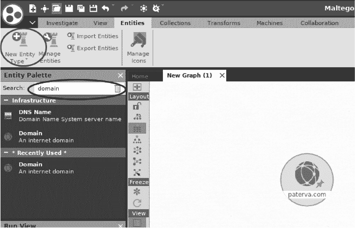

*图 8-2：将实体添加到画布中*

由于我们正在搜索有关 Maltego 本身的信息，修改域名实体的 URL，从 *[paterva.com](http://paterva.com)* 更改为 *[maltego.com](http://maltego.com)*。右键点击域名实体，通过点击 **Domain owner detail** 选项旁边的播放按钮运行 whois 转换器（图 8-3）。

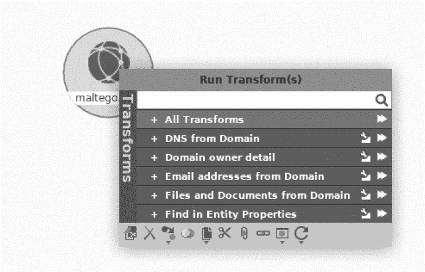

*图 8-3：运行 Maltego 转换器的示例*

运行转换器将生成与该域名相关的其他实体。图 8-4 显示了转换器的输出。请注意，输出包括你在 whois 查询中可以找到的信息。

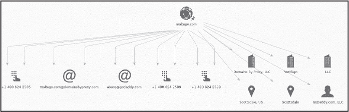

*图 8-4：Maltego 转换器的结果*

攻击者可能用这些信息做什么呢？通过连续应用转换器，他们可能会发现有关公司用户和基础设施的信息。你可以通过选择 **Transforms** ▶ **Transform Hub** 安装额外的转换器（图 8-5）。

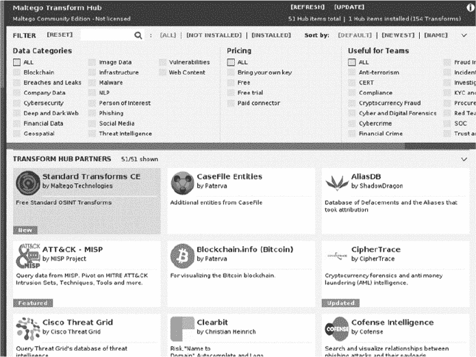

*图 8-5：Transform Hub 的转换器列表*

你能获得的最有用的信息之一是系统管理员的用户名和密码。多年来，黑客已经从 LinkedIn、Adobe 和 MasterCard 等公司窃取了包含登录凭证的数据库。如果你获得了系统管理员的邮箱地址，你可以在这些泄露的数据库中搜索与之相关的密码。

网站 *[`haveibeenpwned.com/`](https://haveibeenpwned.com/)* 跟踪这些泄漏事件，并存储与泄露密码相关的邮箱地址列表。直接访问该网站查看是否有你的密码被泄露，或者通过在 Maltego 中安装 *haveibeenpwned* 转换器并在你发现的邮箱地址上运行它来搜索数据库。

#### ***泄露凭证数据库***

你可能会注意到，转换器会告诉你邮箱地址是否在泄漏事件中暴露，但它不会显示密码。黑客是如何获取与泄露的邮箱地址相关的密码的呢？他们通常会转向其他包含明文用户名、邮箱地址和密码的数据库。曾经泄露的最大数据库之一包含大约 14 亿个邮箱地址（或用户名）和密码对。你可以通过以下 Magnet 链接找到这样的列表：

```
magnet:?xt=urn:btih:7ffbcd8cee06aba2ce6561688cf68ce2addca0a3&dn=

    BreachCompilation&tr=udp%3A%2F%2Ftracker.openbittorrent.com%3A80&tr=udp%3

    A%2F%2Ftracker.leechers-paradise.org%3A6969&tr=udp%3A%2F%2Ftracker.

    coppersurfer.tk%3A6969&tr=udp%3A%2F%2Fglotorrents.pw%3A6969&tr=udp%3A%2F

    %2Ftracker.opentrackr.org%3A133
```

**注意**

*拥有此密码列表在你的国家可能是非法的，因此在下载数据库之前请检查当地的法律。*

*磁力链接*是对种子文件的改进。与从单个服务器下载文件不同，种子文件允许你从多个机器（称为*节点*）下载文件的不同部分。种子文件包含一个链接，指向一个种子跟踪服务器，跟踪所有节点并促进它们之间的连接。但这也使得种子跟踪服务器成为单点故障。使用磁力链接后，每个节点会追踪其他节点，从而消除了对单一跟踪器的需求。

由于纯文本数据库非常大（41GB），它无法适应你最初配置的虚拟机。若要存储此文件，你需要增加虚拟机硬盘的大小。通过点击**文件** ▶**虚拟媒体管理器**来完成此操作（图 8-6）。

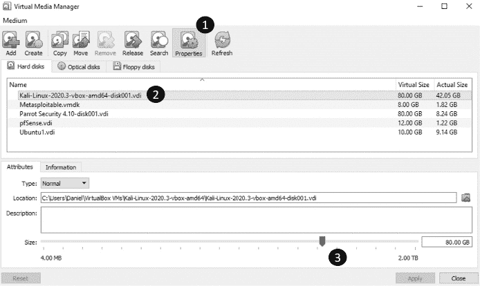

*图 8-6：如何增加硬盘大小*

选择 VirtualBox 中的**属性**选项卡 ➊，然后点击你想要增加大小的虚拟机镜像 ➋。接下来，将滑块 ➌ 移动到一个新的大小。然而要小心，因为将滑块移到最右侧可能会填满你的硬盘并使你的主操作系统无法使用。在执行这一步骤之前，请检查硬盘上的可用空间。

`rtorrent` 工具支持磁力链接。你可以通过运行以下命令来安装它：

```
kali@kali:~$ sudo apt-get install rtorrent
```

现在，你可以用它来下载文件：

```
kali@kali:~$ rtorrent <magnet link goes here>
```

数据库中的数据按字母顺序组织，并包含搜索工具，允许你在不到一秒钟的时间内找到特定的信息。泄露文件中包含一个*README* 文件，提供如何使用这些工具的说明。

#### ***SIM 卡劫持***

如果你在列表中发现密码，你可以尝试登录受害者的账户。但有些系统要求用户在登录后执行额外的验证步骤，这个过程通常被称为*双因素认证*。例如，系统可能会向用户的智能手机发送一条包含唯一验证码的短信，用户必须在认证时提供该验证码。其他系统则会打电话给用户，要求他们确认是否正在登录。然而，如果你无法访问受害者的手机，你将无法访问他们的账户。

尽管这些身份验证方法很有创意，攻击者仍然找到了一种方法，通过名为*SIM 劫持*的技术绕过双因素身份验证。这种攻击的原理是，电信公司可以在你购买新手机时将你的旧手机号码转移到新手机上。攻击者有时使用社交工程技术来欺骗这些公司，将受害者的电话号码转移到黑客的手机上。为了做到这一点，攻击者使用从链接分析和泄露数据库中收集的信息来回答客户代表的问题，冒充受害者。一旦电话号码被转移，所有的短信和电话都会被转发到黑客的手机上，从而绕过双因素身份验证。

此外，某些 SIM 卡允许黑客伪造电话号码或实时改变他们的声音。我们通常称这些为*加密 SIM 卡*。

### **Google Dorking**

Maltego 并不是唯一收集受害者数据的方式。攻击者也可以利用 Google 获取开放源代码数据。这个技术比你想象的更具盈利性，因为 Google 尝试查找并索引所有网页，其中一些网页允许系统管理员控制像 IP 摄像头这样的系统。系统管理员可以通过在*robots.txt*文件中列出某个资源，明确告诉 Google 不要爬取该资源。然而，一些网页爬虫会忽略这个文件，因此保护这些网页的最佳方法是要求用户身份验证。

通过使用精心设计的 Google 搜索，你可以发现让你查看或控制系统的网页。让我们来看一些这些查询，来找到敏感页面。

**注意**

*《计算机欺诈与滥用法案》（CFAA）禁止未经授权访问你不拥有的系统。因为你在自己的虚拟环境之外操作，所以点击你在此过程中发现的任何链接，可能构成未经授权的访问。*

Google 允许你使用特殊的过滤器，使搜索更加具体。例如，你可以使用`inurl`过滤器搜索 URL 中包含某些模式的页面，这些模式可能表明该页面的功能。例如，以下搜索将显示那些有意公开的实时摄像头：

```
inurl:"live/cam.html"
```

我们假设这些摄像头是故意公开的，因为它们已被分配到一个专用网页（*cam.html*）。以下查询尝试发现那些无意中暴露的 IP 摄像头：

```
"Pop-up" + "Live Image" inurl:index.html
```

这个查询搜索包含“live image”和“pop-up”术语的*index.html*页面。这些词通常与控制摄像头的网页相关。你可以通过添加更多的术语来使搜索更具体。

其他查询会搜索暴露的日志，寻找明文用户名和密码。例如，以下查询使用了`filetype`、`intext`和`after`过滤器，来查找 2019 年后发现的包含电子邮件地址和密码的日志文件：

```
filetype:log intext:password after:2019 intext:@gmail.com | @yahoo.com
```

你可以通过访问 *[`exploit-db.com/google-hacking-database/`](https://exploit-db.com/google-hacking-database/)* 来查看这些 Google 查询的列表。

### **扫描整个互联网**

一些系统尝试查找并记录互联网上的每个设备，并测试它们的漏洞。它们通过对互联网上所有 2³² 或 4,294,967,296 个 IPv4 地址执行 SYN 扫描来实现这一点。在本节中，我们将讨论两种工具，*Masscan* 和 *Shodan*，这两种工具允许攻击者扫描互联网。还有一些很棒的学术工具，如密歇根大学的 *Zmap*：[`zmap.io/`](https://zmap.io/)。

#### ***Masscan***

Masscan 是一个互联网规模的扫描器，用于扫描开放的 TCP 和 UDP 端口。它的创作者 Robert Graham 实现了自定义的 TCP/IP 协议栈，使得该程序可以在不到 10 分钟的时间内扫描整个 IPv4 互联网。这之所以可能，是因为 Masscan 每秒能够发送高达 1000 万个数据包。与 `nmap` 不同，`nmap` 是同步发送 SYN 数据包并等待 SYN-ACK 响应，而 Masscan 是独立地或异步地发送多个 SYN 数据包，不等待对前一个数据包的响应。

发送这么多数据包需要特殊的硬件和软件。运行 Masscan 的机器必须配备 10Gbps 以太网适配器，并安装 *PF_RING ZC* 驱动程序。在虚拟机上运行 Masscan 也会限制你可以发送的数据包数量。Masscan 在直接运行于 Linux 机器上时表现最佳。

对于我们的目的，我们将以每秒仅 100,000 个数据包的速度运行。我们还将只扫描一个端口。使用此配置，扫描整个互联网的每个 IPv4 设备大约需要 10 小时。尽管如此，这种配置仍然让我们可以使用没有特殊硬件或软件的 Kali Linux 虚拟机。

##### **使用排除列表**

还有一点：你实际上不想扫描整个互联网。某些政府和军队服务器的管理员对于被扫描并不友好。因此，几个组织已经编制了不应该扫描的 IP 地址列表，这些列表被称为 *排除列表*。你可以在 *[`github.com/robertdavidgraham/masscan/blob/master/data/exclude.conf`](https://github.com/robertdavidgraham/masscan/blob/master/data/exclude.conf)* 找到这样的排除列表。这个列表包含了 NASA 总部、NASA 信息与电子系统实验室以及美国海军计算机与通信站的机器的 IP 地址。**不要**扫描这些地址。

下载此列表并保存为名为 *exclude.txt* 的文件。它应类似于以下内容：

```
## NASA Headquarters

#138.76.0.0

## NASA Information and Electronic Systems Laboratory

#138.115.0.0

## Navy Computers and Telecommunications Station

#138.136.0.0 - 138.136.255.255
```

您可能会说，这个排除列表也可以当作攻击列表使用。但您是一个道德黑客，黑入这些系统是不道德的。该列表还包含由 FBI 和其他机构操作的多个蜜罐。*蜜罐*是故意在网络中放置的一个易受攻击的机器，作为攻击者的诱饵。当黑客入侵其中一台机器时，拥有者可以通过监视蜜罐的活动来发现黑客的工具和技术。

这是排除列表中包含的一些 FBI 蜜罐（重要的是定期更新您的排除列表，因为这些可能会发生变化）：

```
## (FBI's honeypot)

#205.97.0.0

## (FBI's honeypot)

#205.98.0.0
```

##### **执行 Masscan 扫描**

现在，让我们使用 Masscan 执行一次虚拟网络的快速扫描。打开您喜欢的文本编辑器，并添加以下内容：

```
➊ rate = 100000.00

   output-format = xml

   output-status = all

   output-filename = scan.xml
➋ ports = 0-65535
➌ range = 192.168.1.0-192.168.1.255
➍ excludefile = exclude.txt
```

`rate`表示每秒要传输的数据包数量 ➊。接下来的选项决定了输出文件的格式，以及包含哪些信息类型。我们还指定了要扫描的端口范围 ➋。在这里，我们扫描所有可能的端口，从 0 到 65,535\. 接下来，我们指定了要扫描的 IP 地址范围 ➌。我们将扫描虚拟环境中的所有 IP 地址。最后，我们指定了执行列表 ➍。虽然在我们的环境中不需要它，但进行公共互联网扫描时，应该包含此项。

将文件保存为 *scan.conf*。尽管可以将这些参数作为命令行参数提供，但创建这样的配置文件使得重复扫描变得更容易。

打开 Kali Linux 虚拟机的终端，并通过执行以下命令来运行扫描：

```
kali@kali:~$ sudo masscan -c scan.conf
```

您的 Kali Linux 虚拟机应该已经预装了 Masscan。随着扫描的进行，您应该会看到以下状态屏幕：

```
Starting masscan (http://bit.ly/14GZzcT)

 --forced options: -sS -Pn -n --randomize-hosts -v --send-eth
Initiating SYN Stealth Scan
Scanning 256 hosts [65536 ports/host]
rate: 13.39-kpps,   4.28% done,   0:20:56 remaining, found=0
```

扫描完成后，您可以通过在 Mousepad 或您喜欢的文本编辑器中打开 *scan.xml* 来查看 XML 结果。它将包含一份机器和开放端口的列表：

```
   <?xml version="1.0"?>

   <!-masscan v1.0 scan -->

   <?xml-stylesheet href="" type="text/xsl"?>

   <nmaprun scanner="masscan" start="1606781854" version="1.0-BETA"

			 xmloutputversion="1.03">

   <scaninfo type="syn" protocol="tcp" />
➊ <host endtime="1606781854"><address addr="192.168.1.101" addrtype="ipv4"/><

			 ports><port protocol="tcp" portid="32228"><state state="closed" reason

			 ="rst-ack" reason_ttl="64"/></port></ports></host>

   <host endtime="1606781854"><address addr="192.168.1.101" addrtype="ipv4"/><

			 ports><port protocol="tcp" portid="65128"><state state="closed" reason

			 ="rst-ack" reason_ttl="64"/></port></ports></host>

                              ...
```

以 `host endtime=` 开头的行 ➊ 表示 Masscan 检测到一台机器上的开放 TCP 端口（`portid=`），该端口的 ID 是 `32228`，机器的 IP 地址（`addr=`）是 `192.168.1.101`。

##### **读取横幅信息**

Masscan 还可以在某个端口上打开 TCP 连接，并下载通常包含该端口上运行的应用程序的详细信息的 *横幅* 信息。例如，横幅可能包括该应用程序的版本。这非常有用，因为一旦公司披露某些软件中的已知漏洞，运行 Masscan 的强大机器可以在不到 10 分钟的时间里识别出所有面向互联网的易受攻击的机器。

例如，运行较旧版本 OpenSSL 库的服务器容易受到名为 Heartbleed 的攻击。在 第九章 中，我们将详细探讨 Heartbleed，它可以允许黑客读取服务器的内存。现在，让我们看看黑客如何使用 Masscan 检测互联网上所有易受攻击的机器。

之前我提到过，Masscan 使用了自定义的 TCP/IP 实现。尽管这种实现非常适合扫描，但它在尝试建立 TCP 连接并下载横幅时，与操作系统的 TCP/IP 实现发生冲突。你可以通过使用`--source-ip`选项为 Masscan 发送的数据包分配一个唯一的网络 ID 来规避此问题。仔细选择此 IP 地址，以确保它在网络中是唯一的（以避免 IP 数据包被转发到其他机器）：

```
kali@kali:~$ sudo masscan 192.168.1.0/24 -p443 --banners --heartbleed --source-ip 192.168.1.200
```

在这里，我们使用*CIDR 表示法*（详见第二章了解 CIDR 表示法）指定了要扫描的 IP 地址范围。接下来，我们选择要检查的端口。在这个例子中，我们检查端口 443（`-p443`），它与 HTTPS 协议相关。然后，我们需要检查横幅（`--banners`），以获取与 Heartbleed（`--heartbleed`）漏洞相关的 OpenSSL 版本号。同时，建立多个 TCP 连接可能会导致 Masscan 的 TCP/IP 栈与操作系统的 TCP/IP 栈发生冲突，因此我们为外发的数据包指定一个新的源 IP 地址（`--source-ip`），避免与网络中其他机器发生冲突。

扫描完成后，我们应该看到以下输出：

```
   Starting masscan (http://bit.ly/14GZzcT)

    --forced options: -sS -Pn -n --randomize-hosts -v --send-eth

   Initiating SYN Stealth Scan

   Scanning 256 hosts [1 port/host]

   Discovered open port 443/tcp on 192.168.1.1

   Banner on port 443/tcp on 192.168.1.1: [ssl] TLS/1.1 cipher:0xc014, pfSense-5

			 f57a7f8465ea, pfSense-5f57a7f8465ea
➊ Banner on port 443/tcp on 192.168.1.1: [vuln] SSL[heartbeat]
```

扫描检测到端口 443 在主机➊上开放，并且该机器可能运行着一个易受攻击的 OpenSSL 版本。

如果你决定在虚拟测试环境之外运行此扫描，尤其是在通过 Wi-Fi 运行扫描时，你需要采取额外步骤。特别是，你需要防止操作系统干扰，通过防火墙阻止 Masscan 使用的端口。在 Linux 上，`iptables`程序允许编辑防火墙规则。运行以下命令以创建新规则：

```
kali@kali:~$ iptables -A INPUT -p tcp --dport 3000 -j DROP
```

该规则丢弃（`-j DROP`）所有与 TCP 协议（`-p tcp`）相关的传入（`-A INPUT`）数据包，端口为 3000（`--dport`3000）。我在第十六章中会更详细地讨论防火墙。有关 Masscan 的更多细节，请阅读 Masscan 文档，链接为*[`github.com/robertdavidgraham/masscan/`](https://github.com/robertdavidgraham/masscan/)*。

#### ***Shodan***

像 Google 一样，*Shodan*是一个搜索引擎。但与搜索网页的 Google 不同，Shodan 搜索的是活动的 IP 地址。当它找到一个地址时，它会尽可能收集该设备的更多信息，包括设备的操作系统、开放端口、软件版本和位置。Shodan 将这些信息进行编目，并通过网页和 Python API 提供搜索功能，因此当黑客和安全研究人员发现软件漏洞时，他们可以使用 Shodan 来找到易受攻击的设备。

例如，以下搜索查询返回支持 HTTPS 的 Apache 2.4.46 版本的 Web 服务器：

```
apache 2.4.46 https
```

图 8-7 展示了在 Shodan 上运行查询后的修改结果。

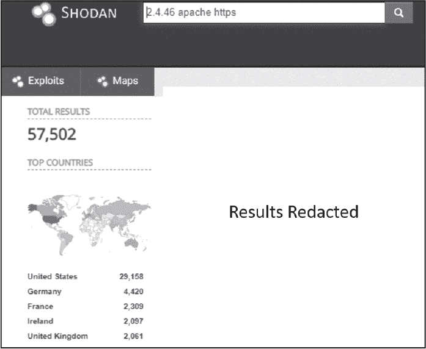

*图 8-7：在 Shodan 上运行查询的删减结果*

Shodan 还支持几个过滤器来精炼搜索结果。例如，`os`过滤器将结果限制为仅包含特定操作系统的设备，`city`过滤器将结果限制为某个特定城市的机器。以下查询返回位于弗吉尼亚州夏洛茨维尔、运行 Apache 并支持 HTTPS 的 Linux 服务器：

```
os:linux city:Charlottesville apache 2.4.46 https
```

你可以在*[`github.com/JavierOlmedo/shodan-filters/`](https://github.com/JavierOlmedo/shodan-filters/)*找到 Shodan 过滤器的列表。Shodan 仅允许注册用户运行过滤查询，但你总是可以使用你的 Protonmail 账户进行注册。

然而，使用 Shodan 也有一个缺点：每次查询 Shodan 时，它都会记录你的 IP 地址。这不好，因为 Shodan 现在知道你的 IP 地址和你正在扫描的内容。因此，最好是设置你自己的扫描机器。在第十六章中，我将向你展示如何设置这样一个匿名的黑客环境。现在，让我们讨论一下当前扫描方法的局限性。

### **IPv6 和 NAT 的局限性**

互联网扫描器无法扫描位于路由器后面的私有 IP 范围，路由器采用了一个叫做*网络地址转换（NAT）*的系统。这意味着，通常，公开扫描中唯一显示的设备是像电缆调制解调器和 Wi-Fi 路由器这样的公共设备。为了理解 NAT 以及它如何影响扫描，我们必须首先讨论 IPv4 的局限性。

#### ***互联网协议版本 6（IPv6）***

到目前为止，我已经讨论了扫描约 40 亿个可能的 IPv4 地址。然而，地球上大约有 80 亿人，其中一些人拥有多个设备，如手机、笔记本电脑、视频游戏控制台和物联网设备。互联网上大约有 500 亿个联网设备。40 亿个地址是不够的。

为了解决这个问题，提出了两种解决方案。第一种是通过 NAT 让多个人共享一个 IP 地址，第二种是创建一个新版本的 IP，称为*互联网协议（IPv6）*，它包含更多可能的地址。

IPv6 的设计者提出了为每个 IP 地址分配更多位的方案。IPv6 地址采用 128 位长度，而不是使用 32 位的 IPv4 地址，这使得可能的 IP 地址数量从 40 亿增加到 2¹²⁸，即 340 万亿亿亿（一万亿的三次方）。

与 IPv4 地址不同，IPv4 地址的 8 位段由介于 0 到 255 之间的十进制数字表示，而 IPv6 地址则以十六进制数字表示，每个十六进制数字代表一个 8 位序列。IPv6 地址通常写作由冒号分隔的八对十六进制数字。以下是一个 IPv6 地址的示例：

```
81d2:1e2f:426b:f4d1:6669:3f50:bf31:bc0e
```

由于 IPv6 的搜索空间如此之大，像 Masscan 这样的工具无法扫描每个 IPv6 地址。

你可能会想，如果已经有新的标准，为什么还有一些设备在使用 IPv4 呢？切换到 IPv6 需要更新网络中的网卡和路由器。因此，直到基础设施更新之前，许多系统需要与 IPv4 保持向后兼容。

#### ***NAT***

因为我们无法立即将网络中的所有设备升级到 IPv6，家庭 Wi-Fi 路由器使用 NAT 让家庭中的所有设备共享一个单一的 IP 地址。例如，考虑图 8-8 中描述的小型家庭网络，其中包括一台笔记本电脑和一部手机。

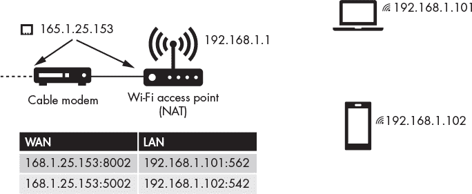

*图 8-8：使用 NAT 的示例家庭网络*

电缆调制解调器由 ISP 分配一个单一的 IP 地址，并将该地址与 Wi-Fi 路由器共享（在某些家庭网络中，电缆调制解调器和路由器合并为一个设备）。然后，路由器会创建自己的内部局域网（LAN），该局域网包含类似 192.168.0.0/16 或 10.0.0.0/8 等私有 IP 地址范围的 IP 地址。这些 IP 地址完全是内部的，不会被外部网络看到。

Wi-Fi 路由器还必须将这些内部 IP 地址映射到一个单一的外部 IP 地址。这是如何做到的呢？路由器通过端口号管理这种映射。例如，笔记本电脑可能被映射到外部 IP 地址的端口 1，而移动设备则可能被映射到相同的外部 IP 地址的端口 2。

但请记住，网络通信发生在进程之间，每个设备（如笔记本和手机）可能在运行多个进程。因此，设备可能需要多个端口来进行连接。我们可以通过为每个进程分配一个唯一的端口来解决这个问题。例如，运行在端口 562 上的笔记本浏览器进程（IP 地址为 192.168.1.101）可能会分配给外部地址（168.1.25.153）上的端口 8002，而在端口 452 上运行的笔记本游戏则分配给相同外部地址上的端口 5002。记录这些分配的表格称为 NAT 表。

你可以在图 8-9 中看到这种映射的示例。当数据包离开内部网络时，源 IP 会被 NAT 表中的条目替换，这使得所有流量看起来都来自一个 IP 地址，同时运行多个进程。

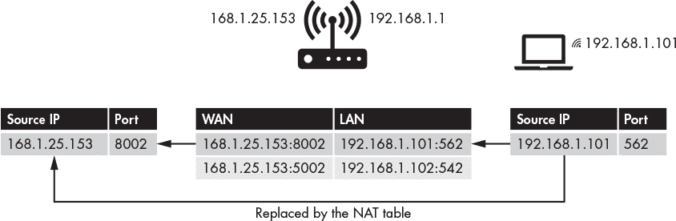

*图 8-9：如何替换源 IP 地址和端口*

如果数据包到达位于 168.1.25.153 上的调制解调器，并且端口为 8002，调制解调器会将其转发到路由器，路由器随后会将目标地址替换为相应的私有地址。

NAT 还防止像 Masscan 这样的扫描服务直接连接到实现 NAT 的路由器所连接的设备。这就是我们在第四章中设计反向 Shell 的原因。它发起了与服务器的连接，而不是反过来。

### **漏洞数据库**

*漏洞数据库*包含已知漏洞的集合。正如我所讨论的，一旦黑客使用 OSINT 技术了解受害者的系统，他们就可以搜索漏洞数据库，寻找访问这些系统的方式。

一个流行的漏洞数据库是 Exploit Database (*[`exploit-db.com/`](https://exploit-db.com/)*)，它包含漏洞信息以及如何利用这些漏洞的说明。图 8-10 显示了它的界面。

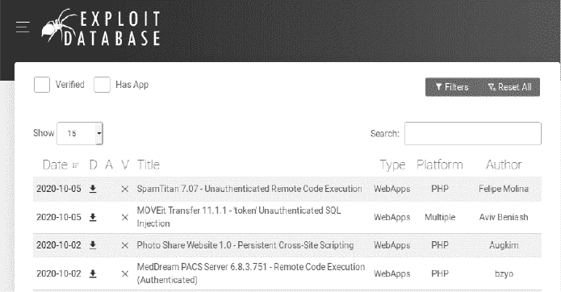

*图 8-10：Exploit Database 的漏洞列表*

此外，NIST 维护了 *国家漏洞数据库 (NVD)*，该数据库包含已知漏洞的集合，网址为 *[`nvd.nist.gov/vuln/search`](https://nvd.nist.gov/vuln/search)*。NIST 还提供了订阅服务，允许道德黑客在发现新漏洞时获得更新。这个数据库与由 Mitre 维护的 *公共漏洞和暴露 (CVE)* 数据库同步。图 8-11 显示了一个关于 Apache 漏洞的 CVE 数据库条目。

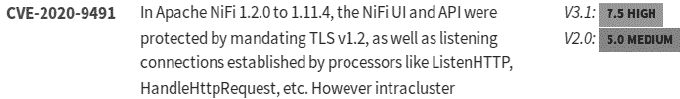

*图 8-11：Apache 服务器 CVE 2020-9491 漏洞的条目*

CVE 条目遵循特定的命名结构：CVE-YYYY-NNNN，其中 YYYY 代表漏洞被发现的年份，NNNN 是分配给漏洞的唯一编号。

这些工具在错误的手中可能造成伤害。例如，攻击者可能会收到关于新 CVE 漏洞的 NVD 更新，然后搜索 Shodan 查找运行漏洞软件的设备。这个场景不仅仅是一个假设。在 2020 年 10 月，NSA 发布了由某个国家行为者利用的 CVE 漏洞榜单。研究人员将继续发现新漏洞，并且会出现新的漏洞优选列表，因此这一循环将持续下去。这就是为什么保持系统更新和修补如此重要的原因。

你也可以通过在 Kali Linux 命令行中运行以下命令来搜索这些数据库：

```
searchsploit <keywords>
```

例如，以下搜索显示了在 Apache 2.4 上运行 `searchsploit` 查询的结果：

```
kali@kali:~/Desktop\$ searchsploit apache 2.4

-----------------------------------------------------------------------------------------
Exploit Title                                                       |  Path

----------------------------------------------------------------------------------------
Apache + PHP < 5.3.12 / < 5.4.2 cgi-bin Remote Code Execution     | php/remote/29290.c
Apache + PHP < 5.3.12 / < 5.4.2 Remote Code Execution + Scanner   | php/remote/29316.py
Apache 2.2.4 413 Error HTTP Request Method Cross-Site Scripting   | unix/remote/30835.sh
Apache 2.4.17 Denial of Service                                   | windows/dos/39037.php
Apache 2.4.17 < 2.4.38 'apache2ctl graceful' 'logrotate'Local..   | linux/local/46676.php
Apache 2.4.23 mod_http2 Denial of Service                         | linux/dos/40909.py
Apache 2.4.7 + PHP 7.0.2 'openssl_seal()'Uninitialized Memory..   | php/remote/40142.php
Apache 2.4.7 mod_status Scoreboard Handling Race Condition        | linux/dos/34133.txt
Apache < 2.2.34 / < 2.4.27 OPTIONS Memory Leak                    | linux/webapps/42745.py
```

每个条目都包含漏洞的名称和黑客可以用来利用它的脚本路径。你可以使用 `-p` 标志后跟唯一编号来查看利用脚本。每个漏洞利用文件都使用唯一的编号命名。例如，第二个远程代码执行漏洞的利用脚本名为 *29316.py*，因此我们可以使用以下命令查看实现该漏洞利用的文件信息：

```
kali@kali:~$ searchsploit -p 29316

  Exploit: Apache + PHP < 5.3.12 / < 5.4.2 - Remote Code Execution + Scanner

      URL: https://www.exploit-db.com/exploits/29316

   ➊ Path: /usr/share/exploitdb/exploits/php/remote/29316.py
File Type: Python script, ASCII text executable, with CRLF line terminators
```

你可以通过打开显示路径 ➊ 的文件来查看利用代码。我将在 第九章 中更详细地讨论漏洞利用。

### **漏洞扫描器**

搜索每个系统配置的漏洞数据库是繁琐的。幸运的是，漏洞扫描器可以自动扫描系统并识别任何存在的漏洞。在本节中，我将讨论一个名为 *Nessus* 的商业解决方案；但是，也有像 OpenVAS 和 Metasploit 的 Nexpose 扫描模块这样的开源解决方案。

*Nessus Home* 扫描器是免费的，但仅限于 16 个 IP 地址。我们将使用它来扫描你的虚拟实验环境。打开 Kali Linux 虚拟机上的浏览器并从 *[`www.tenable.com/downloads/nessus/`](https://www.tenable.com/downloads/nessus/)* 下载适用于 Debian 的 Nessus 扫描器。

接下来，打开终端并进入下载文件所在的文件夹：

```
kali@kali:~$ cd ~/Downloads
```

使用 Debian 包管理系统通过运行以下命令安装该文件：

```
kali@kali:~/Downloads$ sudo dpkg -i Nessus-<version number>-debian6_amd64.deb
```

请记得将 Nessus 的版本号替换为你下载的版本。接下来，运行以下命令来启动 Nessus 服务：

```
kali@kali:~/Downloads$ sudo systemctl enable nessusd
kali@kali:~/Downloads$ sudo systemctl start nessusd
```

你可以通过浏览器访问 Nessus。打开 Kali Linux 上的 Firefox 浏览器并输入以下 URL，连接到运行在 Kali Linux 虚拟机上的 Nessus 服务器：

```
https://127.0.0.1:8834/
```

你应该会看到一个安全警告。这是因为服务器使用的是自签名证书，就像我们在第六章中生成的证书一样，而你的浏览器无法通过 PKI 验证该证书。无需担心：这个证书是安全的，你可以添加一个例外。在浏览器中，点击 **高级** 并选择 **接受风险并继续**（见 图 8-12）。

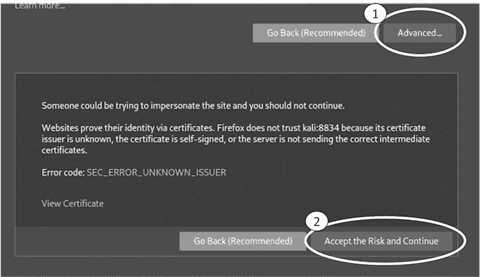

*图 8-12：接受未通过 PKI 验证的证书*

启动虚拟实验环境中的所有设备，并运行我们在第二章中讨论的 `netdiscover` 工具，以获取虚拟实验环境中所有机器的 IP 地址。

接下来，在 Nessus 中，点击 **所有扫描** 标签，然后点击 **新建扫描** 按钮创建你的第一个扫描。在这里，你还可以看到可以使用 Nessus 执行的所有扫描。选择一个基础扫描（图 8-13）。

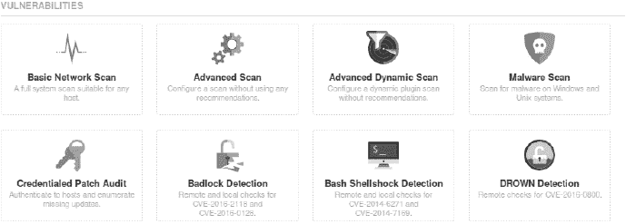

*图 8-13：可用扫描列表*

填写你的扫描信息。我们将仅限于扫描 Metasploitable 机器，因此将其 IP 地址添加到主机列表中。（记住，你可以使用用户名 **msfadmin** 和密码 **msfadmin** 登录 Metasploitable 机器，然后运行 `**ifconfig**` 命令获取虚拟机的 IP 地址。）图 8-14 显示了这些设置。

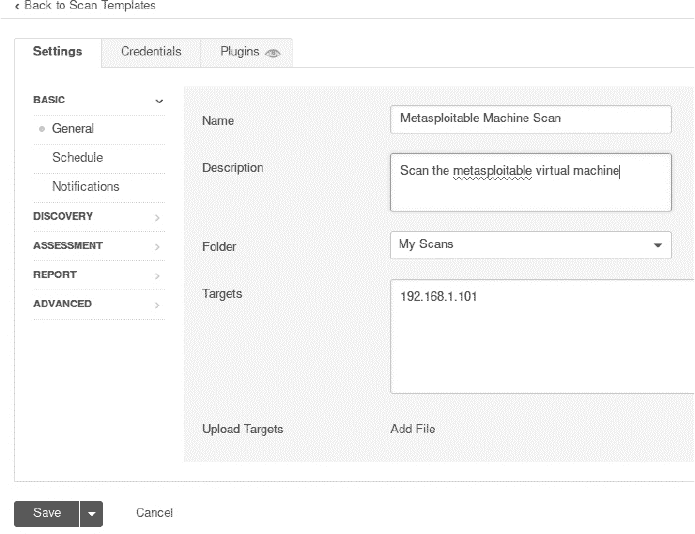

*图 8-14：创建一个新的 Nessus 扫描。*

启动扫描。当扫描完成后，点击 **漏洞** 标签查看漏洞列表（图 8-15）。

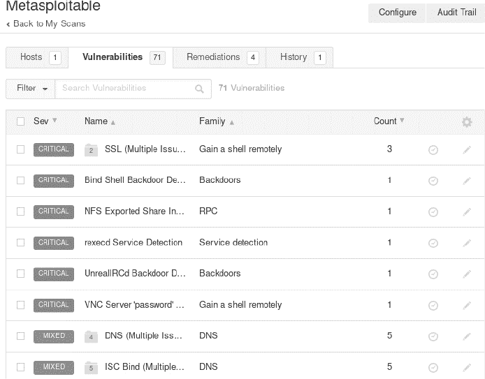

*图 8-15：扫描检测到的漏洞*

注意到扫描检测到了一个后门。这与我们之前利用的后门相同。一旦黑客识别出这个漏洞，他们可以执行 第一章 中讨论的攻击，从而获得机器的 root shell 访问权限。

### **练习**

通过尝试以下练习，探索其他 OSINT 工具。我已按难度逐步排序这些练习。在第一个练习中，你将使用 `nmap` 通过执行不同的 `nmap` 扫描来收集关于服务器的信息。在第二个练习中，你将使用 Discover 工具运行多个 OSINT 工具，并将结果汇总到一个报告中。在第三个也是最后一个练习中，你将编写自己的 OSINT 工具，从 whois 数据库中检索管理员的电子邮件地址，并检查泄漏的密码列表，看看是否包含明文密码条目。

#### ***nmap 扫描***

我在接下来的代码中列出了一些示例 `nmap` 扫描。第一个扫描使用 `nmap` 中的 `http-enum` 脚本列举网站上的文件和文件夹。这是发现隐藏文件或目录的好方法：

```
kali@kali:~$ sudo nmap -sV -p 80 --script http-enum <IP address of victim

			 machine>
```

第二个 `nmap` 扫描尝试识别服务器的操作系统和正在运行的服务器，同时避免被检测到：

```
kali@kali:~$ sudo nmap -A -sV -D <decoy-IP-1,decoy-IP-2,MY-IP,decoy-IP-3...> <

			 IP address of victim machine>
```

`-A` 选项启用操作系统检测、版本检测、脚本扫描和 traceroute。`-D` 标志启用使用诱饵进行扫描，它通过发送带有虚假源 IP 地址的虚拟数据包与扫描机的真实 IP 地址一起，试图避免防火墙检测。第三个示例使用 `nmap` 作为漏洞扫描器。

```
kali@kali:~$ sudo nmap -sV --script vulners <IP address of victim machine>
```

我们提供了 `vulners` 脚本，它会扫描机器并列出它检测到的 CVE 漏洞。你可以通过列出 Kali Linux 虚拟机上 *script* 目录的内容，找到当前安装的所有 `nmap` 脚本的完整列表，如下所示：

```
kali@kali:~$ ls /usr/share/nmap/scripts/
```

最后，尝试对所有常见端口进行扫描（`-p-`），使用默认脚本（`-sC`），并将结果以普通格式（`-oN`）输出到名为 *scanResults.nmap* 的文件中：

```
kali@kali:~$ nmap -sV -sC -p- -oN scanResults.nmap <IP address of victim machine>
```

#### ***Discover***

*Discover* 是一款开源工具，包含各种脚本，用于自动化 OSINT 和漏洞扫描过程。在扫描完成后，Discover 会生成报告，展示它找到的信息，如 图 8-16 所示。

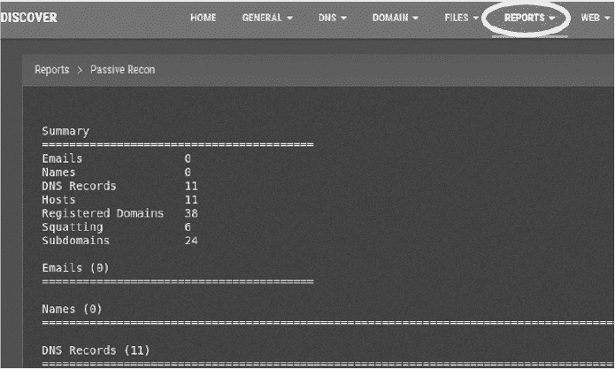

*图 8-16：运行 Discover 扫描的结果*

Discover 包括两种 OSINT 扫描工具类别：被动和主动。它们之间的主要区别在于你被发现的可能性。被动扫描查询第三方保存的记录，因此受害者不太可能知道自己正在被扫描。主动扫描则探测受害者的基础设施，更容易触发警报。

首先，检查一些 Discover 的被动扫描工具：

**ARIN 和 Whois**    识别 IP 地址。（美国互联网号码注册局是管理 IP 地址并托管 whois 数据库的组织。）

**dnsrecon**    从 DNS 服务器收集 OSINT。（也支持主动扫描。）

**goofile**    搜索一个域名中的特定文件类型。

**theHarvester**    从公共互联网源（如 Google 和 LinkedIn）搜索与所调查的域名相关联的电子邮件地址。

**Metasploit 扫描工具**    使用 Metasploit 框架执行扫描。

**URLCrazy**    检查可能用于抢注的 URL 变种，就像我们在第七章中考虑的 *[facebeok.com](http://facebeok.com)* 示例。

**Recon-ng**    包含一系列专门用于基于网络的开源侦察工具。（也支持主动扫描。）

以下是一些主动扫描工具：

**traceroute**    发送 ICMP 数据包以发现通往服务器的路径上的路由器。

**Whatweb**    探测一个网站以揭示构建它所使用的技术。

你不需要单独运行这些工具。Discover 工具会为你执行它们并生成一份综合报告。

运行以下命令来克隆 Discover 仓库并将其放入 Kali Linux 虚拟机中的 *opt* 目录。此目录包含你安装的所有 Linux 程序：

```
kali@kali:~$ sudo git clone https://github.com/leebaird/discover /opt/discover/
```

导航到包含该仓库的目录并运行 *update.sh* 脚本。这将安装 Discover 及其所有依赖：

```
kali@kali:~$ cd /opt/discover/
kali@kali:~/opt/discover$ sudo./update.sh
```

在安装过程中，你将被要求输入信息以创建证书。记住，你不需要使用个人信息。就像你之前创建证书时那样，随便填一些信息。

安装过程需要一些时间。在此期间，在 Kali Linux 桌面上创建一个名为 *Results* 的文件夹，用来保存你的报告。当安装完成后，使用以下命令运行 Discover：

```
kali@kali:~/opt/discover$ sudo./discover.sh
```

作为练习，从 **Recon** 菜单中选择域名选项，并对你拥有或已获得扫描许可的域名进行被动和主动扫描。扫描可能需要超过一小时的时间。

Discover 应将扫描结果输出到以下文件夹：*/root/data/*。运行以下命令，将其移动到你的 *Results* 文件夹以便于访问：

```
kali@kali:~$ mv /root/data/ ~/Desktop/Results
```

你发现了什么信息？

#### ***编写你自己的 OSINT 工具***

你能够在自己的能力范围内掌握多少网络？写一个扫描器，执行对四十亿 IPv4 地址中的任意一个进行 whois 查询。由于你不会连接这些 IP 地址，所以可以检查所有 IP 地址，实际上，你是在公共数据库中查找管理员的信息。

换句话说，你应该能够运行

```
kali@kali:~$ whois 8.8.8.8
```

并提取任何发现的电子邮件地址。然后，使用 *[`haveibeenpwned.com/API/v2`](https://haveibeenpwned.com/API/v2)* 提供的 `haveibeenpwned` API 查看管理员的电子邮件地址是否与密码泄露相关。

出于测试目的，你可能只想限制扫描某几个地址，等工具正常工作后再进行更大范围的扫描。

##### **奖励**

检查之前下载的包含 14 亿个电子邮件地址和密码的泄露数据库。它是否包含 whois 命令返回的电子邮件地址的密码条目？遍历一组 IP 地址，并输出一个 CSV 文件，其中每一行包含一个 IP 地址、电子邮件地址和密码。
