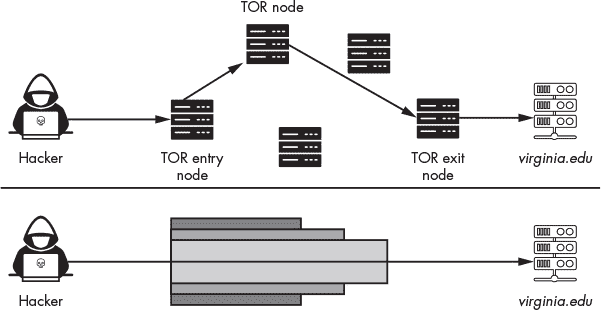
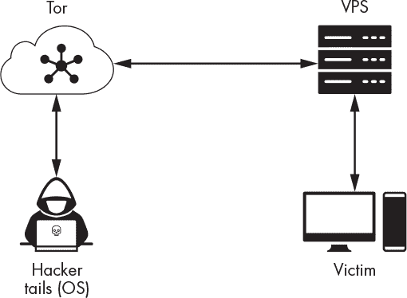
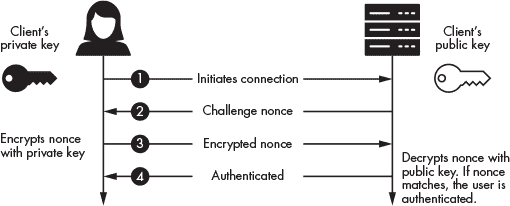

## **16

下一步**

*现在，这三样东西常存：信心、希望和爱，但其中最伟大的就是爱。*

– 哥林多前书 13:13


在结束这本书之前，我想给你一些工具，帮助你继续你的道德黑客之旅。在这一章中，你将设置你自己的黑客服务器，这将使你能够审计虚拟环境之外的系统。你可以使用这个服务器在真实系统上进行本书中描述的攻击。一旦你设置好了服务器，我将讨论一些我在本书中没有涉及的激动人心的道德黑客话题，包括攻击无线网络和软件定义无线电、逆向工程恶意二进制文件、黑客工业系统以及探索量子计算。

### 设置一个加固的黑客环境

到目前为止，我们的所有攻击都在虚拟环境内进行。但如果你想审计虚拟环境之外的系统，你需要设置一个加固的*虚拟私人服务器（VPS）*，这是一台在数据中心运行的虚拟机，拥有一个公共 IP 地址。使用远程 VPS 有几个优势，包括匿名性和轻松为自己分配公共 IP 地址，使得你的服务器能够与互联网上的其他机器进行通信。这将使你能够与虚拟环境外的设备上的远程 shell 进行通信。

然而，拥有公共 IP 地址也意味着互联网上的其他机器可以检测并扫描你的 VPS，因此你必须确保它是安全的。我们通常将确保机器安全的过程称为*加固*。

另一种选择是将个人台式机或笔记本电脑设置为你自己的私人服务器。但如果你这样做，你需要设置端口转发，以便家庭路由器中的 NAT 知道将传入的网络包转发到你的服务器。设置自己的服务器还有其他一些缺点。例如，与攻击相关的 IP 地址很容易追溯到你。

在本节中，我们将介绍如何设置一个安全且匿名的黑客 VPS。

#### *保持匿名性使用 Tor 和 Tails*

在设置你的 VPS 之前，你需要找到一种方法来避免被检测到。你可能听说过使用*Tor*来保持在互联网上的匿名性。Tor 是一个由计算机组成的网络，它通过类似电话游戏的方式将流量从一台机器传递到另一台机器，使得很难检测到流量的来源，因为没有任何节点同时知道源头和目的地。

要使用 Tor，用户首先从一个公开的、受信任的来源（称为*Tor 目录授权机构*）获取 Tor 节点列表，然后与网络中的一个节点建立加密连接，这个节点被称为*入口节点*。Tor 客户端将使用与入口节点的加密连接与另一个节点建立加密连接。这类似于将一个加密的信封放入另一个信封中，它可以防止中间的 Tor 节点读取消息。这个在加密连接中建立加密连接的过程会继续，直到 Tor 客户端选择一个节点作为*出口节点*。出口节点是与用户想要访问的服务器或网站建立连接的节点。发送到服务器的数据包将仅包含 Tor 出口节点的源地址。这意味着，从服务器的角度来看，流量似乎是从出口节点发出的（图 16-1）。



*图 16-1：Tor 网络如何传输数据*

需要注意的是，Tor 并不会隐藏你正在使用 Tor 的事实，无论是对你的 ISP 还是对国家级行为者。Tor 中继的列表是公开的，你的 ISP 可以看到它代表你路由的 IP 地址。因此，你的 ISP 可以检测到你首次连接到 Tor 中继的行为。然而，跟踪随后的 Tor 中继连接则更加困难，尤其是当它们位于发起连接的国家之外时。这意味着，尽管你的 ISP 可以检测到你正在使用 Tor，但他们无法确定你通过 Tor 访问了哪些网站。国家级行为者可以通过*关联攻击*来推测 Tor 用户访问的网站，这种攻击方式是通过监控用户何时将流量发送到 Tor 以及流量何时退出来实现的。通过分析时间和流量模式，国家级行为者可以推测你访问了哪些网站。你可以通过阅读 Yixin Sun 的论文《RAPTOR: Routing Attacks on Privacy in Tor》（*USENIX 安全大会*，2015）了解更多关于这些攻击的信息。

Tor 也不会加密连接中的这一最后一段，因此你必须确保通过使用 HTTPS 与服务器建立安全连接。最后，Tor 无法保护你所访问的服务器。任何你提供给该服务器的数据，如果服务器被攻破或被传唤，都可以被提取出来，如果你通过 Tor 访问恶意网站，该网站仍然可能通过安装恶意软件来破坏你的机器，进而揭示你的匿名身份。

*Tails* 是由 Tor 项目创建的一个 Linux 发行版，所有流量都会通过 Tor 进行路由。它还包括 *Tor 浏览器捆绑包*，这是一个预装了 HTTPS Everywhere 和 NoScript 的 web 浏览器。从 第二章 回顾，HTTPS Everywhere 是一个工具，旨在限制浏览器发送未加密流量的数量。这样可以减少被拦截流量的人发现你的可能性。NoScript 是一个浏览器插件，防止 JavaScript 在浏览器中执行，防止攻击者利用 JavaScript 将反向 shell 加载到你的机器上。Tails 还包括一个比特币钱包。你可以从 USB 设备运行 Tails，它不会写入磁盘，因此在拔掉 USB 设备后，系统不会留下任何痕迹。你可以在 *[`tails.boum.org/install/index.en.html`](https://tails.boum.org/install/index.en.html)* 查找下载和安装 Tails 的说明。

#### *设置虚拟私人服务器*

在你下载并安装 Tails 后，使用它来设置你的 VPS。

亚马逊 Web 服务、DigitalOcean 和 Vultr 等服务使得设置 VPS 变得简单且实惠。然而，考虑到这些服务会记录你的姓名和账单信息，匿名性就成了一个问题。因此，考虑使用 *[`BitLaunch.io/`](https://BitLaunch.io/)*，通过使用比特币购买 VPS 来保持匿名。它支持 DigitalOcean 或 Vultr。比特币区块链是公开的，它存储了所有用户之间的交易。因此，每个人都可以看到用户 X 向用户 Y 支付了两枚比特币，但没有人看到用户 X 或 Y 的真实姓名，只能看到他们的公钥。其他加密货币，如门罗币，则隐藏交易信息，使交易无法追踪。

图 16-2 展示了设置的概览。一个使用 Tails 的攻击者通过 Tor 网络匿名访问 VPS。然后，他们利用这个 VPS 与受害者机器上的反向 shell 进行通信。



*图 16-2：使用 Tails 连接到 VPS*

如果受害者发现反向 shell，他们将能够追踪攻击回 VPS，但通过 Tor 网络追踪到攻击者将会非常困难。

#### *设置 SSH*

在你设置好 VPS 后，配置 SSH 密钥以便能够远程安全地访问它是一个非常好的主意。你不应该使用用户名和密码组合，因为像 Hydra 这样的工具允许攻击者暴力破解用户名和密码组合。相反，最好使用非对称加密技术登录。

为此，你需要生成一对公私密钥，并将公钥的副本上传到服务器，服务器将使用它来验证用户。图 16-3 展示了这个认证过程的概览。



*图 16-3：使用非对称加密认证 SSH 服务器*

客户端发起连接 ➊。然后，服务器通过发送挑战 nonce 来响应 ➋。客户端收到 nonce 后，用客户端的私钥加密 nonce 并将加密后的 nonce 发送回服务器 ➌。服务器随后使用客户端的公钥解密 nonce，如果 nonce 匹配，则客户端通过身份验证 ➍。现在让我们在 Tails 设备上生成公钥和私钥对。

在 Tails 机器上运行命令 `**ssh-keygen**`，使用 第六章中讨论的 ECDSA 算法创建公钥和私钥对：

```
amnesia@amnesia$ ssh-keygen -t ecdsa -b 521

Generating public/private ecdsa key pair.
Enter file in which to save the key (/home/amnesia/.ssh/id_ecdsa):
Enter passphrase (empty for no passphrase):
Enter same passphrase again:
Your identification has been saved in /home/amnesia/.ssh/id_ecdsa
Your public key has been saved in /home/amnesia/.ssh/id_ecdsa.pub
The key fingerprint is:
SHA256:ZaQogDeZobktFCJIorwJkjWRxLmLSsdcVRbX1BjvQHs amnesia@amnesia
The key's randomart image is:

+---[ECDSA 521]---+

|**BB    .+o.o++  |

|O=Xo   o.o. .oo. |

|B+ o. o . o  o E |
```

在提示输入文件名时，按 ENTER 键将密钥保存到默认路径。接下来，创建一个长且安全的密码短语。如果有人获得了你 Tails 操作系统的访问权限并窃取了密钥，他们可能会尝试使用基于字典的攻击破解密码短语，并访问你的 VPS。

在你生成了密钥对之后，你需要将公钥复制到服务器。使用 `ssh-copy-id` 工具将公钥复制到服务器：

```
$ ssh-copy-id -i /home/amnesia/.ssh/id_ecdsa.pub hacker@192.168.1.114

/usr/bin/ssh-copy-id: INFO: Source of key(s) to be installed: "/home/amnesia/.

			 ssh/id_ecdsa.pub"

/usr/bin/ssh-copy-id: INFO: attempting to log in with the new key(s), to

			 filter out any that are already installed

/usr/bin/ssh-copy-id: INFO: 1 key(s) remain to be installed -- if you are

			 prompted now it is to install the new keys
hacker@192.168.1.114's password:**your_password
Number of key(s) added: 1
```

到这个时候，你应该能够按照以下方式登录到机器：

```
amnesia@amnesia$ ssh hacker@<VPS IP address>
```

既然你已经设置了基于非对称加密的身份验证，最好也编辑 *ssh_config* 文件，以防止密码登录和 root 登录。你可以通过以下方式在 Vim 中打开这个文件：

```
root@debian:~/# vim /etc/ssh/sshd_config
```

#### *安装你的黑客工具*

现在你已经设置好 VPS，并能够安全、匿名地连接到它，接下来是时候安装你需要的黑客工具了。你可以选择两种方式之一来设置你的 VPS。第一种方式是只安装你需要的工具。例如，如果你正在测试 XSS 漏洞，你可以创建一个仅运行 BeEF 框架的服务器，其他什么都不安装。这种方式可以最小化在 VPS 上运行的应用程序数量，从而减少攻击面。（记住，唯一可以完全信任的工具是你自己构建的工具。）

另外，你也可以创建一个包含许多黑客工具的通用机器。由 David Kennedy 启动的 *PenTesters Framework (PTF)* 包含 Python 脚本，使得下载和安装最新的黑客工具变得更加简单。PTF 也是发现新工具的一个极好资源。

你不需要创建你自己的自定义机器。你也可以在你的 VPS 上安装 Kali Linux 或 Parrot OS。然而，这些机器默认没有安装 SSH 服务器，因此你需要安装一个 SSH 服务器才能远程登录。

在这里，我们假设你选择了创建一个运行 Debian Linux 的自定义 VPS，但这些脚本应该适用于大多数基于 Linux 的系统。首先，在你的 VPS 上安装 `git`（`**apt-get install git**`），然后将 PTF 仓库克隆到你的新 VPS 上：

```
git clone https://github.com/trustedsec/ptf.git
```

接下来，安装 `python3-pip`，使用 `pip3` 安装依赖项，并运行 PTF（`./ptf`）：

```
cd ptf pip3
install -r requirements.txt

./ptf
```

当你想使用某个模块时，通过指定安装脚本的路径来安装它：

```
ptf> use modules/exploitation/metasploit
ptf:(modules/exploitation/metasploit)>install
```

你可以通过查看 Git 仓库找到所有安装脚本。工具安装完成后，你可以像以前一样使用它。运行以下命令安装所有工具：

```
ptf> use modules/install_update_all

[*] You are about to install/update everything. Proceed? [yes/no]:yes
```

安装过程将需要一些时间。

#### *加固服务器*

加固是配置服务器以保护其免受攻击的过程。例如，你可能会为 GRUB 引导加载程序设置密码保护，以防止攻击者修改启动过程。或者你可以安装一个像 *ArpWatch* 这样的工具，它由 Lawrence Berkeley National Laboratory 开发，用于检测 ARP 欺骗攻击。

在加固你的机器时要小心，因为你可能会把自己锁在外面，或者限制机器的功能。例如，禁用编译器是常见的做法，以防止攻击者在你的服务器上编译恶意软件。然而，作为一名道德黑客，你需要编译器来编译你的工具，所以你可能会选择跳过这个加固步骤。

*互联网安全中心（CIS）*维护了一份用于系统安全的建议清单，称为 CIS 基准。使用这些基准来加固你的 VPS，并在审计公司的安全性时牢记它们。像 `Jshielder`、`debian-cis` 和 `nixarmor` 这样的开源工具会自动将许多 CIS 建议应用到你的服务器上。你可以按如下方式安装 `JShielder`：

```
root@debian:~/# git clone https://github.com/Jsitech/JShielder
```

导航到 *JShielder* 文件夹并运行 *JShielder.sh* 脚本（`.\JShielder`），该脚本将提示你选择要加固的操作系统：

```
------------------------------------------------------------------------

[+] SELECT YOUR LINUX DISTRIBUTION

------------------------------------------------------------------------

1\. Ubuntu Server 16.04 LTS

2\. Ubuntu Server 18.04 LTS

3\. Linux CentOS 7 (Coming Soon)

4\. Debian GNU/Linux 8 (Coming Soon)

5\. Debian GNU/Linux 9 (Coming Soon)

6\. Red Hat Linux 7 (Coming Soon)

7\. Exit
```

这些加固工具通常会安装 rootkit 检测工具，如 `rkhunter` 或 `chkrootkit`。它们也可能会安装入侵预防系统，如 `fail2ban`，该系统会在多次登录失败后更新防火墙规则，禁止 IP 地址。

许多自动加固工具会使用 `iptables` 工具来配置防火墙规则。如果你想自己更改防火墙规则，可以使用为 iptables 开发的几个前端工具之一。最好的一个是 *Uncomplicated Firewall*，你可以使用以下命令安装：

```
root@debian:~/# sudo apt-get install ufw
```

安装完成后，你可以通过仅使用几个命令开始配置防火墙。例如，以下命令将默认策略设置为拒绝所有传入的数据包：

```
root@debian:~/# ufw default deny incoming
```

然后，你可以开始添加一些例外。例如，我们可能希望允许 SSH 连接和 8080 端口上的连接，以便植入程序可以连接到我们的服务器：

```
root@debian:~/# ufw allow ssh
root@debian:~/# ufw allow 8080
```

配置规则完成后，运行 `**ufw enable**` 命令启用防火墙：

```
root@debian:~/# ufw enable
```

最后，使用 `ufw status` 命令查看防火墙的状态和规则摘要：

```
root@debian:~/# ufw status
Status: active

To                         Action      From

--                         ------      ----

22/tcp                     ALLOW       Anywhere

8080                       ALLOW       Anywhere

22/tcp (v6)                ALLOW       Anywhere (v6)

8080 (v6)                  ALLOW       Anywhere (v6)
```

另一个有用的工具是由 NSA 和 Red Hat 开发的*SELinux*，它为操作系统的文件添加了额外的策略属性。这个策略属性结合 SELinux 的策略规则，决定了这些文件如何被访问和修改。当一个进程试图访问一个文件时，SELinux 会检查文件的策略属性，以确定是否允许该进程访问该文件。SELinux 还会记录它阻止的访问，这些日志是检查可疑入侵的好地方。

运行以下命令安装带有默认策略的 SELinux：

```
sudo apt-get install selinux-basics selinux-policy-default auditd
```

当安装完成后，启用 SELinux 并重启系统：

```
root@debian:~/# sudo selinux-activate
```

除了加固服务器外，你还应该启用全盘加密。

#### *审核你的加固服务器*

在加固完系统后，进行快速审核以查看效果如何。开源工具*Lynis*可以让你根据 CIS 基准对系统进行审核。运行以下命令来安装 Lynis：

```
root@debian:~/# sudo apt-get install lynis
```

然后使用`**sudo**`运行它：

```
   root@debian:~/#  sudo lynis audit system

                        ...

     Lynis security scan details:

➊ Hardening index : 84 [##############      ]

   Tests performed : 260

   Plugins enabled : 1

   Components:

   - Firewall               [V]

   - Malware scanner        [V]

   Scan mode:

   Normal [V]  Forensics [ ]  Integration [ ]  Pentest [ ]

   Lynis modules:

   - Compliance status      [?]

   - Security audit         [V]

   - Vulnerability scan     [V]

   Files:
➋ - Test and debug information      : /var/log/lynis.log

   - Report data                     : /var/log/lynis-report.dat

                        ...
```

报告会打印出你可以改进的领域，并给出一个加固指数分数➊。相关的详细报告➋包含 Lynis 运行的每个测试的输出。例如，Lynis 检查服务器是否安装了 Snort 入侵检测系统。此测试的结果将显示在报告中。

### 其他主题

我选择突出以下主题，因为我觉得它们很有趣，并希望通过分享这些内容，能够激发你的兴趣。让我们先从我最喜欢的主题之一——软件定义无线电开始。

#### *软件定义无线电*

到目前为止，我们专注于收集和分析流经网络电线的电信号。但是，每天都有充满信息的无线电信号在我们周围漂浮。这些信号包括蜂窝和卫星通信、警察无线电通话，甚至是汽车立体声的 FM 信号。

*软件定义无线电（SDR）*将无线电信号转换为可以在计算机上分析的数字信号。SDR 也是可编程的，让你可以将其转换为 AM 接收器，就像汽车中的接收器，甚至接收 NOAA 气象卫星的卫星图像。我的最爱 SDR 应用将其作为地面站与 Es'hail 2/QO-100 静止卫星上的业余无线电转发器进行通信。该卫星上的转发器是免费的，任何业余无线电爱好者都可以公开使用。

市场上有几款 SDR（软件定义无线电）。我推荐由 Analog Devices 开发的*ADALM-Pluto RF*，这是一款入门级 SDR，配有出色的文档。Pluto 运行 Linux 系统，你可以编写程序处理它记录的数字值。

也有一些很棒的开源工具用于处理 SDR。*GNU Radio*允许你通过拖放功能块来可视化编程 SDR。你可以通过运行以下命令在 Kali Linux 上安装它：

```
kali@kali:~$ sudo apt-get install gnuradio
```

NSA 也有自己的 SDR 工具，叫做*Redhawk*，并已公开发布。Redhawk 的文档非常出色。你可以在其网站上阅读更多关于 Redhawk 的信息，网址是*[`redhawksdr.org`](https://redhawksdr.org)*。

学习 SDRS 的最佳资源之一是*[`sdrforengineers.github.io`](https://sdrforengineers.github.io)*。该网站提供了多个编码示例，以及 Alexander Wyglinski 的讲座和 Travis Collins 的实验室（请参见*：[`www.youtube.com/playlist?list=PLBfTSoOqoRnOTBTLahXBlxaDUNWdZ3FdS`](https://www.youtube.com/playlist?list=PLBfTSoOqoRnOTBTLahXBlxaDUNWdZ3FdS)*中的翻转课堂部分）。

#### *攻击蜂窝基础设施*

攻击公共蜂窝基础设施是非法且不道德的。如果你尝试进行这里描述的任何攻击，你应该使用法拉第笼，这是一个能够隔离你的测试环境并防止信号进出笼子的设备，以避免拦截外部信号。

话虽如此，专门的黑客工具可以做一些事情，比如追踪手机用户。每个移动用户都被分配一个 ID，称为*国际移动用户身份（IMSI）*，该 ID 永久标识其为 4G 用户。当用户移动到新位置时，他们的手机会将 IMSI 注册到该区域的信号塔。Harris 公司生产了一种名为*Stingray*的工具，允许执法机构追踪手机用户。它通过伪装成一个手机塔来工作。当用户在 Stingray 的覆盖范围内时，他们的手机会连接到它，并发送该用户的 IMSI。

Stingray 设备虽然昂贵，但你可以使用 SDR 来构建自己的 IMSI 捕获器。一个开源 IMSI 捕获器项目的例子是*IMSI-catcher*（*[`github.com/Oros42/IMSI-catcher`](https://github.com/Oros42/IMSI-catcher)*）。一旦攻击者拥有了某个用户的 IMSI，攻击者就可以冒充该用户，拨打电话并发送短信。通过伪装成手机塔，攻击者还可以执行降级攻击。因此，假冒的手机塔可以迫使手机从 4G 降级到更不安全的 2G 或 3G 连接。

#### *跨越空中间隙*

假设你有一台包含你非常想保护的信息的机器。你可能会决定将这台机器完全与网络断开。这样断开的机器被称为空中间隙机器（airgapped machine）。

然而，有时即使断开机器与网络的连接也不足够。例如，攻击者可以通过破坏供应链，在机器发货给受害者之前将恶意代码插入到机器中。这样，即使机器没有连接到网络，攻击者仍然可以从中窃取信息；在没有网络的情况下，攻击者必须通过其他方式创建自己的网络。

2014 年，Michael Hanspach 和 Michael Goetz 展示了可以建立一个通过超声波信号通信的计算机网络。这种方法已经在其他应用中使用。例如，新加坡的营销公司 Silverpush 将超声波信标嵌入到电视广告中。这些信标被用户智能手机上的应用程序接收，从而允许 Silverpush 监控用户观看了哪些广告。这是一个更广泛策略的一部分，称为*跨设备跟踪*，并且是创造不存在的网络的一个很好的例子。

最近，一个名为*System Bus Radio*的项目（*[`github.com//fulldecent/system-bus-radio`](https://github.com//fulldecent/system-bus-radio)*)展示了通过发送精心设计的消息，可以将计算机的硬件总线转变为一个发射器。这是一种巧妙的方法，可以在没有无线电发射器的计算机上创建一个无线电发射器。然后，建筑物外的接收器可以接收这些信号。

#### *逆向工程*

在本书中，我们已经探讨了恶意软件的设计和架构。然而，作为一名道德黑客，你可能会遇到由恶意行为者编写的更复杂的恶意软件。你需要对这些恶意软件进行逆向工程，以发现其工作原理。关于这一主题，有几本优秀的书籍。其中一本最好的书是*Practical Malware Analysis: The Hands-On Guide to Dissecting Malicious Software*，由 Michael Sikorski 和 Andrew Honig 编写（No Starch Press，2012 年），其中包含几个有用的实验室。*Malware Must Die*博客（*[`blog.malwaremustdie.org`](https://blog.malwaremustdie.org)*)也有关于恶意软件分析的精彩文章。我建议将它加入你的 RSS 订阅。另一本值得推荐的书是*The Ghidra Book: The Definitive Guide*，由 Chris Eagle 和 Kara Nance 编写（No Starch Press，2020 年），以深入了解 Ghidra 逆向工程工具。

#### *物理黑客工具*

如果你有物理访问权限到你想要攻击的网络或机器，你就能利用物理工具来破坏网络。*Hak5*提供了一系列出色的物理黑客工具。例如，*USB Rubber Ducky*是一款模拟键盘的 USB 闪存盘。当攻击者将它插入机器时，它会输入命令并下载有效载荷。*Bash Bunny*是一款迷你 Linux 计算机，能够模拟任何 USB 设备，并允许你运行自定义脚本。*LAN Turtle*是一款中间人攻击工具，可以安装在以太网电缆上。*Shark Jack*是一台可以插入任何开放网络端口的小型计算机。最后，*Wi-Fi Pineapple*是一款恶意 Wi-Fi 路由器，当设备连接到它时，你可以用它来入侵设备。你可以在 Hak5 的工具包中一起购买这些工具。

#### *取证*

作为一名道德黑客，你可能会发现自己在调查攻击事件。例如，某个企业可能会要求你调查其如何被攻破。在这些情况下，你会发现*计算机辅助调查环境（CAINE）* Linux 发行版非常有帮助。CAINE 内置了一系列令人惊叹的取证分析工具，可以帮助你恢复删除的文件和照片，分析硬盘，甚至调查移动设备上的攻击。

#### *黑客攻击工业系统*

2010 年，Stuxnet 恶意软件攻击了伊朗一个用于铀浓缩的设施。该恶意软件导致设施中的离心机失控旋转，最终造成灾难性的故障。

特别是，Stuxnet 攻击了该设施的*可编程逻辑控制器 (PLC)*，这些是用于工业控制系统的小型计算机模块。多年后，黑客仍然在发现新的 PLC 漏洞。2016 年，Ralf Spenneberg、Maik Brueggemann 和 Hendrik Schwartke 在 Black Hat 大会上展示了名为*PLC-Blaster*的恶意软件。而在 2017 年，沙特阿拉伯的一家化工厂再次发生了网络攻击。该恶意软件，昵称为 Triton，也针对了该厂的 PLC。

工业系统的故障可能是灾难性的，因此我们必须对这些系统进行审计和保护。*网络安全和基础设施安全局 (CISA)* 维护着关于影响工业控制系统的漏洞的信息，您可以在 *[`us-cert.cisa.gov/ics/`](https://us-cert.cisa.gov/ics/)* 上找到这些信息。

#### *量子计算*

可扩展量子计算机的发明有可能彻底改变网络安全。例如，我们将能够轻松破解 2,048 位 RSA 加密，并快速搜索大型数据库。一旦我们拥有可扩展的量子计算机，我们还将能够开发新的量子机器学习算法。然而，许多这些想法仍处于早期研究阶段。由于量子计算仍然是一个活跃的研究领域，因此作为初学者，找到有助于入门的资源可能会很困难。Qiskit 的教科书 *[`qiskit.org/textbook/preface.html`](https://qiskit.org/textbook/preface.html)* 是一本极好的书，内容充满了互动练习。该书将带你从一无所知的状态，逐步掌握量子计算，并最终编写一个可扩展的 Shor 量子算法来进行整数因数分解。它还包括数学基础知识，帮助你理解量子计算。

### 与他人联系

无论你选择成为黑客社区的活跃成员，还是安静而隐形的观察者，这里有一些社区可以加入，以分享你的创作并保持对新兴趋势的关注。个人最喜欢的是 Hacker News（*[`news.ycombinator.com`](https://news.ycombinator.com)*），这是由风险投资公司 Y Combinator 创建的一个论坛。人们时常在那里发布新的发展和有趣的论文。参加像 Defcon、Black Hat 和 Usenix 这样的会议也是结识人脉和聆听前沿研究讲座的好方式。最后，加入 Hack the Box（*[`hackthebox.eu`](https://hackthebox.eu)*）社区。Hack the Box 有大量的脆弱机器，你可以在上面练习黑客技能。

记住：始终遵循道德准则。
