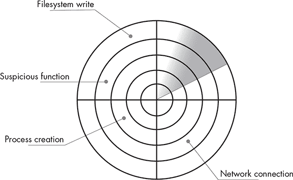
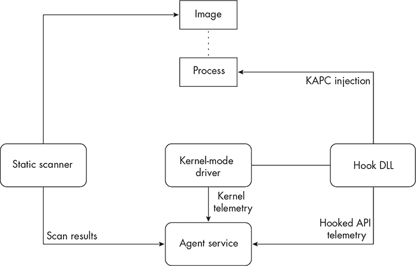
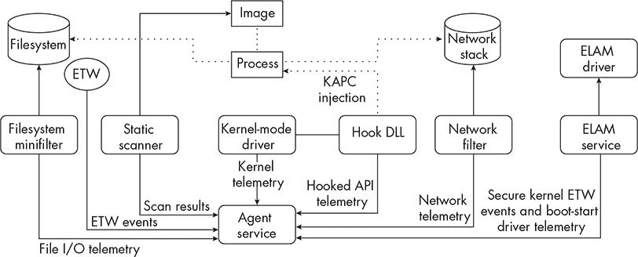

# 1 EDR 架构


几乎每个对手，无论是恶意行为者还是商业红队的一部分，有时都会遇到妨碍其操作的防御产品。在这些防御产品中，端点检测与响应（EDR）对攻击的后期利用阶段构成了最大的风险。一般来说，*EDR*是安装在目标工作站或服务器上的应用程序，旨在收集有关环境安全的数据，这些数据被称为*遥测*。

在本章中，我们讨论了 EDR 的组成部分、它们检测系统中恶意活动的方法以及它们的典型设计。我们还提供了 EDR 可能给攻击者带来的困难的概述。

## EDR 的组成部分

后续章节将探讨许多 EDR 传感器组件的具体细节，它们如何工作，以及攻击者如何规避它们。不过，首先，我们将整体考虑 EDR 并定义一些你在本书中经常看到的术语。

### 代理

EDR *代理*是一个应用程序，它控制并消耗来自传感器组件的数据，进行一些基本分析以确定某个活动或一系列事件是否与攻击者行为一致，并将遥测数据转发到主服务器，后者进一步分析环境中所有代理收集的事件。

如果代理认为某些活动值得关注，它可能会采取以下任何操作：*记录*该恶意活动，并以警报的形式发送到中央日志系统，如 EDR 的仪表板或安全事件与信息管理（SIEM）解决方案；*阻止*恶意操作的执行，通过返回表示失败的值给正在执行该操作的程序；或*欺骗*攻击者，返回无效值，例如错误的内存地址或修改过的访问掩码，导致攻击工具相信操作已经成功完成，即使随后的操作会失败。

### 遥测

每个 EDR 传感器都服务于一个共同的目的：收集遥测数据。大致定义，*遥测*是由传感器组件或主机本身生成的原始数据，防御者可以分析这些数据来确定是否发生了恶意活动。系统上的每个操作，从打开文件到创建新进程，都会生成某种形式的遥测数据。这些信息成为安全产品内部警报逻辑中的数据点。

图 1-1 将遥测数据与雷达系统收集的数据进行比较。雷达使用电磁波来检测一定范围内物体的存在、方向和速度。

当无线电波从物体上反射并返回雷达系统时，它会创建一个数据点，表示那里有东西。通过这些数据点，雷达系统的处理器可以确定诸如物体的速度、位置和高度等信息，并据此处理每个情况。例如，系统可能需要根据物体飞行的速度和高度来不同地响应：飞行在较低高度、速度较慢的物体与飞行在较高高度、速度较快的物体可能需要不同的响应。

这与 EDR 处理其传感器收集的遥测数据非常相似。仅凭关于一个进程是如何创建的或文件是如何被访问的信息，通常无法提供足够的上下文来做出有关采取何种措施的明智决策。它们就像雷达屏幕上的瞬间闪光点。此外，EDR 检测到的进程可以在任何时刻终止。因此，传递给 EDR 的遥测数据必须尽可能完整。



图 1-1：将安全事件可视化为雷达闪光点

然后，EDR 将数据传递给其检测逻辑。该检测逻辑会利用所有可用的遥测数据，采用某些内部方法，如环境启发式算法或静态签名库，尝试判断该活动是良性还是恶意，以及该活动是否达到了记录或防止的阈值。

### 传感器

如果遥测数据代表雷达上的闪光点，那么 *传感器* 就是发射器、双工器和接收器：这些组件负责探测物体并将其转化为闪光点。与雷达系统不断发射信号以跟踪物体的运动不同，EDR 传感器通过拦截流经内部进程的数据，提取信息并将其转发给中央代理，工作方式相对较为被动。

因为这些传感器通常需要与某些系统进程并行工作，所以它们必须非常快速。假设一个监控注册表查询的传感器在允许注册表操作继续之前，需要花费 5 毫秒来完成工作。直到你考虑到某些系统每秒可能发生数千个注册表查询时，这个问题才显得重要。对 1,000 个事件应用 5 毫秒的处理延迟，会导致系统操作出现 5 秒的延迟。大多数用户会觉得这是无法接受的，这将使客户远离使用 EDR。

尽管 Windows 提供了众多遥测数据源，但 EDR 通常只关注少数几个数据源。这是因为某些数据源可能缺乏数据质量或数量，可能与主机安全性无关，或可能不容易访问。一些传感器是内置于操作系统中的，例如本地事件日志。EDR 也可能会向系统引入其自有的传感器组件，如驱动程序、函数挂钩 DLL 和微过滤器，我们将在后续章节中讨论。

我们这些在进攻方的人通常关心的是如何防止、限制或规范化（即与其他流量融合）传感器收集到的遥测数据流。这个策略的目标是减少产品可以用来生成高保真警报的数据显示点数量，或者防止我们的操作被执行。本质上，我们在试图制造一个假阴性。通过了解 EDR 的每个传感器组件及其可以收集的遥测数据，我们可以在特定情况下做出关于使用何种手段的明智决策，并制定由数据支持的强大规避策略，而不是依赖轶事证据。

### 检测

简而言之，*检测*是将离散的遥测数据与系统上执行的某些行为关联起来的逻辑。一个检测可以检查单一条件（例如，文件的哈希值与已知恶意软件匹配），或者检查来自多个不同来源的复杂事件序列（例如，*chrome.exe*的子进程被启动，并随后通过 TCP 端口 88 与域控制器通信）。

通常，检测工程师根据可用的传感器编写这些规则。一些检测工程师为 EDR 供应商工作，因此必须仔细考虑规模问题，因为检测可能会影响大量组织。另一方面，工作在组织内部的检测工程师可以编写规则，扩展 EDR 的能力，超出供应商提供的功能，从而根据环境的需要量身定制检测。

EDR 的检测逻辑通常存在于代理程序及其附属传感器中，或者存在于后端收集系统中（所有企业中的代理程序都向该系统报告）。有时它们会出现在两者的某种组合中。每种方法都有其优缺点。在代理程序或其传感器中实现的检测可以让 EDR 立即采取预防措施，但不能提供分析复杂情况的能力。相反，在后端收集系统中实现的检测可以支持大量的检测规则，但会导致采取任何预防措施时出现延迟。

## EDR 规避的挑战

许多对手依赖于通过轶事或公开的概念验证中描述的绕过方法，来避免目标系统的检测。这种方法可能由于多种原因而存在问题。

首先，这些公共绕过方式只有在 EDR 的功能在不同时间和不同组织中保持一致时才有效。对于内部红队来说，这不是一个大问题，因为它们很可能会在整个环境中遇到相同的产品。然而，对于顾问和恶意威胁行为者来说，EDR 产品的演变则带来了重大头痛，因为每个环境的软件都有自己的配置、启发式规则和警报逻辑。例如，在某个组织中，如果 PsExec（Windows 远程管理工具）的使用很常见，EDR 可能不会对 PsExec 的执行进行严格审查。但另一个组织可能很少使用该工具，因此其执行可能表明恶意活动。

其次，这些公共规避工具、博客文章和论文经常宽松地使用*绕过*一词。在许多情况下，作者并未确定 EDR 仅仅允许某个操作发生，还是根本没有检测到它。有时候，EDR 并不会自动阻止一个操作，而是触发需要人工干预的警报，从而引入响应延迟。（试想一下，如果警报是在星期六凌晨 3 点触发的，攻击者就可以继续在环境中移动。）大多数攻击者希望完全避免被检测，因为一旦 EDR 检测到恶意活动，成熟的安全运营中心（SOC）可以高效地追踪到恶意活动的源头。这对攻击者的任务来说可能是灾难性的。

第三，披露新技术的研究人员通常不会透露他们测试的产品，原因有很多。例如，他们可能与客户签署了保密协议，或者担心受到受影响厂商的法律威胁。因此，这些研究人员可能认为某些技术可以绕过所有 EDR，而不仅仅是特定产品和配置。例如，一种技术可能会绕过某一产品中的用户模式函数挂钩，因为该产品恰好没有监控目标函数，但另一种产品可能实现了一个钩子，能够检测到恶意的 API 调用。

最后，研究人员可能不会明确说明他们的技术绕过了 EDR 的哪个组件。现代 EDR 是复杂的软件，拥有多个传感器组件，每个组件都可以以不同的方式被绕过。例如，EDR 可能通过从内核模式驱动程序、Windows 事件跟踪（ETW）、函数钩子以及其他多个来源获取数据来跟踪可疑的父子进程关系。如果一种规避技术针对的是依赖 ETW 收集数据的 EDR 代理，那么它可能无法在使用驱动程序执行相同目的的产品上起作用。

因此，要有效地绕过 EDR，攻击者需要对这些工具的工作原理有详细的了解。本章的其余部分将深入探讨这些工具的组成部分和结构。

## 识别恶意活动

为了建立有效的检测系统，工程师必须了解的不仅仅是最新的攻击者战术；他们还必须了解业务的运作方式以及攻击者的目标是什么。接下来，他们必须从 EDR 传感器收集的独特且可能不相关的数据点中，识别出可能指示系统上发生恶意行为的活动簇。这远比说起来容易做起来难。

例如，创建一个新服务是否意味着对手已在系统上持久性地安装了恶意软件？可能是，但更可能的是用户因正当理由安装了新软件。如果该服务是在凌晨 3 点安装的呢？虽然可疑，但也许用户正在通宵达旦处理一个大项目。如果是 *rundll32.exe*，即执行 DLL 的 Windows 原生应用程序，负责安装该服务呢？你可能本能地会说：“哈！我们抓到你了！”但这个功能也可能是合法的、实现不佳的安装程序的一部分。从行为中推断意图可能非常困难。

### 考虑上下文

做出明智决策的最佳方法是考虑相关行为的上下文。将其与用户和环境规范、已知的对手手法和工具、以及受影响用户在某段时间内执行的其他操作进行对比。表 1-1 提供了一个例子，展示了这如何起作用。

表 1-1： 评估系统中的一系列事件

| 事件 | 上下文 | 判断 |
| --- | --- | --- |
| 2:55 AM：应用程序 chatapp.exe 在上下文中启动 CONTOSO\jdoe。 | 用户 JDOE 经常进行国际旅行，并且在非工作时间与其他地区的业务伙伴开会。 | 良性 |
| 2:55 AM: 应用程序 chatapp.exe 加载了一个未签名的 DLL， usp10.dll，来自 %APPDATA% 目录。 | 这个聊天应用程序在默认配置下并不加载未签名的代码，但组织中的用户被允许安装可能改变应用程序启动时行为的第三方插件。 | 轻微可疑 |
| 2:56 AM: 应用程序 chatapp.exe 通过 TCP 端口 443 连接到互联网。 | 该聊天应用程序的服务器由云服务提供商托管，因此它定期从服务器获取信息。 | 无害 |
| 2:59 AM: 应用程序 chatapp.exe 查询了注册表值 HKLM:\System\CurrentControlSet\Control\LSA\LsaCfgFlags。 | 该聊天应用程序定期从注册表中提取系统和应用程序配置的信息，但并未被知晓访问与凭证保护相关的注册表项。 | 高度可疑 |
| 3 AM: 应用程序 chatapp.exe 打开一个指向 lsass.exe 的句柄，具有 PROCESS _VM_READ 访问权限。 | 该聊天应用程序并未访问其他进程的地址空间，但用户 JDOE 确实拥有所需的权限。 | 恶意 |

这个精心设计的例子展示了基于系统上采取的行为来判断意图时的模糊性。请记住，系统上的绝大多数活动都是无害的，前提是没有发生什么严重的事情。工程师必须根据客户能够容忍的误报率来确定 EDR 检测的敏感性（换句话说，检测应该偏向于判断某些东西是恶意的程度）。

一种让产品满足客户需求的方法是通过结合使用所谓的脆弱检测和稳健检测。

### 应用脆弱与稳健检测

*脆弱*检测是指那些设计用来检测特定工件的检测，例如通常与已知恶意软件相关的简单字符串或基于哈希的特征。*稳健*检测旨在检测行为，并且可能会基于针对环境训练的机器学习模型。两种检测类型在现代扫描引擎中都有其作用，它们有助于平衡误报和漏报。

例如，基于恶意文件哈希的检测能够非常有效地检测该特定版本的文件，但文件的任何细微变化都会改变其哈希值，导致检测规则失败。这就是为什么我们称这种规则为“脆弱”的原因。它们非常具体，通常只针对单一的工件。这意味着误报的可能性几乎为零，而漏报的可能性却非常高。

尽管这些检测存在缺陷，但它们为安全团队提供了独特的好处。它们易于开发和维护，因此工程师可以在组织需求变化时快速调整。它们还能够有效检测一些常见的攻击。例如，一个用于检测未经修改的 Mimikatz 利用工具的规则价值巨大，因为它的误报率几乎为零，而该工具被恶意使用的可能性很高。

尽管如此，检测工程师在创建脆弱检测规则时，必须仔细考虑使用哪些数据。如果攻击者可以轻松修改指标，那么检测就变得更容易被绕过。例如，假设一个检测规则检查文件名 *mimikatz.exe*；攻击者可以简单地将文件名更改为 *mimidogz.exe*，从而绕过检测逻辑。正因如此，最佳的脆弱检测规则应当针对那些不可变或至少难以修改的属性。

从另一个角度看，受机器学习模型支持的强大规则集可能会将修改后的文件标记为可疑，因为它对环境来说是独特的，或包含某些分类算法高度加权的属性。大多数强大的检测规则实际上是一些更广泛的规则，旨在更普遍地针对某一技术。这些类型的检测通过增加假阳性率，减少假阴性的可能性，来交换它们的特定性，以更一般的方式检测攻击。

尽管业界倾向于青睐强大的检测规则，但它们也有自身的缺点。与脆弱的签名相比，这些规则由于其复杂性，开发起来可能更加困难。此外，检测工程师必须考虑组织的假阳性容忍度。如果检测的假阴性率非常低，但假阳性率较高，EDR 就会像“狼来了”的小男孩一样表现。如果他们在减少假阳性方面过于努力，也可能会增加假阴性的比例，使得攻击未被察觉。

因此，大多数 EDR（端点检测与响应）采用混合方法，使用脆弱的签名来捕获明显的威胁，并通过强大的检测规则更普遍地检测攻击者技术。

### 探索 Elastic 检测规则

唯一公开发布检测规则的 EDR 供应商之一是 Elastic，它在 GitHub 仓库中发布了其 SIEM 规则。让我们一窥幕后，这些规则提供了脆弱和强大检测的良好示例。

例如，考虑 Elastic 用于检测使用 Bifrost（一个用于与 Kerberos 交互的 macOS 工具）进行 Kerberoasting 尝试的规则，见 列表 1-1。*Kerberoasting* 是一种通过获取 Kerberos 票据并破解它们以揭示服务账户凭证的技术。

```
query = '''
  event.category:process and event.type:start and
 process.args:("-action" and ("-kerberoast" or askhash or asktgs or asktgt or s4u or ("-ticket"
  and ptt) or (dump and (tickets or keytab))))
  '''
```

列表 1-1：Elastic 检测 Kerberoasting 的规则，基于命令行参数

这个规则检查 Bifrost 支持的某些命令行参数的存在。攻击者可以通过重命名源代码中的参数（例如，将 -action 改为 -dothis）并重新编译工具，从而轻松绕过此检测。此外，如果某个无关的工具支持规则中列出的参数，也可能会出现假阳性。

出于这些原因，此规则可能看起来像是一个糟糕的检测。但请记住，并非所有对手都在同一水平上运作。许多威胁组继续使用现成的工具。此检测旨在捕获那些仅使用 Bifrost 的基本版本的人。

由于规则的狭窄焦点，Elastic 应该通过更为健壮的检测来补充它，以覆盖这些漏洞。幸运的是，供应商发布了一个补充规则，显示在 第 1-2 列表 中。

```
query = '''
network where event.type == "start" and network.direction == "outgoing" and
 destination.port == 88 and source.port >= 49152 and
 process.executable != "C:\\Windows\\System32\\lsass.exe" and destination.address !="127.0.0.1"
 and destination.address !="::1" and
 /* insert False Positives here */
 not process.name in ("swi_fc.exe", "fsIPcam.exe", "IPCamera.exe", "MicrosoftEdgeCP.exe",
 "MicrosoftEdge.exe", "iexplore.exe", "chrome.exe", "msedge.exe", "opera.exe", "firefox.exe")
 '''
```

列表 1-2：Elastic 用于检测在 TCP 端口 88 上通信的非典型进程的规则

此规则针对于建立 TCP 端口 88 的出站连接的非典型进程。尽管此规则包含一些解决误报的漏洞，但通常比 Bifrost 的脆弱检测更为健壮。即使对手重新命名参数并重新编译工具，Kerberoasting 所固有的网络行为也会导致此规则触发。

为了躲避检测，对手可以利用规则底部包含的豁免列表，也许将 Bifrost 的名称更改为匹配其中一个文件，比如 *opera.exe*。如果对手还修改了工具的命令行参数，它们将能够避开这里介绍的脆弱和健壮的检测。

大多数 EDR 代理都努力在脆弱和健壮的检测之间取得平衡，但以不透明的方式进行，因此组织可能会发现确保覆盖范围非常困难，尤其是在不支持引入自定义规则的代理中。因此，团队的检测工程师应该使用 Red Canary 的 Atomic Test Harnesses 等工具来测试和验证检测。

## 代理设计

作为攻击者，我们应该密切关注部署在我们目标端点上的 EDR 代理，因为这是检测我们将用来完成操作的活动的组件。在本节中，我们将审查代理的各个部分以及它们可能做出的各种设计选择。

### 基本

代理包含独特的部分，每个部分都有自己的目标和能够收集的遥测类型。最常见的代理包括以下组件：

**静态扫描器**   一个应用程序或代理本身的组件，用于对图像进行静态分析，例如可执行文件 (PE) 或任意范围的虚拟内存，以确定内容是否恶意。静态扫描器通常是反病毒服务的核心。

**挂钩 DLL**   负责拦截特定应用程序编程接口 (API) 函数调用的 DLL。第二章 详细介绍了函数挂钩。

**内核驱动程序**   一个内核模式驱动程序，负责将钩子 DLL 注入目标进程并收集特定于内核的遥测数据。第三章到第七章将涵盖其各种检测技术。

**代理服务**   一个负责聚合前两个组件创建的遥测数据的应用程序。它有时会对数据进行关联或生成警报，然后将收集到的数据转发到集中式 EDR 服务器。

图 1-2 展示了商业产品今天使用的最基本的代理架构。



图 1-2：基本代理架构

如我们所见，这个基本设计没有太多的遥测数据来源。它的三个传感器（一个扫描器、一个驱动程序和一个功能钩子 DLL）为代理提供关于进程创建事件、被认为敏感的函数调用（如kernel32!CreateRemoteThread）、文件签名，以及可能属于进程的虚拟内存的数据。这对于某些用例可能足够，但如今大多数商业 EDR 产品远远超出了这些功能。例如，这个基本的 EDR 无法检测主机上文件的创建、删除或加密情况。

### 中级

虽然一个基本的代理可以收集大量有价值的数据来创建检测，但这些数据可能无法形成主机上活动的完整画面。通常，今天在企业环境中部署的端点安全产品已经大大扩展了它们的能力，以收集额外的遥测数据。

大多数攻击者遇到的代理都属于中级复杂度。这些代理不仅引入了新的传感器，还使用了操作系统原生的遥测数据源。在这一层级上常见的添加功能可能包括以下内容：

**网络过滤驱动程序**   执行网络流量分析的驱动程序，用于识别恶意活动的指示符，如信标通信。这将在第七章中讨论。

**文件系统过滤驱动程序**   一种特殊类型的驱动程序，可以监视主机文件系统上的操作。它们将在第六章中详细讨论。

**ETW 消费者**   代理的组件，能够订阅主机操作系统或第三方应用程序创建的事件。ETW 在第八章中进行讨论。

**早期启动反恶意软件（ELAM）组件**   提供一种微软支持的机制，用于在其他启动服务之前加载反恶意软件驱动程序，以控制其他启动驱动程序的初始化。这些组件还提供接收安全 ETW 事件的功能，ETW 事件是一种由一组受保护事件提供者生成的特殊事件。ELAM 驱动程序的这些功能在第十一章和第十二章中进行了详细讨论。

虽然现代 EDR 可能没有实现所有这些组件，但你通常会看到 ELAM 驱动程序与主内核驱动程序一起部署。图 1-3 展示了更现代的代理架构可能是什么样子。



图 1-3：中间代理架构

该设计在基本架构的基础上构建，并添加了许多新的传感器，通过这些传感器可以收集遥测数据。例如，这个 EDR 现在可以监控文件系统事件，如文件创建，使用 ETW 提供的数据源，收集该代理原本无法收集的数据，并通过其过滤驱动程序观察主机上的网络通信，潜在地使代理能够检测命令与控制信标活动。它还增加了一层冗余，以便在一个传感器失败时，另一个传感器可以接管任务。

### 高级

一些产品实现了更高级的功能，用于监控它们感兴趣的系统特定区域。以下是其中两个功能的示例：

**虚拟机监控器（Hypervisors）**   提供一种拦截系统调用、虚拟化某些系统组件以及沙箱化代码执行的方法。这些功能还为代理提供了一种监控来宾与主机之间执行转换的方式。它们通常作为反勒索软件和反利用功能的组件被利用。

**对手欺骗**   提供虚假数据给对手，而不是阻止恶意代码的执行。这可能导致对手专注于调试他们的工具，而没有意识到正在使用的数据已经被篡改。

由于这些通常是特定于产品的实现，并且在本文写作时并不常见，因此我们不会详细讨论这些高级功能。此外，本类别中的许多组件更贴近预防策略，而非检测，这使得它们稍微超出了本书的范围。然而，随着时间的推移，一些高级功能可能会变得更为常见，新的功能也可能会被发明。

## 绕过类型

在他 2021 年的博客文章《Evadere 分类》中，Jonathan Johnson 根据绕过发生的检测管道位置将绕过分为不同类型。使用 Jared Atkinson 提出的“忠实漏斗”概念，描述了检测和响应管道的各个阶段，Johnson 定义了绕过可能发生的区域。以下是我们将在后续章节中讨论的那些区域：

**配置绕过**   发生在端点上存在一个能够识别恶意活动的遥测源，但传感器未能从中收集数据，导致覆盖空白。例如，即使传感器能够收集与 Kerberos 认证活动相关的特定 ETW 提供程序的事件，它也可能未配置为这样做。

**感知绕过**   发生在传感器或代理缺乏收集相关遥测数据的能力时。例如，代理可能不会监控文件系统交互。

**逻辑绕过**   发生在攻击者利用检测逻辑中的漏洞时。例如，某个检测可能包含一个已知的漏洞，而其他检测并未覆盖该漏洞。

**分类绕过**   发生在传感器或代理无法识别足够的数据点以将攻击者的行为分类为恶意，即使它观察到了这些行为。例如，攻击者的流量可能与正常的网络流量混合。

配置绕过是最常见的技术之一。有时它们甚至是在不知情的情况下使用的，因为大多数成熟的 EDR 代理具备收集某些遥测数据的能力，但由于某些原因未能做到这一点，例如减少事件数量。感知绕过通常是最有价值的，因为如果数据不存在，并且没有补偿组件来弥补这一空白，那么 EDR 就无法检测到攻击者的活动。

逻辑绕过是最难实现的，因为它们通常需要对检测的基本逻辑有了解。最后，分类绕过需要一些前瞻性思维和系统剖析，但红队经常使用它们（例如，通过慢速 HTTPS 通道与一个信誉良好的网站进行信标通信，进行命令与控制活动）。当操作得当时，分类绕过能够达到感知绕过的效果，且所需的工作量远低于逻辑绕过。

在防御方面，这些分类使我们能够更具体地讨论检测策略中的盲点。例如，如果我们要求将事件从端点代理转发到中央收集服务器进行分析，那么我们的检测本身就容易受到配置规避的影响，因为攻击者可能会通过某种方式更改代理的配置，从而中断代理与服务器之间的通信通道。

感知规避是非常重要的，但通常最难被发现。如果我们的 EDR 根本没有能力收集所需的数据，那么我们只能找到其他方法来构建检测。逻辑规避是由于在构建检测规则时所做的决策所导致的。由于 SOC 中并非每位分析员都有无限的时间来审查警报，工程师总是寻求减少误报。但是，对于他们在规则中做出的每一个豁免，他们就可能引入逻辑规避的潜在风险。考虑一下 Elastic 之前提到的强大 Kerberoasting 规则，攻击者只需要简单地更改工具的名称即可规避此规则。

最后，分类规避可能是最难防范的。为此，工程师必须不断调整 EDR 的检测阈值，直到达到最佳设置。以命令与控制信标为例。假设我们通过假设攻击者会以每分钟超过一次的请求频率连接到一个未分类信誉的站点来构建检测策略。那么我们的对手可能如何避开雷达呢？他们可能通过一个已经建立的域名进行信标传输，或者将回调间隔减慢到每两分钟一次。

作为回应，我们可以将规则修改为查找系统以前没有连接过的域，或者增加信标间隔。但请记住，这样做可能会带来更多的误报风险。工程师们将继续在这种博弈中前行，努力优化他们的检测策略，以平衡组织的容忍度与对手的能力。

## 链接规避技术：一个示例攻击

通常，收集一条遥测数据有不止一种方式。例如，EDR 可以同时使用驱动程序和 ETW 消费者来监视进程创建事件。这意味着规避并非简单地找到“银弹”。相反，它是利用传感器中的空白点，避开 EDR 生成警报或采取预防措施的阈值的过程。

考虑表 1-2，它描述了一个专门设计用来捕捉命令与控制代理操作的分类系统。在这个例子中，任何在某个时间窗口内发生的、其累计分数大于或等于 500 的行为都会触发高严重度警报。分数超过 750 时，相关进程及其子进程将被终止。

表 1-2: 一个示例分类系统

| 活动 | 风险分数 |
| --- | --- |
| 执行未签名的二进制文件 | 250 |
| 非典型子进程已生成 | 400 |
| 非浏览器进程发起的外发 HTTP 流量 | 100 |
| 分配读写执行缓冲区 | 200 |
| 未由镜像支持的已提交内存分配 | 350 |

攻击者可以单独绕过每个活动，但当它们结合在一起时，规避变得更加困难。我们如何将规避技术链式结合，以避免触发检测逻辑？

从配置规避开始，假设代理缺少网络检查传感器，因此无法将外发网络流量与客户端进程关联。然而，可能存在补偿性控制，例如针对 Microsoft-Windows-WebIO 提供程序的 ETW 消费者。在这种情况下，我们可能会选择使用浏览器作为宿主进程，或者使用其他协议，如 DNS，进行命令与控制。我们也可以使用逻辑规避，通过匹配系统上的典型父子关系来规避“非典型子进程”检测。对于感知规避，假设代理缺乏扫描内存分配的能力，无法判断这些分配是否由镜像支持。作为攻击者，我们完全不需要担心根据此指标被检测到。

让我们将这些内容结合起来，描述攻击可能的进展。首先，我们可以利用电子邮件客户端在该进程上下文中实现代码执行。由于这个邮件客户端二进制文件是系统在遭到破坏之前就存在的合法产品，因此我们可以合理假设它是已签名的，或者具有签名豁免。我们将通过 HTTP 发送和接收命令与控制流量，这会触发检测，即非浏览器进程通过 HTTP 进行通信，将当前风险评分提高到 100。

接下来，我们需要在某个时刻生成一个牺牲进程来执行我们的后期利用操作。我们的工具是用 PowerShell 编写的，但我们并不是生成 *powershell.exe*，因为那样会显得不典型并触发警报，将风险评分提高到 500。相反，我们生成一个新的邮件客户端实例作为子进程，并使用非托管 PowerShell 在其中执行我们的工具。我们的代理在子进程中分配了一个读写执行缓冲区，这将使风险评分提高到 300。

我们收到工具的输出，并确定需要运行另一个工具来执行某些操作以进一步扩大我们的访问权限。此时，任何额外的检测都将把我们的风险评分提高到 500 或更高，可能会导致操作失败，因此我们需要做出一些决策。以下是几种选择：

+   执行后渗透工具并接受检测。警报触发后，我们可以迅速行动，试图赶在响应之前，期待响应过程无效，从而未能根除我们，或者如果需要，可以接受烧掉操作并重新开始。

+   在执行工具之前等待一段时间。由于代理仅关联在某个时间窗口内发生的事件，我们可以简单地等待，直到状态重新循环，将我们的风险分数重置为零，然后继续操作。

+   寻找另一种执行方法。这可以从简单地将脚本放置到目标上并在那里执行，到通过代理转发后渗透工具的流量，从而减少它可能产生的大部分基于主机的指标。

无论我们选择什么方法，目标是明确的：尽可能长时间保持在警报阈值以下。通过计算我们需要执行的每个操作的风险，理解我们的活动所产生的指标，并结合使用规避策略，我们可以避开 EDR 复杂的检测系统。请注意，在这个示例中没有任何单一的规避方法可以通用。相反，是多种规避手段结合起来，针对当前任务最相关的检测进行了防范。

## 结论

总结来说，EDR 代理由多个传感器组成，负责收集与系统活动相关的遥测数据。EDR 会在这些数据上应用其自身的规则或检测逻辑，以识别可能表明恶意行为者存在的迹象。这些传感器每个都有某种程度的规避风险，找出这些盲点并加以利用或弥补是我们的工作。
