# 第三章：3 进程和线程创建通知


大多数现代 EDR 解决方案在很大程度上依赖于其*内核模式驱动程序*提供的功能，内核模式驱动程序是运行在操作系统特权层下的传感器组件，位于用户模式之下。这些驱动程序使开发人员能够利用仅在内核中可用的功能，为 EDR 提供许多预防功能和遥测数据。

虽然供应商可以在他们的驱动程序中实现大量与安全相关的功能，但最常见的功能是*通知回调例程*。这些是内部例程，当指定的系统事件发生时，它们会采取相应的措施。

在接下来的三章中，我们将讨论现代 EDR 如何利用通知回调例程，从内核中获取对系统事件的有价值的洞察力。我们还将介绍与每种通知类型及其相关回调例程相关的规避技术。本章重点讨论 EDR 中常用的两种回调例程：与进程创建和线程创建相关的回调例程。

## 通知回调例程的工作原理

在 EDR（端点检测和响应）领域，驱动程序的一个强大功能是能够在系统事件发生时获得通知。这些系统事件可能包括创建或终止新的进程和线程、请求复制进程和线程、加载图像、在注册表中执行操作或请求系统关闭。例如，开发人员可能想知道某个进程是否尝试打开一个新的*lsass.exe*句柄，因为这是大多数凭证转储技术的核心组件。

为了实现这一点，驱动程序注册回调例程，这些例程基本上是在说：“如果系统发生这种类型的事件，请告诉我，这样我可以采取相应的行动。”由于这些通知，驱动程序可以采取相应的措施。有时它可能只是从事件通知中收集遥测数据。或者，它可能选择做一些事情，比如仅提供对敏感进程的部分访问权限，例如通过返回带有限制访问掩码的句柄（例如，PROCESS_QUERY_LIMITED_INFORMATION而不是PROCESS_ALL_ACCESS）。

回调例程可以是*操作前*回调，发生在事件完成之前，或者是*操作后*回调，发生在操作完成之后。*操作前*回调在 EDR 中更为常见，因为它们赋予驱动程序干预事件或防止事件完成的能力，以及本章将讨论的其他附加好处。*操作后*回调也很有用，因为它们可以提供有关系统事件结果的信息，但也有一些缺点。最大的问题是，它们通常在任意线程上下文中执行，这使得 EDR 难以收集启动该操作的进程或线程的信息。

## 进程通知

回调例程可以在系统上创建或终止进程时通知驱动程序。这些通知作为进程创建或终止的一个重要组成部分发生。你可以在清单 3-1 中看到这一点，该清单展示了创建*cmd.exe*、*notepad.exe*等子进程的调用堆栈，导致了已注册回调例程的通知。

要获得这个调用堆栈，可以使用 WinDbg 在<sup class="SANS_TheSansMonoCd_W5Regular_11">nt!PspCallProcessNotifyRoutines()</sup>上设置断点（bp），这是内核函数，用于通知注册的驱动程序进程创建事件。当断点被触发时，k命令会返回发生断点的进程的调用堆栈。

```
2: kd> **bp nt!PspCallProcessNotifyRoutines**
2: kd> **g**
Breakpoint 0 hit
nt!PspCallProcessNotifyRoutines: fffff803`4940283c 48895c2410      mov      qword ptr [rsp+10h],rbx
1: kd> **k**
 # Child-SP          RetAddr                Call Site
00 ffffee8e`a7005cf8 fffff803`494ae9c2      nt!PspCallProcessNotifyRoutines
01 ffffee8e`a7005d00 fffff803`4941577d      nt!PspInsertThread+0x68e
02 ffffee8e`a7005dc0 fffff803`49208cb5      nt!NtCreateUserProcess+0xddd
03 ffffee8e`a7006a90 00007ffc`74b4e664      nt!KiSystemServiceCopyEnd+0x25
04 000000d7`6215dcf8 00007ffc`72478e73      ntdll!NtCreateUserProcess+0x14
05 000000d7`6215dd00 00007ffc`724771a6      KERNELBASE!CreateProcessInternalW+0xfe3
06 000000d7`6215f2d0 00007ffc`747acbb4      KERNELBASE!CreateProcessW+0x66
07 000000d7`6215f340 00007ff6`f4184486      KERNEL32!CreateProcessWStub+0x54
08 000000d7`6215f3a0 00007ff6`f4185b7f      cmd!ExecPgm+0x262
09 000000d7`6215f5e0 00007ff6`f417c9bd      cmd!ECWork+0xa7
0a 000000d7`6215f840 00007ff6`f417bea1      cmd!FindFixAndRun+0x39d
0b 000000d7`6215fce0 00007ff6`f418ebf0      cmd!Dispatch+0xa1
0c 000000d7`6215fd70 00007ff6`f4188ecd      cmd!main+0xb418
0d 000000d7`6215fe10 00007ffc`747a7034      cmd!__mainCRTStartup+0x14d
0e 000000d7`6215fe50 00007ffc`74b02651      KERNEL32!BaseThreadInitThunk+0x14
0f 000000d7`6215fe80 00000000`00000000      ntdll!RtlUserThreadStart+0x21
```

清单 3-1：进程创建调用堆栈

每当用户想要运行一个可执行文件时，*cmd.exe*会调用cmd!ExecPgm()函数。在这个调用堆栈中，我们可以看到这个函数调用了用于创建新进程的存根（在输出行 07）。这个存根最终会调用<sup class="SANS_TheSansMonoCd_W5Regular_11">ntdll!NtCreateUserProcess()</sup>的系统调用，控制权转交给内核（在 04 位置）。

现在注意，在内核内部，另一个函数被执行（在 00 位置）。这个函数负责通知每个已注册的回调，进程正在被创建。

### 注册进程回调例程

为了注册进程回调例程，EDR 使用以下两个函数之一：nt!PsSetCreateProcessNotifyRoutineEx()或nt!PsSetCreateProcessNotifyRoutineEx2()。后者可以提供有关非 Win32 子系统进程的通知。这些函数接受一个指向回调函数的指针，回调函数将在每次创建或终止新进程时执行。 清单 3-2 展示了如何注册回调函数。

```
NTSTATUS DriverEntry(PDRIVER_OBJECT pDriverObj, PUNICODE_STRING pRegPath)
{
    NTSTATUS status = STATUS_SUCCESS;
    `--snip--`

    status = ❶ PsSetCreateProcessNotifyRoutineEx2(
        PsCreateProcessNotifySubsystems,
        (PVOID)ProcessNotifyCallbackRoutine,
        FALSE
    );

    `--snip--`
} ❷ void ProcessNotifyCallbackRoutine(
      PEPROCESS pProcess,
      HANDLE hPid,
      PPS_CREATE_NOTIFY_INFO pInfo)
{
      if (pInfo)
      {
          `--snip--`
      }
}
```

清单 3-2：注册进程创建回调例程

这段代码注册回调例程❶并将三个参数传递给注册函数。第一个参数PsCreateProcessNotifySubsystems指示正在注册的进程通知类型。在本文写作时，“子系统”是微软文档中唯一提到的类型。这个值告诉系统，回调例程应在所有子系统中创建的进程时被调用，包括 Win32 和 Windows 子系统 Linux（WSL）。

下一个参数定义了回调例程的入口点，该例程将在进程创建时执行。在我们的示例中，代码指向内部的ProcessNotifyCallbackRoutine()函数。当进程创建发生时，回调函数将接收有关该事件的信息，我们稍后将讨论这一点。

第三个参数是一个布尔值，表示是否应该移除回调例程。由于我们在这个示例中注册了回调例程，因此该值为FALSE。当我们卸载驱动程序时，我们将其设置为TRUE，以从系统中移除回调。注册回调例程后，我们定义回调函数本身❷。

### 查看系统上注册的回调例程

你可以使用 WinDbg 查看系统上进程回调例程的列表。当注册一个新的回调例程时，一个指向该例程的指针会被添加到一个EX_FAST_REF结构体数组中，这些结构体是 16 字节对齐的指针，存储在位于nt!PspCreateProcessNotifyRoutine的位置，如清单 3-3 所示。

```
1: kd> **dq nt!PspCreateProcessNotifyRoutine**
fffff803`49aec4e0  ffff9b8f`91c5063f ffff9b8f`91df6c0f
fffff803`49aec4f0  ffff9b8f`9336fcff ffff9b8f`9336fedf
fffff803`49aec500  ffff9b8f`9349b3ff ffff9b8f`9353a49f
fffff803`49aec510  ffff9b8f`9353acdf ffff9b8f`9353a9af
fffff803`49aec520  ffff9b8f`980781cf 00000000`00000000
fffff803`49aec530  00000000`00000000 00000000`00000000
fffff803`49aec540  00000000`00000000 00000000`00000000
fffff803`49aec550  00000000`00000000 00000000`00000000
```

清单 3-3：一个包含进程创建回调例程地址的EX_FAST_REF结构体数组

清单 3-4 展示了遍历这个EX_FAST_REF结构体数组的方法，以枚举实现进程通知回调的驱动程序。

```
1: kd> **dx ((void**[0x40])&nt!PspCreateProcessNotifyRoutine)**
**.Where(a => a != 0)**
**.Select(a => @$getsym(@$getCallbackRoutine(a).Function))**
  [0]         : nt!ViCreateProcessCallback (fffff803`4915a2a0)
  [1]         : cng!CngCreateProcessNotifyRoutine (fffff803`4a4e6dd0)
  [2]         : WdFilter+0x45e00 (fffff803`4ade5e00)
  [3]         : ksecdd!KsecCreateProcessNotifyRoutine (fffff803`4a33ba40)
  [4]         : tcpip!CreateProcessNotifyRoutineEx (fffff803`4b3f1f90)
  [5]         : iorate!IoRateProcessCreateNotify (fffff803`4b95d930)
  [6]         : CI!I_PEProcessNotify (fffff803`4a46a270)
  [7]         : dxgkrnl!DxgkProcessNotify (fffff803`4c116610)
  [8]         : peauth+0x43ce0 (fffff803`4d873ce0)
```

清单 3-4：枚举已注册的进程创建回调

在这里，我们可以看到一些在默认系统上注册的例程。请注意，其中一些回调并不执行安全功能。例如，以 tcpip 开头的回调用于 TCP/IP 驱动程序。然而，我们确实看到 Microsoft Defender 注册了一个回调：WdFilter+0x45e00。（Microsoft 没有发布 *WdFilter.sys* 驱动程序的完整符号。）使用这种技术，我们可以在不需要逆向工程 Microsoft 驱动程序的情况下找到 EDR 的回调例程。

### 收集进程创建信息

一旦 EDR 注册了其回调例程，它如何访问信息呢？当新进程被创建时，一个指向 PS_CREATE_NOTIFY_INFO 结构的指针会传递给回调。你可以在列表 3-5 中看到该结构的定义。

```
typedef struct _PS_CREATE_NOTIFY_INFO {
  SIZE_T              Size;
  union {
    ULONG Flags;
    struct {
      ULONG FileOpenNameAvailable : 1;
      ULONG IsSubsystemProcess : 1;
      ULONG Reserved : 30;
    };
  };
  HANDLE              ParentProcessId;
  CLIENT_ID           CreatingThreadId;
  struct _FILE_OBJECT *FileObject;
  PCUNICODE_STRING    ImageFileName;
  PCUNICODE_STRING    CommandLine;
  NTSTATUS            CreationStatus;
} PS_CREATE_NOTIFY_INFO, *PPS_CREATE_NOTIFY_INFO;
```

列表 3-5：PS_CREATE_NOTIFY_INFO 结构的定义

该结构包含大量有关系统中进程创建事件的有价值数据。这些数据包括：

ParentProcessId   新创建进程的父进程。这不一定是创建新进程的进程。

CreatingThreadId   指向负责创建新进程的唯一线程和进程的句柄。

FileObject   指向进程可执行文件对象的指针（磁盘上的镜像）。

ImageFileName   指向包含新创建进程可执行文件路径的字符串的指针。

CommandLine   传递给创建进程的命令行参数。

FileOpenNameAvailable   一个值，指示 ImageFileName 成员是否与打开新进程可执行文件时使用的文件名匹配。

EDR 通常通过与此通知返回的遥测数据进行交互的方式之一是通过 Sysmon 的事件 ID 1，显示进程创建事件，如图 3-1 所示。

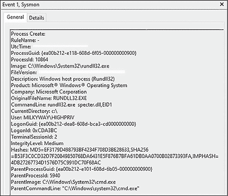

图 3-1：显示进程创建的 Sysmon 事件 ID 1

在这个事件中，我们可以看到从 PS_CREATE _NOTIFY_INFO 结构体传递给 Sysmon 回调例程的一些信息。例如，事件中的 Image、CommandLine 和 ParentProcessId 属性，分别对应结构体中的 ImageFileName、CommandLine 和 ParentProcessId 成员。

你可能会想，为什么这个事件中的属性比回调函数接收到的结构体中要多得多。驱动程序通过调查生成事件的线程上下文，并扩展结构体的成员，来收集这些额外的信息。例如，如果我们知道进程父进程的 ID，就可以轻松找到父进程的图像路径，从而填充 ParentImage 属性。

通过利用从此事件及其相关结构体中收集的数据，EDR 还可以创建进程属性和关系的内部映射，以便检测可疑活动，例如 Microsoft Word 启动 *powershell.exe* 子进程。此数据还可以为代理提供有用的上下文，以确定其他活动是否具有恶意性质。例如，代理可以将进程的命令行参数输入到机器学习模型中，以确定该命令在环境中的调用是否异常。

## 线程通知

线程创建通知的价值稍逊于进程创建事件。它们的工作原理相似，发生在创建过程中，但接收到的信息较少。尽管线程创建发生得更为频繁，这一点依然成立；毕竟几乎每个进程都支持多线程，这意味着每个进程创建时都会有多个线程创建通知。

尽管线程创建回调传递给回调的数据显示得更少，但它们为 EDR 提供了另一个数据点，用于构建检测模型。让我们进一步探讨一下这些数据。

### 注册线程回调例程

当线程被创建或终止时，回调例程会接收到三条数据：线程所属进程的 ID、唯一的线程 ID，以及一个布尔值，表示线程是否正在创建。列表 3-6 显示了驱动程序如何为线程创建事件注册回调例程。

```
NTSTATUS DriverEntry(PDRIVER_OBJECT pDriverObj, PUNICODE_STRING pRegPath)
{
    NTSTATUS status = STATUS_SUCCESS;
    `--snip--`

  ❶ status = PsSetCreateThreadNotifyRoutine(ThreadNotifyCallbackRoutine);
    `--snip--`
}

void ThreadNotifyCallbackRoutine(
    HANDLE hProcess,
    HANDLE hThread,
    BOOLEAN bCreate)
{
  ❷ if (bCreate)
    {
        `--snip--`
    }
}
```

列表 3-6：注册线程创建通知例程

与进程创建类似，EDR 可以通过其驱动程序接收有关线程创建或终止的通知，方法是通过 nt!PsSetCreateThreadNotifyRoutine() 或扩展版的 nt!PsSetCreateThreadNotifyRoutineEx() 注册线程通知回调例程，后者可以定义通知类型。

这个示例驱动程序首先注册回调例程 ❶，传入指向内部回调函数的指针，该函数接收与处理回调例程相同的三项数据。如果表示线程是否正在创建或终止的布尔值为 TRUE，则驱动程序会执行开发者定义的一些操作 ❷。否则，回调函数将忽略线程事件，因为线程终止事件（即线程完成执行并返回时发生的事件）通常对安全监控的价值较低。

### 检测远程线程创建

尽管线程创建通知提供的信息少于进程创建回调，但它们为 EDR 提供了其他回调无法检测到的数据：远程线程创建。*远程线程创建*发生在一个进程在另一个进程内创建线程时。这种技术是许多攻击者技巧的核心，通常依赖于更改执行上下文（例如，从用户 1 切换到用户 2）。列表 3-7 展示了 EDR 如何通过其线程创建回调例程检测此行为。

```
void ThreadNotifyCallbackRoutine(
    HANDLE hProcess,
    HANDLE hThread,
    BOOLEAN bCreate)
{
    if (bCreate)
    {
      ❶ if (PsGetCurrentProcessId() != hProcess)
        {
            `--snip--`
        }
    }
}
```

列表 3-7：检测远程线程创建

因为通知是在创建线程的进程上下文中执行的，所以开发人员可以简单地检查当前的进程 ID 是否与传递给回调例程的 ID 相匹配 ❶。如果不匹配，则说明线程正在远程创建，需要进一步调查。就这样：一个巨大的能力，只需一两行代码就能实现。没有比这更简单的了。你可以通过 Sysmon 的事件 ID 8 实际看到此功能的实现，如图 3-2 所示。注意，SourceProcessId 和 TargetProcessId 的值不同。

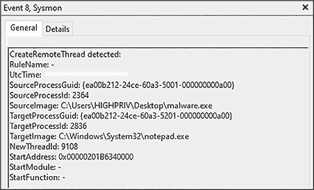

图 3-2：Sysmon 事件 ID 8 检测远程线程创建

当然，远程线程创建也会在一些合法情况下发生。一个例子是子进程创建。当一个进程被创建时，第一个线程在父进程的上下文中执行。为了解决这个问题，许多 EDR 会简单地忽略与进程关联的第一个线程。

某些操作系统内部组件也会执行合法的远程线程创建。一个例子是 Windows 错误报告（*werfault.exe*）。当系统发生错误时，操作系统会生成*werfault.exe*作为*svchost.exe*（特别是*WerSvc*服务）的子进程，然后将其注入故障进程。

因此，线程是远程创建的这一事实并不自动意味着它是恶意的。要确定这一点，EDR 需要收集补充信息，如 Sysmon 事件 ID 8 所示。

## 规避进程和线程创建回调

进程和线程通知是所有回调类型中最常见的检测方式。这部分归因于它们提供的信息对于大多数面向进程的检测策略至关重要，并且几乎被所有商业化的 EDR 产品所使用。它们通常也是最容易理解的。这并不意味着它们也很容易被规避。然而，我们有很多方法可以增加在某些环节成功避开的机会。

### 命令行篡改

进程创建事件中最常见的监控属性之一是启动进程时使用的命令行参数。某些检测策略甚至完全依赖于与已知攻击工具或恶意软件相关的特定命令行参数。

EDR 可以在传递给进程创建回调例程的结构体中的CommandLine成员中找到参数。当创建进程时，其命令行参数会存储在其进程环境块（PEB）的ProcessParameters字段中。该字段包含指向RTL_USER_PROCESS_PARAMETERS结构体的指针，其中包含其他信息，包括在调用时传递给进程的UNICODE_STRING参数。清单 3-8 展示了我们如何使用 WinDbg 手动获取进程的命令行参数。

```
0:000> **?? @$peb->ProcessParameters->CommandLine.Buffer**
wchar_t * 0x000001be`2f78290a
 "C:\Windows\System32\rundll32.exe ieadvpack.dll,RegisterOCX payload.exe"
```

清单 3-8：使用 WinDbg 从 PEB 中提取参数

在这个示例中，我们通过直接访问UNICODE_STRING的缓冲区成员，提取当前进程的 PEB 中的参数，这个缓冲区成员构成了ProcessParameters字段中的<	samp class="SANS_TheSansMonoCd_W5Regular_11">CommandLine成员。

然而，由于 PEB 位于进程的用户模式内存空间中，而非内核中，进程可以更改其自身 PEB 的属性。Adam Chester 的《如何像 Cobalt Strike 一样辩论》博客文章详细介绍了如何修改进程的命令行参数。在我们介绍这一技术之前，你应该了解当一个普通程序创建子进程时的表现。列表 3-9 中包含了这一行为的一个简单示例。

```
void main()
{
    STARTUPINFOW si;
    ZeroMemory(&si, sizeof(si));
    si.cb = sizeof(si);

    PROCESS_INFORMATION pi;
    ZeroMemory(&pi, sizeof(pi));

    if (!CreateProcessW(
        L"C:\\Windows\\System32\\cmd.exe",
        **L"These are my sensitive arguments",**
        NULL, NULL, FALSE, 0,
        NULL, NULL, &si, &pi))
    {
        WaitForSingleObject(pi.hProcess, INFINITE);
    }

    return;
}
```

列表 3-9：典型的子进程创建

这个基本实现生成了一个带有参数“这些是我的敏感参数”的 *cmd.exe* 子进程。当该进程执行时，任何标准的进程监控工具都应能通过读取 PEB 中的内容看到该子进程及其未修改的参数。例如，在 图 3-3 中，我们使用名为 Process Hacker 的工具来提取命令行参数。

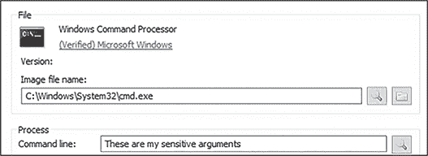

图 3-3：从 PEB 中获取的命令行参数

正如预期的那样，*cmd.exe* 被创建并传递给它五个参数的字符串。让我们记住这个例子；它将作为我们开始尝试隐藏恶意软件时的无害基准。

Chester 的博客文章描述了修改用于调用进程的命令行参数的以下过程。首先，使用恶意参数以挂起状态创建子进程。接着，使用 ntdll!NtQueryInformationProcess() 获取子进程 PEB 的地址，并通过调用 kernel32!ReadProcessMemory() 复制该地址。然后，获取其 ProcessParameters 字段，并用伪造的参数覆盖由 ProcessParameters 指向的 CommandLine 成员所表示的 UNICODE_STRING。最后，恢复子进程的执行。

让我们用参数字符串“伪造的参数传递替代原始参数”来覆盖 列表 3-9 中的原始参数。列表 3-10 展示了这一行为，更新部分以粗体显示。

```
void main()
{
    `--snip--`

    if (CreateProcessW(
        L"C:\\Windows\\System32\\cmd.exe",
        L"These are my sensitive arguments",
        NULL, NULL, FALSE,
        **CREATE_SUSPENDED,**
        NULL, NULL, &si, &pi))
    {
        `--snip--`

        **LPCWSTR szNewArguments = L"Spoofed arguments passed instead";**
        SIZE_T ulArgumentLength = wcslen(szNewArguments) * sizeof(WCHAR);

        if (**WriteProcessMemory(**
 **pi.hProcess,**
 **pParameters.CommandLine.Buffer,**
 **(PVOID)szNewArguments,**
 **ulArgumentLength,**
 **&ulSize)**) {
                  **ResumeThread(pi.hThread);**
            }
      }

 `--snip--`
}
```

列表 3-10：覆盖命令行参数

当我们创建进程时，我们向函数传递了CREATE_SUSPENDED标志以便在挂起状态下启动它。接下来，我们需要获取进程参数在 PEB 中的地址。为了简洁起见，我们省略了清单 3-10 中的这段代码，但做法是使用ntdll!NtQueryInformationProcess()，并传递ProcessBasicInformation信息类。这应该会返回一个包含PebBaseAddress成员的PROCESS_BASIC_INFORMATION结构体。

然后，我们可以将子进程的 PEB 读取到我们本地分配的缓冲区中。使用这个缓冲区，我们提取参数并传入 PEB 的地址。接着，我们使用ProcessParameters将其复制到另一个本地缓冲区中。在我们的代码中，这个最终的缓冲区叫做pParameters，并将其强制转换为指向RTL_USER_PROCESS_PARAMETERS结构体的指针。我们通过调用kernel32!WriteProcessMemory()用一个新字符串覆盖现有参数。如果一切顺利完成没有错误，我们调用kernel32!ResumeThread()，让我们的挂起子进程完成初始化并开始执行。

现在，Process Hacker 显示了伪造的参数值，正如你在图 3-4 中看到的那样。

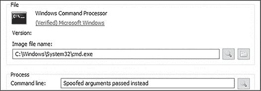

图 3-4：命令行参数被伪造的值覆盖

尽管这种技术仍然是基于可疑命令行参数避开检测的有效方式之一，但它也有一些局限性。其中一个局限是，进程不能更改自己的命令行参数。这意味着，如果我们不能控制父进程，比如在初始访问负载的情况下，进程必须使用原始参数执行。此外，用于覆盖 PEB 中可疑参数的值必须比原始值长。如果它较短，覆盖将不完整，可疑参数的部分内容将保留。图 3-5 展示了这一局限的实际情况。

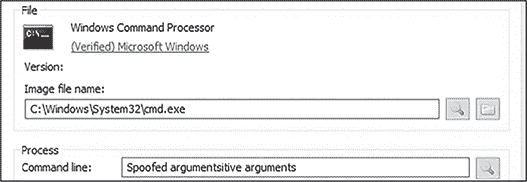

图 3-5：命令行参数部分被覆盖

在这里，我们将参数缩短为“伪造的参数”值。如你所见，它只替换了原始参数的一部分。反之亦然：如果伪造值的长度大于原始参数的长度，伪造的参数将被截断。

### 父进程 ID 伪造

几乎每个 EDR 都有某种方式来关联系统上的父子进程。这使得代理能够识别可疑的进程关系，例如 Microsoft Word 生成*rundll32.exe*，这可能表明攻击者的初次访问或成功利用了某项服务。

因此，为了隐藏主机上的恶意行为，攻击者通常希望伪造当前进程的父进程。如果我们能够欺骗 EDR，使其认为我们的恶意进程创建实际上是正常的，那么我们被检测到的可能性将大大降低。实现这一点的最常见方法是修改子进程和线程的属性列表，这一技术是由 Didier Stevens 在 2009 年推广的。这种规避依赖于 Windows 上的一个事实，即子进程继承了来自父进程的某些属性，比如当前工作目录和环境变量。父进程和子进程之间没有依赖关系；因此，我们可以在某种程度上任意指定父进程，正如本节将要讨论的那样。

为了更好地理解这一策略，我们需要深入了解 Windows 上的进程创建。用于此目的的主要 API 是名副其实的kernel32!CreateProcess() API。此函数在清单 3-11 中定义。

```
BOOL CreateProcessW(
  LPCWSTR                lpApplicationName,
  LPWSTR                 lpCommandLine,
  LPSECURITY_ATTRIBUTES  lpProcessAttributes,
  LPSECURITY_ATTRIBUTES  lpThreadAttributes,
  BOOL                   bInheritHandles,
  DWORD                  dwCreationFlags,
  LPVOID                 lpEnvironment,
  LPCWSTR                lpCurrentDirectory,
  LPSTARTUPINFOW         lpStartupInfo,
  LPPROCESS_INFORMATION  lpProcessInformation
);
```

清单 3-11：kernel32!CreateProcess() API 定义

传递给此函数的第九个参数是指向STARTUPINFO或STARTUPINFOEX结构的指针。STARTUPINFOEX结构在清单 3-12 中定义，通过添加指向PROC_THREAD_ATTRIBUTE_LIST结构的指针，扩展了基本的启动信息结构。

```
typedef struct _STARTUPINFOEXA {
  STARTUPINFOA                 StartupInfo;
  LPPROC_THREAD_ATTRIBUTE_LIST lpAttributeList;
} STARTUPINFOEXA, *LPSTARTUPINFOEXA;
```

清单 3-12：STARTUPINFOEX结构定义

在创建进程时，我们可以调用kernel32!InitializeProcThreadAttributeList()来初始化属性列表，然后调用kernel32!UpdateProcThreadAttribute()来修改它。这使我们能够设置要创建的进程的自定义属性。在伪造父进程时，我们关注的是PROC_THREAD_ATTRIBUTE_PARENT_PROCESS属性，该属性指示正在传递目标父进程的句柄。为了获得这个句柄，我们必须通过打开一个新进程或利用现有的进程来获取目标进程的句柄。

列表 3-13 展示了一个进程伪装的示例，将这些内容结合在一起。我们将修改记事本工具的属性，使 VMware Tools 看起来像是它的父进程。

```
Void SpoofParent() {
    PCHAR szChildProcess = **"notepad"**;
    DWORD dwParentProcessId = ❶ 7648;
    HANDLE hParentProcess = NULL;
    STARTUPINFOEXA si;
    PROCESS_INFORMATION pi;
    SIZE_T ulSize;

    memset(&si, 0, sizeof(STARTUPINFOEXA));
    si.StartupInfo.cb = sizeof(STARTUPINFOEXA);

  ❷ hParentProcess = OpenProcess(
        PROCESS_CREATE_PROCESS,
        FALSE,
        dwParentProcessId);

  ❸ InitializeProcThreadAttributeList(NULL, 1, 0, &ulSize);
    si.lpAttributeList =
      ❹ (LPPROC_THREAD_ATTRIBUTE_LIST)HeapAlloc(
            GetProcessHeap(),
            0, ulSize);
    InitializeProcThreadAttributeList(si.lpAttributeList, 1, 0, &ulSize);

  ❺ UpdateProcThreadAttribute(
        si.lpAttributeList,
        0,
        PROC_THREAD_ATTRIBUTE_PARENT_PROCESS, &hParentProcess,
        sizeof(HANDLE),
        NULL, NULL);

    CreateProcessA(NULL,
        szChildProcess,
        NULL, NULL, FALSE,
        EXTENDED_STARTUPINFO_PRESENT,
        NULL, NULL,
        &si.StartupInfo, &pi);
    CloseHandle(hParentProcess);
    DeleteProcThreadAttributeList(si.lpAttributeList);
}
```

列表 3-13：伪装父进程的示例

我们首先将*vmtoolsd.exe*的进程 ID ❶硬编码为我们想要的父进程。在实际应用中，我们可能会使用逻辑来查找我们想要伪装的父进程的 ID，但为了简洁起见，我没有在这个示例中包含这部分代码。接下来，SpoofParent() 函数调用了 kernel32!OpenProcess() ❷。这个函数负责以开发者请求的访问权限打开一个已存在进程的新句柄。在大多数攻击性工具中，你可能习惯看到这个函数使用诸如 PROCESS_VM_READ 这样的参数来读取进程的内存，或者使用 PROCESS_ALL_ACCESS，这会让我们对进程拥有完全控制。然而，在这个示例中，我们请求的是 PROCESS_CREATE_PROCESS。我们需要这个访问权限，以便使用目标进程作为父进程，并与我们的外部启动信息结构一起使用。当函数执行完毕后，我们将拥有一个具有适当权限的 *vmtoolsd.exe* 句柄。

接下来，我们需要做的是创建并填充 PROC_THREAD _ATTRIBUTE_LIST 结构体。为此，我们使用一个常见的 Windows 编程技巧来获取结构体的大小并分配相应的内存。我们调用函数初始化属性列表 ❸，传入一个空指针，而不是传入实际属性列表的地址。然而，我们仍然会传入一个指向 DWORD 类型的指针，用来存储完成后所需的大小。然后，我们使用这个变量中存储的大小，利用 kernel32!HeapAlloc() ❹ 在堆上分配内存。现在，我们可以再次调用属性列表初始化函数，传入刚刚创建的堆分配内存的指针。

到目前为止，我们准备开始进行伪造。我们通过首先调用修改属性列表的函数，传递属性列表本身、指示父进程句柄的标志以及我们为*vmtoolsd.exe*打开的句柄❺来实现这一点。这将*vmtoolsd.exe*设置为我们使用此属性列表创建的任何进程的父进程。我们需要做的最后一件事是将属性列表作为输入传递给进程创建函数，指定要创建的子进程以及EXTENDED_STARTUPINFO_PRESENT标志。当这个函数被执行时，*notepad.exe*将出现在 Process Hacker 中作为*vmtoolsd.exe*的子进程，而不是其真实父进程*ppid-spoof.exe*的子进程（图 3-6）。


图 3-6：Process Hacker 中的伪造父进程

不幸的是，对于攻击者来说，这种规避技术有几种方法可以相对简单地检测到。首先是通过使用驱动程序。记住，在进程创建事件中传递给驱动程序的结构包含两个与父进程相关的独立字段：ParentProcessId和CreatingThreadId。虽然在大多数正常情况下，这两个字段会指向相同的进程，但当新进程的父进程 ID（PPID）被伪造时，CreatingThreadId.UniqueProcess字段将包含调用进程创建函数的进程的 PID。列表 3-14 显示了通过 DbgView 捕获的模拟 EDR 驱动程序的输出，DbgView 是一个用于捕获调试打印消息的工具。

```
12.67045498 Process Name: notepad.exe
12.67045593 Process ID: 7892
12.67045593 Parent Process Name: vmtoolsd.exe
12.67045593 Parent Process ID: 7028
12.67045689 Creator Process Name: ppid-spoof.exe
12.67045784 Creator Process ID: 7708
```

列表 3-14：从驱动程序捕获父进程和创建者进程信息

你可以在这里看到，伪造的*vmtoolsd.exe*作为父进程出现，但创建者（真正启动*notepad.exe*的进程）被识别为*ppid-spoof.exe*。

另一种检测 PPID 伪造的方法是使用 ETW（我们将在第八章中进一步探讨）。F-Secure 在其“检测父 PID 伪造”博客文章中详细记录了这一技术。这种检测策略依赖于 ETW 事件头中指定的进程 ID 是进程的创建者，而不是事件数据中指定的父进程。因此，在我们的例子中，防御者可以使用 ETW 跟踪捕获每当*notepad.exe*被启动时的进程创建事件。图 3-7 显示了生成的事件数据。

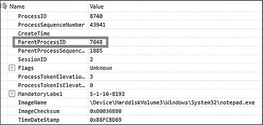

图 3-7：ETW 事件数据中的伪造父进程

在图 3-7 中高亮显示的是*vmtoolsd.exe*的进程 ID，即伪造的父进程。如果你将其与图 3-8 中显示的事件头进行比较，就能看到不一致之处。

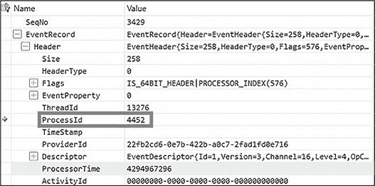

图 3-8：在 ETW 事件头中捕获的创建者进程 ID

请注意两个进程 ID 之间的差异。虽然事件数据中包含的是*vmtoolsd.exe*的 ID，但头部包含的是*ppid-spoof.exe*的 ID，即真正的创建者。

来自该 ETW 提供程序的信息并不像清单 3-14 中由模拟 EDR 驱动程序提供的信息那样详细。例如，我们缺少父进程和创建者进程的映像名称。这是因为 ETW 提供程序没有为我们提取这些信息，就像驱动程序所做的那样。在实际情况中，我们可能需要添加一个步骤来检索这些信息，可以通过查询进程或从其他数据源中提取。无论如何，我们仍然可以使用这种技术来检测 PPID 欺骗，因为我们拥有策略所需的核心信息：不匹配的父进程和创建者进程 ID。

### 进程映像修改

在许多情况下，恶意软件希望避开*基于映像*的检测，或者避开基于用于创建进程的文件名的检测。虽然有许多方法可以实现这一点，但一种策略——我们称之为*进程映像修改*——自 2017 年以来获得了广泛关注，尽管至少从 2014 年起，就有一些活跃的威胁组织使用了这一手段。除了隐藏恶意软件或工具的执行外，这一策略还可能帮助攻击者绕过应用程序白名单、规避每应用程序的主机防火墙规则，或在服务器允许敏感操作发生之前通过安全检查。

本节涵盖四种进程映像修改技术，即 hollowing、doppelgänging、herpaderping 和 ghosting，所有这些技术都通过大致相同的方式实现其目标：通过将宿主进程的原始映像重新映射为自己的映像。这些技术还都依赖于微软在实现通知已注册回调的进程创建逻辑时做出的相同设计决策。

设计决策如下：Windows 上的进程创建涉及一系列复杂的步骤，其中许多步骤发生在内核通知任何驱动程序之前。因此，攻击者有机会在这些早期步骤中以某种方式修改进程的属性。以下是整个进程创建工作流程，其中通知步骤以粗体显示：

1. 验证传递给进程创建 API 的参数。

2. 打开目标映像的句柄。

3. 从目标映像创建一个节对象。

4. 创建并初始化进程对象。

5. 分配 PEB。

6. 创建并初始化线程对象。

**7. 将进程创建通知发送到已注册的回调。**

8. 执行特定于 Windows 子系统的操作以完成初始化。

9. 启动主线程的执行。

10. 完成进程初始化。

11. 从镜像入口点开始执行。

12. 返回进程创建 API 的调用者。

本节中概述的技术利用了第 3 步，其中内核从进程镜像创建节区对象。一旦创建，内存管理器会缓存该镜像节区，这意味着节区可能与相应的目标镜像有所偏差。因此，当驱动程序从内核进程管理器接收到通知时，它处理的 PS_CREATE_NOTIFY_INFO 结构的 FileObject 成员可能并不指向正在执行的文件。除了利用这一事实外，接下来的每种技术还有细微的变化。

#### Hollowing

*Hollowing* 是利用节区修改的最古老方法之一，至少可以追溯到 2011 年。图 3-9 展示了这种技术的执行流程。

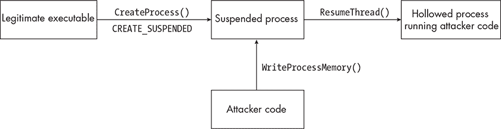

图 3-9：进程 hollowing 的执行流程

使用此技术，攻击者创建一个处于挂起状态的进程，然后在定位其基址（PEB 中）后取消映射该镜像。一旦取消映射完成，攻击者将一个新的镜像（例如敌方的 shellcode 执行器）映射到该进程，并对其节区进行对齐。如果成功，进程将恢复执行。

#### Doppelgänging

在 2017 年黑帽欧洲大会的演讲《Lost in Transaction: Process Doppelgänging》中，Tal Liberman 和 Eugene Kogan 介绍了一种新的进程镜像修改变种。他们的技术，*进程 Doppelgänging*，依赖于两个 Windows 特性：事务性 NTFS（TxF）和遗留的进程创建 API，ntdll!NtCreateProcessEx()。

TxF 是一种现已弃用的通过将文件系统操作作为单一原子操作来执行的方式。它允许代码轻松地回滚文件更改，例如在更新或发生错误时，并且有一组支持它的 API。

遗留的进程创建 API 在 Windows 10 发布之前用于进程创建，Windows 10 引入了更强大的ntdll!NtCreateUserProcess()。虽然它在正常的进程创建中已经被弃用，但在 Windows 10 的版本（直到 20H2）中，仍然可以用来创建最小化进程。它的一个显著优点是，进程镜像使用节句柄而非文件，但也带来了一些重要挑战。这些困难源于，许多进程创建步骤（例如将进程参数写入新进程的地址空间和创建主线程对象）并没有在幕后自动处理。为了使用遗留的进程创建函数，开发者必须在自己的代码中重新创建这些缺失的步骤，确保进程能够启动。

图 3-10 展示了进程复制的复杂流程。

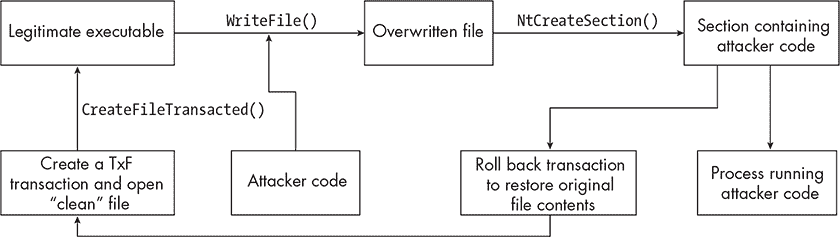

图 3-10：进程复制执行流程

在他们的概念验证中，Liberman 和 Kogan 首先创建一个事务对象，并使用kernel32!CreateFileTransacted()打开目标文件。然后，他们用恶意代码覆盖该事务文件，创建一个指向恶意代码的镜像节，并通过kernel32!RollbackTransaction()回滚事务。此时，可执行文件已恢复到原始状态，但镜像节被缓存了恶意代码。从这里，作者调用ntdll!NtCreateProcessEx()，将节句柄作为参数传入，创建一个指向恶意代码入口点的主线程。创建这些对象后，他们恢复主线程，允许被复制的进程执行。

#### Herpaderping

*进程 herpaderping*，由 Johnny Shaw 在 2020 年发明，利用了许多与进程复制相同的技巧，特别是通过使用遗留的进程创建 API 从节对象创建进程。虽然 herpaderping 可以避开驱动程序的基于镜像的检测，但其主要目的是避开被丢弃的可执行文件内容的检测。图 3-11 展示了这一技术如何工作。

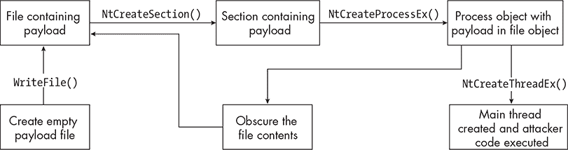

图 3-11：进程 herpaderping 执行流程

要执行 herpaderping，攻击者首先将恶意代码写入磁盘，并创建区域对象，保持掉落的可执行文件的句柄打开。然后，他们调用传统的进程创建 API，将区域句柄作为参数，以创建进程对象。在初始化进程之前，他们通过打开的文件句柄和kernel32!WriteFile()或类似的 API 来隐藏最初写入磁盘的可执行文件。最后，他们创建主线程对象并执行剩余的进程启动任务。

此时，驱动程序的回调收到通知，可以使用在进程创建时传递给驱动程序的结构中的<FileObject>成员扫描文件内容。然而，由于文件内容已被修改，扫描功能将检索到虚假的数据。此外，关闭文件句柄将向所有已注册的文件系统微筛选器发送一个<IRP_MJ_CLEANUP> I/O 控制代码。如果微筛选器希望扫描文件内容，它将面临与驱动程序相同的命运，可能导致假阴性扫描结果。

#### 幽灵化

进程映像修改的最新变体之一是*进程幽灵化*，由 Gabriel Landau 于 2021 年 6 月发布。进程幽灵化依赖于 Windows 仅在文件映像映射到图像区域后才防止文件删除，并且在删除过程中不会检查关联的区域是否实际存在。如果用户尝试打开映射的可执行文件进行修改或删除，Windows 会返回一个错误。如果开发者将文件标记为删除，然后从可执行文件创建图像区域，那么在文件句柄关闭时，文件将被删除，但区域对象将保持存在。该技术的执行流程如图 3-12 所示。

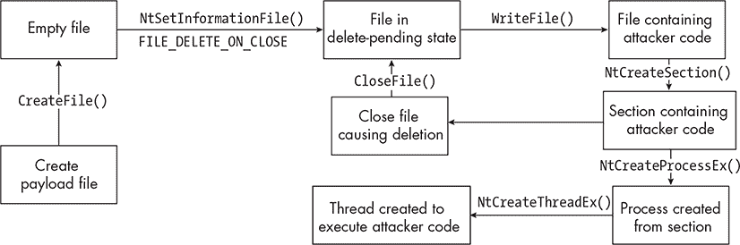

图 3-12：进程幽灵化工作流

为了在实践中实现这一技术，恶意软件可能会在磁盘上创建一个空文件，然后立即使用 ntdll!NtSetInformationFile() API 将其置于删除待定状态。当文件处于此状态时，恶意软件可以向文件写入其有效载荷。请注意，在此时，外部请求打开该文件会失败，并返回 *ERROR_DELETE_PENDING* 错误。接下来，恶意软件从该文件创建映像节，然后关闭文件句柄，删除文件，但保留映像节。从这里开始，恶意软件遵循前述示例中的步骤，通过节对象创建新进程。当驱动程序收到有关进程创建的通知并尝试访问支持该进程的 FILE_OBJECT（Windows 用于表示文件对象的结构）时，它将收到 *STATUS_FILE_DELETED* 错误，防止文件被检查。

#### 检测

虽然进程映像修改有无数种变体，但由于该技术依赖于两点——创建与报告的可执行文件不同的映像节，无论是被修改还是缺失，以及使用传统的进程创建 API 从映像节创建新的非最小化进程——我们可以使用相同的基本方法来检测所有这些变体。

不幸的是，大多数对这种策略的检测是反应性的，通常仅在调查过程中进行，或者利用专有工具。然而，通过关注该技术的基本原理，我们可以设想出多种潜在的检测方法。为了演示这些方法，Aleksandra Doniec（@hasherezade）创建了一个公开的进程幽灵证明概念，我们可以在受控环境中分析。你可以在 [*https://<wbr>github<wbr>.com<wbr>/hasherezade<wbr>/process<wbr>_ghosting<wbr>/releases*](https://github.com/hasherezade/process_ghosting/releases) 下载这个文件 *proc_ghost64.exe*。请验证它的 SHA-256 哈希值是否与以下值匹配：8a74a522e9a91b777080d3cb95d8bbeea84cb71fda487bc3d4489188e3fd6855。

首先，在内核模式下，驱动程序可以在 PEB 中或相应的 EPROCESS 结构中查找与进程映像相关的信息，该结构表示内核中的进程对象。由于用户可以控制 PEB，因此进程结构是更好的信息来源。它在多个位置包含进程映像信息，具体描述见 表 3-1。

表 3-1： 包含在 EPROCESS 结构中的进程映像信息

| 位置 | 进程-图像信息 |
| --- | --- |
| ImageFileName | 仅包含文件名 |
| ImageFilePointer.FileName | 包含根目录的 Win32 文件路径 |
| SeAuditProcessCreationInfo.ImageFileName | 包含完整的 NT 路径，但可能并不总是填充 |
| ImagePathHash | 通过 nt!PfCalculateProcessHash() 计算得到的哈希化 NT 或规范化路径 |

驱动程序可以通过使用如 nt!SeLocateProcessImageName() 或 nt!ZwQueryInformationProcess() 等 API 查询这些路径，以检索真实的图像路径，但此时它们仍需要一种方法来确定进程是否被篡改。尽管不可靠，PEB 提供了一个比较的依据。让我们通过 WinDbg 来演示这一比较。首先，我们尝试从进程结构的一个字段中提取图像的文件路径（列表 3-15）。

```
0: kd> **dt nt!_EPROCESS SeAuditProcessCreationInfo @$proc**
  +0x5c0 SeAuditProcessCreationInfo : _SE_AUDIT_PROCESS_CREATION_INFO
0: kd> **dt (nt!_OBJECT_NAME_INFORMATION *) @$proc+0x5c0**
0xffff9b8f`96880270
  +0x000 Name              : _UNICODE_STRING ""
```

列表 3-15：从 SeAuditProcessCreationInfo 中提取文件路径

有趣的是，WinDbg 返回的图像名称是空字符串。这是不典型的；例如，列表 3-16 返回的是你在未修改的 *notepad.exe* 的情况下预期看到的内容。

```
1: kd> **dt (nt!_OBJECT_NAME_INFORMATION *) @$proc+0x5c0**
Breakpoint 0 hit
0xffff9b8f`995e6170
  +0x000 Name             : _UNICODE_STRING
"\Device\HarddiskVolume2\Windows\System32\notepad.exe"
```

列表 3-16：用图像的 NT 路径填充的 UNICODE_STRING 字段

我们还可以检查进程结构的另一个成员 ImageFileName。虽然此字段不会返回完整的图像路径，但它仍然提供了有价值的信息，正如你在 列表 3-17 中看到的那样。

```
0: kd> **dt nt!_EPROCESS ImageFileName @$proc**
   +0x5a8 ImageFileName : [15]   "THFA8.tmp"
```

列表 3-17：读取 ImageFileName 成员，位于 EPROCESS 结构中

返回的文件名应该已经引起了注意，因为 *.tmp* 文件不是常见的可执行文件。为了确定是否可能发生了图像篡改，我们将查询 PEB。PEB 中的几个位置会返回图像路径：ProcessParameters.ImagePathName 和 Ldr.InMemoryOrderModuleList。让我们使用 WinDbg 来演示这一点（列表 3-18）。

```
1: kd> **dt nt!_PEB ProcessParameters @$peb**
   +0x020 ProcessParameters : 0x000001c1`c9a71b80 _RTL_USER_PROCESS_PARAMETERS
1: kd> **dt nt!_RTL_USER_PROCESS_PARAMETERS ImagePathName poi(@$peb+0x20)**
   +0x060 ImagePathName : _UNICODE_STRING "C:\WINDOWS\system32\notepad.exe"
```

列表 3-18：从 ImagePathName 提取进程图像路径

如 WinDbg 输出所示，PEB 报告的进程图像路径为 *C:\Windows\System32\notepad.exe*。我们可以通过查询 Ldr.InMemoryOrderModuleList 字段来验证这一点，如 列表 3-19 所示。

```
1: kd> **!peb**
PEB at 0000002d609b9000
    InheritedAddressSpace:    No
    ReadImageFileExecOptions:  No
    BeingDebugged:            No
    ImageBaseAddress:         00007ff60edc0000
    NtGlobalFlag:             0
    NtGlobalFlag2:            0
    Ldr                       00007ffc74c1a4c0
    Ldr.Initialized:          Yes
    Ldr.InInitializationOrderModuleList:  000001c1c9a72390 . 000001c1c9aa7f50
    Ldr.InLoadOrderModuleList:            000001c1c9a72500 . 000001c1c9aa8520
    Ldr.InMemoryOrderModuleList:          000001c1c9a72510 . 000001c1c9aa8530
                    Base Module
          ❶ 7ff60edc0000 C:\WINDOWS\system32\notepad.exe
```

列表 3-19：从 InMemoryOrderModuleList 提取进程图像路径

你可以看到这里 *notepad.exe* 是模块列表中的第一个图像 ❶。在我的测试中，这应该始终是这种情况。如果 EDR 在进程结构中报告的图像名称与 PEB 中的名称不匹配，它可以合理地判断某种类型的进程图像篡改已发生。然而，它无法确定攻击者使用了哪种技术。为了做出这一判断，它需要收集更多的信息。

EDR 可能首先尝试直接调查文件，例如通过进程结构中的 ImageFilePointer 字段扫描其内容。如果恶意软件通过传递图像部分对象来创建进程，使用的是传统的进程创建 API，如概念验证中所示，那么该成员将为空（列表 3-20）。

```
1: kd> **dt nt!_EPROCESS ImageFilePointer @$proc**
   +0x5a0 ImageFilePointer : (null)
```

列表 3-20：空的 ImageFilePointer 字段

使用传统 API 从一个部分创建进程是一个重要的指示，表明某些异常情况正在发生。此时，EDR 可以合理地判断这是发生的情况。为了支持这一假设，EDR 还可以检查进程是否为最小进程或 *pico*（派生自最小进程），如 列表 3-21 所示。

```
1: kd> **dt nt!_EPROCESS Minimal PicoCreated @$proc**
   +0x460 PicoCreated   : 0y0
   +0x87c Minimal       : 0y0
```

列表 3-21：将 Minimal 和 PicoCreated 成员设置为 false

另一个可以检查异常的地方是虚拟地址描述符（VAD）树，用于跟踪进程的连续虚拟内存分配。VAD 树可以提供有关已加载模块和内存分配权限的非常有用的信息。该树的根存储在进程结构的 VadRoot 成员中，我们无法通过 Microsoft 提供的 API 直接检索该信息，但可以在流行的驱动程序 Blackbone 中找到参考实现，Blackbone 用于操作内存。

若要检测进程映像修改，您可能需要查看映射的分配类型，其中包括 *READONLY* 文件映射，如 COM+ 目录文件（例如 *C:\Windows\Registration\Rxxxxxxx1.clb*），以及 *EXECUTE_WRITECOPY* 可执行文件。在 VAD 树中，您通常会看到进程映像的 Win32 根路径（换句话说，作为第一个映射可执行文件的进程支持的可执行文件）。列表 3-22 显示了 WinDbg 的 !vad 命令的截断输出。

```
0: kd> **!vad**
VAD              Commit
ffffa207d5c88d00 7 Mapped   NO_ACCESS              Pagefile section, shared commit 0x1293
ffffa207d5c89340 6 Mapped   Exe EXECUTE_WRITECOPY  \Windows\System32\notepad.exe
ffffa207dc976c90 4 Mapped   Exe EXECUTE_WRITECOPY  \Windows\System32\oleacc.dll
```

列表 3-22：WinDbg 中对于正常进程的 !vad 命令输出

该工具的输出显示了未修改的 *notepad.exe* 进程的映射分配。现在让我们来看一下它们在伪装进程中的表现（列表 3-23）。

```
0: kd> **!vad**
VAD              Commit
ffffa207d5c96860 2 Mapped      NO_ACCESS          Pagefile section, shared commit 0x1293
ffffa207d5c967c0 6 Mapped Exe  EXECUTE_WRITECOPY  \Users\dev\AppData\Local\Temp\THF53.tmp
ffffa207d5c95a00 9 Mapped Exe  EXECUTE_WRITECOPY  \Windows\System32\gdi32full.dll
```

列表 3-23：伪装进程的 !vad 命令输出

这个映射分配显示了 *.tmp* 文件的路径，而不是 *notepad.exe* 的路径。

既然我们已经知道了感兴趣的映像路径，就可以进一步调查它。做这件事的一种方法是使用 ntdll!NtQueryInformationFile() API 和 FileStandardInformation 类，它将返回一个 FILE_STANDARD_INFORMATION 结构。该结构包含 DeletePending 字段，这是一个布尔值，指示文件是否已标记为删除。在正常情况下，您也可以从 FILE_OBJECT 结构的 DeletePending 成员中提取此信息。在相关进程的 EPROCESS 结构内部，这由 ImageFilePointer 成员指向。在伪装进程的情况下，该指针将为空，因此 EDR 无法使用它。列表 3-24 显示了正常进程的映像文件指针和删除状态应如何表现。

```
2: kd> **dt nt!_EPROCESS ImageFilePointer @$proc**
   +0x5a0 ImageFilePointer : 0xffffad8b`a3664200 _FILE_OBJECT
2: kd> **dt nt!_FILE_OBJECT DeletePending 0xffffad8b`a3664200**
   +0x049 DeletePending : 0 ' '
```

列表 3-24：正常的 ImageFilePointer 和 DeletePending 成员

此列表来自一个在正常条件下执行的 *notepad.exe* 进程。在一个被伪装的进程中，映像文件指针将是一个无效值，因此，删除状态标志也将是无效的。

通过观察正常的 *notepad.exe* 实例和被伪装的实例之间的差异，我们已经识别出了一些指示器：

+   在进程的 PEB 中的 ProcessParameters 成员内的 ImagePathName 路径与其 EPROCESS 结构中的 ImageFileName 路径不匹配。

+   进程结构的图像文件指针将为 null，并且其 Minimal 和 PicoCreated 字段将为 false。

+   文件名可能不常见（不过这并不是要求，用户可以控制该值）。

当 EDR 驱动程序从其进程创建回调中接收到新的进程创建结构时，它将能够访问构建检测所需的关键信息。也就是说，在进程幽灵化的情况下，它可以使用 ImageFileName、 FileObject 和 IsSubsystemProcess 来识别潜在的幽灵进程。清单 3-25 展示了该驱动程序逻辑的实现方式。

```
void ProcessCreationNotificationCallback(
    PEPROCESS pProcess,
    HANDLE hPid,
    PPS_CREATE_NOTIFY_INFO psNotifyInfo)
{
    if (pNotifyInfo)
    {
      ❶ if (!pNotifyInfo->FileObject && !pNotifyInfo->IsSubsystemProcess)
        {
            PUNICODE_STRING pPebImage = NULL;
            PUNICODE_STRING pPebImageNtPath = NULL; PUNICODE_STRING pProcessImageNtPath = NULL;

         ❷ GetPebImagePath(pProcess, pPebImage);
            CovertPathToNt(pPebImage, pPebImageNtPath);

         ❸ CovertPathToNt(psNotifyInfo->ImageFileName, pProcessImageNtPath);

            if (RtlCompareUnicodeString(pPebImageNtPath, pProcessImageNtPath, TRUE))
            {
                `--snip--`
            }
        }
    }

    `--snip--`
}
```

清单 3-25：使用驱动程序检测幽灵进程

我们首先检查文件指针是否为 null，即使创建的进程不是子系统进程❶，这意味着它可能是通过传统的进程创建 API 创建的。接下来，我们使用两个模拟辅助函数❷从 PEB 中返回进程图像路径，并将其转换为 NT 路径。然后，我们使用进程结构中为新创建的进程提供的图像文件名❸重复此过程。之后，我们比较 PEB 和进程结构中的图像路径。如果它们不相等，则很可能发现了可疑进程，此时 EDR 需要采取行动。

## 进程注入案例研究：fork&run

随着时间推移，攻击者的技术手段发生了变化，这也影响了 EDR 厂商对于检测可疑进程创建事件的重要性。在成功入侵目标系统后，攻击者可能会利用任何数量的命令与控制代理来执行其后期利用活动。每个恶意软件代理的开发者必须决定如何处理与代理的通信，以便在被感染的系统上执行命令。虽然有许多方法可以解决这个问题，但最常见的架构被称为*fork&run*。

Fork&run 的工作原理是启动一个牺牲进程，代理的主进程将其后期利用任务注入该进程，使任务能够独立于代理执行。这样做的一个好处是稳定性；如果在主代理进程中运行的后期利用任务遇到未处理的异常或故障，可能会导致代理退出，从而使攻击者失去对环境的访问权限。

这种架构还简化了代理的设计。通过提供主机进程和注入其后期利用功能的方式，开发者使得将新功能集成到代理中变得更加容易。此外，通过将后期利用任务限制在另一个进程中，代理无需过多担心清理问题，而是可以直接终止牺牲进程。

在代理中利用 fork&run 是如此简单，以至于许多操作人员可能甚至没有意识到他们正在使用它。一个广泛使用 fork&run 的流行代理是 Cobalt Strike 的 Beacon。通过 Beacon，攻击者可以指定一个牺牲进程，无论是通过其可塑性配置文件（Malleable profile）还是通过 Beacon 集成命令，这个进程将作为注入后期利用功能的目标。一旦目标进程设置好，Beacon 就会启动该牺牲进程，并在队列中有需要 fork&run 的后期利用任务时注入其代码。该牺牲进程负责运行任务并在退出前返回输出。

然而，这种架构对操作安全构成了较大的风险。攻击者现在必须躲避如此多的检测，以至于利用像 Beacon 这样的代理的内置功能通常不可行。相反，许多团队现在只将其代理作为注入后期利用工具代码和保持对环境访问的一种方式。这一趋势的一个例子是，使用 C# 编写的进攻性工具的兴起，主要通过 Beacon 的*execute-assembly*进行利用，后者是一种在内存中执行 .NET 程序集的方法，底层使用了 fork&run。

由于这种战术手段的转变，EDR 对进程创建的监控变得更加严格，从环境中父子进程关系的相对频率到进程镜像是否为 .NET 程序集等方面进行了多角度审查。然而，随着 EDR 厂商在检测“创建进程并注入”模式方面变得更加精准，攻击者开始认为启动新进程具有很高的风险，并开始寻找规避该操作的方法。

对于 EDR（端点检测与响应）厂商来说，最大的挑战之一出现在 Cobalt Strike 的 4.1 版本中，该版本引入了 Beacon 对象文件（BOFs）。BOFs 是用 C 语言编写的小型程序，旨在在代理进程中运行，完全避免了 fork&run。功能开发人员可以继续使用现有的开发过程，但利用这种新架构以更安全的方式实现相同的结果。

如果攻击者从 fork&run 中移除伪装，EDR 供应商必须依赖其他遥测数据来进行检测。幸运的是，对于供应商来说，BOFs 仅移除与牺牲进程创建相关的进程创建和注入遥测数据。它们不会隐藏后期利用工具的痕迹，比如网络流量、文件系统交互或 API 调用。这意味着，尽管 BOFs 确实使检测变得更加困难，但它们并不是解决问题的灵丹妙药。

## 结论

监控新进程和线程的创建是任何 EDR（端点检测与响应）系统中极其重要的功能。它有助于映射父子关系、在进程执行之前调查可疑进程，并识别远程线程的创建。尽管 Windows 提供了其他获取这些信息的方式，但在 EDR 的驱动程序内部，进程和线程创建回调例程仍然是最常见的方式。除了能够深入了解系统上的活动外，这些回调也很难被规避，它们依赖于覆盖的漏洞和盲点，而不是底层技术的根本缺陷。
