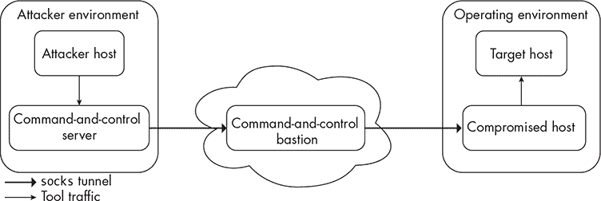
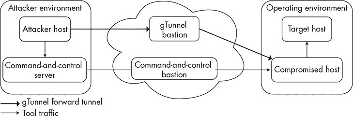
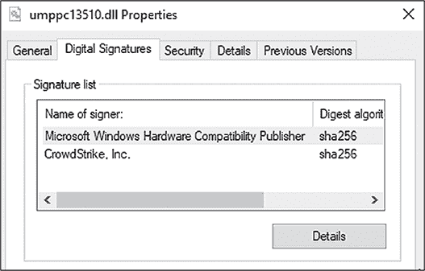
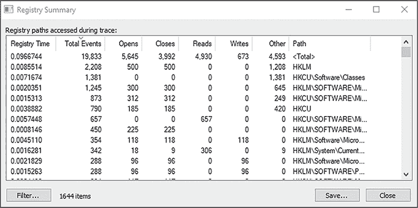

# 5 图像加载和注册表通知


本书将介绍的最后两种通知回调例程是图像加载通知和注册表通知。*图像加载通知*会在可执行文件、DLL 或驱动程序加载到系统内存时发生。*注册表通知*会在注册表发生特定操作时触发，例如键值创建或删除。

除了这些通知类型，本章还将讨论 EDR 如何常常依赖图像加载通知来进行一种名为*KAPC 注入*的技术，该技术用于注入它们的函数钩子 DLL。最后，我们将讨论一种针对 EDR 驱动程序的规避方法，这可能绕过我们讨论过的所有通知类型。

## 图像加载通知的工作原理

通过收集图像加载遥测信息，我们可以获得关于进程依赖关系的极为宝贵的信息。例如，使用内存中.NET 程序集的攻击工具，如 Cobalt Strike Beacon 中的<sup class="SANS_TheSansMonoCd_W5Regular_11">execute-assembly</sup>命令，通常将公共语言运行时*clr.dll*加载到其进程中。通过将*clr.dll*的图像加载与进程的 PE 头中的某些属性关联，我们可以识别加载*clr.dll*的非.NET 进程，这可能表明恶意行为。

### 注册回调例程

内核通过nt!PsSetLoadImageNotifyRoutine() API 来实现这些图像加载通知。如果驱动程序想要接收这些事件，开发人员只需将他们的回调函数作为唯一参数传递给该 API，如清单 5-1 所示。

```
NTSTATUS DriverEntry(PDRIVER_OBJECT pDriverObj, PUNICODE_STRING pRegPath)
{
    NTSTATUS status = STATUS_SUCCESS;
    `--snip--`

    status = PsSetLoadImageNotifyRoutine(ImageLoadNotificationCallback);

    `--snip--`
}

void ImageLoadNotificationCallback(
    PUNICODE_STRING FullImageName,
    HANDLE ProcessId,
    PIMAGE_INFO ImageInfo)
{
    `--snip--`
}
```

清单 5-1：注册图像加载回调例程

现在，系统将在每次将新图像加载到进程时，调用内部回调函数ImageLoadNotificationCallback()。

### 查看系统上注册的回调例程

系统还将一个指向该函数的指针添加到一个数组中，nt!PspLoadImageNotifyRoutine()。我们可以像遍历第三章中讨论的进程通知回调数组那样，遍历这个数组。在清单 5-2 中，我们这样做以列出系统上注册的图像加载回调。

```
1: kd> **dx ((void**[0x40])&nt!PspLoadImageNotifyRoutine)**
**.Where(a => a != 0)**
**.Select(a => @$getsym(@$getCallbackRoutine(a).Function))** [0]        : WdFilter+0x467b0 (fffff803`4ade67b0)
    [1]        : ahcache!CitmpLoadImageCallback (fffff803`4c95eb20)
```

清单 5-2：枚举图像加载回调

这里注册的回调函数明显少于进程创建通知时注册的回调函数。进程通知的非安全用途比图像加载更多，因此开发人员更有兴趣实现它们。相反，图像加载是 EDR（终端检测与响应）的一项关键数据点，因此我们可以预期在系统中加载的任何 EDR 工具将与 Defender [0] 和客户交互跟踪器 [1] 一起出现。

### 从图像加载中收集信息

当加载图像时，回调例程会接收到指向一个 IMAGE_INFO 结构的指针，该结构在清单 5-3 中定义。EDR 可以从中收集遥测数据。

```
typedef struct _IMAGE_INFO {
  union {
    ULONG Properties;
    struct {
      ULONG ImageAddressingMode : 8;
      ULONG SystemModeImage : 1;
      ULONG ImageMappedToAllPids : 1;
      ULONG ExtendedInfoPresent : 1;
      ULONG MachineTypeMismatch : 1;
      ULONG ImageSignatureLevel : 4;
      ULONG ImageSignatureType : 3;
      ULONG ImagePartialMap : 1;
      ULONG Reserved : 12;
    };
  };
  PVOID ImageBase;
  ULONG ImageSelector;
  SIZE_T ImageSize;
  ULONG ImageSectionNumber;
} IMAGE_INFO, *PIMAGE_INFO;
```

清单 5-3：IMAGE_INFO 结构定义

该结构有一些特别有趣的字段。首先，SystemModeImage 如果图像映射到用户地址空间（如 DLL 和 EXE 文件），则设置为 0。如果该字段设置为 1，则表示该图像是加载到内核地址空间中的驱动程序。对于 EDR 来说，这非常有用，因为加载到内核模式的恶意代码通常比加载到用户模式的代码更危险。

ImageSignatureLevel 字段表示 Code Integrity 分配给图像的签名级别，Code Integrity 是 Windows 的一项功能，除了验证数字签名外，还具有其他功能。这些信息对实现某种类型软件限制策略的系统非常有用。例如，某个组织可能要求企业中的某些系统仅运行签名代码。这些签名级别是定义在*ntddk.h*头文件中的常量，并显示在清单 5-4 中。

```
#define SE_SIGNING_LEVEL_UNCHECKED        0x00000000
#define SE_SIGNING_LEVEL_UNSIGNED         0x00000001
#define SE_SIGNING_LEVEL_ENTERPRISE       0x00000002
#define SE_SIGNING_LEVEL_CUSTOM_1         0x00000003
#define SE_SIGNING_LEVEL_DEVELOPER        SE_SIGNING_LEVEL_CUSTOM_1
#define SE_SIGNING_LEVEL_AUTHENTICODE     0x00000004
#define SE_SIGNING_LEVEL_CUSTOM_2         0x00000005
#define SE_SIGNING_LEVEL_STORE            0x00000006
#define SE_SIGNING_LEVEL_CUSTOM_3         0x00000007
#define SE_SIGNING_LEVEL_ANTIMALWARE      SE_SIGNING_LEVEL_CUSTOM_3
#define SE_SIGNING_LEVEL_MICROSOFT        0x00000008
#define SE_SIGNING_LEVEL_CUSTOM_4         0x00000009
#define SE_SIGNING_LEVEL_CUSTOM_5         0x0000000A
#define SE_SIGNING_LEVEL_DYNAMIC_CODEGEN  0x0000000B
#define SE_SIGNING_LEVEL_WINDOWS          0x0000000C
#define SE_SIGNING_LEVEL_CUSTOM_7         0x0000000D
#define SE_SIGNING_LEVEL_WINDOWS_TCB      0x0000000E
#define SE_SIGNING_LEVEL_CUSTOM_6         0x0000000F
```

清单 5-4：图像签名级别

每个值的用途并没有很好的文档说明，但其中一些是显而易见的。例如，SE_SIGNING_LEVEL_UNSIGNED 用于未签名代码，SE_SIGNING_LEVEL_WINDOWS 表示该图像是操作系统组件，SE_SIGNING_LEVEL_ANTIMALWARE 与反恶意软件保护有关。

ImageSignatureType 字段是与 ImageSignatureLevel 相关的字段，定义了 Code Integrity 标记图像的签名类型，以指示签名的应用方式。定义这些值的 SE_IMAGE_SIGNATURE_TYPE 枚举在清单 5-5 中显示。

```
typedef enum _SE_IMAGE_SIGNATURE_TYPE
{
    SeImageSignatureNone = 0,
    SeImageSignatureEmbedded,
    SeImageSignatureCache,
    SeImageSignatureCatalogCached,
    SeImageSignatureCatalogNotCached,
    SeImageSignatureCatalogHint,
    SeImageSignaturePackageCatalog,
} SE_IMAGE_SIGNATURE_TYPE, *PSE_IMAGE_SIGNATURE_TYPE;
```

列表 5-5：SE_IMAGE_SIGNATURE_TYPE 枚举

与这些属性相关的代码完整性内部实现超出了本章的范围，但最常遇到的有 SeImageSignatureNone（表示文件未签名）、SeImageSignatureEmbedded（表示签名已嵌入文件中）和 SeImageSignatureCache（表示签名已缓存在系统中）。

如果 ImagePartialMap 的值非零，说明正在映射到进程虚拟地址空间中的映像并不完整。这个值是在 Windows 10 中加入的，用于表示当调用 kernel32!MapViewOfFile() 映射一个文件的部分内容时的情况，特别是当文件的大小大于进程的地址空间时。ImageBase 字段包含映像将被映射到的基地址，取决于映像类型，它可以是在用户空间或内核空间中的地址。

值得注意的是，当映像加载通知到达驱动程序时，映像已经被映射。这意味着 DLL 内的代码已经在宿主进程的虚拟地址空间中，并准备好执行。你可以通过 WinDbg 观察这种行为，如列表 5-6 所示。

```
0: kd> **bp nt!PsCallImageNotifyRoutines**
0: kd> **g**
Breakpoint 0 hit
nt!PsCallImageNotifyRoutines:
fffff803`49402bc0 488bc4          mov    rax,rsp
0: kd> **dt _UNICODE_STRING @rcx**
ntdll!_UNICODE_STRING
  "\SystemRoot\System32\ntdll.dll"
    +0x000 Length           : 0x3c
    +0x002 MaximumLengthN   : 0x3e
    +0x008 Buffer           : 0xfffff803`49789b98 ❶ "\SystemRoot\System32\ntdll.dll"
```

列表 5-6：从映像加载通知中提取映像名称

我们首先在负责遍历注册回调例程数组的函数上设置一个断点。然后，当调试器中断时，我们调查 RCX 寄存器。记住，传递给回调例程的第一个参数存储在 RCX 中，它是一个包含正在加载的映像名称的 Unicode 字符串 ❶。

一旦我们锁定了这个映像，我们可以查看当前进程的 VADs，如列表 5-7 所示，了解哪些映像已经加载到当前进程中，加载的位置和方式。

```
0: kd> **!vad**
VAD           Level Commit
`--snip--`
ffff9b8f9952fd80 0     0 Mapped READONLY Pagefile section, shared commit 0x1
ffff9b8f9952eca0 2     0 Mapped READONLY Pagefile section, shared commit 0x23
ffff9b8f9952d260 1     1 Mapped NO_ACCESS Pagefile section, shared commit 0xe0e
ffff9b8f9952c5e0 2     4 Mapped Exe EXECUTE_WRITECOPY \Windows\System32\notepad.exe
ffff9b8f9952db20 3     16 Mapped Exe EXECUTE_WRITECOPY \Windows\System32\ntdll.dll
```

列表 5-7：检查 VADs 以找到要加载的映像

输出的最后一行显示，映像加载通知的目标，即我们的示例中的 *ntdll.dll*，被标记为 Mapped。在 EDR 的情况下，这意味着我们知道 DLL 位于磁盘上并已复制到内存中。加载程序需要做一些事情，如解析 DLL 的依赖项，然后才会调用 DLL 内的 DllMain() 函数，并开始执行其代码。这在 EDR 处于预防模式并可能采取行动阻止 DLL 在目标进程中执行的情况下尤其重要。

## 使用隧道工具规避映像加载通知

近年来，一种日益流行的规避策略是代理工具，而不是在目标上运行它。当攻击者避免在主机上运行后期利用工具时，他们可以从收集的数据中去除许多主机上的指示，从而使 EDR 的检测变得极为困难。大多数对手工具包包含收集网络信息或作用于环境中其他主机的实用程序。然而，这些工具通常只需要一个有效的网络路径和能够对其想要交互的系统进行身份验证的能力。因此，攻击者不需要在目标环境中的主机上执行这些工具。

一种保持远离目标主机的方法是通过外部计算机代理工具，然后将工具的流量通过被攻破的主机路由。尽管这种策略由于其在规避 EDR 解决方案方面的有效性近年来变得越来越常见，但这一技术并不新鲜，大多数攻击者多年来一直通过使用 Metasploit Framework 的辅助模块来实施，尤其是当他们的复杂工具集因某种原因无法在目标上正常工作时。例如，攻击者有时希望利用 Impacket 提供的工具集，这是一个用 Python 编写的类库，用于处理网络协议。如果目标机器上没有 Python 解释器，攻击者就需要构建一个可执行文件来投放并在主机上执行。这会带来很多麻烦，并限制了许多工具包的操作性，因此攻击者转向了代理。

许多命令与控制代理，例如 Beacon 及其 socks 命令，支持某种形式的代理。图 5-1 显示了一个常见的代理架构。



图 5-1：一种通用的代理架构

在目标环境中部署命令与控制代理后，操作员会在其服务器上启动代理，然后将代理与该代理关联。从此以后，所有通过代理路由的流量将通过一个 *堡垒*，即用于混淆命令与控制服务器真实位置的主机，传递到已部署的代理，从而允许操作员将其工具通过代理隧道进入该环境。操作员可以使用如 Proxychains 或 Proxifier 等工具，强制将其后期利用工具（运行在外部主机上）的流量通过代理，并表现得像是在内部环境中运行一样。

然而，这一策略有一个显著的缺点。大多数进攻安全团队使用非交互式会话，这会在命令与控制代理与其服务器的签到之间引入预定延迟。这允许信标行为融入系统的正常流量，通过减少交互总量并匹配系统的典型通信模式。例如，在大多数环境中，你不会发现工作站与银行网站之间有大量流量。通过将签到间隔增加到与伪装成合法银行服务的服务器之间，攻击者可以将自己融入到背景中。但当进行代理时，这一做法就成了一个难题，因为许多工具并未构建为支持高延迟通道。试想一下，你在浏览网页时每小时只能发出一次请求（然后又得等一个小时才能看到结果）。

为了绕过这一点，许多操作者会将签到间隔缩短至接近零，从而创建交互式会话。这减少了网络延迟，使得后期利用工具可以毫无延迟地运行。然而，由于几乎所有的命令与控制代理都使用单一的通信通道进行签到、任务指派和输出发送，因此通过该单一通道的流量量可能会变得很大，导致防御者注意到可疑的信标活动正在发生。这意味着攻击者必须在主机级和网络级指示符之间做出一定的权衡，以适应其操作环境。

随着 EDR 厂商增强识别信标流量的能力，进攻团队和开发者将继续提升其技术手段以躲避检测。实现这一目标的下一个合乎逻辑的步骤之一，是使用多个频道进行命令与控制任务，而不是仅仅使用一个，可能通过使用次级工具，如 gTunnel，或者将该支持集成到代理本身。图 5-2 展示了这一方法的一个示例。



图 5-2：gTunnel 代理架构

在这个示例中，我们仍然使用现有的命令与控制通道来控制部署在被攻陷主机上的代理，但我们还添加了一个 gTunnel 通道，允许我们代理我们的工具。我们在攻击者主机上执行这些工具，几乎消除了基于主机的检测风险，并将工具的网络流量通过 gTunnel 路由到被攻陷的系统，在那里它继续像是来自被攻陷主机一样。这仍然给防御者提供了基于网络的检测攻击的机会，但它大大减少了攻击者在主机上的痕迹。

## 触发 KAPC 注入与图像加载通知

第二章讨论了 EDR 如何经常将功能钩子 DLL 注入新创建的进程，以监控对某些感兴趣函数的调用。对于厂商而言，不幸的是，从内核模式将 DLL 注入进程并没有正式支持的方法。具有讽刺意味的是，他们最常用的其中一种方法实际上是恶意软件常用的技术：APC 注入。大多数 EDR 厂商使用 KAPC 注入，这一过程指示正在生成的进程加载 EDR 的 DLL，尽管它并未显式地链接到正在执行的映像中。

为了注入 DLL，EDR 不能随意将图像的内容写入进程的虚拟地址空间。DLL 必须以符合 PE 格式的方式映射。为了从内核模式实现这一点，驱动程序可以使用一个相当巧妙的技巧：依赖图像加载回调通知来监控新创建的进程加载*ntdll.dll*。加载*ntdll.dll*是新进程做的第一件事之一，因此如果驱动程序能够注意到这一点，它可以在主线程开始执行之前对进程采取行动：这是放置钩子的完美时机。本节将引导您完成将功能钩子 DLL 注入新创建的 64 位进程的步骤。

### 理解 KAPC 注入

KAPC 注入在理论上相对简单，只有在我们讨论其在驱动程序中的实际实现时才会变得模糊。大致来说，我们希望告诉一个新创建的进程加载我们指定的 DLL。对于 EDR 来说，这几乎总是一个功能钩子 DLL。APC 作为一种信号进程执行某些操作的方法之一，等待直到线程处于*可警告*状态，例如当线程执行kernel32!SleepEx()或kernel32!WaitForSingleObjectEx()时，来执行我们请求的任务。

KAPC 注入从内核模式排队此任务，不像普通的用户模式 APC 注入，操作系统并不正式支持它，这使得其实现有些“黑客式”。该过程包括几个步骤。首先，驱动程序会在图像加载时收到通知，无论是进程图像（如*notepad.exe*）还是 EDR 关注的 DLL。因为通知发生在目标进程的上下文中，驱动程序随后会在当前加载的模块中查找一个可以加载 DLL 的函数的地址，特别是ntdll!LdrLoadDll()。接下来，驱动程序初始化几个关键结构，提供要注入进程的 DLL 的名称；初始化 KAPC；并将其排队执行。每当进程中的一个线程进入可警告状态时，APC 就会执行，EDR 驱动的 DLL 将被加载。

为了更好地理解这个过程，让我们更详细地逐步了解这些阶段。

### 获取 DLL 加载函数的指针

在驱动程序能够注入其 DLL 之前，它必须获取一个指向未记录的 ntdll!LdrLoadDll() 函数的指针，该函数负责将 DLL 加载到进程中，类似于 kernel32!LoadLibrary()。该内容在 清单 5-8 中定义。

```
NTSTATUS
LdrLoadDll(IN PWSTR SearchPath OPTIONAL,
           IN PULONG DllCharacteristics OPTIONAL,
           IN PUNICODE_STRING DllName,
           OUT PVOID *BaseAddress)
```

清单 5-8：LdrLoadDll() 函数定义

请注意，DLL 被加载和完全映射到进程中之间存在差异。因此，对于某些驱动程序，后操作回调可能比前操作回调更为有利。因为当后操作回调例程被通知时，映像已经完全映射，意味着驱动程序可以在映射的 *ntdll.dll* 副本中获取指向 ntdll!LdrLoadDll() 的指针。由于映像已经映射到当前进程中，驱动程序也无需担心地址空间布局随机化（ASLR）。

### 准备注入

一旦驱动程序获取了 ntdll!LdrLoadDll() 的指针，它就满足了执行 KAPC 注入的最重要要求，并可以开始将其 DLL 注入到新进程中。清单 5-9 显示了 EDR 驱动程序如何执行必要的初始化步骤来实现这一点。

```
typedef struct _INJECTION_CTX
{
    UNICODE_STRING Dll;
    WCHAR Buffer[MAX_PATH];
} INJECTION_CTX, *PINJECTION_CTX

void Injector()
{
    NTSTATUS status = STATUS_SUCCESS;
    PINJECTION_CTX ctx = NULL;
    const UNICODE_STRING DllName = RTL_CONSTANT_STRING(L"hooks.dll");

    `--snip--` ❶ status = ZwAllocateVirtualMemory(
        ZwCurrentProcess(),
        (PVOID *)&ctx,
        0,
        sizeof(INJECTION_CTX),
        MEM_COMMIT | MEM_RESERVE,
        PAGE_READWRITE
    );

    `--snip--`

      RtlInitEmptyUnicodeString(
        &ctx->Dll,
        ctx->Buffer,
        sizeof(ctx->Buffer)
      );

  ❷ RtlUnicodeStringCopyString(
      &ctx->Dll,
      DllName
    );

    `--snip--`

}
```

清单 5-9：在目标进程中分配内存并初始化上下文结构

驱动程序在目标进程 ❶ 内部分配内存，以容纳一个包含要注入的 DLL 名称的上下文结构 ❷。

### 创建 KAPC 结构

在完成此分配和初始化后，驱动程序需要为 KAPC 结构分配空间，如 清单 5-10 所示。该结构包含有关要在目标线程中执行的例程的信息。

```
PKAPC pKapc = (PKAPC)ExAllocatePoolWithTag(
    NonPagedPool,
    sizeof(KAPC),
    'CPAK'
);
```

清单 5-10：为 KAPC 结构分配内存

驱动程序在 NonPagedPool 中分配此内存，NonPagedPool 是一种内存池，保证数据会保留在物理内存中，而不会因为对象仍被分配而被换出到磁盘。这一点非常重要，因为 DLL 注入的线程可能正在以高中断请求级别运行，例如 DISPATCH_LEVEL，在这种情况下，它不应访问 PagedPool 中的内存，因为这会导致一个致命错误，通常会导致 IRQL_NOT_LESS_OR_EQUAL 错误检查（也称为蓝屏死机）。

接下来，驱动程序使用未公开的 nt!KeInitializeApc() API 初始化先前分配的 KAPC 结构，如 列表 5-11 所示。

```
VOID KeInitializeApc(
  PKAPC Apc,
  PETHREAD Thread,
  KAPC_ENVIRONMENT Environment,
  PKKERNEL_ROUTINE KernelRoutine,
  PKRUNDOWN_ROUTINE RundownRoutine,
  PKNORMAL_ROUTINE NormalRoutine,
  KPROCESSOR_MODE ApcMode,
  PVOID NormalContext
);
```

列表 5-11：nt!KeInitializeApc() 定义

在我们的驱动程序中，对 nt!KeInitializeApc() 的调用大致如 列表 5-12 所示。

```
KeInitializeApc(
  pKapc,
  KeGetCurrentThread(),
  OriginalApcEnvironment,
  (PKKERNEL_ROUTINE)OurKernelRoutine,
  NULL,
  (PKNORMAL_ROUTINE)pfnLdrLoadDll,
  UserMode,
  NULL
);
```

列表 5-12：带有 DLL 注入详细信息的 nt!KeInitializeApc() 调用

这个函数首先接受指向之前创建的 KAPC 结构的指针，以及指向应该排队到其中的线程的指针，在我们的例子中可以是当前线程。紧随其后的是 KAPC_ENVIRONMENT 枚举中的一个成员，它应该是 OriginalApcEnvironment (*0*)，以指示 APC 将在该线程的进程上下文中运行。

接下来的三个参数，即例程，是主要工作发生的地方。KernelRoutine，在我们的示例代码中命名为 OurKernelRoutine()，是在内核模式下执行的函数，在 APC_LEVEL 层级执行，且在将 APC 传递到用户模式之前执行。通常，它只是释放 KAPC 对象并返回。RundownRoutine 函数在目标线程在 APC 被传递之前终止时执行。此函数应释放 KAPC 对象，但为了简化起见，我们在示例中将其留空。NormalRoutine 函数应在 APC 被传递时，在用户模式下的 PASSIVE_LEVEL 层级执行。在我们的例子中，它应该是指向 ntdll!LdrLoadDll() 的函数指针。最后两个参数，ApcMode 和 NormalContext，分别被设置为 UserMode (*1*) 和作为 NormalRoutine 传递的参数。

### 队列 APC

最后，驱动程序需要将这个 APC 排队。驱动程序调用未记录的函数 nt!KeInsertQueueApc()，该函数在 列表 5-13 中定义。

```
BOOL KeInsertQueueApc(
  PRKAPC Apc,
  PVOID SystemArgument1,
  PVOID SystemArgument2,
  KPRIORITY Increment
);
```

列表 5-13：nt!KeInsertQueueApc() 定义

这个函数比之前的函数简单得多。第一个输入参数是 APC，它将是指向我们创建的 KAPC 的指针。接下来是要传递的参数。这些应该是要加载的 DLL 路径和包含路径的字符串的长度。由于这两个成员是我们自定义的 INJECTION_CTX 结构的一部分，我们在这里直接引用这些成员。最后，由于我们没有递增任何东西，可以将 Increment 设置为 0。

在此时，DLL 将被排队注入新进程中，每当当前线程进入可警示状态时，例如调用kernel32!WaitForSingleObject()或Sleep()时。在 APC 完成后，EDR 将开始接收来自包含其钩子的 DLL 的事件，从而允许它监控注入函数内部关键 API 的执行。

## 防止 KAPC 注入

从 Windows 10586 版本开始，进程可以通过进程和线程缓解策略防止未由微软签名的 DLL 加载到它们中。微软最初实现此功能是为了让浏览器能够防止第三方 DLL 注入到它们中，因为这些 DLL 可能会影响浏览器的稳定性。

缓解策略的工作原理如下。当通过用户模式进程创建 API 创建一个进程时，预计会将指向STARTUPINFOEX结构的指针作为参数传递。该结构内包含指向属性列表的指针，PROC_THREAD_ATTRIBUTE_LIST。一旦初始化，此属性列表支持属性PROC_THREAD_ATTRIBUTE_MITIGATION_POLICY。当设置此属性时，属性的lpValue成员可能是指向包含PROCESS_CREATION_MITIGATION_POLICY_BLOCK_NON_MICROSOFT_BINARIES_ALWAYS_ON标志的DWORD的指针。如果设置了此标志，则只允许加载由微软签名的 DLL。如果程序尝试加载未由微软签名的 DLL，将返回STATUS_INVALID_IMAGE_HASH错误。通过利用此属性，进程可以防止 EDR 注入其函数钩子 DLL，从而允许它们在不担心函数拦截的情况下运行。

这个技术的一个警告是，标志仅传递给正在创建的进程，不适用于当前进程。因此，它最适用于依赖 fork&run 架构进行后期利用任务的命令与控制代理，因为每次代理排队任务时，牺牲进程将被创建并应用缓解策略。如果恶意软件作者希望这个属性适用于其原始进程，他们可以利用 kernel32!SetProcessMitigationPolicy() API 及其关联的 ProcessSignaturePolicy 策略。然而，在进程能够调用此 API 时，EDR 的函数钩子 DLL 将已经加载到进程中并放置了钩子，使得这种技术变得不可行。

使用这种技术的另一个挑战是，EDR 供应商已经开始让他们的 DLL 获得微软的认证签名，如图 5-3 所示，这使得它们即使在设置了标志的情况下也能注入到进程中。



图 5-3：CrowdStrike Falcon 的 DLL 经微软签名

在他的文章《使用 blockdlls 和 ACG 保护恶意软件》中，Adam Chester 描述了使用 PROCESS_CREATION_MITIGATION_POLICY_PROHIBIT_DYNAMIC_CODE_ALWAYS_ON 标志（通常称为任意代码保护（ACG））来防止修改内存中的可执行区域，这是放置函数钩子的要求。虽然这个标志阻止了函数钩子的放置，但它也在测试期间阻止了许多现成的命令与控制代理的 shellcode 执行，因为大多数依赖于手动将内存页设置为读写执行（RWX）。

## 注册表通知的工作原理

像大多数软件一样，恶意工具通常会与注册表交互，例如查询值和创建新键。为了捕获这些交互，驱动程序可以注册通知回调例程，当进程与注册表交互时，这些回调将被触发，从而允许驱动程序防止、篡改或简单地记录该事件。

一些攻击技术严重依赖于注册表。我们通常可以通过注册表事件检测到这些技术，前提是我们知道在寻找什么。表 5-1 展示了一些不同的技术、它们交互的注册表键以及它们关联的 REG_NOTIFY_CLASS 类（这是我们稍后将在本节讨论的一个值）。

表 5-1： 注册表中的攻击者技巧及相关 REG_NOTIFY_CLASS 成员

| 技术 | 注册表位置 | REG_NOTIFY_CLASS 成员 |
| --- | --- | --- |
| 运行键持久性 | HKLM\Software\Microsoft\Windows\CurrentVersion\Run | RegNtCreateKey(Ex) |
| 安全支持提供程序(SSP)持久性 | HKLM\SYSTEM\CurrentControlSet\Control\Lsa\Security Packages | RegNtSetValueKey |
| 组件对象模型(COM)劫持 | HKLM\SOFTWARE\Classes\CLSID\<CLSID>\ | RegNtSetValueKey |
| 服务劫持 | HKLM\SYSTEM\CurrentControlSet\Services\<ServiceName> | RegNtSetValueKey |
| Link-Local 多播名称解析(LLMNR)中毒 | HKLM\Software\Policies\Microsoft\Windows NT\DNSClient | RegNtQueryValueKey |
| 安全帐户管理器转储 | HKLM\SAM | RegNt(Pre/Post)SaveKey |

为了探索攻击者如何与注册表交互，可以考虑服务劫持技术。在 Windows 系统中，服务是一种创建长时间运行的进程的方式，这些进程可以手动启动或在启动时自动启动，类似于 Linux 中的守护进程。虽然服务控制管理器管理这些服务，但它们的配置仅存储在注册表中，位于 *HKEY_LOCAL_MACHINE (HKLM)* 区域。大多数情况下，服务作为特权的 *NT AUTHORITY/SYSTEM* 账户运行，这使得它们几乎可以完全控制系统，并成为攻击者的一个诱人目标。

恶意攻击者滥用服务的一种方式是通过修改描述服务配置的注册表值。在服务的配置中，存在一个名为 ImagePath 的值，它包含指向服务可执行文件的路径。如果攻击者能够将这个值更改为他们在系统上放置的恶意软件的路径，那么当服务重新启动时（通常是在系统重启时），他们的可执行文件将在这个特权上下文中运行。

由于此攻击过程依赖于注册表值的修改，因此监视 RegNtSetValueKey 类型事件的 EDR 驱动程序可能会检测到攻击者的活动并做出相应反应。

### 注册注册表通知

要注册一个注册表回调例程，驱动程序必须使用在清单 5-14 中定义的 nt!CmRegisterCallbackEx() 函数。Cm 前缀表示配置管理器，这是内核中负责管理注册表的组件。

```
NTSTATUS CmRegisterCallbackEx(
  PEX_CALLBACK_FUNCTION  Function,
  PCUNICODE_STRING       Altitude,
  PVOID                  Driver,
  PVOID                  Context,
  PLARGE_INTEGER         Cookie,
  PVOID                  Reserved
);
```

清单 5-14：nt!CmRegisterCallbackEx() 原型

在本书介绍的所有回调中，注册表回调类型的注册函数最为复杂，其所需的参数与其他函数略有不同。首先，Function 参数是指向驱动程序回调的指针。根据微软的驱动程序代码分析和静态驱动程序验证器，它必须定义为 EX_CALLBACK_FUNCTION，并返回 NTSTATUS。接下来，与对象通知回调类似，Altitude 参数定义回调在回调堆栈中的位置。Driver 是指向驱动程序对象的指针，Context 是一个可选值，可以传递给回调函数，但很少使用。最后，Cookie 参数是一个传递给 nt!CmUnRegisterCallback() 的 LARGE_INTEGER，用于卸载驱动程序时。

当注册表事件发生时，系统会调用回调函数。注册表回调函数使用清单 5-15 中的原型。

```
NTSTATUS ExCallbackFunction(
  PVOID CallbackContext,
  PVOID Argument1,
  PVOID Argument2
)
```

清单 5-15：nt!ExCallbackFunction() 原型

传递给函数的参数可能一开始很难理解，因为它们的名称比较模糊。CallbackContext 参数是注册函数中 Context 参数定义的值，Argument1 是来自 REG_NOTIFY_CLASS 枚举中的一个值，表示发生的操作类型，比如读取一个值或创建一个新的键。虽然微软列出了这个枚举的 62 个成员，但其中带有 RegNt、RegNtPre 和 RegNtPost 前缀的成员表示相同的活动，在不同的时间生成通知，因此通过去重列表，我们可以识别出 24 个独特的操作。这些操作列在表 5-2 中。

表 5-2: 剥离的 REG_NOTIFY_CLASS 成员和描述

| 注册表操作 | 描述 |
| --- | --- |
| DeleteKey | 正在删除一个注册表键。 |
| SetValueKey | 正在为键设置一个值。 |
| DeleteValueKey | 正在从一个键中删除一个值。 |
| SetInformationKey | 正在为一个键设置元数据。 |
| RenameKey | 正在重命名一个键。 |
| EnumerateKey | 正在枚举一个键的子键。 |
| EnumerateValueKey | 正在枚举一个键的值。 |
| QueryKey | 正在读取键的元数据。 |
| QueryValueKey | 正在读取一个键中的值。 |
| QueryMultipleValueKey | 正在查询一个键的多个值。 |
| CreateKey | 正在创建一个新密钥。 |
| OpenKey | 正在打开一个密钥的句柄。 |
| KeyHandleClose | 正在关闭一个密钥的句柄。 |
| CreateKeyEx | 正在创建一个密钥。 |
| OpenKeyEx | 线程正在尝试打开一个现有密钥的句柄。 |
| FlushKey | 正在将密钥写入磁盘。 |
| LoadKey | 正在从文件加载注册表集群。 |
| UnLoadKey | 正在卸载一个注册表集群。 |
| QueryKeySecurity | 正在查询一个密钥的安全信息。 |
| SetKeySecurity | 正在设置一个密钥的安全信息。 |
| RestoreKey | 正在恢复一个密钥的信息。 |
| SaveKey | 正在保存一个密钥的信息。 |
| ReplaceKey | 正在替换一个密钥的信息。 |
| QueryKeyName | 正在查询密钥的完整注册表路径。 |

Argument2 参数是一个指向结构体的指针，该结构体包含与 Argument1 中指定的操作相关的信息。每个操作都有其关联的结构体。例如，RegNtPreCreateKeyEx 操作使用 REG_CREATE_KEY_INFORMATION 结构体。这些信息提供了系统上发生的注册表操作的相关上下文，使得 EDR 能够提取所需的数据，进而做出后续处理决策。

每个 REG_NOTIFY_CLASS 枚举的前操作成员（那些以 RegNtPre 或简单的 RegNt 开头的）使用特定于操作类型的结构。例如，RegNtPreQueryKey 操作使用 REG_QUERY_KEY_INFORMATION 结构。这些前操作回调允许驱动程序在将执行交给配置管理器之前修改或阻止请求的完成。以之前的 RegNtPreQueryKey 成员为例，可以修改 REG_QUERY_KEY_INFORMATION 结构的 KeyInformation 成员，以更改返回给调用者的信息类型。

后操作回调始终使用 REG_POST_OPERATION_INFORMATION 结构，除了 RegNtPostCreateKey 和 RegNtPostOpenKey，它们分别使用 REG_POST_CREATE_KEY_INFORMATION 和 REG_POST_OPEN_KEY_INFORMATION 结构。这个后操作结构包含几个有趣的成员。Object 成员是一个指针，指向完成操作的注册表键对象。Status 成员是系统将返回给调用者的 NTSTATUS 值。ReturnStatus 成员是一个 NTSTATUS 值，如果回调例程返回 STATUS_CALLBACK_BYPASS，则该值将返回给调用者。最后，PreInformation 成员包含指向用于相应前操作回调的结构的指针。例如，如果正在处理的操作是 RegNtPreQueryKey，则 PreInformation 成员将是指向 REG_QUERY_KEY_INFORMATION 结构的指针。

虽然这些回调不像前操作回调那样能提供相同程度的控制，但它们仍然可以让驱动程序在一定程度上影响返回给调用者的值。例如，EDR 可以收集返回值并记录这些数据。

### 缓解性能挑战

EDR 在接收注册表通知时面临的最大挑战之一就是性能。由于驱动程序无法过滤事件，它会接收到系统上发生的每个注册表事件。如果回调堆栈中的某个驱动程序对接收到的数据执行了一个耗时过长的操作，就可能导致系统性能严重下降。例如，在一次测试中，Windows 虚拟机在空闲状态下每分钟执行了近 20,000 次注册表操作，如图 5-4 所示。如果一个驱动程序对每个事件采取了一些额外的动作，每个动作多耗时一毫秒，这将导致系统性能下降近 30%。



图 5-4：在一分钟内捕获的总计 19,833 个注册表事件

为了减少对性能的不良影响，EDR 驱动程序必须仔细选择它们要监视的内容。它们最常用的方法是仅监视特定的注册表键，并有选择地捕获事件类型。列表 5-16 演示了一个 EDR 如何实现这种行为。

```
NTSTATUS RegistryNotificationCallback(
    PVOID pCallbackContext,
    PVOID pRegNotifyClass,
    PVOID pInfo)
{
    NTSTATUS status = STATUS_SUCCESS;

 ❶ switch (((REG_NOTIFY_CLASS)(ULONG_PTR)pRegNotifyClass))
    {
        case RegNtPostCreateKey:
        {
        ❷ PREG_POST_OPERATION_INFORMATION pPostInfo =
              (PREG_POST_OPERATION_INFORMATION)pInfo;
            `--snip--`
            break;
        }
        case RegNtPostSetValueKey:
        {
            `--snip--`
            break;
        }
        default:
            break;
    }

    return status;
}
```

列表 5-16：限定注册表回调通知例程，仅对特定操作有效

在这个示例中，驱动程序首先将输入参数pRegNotifyClass转换为REG_NOTIFY_CLASS结构体进行比较❶，使用的是一个 switch case。这是为了确保它正在与正确的结构体进行交互。然后，驱动程序检查该类是否与其支持的类匹配（在此情况下，键创建和设置值）。如果匹配，pInfo成员将被转换为适当的结构体❷，以便驱动程序可以继续解析事件通知数据。

EDR 开发人员可能希望进一步限制其范围，以减少系统的性能损耗。例如，如果驱动程序希望通过注册表监视服务创建，它只需检查*HKLM:\SYSTEM\CurrentControlSet\Services\*路径下的注册表键创建事件。

## 规避注册表回调

注册表回调存在大量规避机会，其中大多数是由于旨在提高系统性能的设计决策。当驱动程序减少它们监控的注册表事件数量时，它们可能会在遥测中引入盲点。例如，如果它们仅监控 *HKLM* 中的事件，该项注册表用于配置系统共享的项目，它们将无法检测到在 *HKCU* 或 *HKU* 中创建的每个用户注册表键，这些注册表是用于配置特定于单一主体的项目。如果它们仅监控注册表键创建事件，它们将错过注册表键恢复事件。EDR（端点检测与响应）常使用注册表回调帮助保护未经授权的进程免于与其代理关联的注册表键交互，因此可以合理推测，允许的性能开销中有一部分与该逻辑相关。

这意味着传感器可能存在覆盖漏洞，攻击者可以加以利用。例如，列表 5-17 包含了一个流行的端点安全产品的驱动程序反汇编，展示了该驱动程序如何处理多个注册表操作。

```
switch(RegNotifyClass) {
case RegNtDeleteKey:
    pObject = *RegOperationInfo;
    local_a0 = pObject;
  ❶ CmSetCallbackObjectContext(pObject, &g_RegistryCookie), NewContext, 0);
default:
    goto LAB_18000a2c2;
case RegNtDeleteValueKey:
    pObject = *RegOperationInfo;
    local_a0 = pObject;
  ❷ NewContext = (undefined8 *)InternalGetNameFromRegistryObject(pObject);
    CmSetCallbackObjectContext(pObject, &g_RegistryCookie, NewContext, 0);
    goto LAB_18000a2c2;
case RegNtPreEnumerateKey:
    iVar9 = *(int *)(RegOperationInfo + 2);
    pObject = RegOperationInfo[1];
    iVar8 = 1;
    local_b0 = 1;
    local_b4 = iVar9;
    local_a0 = pObject;
    break;
`--snip--`
```

列表 5-17：注册表回调例程反汇编

驱动程序使用 switch case 来处理与不同类型注册表操作相关的通知。具体来说，它监控键删除、值删除和键枚举事件。在匹配的情况下，它根据操作类型提取某些值并进行处理。在某些情况下，它还会将上下文应用于对象 ❶，以便进行高级处理。在其他情况下，它会使用提取的数据调用内部函数 ❷。

这里有一些显著的覆盖漏洞。例如，每当调用 RegSetValue(Ex) API 时，驱动程序会通过 RegNtPostSetValueKey 接收通知，而此操作则在 switch 语句中较晚的 case 中处理。该 case 会检测设置注册表键值的尝试，例如创建新服务。如果攻击者需要创建新的注册表子键并在其中设置值，他们将需要找到驱动程序未涵盖的另一种方法。幸运的是，驱动程序并未处理 RegNtPreLoadKey 或 RegNtPostLoadKey 操作，这些操作会检测从文件加载的注册表 hive 作为子键。因此，操作员可能能够利用 RegLoadKey API 来创建并填充他们的服务注册表键，从而有效地创建服务而不被检测到。

回到通知后调用 RegNtPostSetValueKey，我们可以看到该驱动程序展示了一些在大多数产品中常见的有趣行为，如 列表 5-18 所示。

```
`--snip--`
case RegNtPostSetValueKey:
  ❶ RegOperationStatus = RegOperationInfo->Status;
  ❷ pObject = RegOperationInfo->Object;
     iVar7 = 1;
     local_b0 = 1;
     pBuffer = puVar5;
     p = puVar5;
     local_b4 = RegOperationStatus;
     local_a0 = pObject;
}
if ((RegOperationStatus < 0 || (pObject == (PVOID)0x0)) { ❸
LAB_18000a252:
    if (pBuffer != (undefined8 *)0x0) {
      ❹ ExFreePoolWithTag(pBuffer, 0);
        NewContext = (undefined8 *)0x0;
      }
}
else {
     if ((pBuffer != (undefined8 *)0x0 ||
   ❺ (pBuffer = (undefined8 *)InternalGetNameFromRegistryObject((longlong)pObject),
      NewContext = pBuffer, pBuffer != (undefined8 *)0x0) {
        uBufferSize = &local_98;
        if (local_98 == 0) {
            uBufferSize = (ushort *)0x0;
        }
        local_80 = (undefined8 *)FUN_1800099e0(iVar7, (ushort *)pBuffer, uBufferSize);
        if (local_80 != (undefined8 *)0x0) {
            FUN_1800a3f0(local_80, (undefined8 *)0x0);
            local_b8 = 1;
        }
        goto LAB_18000a252;
    }
}
```

列表 5-18：注册表通知处理逻辑

这个例程提取关联的REG_POST_OPERATION_INFORMATION结构中的Status ❶ 和Object ❷成员，并将它们存储为本地变量。然后，它检查这些值是否为STATUS_SUCCESS 或 NULL ❸。如果这些值未通过检查，则用于将消息传递给用户模式客户端的输出缓冲区将被释放 ❹，并且为对象设置的上下文将被置为无效。这个行为一开始可能看起来很奇怪，但它与为了清晰起见重新命名的内部函数InternalGetNameFromRegistryObject()有关 ❺。清单 5-19 包含该函数的反汇编代码。

```
void * InternalGetNameFromRegistryObject(longlong RegObject)
{
    NTSTATUS status;
    NTSTATUS status2;
    POBJECT_NAME_INFORMATION pBuffer;
    PVOID null;
    PVOID pObjectName;
    ulong pulReturnLength;
    ulong ulLength;

    null = (PVOID)0x0;
    pulReturnLength = 0;
 ❶ if (RegObject != 0) {
        status = ObQueryNameString(RegObject, 0, 0, &pulReturnLength);
        ulLength = pulReturnLength;
        pObjectName = null;
        if ((status = -0x3ffffffc) &&
          (pBuffer = (POBJECT_NAME_INFORMATION)ExAllocatePoolWithTag(
                       PagedPool, (ulonglong)pReturnLength, 0x6F616D6C),
          pBuffer != (POBJECT_NAME_INFORMATION)0x0)) {
            memset(pBuffer, 0, (ulonglong)ulLength);
          ❷ status2 = ObQueryNameString(RegObject, pBuffer, ulLength, &pulReturnLength);
            pObjectName = pBuffer;
            if (status2 < 0) {
                ExFreePoolWithTag(pBuffer, 0);
                pObjectName = null;
            }
        }
        return pObjectName;
    }
    return (void *)0x0;
}
```

清单 5-19：InternalGetNameFromRegistryObject()的反汇编

这个内部函数接收一个指向注册表对象的指针，该指针通过传递包含Object成员的本地变量（即< samp class="SANS_TheSansMonoCd_W5Regular_11">REG_POST_OPERATION_INFORMATION结构）传入，并使用nt!ObQueryNameString() ❷提取正在操作的注册表项的名称。这个流程的问题在于，如果操作失败（例如后操作信息结构中的Status成员不是STATUS_SUCCESS），则注册表对象指针会失效，调用对象名称解析函数时无法提取注册表项的名称。这个驱动程序包含条件逻辑来检查这种情况 ❶。

注意

*这个特定的函数并不是唯一受此问题影响的 API。我们经常看到类似的逻辑被实现在其他从注册表对象中提取键名信息的函数中，如nt!CmCallbackGetKeyObjectIDEx()。*

从操作角度来看，这意味着如果与注册表的交互尝试失败，系统不会生成一个事件，或者至少不会生成一个包含所有相关细节的事件，从而无法创建检测。原因是缺少注册表项的名称。没有对象的名称，事件实际上会显示为“该用户尝试在此时间执行此注册表操作，但未成功”：这对于防御者来说并没有太大作用。

但对于攻击者来说，这个细节非常重要，因为它可能改变进行某些活动时的风险计算。如果针对注册表的操作失败（例如尝试读取一个不存在的键，或尝试创建一个路径拼写错误的新服务），通常是不会被发现的。通过检查驱动程序处理操作后注册表通知时的逻辑，攻击者可以确定哪些失败的操作会避开检测。

## 通过回调入口覆盖规避 EDR 驱动程序

在本章以及 第三章 和 第四章 中，我们讨论了多种回调通知并探讨了旨在绕过它们的各种规避方法。由于 EDR 驱动程序的复杂性及其不同供应商的实现，无法完全通过这些手段规避检测。相反，通过专注于规避驱动程序的特定组件，操作员可以减少触发警报的可能性。

然而，如果攻击者获得了主机的管理员权限、拥有 SeLoadDriverPrivilege 令牌特权，或遇到一个允许他们写入任意内存的易受攻击的驱动程序，他们可能会选择直接攻击 EDR 的驱动程序。

这个过程最常见的做法是查找系统上注册的回调例程的内部列表，例如在进程通知上下文中使用的 nt!PspCallProcessNotifyRoutines，或图像加载通知使用的 nt!PsCallImageNotifyRoutines。研究人员已经以多种方式公开展示了这种技术。列表 5-20 展示了 Benjamin Delpy 的 Mimidrv 输出。

```
mimikatz # **version**
Windows NT 10.0 build 19042 (arch x64)
msvc 150030729 207

mimikatz # **!+**
[*] 'mimidrv' service not present
[*] 'mimidrv' service successfully registered
[*] 'mimidrv' service ACL to everyone
[*] 'mimidrv' service started

mimikatz # **!notifProcess**
[00] 0xFFFFF80614B1C7A0 [ntoskrnl.exe + 0x31c7a0]
[00] 0xFFFFF806169F6C70 [cng.sys + 0x6c70]
[00] 0xFFFFF80611CB4550 [WdFilter.sys + 0x44550]
[00] 0xFFFFF8061683B9A0 [ksecdd.sys + 0x1b9a0]
[00] 0xFFFFF80617C245E0 [tcpip.sys + 0x45e0] [00] 0xFFFFF806182CD930 [iorate.sys + 0xd930]
[00] 0xFFFFF806183AE050 [appid.sys + 0x1e050]
[00] 0xFFFFF80616979C30 [CI.dll + 0x79c30]
[00] 0xFFFFF80618ABD140 [dxgkrnl.sys + 0xd140]
[00] 0xFFFFF80619048D50 [vm3dmp.sys + 0x8d50]
[00] 0xFFFFF80611843CE0 [peauth.sys + 0x43ce0]
```

列表 5-20：使用 Mimidrv 枚举进程通知回调例程

Mimidrv 搜索指示包含注册回调例程的数组开始位置的字节模式。它使用来自 *ntoskrnl.exe* 内部函数的 Windows 构建特定偏移量。定位回调例程列表后，Mimidrv 通过将回调函数的地址与驱动程序正在使用的地址空间进行关联，确定回调源自哪个驱动程序。一旦定位到目标驱动程序中的回调例程，攻击者可以选择将函数入口点的第一个字节覆盖为 RETN 指令（0xC3）。这样，当执行传递给回调时，函数将立即返回，从而防止 EDR 收集与通知事件相关的遥测数据或采取任何预防措施。

虽然此技术在操作上是可行的，但其部署面临重大技术挑战。首先，未签名的驱动程序不能在 Windows 10 或更高版本上加载，除非将主机置于测试模式。接下来，该技术依赖于特定版本的偏移量，这为工具的使用带来了复杂性和不可靠性，因为 Windows 的新版本可能会更改这些模式。最后，微软已大量投入将 Hypervisor 保护的代码完整性（HVCI）作为 Windows 10 的默认保护，并且在受保护核心系统上默认启用。HVCI 通过保护代码完整性决策逻辑，包括常常被临时覆盖以允许加载未签名驱动程序的< samp class="SANS_TheSansMonoCd_W5Regular_11">ci!g_CiOptions，从而减少加载恶意或已知存在漏洞的驱动程序的能力。这增加了覆盖回调入口点的复杂性，因为系统上只能加载与 HVCI 兼容的驱动程序，从而减少了潜在的攻击面。

## 结论

尽管不像前面讨论的回调类型那样直观，图像加载和注册表通知回调同样能向 EDR 提供大量信息。图像加载通知可以告诉我们何时加载图像，无论是 DLL、可执行文件还是驱动程序，它们都为 EDR 提供了记录、行动甚至信号注入其功能钩取 DLL 的机会。注册表通知则提供了前所未有的透明度，揭示了影响注册表的操作。迄今为止，面对这些传感器，攻击者可以使用的最强规避策略是利用覆盖范围的空白或传感器本身的逻辑缺陷，或者完全避免传感器，例如通过代理化其工具。
