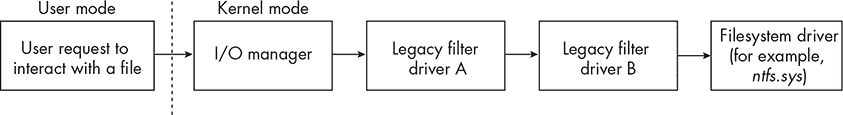
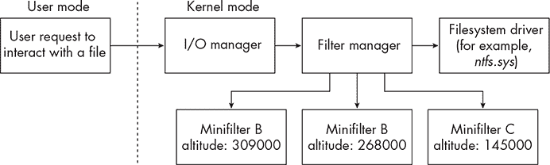

# 6 文件系统小型过滤驱动程序


虽然前几章介绍的驱动程序可以监控系统上的许多重要事件，但它们无法检测到一种特别关键的活动类型：文件系统操作。通过使用文件系统小型过滤驱动程序，或简称*小型过滤器*，终端安全产品可以了解文件的创建、修改、写入和删除情况。

这些驱动程序非常有用，因为它们可以观察攻击者与文件系统的交互，例如将恶意软件写入磁盘。通常，它们与系统的其他组件协同工作。例如，通过与代理扫描引擎的集成，它们可以使 EDR 扫描文件。

小型过滤器当然可以监控本地 Windows 文件系统，即被称为新技术文件系统（NTFS），并由*ntfs.sys*实现。然而，它们也可以监控其他重要的文件系统，包括命名管道，这是一种双向进程间通信机制，由*npfs.sys*实现，以及邮件槽，这是一种单向进程间通信机制，由*msfs.sys*实现。对手工具，特别是指挥与控制代理，往往大量使用这些机制，因此跟踪其活动提供了至关重要的遥测数据。例如，Cobalt Strike 的 Beacon 使用命名管道进行任务分配和点对点代理的链接。

小型过滤器的设计与前几章讨论的驱动程序类似，但本章将介绍它们在 Windows 上的实现、能力和操作的一些独特细节。我们还将讨论攻击者可能利用的规避技术，以干扰这些过滤器。

## 遗留过滤器与过滤器管理器

在微软引入小型过滤器之前，EDR 开发人员会编写遗留过滤器驱动程序来监控文件系统操作。这些驱动程序会直接位于文件系统堆栈上，紧跟在面向文件系统的用户模式调用之前，如图 6-1 所示。



图 6-1：遗留过滤器驱动程序架构

这些驱动程序因开发和在生产环境中的支持而广为人知，难度很大。2019 年发布的一篇名为《理解小型过滤器：文件系统过滤驱动程序为何以及如何发展》的文章（发表于*The NT Insider*）突出了开发者在编写遗留过滤器驱动程序时面临的七大难题：

**过滤器层次结构混乱**

在系统上安装多个遗留过滤器的情况下，架构并未定义这些驱动程序应如何在文件系统堆栈中排序。这使得驱动程序开发者无法知道系统何时加载他们的驱动程序与其他驱动程序的相对顺序。

**缺乏动态加载和卸载功能**

传统过滤驱动程序无法插入到设备堆栈的特定位置，只能加载到堆栈的顶部。此外，传统过滤驱动程序不能轻松卸载，通常需要完全重启系统才能卸载。

**复杂的文件系统堆栈附加与分离**

文件系统堆栈如何附加和分离设备的机制极为复杂，开发者必须拥有大量深奥的知识，才能确保他们的驱动程序能够恰当地处理各种边缘情况。

**无差别的 IRP 处理**

传统过滤驱动程序负责处理发送到设备堆栈的*所有*中断请求包（IRP），无论它们是否对 IRP 感兴趣。

**快速 I/O 数据操作的挑战**

Windows 支持一个用于处理缓存文件的机制，称为*快速 I/O*，它提供了一种替代标准基于数据包的 I/O 模型的方法。它依赖于传统驱动程序中实现的调度表。每个驱动程序处理快速 I/O 请求，并将其传递到堆栈中的下一个驱动程序。如果堆栈中的某个驱动程序缺少调度表，则会禁用整个设备堆栈的快速 I/O 处理。

**无法监控非数据快速 I/O 操作**

在 Windows 中，文件系统与其他系统组件深度集成，例如内存管理器。例如，当用户请求将文件映射到内存时，内存管理器会调用快速 I/O 回调 AcquireFileForNtCreateSection。这些非数据请求始终绕过设备堆栈，使得传统过滤驱动程序难以收集关于它们的信息。直到 Windows XP 引入了 nt!FsRtlRegisterFileSystemFilterCallbacks()，开发者才能请求这些信息。

**递归处理问题**

文件系统大量使用递归，因此文件系统堆栈中的过滤器也必须支持递归。然而，由于 Windows 管理 I/O 操作的方式，这并不容易实现。因为每个请求都会经过整个设备堆栈，如果驱动程序处理递归不当，可能会导致死锁或资源耗尽。

为了解决这些限制，微软引入了过滤器管理器模型。过滤器管理器（*fltmgr.sys*）是一个随 Windows 一起发布的驱动程序，提供过滤器驱动程序在拦截文件系统操作时常用的功能。为了利用这些功能，开发者可以编写最小过滤器。然后，过滤器管理器拦截目标文件系统的请求，并将它们传递给已加载在系统上的最小过滤器，这些过滤器存在于它们自己的排序堆栈中，如图 6-2 所示。

Minifilter 比传统的驱动程序更容易开发，EDR（端点检测和响应）也可以通过在运行系统上动态加载和卸载它们来更轻松地进行管理。通过访问过滤器管理器暴露的功能，Minifilter 使得驱动程序更加简洁，便于维护。微软做出了巨大努力，推动开发人员摆脱传统过滤器模型，转向 Minifilter 模型。它甚至提供了一个可选的注册表值，允许管理员完全阻止传统过滤器驱动程序在系统上的加载。



图 6-2：过滤器管理器和 Minifilter 架构

## Minifilter 架构

Minifilter 在多个方面具有独特的架构。首先是过滤器管理器本身的角色。在传统架构中，文件系统驱动程序会直接过滤 I/O 请求，而在 Minifilter 架构中，过滤器管理器在将请求信息传递给系统中加载的 Minifilter 之前，先处理这一任务。这意味着 Minifilter 仅间接地附加到文件系统堆栈上。此外，它们会向过滤器管理器注册自己感兴趣的特定操作，避免了需要处理所有 I/O 请求。

接下来是它们如何与注册的回调例程进行交互。与前几章讨论的驱动程序一样，Minifilter 可以注册操作前（pre-operation）和操作后（post-operation）回调。当发生支持的操作时，过滤器管理器首先调用每个已加载的 Minifilter 中关联的操作前回调函数。一旦 Minifilter 完成操作前例程，它将控制权返回给过滤器管理器，后者调用下一个驱动程序中的回调函数。当所有驱动程序完成操作前回调后，请求会传递给文件系统驱动程序进行处理。接收到 I/O 请求完成后，过滤器管理器以相反的顺序调用 Minifilter 中的操作后回调函数。操作后回调完成后，控制权会被转交回 I/O 管理器，最终传递回调用应用程序。

每个 Minifilter 都有一个*高度*，这是一个数字，用于标识其在 Minifilter 堆栈中的位置，并决定系统何时加载该 Minifilter。高度解决了困扰传统过滤器驱动程序的排序问题。理想情况下，微软会为生产应用程序的 Minifilter 分配高度，这些值会在驱动程序的注册表键下指定，在Altitude下。微软将高度按加载顺序分组，具体内容请见表 6-1。

表 6-1： 微软的迷你过滤器加载顺序组

| 高度范围 | 加载顺序组名称 | 迷你过滤器角色 |
| --- | --- | --- |
| 420000–429999 | 过滤器 | 传统过滤器驱动程序 |
| 400000–409999 | FSFilter 顶级 | 必须在所有其他过滤器之上附加的过滤器 |
| 360000–389999 | FSFilter 活动监视器 | 观察并报告文件 I/O 的驱动程序 |
| 340000–349999 | FSFilter 恢复删除 | 恢复已删除文件的驱动程序 |
| 320000–329998 | FSFilter 防病毒 | 恶意软件驱动程序 |
| 300000–309998 | FSFilter 复制 | 将数据复制到远程系统的驱动程序 |
| 280000–289998 | FSFilter 持续备份 | 将数据复制到备份介质的驱动程序 |
| 260000–269998 | FSFilter 内容筛选器 | 防止创建特定文件或内容的驱动程序 |
| 240000–249999 | FSFilter 配额管理 | 提供增强文件系统配额，限制卷或文件夹空间的驱动程序 |
| 220000–229999 | FSFilter 系统恢复 | 维护操作系统完整性的驱动程序 |
| 200000–209999 | FSFilter 集群文件系统 | 提供文件服务器元数据的应用程序使用的驱动程序 |
| 180000–189999 | FSFilter HSM | 层级存储管理驱动程序 |
| 170000–174999 | FSFilter 图像处理 | 类似 ZIP 的驱动程序，提供虚拟命名空间 |
| 160000–169999 | FSFilter 压缩 | 文件数据压缩驱动程序 |
| 140000–149999 | FSFilter 加密 | 文件数据加密和解密驱动程序 |
| 130000–139999 | FSFilter 虚拟化 | 文件路径虚拟化驱动程序 |
| 120000–129999 | FSFilter 物理配额管理 | 通过使用物理块计数来管理配额的驱动程序 |
| 100000–109999 | FSFilter 打开文件 | 提供已打开文件快照的驱动程序 |
| 80000–89999 | FSFilter 安全增强 | 应用基于文件的锁定和增强访问控制的驱动程序 |
| 60000–69999 | FSFilter 复制保护 | 检查存储介质上是否存在带外数据的驱动程序 |
| 40000–49999 | FSFilter 底部 | 必须附加在所有其他过滤器下面的过滤器 |
| 20000–29999 | FSFilter 系统 | 保留 |
| <20000 | FSFilter 基础设施 | 为系统使用保留，但最接近文件系统附加 |

大多数 EDR 供应商将其 minifilter 注册到 FSFilter 防病毒或 FSFilter 活动监控器组中。微软发布了注册的高度列表，以及它们关联的文件名和发布者。表 6-2 列出了分配给流行商业 EDR 解决方案的 minifilter 的高度。

表 6-2： 流行 EDR 的高度

| Altitude | Vendor | EDR |
| --- | --- | --- |
| 389220 | Sophos | sophosed.sys |
| 389040 | SentinelOne | sentinelmonitor.sys |
| 328010 | Microsoft | wdfilter.sys |
| 321410 | CrowdStrike | csagent.sys |
| 388360 | FireEye/Trellix | fekern.sys |
| 386720 | Bit9/Carbon Black/VMWare | carbonblackk.sys |

虽然管理员可以更改 minifilter 的高度，但系统一次只能加载一个高度的 minifilter。

## 编写 Minifilter

让我们来了解编写 minifilter 的过程。每个 minifilter 都以一个 DriverEntry() 函数开始，定义方式与其他驱动程序相同。这个函数执行任何必需的全局初始化，然后注册 minifilter。最后，它开始过滤 I/O 操作并返回适当的值。

### 开始注册

这些操作中，最重要的一步是注册，DriverEntry() 函数通过调用 fltmgr!FltRegisterFilter() 来完成。这函数将 minifilter 添加到主机上已注册 minifilter 驱动程序的列表中，并向过滤器管理器提供有关 minifilter 的信息，包括回调例程的列表。该函数的定义见 清单 6-1。

```
NTSTATUS FLTAPI FltRegisterFilter(
 [in] PDRIVER_OBJECT   Driver,
 [in] const FLT_REGISTRATION *Registration,
 [out] PFLT_FILTER   *RetFilter
);
```

清单 6-1：fltmgr!FltRegisterFilter() 函数定义

传递给它的三个参数中，Registration 参数是最有趣的。它是一个指向 FLT_REGISTRATION 结构的指针，该结构在 清单 6-2 中定义，包含关于微过滤器的所有相关信息。

```
typedef struct _FLT_REGISTRATION {
 USHORT          Size;
 USHORT          Version; FLT_REGISTRATION_FLAGS     Flags;
 const FLT_CONTEXT_REGISTRATION    *ContextRegistration;
 const FLT_OPERATION_REGISTRATION    *OperationRegistration;
 PFLT_FILTER_UNLOAD_CALLBACK    FilterUnloadCallback;
 PFLT_INSTANCE_SETUP_CALLBACK   InstanceSetupCallback;
 PFLT_INSTANCE_QUERY_TEARDOWN_CALLBACK  InstanceQueryTeardownCallback;
 PFLT_INSTANCE_TEARDOWN_CALLBACK    InstanceTeardownStartCallback;
 PFLT_INSTANCE_TEARDOWN_CALLBACK    InstanceTeardownCompleteCallback;
 PFLT_GENERATE_FILE_NAME      GenerateFileNameCallback;
 PFLT_NORMALIZE_NAME_COMPONENT    NormalizeNameComponentCallback;
 PFLT_NORMALIZE_CONTEXT_CLEANUP    NormalizeContextCleanupCallback;
 PFLT_TRANSACTION_NOTIFICATION_CALLBACK  TransactionNotificationCallback;
 PFLT_NORMALIZE_NAME_COMPONENT_EX   NormalizeNameComponentExCallback;
 PFLT_SECTION_CONFLICT_NOTIFICATION_CALLBACK  SectionNotificationCallback;
} FLT_REGISTRATION, *PFLT_REGISTRATION;
```

清单 6-2：FLT_REGISTRATION 结构定义

该结构的前两个成员设置了结构的大小，大小始终为 sizeof(FLT_REGISTRATION)，并设置结构修订级别，始终为 FLT_REGISTRATION_VERSION。下一个成员是 *flags*，它是一个位掩码，可能为零或以下三个值的任意组合：

FLTFL_REGISTRATION_DO_NOT_SUPPORT_SERVICE_STOP (1)

微过滤器在请求停止服务时不会被卸载。

FLTFL_REGISTRATION_SUPPORT_NPFS_MSFS (2)

微过滤器支持命名管道和邮件插槽请求。

FLTFL_REGISTRATION_SUPPORT_DAX_VOLUME (4)

该微过滤器支持附加到直接访问（DAX）卷。

紧随其后的是上下文注册。这将是一个 FLT_CONTEXT_REGISTRATION 结构的数组或 null。这些上下文允许微过滤器将相关对象关联起来，并在 I/O 操作之间保持状态。在此上下文数组之后是至关重要的操作注册数组。这是一个可变长度的 FLT_OPERATION_REGISTRATION 结构的数组，这些结构在 清单 6-3 中定义。虽然这个数组在技术上可以为 null，但在 EDR 传感器中很少见到这种配置。微过滤器必须为每种类型的 I/O 提供一个结构，以便它注册预操作或后操作回调例程。

```
typedef struct _FLT_OPERATION_REGISTRATION {
 UCHAR       MajorFunction;
 FLT_OPERATION_REGISTRATION_FLAGS Flags;
 PFLT_PRE_OPERATION_CALLBACK  PreOperation;
 PFLT_POST_OPERATION_CALLBACK  PostOperation;
 PVOID       Reserved1;
} FLT_OPERATION_REGISTRATION, *PFLT_OPERATION_REGISTRATION;
```

清单 6-3：FLT_OPERATION_REGISTRATION 结构定义

第一个参数表示微过滤器感兴趣处理的主要功能。这些是 *wdm.h* 中定义的常量，表 6-3 列出了与安全监控最相关的一些常量。

表 6-3： 主要功能及其目的

| 主要功能 | 目的 |
| --- | --- |
| IRP_MJ_CREATE (0x00) | 正在创建新文件或打开现有文件的句柄。 |
| IRP_MJ_CREATE_NAMED_PIPE (0x01) | 正在创建或打开一个命名管道。 |
| IRP_MJ_CLOSE (0x02) | 正在关闭文件对象的句柄。 |
| IRP_MJ_READ (0x03) | 正在从文件中读取数据。 |
| IRP_MJ_WRITE (0x04) | 正在向文件写入数据。 |
| IRP_MJ_QUERY_INFORMATION (0x05) | 已请求有关文件的信息，如其创建时间。 |
| IRP_MJ_SET_INFORMATION (0x06) | 正在设置或更新文件的信息，如其名称。 |
| IRP_MJ_QUERY_EA (0x07) | 已请求文件的扩展信息。 |
| IRP_MJ_SET_EA (0x08) | 正在设置或更新文件的扩展信息。 |
| IRP_MJ_LOCK_CONTROL (0x11) | 正在对文件加锁，例如通过调用 kernel32!LockFileEx()。 |
| IRP_MJ_CREATE_MAILSLOT (0x13) | 正在创建或打开一个新的邮件插槽。 |
| IRP_MJ_QUERY_SECURITY (0x14) | 正在请求有关文件的安全信息。 |
| IRP_MJ_SET_SECURITY (0x15) | 与文件相关的安全信息正在设置或更新。 |
| IRP_MJ_SYSTEM_CONTROL (0x17) | 一个新的驱动程序已注册为 Windows 管理工具的供应商。 |

结构的下一个成员指定标志位。此位掩码描述了何时应为缓存 I/O 或分页 I/O 操作调用回调函数。写本文时，支持四个标志，所有标志的前缀都是 FLTFL_OPERATION_REGISTRATION_。首先，SKIP_PAGING_IO 表示是否应为基于 IRP 的读或写分页 I/O 操作调用回调。SKIP_CACHED_IO 标志用于防止在基于快速 I/O 的读写缓存 I/O 操作中调用回调。接下来，SKIP_NON_DASD_IO 用于对在直接访问存储设备（DASD）卷句柄上发出的请求。最后，SKIP_NON_CACHED_NON_PAGING_IO 防止在非缓存或非分页 I/O 操作的读写中调用回调。

### 定义预操作回调

FLT_OPERATION_REGISTRATION 结构的接下来两个成员定义了当系统上发生每个目标主要功能时要调用的预操作或后操作回调。预操作回调通过指向 FLT_PRE_OPERATION_CALLBACK 结构的指针传递，后操作例程则指定为指向 FLT_POST_OPERATION_CALLBACK 结构的指针。虽然这些函数的定义并没有太大不同，但它们的功能和限制差异非常大。

与其他类型驱动程序中的回调一样，预操作回调函数允许开发人员在操作到达目标之前（在 minifilter 的情况下为目标文件系统）检查该操作。这些回调函数接收指向操作回调数据的指针，以及一些与当前 I/O 请求相关的 opaque 指针，并返回一个 FLT_PREOP_CALLBACK_STATUS 返回代码。在代码中，这看起来像是清单 6-4 所示的内容。

```
PFLT_PRE_OPERATION_CALLBACK PfltPreOperationCallback;

FLT_PREOP_CALLBACK_STATUS PfltPreOperationCallback(
 [in, out] PFLT_CALLBACK_DATA Data,
 [in]  PCFLT_RELATED_OBJECTS FltObjects,
 [out]  PVOID *CompletionContext
)
{...}
```

清单 6-4：注册预操作回调

第一个参数，Data，是最复杂的一个，包含与 minifilter 正在处理的请求相关的所有主要信息。FLT_CALLBACK_DATA结构由过滤器管理器和 minifilter 共同使用，用于处理 I/O 操作，并包含大量对任何监视文件系统操作的 EDR 代理有用的数据。该结构的一些重要成员包括：

Flags   描述 I/O 操作的位掩码。这些标志可能会由过滤器管理器预设，尽管在某些情况下，minifilter 可能会设置额外的标志。当过滤器管理器初始化数据结构时，它会设置一个标志，指示它代表哪种类型的 I/O 操作：快速 I/O、过滤器操作或 IRP 操作。过滤器管理器还可以设置标志，指示 minifilter 是否生成或重新发出该操作，是否来自非分页池，以及操作是否已完成。

Thread   指向发起 I/O 请求的线程的指针。这对于识别执行操作的应用程序非常有用。

Iopb   包含关于基于 IRP 的操作（例如，IRP_BUFFERED_IO，表示这是一个缓冲 I/O 操作）的信息；主功能代码；与操作相关的特殊标志（例如，SL_CASE_SENSITIVE，该标志通知堆栈中的驱动程序，文件名比较应区分大小写）；指向作为操作目标的文件对象的指针；以及一个包含特定 I/O 操作唯一参数的FLT_PARAMETERS结构体，该结构体由结构中的主功能代码或次功能代码成员指定。

IoStatus   一个结构体，包含由过滤器管理器设置的 I/O 操作的完成状态。

TagData   指向一个FLT_TAG_DATA_BUFFER结构的指针，该结构包含关于重新解析点的信息，例如在 NTFS 硬链接或连接点的情况下。

RequestorMode   一个值，表示请求是来自用户模式还是内核模式。

该结构包含 EDR 代理需要追踪系统中文件操作的大部分信息。传递给预操作回调的第二个参数是指向 FLT_RELATED_OBJECTS 结构的指针，提供补充信息。该结构包含指向与操作相关联的对象的不可透明指针，包括卷、迷你过滤器实例和文件对象（如果存在）。最后一个参数 CompletionContext 包含一个可选的上下文指针，如果迷你过滤器返回 FLT_PREOP_SUCCESS_WITH_CALLBACK 或 FLT_PREOP_SYNCHRONIZE，该指针将传递给相关联的后操作回调。

在例程完成后，迷你过滤器必须返回一个 FLT_PREOP_CALLBACK_STATUS 值。预操作回调可能返回七种支持的值之一：

FLT_PREOP_SUCCESS_WITH_CALLBACK (0)

将 I/O 操作传回过滤器管理器进行处理，并指示它在完成期间调用迷你过滤器的后操作回调。

FLT_PREOP_SUCCESS_NO_CALLBACK (1)

将 I/O 操作传回过滤器管理器进行处理，并指示它在完成期间*不要*调用迷你过滤器的后操作回调。

FLT_PREOP_PENDING (2)

挂起 I/O 操作，并且在迷你过滤器调用 fltmgr!FltCompletePendedPreOperation() 之前，不进一步处理它。

FLT_PREOP_DISALLOW_FASTIO (3)

阻止操作中的快速 I/O 路径。此代码指示过滤器管理器不要将操作传递给栈中当前过滤器下方的任何其他迷你过滤器，并且仅调用在较高层级的驱动程序的后操作回调。

FLT_PREOP_COMPLETE (4)

指示过滤器管理器不要将请求发送到当前驱动栈下方的迷你过滤器，并且仅调用当前驱动栈中上述迷你过滤器的后操作回调。

FLT_PREOP_SYNCHRONIZE (5)

将请求传回过滤器管理器，但不完成它。此代码确保迷你过滤器的后操作回调在 IRQL ≤ *APC_LEVEL* 的原线程上下文中被调用。

FLT_PREOP_DISALLOW_FSFILTER_IO (6)

禁止快速的 QueryOpen 操作，并强制操作走较慢的路径，导致 I/O 管理器使用打开、查询或关闭操作处理该请求。

过滤器管理器在将请求传递给文件系统之前，调用所有为正在处理的 I/O 操作注册了函数的迷你过滤器的前操作回调，从最高的优先级开始。

### 定义后操作回调

在文件系统执行每个迷你过滤器的前操作回调所定义的操作后，控制权会传递到过滤器栈的过滤器管理器。然后，过滤器管理器从最低优先级开始，调用所有迷你过滤器的后操作回调。这些后操作回调的定义与前操作回调例程类似，如列表 6-5 所示。

```
PFLT_POST_OPERATION_CALLBACK PfltPostOperationCallback;

FLT_POSTOP_CALLBACK_STATUS PfltPostOperationCallback(
 [in, out]  PFLT_CALLBACK_DATA Data,
 [in]   PCFLT_RELATED_OBJECTS FltObjects,
 [in, optional] PVOID CompletionContext,
 [in]   FLT_POST_OPERATION_FLAGS Flags
)
{...}
```

列表 6-5：后操作回调例程定义

这里有两个显著的区别：增加了Flags参数和不同的返回类型。迷你过滤器唯一可以传递的已记录标志是FLTFL_POST_OPERATION_DRAINING，它表示迷你过滤器正在卸载过程中。此外，后操作回调可以返回不同的状态。如果回调返回FLT_POSTOP_FINISHED_PROCESSING (*0*)，表示迷你过滤器已完成其后操作回调例程，并将控制权返回给过滤器管理器以继续处理 I/O 请求。如果返回FLT_POSTOP_MORE_PROCESSING_REQUIRED (*1*)，表示迷你过滤器已将基于 IRP 的 I/O 操作发布到工作队列，并暂停请求的完成，直到工作项完成，然后调用fltmgr!FltCompletePendedPostOperation()。最后，如果返回FLT_POSTOP_DISALLOW_FSFILTER_IO (*2*)，表示迷你过滤器不允许快速QueryOpen操作，并强制该操作走较慢的路径。这与FLT_PREOP_DISALLOW_FSFILTER_IO相同。

后操作回调有一些显著的限制，减少了它们在安全监控中的可行性。首先，它们会在任意线程中调用，除非前操作回调传递了FLT_PREOP_SYNCHRONIZE标志，防止系统将操作归因于请求的应用程序。接下来是，后操作回调在 IRQL ≤ *DISPATCH_LEVEL* 时调用。这意味着某些操作受到限制，包括访问大多数同步原语（例如互斥锁）、调用需要 IRQL ≤ *DISPATCH_LEVEL*的内核 API，以及访问分页内存。解决这些限制的一种方法是通过使用fltmgr!FltDoCompletionProcessingWhenSafe()延迟后操作回调的执行，但该解决方案也有其挑战。

这些FLT_OPERATION_REGISTRATION结构体数组作为FLT_REGISTRATION的<code>OperationRegistration</code>成员传递，可能如下所示：列表 6-6。

```
const FLT_OPERATION_REGISTRATION Callbacks[] = {
 {IRP_MJ_CREATE, 0, MyPreCreate, MyPostCreate},
 {IRP_MJ_READ, 0, MyPreRead, NULL},
 {IRP_MJ_WRITE, 0, MyPreWrite, NULL},
 {IRP_MJ_OPERATION_END}
};
```

列表 6-6：一个操作注册回调结构体数组

该数组为IRP_MJ_CREATE注册了前后操作回调，为IRP_MJ_READ和IRP_MJ_WRITE仅注册了前操作回调。对于任何目标操作都没有传入标志。此外，请注意数组中的最后一个元素是IRP_MJ_OPERATION_END。微软要求该值出现在数组的末尾，并且在监控上下文中没有功能用途。

### 定义可选回调

FLT_REGISTRATION 结构体中的最后一部分包含了可选的回调函数。前三个回调函数：FilterUnloadCallback、InstanceSetupCallback 和 InstanceQueryTeardownCallback，技术上都可以为空，但这将对迷你过滤器和系统行为产生一定的限制。例如，系统将无法卸载该迷你过滤器或附加新的文件系统卷。结构体中该部分的其他回调函数与迷你过滤器提供的各种功能相关。例如，拦截文件名请求（GenerateFileNameCallback）和文件名规范化（NormalizeNameComponentCallback）。通常，只有前三个半可选的回调函数会被注册，其余的很少使用。

### 激活迷你过滤器

在设置完所有回调例程后，创建的 FLT_REGISTRATION 结构体的指针作为第二个参数传递给 fltmgr!FltRegisterFilter()。该函数完成后，会返回一个不透明的过滤器指针 (PFLT_FILTER) 给调用者，返回值保存在 RetFilter 参数中。这个指针唯一标识了该迷你过滤器，并且只要驱动程序在系统中加载，该指针将保持不变。这个指针通常会作为全局变量保留。

当 minifilter 准备开始处理事件时，它将<sup class="SANS_TheSansMonoCd_W5Regular_11">PFLT_FILTER</sup>指针传递给<sup class="SANS_TheSansMonoCd_W5Regular_11">fltmgr!FltStartFilter()</sup>。这会通知过滤器管理器，驱动程序已准备好附加到文件系统卷并开始过滤 I/O 请求。此函数返回后，minifilter 将被视为活动，并插入所有相关的文件系统操作中。<sup class="SANS_TheSansMonoCd_W5Regular_11">FLT_REGISTRATION</sup>结构中注册的回调函数将根据其关联的主要功能进行调用。每当 minifilter 准备卸载时，它会将<sup class="SANS_TheSansMonoCd_W5Regular_11">PFLT_FILTER</sup>指针传递给<sup class="SANS_TheSansMonoCd_W5Regular_11">fltmgr!FltUnregisterFilter()</sup>，以移除 minifilter 在文件、卷和其他组件上设置的任何上下文，并调用注册的<sup class="SANS_TheSansMonoCd_W5Regular_11">InstanceTeardownStartCallback</sup>和<sup class="SANS_TheSansMonoCd_W5Regular_11">InstanceTeardownCompleteCallback</sup>函数。

## <sup class="SANS_Futura_Std_Bold_B_11">管理一个 Minifilter</sup>

与其他驱动程序的工作相比，安装、加载和卸载 minifilter 的过程需要特别考虑。这是因为 minifilter 在设置注册表值方面有特定的要求。为了简化安装过程，微软建议通过*设置信息（INF）*文件来安装 minifilter。这些 INF 文件的格式超出了本书的讨论范围，但有一些与 minifilter 工作相关的有趣细节，值得一提。

在 INF 文件的<sup class="SANS_TheSansMonoCd_W5Regular_11">Version</sup>部分，<sup class="SANS_TheSansMonoCd_W5Regular_11">ClassGuid</sup>条目是一个 GUID，它对应于所需的加载顺序组（例如，<sup class="SANS_TheSansMonoCd_W5Regular_11">FSFilter Activity Monitor</sup>）。在文件的<sup class="SANS_TheSansMonoCd_W5Regular_11">AddRegistry</sup>部分，指定了要创建的注册表键，你将找到有关 minifilter 的高度信息。此部分可能包含多个类似的条目，以描述系统应在哪些位置加载 minifilter 的不同实例。高度可以设置为在 INF 文件的<sup class="SANS_TheSansMonoCd_W5Regular_11">Strings</sup>部分中定义的变量名称（例如，<sup class="SANS_TheSansMonoCd_W5Regular_11">%MyAltitude%</sup>）。最后，<sup class="SANS_TheSansMonoCd_W5Regular_11">ServiceType</sup>条目位于<sup class="SANS_TheSansMonoCd_W5Regular_11">ServiceInstall</sup>部分，总是设置为<sup class="SANS_TheSansMonoCd_W5Regular_11">SERVICE_FILE_SYSTEM_DRIVER</sup> <sup class="SANS_TheSansMonoCd_W5Regular_11">(2)</sup>。

执行 INF 安装程序会安装驱动程序，将文件复制到指定位置并设置所需的注册表键。示例 6-7 显示了 *WdFilter*（微软 Defender 的 minifilter 驱动程序）在注册表键中的配置示例。

```
PS > **Get-ItemProperty -Path "HKLM:\SYSTEM\CurrentControlSet\Services\WdFilter\" | Select *** 
**-Exclude PS* | fl**

DependOnService : {FltMgr}
Description  : @%ProgramFiles%\Windows Defender\MpAsDesc.dll,-340
DisplayName  : @%ProgramFiles%\Windows Defender\MpAsDesc.dll,-330
ErrorControl  : 1
Group    : FSFilter Anti-Virus
ImagePath   : system32\drivers\wd\WdFilter.sys
Start    : 0
SupportedFeatures : 7
Type    : 2 PS > **Get-ItemProperty -Path "HKLM:\SYSTEM\CurrentControlSet\Services\WdFilter\Instances\**
**WdFilter Instance" | Select * -Exclude PS* | fl**

Altitude : 328010
Flags : 0
```

示例 6-7：使用 PowerShell 查看 WdFilter 的高度

Start 键决定了 minifilter 何时被加载。该服务可以通过服务控制管理器 API 启动和停止，也可以通过如 *sc.exe* 或服务管理单元等客户端进行管理。此外，我们还可以通过过滤器管理器库 *FltLib* 来管理 minifilter，该库由 *fltmc.exe* 实用程序提供，默认包含在 Windows 中。此设置还包括设置 minifilter 的高度，对于 *WdFilter* 来说，高度为 328010。

## 通过 Minifilters 检测对抗者技术

现在你已经理解了 minifilter 的内部工作原理，让我们来探讨它们是如何帮助检测系统中的攻击的。如在“编写 Minifilter”一节中所讨论的，第 108 页，minifilter 可以注册针对任何文件系统的操作前或操作后回调，包括 NTFS、命名管道和邮件槽。这为 EDR 提供了一个极其强大的传感器，用于检测主机上的对抗者活动。

### 文件检测

如果对抗者与文件系统进行交互，例如创建新文件或修改现有文件的内容，minifilter 就有机会检测到这种行为。现代攻击倾向于避免直接将工件丢到主机文件系统中，采用“磁盘即熔岩”的思维方式，但许多黑客工具由于所使用的 API 限制，仍然继续与文件进行交互。例如，考虑 dbghelp!MiniDumpWriteDump()，这是一个用于创建进程内存转储的函数。此 API 要求调用者传入一个文件句柄，用于写入转储数据。如果攻击者想使用这个 API，就必须与文件进行交互，因此任何处理 IRP_MJ_CREATE 或 IRP_MJ_WRITE I/O 操作的 minifilter 都可以间接检测到这些内存转储操作。

此外，攻击者无法控制写入文件的数据格式，这使得微筛选器能够与扫描器协作，检测内存转储文件，而无需使用函数挂钩。攻击者可能试图通过打开现有文件的句柄并将目标进程的内存转储覆盖其内容来规避这一点，但监控IRP_MJ_CREATE的微筛选器仍然能够检测到这一活动，因为无论是创建新文件还是打开现有文件的句柄都会触发该请求。

一些防御者使用这些概念来实现*文件系统金丝雀*。这些是创建在关键位置的文件，用户应该很少甚至永远不会与其交互。如果除了备份代理或 EDR 之外的应用程序请求打开金丝雀文件的句柄，微筛选器可以立即采取行动，包括使系统崩溃。文件系统金丝雀提供了强大的（虽然有时是残酷的）反勒索软件控制，因为勒索软件往往会肆意加密主机上的文件。通过将金丝雀文件放置在文件系统中深层的目录中，这些文件对用户隐藏，但仍位于勒索软件通常会攻击的路径之一，EDR 可以将损害限制在勒索软件接触到金丝雀之前所加密的文件。

### 命名管道检测

另一种对抗性技巧，微筛选器可以高效检测的关键手段是命名管道的使用。许多指挥控制代理，如 Cobalt Strike 的 Beacon，都使用命名管道进行任务分配、I/O 操作和链接。其他攻击技术，例如使用令牌冒充进行特权升级的技术，也围绕创建命名管道展开。在这两种情况下，监控IRP_MJ_CREATE_NAMED_PIPE请求的微筛选器能够检测攻击者的行为，方式与通过IRP_MJ_CREATE检测文件创建相似。

微筛选器通常会寻找创建异常命名的管道，或者那些来自不典型进程的管道。这是有用的，因为许多对手使用的工具依赖于命名管道的使用，所以想要伪装的攻击者会选择在环境中典型的管道和主机进程名称。幸运的是，对于攻击者和防御者来说，Windows 使得枚举现有命名管道变得容易，我们可以直接识别出许多常见的进程与管道之间的关系。在安全领域，最著名的命名管道之一是*mojo*。当 Chromium 进程启动时，它会创建多个命名管道，格式为*mojo.PID.TID.VALUE*，供一个名为 Mojo 的 IPC 抽象库使用。这个命名管道因其被纳入一个著名的文档库来记录 Cobalt Strike 的可变配置选项而变得流行。

使用这个特定的命名管道存在一些问题，最小过滤器可以检测到。其中一个主要问题与管道名称的结构化格式有关。由于 Cobalt Strike 的管道名称是与可变配置文件实例相关联的静态属性，它在运行时是不可更改的。这意味着对手需要准确预测其 Beacon 的进程和线程 ID，以确保其进程的属性与 Mojo 使用的管道名称格式匹配。请记住，带有预操作回调的最小过滤器，用于监控 IRP_MJ_CREATE_NAMED_PIPE 请求时，保证会在调用线程的上下文中被触发。这意味着当 Beacon 进程创建 “mojo” 命名管道时，最小过滤器可以检查其当前上下文是否与管道名称中的信息匹配。为了演示这一点，伪代码如下所示 列表 6-8。

```
DetectMojoMismatch(string mojoPipeName)
{
 pid = GetCurrentProcessId();
 tid = GetCurrentThreadId(); ❶ if (!mojoPipeName.beginsWith("mojo. " + pid + "." + tid + "."))

  {
  // Bad Mojo pipe found
  }
}
```

列表 6-8：检测异常 Mojo 命名管道

由于 Mojo 命名管道使用的格式已知，我们可以简单地将创建命名管道的线程的 PID 和 TID ❶ 连接起来，确保它们与预期匹配。如果不匹配，我们可以采取一些防御措施。

并不是 Beacon 中的每个命令都会创建命名管道。有些函数会创建匿名管道（即没有名称的管道），比如 execute-assembly。这类管道的操作性有限，因为它们的名称无法被引用，代码只能通过打开的句柄与其交互。然而，它们在功能上的不足换来了更强的隐蔽性。

Riccardo Ancarani 的博客文章《通过命名管道分析检测 Cobalt Strike 默认模块》详细描述了与 Beacon 使用匿名管道相关的 OPSEC 考虑。在他的研究中，他发现尽管 Windows 组件很少使用匿名管道，但它们的创建是可以被分析的，而且创建者可以作为有效的 *spawnto* 二进制文件使用。这些包括 *ngen.exe*、*wsmprovhost.exe* 和 *firefox.exe* 等。通过将其牺牲进程设置为这些可执行文件之一，攻击者可以确保任何导致匿名管道创建的操作很可能不会被检测到。

然而，请记住，利用命名管道的活动仍然会容易被检测到，因此操作员需要将其技术限制在仅创建匿名管道的活动上。

## 规避最小过滤器

规避 EDR 最小过滤器的策略通常依赖于三种技术之一：卸载、预防或干扰。让我们通过一些例子来展示如何利用这些技术为自己谋取优势。

### 卸载

第一个技术是完全卸载 minifilter。虽然你需要管理员访问权限才能执行此操作（特别是<sup class="SANS_TheSansMonoCd_W5Regular_11">SeLoadDriverPrivilege</sup>令牌权限），但这是避开 minifilter 的最可靠方法。毕竟，如果驱动程序不再堆栈中，它就无法捕获事件。

卸载 minifilter 可能像调用<sup class="SANS_TheSansMonoCd_W5Regular_11">fltmc.exe</sup> <sup class="SANS_TheSansMonoCd_W5Regular_11">unload</sup>一样简单，但如果厂商付出了大量努力隐藏其 minifilter 的存在，可能需要复杂的定制工具。为了进一步探索这一点，让我们以 Sysmon 为目标，其 minifilter *SysmonDrv* 配置在注册表中，如 Listing 6-9 所示。

```
PS > **Get-ItemProperty -Path "HKLM:\SYSTEM\CurrentControlSet\Services\SysmonDrv" | Select *** 
**-Exclude PS* | fl**

Type   : 1
Start  : 0
ErrorControl : 1
ImagePath : SysmonDrv.sys
DisplayName : SysmonDrv
Description : System Monitor driver

PS > **Get-ItemProperty -Path "HKLM:\SYSTEM\CurrentControlSet\Services\SysmonDrv\Instances\**
**Sysmon Instance\" | Select * -Exclude PS* | fl**

Altitude : 385201
Flags : 0
```

Listing 6-9：使用 PowerShell 查看 SysmonDrv 的配置

默认情况下，*SysmonDrv*的高度为 385201，我们可以通过调用<sup class="SANS_TheSansMonoCd_W5Regular_11">fltmc.exe unload SysmonDrv</sup>轻松卸载它，前提是调用者具有所需的权限。这样做会产生一个*FilterManager*事件 ID 为 1，表示文件系统过滤器已被卸载，同时产生一个 Sysmon 事件 ID 为 255，表示驱动程序通信失败。然而，Sysmon 将不再接收到事件。

为了增加攻击者的难度，minifilter 有时会使用随机的服务名称来掩盖其在系统上的存在。以 Sysmon 为例，管理员可以通过在安装时向安装程序传递<sup class="SANS_TheSansMonoCd_W5Regular_11">-d</sup>标志并指定一个新名称来实现这种方法。这可以防止攻击者使用内置的*fltmc.exe*工具，除非他们能够识别出服务名称。

然而，攻击者可以利用生产环境 minifilters 的另一个特性来定位驱动程序并卸载它：它们的高度。因为微软为某些厂商保留了特定的高度，攻击者可以学习这些值，然后简单地遍历注册表或使用<sup class="SANS_TheSansMonoCd_W5Regular_11">fltlib!FilterFindNext()</sup>来定位具有特定高度的驱动程序。我们不能使用*fltmc.exe*根据高度卸载 minifilters，但我们可以在注册表中解析驱动程序的名称，或者将 minifilter 的名称传递给<sup class="SANS_TheSansMonoCd_W5Regular_11">fltlib!FilterUnload()</sup>，对于使用<sup class="SANS_TheSansMonoCd_W5Regular_11">fltlib!FilterFindNext()</sup>的工具来说，这是一种可行的方式。这就是 Shhmon 工具在背后如何工作，用于追踪并卸载*SysmonDrv*。

防御者可以通过修改 minifilter 的高度进一步阻止攻击者。然而，在生产环境中不推荐这样做，因为其他应用程序可能已经在使用所选择的值。EDR 代理有时会在数百万台设备上运行，这增加了高度冲突的可能性。为了降低这种风险，供应商可能会从 Microsoft 编译一个活动 minifilter 分配列表，并选择一个尚未使用的值，尽管这种策略并非万无一失。

在 Sysmon 的情况下，防御者可以通过修改安装程序，在安装时将高度值设置为不同的值，或者通过直接修改注册表值在安装后手动更改高度。由于 Windows 对高度没有任何技术控制，工程师可以将*SysmonDrv*移到任何他们希望的位置。然而，值得注意的是，高度影响 minifilter 在堆栈中的位置，因此选择过低的值可能会对工具的有效性产生意想不到的影响。

即使应用了所有这些混淆方法，攻击者仍然可以卸载 minifilter。从 Windows 10 开始，供应商和 Microsoft 必须在加载驱动程序到系统之前对其进行签名，且这些签名用于识别驱动程序，其中包含签名供应商的信息。此信息通常足以使对手察觉到目标 minifilter 的存在。在实际操作中，攻击者可以遍历注册表，或者使用 fltlib!FilterFindNext() 方法枚举 minifilter，提取磁盘上驱动程序的路径，并解析所有枚举文件的数字签名，直到他们找出一个由 EDR 签名的文件。到那时，他们可以使用之前介绍的方法卸载 minifilter。

正如你刚刚了解到的那样，目前并没有特别好的方法来隐藏系统上的 minifilter。然而，这并不意味着这些混淆方法毫无价值。攻击者可能缺乏工具或知识来对抗这些混淆，从而为 EDR 的传感器提供了在不受干扰的情况下检测其活动的时间。

### 预防

为了防止文件系统操作经过 EDR 的 minifilter，攻击者可以注册他们自己的 minifilter，并用它强制完成 I/O 操作。例如，我们可以为 IRP_MJ_WRITE 请求注册一个恶意的预操作回调，如 列表 6-10 所示。

```
PFLT_PRE_OPERATION_CALLBACK EvilPreWriteCallback;

FLT_PREOP_CALLBACK_STATUS EvilPreWriteCallback(
 [in, out] PFLT_CALLBACK_DATA Data,
 [in] PCFLT_RELATED_OBJECTS FltObjects,
 [out] PVOID *CompletionContext
)
{
 `--snip--`
}
```

列表 6-10：注册恶意的预操作回调例程

当过滤器管理器调用此回调例程时，它必须返回一个 FLT_PREOP_CALLBACK_STATUS 值。可能的值之一是 FLT_PREOP_COMPLETE，它告诉过滤器管理器当前微过滤器正在完成请求，因此请求不应再传递给任何低于当前高度的微过滤器。如果微过滤器返回此值，它必须将 NTSTATUS 值设置到 I/O 状态块的 Status 成员，表示操作的最终状态。那些微过滤器与用户模式扫描引擎通信的杀毒引擎通常会使用此功能来确定是否有恶意内容正在写入文件。如果扫描器通知微过滤器内容是恶意的，微过滤器将完成请求并返回失败状态，例如 STATUS_VIRUS_INFECTED，并将其返回给调用者。

但攻击者可以利用这个微过滤器的特性，阻止安全代理拦截它们的文件系统操作。通过我们之前注册的回调，效果可能类似于清单 6-11 中所示的内容。

```
FLT_PREOP_CALLBACK_STATUS EvilPreWriteCallback(
  [in, out] PFLT_CALLBACK_DATA Data,
  [in]  PCFLT_RELATED_OBJECTS FltObjects,
  [out]  PVOID *CompletionContext
)
{
 `--snip--`
  if (IsThisMyEvilProcess(PsGetCurrentProcessId())
  {
        `--snip--`
     ❶  Data->IoStatus.Status = STATUS_SUCCESS;
        return FLT_PREOP_COMPLETE
    }
 `--snip--`
}
```

清单 6-11：拦截写操作并强制完成

攻击者首先将其恶意微过滤器插入到比 EDR 所有的微过滤器更高的高度。恶意微过滤器的预操作回调中将包含逻辑，用于完成来自对手进程的 I/O 请求❶，从而防止这些请求传递到堆栈下方的 EDR。

### 干扰

最终的规避技术——干扰，围绕着微过滤器可以在请求时修改传递给其回调的 FLT_CALLBACK_DATA 结构体的成员。攻击者可以修改该结构体中的任何成员，除了 RequestorMode 和 Thread 成员。这包括 FLT_IO_PARAMETER_BLOCK 结构体中的 TargetFileObject 成员。恶意微过滤器的唯一要求是它必须调用 fltmgr!FltSetCallbackDataDirty()，该函数会在将请求传递给堆栈下方的微过滤器时，指示回调数据结构已被修改。

攻击者可以利用这种行为，通过将自己插入到堆栈中的任何位置，修改与请求相关的数据并将控制权返回给过滤器管理器，从而向与 EDR 相关联的 minifilter 传递虚假数据。接收到修改后的请求的 minifilter 可能会评估是否存在 FLTFL_CALLBACK_DATA_DIRTY，该标志由 fltmgr!FltSetCallbackDataDirty() 设置，并据此采取行动，但数据仍然会被修改。

## 结论

Minifilter 是 Windows 上监控文件系统活动的事实标准，无论是 NTFS、命名管道还是邮件插槽。它们的实现比本书早些章节中讨论的驱动程序更复杂一些，但它们的工作原理非常相似；它们位于某些系统操作的内联位置，接收关于活动的数据。攻击者可以通过利用传感器中的某些逻辑问题或完全卸载驱动程序来规避 minifilter，但大多数对手已经调整了他们的技术，极大地限制了在磁盘上创建新工件的可能性，从而减少了 minifilter 识别其活动的机会。
