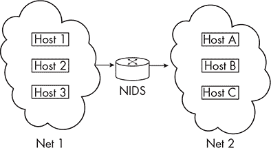
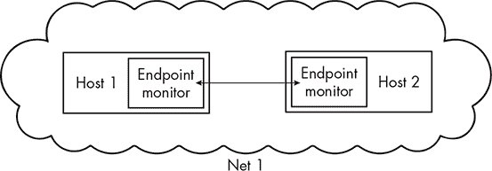
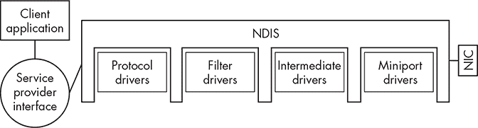
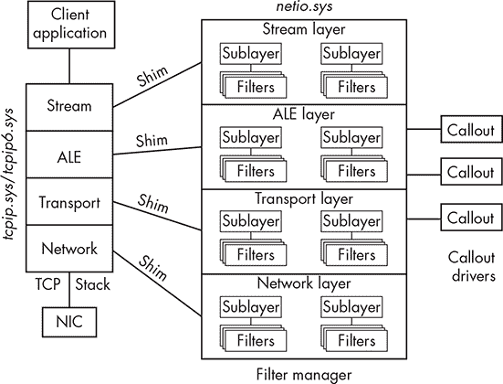
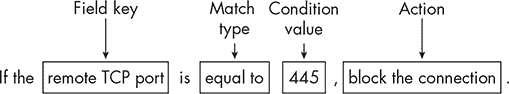

# 7 网络过滤驱动程序


有时，EDR（端点检测与响应）必须实现自己的传感器，以捕获由某些系统组件生成的遥测数据。文件系统迷你过滤器就是其中的一个例子。在 Windows 中，网络堆栈也是如此。

基于主机的安全代理可能希望捕获网络遥测数据，原因有很多。网络流量与攻击者获得系统初始访问权限的最常见方式密切相关（例如，当用户访问恶意网站时）。它也是攻击者进行横向移动、从一台主机跳到另一台主机时产生的关键证据之一。如果端点安全产品希望捕获并检查网络数据包，它很可能会实现某种类型的网络过滤驱动程序。

本章介绍了一种用于捕获网络遥测数据的常见驱动程序框架：Windows 过滤平台（WFP）。Windows 网络堆栈和驱动程序生态系统对于新手来说可能有些复杂，因此为了减少头痛的可能性，我们将简要介绍核心概念，然后仅关注与 EDR 传感器相关的部分。

## 基于网络与基于端点的监控

你可能认为，检测恶意流量的最佳方式是使用基于网络的安全设备，但事实并非总是如此。这些网络设备的有效性取决于它们在网络中的位置。例如，网络入侵检测系统（NIDS）需要位于主机 A 和主机 B 之间，才能检测到它们之间的横向移动。

假设攻击者必须跨越核心网络边界（例如，从 VPN 子网移动到数据中心子网）。在这种情况下，安全工程师可以通过战略性地在所有流量必须经过的逻辑瓶颈点部署设备。这种面向边界的架构看起来类似于图 7-1 所示的架构。



图 7-1：两个网络之间的 NIDS

那么，如何处理子网内的横向移动，比如工作站之间的移动呢？在本地网络的每个节点之间部署一个网络监控设备并不具有成本效益，但安全团队仍然需要这些遥测数据来检测网络中的敌对活动。

这时，基于端点的流量监控传感器发挥了作用。通过在每个客户端上部署监控传感器，安全团队可以解决在网络中何处插入设备的问题。毕竟，如果传感器在客户端监控流量，如图 7-2 所示，它实际上在客户端与客户端可能通信的所有其他系统之间建立了中间人关系。



图 7-2：端点网络监控

使用基于端点的监控比基于网络的解决方案提供了另一个宝贵的优势：上下文。因为运行在端点上的代理程序可以收集额外的基于主机的信息，它可以描绘出网络流量生成的更完整图景，帮助解释其原因和方式。例如，它可以判断一个具有特定 PID 的*outlook.exe*的子进程每 60 秒与一个内容分发网络的端点进行一次通信；这可能是与初始访问相关的命令与控制信标。

基于主机的传感器可以获取与源进程、用户上下文以及连接发生前的活动相关的数据。相比之下，部署在网络上的设备只能看到与连接相关的度量信息，如源和目的地、数据包频率以及协议。虽然这可以为响应者提供有价值的数据，但它缺少一些关键的资讯，这些资讯将有助于他们的调查。

## 传统网络驱动接口规范驱动程序

有许多类型的网络驱动程序，其中大多数由网络驱动接口规范（NDIS）支持。NDIS 是一个抽象设备网络硬件的库。它还定义了一个标准接口，用于连接*分层*网络驱动程序（即操作系统不同网络层和级别上的驱动程序）并保持状态信息。NDIS 支持四种类型的驱动程序：

**迷你端口**   管理网络接口卡，例如发送和接收数据。这是 NDIS 驱动程序的最低层级。

**协议**   实现传输协议栈，如 TCP/IP。这是 NDIS 驱动程序的最高层级。

**过滤**   位于迷你端口和协议驱动程序之间，用于监控和修改两者之间的交互。

**中间**   位于迷你端口和协议驱动程序之间，暴露两者的入口点以进行通信请求。这些驱动程序暴露一个虚拟适配器，协议驱动程序将数据包发送到该适配器。然后，中间驱动程序将数据包发送到相应的迷你端口。迷你端口完成操作后，中间驱动程序将信息返回给协议驱动程序。这些驱动程序通常用于在多个网络接口卡之间进行负载均衡流量。

这些驱动程序与 NDIS 的交互可以在图 7-3 中的（极其简化的）图示中看到。

从安全监控的角度来看，过滤驱动程序最为有效，因为它们可以在网络栈的最低层捕获网络流量，正当流量被传递到迷你端口和相关的网络接口卡之前。然而，这些驱动程序也带来一些挑战，如代码复杂度较高、对网络和传输层的支持有限以及安装过程困难。



图 7-3：NDIS 驱动关系

但是，谈到安全监控时，过滤驱动程序的最大问题可能是它们缺乏上下文。虽然它们可以捕获正在处理的流量，但它们并不了解调用者的上下文（发起请求的进程），并且缺少为 EDR 代理提供有价值遥测数据所需的元数据。因此，EDR 几乎总是使用另一个框架：Windows 过滤平台（WFP）。

## Windows 过滤平台

WFP 是一组用于创建网络过滤应用程序的 API 和服务，包含了用户模式和内核模式的组件。它的设计目的是取代包括 NDIS 过滤器在内的传统过滤技术，最早从 Windows Vista 和 Server 2008 开始使用。虽然 WFP 在网络性能方面有一些缺点，但它通常被认为是创建过滤驱动程序的最佳选择。甚至 Windows 防火墙本身也是基于 WFP 构建的。

该平台提供了许多优点。它允许 EDR（端点检测与响应）过滤与特定应用程序、用户、连接、网络接口卡和端口相关的流量。它支持 IPv4 和 IPv6，提供引导时的安全性，直到基础过滤引擎启动，并允许驱动程序过滤、修改并重新注入流量。它还可以处理解密前后的 IPsec 数据包，并集成硬件卸载，允许过滤驱动程序使用硬件进行数据包检查。

WFP 的实现可能比较难以理解，因为它有一个复杂的架构，并且使用了独特的名称来表示其核心组件，这些组件分布在用户模式和内核模式中。WFP 的架构大致如下所示，在图 7-4 中可以看到。

为了理解这一切，我们可以跟踪来自连接到互联网服务器的客户端的 TCP 流。客户端首先调用一个函数，如 WS2_32!send() 或 WS2_32!WSASend() 来通过已连接的套接字发送数据。这些函数最终将数据包传递给由 *tcpip.sys*（用于 IPv4）和 *tcpip6.sys*（用于 IPv6）提供的网络栈。

当数据包穿越网络栈时，它会被传递到与栈的相关层（如流层）关联的 shim。*Shim* 是内核组件，具有几个关键功能。它们的首要任务之一是从数据包中提取数据和属性，并将它们传递给过滤引擎，以启动过滤过程。



图 7-4：WFP 架构

### 过滤引擎

过滤器引擎，有时为了避免与用户模式的*基本过滤引擎*混淆，称为*通用过滤引擎*，在网络层和传输层执行过滤。它有自己的层次结构，这些层是用来组织过滤器集合的容器。每一层都被定义为 GUID，底层有一个模式说明可以添加哪些类型的过滤器。层次结构还可以进一步细分为子层，用于管理过滤冲突。（例如，假设在同一主机上配置了“打开端口 1028”和“阻止所有大于 1024 的端口”这两条规则。）所有层次都继承了默认的子层，开发人员也可以添加自己的子层。

### 过滤器仲裁

你可能会好奇，过滤器引擎是如何知道评估子层和过滤器的顺序的。如果规则是随机应用到流量上的，这可能会引发严重问题。例如，假设第一个规则是默认拒绝，丢弃所有流量。为了解决这个问题，子层和过滤器可以被分配一个优先级值，叫做*权重*，它决定了过滤器管理器应该按什么顺序处理它们。这个排序逻辑被称为*过滤器仲裁*。

在过滤器仲裁过程中，过滤器会按照优先级从高到低评估从数据包中解析出来的数据，以确定如何处理该数据包。每个过滤器都包含条件和动作，类似于常见的防火墙规则（例如，“如果目标端口是 4444，阻止该数据包”或“如果应用程序是*edge.exe*，允许该数据包”）。过滤器可以返回的基本动作有*阻止*和*允许*，但还有三种支持的其他动作，将数据包的详细信息传递给调用驱动程序：FWP_ACTION_CALLOUT_TERMINATING、FWP_ACTION_CALLOUT_INSPECTION和FWP_ACTION_CALLOUT_UNKNOWN。

### 调用驱动程序

调用驱动程序是第三方驱动程序，它扩展了 WFP 的过滤功能，超出了基本过滤器的范围。这些驱动程序提供了深度包检查、家长控制和数据日志记录等高级功能。当 EDR 供应商有意捕获网络流量时，通常会部署调用驱动程序来监控系统。

和基本过滤器一样，调用驱动程序可以选择它们感兴趣的流量类型。当与特定操作关联的调用驱动程序被调用时，它们可以根据其独特的内部处理逻辑建议对数据包采取某种动作。调用驱动程序可以允许某些流量、阻止它、继续处理它（即传递给其他调用驱动程序）、延迟处理、丢弃它或不做任何处理。这些动作只是建议，驱动程序可能会在过滤器仲裁过程中覆盖这些建议。

当过滤仲裁结束时，结果将返回给 shim，它将根据最终的过滤决策采取行动（例如，允许数据包离开主机）。

## 实现 WFP Callout 驱动程序

当 EDR 产品希望拦截并处理主机上的网络流量时，它最有可能使用 WFP Callout 驱动程序。这些驱动程序必须遵循一个相对复杂的工作流程来设置其 callout 函数，但考虑到数据包在网络栈和过滤管理器中的传递方式，这个流程应该是可以理解的。这些驱动程序也比它们的传统 NDIS 对应物要容易处理得多，微软的文档对于希望将此功能添加到其传感器阵列中的 EDR 开发人员非常有帮助。

### 打开过滤引擎会话

像其他类型的驱动程序一样，WFP Callout 驱动程序的初始化从其内部的 DriverEntry() 函数开始。Callout 驱动程序将执行的第一项操作是，WFP 特有的行为——与过滤引擎打开会话。为此，驱动程序调用 fltmgr!FwpmEngineOpen()，该函数的定义见清单 7-1。

```
DWORD FwpmEngineOpen0(
  [in, optional] const wchar_t             *serverName,
  [in]           UINT32                    authnService,
  [in, optional] SEC_WINNT_AUTH_IDENTITY_W *authIdentity,
  [in, optional] const FWPM_SESSION0       *session,
  [out]          HANDLE                    *engineHandle
);
```

清单 7-1：fltmgr!FwpmEngineOpen() 函数定义

传递给此函数的最显著的输入参数是 authnService，它决定使用的身份验证服务。它可以是 RPC_C_AUTHN_WINNT 或 RPC_C_AUTHN_DEFAULT，两者本质上都只是告诉驱动程序使用 NTLM 身份验证。当该函数成功完成时，过滤引擎的句柄将通过 engineHandle 参数返回，并通常保存在全局变量中，因为驱动程序在卸载过程中需要该句柄。

### 注册 Callouts

接下来，驱动程序注册其 callouts。此操作通过调用 fltmgr!FwpmCalloutRegister() API 完成。在运行 Windows 8 或更高版本的系统中，这个函数会被转换为 fltmgr!FwpsCalloutRegister2()，其定义包含在清单 7-2 中。

```
NTSTATUS FwpsCalloutRegister2(
  [in, out]       void                *deviceObject,
  [in]            const FWPS_CALLOUT2 *callout,
  [out, optional] UINT32              *calloutId
);
```

清单 7-2：fltmgr!FwpsCalloutRegister2() 函数定义

传递给此函数的指向 FWPS_CALLOUT2 结构的指针（通过其 callout 参数）包含有关回调驱动程序内部处理数据包过滤的函数的详细信息。该结构定义见 列表 7-3。

```
typedef struct FWPS_CALLOUT2_ {
  GUID                                 calloutKey;
  UINT32                               flags;
  FWPS_CALLOUT_CLASSIFY_FN2            classifyFn;
  FWPS_CALLOUT_NOTIFY_FN2              notifyFn;
  FWPS_CALLOUT_FLOW_DELETE_NOTIFY_FN0  flowDeleteFn;
} FWPS_CALLOUT2;
```

列表 7-3：FWPS_CALLOUT2 结构定义

notifyFn 和 flowDeleteFn 成员是回调函数，用于在有信息需要传递与回调本身相关或回调处理的数据已经终止时，通知驱动程序。由于这些回调函数与检测工作无关，因此我们不会进一步详细介绍它们。然而，classifyFn 成员是一个指针，指向每当有数据包需要处理时被调用的函数，它包含了用于检查的大部分逻辑。我们将在“通过网络过滤器检测对手手段”一节中详细介绍这些回调函数，详见 第 135 页。

### 将回调函数添加到过滤引擎

定义了回调函数之后，我们可以通过调用 fwpuclnt!FwpmCalloutAdd()，传入之前获取的引擎句柄和指向 FWPM_CALLOUT 结构的指针（该结构显示在 列表 7-4 中）来将回调函数添加到过滤引擎中。

```
typedef struct FWPM_CALLOUT0_ {
  GUID               calloutKey;
  FWPM_DISPLAY_DATA0 displayData;
  UINT32             flags;
  GUID               *providerKey;
  FWP_BYTE_BLOB      providerData;
  GUID               applicableLayer;
  UINT32             calloutId;
} FWPM_CALLOUT0;
```

列表 7-4：FWPM_CALLOUT 结构定义

该结构包含有关回调的数据，例如其可选的友好名称和描述，这些信息存储在其 displayData 成员中，以及回调应分配到的层（例如，FWPM_LAYER_STREAM_V4 用于 IPv4 流）。微软文档中列出了数十个过滤器层标识符，每个标识符通常都有 IPv4 和 IPv6 版本。当驱动程序用于添加回调的函数完成时，它返回一个回调的运行时标识符，该标识符将在卸载时继续使用。

与过滤器层不同，开发人员可以向系统添加自己的子层。在这些情况下，驱动程序将调用fwpuclnt!FwpmSublayerAdd()，该函数接收引擎句柄、指向FWPM_SUBLAYER结构的指针，以及一个可选的安全描述符。作为输入传递的结构包括子层键、一个用于唯一标识子层的GUID、一个可选的友好名称和描述、一个可选的标志，确保子层在重启后仍然存在、子层的权重，以及其他包含与子层关联状态的成员。

### 添加新过滤器对象

驱动程序执行的最后一个操作是向系统添加一个新的过滤器对象。这个过滤器对象是驱动程序在处理连接时评估的规则。要创建一个，驱动程序调用fwpuclnt!FwpmFilterAdd()，传入引擎句柄、指向 sListing 7-5 中所示的FWPM_FILTER结构的指针，以及一个可选的指向安全描述符的指针。

```
typedef struct FWPM_FILTER0_ {
  GUID                   filterKey;
  FWPM_DISPLAY_DATA0     displayData;
  UINT32                 flags;
  GUID                   *providerKey;
  FWP_BYTE_BLOB          providerData;
  GUID                   layerKey; GUID                   subLayerKey;
  FWP_VALUE0             weight;
  UINT32                 numFilterConditions;
  FWPM_FILTER_CONDITION0 *filterCondition;
  FWPM_ACTION0           action;
  union {
    UINT64 rawContext;
    GUID   providerContextKey;
  };
  GUID                   *reserved;
  UINT64                 filterId;
  FWP_VALUE0             effectiveWeight;
} FWPM_FILTER0;
```

列表 7-5：FWPM_FILTER结构定义

FWPM_FILTER结构包含一些值得注意的关键成员。flags成员包含描述过滤器属性的多个标志，例如过滤器是否应在系统重启后保持存在（FWPM_FILTER_FLAG_PERSISTENT）或它是否为启动时过滤器（FWPM_FILTER_FLAG_BOOTTIME）。weight成员定义过滤器相对于其他过滤器的优先级值。numFilterConditions是filterCondition成员中指定的过滤条件的数量，该成员是一个FWPM_FILTER_CONDITION结构的数组，描述了所有过滤条件。为了让调用函数处理事件，所有条件必须为真。最后，action是一个FWP_ACTION_TYPE值，指示如果所有过滤条件都为真，应该执行什么操作。这些操作包括允许、阻止或将请求传递给调用函数。

在这些成员中，filterCondition 是最重要的，因为数组中的每个过滤条件都代表一个独立的“规则”，连接将根据该规则进行评估。每个规则本身由条件值和匹配类型组成。此结构体的定义请参见列表 7-6。

```
typedef struct FWPM_FILTER_CONDITION0_ {
  GUID                 fieldKey;
  FWP_MATCH_TYPE       matchType;
  FWP_CONDITION_VALUE0 conditionValue;
} FWPM_FILTER_CONDITION0;
```

列表 7-6：FWPM_FILTER_CONDITION 结构体定义  

第一个成员，fieldKey，表示要评估的属性。每个过滤层都有其特定的属性，通过 GUID 识别。例如，插入流层的过滤器可以与本地和远程 IP 地址、端口、流量方向（入站或出站）和标志（例如，连接是否使用代理）一起工作。  

matchType 成员指定要执行的匹配类型。这些比较类型在 FWP_MATCH_TYPE 枚举中定义，如列表 7-7 所示，可以匹配字符串、整数、范围和其他数据类型。  

```
typedef enum FWP_MATCH_TYPE_ {
  FWP_MATCH_EQUAL = 0,
  FWP_MATCH_GREATER,
  FWP_MATCH_LESS,
  FWP_MATCH_GREATER_OR_EQUAL,
  FWP_MATCH_LESS_OR_EQUAL,
  FWP_MATCH_RANGE,
  FWP_MATCH_FLAGS_ALL_SET,
  FWP_MATCH_FLAGS_ANY_SET,
  FWP_MATCH_FLAGS_NONE_SET,
  FWP_MATCH_EQUAL_CASE_INSENSITIVE,
  FWP_MATCH_NOT_EQUAL,
  FWP_MATCH_PREFIX,
  FWP_MATCH_NOT_PREFIX,
  FWP_MATCH_TYPE_MAX
} FWP_MATCH_TYPE;
```

列表 7-7：FWP_MATCH_TYPE 枚举类型  

结构体的最后一个成员，conditionValue，是用于匹配连接的条件。过滤条件值由两部分组成，数据类型和条件值，它们共同存储在 FWP_CONDITION_VALUE 结构体中，如列表 7-8 所示。  

```
typedef struct FWP_CONDITION_VALUE0_ {
  FWP_DATA_TYPE type;
  union {
    UINT8                  uint8;
    UINT16                 uint16;
    UINT32                 uint32;
    UINT64                 *uint64;
    INT8                   int8;
    INT16                  int16;
    INT32                  int32;
    INT64                  *int64;
    float                  float32;
    double                 *double64;
    FWP_BYTE_ARRAY16       *byteArray16;
    FWP_BYTE_BLOB          *byteBlob;
    SID                    *sid;
    FWP_BYTE_BLOB          *sd;
    FWP_TOKEN_INFORMATION  *tokenInformation;
    FWP_BYTE_BLOB         *tokenAccessInformation;
    LPWSTR                 unicodeString;
    FWP_BYTE_ARRAY6       *byteArray6;
    FWP_V4_ADDR_AND_MASK   *v4AddrMask;
    FWP_V6_ADDR_AND_MASK   *v6AddrMask;
    FWP_RANGE0             *rangeValue;
  };
} FWP_CONDITION_VALUE0;
```

列表 7-8：FWP_CONDITION_VALUE 结构体定义  

FWP_DATA_TYPE 值表示驱动程序应使用哪个联合成员来评估数据。例如，如果类型成员是 FWP_V4_ADDR_MASK，表示一个 IPv4 地址，那么将访问 v4AddrMask 成员。  

当匹配类型和条件值成员结合时，它们形成一个离散的过滤要求。例如，这个要求可能是“如果目标 IP 地址是 1.1.1.1”或“如果 TCP 端口大于 1024”。当条件评估为真时应该发生什么？为了确定这一点，我们使用 FWPM_FILTER 结构体的 action 成员。在执行防火墙活动的调用驱动程序中，我们可以根据某些属性选择允许或阻止流量。然而，在安全监控的上下文中，大多数开发人员通过指定 FWP_ACTION_CALLOUT_INSPECTION 标志将请求转发到调用函数，而不期望调用函数对连接做出允许/拒绝的决策。

如果我们将 filterCondition 成员的三个组成部分结合起来，我们可以将过滤条件表示为一个完整的句子，例如 图 7-5 中所示的那样。



图 7-5：过滤条件

此时，我们已经有了规则的基本“如果这样，做那样”的逻辑，但我们还没有处理与过滤仲裁相关的其他条件。

### 分配权重和子层

如果我们的驱动程序有过滤器，例如同时允许 TCP 端口 1080 上的流量并阻止大于 1024 的 TCP 端口的出站连接，该怎么办？为了处理这些冲突，我们必须为每个过滤器分配一个权重。权重越大，条件的优先级越高，应该越早被评估。例如，允许在端口 1080 上的流量的过滤器应该在阻止所有使用大于 1024 端口的流量的过滤器之前进行评估，以便允许使用端口 1080 的软件正常工作。在代码中，权重只是一个 FWP_VALUE（UINT8 或 UINT64），它被分配在 FWPM_FILTER 结构体的权重成员中。

除了分配权重，我们还需要将过滤器分配到子层，以便它在正确的时间被评估。我们通过在结构体的 layerKey 成员中指定一个 GUID 来实现。如果我们创建了自己的子层，我们将在此处指定其 GUID。否则，我们将使用 表 7-1 中列出的默认子层 GUID 之一。

表 7-1： 默认子层 GUID

| 过滤器子层标识符 | 过滤器类型 |
| --- | --- |
| FWPM_SUBLAYER_EDGE_TRAVERSAL(BA69DC66-5176-4979-9C89-26A7B46A8327) | 边缘穿透 |
| FWPM_SUBLAYER_INSPECTION(877519E1-E6A9-41A5-81B4-8C4F118E4A60) | 检查 |
| FWPM_SUBLAYER_IPSEC_DOSP(E076D572-5D3D-48EF-802B-909EDDB098BD) | IPsec 拒绝服务 (DoS) 保护 |
| FWPM_SUBLAYER_IPSEC_FORWARD_OUTBOUND_TUNNEL (A5082E73-8F71-4559-8A9A-101CEA04EF87) | IPsec 转发出站隧道 |
| FWPM_SUBLAYER_IPSEC_TUNNEL(83F299ED-9FF4-4967-AFF4-C309F4DAB827) | IPsec 隧道 |
| FWPM_SUBLAYER_LIPS(1B75C0CE-FF60-4711-A70F-B4958CC3B2D0) | 传统 IPsec 过滤器 |
| FWPM_SUBLAYER_RPC_AUDIT(758C84F4-FB48-4DE9-9AEB-3ED9551AB1FD) | 远程过程调用 (RPC) 审计 |
| FWPM_SUBLAYER_SECURE_SOCKET(15A66E17-3F3C-4F7B-AA6C-812AA613DD82) | 安全套接字 |
| FWPM_SUBLAYER_TCP_CHIMNEY_OFFLOAD(337608B9-B7D5-4D5F-82F9-3618618BC058) | TCP Chimney 卸载 |
| FWPM_SUBLAYER_TCP_TEMPLATES(24421DCF-0AC5-4CAA-9E14-50F6E3636AF0) | TCP 模板 |
| FWPM_SUBLAYER_UNIVERSAL(EEBECC03-CED4-4380-819A-2734397B2B74) | 未分配到任何其他子层的项 |

请注意，FWPM_SUBLAYER_IPSEC_SECURITY_REALM 子层标识符定义在 *fwpmu.h* 头文件中，但未文档化。

### 添加安全描述符

我们可以传递给 fwpuclnt!FwpmFilterAdd() 的最后一个参数是安全描述符。虽然它是可选的，但它允许开发人员显式设置其过滤器的访问控制列表。否则，该函数将为过滤器应用默认值。此默认安全描述符授予本地管理员组成员 GenericAll 权限，以及网络配置操作员组成员 GenericRead、GenericWrite 和 GenericExecute 权限，以及诊断服务主机 (*WdiServiceHost*)、IPsec 策略代理 (*PolicyAgent*)、网络列表服务 (*NetProfm*)、远程过程调用 (*RpcSs*) 和 Windows 防火墙 (*MpsSvc*) 服务的权限。最后，FWPM_ACTRL_OPEN 和 FWPM_ACTRL_CLASSIFY 权限被授予 Everyone 组。

在调用 fwpuclnt!FwpmFilterAdd() 完成后，回调驱动程序已初始化，并将处理事件，直到驱动程序准备好卸载。卸载过程超出了本章的范围，因为它与安全监控关系不大，但它会关闭之前打开的所有句柄，删除创建的子层和过滤器，并安全地移除驱动程序。

## 使用网络过滤器检测对手的作战技巧

WFP 过滤器驱动程序收集的大部分遥测数据来自其回调。这些回调通常是 *分类* 回调，接收有关连接的信息作为输入。从这些数据中，开发人员可以提取有助于检测恶意活动的遥测信息。让我们进一步探索这些函数，首先从它们在示例 7-9 中的定义开始。

```
FWPS_CALLOUT_CLASSIFY_FN2 FwpsCalloutClassifyFn2;

void FwpsCalloutClassifyFn2(
  [in]                const FWPS_INCOMING_VALUES0 *inFixedValues,
  [in]                const FWPS_INCOMING_METADATA_VALUES0 *inMetaValues,
  [in, out, optional] void *layerData,
  [in, optional]      const void *classifyContext,
  [in]                const FWPS_FILTER2 *filter,
  [in]                UINT64 flowContext,
  [in, out]           FWPS_CLASSIFY_OUT0 *classifyOut
)
{...}
```

示例 7-9：FwpsCalloutClassifyFn 的定义

在调用时，回调会接收指向几个包含有关正在处理的数据的有趣细节的结构的指针。这些细节包括你期望从任何数据包捕获应用程序中接收的基本网络信息（例如远程 IP 地址）以及提供附加上下文的元数据，包括请求进程的 PID、镜像路径和令牌。

作为回报，回调函数将设置流层 shim 应采取的操作（假设正在处理的数据包位于流层），以及过滤引擎应采取的操作，例如阻止或允许该数据包。它也可能将决策过程推迟到下一个注册的回调函数。我们将在后续章节中更详细地描述这一过程。

### 基本网络数据

第一个参数是指向 FWPS_INCOMING_VALUES 结构的指针，该结构在 Listing 7-10 中定义，包含了从过滤引擎传递给回调函数的连接信息。

```
typedef struct FWPS_INCOMING_VALUES0_ {
  UINT16               layerId;
  UINT32               valueCount;
  FWPS_INCOMING_VALUE0 *incomingValue;
} FWPS_INCOMING_VALUES0;
```

Listing 7-10: FWPS_INCOMING_VALUES 结构

该结构的第一个成员包含了数据获取时所处的过滤层标识符。微软定义了这些值（例如，FWPM_LAYER_INBOUND_IPPACKET_V4）。

第二个成员包含了由第三个参数 incomingValue 指向的数组中的条目数。这个数组由 FWPS_INCOMING_VALUE 结构组成，包含过滤引擎传递给回调函数的数据。数组中的每个结构只包含一个 FWP_VALUE 结构，定义见 Listing 7-11，该结构描述了数据的类型和值。

```
typedef struct FWP_VALUE0_ {
  FWP_DATA_TYPE type;
  union {
    UINT8                  uint8;
    UINT16                 uint16;
    UINT32                 uint32;
    UINT64                 *uint64;
    INT8                   int8;
    INT16                  int16;
    INT32                  int32;
    INT64                  *int64;
    float                  float32;
    double                 *double64;
    FWP_BYTE_ARRAY16       *byteArray16;
    FWP_BYTE_BLOB          *byteBlob;
    SID                    *sid;
    FWP_BYTE_BLOB          *sd;
    FWP_TOKEN_INFORMATION  *tokenInformation;
    FWP_BYTE_BLOB          *tokenAccessInformation;
    LPWSTR                 unicodeString;
    FWP_BYTE_ARRAY6        *byteArray6;
  };
} FWP_VALUE0;
```

Listing 7-11: FWP_VALUE 结构定义

为了访问数组中的数据，驱动程序需要知道数据所在的索引。这个索引根据正在处理的层标识符不同而变化。例如，如果层是 FWPS_LAYER_OUTBOUND_IPPACKET_V4，则驱动程序会根据它在 FWPS_FIELDS_OUTBOUND_IPPACKET_V4 枚举中的索引访问字段，具体定义见 Listing 7-12。

```
typedef enum FWPS_FIELDS_OUTBOUND_IPPACKET_V4_ {
  FWPS_FIELD_OUTBOUND_IPPACKET_V4_IP_LOCAL_ADDRESS,
  FWPS_FIELD_OUTBOUND_IPPACKET_V4_IP_LOCAL_ADDRESS_TYPE,
  FWPS_FIELD_OUTBOUND_IPPACKET_V4_IP_REMOTE_ADDRESS,
  FWPS_FIELD_OUTBOUND_IPPACKET_V4_IP_LOCAL_INTERFACE,
  FWPS_FIELD_OUTBOUND_IPPACKET_V4_INTERFACE_INDEX,
  FWPS_FIELD_OUTBOUND_IPPACKET_V4_SUB_INTERFACE_INDEX,
  FWPS_FIELD_OUTBOUND_IPPACKET_V4_FLAGS,
  FWPS_FIELD_OUTBOUND_IPPACKET_V4_INTERFACE_TYPE,
  FWPS_FIELD_OUTBOUND_IPPACKET_V4_TUNNEL_TYPE,
  FWPS_FIELD_OUTBOUND_IPPACKET_V4_COMPARTMENT_ID,
  FWPS_FIELD_OUTBOUND_IPPACKET_V4_MAX
} FWPS_FIELDS_OUTBOUND_IPPACKET_V4;
```

Listing 7-12: FWPS_FIELDS_OUTBOUND_IPPACKET_V4 枚举

例如，如果 EDR 的驱动程序想要检查远程 IP 地址，它可以使用 Listing 7-13 中的代码来访问该值。

```
if (inFixedValues->layerId == FWPS_LAYER_OUTBOUND_IPPACKET_V4)
{
  UINT32 remoteAddr = inFixedValues->
    incomingValues[FWPS_FIELD_OUTBOUND_IPPACKET_V4_IP_REMOTE_ADDRESS].value.uint32;

  `--snip--`
}
```

Listing 7-13: 访问传入值中的远程 IP 地址

在这个例子中，EDR 驱动程序通过引用索引 FWPS_FIELD_OUTBOUND_IPPACKET_V4_IP_REMOTE_ADDRESS 处的无符号 32 位整数（uint32）值来提取 IP 地址。

### 元数据

调用注释函数接收到的下一个参数是指向 FWPS_INCOMING_METADATA_VALUES0 结构的指针，该结构为 EDR 提供了极其有价值的元数据，超出了你从像 Wireshark 这样的数据包捕获应用程序中预期得到的信息。你可以在 清单 7-14 中查看这些元数据。

```
typedef struct FWPS_INCOMING_METADATA_VALUES0_ {
  UINT32                          currentMetadataValues;
  UINT32                          flags;
  UINT64                          reserved;
  FWPS_DISCARD_METADATA0          discardMetadata;
  UINT64                          flowHandle;
  UINT32                          ipHeaderSize;
  UINT32                          transportHeaderSize;
  FWP_BYTE_BLOB                   *processPath;
  UINT64                          token;
  UINT64                          processId;
  UINT32                          sourceInterfaceIndex;
  UINT32                          destinationInterfaceIndex;
  ULONG                           compartmentId;
  FWPS_INBOUND_FRAGMENT_METADATA0 fragmentMetadata;
  ULONG                           pathMtu;
  HANDLE                          completionHandle;
  UINT64                          transportEndpointHandle;
  SCOPE_ID                        remoteScopeId;
  WSACMSGHDR                      *controlData;
  ULONG                           controlDataLength;
  FWP_DIRECTION                   packetDirection;
  PVOID                           headerIncludeHeader;
  ULONG                           headerIncludeHeaderLength;
  IP_ADDRESS_PREFIX               destinationPrefix;
  UINT16                          frameLength;
  UINT64                          parentEndpointHandle; UINT32                          icmpIdAndSequence;
  DWORD                           localRedirectTargetPID;
  SOCKADDR                        *originalDestination;
  HANDLE                          redirectRecords;
  UINT32                          currentL2MetadataValues;
  UINT32                          l2Flags;
  UINT32                          ethernetMacHeaderSize;
  UINT32                          wiFiOperationMode;
  NDIS_SWITCH_PORT_ID             vSwitchSourcePortId;
  NDIS_SWITCH_NIC_INDEX           vSwitchSourceNicIndex;
  NDIS_SWITCH_PORT_ID             vSwitchDestinationPortId;
  UINT32                          padding0;
  USHORT                          padding1;
  UINT32                          padding2;
  HANDLE                          vSwitchPacketContext;
  PVOID                           subProcessTag;
  UINT64                          reserved1;
} FWPS_INCOMING_METADATA_VALUES0;
```

清单 7-14：FWPS_INCOMING_METADATA_VALUES0 结构定义

我们提到过，在每个端点上监视网络流量的主要好处之一是这种方法为 EDR 提供的上下文。我们可以在 processPath、processId 和 token 成员中看到这一点，它们提供了关于端点进程和相关主体的信息。

请注意，并非该结构中的所有值都会被填充。要查看哪些值存在，调用注释函数会检查 currentMetadataValues 成员，该成员是多个元数据过滤器标识符的按位或操作。微软非常友好地为我们提供了一个宏 FWPS_IS_METADATA_FIELD_PRESENT()，如果我们感兴趣的值存在，它将返回 true。

### 层数据

在元数据之后，分类函数接收关于正在被过滤的层的信息以及调用注释被触发的条件。例如，如果数据来源于流层，则参数将指向一个 FWPS_STREAM_CALLOUT_IO_PACKET0 结构。该层数据包含指向 FWPS_STREAM_DATA0 结构的指针，该结构包含用于编码流特征的标志（例如，是否为入站或出站，是否为高优先级，以及网络堆栈是否将在最终数据包中传递 FIN 标志）。它还将包含流的偏移量、流中数据的大小，以及指向描述当前流部分的 NET_BUFFER_LIST 的指针。

该缓冲区列表是一个由 NET_BUFFER 结构组成的链表。列表中的每个结构都包含一系列内存描述符列表，用于存储通过网络发送或接收的数据。请注意，如果请求不是来自流层，则 layerData 参数将仅指向一个 NET_BUFFER_LIST，假设它不为空。

层数据结构还包含一个streamAction成员，它是一个FWPS_STREAM_ACTION_TYPE值，描述了回调函数建议流层 shim 采取的动作。包括以下几种：

+   不做任何操作（FWPS_STREAM_ACTION_NONE）。

+   允许流中的所有未来数据段继续传输而不进行检查（FWPS_STREAM_ACTION_ALLOW_CONNECTION）。

+   请求更多数据。如果设置了此项，回调函数必须将countBytesRequired成员填充为所需的流数据字节数（FWPS_STREAM_ACTION_NEED_MORE_DATA）。

+   丢弃连接（FWPS_STREAM_ACTION_DROP_CONNECTION）。

+   推迟处理，直到调用fwpkclnt!FwpsStreamContinue0()。这用于流控制，减缓传入数据的速度（FWPS_STREAM_ACTION_DEFER）。

不要将这个streamAction成员与传递给分类函数的classifyOut参数混淆，后者用于指示过滤操作的结果。

## 规避网络过滤器

你可能主要是对规避网络过滤器感兴趣，因为你希望将指挥控制流量发送到互联网，但其他类型的流量也会受到过滤，比如横向移动和网络侦察。

然而，在规避 WFP 回调驱动程序时，选项并不多（至少与其他传感器组件相比，选择较少）。在许多方面，规避网络过滤器非常类似于执行标准的防火墙规则评估。一些过滤器可能会明确允许或拒绝流量，或者它们可能会将内容发送给回调函数进行检查。

与任何其他类型的规则覆盖分析一样，主要的工作是列举系统上各种过滤器、它们的配置以及它们的规则集。幸运的是，许多可用的工具可以使这个过程相对简单。内置的netsh命令允许你将当前注册的过滤器导出为 XML 文档，示例见列表 7-15。

```
PS > **netsh**
netsh> **wfp**
netsh wfp> **show filters**
Data collection successful; output = filters.xml

netsh wfp> **exit**

PS > **Select-Xml .\filters.xml -XPath 'wfpdiag/filters/item/displayData/name' |** 
**>> ForEach-Object {$_.Node.InnerXML}**
Rivet IpPacket V4 IpPacket Outbound Filtering Layer
Rivet IpPacket V6 Network Outbound Filtering Layer
Boot Time Filter
Boot Time Filter
Rivet IpV4 Inbound Transport Filtering Layer
Rivet IpV6 Inbound Transport Filtering Layer
Rivet IpV4 Outbound Transport Filtering Layer
Rivet IpV6 Outbound Filtering Layer Boot Time Filter
Boot Time Filter
`--snip--`
```

列表 7-15：使用netsh列举已注册的过滤器

由于解析 XML 可能会带来一些麻烦，您可能更愿意使用一个替代工具——NtObjectManager。它包含用于收集与 WFP 组件相关的信息的 cmdlet，包括子层标识符和过滤器。

为了了解系统上哪些驱动程序在检查流量，您应该首先执行的操作是列出所有非默认的子层。您可以使用清单 7-16 中显示的命令来完成此操作。

```
PS > **Import-Module NtObjectManager**
PS > **Get-FwSubLayer |** 
**>> Where-Object {$_.Name -notlike ‘WFP Built-in*’} |**
**>> select Weight, Name, keyname |** 
**>> Sort-Object Weight -Descending | fl**

Weight  :  32765
Name    :  IPxlat Forward IPv4 sub layer
KeyName :  {4351e497-5d8b-46bc-86d9-abccdb868d6d}

Weight  :  4096
Name    :  windefend
KeyName  :  {3c1cd879-1b8c-4ab4-8f83-5ed129176ef3}

Weight  :  256
Name    :  OpenVPN
KeyName :  {2f660d7e-6a37-11e6-a181-001e8c6e04a2}
```

清单 7-16：使用 NtObjectManager 枚举 WFP 子层

权重表示子层在过滤器仲裁过程中被评估的顺序。寻找一些有趣的子层，值得进一步探索，比如那些与提供安全监控的应用程序相关的子层。然后，使用 Get-FwFilter cmdlet，返回与指定子层相关的过滤器，如清单 7-17 所示。

```
PS > **Get-FwFilter |** 
**>> Where-Object {$_.SubLayerKeyName -eq '{3c1cd879-1b8c-4ab4-8f83-5ed129176ef3}'} |** 
**>> Where-Object {$_.IsCallout -eq $true} |**
**>> select ActionType,Name,LayerKeyName,CalloutKeyName,FilterId |** 
**>> fl**

ActionType     : CalloutTerminating
Name           : windefend_stream_v4
LayerKeyName   : FWPM_LAYER_STREAM_V4
CalloutKeyName : {d67b238d-d80c-4ba7-96df-4a0c83464fa7}
FilterId       : 69085 ActionType     : CalloutInspection
Name           : windefend_resource_assignment_v4
LayerKeyName   : FWPM_LAYER_ALE_RESOURCE_ASSIGNMENT_V4
CalloutKeyName : {58d7275b-2fd2-4b6c-b93a-30037e577d7e}
FilterId       : 69087

ActionType     : CalloutTerminating
Name           : windefend_datagram_v6
LayerKeyName   : FWPM_LAYER_DATAGRAM_DATA_V6
CalloutKeyName : {80cece9d-0b53-4672-ac43-4524416c0353}
FilterId       : 69092

ActionType     : CalloutInspection
Name           : windefend_resource_assignment_v6
LayerKeyName   : FWPM_LAYER_ALE_RESOURCE_ASSIGNMENT_V6
CalloutKeyName : {ced78e5f-1dd1-485a-9d35-7e44cc9d784d}
FilterId       : 69088
```

清单 7-17：枚举与子过滤层相关的过滤器

对于我们的目的来说，这一层中最有趣的过滤器是 CalloutInspection，因为它将网络连接的内容发送到驱动程序，驱动程序会决定是否终止连接。您可以通过将回调的键名传递给 Get-FwCallout cmdlet 来检查回调。清单 7-18 显示了调查 Windows Defender 过滤器的过程。

```
PS > **Get-FwCallout |**
**>> Where-Object {$_.KeyName -eq '{d67b238d-d80c-4ba7-96df-4a0c83464fa7}'} |**
>> **select ***

Flags               : ConditionalOnFlow, Registered
ProviderKey         : 00000000-0000-0000-0000-000000000000
ProviderData        : {}
ApplicableLayer     : 3b89653c-c170-49e4-b1cd-e0eeeee19a3e
CalloutId           : 302
Key                 : d67b238d-d80c-4ba7-96df-4a0c83464fa7
Name                : windefend_stream_v4
Description         : windefend
KeyName             : {d67b238d-d80c-4ba7-96df-4a0c83464fa7}
SecurityDescriptor  : `--snip--`
ObjectName          : windefend_stream_v4
NtType              : Name = Firewall - Index = -1
IsContainer         : False
```

清单 7-18：使用 NtObjectManager 检查 WFP 过滤器

这些信息帮助我们确定正在检查的流量类型，因为它包括回调注册的层级；一个可以帮助更容易识别回调目的的描述；以及安全描述符，它可以被审计以发现任何可能授予过度控制的潜在配置错误。但它仍然不能告诉我们驱动程序到底在寻找什么。没有两个 EDR 供应商会以相同的方式检查相同的属性，因此，了解驱动程序正在检查什么的唯一方法是逆向工程它的回调例程。

然而，我们可以通过查找类似标准防火墙中发现的配置漏洞来评估 WFP 过滤器。毕竟，为什么要逆向工程一个驱动程序，而我们可以直接寻找可被滥用的规则呢？我最喜欢的规避检测的方法之一就是找到那些允许流量穿透的漏洞。例如，如果某个回调只监控 IPv4 流量，那么使用 IPv6 发送的流量就不会被检查。

因为绕过技术因供应商和环境的不同而有所不同，尝试查找那些明确允许流量到达特定目标的规则。根据我的经验，这些通常是针对特定环境部署 EDR 时实施的，而不是 EDR 的默认配置。有些规则甚至可能是过时的。比如你发现一条旧规则，允许所有到达某个域的 TCP 443 端口的出站流量。如果该域已经过期，你可能可以购买该域并将其用作 HTTPS 命令与控制通道。

还要寻找一些可以利用的特定过滤器配置。例如，一个过滤器可能会清除FWPM_FILTER_FLAG_CLEAR_ACTION_RIGHT。结果是，低优先级的过滤器将无法覆盖这个过滤器的决策。假设一个 EDR 明确允许流量访问某个域并清除了上述标志，即使低优先级的过滤器发出阻止命令，流量仍然会被允许离开。

（当然，像所有 WFP 的内容一样，这并不完全那么简单。如果在评估过滤器之前重置了一个标志，FWPS_RIGHT_ACTION_WRITE，它将否决这一决策。这被称为*过滤器冲突*，它会导致几件事情发生：流量被阻塞，生成审计事件，订阅通知的应用程序将收到通知，从而使它们意识到配置错误。）

总结来说，绕过 WFP 过滤器就像绕过传统防火墙：我们可以寻找 EDR 网络过滤驱动程序中规则集、配置和检查逻辑的漏洞，寻找将流量送出的方式。在特定环境和每个 EDR 的过滤器背景下评估每种技术的可行性。有些情况下，这可能仅仅是审查过滤规则，而在其他情况下，这可能意味着深入分析驱动程序的检查逻辑，以确定正在过滤什么内容以及如何过滤。

## 结论

网络过滤驱动程序具有允许、拒绝或检查主机上网络流量的能力。对于 EDR 来说，最相关的是这些驱动程序通过调用实现的检查功能。当攻击者的活动涉及网络堆栈时，比如命令和控制代理信标或横向移动，位于流量中的网络过滤驱动程序可以识别出其指示符。绕过这些调用要求理解它们希望检查的流量类型，并识别覆盖中的漏洞，这与标准防火墙规则审计并无太大区别。
