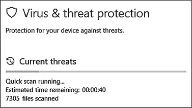
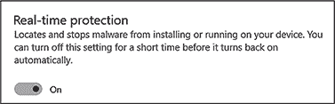
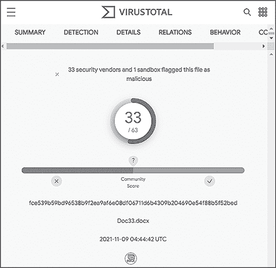
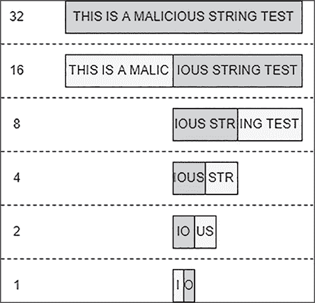

# 第九章：9 扫描器


几乎所有的 EDR 解决方案都包括一个组件，接受数据并尝试确定内容是否具有恶意性。终端代理使用它来评估许多不同的数据类型，如文件和内存流，这些评估基于供应商定义和更新的一组规则。为了简单起见，我们将这个组件称为*扫描器*，它是安全领域中最古老、研究最深入的领域之一，无论是从防御角度还是进攻角度来看。

由于涵盖它们的实现、处理逻辑和签名几乎像是要“煮海洋”，本章专注于基于文件的扫描器所使用的规则。扫描器规则使得不同产品的扫描器有所区别（不考虑性能差异或其他技术能力）。在进攻方面，正是扫描器规则，而不是扫描器本身的实现，敌对者必须规避的目标。

## 反病毒扫描的简史

我们不知道是谁发明了病毒扫描引擎。德国安全研究员伯恩德·菲克斯（Bernd Fix）在 1987 年开发了第一款病毒软件，用于中和维也纳病毒，但直到 1991 年，世界才看到了类似今天常用的病毒扫描引擎；FRISK 软件的 F-PROT 病毒扫描器会扫描一个二进制文件，检测其各部分的重排序，这是当时恶意软件开发者常用的一个模式，用来将执行跳转到文件末尾，那时他们将恶意代码放置在文件的末尾。

随着病毒的传播越来越广泛，专用的反病毒代理成为许多公司所必须的。为了满足这一需求，像赛门铁克（Symantec）、麦卡菲（McAfee）、卡巴斯基（Kaspersky）和 F-Secure 等供应商在 1990 年代推出了他们的扫描器。监管机构开始强制要求使用反病毒软件来保护系统，进一步推动了它们的普及。到 2010 年代，几乎不可能找到一个没有在大多数终端部署反病毒软件的企业环境。

这种广泛的采用使得许多信息安全项目的主管产生了错误的安全感。尽管这些反恶意软件扫描器在检测常见威胁方面取得了一些成功，但它们未能捕捉到更先进的威胁团体，而这些团体能够在不被发现的情况下实现它们的目标。

2013 年 5 月，Will Schroeder、Chris Truncer 和 Mike Wright 发布了他们的工具 Veil，这让很多人意识到过度依赖杀毒扫描程序的问题。Veil 的整个目的就是通过采用打破传统检测规则集的技术来创建绕过杀毒软件的有效载荷。这些技术包括字符串和变量名称混淆、更不常见的代码注入方法以及有效载荷加密。在攻防安全工作中，他们证明了自己的工具能够有效避开检测，导致许多公司重新评估他们支付费用购买的杀毒扫描程序的价值。与此同时，杀毒软件供应商也开始重新思考如何应对检测问题。

尽管很难量化 Veil 和其他旨在解决相同问题的工具的影响，但这些工具无疑推动了技术进步，促使了更强大的端点检测解决方案的出现。这些新的解决方案仍然使用扫描程序，作为整体检测策略的一部分，但它们已经发展到包括其他传感器，当扫描程序的规则集未能检测到恶意软件时，这些传感器能够提供覆盖。

## 扫描模型

扫描程序是系统在适当时应该调用的软件应用程序。开发人员必须在两种模型之间做出选择，以确定扫描程序何时运行。这个决策比看起来的更复杂且重要。

### 按需扫描

第一个模型，*按需扫描*，指示扫描程序在某个设定时间或在明确要求时运行。这种类型的扫描通常会在每次执行时与大量目标（例如文件和文件夹）进行交互。Microsoft Defender 中的快速扫描功能，如图 9-1 所示，可能是这种模型最为熟悉的例子。



图 9-1：Microsoft Defender 的快速扫描功能示意图

在实施此模型时，开发人员必须考虑扫描程序在一次处理数千个文件时可能对系统性能造成的影响。在资源受限的系统上，最好是在非工作时间（例如，每周二凌晨 2 点）运行此类扫描，而不是在工作时间运行完整扫描。

该模型的另一个主要缺点是每次扫描之间的时间间隔。假设攻击者可以在第一次扫描之后将恶意软件投放到系统中，执行它，并在下一次扫描之前将其删除，从而避开检测。

### 按访问扫描

在*按需扫描*过程中，通常称为*实时保护*，扫描器会在某些代码与目标交互或发生可疑活动并需要调查时评估单个目标。你通常会发现这种模型与另一个组件配合使用，当某些东西与目标对象交互时，它能够接收通知，例如文件系统迷你过滤器驱动程序。例如，当文件被下载、打开或删除时，扫描器可能会对其进行检查。微软 Defender 在所有 Windows 系统上实现了这一模型，如图 9-2 所示。



图 9-2：Defender 的实时保护功能默认启用

*按需扫描*方法通常会给对手带来更多困扰，因为它消除了滥用按需扫描之间的时间间隔的可能性。相反，攻击者只能试图规避扫描器使用的规则集。现在让我们来考虑这些规则集是如何工作的。

## 规则集

每个扫描器的核心都是一组规则，扫描引擎使用这些规则来评估待扫描的内容。这些规则更像是字典条目，而不是防火墙规则；每个规则都包含一个定义，形式为一系列属性列表，如果这些属性被识别，就表示该内容应被视为恶意。如果扫描器检测到规则匹配，它将采取一些预定的措施，如将文件隔离、终止进程或提醒用户。

在设计扫描器规则时，开发人员希望捕捉到恶意软件的独特属性。这些特征可以是具体的，如文件的名称或加密哈希值，或者可以更广泛，如恶意软件导入的 DLL 或函数，或者执行某些关键功能的一系列操作码。

开发人员可能会基于在扫描器外部检测到的已知恶意软件样本来制定这些规则。有时其他团队甚至会将关于样本的信息共享给厂商。这些规则也可以针对恶意软件家族或技术进行更广泛的检测，例如勒索软件使用的已知 API 组，或像bcdedit.exe这样的字符串，可能表明恶意软件正试图修改系统。

厂商可以根据其产品的需求，在两种类型的规则之间以适当的比例进行实现。通常，依赖于特定已知恶意软件样本规则的厂商会产生较少的误报，而那些使用较少特定指示符的厂商则会遇到较少的漏报。由于规则集由数百或数千条规则组成，厂商可以平衡特定规则和较少特定规则之间的比例，以满足客户对误报和漏报的容忍度。

各供应商各自开发和实施自己的规则集，但产品之间存在大量重叠。这对消费者有利，因为重叠确保没有单一的扫描器基于其检测“每日威胁”的能力主导市场。为了说明这一点，请查看 VirusTotal 中的查询结果（这是一个在线服务，用于调查可疑文件、IP、域名和 URL）。图 9-3 显示了与财务动机威胁组织 FIN7 相关的网络钓鱼诱饵，由 33 个安全供应商检测到，展示了这些规则集的重叠。

有许多尝试标准化扫描规则格式以促进规则在供应商和安全社区之间共享的努力。截至目前，YARA 规则格式是最广泛采用的，在开源、社区驱动的检测工作以及 EDR 供应商中都可以看到其使用。



图 9-3：与 FIN7 相关的文件的 VirusTotal 扫描结果

## 案例研究：YARA

YARA 最初由 VirusTotal 的 Victor Alvarez 开发，帮助研究人员通过文本和二进制模式检测恶意软件样本。该项目提供了一个独立的可执行扫描程序和一个可以集成到外部项目中的 C 编程语言 API。本节探讨了 YARA，因为它提供了一个很好的示例，展示了扫描器及其规则集的样子，有着出色的文档，广泛应用。

### 理解 YARA 规则

YARA 规则采用简单的格式：它们以规则的元数据开始，接着是一组描述要检查的条件的字符串，以及描述规则逻辑的布尔表达式。可以参考 Listing 9-1 中的例子。

```
rule SafetyKatz_PE
{
   ❶ meta:
         description = "Detects the default .NET TypeLibGuid for SafetyKatz"
         reference = "https://github.com/GhostPack/SafetyKatz"
         author = "Matt Hand"
  ❷ strings:
         $guid = "8347e81b-89fc-42a9-b22c-f59a6a572dec" ascii nocase wide
     condition:
         (uint16(0) == 0x5A4D and uint32(uint32(0x3C)) == 0x00004550) and $guid
}
```

列表 9-1：用于检测公共版本 SafetyKatz 的 YARA 规则

这个简单的规则称为*SafetyKatz_PE*，遵循常用于检测现成.NET 工具的格式。它以一些元数据开头，包含了对规则进行简要描述、旨在检测的工具的引用，以及可选的创建日期 ❶。这些元数据对扫描器的行为没有影响，但提供了有关规则来源和行为的一些有用上下文信息。

接下来是字符串部分 ❷。虽然可选，但它包含了恶意软件中发现的有用字符串，规则的逻辑可以引用这些字符串。每个字符串都有一个标识符，以 $ 开头，并且一个类似于变量声明的功能。YARA 支持三种不同类型的字符串：明文、十六进制和正则表达式。

明文字符串是最简单的，因为它们变化最小，并且 YARA 对修饰符的支持使它们尤其强大。这些修饰符出现在字符串的内容之后。在 Listing 9-1 中，字符串与修饰符 ascii nocase wide 配对，意思是该字符串应该在不区分大小写的情况下，以 ASCII 和宽格式（*wide* 格式每个字符使用两个字节）进行检查。其他修饰符，包括 xor、base64、base64wide 和 fullword，提供了更多的灵活性，用于定义待处理的字符串。我们的示例规则仅使用一个明文字符串，即 TypeLib 的 GUID，这是在 Visual Studio 中创建新项目时默认生成的一个工件。

十六进制字符串在搜索不可打印字符时非常有用，例如一系列的操作码。它们定义为用空格分隔的字节，并用大括号括起来（例如，$foo = {BE EF}）。与明文字符串一样，十六进制字符串支持扩展其功能的修饰符。这些修饰符包括通配符、跳跃和替代项。*通配符*实际上只是占位符，表示“这里匹配任何内容”，并用问号表示。例如，字符串 {BE ??} 将匹配文件中出现的任何内容，从 {BE 00} 到 {BE FF}。通配符也是*按半字节*匹配的，这意味着规则作者可以为字节的任意半字节使用通配符，而保留另一个字节的定义，从而使搜索范围进一步缩小。例如，字符串 {BE E?} 将匹配从 {BE E0} 到 {BE EF} 之间的任何内容。

在某些情况下，字符串的内容可能会有所不同，规则的作者可能不知道这些可变部分的长度。在这种情况下，他们可以使用跳跃。*跳跃*的格式是用连字符分隔的两个数字，并用方括号括起来。它们的意思是“从这里开始，长度在 X 到 Y 字节之间的值是可变的”。例如，十六进制字符串 $foo = {BE [1-3] EF} 将匹配以下任意内容：

BE EE EF

BE 00 B1 EF

BE EF 00 BE EF

十六进制字符串支持的另一种修饰符是*选择项*。规则作者在处理具有多个可能值的十六进制字符串部分时使用这些修饰符。作者用管道符号分隔这些值，并将其存储在括号中。字符串中的选择项数量和大小没有限制。此外，选择项可以包括通配符，以扩展其用途。字符串 $foo = {BE (EE | EF BE | ?? 00) EF} 将匹配以下任意一种情况：

BE EE EF

BE EF BE EF

BE EE 00 EF

BE A1 00 EF

YARA 规则的最后一个也是唯一一个必需的部分被称为条件。*条件*是支持布尔运算符（例如 AND）、关系运算符（例如 !=）以及用于数值表达式的算术和按位运算符（例如 *+* 和 &）的布尔表达式。

条件可以在扫描文件时与规则中定义的字符串一起工作。例如，SafetyKatz 规则确保文件中存在 TypeLib GUID。但是，条件也可以在不使用字符串的情况下工作。SafetyKatz 规则中的前两个条件检查文件开始处的两个字节值 0x4D5A（Windows 可执行文件的 MZ 头）和偏移位置 0x3C 处的四字节值 0x00004550（PE 签名）。条件也可以使用特殊的保留变量。例如，以下条件使用了 filesize 特殊变量：filesize < 30KB。当文件总大小小于 30KB 时，它会返回 true。

条件可以支持更复杂的逻辑，加入更多的操作符。例如，of 操作符。请参考 列表 9-2 中的示例。

```
rule Example
{
    strings:
        $x = "Hello"
        $y = "world"
    condition:
        any of them
}
```

列表 9-2：使用 YARA 的 of 操作符

如果扫描的文件中找到 "Hello" 字符串或 "world" 字符串，则此规则返回 true。还有其他操作符，例如 all of，表示必须包含所有字符串；N of，表示必须包含字符串的某些子集；以及 for…of 迭代器，用于表示仅某些字符串的出现应满足规则的条件。

### 逆向工程规则

在生产环境中，您通常会发现数百甚至数千条规则分析与恶意软件签名相关的文件。仅 Defender 中就有超过 200,000 个签名，如 列表 9-3 所示。

```
PS > **$signatures = (Get-MpThreatCatalog).ThreatName**
PS > **$signatures | Measure-Object -Line | select Lines**
 Lines
 -----
222975

PS > **$signatures | Group {$_.Split(**'**:**'**)[0]} |**
**>> Sort Count -Descending |**
**>> select Count,Name -First 10**

Count Name
----- ----
57265 Trojan
28101 TrojanDownloader
27546 Virus
19720 Backdoor
17323 Worm
11768 Behavior
 9903 VirTool
 9448 PWS
 8611 Exploit
 8252 TrojanSpy
```

列表 9-3：在 Defender 中列举签名

第一个命令提取 *威胁名称*，即识别特定或紧密相关的恶意软件（例如，*VirTool:MSIL/BytzChk.C!MTB*）的方法，来自 Defender 的签名目录。第二个命令随后解析每个威胁名称的顶层类别（例如，*VirTool*），并返回属于这些顶层类别的所有签名的数量。

然而，对用户而言，大多数这些规则都是不透明的。通常，唯一能弄清楚为什么一个样本被标记为恶意而另一个被认为是良性的方式就是手动测试。DefenderCheck 工具有助于自动化这个过程。图 9-4 展示了这个工具在幕后工作的一个构造示例。



图 9-4：DefenderCheck 的二分查找

DefenderCheck 将文件分成两半，然后扫描每一半以确定哪一部分包含扫描器认为是恶意的内容。它会递归地重复这个过程，直到找出规则中心的具体字节，形成一个简单的二分查找树。

## 规避扫描器签名

当试图规避像 YARA 这样的基于文件的扫描器时，攻击者通常会尝试制造假阴性。简而言之，如果他们能弄清楚扫描器用来检测某个相关文件的规则（或者至少做出一个满意的猜测），他们就可以修改该属性来规避规则。规则越脆弱，越容易被规避。在清单 9-4 中，我们使用 dnSpy，一个用于反编译和修改.NET 程序集的工具，修改编译后的 SafetyKatz 程序集中的 GUID，以便规避本章早些时候展示的脆弱 YARA 规则。

```
using System;
using System.Diagnostics;
using System.Reflection;
using System.Runtime.CompilerServices;
using System.Runtime.InteropServices;
using System.Security;
using System.Security.Permissions;

[assembly: AssemblyVersion("1.0.0.0")]
[assembly: CompilationRelaxations(8)]
[assembly: RuntimeCompatibility(WrapNonExceptionThrows = true)] [assembly: Debuggable(DebuggableAttribute.DebuggingModes.IgnoreSymbolStoreSequencePoints)]
[assembly: AssemblyTitle("SafetyKatz")]
[assembly: AssemblyDescription(" ")]
[assembly: AssemblyConfiguration(" ")]
[assembly: AssemblyCompany(" ")]
[assembly: AssemblyProduct("SafetyKatz")]
[assembly: AssemblyCopyright("Copyright © 2018")]
[assembly: AssemblyTrademark(" ")]
[assembly: ComVisible(false)]
[assembly: Guid("01234567-d3ad-b33f-0000-0123456789ac")] ❶
[assembly: AssemblyFileVersion("1.0.0.0")]
[assembly: SecurityPermission(SecurityAction.RequestMinimum, SkipVerification = true)]
[module: UnverifiableCode]
```

清单 9-4：使用 dnSpy 修改程序集中的 GUID

如果检测规则仅仅是基于 SafetyKatz 默认程序集 GUID 的存在，那么这里对 GUID 所做的修改❶将完全规避该规则。

这种简单的规避手段突显了基于样本不可变属性（或者至少是那些更难修改的属性）构建检测规则的重要性，以弥补更脆弱规则的不足。这并不是要否定这些脆弱规则的价值，因为它们可以检测到现成的 Mimikatz，一个极少用于合法目的的工具。然而，增加一个更稳健的伴随规则（其假阳性率较高，假阴性率较低）可以增强扫描器检测已被修改以规避现有规则的样本的能力。清单 9-5 展示了一个使用 SafetyKatz 的示例。

```
rule SafetyKatz_InternalFuncs_B64MimiKatz
{
     meta:
        description = "Detects the public version of the SafetyKatz
                       tool based on core P/Invokes and its embedded
                       base64-encoded copy of Mimikatz"
        reference = "https://github.com/GhostPack/SafetyKatz"
        author = "Matt Hand"
    strings:
        $mdwd = "MiniDumpWriteDump" ascii nocase wide
        $ll = "LoadLibrary" ascii nocase wide
        $gpa = "GetProcAddress" ascii nocase wide
        $b64_mimi = "zL17fBNV+jg8aVJIoWUCNFC1apCoXUE" ascii wide
    condition:
        ($mdwd and $ll and $gpa) or $b64_mimi
}
```

清单 9-5：基于内部函数名称和 Base64 子字符串的 YARA 规则，用于检测 SafetyKatz

你可以通过命令行将此规则传递给 YARA，扫描 SafetyKatz 的基础版本，如清单 9-6 所示。

```
PS > **.\yara64.exe -w -s .\safetykatz.rules C:\Temp\SafetyKatz.exe**
**>> SafetyKatz_InternalFuncs_B64MimiKatz C:\Temp\SafetyKatz.exe**
0x213b:$mdwd: ❶ MiniDumpWriteDump
0x256a:$ll: LoadLibrary
0x2459:$gpa: GetProcAddress
0x25cd:$b64_mimi: ❷
z\x00L\x001\x007\x00f\x00B\x00N\x00V\x00+\x00j\x00g\x008\x00a\x00V\x00J\x00I\x00o
\x00W\x00U\x00C\x00N\x00F\x00C\x001\x00a\x00p\x00C\x00o\x00X\x00U\x00E\x00
```

清单 9-6：使用新的 YARA 规则检测 SafetyKatz

在 YARA 输出中，我们可以看到扫描器检测到可疑的函数❶和 Base64 子字符串❷。

但即使这一规则也不是对规避的万全之策。攻击者可能进一步修改我们构建检测的属性，例如通过从 P/Invoke（.NET 中调用非托管代码的本地方式）切换到 D/Invoke，D/Invoke 是 P/Invoke 的一种替代方式，执行相同的功能，避免 EDR 可能正在监控的可疑 P/Invoke 调用。他们还可以使用系统调用委托，或者修改 Mimikatz 的嵌入式副本，使其编码表示的前 32 个字节与规则中的不同。

还有一种避免被扫描器检测到的方法。在现代红队演练中，大多数对手避免写入磁盘（写文件到文件系统）。如果他们能够完全在内存中操作，基于文件的扫描器就不再构成问题。例如，考虑 Rubeus 中的/ticket:base64命令行选项，Rubeus 是一个用于与 Kerberos 交互的工具。通过使用这个标志，攻击者可以防止 Kerberos 票据被写入目标的文件系统，而是通过控制台输出返回。

在某些情况下，攻击者无法避免将文件写入磁盘，例如在 SafetyKatz 使用dbghelp!MiniDumpWriteDump()时，该函数要求将内存转储写入文件。在这些情况下，攻击者必须限制文件的暴露。这通常意味着立即获取文件的副本并将其从目标中删除，模糊文件名和路径，或以某种方式保护文件内容。

虽然扫描器可能不如其他传感器复杂，但它们在检测宿主上的恶意内容方面发挥着重要作用。本章仅涵盖基于文件的扫描器，但商业项目通常会使用其他类型的扫描器，包括基于网络的和内存扫描器。在企业规模上，扫描器还可以提供有趣的指标，例如文件是否在全球范围内唯一。它们对对手构成特别的挑战，并且在规避方面具有重要代表性。你可以把它们看作是对手工具通过的黑箱；对手的任务是修改其控制范围内的属性，即恶意软件的元素，使其能够顺利通过。

## 结论

扫描器，特别是与杀毒引擎相关的扫描器，是我们许多人最先接触到的防御技术之一。虽然由于规则集的脆弱性，它们曾一度失宠，但最近它们作为辅助功能重新流行，采用（有时）比其他传感器如微滤器和映像加载回调例程更强健的规则。然而，规避扫描器更多的是一种模糊化的练习，而非避免。通过更改指标，即使是简单的东西，如静态字符串，对手通常也能避开大多数现代扫描引擎的雷达。
