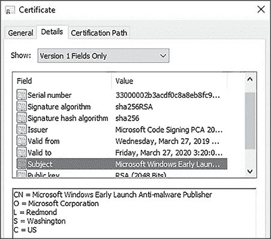
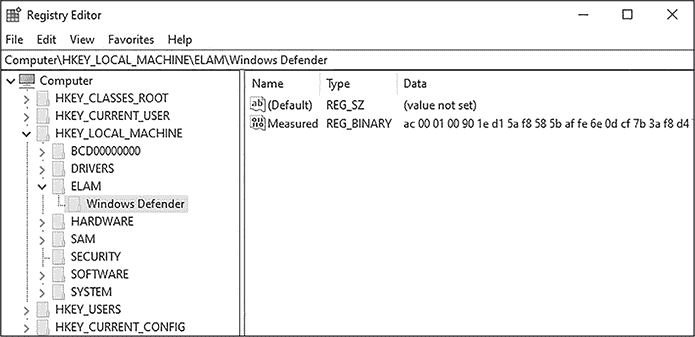
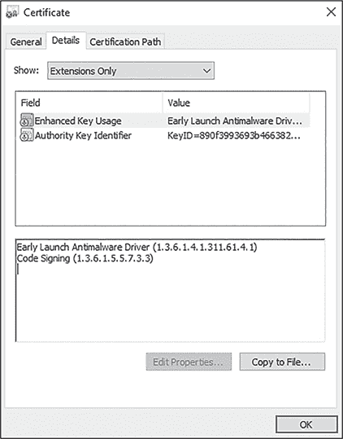
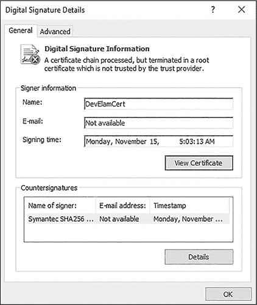

# 第十一章：11 早期启动反恶意软件驱动程序


2012 年，攻击者发起了 Zacinlo 广告软件攻击活动，其根工具包是 Detrahere 家族的一员，包含了一些自我保护功能。最有趣的功能之一是其持久性机制。

与第三章至第五章中讨论的回调例程类似，驱动程序可以注册称为*关机处理程序*的回调例程，在系统关闭时执行某些操作。为了确保其根工具包能在系统中持久存在，Zacinlo 根工具包的开发者使用了一个关机处理程序，将驱动程序以新名称重写到磁盘上，并为一个服务创建新的注册表键，该服务将重新启动根工具包作为启动驱动程序。如果有人试图清除系统中的根工具包，驱动程序会简单地丢弃这些文件和键，从而使其更加有效地保持持久性。

尽管这种恶意软件现在已经不再流行，但它突显了保护软件中的一个巨大漏洞：无法缓解在启动过程早期运行的威胁。为了解决这个问题，微软在 Windows 8 中引入了一项新的反恶意软件功能，允许某些特殊驱动程序在所有其他启动驱动程序之前加载。如今，几乎所有的 EDR 厂商都以某种方式利用这一功能，称为*早期启动反恶意软件（ELAM）*，因为它能够在系统启动过程的非常早期就对系统产生影响。它还提供了对某些类型的系统遥测数据的访问，这些数据对其他组件不可用。

本章将介绍 ELAM 驱动程序的开发、部署和启动保护功能，以及规避这些驱动程序的策略。在第十二章中，我们将介绍为部署 ELAM 驱动程序到主机的厂商提供的遥测源和进程保护。

## ELAM 驱动程序如何保护启动过程

微软允许第三方驱动程序在启动过程中早期加载，以便软件厂商可以初始化那些对系统至关重要的驱动程序。然而，这也是一把双刃剑。虽然它为确保加载关键驱动程序提供了一种有用的方式，但恶意软件作者也可以将其根工具包插入到这些早期加载顺序组中。如果恶意驱动程序能够在杀毒软件或其他安全相关驱动程序之前加载，它可能会篡改系统，阻止这些保护驱动程序按预期工作，甚至根本阻止它们加载。

为了避免这些攻击，微软需要一种方法，在启动过程的早期加载端点安全驱动程序，以便在任何恶意驱动程序加载之前进行加载。ELAM 驱动程序的主要功能是在启动过程中，当其他驱动程序尝试加载时接收通知，然后决定是否允许其加载。此验证过程是受信启动的一部分，受信启动是 Windows 的一项安全功能，负责验证内核和其他组件（如驱动程序）的数字签名，只有经过验证的反恶意软件供应商才能参与。

要发布 ELAM 驱动程序，开发者必须是微软病毒计划（MVI）的一部分，这是一个面向为 Windows 操作系统开发安全软件的反恶意软件公司的计划。截至本文写作时，为了有资格参与该计划，供应商必须具有良好的声誉（通过参加会议和行业标准报告等因素进行评估），向微软提交性能测试和功能审核的申请，并提供解决方案进行独立测试。供应商还必须签署保密协议，这可能是那些了解该计划的人保持沉默的原因。

微软病毒计划与 ELAM 密切相关。要创建*生产驱动程序*（即可以部署到非测试签名模式的系统中的驱动程序），微软必须对驱动程序进行反签名。此反签名使用一个特殊证书，在 ELAM 驱动程序的数字签名信息中可以看到，显示为*Microsoft Windows Early Launch Anti-malware Publisher*，如图 11-1 所示。只有微软病毒计划的参与者才能获得此反签名。



图 11-1：微软在 ELAM 驱动程序上的反签名

如果没有此签名，驱动程序将无法作为*早期启动*服务组的一部分加载，详细内容请参见第 208 页中的“加载 ELAM 驱动程序”部分。因此，本章中的示例针对启用了测试签名的系统，这样我们就可以忽略反签名的要求。这里描述的过程和代码与生产环境中的 ELAM 驱动程序相同。

## 开发 ELAM 驱动程序

在许多方面，ELAM 驱动程序类似于前面章节中介绍的驱动程序；它们使用回调函数接收关于系统事件的信息，并在本地主机上做出安全决策。然而，ELAM 驱动程序特别注重预防而非检测。当 ELAM 驱动程序在启动过程中较早启动时，它会评估系统上每个启动驱动程序，并根据其内部的恶意软件签名数据和逻辑，以及系统策略（该策略决定主机的风险容忍度）来批准或拒绝加载。本节将介绍开发 ELAM 驱动程序的过程，包括其内部工作原理和决策逻辑。

### 注册回调例程

驱动程序采取的第一个 ELAM 特定的操作是注册其回调例程。ELAM 驱动程序通常同时使用注册表回调和启动回调。注册表回调函数通过 nt!CmRegisterCallbackEx() 注册，用于验证在注册表中加载的驱动程序的配置信息，关于这部分我们在 第五章 中进行了详细讲解，因此这里不再赘述。

更有趣的是启动回调例程，它通过 nt!IoRegisterBootDriverCallback() 注册。这个回调为 ELAM 驱动程序提供有关启动过程状态的更新，以及有关每个加载的启动驱动程序的信息。启动回调函数作为 PBOOT_DRIVER_CALLBACK_FUNCTION 被传递给注册函数，并且必须具有与 列表 11-1 中所示的签名匹配的签名。

```
void BootDriverCallbackFunction(
   PVOID CallbackContext,
   BDCB_CALLBACK_TYPE Classification,
   PBDCB_IMAGE_INFORMATION ImageInformation
)
```

列表 11-1：ELAM 驱动程序回调签名

在启动过程中，此回调例程会接收到两种不同类型的事件，这取决于 Classification 输入参数中的值。这些事件在 列表 11-2 中显示的 BDCB_CALLBACK_TYPE 枚举中定义。

```
typedef enum _BDCB_CALLBACK_TYPE {
   BdCbStatusUpdate,
   BdCbInitializeImage,
} BDCB_CALLBACK_TYPE, *PBDCB_CALLBACK_TYPE;
```

列表 11-2：BDCB_CALLBACK_TYPE 枚举

BdCbStatusUpdate 事件告诉 ELAM 驱动程序系统在加载启动驱动程序过程中已经执行到哪个阶段，以便驱动程序可以做出适当的响应。它可以报告以下三种状态之一，这些状态在 列表 11-3 中显示。

```
typedef enum _BDCB_STATUS_UPDATE_TYPE {
  BdCbStatusPrepareForDependencyLoad,
  BdCbStatusPrepareForDriverLoad,
  BdCbStatusPrepareForUnload
} BDCB_STATUS_UPDATE_TYPE, *PBDCB_STATUS_UPDATE_TYPE;
```

列表 11-3：BDCB_STATUS_UPDATE_TYPE 值

这些值中的第一个表示系统即将加载驱动程序依赖项。第二个表示系统即将加载启动驱动程序。最后一个表示所有启动驱动程序已加载，因此 ELAM 驱动程序应该准备卸载。

在前两种状态期间，ELAM 驱动程序将收到另一种与加载启动驱动程序映像相关的事件。此事件作为指向 BDCB_IMAGE_INFORMATION 结构的指针传递给回调，该结构在 列表 11-4 中定义。

```
typedef struct _BDCB_IMAGE_INFORMATION {
   BDCB_CLASSIFICATION Classification;
   ULONG ImageFlags;
   UNICODE_STRING ImageName;
   UNICODE_STRING RegistryPath;
   UNICODE_STRING CertificatePublisher;
   UNICODE_STRING CertificateIssuer; PVOID ImageHash;
   PVOID CertificateThumbprint;
   ULONG ImageHashAlgorithm;
   ULONG ThumbprintHashAlgorithm;
   ULONG ImageHashLength;
   ULONG CertificateThumbprintLength;
} BDCB_IMAGE_INFORMATION, *PBDCB_IMAGE_INFORMATION;
```

列表 11-4：BDCB_IMAGE_INFORMATION 结构定义

正如你所看到的，这个结构包含了用于判断某个驱动程序是否为 rootkit 的大部分信息。它的大部分内容与镜像的数字签名有关，并且特别地省略了一些你可能期望看到的字段，比如指向磁盘上镜像内容的指针。这部分是由于对 ELAM 驱动程序的性能要求所导致的。由于它们会影响系统的启动时间（因为每次 Windows 启动时都会初始化），微软对每个启动驱动程序的评估时间限制为 0.5 毫秒，对所有启动驱动程序的总评估时间限制为 50 毫秒，而且要求所有这些评估在 128KB 的内存占用下完成。这些性能要求限制了 ELAM 驱动程序的功能；例如，扫描镜像内容太耗时。因此，开发人员通常依赖静态签名来识别恶意驱动程序。

在启动过程中，操作系统将 ELAM 驱动程序使用的签名加载到一个早期启动驱动程序注册表数据项中，该数据项位于 *HKLM:\ELAM\*，后跟供应商的名称（例如，*HKLM:\ELAM\Windows Defender* 用于 Microsoft Defender，如图 11-2 所示）。此数据项将在启动过程的后期被卸载，并且在用户启动会话时，该项不会出现在注册表中。如果供应商希望更新此数据项中的签名，他们可以通过挂载包含签名的注册表数据项 *%SystemRoot%\System32\config\ELAM* 并修改其密钥，来从用户模式进行更新。



图 11-2：Microsoft Defender 在 ELAM 注册表数据项中的位置

供应商可以在此键中使用三种类型为 REG_BINARY 的值：Measured、Policy 和 Config。微软没有公开正式文档来说明这些值的目的或它们之间的区别。然而，微软确实声明，签名数据块必须经过签名，并且在 ELAM 驱动程序开始做出关于启动驱动程序状态的决策之前，必须使用*加密 API：下一代 (CNG)* 原始加密函数验证其完整性。

目前并没有标准规定在 ELAM 驱动程序验证签名块完整性后，这些签名块的结构或使用方式。然而，如果你感兴趣的话，2018 年德国的*联邦信息安全局*（BSI）发布了其工作包 5，其中包括了如何 Defender 的*wdboot.sys*执行自身的完整性检查并解析签名块的优秀教程。

如果由于任何原因，签名数据的加密验证失败，ELAM 驱动程序必须为所有启动时加载的驱动程序使用其回调返回 BdCbClassificationUnknownImage 分类，因为签名数据不被认为是可靠的，不应影响 *受度量启动*（Measured Boot），这是 Windows 的一项功能，它会测量从固件到驱动程序的每个启动组件，并将结果存储在受信平台模块（TPM）中，可以用来验证主机的完整性。

### 应用检测逻辑

一旦 ELAM 驱动程序收到 BdCbStatusPrepareForDriverLoad 状态更新，并获得指向每个启动加载驱动程序的 BDCB_IMAGE_INFORMATION 结构的指针，它会使用结构中提供的信息应用其检测逻辑。一旦作出判断，驱动程序会更新当前图像信息结构中的 Classification 成员（不要与传递给回调函数的 Classification 输入参数混淆），并使用 BDCB_CLASSIFICATION 枚举中的值，该枚举在 清单 11-5 中定义。

```
typedef enum _BDCB_CLASSIFICATION {
     BdCbClassificationUnknownImage,
     BdCbClassificationKnownGoodImage,
     BdCbClassificationKnownBadImage,
     BdCbClassificationKnownBadImageBootCritical,
     BdCbClassificationEnd,
} BDCB_CLASSIFICATION, *PBDCB_CLASSIFICATION;
```

清单 11-5：BDC_CLASSIFICATION 枚举

微软按如下方式定义这些值，从上到下：图像尚未分析，或无法确定其恶意性；ELAM 驱动程序未发现恶意软件；ELAM 驱动程序检测到恶意软件；启动加载驱动程序是恶意软件，但对启动过程至关重要；启动加载驱动程序保留供系统使用。ELAM 驱动程序为每个启动时加载的驱动程序设置其中一个分类，直到收到 BdCbStatusPrepareForUnload 状态更新，指示它进行清理。然后，ELAM 驱动程序被卸载。

接下来，操作系统评估每个 ELAM 驱动程序返回的分类，并在需要时采取相应措施。为了决定采取何种措施，Windows 会查询注册表项 *HKLM:\System\CurrentControlSet\Control\EarlyLaunch\DriverLoadPolicy*，该项定义了允许在系统上运行的驱动程序。此值由 nt!IopInitializeBootDrivers() 读取，可以是 表 11-1 中包含的任何选项。

表 11-1： 可能的驱动加载策略值

| 值 | 描述 |
| --- | --- |
| 0 | 仅良好驱动程序 |
| 1 | 良好和未知的驱动程序 |
| 3 | 良好、未知和对启动过程至关重要的驱动程序（默认） |
| 7 | 所有驱动程序 |

内核（特别是即插即用管理器）使用 ELAM 驱动程序指定的分类来防止任何被禁止的驱动程序加载。所有其他驱动程序都可以加载，系统启动照常继续。

注意

*如果 ELAM 驱动程序识别到已知的恶意启动驱动程序并且运行在利用测量启动（Measured Boot）的系统上，开发人员必须调用 tbs!Tbsi_Revoke_Attestation()。这个函数的作用有点技术性；本质上，它通过未指定的值扩展 TPM 中的一个平台配置寄存器组，特别是 PCR[12]，然后递增 TPM 的事件计数器，从而打破系统安全状态的信任。*

## 示例驱动程序：防止 Mimidrv 加载

在清单 11-6 中的调试器输出显示了当 ELAM 驱动程序遇到已知的恶意驱动程序 Mimikatz 的 Mimidrv 时，它会显示调试信息并防止其加载。

```
[ElamProcessInitializeImage] The following boot start driver is about to be initialized:
    Image name: \SystemRoot\System32\Drivers\mup.sys
    Registry Path: \Registry\Machine\System\CurrentControlSet\Services\Mup
    Image Hash Algorithm: 0x0000800c
    Image Hash: cf2b679a50ec16d028143a2929ae56f9117b16c4fd2481c7e0da3ce328b1a88f
    Signer: Microsoft Windows
    Certificate Issuer: Microsoft Windows Production PCA 2011
    Certificate Thumbprint Algorithm: 0x0000800c
    Certificate Thumbprint: a22f7e7385255df6c06954ef155b5a3f28c54eec85b6912aaaf4711f7676a073
**[ElamProcessInitializeImage] The following boot start driver is about to be initialized:**
**[ElamProcessInitializeImage] Found a suspected malicious driver (\SystemRoot\system32\drivers\**
**mimidrv.sys). Marking its classification accordingly**
[ElamProcessInitializeImage] The following boot start driver is about to be initialized:
    Image name: \SystemRoot\system32\drivers\iorate.sys
    Registry Path: \Registry\Machine\System\CurrentControlSet\Services\iorate
    Image Hash Algorithm: 0x0000800c Image Hash: 07478daeebc544a8664adb00704d71decbc61931f9a7112f9cc527497faf6566
    Signer: Microsoft Windows
    Certificate Issuer: Microsoft Windows Production PCA 2011
    Certificate Thumbprint Algorithm: 0x0000800c
    Certificate Thumbprint: 3cd79dfbdc76f39ab4855ddfaeff846f240810e8ec3c037146b88cb5052efc08
```

清单 11-6：ELAM 驱动程序输出，显示检测到 Mimidrv

在此示例中，你可以看到 ELAM 驱动程序允许其他启动驱动程序加载：本地的通用命名约定驱动程序 *mup.sys* 和磁盘 I/O 速率过滤驱动程序 *iorate.sys*，这两个驱动程序都由微软签名。在这两个驱动程序之间，它通过已知的文件加密哈希值检测 Mimidrv。由于它将该驱动程序视为恶意驱动程序，它会在操作系统完全初始化之前阻止 Mimidrv 加载，而且无需用户或其他 EDR 组件的任何交互。

## 加载 ELAM 驱动程序

在加载 ELAM 驱动程序之前，你必须完成几个准备步骤：签署驱动程序并分配其加载顺序。

### 签名驱动程序

部署 ELAM 驱动程序最让人头疼的部分，特别是在开发和测试过程中，是确保其数字签名符合微软对系统加载的要求。即使在测试签名模式下，驱动程序也必须具有特定的证书属性。

微软发布了关于测试签名 ELAM 驱动程序过程的有限信息。在其演示中，微软说了以下内容：

> 早期启动驱动程序要求使用包含早期启动 EKU “1.3.6.1.4.1.311.61.4.1” […] 和 “1.3.6.1.5.5.7.3.3” 代码签名 EKU 的代码签名证书进行签名。一旦创建了这种形式的证书，就可以使用 signtool.exe 对[ELAM 驱动程序]进行签名。

在测试签名场景中，你可以通过在提升权限的命令提示符中运行*makecert.exe*（Windows SDK 中附带的实用工具）来创建包含这些 EKU 的证书。列表 11-7 展示了执行此操作的语法。

```
PS > **& 'C:\Program Files (x86)\Windows Kits\10\bin\10.0.19042.0\x64\makecert.exe'**
>> -a SHA256 -r -pe
>> -ss PrivateCertStore
>> -n "CN=DevElamCert"
>> -sr localmachine
>> -eku 1.3.6.1.4.1.311.61.4.1,1.3.6.1.5.5.7.3.3
>> C:\Users\dev\Desktop\DevElamCert.cer
```

列表 11-7：生成自签名证书

该工具支持一组强大的参数，但只有两个与 ELAM 特别相关。第一个是-eku选项，它将Early Launch Antimalware Driver和Code Signing对象标识符添加到证书中。第二个是证书应写入的路径。

当*makecert.exe*完成时，你会在指定位置找到一个新的自签名证书。该证书应具有必要的对象标识符，你可以通过打开证书并查看其详细信息来验证这一点，如图 11-3 所示。



图 11-3：证书中包含的 ELAM EKU

接下来，你可以使用*signtool.exe*，这是 Windows SDK 中的另一个工具，来签名已编译的 ELAM 驱动程序。列表 11-8 展示了使用之前生成的证书进行签名的示例。

```
PS > **& 'C:\Program Files (x86)\Windows Kits\10\bin\10.0.19041.0\x64\signtool.exe'**
>> sign
>> /fd SHA256
>> /a
>> /ph
>> /s "PrivateCertStore"
>> /n "MyElamCert"
>> /tr http://sha256timestamp.ws.symantec.com/sha256/timestamp
>> .\elamdriver.sys
```

列表 11-8：使用 signtool.exe 签名 ELAM 驱动程序

像*makecert.exe*一样，这个工具支持一大堆参数，其中一些对 ELAM 并不特别重要。首先，/fd参数指定用于签名证书的文件摘要算法（在我们的案例中是 SHA256）。/ph参数指示*signtool.exe*为可执行文件生成*页面哈希*。从 Vista 开始的 Windows 版本使用这些哈希来验证驱动程序加载到内存时每个页面的签名。/tr参数接受时间戳服务器的 URL，使证书能够正确地打上时间戳（有关时间戳协议的详细信息，请参见 RFC 3161）。开发人员可以使用一些公开可用的服务器来完成此任务。最后，该工具接受要签名的文件（在我们的案例中是 ELAM 驱动程序）。

现在我们可以检查驱动程序的属性，以查看它是否已使用自签名证书和时间戳服务器的反签名进行签名，如图 11-4 所示。



图 11-4：包含时间戳的签名驱动程序

如果是这样，你可以将驱动程序部署到系统中。与大多数驱动程序一样，系统使用服务来便于驱动程序在指定的时间加载。为了正常工作，ELAM 驱动程序必须在启动过程的非常早期加载。这就是加载顺序分组概念的应用场景。

### 设置加载顺序

在 Windows 上创建启动时加载的服务时，开发者可以指定该服务应该在启动顺序中何时加载。这在驱动程序依赖于另一个服务的可用性或需要在特定时间加载时非常有用。

然而，开发者不能为加载顺序组指定任何任意字符串。微软维护着一个列表，其中包含注册表中大多数可用的组，位置为 *HKLM:\SYSTEM\CurrentControlSet\Control\ServiceGroupOrder*，你可以轻松地检索到这个列表，如 清单 11-9 所示。

```
PS> **(Get-ItemProperty -Path HKLM:\SYSTEM\CurrentControlSet\Control\ServiceGroupOrder).List**

System Reserved
EMS
WdfLoadGroup
Boot Bus Extender
System Bus Extender
SCSI miniport
Port
Primary Disk
SCSI Class
SCSI CDROM Class
FSFilter Infrastructure
FSFilter System
FSFilter Bottom
FSFilter Copy Protection
`--snip--`
```

清单 11-9：使用 PowerShell 从注册表中检索服务加载顺序组

此命令解析包含加载顺序组名称的注册表键的值，并将其作为列表返回。截至本文撰写时，注册表键中包含 70 个组。

微软要求 ELAM 驱动程序开发者使用 Early-Launch 加载顺序组，这个组在 *ServiceGroupOrder* 键中是没有的。没有其他特殊的加载要求，你可以简单地通过使用 *sc.exe* 或者 advapi32!CreateService() Win32 API 来完成。例如，清单 11-10 加载 *WdBoot*，这是一个与 Windows 10 一起发布的 ELAM 服务，用于加载名为相同的 Defender 启动驱动程序。

```
PS C:\> **Get-ItemProperty -Path HKLM:\SYSTEM\CurrentControlSet\Services\WdBoot |**
**>> select PSChildName, Group, ImagePath | fl**

PSChildName : WdBoot
Group       : Early-Launch
ImagePath   : system32\drivers\wd\WdBoot.sys
```

清单 11-10：检查 Defender 的 WdBoot ELAM 驱动程序

此命令收集服务的名称、其加载顺序组及驱动程序在文件系统中的路径。

如果你深入了解加载 ELAM 驱动程序的过程，你会发现这主要是 Windows 启动加载程序的责任，*winload.efi*。启动加载程序，作为一款复杂的软件，执行了几个操作。首先，它在注册表中搜索所有启动时加载的驱动程序，这些驱动程序位于 Early-Launch 组，并将它们添加到列表中。接着，它加载核心驱动程序，如系统防护运行时监控程序 (*sgrmagent.sys*) 和安全事件组件迷你筛选器 (*mssecflt.sys*)。最后，它会检查 ELAM 驱动程序列表，进行完整性检查并最终加载驱动程序。一旦 Early-Launch 驱动程序加载完成，启动过程继续，ELAM 审核过程将在 第 203 页 中描述。

注意

*这是对加载 ELAM 驱动程序过程的简化描述。如果你有兴趣了解更多，可以查看@n4r1b 的博客文章《理解 WdBoot》，该文详细讲解了 Windows 如何加载必要的驱动程序。*

## 规避 ELAM 驱动程序

由于 ELAM 驱动程序主要使用静态签名和哈希值来识别恶意的启动驱动程序，因此你可以像规避用户模式基于文件的检测那样规避它们：通过更改静态指示符。然而，在驱动程序中执行此操作比在用户模式中更困难，因为通常可供选择的驱动程序要比用户模式可执行文件少。这在很大程度上归因于现代版本 Windows 中的驱动程序签名强制。

*驱动程序签名强制*是在 Windows Vista 及以后的版本中实施的一个控制措施，要求内核模式代码（即驱动程序）必须经过签名才能加载。从版本 1607 开始，Windows 10 进一步要求驱动程序必须使用扩展验证（EV）证书进行签名，并且如果开发者希望驱动程序能够在 Windows 10 S 上加载，或者希望其更新通过 Windows Update 分发，还需要可选的 Windows 硬件质量实验室（WHQL）签名。由于这些签名过程的复杂性，攻击者在现代版本的 Windows 上加载 rootkit 变得更加困难。

攻击者的驱动程序可以在符合驱动程序签名强制要求的情况下执行多种功能。例如，微软签名的 NetFilter rootkit 通过了所有驱动程序签名强制检查，并且可以在现代 Windows 版本中加载。然而，获得微软签名的 rootkit 并不是一个简单的过程，对于许多进攻团队来说也不切实际。

如果攻击者采用*自带易受攻击的驱动程序（BYOVD）*方法，他们的选择会变得更加广泛。这些是攻击者加载到系统上的易受攻击驱动程序，通常由合法的软件供应商签名。由于它们不包含明显的恶意代码，因此很难被检测到，而且在发现其漏洞后，证书很少会被吊销。如果这个 BYOVD 组件在启动时加载，稍后在启动过程中运行的用户模式组件可能会利用该驱动程序，通过多种技术手段加载操作员的 rootkit，具体取决于漏洞的性质。

另一种方法是部署固件 rootkit 或 bootkit。虽然这种技术极为罕见，但它可以有效地规避 ELAM 的启动保护。例如，ESptecter bootkit 修补了启动管理器（*bootmgfw.efi*），禁用了驱动程序签名强制，并投放了其驱动程序，该驱动程序负责加载用户模式组件并执行键盘记录。ESpecter 在系统加载 UEFI 模块时初始化，启动过程如此之早，以至于 ELAM 驱动程序无法影响其存在。

尽管实现 rootkit 和 bootkit 的具体细节超出了本书的范围，但它们对于任何对“顶级”恶意软件感兴趣的人来说，都是一个迷人的话题。由 Alex Matrosov、Eugene Rodionov 和 Sergey Bratus 合著的 *Rootkits and Bootkits: Reversing Modern Malware and Next Generation Threats* 是截至本书撰写时最为更新的资源，并强烈推荐作为本节内容的补充。

幸运的是，微软继续大量投资于保护启动过程中 ELAM 尚未发挥作用的部分。这些保护措施属于 Measured Boot 范畴，验证从 UEFI 固件到 ELAM 的启动过程完整性。在启动过程中，Measured Boot 会生成这些启动组件的加密哈希值，或称为 *测量值*，以及其他配置数据，如 BitLocker 和 Test Signing 的状态，并将其存储在 TPM 中。

一旦系统完成启动，Windows 会使用 TPM 生成一个加密签名声明，或称为 *引用*，用于确认系统配置的有效性。该引用会发送到认证机构，认证机构对测量值进行认证，返回系统是否值得信任的判断，并可以选择采取措施修复任何问题。随着要求 TPM 的 Windows 11 越来越广泛地被采用，这项技术将成为企业内部系统完整性检测的重要组成部分。

## 不幸的现实

在绝大多数情况下，ELAM 供应商未能符合微软的推荐标准。2021 年，Maxim Suhanov 发布了一篇博客文章《Measured Boot 和恶意软件签名：探索 Windows 加载程序中发现的两个漏洞》，在文章中他对比了 26 个供应商的 ELAM 驱动程序。他指出，只有 10 家供应商使用了签名；其中，只有两家供应商的签名在实现微软预期的 Measured Boot 时发挥了作用。相反，这些供应商几乎完全利用他们的 ELAM 驱动程序来创建受保护的进程并访问下一章中讨论的 Microsoft-Windows-Threat-Intelligence ETW 提供程序。

## 结论

ELAM 驱动程序为 EDR 提供了对启动过程中之前无法监控的部分的洞察。这使得 EDR 可以检测甚至可能阻止一个攻击者在主要 EDR 代理启动之前执行他们的代码。尽管这一看似巨大的好处，几乎没有供应商利用这项技术，而是仅将其用于辅助功能：访问 Microsoft-Windows-Threat-Intelligence ETW 提供程序。
