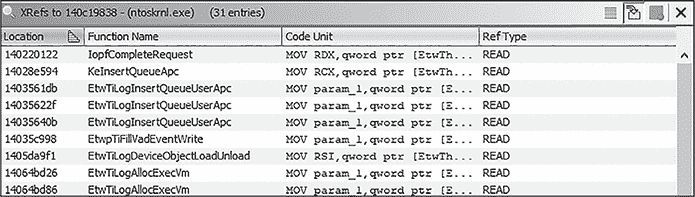
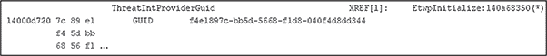
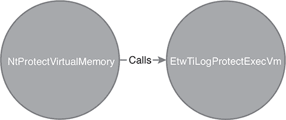
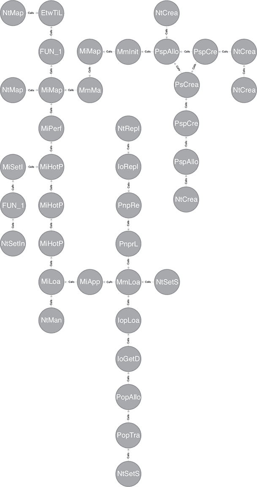
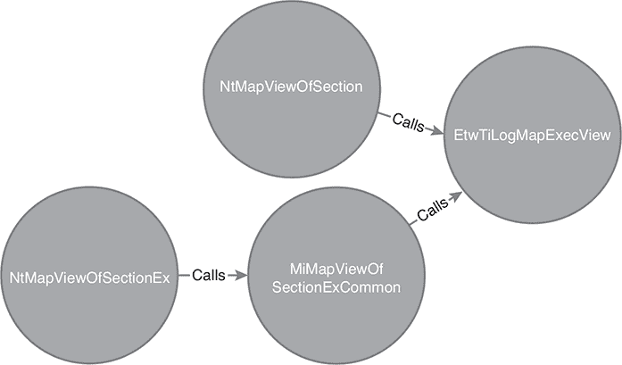
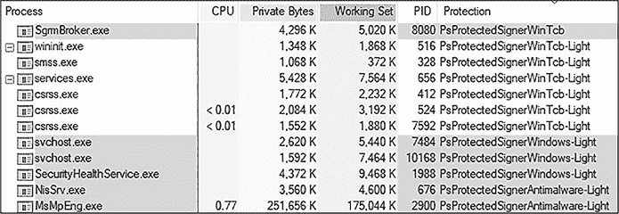

# <samp class="SANS_Futura_Std_Bold_Condensed_B_11">12</samp> <samp class="SANS_Dogma_OT_Bold_B_11">MICROSOFT-WINDOWS-THREAT-INTELLIGENCE</samp>


多年来，Microsoft Defender for Endpoint (MDE) 给进攻性安全从业者带来了巨大挑战，因为它能够检测到其他所有 EDR 厂商遗漏的问题。其有效性的主要原因之一是它使用了 *Microsoft-Windows-Threat-Intelligence (EtwTi)* ETW 提供程序。今天，发布 ELAM 驱动程序的开发者使用它来访问 Windows 上最强大的检测源之一。

尽管其名称如此，这个 ETW 提供程序并不会为你提供归属信息。相反，它报告一些先前无法被 EDR 获取的事件，如内存分配、驱动程序加载和系统调用策略违规，针对 *Win32k*（图形设备接口的内核组件）。这些事件在功能上替代了 EDR 厂商从用户模式函数钩子中获取的信息，而攻击者可以轻松规避这些钩子，正如 第二章 中所述。

由于该提供程序的事件源自内核，因此它比用户模式的替代方案更难规避，覆盖面更广，而且比函数钩子风险更低，因为该提供程序已集成在操作系统本身中。由于这些因素，很少遇到不使用它作为遥测源的成熟 EDR 厂商。

本章介绍了 EtwTi 提供程序的工作原理、其检测源、它发出的事件类型，以及攻击者可能如何规避检测。

## <samp class="SANS_Futura_Std_Bold_B_11">逆向工程提供程序</samp>

在我们介绍 EtwTi 提供程序发出的事件类型之前，您需要了解它是如何获取信息的。不幸的是，Microsoft 没有提供该提供程序内部的公开文档，因此发现这些信息在很大程度上是一个手动过程。

作为一个案例分析，本节介绍了 EtwTi 的一个来源示例：当开发者将内存分配的保护级别更改为标记为可执行时会发生什么。恶意软件开发者经常使用这种技术；他们首先将 shellcode 写入一个标记为读写（RW）权限的分配区域，然后通过如 <samp class="SANS_TheSansMonoCd_W5Regular_11">kernel32!VirtualProtect()</samp> 这样的 API 将其更改为读执行（RX）权限，然后执行 shellcode。

当恶意软件开发者调用这个 API 时，执行最终会流向系统调用<samp class="SANS_TheSansMonoCd_W5Regular_11">ntdll!NtProtectVirtualMemory()</samp>。执行流被转移到内核，在那里进行一些安全检查和验证。接着，调用了<samp class="SANS_TheSansMonoCd_W5Regular_11">nt!MmProtectVirtualMemory()</samp>来更改分配的保护级别。这一切都很标准，可以合理地假设<samp class="SANS_TheSansMonoCd_W5Regular_11">nt!NtProtectVirtualMemory()</samp>会在此时进行清理并返回。然而，内核中的最后一个条件代码块，如清单 12-1 所示，如果保护级别更改成功，它会调用<samp class="SANS_TheSansMonoCd_W5Regular_11">nt!EtwTiLogProtectExecVm()</samp>。

```
if ((-1 < (int)status) &&
  (status = protectionMask, ProtectionMask = MiMakeProtectionMask(protectionMask),
  ((uVar2 | ProtectionMask) & 2) != 0)) {
    puStack_c0 = (ulonglong*)((ulonglong)puStack_c0 & 0xffffffff00000000 | (ulonglong)status);
    OldProtection = param_4;
    **EtwTiLogProtectExecVm(TargetProcess,AccessMode,BaseAddress,NumberOfBytes);**
}
```

清单 12-1：在<samp class="SANS_TheSansMonoCd_W5Regular_Italic_I_11">nt!NtProtectVirtualMemory()</samp>内部调用的 EtwTi 函数

这个函数的名字暗示它负责记录可执行内存区域的保护变化。

### <samp class="SANS_Futura_Std_Bold_Condensed_Oblique_BI_11">检查提供者和事件是否已启用</samp>

在这个函数中调用了<samp class="SANS_TheSansMonoCd_W5Regular_11">nt!EtwProviderEnabled()</samp>，其定义见清单 12-2。它验证指定的 ETW 提供者是否在系统上启用。

```
BOOLEAN EtwProviderEnabled(
  REGHANDLE RegHandle, UCHAR     Level,
  ULONGLONG Keyword
);
```

清单 12-2：<samp class="SANS_TheSansMonoCd_W5Regular_Italic_I_11">nt!EtwProviderEnabled()</samp>定义

这个函数最有趣的部分是< samp class="SANS_TheSansMonoCd_W5Regular_11">RegHandle</samp>参数，它是全局的<samp class="SANS_TheSansMonoCd_W5Regular_11">EtwThreatIntProvRegHandle</samp>，在这个提供者的情况下。这个句柄在每个 EtwTi 函数中都会被引用，意味着我们可以用它来找到其他感兴趣的函数。如果我们检查全局 ETW 提供者句柄的交叉引用，如图 12-1 所示，我们可以看到它有 31 个其他引用，其中大多数是其他 EtwTi 函数。



<samp class="SANS_Futura_Std_Book_Oblique_I_11">图 12-1：对<samp class="SANS_TheSansMonoCd_W5Regular_Italic_I_11">ThreatIntProviderGuid</samp>的交叉引用</samp>

其中一个交叉引用来自<samp class="SANS_TheSansMonoCd_W5Regular_11">nt!EtwpInitialize()</samp>，这是一个在启动过程中调用的函数，负责注册系统 ETW 提供者等任务。为此，它调用了<samp class="SANS_TheSansMonoCd_W5Regular_11">nt!EtwRegister()</samp>函数。此函数的签名如清单 12-3 所示。

```
NTSTATUS EtwRegister(
  LPCGUID            ProviderId,
  PETWENABLECALLBACK EnableCallback,
  PVOID              CallbackContext,
  PREGHANDLE         RegHandle
);
```

清单 12-3：<samp class="SANS_TheSansMonoCd_W5Regular_Italic_I_11">nt!EtwRegister()</samp>定义

该函数在启动过程中被调用，传入一个指向名为 <samp class="SANS_TheSansMonoCd_W5Regular_11">ThreatIntProviderGuid</samp> 的 GUID 的指针，显示在 清单 12-4 中。

```
EtwRegister(&ThreatIntProviderGuid,0,0,&EtwThreatIntProvRegHandle);
```

清单 12-4：注册 <samp class="SANS_TheSansMonoCd_W5Regular_Italic_I_11">ThreatIntProviderGuid</samp>

指向的 GUID 位于 <samp class="SANS_TheSansMonoCd_W5Regular_11">.data</samp> 段中，在 图 12-2 中显示为 <samp class="SANS_TheSansMonoCd_W5Regular_11">f4e1897c-bb5d-5668-f1d8-040f4d8dd344</samp>。



<samp class="SANS_Futura_Std_Book_Oblique_I_11">图 12-2：由 <samp class="SANS_TheSansMonoCd_W5Regular_Italic_I_11">ThreatIntProviderGuid</samp> 指向的 GUID</samp>

如果提供者已启用，系统会检查事件描述符，以确定该特定事件是否已为提供者启用。此检查由 <samp class="SANS_TheSansMonoCd_W5Regular_11">nt!EtwEventEnabled()</samp> 函数执行，该函数使用 <samp class="SANS_TheSansMonoCd_W5Regular_11">nt!EtwProviderEnabled()</samp> 使用的提供者句柄和与要记录的事件对应的 <samp class="SANS_TheSansMonoCd_W5Regular_11">EVENT_DESCRIPTOR</samp> 结构。逻辑根据调用线程的上下文（用户或内核）决定使用哪个 <samp class="SANS_TheSansMonoCd_W5Regular_11">EVENT_DESCRIPTOR</samp>。

完成这些检查后，EtwTi 函数构建一个包含如 <samp class="SANS_TheSansMonoCd_W5Regular_11">nt!EtwpTiFillProcessIdentity()</samp> 和 <samp class="SANS_TheSansMonoCd_W5Regular_11">nt!EtwpTiFillVad()</samp> 等函数的结构。该结构并不容易静态反向分析，但幸运的是，它被传递到 <samp class="SANS_TheSansMonoCd_W5Regular_11">nt!EtwWrite()</samp> 中，后者是一个用于发出事件的函数。我们可以使用调试器来检查它。

### <samp class="SANS_Futura_Std_Bold_Condensed_Oblique_BI_11">确定已发出的事件</samp>

到此为止，我们知道系统调用将数据传递给 <samp class="SANS_TheSansMonoCd_W5Regular_11">nt!EtwTiLogProtectExecVm()</samp>，该函数通过 EtwTi 提供者在 ETW 上发出一个事件。但发出的具体事件仍然未知。为了收集此信息，让我们通过 WinDbg 查看传递给 <samp class="SANS_TheSansMonoCd_W5Regular_11">nt!EtwWrite()</samp> 的 <samp class="SANS_TheSansMonoCd_W5Regular_11">PEVENT_DATA_DESCRIPTOR</samp> 中的数据。

通过在写入 ETW 事件的函数上设置条件断点，当其调用堆栈包含 <samp class="SANS_TheSansMonoCd_W5Regular_11">nt!EtwTiLogProtectExecVm()</samp> 时，我们可以进一步调查传递给该函数的参数（清单 12-5）。

```
1: kd> **bp nt!EtwWrite "r $t0 = 0;**
**.foreach (p {k}) {**
 **.if ($spat(\"p\", \"nt!EtwTiLogProtectExecVm*\")) {**
 **r $t0 = 1; .break**
 **}**
**};**
**.if($t0 = 0) {gc}"**
1: kd> **g**
nt!EtwWrite
fffff807`7b693500 4883ec48        sub  rsp, 48h
1: kd> **k**
 # Child-SP          RetAddr           Call Site
00 ffff9285`03dc6788 fffff807`7bc0ac99 nt!EtwWrite
01 ffff9285`03dc6790 fffff807`7ba96860 nt!EtwTiLogProtectExecVm+0x15c031 ❶
02 ffff9285`03dc69a0 fffff807`7b808bb5 nt!NtProtectVirtualMemory+0x260
03 ffff9285`03dc6a90 00007ffc`48f8d774 nt!KiSystemServiceCopyEnd+0x25 ❷
04 00000025`3de7bc78 00007ffc`46ab4d86 0x00007ffc`48f8d774
05 00000025`3de7bc80 000001ca`0002a040 0x00007ffc`46ab4d86
06 00000025`3de7bc88 00000000`00000008 0x000001ca`0002a040
07 00000025`3de7bc90 00000000`00000000 0x8
```

清单 12-5：使用条件断点监视对 <samp class="SANS_TheSansMonoCd_W5Regular_Italic_I_11">nt!EtwTiLogProtectExecVm()</samp> 的调用

这个调用栈显示了一个对 <samp class="SANS_TheSansMonoCd_W5Regular_11">ntdll!NtProtectVirtualMemory()</samp> 的调用，从用户模式浮现并命中系统服务调度表 (SSDT) ❷，这实际上只是一个函数地址数组，用于处理给定的系统调用。然后控制权被传递到 <samp class="SANS_TheSansMonoCd_W5Regular_11">nt!NtProtectVirtualMemory()</samp>，在那里调用了 <samp class="SANS_TheSansMonoCd_W5Regular_11">nt!EtwTiLogProtectExecVm()</samp> ❶，正如我们之前通过静态分析所识别的那样。

传递给 <samp class="SANS_TheSansMonoCd_W5Regular_11">nt!EtwWrite()</samp> 的 <samp class="SANS_TheSansMonoCd_W5Regular_11">UserDataCount</samp> 参数包含其第五个参数 <samp class="SANS_TheSansMonoCd_W5Regular_11">UserData</samp> 中的 <samp class="SANS_TheSansMonoCd_W5Regular_11">EVENT_DATA_DESCRIPTOR</samp> 结构的数量。这个值将被存储在 R9 寄存器中，并可用于显示存储在 RAX 中的 <samp class="SANS_TheSansMonoCd_W5Regular_11">UserData</samp> 数组中的所有条目。该过程在 清单 12-6 中的 WinDbg 输出中有所展示。

```
1: **kd> dq @rax L(@r9*2)**
ffff9285`03dc67e0  ffffa608`af571740 00000000`00000004
ffff9285`03dc67f0  ffffa608`af571768 00000000`00000008
ffff9285`03dc6800  ffff9285`03dc67c0 00000000`00000008
ffff9285`03dc6810  ffffa608`af571b78 00000000`00000001
`--snip--`
```

清单 12-6：使用 R9 中存储的条目数列出 <samp class="SANS_TheSansMonoCd_W5Regular_Italic_I_11">UserData</samp> 中的值

WinDbg 输出中的每一行的前 64 位值是指向数据的指针，接下来的值描述数据的字节大小。不幸的是，这些数据没有名称或标签，因此需要手动过程来发现每个描述符所描述的内容。为了破译哪个指针包含哪种类型的数据，我们可以使用本节前面收集到的提供程序 GUID：<samp class="SANS_TheSansMonoCd_W5Regular_11">f4e1897c-bb5d-5668-f1d8-040f4d8dd344</samp>。

如 第八章 中讨论的那样，ETW 提供程序可以注册一个事件清单，描述由提供程序发出的事件及其内容。我们可以使用 *logman.exe* 工具列出这些提供程序，如 清单 12-7 所示。搜索与 EtwTi 提供程序相关的 GUID 会发现该提供程序的名称是 *Microsoft-Windows-Threat-Intelligence*。

```
PS > **logman query providers | findstr /i "{f4e1897c-bb5d-5668-f1d8-040f4d8dd344}"**
Microsoft-Windows-Threat-Intelligence {F4E1897C-BB5D-5668-F1D8-040F4D8DD344}
```

清单 12-7：使用 logman.exe 获取提供程序的名称

在确定了提供程序的名称后，我们可以将其传递给如 PerfView 等工具，以获取提供程序的清单。当 清单 12-8 中的 PerfView 命令完成时，它将在被调用的目录中创建清单文件。

```
PS > **PerfView64.exe userCommand DumpRegisteredManifest Microsoft-Windows-Threat-Intelligence**
```

清单 12-8：使用 PerfView 转储提供程序清单

你可以在生成的 XML 文件中查看与虚拟内存保护相关的清单部分。理解 <samp class="SANS_TheSansMonoCd_W5Regular_11">UserData</samp> 数组数据的最重要部分在于 <samp class="SANS_TheSansMonoCd_W5Regular_11"><</samp><samp class="SANS_TheSansMonoCd_W5Regular_11">template></samp> 标签，如 清单 12-9 中所示。

```
 <templates>
    `--snip--`
    <template tid="KERNEL_THREATINT_TASK_PROTECTVMArgs_V1">
    <data name="CallingProcessId" inType="win:UInt32"/>
    <data name="CallingProcessCreateTime" inType="win:FILETIME"/> <data name="CallingProcessStartKey" inType="win:UInt64"/>
    <data name="CallingProcessSignatureLevel" inType="win:UInt8"/>
    <data name="CallingProcessSectionSignatureLevel" inType="win:UInt8"/>
    <data name="CallingProcessProtection" inType="win:UInt8"/>
    <data name="CallingThreadId" inType="win:UInt32"/>
    <data name="CallingThreadCreateTime" inType="win:FILETIME"/>
    <data name="TargetProcessId" inType="win:UInt32"/>
    <data name="TargetProcessCreateTime" inType="win:FILETIME"/>
    <data name="TargetProcessStartKey" inType="win:UInt64"/>
    <data name="TargetProcessSignatureLevel" inType="win:UInt8"/>
    <data name="TargetProcessSectionSignatureLevel" inType="win:UInt8"/>
    <data name="TargetProcessProtection" inType="win:UInt8"/>
    <data name="OriginalProcessId" inType="win:UInt32"/>
    <data name="OriginalProcessCreateTime" inType="win:FILETIME"/>
    <data name="OriginalProcessStartKey" inType="win:UInt64"/>
    <data name="OriginalProcessSignatureLevel" inType="win:UInt8"/>
    <data name="OriginalProcessSectionSignatureLevel" inType="win:UInt8"/>
    <data name="OriginalProcessProtection" inType="win:UInt8"/>
    <data name="BaseAddress" inType="win:Pointer"/>
    <data name="RegionSize" inType="win:Pointer"/>
    <data name="ProtectionMask" inType="win:UInt32"/>
    <data name="LastProtectionMask" inType="win:UInt32"/>
    </template>
```

清单 12-9：PerfView 转储的 ETW 提供程序清单

比较清单中指定的数据大小与 <samp class="SANS_TheSansMonoCd_W5Regular_11">EVENT_DATA_DESCRIPTOR</samp> 结构的 <samp class="SANS_TheSansMonoCd_W5Regular_11">Size</samp> 字段，发现数据顺序相同。利用这些信息，我们可以提取事件的各个字段。例如，<samp class="SANS_TheSansMonoCd_W5Regular_11">ProtectionMask</samp> 和 <samp class="SANS_TheSansMonoCd_W5Regular_11">LastProtectionMask</samp> 与 <samp class="SANS_TheSansMonoCd_W5Regular_11">ntdll!NtProtectVirtualMemory()</samp> 的 <samp class="SANS_TheSansMonoCd_W5Regular_11">NewAccessProtection</samp> 和 <samp class="SANS_TheSansMonoCd_W5Regular_11">OldAccessProtection</samp> 分别对应。<samp class="SANS_TheSansMonoCd_W5Regular_11">UserData</samp> 数组中的最后两个条目与它们的数据类型匹配。清单 12-10 显示了我们如何使用 WinDbg 检查这些值。

```
1: kd> **dq @rax L(@r9*2)**
`--snip--`
ffff9285`03dc6940 ffff9285`03dc69c0 00000000`00000004
ffff9285`03dc6950 ffff9285`03dc69c8 00000000`00000004
1: kd> **dd ffff9285`03dc69c0 L1**
❶ ffff9285`03dc69c0 00000004
1: kd> **dd ffff9285`03dc69c8 L1**
❷ ffff9285`03dc69c8 00000020
```

清单 12-10：使用 WinDbg 评估保护掩码变化

我们可以检查值的内容，看到 <samp class="SANS_TheSansMonoCd_W5Regular_11">LastProtectionMask</samp> ❷ 最初是 <samp class="SANS_TheSansMonoCd_W5Regular_11">PAGE_EXECUTE_READ</samp> (0x20)，现在已更改为 <samp class="SANS_TheSansMonoCd_W5Regular_11">PAGE_READWRITE</samp> (0x4) ❶。现在我们知道，移除内存分配中的可执行标志导致了事件的触发。

## <samp class="SANS_Futura_Std_Bold_B_11">确定事件的来源</samp>

尽管我们已经探索了从用户模式函数调用到事件被触发的流程，但我们只针对单个传感器进行了分析，即 <samp class="SANS_TheSansMonoCd_W5Regular_11">nt!EtwTiLogProtectExecVm()</samp>。在撰写本文时，已有 11 个这样的传感器，如 表 12-1 所示。

<samp class="SANS_Futura_Std_Heavy_B_11">表 12-1：</samp> <samp class="SANS_Futura_Std_Book_11">安全性和安全缓解传感器</samp>

| <samp class="SANS_Futura_Std_Heavy_B_11">Microsoft-Windows-Threat-Intelligence Sensors</samp> | <samp class="SANS_Futura_Std_Heavy_B_11">Microsoft-Windows-Security- Mitigations Sensors</samp> |
| --- | --- |
| <samp class="SANS_TheSansMonoCd_W5Regular_11">EtwTiLogAllocExecVm</samp> | <samp class="SANS_TheSansMonoCd_W5Regular_11">EtwTimLogBlockNonCetBinaries</samp> |
| <samp class="SANS_TheSansMonoCd_W5Regular_11">EtwTiLogDeviceObjectLoadUnload</samp> | <samp class="SANS_TheSansMonoCd_W5Regular_11">EtwTimLogControlProtectionKernelModeReturnMismatch</samp> |
| <samp class="SANS_TheSansMonoCd_W5Regular_11">EtwTiLogDriverObjectLoad</samp> | <samp class="SANS_TheSansMonoCd_W5Regular_11">EtwTimLogControlProtectionUserModeReturnMismatch</samp> |
| <samp class="SANS_TheSansMonoCd_W5Regular_11">EtwTiLogDriverObjectUnLoad</samp> | <samp class="SANS_TheSansMonoCd_W5Regular_11">EtwTimLogProhibitChildProcessCreation</samp> |
| <samp class="SANS_TheSansMonoCd_W5Regular_11">EtwTiLogInsertQueueUserApc</samp> | <samp class="SANS_TheSansMonoCd_W5Regular_11">EtwTimLogProhibitDynamicCode</samp> |
| <samp class="SANS_TheSansMonoCd_W5Regular_11">EtwTiLogMapExecView</samp> | <samp class="SANS_TheSansMonoCd_W5Regular_11">EtwTimLogProhibitLowILImageMap</samp> |
| <samp class="SANS_TheSansMonoCd_W5Regular_11">EtwTiLogProtectExecView</samp> | <samp class="SANS_TheSansMonoCd_W5Regular_11">EtwTimLogProhibitNonMicrosoftBinaries</samp> |
| <samp class="SANS_TheSansMonoCd_W5Regular_11">EtwTiLogReadWriteVm</samp> | <samp class="SANS_TheSansMonoCd_W5Regular_11">EtwTimLogProhibitWin32kSystemCalls</samp> |
| <samp class="SANS_TheSansMonoCd_W5Regular_11">EtwTiLogSetContextThread</samp> | <samp class="SANS_TheSansMonoCd_W5Regular_11">EtwTimLogRedirectionTrustPolicy</samp> |
| <samp class="SANS_TheSansMonoCd_W5Regular_11">EtwTiLogSuspendResumeProcess</samp> | <samp class="SANS_TheSansMonoCd_W5Regular_11">EtwTimLogUserCetSetContextIpValidationFailure</samp> |
| <samp class="SANS_TheSansMonoCd_W5Regular_11">EtwTiLogSuspendResumeThread</samp> |  |

另外，10 个传感器与安全缓解措施相关，并通过其前缀<samp class="SANS_TheSansMonoCd_W5Regular_11">EtwTim</samp>进行标识。这些传感器通过不同的提供程序 Microsoft-Windows-Security-Mitigations 发出事件，但功能与正常的 EtwTi 传感器完全相同。它们负责生成关于安全缓解措施违规的警报，例如加载低完整性级别或远程图像，或基于系统配置触发任意代码保护。虽然这些漏洞缓解措施超出了本书的范围，但在调查 EtwTi 传感器时，你偶尔会遇到它们。

### <samp class="SANS_Futura_Std_Bold_Condensed_Oblique_BI_11">使用 Neo4j 发现传感器触发器</samp>

表 12-1 中的传感器是什么原因导致其发出事件？幸运的是，我们有一种相对简单的方法来弄清楚这一点。大多数传感器衡量来自用户模式的活动，而为了从用户模式切换到内核模式，需要发出系统调用（syscall）。在控制权交给内核后，执行将进入以<samp class="SANS_TheSansMonoCd_W5Regular_11">Nt</samp>为前缀的函数，SSDT 将处理入口点的解析。

因此，我们可以将以<samp class="SANS_TheSansMonoCd_W5Regular_11">Nt</samp>为前缀的函数路径映射到以<samp class="SANS_TheSansMonoCd_W5Regular_11">EtwTi</samp>为前缀的函数，以识别由于用户模式中的操作而触发事件的 API。Ghidra 和 IDA 都提供了调用树映射功能，通常可以实现这一目的。然而，它们的性能可能有限。例如，Ghidra 的默认搜索深度为五个节点，较长的搜索会呈指数级增长，并且非常难以解析。

为了解决这个问题，我们可以使用一个专门用于识别路径的系统，比如图数据库 Neo4j。如果你曾经使用过 BloodHound 这个攻击路径映射工具，那你其实已经在某种形式上使用过 Neo4j。Neo4j 可以映射任何类型项之间的关系（称为 *边*）。例如，BloodHound 使用 Active Directory 实体作为节点，而像访问控制项、组成员身份和 Microsoft Azure 权限等属性作为边。

为了映射节点和边，Neo4j 支持一种名为 Cypher 的查询语言，其语法介于结构化查询语言（SQL）和 ASCII 艺术之间，通常看起来像是一个手绘图。BloodHound 的发明者之一 Rohan Vazarkar 写了一篇关于 Cypher 查询的精彩博文《Intro to Cypher》，它仍然是该主题的最佳资源之一。

### <samp class="SANS_Futura_Std_Bold_Condensed_Oblique_BI_11">让数据集与 Neo4j 配合使用</samp>

为了与 Neo4j 配合使用，我们需要一个结构化的数据集，通常是 JSON 格式，用于定义节点和边。然后，我们使用来自 Cypher 插件库 Awesome Procedures 的函数（如 <samp class="SANS_TheSansMonoCd_W5Regular_11">apoc.load.json()</samp>）将该数据集加载到 Neo4j 数据库中。数据加载后，我们可以在 Neo4j 服务器上的 Web 界面或连接的 Neo4j 客户端中使用 Cypher 查询数据。

我们必须使用插件从 Ghidra 或 IDA 提取所需的数据，以便将调用图映射到图形数据库中，然后将其转换为 JSON。具体来说，JSON 对象中的每个条目需要包含三个属性：一个字符串，包含将作为节点的函数名称，一个用于后续分析的入口点偏移量，以及作为边的外部引用（换句话说，即该函数调用的函数）。

开源的 Ghidra 脚本 *CallTreeToJSON.py* 会遍历 Ghidra 分析过的程序中的所有函数，收集感兴趣的属性，并为 Neo4j 创建新的 JSON 对象进行加载。为了映射与 EtwTi 传感器相关的路径，我们必须首先在 Ghidra 中加载并分析 *ntoskrnl.exe* 内核映像。然后，我们可以将 Python 脚本加载到 Ghidra 的脚本管理器中并执行它。这将创建一个名为 *xrefs.json* 的文件，我们可以将其加载到 Neo4j 中。它包含了清单 12-11 中所示的 Cypher 命令。

```
CREATE CONSTRAINT function_name ON (n:Function) ASSERT n.name IS UNIQUE
CALL apoc.load.json("file:///xref.json") YIELD value
UNWIND value as func
MERGE (n:Function {name: func.FunctionName})
SET n.entrypoint=func.EntryPoint
WITH n, func
UNWIND func.CalledBy as cb
MERGE (m:Function {name:cb})
MERGE (m)-[:Calls]->(n)
```

清单 12-11：将调用树加载到 Ghidra 中

将 JSON 文件导入 Neo4j 后，我们可以使用 Cypher 查询数据集。

### <samp class="SANS_Futura_Std_Bold_Condensed_Oblique_BI_11">查看调用树</samp>

为确保一切设置正确，我们来编写一个查询，映射到 <samp class="SANS_TheSansMonoCd_W5Regular_11">EtwTiLogProtectExecVm</samp> 传感器的路径。简单来说，清单 12-12 中的查询表示：“返回任何长度的最短路径，从任何以 <samp class="SANS_TheSansMonoCd_W5Regular_11">Nt</samp> 开头的函数名，到我们指定的传感器函数。”

```
MATCH p=shortestPath((f:Function)-[rCalls*1..]->(t:Function {name: "EtwTiLogProtectExecVm"}))
WHERE f.name STARTS WITH 'Nt' RETURN p;
```

列表 12-12：映射 <samp class="SANS_TheSansMonoCd_W5Regular_Italic_I_11">Nt</samp> 函数与 <samp class="SANS_TheSansMonoCd_W5Regular_Italic_I_11">EtwTiLogProtectExecVm</samp> 传感器之间的最短路径

当输入到 Neo4j 时，它应该显示图 12-3 所示的路径。



<samp class="SANS_Futura_Std_Book_Oblique_I_11">图 12-3：系统调用与 EtwTi 函数之间的简单路径</samp>

其他传感器的调用树要复杂得多。例如，<samp class="SANS_TheSansMonoCd_W5Regular_11">nt!EtwTiLogMapExecView()</samp>传感器的调用树有 12 个层级，最终回溯到<samp class="SANS_TheSansMonoCd_W5Regular_11">nt!NtCreatePagingFile()</samp>。你可以通过修改之前查询中的传感器名称来查看这一点，从而生成图 12-4 中的路径。



<samp class="SANS_Futura_Std_Book_Oblique_I_11">图 12-4：从<samp class="SANS_TheSansMonoCd_W5Regular_Italic_I_11">nt!NtCreatePagingFile()</samp></samp> <samp class="SANS_Futura_Std_Book_Oblique_I_11">到<samp class="SANS_TheSansMonoCd_W5Regular_Italic_I_11">nt!EtwTiLogMapExecView()</samp></samp>

如此示例所示，许多系统调用间接触及传感器。列举这些调用对于寻找覆盖漏洞可能很有用，但生成的信息量可能会迅速变得压倒性。

你可能希望将查询的范围限制为三到四个层级（代表两到三个调用）；这些查询应返回直接负责调用传感器函数并包含条件逻辑的 API。以之前的示例为例，限定范围的查询将显示系统调用<samp class="SANS_TheSansMonoCd_W5Regular_11">ntdll!NtMapViewOfSection()</samp>直接调用传感器函数，而系统调用<samp class="SANS_TheSansMonoCd_W5Regular_11">ntdll!NtMapViewOfSectionEx()</samp>则通过内存管理器函数间接调用传感器，如图 12-5 所示。



<samp class="SANS_Futura_Std_Book_Oblique_I_11">图 12-5：返回更有用结果的限定查询</samp>

对 EtwTi 传感器函数进行此类分析会产生关于它们调用者的信息，包括直接和间接调用者。表 12-2 展示了其中一些映射。

<samp class="SANS_Futura_Std_Heavy_B_11">表 12-2：</samp> <samp class="SANS_Futura_Std_Book_11">EtwTi 传感器到系统调用的映射</samp>

| <samp class="SANS_Futura_Std_Heavy_B_11">传感器</samp> | <samp class="SANS_Futura_Std_Heavy_B_11">来自系统调用的调用树（深度 = 4）</samp> |
| --- | --- |
| <samp class="SANS_TheSansMonoCd_W5Regular_11">EtwTiLogAllocExecVm</samp> | <samp class="SANS_TheSansMonoCd_W5Regular_11">MiAllocateVirtualMemory</samp>←<samp class="SANS_TheSansMonoCd_W5Regular_11">NtAllocateVirtualMemory</samp> |
| <samp class="SANS_TheSansMonoCd_W5Regular_11">EtwTiLogDriverObjectLoad</samp> | <samp class="SANS_TheSansMonoCd_W5Regular_11">IopLoadDriver</samp>←<samp class="SANS_TheSansMonoCd_W5Regular_11">IopLoadUnloadDriver</samp>←<samp class="SANS_TheSansMonoCd_W5Regular_11">IopLoadDriverImage</samp>←<samp class="SANS_TheSansMonoCd_W5Regular_11">NtLoadDriverIopLoadDriver</samp>←<samp class="SANS_TheSansMonoCd_W5Regular_11">IopLoadUnloadDriver</samp>←<samp class="SANS_TheSansMonoCd_W5Regular_11">IopUnloadDriver</samp>←<samp class="SANS_TheSansMonoCd_W5Regular_11">NtUnloadDriver</samp> |
| <samp class="SANS_TheSansMonoCd_W5Regular_11">EtwTiLogInsertQueueUserApc</samp> <samp class="SANS_Futura_Std_Book_11">还有其他分支的调用树会导致系统调用，例如</samp> <samp class="SANS_TheSansMonoCd_W5Regular_11">nt!IopCompleteRequest()</samp><samp class="SANS_Futura_Std_Book_11">,</samp> <samp class="SANS_TheSansMonoCd_W5Regular_11">nt!PspGet ContextThreadInternal()</samp><samp class="SANS_Futura_Std_Book_11">, 和</samp> <samp class="SANS_TheSansMonoCd_W5Regular_11">nt!PspSet ContextThreadInternal()</samp><samp class="SANS_Futura_Std_Book_11">, 但这些并不特别有用，因为许多内部函数无论是否显式创建了 APC 都依赖这些函数。</samp> | <samp class="SANS_TheSansMonoCd_W5Regular_11">KeInsertQueueApc</samp> ←<samp class="SANS_TheSansMonoCd_W5Regular_11">NtQueueApcThread</samp> <samp class="SANS_TheSansMonoCd_W5Regular_11">KeInsertQueueApc</samp> ←<samp class="SANS_TheSansMonoCd_W5Regular_11">NtQueueApcThreadEx</samp> |
| <samp class="SANS_TheSansMonoCd_W5Regular_11">EtwTiLogMapExecView</samp> | <samp class="SANS_TheSansMonoCd_W5Regular_11">NtMapViewOfSectionMiMapViewOf</samp><samp class="SANS_TheSansMonoCd_W5Regular_11">SectionExCommon</samp> ←<samp class="SANS_TheSansMonoCd_W5Regular_11">NtMapViewOfSectionEx</samp> |
| <samp class="SANS_TheSansMonoCd_W5Regular_11">EtwTiLogProtectExecVm</samp> | <samp class="SANS_TheSansMonoCd_W5Regular_11">NtProtectVirtualMemory</samp> |
| <samp class="SANS_TheSansMonoCd_W5Regular_11">EtwTiLogReadWriteVm</samp> | <samp class="SANS_TheSansMonoCd_W5Regular_11">MiReadWriteVirtualMemory</samp>←<samp class="SANS_TheSansMonoCd_W5Regular_11">NtReadVirtualMemoryMiReadWriteVirtualMemory</samp>←<samp class="SANS_TheSansMonoCd_W5Regular_11">NtReadVirtualMemoryExMiReadWriteVirtualMemory</samp>←<samp class="SANS_TheSansMonoCd_W5Regular_11">NtWriteVirtualMemory</samp> |
| <samp class="SANS_TheSansMonoCd_W5Regular_11">EtwTiLogSetContextThread</samp> | <samp class="SANS_TheSansMonoCd_W5Regular_11">PspSetContextThreadInternal</samp>←<samp class="SANS_TheSansMonoCd_W5Regular_11">NtSetContextThread</samp> |
| <samp class="SANS_TheSansMonoCd_W5Regular_11">EtwTiLogSuspendResumeThread</samp> <samp class="SANS_Futura_Std_Book_11">此传感器有额外的路径，未列出并与调试 API 相关，包括</samp> <samp class="SANS_TheSansMonoCd_W5Regular_11">ntdll!NtDebugActiveProcess()</samp><samp class="SANS_Futura_Std_Book_11">,</samp> <samp class="SANS_TheSansMonoCd_W5Regular_11">ntdll!Nt DebugContinue()</samp><samp class="SANS_Futura_Std_Book_11">, 和</samp> <samp class="SANS_TheSansMonoCd_W5Regular_11">ntdll!NtRemove ProcessDebug()</samp><samp class="SANS_Futura_Std_Book_11">.</samp> | <samp class="SANS_TheSansMonoCd_W5Regular_11">PsSuspendThread</samp>←<samp class="SANS_TheSansMonoCd_W5Regular_11">NtSuspendThreadPsSuspendThread</samp>←<samp class="SANS_TheSansMonoCd_W5Regular_11">NtChangeThreadStatePsSuspendThread</samp>←<samp class="SANS_TheSansMonoCd_W5Regular_11">PsSuspendProcess</samp>←<samp class="SANS_TheSansMonoCd_W5Regular_11">NtSuspendProcessPsMultiResumeThread</samp>←<samp class="SANS_TheSansMonoCd_W5Regular_11">NtResumeThread</samp> |

在查看此数据集时需要考虑的一个重要事实是，Ghidra 不会在调用树中考虑条件调用，而是查找函数内部的*call*指令。这意味着，尽管从 Cypher 查询生成的图表在技术上是正确的，但在所有实例中可能不会遵循这些图表。为了演示这一点，读者可以进行一个练习，反向分析<samp class="SANS_TheSansMonoCd_W5Regular_11">ntdll!NtAllocateVirtualMemory()</samp>，找到决定调用<samp class="SANS_TheSansMonoCd_W5Regular_11">nt!EtwTiLogAllocExecVm()</samp>传感器的地方。

## <samp class="SANS_Futura_Std_Bold_B_11">消费 EtwTi 事件</samp>

在第八章中，你学习了 EDR 如何从其他 ETW 提供者获取事件。要尝试从 EtwTi 获取 ETW 事件，请在提升的命令提示符中运行清单 12-13 中的命令。

```
PS > **logman.exe create trace EtwTi -p Microsoft-Windows-Threat-Intelligence -o C:\EtwTi.etl**
PS > **logman.exe start EtwTi**
```

清单 12-13：从 EtwTi 提供者收集事件的 Logman 命令

尽管你已在高完整性下运行命令，但你可能会收到访问被拒绝的错误。这是因为微软在 Windows 10 及更高版本中实施的一个安全功能，名为*Secure ETW*，它防止恶意软件进程读取或篡改反恶意软件跟踪。为实现这一点，Windows 只允许具有<samp class="SANS_TheSansMonoCd_W5Regular_11">PS_PROTECTED_ANTIMALWARE_LIGHT</samp>保护级别的进程和以<samp class="SANS_TheSansMonoCd_W5Regular_11">SERVICE_LAUNCH_PROTECTED_ANTIMALWARE_LIGHT</samp>服务保护类型启动的服务从该通道消费事件。

让我们探索进程保护，以便你更好地理解如何从 EtwTi 消费事件。

### <samp class="SANS_Futura_Std_Bold_Condensed_Oblique_BI_11">理解受保护的进程</samp>

进程保护允许敏感进程（例如与 DRM 保护内容交互的进程）避免外部进程的交互。虽然最初为媒体播放器等软件创建，但随着受保护进程轻量化（PPL）的引入，此保护最终扩展到其他类型的应用程序。在现代版本的 Windows 中，不仅 Windows 组件，而且第三方应用程序广泛使用 PPL，正如在 图 12-6 中的进程资源管理器窗口中所见。



<samp class="SANS_Futura_Std_Book_Oblique_I_11">图 12-6：各个进程的保护级别</samp>

您可以在 Windows 上备份每个进程的 <samp class="SANS_TheSansMonoCd_W5Regular_11">EPROCESS</samp> 结构的保护字段中查看进程的保护状态。该字段是 <samp class="SANS_TheSansMonoCd_W5Regular_11">PS_PROTECTION</samp> 类型的，它在 列表 12-14 中定义。

```
typedef struct _PS_PROTECTION {
    union {
        UCHAR Level;
        struct {
            UCHAR Type   : 3;
            UCHAR Audit  : 1;
            UCHAR Signer : 4;
        };
    };
} PS_PROTECTION, *PPS_PROTECTION;
```

列表 12-14： <samp class="SANS_TheSansMonoCd_W5Regular_Italic_I_11">PS_PROTECTION</samp> 结构定义

<samp class="SANS_TheSansMonoCd_W5Regular_11">Type</samp> 成员与 列表 12-15 中的 <samp class="SANS_TheSansMonoCd_W5Regular_11">PS_PROTECTED_TYPE</samp> 枚举中的一个值相关联。

```
kd> **dt nt!_PS_PROTECTED_TYPE**
   PsProtectedTypeNone = 0n0
   PsProtectedTypeProtectedLight = 0n1
   PsProtectedTypeProtected = 0n2
   PsProtectedTypeMax = 0n3
```

列表 12-15： <samp class="SANS_TheSansMonoCd_W5Regular_Italic_I_11">PS_PROTECTED_TYPE</samp> 枚举

最后，<samp class="SANS_TheSansMonoCd_W5Regular_11">Signer</samp> 成员是来自 列表 12-16 中定义的 <samp class="SANS_TheSansMonoCd_W5Regular_11">PS_PROTECTED_SIGNER</samp> 枚举的一个值。

```
kd> **dt nt!_PS_PROTECTED_SIGNER**
   PsProtectedSignerNone = 0n0
   PsProtectedSignerAuthenticode = 0n1
   PsProtectedSignerCodeGen = 0n2
   PsProtectedSignerAntimalware = 0n3
   PsProtectedSignerLsa = 0n4
   PsProtectedSignerWindows = 0n5
   PsProtectedSignerWinTcb = 0n6
   PsProtectedSignerWinSystem = 0n7
   PsProtectedSignerApp = 0n8
   PsProtectedSignerMax = 0n9
```

列表 12-16： <samp class="SANS_TheSansMonoCd_W5Regular_Italic_I_11">PS_PROTECTED_SIGNER</samp> 枚举

例如，让我们来看一下 *msmpeng.exe*，即 Microsoft Defender 的主要进程的进程保护状态，使用 WinDbg，如 列表 12-17 中演示的。

```
kd> **dt nt!_EPROCESS Protection**
   +0x87a Protection : _PS_PROTECTION

kd> **!process 0 0 MsMpEng.exe**
PROCESS ffffa608af571300
    SessionId: 0   Cid: 1134  Peb: 253d4dc000   ParentCid: 0298
    DirBase: 0fc7d002 ObjectTable: ffffd60840b0c6c0 HandleCount: 636.
    Image: MsMpEng.exe

kd> **dt nt!_PS_PROTECTION ffffa608af571300** **+ 0x87a**
    +0x000 Level           : 0x31 '1'
    +0x000 Type          ❶ : 0y001
    +0x000 Audit           : 0y0
    +0x000 Signer        ❷ : 0y0011
```

列表 12-17：评估 msmpeng.exe 进程的进程保护级别

进程的保护类型是 <samp class="SANS_TheSansMonoCd_W5Regular_11">PsProtectedTypeProtectedLight</samp> ❶，其签名者是 <samp class="SANS_TheSansMonoCd_W5Regular_11">PsProtectedSignerAntimalware</samp>（相当于十进制中的 3） ❷。在这种保护级别下，也被称为 <samp class="SANS_TheSansMonoCd_W5Regular_11">PsProtectedSignerAntimalware-Light</samp>，外部进程有限的能力请求访问该进程，并且内存管理器将阻止未正确签名的模块（如 DLL 和应用程序兼容性数据库）加载到该进程中。

### <samp class="SANS_Futura_Std_Bold_Condensed_Oblique_BI_11">创建受保护的进程</samp>

要创建一个运行在此保护级别下的进程，实际上并不像将标志传递给<samp class="SANS_TheSansMonoCd_W5Regular_11">kernel32!CreateProcess()</samp>那样简单。Windows 会将映像文件的数字签名与用于签名许多软件的微软根证书授权进行验证，从驱动程序到第三方应用程序。

它还通过检查多个增强密钥使用（EKU）扩展中的一个，来验证文件并确定进程的签名级别。如果该签名级别未能主导请求的签名级别，意味着签名者属于<samp class="SANS_TheSansMonoCd_W5Regular_11">DominateMask</samp>成员的<samp class="SANS_TheSansMonoCd_W5Regular_11">RTL_PROTECTED_ACCESS</samp>结构，Windows 会检查该签名级别是否可以在运行时进行自定义。如果可以，Windows 将检查签名级别是否与系统上任何已注册的运行时签名者匹配，如果找到匹配项，它将使用运行时签名者的注册数据（如签名者的哈希值和 EKU）来验证证书链。如果所有检查都通过，Windows 将授予请求的签名级别。

#### <samp class="SANS_Futura_Std_Bold_Condensed_B_11">注册 ELAM 驱动程序</samp>

要创建具有所需保护级别的进程或服务，开发人员需要一个签名的 ELAM 驱动程序。该驱动程序必须具有一个嵌入式资源，<samp class="SANS_TheSansMonoCd_W5Regular_11">MICROSOFTELAMCERTIFICATEINFO</samp>，其中包含用于保护用户模式进程或服务相关可执行文件的证书哈希值和哈希算法，并且最多可以包含三个 EKU 扩展。操作系统将在启动时通过对<samp class="SANS_TheSansMonoCd_W5Regular_11">nt!SeRegisterElamCertResources()</samp>的内部调用解析或注册此信息（或者管理员可以在运行时手动执行此操作）。如果注册发生在启动过程中，它将在预启动期间进行，即在将控制权交给 Windows 启动管理器之前，如列表 12-18 中的 WinDbg 输出所示。

```
1: kd> **k**
 # Child-SP          RetAddr           Call Site
00 ffff8308`ea406828 fffff804`1724c9af nt!SeRegisterElamCertResources
01 ffff8308`ea406830 fffff804`1724f1ac nt!PipInitializeEarlyLaunchDrivers+0x63
02 ffff8308`ea4068c0 fffff804`1723ca40 nt!IopInitializeBootDrivers+0x153
03 ffff8308`ea406a70 fffff804`172436e1 nt!IoInitSystemPreDrivers+0xb24
04 ffff8308`ea406bb0 fffff804`16f8596b nt!IoInitSystem+0x15
05 ffff8308`ea406be0 fffff804`16b55855 nt!Phase1Initialization+0x3b
06 ffff8308`ea406c10 fffff804`16bfe818 nt!PspSystemThreadStartup+0x55
07 ffff8308`ea406c60 00000000`00000000 nt!KiStartSystemThread+0x28
```

列表 12-18：启动过程中注册的 ELAM 资源

你很少会在企业产品中看到手动注册选项的实现，因为在启动时解析的资源在运行时不需要进一步交互。不过，这两种选项的结果相同，并且可以互换使用。

#### <samp class="SANS_Futura_Std_Bold_Condensed_B_11">创建签名</samp>

注册后，当找到签名级别匹配时，该驱动程序将可用于比较。本节的其余部分将介绍在端点代理上下文中实施消费者应用程序的实现。

为了创建资源并将其注册到系统中，开发者首先需要获得一个包含 Early Launch 和 Code Signing EKU 的证书，可以通过证书颁发机构获取，或者在测试环境中生成一个自签名证书。我们可以使用*New-SelfSignedCertificate* PowerShell cmdlet 创建自签名证书，如 列表 12-19 所示。

```
PS > **$password = ConvertTo-SecureString -String "ThisIsMyPassword" -Force -AsPlainText**
PS > **$cert = New-SelfSignedCertificate -certstorelocation "Cert:\CurrentUser\My"**
**>>   -HashAlgorithm SHA256 -Subject "CN=MyElamCert" -TextExtension**
**>>   @("2.5.29.37={text}1.3.6.1.4.1.311.61.4.1,1.3.6.1.5.5.7.3.3")**
PS > **Export-PfxCertificate -cert $cert -FilePath "MyElamCert.pfx" -Password $password**
```

列表 12-19：生成并导出代码签名证书

此命令生成一个新的自签名证书，添加 Early Launch 和 Code Signing EKU，然后将其导出为 *.pfx* 格式。

接下来，开发者使用此证书对其可执行文件及任何依赖的 DLL 进行签名。你可以使用 列表 12-20 中包含的 *signtool.exe* 语法来执行此操作。

```
PS > **signtool.exe sign /fd SHA256 /a /v /ph /f .\MyElamCert.pfx**
**>>   /p "ThisIsMyPassword" .\path \to\my\service.exe**
```

列表 12-20：使用生成的证书对可执行文件进行签名

此时，服务可执行文件已满足作为保护启动的签名要求。但在启动之前，驱动程序的资源必须被创建并注册。

#### <samp class="SANS_Futura_Std_Bold_Condensed_B_11">创建资源</samp>

创建资源所需的第一条信息是证书的待签名（TBS）哈希值。第二条信息是证书的文件摘要算法。截止本文写作时，这个字段可以是以下四个值中的一个：0x8004（SHA10）、x800C（SHA256）、0x800D（SHA384）或 0x800E（SHA512）。我们在使用*signtool.exe*创建证书时，通过 <samp class="SANS_TheSansMonoCd_W5Regular_11">/fd</samp> 参数指定了这个算法。

我们可以使用*certmgr.exe*并带上 <samp class="SANS_TheSansMonoCd_W5Regular_11">-v</samp> 参数来收集这两个值，如 列表 12-21 所示。

```
PS > **.\certmgr.exe -v .\path\to\my\service.exe**
`--snip--`
Content Hash (To-Be-Signed Hash):: 04 36 A7 99 81 81 81 07 2E DF B6 6A 52 56 78 24    '.6.….….jRVx$'
    E7 CC 5E AA A2 7C 0E A3 4E 00 8D 9B 14 98 97 02    '..^..|..N.……'
`--snip--`
Content SignatureAlgorithm:: 1.2.840.113549.1.1.11 (sha256RSA)
`--snip--`
```

列表 12-21：使用 certmgr.exe 检索待签名哈希值和签名算法

哈希值位于 <samp class="SANS_TheSansMonoCd_W5Regular_11">Content Hash</samp> 下，签名算法位于 <samp class="SANS_TheSansMonoCd_W5Regular_11">Content SignatureAlgorithm</samp> 下。

#### <samp class="SANS_Futura_Std_Bold_Condensed_B_11">添加新资源文件</samp>

现在，我们可以向驱动程序项目中添加一个新的资源文件，内容如 列表 12-22 所示，并编译驱动程序。

```
MicrosoftElamCertificateInfo MSElamCertInfoID
{
      1,
      L"0436A799818181072EDFB66A52567824E7CC5EAAA27C0EA34E008D9B14989702\0",
      0x800C,
      L"\0"
}
```

列表 12-22：<samp class="SANS_TheSansMonoCd_W5Regular_Italic_I_11">MicrosoftElamCertificateInfo</samp> 资源内容

此资源的第一个值是条目数；在我们的案例中，只有一个条目，但最多可以有三个。接下来是我们之前收集的 TBS 哈希值，后面是与使用的哈希算法（在我们的例子中是 SHA256）对应的十六进制值。

最后，有一个字段，我们可以在其中指定额外的 EKU（扩展密钥用法）。开发者使用这些来唯一标识由相同证书颁发机构签名的反恶意软件组件。例如，如果主机上有两个服务具有相同的签名者，但只有一个需要使用<samp class="SANS_TheSansMonoCd_W5Regular_11">SERVICE_LAUNCH_PROTECTED_ANTIMALWARE_LIGHT</samp>标志启动，则开发者可以在签名该服务时添加唯一的 EKU，并将其添加到 ELAM 驱动程序的资源中。系统随后将在以<samp class="SANS_TheSansMonoCd_W5Regular_11">反恶意软件</samp>保护级别启动服务时评估此额外的 EKU。由于我们没有在资源中提供任何额外的 EKU，我们传递的相当于一个空字符串。

#### <samp class="SANS_Futura_Std_Bold_Condensed_B_11">签名资源</samp>

然后，我们使用与签名服务可执行文件相同的语法来签名驱动程序（清单 12-23）。

```
PS > **signtool.exe sign /fd SHA256 /a /v /ph /f "MyElamCert.pfx" /p "ThisIsMyPassword"**
**>>   .\path\to\my\driver.sys**
```

清单 12-23：使用我们的证书签名驱动程序

现在，资源将被包含在驱动程序中，并准备好安装。

#### <samp class="SANS_Futura_Std_Bold_Condensed_B_11">安装驱动程序</samp>

如果开发者希望操作系统处理加载证书信息，他们只需按照第 229 页“注册 ELAM 驱动程序”中描述的方法创建内核服务。如果他们希望在运行时安装 ELAM 证书，他们可以在代理中使用注册功能，例如在清单 12-24 中显示的函数。

```
BOOL RegisterElamCertInfo(wchar_t* szPath)
{
    HANDLE hELAMFile = NULL;

    hELAMFile = CreateFileW(
        szPath, FILE_READ_DATA, FILE_SHARE_READ, NULL, OPEN_EXISTING,
        FILE_ATTRIBUTE_NORMAL, NULL);

    if (hELAMFile == INVALID_HANDLE_VALUE)
    {
        wprintf(L"[-] Failed to open the ELAM driver. Error: 0x%x\n",
            GetLastError());
        return FALSE;
    }

    if (!InstallELAMCertificateInfo(hELAMFile))
    {
        wprintf(L"[-] Failed to install the certificate info. Error: 0x%x\n",
            GetLastError());
        CloseHandle(hELAMFile);
        return FALSE;
    }

    wprintf(L"[+] Installed the certificate info");
    return TRUE;
}
```

清单 12-24：在系统上安装证书

这段代码首先打开一个到包含<samp class="SANS_TheSansMonoCd_W5Regular_11">MicrosoftElamCertificateInfo</samp>资源的 ELAM 驱动程序的句柄。然后将该句柄传递给<samp class="SANS_TheSansMonoCd_W5Regular_11">kernel 32!InstallELAMCertificateInfo()</samp>以将证书安装到系统中。

#### <samp class="SANS_Futura_Std_Bold_Condensed_B_11">启动服务</samp>

此时，只剩下创建并启动具有所需保护级别的服务。可以通过多种方式完成此操作，但最常见的方式是通过 Win32 API 编程完成。清单 12-25 显示了一个示例函数。

```
BOOL CreateProtectedService() {
    SC_HANDLE hSCM = NULL; SC_HANDLE hService = NULL;
    SERVICE_LAUNCH_PROTECTED_INFO info;

 ❶ hSCM = OpenSCManagerW(NULL, NULL, SC_MANAGER_ALL_ACCESS);
    if (!hSCM) {
        return FALSE;
    }

 ❷ hService = CreateServiceW(
        hSCM,
        L"MyEtWTiConsumer",
        L"Consumer service",
        SC_MANAGER_ALL_ACCESS,
        SERVICE_WIN32_OWN_PROCESS,
        SERVICE_DEMAND_START,
        SERVICE_ERROR_NORMAL,
        L"\\path\\to\\my\\service.exe",
        NULL, NULL, NULL, NULL, NULL);
    if (!hService) {
        CloseServiceHandle(hSCM);
        return FALSE;
    }

    info.dwLaunchProtected =
      SERVICE_LAUNCH_PROTECTED_ANTIMALWARE_LIGHT;
 ❸ if (!ChangeServiceConfig2W(
        hService,
        SERVICE_CONFIG_LAUNCH_PROTECTED,
        &info))
    {
        CloseServiceHandle(hService);
        CloseServiceHandle(hSCM);
        return FALSE;
    }
    if (!StartServiceW(hService, 0, NULL)) {
        CloseServiceHandle(hService);
        CloseServiceHandle(hSCM);
        return FALSE;
    }

    return TRUE;
}
```

清单 12-25：创建消费者服务

首先，我们打开一个到服务控制管理器的句柄❶，这是负责监控主机上所有服务的操作系统组件。接下来，我们通过调用<samp class="SANS_TheSansMonoCd_W5Regular_11">kernel32!CreateServiceW()</samp> ❷来创建基础服务。此函数接受服务名称、显示名称和服务二进制文件路径等信息，并在完成时返回指向新创建服务的句柄。然后，我们调用<samp class="SANS_TheSansMonoCd_W5Regular_11">kernel32!ChangeServiceConfig2W()</samp>来设置新服务的保护级别❸。

当此函数成功完成时，Windows 将启动受保护的消费者服务，并在图 12-7 的进程资源管理器窗口中显示运行状态。


<samp class="SANS_Futura_Std_Book_Oblique_I_11">图 12-7：具有所需保护级别的 EtwTi 消费者服务正在运行</samp>

现在，它可以开始与来自 EtwTi 提供者的事件一起工作。

### <samp class="SANS_Futura_Std_Bold_Condensed_Oblique_BI_11">处理事件</samp>

你可以以几乎相同的方式为 EtwTi 提供者编写消费者，就像为普通的 ETW 消费者编写消费者一样，这一过程在第八章中讨论过。一旦你完成了前一节描述的保护和签名步骤，接收、处理和提取事件数据的代码与其他提供者相同。

然而，由于 EtwTi 消费者服务是受保护的，你可能会发现很难在开发过程中与事件一起工作，例如通过读取 *printf* 样式的输出。幸运的是，提供者的清单可以为你提供事件格式、ID 和关键字，这将使处理事件变得更加容易。

## <samp class="SANS_Futura_Std_Bold_B_11">规避 EtwTi</samp>

由于 EtwTi 传感器位于内核中，它们为 EDR 提供了一个强大的遥测源，且难以篡改。然而，攻击者仍有一些方法可以使传感器的功能失效，或者至少与它们共存。

### <samp class="SANS_Futura_Std_Bold_Condensed_Oblique_BI_11">共存</samp>

最简单的规避方法是使用 Neo4j 返回所有触发 EtwTi 传感器的系统调用，然后避免在操作中调用这些函数。这意味着你需要找到其他方法来执行内存分配等任务，这可能会很有挑战性。

例如，Cobalt Strike 的 Beacon 支持三种内存分配方法：<samp class="SANS_TheSansMonoCd_W5Regular_11">HeapAlloc</samp>、<samp class="SANS_TheSansMonoCd_W5Regular_11">MapViewOfFile</samp> 和 <samp class="SANS_TheSansMonoCd_W5Regular_11">VirtualAlloc</samp>。后两种方法都调用一个系统调用（syscall），该调用被 EtwTi 传感器监控。而第一种方法则调用 <samp class="SANS_TheSansMonoCd_W5Regular_11">ntdll!RtlAllocateHeap()</samp>，它没有直接指向 EtwTi 函数的外部引用，因此被认为是最安全的选择。缺点是它不支持在远程进程中进行分配，因此无法使用该方法执行进程注入。

就像本书中所有遥测源一样，请记住，一些其他源可能正在处理 EtwTi 传感器的间隙。例如，安全终端代理可以跟踪和扫描由用户模式程序创建的可执行堆分配。微软也可能随时修改 API 来调用现有的传感器或添加全新的传感器。这要求团队在每个新的 Windows 构建中重新映射从系统调用到 EtwTi 传感器的关系，这可能会耗费一些时间。

### <samp class="SANS_Futura_Std_Bold_Condensed_Oblique_BI_11">Trace-Handle Overwriting</samp>

另一种选择是简单地使内核中的全局跟踪句柄无效化。Upayan Saha 的“仅数据攻击：中和 EtwTi 提供程序”博客文章详细介绍了这种技术。操作者需要在一个易受攻击的驱动程序中具有任意读写原语，例如前几个版本的技嘉 *atillk64.sys* 和 LG 设备管理器 *lha.sys* 中的已签名驱动程序，这两个驱动程序是由 PC 硬件和外围设备制造商发布用于合法设备支持目的。

这种技术的主要挑战是定位定义用于启用提供程序的 <samp class="SANS_TheSansMonoCd_W5Regular_11">TRACE_ENABLE_INFO</samp> 结构。在这个结构内部有一个成员 <samp class="SANS_TheSansMonoCd_W5Regular_11">IsEnabled</samp>，我们必须手动将其更改为 <samp class="SANS_TheSansMonoCd_W5Regular_11">0</samp> 以防止事件传达到安全产品。我们可以利用已经学到的有关事件发布方式的部分知识来帮助简化这个过程。

从前面的部分回顾，所有传感器在调用 <samp class="SANS_TheSansMonoCd_W5Regular_11">nt!EtwWrite()</samp> 发出事件时使用全局 <samp class="SANS_TheSansMonoCd_W5Regular_11">EtwThreatIntProvRegHandle REGHANDLE</samp>。该句柄实际上是指向一个 <samp class="SANS_TheSansMonoCd_W5Regular_11">ETW_REG_ENTRY</samp> 结构的指针，该结构本身在其 <samp class="SANS_TheSansMonoCd_W5Regular_11">GuidEntry</samp> 成员（偏移量 0x20）中包含一个指向 <samp class="SANS_TheSansMonoCd_W5Regular_11">ETW_GUID_ENTRY</samp> 结构的指针，如 Listing 12-26 中所示。

```
0: kd> **dt nt!_ETW_REG_ENTRY poi(nt!EtwThreatIntProvRegHandle)**
 `  --snip--`
  +0x020 GuidEntry        : 0xffff8e8a`901f3c50 _ETW_GUID_ENTRY
 `  --snip--`
```

Listing 12-26: 获取 <samp class="SANS_TheSansMonoCd_W5Regular_Italic_I_11">ETW_GUID_ENTRY</samp> 结构的地址

这个结构是内核的事件提供者记录，包含一个由八个 <samp class="SANS_TheSansMonoCd_W5Regular_11">TRACE_ENABLE_INFO</samp> 结构组成的数组，位于其 <samp class="SANS_TheSansMonoCd_W5Regular_11">EnableInfo</samp> 成员（偏移量 0x80）。默认情况下只使用第一个条目，其内容包含在 Listing 12-27 中。

```
0: kd> **dx -id 0,0,ffff8e8a90062040 -r1 (*((ntkrnlmp!_TRACE_ENABLE_INFO *)0xffff8e8a901f3cd0))**
(*((ntkrnlmp!_TRACE_ENABLE_INFO *)0xffff8e8a901f3cd0))
[Type: _TRACE_ENABLE_INFO]
 ❶ [+0x000] IsEnabled         : 0x1 [Type: unsigned long]
    [+0x004] Level             : 0xff [Type: unsigned char]
    [+0x005] Reserved1         : 0x0 [Type: unsigned char]
    [+0x006] LoggerId          : 0x4 [Type: unsigned short]
    [+0x008] EnableProperty    : 0x40 [Type: unsigned long]
    [+0x00c] Reserved2         : 0x0 [Type: unsigned long]
    [+0x010] MatchAnyKeyword   : 0xdcfa5555 [Type: unsigned __int64]
    [+0x018] MatchAllKeyword   : 0x0 [Type: unsigned __int64]
```

Listing 12-27: 提取第一个 <samp class="SANS_TheSansMonoCd_W5Regular_Italic_I_11">TRACE_ENABLE_INFO</samp> 结构的内容

该成员是一个无符号长整型（根据微软文档，它实际上是一个布尔值），表示提供程序是否为跟踪会话启用 ❶。

如果攻击者可以将该值修改为 0，他们可以禁用 Microsoft-Windows-Threat-Intelligence 提供程序，从而阻止消费者接收事件。通过逆向这些嵌套结构，我们可以使用以下步骤找到目标：

1.  找到由 <samp class="SANS_TheSansMonoCd_W5Regular_11">EtwThreatIntRegHandle</samp> 指向的 <samp class="SANS_TheSansMonoCd_W5Regular_11">ETW_REG_ENTRY</samp> 的地址

1.  找到 <samp class="SANS_TheSansMonoCd_W5Regular_11">ETW_GUID_ENTRY</samp> 的地址，该地址由 <samp class="SANS_TheSansMonoCd_W5Regular_11">ETW_REG_ENTRY</samp> 结构的 <samp class="SANS_TheSansMonoCd_W5Regular_11">GuidEntry</samp> 成员（偏移量 0x20）指向

1.  向地址中添加 0x80 以获取数组中第一个 <samp class="SANS_TheSansMonoCd_W5Regular_11">TRACE_ENABLE_INFO</samp> 结构的 <samp class="SANS_TheSansMonoCd_W5Regular_11">IsEnabled</samp> 成员

查找 <samp class="SANS_TheSansMonoCd_W5Regular_11">EtwThreatIntProvRegHandle</samp> 的地址是此技术中最具挑战性的部分，因为它需要使用易受攻击驱动程序中的任意读取来搜索与结构指针配合使用的操作码模式。

根据他在博客中的文章，Saha 使用 <samp class="SANS_TheSansMonoCd_W5Regular_11">nt!KeInsertQueueApc()</samp> 作为搜索的起始点，因为此函数由 *ntoskrnl.exe* 导出，并在早期调用 <samp class="SANS_TheSansMonoCd_W5Regular_11">nt!EtwProviderEnabled</samp> 时引用 <samp class="SANS_TheSansMonoCd_W5Regular_11">REGHANDLE</samp> 的地址。根据 Windows 的调用约定，第一个传递给函数的参数存储在 RCX 寄存器中。因此，在调用 <samp class="SANS_TheSansMonoCd_W5Regular_11">nt!EtwProviderEnabled</samp> 之前，这个地址将通过 <samp class="SANS_TheSansMonoCd_W5Regular_11">MOV</samp> 指令放入寄存器中。通过搜索与 <samp class="SANS_TheSansMonoCd_W5Regular_11">mov rcx,qword ptr [x]</samp> 对应的操作码 <samp class="SANS_TheSansMonoCd_W5Regular_11">48 8b 0d</samp>，从函数入口点到调用 <samp class="SANS_TheSansMonoCd_W5Regular_11">nt!EtwProviderEnabled</samp>，我们可以识别出 <samp class="SANS_TheSansMonoCd_W5Regular_11">REGHANDLE</samp> 的虚拟地址。然后，使用之前识别的偏移量，我们可以将其 <samp class="SANS_TheSansMonoCd_W5Regular_11">IsEnabled</samp> 成员设置为 0。

另一种定位<samp class="SANS_TheSansMonoCd_W5Regular_11">EtwThreatIntProvRegHandle</samp>的方法是使用其相对于内核基地址的偏移量。由于内核地址空间布局随机化（KASLR），我们无法知道其完整的虚拟地址，但其偏移量在重启后证明是稳定的。例如，在某个版本的 Windows 中，该偏移量为<samp class="SANS_TheSansMonoCd_W5Regular_11">0xC197D0</samp>，如列表 12-28 所示。

```
0: kd> **vertarget**
`--snip--`
Kernel base = 0xfffff803`02c00000 PsLoadedModuleList = 0xfffff803`0382a230
`--snip--`

0: kd> **x /0 nt!EtwThreatIntProvRegHandle**
fffff803`038197d0

0: kd> **? fffff803`038197d0 - 0xfffff803`02c00000**
Evaluate expression: 12687312 = 00000000`00c197d0
```

列表 12-28：查找<samp class="SANS_TheSansMonoCd_W5Regular_Italic_I_11">REGHANDLE</samp>的偏移量

本列表的最后一行将内核的基地址与<samp class="SANS_TheSansMonoCd_W5Regular_11">REGHANDLE</samp>的地址相减。我们可以通过以用户模式运行<samp class="SANS_TheSansMonoCd_W5Regular_11">ntdll!NtQuerySystemInformation()</samp>并使用<samp class="SANS_TheSansMonoCd_W5Regular_11">SystemModuleInformation</samp>信息类来检索此基地址，具体示例见列表 12-29。

```
void GetKernelBaseAddress()
{
    NtQuerySystemInformation pfnNtQuerySystemInformation = NULL;
    HMODULE hKernel = NULL;
    HMODULE hNtdll = NULL;
    RTL_PROCESS_MODULES ModuleInfo = {0};

    hNtdll = GetModuleHandle(L"ntdll");
  ❶ pfnNtQuerySystemInformation =
        (NtQuerySystemInformation)GetProcAddress(
            hNtdll, "NtQuerySystemInformation");

    pfnNtQuerySystemInformation(
      ❷ SystemModuleInformation,
        &ModuleInfo,
        sizeof(ModuleInfo),
        NULL);

    wprintf(L"Kernel Base Address: %p\n",
      ❸ (ULONG64)ModuleInfo.Modules[0].ImageBase);
}
```

列表 12-29：获取内核的基地址

该函数首先获取指向<samp class="SANS_TheSansMonoCd_W5Regular_11">ntdll!NtQuerySystemInformation()</samp> ❶的函数指针，然后调用它，传入<samp class="SANS_TheSansMonoCd_W5Regular_11">SystemModuleInformation</samp>信息类 ❷。完成后，该函数将填充<samp class="SANS_TheSansMonoCd_W5Regular_11">RTL_PROCESS_MODULES</samp>结构体（命名为<samp class="SANS_TheSansMonoCd_W5Regular_11">ModuleInfo</samp>），此时可以通过引用数组中第一个条目的<samp class="SANS_TheSansMonoCd_W5Regular_11">ImageBase</samp>属性来获取内核地址 ❸。

你仍然需要一个具有写入任意位置功能的驱动程序来修补该值，但使用这种方法可以避免我们需要解析内存中的操作码。尽管如此，这种技术也引入了跟踪<samp class="SANS_TheSansMonoCd_W5Regular_11">EtwThreatIntProvRegHandle</samp>在所有操作的内核版本中的偏移量的问题，因此它也不是没有挑战的。

此外，采用此技术的人还必须考虑它生成的遥测。例如，在 Windows 11 上加载一个有漏洞的驱动程序更为困难，因为默认启用了受 Hypervisor 保护的代码完整性，这可以阻止已知含有漏洞的驱动程序。在检测层面，加载新驱动程序将触发<samp class="SANS_TheSansMonoCd_W5Regular_11">nt!EtwTiLogDriverObjectLoad()</samp>传感器，这在系统或环境中可能是不典型的，从而引发响应。

## <samp class="SANS_Futura_Std_Bold_B_11">结论</samp>

Microsoft-Windows-Threat-Intelligence ETW 提供程序是当前 EDR 最重要的数据源之一。它通过在进程执行过程中插入 inline 的方式，提供对系统上执行进程的无与伦比的可视性，类似于函数钩子 DLL。尽管它们有相似之处，但这个提供程序及其钩子位于内核中，在那里它们更不容易通过直接攻击来规避。规避此数据源更多的是学会如何绕过它，而不是找到其实现中的明显漏洞或逻辑缺陷。
