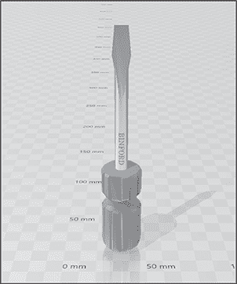

# 13 案例研究：检测意识攻击


到目前为止，我们已经讨论了 EDR 的设计、其组件的逻辑以及传感器的内部工作原理。然而，我们错过了一个至关重要的环节：如何在现实世界中应用这些信息。在本章中，我们将系统地分析我们希望针对目标系统采取的行动，并评估被检测到的风险。

我们将以一家虚构公司 Binford Tools 为目标，Binford 6100 左手螺丝刀的发明者。Binford 请求我们识别从被入侵的用户工作站到存储 6100 机密设计信息的数据库的攻击路径。我们需要尽可能隐蔽，以便公司能了解其 EDR 能够检测到什么。让我们开始吧。

## 交战规则

Binford 的环境仅由运行最新版本 Windows 操作系统的主机构成，所有认证均通过内部的 Active Directory 控制。每台主机都部署并运行了一个通用的 EDR，且我们在任何时候都不能禁用、移除或卸载它。

我们的联系人已同意提供一个目标电子邮件地址，一个员工（我们称之为*白细胞*）将监控该邮箱，点击我们发送的任何链接。然而，他们不会添加任何明确允许我们的有效载荷绕过其 EDR 的规则。这将使我们能减少社交工程的时间，将更多精力集中在评估技术检测和防范措施上。

此外，Binford 的每个员工都拥有其工作站的本地管理员权限，这样可以减轻 Binford 帮助台的负担。Binford 要求我们在操作中利用这一点，以便他们能利用此次活动的结果推动政策的改变。

## 初始访问

我们首先选择我们的钓鱼方法。我们需要快速直接访问目标的工作站，因此我们选择传送有效载荷。在此次行动时的威胁情报报告告诉我们，制造行业正在经历使用 Excel 插件（XLL）文件投放恶意软件的案件激增。攻击者常常滥用 XLL 文件（它允许开发者创建高性能的 Excel 工作表函数）通过钓鱼建立立足点。

为了模拟 Binford 可能在未来响应的攻击，我们选择使用这种格式作为我们的有效载荷。XLL 文件其实就是需要导出一个 xlAutoOpen() 函数（理想情况下，还有其补充函数 xlAutoClose()）的 DLL 文件，因此我们可以使用简单的 shellcode 运行器来加速开发过程。

### 编写有效载荷

现在，我们必须做出与检测相关的设计决策。我们是应该在本地，即在 *excel.exe* 进程中运行 shellcode，让它与该进程的生命周期绑定，还是应该远程运行它？如果我们创建了自己的宿主进程并将其注入，或者我们针对了一个现有进程，我们的 shellcode 可以运行得更久，但由于 *excel.exe* 启动了子进程，且远程进程注入的痕迹可能存在，检测的风险也会更高。

由于我们以后总可以进行更多钓鱼攻击，因此我们选择使用本地运行器，并避免过早触发任何检测。列表 13-1 显示了我们的 XLL 有效载荷代码的样子。

```
#define WIN32_LEAN_AND_MEAN
#include <windows.h>

BOOL APIENTRY DllMain(HMODULE hModule,
                      DWORD ul_reason_for_call,
                      LPVOID lpReserved
                                    )
{
    switch (ul_reason_for_call)
    {
    case DLL_PROCESS_ATTACH:
    case DLL_THREAD_ATTACH:
    case DLL_THREAD_DETACH:
    case DLL_PROCESS_DETACH:
        break;
    }

    return TRUE;
}

extern "C"
__declspec(dllexport) short __stdcall xlAutoOpen()
{
  ❶ const char shellcode[] = `--snip--`
    const size_t lenShellcode = sizeof(shellcode);
    char decodedShellcode[lenShellcode];
  ❷ const char key[] = "specter";

    int j = 0;
    for (int i = 0; i < lenShellcode; i++)
    {
        if (j == sizeof(key) - 1)
        {
            j = 0;
        }

      ❸ decodedShellcode[i] = shellcode[i] ^ key[j];
        j++;
    }

  ❹ PVOID runIt = VirtualAlloc(0,
        lenShellcode,
        MEM_COMMIT,
        PAGE_READWRITE);

    if (runIt == NULL)
    {
        return 1;
    }

  ❺ memcpy(runIt,
        decodedShellcode,
        lenShellcode); DWORD oldProtect = 0;
  ❻ VirtualProtect(runIt,
        lenShellcode,
        PAGE_EXECUTE_READ,
        &oldProtect);

  ❼ CreateThread(NULL,
        NULL,
        (LPTHREAD_START_ROUTINE)runIt,
        NULL,
        NULL,
        NULL);

    Sleep(1337);
    return 0;
}
```

列表 13-1：XLL 有效载荷源代码

这个本地 shellcode 运行器类似于许多基于 DLL 的有效载荷。导出的 xlAutoOpen() 函数首先包含一段 shellcode（为简洁起见已截断）❶，这段代码使用字符串 *specter* 作为密钥进行了 XOR 加密❷。该函数的第一个操作是使用该对称密钥解密 shellcode❸。接着，它使用 kernel32!VirtualAlloc() 创建一个带有读写权限的内存分配❹，并将解密后的 shellcode 复制到该内存中❺，为执行做好准备。然后，函数将新缓冲区的内存权限更改为可执行❻。最后，指向缓冲区的指针被传递给 kernel32!CreateThread()，它在新线程中执行该 shellcode❼，仍然是在 *excel.exe* 的上下文中运行。

### 投放有效载荷

我们假设 Binford 的入站邮件过滤系统允许 XLL 文件进入用户的收件箱，并将文件发送到白细胞。由于 XLL 需要从磁盘运行，白细胞将把它下载到部署了 EDR 的内部主机上。

当白细胞执行 XLL 文件时，几件事情将会发生。首先，*excel.exe* 将启动，并将 XLL 的路径作为参数传递进去。EDR 几乎可以肯定会通过其驱动程序的进程创建回调例程收集此信息（尽管 Microsoft-Windows-Kernel-Process ETW 提供者可以提供大部分相同的信息）。EDR 可能会围绕 XLL 文件的执行构建一个通用的检测机制，进程命令行可能会触发该检测，从而导致警报。

此外，EDR 的扫描器可能会对 XLL 文件进行访问扫描。EDR 将收集文件的属性，评估其内容，并尝试决定是否允许其运行。假设我们已经通过极好的混淆技术使得有效载荷中的 shellcode 和相关的运行器没有被扫描器检测到。

不过，我们还没有完全安全。记住，大多数 EDR 都部署在多个大规模环境中，并处理大量数据。考虑到这一点，EDR 可以评估文件的*全球唯一性*，即它过去见过多少次这个文件。由于我们自己编写了这个有效载荷，并且它包含与我们基础设施相关的 shellcode，因此它很可能是之前从未见过的。

幸运的是，这并不是想象中的终点。用户们一直在创建新的 Word 文档。他们为自己的组织生成报告，在会议的第三小时中用画图工具涂鸦，讨论“跨部门协作以实现关键季度目标”。如果 EDR 标记它们遇到的每一个唯一文件，系统就会产生难以承受的噪音。虽然我们的全球唯一性可能会触发某种警报，但它可能不足以启动调查，除非安全运营中心（SOC）响应与我们的活动相关的高严重性警报。

### 执行有效载荷

由于我们还没有被拦截，*excel.exe* 将加载并处理我们的 XLL。只要我们的 XLL 被加载，它将触发 DLL_PROCESS_ATTACH 代码，这将触发我们 shellcode 执行器的执行。

当我们的父进程*excel.exe*被启动时，EDR 注入了它的 DLL，并挂钩了我们此时尚不知情的关键函数。我们没有使用系统调用，也没有包含任何重新映射这些挂钩 DLL 的逻辑，因此我们必须通过这些挂钩，希望自己不会被捕捉到。幸运的是，许多 EDR 通常挂钩的函数主要关注远程进程注入，而这对我们没有影响，因为我们没有创建子进程来进行注入。

我们还知道，这款 EDR 使用了 Microsoft-Windows-Threat-Intelligence ETW 提供程序，因此我们的活动将受到这些传感器的监控，此外还会受到 EDR 供应商自身功能挂钩的监控。让我们来审视一下我们在有效载荷中调用的函数的风险：

kernel32!VirtualAlloc()

由于这是 Windows 中标准的本地内存分配函数，并且不允许进行远程分配（即内存分配到另一个进程中），因此它的使用可能不会被单独审查。另外，因为我们没有分配可读写执行内存，这通常是恶意软件开发人员的默认选择，所以我们已经尽可能减轻了所有风险。

memcpy()

与前面的函数类似，memcpy() 是一个广泛使用的函数，通常不会受到太多审查。

kernel32!VirtualProtect()

这就是我们变得更加危险的地方。因为我们必须将分配的保护从读写转换为读执行，这一步是无法避免的。不幸的是，由于我们将所需的保护级别作为参数传递给了此函数，EDR 可以轻松地通过函数挂钩来识别这种技术。此外，nt!EtwTiLogProtectExecVm() 传感器将检测到保护状态的变化，并通知 Microsoft-Windows-Threat-Intelligence ETW 提供者的消费者。

kernel32!CreateThread()

单独来看，这个函数并没有太大风险，因为它是多线程 Win32 应用程序中创建新线程的标准方式。然而，由于我们已经执行了之前的三个操作，组合起来可能表明系统中存在恶意软件，因此它的使用可能就是压垮骆驼的最后一根稻草，导致警报触发。不幸的是，我们没有太多的选择来避免使用它，所以我们只能坚持下去，并希望如果我们已经走到这一步，我们的 shellcode 就会成功执行。

这种 shellcode 运行技术可以通过很多方式进行优化，但与教科书中基于 kernel32!CreateRemoteThread() 的远程进程注入方法相比，它还算不错。如果我们假设这些指标能够躲过 EDR 的传感器，那么我们的代理 shellcode 将会执行并开始与我们的命令与控制基础设施进行通信。

### 建立命令与控制

大多数恶意代理以类似的方式建立命令与控制。代理向服务器发送的第一条消息是一个签到信息：“我是主机 X 上的新代理！”当服务器接收到这个签到消息时，它会回复：“你好，主机 X 上的代理！休眠一段时间后，再次向我发送消息以获取任务。”然后，代理会按照服务器指定的时间进行空闲，之后再次发送消息：“又回来啦。这次我准备好执行任务了。”如果操作员为代理指定了任务，服务器会以某种代理能够理解的格式传递这些信息，代理会执行任务。否则，服务器会告诉代理休眠并稍后再试。

命令与控制代理如何逃避基于网络的检测？大多数情况下，通信发生在 HTTPS 上，这是大多数操作员的最爱通道，因为它可以让他们的消息与通过 TCP 443 端口常规流向互联网的大量流量混合。在使用此协议（及其不太安全的姊妹协议 HTTP）时，通信必须遵循某些约定。

例如，一个请求必须为 GET 请求（用于检索数据）和 POST 请求（用于发送数据）提供一个*统一资源标识符（URI）*路径。虽然这些 URI 在每个请求中技术上不必相同，但许多商业指挥与控制框架会重复使用一个静态 URI 路径。此外，代理和服务器必须有一个约定的通信协议，基于 HTTPS。这意味着它们的消息通常遵循类似的模式。例如，签到请求和任务轮询的长度可能是静态的，且可能以固定的时间间隔发送。

这一切的意思是，即使指挥与控制流量试图在噪声中混淆，它仍然会生成强烈的信标活动指示符。一个知道该寻找什么的 EDR 开发者可以利用这些指示符将恶意流量从正常流量中挑出来，可能会使用网络过滤驱动程序和像 Microsoft-Windows-WebIO、Microsoft-Windows-DNS-Client 等 ETW 提供者。虽然 HTTPS 消息的内容是加密的，但许多重要的细节仍然可以读取，例如 URI 路径、头信息、消息长度以及消息发送的时间。

知道了这一点，我们如何设置我们的指挥与控制？我们的 HTTPS 通道使用域名 blnfordtools.com。我们在操作前几周购买了该域名，将 DNS 指向了一个 DigitalOcean 虚拟私人服务器（VPS），并在 VPS 上配置了 NGINX Web 服务器，使用 LetsEncrypt SSL 证书。GET 请求将被发送到*/home/catalog*端点，POST 请求将发送到*/search?q=6100*，希望这些请求能融入到浏览工具制造商网站时产生的正常流量中。我们将默认的休眠间隔设置为五分钟，以便我们能迅速下发任务给代理而不会过于引人注目，并且使用 20%的抖动来增加请求时间的变化性。

这种指挥与控制策略看起来可能不安全；毕竟，我们使用的是一个新注册的、被拼写错误劫持的域名，且托管在一个便宜的 VPS 上。但让我们考虑一下 EDR 的传感器实际上可以捕获到什么：

+   一个可疑的进程正在建立出站网络连接

+   异常的 DNS 查询

值得注意的是，所有与我们基础设施相关的奇怪行为和信标活动的指示符都没有出现。

尽管 EDR 的传感器可以收集到所需的数据，从而确定被攻陷的主机正在连接一个新注册的、未分类的域名，该域名指向一个可疑的 VPS，但实际上执行这些操作意味着要进行大量的支持性工作，这可能会对系统性能产生负面影响。

例如，为了跟踪域名分类，EDR 需要联系一个声誉监控服务。为了获取注册信息，它需要查询注册商。为了对目标系统上的所有连接执行这一切操作将是困难的。因此，EDR 代理通常将这些责任转移到中央 EDR 服务器上，服务器异步执行查找，并在必要时根据结果触发警报。

信标的指标缺失几乎是由于相同的原因。如果我们的休眠间隔是像 10 秒钟并且带有 10%的抖动，检测信标可能就像遵循以下规则那样简单：“如果该系统在每次请求之间的间隔为 9 到 11 秒，且发送超过 10 次请求到一个网站，则触发警报。”但是，当休眠间隔为五分钟且带有 20%的抖动时，系统必须在每个端点每次请求之间间隔四到六分钟的情况下生成警报，这将要求维持每个出站网络连接的滚动状态，持续时间为 40 分钟到 1 小时。想象一下你每天访问多少个网站，你就能明白为什么这个功能更适合放在中央服务器上。

### 规避内存扫描器

对初始访问阶段（以及任何我们派发代理的未来阶段）构成的最后一个重大威胁是 EDR 的内存扫描器。与文件扫描器类似，这个组件通过静态签名寻求检测系统中恶意软件的存在。它不是从磁盘读取文件并解析其内容，而是在文件被映射到内存后扫描它。这使得扫描器可以评估文件的内容，在它被去混淆后，再将其传递给 CPU 执行。就我们的载荷而言，这意味着我们的解密代理 shellcode 将存在于内存中；扫描器只需找到它并识别为恶意代码。

一些代理程序包含了在非活动期间隐藏代理存在于内存中的功能。这些技术的效果各不相同，扫描器仍然可能通过捕捉代理在这些休眠期之间的活动来检测到 shellcode。即便如此，定制的 shellcode 和定制的代理通常更难通过静态签名进行检测。我们假设我们的定制、手工制作的指令与控制代理足够新颖，能够避开内存扫描器的检测。

到此为止，一切对我们有利：我们最初的信标没有触发任何值得 SOC 关注的警报。我们已经建立了对目标系统的访问权限，并可以开始进行事后渗透活动。

## 持久性

现在我们已经进入目标环境，需要确保能够应对技术性或人为引起的连接中断。在这一阶段，我们的访问如此脆弱，如果我们的代理出了问题，我们就必须从头开始。因此，我们需要设置某种持久性机制，如果情况变糟，可以建立新的指挥与控制连接。

持久性是一件棘手的事情。我们可以选择的选项数量庞大，每个选项都有优缺点。一般来说，我们在选择持久性技术时会评估以下度量标准：

**可靠性**   持久性技术触发我们行动的确定性程度（例如，启动一个新的指挥与控制代理）

**可预测性**   持久性触发时的确定性程度

**所需权限**   设置该持久性机制所需的访问级别

**所需的用户或系统行为**   为了触发我们的持久性，系统必须发生的任何操作，例如系统重启或用户闲置

**检测风险**   该技术固有的检测风险

让我们以创建计划任务为例。表 13-1 展示了该技术如何使用我们的度量标准执行。最初一切看起来都很不错。计划任务像劳力士一样运行，非常容易设置。我们遇到的第一个问题是，创建新的计划任务需要本地管理员权限，因为相关的目录，*C:\Windows\System32\Tasks\*，标准用户无法访问。

表 13-1： 评估计划任务作为持久性机制

| 度量 | 评估 |
| --- | --- |
| 可靠性 | 高度可靠 |
| 可预测性 | 高度可预测 |
| 所需权限 | 本地管理员 |
| 所需的用户或系统行为 | 触发时系统必须连接到网络 |
| 检测风险 | 非常高 |

然而，对我们来说，最大的问题是检测风险。攻击者利用计划任务已经有几十年的历史了。可以公平地说，任何一个值得信赖的 EDR 代理都能够检测到新计划任务的创建。事实上，MITRE 的*ATT&CK 评估*，这是一个许多供应商每年参与的能力验证过程，使用计划任务创建作为 APT3（一个被归类为中国国家安全部的高级持续性威胁组织）测试标准之一。由于保持隐蔽性是我们的一个重要目标，这种技术对我们来说是不适用的。

那么，我们应该选择哪种持久性机制呢？几乎每个 EDR 供应商的营销活动都声称它覆盖了大多数已分类的 ATT&CK 技术。ATT&CK 是一个我们了解并且在追踪的已知攻击者技术的集合。但未知的技术呢？那些我们大多数还不了解的技术呢？供应商无法保证涵盖这些技术；它们也无法与这些技术进行评估。即使一个 EDR 具备检测这些未分类技术的能力，它也可能没有适当的检测逻辑来理解这些技术生成的遥测数据。

为了降低被检测的可能性，我们可以研究、识别并开发这些“已知的未知”。为此，我们使用*Shell 预览处理程序*，这是一种持久性技术，我和我的同事 Emily Leidy 曾在博客文章《Life Is Pane: 通过预览处理程序实现持久性》中发表过研究。预览处理程序安装一个应用程序，当在 Windows 资源管理器中查看具有特定扩展名的文件时，它会呈现该文件的预览。在我们的案例中，我们注册的应用程序将是我们的恶意软件，它将启动一个新的命令和控制代理。这个过程几乎完全是在注册表中完成的；我们将创建新的键值来注册一个 COM 服务器。表 13-2 评估了这一技术的风险。

表 13-2： 评估 Shell 预览处理程序作为持久性机制

| 度量标准 | 评估 |
| --- | --- |
| 可靠性 | 高度可靠 |
| 可预测性 | 不可预测 |
| 所需权限 | 标准用户 |
| 所需的用户或系统行为 | 用户必须在资源管理器中浏览目标文件类型，并启用预览窗格，或者搜索索引器必须处理该文件 |
| 检测风险 | 目前较低，但容易被检测到 |

如你所见，这些“已知的未知”在某些方面会交换优点和弱点。预览处理程序需要的权限较少，并且更难被检测到（尽管仍然可能被检测到，因为它们的安装需要在主机上进行非常特定的注册表更改）。然而，由于需要用户交互，它们比计划任务更难以预测。对于检测不是重大问题的操作来说，可靠性和可用性可能会超过其他因素。

假设我们使用这个持久化机制。在 EDR 中，传感器现在正在努力收集与劫持的预览处理程序相关的遥测数据。我们不得不将一个包含我们备份代理程序的 DLL 从*excel.exe*写入磁盘，因此扫描器可能会对其进行彻底检查，假设 Excel 写入新 DLL 这一行为本身不够可疑。我们还必须创建大量的注册表项，由驱动程序的注册表通知回调例程处理这些注册表项。

此外，我们的操作生成的与注册表相关的遥测数据可能有些难以管理。这是因为 COM 对象注册很难从大量的注册表数据中筛选出来，而且很难将无害的 COM 对象注册与恶意的注册区分开来。此外，虽然 EDR 可以监控新预览处理程序注册表项值的创建，因为它有一个标准格式和位置，但这需要在类标识符（作为值写入）和与该类标识符相关的 COM 对象注册之间进行查找，而这在传感器级别是不可行的。

另一个检测风险是我们手动启用 Explorer 的预览窗格。单独来看，这并不是疯狂的行为。用户可以随时通过文件浏览器手动启用或禁用预览窗格。它也可以通过组策略对象在整个企业范围内启用。在这两种情况下，进行更改的进程（例如，在手动启用的情况下是*explorer.exe*）是已知的，这意味着可能会有一个检测针对不寻常进程设置此注册表值的机制。如果*excel.exe*进行此更改，那就完全不寻常了。

最后，每当持久化被触发时，Explorer 都必须加载我们的 DLL。这个 DLL 不会由微软签名（或者可能根本不被签名）。驱动程序的图像加载回调通知例程将负责检测这个 DLL 是否被加载，并可以检查该图像的签名以及其他元数据，从而提示代理即将将一段恶意软件映射到 Explorer 的地址空间。当然，我们可以通过使用有效的代码签名证书来签署我们的 DLL，从而缓解一些风险，但这对于许多威胁行为者来说，无论是现实中的还是模拟的，都是无法实现的。

我们将在可预测性方面做出权衡，以降低被检测的风险。我们选择通过将处理程序 DLL 写入磁盘、执行所需的 COM 注册，并在注册表中手动启用资源管理器的预览窗格（如果它尚未启用）来安装一个预览处理程序，用于*.docx*文件扩展名。

## 侦察

现在我们已经建立了持久性，我们可以开始冒更多的风险。接下来，我们需要弄清楚如何到达目标位置。这时你必须最为谨慎地考虑检测问题，因为根据你做什么以及如何做，你会生成完全不同的指示器。

我们需要一种方法来运行侦察工具而不被检测到。我最喜欢的本地侦察工具之一是 Seatbelt，这是一款由 Lee Christensen 和 Will Schroeder 编写的基于主机的态势感知工具。它可以枚举大量关于当前系统的信息，包括正在运行的进程、映射的驱动器以及系统在线的时间。

运行 Seatbelt 的一种常见方法是使用命令与控制代理的内置功能，例如 Cobalt Strike Beacon 的 execute-assembly，将其.NET 程序集加载到内存中执行。通常，这涉及到生成一个牺牲进程，将.NET 公共语言运行时加载到其中，并指示它运行指定的.NET 程序集，并传入提供的参数。

这种技术比试图将工具放置到目标的文件系统上并从那里执行它的检测风险要小得多，但它并非没有风险。事实上，EDR 可能会通过各种方式抓住我们：

**子进程创建**

EDR 的进程创建回调程序可能会检测到牺牲进程的创建。如果父进程的子进程是非典型的，它可能会触发警报。

**异常模块加载**

父进程生成的牺牲进程通常不会加载公共语言运行时，如果它是一个非托管进程。这可能会引起 EDR 的映像加载回调程序的警觉，表明正在使用内存中的.NET 技术。

**公共语言运行时 ETW 事件**

每当公共语言运行时被加载并运行时，它会通过 Microsoft-Windows-DotNETRuntime ETW 提供程序发出事件。这允许消费其事件的 EDR 识别与系统上执行的程序集相关的关键信息，例如它们的命名空间、类和方法名称以及平台调用签名。

**反恶意软件扫描接口**

如果我们加载了 4.8 版或更高版本的.NET 公共语言运行时，AMSI 就成了我们的关注点。AMSI 将检查我们程序集的内容，每个注册的提供者都有机会确定其内容是否恶意。

**公共语言运行时钩子**

尽管本书没有直接涉及这一技术，但许多 EDR（端点检测与响应）使用钩子在公共语言运行时上拦截特定的执行路径，检查参数和返回值，并可选择性地阻止它们。例如，EDR 通常监控*反射*，这是.NET 的一个特性，允许操作已加载的模块等内容。以这种方式钩住公共语言运行时的 EDR 可能能够看到 AMS 独立无法检测到的内容，并发现对已加载的*amsi.dll*的篡改。

**工具特定指标**

我们的工具加载后所采取的操作可能会生成额外的指标。例如，Seatbelt 会查询许多注册表键值。

简而言之，大多数厂商知道如何识别内存中.NET 程序集的执行。幸运的是，我们有一些替代程序以及可以做出的技术决策，可以帮助我们减少暴露风险。

一个例子是*InlineExecute-Assembly* Beacon 对象文件，这是 Cobalt Strike 的 Beacon 的一个开源插件，允许操作员执行正常的 execute-assembly 模块所能做的一切，但不需要生成新的进程。在技术操作方面，如果我们当前的进程是受管理的（例如，.NET），那么加载公共语言运行时将是预期的行为。将这些与绕过 AMSI 和.NET 运行时 ETW 提供程序结合使用，我们就将检测风险限制到了任何放置在公共语言运行时的钩子和工具特有的指标，而这些可以独立处理。如果我们实施这些技术手段和程序性变化，我们就处于一个相对安全的位置，可以顺利运行 Seatbelt。

## 特权升级

我们知道我们需要扩展对 Binford 环境中其他主机的访问权限。我们还知道，根据我们的联系人，我们当前的用户权限较低，并没有被授予远程系统的管理员访问权限。然而，记住，Binford 为所有域用户在指定的工作站上授予本地管理员权限，这样他们就可以安装应用程序，而不会让帮助台团队负担过重。这一切意味着，除非我们能够进入另一个用户的上下文，否则我们无法在网络中移动，但我们也有一些方法可以实现这一目标。

为了获取另一个用户的身份，我们可以从 LSASS 中提取凭据。不幸的是，使用 PROCESS_VM_READ 权限打开 LSASS 的句柄，在面对现代 EDR 时可能会给我们的操作带来致命风险。有许多方法可以绕过使用这些权限打开句柄，例如窃取其他进程打开的句柄，或者用 PROCESS_DUP_HANDLE 权限打开句柄，然后在调用 kernel32!DuplicateHandle() 时更改请求的权限。然而，我们仍然在运行 *excel.exe*（如果我们的持久化机制已启动，则可能是 *explorer.exe*），打开一个新进程句柄可能会引起进一步的调查，甚至可能会直接生成警报。

如果我们想以另一个用户的身份行事，但又不想接触 LSASS，我们仍然有很多选择，特别是因为我们是本地管理员。

### 获取常用用户列表

我最喜欢的一种方法是针对我知道已经登录系统的用户。为了查看可用的用户，我们可以运行 Seatbelt 的 LogonEvents 模块，该模块可以告诉我们最近有哪些用户登录过。这将生成一些与 Seatbelt 的默认命名空间、类和方法名称相关的指示符，但我们可以在编译程序集之前简单地更改这些名称。一旦我们从 Seatbelt 获取结果，我们还可以使用 *dir* 或等效的目录列出工具检查 *C:\Users\* 下的子目录，看看哪些用户在系统上有主文件夹。

我们执行 LogonEvents 模块时，返回了过去 10 天内用户 *TTAYLOR.ADMIN@BINFORD.COM* 的多个登录事件。从名字推测，我们可以假定该用户是某个系统的管理员，尽管我们不确定具体是哪个系统。

### 劫持文件处理程序

下面是两种针对你正在操作的系统用户的攻击方法：通过在用户桌面上为他们经常打开的应用程序（如浏览器）植入一个*.lnk*文件，或者通过注册表修改劫持目标用户的文件处理程序。这两种技术都依赖于在主机上创建新文件。然而，*.lnk*文件的使用已经在公共报告中得到了广泛的覆盖，因此其创建可能会被检测到。文件处理程序劫持较少受到关注。因此，它们的使用可能对我们操作的安全性构成较小的风险。

对于不熟悉这种技术的读者，让我们来介绍相关的背景信息。Windows 需要知道哪些应用程序可以打开具有特定扩展名的文件。例如，浏览器默认打开*.pdf*文件，尽管用户可以更改这个设置。这些扩展名到应用程序的映射存储在注册表中，系统范围内的处理程序存储在*HKLM:\Software\Classes\*，而每个用户的注册信息存储在*HKU:\<SID>\SOFTWARE\Classes\*中。

通过将特定文件扩展名的处理程序更改为我们实现的程序，我们可以让我们的代码在打开被劫持文件类型的用户的上下文中执行。然后，我们可以打开合法的应用程序，欺骗用户以为一切正常。为了使其工作，我们必须创建一个工具，首先运行我们的代理 shellcode，然后将要打开的文件的路径代理到原始文件处理程序。

shellcode 执行部分可以使用任何执行我们代理代码的方法，因此它将继承该执行方法特有的指示符。这与我们最初的访问载荷相同，因此我们不会再次详细讨论。代理部分可以像调用kernel32!CreateProcess()一样简单，将操作系统在用户尝试打开文件时传递的参数传递给目标文件处理程序。根据劫持的目标，这可能会创建一个异常的父子进程关系，因为我们的恶意中介处理程序将成为合法处理程序的父进程。在其他情况下，如*.accountpicture-ms*文件，处理程序是一个被加载到*explorer.exe*中的 DLL，这样子进程看起来更像是*explorer.exe*的子进程，而不是另一个可执行文件的子进程。

#### 选择文件扩展名

因为我们仍在运行*excel.exe*，所以修改任意文件处理程序的二进制文件可能会引起 EDR 监控注册表事件时的异常。然而，Excel 直接负责某些文件扩展名的处理，例如*.xlsx*和*.csv*。如果检测是一个问题，最好选择一个适合上下文的处理程序。

不幸的是，微软已经实施了一些措施，限制了我们通过直接修改注册表来更改与某些文件扩展名关联的处理程序的能力；它检查每个应用程序和用户特有的哈希值。我们可以通过查找包含名为 Hash 的 UserChoice 子键来枚举这些受保护的文件扩展名。受保护的文件扩展名包括 Office 文件类型（如 *.xlsx* 和 *.docx*）、*.pdf*、*.txt* 和 *.mp4* 等。如果我们想劫持与 Excel 相关的文件扩展名，我们需要以某种方式弄清楚微软用于生成这些哈希值的算法，并重新实现它。

幸运的是，GitHub 用户“default-username-was-already-taken”提供了所需哈希算法的 PowerShell 版本，*Set-FileAssoc.ps1*。使用 PowerShell 可能会有些棘手；它会受到 AMSI、高级脚本块日志记录以及消费者监视相关 ETW 提供程序的严格审查。有时，*powershell.exe* 的启动本身就可能触发对可疑进程的警报。

因此，我们的目标是以最安全的方式使用 PowerShell，尽可能降低暴露的风险。让我们仔细看看，在目标系统上执行这个脚本可能如何导致我们被发现，以及我们可以采取哪些措施来降低风险。

#### 修改 PowerShell 脚本

如果你自己查看这个脚本，你会发现它并不令人过于担忧；它看起来像是一个标准的管理工具。脚本首先为 advapi32!RegQueryInfoKey() 函数设置一个 P/Invoke 签名，并添加一个名为 HashFuncs 的自定义 C# 类。它定义了几个与注册表交互、枚举用户和计算 UserChoice 哈希值的辅助函数。最后一块执行脚本，设置指定文件扩展名的新文件处理程序和哈希值。

这意味着我们不需要做太多修改。我们需要担心的唯一问题是一些静态字符串，因为这些是传感器会捕捉到的内容。我们可以删除绝大部分这些字符串，因为它们是为了调试目的而包含的。其余的我们可以重命名，或者*篡改*。这些字符串包括变量的内容，以及脚本中使用的变量名、函数名、命名空间和类名。所有这些值完全由我们控制，因此我们可以根据需要随意更改它们。

然而，我们确实需要小心修改这些值。EDR 可以通过查看字符串的熵或随机性来检测脚本混淆。在一个真正随机的字符串中，字符应该均匀分布。在英语中，五个最常用的字母是 E、T、A、O 和 I；较少使用的字母包括 Z、X 和 Q。将我们的字符串重命名为像 *z0fqxu5* 和 *xyz123* 这样的值，可能会引起 EDR 对高熵字符串的警觉。相反，我们可以简单地使用英语单词，如 *eagle* 和 *oatmeal*，来进行字符串替换。

#### 执行 PowerShell 脚本

接下来我们需要做出的决定是如何执行这个 PowerShell 脚本。以 Cobalt Strike Beacon 为例的代理，我们在命令与控制代理中有几个现成的选项：

1.  将文件放到磁盘上，并直接用 *powershell.exe* 执行它。

1.  使用下载框架和 *powershell.exe* 在内存中执行脚本。

1.  使用未管理的 PowerShell（*powerpick*）在牺牲进程中执行脚本。

1.  将未管理的 PowerShell 注入到目标进程并在内存中执行脚本（*psinject*）。

选项 1 是最不推荐的，因为它涉及 Excel 很少执行的活动。选项 2 稍好一些，因为我们不再需要将脚本放到主机的文件系统上，但它引入了高度可疑的指示符，包括在我们从载荷托管服务器请求脚本时生成的网络工件以及 Excel 调用 *powershell.exe* 并从互联网上下载脚本的行为。

选项 3 比前两个略好一些，但也不是没有风险。创建子进程始终是危险的，尤其是与代码注入结合时。选项 4 并不比选项 3 好多少，因为它去掉了创建子进程的要求，但仍然需要打开对现有进程的句柄并向其中注入代码。

如果我们认为选项 1 和 2 不可行，因为我们不希望 Excel 启动 *powershell.exe*，那么我们就只剩下在选项 3 和 4 之间做出选择。没有绝对正确的答案，但我觉得使用牺牲进程的风险比注入到另一个进程中的风险更能接受。牺牲进程将在脚本执行完成后终止，从主机中移除持久性工件，包括加载的 DLL 和内存中的 PowerShell 脚本。如果我们注入到另一个进程中，这些指标即使在脚本执行完成后，仍可能会保留在宿主进程中。因此，我们将选择选项 3。

接下来，我们需要决定我们的劫持目标是什么。如果我们想要不加区分地扩展访问权限，我们会劫持整个系统的扩展名。但是，我们的目标是用户 *TTAYLOR.ADMIN*。由于我们在当前系统上具有本地管理员权限，因此我们可以通过 *HKU* hive 修改特定用户的注册表键，前提是我们知道该用户的安全标识符（SID）。

幸运的是，有一种方法可以从 Seatbelt 的 LogonEvents 模块中获取 SID。每个 4624 事件都会在 SubjectUserSid 字段中包含用户的 SID。Seatbelt 在代码中将此属性注释掉，以保持输出的简洁，但我们可以简单地取消注释该行并重新编译工具，以便在不运行其他任何操作的情况下获取该信息。

#### 构建恶意处理程序

收集了所有必要的信息后，我们可以劫持仅针对该用户的 *.xlsx* 文件扩展名的处理程序。我们需要做的第一件事是创建恶意处理程序。这个简单的应用程序将执行我们的 shellcode，然后打开目标文件句柄，这应该会以用户预期的方式打开用户选择的文件。此文件需要写入目标文件系统，因此我们知道我们将在上传时或根据 EDR 的 minifilter 配置在首次调用时被扫描。为了减少一些风险，我们可以通过混淆恶意处理程序的方式，尽可能地避免被扫描工具发现。

我们需要掩盖的第一个大问题是文件中悬挂的巨大的代理 shellcode 数据块。如果我们不对其进行混淆，成熟的扫描器会很快识别出我们的处理程序是恶意的。我最喜欢的一种掩盖这些代理 shellcode 数据块的方法叫做 *环境键控*。其大致思路是，使用从系统或运行环境中某些唯一属性派生的对称密钥加密 shellcode。这个属性可以是从目标的内部域名到系统硬盘的序列号等任何内容。

在我们的案例中，我们的目标是用户 *TTAYLOR.ADMIN@BINFORD.COM*，所以我们使用他们的用户名作为我们的密钥。因为我们希望密钥在我们的有效载荷落入事件响应者手中时难以暴力破解，我们通过重复字符串将密钥填充为 32 个字符，生成的对称密钥如下：*TTAYLOR.ADMIN@BINFORD.COMTTAYLOR*。我们还可以将其与其他属性（如系统的当前 IP 地址）结合，以增加字符串的多样性。

在我们的有效载荷开发系统中，我们生成代理壳码并使用对称密钥算法——比如 AES-256——以及我们的密钥对其进行加密。然后，我们将未混淆的壳码替换为加密后的二进制数据。接下来，我们需要添加密钥衍生和解密函数。为了获取我们的密钥，载荷需要查询执行用户的用户名。有一些简单的方法可以做到这一点，但请记住，衍生方法越简单，熟练的分析师越容易逆向推断其逻辑。识别用户姓名的方法越隐蔽越好；我将找到合适策略的任务留给读者。解密函数则更加直接。我们只需将密钥填充至 32 字节，然后通过标准的 AES-256 解密实现将加密的壳码和密钥传入，最后保存解密后的结果。

现在，诀窍来了。只有我们预定的用户应该能够解密载荷，但我们不能保证它不会落入 Binford 的 SOC 或托管安全服务提供商的手中。为了应对这种可能性，我们可以使用一个*篡改传感器*，其工作原理如下。如果解密按预期工作，解密后的缓冲区将被已知内容填充，我们可以对其进行哈希处理。如果使用了错误的密钥，结果缓冲区将无效，导致哈希不匹配。我们的应用程序可以在执行解密后的缓冲区之前对其哈希进行计算，并在检测到哈希不匹配时通知我们。这个通知可以是向一个 Web 服务器发送的 POST 请求，或者像更改我们监控系统中特定文件的时间戳这样微妙的动作。然后，我们可以启动完整的基础设施拆解，以防事件响应人员开始攻击我们的基础设施，或简单地收集故障信息并做出相应调整。

由于我们知道只会在一个主机上部署此有效载荷，因此我们选择时间戳监控方法。这种方法的实现无关紧要，而且检测的痕迹非常小；我们只是更改一些深藏在某个目录中的文件的时间戳，然后使用一个持久守护进程来监视它的变化，并在发现变化时通知我们。

现在，我们需要弄清楚合法处理程序的位置，以便将打开*.xlsx*文件的请求代理到它。我们可以从特定用户的注册表中获取这个路径，如果我们知道他们的 SID，而我们的修改版 Seatbelt 工具告诉我们，*TTAYLOR.ADMIN@BINFORD.COM*的 SID 是*S-1-5-21-486F6D6549-6D70726F76-656D656E7-1032*。我们在*HKU:\S-1-5-21-486F6D6549-6D70726F76-656D656E7-1032\SOFTWARE\Microsoft\Windows\CurrentVersion\Extensions*中查询*xlsx*值，这将返回*C:\Program Files (x86)\Microsoft Office\Root\Office16\EXCEL.EXE*。然后，在我们的处理程序中，我们编写一个快速函数来调用kernel32!CreateProcess()，并传递真实*excel.exe*的路径，以及第一个参数，它将是要打开的*.xlsx*文件的路径。这个操作应该在我们的 shellcode 运行器之后执行，但不应等待它完成，以便生成的代理程序对用户是明显的。

#### 编译处理程序

在编译我们的处理程序时，有几件事我们需要做以避免被检测。这些包括：

**删除或混淆所有字符串常量**   这将减少基于我们代码中使用的字符串生成签名或触发签名的可能性。

**禁用程序数据库（PDB）文件的创建**   这些文件包含用于调试我们应用程序的符号，而我们在目标系统上不需要这些文件。它们可能会泄露有关我们构建环境的信息，例如项目编译时的路径。

**填充图像详情**   默认情况下，我们编译的处理程序在检查时只包含基本信息。为了让内容看起来更真实，我们可以填充发布者、版本、版权信息以及在文件属性的“详细信息”标签中看到的其他信息。

当然，我们可以采取额外的措施来进一步保护我们的处理程序，例如使用 LLVM 来混淆编译的代码，并用代码签名证书对*.exe*进行签名。但由于这种技术被检测到的风险已经相当低，并且我们已经采取了一些保护措施，因此我们将这些额外的措施留待以后再说。

一旦我们将这些优化应用到处理程序并在模拟 Binford 系统的实验环境中进行了测试，我们就可以准备部署它了。

#### 注册处理程序

注册文件或协议处理程序看似相对简单；你只需将合法的处理程序路径替换为自己的路径。仅此而已？其实不完全是。几乎所有的文件处理程序都会使用程序标识符（ProgID）进行注册，这是一个用于标识 COM 类的字符串。为了遵循这个标准，我们需要注册我们自己的 ProgID，或者劫持现有的 ProgID。

劫持现有的 ProgID 可能很危险，因为它可能会破坏系统中的某些功能，并让用户意识到某些不对劲，所以在这种情况下这可能不是最佳策略。我们也可以尝试寻找一个废弃的 ProgID：它曾经与系统中安装的某个软件相关联。有时，当软件被卸载时，卸载程序未能删除相关的 COM 注册。但是，找到这些情况的机会相对较小。

相反，我们选择注册自己的 ProgID。由于 EDR 很难在大规模上监控所有注册表键的创建以及所有值的设置，因此我们恶意的 ProgID 注册很可能不会引起注意。表 13-3 展示了我们在目标用户注册表下需要做的基本修改。

表 13-3： 要为处理程序注册而创建的键

| 键 | 值 | 描述 |
| --- | --- | --- |
| SOFTWARE\Classes\Excel.WorkBook.16\CLSID | {1CE29631-7A1E-4A36-8C04-AFCCD716A718} | 提供 ProgID 到 CLSID 的映射 |
| SOFTWARE\Classes\CLSID\{1CE29631 -7A1E-4A36-8C04-AFCCD716A718}\ProgID | ExcelWorkBook.16 | 提供 CLSID 到 ProgID 的映射 |
| SOFT-WARE\Classes\CLSID\{1CE29631-7A1E -4A36-8C04-AFCCD716A718}\InprocServer32 | C:\path\to\our\handler.dll | 指定我们恶意处理程序的路径 |

在将更改部署到实际目标之前，我们可以使用 列表 13-2 中显示的 PowerShell 命令在实验室环境中验证它们。

```
PS > **$type = [Type]::GetTypeFromProgId(Excel.Workbook.16)**
PS > **$obj = [Activator]::CreateInstance($type)**
PS > **$obj.GetMembers()**
```

列表 13-2：验证 COM 对象注册

我们获取与 ProgID 相关的类型，然后将其传递给一个函数，创建一个 COM 对象的实例。最后的命令显示我们服务器支持的方法，作为最终的检查。如果一切正常，我们应该会通过这个新实例化的对象看到我们在 COM 服务器中实现的方法。

#### 部署处理程序

现在我们可以将处理程序上传到目标的文件系统中。这个可执行文件可以写入用户有权限访问的任何位置。你可能会倾向于将它隐藏在与 Excel 操作无关的某个深层文件夹中，但当执行时，这样的做法可能显得有些奇怪。

相反，将其隐藏在明面上可能是我们最好的选择。由于我们是该系统的管理员，我们可以写入真实版本的 Excel 安装目录。如果我们将文件与 *excel.exe* 一起放置，并将其命名为某个无害的名字，它看起来可能就不那么可疑了。

一旦我们将文件保存到磁盘，EDR 将会对其进行扫描。希望我们设置的保护措施能够确保它不会被判定为恶意文件（尽管我们可能直到文件执行后才知道这一点）。如果文件没有立即被隔离，我们可以通过修改注册表来继续操作。

修改注册表是相对安全的，具体取决于修改的内容。如第五章所述，注册表回调通知可能需要处理每秒成千上万的注册表事件。因此，它们必须限制监视的内容。大多数 EDR 仅监视与特定服务相关的键，以及子键和值，例如 RunAsPPL 值，它控制 LSASS 是否作为受保护的进程启动。这对我们有利，因为虽然我们知道我们的操作会生成遥测数据，但我们不会触碰任何可能被监视的键。

话虽如此，我们应尽量减少修改。我们的 PowerShell 脚本将修改目标用户的注册表项中的值，如表 13-4 所示。

表 13-4： 处理程序注册期间修改的注册表键

| 注册表键 | 操作 |
| --- | --- |
| SOFTWARE\Microsoft\Windows\CurrentVersion\Explorer\FileExts\.xlsx\UserChoice | 删除 |
| SOFTWARE\Microsoft\Windows\CurrentVer-si-on\Explorer\FileExts\.xlsx\UserChoice | 创建 |
| SOFTWARE\Microsoft\Windows\CurrentVer-si-on\Explorer\FileExts\.xlsx\UserChoice\Hash | 设置值 |
| SOFTWARE\Microsoft\Windows\CurrentVer-si-on\Explorer\FileExts\.xlsx\UserChoice\ProgId | 设置值 |

一旦这些注册表更改完成，我们的处理程序应该能够在系统上运行。每当用户下次打开一个 *.xlsx* 文件时，我们的处理程序将通过公共语言运行时被调用，执行我们的 Shellcode，然后打开真实的 Excel 以便用户与电子表格进行交互。当我们的代理与我们的指挥和控制基础设施联系时，我们应该会看到它以 *TTAYLOR.ADM@BINFORD.COM* 的身份出现，从而将我们的权限提升到 Binford 的 Active Directory 域中的管理员账户，所有这些都不需要打开 LSASS 的句柄！

## 横向移动

现在我们的代理正在运行在我们怀疑是一个特权账户的环境中，我们需要发现我们在域中拥有的访问权限。与其通过使用 SharpHound 来收集信息（这项活动已经变得越来越难以成功执行），我们可以进行更精细的检查，以找出如何跳转到另一台主机。

你可能会认为，横向移动，或者扩展我们对环境的访问，必须涉及在更多主机上部署更多的代理。然而，这可能会增加大量我们不需要的新指标。例如，基于 PsExec 的横向移动，其中包含代理 Shellcode 的服务二进制文件被复制到目标系统，并创建并启动一个指向该新复制二进制文件的服务，从而启动一个新的回调。这将涉及生成一个网络登录事件，以及创建新文件、注册表键、关联服务的新进程和网络连接，连接到我们的指挥和控制基础设施或我们被攻陷的主机。

问题就变成了：我们是否绝对需要部署一个新代理，还是有其他方式可以获得我们需要的信息？

### 寻找目标

寻找横向移动目标的首个地方之一是当前主机上已建立的网络连接列表。这种方法有几个好处。首先，它不需要网络扫描。其次，它可以帮助你理解环境的防火墙配置，因为如果主机与另一台系统之间已经建立了连接，那么可以安全地假设防火墙规则允许了它。最后，它可以帮助我们融入环境。由于我们被攻陷的系统至少曾与列表中的主机连接过一次，因此新的连接可能看起来比连接到从未与该主机通信过的系统更加不显眼。

既然我们之前已经接受了使用 Seatbelt 的风险，我们可以再次使用它。TcpConnections 模块列出了我们的主机与网络中其他主机之间的现有连接，如 列表 13-3 所示。

```
====== TcpConnections ======

   Local Address       Foreign Address    State   PID   Service      ProcessName
   0.0.0.0:135         0.0.0.0:0          LISTEN  768   RpcSs        svchost.exe
   0.0.0.0:445         0.0.0.0:0          LISTEN  4                  System
   0.0.0.0:3389        0.0.0.0:0          LISTEN  992   TermService  svchost.exe
   0.0.0.0:49664       0.0.0.0:0          LISTEN  448                wininit.exe
   0.0.0.0:49665       0.0.0.0:0          LISTEN  1012  EventLog     svchost.exe
   0.0.0.0:49666       0.0.0.0:0          LISTEN  944   Schedule     svchost.exe
   0.0.0.0:49669       0.0.0.0:0          LISTEN  1952  Spooler      spoolsv.exe
   0.0.0.0:49670       0.0.0.0:0          LISTEN  548   Netlogon     lsass.exe
   0.0.0.0:49696       0.0.0.0:0          LISTEN  548                lsass.exe
   0.0.0.0:49698       0.0.0.0:0          LISTEN  1672  PolicyAgent  svchost.exe
   0.0.0.0:49722       0.0.0.0:0          LISTEN  540                services.exe
   10.1.10.101:139     0.0.0.0:0          LISTEN  4                  System
   10.1.10.101:51308   52.225.18.44:443   ESTAB   984                edge.exe
   10.1.10.101:59024   34.206.39.153:80   ESTAB   984                edge.exe
   10.1.10.101:51308   50.62.194.59:443   ESTAB   984                edge.exe
   10.1.10.101:54892   10.1.10.5:49458    ESTAB   2544               agent.exe
   10.1.10.101:65532   10.1.10.48:445     ESTAB   4                  System ❶
```

列表 13-3：使用 Seatbelt 枚举网络连接

由于某些系统建立的连接数量庞大，这些输出有时可能会让人不知所措。我们可以通过移除不感兴趣的连接来简化列表。例如，我们可以去掉任何 HTTP 和 HTTPS 连接，因为我们很可能需要提供用户名和密码才能访问这些服务器；我们拥有属于*TTAYLOR.ADM@BINFORD.COM*的令牌，但没有该用户的密码。我们还可以去掉任何回环连接，因为这不会帮助我们扩展对环境中新系统的访问。这样我们就能得到一个大大精简的列表。

在这里，我们注意到有多个连接到内部主机的高端端口，这通常是 RPC 流量的标志。很可能我们和这些主机之间没有防火墙，因为对这些端口的明确规则非常罕见，但如果没有 GUI 访问主机，弄清楚协议的性质会比较棘手。

还有一个连接到内部主机的 TCP 445 端口 ❶，这几乎总是远程文件共享浏览使用 SMB 的标志。SMB 可以使用我们的令牌进行身份验证，并不总是要求我们输入凭据。此外，我们可以利用文件共享功能浏览远程系统，而无需部署新的代理程序。这正是我们所需要的！

### 枚举共享

假设这是一个传统的 SMB 连接，我们现在需要找到正在访问的共享名称。简单的答案，尤其是在假设我们是管理员的情况下，就是挂载 *C$* 共享。这将允许我们像在 *C:* 驱动器的根目录中一样浏览操作系统卷。

然而，在企业环境中，共享驱动器很少通过这种方式访问。共享文件夹更为常见。不幸的是，列举这些共享并不像简单列出 *\\10.1.10.48\* 的内容那么简单。不过，还是有很多方法可以获取这些信息。让我们探索一下其中的一些方法：

**使用** net view **命令**    要求我们在主机上启动 *net.exe*，这一操作会受到 EDR 的进程创建传感器的严格监视。

**在 PowerShell 中运行** Get-SmbShare    内建的 PowerShell cmdlet，支持本地和远程操作，但需要我们调用 *powershell.exe*。

**在 PowerShell 中运行** Get-WmiObject Win32_Share    与前面的 cmdlet 相似，但通过 WMI 查询共享。

**运行** SharpWMI.exe action=query query=" "select * from win32_share" " 在功能上与之前的 PowerShell 示例相同，但它使用了 .NET 程序集，这使我们可以通过 execute-assembly 及其等效方法来操作。

**使用** ***Seatbelt.exe*** **网络共享**   几乎与 SharpWMI 相同；使用 Win32_Share WMI 类查询远程系统上的共享

这些只是几个例子，每个方法都有利有弊。由于我们已经做了工作来模糊化 Seatbelt，并且知道它在这个环境中表现良好，我们可以再次使用它。大多数 EDR 基于进程中心模型工作，这意味着它们根据进程跟踪活动。像我们最初的访问一样，我们将运行在 *excel.exe* 中，并在需要时，将我们的 *spawnto* 进程设置为与之前相同的镜像。当我们枚举 *10.1.10.48* 上的远程共享时，Seatbelt 会生成如 列表 13-4 所示的输出。

```
====== NetworkShares ======

   Name                           : FIN
   Path                           : C:\Shares\FIN
   Description                    :
   Type                           : Disk Drive
   Name                           : ENG
   Path                           : C:\Shares\ENG Description                    :
   Type                           : Disk Drive
   Name                           : IT
   Path                           : C:\Shares\IT
   Description                    :
   Type                           : Disk Drive

    `--snip--`

[*] Completed collection in 0.121 seconds
```

列表 13-4：使用 Seatbelt 枚举网络共享

这些信息告诉我们一些关于目标系统的情况。首先，我们有能力浏览 *C$*，这表明我们要么被授予了读取其文件系统卷的权限，要么更可能是我们对主机拥有管理员访问权限。读取 *C$* 使我们能够枚举诸如已安装的软件和用户文件等内容。这些都能提供关于系统如何使用及其使用者的宝贵上下文。

然而，其他网络共享比 *C$* 更有趣。它们看起来属于 Binford 内部的不同业务单元：*FIN* 可能代表财务，*ENG* 代表工程，*IT* 代表信息技术，*MKT* 代表市场营销，等等。根据我们的目标，*ENG* 可能是一个不错的目标。

但是，确定这一点存在检测风险。当我们列出远程共享的内容时，会发生几件事。首先，会与远程服务器建立网络连接。EDR 的网络过滤驱动程序会监视这一过程，并且因为这是一个 SMB 客户端连接，Microsoft-Windows-SMBClient ETW 提供程序也会发挥作用。我们的客户端将对远程系统进行身份验证，通过 ETW 提供程序 Microsoft-Windows-Security-Auditing 创建事件（以及安全事件日志中的事件 ID 5140，表示访问了网络共享）。如果在共享文件夹或其中的文件上设置了 *系统访问控制列表（SACL）*（一种用于审计对象访问请求的访问控制列表），当访问共享文件夹的内容时，将通过 Microsoft-Windows-Security-Auditing ETW 提供程序生成事件（以及事件 ID 4663）。

但是，请记住，主机上生成的遥测数据并不意味着一定被捕获。根据我的经验，EDR 几乎不会监控我在上一段中提到的内容。它们可能会监控身份验证事件和网络，但我们使用的是已经建立的 SMB 服务器网络连接，这意味着浏览*ENG*共享目录可能让我们与该系统正常流量融为一体，从而减少由于异常访问事件而被检测到的可能性。

这并不是说我们会掩藏得如此之好，以至于完全没有风险。我们的用户可能通常不会浏览*ENG*共享目录，这使得任何访问事件在文件层面上都会显得异常。也可能存在非 EDR 控制措施，例如数据丢失防护软件或通过 SACL 实现的诱饵。我们必须权衡该共享目录可能包含 Binford 的珍贵数据与我们浏览所带来的被检测风险。

所有迹象都指向这个驱动器可能包含我们所需要的文件，于是我们开始递归列出*ENG*共享的子目录，找到了*\\10.1.10.48\ENG\Products\6100\3d\screwdriver_v42.stl*，这是一个立体光刻文件，通常被机械工程领域的设计应用程序使用。为了验证这个文件是否是 Binford 6100 左手螺丝刀的 3D 模型，我们需要将其提取出来，并在能够处理*.stl*文件的应用程序中打开它。

## 文件提取

我们攻击的最后一步是将 Binford 的珍贵数据从其环境中提取出来。奇怪的是，在这次操作中，尽管这对环境的影响最大，但被 EDR 检测到的可能性却最低。公平地说，这并不完全是 EDR 的责任范围。尽管如此，传感器仍然可能会检测到我们的数据提取，因此我们应该在方法上保持谨慎。

从系统中提取数据有很多方法。选择一种技术取决于多个因素，例如数据的位置、内容和大小。另一个需要考虑的因素是数据格式的*容错性*；如果我们没有接收到文件的全部内容，它是否仍然可用？文本文件就是一个很好的容错文件类型的例子，因为缺失文件的一半意味着我们只是丢失了文档的一部分文本。另一方面，图像通常没有容错性，因为如果我们缺少图片的一部分，通常无法以任何有意义的方式重新构建它。

最后，我们应该考虑数据的获取速度。如果我们需要尽快获得全部数据，通常会面临比缓慢提取文件时更高的被检测风险，因为在一定时间内传输的数据量会更大，跨越网络边界时，可能会实施安全监控。

在我们的操作中，我们可以承受更多的风险，因为我们不打算在环境中停留太长时间。通过对 *ENG* 共享文件夹的侦察，我们发现 *.stl* 文件的大小为 4MB，相对于其他类型的文件并不算过大。由于我们有较高的风险容忍度，并且处理的是一个小文件，我们可以选择简单的方式，通过我们的指挥控制通道外泄数据。

即使我们使用了 HTTPS，我们仍然应该保护数据的内容。假设我们发送的任何消息内容都会受到安全产品的检查。特别是在外泄文件时，我们最关心的问题之一就是文件签名，或称为*魔术字节*，它位于文件的开头，用于唯一标识文件类型。对于 *.stl* 文件，这个签名是 73 6F 6C 69 64。

感谢技术的发展，我们有很多方法可以混淆我们正在外泄的文件类型，从加密文件内容到在传输文件前简单地去掉魔术字节，然后在文件接收后再附加回来。对于人类可读的文件类型，我倾向于使用加密，因为可能会有监控针对出站连接请求中的特定字符串。对于其他类型的文件，如果在这个阶段存在被检测的风险，我通常会移除、篡改或伪造文件的魔术字节。

当我们准备好外泄文件时，可以使用代理内建的下载功能通过已建立的指挥控制通道发送文件。在此过程中，我们将请求打开文件，以便将其内容读取到内存中。当这种情况发生时，EDR 的文件系统最小过滤驱动程序会收到通知，并可能查看与事件相关的某些属性，例如请求者是谁。由于组织本身需要根据这些数据建立检测规则，因此 EDR 在此阶段进行检测的可能性相对较低。

一旦我们将文件的内容读取到代理的地址空间中，我们可以关闭文件的句柄并开始传输。通过 HTTP 或 HTTPS 通道传输数据会导致相关的 ETW 提供者发出事件，但如果通道是安全的，比如使用 HTTPS，这些事件通常不会包含消息内容。因此，我们不应该遇到任何问题来获取我们的设计计划。一旦文件下载完成，我们只需将魔术字节加回并在选择的 3D 建模软件中打开文件（图 13-1）。



图 13-1：Binford 6100 左手螺丝刀

## 结论

我们已经完成了任务目标：获取 Binford 革命性产品的设计信息（故意带有双关意味）。在执行这项操作时，我们利用了对 EDR 检测方法的了解，做出了明智的决策，选择了如何在环境中移动。

请记住，我们采取的路径可能并不是到达目标的最佳（或唯一）方式。我们能否在没有考虑噪音的情况下超越 Binford 的防御者？如果我们决定不通过 Active Directory 工作，而是使用基于云的文件托管应用程序，比如 SharePoint，来定位设计信息，会怎样呢？每一种方法都会显著改变 Binford 检测我们的方式。

阅读完本书后，你应该掌握了做出这些战略选择所需的信息。请小心行事，祝你好运。
