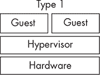
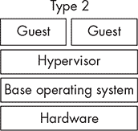

# <samp class="SANS_Dogma_OT_Bold_B_11">附录</samp> <samp class="SANS_Dogma_OT_Bold_B_11">辅助数据源</samp>


现代的 EDR 有时会使用一些本书至今未涉及的较少见的组件。这些辅助遥测源可以为 EDR 提供巨大的价值，提供来自其他传感器无法获取的数据。

由于这些数据源不常见，我们不会深入探讨它们的内部工作原理。相反，本附录涵盖了一些它们的示例、它们的工作原理以及它们能为 EDR 代理提供的功能。这绝不是一个详尽无遗的列表，但它揭示了一些你在研究过程中可能遇到的较为小众的组件。

## <samp class="SANS_Futura_Std_Bold_B_11">替代的挂钩方法</samp>

本书已经展示了拦截函数调用、检查传递给函数的参数以及观察它们的返回值的价值。在本书撰写时，拦截函数调用的最常见方法依赖于将 DLL 注入目标进程，并修改另一个 DLL 的导出函数的执行流程，例如*ntdll.dll*，强制执行流程经过 EDR 的 DLL。然而，由于该方法的实现固有的弱点，这种方法很容易被绕过（请参见第二章）。

还有其他更强大的拦截函数调用的方法，例如使用 Microsoft-Windows-Threat-Intelligence ETW 提供程序间接拦截内核中的某些系统调用，但这些方法也有自身的局限性。拥有多种实现相同效果的技术为防守方提供了优势，因为某种方法在某些情境下可能比其他方法更有效。因此，一些厂商在其产品中利用了替代的挂钩方法，以增强它们监控可疑函数调用的能力。

在 2015 年的 Recon 会议上，Alex Ionescu 在题为“Esoteric Hooks”的演讲中详细阐述了其中的一些技术。一些主流 EDR 厂商已经实现了他所描述的某种方法：涅槃挂钩。传统的函数挂钩通过拦截函数的调用者来工作，而这种技术则拦截系统调用从内核返回到用户模式的时刻。这使得代理能够识别那些没有来自已知位置的系统调用，例如映射到进程地址空间中的*ntdll.dll*的副本。因此，它能够检测手动系统调用的使用，这种技术近年来在攻击工具中变得相对常见。

然而，这种钩子方法也有一些显著的缺点。首先，它依赖于一个未记录的 <samp class="SANS_TheSansMonoCd_W5Regular_11">PROCESS_INFORMATION_CLASS</samp> 和相关结构，这些信息会传递给 <samp class="SANS_TheSansMonoCd_W5Regular_11">NtSetInformationProcess()</samp>，以监控产品希望监控的每个进程。由于它未正式支持，微软可能随时修改其行为或完全禁用它。此外，开发人员必须通过捕获返回上下文并将其与已知的良好镜像关联，来识别调用源，以便检测手动系统调用的调用。最后，这种钩子方法容易规避，因为对手可以通过调用 <samp class="SANS_TheSansMonoCd_W5Regular_11">NtSetInformationProcess()</samp> 将回调置为空，从而从他们的进程中移除钩子，类似于安全进程最初如何设置它。

即使 Nirvana 钩子相对容易规避，并非每个对手都有能力做到这一点，而且它们提供的遥测信息仍然可能有价值。供应商可以采用多种技术来提供他们所需的覆盖范围。

## <samp class="SANS_Futura_Std_Bold_B_11">RPC 过滤器</samp>

最近的攻击重新点燃了对 RPC 技巧的兴趣。例如，Lee Christensen 的 PrinterBug 和 topotam 的 PetitPotam 漏洞已经证明了它们在 Windows 环境中的有效性。作为回应，EDR 供应商开始关注新兴的 RPC 技巧，希望能够检测并防止其使用。

RPC 流量在大规模操作中难以处理。EDR 可以通过使用*RPC 过滤器*来监控它。它们本质上是基于 RPC 接口标识符的防火墙规则，使用内置的系统工具可以轻松创建和部署。例如，列表 A-1 演示了如何使用 *netsh.exe* 以交互方式禁止所有传入的 DCSync 流量到当前主机。EDR 可以在环境中的所有域控制器上部署此规则。

```
netsh> **rpc filter**
netsh rpc filter> **add rule layer=um actiontype=block**
Ok.

netsh rpc filter> **add condition field=if_uuid matchtype=equal \**
**data=e3514235-4b06-11d1-ab04-00c04fc2dcd2**
Ok.

netsh rpc filter> **add filter**
FilterKey: 6a377823-cff4-11ec-967c-000c29760114
Ok.
netsh rpc filter> **show filter**
Listing all RPC Filters.
-----------------------------
filterKey: 6a377823-cff4-11ec-967c-000c29760114
displayData.name: RPCFilter
displayData.description: RPC Filter
filterId: 0x12794
layerKey: um
weight: Type: FWP_EMPTY Value: Empty
action.type: block

numFilterConditions: 1
filterCondition[0]
        fieldKey: if_uuid
        matchType: FWP_MATCH_EQUAL
        conditionValue: Type: FWP_BYTE_ARRAY16_TYPE Value: e3514235 11d14b06 c00004ab d2dcc24f
```

列表 A-1：使用 <samp class="SANS_TheSansMonoCd_W5Regular_Italic_I_11">netsh</samp> 添加和列出 RPC 过滤器

这些命令添加了一个新的 RPC 过滤器，专门阻止使用*目录复制服务* RPC 接口的任何通信（该接口的 GUID 为 <samp class="SANS_TheSansMonoCd_W5Regular_11">E3514235-4B06-11D1-AB04-00C04FC2DCD2</samp>）。一旦通过 <samp class="SANS_TheSansMonoCd_W5Regular_11">add filter</samp> 命令安装了该过滤器，它便会在系统上生效，禁止 DCSync。

每当 RPC 过滤器阻止连接时，Microsoft-Windows-RPC 提供程序将会发出一个 ETW 事件，类似于在 列表 A-2 中显示的事件。

```
An RPC call was blocked by an RPC firewall filter.
ProcessName: lsass.exe
InterfaceUuid: e3514235-4b06-11d1-ab04-00c04fc2dcd2
RpcFilterKey: 6a377823-cff4-11ec-967c-000c29760114
```

列表 A-2：一个显示被过滤器阻止活动的 ETW 事件

尽管这个事件总比没有强，但防御者理论上可以利用它来构建检测，但它缺乏进行强大检测所需的大部分上下文信息。例如，发出请求的主要单位和流量方向（即进站或出站）并不立即明确，这使得过滤事件以帮助调整检测变得困难。

一个更好的选择可能是从 Microsoft-Windows-Security-Auditing Secure ETW 提供程序获取类似的事件。由于该提供程序受到保护，标准应用程序无法直接获取它。不过，它会被传输到 Windows 事件日志，并在 Windows 筛选平台的基本过滤引擎阻止请求时生成事件 ID 5157。列表 A-3 包含了事件 ID 5157 的示例。你可以看到它比 Microsoft-Windows-RPC 发出的事件详细得多。

```
<Event xmlns="http://schemas.microsoft.com/win/2004/08/events/event">
    <System>
        <Provider Name="Microsoft-Windows-Security-Auditing" Guid="{54849625-5478-4994
          -A5BA-3E3B0328C30D}" />
        <EventID>5157</EventID>
        <Version>1</Version>
        <Level>0</Level>
        <Task>12810</Task>
        <Opcode>0</Opcode>
        <Keywords>0x8010000000000000</Keywords>
        <TimeCreated SystemTime="2022-05-10T12:19:09.692752600Z" />
        <EventRecordID>11289563</EventRecordID>
        <Correlation />
        <Execution ProcessID="4" ThreadID="3444" />
        <Channel>Security</Channel>
        <Computer>sun.milkyway.lab</Computer>
        <Security />
    </System>
    <EventData>
        <Data Name="ProcessID">644</Data>
        <Data Name="Application">\device\harddiskvolume2\windows\system32\lsass.exe</Data>
        <Data Name="Direction">%%14592</Data>
        <Data Name="SourceAddress">192.168.1.20</Data>
        <Data Name="SourcePort">62749</Data>
        <Data Name="DestAddress">192.168.1.5</Data>
        <Data Name="DestPort">49667</Data>
        <Data Name="Protocol">6</Data>
        <Data Name="FilterRTID">75664</Data>
        <Data Name="LayerName">%%14610</Data>
        <Data Name="LayerRTID">46</Data>
        <Data Name="RemoteUserID">S-1-0-0</Data>
        <Data Name="RemoteMachineID">S-1-0-0</Data>
    </EventData>
</Event>
```

列表 A-3：Microsoft-Windows-Security-Auditing Secure ETW 提供程序的事件清单

尽管这个事件包含了更多数据，但它也有一些局限性。特别是，尽管包括了源端口和目标端口，但缺少了接口 ID，这使得难以判断事件是否与阻止 DCSync 尝试的过滤器相关，还是与其他过滤器完全无关。此外，这个事件在不同版本的 Windows 中表现不一致，在某些版本中正确生成，而在其他版本中完全缺失。因此，一些防御者可能更倾向于使用那个数据更简洁但更一致的 RPC 事件作为主要数据源。

## <samp class="SANS_Futura_Std_Bold_B_11">虚拟机监控程序</samp>

虚拟机监控程序通过虚拟化一个或多个客户操作系统，并根据虚拟机监控程序的架构，充当客户操作系统与硬件或基础操作系统之间的中介。这一中介位置为 EDR 提供了一个独特的检测机会。

### <samp class="SANS_Futura_Std_Bold_Condensed_Oblique_BI_11">虚拟机监控程序的工作原理</samp>

一旦理解了一些核心概念，虚拟机监控程序的内部工作原理就相对简单。Windows 在多个 *环* 中运行代码；运行在更高环中的代码，例如 *环 3* 用户模式，比运行在较低环中的代码（如 *环 0* 内核模式）特权较少。根模式，虚拟机监控程序所在的模式，运行在环 0，即最低支持的架构特权级别，并限制客户机或非根模式系统能够执行的操作。图 A-1 展示了这个过程。


<samp class="SANS_Futura_Std_Book_Oblique_I_11">图 A-1：<samp class="SANS_TheSansMonoCd_W5Regular_Italic_I_11">VMEXIT</samp> 和 <samp class="SANS_TheSansMonoCd_W5Regular_Italic_I_11">VMENTER</samp> 的操作</samp>

当虚拟化的来宾系统尝试执行虚拟机监控程序必须处理的指令或操作时，会发生<samp class="SANS_TheSansMonoCd_W5Regular_11">VMEXIT</samp>指令。发生这种情况时，控制权从来宾转移到虚拟机监控程序。*虚拟机控制结构（VMCS）*保存来宾和虚拟机监控程序的处理器状态，以便稍后恢复。它还记录<samp class="SANS_TheSansMonoCd_W5Regular_11">VMEXIT</samp>的原因。每个逻辑处理器都有一个 VMCS，你可以在英特尔软件开发者手册的第 3C 卷中了解更多关于它们的信息。

<samp class="SANS_Dogma_OT_Bold_B_21">注意</samp>

*为了简化起见，本简短的探讨仅涵盖基于英特尔 VT-x 的虚拟机监控程序操作，因为英特尔的 CPU 在本文撰写时仍然是最受欢迎的。*

当虚拟机监控程序进入根模式操作时，它可以根据<samp class="SANS_TheSansMonoCd_W5Regular_11">VMEXIT</samp>的原因来模拟、修改和记录活动。这些退出可能因许多常见原因而发生，包括诸如<samp class="SANS_TheSansMonoCd_W5Regular_11">RDMSR</samp>（用于读取特定型号寄存器）和<samp class="SANS_TheSansMonoCd_W5Regular_11">CPUID</samp>（返回有关处理器的信息）等指令。根模式操作完成后，执行会通过<samp class="SANS_TheSansMonoCd_W5Regular_11">VMRESUME</samp>指令转回非根模式操作，允许来宾继续运行。

有两种类型的虚拟机监控程序。像微软的 Hyper-V 和 VMware 的 ESX 这样的产品是我们所称的*类型 1 虚拟机监控程序*。这意味着虚拟机监控程序运行在裸机系统上，如图 A-2 所示。



<samp class="SANS_Futura_Std_Book_Oblique_I_11">图 A-2：类型 1 虚拟机监控程序架构</samp>

另一种类型的虚拟机监控程序，*类型 2*，运行在安装在裸机系统上的操作系统中。这些包括 VMware 的 Workstation 和 Oracle 的 VirtualBox。类型 2 架构如图 A-3 所示。



<samp class="SANS_Futura_Std_Book_Oblique_I_11">图 A-3：类型 2 虚拟机监控程序架构</samp>

类型 2 虚拟机监控程序之所以有趣，是因为它们可以虚拟化已经运行的系统。因此，用户无需登录到系统，启动像 VMware Workstation 这样的应用程序，启动虚拟机，登录虚拟机，然后从虚拟机中进行工作，而是直接将主机作为虚拟机。这使得虚拟机监控程序层对用户（以及潜在的攻击者）透明，同时允许 EDR 收集所有可用的遥测数据。

大多数实现虚拟机监控器的端点检测与响应（EDR）系统采用 Type 2 方法。然而，它们必须遵循一系列复杂的步骤来虚拟化现有系统。完全的虚拟机监控器实现远超本书的范畴。如果你对此话题感兴趣，Daax Rynd 和 Sina Karvandi 都提供了实现自己虚拟机监控器的优秀资源。

### <samp class="SANS_Futura_Std_Bold_Condensed_Oblique_BI_11">安全用例</samp>

虚拟机监控器能够提供比几乎任何其他传感器都更深入的系统操作可视化。使用它，端点安全产品可以检测到其他环节的传感器无法察觉的攻击，例如以下几种：

**虚拟机检测**

一些恶意软件尝试通过发出 <samp class="SANS_TheSansMonoCd_W5Regular_11">CPUID</samp> 指令来检测其是否运行在虚拟机中。由于此指令会引发 <samp class="SANS_TheSansMonoCd_W5Regular_11">VMEXIT</samp>，虚拟机监控器有能力决定返回给调用者的内容，从而欺骗恶意软件使其认为自己并未运行在虚拟机中。

**系统调用拦截**

虚拟机监控器可以利用扩展功能使能寄存器（EFER）功能，在每次系统调用时退出并模拟其操作。

**控制寄存器修改**

虚拟机监控器（hypervisor）可以检测控制寄存器中的位修改（例如，<samp class="SANS_TheSansMonoCd_W5Regular_11">SMEP</samp> 位在 <samp class="SANS_TheSansMonoCd_W5Regular_11">CR4</samp> 寄存器中的变化），这种行为可能是攻击的一部分。此外，虚拟机监控器可以在控制寄存器发生变化时退出，从而检查来宾的执行上下文，识别诸如令牌窃取攻击之类的行为。

**内存变化追踪**

虚拟机监控器可以结合扩展页表（EPT）利用页面修改日志来追踪特定内存区域的变化。

**分支追踪**

虚拟机监控器可以利用*最后分支记录*（last branch record），这是一组用于追踪分支、中断和异常的寄存器，结合 EPT 进一步追踪程序执行，而不仅仅是监控其系统调用。

### <samp class="SANS_Futura_Std_Bold_Condensed_Oblique_BI_11">规避虚拟机监控器</samp>

在与部署了虚拟机监控器的系统作对抗时，一项难题是，当你意识到自己处在虚拟机中时，可能已经被检测到。因此，恶意软件开发人员通常会在执行恶意软件之前，使用虚拟机检测功能，如 <samp class="SANS_TheSansMonoCd_W5Regular_11">CPUID</samp> 指令或睡眠加速功能。如果恶意软件发现自己运行在虚拟机中，它可能会选择终止或仅仅执行一些无害的操作。

攻击者还可以选择卸载虚拟机监控器（hypervisor）。对于第二类虚拟机监控器（Type 2 hypervisors），你可能通过 I/O 控制代码与驱动程序进行交互，修改启动配置，或直接停止控制服务，从而使虚拟机监控器去虚拟化处理器并卸载，防止其继续监控未来的操作。至今，尚未有公开报告显示现实世界中的对手使用过这些技术。
