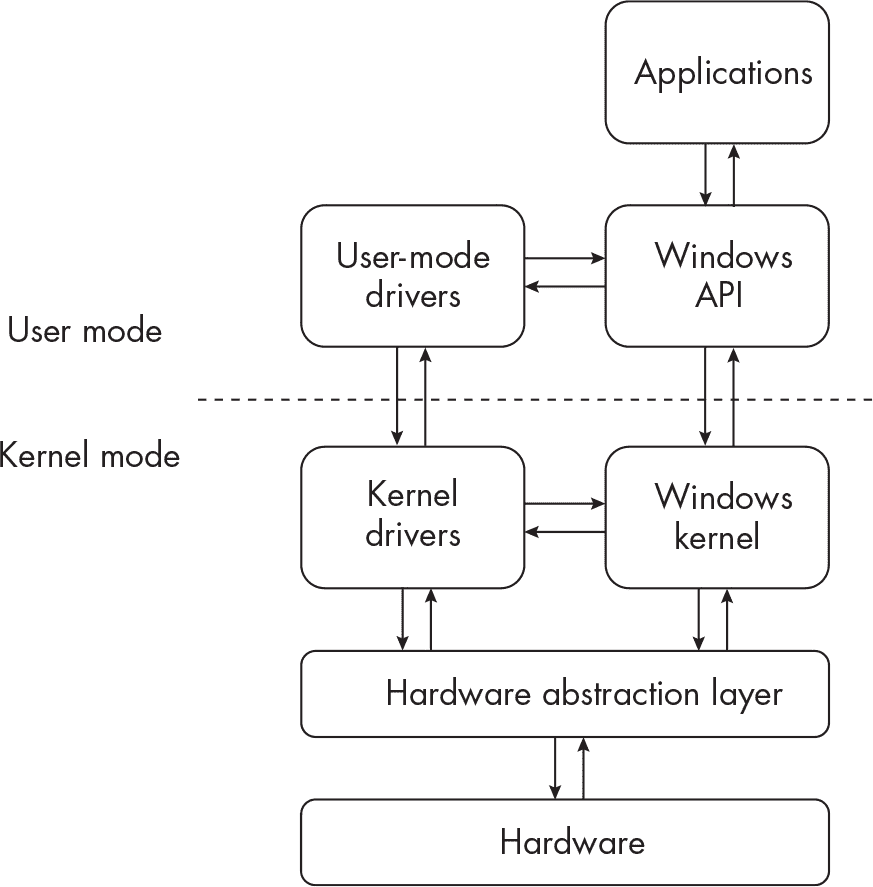
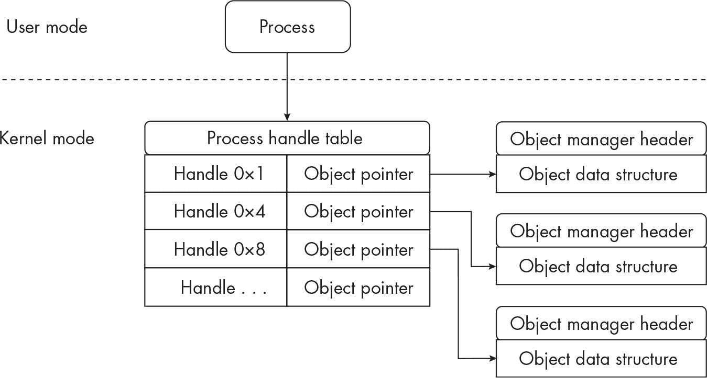
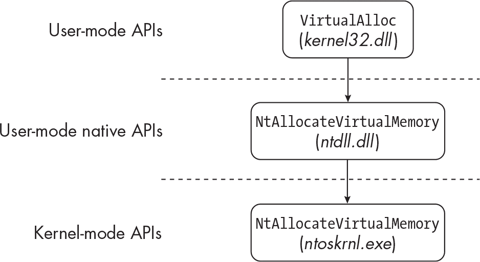
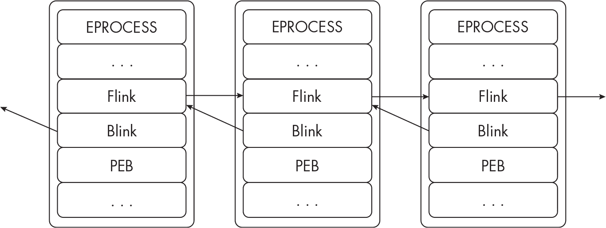
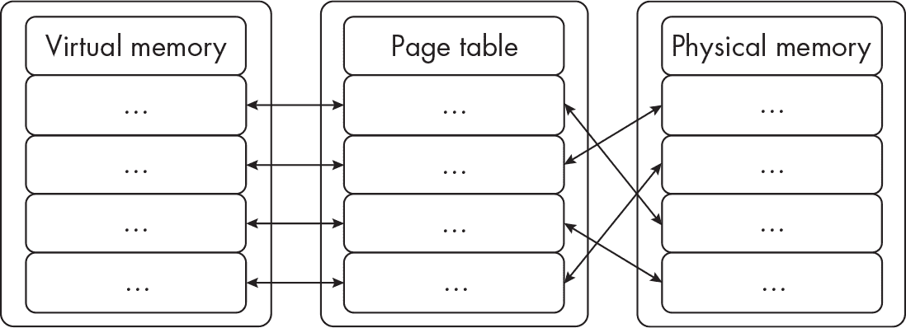
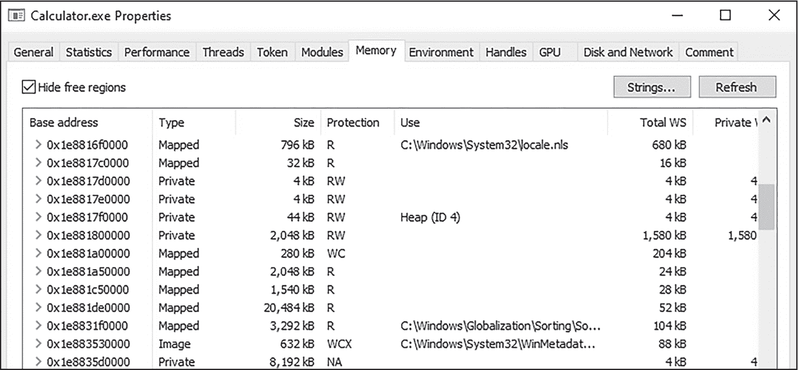
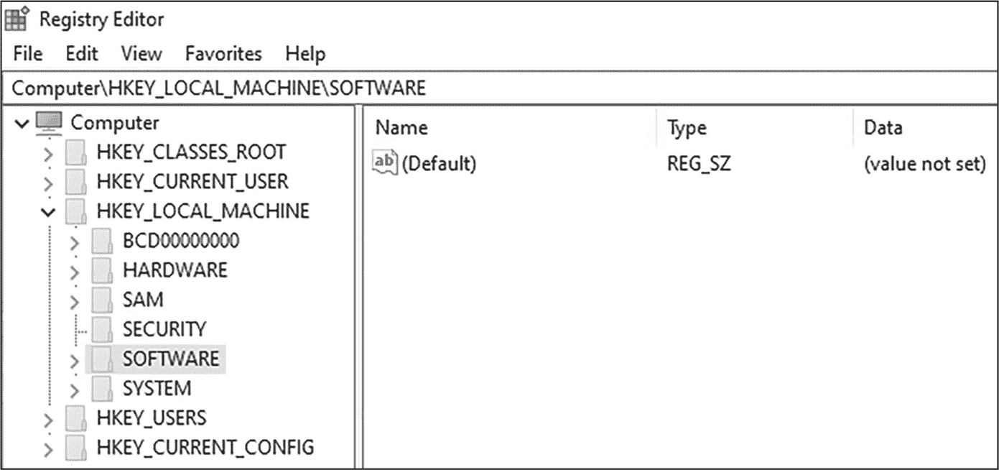

## 1 Windows 基础概念

要了解你的对手，首先你必须了解战场。在我们的例子中，战场就是 Windows 操作系统及其底层组件。本章将概述 Windows 架构，并介绍你理解本书后续章节中更高级主题所需的基本概念。

### Windows 架构概述

Windows 是一个复杂的操作系统（OS），其架构同样复杂。在本节中，我将介绍一些关键概念，随着章节的推进，我将回顾并详细说明这些概念。

#### 用户模式与内核模式

Windows 架构由两种模式组成：用户模式和内核模式，它们是操作系统的基本组成部分。*模式*是代码在系统上运行的上下文。*用户模式*是大多数人在使用计算机时的常见模式；它包括用户与之交互的正常的、日常使用的软件和进程，如 Microsoft Office 程序和网页浏览器。相反，*内核模式*则保留给操作系统的核心功能：负责重要的低级任务，如内存管理和硬件交互。

运行在用户模式下的代码无法访问或干扰运行在内核模式下的代码；这是一个有意的保护机制，用来防止配置错误或恶意的应用程序改变操作系统环境。这种分离非常重要，因为所有在内核模式下运行的代码和程序共享同一个内存地址空间，这意味着一个行为不当的程序可能导致整个操作系统的崩溃。它还意味着，如果恶意程序能够在内核模式下执行，它就能直接影响操作系统。

图 1-1 展示了用户模式与内核模式之间的关系。

图 1-1：用户模式与内核模式之间的关系

让我们更仔细地看一下这里展示的概念：

**应用程序**

这些是用户运行的软件和程序。

**Windows 应用程序编程接口（WinAPI）**

这是应用程序运行所依赖的基础。我将在《Windows API》一节中进一步讨论这个内容，详见第 6 页。

**驱动程序**

这些控制系统上的各种设备，并在设备与希望与之交互的程序之间提供抽象层。有两种类型的驱动程序。*硬件设备驱动程序*处理输入/输出（IO）请求，并将其转换为硬件 IO 请求，例如鼠标和键盘。*非硬件设备驱动程序*控制系统组件，如网络接口和文件系统。一些驱动程序在用户模式下运行，一些在内核模式下运行。

**硬件抽象层**

这提供了一个接口，设备驱动程序可以用来与底层系统硬件通信。它使内核和高级应用程序能够独立于系统硬件运行。

Windows 内核本身包含在一个名为*ntoskrnl.exe*的可执行文件中，并分为两部分：内核和执行层。*内核*负责基本功能，如任务同步和调度；它还提供低级硬件支持，这对于系统高效运行至关重要。*执行层*包含关键的系统服务，如*内存管理器*，它实现虚拟内存功能（见“虚拟内存”在第 11 页），以及*进程管理器*，它处理进程和线程的创建和终止。

#### 进程与线程

当应用程序如*Excel.exe*或*Calculator.exe*被执行时，Windows 可执行文件加载器为该程序创建一个*进程*；该进程包含原始的程序可执行文件以及所有支持库和代码。每个进程在内存中分配有自己的虚拟地址空间，这个空间是私有的，并且对该进程是隔离的。这意味着，如果一个进程崩溃，它不会（或者不应该）影响其他进程或操作系统本身。

Windows 中的每个运行进程都可以托管一个或多个线程。*线程*仅仅是一系列指令。然而，处理器在任何给定时刻只能运行一个线程。这意味着，如果进程 B 希望执行某些代码，它必须等待进程 A 当前的线程完成。如果 Windows 认为进程 B 更重要，它可以向进程 A 当前的线程发出中断，并改为执行进程 B 的线程。（这称为*上下文切换*。）Windows 执行上下文切换非常迅速高效，以至于最终用户甚至没有察觉到它在不断发生。

Windows 是一个多任务操作系统。这意味着，当处理器执行指令来运行系统及其应用程序时，它会高效地在用户模式和内核模式之间切换。为此，Windows 使用*时间片*，这是一种原子性的时间段（以毫秒为单位），分配给每个线程。线程被允许执行其代码，但当时间片到期后，其他线程也能运行。由于时间片非常短，因此系统看起来像是在同时执行多个线程和多个程序。

#### 对象与句柄

进程和线程通常与*对象*进行交互，对象是某种类型资源的实例，例如文件、另一个进程或线程、安全令牌（用于用户访问权限），甚至是内存的一部分。集中管理*对象管理器*负责跟踪所有 Windows 对象、在进程间共享它们，并保护它们免受未经授权的访问。

Windows 中的所有对象都是简单的数据结构，通常存储在内核内存中。由于大多数 Windows 应用程序在用户空间中运行，进程使用一个被称为*句柄*的唯一标识符来访问对象。每个进程可能有多个句柄，用于访问各种对象。句柄在进程的*句柄表*中进行管理，该表包含指向内核内存中对象的指针，如图 1-2 所示。

图 1-2: Windows 进程句柄表和对象结构

*互斥锁*（或*mutex*）是一种控制访问对象的方法，旨在防止像进程 A 和进程 B 尝试同时访问并修改文件的潜在问题，这种情况被称为*竞态条件*。根据 Windows 如何使用该文件，这种情况可能导致数据不一致，甚至更糟，崩溃进程或操作系统。为了避免像竞态条件这样的意外事件，进程 A 可能会为该文件创建一个互斥对象，锁定文件以供其自身使用，并防止进程 B 在文件解锁之前访问或写入该文件。

程序与这些对象以及操作系统本身的交互由 Windows API 管理。

#### Windows API

*Windows 应用程序编程接口（WinAPI）*是一个共享的代码库，向用户模式的应用程序公开。当 Windows 程序运行时，WinAPI 调用 Windows 函数，使程序能够在 Windows 操作系统中按设计方式运行。

WinAPI 涵盖了开发人员可能希望在代码中实现的几乎所有功能：从用户界面、网络功能到输入设备（鼠标、键盘等）、再到内存管理。例如，如果开发人员想为他们的应用程序创建一个新窗口，他们可能会调用 CreateWindowEx 函数。如果程序需要访问硬盘，它可能会调用 GetLogicalDrives 来检索可用硬盘的列表。

还有一个更低级别的 API，叫做 *Windows 本地 API*，或简称 *本地 API*。虽然 WinAPI 有很好的文档并设计为开发人员使用，但本地 API 大部分没有文档，至少在微软的官方文档中没有。

> 注意

*幸运的是，逆向工程社区已经付出了巨大努力来记录本地 API 的内部实现。两个很好的例子是“ntinternals”项目（*[`undocumented.ntinternals.net`](http://undocumented.ntinternals.net)）* 和 Geoff Chappell 的研究（*[`www.geoffchappell.com/studies/windows/win32/ntdll/api/native.htm`](https://www.geoffchappell.com/studies/windows/win32/ntdll/api/native.htm)）*。

本地 API 设计为操作系统内部使用，但程序可以直接调用本地 API 函数，前提是它们愿意这样做。反过来，本地 API 函数会调用更底层的内核 API 代码，这些代码存在于 *ntoskrnl.exe* 中。对内核的调用被称为 *syscall* 或 *sysenter*。（syscall 和 sysenter 之间有一些小的技术差异，但它们的目标是一样的：允许用户应用程序访问内核服务。为了简化起见，本书中我将使用 *syscall* 这个术语。）

图 1-3 演示了 WinAPI 与本地 API 之间的交互。

图 1-3：用户模式 API 调用更低层次的 API

在顶部，你可以看到一个程序调用 WinAPI 函数 VirtualAlloc，然后它又调用了 WinAPI 的 VirtualAllocEx 函数（该函数在此图中未显示）。接着是调用本地 API 的 NtAllocateVirtualMemory 函数。最后，程序调用了 *ntoskrnl.exe* 中的 NtAllocateVirtualMemory 函数。这一复杂的 API 调用链在 Windows 中非常常见，它允许开发人员在无需了解 Windows 和低级 API 内部实现的情况下进行代码开发。

如你所见，WinAPI 函数通常有一个或多个后缀，如Ex、A或W。一般来说，Ex后缀是微软用来标识较旧函数的更新版（功能更多的扩展版本）。例如，CreateWindowExA函数是CreateWindowA的扩展版本。 A后缀表示该函数使用 ANSI 格式的输入和输出，而带有W后缀的函数则使用 Unicode 格式的输入和输出。关于 ANSI 与 Unicode 的使用差异其实不那么常见，因此我不会进一步讨论这个话题，而且通常不会在函数名称中包含A或W后缀。（例如，我将直接称CreateWindowA为CreateWindow。）但是，对于带有Ex后缀的函数，我会始终保留该后缀。

Windows 本地 API 函数通常以Nt或Zw为前缀；例如，NtCreateProcess和ZwNotifyChangeKey。每个 API 函数通常都有一个Nt版本和一个Zw版本。Zw函数通常由驱动程序和其他低级系统软件使用，但与Nt函数在很大程度上是可以互换的。

你可能还注意到在图 1-3 中提到的文件名*kernel32.dll*和*ntdll.dll*。它们指的是*动态链接库（DLLs）*，这些库是开发者可以导入到他们的程序中的资源集合，用来利用微软或第三方开发者现有的代码。虽然 Windows 程序可以导入这些库，但 DLL 文件本身会向导入它们的程序导出函数。例如，如果开发者希望访问 Windows 系统上的硬盘，他们可以导入*kernel32.dll*库，该库导出（提供）他们所需要的GetLogicalDrives函数。在 Windows 程序中经常使用的一些 DLL 文件如下：

***kernel32.dll ***这是 Windows 程序运行所需的主要 DLL 之一，它包含许多基本的用户模式函数。

***user32.dll ***该 DLL 提供 Windows 程序所需的图形用户界面（GUI）功能。

***Winhttp.dll ***也称为“Windows HTTP 接口”，该 DLL 为 Windows 程序提供互联网连接功能。

***ntdll.dll ***该关键 DLL 包含用于同步、线程处理和其他系统任务的函数；它还与内核进行通信。

> 注意

*如果你正在分析包含从*kernel32.dll*导出的函数的代码（就像许多函数一样），你可能会注意到，当一个进程执行一个*kernel32.dll*函数时，会立即跳转到另一个 DLL，*kernelbase.dll*。*kernelbase.dll*是在 Windows 7 中引入的，它允许在旧版和新版 Windows 之间保持向后兼容性。大多数*kernel32.dll*函数调用会直接跳转到*kernelbase.dll*，它包含函数的实际代码。例如，函数WriteFile（从*kernel32.dll*导出）一旦调用，就会立即跳转到*kernelbase.dll*，在那里执行代码。为了简化起见，我将在本书中将*kernel32.dll*和*kernelbase.dll*作为同义词使用。*

尽管合法的 Windows 程序在很大程度上依赖底层的 WinAPI 和 Native API 来执行，但非法软件（即恶意软件）也利用这些功能，正如你将在后续章节中看到的那样。现在，让我们深入了解进程。

### 进程内部

进程是相当复杂的数据结构，它们指向其他数据结构。这个网络提供了 Windows 所依赖的基础信息，用于有效管理和协调系统上随时运行的众多进程。

#### EPROCESS 结构

尽管大多数暴露给终端用户的进程是在用户模式下运行的，但它们在内核地址空间中作为称为*EPROCESS*结构的对象表示。每个进程都有自己的 EPROCESS 结构，包含指向诸如进程打开的句柄列表以及*进程环境块（PEB）*的指针，PEB 是一个包含进程关键信息的结构。EPROCESS 结构由一个双向链表组成；也就是说，它们形成一个链，每个结构都链接到前一个和下一个结构。EPROCESS 结构成员称为*前向链接（flinks）*是指向链中下一个 EPROCESS 结构的指针，而*后向链接（blinks）*指向前一个结构。图 1-4 展示了这个链的简化版本。

图 1-4：一个 EPROCESS 结构的双向链表链

EPROCESS 结构包含许多其他数据元素和指针，大多数超出了本书的讨论范围。这里的关键要点是，每个 Windows 中的用户模式进程都与一个在内核模式下运行的 EPROCESS 结构相关联。稍后我们在讨论诸如直接内核对象操作（DKOM）等主题时，这一点将变得非常重要，参见第 IV 部分。

#### 进程环境块

PEB 内存结构包含有关正在运行的进程的信息，操作系统内核需要通过这些信息与该进程进行通信，还包括用于进程间通信的信息。每个正在运行的进程都有自己的 PEB，存储在该进程的用户模式地址空间中。表 1-1 列出了 PEB 结构中包含的一些重要数据。每个结构成员的偏移量在 x86 和 x64 架构中都有显示。

表 1-1： PEB 结构偏移量和数据

| 偏移量 (x86) | 偏移量 (x64) | 数据 |
| --- | --- | --- |
| 0x002 | 0x002 | 存储 BeingDebugged 值，表示进程是否在调试器的上下文中运行。（这在第十章中会很重要。） |
| 0x008 | 0x10 | 存储进程可执行文件在内存中的基本地址。 |
| 0x00C | 0x18 | 存储进程加载的模块和库的信息。 |
| 0x018 | 0x30 | 存储有关进程内存堆的信息。 |
| 0x064 | 0xB8 | 存储 NumberOfProcessors 值，表示系统中的处理器数量。 |

你不需要记住 PEB 的所有元素，但了解其基本结构非常重要，因为我将在全书中引用它。

#### 线程环境块

一个*线程环境块（TEB）*，有时也被称为*线程信息块（TIB）*，包含进程运行线程的信息。就像 PEB 一样，它只是一个数据结构，用于存储每个线程的关键信息，并存储在拥有线程的进程的内存地址空间中。表 1-2 列出了 TEB 中一些最有趣的元素。

表 1-2： TEB 结构偏移量和数据

| 偏移量（x86） | 偏移量（x64） | 数据 |
| --- | --- | --- |
| FS:[0x00] | GS:[0x00] | 存储当前的结构化异常处理程序（SEH）框架。（SEH 将在第十章和第十一章中详细介绍。） |
| FS:[0x04] | GS:[0x08] | 指向线程堆栈的基础（见下节）。 |
| FS:[0x18] | GS:[0x30] | 指向 TEB 本身。 |
| FS:[0x20] | GS:[0x40] | 存储 进程 ID（PID） 线程所属进程的 ID。 |
| FS:[0x24] | GS:[0x48] | 存储 线程 ID（TID） 当前线程的 ID。 |
| FS:[0x30] | GS:[0x60] | 指向线程所属进程的 PEB。 |
| FS:[0xE10] | GS:[0x1480] | 指向线程本地存储（TLS）信息。 |

> 注意

线程本地存储（TLS）*用于存储跨线程的变量和其他信息。我们将在第十一章中讨论恶意软件如何滥用 TLS 来悄悄执行恶意代码。*

#### 堆栈和堆

一个进程可以有多个活动线程，每个线程都有自己的内存栈。*栈*是线程存储临时数据的地方，比如变量、指针和其他在线程执行完毕并终止后会被销毁的对象。由于栈是如此易变且临时，程序有时需要一种更“永久”的数据存储解决方案。这时堆就派上了用场。

*堆*是一个在程序运行时动态分配的、大小可变的内存区域。堆通常用于存储堆栈无法容纳的较大的对象和数据结构。它们还用于存储全局变量和可以被同一程序中多个函数使用的持久数据。需要注意的是，尽管栈大多由操作系统管理，但堆是由程序本身管理的。如果程序没有很好地实现堆内存管理技术，可能会导致稳定性问题。

#### 虚拟内存

在 Windows 中，每个运行中的进程都有分配的多个虚拟内存区域，这些区域映射到物理内存（或 RAM）。理解虚拟内存和物理内存之间的区别是很重要的。*物理内存*是安装在系统中的实际、可触摸的硬件内存。如果你有一台 8GB RAM 的计算机，那么你就有 8GB 的物理内存，所有在系统中运行的进程都会共享这部分内存。这就带来了一个问题，任何进程都可能干扰到系统中的其他进程（无论是意外的，例如崩溃，还是故意的），从而产生不必要的副作用。这时虚拟内存就发挥了作用。

*虚拟内存*是物理内存和进程内存地址空间之间的一种屏障。当一个进程启动时，它会分配一块虚拟内存，这块虚拟内存通过*页表*映射到物理内存。页表跟踪虚拟内存的不同段在 RAM 中的物理位置。图 1-5 展示了虚拟内存、页表和物理内存之间的关系。

图 1-5：通过页表将虚拟内存映射到物理内存

每个包含省略号（...）的块表示一个内存地址范围或区域。每个内存区域都映射到页表。

系统的 RAM 可能不足以满足所有正在运行进程的需求。为了帮助管理这种情况，虚拟内存可以被*分页*，即当不使用时，它将暂时存储在硬盘上。如果某个进程需要再次访问该虚拟内存区域，该内存可以从磁盘读取并重新映射到物理内存。

你可以使用进程分析工具（如 Process Hacker）查看进程的虚拟内存（[`<wbr>processhacker<wbr>.sourceforge<wbr>.io`](https://processhacker.sourceforge.io)）。操作步骤是启动一个程序（如*Calculator.exe*），打开 Process Hacker，并双击你想要探索的进程。图 1-6 显示了 Process Hacker 中一个进程的内存选项卡。

图 1-6：在 Process Hacker 中查看进程的虚拟内存

基地址列包含分配给*Calculator.exe*的每个虚拟内存区域的基内存地址。类型列包含每个区域的内存类型，大小列显示每个区域的分配大小，保护列列出了该区域的保护状态。

每个虚拟内存区域通常会分配三种常见内存类型之一：

+   *映像（IMG）*内存通常包含通过标准 Windows 加载器机制（稍后会描述）映射到内存中的可执行文件或库。

+   *映射（MAP）*内存通常包含从磁盘映射到内存的文件或应用程序运行过程中使用的其他数据。

+   *私有（PRV）*内存通常通过 VirtualAlloc 和类似的内存分配函数分配。

此外，每个内存区域可以是已提交的或已保留的。*已提交*的区域正在被积极使用，并已映射到物理内存中。*已保留*的区域已为进程保留，但尚未在活动中使用，也尚未映射到 RAM 中。

现在让我们深入探讨 Windows 可执行文件（更具体地说，便携式可执行文件）的内部工作原理。

### PE 文件格式

微软为在 Windows 操作系统中运行的可执行文件创建了*PE（便携式可执行文件）*格式。PE 文件格式包含了 Windows PE 加载器执行嵌入代码所需的所有内容。了解 PE 格式对于理解恶意软件的工作原理至关重要，因此在这一部分我们将深入探讨 PE 格式包含的结构。

> 注意

*我将同时称 x86 和 x64 的 PE 文件为 PE 文件。然而，实际上 x64 有一个自己的 PE 格式版本，称为*PE32+*。由于 PE32+与 x86 版本只有少许差异，我将不单独讨论它。*

#### 头部和节区

PE 文件格式包含多个 *头部*：文件顶部的元数据或其他信息，告诉操作系统和其他软件如何处理文件内容。*DOS 头部*包含 MS-DOS 和早期版本 Windows 所需的信息，主要是为了兼容性存在。*PE 头部*包含 Windows PE 加载器使用的信息，如可执行文件编译时的 CPU 架构和编译时间戳等元数据。PE 头部还包括 *可选头部*，它指示重要信息，如 PE 的基址（即 PE 映射到内存时的内存地址）、可执行文件内部代码的大小，以及可执行文件将运行的目标操作系统。事实上，现代 Windows 系统中“可选”头部不再是可选的。

PE 文件还包含 *区段头部*，它包含与文件各个区段（即实际文件内容存储位置）相关的元数据，如区段的大小、地址和其他特征。最后，大多数 PE 文件至少包含以下几个区段：

| ***.text*** | 文件的主要可执行代码 |
| --- | --- |
| ***.rdata*** | 只读数据，如静态变量和常量 |
| ***.bss*** | 未初始化的数据，如尚未赋值的变量 |
| ***.data*** | 未嵌入在 .*rdata* 和 *.bss* 区段中的变量，如全局变量 |
| ***.rsrc*** | 可执行文件在运行时将加载的资源，如图像、字体和其他支持文件 |
| ***.idata*** | 导入地址表（参见下一节） |
| ***.edata*** | 导出地址表（参见下一节） |

#### 导入与导出

*.idata* 和 *.edata* 区段是 PE 文件中最重要的两个组件之一。*.idata* 区段包含 PE 文件在运行时导入的函数信息。一旦 PE 文件被执行，程序将加载此处引用的库和函数到内存，并构建其 *导入地址表（IAT）*，该表将导入的 Windows API 函数映射到它们在内存中的地址。

*.edata* 区段包含有关 PE 文件导出到其他程序的函数的信息，其他程序可以将这些函数导入并加载到内存中供自己使用。例如，DLL 可执行文件通常包含一个导出函数的列表。与导入类似，导出也有自己的表格，称为 *导出地址表*。

> 注意

*然而，实际上，* .edata *和* .idata *区段通常包含在* .rdata *区段中。*

现在让我们来看看 Windows 如何将 PE 文件加载到内存中的方式。程序执行过程是 Windows 恶意软件分析中的一个基本概念，它将把你目前所看到的所有概念联系在一起。

### Windows PE 加载过程

当你在 Windows 中启动一个可执行文件，比如 Firefox，发生的情况如下：

1.  Windows 为 Firefox 程序创建一个新的 EPROCESS 数据结构，并分配一个新的进程 ID。

2.  Windows 初始化所需的虚拟内存，为进程创建 PEB 结构，并加载几乎所有 Windows 进程所需的两个库：*ntdll.dll*和*kernel32.dll*。然后它准备通过初始化 PE 加载器来加载 Firefox 的 PE 文件。

3.  PE 加载器解析 PE 文件的 DOS 头、PE 头和可选头，以收集成功执行文件所需的所有信息。

4.  PE 加载器解析段头，以准备将这些段映射到内存中。PE 加载器将每个段映射到新进程中的虚拟内存。

5.  PE 加载器加载所有在导入（通常是*.idata*或*.rdata*）段中引用的库，并解析所有函数所需的地址。所有地址随后存储在进程中的 IAT 中。

6.  在当前进程中创建一个新的线程，并且加载器执行可执行文件中的首批字节（通常位于*.text*段中）。

图 1-7 展示了一个 PE 文件被加载并映射到虚拟内存中的过程。

图 1-7：在进程内部加载并映射 PE 文件到虚拟内存

每个 PE 文件中的段都被单独映射到内存中，但由于每个段之间通常有内存区域，因此它们在虚拟内存中是扩展显示的。

### 注册表

要讨论的最后一个 Windows 概念是*注册表*，它只是一个操作系统和其他已安装应用程序用来存储配置和设置的数据库。注册表以分层结构存储数据，包含几个主要的根键或*hives*，每个根键中都包含附加的键（你可以把它们看作是目录），每个键又存储更多的键或值。

*值*是设置的实际配置。例如，根键HKEY_CURRENT_USER包含一个子键叫做Control Panel，它本身又包含一个名为Mouse的子键。Mouse包含多个值，例如MouseSpeed，它存储当前登录用户的鼠标速度配置。这个注册表键路径可以像 Windows 中的文件或目录路径一样表示：*HKEY_CURRENT_USER\Control Panel\Mouse\MouseSpeed*。

以下是注册表中最重要的五个 hive：

HKEY_LOCAL_MACHINE (HKLM)

特定于系统的值，例如操作系统和硬件配置、策略和账户设置，以及各种安装软件的设置。

HKEY_CURRENT_USER (HKCU)

与用户设置和系统配置相关的值，例如声音、鼠标、键盘、网络和打印机设置。

HKEY_USERS (HKU)

与系统中每个用户账户的用户设置相关的值。在这个根键下，有几个其他子键以 S 开头（例如 S-1-5-20）。每个子键代表系统中某个用户账户的标识符，并存储该用户的配置信息。

HKEY_CURRENT_CONFIG (HKCC)

指向当前登录用户使用的硬件配置文件的 HKEY_LOCAL_MACHINE 键。对于我们的目的来说，这个键不太重要，因为所有有价值的数据都存储在 HKEY_LOCAL_MACHINE 键中。

HKEY_CLASSES_ROOT (HKCR)

与注册应用程序相关的信息，例如文件关联，它将文件类型与可以处理它们的应用程序相对应。（例如，*.doc* 文件应该在 Microsoft Word 中打开。）

注册表项以文件形式存储在硬盘上。当 Windows 启动时，这些文件会被加载到内存中，从而建立注册表。系统启动后对注册表的任何更改都会存储在内存中，而不是直接存储在硬盘上。这就是为什么一些恶意软件能够将恶意代码和配置存储在注册表中，而不一定需要访问硬盘的原因。

最后，Windows 有一个内置工具叫做注册表编辑器（*Regedit*），如图 1-8 所示，所有恶意软件分析人员都应该非常熟悉这个工具。

图 1-8：Windows 中的注册表编辑器工具

Regedit 允许你检查和修改系统上每个注册表项和值，这对于了解注册表如何工作非常有用。Regedit 还可以用于调查恶意软件可能如何更改这些数据。

### 总结

本章讨论了 Windows 操作系统中使用的一些基本概念、对象和结构，并高层次地探索了 Windows 的架构。我们将在本书的后续部分回到这些概念，研究攻击者如何利用这些特性来执行恶意代码，同时绕过防御措施。在下一章，我们将介绍恶意软件筛查和行为分析过程的基础，为后续章节的调查奠定基础。
