## 第三章：2 恶意软件筛查与行为分析


在本章中，你将学习恶意软件分析的基础知识，这些内容与下一章一起，将为你学习本书余下部分的所有内容打下坚实的基础。我们将从恶意软件分析过程入手，首先进行可疑文件的初步筛查。然后，我们将深入探讨在沙箱环境中的自动化分析，最后讨论在虚拟机中的行为分析。随着章节的进展，我会指出恶意软件筛查和行为分析过程中，特别涉及到规避恶意软件调查的相关领域。本章及整本书中，我将主要聚焦于 Windows 可执行文件。

正如我在导言中所提到的，本书假设你已经具备至少初级的恶意软件分析知识。因此，本章仅提供了快速让你掌握基础知识所需的基本信息，并略过了将在后续章节中详细讨论的概念。在适当的地方，我会指出相关章节。

让我们从分析环境的重要性开始，进入正题。

### 分析环境

构建一个安全且高效的分析环境对于成功的恶意软件分析至关重要。你应该认真考虑你的分析环境，并根据自己的需求进行定制。恶意软件分析师和研究人员通常使用虚拟机和沙箱，它们提供了一个受控的环境，用于监视恶意软件的行为。因此，恶意软件越来越多地使用虚拟机和沙箱检测与规避技术。

在我们深入之前，明确一些定义是非常重要的。*虚拟机（VM）*模拟物理计算机，但完全运行在一个被称为*虚拟机管理程序（hypervisor）*的应用程序内。虚拟机管理程序提供了一种容器，允许恶意代码的安全执行和恶意软件的安全引爆。*恶意软件分析沙箱*通常（但并非总是）是一种配置为自动分析恶意软件并生成报告或评估恶意软件行为、能力和属性的虚拟机。沙箱的例子包括开源沙箱 Cuckoo 以及专有沙箱 Joe Sandbox 和 Any.Run。关键点在于，几乎所有的恶意软件沙箱都是虚拟机，但并不是每个虚拟机都被配置为恶意软件沙箱。

一个典型的恶意软件分析实验环境通常包括一台主机系统和一个或多个虚拟机（VM）以及沙箱。主机系统存储并运行分析虚拟机和沙箱，并且可能安装有 Windows、Linux 或 macOS 操作系统以及虚拟机监控程序（hypervisor）。虚拟机和沙箱上配置的操作系统和软件取决于分析师正在研究的恶意软件类型。例如，对于 Windows 恶意软件分析，分析师可能会有运行 Windows 7、Windows 10 和 Windows 11 的虚拟机，以及许多专门的恶意软件分析工具。

> 警告
> 
> *如果你是一个初学者恶意软件分析师，我强烈建议你在深入恶意软件分析之前先查看附录 A，了解实验室的设置和安全性。恶意软件分析存在风险，重要的是尽可能减少这些风险。*

### 恶意软件分析过程

假设你是一个恶意软件分析师，你收到一个未知的文件进行调查。这个文件可能没有任何额外的上下文，或者它可能是一个更大规模入侵事件的一部分，正在进行中的事件响应调查。无论如何，你都必须回答以下问题：

+   这个文件是什么类型的文件？

+   当文件被打开时，它会做什么？

+   执行后，该文件会创建哪些类型的痕迹？

+   执行的文件是否尝试连接互联网或在本地网络上进行通信？如果是，它连接到哪些 IP 地址或域名？

+   被执行的文件是否表现出潜在恶意活动的迹象，如在感染的系统上隐藏自己、试图窃取敏感数据或试图检测恶意软件分析工具？

+   如果这个文件具有恶意性质，它的能力和意图是什么？

这些问题是一个良好的恶意软件分析过程帮助你解答的。具体过程可能因分析师而异。然而，专家分析师可能会偏离许多已记录的恶意软件分析过程，而初学者分析师可能更倾向于遵循清晰的路径。大多数已发布的恶意软件分析过程都归结为同一件事：从基础开始，随着需要逐步加入更先进的技术。在本章的其余部分，我将讨论恶意软件分析的初期阶段，即恶意软件筛查，接着是手动行为分析。在下一章中，我将深入探讨恶意软件分析过程的后期阶段。

### 恶意软件初步筛查

*分类*一词源自医学领域，当资源不足以同时治疗所有患者时，医务人员会对患者进行评估（分类）。重伤患者会优先治疗，而轻微擦伤和淤青的患者可以稍后治疗。恶意软件的分类是类似的概念。当面对多个不同的恶意软件样本需要调查时（例如在一次事件处理中），分析人员必须首先对这些文件进行初步分类，以评估它们的行为，然后决定首先调查哪个样本。

初步分类时有几个目标。首先，你需要确定你正在处理的文件类型。它是 Microsoft Excel 文档？PDF？脚本？可执行文件？答案将影响接下来的恶意软件分析过程。其次，你需要尽可能多地获取有关该文件的信息。例如，该文件是否为公众恶意软件库和其他研究人员所知？这将帮助推动第三个目标，即确定文件是否恶意，如果是的话，它属于哪一类恶意软件。勒索软件？信息窃取者？最后，你应该对文件的功能有一个基本的了解。初步分类的一个主要目标是帮助你确定接下来的恶意软件样本调查步骤。

> 注意

*在接下来的小节中，我将带你了解威胁调查中的基本文件分类步骤。如果你希望跟着一起操作，可以使用以下文件哈希从 VirusTotal 或 MalShare 下载恶意软件文件：*

> SHA256: 8348b0756633b675ff22ed3b840497f2393e8d9587f8933ac2469d689c16368a

#### 识别文件类型

恶意软件分析中最基本但最重要的步骤之一就是识别文件类型，这将决定你如何开展分析、使用哪些工具，以及采取哪些步骤的顺序。文件的类型由其*魔术字节*或*签名*表示，即文件开头的一或多个字节数据。你可以通过十六进制编辑器（如 McAfee FileInsight）查看魔术字节。图 2-1 中展示的文件具有魔术字节4D 5A（在 ASCII 中为MZ），这是 PE 文件常见的标识。

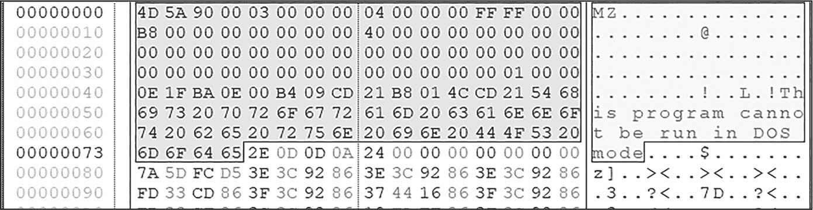

图 2-1：在十六进制编辑器中查看 PE 头部

表 2-1 列出了其他一些常见签名，你还可以通过在维基百科上搜索“文件签名列表”找到更多。

表 2-1： 常见文件签名

| 签名（ASCII） | 魔数字节 | 文件类型 |
| --- | --- | --- |
| 7z¼¯' | 37 7A BC AF 27 1C | 7z 压缩包 |
| ELF | 7F 45 4C 46 | 可执行与链接格式（ELF），一种在 Unix 系统中使用的可执行文件类型 |
| %PDF- | 25 50 44 46 2D | PDF 文件 |
| {\rtf1 | 7B 5C 72 74 66 31 | 富文本格式（RTF）文档 |
| PK | 50 4B 03 04 | ZIP 文件（以及其他使用 .zip 格式的文件，如许多 Microsoft Office 文件） |

除了十六进制编辑器，你还可以使用 file 命令在 Linux 中识别文件类型。这个工具读取文件的签名并以人类可读的格式显示它。只需运行 file 命令，并将恶意文件作为输入参数：

```
> file suspicious.exe
```

如你在这里显示的输出中所见，该文件确实是一个可执行文件，具体来说是一个 Windows 32 位 PE 文件：

```
remnux@remnux:~$ file suspicious.exe
suspicious.exe: PE32 executable (GUI) Intel 80386, for MS Windows
```

file 命令是一个非常好的通用工具，用于识别许多常见的文件格式，包括非 PE 文件，如文档和归档文件。对于 PE 文件，PE 静态分析工具，或者我所称的*PE 筛查工具*，非常有用。以 CFF Explorer（[*https://<wbr>ntcore<wbr>.com*](https://ntcore.com)）为例，它是一个很好的初步分析工具，因为它提供了诸如文件大小和文件创建时间戳等信息，这些信息可以在图 2-2 中看到。

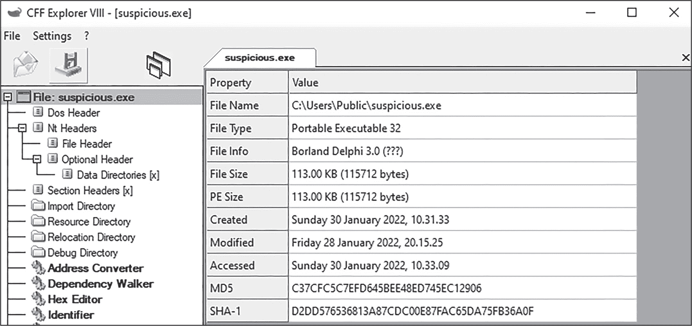

图 2-2：加载到 CFF Explorer 中的可执行文件

你可能已经注意到在图 2-2 中有关于文件的其他信息，例如左侧的导入目录和区段头标签。我将在本章和接下来的章节中讨论更多这些属性。注意右下角看似晦涩的 MD5 和 SHA-1 字段。这些是文件的哈希值，我们接下来会讨论。

#### 获取文件的哈希值

文件的*哈希*是一种指纹，因为它是该文件独有的。当文件经过哈希算法处理时，该算法会生成一个固定大小的字符序列。确切的大小取决于使用的哈希算法。用于恶意软件分析的最常见文件哈希算法是 MD5、SHA-1 和（其中最现代且最可靠的）SHA256。

在图 2-3 中，文件的 MD5 哈希值是C37CFC5C7EFD645BEE48ED745EC12906，其 SHA-1 哈希值是D2DD576536813A87CDC00E87FAC65DA75FB36A0F。这些哈希值唯一标识此文件。请注意，MD5 是一个较老的算法，但今天仍在使用。MD5 和 SHA-1 有发生*碰撞*的风险，这意味着两个或更多文件可能拥有相同的哈希值；这种情况非常罕见，但仍然会发生。我们在这里不讨论哈希碰撞；可以简单地说，如果你发现两个完全不同的文件具有相同的签名，那么你很可能遇到了碰撞。

一旦你获得了文件的哈希值，就可以利用它从其他来源获取更多有关文件的信息。我们来看看它是如何工作的。

#### 使用 VirusTotal 进行筛查

VirusTotal（[*https://<wbr>www<wbr>.virustotal<wbr>.com*](https://www.virustotal.com)）是一个公开可用的恶意软件筛查和分析平台。无需账户，任何人都可以上传文件以获得快速评估。VirusTotal 会将上传的文件与 60 多个反恶意软件供应商的软件进行比对，以获得该文件的总体检测率，且会将文件在沙箱环境中运行（我们稍后会讨论沙箱），并从多个来源获取有关文件的附加信息。典型的 VirusTotal 评估可能包括以下内容：

+   文件的反恶意软件检测数量（*检测率*）

+   来自文件的沙箱报告

+   文件的元数据（文件创建者、创建日期等）

+   与文件相关的数字证书

+   Yara 规则匹配（我们稍后会在本章讨论 Yara）

+   许多其他有用的信息

VirusTotal 的一个主要优点是它可以查询非常大的恶意软件数据库中的哈希值。你只需将哈希值粘贴到 VirusTotal 中，它将为该文件执行被动查询，提供所有信息，就像你自己上传文件一样。只要文件在数据库中，VirusTotal 就会提供该文件的报告。运行我们来自 图 2-2 的恶意软件文件的 SHA-1 哈希值（D2DD576536813A87CDC00E87FAC65DA75FB36A0F）会返回如 图 2-3 所示的报告。

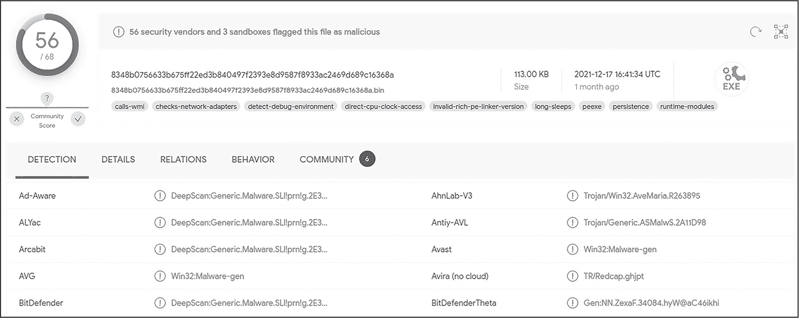

图 2-3：来自 图 2-2 的文件的 VirusTotal 报告

你可以看到该文件的检测率为 56/68，这意味着 68 个反恶意软件软件供应商中有 56 个将该文件分类为恶意文件。根据这些信息，我们可以得出结论，这个文件很有可能是恶意软件。除了文件的检测率外，一些供应商还会提供恶意软件的类别和家族名称。根据报告，我们可以合理推测这个恶意软件家族很可能是 *Ave Maria*，这是一种常见的远程访问木马和信息盗窃者变种。然而需要注意的是，来自 VirusTotal 的恶意软件分类并不总是准确的。恶意软件文件可能被打包过，这可能导致错误分类。第十七章将详细讨论打包技术。

> 注意

*查询 VirusTotal 中的文件哈希值始终是一个好主意。但在实际上传文件之前，你应该考虑文件在 VirusTotal 平台上公开可用的风险。问问自己：这个文件是否包含敏感信息，例如关于我或我公司的数据？这个文件是否是涉及我公司的正在进行的调查的一部分？上传这个文件是否会让恶意软件作者知道他们的恶意软件已经被发现并正在被积极分析？请记住，恶意行为者也在关注 VirusTotal。*

#### 查询搜索引擎和其他资源

与 VirusTotal 一起，搜索引擎可以成为恶意软件分类的强大工具。只需将恶意软件的哈希值或文件名（如果它是唯一的）粘贴到你选择的搜索引擎中，查看返回的相关信息。如果该文件已知，你可能会从其他在线恶意软件库和沙箱中获取到有价值的信息。

使用 Google 查询我们恶意软件的 SHA-1 哈希值，返回了如 图 2-4 所示的结果。

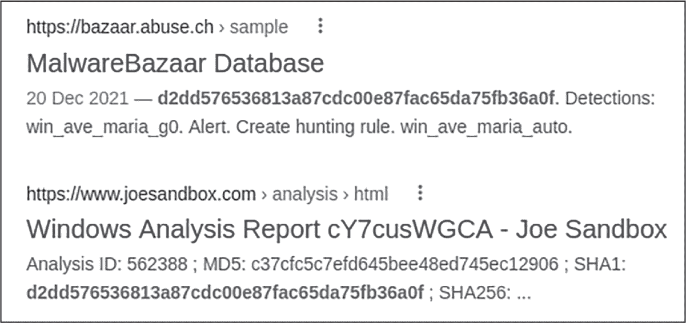

图 2-4：使用 Google 查询我们的恶意软件 SHA-1 哈希值

看起来这个文件已经相当有名了！MalwareBazaar 是恶意软件分析师和研究人员的一个很好的资源，它上面有关于这个文件的一些信息。Joe Sandbox（我将在本章稍后介绍）似乎也已经知道这个文件了。探索这些资源可能帮助你在自己分析文件之前，更好地理解它及其功能，从而节省相当多的时间和精力。

现在你应该至少对文件是什么有一个基本的了解，甚至可能知道它属于哪个恶意软件家族，具体取决于它是否在公开仓库中可用。如果文件是未知的，你需要进一步挖掘，以确定它的功能和行为。但这正是恶意软件分析的有趣部分！让我们看看如何调查一个未知文件。

#### 使用 Yara 识别和分类未知恶意软件

Yara（[*http://<wbr>virustotal<wbr>.github<wbr>.io<wbr>/yara<wbr>/*](http://virustotal.github.io/yara/)）允许你创建用于匹配未识别文件的签名定义（称为 *规则*）。这些签名定义可以是字符串、字节序列或其他属性的形式。以下代码（可以在 [*https://<wbr>github<wbr>.com<wbr>/bartblaze<wbr>/Yara<wbr>-rules<wbr>/blob<wbr>/master<wbr>/rules<wbr>/crimeware<wbr>/AveMaria<wbr>.yar*](https://github.com/bartblaze/Yara-rules/blob/master/rules/crimeware/AveMaria.yar) 上找到）展示了一个简化版本的 Yara 规则，用于检测 Ave Maria：

```
rule AveMaria
{
  meta:
    `--snip--`
    source = "BARTBLAZE"
    author = "@bartblaze"
    description = "Identifies AveMaria aka WarZone RAT."
    category = "MALWARE"
    malware = "WARZONERAT"
    malware_type = "RAT"
    mitre_att = "S0534"

  strings:
    $ = "AVE_MARIA" ascii wide
    $ = "Ave_Maria Stealer OpenSource" ascii wide
    $ = "Hey I'm Admin" ascii wide
    $ = "WM_DISP" ascii wide fullword
    $ = "WM_DSP" ascii wide fullword
    $ = "warzone160" ascii wide

  condition:
    3 of them
}
```

这个 Yara 规则专门设计用于匹配可能与 Ave Maria / Warzone RAT 相关的样本。它会匹配任何包含 strings 部分中三个或更多字符串的文件。让我们在我们的分析样本上运行这个 Yara 规则。要运行 Yara 规则，请使用以下语法（-s 参数显示恶意文件中的精确字符串匹配）：

```
$ **yara -s** **`rules_file malware_file`**
```

在我们的样本上运行这个 Yara 规则返回了以下结果：

```
remnux@remnux:/malware$ **yara -s AveMaria.yar suspicious.exe**

AveMaria 8348b0756633b675ff22ed3b840497f2393e8d9587f8933ac2469d689c16368a

0x162e0:$: A\x00v\x00e\x00_\x00M\x00a\x00r\x00i\x00a\x00 \x00S\x00t\x00e\x00a
x00l\x00e\x00r\x00 \x00O\x00p\x00e\x00n\x00S\x00o\x00u\x00r\x00c\x00e\x00
0x19340:$: H\x00e\x00y\x00 \x00I\x00'\x00m\x00 \x00A\x00d\x00m\x00i\x00n\x00
0x192b0:$: W\x00M\x00_\x00D\x00I\x00S\x00P\x00
0x19cca:$: W\x00M\x00_\x00D\x00I\x00S\x00P\x00
0x166c4:$: W\x00M\x00_\x00D\x00S\x00P\x00
0x1845a:$: W\x00M\x00_\x00D\x00S\x00P\x00
0x13c50:$: warzone160
```

看起来我们匹配成功了！以 AveMaria 开头的这一行显示了成功匹配的信息，后续的行显示了规则中的哪些字符串在我们的可疑文件上匹配。

Yara 规则可以帮助你快速获取关于你处理的文件的宝贵信息，甚至可能识别出其相关的恶意软件家族。欲了解更多有关 Yara 的信息，请参见 [*https://<wbr>yara<wbr>.readthedocs<wbr>.io<wbr>/en<wbr>/stable<wbr>/*](https://yara.readthedocs.io/en/stable/)。

现在，让我们看看如何根据文件的静态属性来评估一个未知文件。

#### 分析静态属性

通过检查文件的静态属性，你可以学到很多关于未知文件的信息。关于这些属性的一些内容已在《PE 文件格式》一文中讨论，详见 第 13 页。

##### 字符串

*字符串*是各种文件类型中的字符序列。有时，字符串是人类可读的文本，有时则仅仅是字节的序列。无论哪种情况，它们都是检查未知文件的一个很好的起点。提取文件中的字符串最简单的方法是使用 Linux 中的 strings 命令行工具。该工具扫描文件并尝试定位并将二进制数据的字符串转换为人类可读的形式：

```
> **strings suspicious.exe**
```

请注意，默认情况下，strings 命令仅会输出 ASCII 字符串。另一种类型的字符串，即 Unicode（或宽字符），可以通过以下命令提取：strings -e l suspicious.exe。输出结果已经揭示了一些有趣的内容：

```
remnux@remnux:/malware$ **strings suspicious.exe**
`--snip--`
127.0.0.2
abcdefghijklmnopqrstuvwxyzABCDEFGHIJK... 
warzone160
.bss
USER32.DLL
MessageBoxA
Assert
An assertion condition failed
PureCall
`--snip--`
```

最引人注目的是，存在对 warzone160 的引用。快速搜索引擎查询表明，这很可能与 Ave Maria 或 Warzone RAT 恶意软件家族有关，正如你在 图 2-5 中所看到的。这是将开放源代码情报（OSINT）集成到恶意软件分析过程中的一个很好的例子。

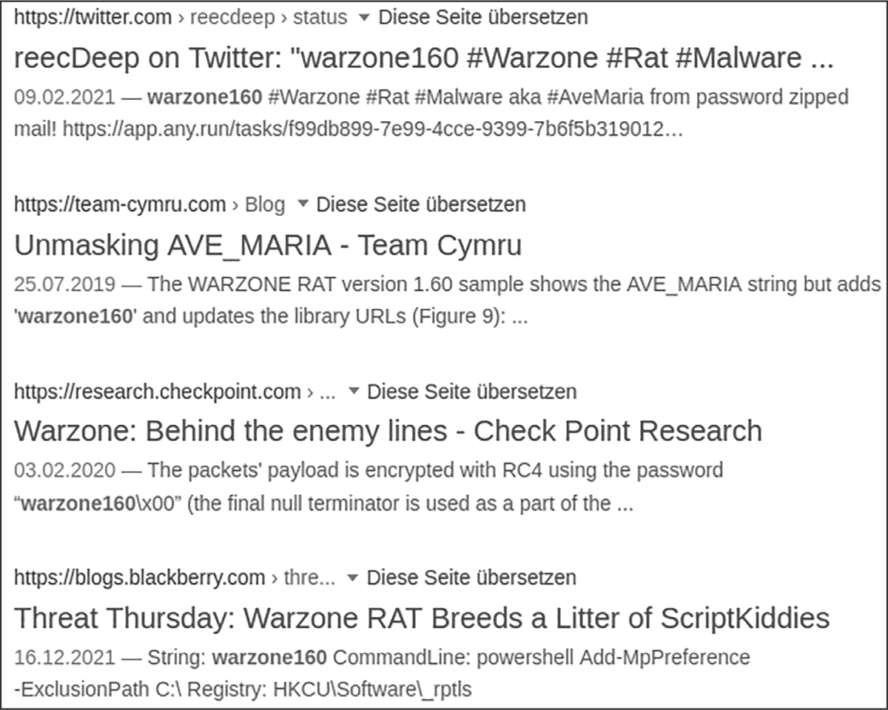

图 2-5：在恶意软件中嵌入字符串的 OSINT 调查

对于可执行文件，PE 工具如 PEStudio 非常有用。PEStudio 不仅提取可执行文件中的各种字符串格式，还根据特定特征对这些字符串进行排序和分类，正如你在 图 2-6 中所看到的。

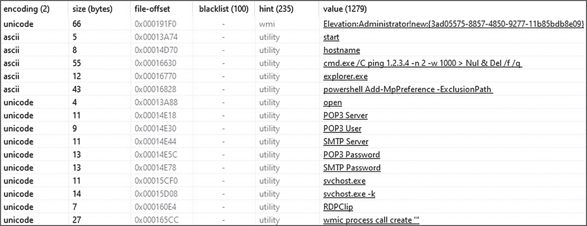

图 2-6：PEStudio 中的字符串分类

PEStudio 已经发现了几条值得注意的字符串：可能的权限提升能力 (Elevation:Administrator)，一个命令行命令 (cmd.exe) 和 powershell 和 wmic 引用，还有对 SMTP 服务和密码的引用 (SMTP, POP 等等)。从这些字符串中，你可能推测该文件具备将权限从普通用户提升为管理员的能力；调用 Windows 工具，如 *cmd.exe*、PowerShell 和 WMIC；并使用 SMTP 进行网络通信。你在字符串中发现的有用信息可以帮助你在调查过程中提供线索，了解恶意软件文件的意图。

另外两个对字符串分析非常有用的工具是 FLOSS 和 StringSifter。FLOSS（[*https://<wbr>github<wbr>.com<wbr>/mandiant<wbr>/flare<wbr>-floss*](https://github.com/mandiant/flare-floss)）是一个用于识别和提取*混淆*字符串的工具——即那些故意被掩盖以防止外部窥探数据的字符串。以下是 FLOSS 针对另一个可疑文件的输出摘录：

```
remnux@remnux:~$ **floss unknown.exe**
`--snip--`
FLOSS decoded 29 strings
`--snip--`
C:\Program Files (x86)\Microsoft\W0rd.exe
taskkill /f /im W0rd.exe
ZwQueryInformationProcess
`--snip--`
```

在这种情况下，FLOSS 成功解码了一些显著的混淆字符串，包括一个文件路径（C:\Program Files\Office\W0rd.exe）、一个命令行工具引用（taskkill），以及恶意软件可能稍后导入的一个 Windows 函数（ZwQueryInformationProcess）。在第十六章中，我将讨论恶意软件如何混淆数据的方法，并讨论如何利用 FLOSS 来揭示这些数据。

StringSifter（[*https://<wbr>github<wbr>.com<wbr>/mandiant<wbr>/stringsifter*](https://github.com/mandiant/stringsifter)）接收来自其他字符串提取工具的输出，如前述的字符串和 FLOSS 工具，并根据它们对恶意软件分析人员的有用性和相关性对字符串进行排名和排序。我在本书中不会进一步讨论 StringSifter，但它在快速分析大量字符串时非常有帮助。

##### 导入和导出

正如第一章所解释的，导入是可执行文件正在使用的库和函数，而导出是可执行文件为其他函数或程序提供的函数。导入和导出可以用来获取有关可执行文件意图的线索。例如，如果该文件导入了像*Winhttp.dll*这样的库，我们可以做出合理的猜测（但一定要确认！），它可能尝试联系远程服务器，如命令与控制服务器。

如前所述，PEStudio 可以从恶意软件中提取导入和导出的信息，并以有组织的方式向你展示这些信息，如图 2-7 所示。

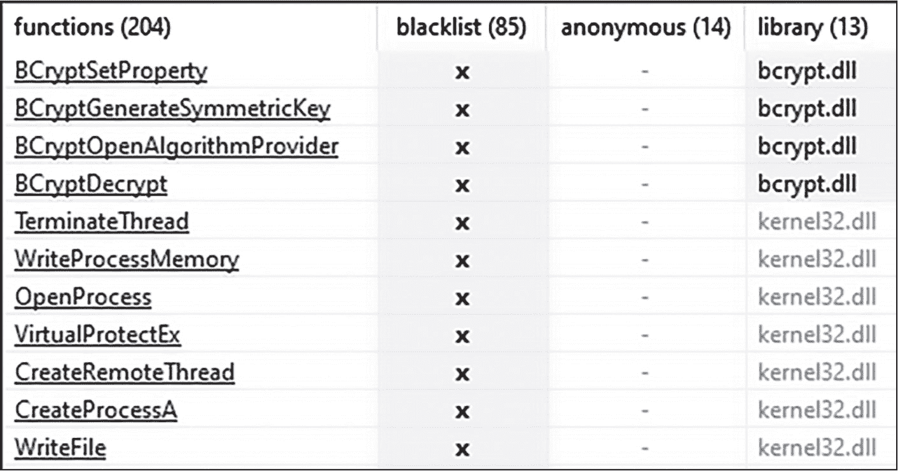

图 2-7：PEStudio 中列出的函数导入

在这里，我们可以看到这个恶意软件导入的各种 Windows 函数，并且很可能在执行过程中会调用它们。值得特别关注的函数有BCrypt*函数（可能用于加密或解密数据）、WriteProcessMemory和CreateRemoteThread（可能用于作为进程注入的一部分），以及WriteFile（用于向文件写入数据）。尽管这些并不能作为文件恶意性或能力的决定性证据，但它们是我们在恶意软件分析过程中可以利用的线索。

##### 元数据和其他信息

最后，文件的元数据可以为我们提供有关其意图的线索。PEStudio 可以显示文件的时间戳，这可能表示文件首次编译的时间。它还可以显示有关文件编程语言的信息、PE 文件的各个部分，甚至是可能用于签署文件的嵌入证书。简而言之，你可以使用像 PEStudio 这样的 PE 文件分析工具收集关于文件的丰富附加信息。然而需要注意的是，恶意软件作者可以篡改和伪造元数据，正如本书稍后将讨论的那样。

### 使用沙箱的自动化恶意软件分诊

在最初评估可疑文件后，你可能仍然会有一些问题。即使你通过初步分析能够确定该样本属于哪种恶意软件家族，你仍然可能需要快速识别其能力并提取关键信息。一个好的选择是使用恶意软件分析沙箱，它可以提供关于样本目的、能力和行为的很多信息。

恶意软件分析沙箱用于自动化恶意软件分析过程中的部分步骤，特别是初步的分诊。当一个文件被提交到自动化沙箱时，它会被引爆（即执行），并且它对系统的行为会被密切监控。自动化沙箱通常会在分析后生成一个报告，列出文件的行为和能力。

在撰写本文时，市面上有许多沙盒，每个沙盒都有不同的特点。虽然有太多优秀的沙盒无法一一列举，但表 2-2 列出了我有过使用经验并且认为值得提及的一些。许多沙盒允许你免费上传文件，但也有一些对于提交文件的数量或其他免费层级存在限制。请注意，列表中的前两个项目（CAPE 和 Cuckoo）并非商业化产品，因此你需要从 GitHub 上下载这些项目并自行构建。此外，请注意，Cuckoo 在本文撰写时已经不再维护，但项目作者正在开发一个新版。

表 2-2： 商业化和免费沙盒选项

| 名称 | 类型 | 来源 |
| --- | --- | --- |
| CAPE | 免费，开源 | [https://github.com/kevoreilly/CAPEv2https://capev2.readthedocs.io/](https://github.com/kevoreilly/CAPEv2https://capev2.readthedocs.io/) |
| Cuckoo | 免费，开源 | [https://github.com/cuckoosandbox](https://github.com/cuckoosandbox) |
| Hatching Triage | 商业化，免费提交文件 | [https://tria.ge](https://tria.ge) |
| Hybrid Analysis | 商业化，免费提交文件 | [https://www.hybrid-analysis.com](https://www.hybrid-analysis.com) |
| Intezer | 商业化，免费提交文件 | [https://www.intezer.com](https://www.intezer.com) |
| Joe Sandbox | 商业化，免费提交文件 | [https://www.joesecurity.org/](https://www.joesecurity.org/) |
| UnpacMe | 商业化，免费提交文件 | [https://www.unpac.me/](https://www.unpac.me/) |
| VirusTotal | 商业，免费提交文件 | [https://www.virustotal.com](https://www.virustotal.com) |
| VMRay | 商业 | [https://www.vmray.com](https://www.vmray.com) |

与 VirusTotal 提交一样，任何你提交到公共沙箱的文件都会立即对其他研究人员和全球开放。请尽力确保你提交的文件不包含敏感的个人或商业信息，并考虑样本公开后对调查的影响。

图 2-8 显示了将我们的恶意软件文件提交到 Cuckoo 沙箱实例后的结果。

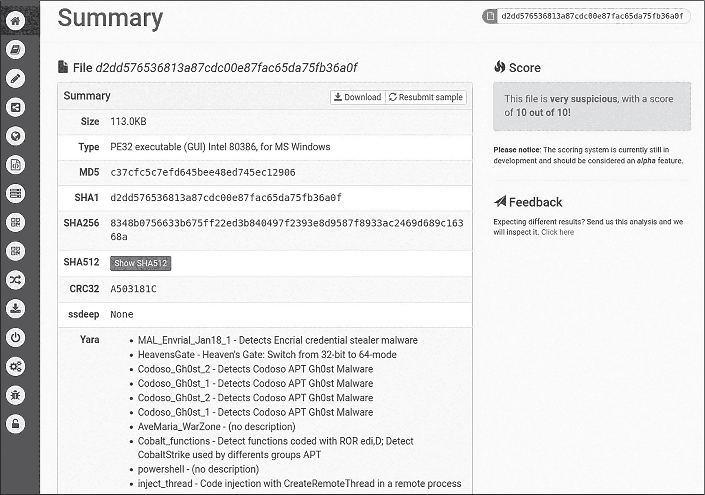

图 2-8：Cuckoo 沙箱中的恶意软件汇总

这个 Cuckoo 汇总页面包含了很多有用的信息，如基本的文件信息（文件类型、大小、哈希值等）、检测分数（“10 满分！”）甚至是 Yara 签名。似乎 Cuckoo 的 Yara 引擎将这个样本检测为可能是 Gh0st 或 Ave Maria / Warzone。相比之下，Joe Sandbox 报告这个样本为 Ave Maria，正如你在图 2-9 中看到的那样。

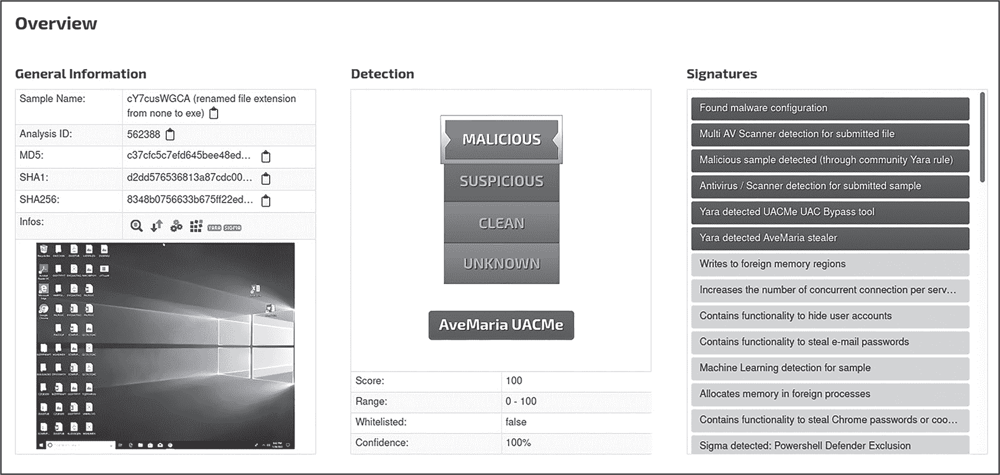

图 2-9：Joe Sandbox 中的恶意软件概览

仅仅知道这个恶意软件很可能与 Ave Maria 有关，就已经非常有帮助。这个例子还表明，在多个沙箱环境中触发一个样本从来都不是坏主意。有时，不同的沙箱会给出不同的结果，从而提供更完整的恶意软件图景。让我们在 Joe Sandbox 中更深入地检查这个样本。恶意软件的进程树，如图 2-10 所示，是在沙箱中分析恶意软件样本时的基本信息。

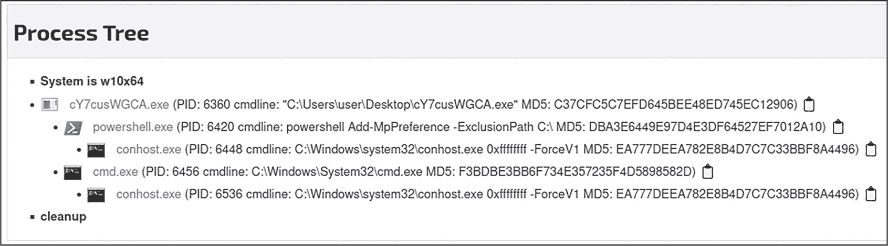

图 2-10：Joe Sandbox 中恶意软件的进程树

这个进程树显示了原始恶意软件可执行文件的进程（*cY7cusWGCA.exe*）以及所有派生的子进程，这为我们提供了关于恶意软件能力和行为的一些洞察。特别地，PowerShell 进程正在执行命令 Add-MpPreference -ExclusionPath C:\。此命令将恶意软件添加到 Windows Defender 的排除列表中，从而有效绕过了反恶意软件控制。

此外，Joe Sandbox 中的反调试部分，如图 2-11 所示，展示了这个样本可能使用的一些技术，用于检测并防御调试器。

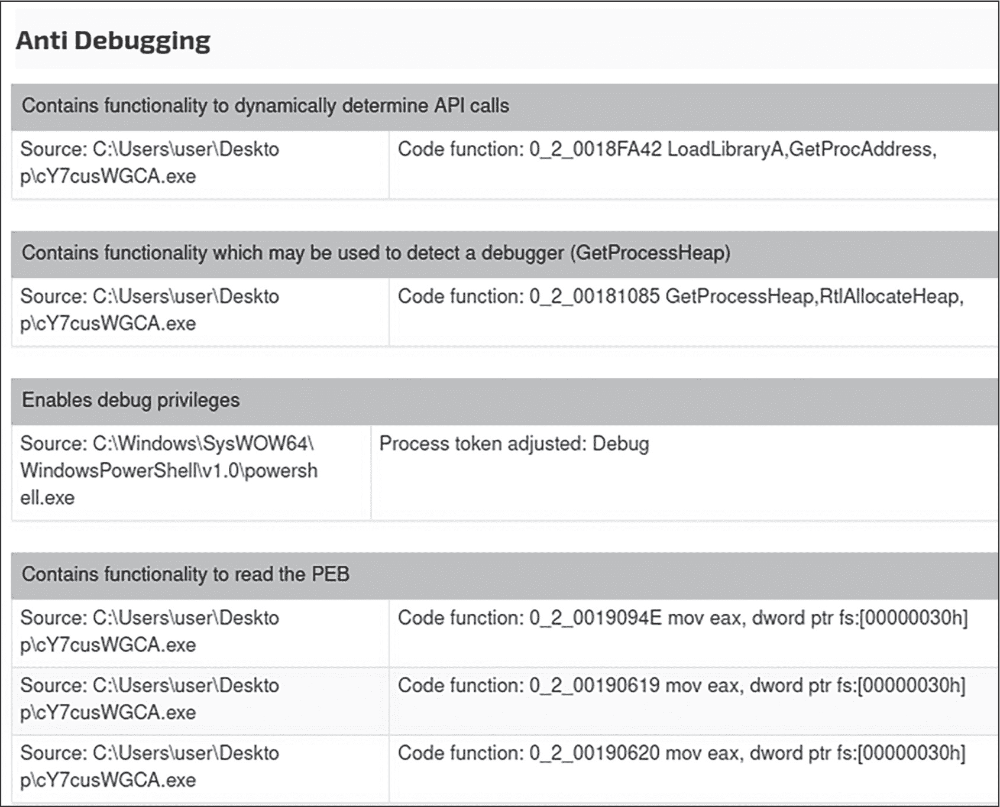

图 2-11：恶意软件在 Joe Sandbox 中的反调试技术

看起来这个恶意软件样本可能使用了动态库加载、手动读取 PEB 以及调用GetProcessHeap等技术来检测调试器。

你还可以看到 Joe Sandbox 已检测到使用了几种潜在的主机防御绕过技术，如进程注入和向 Windows Defender 添加排除项（见图 2-12）。

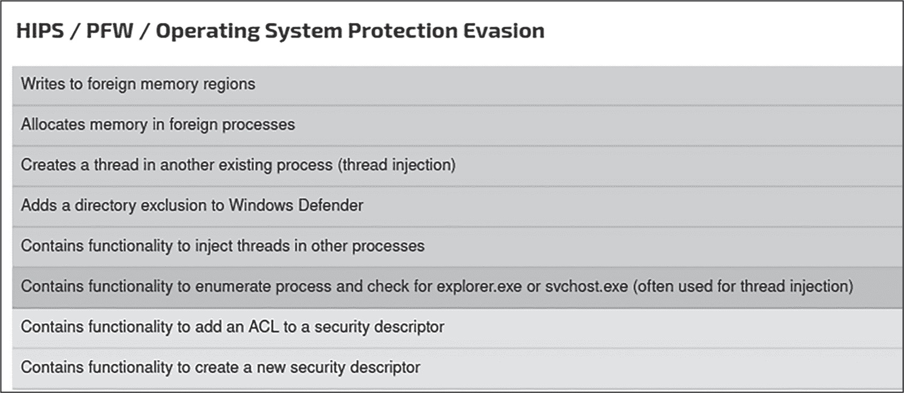

图 2-12：在 Joe Sandbox 中识别的防御绕过技术

反调试和防御绕过技术将在第十章和第四部分中分别详细讨论。

> 注意

*使用沙箱总是识别和定位恶意软件绕过技术的明智第一步，这样你在必要时可以绕过它们。然而，请记住，沙箱的结果可能是没有定论的，甚至可能是错误的。始终手动检查沙箱结果以验证发现的内容。*

最后，使用沙箱是一种快速提取*妥协指标（IOCs）*的好方法。IOC 可以是网络伪迹（例如，向特定域名或 IP 地址发送的通信，或特定的 HTTP 头部）或主机伪迹（例如，特定的文件名或注册表键修改，或可疑的命令行执行），这些都可以帮助你后续检测该恶意软件并防止其进一步感染主机。关于什么是和什么不是 IOC 的更多信息，请访问 [*https://<wbr>www<wbr>.crowdstrike<wbr>.com<wbr>/cybersecurity<wbr>-101<wbr>/indicators<wbr>-of<wbr>-compromise<wbr>/*](https://www.crowdstrike.com/cybersecurity-101/indicators-of-compromise/)。

Joe Sandbox 环境能够从这个样本中提取出命令控制 IP 地址，如图 2-13 所示。

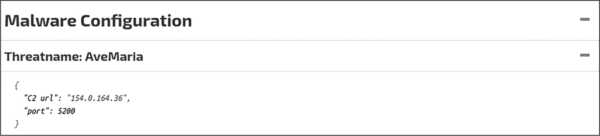

图 2-13：Joe Sandbox 提取的恶意软件配置

在沙箱中分析恶意软件样本后，我们现在已经对其许多能力和行为有了相当好的评估。这个恶意软件样本很可能是 Ave Maria 的变种，能够与命令控制地址通信（这意味着它很可能会下载额外的负载），检测调试工具等分析工具，并通过进程注入和反恶意软件绕过技术来逃避主机防御。根据你此次调查的恶意软件分析目标，这些信息可能已经足够。然而，要详细了解一个恶意软件样本，我们需要深入研究。

### 交互式行为分析

沙箱结果可以提供分析师判断恶意软件意图、目的和潜在影响所需的大部分信息，但关键问题可能仍然没有答案。许多恶意软件沙箱是为了快速而粗略的分析和初步评估而设计的，有时它们不会包含在调查过程中可能需要的详细信息。此外，沙箱无法轻松地动态修改，以根据正在运行的恶意软件调整环境，因此它们的结果可能不完整，尤其是当恶意软件使用了高级的沙箱检测和规避技术时。

*交互式行为分析*是一个花哨的术语，用于指手动引爆和监控恶意软件在受控环境中的行为，而不是仅仅依赖于像 Cuckoo 这样的沙箱进行完全自动化的引爆。交互式行为分析是一个更加手动、互动的过程，给予你更多的自由。这种交互分析通常是在虚拟机中进行的。

使用交互式行为分析的一个关键原因是，如果恶意软件样本使用了沙箱检测技术，你可以通过模拟真实用户或向恶意软件提供它寻找的东西来尝试破坏这些检测。例如，恶意软件可能会在受害者的系统上搜索特定的文件，而由于我们完全控制交互环境，我们可以提供这个文件，让恶意软件继续执行。完全自动化的沙箱在这方面通常会失败。

我们将要探索的工具是免费的。如果你想跟着操作，你需要在虚拟机环境中下载并安装以下工具：

+   Procmon ([*https://<wbr>learn<wbr>.microsoft<wbr>.com<wbr>/en<wbr>-us<wbr>/sysinternals<wbr>/*](https://learn.microsoft.com/en-us/sysinternals/))

+   Process Hacker ([*https://<wbr>processhacker<wbr>.sourceforge<wbr>.io*](https://processhacker.sourceforge.io))

+   Fiddler ([*https://<wbr>www<wbr>.telerik<wbr>.com<wbr>/fiddler*](https://www.telerik.com/fiddler))

+   Wireshark ([*https://<wbr>www<wbr>.wireshark<wbr>.org*](https://www.wireshark.org))

> 注意

*在这个分析示例中，我们将使用一个恶意软件样本，你可以通过以下哈希值在 VirusTotal 或 MalShare 上找到该样本：*

> SHA256: 9bbc55f519b5c2bd5f57c0e081a60d079b44243841bf0bc76eadf50a902aaa61

#### 监控恶意软件行为

交互式行为分析的一个重要部分是监控恶意软件在受害主机上的行为或操作。一个常用的工具是 Process Monitor（Procmon），它是 Sysinternals 套件的一部分。Procmon 可以捕获恶意软件在主机上执行的许多操作细节，比如创建进程、读取和写入文件及注册表、以及尝试连接网络等。图 2-14 显示了 Procmon 中一个可疑 Microsoft Word 文件的进程树。

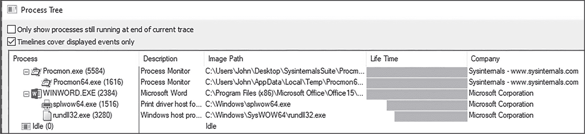

图 2-14：在 Procmon 中分析恶意软件样本的进程树

你可以看到，*WINWORD.EXE*（Microsoft Word）正在生成一个可疑的进程（*rundll32.exe*），这是一个值得进一步调查的结果。进程树还可以用来分析父子进程关系并发现代码注入机制。我们将在第十二章讨论代码注入。

通过检查 Procmon 的文件部分，我们可以看到这个文件正在创建一些可疑的附加文件（参见图 2-15）。

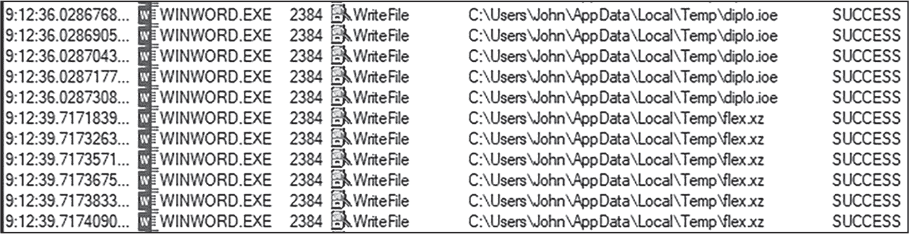

图 2-15：在 Procmon 中查看可疑的文件写入

这里需要注意的主要是WriteFile操作，后面跟着文件写入的路径。在分析过程中，这两个文件（*diplo.ioe*和*flex.xz*）应该进一步检查。

类似地，图 2-16 显示了 Procmon 的注册表选项卡。

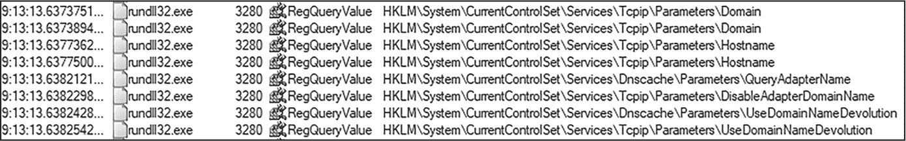

图 2-16：在 Procmon 中查看注册表查询

这里显示的*rundll32.exe*进程正在执行RegQueryValue操作，这表明它正在读取主机上的多个注册表值。它特别感兴趣的注册表项似乎都与域、主机名和网络适配器信息相关。读取注册表操作不一定是恶意的，因为所有 Windows 应用程序都必须读取注册表中的不同分支才能正常运行，但有时它们可能会暗示恶意软件的目的。在本书中你将看到，对于有针对性和规避性的恶意软件，它可能在枚举注册表和文件系统，寻找特定的值或模式，例如特定的主机名或文件路径。

Procmon 始终是交互式行为分析的一个不错的起点。在 Procmon 中揭示的可疑活动可以帮助进一步指导你的调查。例如，如果恶意软件正在写入一个奇怪的文件或读取一个可疑的注册表项，交互式分析的一部分就是实时调查这些路径！

另一个用于交互式分析的工具是 Process Hacker，它与类似的工具（如 Process Explorer）一起，可以用来检查进程树、调查恶意软件进程的内存等。内存检查是一个特别有用的任务；你可以通过右键点击目标进程，选择**属性**，然后选择**内存**选项卡来进行检查。你甚至可以查询内存中特定的字符串模式。搜索http是一个不错的开始，正如你在图 2-17 中看到的那样。

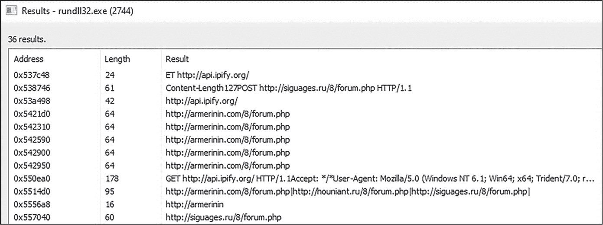

图 2-17：在 Process Hacker 中查询进程内存中的字符串模式

显示的内存字符串包含一些可疑数据。我们可以看到多个域名的 URL，比如*armerinin.com*和*siguages.ru*，这些应该进一步调查。恶意软件可能正在使用这些域名进行命令与控制，或者下载更多恶意软件。让我们来验证这个理论。

#### 检查恶意软件网络流量

许多恶意软件样本会在某些时候尝试连接到互联网的远程服务器。它们这样做可能有多种原因，包括以下几点：

+   下载附加的恶意文件、有效负载和模块

+   与命令与控制服务器通信，请求进一步指令

+   将窃取的信息（如凭证或文件）发送到远程服务器（通常称为*外泄*）

+   确定受感染主机是否当前已连接到互联网，或获取主机的公共 IP 地址（通常用于沙盒检测和规避技术）

无论出于什么原因，识别恶意软件连接的时间和目标非常重要。*Web 代理*是一种可以拦截和操控主机与外界之间网络流量的工具，它是一个非常好的恶意软件分析工具。Web 代理 Fiddler，如图 2-18 所示，捕获了一些可疑的恶意软件互联网连接尝试。

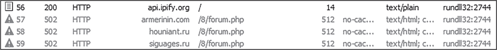

图 2-18：Fiddler Web 代理中的恶意软件互联网连接尝试

你可以看到 Fiddler 拦截了对*api.ipify.org*的网页请求，以及另外三个网站（*armerinin.com*、*houniant.ru*和*siguages.ru*）。如果你在 VirusTotal 上查询这三个域名，你很可能会看到它们被标记为恶意。（至少在写作时它们是这样标记的。）这个恶意软件很可能试图从这些域名之一下载更多的恶意软件。*api.ipify.org*网站只是返回主机的外部公共 IP 地址。为什么恶意软件要联系这个网站？一种可能性是恶意软件实际上是在尝试获取主机的公共 IP 地址，以确定其托管的国家。另一种可能的原因是确定主机是否在线。以上两种信息都可以用于反分析和规避，我将在本书中深入讨论相关技术。

流行的网络监控工具 Wireshark 也可以用来捕获互联网连接活动。此外，Wireshark 还可以捕获一般的网络活动，例如不指向互联网的流量，比如局域网内的主机对主机通信。图 2-19 展示了这个恶意软件样本在 Wireshark 中的部分网络连接情况。

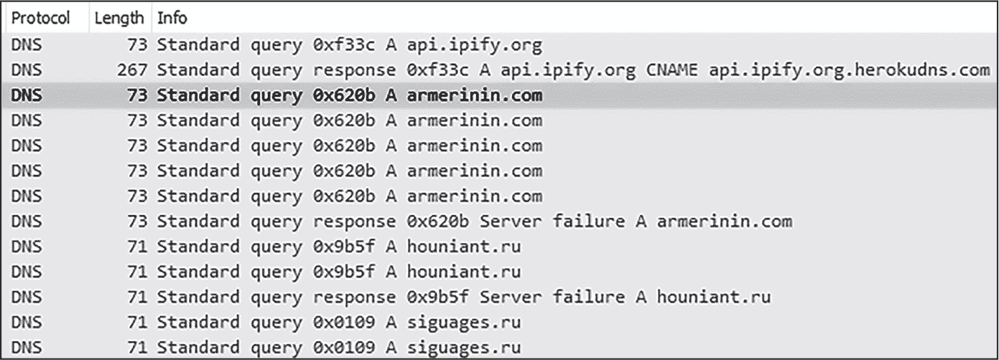

图 2-19：在 Wireshark 中捕获的恶意软件 DNS 请求

你可以轻松地发现 DNS 请求，它们指向 Fiddler 发现的相同主机名。

详细检查 HTTP 和其他协议的流量是很有帮助的。要查看网页流量，右键点击 HTTP 请求并选择**跟踪****TCP 流**。你应该会看到来自这个恶意软件样本的 HTTP POST 请求，如图 2-20 所示。

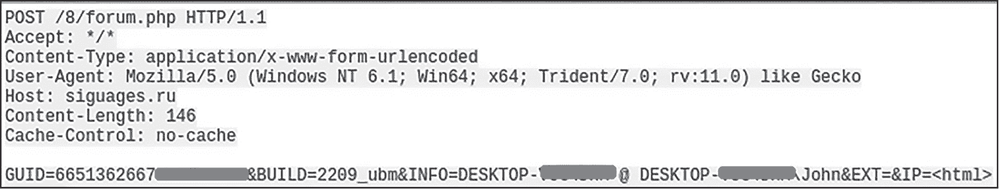

图 2-20：来自恶意软件的 HTTP POST 请求

这个样本正在向其基础设施（*siguages.ru*）发送数据，如受害者的主机名、IP 地址和唯一标识符。值得注意的是，恶意软件还在发送它的*僵尸网络 ID*（在这个例子中是“2209 _ubm”），这是分配给受感染计算机网络的标识符。虽然这个恶意软件以未加密的形式发送数据，但恶意软件也可能通过加密通道与受害者和其指挥控制基础设施之间进行通信。这使得通过 Web 代理或像 Wireshark 这样的工具检查流量变得更加困难。随着我们继续阅读本书，我们将更详细地了解一些这些技术以及如何克服它们。

> 注意

*许多恶意软件家族在感染主机之前会尝试确定主机是否连接到互联网，作为沙箱规避技术。如果你在离线（无互联网连接）的虚拟机中调查恶意软件，你可能需要使用一个“伪装”网络服务的工具，如 FakeNet 或 INetSim。我在附录 A 中简要讨论了这些工具。*  ### 总结

本章介绍了快速评估恶意软件样本并确定下一步分析步骤的基本方法。我们讨论了如何将自动化恶意软件沙箱用作此过程的一部分，以及如何在受控虚拟机环境中手动调查恶意软件行为，以便更详细地了解它们。在下一章中，我们将探讨代码分析如何补充这些初步分析和行为分析技术。
