## 第四章：3 静态与动态代码分析


在初步筛查、自动沙箱分析和行为分析是理解未知恶意软件样本的必要步骤时，有时你需要深入挖掘，甚至到代码层面。也许你遇到的问题是无法让样本在沙箱或虚拟机环境中运行，或者你可能在试图识别隐藏的功能。不管是什么原因，本章将指导你如何使用静态和动态代码分析技术来逆向工程恶意软件样本，并发现其真实意图。

我们将从汇编代码的简要介绍开始，这是逆向工程 PE 文件的一个基本概念。接下来，我们将深入探讨静态代码分析和反汇编工具，如 IDA。最后，我们将探索使用 x64dbg 进行动态代码分析和调试的细节。

> 注意

*与第二章一样，本章的目标是介绍一些本书后续部分会引用的关键概念。它并不是这些技术的全面指南，但你可以在附录 C 中找到一些很好的初学者资源。*

### 汇编代码简介

*汇编*是一种低级编程语言，提供了机器码指令的人类可读表示。在进行恶意软件逆向工程时，恶意程序可以从二进制机器码转换为汇编代码；这一过程称为*反汇编*。

本节介绍了 x86（32 位）和 x86_64（64 位，从此处起简称为 *x64*）汇编代码以及一些将在本书其余部分中应用的 CPU 概念。我们将从 CPU 架构基础开始，然后转到汇编指令。

#### CPU 寄存器

在程序运行时，CPU 使用*寄存器*，即物理处理器芯片上的内存位置，来存储数据并跟踪处理状态。由于内存存储速度较慢，CPU 尽可能多地利用寄存器进行数据存储和操作。根据处理器架构的不同，每个寄存器可以存储一定量的数据。一个*字*等于 16 位数据。x86 处理器寄存器通常可以存储一个*双字*（32 位）数据，而 x64 处理器寄存器可以存储一个*四字*（64 位）数据。

CPU 寄存器有五种主要类型：（1）通用寄存器，（2）索引和指针寄存器，（3）标志寄存器，（4）段寄存器，以及（5）指示器寄存器。前三种对于我们这里的目的最为重要，但我将在本书后续部分介绍其他两种。

##### 通用寄存器

*通用寄存器* 用于存储和处理用于算术运算、函数参数等一般用途的数据。每个通用寄存器可以分割成包含 16 位或 8 位数据的更小的段。例如，x64 中的 RAX 寄存器可以存储 64 位数据，RAX “包含”四个额外的更小的通用寄存器：EAX（RAX 中的最后 32 位数据）、AX（EAX 的高 16 位）、AH（EAX 的高 8 位）和 AL（EAX 的低 8 位）。图 3-1 显示了 RAX 寄存器及其更小的段，并展示了它们的存储大小限制（以位为单位）。

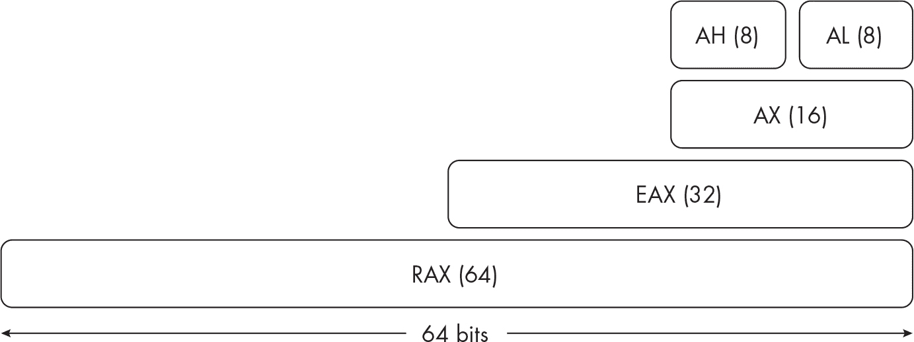

图 3-1：通用寄存器布局

表 3-1 描述了 x86 和 x64 处理器的每个通用寄存器。请注意，这些描述反映了每个寄存器历史上的使用方式；这并不意味着寄存器*必须*按这种方式使用。

表 3-1： x86 和 x64 通用寄存器

| x86 寄存器 | x64 寄存器 | 描述 |
| --- | --- | --- |
| EAX | RAX | 累加寄存器，用于算术运算、中断和存储返回值等任务 |
| AX, AH, AL | 与 x86 相同 | 分别为 EAX 的高 16 位、EAX 的高 8 位和 EAX 的低 8 位 |
| EBX | RBX | 用于引用变量和参数 |
| BX, BH, BL | 与 x86 相同 | 分别为 EBX 的高 16 位、EBX 的高 8 位和 EBX 的低 8 位 |
| ECX | RCX | 计数寄存器，用于计数和循环控制 |
| CX, CH, CL | 与 x86 相同 | 分别为 ECX 的高 16 位、ECX 的高 8 位和 ECX 的低 8 位 |
| EDX | RDX | 数据寄存器，主要用于算术运算，有时也作为 EAX 的备份 |
| DX, DH, DL | 与 x86 相同 | EDX 的高 16 位、EDX 的高 8 位和 EDX 的低 8 位 |

##### 索引和指针寄存器

*索引寄存器*和*指针寄存器*可以存储指针和地址。它们可用于任务，如传输内存数据、维持控制流和跟踪栈。表 3-2 概述了这些寄存器。

表 3-2： x86 和 x64 索引与指针寄存器

| x86 寄存器 | x64 寄存器 | 描述 |
| --- | --- | --- |
| ESI | RSI | 源索引；通常作为内存操作中的源地址 |
| EDI | RDI | 目标索引；通常作为内存操作中的目标地址 |
| EBP | RBP | 基址指针；指向栈的基址 |
| ESP | RSP | 栈指针；指向最后一个被推入栈的项目 |
| EIP | RIP | 扩展指令指针；指向下一条将被执行的代码地址 |

##### 标志寄存器

*标志寄存器*用于跟踪处理器的当前状态。通常，它用于存储计算结果并控制处理器的操作。*标志*是 EFLAGS 寄存器的通用术语，EFLAGS 用于 32 位架构，并在图 3-2 中展示；而 RFLAGS 寄存器用于 64 位架构。这两个寄存器的功能相似。

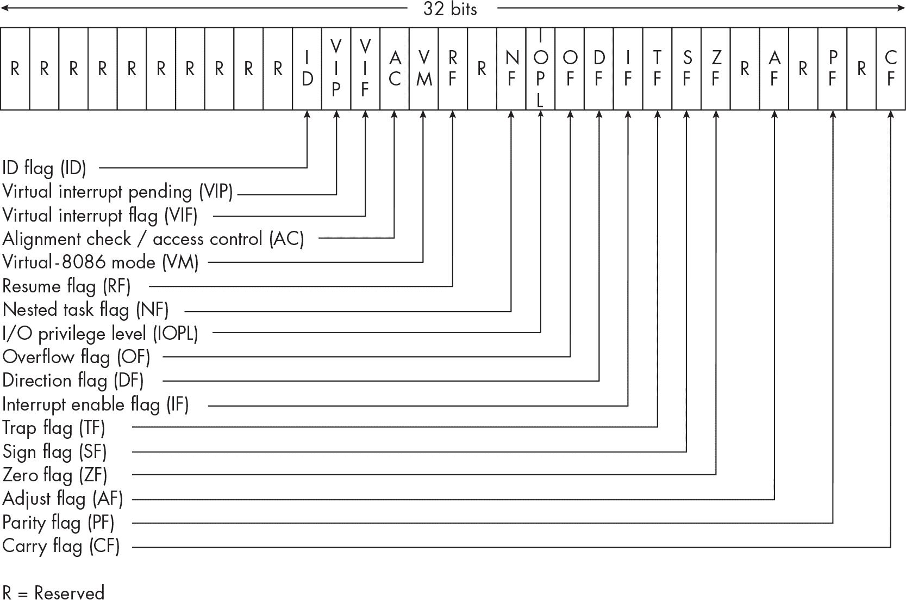

图 3-2：EFLAGS 寄存器

对于我们的目的，最重要的两个标志位是*零标志位 (ZF)*和*陷阱标志位 (TF)*。ZF 是一个单一的比特位，通过条件指令设置。例如，某个条件指令可能比较两个值；如果值相同，ZF 将被设置为 1。TF 用于调试，允许调试器单步执行指令。

#### x64 和 x86 指令

现在我们已经介绍了 CPU 寄存器和栈的基本内容，接下来让我们开始深入了解程序可以使用的各种汇编指令。

##### 栈操作

第一章简要提到了栈，这是分配给线程的内存区域，用于存储临时数据，如变量、指针以及线程执行完成并终止后不再需要的其他对象。栈以*后进先出 (LIFO)*的方式操作。这意味着，当程序将数据（例如变量）存储到栈中时，该变量会被放置到栈顶。要检索该变量，程序必须首先取出栈顶以上的所有其他数据。

要将数据放置到栈中，程序执行一个push指令，这会将数据推送到栈顶（见图 3-3）。要检索该数据，应用程序执行一个pop指令，这会将栈顶的数据弹出。

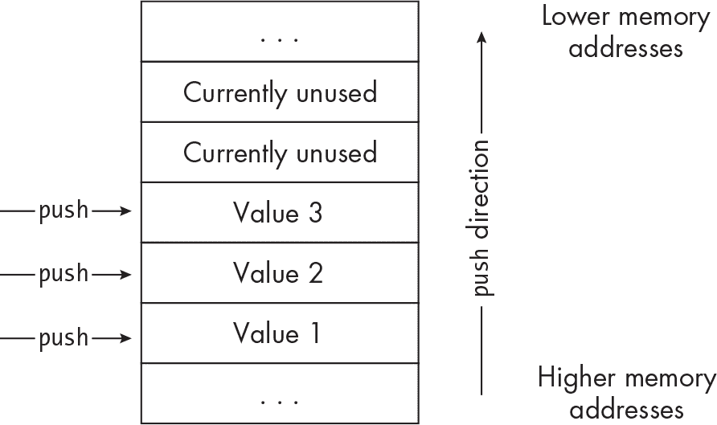

图 3-3：一个程序将数据推送到栈顶

这里程序首先将值 1 推送到栈中，然后是值 2，最后是值 3。此时，值 3 位于栈顶。要检索值 1，程序首先需要按照顺序弹出值 3 和值 2。

表 3-3 提供了这些指令的概览。

表 3-3： 栈操作指令

| 指令 | 示例 | 描述 |
| --- | --- | --- |
| push arg1 | push ebx push [ebx] push "50" | 将数据存储到 arg1 (可以是寄存器、内存地址或常量)的栈顶。 |
| pop arg1 | pop ebx pop [ebx] | 从栈顶弹出（获取）数据，并将其存储在 arg1中，可以是寄存器或内存地址。 |

大多数指令可以直接在 CPU 寄存器和内存地址上操作。例如，push ebx 指令会将当前存储在 EBX 寄存器中的数据直接推入栈中。寄存器名称周围的括号，如 push [ebx]，表示指令正在解除引用内存指针，因此，存储在 EBX 中的内存地址所指向的数据将被推入栈中。例如，如果 EBX 当前包含值 0x00406028（一个内存地址），那么存储在该内存地址的数据将被推入栈中。在反汇编程序中（稍后讨论），你通常会看到这条指令写作 push byte ptr [ebx] 或类似形式，提示你这指向内存中一系列字节的指针。

##### 算术运算

数据操作和算术指令用于计算，如加法和减法。某些算术指令，如 add，需要两个操作数：第一个是目标操作数，第二个是要加到其上的值。其他的指令，如 dec，用于递减目标操作数，只需要一个操作数。表 3-4 总结了一些常见的算术运算指令。

表 3-4： 算术运算指令

| 指令 | 示例 | 描述 |
| --- | --- | --- |
| add arg1, arg2 | add ebx, 50 | 将 arg2 (一个寄存器、内存地址或常量，如值 50) 加到 arg1 (一个寄存器或内存地址)中。 |
| sub arg1, arg2 | sub ebx, 50 | 将 arg2 (一个寄存器、内存地址或常量)的值从 arg1 (一个寄存器或内存地址)中减去。 |
| inc arg1 | inc ecx | 将 arg1 (一个寄存器或内存地址)增加 1。 |
| dec arg1 | dec ecx | 将 arg1 (一个寄存器或内存地址)减少 1。 |

##### 数据移动

程序可以通过 mov 指令在内存和寄存器之间移动数据。mov 指令需要两个参数，但只能有一个是内存地址。例如，在 x86 和 x64 汇编代码中，程序不能直接将数据从一个内存地址移动到另一个内存地址。你可以在 表 3-5 中看到这些指令的一些常见示例。

表 3-5: mov 指令的示例

| 指令 | 示例 | 描述 |
| --- | --- | --- |
| mov arg1, arg2 | mov eax, ebx mov [ebx], 100 | 将 arg2 (寄存器、内存地址或常量) 的数据移动到 arg1 (寄存器或内存地址)。 |

##### 值比较

通常情况下，程序需要比较两个值以引导控制流。比较指令可能是 if 语句，例如 if var == 2，但两条主要的比较指令是 cmp 和 test。任一指令的结果都会存储在零标志寄存器中，稍后将用来引导控制流。表 3-6 提供了 cmp 和 test 指令的概述。

表 3-6： 比较指令

| 指令 | 示例 | 描述 |
| --- | --- | --- |
| cmp arg1, arg2 | cmp eax, ebx cmp eax, 5 | 比较 arg1 (寄存器或内存地址) 与 arg2 (寄存器、内存地址或常量)。 |
| test arg1, arg2 | test eax, ebx test eax, 5 | 与上面相同。 |

你可能会看到像 test eax, eax 这样的指令，它比较的是 EAX 中的值和它自身。这实际上是在检查寄存器（此处为 EAX）的内容是否为 0。当 test 指令中的两个参数相同时，实际上是将该参数与 0 进行比较。如果 EAX 为 0，则零标志将被设置。

尽管 cmp 和 test 看起来非常相似，但它们的工作原理存在根本性的差异：cmp 可以看作是一个 sub 指令，而 test 类似于 and 指令。具体细节超出了本章的范围。

##### 跳转指令

程序可以使用各种跳转指令跳过到代码的其他区域，或者根据之前提到的比较指令来修改控制流。我们需要注意的三种常见跳转语句已在表 3-7 中总结。

表 3-7： 跳转指令

| 指令 | 示例 | 描述 |
| --- | --- | --- |
| jmp arg1 | jmp func_00405207 jmp ebx | “跳转”指令：跳转到另一个地址、函数或代码段； 可以是寄存器（包含内存地址）、指针或代码中的地址。 |
| jz arg1 | jz func_00405207 jz ebx | “零值跳转”指令：如果上一个算术操作的结果为 0，则跳转到 arg1 。 |
| jnz arg1 | jnz func_00405207 jnz ebx | “非零跳转”指令：如果上一个算术操作结果不是 0，则跳转到 arg1。 |

对于条件跳转指令（例如 jz 和 jnz），这些指令会检查零标志寄存器的输入。由于 cmp 和 test 会设置这些标志，它们通常是条件跳转的前奏。

##### 调用与返回指令

程序发出调用指令以调用 Windows API 函数或跳转到代码中的目标函数。在后者的形式中，call 类似于无条件跳转指令。在跳转到新地址之前，call 指令会将当前地址（存储在 EIP 或 RIP 中）推送到栈中。之后，程序可以发出返回（ret）指令返回到代码中的前一个位置。表 3-8 描述了这些指令。

表 3-8： 调用与返回指令

| 指令 | 示例 | 描述 |
| --- | --- | --- |
| call arg1 | call ebx call WriteFile | 调用（或跳转到） arg1中存储的地址，可以是寄存器（包含内存地址）、指针或函数。 |
| ret | ret | 返回到执行过 call 指令之前的代码位置。 |

##### 空操作指令

空操作指令，或称nop指令，正如你所想，它们什么也不做。含有nop指令的地址本质上会被处理器跳过。如果你在想它们的目的是什么，nop指令有许多合法用途，包括代码和内存的对齐、时间控制（例如测试程序的执行速度），以及占位代码（例如在手动汇编编程中）。

然而，nop也可以用于更恶意的目的，例如在 shellcode（在第十二章中讨论）和漏洞利用代码（例如缓冲区溢出）中使用。汇编代码段中存在的nop指令可以为分析员提供一个很好的信号，提示可能有值得进一步调查的内容。

现在我们已经了解了汇编代码的基础，接下来让我们关注通过静态代码分析来调查恶意代码。

### 静态代码分析

*静态代码分析*是检查代码静态状态（即不在执行时）的技术，通常使用一种叫做*反汇编工具*的工具来实现。反汇编工具允许我们浏览恶意软件的代码，识别感兴趣的函数或代码块，并深入研究这些区域。了解如何有效地使用反汇编工具通常是区分初学者与中级及高级恶意软件分析员的关键。假设你有一个未知的可执行文件，在你的自动化沙箱和虚拟机中只表现出一些行为，或者它甚至根本无法正常运行。也许它使用了某些虚拟机检测和沙箱规避技术。初学者在这个阶段可能会放弃，而经验丰富的分析员则很可能会将样本加载到反汇编工具中，以确定接下来该将调查重点放在哪里。

#### 选择反汇编工具

目前最著名的两款反汇编工具是 IDA 和 Ghidra。它们都是交互式反汇编工具，意味着你可以与反汇编代码进行互动并手动操作。这允许你修改代码、添加注释、重命名函数、修复错误的反汇编代码，总的来说，能更好地控制逆向工程过程。

IDA ([*https://<wbr>hex<wbr>-rays<wbr>.com*](https://hex-rays.com)) 一直是最受欢迎的交互式反汇编工具之一，原因很充分。它可以反汇编多种文件类型，支持多种处理器架构和操作系统，并且拥有许多 Hex Rays 和社区创建的插件和脚本。IDA 有多种版本，但提供了一个免费版，足以满足许多逆向工程的需求。

另一方面，Ghidra 是一个完全免费的开源交互式反汇编工具，具有许多 IDA 的功能，还增加了一些新特性，例如协作反汇编，允许多人共同处理一个文件。Ghidra 较新，并且在写作时，它还没有像 IDA 那样拥有众多插件或扩展脚本。不过，随着时间推移，这些功能会逐步增加。你可以在[*https://<wbr>github<wbr>.com<wbr>/fr0gger<wbr>/awesome<wbr>-ida<wbr>-x64<wbr>-olly<wbr>-plugin*](https://github.com/fr0gger/awesome-ida-x64-olly-plugin)找到一个精心策划的 IDA 和 Ghidra 插件及脚本列表。

在 IDA 阵营和 Ghidra 阵营中都有许多粉丝，但最终你选择哪一个并不太重要。一旦掌握了汇编概念，任一选项都能完成任务。对于本章（以及本书的大部分内容），我将使用 IDA。

#### 使用 IDA 分析

让我们通过 IDA 进行静态代码分析的基本过程。

> 注意

*在本节中，我们将使用 IDA 分析一个恶意软件文件，你可以通过以下文件哈希从 VirusTotal 或 MalShare 下载该文件：*

> SHA256: 30c9a1460615254a4ef791ffeeba53f4a31361c2646b25d3909025178c5a3976

要在 IDA 中打开这个可疑文件，请导航至 **文件****打开**，接受默认选项，然后点击 **确定**（见图 3-4）。IDA 将自动分析该文件。

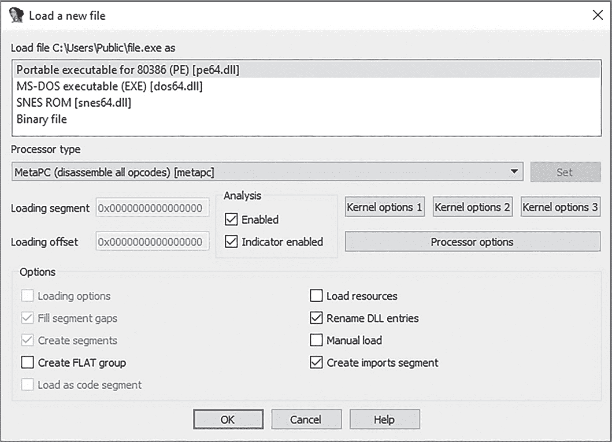

图 3-4: 将新文件加载到 IDA 中

IDA 界面包含多个选项卡，其中一些代表你可能希望检查的文件元素（见图 3-5）。

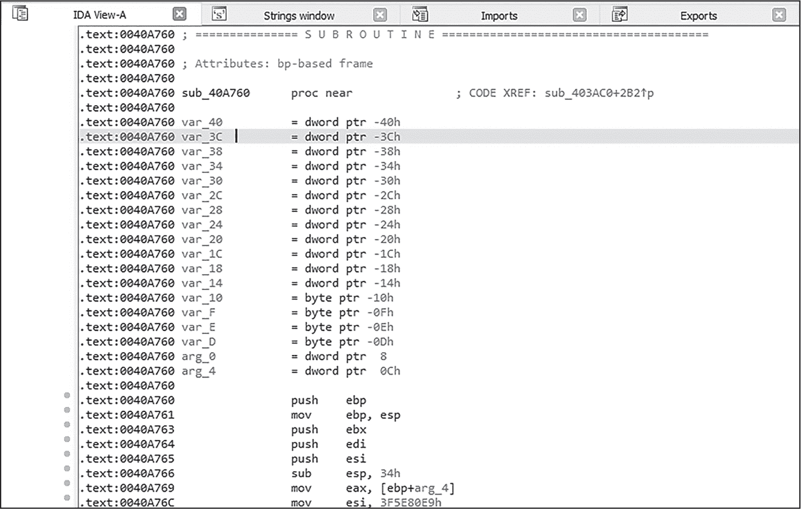

图 3-5: IDA 界面

在“导入”选项卡中，你可以看到几个有趣的函数，包括 WinHttp 库函数（见图 3-6），这些函数表明该恶意软件可能会在某些时候尝试与互联网上的服务器通信。

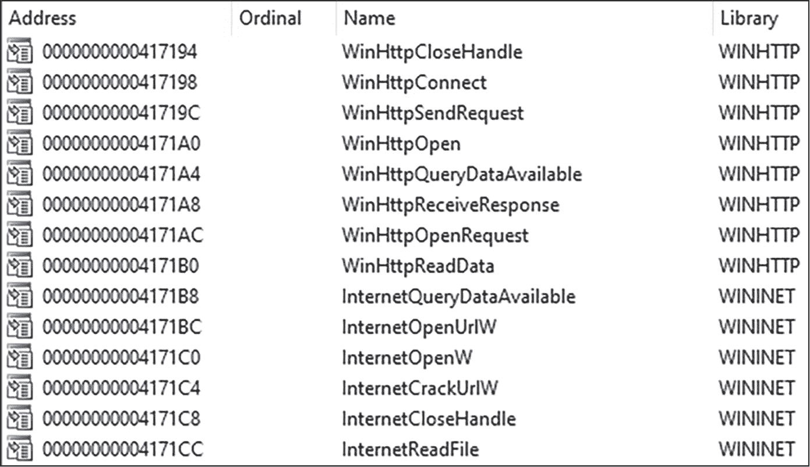

图 3-6: IDA 导入选项卡上的函数列表

InternetOpenUrlW函数可被恶意软件用来连接到互联网上的恶意服务器。要检查程序中此函数的调用，你只需在导入视图中双击它，然后按 CTRL-X 查看交叉引用（参见图 3-7）。*交叉引用*是程序代码中包含所选项的地址。

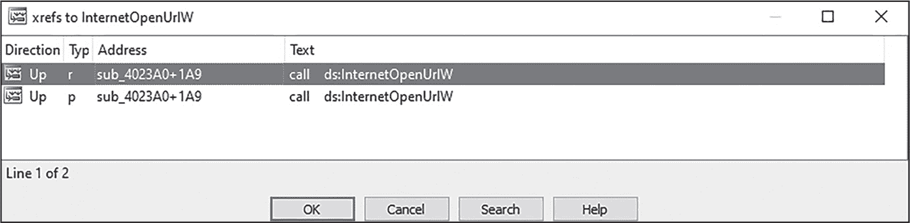

图 3-7：指向InternetOpenUrlW的交叉引用

点击**确定**以跳转到代码中的位置，查看程序调用了InternetOpenUrlW，如图 3-8 所示。

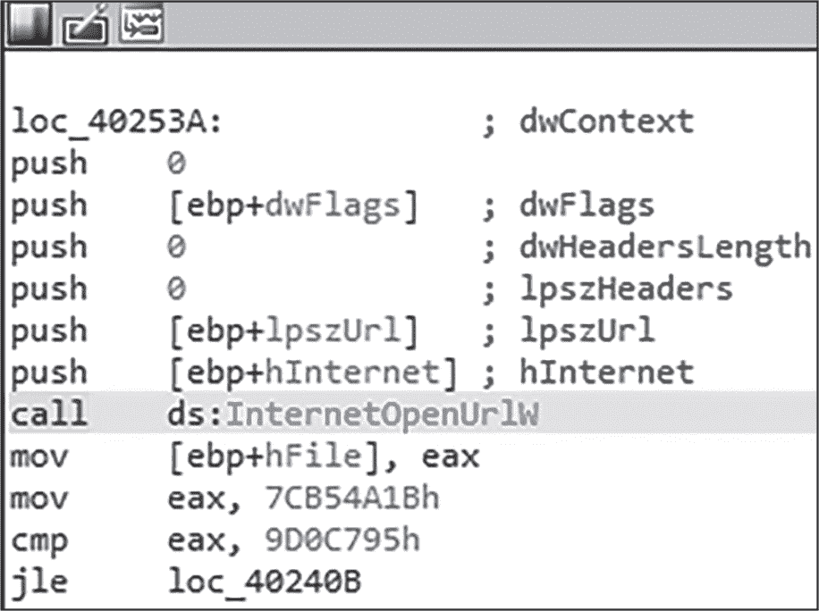

图 3-8：InternetOpenUrlW函数调用的代码位置

我们正在尝试确定恶意软件打开的是哪个 URL，但不幸的是，由于输入参数不明确，我们无法从这段代码中看到太多内容。我们可以看到几条push指令，这些指令将参数存储在栈上，其中一个参数是lpszUrl，它是目标 URL。如果我们运行这个程序，这个参数将位于栈上的地址[ebp+lpszUrl]。然而，由于我们只是静态地查看代码，栈上没有参数可以检查，这使得我们的工作变得更加困难。

我们可以逆向跟踪代码，试图确定程序最终将什么参数压入栈中，作为传递给InternetOpenUrlW函数的参数。有时候这样做很有价值，但通常情况下，恶意软件会混淆这些数据。另一种方法是将恶意软件加载到调试器中，动态检查栈。稍后我们会看看如何操作。首先，让我们讨论一个有用的静态代码分析工具。  #### 使用 CAPA 进行分析

CAPA（[*https://<wbr>github<wbr>.com<wbr>/mandiant<wbr>/capa*](https://github.com/mandiant/capa)）是由 Mandiant 的研究人员编写的开源工具。尽管它不是像 IDA Pro 那样的完整反汇编工具，但它可以帮助恶意软件分析师快速理解恶意软件样本的潜在行为，并识别值得进一步调查的代码区域。CAPA 通过扫描 PE 文件中的模式，如字符串和特定的汇编指令，来工作。此扫描提取了大量信息，并有助于引导逆向工程过程。要在目标可执行文件上运行 CAPA，执行以下命令：

```
> **capa.exe malware.exe -vv**
```

-vv指令告诉 CAPA 提供额外的详细信息。（请注意，-vvv会返回更多信息，而-v则返回较少。）图 3-9 展示了 CAPA 的一些示例输出。

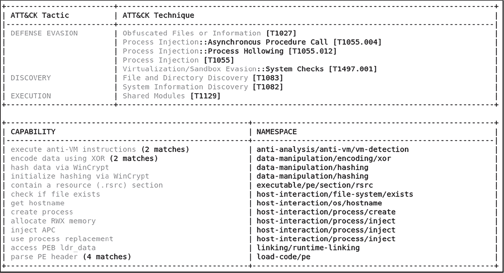

图 3-9：CAPA 输出

这些输出揭示了一些有趣的信息。首先，这个样本似乎正在使用规避技术，如文件混淆、进程注入以及虚拟化和沙箱检测。这些战术可能对你来说是新的，但别担心，我们将在本书的后续章节中详细讲解它们。

运行在详细模式下的 CAPA 甚至会提供可执行文件中嫌疑功能所在的地址。图 3-10 显示了 CAPA 识别的潜在反虚拟机指令。

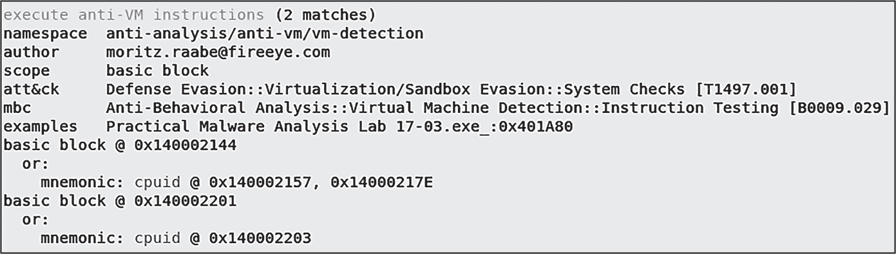

图 3-10：CAPA 识别的潜在反虚拟机指令

图 3-10 中的特定反虚拟机指令是cpuid，这是一条恶意软件常用的汇编指令，用于检测虚拟机环境。CAPA 定位了此可执行文件中调用cpuid的地址（0x140002157，0x14000217E，和0x140002203）。现在，你可以将这个恶意样本加载到反汇编工具中，比如 IDA Pro，并跳转到这些地址位置，快速找到cpuid指令。

图 3-11 显示了另一个例子，CAPA 识别了怀疑恶意软件所在的地址。

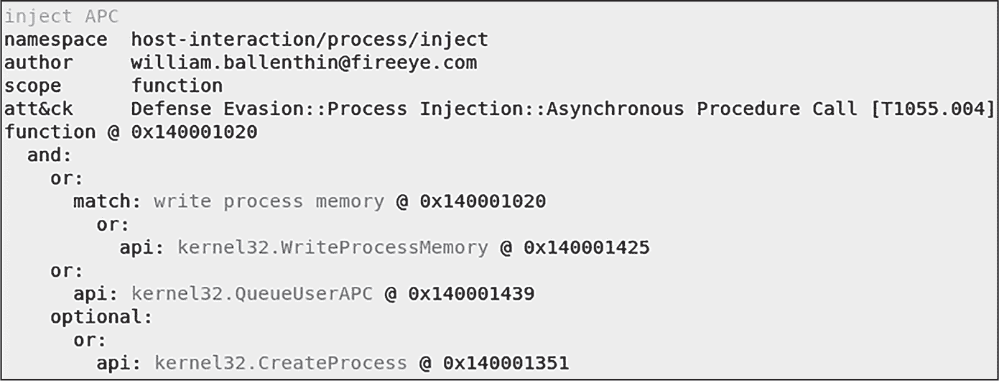

图 3-11：CAPA 输出显示潜在的进程注入

在这个例子中，CAPA 识别了一种潜在的进程注入技术：APC 注入，这是一种恶意软件用来规避宿主防御并隐蔽执行恶意代码的方法。

与反汇编器和其他静态代码分析工具配合使用时，CAPA 可以提高代码分析过程的效率，是你恶意软件分析工具箱中的得力助手。我们将在后续章节中详细介绍 CAPA，但现在我们将转向动态代码分析，并讨论它如何补充静态代码分析。

虽然 CAPA 非常有用，但它也有一些局限性。首先，它没有解包或去混淆的功能（至少在本文写作时是如此），因此在处理打包和高度混淆的恶意软件时，CAPA 可能会产生不正确的信息，甚至什么信息都没有。其次，CAPA 偶尔会产生误报。始终手动验证通过 CAPA 找到的任何功能。  ### 动态代码分析

*动态代码分析*包括在代码处于活动运行状态时进行分析，这通常意味着在调试器中执行代码。*调试器*与反汇编器类似，它们也会反汇编代码并将其呈现给您，但它们的附加优势是能够动态执行代码。

调试器的真正强大之处在于它们允许您在运行中的代码上设置断点。*断点*是特殊的指令或标志，当程序执行到这些断点时，会触发异常（或*中断*），将控制权交给调试器本身，使您可以控制正在运行的恶意软件样本。

#### 选择调试器

x64dbg 工具（[*https://<wbr>x64dbg<wbr>.com*](https://x64dbg.com)）是一个功能强大、免费的开源调试器，适用于 Windows 环境。它具有高度的可定制性和脚本化功能，并且得到了社区的支持，有许多有用的插件。在本书中，我将特别关注 x64dbg，但许多调试器的操作、外观和使用体验都与它非常相似。x64dbg 的一些替代品包括更古老的 OllyDbg、IDA Pro 自带的调试器或 WinDbg。

> 注意

*x64dbg 技术上有两个版本：x32dbg（用于调试 32 位程序）和 x64dbg（用于 64 位程序）。它们的功能完全相同，但专注于不同的架构。我将把这个程序称为 x64dbg，就像调试器的创建者一样，但请记住，为了调试 32 位（x86）程序，您必须使用 x32dbg 版本。*

#### 在 x64dbg 中启动调试会话

要将可执行文件加载到 x64dbg 中，请选择正确版本的 x64dbg（32 位或 64 位版本），然后选择**文件****打开**。（如果使用错误版本，调试器窗口底部会显示一条有帮助的消息，比如"请使用 x32dbg 调试此文件！"。）或者，您可以通过选择**文件****附加**，将调试器附加到当前正在运行的恶意软件进程。此方法的缺点是您可能会错过在附加进程并开始调试之前发生的关键行为。

一旦程序加载到调试器中，它作为调试器下的子进程运行。在大多数情况下，调试器调用函数DebugActiveProcess，允许它附加到活动进程并开始调试会话。我们将在第十章中再次讨论这个 API 调用。目前，让我们来看看 x64dbg 用户界面中最重要的部分，如图 3-12 所示。

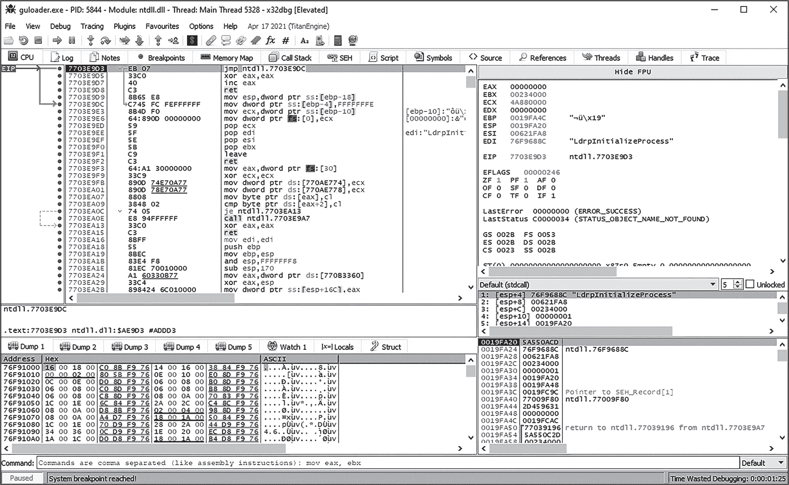

图 3-12：x64dbg 调试器

##### CPU 标签

x64dbg 窗口左上角的 CPU 面板列出了恶意软件将执行或已经执行的指令，按顺序排列。在这个窗口中，你可以逐行单步调试代码，或者跳过到更有趣的部分。EIP（对于 x64 程序是 RIP）标记了下一个将被执行的指令，如图 3-13 所示。

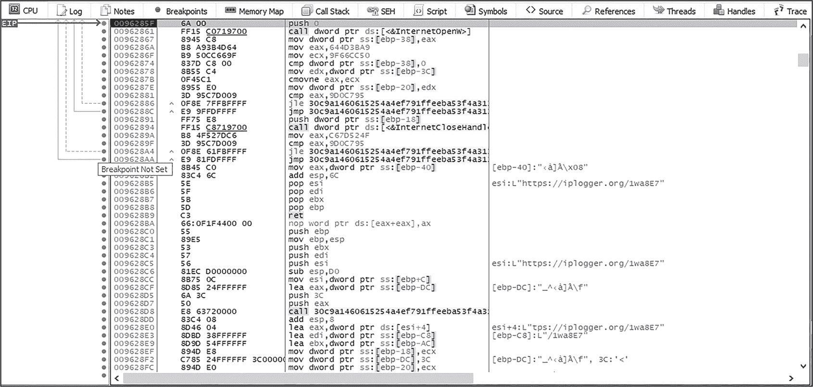

图 3-13：x64dbg CPU 标签

##### CPU 寄存器面板

在 x64dbg 窗口的右上方，你会看到 CPU 寄存器面板（参见图 3-14）。这个面板显示了每个寄存器和标志以及它们当前存储的值。这对于跟踪寄存器中存储的数据和地址非常有帮助。


图 3-14：x64dbg CPU 寄存器面板

你也可能注意到这个面板中的 EFLAGS 部分，显示了标志寄存器及其值。

##### 参数面板

参数面板（参见图 3-15）位于 x64dbg 窗口的右中部。

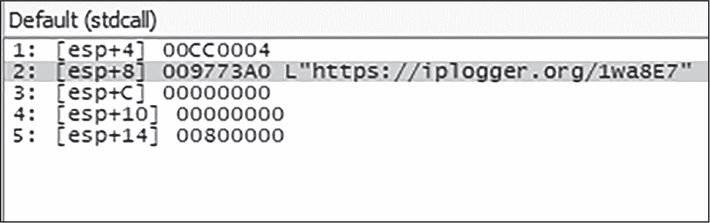

图 3-15：x64dbg 参数面板

这个面板显示了程序中当前函数调用的堆栈上的参数列表。这些信息对于监控和修改传递给函数的参数非常宝贵。

##### 堆栈面板

在 x64dbg 窗口的右下角是堆栈面板。这个面板显示了当前正在运行的线程的堆栈内存（参见图 3-16）。

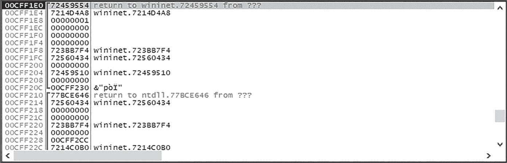

图 3-16：x64dbg 堆栈面板

当恶意软件调用一个函数（无论是内部函数还是 Windows API 函数）时，参考此堆栈面板是非常有帮助的。恶意软件传递给被调用函数的参数通常会在函数调用之前被推入堆栈，特别是在 32 位恶意软件中。

##### Dump 窗格

左下角是 Dump 窗格，如图 3-17 所示。

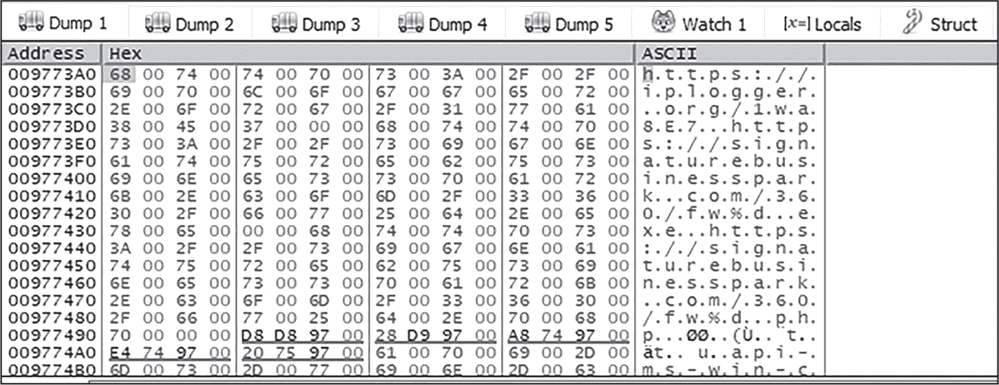

图 3-17: x64dbg Dump 窗格

这个视图允许你动态检查和监控内存地址（或 *转储*）。你还可以设置 *监视*，当特定事件发生时，x64dbg 会通知你，例如当特定寄存器被修改时。

##### Memory Map 标签页

最后，Memory Map 标签页可以通过 x64dbg 窗口顶部的一系列标签访问。在动态代码分析过程中，它非常有用，因为它显示了程序的虚拟内存布局，并允许你深入挖掘每个内存区域（参见图 3-18）。

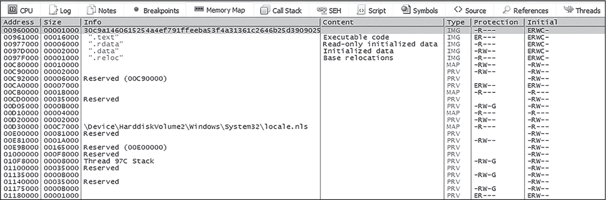

图 3-18: x64dbg Memory Map 标签页

Memory Map 窗格的一个重要用途是在恶意软件解包过程中寻找可执行代码。我将在第十七章中更详细地讲解这一点，以及内存的一般知识。

#### 使用 x64dbg 分析

接下来，我们将查看一个典型的恶意软件调试场景，给你一个高层次的概览，展示在调试器中进行动态代码分析的样子。我们将分析与在第 53 页中“使用 IDA 分析”时相同的文件。

##### 禁用 ASLR

正如第一章所解释的，地址空间布局随机化（ASLR）将恶意软件的可执行文件和库加载到随机的内存位置。虽然这是一种有效的防止攻击者的方法，但它也会妨碍你的动态代码分析工作，因此你应该禁用它。要禁用该文件的 ASLR，你有几个选择，但你可以使用 CFF Explorer（[*https://<wbr>ntcore<wbr>.com*](https://ntcore.com)）来完成，因为它让这个过程快速而简单。只需将恶意软件样本加载到 CFF Explorer 中，在左侧菜单中选择 **Optional Header** 类别，然后点击 **DllCharacteristics** 框（参见图 3-19）。

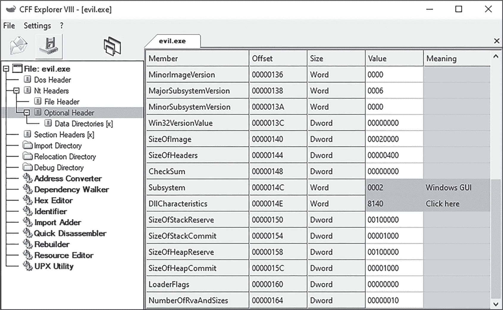

图 3-19: 在 CFF Explorer 中设置文件的 DLL 特性

你可能会从第一章中认识到可选头部分。可选头中的一个字段，DllCharacteristics 字段，包含了可执行文件的一些属性。

接下来，在弹出菜单中，取消勾选**DLL Can Move**旁边的框，如图 3-20 所示。

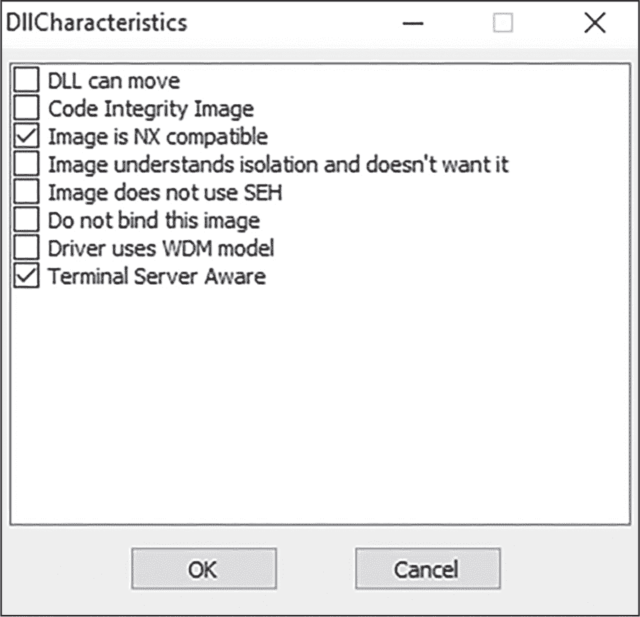

图 3-20: 在 CFF Explorer 中禁用 ASLR

最后，点击**确定**，并记得通过选择**文件****保存**来保存修改过的文件。

##### 运行代码

现在通过选择**文件****打开**将文件加载到 x64dbg 中（更具体地说是 x32dbg，因为这是一个 32 位文件）。完成后，你应该在调试菜单中看到几个用于运行和调试程序的选项（参见图 3-21）。

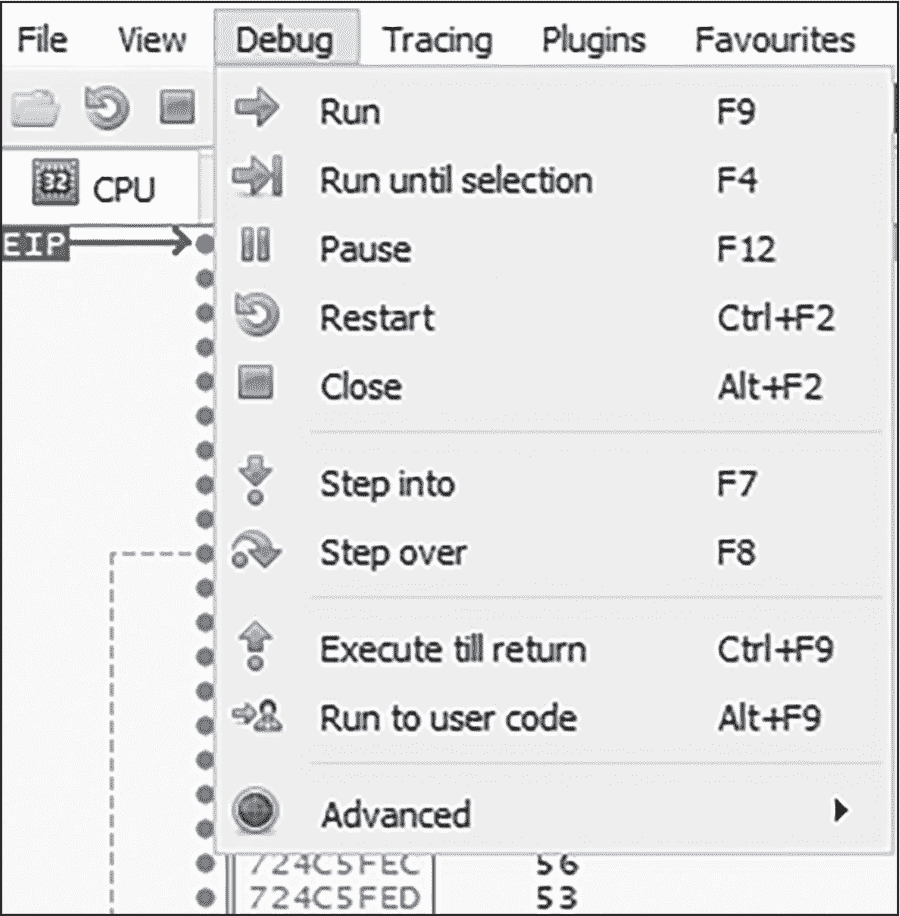

图 3-21：x64dbg 中的调试菜单

让我们按顺序浏览这些选项：

**运行**

运行程序直到某个事件停止代码的执行，例如异常、错误、断点，或者进程终止或退出。

**运行直到选择**

运行程序，直到遇到你手动选择的代码地址。

**逐步进入**

允许你进入即将执行的函数，以便手动调试和检查它。这个选项通常被称为*逐步执行*，并将在本书中频繁讨论。其快捷键是 F7。

**跳过**

允许你跳过一个函数，完全跳过其执行。这是节省时间并跳过你不感兴趣的代码的好方法。

**执行直到返回**

执行程序，直到遇到下一个返回（ret）指令。

**运行到用户代码**

执行程序并在用户代码处断点。这是最有用的调试选项之一，我们稍后会详细讨论。

在“高级”菜单中有更多调试选项。例如，选项“Run (Swallow Exceptions)”强制调试器基本上忽略异常。由于在调试过程中大量异常可能会导致问题（而恶意软件甚至可能故意生成异常来烦扰你！），这个选项可以帮助你节省一些挫败感。

文件加载到调试器中后，必须完成初始化任务，如加载所需的库和其他 Windows 操作系统任务。对于我们的目的，这些步骤不需要关注，而是希望跳过到恶意软件文件的入口点（我们要分析的代码部分）。为此，选择**调试****运行到用户代码**（参见图 3-22）。

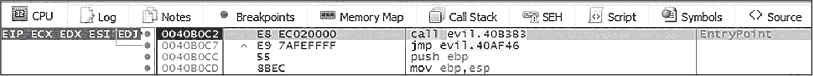

图 3-22：运行到用户代码入口

现在恶意软件已经加载到调试器中，我们可以直接开始执行并逐步调试代码。然而，这通常不是最有效的方法。最好提前明确我们希望在恶意软件中检查的代码部分。在前一节中，我们在 IDA 中发现了一个有趣的地方：InternetOpenUrlW函数。让我们找到并检查这段代码。

##### 使用软件断点

你通过插入特殊的 CPU 指令来设置软件断点，例如INT 3（以十六进制表示为0xCC），这是最常见的断点指令，或者INT 2D（以十六进制表示为0xCD 0x2D）。请记住，创建软件断点会直接修改正在运行程序的代码。大多数良性程序对此不在意并忽略它。然而，一些恶意软件不希望被调试，它们会尝试检测并规避你的断点。

要跳转到执行InternetOpenUrlW函数的代码区域，你可以简单地在该函数调用处设置一个断点。最有效的方法是，在 x64dbg 窗口底部的命令栏中输入以下指令：

```
**bp InternetOpenUrlW**
```

见图 3-23。

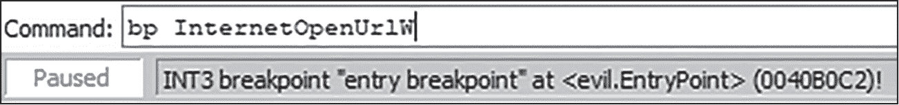

图 3-23：在函数调用上设置断点

接下来，使用**调试****运行**命令（或按键盘上的 F9）执行该样本。这将执行恶意软件并在我们的目标函数InternetOpenUrlW处中断，如图 3-24 所示。


图 3-24：命中断点！

如果你检查参数面板中的参数，你应该能够在堆栈上看到一个完整的 URL（见图 3-25）。

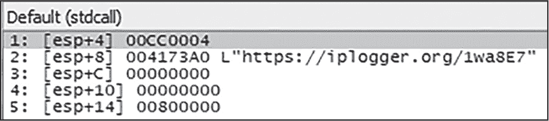

图 3-25：堆栈中的 URL

互联网服务*iplogger.org*可以用来记录和跟踪 IP 地址。恶意软件可能正在使用这个服务来跟踪被该恶意软件样本感染的主机，或获取受害者的 IP 地址。

软件断点不仅限于函数调用；你可以在任何你选择的地址上设置它们。在 x64dbg 的 CPU 面板中，只需右键点击你想设置断点的地址，并选择**断点****切换**（或按 F2）。一旦 CPU 准备执行该地址的指令，调试器将暂停。

##### 设置硬件和内存断点

作为软件断点的替代方案，您可以设置*硬件断点*（由 CPU 本身实现）或*内存断点*（通过内存保护实现）。硬件断点设置并存储在 CPU 寄存器中，具体是 DR0、DR1、DR2 和 DR3 寄存器。当您设置硬件断点时，断点所在的地址会被存储在这些 DR 寄存器中的一个。硬件断点的优点是它们不会直接修改代码，因此侵入性较小，恶意软件较难检测到。它们的主要缺点是，由于 DR 寄存器数量有限，因此一次只能设置四个硬件断点。

内存断点通过修改内存页面的保护属性，实际上会在访问该内存页面时引发异常。这通常是通过修改内存页面的PAGE_GUARD属性来实现的。内存断点对于监视内存中的地址特别有用。例如，如果您在运行时发现了一个有趣的字符串（例如 URL 或文件名），在该字符串的地址上设置内存断点可以帮助您确定恶意软件如何使用该字符串以及使用的位置和方式。内存断点的一个缺点是，由于它们直接修改内存页面的保护属性，可能会干扰程序的操作。具体而言，当程序尝试分配新的内存页面或修改现有页面时，内存断点可能导致程序崩溃。一旦内存断点被触发，该页面的内存保护将被重置为触发断点之前的状态。因此，如果恶意软件在断点触发之前或之后修改了页面的保护，您可能会撤销恶意软件的更改，或者恶意软件可能无意（或故意！）撤销您的断点。在使用内存断点时务必小心。由于硬件和内存断点通常是一起使用的，从现在起，我将使用*硬件断点*这个术语来同时指代两者。

设置正在调试的程序中的硬件断点有多种方法：

+   要在 CPU 窗格中的某个地址设置硬件断点，右键单击该地址，然后点击**断点****执行时设置硬件断点**。

+   在“转储”窗格视图中，选择一个字节来设置断点，右键单击它，然后将鼠标悬停在**断点**上，选择多个选项中的一个。

+   在“内存映射”标签视图中，突出显示您想要设置断点的内存区域。右键单击该区域并选择**内存断点**，然后选择断点选项。

表 3-9 概述了各种类型的硬件和内存断点及其实现方式。

表 3-9： x64dbg 中的硬件断点类型

| 断点类型 | 描述 |
| --- | --- |
| 硬件，访问 | 设置硬件断点以监视访问。当此地址以任何方式（读取、写入或执行）被访问时，断点将被触发。 |
| 硬件，写入 | 设置硬件断点以监视写入。当此地址即将被写入时，断点将被触发。 |
| 硬件，执行 | 设置硬件断点以监视执行。当此地址上的指令即将被执行时，断点将被触发。 |
| 内存，访问 | 设置内存断点以监视访问。当此内存页面以任何方式（读取、写入或执行）被访问时，断点将被触发。 |
| 内存，读取 | 设置内存断点以监视读取。当此内存页面即将被读取时，断点将被触发。 |
| 内存，写入 | 在写入时设置内存断点。当此内存页面即将被写入时，断点将被触发。 |
| 内存，执行 | 设置内存断点以监视执行。当此内存页面中的指令即将被执行时，断点将被触发。 |

需要注意的是，硬件断点可以设置在字节、字或双字上。例如，设置在特定字节上的硬件断点，当访问该字节时会触发异常。对于字和双字，当整个字（2 字节）或双字（4 字节）被访问时，异常将触发。硬件断点还可以设置为两种模式：单次触发和恢复。*单次触发断点*在触发后会被移除，不会再次触发。*恢复断点*会在触发后恢复自己，创建一个持久的断点，如果再次访问特定地址时会再次触发。

特别是在恶意软件分析中，硬件断点通常用于对抗常见的调试器和断点检测技术，以及在手动解包样本时。我们将在第十章和第十七章中特别讨论硬件断点在这一上下文中的应用。

#### 修补和修改代码

*修补*意味着修改或移除程序中的指令。要在 x64dbg 中执行此操作，右键点击你需要修改的代码地址并选择**二进制**，如图 3-26 所示。

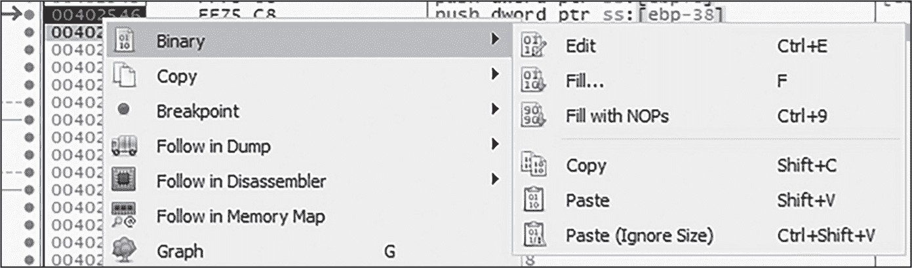

图 3-26：在 x64dbg 中编辑和修补代码

编辑选项允许你修改该地址的代码。用 NOP 填充选项是一个快速清除代码的好方法；它将该内存地址填充为nop指令，实质上告诉程序跳过这部分代码。举个例子，要在当前恶意软件样本中修补对InternetOpenUrlW的调用，你需要高亮显示包含函数调用指令的行（call InternetOpenUrlW），然后用 NOP 填充它。

在这种情况下，通常没有必要修补对InternetOpenUrlW的调用指令（除非你想禁止恶意软件连接到互联网）。然而，通常来说，在运行中的恶意软件样本中修补代码是一种非常强大的绕过反分析和规避技术的方式，并且可以控制恶意软件的执行流程。

#### 通过 API Monitor 跟踪 API 调用

API Monitor（[*http://<wbr>www<wbr>.rohitab<wbr>.com<wbr>/downloads*](http://www.rohitab.com/downloads)）是一个很好的调试工具，可以添加到你的工具箱中，因为它允许你跟踪和监控恶意软件的 API 函数调用。它还允许你在特定的函数上设置断点，因此它也充当一个基本的调试器。

你可以在 API Monitor 窗口左上角的 API 过滤器窗口中选择你想要跟踪的 API 和函数，如图 3-27 所示。

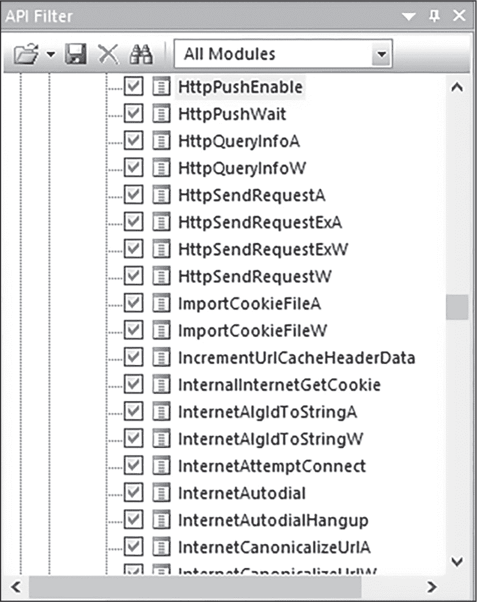

图 3-27：API Monitor 中的 API 过滤器菜单

在这里，我选择了*Wininet.dll*库下的所有与互联网和网络相关的函数。

要监控一个新的进程，请点击 API Monitor 窗口中间的**监控新进程**按钮，然后选择你想分析的恶意软件可执行文件。默认选项已经足够好，因此点击**确定**（参见图 3-28）。

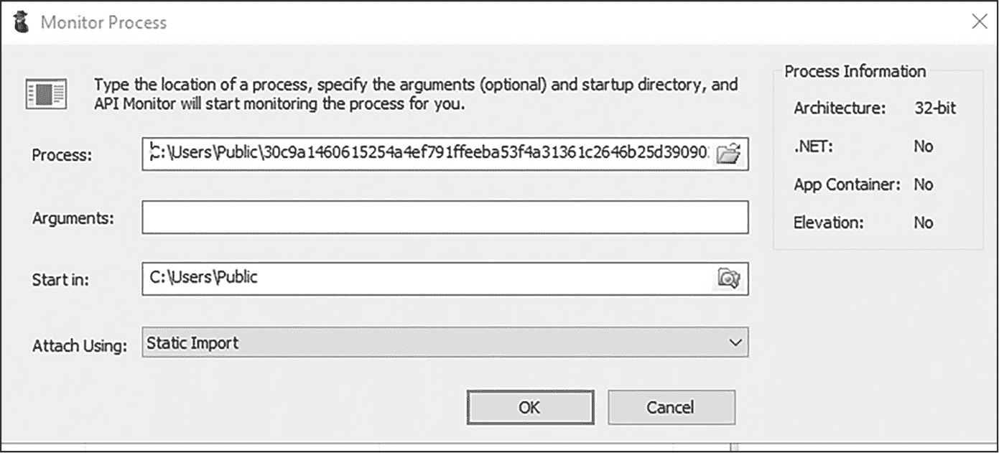

图 3-28：在 API Monitor 中监控新进程

在恶意软件执行并运行几分钟后，一些 API 调用将开始出现在摘要窗口中，正如你在图 3-29 中看到的那样。


图 3-29：API Monitor 中的 API 调用列表

你可能会从我们之前在 x64dbg 中的分析中认出一些这些调用。API Monitor 的强大之处在于，它可以让你快速查看你感兴趣的函数调用，以及它们的参数和返回值。这对于快速了解恶意软件样本的功能，或者监视和追踪可疑行为极为有价值。

### 总结

在本章中，你学习了汇编代码的基础知识，并高层次地探索了静态和动态代码分析过程，包括反汇编器和调试器的作用。在典型场景中，你会使用静态代码分析来识别并分析值得进一步调查的代码，然后使用调试器进行动态代码分析。在逆向工程恶意软件时，频繁切换静态和动态代码分析有助于全面理解你正在调查的代码。

本章总结了恶意软件分析的基础主题。在接下来的几章中，我们将开始深入研究如何规避的恶意软件能够检测虚拟机、沙盒以及分析师用来调查恶意软件内部的工具。
